## **4

**数据处理**

开发一个合适的数据集是构建成功机器学习模型最重要的部分。机器学习模型的成败取决于“垃圾进，垃圾出”这一原则。正如你在第一章中看到的，模型使用训练数据来调整自己，以解决问题。如果训练数据不能很好地代表模型实际应用时将接收到的数据，我们就不能指望模型表现得很好。在本章中，我们将学习如何创建一个能代表模型在实际应用中遇到的数据的好数据集。

### 类别与标签

在本书中，我们探讨的是*分类*：我们正在构建将事物划分为离散类别或*类*的模型，比如狗的品种、花的种类、数字等。为了表示类别，我们为训练集中的每个输入赋予一个标识符，称为*标签*。标签可以是“边境牧羊犬”这个字符串，或者更好的是像 0 或 1 这样的数字。

模型不知道它们的输入代表什么。它们不在乎输入是边境牧羊犬的照片，还是谷歌股票的价值。对模型来说，这一切都是数字。标签也是如此。因为输入的标签对模型没有内在意义，所以我们可以根据需要以任何方式表示类别。在实践中，类别标签通常是从 0 开始的整数。所以，如果有 10 个类别，类别标签就是 0、1、2、……、9。在第五章中，我们将使用一个包含 10 个类别的数据集，代表不同现实世界物体的图像。我们只需将它们映射到整数，如表 4-1 所示。

**表 4-1：** 用整数标记类别：0、1、2、……

| **标签** | **实际类别** |
| --- | --- |
| 0 | 飞机 |
| 1 | 汽车 |
| 2 | 鸟 |
| 3 | 猫 |
| 4 | 鹿 |
| 5 | 狗 |
| 6 | 青蛙 |
| 7 | 马 |
| 8 | 船 |
| 9 | 卡车 |

通过这种标记，每个狗的训练输入被标记为 5，而每个卡车的输入被标记为 9。但我们到底在标记什么呢？在下一节中，我们将介绍特征和特征向量，它们是机器学习的核心。

### 特征与特征向量

机器学习模型将*特征*作为输入，在分类器的情况下输出一个标签。那么，这些特征是什么，来自哪里？

对于大多数模型来说，特征是数字。这些数字代表什么，取决于当前任务。如果我们希望根据花卉的物理属性测量来识别花卉，那么我们的特征就是这些测量值。如果我们希望使用医学样本中细胞的尺寸来预测肿瘤是否是乳腺癌，那么特征就是这些尺寸。使用现代技术时，特征可能是图像的像素（数字），或声音的频率（数字），甚至是相机陷阱在两周内记录到的狐狸数量（数字）。

所以，特征就是我们想要作为输入使用的任何数字。训练模型的目标是让它学习输入特征和输出标签之间的关系。我们假设在训练模型之前，输入特征和输出标签之间就存在某种关系。如果模型无法训练，那么可能是因为没有可以学习的关系。

在训练后，将具有未知类别标签的特征向量输入模型，模型的输出将基于训练过程中发现的关系预测类别标签。如果模型反复做出错误预测，一个可能的原因是所选特征无法充分捕捉到这种关系。在我们深入讨论什么是好的特征之前，让我们先仔细看一下这些特征本身。

#### 特征类型

总结一下，特征是表示某些已测量或已知事物的数字，*特征向量*是这些数字的集合，作为模型的输入。有不同类型的数字可以作为特征，正如你将看到的，它们并非都一样。你有时需要在将它们输入模型之前进行一些操作。

##### 浮动点数

在第五章中，我们将构建一个历史花卉数据集。该数据集的特征是花卉的实际测量值，如花萼的宽度和高度（以厘米为单位）。一个典型的测量值可能是 2.33 厘米。这是一个*浮动点*数——一个带有小数点的数字，或者如果你记得高中数学课程的话，它是一个*实数*。大多数模型希望处理浮动点数，因此你可以直接使用这些测量值。浮动点数是*连续*的，这意味着在一个整数和下一个整数之间存在无限多个值，因此它们之间有平滑的过渡。正如我们稍后将看到的，某些模型期望连续值。

##### 间隔值

然而，浮动点数并不适用于所有情况。显然，花朵不可能有 10.14 片花瓣，尽管它们可能有 9、10 或 11 片花瓣。这些数字是*整数*：没有小数部分或小数点的整数。与浮动点数不同，它们是*离散*的，这意味着它们只选取某些特定的值，并且中间会留有空隙。幸运的是，整数只是特殊的实数，因此模型可以直接使用它们。

在我们的花瓣示例中，9、10 和 11 之间的差异是有意义的，因为 11 大于 10，10 又大于 9。不仅如此，11 比 10 大的方式正好与 10 比 9 大的方式相同。这些值之间的差异或间隔是相同的：1。这个值称为*间隔*值。

图像中的像素是区间值，因为它们表示某些测量设备（如相机或 MRI 机器）对某些物理过程（如可见光的强度和颜色，或组织中自由水分子中的氢原子数）的（假定为线性）响应。关键点是，如果值 *x* 是值 *y* 序列中的下一个数字，且值 *z* 是值 *y* 之前的数字，则 *x* 和 *y* 之间的差异与 *y* 和 *z* 之间的差异是相同的。

##### 有序值

有时，值之间的间隔并不相同。例如，一些模型使用一个人的教育水平来预测他们是否会违约。如果我们通过计算一个人的受教育年限来编码他们的教育水平，我们可以安全地使用它，因为 10 年受教育和 8 年受教育之间的差距与 8 年受教育和 6 年受教育之间的差距是相同的。然而，如果我们仅仅将 1 分配给“完成高中”，将 2 分配给“有本科学位”，将 3 分配给“有博士学位或其他专业学位”，我们可能会遇到问题；虽然 3 > 2 > 1 是对的，但对于我们的模型来说，3 和 2 以及 2 和 1 之间的差异并不相同。像这样的特征被称为*有序*，因为它们表示一种排序，但值之间的差异不一定总是相同的。

##### 分类值

有时我们使用数字作为代码。例如，我们可能将性别编码为 0 表示男性，1 表示女性。在这种情况下，1 不被理解为大于 0 或小于 0，因此这些不是区间值或有序值。相反，这些是*分类*值。它们表示一个类别，但没有说明类别之间的任何关系。

另一个常见的例子，或许与分类花卉相关，是颜色。我们可以用 0 表示红色，1 表示绿色，2 表示蓝色。同样地，在这种情况下，0、1 或 2 之间没有任何关系。这并不意味着我们不能在模型中使用分类特征，但这确实意味着我们通常不能直接使用它们，因为大多数机器学习模型至少需要有序的（如果不是区间型）数字。

我们可以通过使用以下技巧将分类值至少转化为有序值。如果我们想将一个人的性别作为输入，而不是将 0 赋给男性、1 赋给女性，我们可以创建一个由两个元素组成的向量，每个元素对应一个可能性。向量中的第一个数字将指示输入是否为男性，通过表示 0（意味着不是男性）或 1（意味着是男性）。第二个数字将指示是否为女性。我们将分类值映射到一个二进制向量，如表 4-2 所示。

**表 4-2：** 将类别表示为向量

| **分类值** |  | **向量表示** |
| --- | --- | --- |
| 0 | → | 1 0 |
| 1 | → | 0 1 |

在“是否为男性”这一特征中，0 的值比 1 的值更具有实际意义，这符合有序值（ordinal value）的定义。我们为此付出的代价是增加特征向量的维度，因为我们需要为每一个可能的类别值分配一个特征。例如，如果有五种颜色，我们需要一个五元素的向量；如果有五千种颜色，则需要一个五千元素的向量。

要使用这种方案，类别必须是互斥的，意味着每一行中只有一个 1。由于每行中始终只有一个非零值，这种方法有时被称为*独热编码（one-hot encoding）*。

#### 特征选择与维度灾难

本节讨论的是*特征选择*，即选择在特征向量中使用哪些特征，以及为什么不应包含不需要的特征。这里有一个好的经验法则：特征向量应仅包含能够捕捉数据中有助于模型推广到新数据的方面的特征。

换句话说，特征应该捕捉到有助于模型区分不同类别的数据方面。不可能更加明确地说明这一点，因为最佳特征的集合总是特定于数据集的，事先无法知晓。但这并不意味着我们不能说一些有助于引导我们朝着合适的特征选择方向前进的话，无论我们在处理哪个数据集。

像许多机器学习中的问题一样，选择特征也需要权衡。我们需要足够的特征来捕捉数据中的所有相关部分，以便模型能够从中学习，但如果特征过多，我们就会陷入*维度灾难（curse of dimensionality）*。

为了说明这意味着什么，让我们看一个例子。假设我们的特征值都限制在 0,1) 范围内。这不是打字错误；我们使用的是区间表示法，其中方括号表示边界值包含在范围内，而圆括号表示边界值不包含在范围内。所以这里 0 是允许的，但 1 不允许。我们还假设我们的特征向量是二维或三维的。这样，我们可以将每个特征向量作为一个点绘制在二维或三维空间中。最后，我们将通过从 [0,1) 范围内随机选择特征向量（二维或三维）来模拟数据集。

假设样本数固定为 100。如果我们有两个特征，或者是二维空间，我们可以将 100 个随机选择的二维向量表示为 [图 4-1 上方的形式。现在，如果我们有三个特征，或者是三维空间，那么这 100 个特征看起来就像 图 4-1 下方的形式。

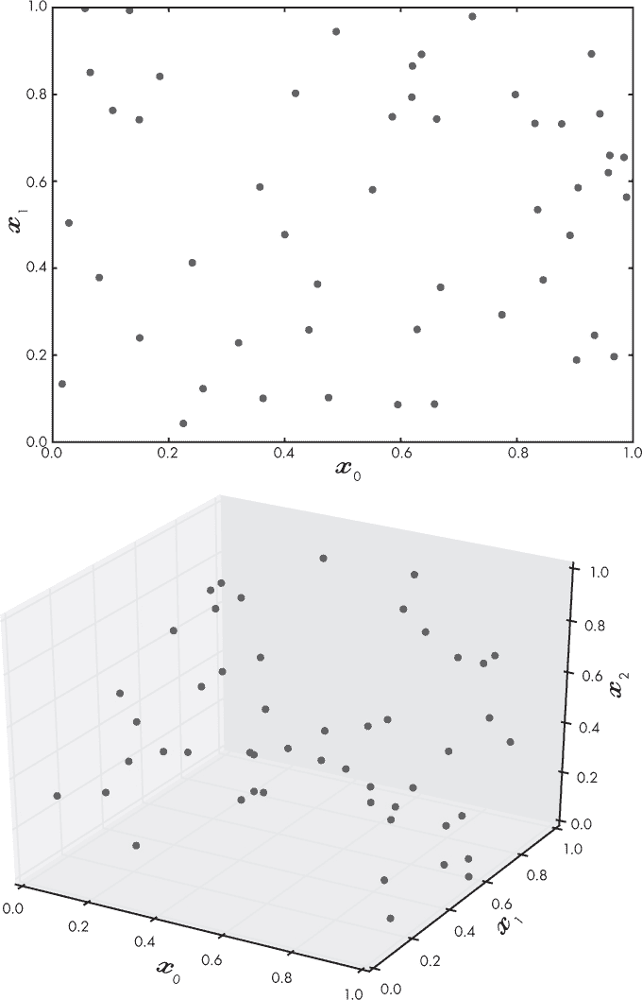

*图 4-1：二维空间中 100 个随机样本（上）和三维空间中 100 个随机样本（下）*

由于我们假设特征向量可以来自 2D 或 3D 空间的任何位置，因此我们希望我们的数据集能够尽可能多地从这个空间中采样，以便它能很好地代表这个空间。我们可以通过将每个轴分成 10 个等分来衡量 100 个点填充空间的效果。我们称这些分段为 *bins*。在 2D 空间中，我们将得到 100 个 bins，因为它有两个轴（10 × 10）；而在 3D 空间中，我们将得到 1,000 个 bins，因为它有三个轴（10 × 10 × 10）。现在，如果我们统计至少有一个点占据的 bins 数量，并将这个数量除以总的 bins 数量，我们就能得到占据的 bins 的比例。

这样计算得到 2D 空间的占据率为 0.410（最大为 1.0），3D 空间为 0.048。这意味着 100 个样本能够大约填充一半的 2D 特征空间。还不错！但是 100 个样本在 3D 特征空间中只填充了大约 5% 的空间。为了使 3D 空间的填充率与 2D 空间相同，我们需要大约 1,000 个样本——也就是我们现有样本的 10 倍。这个普遍规律随着维度的增加而适用：一个 4D 特征空间需要大约 10,000 个样本，而一个 10D 特征空间需要大约 10,000,000,000 个样本！随着特征数量的增加，为了得到一个代表性的特征空间采样，我们需要的训练数据量急剧增加，约为 10^(*d*)，其中 *d* 是维度的数量。这就是 *维度灾难*，它曾经是机器学习的噩梦。幸运的是，现代深度学习已经克服了这一困境，但在处理传统模型时，这一问题依然存在，就像我们将在第六章中探讨的那样。

例如，计算机上典型的彩色图像可能有 1,024 个像素，每个像素需要 3 个字节来指定红色、绿色和蓝色的混合。如果我们想将这张图像作为输入传递给模型，我们需要一个特征向量，*d* = 1024 × 1024 × 3 = 3,145,728 个元素。这意味着我们需要大约 10^(3,145,728) 个样本来填充我们的特征空间。显然，这是不可能的。我们将在第十二章中看到如何通过使用卷积神经网络来克服这一困境。

现在我们了解了类别、特征和特征向量，让我们来描述一下什么是一个好的数据集。

### 好数据集的特征

数据集就是一切。这一点并不夸张，因为我们是从数据集中构建模型的。模型有参数——无论是神经网络的权重和偏置，还是在朴素贝叶斯模型中每个特征出现的概率，或者是最近邻模型中的训练数据本身。参数是我们用训练数据来求解的内容：它们编码了模型的知识，并通过训练算法进行学习。

让我们稍微退后一点，定义一下在本书中将要使用的术语*数据集*。直观上，我们理解什么是数据集，但我们需要更科学地定义它：数据集是由一对对值组成的集合，{*X,Y*}，其中 *X* 是模型的*输入*，*Y* 是标签。这里的 *X* 是我们测量并组合在一起的一些值，比如花朵部位的长度和宽度，而 *Y* 是我们希望教会模型告诉我们的东西，比如这些数据最好代表哪种花或哪种动物。

对于*监督学习*，我们充当老师，模型则充当学生。我们通过一个接一个地呈现示例来教学生，就像我们教小孩子看图画书一样，比如“这是猫”和“这是狗”。在这种情况下，*数据集*是一个示例集合，*训练*是将这些示例反复展示给模型，直到模型“明白”为止——也就是，直到模型的参数被调节到最小化在特定数据集上的误差。这就是机器学习中的学习部分。

#### 插值与外推

*插值*是指在已知范围内进行估算的过程。而*外推*发生在我们使用已有的数据来估算已知范围之外的值。一般来说，当我们的模型在某种程度上进行插值时，它的准确性更高，这意味着我们需要一个数据集，它能够全面地代表所有可能作为模型输入的值的范围。

作为一个例子，看看 1910 年到 1960 年间的世界人口（单位：十亿）数据（表 4-3）。我们在已知的范围内（1910 年到 1960 年）每 10 年有一组数据。

**表 4-3：** 按十年划分的世界人口

| **年份** | **人口（十亿）** |
| --- | --- |
| 1910 | 1.750 |
| 1920 | 1.860 |
| 1930 | 2.070 |
| 1940 | 2.300 |
| 1950 | 2.557 |
| 1960 | 3.042 |

如果我们找到一条“最佳拟合”线来绘制这些数据，我们可以利用这条线作为模型来预测值。这就是*线性回归*，它允许我们估算任何我们选择年份的人口。我们将跳过实际拟合的过程（你可以通过在线工具轻松完成），直接进入模型：

*p* = 0.02509*y* – 46.28

对于任何一年，*y*，我们都可以估算出人口*P*。1952 年的世界人口是多少？我们的表格中没有 1952 年的实际数据，但通过模型我们可以这样估算：

*p* = 0.02509(1952) – 46.28 = 2.696 十亿

通过查看 1952 年实际的世界人口数据，我们知道它是 26.37 亿，所以我们估算的 26.96 亿只有大约 6000 万的误差。看来这个模型还不错！

在使用该模型估算 1952 年世界人口时，我们进行了插值。我们为一个在已知数据点之间的值进行了估算，而模型给出了一个不错的结果。另一方面，外推是指超出已知数据范围进行估算，即在数据之外进行测量。

让我们用我们的模型来估算 2000 年的世界人口，距离我们用来构建模型的数据结束 40 年：

*p* = 0.02509(2000) – 46.28 = 39.00 亿

根据模型，它应该接近 39 亿，但我们从实际数据中知道，2000 年世界人口是 60.89 亿。我们的模型差了超过 20 亿人。发生这种情况是因为我们将模型应用于它不适合处理的输入。如果我们仍然在模型“训练”过的输入范围内，也就是 1910 到 1960 年的数据，那么模型的表现足够好。然而，一旦超出模型的训练范围，它就会崩溃，因为它假设了我们并不掌握的知识。

当我们进行插值时，模型会看到与它在训练中看到的例子相似的样本。也许并不奇怪的是，在这些例子上，它的表现会比我们进行外推并要求模型超越其训练范围时要好。

在分类时，拥有全面的训练数据是至关重要的。假设我们正在训练一个模型来识别犬种。在我们的数据集中，我们有数百张经典黑白相间的边境牧羊犬的图片，就像图 4-2 左侧的那只。如果我们接着给模型一张新的经典边境牧羊犬图片，我们希望能够得到正确的标签：“边境牧羊犬”。这就类似于让模型进行插值：它正在处理一些它以前见过的东西，因为训练数据中的“边境牧羊犬”标签包含了许多经典边境牧羊犬的例子。

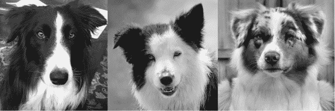

*图 4-2：一只具有经典标记的边境牧羊犬（左），一只具有肝色标记的边境牧羊犬（中），一只澳大利亚牧羊犬（右）*

然而，并不是每只边境牧羊犬都有典型的边境牧羊犬标记。有些狗的标记像图 4-2 中间的牧羊犬。由于我们在训练集中没有包括这样的图片，模型现在必须尝试超越它的训练内容，并为它所接受训练的类别实例提供正确的输出标签，尽管它没有接受过这种类型的训练。它可能会失败，给出类似“澳大利亚牧羊犬”的错误输出，正如图 4-2 右侧所示，澳大利亚牧羊犬与边境牧羊犬相似。

然而，需要记住的关键概念是，数据集必须涵盖模型在预测未知输入标签时所看到的类别*内部*的所有变化范围。

#### 父分布

数据集必须代表它所建模的类别。这个观点中隐含了一个假设，即我们的数据有一个*父分布*，即一个未知的数据生成器，它创造了我们所使用的特定数据集。

参考一下哲学中的这一类比。古希腊哲学家柏拉图使用了理想的概念。在他看来，某个地方“外面”有一个理想的椅子，所有现存的椅子都是该理想椅子的或多或少完美的复制品。这就是我们所说的数据集、复制品与父分布（理想生成器）之间的关系。我们希望数据集能够作为理想的一个表现。

我们可以把数据集看作是来自某个未知过程的样本，这个过程根据父分布生成数据。它生成的数据类型——特征的值和范围——将遵循某种未知的统计规则。例如，当你掷骰子时，六个值在长时间内是等概率出现的。我们称这种分布为*均匀父分布*。如果你绘制一张柱状图，显示每个值出现的次数，随着你多次掷骰子，你会得到一条（或多或少）水平的线，因为每个值出现的概率是相等的。当我们测量成年人身高时，我们看到的是不同的分布。身高的分布呈现两峰形态，一峰集中在男性平均身高附近，另一峰则集中在女性平均身高附近。

父分布是生成这种整体形状的来源。训练数据、测试数据以及你给模型做决策的数据都必须来自同一个父分布。这是模型的一个基本假设，也不应该让我们感到太惊讶。不过，有时很容易混淆，训练时使用的是一个父分布的数据，而测试或使用模型时则使用来自不同父分布的数据。（如何在一个父分布上训练模型，并在不同分布的数据上使用这个模型，正是目前一个非常活跃的研究领域。你可以搜索“领域适应”。）

#### 先验类别概率

*先验类别概率*是数据集中每个类别在自然界中出现的概率。

一般来说，我们希望数据集能够匹配类别的先验概率。如果类别 A 出现的概率是 85%，类别 B 只有 15%，那么我们希望在训练集里类别 A 出现 85%的时间，类别 B 出现 15%的时间。

然而，存在一些例外。例如，假设我们希望模型学习的某个类别是稀有的，在每 10,000 个输入中只出现一次。如果我们让数据集严格遵循实际的先验概率，模型可能无法看到足够的稀有类别示例，从而无法学到关于它的有用信息。更糟糕的是，如果这个稀有类别正是我们最感兴趣的类别呢？

例如，假设我们正在构建一个能够定位四叶草的机器人。我们假设我们已经知道输入给模型的是一株草，只是想知道它是三叶草还是四叶草。我们知道，大约每 5000 株草中就有一株是四叶草。构建一个包含每一株四叶草对应 5000 株三叶草的数据集似乎是合理的，直到我们意识到，一个简单地认为每个输入都是三叶草的模型，平均来说，5000 次中有 4999 次是正确的！它将是一个极其准确但完全无用的模型，因为它从未找出我们感兴趣的类别。

相反，我们可能会使用三叶草和四叶草的 10:1 比例。或者，在训练模型时，我们可能先使用相同数量的三叶草和四叶草，然后在训练一段时间后，调整为越来越接近实际先验概率的混合比例。这个技巧并不是所有模型类型都适用，但它对于神经网络是有效的。为什么这个技巧有效尚不完全明了，但直觉上，我们可以想象，网络首先学习的是三叶草和四叶草之间的视觉差异，然后随着比例逐渐接近实际的先验概率，网络开始学习到遇到四叶草的实际可能性。

实际上，使用这个技巧是因为它通常能产生表现更好的模型。对于大部分机器学习，尤其是深度学习，经验技巧和技术通常远远领先于任何理论的支持。“它就是效果更好；这就是为什么”仍然是一个有效的答案，尽管最终令人不满足，但它回答了关于为什么某种方法能很好地工作的许多问题。

如何处理不平衡数据是研究界仍在积极探讨的问题。有些人选择从更加平衡的类别比例开始；另一些人使用数据增强（见第五章）来增加来自少数类别的样本数量。

#### 混淆者

我们说过，数据集中需要包含反映我们想要学习的类别中所有自然变化的示例。这确实是对的，但有时特别重要的是，包括那些与我们某一类或多类相似，但实际上并不属于该类别的训练样本。

考虑两个模型。第一个模型学习的是狗和猫的图像之间的区别。第二个模型学习的是狗和非狗图像之间的区别。第一个模型很容易。输入要么是狗，要么是猫，模型通过狗和猫的图像进行训练。然而，第二个模型就比较困难了。显然，我们需要狗的图像进行训练。那么，"非狗"的图像应该是什么呢？结合前面的讨论，我们应该开始直觉地意识到，我们需要的是覆盖模型在实际中将看到的图像空间的图像。

我们可以更进一步。如果我们想区分狗和非狗，我们应该确保在训练时将狼纳入“非狗”类别。如果我们不这么做，模型在遇到狼时可能无法学会足够的区分特征，可能会返回“狗”的分类。如果我们通过使用数百张“非狗”图片（全是企鹅和鹦鹉的照片）来构建数据集，那么如果模型最终把狼当成狗来分类，我们还会感到惊讶吗？

通常情况下，我们需要确保数据集包含*困惑者*或*硬负样本*——这些示例与其他类别足够相似，容易被误分类，但并不属于该类别。困惑者为模型提供了学习类别更精确特征的机会。硬负样本在区分某个类别和其他所有类别时尤为有用，正如“狗”与“非狗”之间的区分。

#### 数据集大小

到目前为止，我们谈论了在数据集中应该包含什么样的数据，但我们需要多少数据呢？“所有数据”是一个诱人的调皮答案。为了让我们的模型尽可能精确，我们应该使用尽可能多的示例。但实际上，获取所有数据几乎是不可能的。

选择数据集的大小意味着需要在准确性和获取数据所花费的时间和精力之间做权衡。获取数据可能既昂贵又缓慢，或者，正如我们在三叶草的例子中看到的那样，有时候数据集中的关键类别稀少且不常遇到。由于标注数据通常昂贵且获取缓慢，我们应该在开始之前就对需要多少数据有一定的了解。

不幸的是，事实是没有一个公式能回答“多少数据足够”这个问题。数据的边际效益会随着数据量的增加而递减。从 100 个样本到 1000 个样本，可能会显著提高模型的准确性，但从 1000 个样本增加到 10000 个样本，可能只会略微提高准确性。提高的准确性需要与获取额外 9000 个训练样本的努力和费用进行平衡。

另一个需要考虑的因素是模型本身。模型有一个*容量*，决定了它能够支持的复杂度，与可用的训练数据量相关。模型的容量与其参数数量直接相关。一个拥有更多参数的大模型需要大量的训练数据，才能找到适当的参数设置。尽管通常来说，训练样本的数量应该大于模型参数的数量，但在数据量少于参数数量的情况下，深度学习仍然能很好地工作。例如，如果各个类别之间差异非常大——比如建筑与橘子——而且我们容易分辨差异，模型可能也会很快学习到这些差异，因此我们可以使用较少的训练样本。另一方面，如果我们要区分狼和哈士奇，我们可能需要更多的数据。在第五章中，我们会讨论当训练数据不多时该怎么办，但这些技巧并不能替代增加更多数据的做法。

对于“需要多少数据”这个问题，唯一正确的答案是“所有数据”。在问题的约束条件下，尽可能多地获取数据：成本、时间、稀缺性等等。

### 数据准备

在我们继续构建实际数据集之前，我们需要讨论你可能在将数据集输入模型之前遇到的两种情况：如何缩放特征，以及如果某个特征值缺失应该怎么办。

#### 特征缩放

由一组不同特征构成的特征向量可能具有多种范围。有些特征可能会有较大的值范围，比如从-1000 到 1000，而另一些则可能限制在 0 到 1 之间。当发生这种情况时，一些模型可能会表现不佳，因为某个特征由于其值范围过大而主导了其他特征。此外，一些模型类型在特征的平均值接近 0 时效果最好。

解决这些问题的方法是缩放。我们暂时假设特征向量中的每个特征都是连续的。我们将使用一个假数据集，包含五个特征和 15 个样本。这意味着我们的数据集有 15 个样本——特征向量及其标签——每个特征向量有五个元素。我们假设有三个类别。数据集的样子可以参考表格 4-4。

**表格 4-4：** 假设数据集

| **样本** | ***x*[0]** | ***x*[1]** | ***x*[2]** | ***x*[3]** | ***x*[4]** | **标签** |
| --- | --- | --- | --- | --- | --- | --- |
| *0* | 6998 | 0.1361 | 0.3408 | 0.00007350 | 78596048 | 0 |
| *1* | 6580 | 0.4908 | 3.0150 | 0.00004484 | 38462706 | 1 |
| *2* | 7563 | 0.9349 | 4.3465 | 0.00001003 | 6700340 | 2 |
| *3* | 8355 | 0.6529 | 2.1271 | 0.00002966 | 51430391 | 0 |
| *4* | 2393 | 0.4605 | 2.7561 | 0.00003395 | 27284192 | 0 |
| *5* | 9498 | 0.0244 | 2.7887 | 0.00008880 | 78543394 | 2 |
| *6* | 4030 | 0.6467 | 4.8231 | 0.00000403 | 19101443 | 2 |
| *7* | 5275 | 0.3560 | 0.0705 | 0.00000899 | 96029352 | 0 |
| *8* | 8094 | 0.7979 | 3.9897 | 0.00006691 | 7307156 | 1 |
| *9* | 843 | 0.7892 | 0.9804 | 0.00005798 | 10179751 | 1 |
| *10* | 1221 | 0.9564 | 2.3944 | 0.00007815 | 14241835 | 0 |
| *11* | 5879 | 0.0329 | 2.0085 | 0.00009564 | 34243070 | 2 |
| *12* | 923 | 0.4159 | 1.7821 | 0.00002467 | 52404615 | 1 |
| *13* | 5882 | 0.0002 | 1.5362 | 0.00005066 | 18728752 | 2 |
| *14* | 1796 | 0.7247 | 2.3190 | 0.00001332 | 96703562 | 1 |

由于这是本书中讲解的第一个数据集，我们将详细讲解它，介绍一些符号并弄清楚每一部分的含义。表 4-4 中的第一列是样本编号。样本是一个输入，在本例中是由五个特征组成的特征向量。注意编号从 0 开始。由于我们将使用 Python 数组（NumPy 数组）处理数据，我们将在所有情况下从 0 开始计数。

下一五列是每个样本的特征，标记为 *x*[0] 到 *x*[4]，索引从 0 开始。最后一列是类别标签。由于有三类，标签从 0 到 2。类别 0 有五个样本，类别 1 有五个样本，类别 2 有五个样本。因此，这是一个小而平衡的数据集；每个类别的先验概率为 33%，理想情况下应该接近现实中各类出现的先验概率。

如果我们有一个模型，那么每一行都将是一个输入。用 {*x*[0], *x*[1], *x*[2], *x*[3], *x*[4]} 来表示这些特征很繁琐，因此，当我们要引用完整的特征向量时，我们将使用大写字母。例如，我们会将数据集 *X* 中的样本 2 称为 *X*[2]。我们有时还会使用矩阵——二维数字数组——这些矩阵也用大写字母标记，以提高清晰度。当我们想引用单一特征时，我们会使用带下标的小写字母，例如 *x*[3]。

让我们来看看特征的范围。每个特征的最小值、最大值和范围（最大值与最小值的差）在 表 4-5 中显示。

**表 4-5：** 表 4-4 中各特征的最小值、最大值和范围

| **特征** | **最小值** | **最大值** | **范围** |
| --- | --- | --- | --- |
| *x*[0] | 843.0 | 9498.0 | 8655.0 |
| *x*[1] | 0.0002 | 0.9564 | 0.9562 |
| *x*[2] | 0.0705 | 4.8231 | 4.7526 |
| *x*[3] | 4.03e-06 | 9.564e-05 | 9.161e-05 |
| *x*[4] | 6700340.0 | 96703562.0 | 90003222.0 |

注意使用计算机表示法，如 9.161e-05。这是计算机表示科学记数法的方式：9.161 × 10^(*–*5) = 0.00009161。还要注意，每个特征的范围差异很大。由于这个原因，我们需要对特征进行缩放，使它们的范围更加相似。缩放是训练模型前的一个有效步骤，只要对所有新的输入都采用相同的缩放方式。

##### 均值中心化

最简单的缩放方法是 *均值中心化*。这很容易做到：从每个特征中，简单地减去该特征在整个数据集中的均值。值的均值 *x*[*i*] *i* = 0, 1, 2, … 就是每个值的总和除以值的数量：

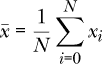

特征 *x*[0] 的均值是 5022，因此为了对 *x*[0] 进行中心化，我们将每个值替换为：

*x[i]* ← *x[i]* – 5022, *i* = 0, 1, 2, . . .

在这种情况下，*i* 索引是跨样本的，而不是特征向量的其他元素。

对其他特征的均值执行上述步骤，将使整个数据集居中。结果是，每个特征在数据集中的均值现在是 0，也就是说，特征值本身都在 0 的上下范围内。对于深度学习，均值中心化通常是通过从每个输入图像中减去均值图像来完成的。

##### 将标准差改为 1

均值中心化有帮助，但值围绕 0 的分布与均值被减去之前保持一致。我们所做的只是将数据向 0 方向平移。围绕均值的值的分布有一个正式的名称：它叫做 *标准差*，它的计算方式是数据值与均值之间的平均差值：

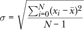

字母 *σ*（sigma）是数学中常用来表示标准差的符号。你不需要记住这个公式，它只是用来告诉我们如何计算数据相对于均值的分布或范围的度量。

均值中心化将 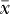 改为 0，但不会改变 *σ*。有时我们希望更进一步，除了进行均值中心化外，还希望改变数据的分布，使得所有特征的范围相同，也就是说每个特征的标准差为 1。幸运的是，这个操作是很直接的。我们将每个特征值 *x* 替换为

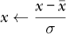

其中  和 *σ* 是数据集中每个特征的均值和标准差。例如，前面的玩具数据集可以存储为 2D NumPy 数组

x = [

[6998, 0.1361, 0.3408, 0.00007350, 78596048],

[6580, 0.4908, 3.0150, 0.00004484, 38462706],

[7563, 0.9349, 4.3465, 0.00001003, 6700340],

[8355, 0.6529, 2.1271, 0.00002966, 51430391],

[2393, 0.4605, 2.7561, 0.00003395, 27284192],

[9498, 0.0244, 2.7887, 0.00008880, 78543394],

[4030, 0.6467, 4.8231, 0.00000403, 19101443],

[5275, 0.3560, 0.0705, 0.00000899, 96029352],

[8094, 0.7979, 3.9897, 0.00006691, 7307156],

[843, 0.7892, 0.9804, 0.00005798, 10179751],

[1221, 0.9564, 2.3944, 0.00007815, 14241835],

[5879, 0.0329, 2.0085, 0.00009564, 34243070],

[923, 0.4159, 1.7821, 0.00002467, 52404615],

[5882, 0.0002, 1.5362, 0.00005066, 18728752],

[1796, 0.7247, 2.3190, 0.00001332, 96703562],

]

这样整个数据集就可以用一行代码处理：

x = (x - x.mean(axis=0)) / x.std(axis=0)

这种方法叫做*标准化*或*归一化*，你应该对大多数数据集进行此操作，尤其是当使用第六章中讨论的传统模型时。尽可能地，将数据集标准化，使得特征的均值为 0，标准差为 1。

如果我们对前面的数据集进行标准化，它会是什么样子呢？对每个特征，减去该特征的均值，再除以标准差，得到的是一个新的数据集（表 4-6）。在这里，我们将数字缩短到四位小数进行显示，并且省略了标签。

**表 4-6：** 表 4-4 中的数据标准化

| **样本** | ***x*[0]** | ***x*[1]** | ***x*[2]** | ***x*[3]** | ***x*[4]** |
| --- | --- | --- | --- | --- | --- |
| *0* | 0.6930 | –1.1259 | –1.5318 | 0.9525 | 1.1824 |
| *1* | 0.5464 | –0.0120 | 0.5051 | –0.0192 | –0.1141 |
| *2* | 0.8912 | 1.3826 | 1.5193 | –1.1996 | –1.1403 |
| *3* | 1.1690 | 0.4970 | –0.1712 | –0.5340 | 0.3047 |
| *4* | –0.9221 | –0.1071 | 0.3079 | –0.3885 | –0.4753 |
| *5* | 1.5699 | –1.4767 | 0.3327 | 1.4714 | 1.1807 |
| *6* | –0.3479 | 0.4775 | 1.8823 | –1.4031 | –0.7396 |
| *7* | 0.0887 | –0.4353 | –1.7377 | –1.2349 | 1.7456 |
| *8* | 1.0775 | 0.9524 | 1.2475 | 0.7291 | –1.1207 |
| *9* | –1.4657 | 0.9250 | –1.0446 | 0.4262 | –1.0279 |
| *10* | –1.3332 | 1.4501 | 0.0323 | 1.1102 | –0.8966 |
| *11* | 0.3005 | –1.4500 | –0.2615 | 1.7033 | –0.2505 |
| *12* | –1.4377 | –0.2472 | –0.4340 | –0.7032 | 0.3362 |
| *13* | 0.3016 | –1.5527 | –0.6213 | 0.1780 | –0.7517 |
| *14* | –1.1315 | 0.7225 | –0.0250 | –1.0881 | 1.7674 |

如果你对比这两张表，你会看到在我们进行操作后，特征变得比原始数据集中的更为相似。如果我们看一下 *x*[3]，会发现其值的均值为 *–* 1.33*e –* 16 = *–*1.33 × 10^(*–*16) = *–*0.000000000000000133，几乎等于 0。好极了！这正是我们想要的。如果你做一下计算，你会发现其他特征的均值也同样接近于 0。那标准差呢？对于 *x*[3]，它的标准差是 0.99999999，几乎等于 1——同样，这是我们希望的。我们将使用这个新的、经过变换的数据集来训练模型。

因此，我们必须应用每个特征的均值和标准差（通过训练集测量得到），到我们输入到模型中的任何新数据：

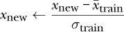

这里，*x*[new] 是我们想要输入到模型中的新特征向量，而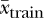和 *σ*[train] 是来自训练集的每个特征的均值和标准差。

#### 缺失特征

有时我们没有某个样本所需的所有特征。例如，可能是忘记做某项测量了。这些是*缺失特征*，我们需要找到一种方法来修正它们，因为大多数模型不能接受缺失的数据。

一种解决方案是用超出特征范围的值填充缺失值，希望模型能学会忽略这些值，或更多地利用其他特征。事实上，一些更先进的深度学习模型会故意将某些输入置零，作为一种正则化形式（我们将在后面的章节中看到这意味着什么）。

现在，我们将学习第二种最明显的解决方案：用数据集中每个特征的均值来替代缺失的特征值。让我们再次看看之前的实践数据集。这次，我们将处理一些缺失数据（表 4-7）。

**表 4-7：** 我们的示例数据集（表 4-4）含有一些缺失值

| **样本** | ***x*[0]** | ***x*[1]** | ***x*[2]** | ***x*[3]** | ***x*[4]** | **标签** |
| --- | --- | --- | --- | --- | --- | --- |
| *0* | 6998 | 0.1361 | 0.3408 | 0.00007350 | 78596048 | 0 |
| *1* |  | 0.4908 |  | 0.00004484 | 38462706 | 1 |
| *2* | 7563 | 0.9349 | 4.3465 |  | 6700340 | 2 |
| *3* | 8355 | 0.6529 | 2.1271 | 0.00002966 | 51430391 | 0 |
| *4* | 2393 | 0.4605 | 2.7561 | 0.00003395 | 27284192 | 0 |
| *5* | 9498 |  | 2.7887 | 0.00008880 | 78543394 | 2 |
| *6* | 4030 | 0.6467 | 4.8231 | 0.00000403 |  | 2 |
| *7* | 5275 | 0.3560 | 0.0705 | 0.00000899 | 96029352 | 0 |
| *8* | 8094 | 0.7979 | 3.9897 | 0.00006691 | 7307156 | 1 |
| *9* |  |  | 0.9804 |  | 10179751 | 1 |
| *10* | 1221 | 0.9564 | 2.3944 | 0.00007815 | 14241835 | 0 |
| *11* | 5879 | 0.0329 | 2.0085 | 0.00009564 | 34243070 | 2 |
| *12* | 923 |  |  | 0.00002467 |  | 1 |
| *13* | 5882 | 0.0002 | 1.5362 | 0.00005066 | 18728752 | 2 |
| *14* | 1796 | 0.7247 | 2.3190 | 0.00001332 | 96703562 | 1 |

空白处表示缺失值。每个特征的均值（忽略缺失值）显示在表 4-8 中。

**表 4-8：** 表 4-7 中各特征的均值

| ***x*[0]** | ***x*[1]** | ***x*[2]** | ***x*[3]** | ***x*[4]** |
| --- | --- | --- | --- | --- |
| 5223.6 | 0.5158 | 2.345 | 4.71e-05 | 42957735.0 |

如果我们用均值替换每个缺失值，我们将得到一个可以标准化并用于训练模型的数据集。

当然，真实的数据更好，但均值是我们可以合理使用的最简单的替代方法。如果数据集足够大，我们可能会生成每个特征值的直方图并选择众数——即最常见的值——但使用均值应该也能很好地工作，尤其是当你的数据集有足够多的样本，并且缺失特征的数量相对较少时。

### 训练数据、验证数据和测试数据

现在我们有了一个数据集——一个特征向量的集合——准备开始训练模型了，对吗？其实，不完全是。原因在于我们不想用整个数据集来训练。我们需要将一些数据用于其他目的，因此需要将数据划分为至少两个子集，理想情况下我们应该有三个子集。我们称这些子集为训练数据、验证数据和测试数据。

#### 三个子集

*训练数据*是我们用来训练模型的子集。这里的关键是选择能够很好代表数据父分布的特征向量。

*测试数据*是用来评估已训练模型表现的子集。我们*绝不*在训练模型时使用测试数据；那样是作弊，因为我们会在模型已经见过的数据上进行测试。将测试数据集放到一边，直到模型完成后再使用它来评估模型。

第三个数据集是*验证数据*。并不是每个模型都需要验证数据集，但对于深度学习模型，拥有一个验证集是非常有帮助的。在训练过程中，我们使用验证数据集，就像它是测试数据一样，以了解训练效果如何。这有助于我们决定什么时候停止训练，以及我们是否使用了合适的模型。

例如，一个神经网络有若干层，每一层包含若干节点。我们称这个结构为模型的*架构*。在训练过程中，我们可以使用验证数据来测试神经网络的性能，以判断是否应该继续训练，还是停止并尝试不同的架构。我们不使用验证集来训练模型，也不使用验证集来修改模型参数。我们同样不能在报告实际模型性能时使用验证数据，因为我们最初就是根据验证数据的结果来选择模型的。这样做会让模型看起来比实际表现更好。

图 4-3 展示了三个子集及它们之间的关系。左侧是整个数据集。这是所有特征向量及其相关标签的集合。右侧是三个子集。训练数据和验证数据共同作用于训练和开发模型，而测试数据则在模型准备好之后才会使用。圆柱体的大小反映了每个子集中应该包含的数据量，尽管在实际情况中，验证集和测试集的大小可能会更小。

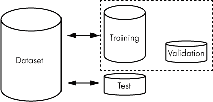

*图 4-3：训练集、验证集和测试集之间的关系*

总结一下：使用训练集和验证集来构建模型，使用测试集来评估模型。

#### 数据集的划分

每个数据集应该包含多少数据？

一个典型的划分方式是 90% 用于训练，5% 用于验证，5% 用于测试。对于深度学习模型，这种划分方式是相当标准的。如果你在处理一个非常大的数据集，你可以将验证和测试的比例降到 1%。对于经典模型，可能学习效果不如深度学习模型，这时我们可能希望增加测试集的大小，以确保模型能够泛化到各种可能的输入。在这种情况下，你可以尝试将训练集设为 80%，验证集和测试集各占 10%。如果不使用验证数据，那么全部 20% 可能都用于测试。这种较大的测试集可能适用于多类模型，尤其是那些具有低先验概率的类别。或者，由于测试集不用于定义模型，你可以增加测试集中稀有类别的数量。如果漏掉稀有类别是一个代价高昂的事件（比如在医学影像中漏掉肿瘤），这种做法可能特别有价值。

现在我们已经确定了每个集合中应该放入多少数据，接下来让我们使用 sklearn 来生成一个可以划分的虚拟数据集：

>>> import numpy as np

>>> from sklearn.datasets import make_classification

>>> x,y = make_classification(n_samples=10000, weights=(0.9,0.1))

>>> x.shape

(10000, 20)

>>> len(np.where(y == 0)[0])

8969

>>> len(np.where(y == 1)[0])

1031

在这里，我们使用了两个类别和 20 个特征生成了 10,000 个样本。数据集是不平衡的，90%的样本属于类别 0，10%的样本属于类别 1。输出的是一个二维数组，其中包含样本（x）和相应的 0 或 1 标签（y）。数据集是由多维高斯分布生成的，类似于一维正态分布的钟形曲线，但这对我们来说并不重要。对我们有用的部分是，我们有一组特征向量和标签，可以查看如何将数据集划分为子集。

前面代码的关键是调用 `make_classification`，它接受请求的样本数量和每个类别的比例。`np.where` 的调用只是为了找到所有类别 0 和类别 1 的实例，以便 `len` 可以对它们进行计数。

之前我们讨论了保留——或至少接近——数据集中不同类别的实际先验概率的重要性。如果一个类别在现实世界中占据了 10%的比例，那么理想情况下它在我们的数据集中也应该占 10%。现在我们需要找到一种方法，在我们为训练、验证和测试划分子集时，能够保留这个先验类别概率。这里有两种主要的做法：按类别划分和随机采样。

##### 按类别划分

具体的方法适用于数据集较小，或者某个类别较少的情况，首先确定每个类别所代表的样本数量，然后按类别将选定的百分比样本分配出来，再合并在一起。所以，如果类别 0 有 9,000 个样本，类别 1 有 1,000 个样本，并且我们希望将 90%的数据用于训练，5%用于验证，5%用于测试，我们会从类别 0 的集合中随机选择 8,100 个样本，从类别 1 的集合中随机选择 900 个样本，组成训练集。同样，我们会从剩余的 900 个类别 0 样本中随机选择 450 个样本作为验证集，并从剩余的类别 1 样本中选择 50 个。剩余的类别 0 和类别 1 样本将成为测试集。

列表 4-1 显示了使用 90/5/5 拆分原始数据来构建子集的代码。

import numpy as np

from sklearn.datasets import make_classification

❶ a,b = make_classification(n_samples=10000, weights=(0.9,0.1))

idx = np.where(b == 0)[0]

x0 = a[idx,:]

y0 = b[idx]

idx = np.where(b == 1)[0]

x1 = a[idx,:]

y1 = b[idx]

❷ idx = np.argsort(np.random.random(y0.shape))

y0 = y0[idx]

x0 = x0[idx]

idx = np.argsort(np.random.random(y1.shape))

y1 = y1[idx]

x1 = x1[idx]

❸ ntrn0 = int(0.9*x0.shape[0])

ntrn1 = int(0.9*x1.shape[0])

xtrn = np.zeros((int(ntrn0+ntrn1),20))

ytrn = np.zeros(int(ntrn0+ntrn1))

xtrn[:ntrn0] = x0[:ntrn0]

xtrn[ntrn0:] = x1[:ntrn1]

ytrn[:ntrn0] = y0[:ntrn0]

ytrn[ntrn0:] = y1[:ntrn1]

❹ n0 = int(x0.shape[0]-ntrn0)

n1 = int(x1.shape[0]-ntrn1)

xval = np.zeros((int(n0/2+n1/2),20))

yval = np.zeros(int(n0/2+n1/2))

xval[:(n0//2)] = x0[ntrn0:(ntrn0+n0//2)]

xval[(n0//2):] = x1[ntrn1:(ntrn1+n1//2)]

yval[:(n0//2)] = y0[ntrn0:(ntrn0+n0//2)]

yval[(n0//2):] = y1[ntrn1:(ntrn1+n1//2)]

❺ xtst = np.concatenate((x0[(ntrn0+n0//2):],x1[(ntrn1+n1//2):]))

ytst = np.concatenate((y0[(ntrn0+n0//2):],y1[(ntrn1+n1//2):]))

*列表 4-1：训练、验证和测试数据集的精确构建*

这段代码涉及很多的记录工作。首先，我们创建了虚拟数据集❶，并将其分为类别 0 和类别 1 的集合，分别存储在 x0,y0 和 x1,y1 中。接着，我们随机化数据的顺序❷。这样，我们可以从子集中抽取前*n*个样本，而不必担心因为数据顺序问题可能引入偏差。由于 sklearn 生成虚拟数据集的方式，这一步并不是必须的，但确保样本顺序的随机性始终是个好主意。

我们使用了一个在重新排序样本时很有帮助的技巧。由于我们将特征向量存储在一个数组中，而标签存储在另一个数组中，NumPy 的 shuffle 方法无法直接工作。相反，我们生成一个与样本数量相同长度的随机向量，然后使用 argsort 返回将该向量排序所需的索引。由于向量中的值是随机的，排序所使用的索引也会是随机的。然后，这些索引重新排序样本和标签，使得每个标签仍然与正确的特征向量相关联。

接下来，我们从两个类别的前 90%的样本中提取出数据，使用 xtrn 中的样本和 ytrn 中的标签来构建训练子集❸。我们对 5%的验证集❹和剩下的 5%的测试集❺也做相同的操作。

按类别划分是相当繁琐的，至少可以这么说。不过，我们确实知道，每个子集中的类别 0 与类别 1 的比例是完全相同的。

##### 随机抽样

我们非得这么精确吗？一般来说，不需要。另一种常见的数据集划分方法是通过随机抽样。如果我们有足够的数据——例如 10,000 个样本就是足够的——我们可以通过随机化整个数据集来构建子集，然后提取前 90%的样本作为训练集，接下来的 5%作为验证集，最后 5%作为测试集。这就是列表 4-2 中展示的方法。

❶ x, y = make_classification(n_samples=10000, weights=(0.9, 0.1))

idx = np.argsort(np.random.random(y.shape[0]))

x = x[idx]

y = y[idx]

❷ ntrn = int(0.9*y.shape[0])

nval = int(0.05*y.shape[0])

❸ xtrn = x[:ntrn]

ytrn = y[:ntrn]

xval = x[ntrn:(ntrn+nval)]

yval = y[ntrn:(ntrn+nval)]

xtst = x[(ntrn+nval):]

ytst = y[(ntrn+nval):]

*列表 4-2：随机构建训练集、验证集和测试集*

我们对存储在 x 和 y 中的虚拟数据集进行随机化❶。我们需要知道每个子集中应该包含多少样本。首先，训练集的样本数是数据集总数的 90%❷，验证集的样本数是总数的 5%。剩下的 5%则作为测试集❸。

这个方法比列表 4-1 中展示的方法简单得多。那么，使用它有什么缺点呢？可能的缺点是，这些子集中的每个类别的混合比例可能与我们想要的比例不完全一致。例如，假设我们想要一个包含 9,000 个样本的训练集，或者说是原始 10,000 个样本的 90%，其中 8,100 个来自类别 0，900 个来自类别 1。运行列表 4-2 代码 10 次，得到的训练集中类别 0 和类别 1 的分割情况如表 4-9 所示。

**表 4-9：** 随机抽样生成的十个训练集分割

| **运行** | **类别 0** | **类别 1** |
| --- | --- | --- |
| 1 | 8058 (89.5) | 942 (10.5) |
| 2 | 8093 (89.9) | 907 (10.1) |
| 3 | 8065 (89.6) | 935 (10.4) |
| 4 | 8081 (89.8) | 919 (10.2) |
| 5 | 8045 (89.4) | 955 (10.6) |
| 6 | 8045 (89.4) | 955 (10.6) |
| 7 | 8066 (89.6) | 934 (10.4) |
| 8 | 8064 (89.6) | 936 (10.4) |
| 9 | 8071 (89.7) | 929 (10.3) |
| 10 | 8063 (89.6) | 937 (10.4) |

类别 1 的样本数量从最少的 907 个样本到最多的 955 个样本不等。随着特定类别在完整数据集中的样本数量减少，子集中的数量会开始更多地变化。这一点在较小的子集，如验证集和测试集中尤为明显。我们进行一次单独的运行，这次查看 *测试* 集合中每个类别的样本数量（表 4-10）。

**表 4-10：** 通过随机抽样生成的十个测试集划分

| **运行** | **类别 0** | **类别 1** |
| --- | --- | --- |
| 1 | 446 (89.2) | 54 (10.8) |
| 2 | 450 (90.0) | 50 (10.0) |
| 3 | 444 (88.8) | 56 (11.2) |
| 4 | 450 (90.0) | 50 (10.0) |
| 5 | 451 (90.2) | 49 (9.8) |
| 6 | 462 (92.4) | 38 (7.6) |
| 7 | 441 (88.2) | 59 (11.8) |
| 8 | 449 (89.8) | 51 (10.2) |
| 9 | 449 (89.8) | 51 (10.2) |
| 10 | 438 (87.6) | 62 (12.4) |

在测试集中，类别 1 的样本数量从 38 到 62 不等。

这些差异会影响模型学习的方式吗？可能不会，但它们可能使测试结果看起来比实际情况更好，因为大多数模型在识别训练集中最不常见的类别时会遇到困难。也有可能出现病态拆分，导致某个类别没有样本，但实际上，除非伪随机数生成器非常差，否则这种情况不太可能发生。不过，还是值得考虑这种可能性。如果担心，使用清单 4-1 中的精确拆分方法。事实上，最好的解决方案，像往常一样，是获取更多数据。

算法上，生成训练集、验证集和测试集的步骤如下：

1.  随机化整个数据集的顺序，以确保类别均匀混合。

1.  通过将完整数据集中样本的数量乘以所需的比例，计算训练集（ntrn）和验证集（nval）中的样本数量。剩余的样本将分配到测试集中。

1.  将前 ntrn 样本分配到训练集。

1.  将下一个 nval 样本分配到验证集。

1.  最后，将剩余的样本分配到测试集。

始终确保样本的顺序是真正随机的，并且在重新排列特征向量时，要确保标签按照完全相同的顺序重新排列。如果做到了这一点，除非数据集非常小或者某些类别非常稀有，否则这个简单的拆分过程会产生一个好的拆分。

我们忽略了讨论这种方法的一个后果。如果原始数据集本身很小，将其划分后训练集会变得更小。在第七章中，我们将看到一种处理小数据集的强大方法，这种方法在深度学习中得到广泛应用。但首先，让我们看看一种有原则的方法，用来处理小数据集，以了解它在新数据上表现如何。

#### k 折交叉验证

现代深度学习模型通常需要非常大的数据集，因此，你可以像前面描述的那样，使用单一的训练/验证/测试划分。然而，像第六章中的那些传统机器学习模型，通常使用的数据集对于深度学习模型来说过小（一般而言）。如果我们在这些数据集上使用单一的训练/验证/测试划分，可能会把太多数据用于测试，或者测试集中的样本太少，无法对模型的效果做出有意义的评估。

解决这个问题的一种方法是使用*k*-折交叉验证，这是一种确保数据集中每个样本在某个时间点都用于训练和测试的技术。对于小数据集，可以使用这种技术，特别是传统机器学习模型。它也可以作为在不同模型之间做出选择的一个有用工具。

要进行*k*-折交叉验证，首先将完整的随机化数据集划分为*k*个互不重叠的组，*x*[0]、*x*[1]、*x*[2]、……、*x*[*k–*1]。你的*k*值是任意的，通常在 5 到 10 之间。图 4-4a 展示了这种划分，假设整个数据集是水平展开的。

我们可以通过将*x*[0]作为测试数据，其它组*x*[1]、*x*[2]、……、*x*[*k–*1]作为训练数据来训练一个模型。我们暂时忽略验证数据；在构建当前训练数据后，如果需要，我们可以随时将一部分数据保留作为验证数据。将这个训练后的模型称为*m*[0]。然后，你可以从头开始，这次将*x*[1]作为测试数据，并用其余的组（包括*x*[0]）来训练。我们将得到一个新的训练模型，称为*m*[1]。根据设计，*m*[0]和*m*[1]是相同*类型*的模型。我们关心的是同类型的模型在不同的完整数据集子集上训练得到的多个实例。

对每个组重复这个过程，如图 4-4b 所示，我们将得到用(*k –* 1)/*k*的数据训练的*k*个模型，每个模型保留 1/*k*的数据用于测试。*k*的值应该根据完整数据集中的数据量来确定。较大的*k*意味着更多的训练数据，但测试数据较少。如果每个模型的训练时间较短，倾向于选择较大的*k*，因为这样可以增加每个模型的训练数据集大小。

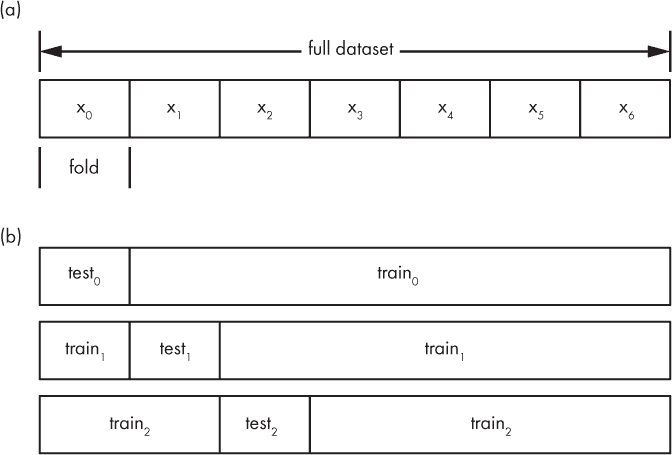

*图 4-4：*k-*折交叉验证。将数据集划分为不重叠的区域*，k=*7（a）。前三个训练/测试拆分，首先使用* x[0] *作为测试集，然后是* x[1] *作为测试集，依此类推（b）。

一旦训练了*k*个模型，你可以单独评估它们，并通过平均它们的度量标准来了解在整个数据集上训练的模型的表现。请参阅第十一章了解如何评估模型。如果使用*k*-折交叉验证来选择多个模型之间的最佳模型（例如，在使用*k*-NN 或支持向量机之间选择(1)），则需要对每种模型重复完整的训练和评估过程，并比较它们的结果。

一旦我们有了模型在平均评估度量上的表现的概念，我们可以重新开始，使用*所有*数据集进行训练，训练所选择的模型类型。这就是*k*-折交叉验证的优势：它让你既能享受成功，又能兼顾其他需求。

### 查看你的数据

将特征和特征向量组装起来，然后继续将训练集、验证集和测试集合并，而不暂停*查看*数据是否合理，这非常容易做到。对于使用大量图像或其他多维数据的深度学习模型，这尤其如此。以下是一些你需要留意的问题：

**标签错误的数据** 假设我们正在构建一个大型数据集——一个包含数十万条标注样本的数据集。进一步假设，我们将使用该数据集构建一个能够区分狗和猫的模型。当然，我们需要向模型提供大量的狗图像和猫图像。你可能会说，这没问题；我们只需要使用像 Google Images 这样的工具收集大量图像。好吧，这可以工作。但如果你简单地设置一个脚本，下载与“狗”和“猫”匹配的图像搜索结果，你还会得到许多其他不是狗或猫的图像，或者包含狗和猫以及其他事物的图像。标签将不完美。尽管深度学习模型对这种标签噪声有一定的抗性，但你仍然希望尽可能避免它。

**缺失或异常数据** 想象一下，你有一组特征向量，但你完全不知道特征缺失的情况有多普遍。如果某个特征的大部分数据缺失，那么这个特征将成为模型的障碍，你应该将其剔除。或者，如果数据中存在极端的异常值，你可能会希望删除这些样本，特别是如果你要进行标准化处理，因为异常值会强烈影响从特征值中减去的均值。

#### 在数据中搜索问题

我们如何在数据中查找这些问题呢？对于特征向量，如果数据集不太大，我们通常可以将其加载到电子表格中。或者我们可以编写一个 Python 脚本，逐个特征地汇总数据，或者将数据导入统计程序进行检查。

通常，在统计总结数据时，我们会查看均值和标准差（如前所述），以及最大值和最小值。我们还可以查看中位数，即将数据从小到大排序后，取中间的那个值。（如果数据点的数量为偶数，我们则取中间两个值的平均值。）让我们来看一下之前例子中的某个特征。将值从小到大排序后，我们可以按以下方式总结数据。

| ***x*[2]** |
| --- |
| 0.0705 |
| 0.3408 |
| 0.9804 |
| 1.5362 |
| 1.7821 |
| 2.0085 |
| 2.1271 |
| **2.3190** |
| 2.3944 |
| 2.7561 |
| 2.7887 |
| 3.0150 |
| 3.9897 |
| 4.3465 |
| 4.8231 |
| 平均值 () | = | 2.3519 |
| 标准差 (*σ*) | = | 1.3128 |
| 标准误差 (SE) | = | 0.3390 |
| 中位数 | = | 2.3190 |
| 最小值 | = | 0.0705 |
| 最大值 | = | 4.8231 |

我们已经探索了均值、最小值、最大值和标准差的概念。中位数也在其中；我已在左侧的特征列表中标出了它。注意，排序后，中位数正好处于列表的中间。它通常被称为*第 50 百分位数*，因为其上方和下方的数据量相等。

另一个列出的新值是*标准误差*，也叫做*均值的标准误差*。它是标准差除以数据集中值的数量的平方根：

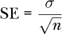

标准误差是衡量我们计算的均值（）与母体分布均值之间差异的一个指标。基本思想是：如果我们有更多的测量数据，就能更好地了解产生这些数据的母体分布，因此测量的均值将更接近母体分布的均值。

还要注意的是，均值和中位数相对接近。术语*相对接近*当然没有严格的数学定义，但我们可以将其作为一个临时的指示器，表明数据可能呈正态分布，这意味着我们可以合理地用均值（或中位数）来替代缺失值，正如我们之前所看到的那样。

上述数值是通过 NumPy 轻松计算得到的，如 Listing 4-3 所示。

import numpy as np

❶ f = [0.3408,3.0150,4.3465,2.1271,2.7561,

2.7887,4.8231,0.0705,3.9897,0.9804,

2.3944,2.0085,1.7821,1.5362,2.3190]

f = np.array(f)

print

print("平均值 = %0.4f" % f.mean())

print("标准差 = %0.4f" % f.std())

❷ print("标准误差 = %0.4f" % (f.std()/np.sqrt(f.shape[0])))

print("中位数 = %0.4f" % np.median(f))

print("最小值 = %0.4f" % f.min())

print("最大值 = %0.4f" % f.max())

*Listing 4-3: 计算基本统计数据。见* feature_stats.py。

在加载 NumPy 后，我们手动定义 *x*[2] 特征（f），并将其转化为 NumPy 数组 ❶。一旦数据变为 NumPy 数组，计算所需的值就变得很简单，除了标准误差外，其他都是直接通过方法或函数调用得到的。标准误差通过以下公式计算 ❷，其中 NumPy 返回的元组的第一个元素表示向量中的元素数量。

数字很重要，但图像往往更能直观表现数据。你可以通过 Python 生成 *箱线图* 来可视化数据。让我们生成一个箱线图，查看我们数据集的标准化值。然后我们将讨论这个图表向我们展示了什么。生成图表的代码在 清单 4-4 中。

import numpy as np

import matplotlib.pyplot as plt

❶ d = [[ 0.6930, -1.1259, -1.5318,  0.9525,  1.1824],

[ 0.5464, -0.0120,  0.5051, -0.0192, -0.1141],

[ 0.8912,  1.3826,  1.5193, -1.1996, -1.1403],

[ 1.1690,  0.4970, -0.1712, -0.5340,  0.3047],

[-0.9221, -0.1071,  0.3079, -0.3885, -0.4753],

[ 1.5699, -1.4767,  0.3327,  1.4714,  1.1807],

[-0.3479,  0.4775,  1.8823, -1.4031, -0.7396],

[ 0.0887, -0.4353, -1.7377, -1.2349,  1.7456],

[ 1.0775,  0.9524,  1.2475,  0.7291, -1.1207],

[-1.4657,  0.9250, -1.0446,  0.4262, -1.0279],

[-1.3332,  1.4501,  0.0323,  1.1102, -0.8966],

[ 0.3005, -1.4500, -0.2615,  1.7033, -0.2505],

[-1.4377, -0.2472, -0.4340, -0.7032,  0.3362],

[ 0.3016, -1.5527, -0.6213,  0.1780, -0.7517],

[-1.1315,  0.7225, -0.0250, -1.0881,  1.7674]]

❷ d = np.array(d)

plt.boxplot(d)

plt.show()

*清单 4-4：标准化玩具数据集的箱线图*。参见 box_plot.py。

这些值本身可以在 表 4-6 中找到。我们可以将数据存储为一个二维数组，并使用 清单 4-4 生成箱线图。我们手动定义数组 ❶，然后绘制图形 ❷。该图是交互式的，因此可以在提供的环境中进行实验，直到你熟悉为止。旧式的软盘图标将把图形存储到你的磁盘中。

程序生成的箱线图如 图 4-5 所示。

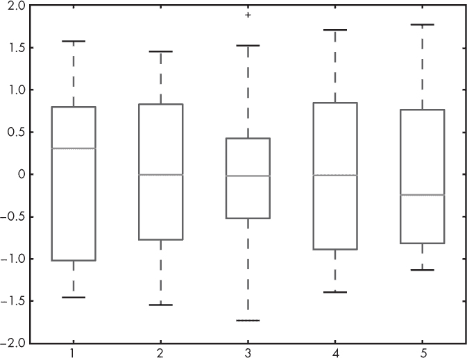

*图 4-5：由 清单 4-4 生成的箱线图*

我们如何解读箱线图呢？我将通过检查代表标准化特征 *x*[2] 的箱体来展示，见 图 4-6。

下箱线 Q1 标志着第一四分位数的结束。这意味着该特征的 25% 数据值小于这个值。中位数 Q2 是 50% 的分界点，因此是第二四分位数的结束。数据中有一半的值小于这个值。上箱线 Q3 是 75% 的分界点。剩余的 25% 数据值大于 Q3。

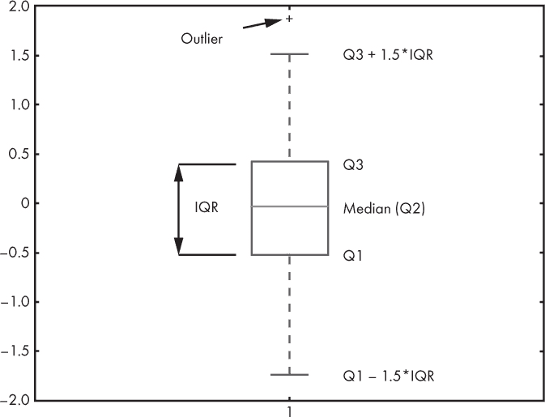

*图 4-6：来自我们数据集的标准化特征 x2*

盒子上下的两条线也被展示出来。这些是*须状线*。（Matplotlib 称之为*飞点*，但这是一个不常用的术语。）须状线的值为 Q1 *–* 1.5 × IQR 和 Q3 + 1.5 × IQR。根据惯例，超出这个范围的值被认为是*异常值*。

查看异常值可能会有所帮助，因为你可能会意识到它们是数据输入错误，并将它们从数据集中删除。无论你对异常值做什么，然而，如果你计划发布或以其他方式展示基于该数据集的结果，都应该准备好为此辩护。类似地，你可能会删除缺失值的样本，但要确保没有系统性错误导致数据缺失，并检查删除这些样本是否会给数据带来偏差。最终，常识应当优于对惯例的盲目遵守。

#### 警示故事

所以，为了避免重复，*请查看你的数据*。你与数据打交道的时间越长，你对它的理解就越深入，你就越能有效地做出合理的决定，了解哪些数据应该被包括，哪些应该被排除，以及*为什么*。请记住，数据集的目标是忠实而完整地捕捉母体分布，或者说，当模型投入使用时，数据在实际环境中将呈现的样貌。

两个简单的轶事浮现在我的脑海。它们都说明了模型可能学到了我们没有预料到甚至没有考虑到的东西。

第一个故事是在我 1980 年代作为本科生时听到的。在这个故事中，早期形式的神经网络被赋予了识别坦克和非坦克图像的任务。神经网络在测试中似乎表现得很好，但在实际应用中，检测率迅速下降。研究人员意识到，坦克的图像是在多云的日子里拍摄的，而非坦克的图像是在晴天拍摄的。这个识别系统根本没有学到坦克和非坦克之间的区别；相反，它学到了多云和晴天之间的区别。这个故事的教训是，训练集需要包括模型在实际环境中会遇到的*所有*条件。

第二个轶事较为近期。我在 2016 年西班牙巴塞罗那的神经信息处理系统（NIPS）会议上听到过，后来在研究人员的论文中发现了这一故事的重复^2。在这个案例中，作者们展示了他们让模型解释决策的技术，他们训练了一个模型，声称能够区分哈士奇和狼的图像。该模型似乎工作得相当好，在演讲过程中，作者们向由机器学习研究人员组成的观众群体询问该模型的可信度。大多数人认为这是一个很好的模型。然后，使用他们的技术，演讲者揭示了网络实际上并没有学到哈士奇和狼之间的任何区别。相反，它学到的是，狼的图片背景有雪，而哈士奇的图片没有雪。

思考你的数据，并留意可能出现的意外后果。模型不是人类，我们带入数据集的往往是许多先入为主的观念和无意的偏见。

### 摘要

本章我们描述了数据集的组成部分（类别、标签、特征、特征向量），并定义了一个良好的数据集，强调了确保数据集能很好地代表父分布的重要性。接着，我们介绍了基本的数据准备技术，包括如何对数据进行标准化以及处理缺失特征的一种方法。之后，我们学习了如何将完整的数据集划分为训练集、验证集和测试集，并且介绍了如何应用 *k*-折交叉验证，这对于小型数据集特别有用。最后，我们以如何简单检查数据确保其合理性作为本章的结尾。

在下一章，我们将直接应用本章所学的内容，构建本书其余部分将使用的数据集。

1. 这些是经典的机器学习模型示例。我们将在本书的后续章节中进一步学习它们。

2. Ribeiro, Marco Tulio, Sameer Singh, 和 Carlos Guestrin. “Why Should I Trust You?: 解释任何分类器的预测。” *《第 22 届 ACM SIGKDD 国际知识发现与数据挖掘大会论文集》*，第 1135–1144 页，ACM，2016 年。
