## **6

经典机器学习**

能够写下“经典机器学习”这一术语让人感到满意，因为它暗示着有一些更新的技术，使得旧的技术成为了“经典”。当然，我们现在知道，确实有更先进的——深度学习——我们将在后续的章节中讨论它。但首先，我们需要通过研究一些旧的技术来建立直觉，这些技术将帮助我们巩固概念，坦白说，因为这些旧技术在特定情况下仍然非常有用。

很容易想在这里加入一些历史背景。为了保持本书的实用性，我们不会这样做，但机器学习的完整历史是必要的，截至目前，我还没有找到这样的资料。历史学家们请注意，我可以说，机器学习并不新鲜，本章所涉及的技术已经有几十年的历史，并且取得了相当大的成功。

然而，这些成功总是受到某种限制，而这些限制深度学习现在基本上已经克服了。尽管如此，拥有一把锤子并不意味着一切都是钉子。你将会遇到一些非常适合使用这些老技术的问题。这可能是因为可用的数据太少，无法训练深度模型，可能是因为问题本身简单，通过经典技术就能轻松解决，或者是因为操作环境不适合使用大型深度模型（比如微控制器）。此外，许多这些技术在概念上比深度模型更容易理解，之前章节中关于构建数据集的所有评论，以及第十一章中关于评估模型的评论，依然适用。

以下章节将介绍几种流行的经典模型，虽然不会详细展开，但会讲解其核心内容。这些模型都得到了 sklearn 的支持。在第七章中，我们将把这些模型应用到我们在第五章中开发的一些数据集上。这将帮助我们了解这些模型相互比较时的相对表现，并为后续章节中比较深度模型的表现提供基准。

我们将讨论六种经典模型。我们讨论的顺序大致是根据模型类型的复杂度来排列的。前三种，最近质心、*k*-最近邻和朴素贝叶斯，理解和实现起来都非常简单。后面三种，决策树、随机森林和支持向量机，较为复杂，但我们会尽力解释它们的原理。

### 最近质心

假设我们想构建一个分类器，并且我们有一个正确设计的*n*类数据集（参见第四章）。为简便起见，我们假设每个*n*类都有*m*个样本。这并不是必要的，但可以避免在公式中添加许多下标。由于我们的数据集设计得当，我们有训练样本和测试样本。在这种情况下，我们不需要验证样本，因此可以将它们放入训练集。我们的目标是拥有一个模型，利用训练集进行学习，然后将模型应用于测试集，以观察它如何处理新的、未知的样本。在这里，样本是由浮动点值组成的特征向量。

选择特征向量组件的目标是使得特征向量在特征空间中能够区分不同的类。假设特征向量有*w*个特征。这意味着我们可以将特征向量视为*w*维空间中一个点的坐标。如果*w* = 2 或*w* = 3，我们可以绘制特征向量的图形。然而，从数学角度来看，我们没有必要将*w*限制为 2 或 3；我们在这里描述的所有内容同样适用于 100、500 或 1000 维。值得注意的是，这种方法并不会在所有情况下都有效：可怕的维度灾难将悄然出现，并最终要求一个指数级大的训练数据集，但我们暂时不讨论这个问题。

如果特征选择得当，我们可能期望在*w*维空间中绘制的点图能够将各个类别分组，使得类别 0 的所有样本彼此接近，类别 1 的所有样本彼此接近并与类别 0 不同，依此类推。如果这是我们的期望，那么我们该如何利用这些信息将一个新的、未知的样本分配到特定的类中呢？当然，这是分类的目标，但在这种情况下，考虑到我们假设类别在特征空间中是分开的，我们能做的简单方法是什么？

图 6-1 展示了一个假设的二维特征空间，其中有四个不同的类。在这个简单的例子中，不同的类在空间中被清晰地分开了。一个新的、未知的特征向量将作为一个点落入这个空间。目标是为这个新点分配一个类别标签，可以是方形、星形、圆形或三角形。

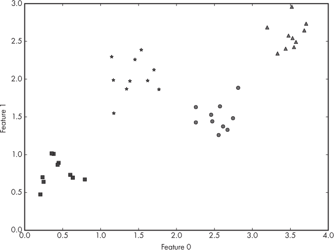

*图 6-1：一个假设的二维特征空间，包含四个不同的类*

由于图 6-1 中的点分布得非常好，我们可能会认为，可以通过在特征空间中找到每个组的平均位置来表示每个组。我们不再使用 10 个方形的点，而是用一个点来代表所有的方形。这似乎是一个完全合理的做法。

事实证明，一组点的平均点有一个名字：*质心*，即中心点。我们知道如何计算一组数字的平均值：将它们加起来，然后除以我们加的个数。为了找到二维空间中一组点的质心，我们首先计算所有 x 轴坐标的平均值，然后计算所有 y 轴坐标的平均值。如果我们有三维空间，我们将对 x、y 和 z 轴分别进行计算。如果我们有 *w* 维空间，我们将对每个维度进行计算。最后，我们会得到一个点，用来表示整个组。如果我们为我们的玩具示例进行此操作，我们得到 图 6-2，其中质心显示为大标记。

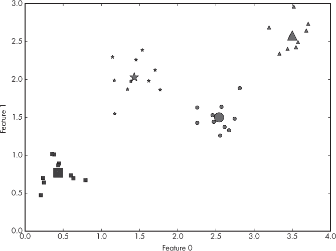

*图 6-2：一个假设的二维特征空间，包含四个不同的类别及其质心*

质心对我们有什么帮助呢？嗯，如果我们给定一个新的、未知的样本，它将是一个特征空间中的点，如前所述。然后，我们可以测量这个点与每个质心之间的距离，并分配最近质心的类别标签。*距离*的概念有些模糊；定义距离的方式有很多种。一种明显的方式是画一条连接两个点的直线；这种距离被称为 *欧几里得距离*，并且计算起来非常简单。如果我们有两个点，(*x*[0],*y*[0]) 和 (*x*[1],*y*[1])，那么它们之间的欧几里得距离就是：

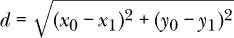

如果我们有三维空间，两个点之间的距离变为

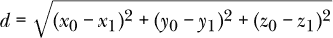

它可以推广到 *w* 维空间，适用于两个点，*x*[0] 和 *x*[1]，表示为

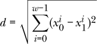

其中 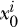 是点 *x*[0] 的 *i* 维分量。这意味着，逐个分量地，找到两个点之间的差值，将其平方，并将所有其他分量的平方差加在一起。然后，取平方根。

图 6-3 显示了特征空间中的一个样本点以及到质心的距离。最短的距离是到圆形类别的，因此我们会将新样本分配到该类别。

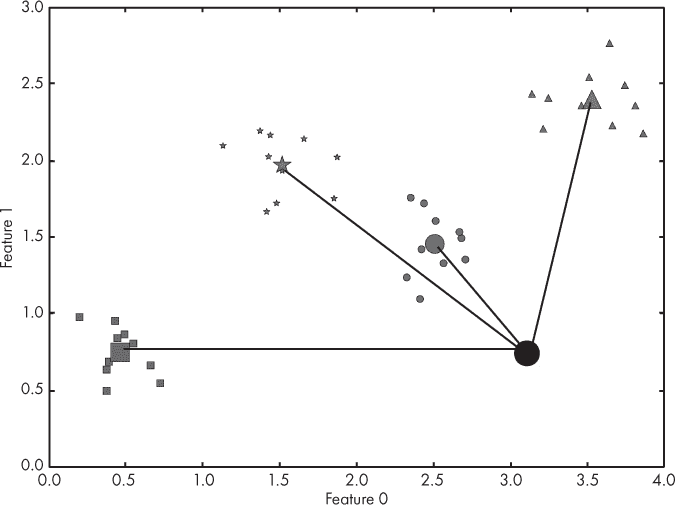

*图 6-3：一个假设的二维特征空间，包含四个不同的类别及其质心，以及一个新的、未知的样本*

我们刚刚实现的过程被称为 *最近质心* 分类器。有时它也叫做 *模板匹配*。通过训练数据学到的类别的质心被用作整个类别的代表。然后，新的样本使用这些质心来决定标签。

这看起来如此简单，甚至有点显而易见，那么为什么这个分类器没有得到更广泛的使用呢？其实有几个原因。其中一个已经提到过，那就是维度灾难。随着特征数量的增加，空间变得越来越大，我们需要指数级地增加训练数据，才能准确了解质心应该在哪里。因此，特征空间很大意味着这可能不是合适的方法。

然而，还有一个更严重的问题。我们的玩具示例中，类别非常紧凑。如果组更加分散，甚至相互重叠呢？那么，选择最近质心就变得有问题了：我们如何知道最近的质心代表的是类别 A 还是类别 B 呢？

更严重的是，某个特定的类别可能会落入*两个*或更多的不同组。如果我们仅计算类别的整体质心，那么质心将位于该类别的各个组之间，并不能很好地代表任何一个簇。我们需要知道该类别在多个组之间分布，并为该类别使用多个质心。如果特征空间较小，我们可以绘制它并看到该类别在不同组之间分布。然而，如果特征空间较大，我们就没有简单的方法来判断该类别是否分布在多个组之间，进而需要多个质心。尽管如此，对于简单的问题，这种方法可能是理想的选择。并非所有的应用都处理复杂数据。我们可能正在构建一个自动化系统，需要对新输入做出简单、易于决策的判断。在这种情况下，这个简单的分类器可能是完美的选择。

### k-最近邻

正如我们之前看到的，质心方法的一个问题是，类别可能在特征空间中被划分为多个组。随着组数的增加，指定类别所需的质心数量也会增加。这意味着另一种方法。我们可以不计算每个类别的质心，而是直接使用训练数据，并通过找到训练集中的最接近样本来为新输入样本选择类别标签，并使用该样本的标签。

这种类型的分类器称为*最近邻*分类器。如果我们只查看训练集中的最近样本，那么我们使用的是一个邻居，因此我们称该分类器为*1-最近邻*或*1-NN 分类器*。但我们不需要只看最近的训练点。我们可能希望查看多个邻居，然后通过投票来为新样本分配最常见的类别标签。如果出现平局，我们可以随机选择一个类别标签。如果我们使用三个最近邻，我们就有了一个 3-NN 分类器，如果我们使用*k*个邻居，我们就有了一个*k*-NN 分类器。

让我们重新审视图 6-1 中的假设数据集，但生成一个新的版本，其中紧密的簇更加分散。我们仍然有两个特征和四个类别，每个类别有 10 个示例。设定*k* = 3，这是一个典型的值。为了给一个新样本分配标签，我们将该样本绘制在特征空间中，然后找到与其最接近的三个训练数据点。图 6-4 展示了三个未知样本的三个最近邻。

样本 A 最接近的三个训练数据点是方形、方形和星形。因此，通过多数投票，我们将样本 A 分配给方形类别。同样，样本 B 最接近的三个训练数据点是圆形、三角形和三角形。因此，我们将样本 B 宣布为三角形类别。样本 C 更有趣。在这种情况下，三个最接近的训练样本分别来自不同的类别：圆形、星形和三角形。所以，投票结果平局。

当这种情况发生时，*k*-NN 实现必须做出选择。最简单的方法是随机选择类别标签，因为有人可能会认为这三者的可能性是相等的。或者，也可以稍微更多地依赖于未知样本与训练数据之间的距离，并选择距离最短的那个。在这种情况下，我们将样本 C 标记为星形类别，因为它是离该样本最近的训练样本。

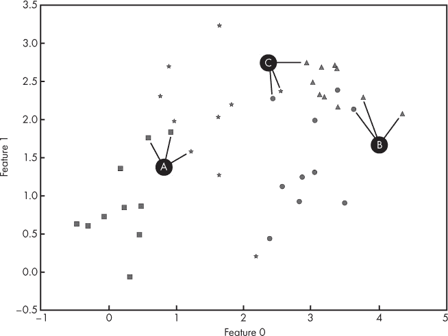

*图 6-4：将 *k*-NN 应用于 *k* = 3 的三个未知样本 A、B 和 C*

*k*-NN 分类器的优点在于训练数据就是模型——无需训练步骤。当然，训练数据必须与模型一起携带，并且根据训练集的大小，为一个新输入样本找到*k*个最近邻可能在计算上非常昂贵。人们已经花费了几十年的时间尝试加速邻居搜索或更有效地存储训练数据，但最终，维度灾难依然存在，并且仍然是一个问题。

然而，一些*k*-NN 分类器表现得非常好：如果特征空间的维度足够小，*k*-NN 可能是一个很有吸引力的选择。训练数据的大小需要平衡，这可以提高性能，但也需要更多的存储和更加繁琐的邻居搜索过程，以及特征空间的维度。正是这种情况可能使得最近质心（Nearest Centroid）适用，也会让*k*-NN 成为一种合适的选择。然而，*k*-NN 可能比最近质心更加适应于分散且略有重叠的类别组。如果某个类别的样本分布在多个组之间，*k*-NN 将优于最近质心。

### 朴素贝叶斯

*朴素贝叶斯*分类器在自然语言处理研究中被广泛使用，它实现简单，易于理解，尽管我们在实现过程中需要包含一些数学内容。不过，我保证，尽管符号可能不太熟悉，描述所发生的事情会让这些数学内容变得易于理解。

该技术使用贝叶斯定理（参见托马斯·贝叶斯的《解决机会论中的一个问题的论文》，发表于 1763 年）。该定理涉及概率关系，其现代形式为：

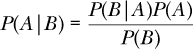

它使用了一些来自概率论的数学符号，我们需要描述这些符号，以理解如何利用这个定理来实现分类器。

表达式*P*(*A|B*)表示在已知事件 B 发生的情况下，事件 A 发生的概率。在这个上下文中，它被称为*后验概率*。类似地，*P*(*B|A*)表示在事件 A 发生的情况下，事件 B 发生的概率。我们称*P*(*B|A*)为在给定 A 的情况下，B 的*似然*。最后，*P*(*A*)和*P*(*B*)分别表示事件 A 发生的概率（不考虑事件 B）和事件 B 发生的概率（不考虑事件 A）。我们称*P*(*A*)为 A 的*先验概率*，*P*(*B*)是事件 B 发生的概率，不考虑事件 A。

贝叶斯定理给出了在已知事件 B 发生的情况下，事件 A 发生的概率。那么这如何帮助我们分类呢？我们想知道一个特征向量是否属于某个给定的类别。我们知道特征向量，但不知道类别。所以，如果我们有一个包含*m*个特征向量的数据集，其中每个特征向量有*n*个特征，*x* = *{x*[1],*x*[2],*x*[3],…,*x*[*n*]*}*，那么我们可以将贝叶斯定理中的*B*替换为特征向量中的每个特征。我们也可以将*A*替换为*y*，即我们希望赋予一个新的、未知的特征向量*x*的类别标签。这个定理现在看起来是这样的：

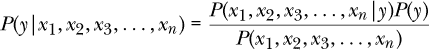

让我们稍微解释一下。贝叶斯定理指出，如果我们知道在给定类别*y*的情况下，*x*是我们的特征向量的似然性，并且我们知道类别*y*的出现频率（这是*P*(*y*)，即*y*的先验概率），那么我们就可以计算特征向量*x*属于类别*y*的概率。如果我们能够对所有可能的类别、所有不同的*y*值进行这种计算，我们可以选择最高的概率，并将输入特征向量*x*标记为属于该类别*y*。

回想一下，训练数据集是由一组对（*x*^(*i*), *y*^(*i*)）组成的，其中* x*^(*i*)是已知的特征向量，*y*^(*i*)是它所属的已知类别。这里的* i*上标表示训练数据集中每个特征向量和标签对的计数。现在，给定这样的数据集，我们可以通过制作每个类标签在训练集中出现的频率直方图来计算*P*(*y*)。我们认为训练集可以公平地代表可能特征向量的父分布，因此我们可以使用训练数据来计算贝叶斯定理所需的值。（请参阅第四章，了解如何确保数据集的质量。）

一旦我们知道了*P*(*y*)，我们还需要知道似然，*P*(*x*[1], *x*[2], *x*[3], …, *x*[*n*]*|y*)。不幸的是，我们不能直接计算这个值。但并非一无所获：我们将做出一个假设，帮助我们继续前进。我们假设*x*中的每个特征是*统计独立的*。这意味着我们测量特定的*x*[1]与其他*n-1*个特征的值毫无关系。这个假设并非总是成立，甚至大多数时候并不成立，但在实际操作中，这个假设通常足够接近真实情况，我们可以继续使用它。这就是为什么称其为*朴素贝叶斯*，因为假设特征相互独立是一个简单而幼稚的假设。这个假设在某些情况下确实不成立，例如当我们的输入是图像时。图像的像素高度依赖于彼此。随机挑选一个像素，旁边的像素几乎可以肯定与它的值相差不大。

当两个事件是独立时，它们的*联合概率*，即它们同时发生的概率，就是它们各自概率的乘积。独立性假设允许我们像这样改变贝叶斯定理中的似然部分：

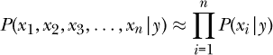

∏符号表示*相乘*，就像∑符号表示*相加*一样。方程右侧的意思是，如果我们知道测量特征的特定值的概率，例如特征 *x*[*i*]，假设类别标签为 *y*，那么我们可以通过将每个特征的概率相乘来得到整个特征向量 *x* 给定类别标签 *y* 的似然性。

如果我们的数据集由类别值或离散值（如整数，例如年龄）组成，那么我们可以通过为每个类的每个特征构建直方图来计算*P*(*x*[*i*]*|y*)值。例如，如果类 1 的特征 *x*[2]有以下值：

7, 4, 3, 1, 6, 5, 2, 8, 5, 4, 4, 2, 7, 1, 3, 1, 1, 3, 3, 3, 0, 3,

4, 4, 2, 3, 4, 5, 2, 4, 2, 3, 2, 4, 4, 1, 3, 3, 3, 2, 2, 4, 6, 5,

2, 6, 5, 2, 6, 6, 3, 5, 2, 4, 2, 4, 5, 4, 5, 5, 2, 5, 3, 4, 3, 1,

6, 6, 5, 3, 4, 3, 3, 4, 1, 1, 3, 5, 4, 4, 7, 0, 6, 2, 4, 7, 4, 3,

4, 3, 5, 4, 6, 2, 5, 4, 4, 5, 6, 5

那么每个值的出现概率如下：

0: 0.02

1: 0.08

2: 0.15

3: 0.20

4: 0.24

5: 0.16

6: 0.10

7: 0.04

8: 0.01

这来自于每个值出现的次数除以 100，即数据集中值的总数。

这个直方图正是我们用来找出 *P*(*x*[2]*|y* = 1) 所需要的，它表示特征 2 在类别标签为 1 时的概率。例如，我们可以期望类别 1 的新特征向量中，*x*[2] = 4 的概率约为 24%，*x*[2] = 1 的概率约为 8%。

通过为每个特征和每个类别标签构建这样的表格，我们可以完成分类器，适用于分类变量和离散数据的情况。对于一个新的特征向量，我们使用这些表格来找出每个特征取该值的概率。我们将每个概率相乘，然后再乘以该类别的先验概率。对于数据集中的每个 *m* 类别，这个过程重复进行，将给我们一组 *m* 个后验概率。为了对新的特征向量进行分类，选择这 *m* 个值中最大的一个，并分配相应的类别标签。

如果特征值是连续的，我们该如何计算 *P*(*x*[*i*]*|y*) 呢？一种方法是将连续值进行分箱，然后像离散情况一样制作表格。另一种方法是做出更多的假设。我们需要假设可以测量到的 *x*[*i*] 特征值的分布。大多数自然现象似乎遵循正态分布。我们在第一章中讨论了正态分布。那么假设所有特征都遵循正态分布。正态分布由其均值 (*μ*, mu) 和标准差 (*σ*, sigma) 定义。均值是我们如果多次从分布中抽取样本时，期望得到的平均值。标准差是衡量分布宽度的指标——即围绕均值的分布范围有多宽。

从数学角度来看，我们想做的是将每个 *P*(*x*[*i*]*|y*) 替换成如下形式

*P*(*x*[*i*]|*y*) ≈ *N*(*μ*[*i*], *σ*[*i*])

对于我们特征向量中的每个特征，N(*μ*[*i*],*σ*[*i*]) 是一种符号表示，意味着一个围绕某个均值 (*μ*) 进行分布的正态分布，并且由一个分布范围 (*σ*) 定义。

我们并不知道确切的 *μ* 和 *σ* 值，但我们可以通过训练数据进行近似。例如，假设训练数据由 25 个样本组成，其中类别标签为 0。进一步假设在这些情况下，特征 3（即 *x*[3]）的值如下：

0.21457111,  4.3311102,   5.50481251,  0.80293956,  2.5051598,

2.37655204,  2.4296739,   2.84224169, -0.11890662,  3.18819152,

1.6843311,   4.05982237,  4.14488722,  4.29148855,  3.22658406,

6.45507675,  0.40046778,  1.81796124,  0.2732696,   2.91498336,

1.42561983,  2.73483704,  1.68382843,  3.80387653,  1.53431146

然后，我们在为类别 0 设置特征 3 的正态分布时，使用 *μ*[3] = 2.58 和 *σ*[3] = 1.64，因为这些值的平均值为 2.58，标准差，即均值的分布范围，约为 1.64。

当一个新的未知样本被提供给分类器时，我们将通过以下方程计算在实际类别为类别 0 的情况下，给定的*x*[3]发生的概率。

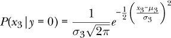

这个方程来自正态分布的定义，其中均值为*μ*，标准差为*σ*。它表示在给定类别*y*的情况下，某个特定特征值的可能性是围绕我们从训练数据中测得的均值，根据正态分布分布的。这是我们在特征之间的独立性假设之上做出的一个假设。

我们对未知特征向量中的每个特征使用这个方程。然后我们将得到的概率相乘，并将该值乘以类别 0 发生的先验概率。我们会对每个类别重复这个过程。最终，我们会得到*m*个数字，即特征向量属于每个*m*类别的概率。为了做出最终决策，我们会像之前那样：选择这些概率中最大的一个，并将输入标记为相应类别。

一些读者可能会抱怨我们忽略了贝叶斯定理的分母。我们这么做是因为它在所有计算中是一个常数，并且由于我们总是选择最大的后验概率，我们真的不在乎是否将每个值除以常数。无论如何，我们会选择相同的类别标签。

此外，对于离散情况，我们的训练集可能没有出现某些很少出现的值。我们也忽略了这一点，但这是一个问题，因为如果某个值从未出现过，我们使用的*P*(*x*[*i*]*|y*)将是 0，这使得整个后验概率为 0。这在自然语言处理中经常发生，因为某些特定的单词很少被使用。一种叫做*拉普拉斯平滑*的技术可以解决这个问题，但就我们的目的而言，我们认为一个“好的”训练集会表示特征的*所有*可能值，并且直接继续前进。sklearn 的多项式朴素贝叶斯分类器对于离散数据默认使用拉普拉斯平滑。

### 决策树和随机森林

图 6-5 的左侧显示了一个小狗的 X 光图像，其右侧髋关节窝畸形。由于小狗在 X 光片中是仰卧的，右侧髋关节窝位于图像的左侧。图 6-5 的右侧显示了相应的像素强度直方图（8 位值，[0,255]）。这个直方图有两个峰值，分别对应黑色背景和较亮的 X 光数据。如果我们想将图像中的每个像素分类为背景或 X 光数据，可以使用以下规则：“如果像素强度小于 11，则将该像素标记为背景。”

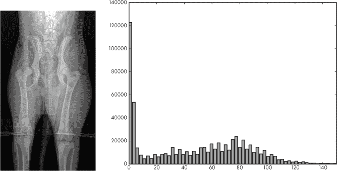

*图 6-5：一只小狗的 X 光图像（左）。对应的 8 位像素值[0,255]的直方图（右）。*

这个规则实现了基于数据的一个特征做出的决策，在本例中是像素强度值。像这样的简单决策是*决策树*的核心，决策树是我们在本节中将要探索的分类算法。为了完整性，如果我们将决策规则应用到图像中的每个像素，并输出 0 或 255（最大像素值），用以区分背景和 X 光数据，我们得到一个掩膜，显示哪些像素属于图像。见图 6-6。

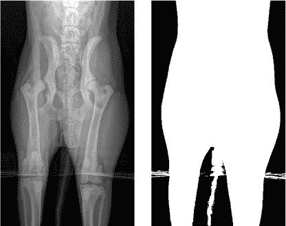

*图 6-6：一只小狗的 X 光图像（左）。决策规则生成的相应像素掩膜。白色像素是 X 光图像的一部分（右）。*

决策树是一组节点。节点要么定义一个条件并根据条件的真假来分支，要么选择一个特定的类别。没有分支的节点叫做*叶节点*。决策树之所以叫做*树*，是因为，尤其在我们这里考虑的二分类情况下，它们像树一样分支。图 6-7 展示了使用前 3 个特征，通过 sklearn 的 DecisionTreeClassifier 类学习到的完整鸢尾花数据集的决策树。见第五章。

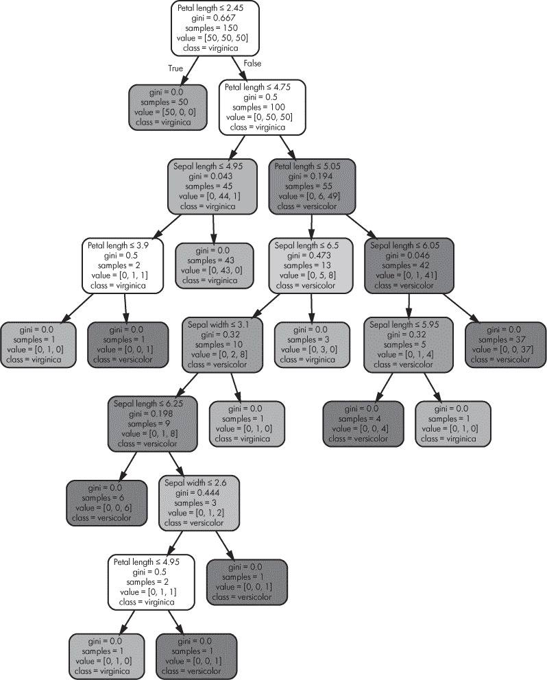

*图 6-7：用于鸢尾花数据集的决策树分类器*

按惯例，树的第一个节点，即*根节点*，画在顶部。对于这棵树，根节点提出问题：“花瓣长度 ≤ 2.45 吗？”如果是，选择左侧分支，树会立即到达一个叶节点，并分配“virginica”（类别 0）标签。我们稍后会讨论节点中的其他信息。如果花瓣长度不 ≤ 2.45，则选择右侧分支，进入一个新节点，提出问题：“花瓣长度 ≤ 4.75 吗？”如果是，则进入一个询问萼片长度的问题的节点。如果不是，则进入右侧节点，再次考虑花瓣长度。这个过程持续下去，直到到达叶节点，从而确定类别标签。

刚才描述的过程正是决策树在创建后如何使用的方式。对于任何新的特征向量，从根节点开始，依次提出问题，遍历树直到到达叶节点，以决定类别标签。这是一个对人类友好的分类过程，因此在类别分配的“原因”与类别本身一样重要的情况下，决策树非常有用。决策树可以自我解释。

使用决策树足够简单，但树是如何创建的呢？与前面章节中的简单算法不同，建树过程更为复杂，但也并非复杂到我们无法跟随主要步骤来建立对定义树的直觉。

#### 递归基础

然而，在我们讨论决策树算法之前，我们需要讨论一下*递归*的概念。如果你对计算机科学有所了解，你可能已经知道树状数据结构和递归是相辅相成的。如果不了解，也不用担心；递归是一个简单但强大的概念。递归算法的本质在于算法在不同的层次上重复执行。当递归作为编程语言中的函数实现时，通常意味着该函数在问题的一个较小版本上调用自身。自然地，如果函数无限制地调用自身，就会出现无限循环，因此递归需要一个停止条件——即一种表明我们不再需要递归的机制。

让我们从数学角度引入递归的概念。整数*n*的阶乘，记作*n*!，定义为

*n*! = *n*(*n* – 1)(*n* – 2)(*n* – 3) . . . (*n* – *n* + 1)

这只是意味着将从 1 到*n*的所有整数相乘。根据定义，0! = 1。因此，5 的阶乘是 120，因为

5! = 5 × 4 × 3 × 2 × 1 = 120

如果我们看 5!，就会发现它无非是 5 × 4!，或者一般地，*n*! = *n* × (*n –* 1)!。现在，让我们用这个思路写一个递归计算阶乘的 Python 函数。代码很简单，这也是许多递归函数的特点，参见清单 6-1。

def fact(n):

if (n <= 1):

return 1

else:

return n*fact(n-1)

*清单 6-1：计算阶乘*

这段代码是对阶乘规则的直接实现，即*n*的阶乘等于*n*乘以*n – 1*的阶乘。为了计算 n 的阶乘，我们首先检查 n 是否为 1。如果是，我们知道阶乘是 1，因此返回 1——这是我们的停止条件。如果 n 不是 1，我们知道 n 的阶乘就是 n 乘以 n-1 的阶乘，我们通过递归调用 fact 函数并传入 n-1 来找到 n-1 的阶乘。

#### 构建决策树

构建决策树的算法也是递归的。我们来简要了解一下大致流程。该算法从根节点开始，确定该节点的适当规则，然后递归调用左右子树。左子树的递归调用会像从根节点一样重新开始。这种过程会持续，直到满足停止条件为止。

对于决策树，停止条件是一个叶子节点（接下来我们会讨论决策树如何判断是否创建叶子节点）。一旦叶子节点创建完成，递归终止，算法会返回到该叶子节点的父节点，并在右子树上再次调用自己。算法随后会重新开始，仿佛右子树就是根节点。一旦两个递归调用都终止，且一个节点的左右子树都创建完成，算法会返回到该节点的父节点，如此反复，直到整个树构建完成。

现在稍微具体一点。训练数据是如何用于构建决策树的呢？当根节点被定义时，所有的训练数据都在——假设是所有的*n*样本。这些样本是用于选择根节点所实现的规则的样本集。一旦规则被选定并应用到训练样本中，我们就得到了两个新的样本集：一个是左侧（真实侧）的样本，另一个是右侧（假侧）的样本。

然后递归算法会在这些节点上继续工作，使用它们各自的训练样本集，来定义左侧和右侧分支的规则。每当一个分支节点被创建时，该分支节点的训练集会根据是否满足规则进行分割，得到满足规则的样本和不满足规则的样本。当训练样本集太小，或者某一类别的比例足够高，或者达到了最大树深时，就会宣布该节点为叶节点。

到这里你可能会想，“我们如何选择分支节点的规则？”这个规则将一个输入特征（比如花瓣长度）与某个特定值相关联。决策树是一种*贪婪*算法；这意味着在每个节点，它都会为当前可用的信息选择最佳规则。在这种情况下，就是当前可用于节点的训练样本集。最佳规则是将类别最有效地分割成两个组的规则。这意味着我们需要一种方法来选择可能的候选规则，并且我们需要一种方法来确定候选规则是否是“最佳的”。决策树算法使用暴力搜索来定位候选规则。它遍历所有特征和值的可能组合，通过分箱将连续值离散化，并在应用规则后评估左右训练集的纯度。表现最好的规则会被保留在该节点。

“最佳表现”是由左侧和右侧训练样本子集的*纯度*决定的。衡量纯度的一种方法是使用*基尼指数*。这是 sklearn 使用的度量标准。在图 6-7 中的鸢尾花示例中，显示了每个节点的基尼指数。其计算公式为：

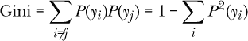

其中*P*(*y*[*i*])是当前节点子集中属于类别*i*的训练样本所占的比例。类之间的完美分割——即全为一类，另一类完全没有——将导致基尼指数为 0。50-50 的分割则基尼指数为 0.5。该算法通过选择使基尼指数最小的候选规则来在每个节点最小化基尼指数。

例如，在图 6-7 中，根节点下方的右侧节点的基尼指数为 0.5。这意味着*上方节点*（即根节点）的规则将导致训练数据的子集满足花瓣长度 > 2.45，并且该子集将在类别 1 和类别 2 之间均匀划分。这就是节点文本中“值”行的含义。它显示了定义节点的子集中的训练样本数量。“类别”行是如果树在该节点停止时所分配的类别。它仅仅是子集中具有最大训练样本数的类别标签。当树被应用到新的、未知的样本时，它会从根节点一直运行到叶节点。

#### 随机森林

当数据是离散的、分类的或有缺失值时，决策树非常有用。连续数据需要先进行分箱（sklearn 会为你处理这一点）。然而，决策树有一个坏习惯，就是*过拟合*训练数据。这意味着它们可能学习到训练数据中的无意义的统计细节，而不是学习到数据中有意义的通用特征，这些特征在应用到未知数据样本时非常有用。决策树也会长得非常大，特别是随着特征数量的增加，除非通过深度参数来管理。

可以通过使用*随机森林*来缓解决策树的过拟合问题。事实上，除非你的问题非常简单，否则你可能从一开始就想使用随机森林。以下三个概念是从决策树到随机森林的过渡：

+   分类器集成与投票

+   通过选择带有*放回*的样本对训练集进行重采样

+   随机特征子集选择

如果我们有一组分类器，每个分类器都在不同的数据或类型上进行训练，例如*k*-最近邻和朴素贝叶斯，我们可以使用它们的输出对任何特定未知样本分配实际类别进行投票。这被称为*集成*，并且随着分类器数量的增加，虽然收益递减，但通常会提高比任何单个分类器更好的性能。我们可以采用类似的思路，想象一个决策树的*森林*，但除非我们对训练集做些更多的处理，否则我们将得到一片*完全相同的*树，因为一个特定的训练样本集将始终导致完全相同的决策树。创建决策树的算法是确定性的——它总是返回相同的结果。

处理你所使用的训练集中特定统计细节的一种方法是从原始训练集中选择一个新的训练集，但允许相同的训练集样本被选中多次。这就是带替换的抽样。可以将其视为从袋子里挑选彩色弹珠，在选择下一个弹珠之前，将刚选的那个放回袋子中，这样你可能会再次选中它。以这种方式选择的新数据集被称为*自助采样*（bootstrap sample）。通过这种方式构建的新数据集集合被称为*袋装法*（bagging），由这些重新抽样的数据集构建的模型就是随机森林。

如果我们训练多个决策树，每棵树都使用带有替换的重新抽样训练集，那么我们将得到一片树森林，其中每棵树都与其他树稍微不同。仅此一项，再加上集成投票，可能就能改进模型。然而，有一个问题。如果某些特征具有很高的预测能力，它们会占主导地位，导致生成的树森林之间非常相似，因此会遭遇类似的弱点。这就是*随机森林*中“随机”部分发挥作用的地方。

如果我们不仅仅是使用袋装法（bagging），即改变每棵树训练集中的样本分布，但不改变检查的特征集，那如果我们每棵树在森林中随机选择一部分*特征*来训练，仅仅在这些特征上训练呢？这样做会打破树之间的相关性，增加森林的整体鲁棒性。实际上，如果每个特征向量有*n*个特征，那么每棵树将随机选择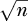个特征来构建树。Random Forest 在 sklearn 中也得到了支持。

### 支持向量机

我们的最终经典机器学习模型是那种在 1990 年代大部分时间里压制神经网络的模型——*支持向量机（SVM）*。如果神经网络是一种高度依赖数据、经验性地生成模型的方法，那么支持向量机则是一种高度优雅、数学基础扎实的方法。我们将在概念层面讨论支持向量机的表现，因为其中涉及的数学超出了我们这里所要介绍的范围。如果你感兴趣，经典参考文献是 Cortes 和 Vapnik（1995 年）撰写的《支持向量网络》。

我们可以通过了解边距、支持向量、优化和核的概念来总结支持向量机的工作原理。让我们逐一讨论这些概念。

#### 边距

图 6-8 展示了一个具有两个特征的二类数据集。我们已经在数据集上绘制了每个样本，其中特征 1 沿 x 轴，特征 2 沿 y 轴。类别 0 用圆圈表示，类别 1 用菱形表示。显然这是一个人为构造的数据集，通过在圆圈和菱形之间绘制一条直线就可以轻松分离。

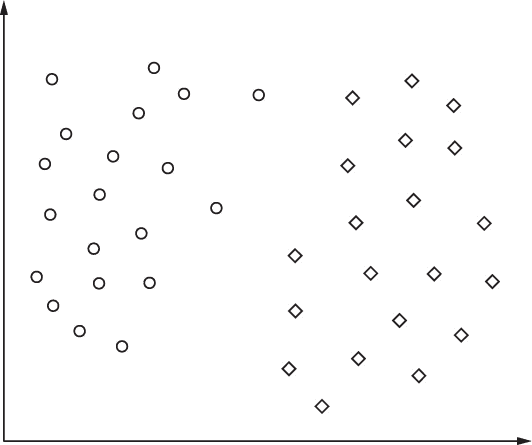

*图 6-8：一个包含两类（圆圈和菱形）和两个特征（x 轴和 y 轴）的玩具数据集*

一个分类器可以被视为找到一个或多个*平面*，将训练数据的空间分成同质的组。在图 6-8 中，分隔的“平面”是直线。如果我们有三个特征，分隔的平面就是一个二维平面。对于四个特征，分隔平面是三维的，对于*n*个维度，分隔平面是*n - 1*维的。由于平面是多维的，我们称其为*超平面*，并且说分类器的目标是使用超平面将训练特征空间划分成不同的组。

如果我们再次查看图 6-8，我们可以想象有一组无限的直线将训练数据分成两组，一组是类 0，另一组是类 1。我们想使用哪一条呢？好吧，先让我们思考一下分隔两类的直线的位置意味着什么。如果我们把直线画得更靠右一些，恰好在任何一个菱形之前，我们就能分隔训练数据，但这只是勉强做到的。回想一下，我们使用训练数据来代替每个类的真实样本分布。我们拥有的训练数据越多，我们就越能忠实地了解这个真实分布。然而，我们并不知道它的真实情况。

一个新的、未知的样本，必须属于类 0 或类 1，将落在图上的某个位置。可以合理地认为，在实际情况中，可能存在类 1（菱形）样本，它们会比训练集中任何样本更接近圆形。如果分隔线靠得太近菱形，我们就有可能将有效的类 1 样本误判为*类 0*，因为分隔线太靠右了。如果我们将分隔线画得非常靠近类 0 点（圆形），我们也面临着类似的风险：将类 0 样本误标为*类 1*（菱形）。

因此，在没有更多训练数据的情况下，选择一条尽可能远离两类的分隔线似乎是最合理的选择。这条线是距离最右边的圆形最远，同时尽可能地靠左于菱形。这条线就是最大间隔位置，其中*间隔*定义为从最近的样本点到分隔线的距离。图 6-9 展示了最大间隔位置，重线表示最大间隔，最大间隔由两条虚线标出。SVM 的目标是找到最大间隔位置，因为这是我们最有可能不误分类新样本的位置，前提是我们从训练集获得的知识。

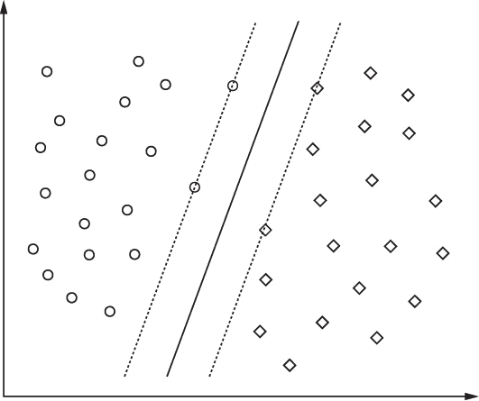

*图 6-9：图 6-8 的玩具数据集，展示了最大间隔分隔线（粗线）和最大间隔（虚线）*

#### 支持向量

再看一下 图 6-9。注意边界上的四个训练数据点吗？这些就是定义边界的训练样本，换句话说，支持边界的样本；因此，它们是 *支持向量*。这就是 *支持向量机* 这个名字的由来。支持向量定义了边界，但我们如何使用它们来定位边界的位置呢？这里我们会简化一下，以避免大量复杂的向量数学，免得弄得更加混乱。如果需要更详细的数学处理，可以参见 Christopher Burges 的 “A Tutorial on Support Vector Machines for Pattern Recognition”（1998）。

#### 优化

从数学上讲，我们可以通过解决一个优化问题来找到最大边界超平面。回想一下，在优化问题中，我们有一个依赖于某些参数的量，我们希望找到使得该量尽可能小或尽可能大的参数值集合。

在 SVM 的情况下，超平面的方向可以通过一个向量来指定，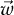。还有一个偏移量 *b*，我们需要找到它。最后，在进行优化之前，我们需要改变指定类标签的方式。我们不再使用 0 或 1 作为 *y*[*i*]（第 *i* 个训练样本 *x*[*i*] 的标签），而是使用 -1 或 +1。这样可以更简单地定义优化问题的条件。

所以，从数学上讲，我们要做的是找到  和 *b*，使得给定所有 *y*[*i*] 标签和 *x*[*i*] 训练向量的条件下，数量 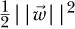 尽可能小。这个优化问题可以通过一种叫做 *二次规划* 的技术轻松解决。（这里我们忽略了另一个重要的数学步骤：实际的优化问题是通过拉格朗日法则解决对偶形式的，但我们会尽量避免过于复杂化问题。）

上述公式是针对数据集只有两个类并且可以被超平面分割的情况。这是线性可分的情况。实际上，正如我们现在所明白的，并不是每个数据集都能这样分割。所以，优化问题的完整形式包括一个修正因子 *C*，它影响找到的边界的大小。这个因子出现在 sklearn 的 SVM 类中，并且需要设置到某个水平。从实际的角度来看，*C* 是 SVM 的 *超参数*，是我们需要设置的值，以便 SVM 正常训练。*C* 的正确值依赖于具体问题。一般来说，模型的任何一个参数如果不是由模型学习到的，而必须在使用模型时设置，比如 SVM 的 *C* 或 *k*-NN 的 *k*，都称为超参数。

#### 核函数

还有一个数学概念需要介绍，配合适当的手势说明。前面的描述适用于线性支持向量机，直接使用训练数据（即 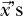）。非线性情况将训练数据通过一个函数映射到另一个空间，通常这个函数被称为 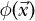，它生成训练数据向量的新版本，! Image。支持向量机算法使用内积，! Image，这意味着映射版本将使用 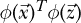。在这种符号表示中，向量被看作是一个列向量，因此 *T*（转置操作）会产生一个行向量。然后，1 × *n* 的行向量与 *n* × 1 的列向量进行常规矩阵乘法，结果是一个 1 × 1 的输出，即标量。内积通常写作

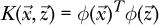

该函数 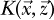 被称为 *核函数*。线性核函数简单地表示为 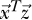，但也可以使用其他核函数。*高斯核函数* 是一种常见的选择，也被称为 *径向基函数（RBF）* 核函数。在实际使用中，除了 *C* 参数外，该核函数还引入了一个新参数，即 *γ*。这个参数与高斯核函数在特定训练点周围的扩展程度相关，较小的值会扩展训练样本的影响范围。通常，使用 *C* 的网格搜索，并在使用 RBF 核函数时，搜索 *γ* 参数，以定位表现最佳的模型。

总结一下，支持向量机（Support Vector Machine）使用训练数据，通过核函数映射，来优化超平面的方向和位置，从而在超平面与训练数据的支持向量之间产生最大间隔。用户需要选择核函数和相关参数，如 *C* 和 *γ*，以使模型最适合训练数据。

支持向量机在 1990 年代和 2000 年代初期主导了机器学习，直到深度学习的出现。之所以如此，是因为支持向量机训练高效，并且不需要大量的计算资源就能取得成功。然而，自从深度学习的到来后，支持向量机略微被边缘化了，因为强大的计算机使得神经网络能够做以前在计算资源有限的情况下无法做到的事情。尽管如此，支持向量机仍然有一席之地。一种流行的方法是使用在特定数据集上训练的大型神经网络，作为对不同数据集的预处理器，并将支持向量机应用于神经网络输出（去除顶层层次后的部分）。

### 摘要

在本章中，我们介绍了六种最常见的经典机器学习模型：最近质心法、*k*-近邻法、朴素贝叶斯、决策树、随机森林和支持向量机（SVM）。这些模型之所以被称为经典，是因为它们已经使用了几十年。如果满足它们最佳支持的条件，这些模型依然具有相关性。有时，经典模型仍然是正确的选择。一位经验丰富的机器学习从业者会知道何时回归经典方法。

在下一章中，我们将通过使用`sklearn`库，利用这些模型进行一系列实验，从而加深我们对模型工作原理的直觉理解，并帮助我们判断何时使用它们。
