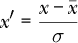
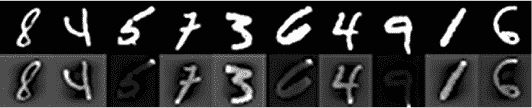
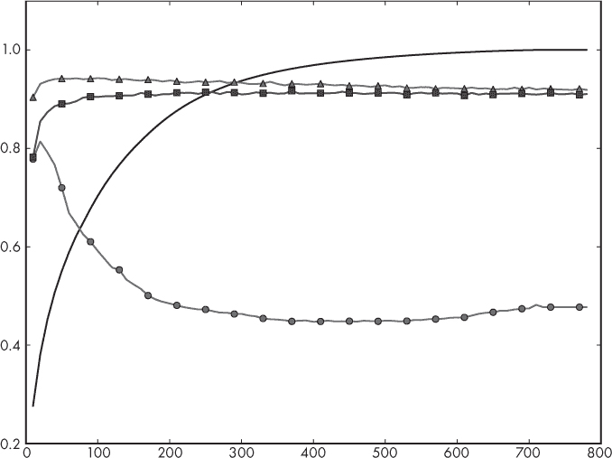
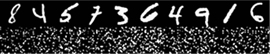

## **7

经典模型实验**

在第六章中，我们介绍了几种经典的机器学习模型。现在，让我们使用在第五章中构建的数据集，并将其与这些模型一起使用，看看它们的表现如何。我们将使用 sklearn 来创建模型，然后通过查看它们在保留的测试集上的表现来进行比较。

这将为我们提供一个关于如何使用 sklearn 的良好概览，并帮助我们建立关于不同模型相互表现的直观感受。我们将使用三个数据集：鸢尾花数据集，包括原始和增强版；乳腺癌数据集；以及 MNIST 手写数字数据集的向量形式。

### 鸢尾花数据集实验

我们将从鸢尾花数据集开始。这个数据集有四个连续特征——萼片长度、萼片宽度、花瓣长度和花瓣宽度——以及三个类别——不同的鸢尾花种类。总共有 150 个样本，每个类别 50 个样本。在第五章中，我们对数据集应用了 PCA 增强，因此我们实际上有两个版本可以使用：原始的 150 个样本和 1200 个增强的训练样本。两者都可以使用相同的测试集。

我们将使用 sklearn 实现我们在第六章中概述的最近质心、*k*-NN、朴素贝叶斯、决策树、随机森林和 SVM 模型的版本。我们将很快看到 sklearn 工具包是多么强大和优雅，因为我们的测试几乎在所有模型中都是相同的。唯一变化的是我们实例化的具体类。

#### 测试经典模型

我们初步测试的代码在清单 7-1 中。

import numpy as np

from sklearn.neighbors import NearestCentroid

from sklearn.neighbors import KNeighborsClassifier

from sklearn.naive_bayes import GaussianNB, MultinomialNB

from sklearn.tree import DecisionTreeClassifier

from sklearn.ensemble import RandomForestClassifier

from sklearn.svm import SVC

❶ def run(x_train, y_train, x_test, y_test, clf):

clf.fit(x_train, y_train)

print("    预测结果  :", clf.predict(x_test))

print("    实际标签：", y_test)

print("    score = %0.4f" % clf.score(x_test, y_test))

print()

def main():

❷ x = np.load("../data/iris/iris_features.npy")

y = np.load("../data/iris/iris_labels.npy")

N = 120

x_train = x[:N]; x_test = x[N:]

y_train = y[:N]; y_test = y[N:]

❸ xa_train=np.load("../data/iris/iris_train_features_augmented.npy")

ya_train=np.load("../data/iris/iris_train_labels_augmented.npy")

xa_test =np.load("../data/iris/iris_test_features_augmented.npy")

ya_test =np.load("../data/iris/iris_test_labels_augmented.npy")

print("最近质心：")

❹ run(x_train, y_train, x_test, y_test, NearestCentroid())

print("k-NN 分类器（k=3）：")

run(x_train, y_train, x_test, y_test,

KNeighborsClassifier(n_neighbors=3))

print("朴素贝叶斯分类器（高斯）：")

❺ run(x_train, y_train, x_test, y_test, GaussianNB())

print("朴素贝叶斯分类器（多项式）：")

run(x_train, y_train, x_test, y_test, MultinomialNB())

❻ print("决策树分类器：")

run(x_train, y_train, x_test, y_test, DecisionTreeClassifier())

print("随机森林分类器（估计器=5）：")

run(xa_train, ya_train, xa_test, ya_test,

RandomForestClassifier(n_estimators=5))

❼ print("支持向量机（线性, C=1.0）：")

run(xa_train, ya_train, xa_test, ya_test, SVC(kernel="linear", C=1.0))

print("支持向量机（RBF, C=1.0, gamma=0.25）：")

run(xa_train, ya_train, xa_test, ya_test,

SVC(kernel="rbf", C=1.0, gamma=0.25))

print("支持向量机（RBF, C=1.0, gamma=0.001, 增强）")

run(xa_train, ya_train, xa_test, ya_test,

SVC(kernel="rbf", C=1.0, gamma=0.001))

❽ print("支持向量机（RBF, C=1.0, gamma=0.001, 原始）")

run(x_train, y_train, x_test, y_test,

SVC(kernel="rbf", C=1.0, gamma=0.001))

*列表 7-1：使用鸢尾花数据集的经典模型。见* iris_experiments.py。

首先，我们导入必要的类和模块。注意，每个类都代表一种单一类型的模型（分类器）。对于朴素贝叶斯分类器，我们使用了两个版本：高斯版本 GaussianNB，因为特征是连续值，和 MultinomialNB 用于离散情况，以展示选择一个不适合数据集的模型的效果。由于 sklearn 为其分类器提供了统一的接口，我们可以通过使用相同的函数来简化操作，训练和测试任何特定的分类器。这个函数是 run ❶。我们传入训练特征（x_train）和标签（y_train），以及测试特征和标签（x_test, y_test）。我们还传入特定的分类器对象（clf）。

我们在 run 函数内做的第一件事是通过调用 fit 方法将模型拟合到数据上，使用训练数据样本和标签进行训练。这是训练步骤。模型训练后，我们可以通过调用 predict 方法并使用保留的测试数据来测试模型的表现。该方法会返回每个测试样本的预测类别标签。我们从 150 个原始样本中保留了 30 个，所以 predict 会返回一个包含 30 个类别标签的向量，我们将其打印出来。接下来，我们打印实际的测试标签，以便与预测结果进行视觉上的对比。最后，我们使用 score 方法，将分类器应用于测试数据（x_test），并使用已知的测试标签（y_test）来计算总体准确率。

准确率返回的是一个介于 0 和 1 之间的分数。如果每个测试样本都被标记为错误，准确率将为 0。即使是随机猜测，也能比这做得更好，所以返回值为 0 意味着出了问题。由于鸢尾花数据集有三个类别，我们期望一个随机猜测类别的分类器能正确约三分之一的时间，返回一个接近 0.3333 的值。实际得分的计算公式为：

score = *N[c]* / (*N[c]* + *N[w]*)

其中 *N*[*c*] 是预测类正确的测试样本数量；也就是说，它与 y_test 中的类标签匹配。*N*[*w*] 是预测类与实际类标签不匹配的测试样本数量。

现在我们有了一种训练和测试每个分类器的方法，接下来只需要加载数据集并通过创建不同的分类器对象并传递给运行函数来进行一系列实验。在 main 函数中，我们首先加载原始的鸢尾花数据集，并将其分为训练集和测试集❷。我们还加载了我们在第五章中创建的增强版鸢尾花数据集❸。设计上，这两个测试集是相同的，所以无论使用哪个训练集，测试集都会是一样的。这简化了我们的比较。

然后我们定义并执行最近质心分类器❹。输出如下：

最近质心分类器：

预测结果  ：[011202120211112202201101102211]

实际标签：[011202120211112202201101102211]

得分 = 1.0000

我们去掉了空格，以便更直观地比较预测标签和实际标签。如果有错误，0–2 的相应值在两行之间将不匹配。得分也会显示出来。在这个例子中，得分为 1.0，这告诉我们分类器在保留的测试集上做得非常好。这个结果并不令人惊讶；鸢尾花数据集是一个简单的数据集。由于在第五章中创建鸢尾花数据集时进行了随机化，你可能会得到一个不同的总得分。然而，除非你的随机化过程特别不幸运，否则你应该会得到一个很高的测试得分。

根据我们在第六章学到的内容，我们应该预期，如果最近的质心分类器在测试数据上完美，那么所有其他更复杂的模型也会同样完美。这里通常是这样，但正如我们将看到的，不小心选择模型类型或模型超参数值，甚至更复杂的模型也会表现较差。

再次查看 Feyman 学习法，我们通过传递 GaussianNB 实例来训练一个高斯朴素贝叶斯分类器并运行❺。该分类器也是完美的，并返回一个 1.0 的分数。这是使用连续值与朴素贝叶斯分类器的正确方法。如果我们用离散情况，而我们拥有的是连续特征，结果会怎么样呢？这就是 MultinomialNB 分类器，它假设特征是从一个离散的可能值集合中选择的。对于鸢尾花数据集，我们可以定义这样的分类器，因为特征值是非负的。然而，由于特征不是离散的，这个模型并不完美，返回了以下结果：

朴素贝叶斯分类器（多项式）：

预测结果  ：[011202220211122202202101102221]

实际标签：[011202120211112202201101102211]

得分 = 0.8667

在这里，我们看到分类器在测试样本上的准确率仅为 86.7%。如果我们需要离散的概率计数，为什么这种方法在这种情况下仍然有效呢？答案可以在 sklearn 的 MultinomialNB 分类器源代码中找到。该方法通过 np.dot 计算每个类别的特征频率，即使特征值是连续的，输出也会是一个有效的数字，尽管不是整数。不过，仍然犯了一些错误，所以我们不应该感到高兴。相反，我们应该小心选择适合我们实际数据的分类器类型。

我们在清单 7-1 中训练的下一个模型是决策树❻。这个分类器在该数据集上表现完美，接下来训练的随机森林也是如此。请注意，随机森林使用了五个估计器，这意味着创建并训练了五棵随机树；通过在各个输出之间投票来确定最终的类别标签。还需要注意，随机森林是使用增强的鸢尾花数据集 xa_train 进行训练的，因为未增强的数据集中的训练样本数量有限。

然后，我们训练了几个 SVM 分类器❼，同样是在增强的数据集上。回顾一下，SVM 有两个我们可以控制的参数：边界常数 C 和高斯核使用的 gamma。

第一个是线性支持向量机（SVM），意味着我们需要为边界常数（C）设置一个值。我们将 C 定义为 1.0，这是 sklearn 的默认值。这个分类器在测试数据上表现完美，接下来的分类器也使用高斯核，并且我们将*γ*设置为 0.25。SVC 类的默认 gamma 值是 auto，它将*γ*设置为 1/*n*，其中*n*是特征的数量。对于鸢尾花数据集，*n* = 4，因此*γ* = 0.25。

接下来，我们训练了一个*γ*非常小的模型。该分类器在测试数据上的表现依然完美。最后，我们训练了相同类型的支持向量机（SVM），但是使用的是原始训练数据❽，而不是增强的训练数据。这个分类器并不完美：

SVM (RBF, C=1.0, gamma=0.001, 原始数据)

predictions  :[022202020222222202202202202220]

实际标签：[011202120211112202201101102211]

score = 0.5667

事实上，它的表现相当糟糕。它从不预测类别 1，且仅 56.7%的时间预测正确。这表明数据增强是有价值的，因为它将一个糟糕的分类器转变为一个不错的分类器——至少，从我们使用的小型测试集来看，它表现得还不错！

#### 实现最近质心分类器

如果我们被困在一个荒岛上，没有访问 sklearn 的权限，能否仍然快速构建一个适合鸢尾花数据集的分类器呢？答案是“能”，正如清单 7-2 所示。此代码实现了一个快速而简陋的最近质心分类器，用于鸢尾花数据集。

import numpy as np

❶ def centroids(x,y):

c0 = x[np.where(y==0)].mean(axis=0)

c1 = x[np.where(y==1)].mean(axis=0)

c2 = x[np.where(y==2)].mean(axis=0)

return [c0,c1,c2]

❷ def predict(c0,c1,c2,x):

p = np.zeros(x.shape[0], dtype="uint8")

for i in range(x.shape[0]):

d = [((c0-x[i])**2).sum(),

((c1-x[i])**2).sum(),

((c2-x[i])**2).sum()]

p[i] = np.argmin(d)

return p

def main():

❸ x = np.load("../data/iris/iris_features.npy")

y = np.load("../data/iris/iris_labels.npy")

N = 120

x_train = x[:N]; x_test = x[N:]

y_train = y[:N]; y_test = y[N:]

c0, c1, c2 = centroids(x_train, y_train)

p = predict(c0,c1,c2, x_test)

nc = len(np.where(p == y_test)[0])

nw = len(np.where(p != y_test)[0])

acc = float(nc) / (float(nc)+float(nw))

print("预测结果:", p)

print("实际值   :", y_test)

print("测试准确率 = %0.4f" % acc)

*清单 7-2：为鸢尾花数据集编写的快速简易最近质心分类器。请参见* iris_centroids.py。

我们加载了鸢尾花数据集，并像之前一样将其分为训练集和测试集 ❸。质心函数返回三个类别的质心 ❶。我们可以通过找到每个训练样本中所需类别的每个特征的均值来轻松计算这些质心。这就是训练这个模型所需的全部。如果我们将返回的质心与之前训练的最近质心分类器中的质心（参见 centroids_ 成员变量）进行比较，我们会得到完全相同的值。

使用分类器非常直接，如 predict 所示 ❷。首先，我们定义了一个预测向量，每个测试样本（x）对应一个预测值。循环定义了 d，这是一个从当前测试样本 x[i] 到三个类别质心的欧几里得距离向量。d 中最小距离的索引即为预测的类别标签（p[i]）。

让我们再详细解释一下 d。我们将 d 设置为一个包含三个值的列表，表示从质心到当前测试样本的距离。这个表达式

((c0-x[i])**2).sum()

有点密集。表达式 c0-x[i] 返回一个四个数字的向量——四个是因为我们有四个特征。这些是类别 0 的质心与测试样本特征值之间的差异。这个量会被平方，平方每一个值。这个平方后的向量会逐元素求和，得到距离度量。

严格来说，我们还缺少最后一步。c0 和 x[i] 之间的实际距离是该值的平方根。由于我们只是寻找到每个质心的最小距离，因此我们不需要计算平方根。无论我们是否对所有值取平方根，最小值仍然是最小值。运行这段代码会产生与之前看到的最近质心分类器相同的输出，这令人鼓舞。

鸢尾花数据集非常简单，因此即使我们看到不小心选择模型类型和超参数会给我们带来麻烦，我们也不应该对模型的优秀表现感到惊讶。现在我们来看一个更大的数据集，它有更多的特征，且并非一个玩具数据集。

### 胸腺癌数据集实验

我们在第五章中开发的二分类乳腺癌数据集包含 569 个样本，每个样本有 30 个特征，所有测量来自组织学切片。共有 212 个恶性病例（类 1）和 357 个良性病例（类 0）。让我们在这个数据集上训练我们的经典模型，看看能得到什么样的结果。由于所有特征都是连续的，我们将使用该数据集的归一化版本。回想一下，归一化的数据集是指，在特征向量的每个特征上，先减去该特征的均值，然后再除以标准差：

数据集的归一化将所有特征映射到相同的总体范围内，使得一个特征的值与另一个特征的值相似。这有助于许多模型类型，并且是一个典型的数据预处理步骤，如我们在第四章中讨论过的。

#### 两次初始测试运行

首先，我们将像上一节那样，使用单次测试划分进行快速运行。代码见列表 7-3，该代码与我们之前描述的代码相似，其中我们传入模型实例，训练它，然后使用测试数据进行评分。

import numpy as np

from sklearn.neighbors import NearestCentroid

from sklearn.neighbors import KNeighborsClassifier

from sklearn.naive_bayes import GaussianNB, MultinomialNB

from sklearn.tree import DecisionTreeClassifier

from sklearn.ensemble import RandomForestClassifier

from sklearn.svm import SVC

def run(x_train, y_train, x_test, y_test, clf):

clf.fit(x_train, y_train)

print("    score = %0.4f" % clf.score(x_test, y_test))

print()

def main():

x = np.load("../data/breast/bc_features_standard.npy")

y = np.load("../data/breast/bc_labels.npy")

❶ N = 455

x_train = x[:N];  x_test = x[N:]

y_train = y[:N];  y_test = y[N:]

print("最近质心:")

run(x_train, y_train, x_test, y_test, NearestCentroid())

print("k-NN 分类器 (k=3):")

run(x_train, y_train, x_test, y_test,

KNeighborsClassifier(n_neighbors=3))

print("k-NN 分类器 (k=7):")

run(x_train, y_train, x_test, y_test,

KNeighborsClassifier(n_neighbors=7))

print("朴素贝叶斯分类器 (高斯):")

run(x_train, y_train, x_test, y_test, GaussianNB())

print("决策树分类器:")

run(x_train, y_train, x_test, y_test, DecisionTreeClassifier())

print("随机森林分类器 (估计器=5):")

run(x_train, y_train, x_test, y_test,

RandomForestClassifier(n_estimators=5))

print("随机森林分类器 (估计器=50):")

run(x_train, y_train, x_test, y_test,

RandomForestClassifier(n_estimators=50))

print("SVM (线性, C=1.0):")

run(x_train, y_train, x_test, y_test, SVC(kernel="linear", C=1.0))

print("SVM (RBF, C=1.0, gamma=0.03333):")

run(x_train, y_train, x_test, y_test,

SVC(kernel="rbf", C=1.0, gamma=0.03333))

*列表 7-3：使用乳腺癌数据集的初始模型。见* bc_experiments.py。

如前所述，我们加载数据集并将其拆分为训练数据和测试数据。我们保留 569 个样本中的 455 个用于训练（80%），其余的 114 个样本为测试集（74 个良性，40 个恶性）。数据集已随机化，因此我们跳过这一步。接着，我们训练了九个模型：最近质心（1），*k*-NN（2），朴素贝叶斯（1），决策树（1），随机森林（2），线性 SVM（1），以及 RBF SVM（1）。对于支持向量机，我们使用默认的*C*值，对于*γ*，我们使用 1/30 = 0.033333，因为我们有 30 个特征。运行这段代码后，我们得到了表 7-1 中的得分。

**表 7-1：** 乳腺癌模型得分

| **模型类型** | **得分** |
| --- | --- |
| 最近质心 | 0.9649 |
| 3-NN 分类器 | 0.9912 |
| 7-NN 分类器 | 0.9737 |
| 朴素贝叶斯（高斯） | 0.9825 |
| 决策树 | 0.9474 |
| 随机森林（5） | 0.9298 |
| 随机森林（50） | 0.9737 |
| 线性 SVM（C = 1） | 0.9737 |
| RBF SVM（C = 1，*γ* = 0.03333） | 0.9825 |

请注意，随机森林分类器括号中的数字表示估计器的数量（森林中的树木数量）。

有几点引起了我们的注意。首先，可能出乎意料的是，简单的最近质心分类器几乎在 97%的时间里都能正确分类。我们还发现，除了决策树和五棵树的随机森林，所有其他分类器的表现都超过了最近质心分类器。有些令人惊讶的是，朴素贝叶斯分类器表现得非常好，与 RBF SVM 不相上下。*k* = 3 的最近邻分类器表现最好，准确率高达 99%，尽管我们有 30 个特征，这意味着我们的 569 个样本散布在 30 维空间中。回想一下，*k*-NN 的一个弱点是维度灾难：随着特征数量的增加，它需要更多的训练样本。所有分类器的结果都很好，这也提示我们，对于这个数据集，恶性和良性之间的区别是显而易见的。使用这些特征时，两个类别之间几乎没有重叠。

那么，我们对这个数据集处理完成了吗？当然没有！实际上，我们才刚刚开始。如果我们第二次运行代码，会发生什么？我们会得到相同的得分吗？我们是否期望得到不同的结果？第二次运行给了我们表 7-2 中的得分。

**表 7-2：** 乳腺癌得分，第二次运行

| **模型类型** | **得分** |
| --- | --- |
| 最近质心 | 0.9649 |
| 3-NN 分类器 | 0.9912 |
| 7-NN 分类器 | 0.9737 |
| 朴素贝叶斯（高斯） | 0.9825 |
| 决策树 | **0.9386** |
| 随机森林（5） | **0.9474** |
| 随机森林（50） | **0.9649** |
| 线性 SVM（C = 1） | 0.9737 |
| RBF SVM（C = 1，*γ* = 0.03333） | 0.9825 |

我们已标出改变的得分。为什么会有变化？稍作反思就能得到一个*aha!*时刻：随机森林本身就是随机的，因此我们自然会期望每次运行时结果不同。那么决策树呢？在 sklearn 中，决策树分类器会随机选择一个特征并找到最佳划分，因此不同的运行也会导致不同的树。这是我们在第六章中讨论的基本决策树算法的一个变体。

所有其他算法都是固定的：对于给定的训练数据集，它们只能生成一个模型。顺便提一下，sklearn 中的 SVM 实现确实使用了随机数生成器，因此有时不同的运行会得到略微不同的结果，但从概念上讲，对于相同的输入数据，我们期望得到相同的模型。然而，基于树的分类器在训练过程中会发生变化。我们将在接下来探讨这种变化。现在，我们需要为我们的快速分析增加一些严谨性。

#### 随机拆分的效果

让我们改变训练数据和测试数据之间的拆分，看看我们的结果会发生什么。我们不需要再次列出所有代码，因为唯一的变化是如何定义 x_train 和 x_test。在拆分之前，我们通过首先固定伪随机数种子来随机化整个数据集的顺序，以确保每次运行时数据集的顺序相同。

再次查看 Feyman 学习法，在❶之前插入以下代码，以便我们生成数据集（idx）的固定排列。

np.random.seed(12345)

idx = np.argsort(np.random.random(y.shape[0]))

x = x[idx]

y = y[idx]

它是固定的，因为我们固定了伪随机数生成器的种子值。然后我们重新排列样本（x）和标签（y），并像以前一样将它们分割为训练集和测试集。运行这段代码会给我们在表 7-3 中的结果。

**表 7-3：** 随机化数据集后的乳腺癌得分

| **模型类型** | **得分** |
| --- | --- |
| 最近质心 | 0.9474 |
| 3-NN 分类器 | 0.9912 |
| 7-NN 分类器 | 0.9912 |
| 朴素贝叶斯（高斯） | 0.9474 |
| 决策树 | 0.9474 |
| 随机森林 (5) | 0.9912 |
| 随机森林 (50) | 1.0000 |
| 线性 SVM (C = 1) | 0.9649 |
| RBF SVM (C = 1, *γ* = 0.03333) | 0.9737 |

请注意，这些结果与我们之前的结果完全不同。*k*-NN 分类器表现一样好，SVM 分类器表现较差，而 50 棵树的随机森林在测试集上实现了完美。因此，发生了什么？为什么每次运行会得到这么不同的结果？

我们看到了构建训练集和测试集分割时随机抽样的效果。第一次分割恰好使用了一种样本排序，这对某种模型类型得到了较好的结果，而对其他模型类型则结果较差。新的分割偏向于不同的模型类型。哪个是正确的？两者都是。回想一下数据集代表的是什么：它是从某个未知的母体分布中抽样得到的，生成了我们实际拥有的数据。如果我们从这个角度思考，就会发现我们拥有的数据集是不完整的，它只是对真实母体分布的一个片面描述。它有偏差，尽管我们不一定知道这些偏差是什么，而且它也不完全代表母体分布的所有部分。

此外，当我们在随机化顺序后拆分数据时，可能会得到“糟糕”的训练集或测试集混合——这种混合的数据未能很好地代表真实分布。如果是这样，我们可能会训练一个模型去识别一个与真实分布不太匹配的稍有不同的分布，或者测试集可能是一个糟糕的混合，不能公平地代表模型已经学习到的内容。当类别的比例使得一个或多个类别较为稀有，且可能在训练集或测试集中没有出现时，这种效果会更加明显。这正是导致我们在第四章中引入*k*倍交叉验证的原因。通过*k*倍交叉验证，我们确保每个样本在某些时候都能作为训练集和测试集使用，并通过在所有折叠中平均结果，帮助我们避免因分割不均而带来的风险。

然而，在我们将 *k* 倍交叉验证应用于乳腺癌数据集之前，我们应该注意一件重要的事情。我们修改了列表 7-3 中的代码，固定了伪随机数种子，这样每次运行时我们都能以完全相同的方式重新排序数据集。然后我们运行了代码并看到了结果。如果我们重新运行代码，我们将得到*完全*相同的输出，即使是对于基于树的分类器也是如此。这与我们之前看到的不同。树分类器是*随机的*——它们每次都会生成一个独特的树或森林——因此我们应该期望每次运行的结果会有所不同。但现在它们不再变化；我们每次都会得到相同的输出。通过显式设置 NumPy 伪随机数种子，我们不仅固定了数据集的排序，还固定了 sklearn 在生成树模型时使用的*伪随机序列*的顺序。这是因为 sklearn 也使用了 NumPy 的伪随机数生成器。这是一个微妙的效果，可能带来严重后果，在更大的项目中，可能很难察觉为一个 bug。解决方案是在重新排序数据集后，将种子设置为一个随机值。我们可以在`y = y[idx]`之后添加一行代码来实现这一点。

np.random.seed()

这样，伪随机数生成器通过使用系统状态进行重置，通常是从 */dev/urandom* 读取。现在，当我们重新运行时，我们将得到不同的树模型结果，如之前一样。

#### 添加 k 折验证

要实现 *k*-折验证，我们首先需要为 *k* 选择一个值。我们的数据集有 569 个样本。我们希望将其拆分，使每个折叠中都有合理数量的样本，因为我们希望测试集能够合理代表数据。这表明 *k* 应该设得比较小。但我们也希望平均掉不好的拆分结果，因此我们可能希望 *k* 设置得大一些。正如生活中的大多数事情一样，需要寻找到一个平衡。如果我们设置 *k* = 5，那么每个拆分将得到 113 个样本（忽略最后的四个样本，因为它们不会产生重大影响）。这将每次组合折叠时训练 80% 的数据，测试 20% 的数据，这是一个合理的做法。因此，我们将使用 *k* = 5，但我们会编写代码，以便在需要时调整 *k*。

我们已经有了一种方法来训练多个模型，并进行训练/测试拆分。我们需要做的就是添加代码来生成每个*k*折叠，然后在它们上训练模型。相关代码见 Listing 7-4 和 Listing 7-5，它们分别展示了辅助函数和主函数。让我们从 Listing 7-4 开始。

导入 numpy 为 np

从 sklearn.neighbors 导入 NearestCentroid

从 sklearn.neighbors 导入 KNeighborsClassifier

从 sklearn.naive_bayes 导入 GaussianNB, MultinomialNB

从 sklearn.tree 导入 DecisionTreeClassifier

从 sklearn.ensemble 导入 RandomForestClassifier

从 sklearn.svm 导入 SVC

导入 sys

定义 run(x_train, y_train, x_test, y_test, clf):

clf.fit(x_train, y_train)

返回 clf.score(x_test, y_test)

定义 split(x,y,k,m):

❶ ns = int(y.shape[0]/m)

s = []

对于 i 在 range(m) 中:

❷ s.append([x[(ns*i):(ns*i+ns)],

y[(ns*i):(ns*i+ns)]])

x_test, y_test = s[k]

x_train = []

y_train = []

对于 i 在 range(m) 中:

如果 (i==k):

继续

否则：

a,b = s[i]

x_train.append(a)

y_train.append(b)

❸ x_train = np.array(x_train).reshape(((m-1)*ns,30))

y_train = np.array(y_train).reshape((m-1)*ns)

返回 [x_train, y_train, x_test, y_test]

定义 pp(z,k,s):

m = z.shape[1]

打印("%-19s: %0.4f +/- %0.4f | " % (s, z[k].mean(),

z[k].std()/np.sqrt(m)), 结束='')

对于 i 在 range(m) 中:

打印("%0.4f " % z[k,i], 结束='')

打印()

*Listing 7-4: 使用 k 折验证评估乳腺癌数据集。辅助函数。请参见* bc_kfold.py。

清单 7-4 开始时包含了我们之前用过的所有模块，然后定义了三个函数：run、split 和 pp。run 函数看起来很熟悉。它接受训练集、测试集和模型实例，训练模型并用测试集对模型进行评分。pp 函数是一个漂亮打印函数，用于显示每个分割的分数以及所有分割的平均分数。平均值以均值±均值标准误差的形式显示。回想一下，sklearn 中的分数是模型在测试集上的整体准确性，或者是模型预测测试样本实际类别的次数的比例。完美的分数是 1.0，而完全失败的分数是 0.0。完全失败是很少发生的，因为即使是随机猜测也会在某些情况下猜对。

在清单 7-4 中，唯一有趣的函数是 split。它的参数包括完整数据集 x、相应的标签 y、当前折叠数 k 和总折叠数 m。我们将把完整数据集分成*m*个不同的子集，即折叠，并使用第*k*个折叠作为测试集，同时将其余的*m - 1*个折叠合并为一个新的训练集。首先，我们设置每个折叠的样本数❶。然后，循环会创建一个折叠列表 s，列表中的每个元素都包含该折叠的特征向量和标签❷。

测试集很简单，就是第*k*个折叠，所以我们接下来设置这些值（x_test，y_test）。然后，循环会将剩下的*m - 1*个折叠合并成一个新的训练集 x_train，并附上标签 y_train。

循环后的两行代码有点神秘❸。当循环结束时，x_train 是一个*列表*，其中的每个元素是一个代表我们想要放入训练集的折叠特征向量的列表。因此，我们首先将这个列表转化为一个 NumPy 数组，然后进行重塑，使得 x_train 具有 30 列（每个特征向量的特征数），并且有*n**s*行，其中*n*[*s*]是每个折叠中的样本数。因此，x_train 变成了 x 减去我们放入测试折叠中的样本，即第*k*个折叠的样本。我们还构建了 y_train，使得每个特征向量对应正确的标签。

清单 7-5 展示了如何使用这些辅助函数。

def main():

x = np.load("../data/breast/bc_features_standard.npy")

y = np.load("../data/breast/bc_labels.npy")

idx = np.argsort(np.random.random(y.shape[0]))

x = x[idx]

y = y[idx]

❶ m = int(sys.argv[1])

z = np.zeros((8,m))

for k in range(m):

x_train, y_train, x_test, y_test = split(x,y,k,m)

z[0,k] = run(x_train, y_train, x_test, y_test,

NearestCentroid())

z[1,k] = run(x_train, y_train, x_test, y_test,

KNeighborsClassifier(n_neighbors=3))

z[2,k] = run(x_train, y_train, x_test, y_test,

KNeighborsClassifier(n_neighbors=7))

z[3,k] = run(x_train, y_train, x_test, y_test,

GaussianNB())

z[4,k] = run(x_train, y_train, x_test, y_test,

DecisionTreeClassifier())

z[5,k] = run(x_train, y_train, x_test, y_test,

RandomForestClassifier(n_estimators=5))

z[6,k] = run(x_train, y_train, x_test, y_test,

RandomForestClassifier(n_estimators=50))

z[7,k] = run(x_train, y_train, x_test, y_test,

SVC(kernel="linear", C=1.0))

pp(z,0,"最近邻"); pp(z,1,"3-NN")

pp(z,2,"7-NN");    pp(z,3,"朴素贝叶斯")

pp(z,4,"决策树");    pp(z,5,"随机森林 (5)")

pp(z,6,"随机森林 (50)");    pp(z,7,"支持向量机 (线性)")

*清单 7-5：使用 k 折交叉验证评估乳腺癌数据集。主要代码。请参见* bc_kfold.py。

在 main 中，我们首先加载完整的数据集并随机化顺序。折叠的数量*m*从命令行读取❶，并用于创建输出数组 z。这个数组保存我们将训练的每个模型在每个折叠上的得分，因此它的形状是 8 × *m*。回想一下，当从命令行运行 Python 脚本时，任何在脚本名后传递的参数都会出现在 sys.argv 中，这是一个字符串列表。这就是为什么参数会传递给 int 进行转换成整数❶的原因。

接下来，我们遍历*m*折，其中*k*是我们用于测试数据的折叠。我们创建拆分，然后使用这个拆分来训练之前训练的八种模型类型。每次调用 run 都会训练一种指定类型的模型，并返回通过该模型对*k*折叠进行测试后得到的得分。我们将这些结果存储在 z 中。最后，我们使用 pp 显示每个模型类型和每个折叠的得分以及所有折叠的平均得分。

在* k * = 5 的情况下，仅显示折叠平均分数的这段代码执行示例，结果见表 7-4。

**表 7-4：** 乳腺癌数据集的五折平均得分

| **模型** | **均值** ± **标准误差** |
| --- | --- |
| 最近质心 | 0.9310 ± 0.0116 |
| 3-NN | 0.9735 ± 0.0035 |
| 7-NN | 0.9717 ± 0.0039 |
| 朴素贝叶斯 | 0.9363 ± 0.0140 |
| 决策树 | 0.9027 ± 0.0079 |
| 随机森林 (5) | 0.9540 ± 0.0107 |
| 随机森林 (50) | 0.9540 ± 0.0077 |
| 支持向量机 (线性) | 0.9699 ± 0.0096 |

这里我们展示了每个模型在所有折叠上的平均表现。理解这些结果的一种方式是：如果我们使用数据集中的*所有*数据来训练模型，并将其在来自相同母体分布的新样本上进行测试，那么每种模型类型的表现应该大致是这样的。事实上，在实际操作中，我们确实会这样做，因为我们可以假设制作模型的初衷是为了将来某些目的使用它。

第二次运行代码时设置*k* = 5，出现了一组新的输出结果。这是因为我们在每次运行时都随机化了数据集的顺序（列表 7-5）。这就产生了新的分割，并意味着每次运行时，每个模型都将基于数据集的不同子集进行训练。因此，我们应该期待不同的结果。让我们在*k* = 5 时运行代码 1,000 次。请注意，在一台标准桌面计算机上训练这么多模型大约需要 20 分钟。每次运行时，我们将获得五折交叉验证的平均得分。然后我们计算这些平均值的均值，这个均值就是**总均值**。表 7-5 展示了结果。

**表 7-5：** 乳腺癌得分作为 1,000 次运行中五折交叉验证的总均值

| **模型** | **总均值** ± **标准误差** |
| --- | --- |
| 最近质心法 | 0.929905 ± 0.000056 |
| 3-NN | 0.966334 ± 0.000113 |
| 7-NN | 0.965496 ± 0.000110 |
| 朴素贝叶斯 | 0.932973 ± 0.000095 |
| 决策树 | 0.925706 ± 0.000276 |
| 随机森林（5） | 0.948378 ± 0.000213 |
| 随机森林（50） | 0.958845 ± 0.000135 |
| SVM（线性） | 0.971871 ± 0.000136 |

我们可以将这些总均值视为对每个模型在一组新的未知特征向量上的表现的预期。均值的小标准误差表明的是均值的已知程度，而不是该类型的模型在数据集上训练后的表现如何。我们使用总均值来帮助我们对模型进行排序，以便可以选择一个模型而不是另一个。

按照得分从高到低对模型进行排名，结果如下：

1.  SVM（线性）

1.  *k*-NN (*k* = 3)

1.  *k*-NN (*k* = 7)

1.  随机森林（50）

1.  随机森林（5）

1.  朴素贝叶斯（高斯）

1.  最近质心法

1.  决策树

这个结果很有趣，因为我们可能预期 SVM 是最好的，但很可能会认为随机森林要比*k*-NN 表现更好。决策树没有我们想象中的好，且准确度低于最近质心分类器。

这里有一些评论需要说明。首先，注意这些结果是通过在 1,000 种数据集顺序上训练 8,000 个不同模型得到的。当我们研究神经网络时，会看到更长的训练时间。实验经典机器学习模型通常较为简单，因为对参数的每一次更改并不需要进行长时间的训练。

第二，我们没有尝试优化任何模型的超参数。这些超参数有些是间接的，例如假设特征是正态分布的，这样高斯朴素贝叶斯分类器是合理的选择，而其他超参数则是数值型的，例如*k*-NN 中的邻居数量或随机森林中的树木数量。如果我们想要为这个数据集开发一个好的经典分类器，我们必须探索其中一些超参数。理想情况下，我们需要对每个新的超参数设置重复实验多次，得到一个紧密的均值评分，就像我们之前通过 1,000 次运行得到的总体均值那样。在下一部分，我们将进一步探讨如何搜索适合我们数据集的良好超参数。

#### 超参数搜索

让我们探索一些超参数对不同模型类型的影响。具体来说，让我们看看是否可以优化我们对*k*的选择，用于*k*-NN、随机森林的森林大小，以及线性 SVM 的*C*边际大小。

##### 微调我们的*k*-NN 分类器

因为*k*-NN 分类器中的邻居数量是一个整数，通常是奇数，所以通过改变*k*来重复我们的五折交叉验证实验是比较简单的，*k* ∈ *{*1,3,5,7,9,11,13,15*}*。为了做到这一点，我们只需要修改代码清单 7-5 中的主循环，使每次调用 run 时使用不同数量邻居的 KNeighborsClassifier，代码如下。

for k in range(m):

x_train, y_train, x_test, y_test = split(x,y,k,m)

z[0,k] = run(x_train, y_train, x_test, y_test,

KNeighborsClassifier(n_neighbors=1))

z[1,k] = run(x_train, y_train, x_test, y_test,

KNeighborsClassifier(n_neighbors=3))

z[2,k] = run(x_train, y_train, x_test, y_test,

KNeighborsClassifier(n_neighbors=5))

z[3,k] = run(x_train, y_train, x_test, y_test,

KNeighborsClassifier(n_neighbors=7))

z[4,k] = run(x_train, y_train, x_test, y_test,

KNeighborsClassifier(n_neighbors=9))

z[5,k] = run(x_train, y_train, x_test, y_test,

KNeighborsClassifier(n_neighbors=11))

z[6,k] = run(x_train, y_train, x_test, y_test,

KNeighborsClassifier(n_neighbors=13))

z[7,k] = run(x_train, y_train, x_test, y_test,

KNeighborsClassifier(n_neighbors=15))

使用每次对完整数据集进行随机排序的五折交叉验证代码进行 1,000 次重复后的总体均值，结果见表 7-6。

**表 7-6：** 乳腺癌评分的总体均值，不同 k 值和五折交叉验证的结果

| ***k*** | **总体均值** ± **标准误差** |
| --- | --- |
| 1 | 0.951301 ± 0.000153 |
| 3 | 0.966282 ± 0.000112 |
| 5 | 0.965998 ± 0.000097 |
| 7 | 0.96520 ± 0.000108 |
| **9** | **0.967011** ± **0.000100** |
| 11 | 0.965069 ± 0.000107 |
| 13 | 0.962400 ± 0.000106 |
| 15 | 0.959976 ± 0.000101 |

我们特别强调了*k* = 9，因为它返回了最高的得分。这表明我们可能希望对这个数据集使用*k* = 9。

##### 微调我们的随机森林

让我们看看随机森林模型。sklearn 的 RandomForestClassifier 类有许多超参数可以调整。为了避免过于繁琐，我们只寻求森林中最优的树木数量。这就是 n_estimators 参数。像调整*k*在*k*-NN 中一样，我们将对不同的森林大小进行搜索，并选择在每次运行 1000 次五折交叉验证中提供最佳总体均值的那个大小。

这是一种一维的网格搜索。我们将*k*调整为 1，但对于森林中树木的数量，我们需要覆盖更大的范围。我们不期望森林中有 10 棵树和 11 棵树之间存在显著差异，尤其是考虑到即使树的数量固定，每次训练随机森林时也会得到不同的树木集合。我们在前面的章节中多次观察到了这一效应。相反，我们将通过从*n*[*t*] ∈ *{*5,20,50,100,200,500,1000,5000*}*中选择来调整树木的数量，其中*n*[*t*]是森林中的树木数量（估算器的数量）。运行此搜索将给我们在表 7-7 中的总体均值。

**表 7-7：** 不同随机森林大小和五折验证的乳腺癌分数的总体均值

| ***n[t]*** | **总体均值** ± **标准误差（SE）** |
| --- | --- |
| 5 | 0.948327 ± 0.000206 |
| 20 | 0.956808 ±0.000166 |
| 50 | 0.959048 ± 0.000139 |
| 100 | 0.959740 ± 0.000130 |
| 200 | 0.959913 ± 0.000122 |
| 500 | 0.960049 ± 0.000117 |
| 750 | 0.960147 ± 0.000118 |
| 1000 | 0.960181 ± 0.000116 |

首先要注意的是，差异非常小，尽管如果你运行 Mann–Whitney U 检验，你会发现*n*[*t*] = 5（最差）和*n*[*t*] = 1000（最好）之间的差异在统计上是显著的。然而，*n*[*t*] = 200 和*n*[*t*] = 1000 之间的差异并不显著。在这里，我们需要做出判断。设置*n*[*t*] = 1000 确实得到了最佳结果，但从实际角度来看，它与*n*[*t*] = 500 甚至*n*[*t*] = 100 没有可区分的差异。由于随机森林的运行时间与树木数量呈线性关系，因此使用*n*[*t*] = 100 的分类器平均比使用*n*[*t*] = 1000 的要快 10 倍。因此，根据任务的不同，可能会选择*n*[*t*] = 100 而不是*n*[*t*] = 1000。

##### 微调我们的支持向量机（SVM）

让我们将注意力转向线性支持向量机（SVM）。对于线性核函数，我们将调整*C*。请注意，sklearn 还提供了其他参数，就像在随机森林中一样，但我们将保持其默认设置。

我们应该搜索哪个范围的*C*值？答案取决于具体问题，但 sklearn 的默认*C* = 1 是一个不错的起点。我们将选择围绕 1 的*C*值，但跨越几个数量级。具体来说，我们将从*C* ∈ {*0.001, 0.01, 0.1, 1.0, 2.0, 10.0, 50.0, 100.0*}中选择。进行一千次五折验证，每次对完整数据集进行不同的随机排序，得到的总体均值如表 7-8 所示。

**表 7-8**：不同 SVM C 值及五折验证下的乳腺癌评分的总体均值

| **C** | **总体均值** ± **标准误差** |
| --- | --- |
| 0.001 | 0.938500 ± 0.000066 |
| 0.01 | 0.967151 ± 0.000089 |
| 0.1 | 0.975943 ± 0.000101 |
| 1.0 | 0.971890 ± 0.000141 |
| 2.0 | 0.969994 ± 0.000144 |
| 10.0 | 0.966239 ± 0.000154 |
| 50.0 | 0.959637 ± 0.000186 |
| 100.0 | 0.957006 ± 0.000189 |

*C* = 0.1 给出了最佳准确率。虽然从统计上讲，*C* = 0.1 和*C* = 1 之间的差异是有意义的，但在实际操作中，这个差异只有大约 0.4 个百分点，因此默认值*C* = 1 同样是一个合理的选择。进一步细化*C*是可能的，因为我们看到*C* = 0.01 和*C* = 2 给出了相同的准确率，而*C* = 0.1 的准确率更高，意味着如果*C*曲线是平滑的，那么在[0.01, 2.0]区间内存在一个最大准确率的*C*值。

为数据集找到合适的*C*是成功使用线性 SVM 的关键部分。我们之前的粗略运行使用了一维网格搜索。我们预计，由于*C*是连续的，准确度随*C*变化的图像也会是平滑的。如果是这样，可以想象通过优化算法而不是网格搜索来寻找合适的*C*。然而，在实践中，数据集的随机排序及其对*k*折交叉验证结果的影响，可能会使通过优化算法找到的任何*C*都过于针对当前问题。大规模的网格搜索，并可能经过一次细化，在大多数情况下已足够。要点是：确实要花些时间寻找合适的*C*值，以最大化线性 SVM 的有效性。

细心的读者可能已经注意到，前面的分析忽略了 RBF 核 SVM。现在让我们重新审视一下，并看看如何在*C*和*γ*上进行简单的二维网格搜索，其中*γ*是与 RBF（高斯）核相关的参数。sklearn 有一个 GridSearchCV 类可以执行复杂的网格搜索。我们在这里没有使用它，而是为了教学目的，展示如何直接进行简单的网格搜索。对于这个核函数来说，选择这两个参数的合适值尤其重要。

对于搜索，我们将使用与线性情况相同的 *C* 值范围。对于 *γ*，我们将使用 2 的幂，即 2^(*p*)，乘以 sklearn 默认值 1/30 = 0.03333，其中 *p* ∈ [*–*4,3]。在当前的 *C* 值下，我们将对数据集的每个 *γ* 值进行五折验证，然后再进入下一个 *C* 值，这样所有的 (*C*,*γ*) 配对都会被考虑。结果得分（准确率）最高的配对将被输出。代码见 清单 7-6。

import numpy as np

from sklearn.svm import SVC

def run(x_train, y_train, x_test, y_test, clf):

clf.fit(x_train, y_train)

return clf.score(x_test, y_test)

def split(x,y,k,m):

ns = int(y.shape[0]/m)

s = []

for i in range(m):

s.append([x[(ns*i):(ns*i+ns)], y[(ns*i):(ns*i+ns)]])

x_test, y_test = s[k]

x_train = []

y_train = []

for i in range(m):

if (i==k):

continue

else:

a,b = s[i]

x_train.append(a)

y_train.append(b)

x_train = np.array(x_train).reshape(((m-1)*ns,30))

y_train = np.array(y_train).reshape((m-1)*ns)

return [x_train, y_train, x_test, y_test]

def main():

m = 5

x = np.load("../data/breast/bc_features_standard.npy")

y = np.load("../data/breast/bc_labels.npy")

idx = np.argsort(np.random.random(y.shape[0]))

x = x[idx]

y = y[idx]

❶ Cs = np.array([0.01,0.1,1.0,2.0,10.0,50.0,100.0])

gs = (1./30)*2.0**np.array([-4,-3,-2,-1,0,1,2,3])

zmax = 0.0

❷ for C in Cs:

for g in gs:

z = np.zeros(m)

for k in range(m):

x_train, y_train, x_test, y_test = split(x,y,k,m)

z[k] = run(x_train, y_train, x_test, y_test,

SVC(C=C,gamma=g,kernel="rbf"))

❸ if (z.mean() > zmax):

zmax = z.mean()

bestC = C

bestg = g

print("best C     = %0.5f" % bestC)

print("     gamma = %0.5f" % bestg)

print("   accuracy= %0.5f" % zmax)

*清单 7-6：使用 RBF 核函数的 SVM 对 C 和 γ 进行二维网格搜索。乳腺癌数据集。见* bc_rbf_svm_search.py。

这两个辅助函数 run 和 split 与我们之前使用的完全相同（见 清单 7-4）；所有的操作都在 main 函数中。我们将折数固定为五，然后加载并随机化完整的数据集。

然后我们定义了要搜索的具体 *C* 和 *γ* 值 ❶。注意 gs 的定义方式。第一部分是 1/30，即特征数量的倒数，这是 sklearn 使用的 *γ* 的默认值。然后，我们将这个因子与数组 (2^(*–*4), 2^(*–*3), 2^(*–*1), 2⁰, 2¹, 2², 2³) 相乘，得到我们将要搜索的最终 *γ* 值。注意，其中一个 *γ* 值恰好是 sklearn 默认使用的值，因为 2⁰ = 1。

双重循环 ❷ 会遍历所有可能的 *C* 和 *γ* 配对。对于每一对，我们进行五折验证，以得到 z 中的五个分数。然后我们检查这个集合的均值是否大于当前的最大值 (*z*[max])，如果是，更新最大值并将 *C* 和 *γ* 的值保留为当前最优值 ❸。当 *C* 和 *γ* 的循环结束时，我们得到了 bestC 和 bestg。

如果我们反复运行这段代码，每次都会得到不同的输出。这是因为我们随机化了完整数据集的顺序，这将改变折中的子集，从而导致每个折中的均值得分不同。例如，10 次运行产生了 表 7-9 中的输出。

**表 7-9：** 不同 C 和 *γ* 值的 RBF SVM 在 10 次运行中的乳腺癌评分平均值

| ***C*** | ***γ*** | ***准确度*** |
| --- | --- | --- |
| 1 | 0.03333 | 0.97345 |
| 2 | 0.03333 | 0.98053 |
| 10 | 0.00417 | 0.97876 |
| 10 | 0.00417 | 0.97699 |
| 10 | 0.00417 | 0.98053 |
| 10 | 0.01667 | 0.98053 |
| 10 | 0.01667 | 0.97876 |
| 10 | 0.01667 | 0.98053 |
| 1 | 0.03333 | 0.97522 |
| 10 | 0.00417 | 0.97876 |

这些结果暗示 (*C*,*γ*) = (10,0.00417) 是一个不错的组合。如果我们使用这些值生成一个在 1,000 次运行的五折交叉验证中的总均值，我们得到的整体准确率为 0.976991，即 97.70%，这是我们在乳腺癌组织学数据集上训练的所有模型类型中最高的总均值准确率。

乳腺癌数据集不是一个大数据集。我们能够使用 *k* 折交叉验证来找到一个表现良好的模型。现在，让我们从纯粹的向量数据集转到一个实际基于图像且更大的数据集——MNIST 数据集。

### MNIST 数据集的实验

本章我们要处理的最后一个数据集是 MNIST 手写数字数据集的向量版本（见 第五章）。回想一下，这个数据集由 28×28 像素的灰度图像组成，图像中的手写数字为 [0,9]，每张图像中间是一个数字。这个数据集是机器学习中最常用的工作马数据集，特别是在深度学习领域，整本书接下来的部分我们将一直使用它。

#### 测试经典模型

MNIST 包含 60,000 张训练图像，数字大致均匀分布，另外还有 10,000 张测试图像。由于我们有大量的训练数据，至少对于我们关注的经典模型而言，我们不使用 *k* 折交叉验证，尽管我们完全可以这么做。我们将在训练数据上进行训练，在测试数据上进行测试，并相信这两者来自于一个共同的父分布（它们确实如此）。

由于我们的经典模型期望向量输入，我们将使用在 第五章 中创建的 MNIST 数据集的向量形式。图像被展开，因此向量的前 28 个元素是第 0 行，接下来的 28 个是第 1 行，依此类推，形成一个包含 28 × 28 = 784 个元素的输入向量。图像以 8 位灰度存储，因此数据值范围是从 0 到 255。我们将考虑数据集的三种版本。第一种是原始字节版本。第二种是将数据通过除以 256（可能的灰度值数量）缩放到 0,1) 的版本。第三种是归一化版本，对于每个“特征”（实际上是像素），我们减去该特征在数据集中的均值，然后除以标准差。这将帮助我们探索特征值的范围是否会产生影响。

[图 7-1 显示了原始图像和结果归一化向量的示例，这些向量被重新转回图像并缩放至 [0,255]。归一化会影响外观，但不会破坏数字图像各部分之间的空间关系。仅将数据缩放到 0,1) 会导致图像看起来与 [图 7-1 顶部的图像相同。

*图 7-1：原始 MNIST 数字（顶部）和模型使用的归一化版本（底部）*

我们将使用的代码与之前使用的非常相似，但由于接下来将解释的原因，我们将用新的 SVM 类 LinearSVC 替换 SVC 类。首先，看看 列表 7-7 中的辅助函数。

import time

import numpy as np

from sklearn.neighbors import NearestCentroid

from sklearn.neighbors import KNeighborsClassifier

from sklearn.naive_bayes import GaussianNB, MultinomialNB

from sklearn.tree import DecisionTreeClassifier

from sklearn.ensemble import RandomForestClassifier

from sklearn.svm import LinearSVC

from sklearn import decomposition

def run(x_train, y_train, x_test, y_test, clf):

s = time.time()

clf.fit(x_train, y_train)

e_train = time.time() - s

s = time.time()

score = clf.score(x_test, y_test)

e_test = time.time() - s

print("score = %0.4f (time, train=%8.3f, test=%8.3f)"

% (score, e_train, e_test))

def train(x_train, y_train, x_test, y_test):

print("    最近质心              : ", end='')

run(x_train, y_train, x_test, y_test, NearestCentroid())

print("    k-NN 分类器 (k=3)     : ", end='')

run(x_train, y_train, x_test, y_test,

KNeighborsClassifier(n_neighbors=3))

print("    k-NN 分类器 (k=7)     : ", end='')

run(x_train, y_train, x_test, y_test,

KNeighborsClassifier(n_neighbors=7))

print("    朴素贝叶斯（高斯）    : ", end='')

run(x_train, y_train, x_test, y_test, GaussianNB())

print("    决策树              : ", end='')

run(x_train, y_train, x_test, y_test, DecisionTreeClassifier())

print("    随机森林（树= 5） : ", end='')

run(x_train, y_train, x_test, y_test,

RandomForestClassifier(n_estimators=5))

print("    随机森林（树木= 50）: ", end='')

run(x_train, y_train, x_test, y_test,

随机森林分类器（n_estimators=50）)

print("    随机森林（树木=500）: ", end='')

run(x_train, y_train, x_test, y_test,

随机森林分类器（n_estimators=500）)

print("    随机森林（树木=1000）：", end='')

run(x_train, y_train, x_test, y_test,

随机森林分类器（n_estimators=1000）)

print("    线性支持向量机（C=0.01）        : ", end='')

run(x_train, y_train, x_test, y_test, LinearSVC(C=0.01))

print("    线性支持向量机（C=0.1）         : ", end='')

run(x_train, y_train, x_test, y_test, LinearSVC(C=0.1))

print("    线性支持向量机（C=1.0）         : ", end='')

run(x_train, y_train, x_test, y_test, LinearSVC(C=1.0))

print("    线性支持向量机（C=10.0）        : ", end='')

run(x_train, y_train, x_test, y_test, LinearSVC(C=10.0))

*清单 7-7：使用经典模型训练不同尺度的 MNIST 数据集版本。辅助函数。请参见* mnist_experiments.py。

清单 7-7 中的 run 函数与之前使用的函数类似，不同之处在于我们添加了代码来计时训练和测试所需的时间。此时间会与得分一起报告。我们为 MNIST 添加了这段代码，因为与小型的鸢尾花和乳腺癌数据集不同，MNIST 数据集具有更多的训练样本，因此不同模型类型之间的运行时差异开始显现出来。train 函数是新的，但它只是封装了对不同模型类型的 run 调用。

现在查看清单 7-8，它包含主函数。

def main():

x_train = np.load("mnist_train_vectors.npy").astype("float64")

y_train = np.load("mnist_train_labels.npy")

x_test = np.load("mnist_test_vectors.npy").astype("float64")

y_test = np.load("mnist_test_labels.npy")

print("在原始 [0,255] 图像上训练的模型：")

train(x_train, y_train, x_test, y_test)

print("在原始 0,1) 图像上训练的模型：")

train(x_train/256.0, y_train, x_test/256.0, y_test)

❶ m = x_train.mean(axis=0)

s = x_train.std(axis=0) + 1e-8

x_ntrain = (x_train - m) / s

x_ntest  = (x_test - m) / s

print("在标准化图像上训练的模型：")

train(x_ntrain, y_train, x_ntest, y_test)

❷ pca = decomposition.PCA(n_components=15)

pca.fit(x_ntrain)

x_ptrain = pca.transform(x_ntrain)

x_ptest = pca.transform(x_ntest)

print("在标准化图像的前 15 个主成分上训练的模型：")

train(x_ptrain, y_train, x_ptest, y_test)

*清单 7-8：使用经典模型训练不同尺度的 MNIST 数据集版本。主函数。请参见* mnist_experiments.py。

[清单 7-8 中的主函数加载数据，然后使用原始字节值训练模型。接着，它使用标准化的 0,1) 数据版本和测试数据的标准化版本重复训练。这些是我们将要使用的前两个数据集版本。

数据标准化需要了解每个特征的均值和标准差❶。请注意，我们在标准差中加了一个小值，以补偿那些标准差为零的像素。毕竟，我们不能除以零。我们需要对测试数据进行标准化，但应该使用哪些均值和标准差呢？通常，训练数据比测试数据多，因此使用训练数据的均值和标准差是合理的；它们更能代表最初生成数据的母体分布的真实均值和标准差。然而，有时训练数据和测试数据的分布可能会略有不同，在这种情况下，考虑测试数据的均值和标准差也许更有意义。在这种情况下，由于 MNIST 的训练集和测试集是一起创建的，因此没有区别，所以我们将使用训练集的值。需要注意的是，所有新的未知样本也需要使用相同的每个特征的均值和标准差。

接下来，我们对数据集应用 PCA，就像我们在[第五章中对鸢尾花数据所做的那样❷。在这里，我们保留前 15 个主成分。这些主成分解释了数据中超过 33%的方差，并将特征向量从 784 个特征（像素）减少到 15 个特征（主成分）。然后，我们使用这些特征来训练模型。

运行这段代码会产生大量的输出，供我们学习。让我们首先考虑每种模型类型和数据来源的得分。这些得分在表 7-10 中；括号中的值是随机森林中的树木数量。

**表 7-10：** 不同预处理步骤的 MNIST 模型得分

| **模型** | **原始 [0,255]** | **缩放 0,1)** | **标准化** | **PCA** |
| --- | --- | --- | --- | --- |
| 最近质心法 | 0.8203 | 0.8203 | 0.8092 | 0.7523 |
| *k*-NN (*k* = 3) | 0.9705 | 0.9705 | 0.9452 | 0.9355 |
| *k*-NN (*k* = 7) | 0.9694 | 0.9694 | 0.9433 | 0.9370 |
| 天真贝叶斯 | 0.5558 | 0.5558 | 0.5239 | 0.7996 |
| 决策树 | 0.8773 | 0.8784 | 0.8787 | 0.8403 |
| 随机森林 (5) | 0.9244 | 0.9244 | 0.9220 | 0.8845 |
| 随机森林 (50) | 0.9660 | 0.9661 | 0.9676 | 0.9215 |
| 随机森林 (500) | 0.9708 | 0.9709 | 0.9725 | 0.9262 |
| 随机森林 (1000) | 0.9715 | 0.9716 | 0.9719 | 0.9264 |
| LinearSVM (C = 0.01) | 0.8494 | 0.9171 | 0.9158 | 0.8291 |
| LinearSVM (C = 0.1) | 0.8592 | 0.9181 | 0.9163 | 0.8306 |
| LinearSVM (C = 1.0) | 0.8639 | 0.9182 | 0.9079 | 0.8322 |
| LinearSVM (C = 10.0) | 0.8798 | 0.9019 | 0.8787 | 0.7603 |

看一下最近质心分数。这些分数随着我们从左到右遍历数据集的不同版本而变得更有意义。对于原始数据，每个 10 个类别的中心位置产生了一个简单的分类器，准确率为 82%，考虑到随机猜测的准确率大约为 10%（10 个类别的 1/10），这个结果还算不错。通过常数缩放数据并不会改变每个类别质心之间的相对关系，所以我们预期在[表格 7-10 的第二列中，会有与第一列相同的表现。

然而，归一化不仅仅是通过常数划分数据。我们在图 7-1 中清晰地看到了这一效果。至少对于 MNIST 数据集而言，这一变化改变了质心之间的关系，并导致准确率降至 80.9%。

最后，使用 PCA 将特征数量从 784 减少到 15 会产生严重的负面影响，导致准确率仅为 75.2%。请注意“仅有”这个词。过去，在深度学习出现之前，解决一个有 10 个类别的问题，准确率达到 75%通常会被认为是相当不错的。当然，实际上它并不算好。谁会乘坐一个每四次出行就发生一次事故的自动驾驶汽车呢？我们希望做得更好。

接下来我们考虑 *k*-最近邻分类器。我们看到无论是 *k* = 3 还是 *k* = 7，其表现都相似，并且和最近质心分类器的趋势相同。鉴于这两种模型的相似性，这样的表现是可以预期的。然而，准确率上的差异（质心和 *k*-NN）是显著的。97%的准确率通常被认为是很好的。然而，谁会选择进行失败率为 3%的择期手术呢？

当我们看到朴素贝叶斯分类器时，事情变得有趣。这里所有版本的数据集表现都很差，尽管仍然比猜测好五倍。我们看到 PCA 处理后的数据集准确率有了显著提升，从 56%增至 80%。这是唯一一个在使用 PCA 后有所改进的模型类型。这是为什么呢？记住，我们使用的是高斯朴素贝叶斯，这意味着我们的独立性假设与连续特征值假设相结合，即每个特征的值实际上是从一个正态分布中抽取的，我们可以从特征值本身估计其均值和标准差。

现在回忆一下 PCA 的几何意义。它相当于将特征向量旋转到一个新的坐标系，该坐标系与从数据集中推导出的最大正交方向对齐。*正交*一词意味着一个方向的任何部分都不会与任何其他方向的部分重叠。可以想象三维坐标系中的 x、y 和 z 轴。*x*轴的任何部分都不与*y*或*z*轴重合，依此类推。这就是 PCA 的作用。因此，PCA 使得朴素贝叶斯的第一个假设更有可能成立，即新的特征确实相互独立。再加上对每个像素值分布的高斯假设，我们就能解释表 7-10 中看到的现象。

基于树的分类器，决策树和随机森林，直到我们使用 PCA 版本的数据集时，表现基本相同。事实上，原始数据和通过 256 缩放后的数据没有差别。再次说明，这在预期之内，因为按常数进行缩放仅仅是缩放了树或树体中每个节点的决策阈值。如前所述，使用 PCA 降维后的特征向量会导致准确性损失，因为可能有重要信息被丢弃。

对于任何数据源，我们看到的得分在相互之间是有意义的。如同之前一样，单一的决策树表现最差，这是应该的，除非是简单情况，因为它正在与通过随机森林组合的多棵树竞争。对于随机森林，我们看到随着森林中树木数量的增加，得分有所提高——这是预期之中的。然而，改进的幅度逐渐递减。从 5 棵树到 50 棵树时，改进显著，但从 500 棵树到 1000 棵树时，改进几乎可以忽略不计。

在我们查看 SVM 结果之前，让我们先了解一下为什么我们从 SVC 类切换到了 LinearSVC。顾名思义，LinearSVC 仅实现了线性核。SVC 类则更为通用，可以实现其他核。那么，为什么要切换呢？

这个原因与运行时有关。在计算机科学中，有具体的复杂度定义，并且有一个专门的分支致力于算法的分析，以及它们在输入规模越来越大的情况下的表现。我们在这里关心的只是*大 O*符号。这是一种描述算法运行时如何随着输入（或输入数量）增大而变化的方法。

例如，经典的冒泡排序算法在排序几十个数字时表现良好。但是，当输入变大（要排序的数字增多）时，运行时间的增加不是线性的，而是二次方的，意味着排序数字所需的时间 *t* 与要排序的数字个数的 *平方* 成正比，即 *t* ∝ *n*²，记作 *O*(*n*²)。因此，冒泡排序是一个 *n*² 阶的算法。一般来说，我们希望算法的复杂度比 *n*² 更好，接近 *n*，记作 *O*(*n*)，甚至独立于 *n*，记作 *O*(1)。结果发现，训练 SVM 的核算法的复杂度比 *O*(*n*²) 更差，因此当训练样本数增多时，运行时会急剧增加。这也是从 SVC 类切换到 LinearSVC 类的一个原因，后者不使用核函数。

切换的第二个原因与支持向量机（SVM）设计用于二分类（只有两个类别）这一事实有关。MNIST 数据集有 10 个类别，因此需要采用不同的处理方式。有多种方法。根据 sklearn 文档，SVC 类使用 *一对一* 方法来训练一对一的分类器，每次训练两个类别进行对比：类别 0 与类别 1，类别 1 与类别 2，类别 0 与类别 2，依此类推。这意味着它最终训练的不是一个，而是 *m*（*m - 1*）/2 个分类器，其中 *m* = 10 个类别，即 10（10 - 1）/2 = 45 个分类器。在这种情况下，这种方法效率不高。LinearSVC 分类器使用 *一对其余* 方法。这意味着它训练一个 SVM 来分类“0”与“1-9”，然后是“1”与“0, 2-9”，以此类推，总共只训练 10 个分类器，每个数字一个。

对于 SVM 分类器来说，我们确实看到将数据缩放处理相较于直接使用原始字节输入有明显的好处。我们还发现，最佳的 *C* 值可能在 *C* = 0.1 和 *C* = 1.0 之间。请注意，简单的 0,1) 缩放会使得 SVM 模型（对于这个数据集来说！）优于在归一化数据上训练的模型。这个效果较小，但对于不同的 *C* 值是稳定的。而且，正如我们之前所见，通过 PCA 将维度从 784 个特征减少到仅 15 个特征，导致了准确率的较大损失。在这种情况下，PCA 似乎没有带来帮助。稍后我们会回过头来看看，看看能否理解为什么。

#### 分析运行时间

现在我们来看看算法的运行时性能。[表 7-11 展示了每种模型类型和数据集版本的训练和测试时间（单位：秒）。

看一下测试时间。这是每个模型在测试集上对所有 10,000 张数字图像进行分类所花费的时间。首先映入眼帘的是，*k*-NN 非常慢。当使用完整的特征向量时，分类测试集需要超过 10 分钟！只有当我们减少到前 15 个 PCA 成分时，才会看到合理的*k*-NN 运行时间。这是一个看似简单的思想所付出的代价的一个很好的例子。回想一下，*k*-NN 分类器通过找到与我们希望分类的未知样本最接近的*k*个训练样本来进行分类。这里的*最接近*是指在欧几里得意义上的距离，就像图上的两个点之间的距离一样，只不过在这种情况下我们没有二维或三维，而是 784 维。

**表 7-11：** 各种模型类型的训练和测试时间（秒）

|  | **原始 [0,255]** | **缩放 0,1)** | **标准化** | **PCA** |
| --- | --- | --- | --- | --- |
| **模型** | 训练 | 测试 | 训练 | 测试 | 训练 | 测试 | 训练 | 测试 |
| --- | --- | --- | --- | --- | --- | --- | --- | --- |
| 最近质心法 | 0.23 | 0.03 | 0.24 | 0.03 | 0.24 | 0.03 | 0.01 | 0.00 |
| *K*-NN (*K* = 3) | 33.24 | 747.34 | 33.63 | 747.22 | 33.66 | 699.58 | 0.09 | 3.64 |
| *K*-NN (*K* = 7) | 33.45 | 746.00 | 33.69 | 746.65 | 33.68 | 709.62 | 0.09 | 4.65 |
| 朴素贝叶斯 | 0.80 | 0.88 | 0.85 | 0.90 | 0.83 | 0.94 | 0.02 | 0.01 |
| 决策树 | 25.42 | 0.03 | 25.41 | 0.02 | 25.42 | 0.02 | 2.10 | 0.00 |
| 随机森林 (5) | 2.65 | 0.06 | 2.70 | 0.06 | 2.61 | 0.06 | 1.20 | 0.03 |
| 随机森林 (50) | 25.56 | 0.46 | 25.14 | 0.46 | 25.27 | 0.46 | 12.06 | 0.25 |
| 随机森林 (500) | 252.65 | 4.41 | 249.69 | 4.47 | 249.19 | 4.45 | 121.10 | 2.51 |
| 随机森林 (1000) | 507.52 | 8.86 | 499.23 | 8.71 | 499.10 | 8.91 | 242.44 | 5.00 |
| LinearSVM (C = 0.01) | 169.45 | 0.02 | 5.93 | 0.02 | 232.93 | 0.02 | 16.91 | 0.00 |
| LinearSVM (C = 0.1) | 170.58 | 0.02 | 36.00 | 0.02 | 320.17 | 0.02 | 37.46 | 0.00 |
| LinearSVM (C = 1.0) | 170.74 | 0.02 | 96.34 | 0.02 | 488.06 | 0.02 | 66.49 | 0.00 |
| LinearSVM (C = 10.0) | 170.46 | 0.02 | 154.34 | 0.02 | 541.69 | 0.02 | 86.87 | 0.00 |

因此，对于每个测试样本，我们需要在训练数据中找到距离最近的*k* = 3 或*k* = 7 个点。最简单的做法是计算未知样本与每个 60,000 个训练样本之间的距离，排序后查看距离最小的*k*个值，然后投票决定输出的类标签。这是一项繁琐的工作，因为我们有 60,000 个训练样本和 10,000 个测试样本，总共需要进行 600,000,000 次距离计算。其实并没有那么糟，因为 sklearn 会自动选择用于查找最近邻的算法，而且几十年的研究已经发现了“比蛮力算法更好的”方法。好奇的读者可能想了解术语*K-D 树*和*Ball 树*（有时称为*Metric 树*）。可以参阅 Kibriya 和 Frank（2007）的《精确最近邻算法的经验比较》。不过，由于其他模型类型和*k*-NN 之间的极大运行时间差异，必须记住，如果数据集很大，*k*-NN 可能会非常慢。

接下来的测试时间较长的是随机森林分类器。我们理解为什么 500 棵树的森林运行时间比 50 棵树的森林要长 10 倍；我们有 10 倍的树需要评估。训练时间也呈线性增长。使用 PCA 减少特征向量的大小确实有帮助，但效果没有达到 50 倍（784 个特征除以 15 个 PCA 特征≈50），所以性能差异主要不是由特征向量的大小影响的。

线性 SVM 是继随机森林之后训练最慢的，但它们的执行时间非常低。长时间的训练和短时间的分类（推理）是许多模型类型的特点。最简单的模型训练快速且使用快速，比如最近邻质心或朴素贝叶斯，但一般来说，“训练慢，使用快”是一个可靠的假设。神经网络尤其如此。

使用 PCA 降低了模型的性能，除了朴素贝叶斯分类器。让我们做一个实验，看看随着 PCA 成分数量的变化，PCA 的效果如何。

#### 实验 PCA 成分

对于[表格 7-10 和 7-11，我们选择了 15 个 PCA 成分，它们代表了数据集中约 33%的方差。这个值是随机选择的。你可以想象使用其他数量的主成分来训练模型。

让我们检查 PCA 成分数量对结果模型精度的影响。我们将把成分数量从 10 变到 780，基本上涵盖了图像中的所有特征。对于每一个成分数量，我们将训练一个朴素贝叶斯分类器，一个 50 棵树的随机森林，以及一个* C * = 1.0 的线性 SVM。执行此操作的代码见清单 7-9。

def main():

x_train = np.load("../data/mnist/mnist_train_vectors.npy")

.astype("float64")

y_train = np.load("../data/mnist/mnist_train_labels.npy")

x_test = np.load("../data/mnist/mnist_test_vectors.npy").astype("float64")

y_test = np.load("../data/mnist/mnist_test_labels.npy")

m = x_train.mean(axis=0)

s = x_train.std(axis=0) + 1e-8

x_ntrain = (x_train - m) / s

x_ntest  = (x_test - m) / s

n = 78

pcomp = np.linspace(10,780,n, dtype="int16")

nb=np.zeros((n,4))

rf=np.zeros((n,4))

sv=np.zeros((n,4))

tv=np.zeros((n,2))

for i,p in enumerate(pcomp):

❶ pca = decomposition.PCA(n_components=p)

pca.fit(x_ntrain)

(*\newpage*)

xtrain = pca.transform(x_ntrain)

xtest = pca.transform(x_ntest)

tv[i,:] = [p, pca.explained_variance_ratio_.sum()]

❷ sc,etrn,etst =run(xtrain, y_train, xtest, y_test, GaussianNB())

nb[i,:] = [p,sc,etrn,etst]

sc,etrn,etst =run(xtrain, y_train, xtest, y_test,

RandomForestClassifier(n_estimators=50))

rf[i,:] = [p,sc,etrn,etst]

sc,etrn,etst =run(xtrain, y_train, xtest, y_test, LinearSVC(C=1.0))

sv[i,:] = [p,sc,etrn,etst]

np.save("mnist_pca_tv.npy", tv)

np.save("mnist_pca_nb.npy", nb)

np.save("mnist_pca_rf.npy", rf)

np.save("mnist_pca_sv.npy", sv)

*示例 7-9：模型精度与使用的主成分数量的关系。见* mnist_pca.py。

首先，我们加载 MNIST 数据集并计算其标准化版本。这是我们将与 PCA 一起使用的版本。接下来，我们为结果设置存储。变量 pcomp 存储将用于 PCA 的特定主成分数，从 10 到 780，步长为 10。然后，我们开始遍历主成分的数量。我们找到所需数量的主成分（p），并将数据集映射到实际训练和测试的数据集（xtrain, xtest）❶。

我们还存储数据集中由当前数量的主成分解释的实际方差量（tv）。稍后我们将绘制该值，看看主成分的数量是如何迅速解释数据集的大部分方差的。

接下来，我们使用当前特征数量训练并测试高斯朴素贝叶斯分类器❷。此处调用的 run 函数与示例 7-7 中使用的几乎相同，只是它返回了得分、训练时间和测试时间。这些结果会被捕获并放入相应的输出数组（nb）。然后，我们对随机森林和线性 SVM 也进行相同的操作。

当循环完成时，我们拥有了所需的所有数据，并将 NumPy 数组存储在磁盘上以便绘制。运行此代码需要一些时间，但当绘制出来时，结果将展示在图 7-2 中。

实线曲线表示当前主成分数量解释的数据集总方差的比例（横轴）。当使用数据集中的所有特征时，这条曲线会达到 1.0。这个曲线在这里很有用，因为它展示了增加新主成分后，数据的主要方向如何快速被解释。对于 MNIST，我们看到，使用不到一半的主成分就能解释约 90% 的方差。

*图 7-2：PCA 搜索结果*

剩下的三条曲线显示了生成模型在测试数据上的准确率。此时，表现最佳的模型是具有 50 棵树的随机森林（三角形）。接着是线性 SVM（方块）和朴素贝叶斯（圆圈）。这些曲线展示了主成分分析（PCA）组件数如何与准确率变化相关，尽管随机森林和 SVM 的准确率随着 PCA 的变化变化较慢，但我们可以看到，朴素贝叶斯分类器的准确率随着 PCA 组件数量的增加迅速下降。即使是随机森林和 SVM，随着 PCA 组件数量的增加，它们的准确率也会下降，这一点我们可以预料到，因为维度灾难最终会影响模型表现。朴素贝叶斯分类器的剧烈变化行为似乎是由于随着使用的组件数量增加，独立性假设被违反。

最大准确率和发生时的 PCA 组件数量显示在表 7-12 中。

**表 7-12：** 基于模型和组件数量的 MNIST 最大准确率

| **模型** | **准确率** | **组件数** | **方差** |
| --- | --- | --- | --- |
| 朴素贝叶斯 | 0.81390 | 20 | 0.3806 |
| 随机森林 (50) | 0.94270 | 100 | 0.7033 |
| 线性 SVM (C = 1.0) | 0.91670 | 370 | 0.9618 |

表 7-12 与图 7-2 中的图表相符。有趣的是，SVM 直到几乎使用了原始数据集中的所有特征后，才达到了最大值。此外，随机森林和 SVM 在得到的最佳准确率并没有比之前没有使用 PCA 的其他数据集版本好。所以，对于这些模型来说，PCA 并不是一种优势；然而，对于朴素贝叶斯分类器来说，它却是有益的。

#### 打乱我们的数据集

在我们离开这一节之前，让我们看看另一个实验，我们将在第九章和第十二章中再次回顾。在第五章中，我们制作了一个版本的 MNIST 数据集，将数字图像中的像素顺序打乱。这个打乱不是随机的：每个输入图像中的相同像素被移到输出图像中的相同位置，结果生成的图像至少对我们来说，不再看起来像原始的数字，如图 7-3 所示。那么，这种打乱会如何影响我们在本章中使用的模型的准确性呢？

*图 7-3：原始 MNIST 数字（上）和相同数字的打乱版本（下）。*

让我们重复一下清单 7-8 中的实验代码，这次只运行缩放后的 0,1)版本的打乱 MNIST 图像。由于与原始代码的唯一区别是源文件名以及我们只调用一次运行的事实，我们将省略新的清单。

将准确性结果并排展示，我们得到了[表 7-13。

**表 7-13：** 未打乱和已打乱数字的模型类型的 MNIST 分数

| **模型** | **未打乱 0,1)** | **打乱 [0,1)** |
| --- | --- | --- |
| 最近质心 | 0.8203 | 0.8203 |
| *k*-NN (*k* = 3) | 0.9705 | 0.9705 |
| *k*-NN (*k* = 7) | 0.9694 | 0.9694 |
| 朴素贝叶斯 | 0.5558 | 0.5558 |
| 决策树 | 0.8784 | 0.8772 |
| 随机森林 (5) | 0.9244 | 0.9214 |
| 随机森林 (50) | 0.9661 | 0.9651 |
| 随机森林 (500) | 0.9709 | 0.9721 |
| 随机森林 (1000) | 0.9716 | 0.9711 |
| LinearSVM (C = 0.01) | 0.9171 | 0.9171 |
| LinearSVM (C = 0.1) | 0.9181 | 0.9181 |
| LinearSVM (C = 1.0) | 0.9182 | 0.9185 |
| LinearSVM (C = 10.0) | 0.9019 | 0.8885 |

在这里，我们几乎看不到打乱和未打乱结果之间的区别。事实上，对于多个模型来说，结果是相同的。对于随机模型，如随机森林，结果仍然非常相似。这令人惊讶吗？也许刚开始会，但如果我们稍作思考，就会意识到这其实并不奇怪。

所有经典模型都是整体性的：它们将整个特征向量作为一个实体来操作。尽管我们再也看不清数字了，因为我们的视觉并不以整体的方式运作，但图像中存在的*信息*仍然存在，所以模型对于打乱的输入和未打乱的输入一样有效。当我们看到[第十二章时，我们将遇到该实验的不同结果。

### 经典模型总结

接下来是对我们在本章中探讨的每种经典模型类型的优缺点总结。这可以作为未来参考的快速列表。它还将结合我们通过实验得出的一些观察结果，使其更加具体。

#### 最近质心

这是所有模型中最简单的，通常可以作为基准。除非任务特别简单，否则它通常不够用。每个类别的单一质心过于限制。你可以使用一种更通用的方法，首先为每个类别找到合适数量的质心，然后将它们聚集在一起构建分类器。极端情况下，这种方法接近*k*-NN，但仍然更简单，因为质心的数量通常远小于训练样本的数量。我们将把这种变体的实现留给有兴趣的读者作为练习。

##### 优点

正如我们在本章中所看到的，最近质心分类器的实现只需要少量代码。此外，最近质心并不限于二分类模型，并且可以轻松支持多类模型，如鸢尾花数据集。训练速度非常快，并且由于每个类别只存储一个质心，内存开销也非常小。当用来标记一个未知样本时，运行时间也非常小，因为只需要计算样本与每个类别质心的距离。

##### 缺点

最近质心假设特征空间中类别的分布非常简单，但这种假设在实际中很少成立。由于这一假设，最近质心分类器只有在类别在特征空间中形成一个紧密的单一群体，并且这些群体之间相距很远，像孤立的岛屿一样时，才具有很高的准确性。

#### *k*-最近邻

这是最简单的训练模型，因为不需要训练：我们只需存储训练集，并通过找到与新实例最接近的*k*个训练集向量并进行投票来进行分类。

##### 优点

如前所述，不需要训练使得*k*-最近邻特别具有吸引力。它也能表现得相当不错，尤其是当训练样本的数量相对于特征空间的维度（即特征向量中的特征数量）较大时。多类支持是隐式的，无需特殊的方法。

##### 缺点

“训练”的简单性是有代价的：分类速度较慢，因为需要查看每个训练样本，以找到与未知特征向量最接近的邻居。尽管数十年的研究仍在进行中，已经加速了查找过程以改善每次都查看每个训练样本的简单实现，但正如我们在本章中看到的，分类仍然很慢，特别是与其他模型类型（例如支持向量机）相比。

#### 朴素贝叶斯

这个模型在概念上简单且高效，甚至在特征独立性这一核心假设不成立的情况下，依然表现得相当有效。

##### 优点

朴素贝叶斯训练速度快，分类速度也快，这是其优点。它还支持多类模型，而不仅仅是二分类，且适用于连续特征。只要能够计算某个特定特征值的概率，我们就可以应用朴素贝叶斯。

##### 缺点

在朴素贝叶斯中，特征独立性假设在实际中很少成立。特征之间的相关性越强（例如，特征*x*[2]的变化意味着*x*[3]也会变化），模型的表现通常越差。

虽然朴素贝叶斯直接处理离散值特征，但使用连续特征时，通常需要第二层假设，例如我们假设连续的乳腺癌数据集特征很好地表示为来自高斯分布的样本。这一第二层假设在实际中也很少成立，意味着我们需要从数据集中估计分布的参数，而不是使用直方图代替实际的特征概率。

#### 决策树

当需要能够从人类角度理解为什么选择某个特定类别时，这个模型是有用的。

##### 优点

决策树训练速度相对较快，且在分类时也非常迅速。多类别模型不是问题，也不限制仅使用连续特征。决策树可以通过展示从根到叶的特定步骤来证明其决策：这一系列问题的提问过程。

##### 缺点

决策树容易出现过拟合问题——即学习到训练数据中不符合父类分布的一些特征。此外，随着树的增大，模型的可解释性会降低。树的深度需要与作为叶节点的决策（标签）的质量进行平衡，这会直接影响误差率。

#### 随机森林

这是决策树的一种更强大的形式，通过引入随机性来减少过拟合问题。随机森林是经典模型类型中表现最佳的之一，并适用于广泛的应用领域。

##### 优点

与决策树一样，随机森林支持多类别模型，并且支持非连续特征。它们在训练和推理时都相对较快。随机森林对特征向量中不同特征尺度的差异也具有较强的鲁棒性。通常情况下，随着森林大小的增加，准确性会有所提升，但增益会逐渐减少。

##### 缺点

决策树的易解释性在随机森林中消失。虽然森林中的每棵树可以为其决策提供解释，但整个森林的综合效果往往难以理解。

森林的推理运行时与树木数量呈线性增长。然而，由于森林中的每棵树在进行计算时并不依赖于其他树，直到结合所有树的输出做出整体决策，因此可以通过并行化来减轻这个问题。

作为随机模型，森林的整体表现会在不同的训练会话中有所不同，即便是使用相同的数据集。通常情况下，这不是一个问题，但也可能存在一种病态的森林——如果可能，建议多次训练森林以了解实际表现。

#### 支持向量机

在神经网络“复兴”之前，支持向量机通常被认为是在适用且调优良的情况下提供模型性能巅峰的算法。

##### 优点

支持向量机（SVM）在经过适当调优后能够展现出优异的表现。训练完成后，推理速度非常快。

##### 缺点

多类别模型未直接支持。对于多类别问题的扩展需要训练多个模型，无论是采用一对一还是一对多的方法。此外，SVM 只接受连续特征，并且特征缩放非常重要；通常需要进行归一化或其他缩放处理才能获得较好的性能。

使用非线性核的情况下，处理大数据集会变得困难，且 SVM 通常需要对边际和核参数（*C*、*γ*）进行仔细调优，尽管通过搜索算法寻找最佳超参数值可以在一定程度上缓解这一问题。

### 何时使用经典模型

经典模型可能是*经典*的，但在合适的条件下，它们依然是适用的。在本节中，我们将讨论在何种情况下你应该考虑使用经典模型，而不是更现代的方法。

#### 处理小型数据集

使用经典模型的最好理由之一是当数据集较小时。如果你只有几十个或几百个样本，那么经典模型可能是合适的选择，而深度学习模型可能没有足够的训练数据来适应这个问题。当然，也有例外情况。通过迁移学习，深度神经网络有时可以从相对较少的样本中学习。其他方法，如零样本学习或少样本学习，也可能让深度网络从小数据集中学习。然而，这些技术超出了本书的讨论范围。对于我们来说，经验法则是：当数据集较小时，可以考虑使用经典模型。

#### 处理减少计算要求

另一个考虑使用经典模型的原因是当计算要求必须保持最低限度时。深度神经网络在计算资源上的需求是出了名的巨大。深度网络中的成千上万、甚至数百万、数十亿个连接都需要大量计算。在小型手持设备或嵌入式微控制器上实现这样的模型是行不通的，或者至少无法在合理的时间内实现。

在这种情况下，你可以考虑使用不需要大量开销的经典模型。像最近质心法（Nearest Centroid）或朴素贝叶斯（Naïve Bayes）这样的简单模型是不错的选择。决策树（Decision Trees）和支持向量机（Support Vector Machines）在训练后也是如此。从之前的实验来看，*k*-最近邻（k-NN）可能不是一个好的选择，除非特征空间或训练集很小。这就引出了我们的下一个经验法则：当计算必须保持最低限度时，可以考虑使用经典模型。

#### 拥有可解释的模型

一些经典模型可以通过准确地揭示它们是如何得出某个未知输入的答案来解释自己。这包括决策树（Decision Trees），本身就具备这种特性，但也包括*k*-最近邻（k-NN）（通过展示*k*个投票者的标签）、最近质心法（Nearest Centroid）（通过所选择的质心）以及朴素贝叶斯（Naïve Bayes）（通过选择的后验概率）。相比之下，深度神经网络是黑箱模型——它们无法解释自己——而且如何让深度网络解释其决策过程仍然是一个活跃的研究领域。虽然这一研究并非完全无成效，但距离决策路径像树分类器那样清晰依然遥远。因此，我们可以给出另一个经验法则：当了解分类器如何做出决策至关重要时，可以考虑使用经典模型。

#### 处理向量输入

我们的最终经验法则，当然也承认我们可以给出其他法则，涉及模型输入的形式。现代深度学习系统通常处理的输入不是将单独的特征合并成一个向量，而是多维输入，例如图像，其中“特征”（像素）之间不是彼此独立的，而是相同类型并且常常高度相关的（例如，苹果的红色像素旁边可能也有红色像素）。彩色图像是三维的：有三个颜色通道图像，分别对应红色通道、蓝色通道和绿色通道。如果输入来自其他来源，比如卫星图像，每个图像可能有四到八个或更多通道。卷积神经网络正是为处理这种类型的输入而设计的，它将寻找空间模式，这些模式是网络试图学习的类别的特征。更多细节请见第十二章。

但是，如果模型的输入是一个向量，尤其是当特定特征之间没有关联时（这是朴素贝叶斯分类器的关键假设），那么经典模型可能更为合适，因为此时无需在特征之间寻找结构，经典模型通过将输入视为一个整体来进行全局解释。因此，我们可以给出这样一个经验法则：当输入是没有空间结构的特征向量（不像图像那样），特别是当特征之间没有关联时，可以考虑使用经典模型。

需要记住的是，这些只是经验法则，并不总是适用于特定问题。此外，即使这些规则似乎适用，也可以使用深度网络；只是它们可能不会提供最佳性能，或者可能是“杀鸡用牛刀”，就像用散弹枪打苍蝇一样。本书的主要目的是培养直觉，以便当某种情况发生时，我们能够最大程度地利用我们正在探索的技术。巴斯德曾说：“在观察的领域，机遇只青睐于有准备的头脑”（1854 年 12 月在里尔大学的讲座），我们完全赞同这一观点。

### 总结

在本章中，我们介绍了六种常见的经典机器学习模型：最近质心法、*k*-最近邻、朴素贝叶斯、决策树、随机森林和支持向量机。我们将它们应用于三个数据集，这些数据集在第五章中有介绍：鸢尾花、乳腺癌和 MNIST 数字。我们通过这些数据集的实验结果，深入了解了每种模型类型的优缺点，以及不同数据预处理步骤的影响。我们以讨论经典模型及其适用场景作为本章的总结。

在下一章，我们将从经典模型开始，转向神经网络的探索，神经网络是现代深度学习的核心。
