## **9**

**训练神经网络**

在本章中，我们将讨论如何训练神经网络。我们将看看当前领域中使用的标准方法和技巧。会有一些数学内容，也会有一些不太详细的讨论，以及一系列新的术语和概念。但你不需要深刻理解数学内容：我们会适当地跳过一些细节，以便传达主要观点。

本章可能是本书中最具挑战性的部分，至少在概念上是如此。数学上肯定是这样。虽然它对建立直觉和理解至关重要，但有时我们会变得不耐烦，喜欢先跳进实际操作来试探一下。得益于现有的库，我们在这里可以这么做。如果你想在了解它们如何工作之前先玩玩神经网络，可以跳到第十章，然后再回来补充理论。但一定要回来。

其实可以在不理解如何工作的情况下，学习使用像 sklearn 和 Keras 这样的强大工具包。尽管这种方法有其诱惑，但它不应令任何人满足。理解这些算法是非常值得花时间的。

### 高级概述

让我们以本章将要讨论的概念概述开始。先阅读它，但如果这些概念不清楚也不必担心。相反，试着感受一下整体的过程。

训练神经网络的第一步是为权重和偏置选择智能的初始值。然后我们使用*梯度下降*来调整这些权重和偏置，从而减少训练集上的误差。我们将使用损失函数的平均值来衡量误差，它告诉我们网络当前的错误有多大。我们知道网络是对还是错，因为我们在训练集中对每个输入样本都有期望的输出（类别标签）。

梯度下降是一种需要梯度的算法。目前，可以将梯度视为陡峭度的度量。梯度越大，函数在该点的陡峭程度越高。为了使用梯度下降寻找损失函数的最小值，我们需要能够找到梯度。为此，我们将使用*反向传播*。这是神经网络的基本算法，它使神经网络能够成功地进行学习。它通过从网络的输出开始，沿着网络向输入方向反向传播，计算每个权重和偏置的梯度值。

有了梯度值，我们可以使用梯度下降算法来更新权重和偏置，这样当我们下次将训练样本通过网络时，损失函数的平均值就会比之前小。换句话说，我们的网络会减少错误。这就是训练的目标，我们希望它能导致一个已经学习到数据一般特征的网络。

学习数据集的一般特征需要进行*正则化*。正则化有很多方法，我们将讨论其中的主要方法。没有正则化，训练过程可能会导致过拟合，最终得到一个无法泛化的网络。但通过正则化，我们可以取得成功，得到一个有用的模型。

接下来的章节将介绍梯度下降、反向传播、损失函数、权重初始化，最后是正则化。这些是成功训练神经网络的主要组成部分。我们不需要理解它们所有的复杂数学细节；相反，我们需要从概念上理解它们，这样才能建立直观的理解，了解训练神经网络的含义。有了这种直觉，我们就能充分利用 sklearn 和 Keras 为训练提供的参数。

### 梯度下降

训练神经网络的标准方法是使用梯度下降。

让我们来解析一下短语*梯度下降*。我们已经知道“*下降*”是什么意思，指的是从更高的地方下降。那么“*梯度*”呢？简短的答案是，梯度表示某个事物随另一个事物变化的速度。衡量一个事物变化的程度与另一个事物变化的速度之间的关系，是我们都熟悉的。我们都知道速度，它表示位置随时间的变化程度。我们甚至用词语表示：*英里每小时*或*千米每小时*。

你可能已经在另一个上下文中熟悉梯度。考虑一下直线的方程

*y* = *mx* + *b*

其中 *m* 是斜率，*b* 是 y 轴截距。斜率表示直线的*y*位置随*x*位置变化的速度。如果我们知道直线上两个点（*x*[0],*y*[0]）和（*x*[1],*y*[1]），那么我们可以计算出斜率为

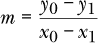

用文字表达时，我们可以说“*y* 每 *x*”。这衡量了直线的陡峭程度或平缓程度：即它的梯度。在数学中，我们经常讨论变量的变化，而表示变化的符号是在前面加上一个Δ（delta）。因此，我们可以将直线的斜率写作

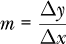

旨在强调斜率是每次*x*变化时*y*的变化量。幸运的是，事实证明，不仅直线在每个点都有斜率，大多数函数在每个点也有斜率。然而，除了直线以外，这个斜率会随点的不同而变化。这里用图示更能帮助理解。请参考图 9-1。

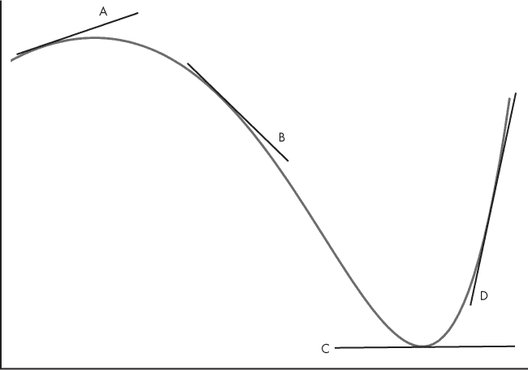

*图 9-1：表示多个切线的函数*

图 9-1 中的图形是一个多项式函数。注意图中画出的与函数相切的线。这些是 *切线*。作为直线，它们有一个可以在图中看到的斜率。现在想象将其中一条线移动到函数上，使其继续只在一个点与函数相切；想象一下，随着这条线的移动，其斜率是如何变化的。

事实证明，斜率如何随着函数的变化而变化本身就是一个函数，它叫做 *导数*。给定一个函数和 *x* 值，导数告诉我们该点 *x* 处的函数斜率。函数具有导数这一事实是微积分的一个基本洞察，对于我们至关重要。

导数的概念非常重要，因为对于单变量函数，*x* 处的导数就是该点的梯度；它是函数变化的方向。如果我们想找到函数的最小值，即给我们最小 *y* 的 *x* 值，我们需要沿着与梯度方向 *相反* 的方向移动，因为这将把我们带到最小值的方向。

导数有许多不同的表示方式，但最能体现斜率概念的方式是，*y* 如何随着 *x* 的变化而变化。

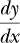

当我们讨论反向传播算法时，接下来会回到这种形式。梯度部分就讲到这里；现在让我们更仔细地看看下降过程。

#### 寻找最小值

由于我们希望模型尽量减少错误，我们需要找到一组参数，使得损失函数的值最小。换句话说，我们需要找到损失函数的 *最小值*。

再次查看图 9-1。最小值位于右侧，就是切线 C 所在的位置。我们可以看到它是最小值，并且注意到此处梯度为 0。这告诉我们我们处于一个最小值（或最大值）。如果我们从 B 开始，我们会看到切线的斜率为负（向下和向右）。因此，我们需要朝着 *x* 的正方向移动，因为这与梯度的符号相反。这样做会让我们离 C 处的最小值更近。类似地，如果我们从 D 开始，切线的斜率为正（向上和向右），意味着我们需要朝着负 *x* 方向移动，再次朝 C 方向移动，以接近最小值。所有这些都暗示了一个寻找函数最小值的算法：选择一个起始点（一个 *x* 值），然后利用梯度向较低的点移动。

对于仅含有 *x* 的简单函数，如图 9-1 中的那些函数，这种方法会很好地工作，前提是我们从像 B 或 D 这样的合适位置开始。当我们进入更高维度时，事实证明，只要我们从一个合适的位置开始进行初步猜测，这种方法依然有效。

继续参考图 9-1，假设我们从 B 开始，我们看到梯度告诉我们向右移动，朝 C 的方向。那么我们如何选择下一个要考虑的*x*值，从而使我们更接近 C 呢？这就是步长，它告诉我们从一个*x*位置跳跃到下一个位置的大小。步长是我们必须选择的一个参数，实际上，这个值被称为*学习率*，它通常是流动的，并且随着我们的移动逐渐变小，因为随着我们接近最小值，我们需要的步伐也越来越小。

这一切都很好，甚至是直观的，但我们有一个小问题。如果我们不是从 B 或 D 开始，而是从 A 开始呢？A 处的梯度指向的是左边，而不是右边。在这种情况下，我们的简单算法会失败——它会把我们向左移动，我们永远无法到达 C。图中只显示了一个最小值，位于 C 处，但我们可以轻松想象出第二个最小值，比如位于 A 的左侧，它的值没有 C 低（即*y*值不如 C 小）。如果我们从 A 开始，算法就会朝这个最小值前进，而不是朝 C 的最小值前进。我们的算法会陷入一个*局部最小值*。一旦陷入，我们的算法就无法把我们带出来，我们也无法找到位于 C 的全局最小值。我们会看到这是神经网络的一个真正问题，但对于现代深度网络来说，几乎是神奇地，这个问题并不大。

那么这一切如何帮助我们训练神经网络呢？梯度告诉我们*x*的微小变化如何改变*y*。如果*x*是我们网络的参数之一，而*y*是损失函数给出的误差，那么梯度告诉我们该参数的变化对网络整体误差的影响有多大。一旦我们知道这一点，我们就可以根据梯度修改参数，知道这样做会让我们朝着最小误差的方向前进。当训练集上的误差达到最小值时，我们可以说网络已经被训练好了。

让我们再多谈一点关于梯度和参数的事情。到目前为止，我们基于图 9-1 的讨论都相当一维；我们的函数只是*x*的函数。我们讨论的是改变一个东西——沿着 x 轴的位置——来看看它如何影响*y*的位置。实际上，我们并不是仅仅在处理一个维度。我们网络中的每个权重和偏置都是一个参数，而损失函数的值取决于所有这些参数。仅对于图 8-1 中的简单网络，就有 20 个参数，这意味着损失函数是一个 20 维的函数。尽管如此，我们的方法基本保持不变：如果我们知道每个参数的梯度，我们仍然可以应用我们的算法，试图找到一组最小化损失的参数。

#### 更新权重

我们稍后会谈到如何获取梯度值，但目前我们假设已经获得了这些值。我们假设有一组数字，告诉我们在当前网络配置下，任何权重或偏置值的变化如何改变损失。凭借这些信息，我们可以应用梯度下降：我们通过该梯度值的一部分来调整权重或偏置，带领我们集体朝着整个损失函数的最小值迈进。

从数学角度来看，我们使用一个简单的规则更新每个权重和偏置：

*w* ← *w* –Δ*w*

这里的 *w* 是其中一个权重（或偏置），*η*（eta）是学习率（步长），而 *Δw* 是梯度值。

清单 9-1 给出了一个使用梯度下降训练神经网络的算法。

1\. 为权重和偏置选择一些智能的起始值。

2\. 使用当前权重将训练集传递通过网络，并进行计算。

偏置并计算平均损失。

3\. 使用该损失值来计算每个权重和偏置的梯度。

4\. 根据步长与梯度值的乘积更新权重或偏置值。

5\. 从步骤 2 开始重复，直到损失足够低。

*清单 9-1：梯度下降的五个（看似）简单步骤*

这个算法看起来简单，但正如他们所说，魔鬼藏在细节中。我们必须在每一步做出选择，每个选择都会引发进一步的问题。例如，步骤 1 说要“选择一些智能的起始值。”它们应该是什么呢？事实证明，成功训练神经网络在很大程度上依赖于选择合适的初始值。我们在之前的例子中已经看到，如果从 A 开始，就无法找到 C 处的最小值。多年来，关于步骤 1 的研究已取得了大量成果。

步骤 2 是直接的；它是通过网络的前向传播。我们还没有详细讨论损失函数本身；目前，只需将其视为衡量网络在训练集上有效性的一个函数。

步骤 3 目前是一个黑箱。我们稍后会探索如何完成这一部分。现在，假设我们能够找到每个参数的梯度值。

步骤 4 遵循前面方程的形式，将参数从当前值更新为可以减少总体损失的值。实际上，这个方程的简单形式不足够；还有其他项，例如动量，能够保留前一轮权重变化的一部分，用于下一轮迭代（训练数据通过网络的下一次传递），以确保参数不会发生剧烈变化。我们稍后会重新讨论动量。现在，让我们来看一下梯度下降的一种变种，这种变种实际上被用于训练深度网络。

### 随机梯度下降

之前的步骤描述了神经网络的梯度下降训练。正如我们预期的那样，在实践中，这个基本思想有许多不同的变种。一种广泛使用并且在实践中表现良好的方法被称为*随机梯度下降（SGD）*。其中，*随机*一词指的是一个随机过程。接下来我们将看到为什么在这种情况下，*随机*一词放在*梯度下降*之前。

#### 批次和小批次

清单 9-1 的第 2 步说要使用当前的权重和偏置值将整个训练集通过网络处理。这种方法叫做*批量训练*，因为我们使用所有训练数据来估算梯度。直观来说，这是合理的做法：我们已经仔细构建了训练集，使其能够公平地代表生成数据的未知父过程，而正是这个父过程我们希望网络能够成功地为我们建模。

如果我们的数据集很小，比如 第五章中的原始鸢尾花数据集，那么批量训练是有意义的。但是如果我们的训练数据集不是很小呢？如果它有数十万甚至数百万个样本呢？我们将面临越来越长的训练时间。

我们遇到了一个问题。我们想要一个大的训练集，因为它（希望）能更好地代表我们想要建模的未知父过程。但是，训练集越大，每次通过网络处理每个样本、获取平均损失值并更新权重和偏置的时间就越长。我们称将整个训练集通过网络处理一遍为*一个 epoch*，我们将需要许多几十到几百个 epoch 来训练网络。为了更好地表示我们想要建模的事物，这意味着必须通过网络的样本数量越来越多，从而导致计算时间越来越长。

这时，SGD 派上了用场。我们不再在每次迭代时使用所有训练数据，而是交替选择训练数据的一个小子集，并使用从中计算出的平均损失来更新参数。我们将计算一个“错误的”梯度值，因为我们仅使用一个小样本来估算整个训练集的损失，但这样可以节省大量时间。

让我们通过一个简单的例子来看看这种采样是如何发挥作用的。我们将使用 NumPy 定义一个包含 100 个随机字节的向量：

>>> d = np.random.normal(128, 20, size=100).astype("uint8")

>>> d

130, 141, 99, 106, 135, 119, 98, 147, 152, 163, 118, 149, 122,

133, 115, 128, 176, 132, 173, 145, 152, 79, 124, 133, 158, 111,

139, 140, 126, 117, 175, 123, 154, 115, 130, 108, 139, 129, 113,

129, 123, 135, 112, 146, 125, 134, 141, 136, 155, 152, 101, 149,

137, 119, 143, 136, 118, 161, 138, 112, 124, 86, 135, 161, 112,

117, 145, 140, 123, 110, 163, 122, 105, 135, 132, 145, 121, 92,

118, 125, 154, 148, 92, 142, 118, 128, 128, 129, 125, 121, 139,

152, 122, 128, 126, 126, 157, 124, 120, 152

在这里，字节值围绕 128 的均值呈正态分布。100 个值的实际均值为 130.9。每次选择这些值的子集，取 10 个值，会给出实际均值的估计值。

>>> i = np.argsort(np.random.random(100))

>>> d[i[:10]].mean()

138.9

通过重复子集，得到的估计均值分别为 135.7、131.7、134.2、128.1，依此类推。

所有估计的均值都不是实际均值，但它们都非常接近。如果我们可以通过随机选择一个子集来估计均值，那么我们可以通过类比来推测，应该也能够通过完整训练集的一个子集来估计损失函数的梯度。由于样本是随机选择的，结果的梯度值是随机变化的估计值。这就是为什么我们在*梯度下降*前加上了*随机*二字。

由于每次通过网络进行权重和偏差更新时，都需要将完整的训练集传递给网络，这被称为*批量训练*；而传递子集则被称为*小批量训练*。你会经常听到有人提到*小批量*。小批量是用于每次随机梯度下降步骤的训练数据子集。训练通常包括若干个周期（epochs），周期与小批量的关系如下：

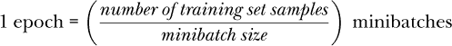

实际上，我们并不希望从完整的训练集中随机选择小批量数据。如果我们这么做，可能会面临无法使用所有样本的风险：有些样本可能永远不会被选择，而有些样本可能会被选择得过于频繁。通常，我们会打乱训练样本的顺序，并在每次需要小批量时顺序地选择固定大小的样本块。当所有可用的训练样本都被使用完后，我们可以重新打乱完整训练集的顺序并重复这一过程。一些深度学习工具包甚至不这么做；它们会再次循环使用同一组小批量数据。

#### 凸函数与非凸函数

SGD 听起来像是对实践的妥协。从理论上看，我们似乎不应该使用它，而且我们可能会期望它会使我们的训练结果受损。然而，通常情况正好相反。从某种意义上说，神经网络的梯度下降训练本不应该有效，因为我们正在将一种针对凸函数的算法应用到非凸函数上。图 9-2 展示了凸函数与非凸函数之间的区别。

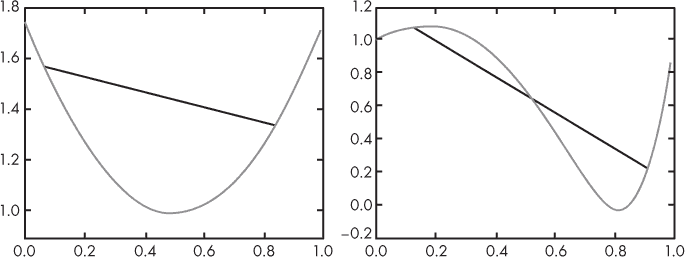

*图 9-2：*x* 的凸函数（左）。*x* 的非凸函数（右）*。

凸函数的特点是，函数上任意两点之间的线段不会与函数在其他点交叉。图 9-2 左侧的黑线就是一个例子，任何这样的线段都不会在其他点交叉函数，表明这是一个凸函数。然而，右侧的曲线就不能这么说了，那是图 9-1 中的曲线。这里的黑线确实与函数交叉。

梯度下降法是为寻找函数的最小值而设计的，适用于凸函数，并且因为它仅依赖于梯度（一阶导数），所以有时被称为*一阶*优化方法。一般来说，梯度下降法在非凸函数中不应有效，因为它有可能陷入局部最小值，而无法找到全局最小值。我们在图 9-1 的例子中也看到了这一点。

这正是随机梯度下降法的帮助之处。在多维空间中，梯度会指向一个方向，这个方向不一定朝向损失函数的最近最小值。这意味着我们的步伐会稍微偏离正确的方向，但这种偏离可能帮助我们避免被困在不想去的地方。

当然，情况更加复杂，也更加神秘。机器学习社区一直在努力解决使用一阶优化方法在非凸损失函数上的明显成功与这种方法理论上不应有效之间的矛盾。

目前有两个观点正在浮现。第一个就是我们刚才提到的，随机梯度下降通过实际将我们引导到稍微错误的方向来帮助我们。第二个观点，目前似乎已经得到了充分证明，即在深度学习中使用的损失函数中，实际上存在着许多局部最小值，而且这些局部最小值基本上是相同的，因此几乎到达任何一个局部最小值都会得到一个表现良好的网络。

一些研究人员认为，大多数梯度下降学习最终停留在*鞍点*；这是一个看起来像最小值，但实际上不是的地方。想象一下马鞍，并在中间放一个弹珠。弹珠会停在原地，但你可以将弹珠推向某个方向，使它滚出鞍点。这个观点并非没有道理，认为大多数训练最终会停在鞍点，而更好的算法可能会带来更好的结果。然而，即使鞍点真的是鞍点，从实际应用的角度看，它仍然是一个不错的选择，因此模型依然是成功的。

在实际操作中，我们应该使用随机梯度下降，因为它能带来更好的整体学习效果，并通过不需要完整批次来减少训练时间。它引入了一个新的超参数，即小批量大小，我们必须在训练前某个时刻选择它。

#### 结束训练

我们还没有讨论一个关键问题：我们应该在什么时候停止训练？记得在第五章中，我们曾努力创建训练集、验证集和测试集。这就是我们将在此使用验证集的地方。在训练过程中，我们可以通过验证集上的准确率或其他度量来决定何时停止训练。如果使用 SGD，我们通常会在每个小批次或小批次集上运行验证集，以计算准确率。通过跟踪验证集上的准确率，我们可以决定何时停止训练。

如果我们训练很长时间，最终通常会发生两件事。第一件事是训练集上的误差趋近于零；我们在训练集上的表现越来越好。第二件事是验证集上的误差先下降，然后最终开始回升。

这些效果是由于过拟合造成的。随着模型不断学习更多、更好地表示生成数据集的母体分布，训练误差会不断下降。但最终，它将停止学习关于训练集的一般性特征。在这一点上，我们已经发生了过拟合，我们希望停止训练，因为模型不再学习一般特征，而是开始学习关于我们使用的特定训练集的细节。我们可以通过在训练过程中使用验证集来监控这一现象。由于我们不使用验证集中的样本来更新网络的权重和偏差，它应该能公正地测试当前网络的状态。当过拟合开始时，验证集上的误差将从最小值开始上升。此时，我们可以保留产生验证集最小误差的权重和偏差，并声称它们代表了最好的模型。

我们不希望使用任何已经影响了训练的数据来衡量我们网络的最终效果。我们使用验证集来决定何时停止训练，因此验证集中的样本特征也影响了最终模型；这意味着我们不能过于依赖验证集来判断模型在新数据上的表现。只有在我们宣布训练成功后，未使用的测试集才能给我们一个大致的模型在实际数据上表现的预期。所以，正如将训练集的准确率作为模型好坏的衡量标准是错误的，报告验证集准确率同样也是错误的。

#### 更新学习率

在我们用于基于梯度更新权重和偏差的通用更新方程中，我们引入了一个超参数，*η*（eta），即学习率或步长。它是一个缩放因子，表示我们应根据梯度值更新权重或偏差的幅度。

我们之前提到过，学习率不需要固定，可以并且应该随着训练逐渐变小，因为我们假设在训练过程中需要越来越小的步伐才能到达损失函数的实际最小值。我们没有说明应该如何实际更新学习率。

更新步长的方法不止一种，但有些比其他方法更有帮助。sklearn 的 MLPClassifier 类使用 SGD 求解器，提供了三种选项。第一种是从不改变学习率—将*η*保持为其初始值*η*[0]。第二种是按时期（最小批次）缩放*η*，使其逐渐减小，公式如下：

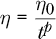

其中*η*[0]由用户设置，*t*是迭代次数（时期，最小批次），*p*是*t*的指数，用户也可以选择。sklearn 的默认值是*p*为 0.5，即按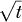进行缩放，这似乎是一个合理的默认值。

第三种选择是通过观察损失函数值来调整学习率。只要损失在下降，就保持当前的学习率。当损失停止下降一段时间后，将学习率除以某个值，比如 5，sklearn 的默认值。如果我们从不改变学习率，而且它太大，我们可能会在最小值附近来回移动，但始终无法到达它，因为我们总是跨过它。因此，在使用 SGD 时，降低学习率是个不错的选择。在书的后面部分，我们将遇到一些可以自动调整学习率的优化方法。

#### 动量

SGD 中还有一个最后的细节需要处理。正如我们之前看到的，梯度下降和 SGD 的权重更新公式是

*w* ← *w* – *η*Δ*w*

我们通过学习率（*η*）与梯度相乘来更新权重，这里我们用Δ*w*来表示。

一个常见且强大的技巧是引入一个*动量*项，将上一批次的Δ*w*的某个分数加回来。动量项可以防止* w*参数对特定最小批次的反应过快。加入这个项后，我们得到

*w*[*i*+1] ← *w*[*i*] – *η*Δ*w*[*i*] + *μ*Δ*w*[*i–1*]

我们添加了下标来表示网络的下一次通过（*i* + 1）、当前通过（*i*）和上一通过（*i –* 1）。我们需要使用上一轮的Δ*w*。*μ*（动量）通常的值约为 0.9。几乎所有的工具包都以某种形式实现了动量，包括 sklearn。

### 反向传播

我们一直假设我们已经知道每个参数的梯度值。接下来，让我们讨论反向传播算法是如何给我们这些“魔法数字”的。反向传播算法可能是神经网络历史上最重要的发展，因为它使得训练拥有数百、数千、数百万甚至数十亿个参数的大型网络成为可能。这一点在我们将在第十二章中讨论的卷积神经网络中尤为重要。

反向传播算法本身由 Rumelhart、Hinton 和 Williams 于 1986 年在他们的论文《通过反向传播误差学习表示》中首次发布。它是链式法则在导数中的巧妙应用。该算法被称为*反向传播*，因为它从网络的输出层向输入层反向工作，将损失函数中的误差传播到网络的每个参数。口语中，这个算法被称为*反向传播*（*backprop*）；我们在这里使用这个术语，以便听起来更像是本地的机器学习专家。

将反向传播加入到梯度下降的训练算法中，并根据随机梯度下降（SGD）进行调整，给出了清单 9-2 中的算法。

1\. 为权重和偏置选择一些智能的初始值。

2\. 使用当前的权重和偏置通过网络运行一个小批量数据

并计算平均损失。

3\. 使用该损失和反向传播来获取每个权重和偏置的梯度。

4\. 按照步长乘以梯度值的方式更新权重或偏置的值。

5\. 从第 2 步开始重复，直到损失足够低。

*清单 9-2：带反向传播的随机梯度下降*

清单 9-2 的第 2 步被称为*前向传播*；第 3 步是*反向传播*。前向传播也是我们在网络训练完成后如何使用网络的方式。反向传播是反向传播计算梯度的过程，以便我们在第 4 步中更新参数。

我们将描述两次反向传播。首先，我们将通过一个简单的例子，并使用实际的导数进行讲解。其次，我们将使用更抽象的符号来观察反向传播如何普遍适用于实际神经网络。没有办法掩饰这一点：这一部分涉及导数，但我们通过对梯度下降的讨论，已经对这些导数有了很好的直观理解，因此应该能够顺利进行。

#### 反向传播，第一次

假设我们有两个函数，*z* = *f* (*y*) 和 *y* = *g*(*x*)，意味着 *z* = *f* (*g*(*x*)）。我们知道函数 *g* 的导数给我们 *dy*/*dx*，它告诉我们 *y* 如何随着 *x* 的变化而变化。类似地，我们知道函数 *f* 的导数会给我们 *dz*/*dy*。*z* 的值依赖于 *f* 和 *g* 的复合，意味着 *g* 的输出是 *f* 的输入，因此，如果我们想找到 *dz*/*dx* 的表达式，也就是 *z* 如何随 *x* 变化，我们需要一种通过复合函数进行链接的方式。这就是链式法则为导数提供的内容：

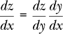

这种符号特别好，因为我们可以想象 *dy* “项”会像实际分数那样消去。

这对我们有何帮助？在神经网络中，一层的输出是下一层的输入，这是一种复合关系，所以我们可以直观地看到链式法则可能适用。记住，我们想要的是告诉我们损失函数如何相对于权重和偏置变化的值。我们将损失函数称为 *L*，任何给定的权重或偏置称为 *w*。我们想要计算所有权重和偏置的 *∂*ℒ/*∂w*。

警钟应该在你脑中响起。前一段引入了新的符号。到目前为止，我们一直用 *dy*/*dx* 来表示导数，但损失函数相对于权重的导数被写作 *∂*ℒ/*∂w*。这个复杂的 *∂* 是什么？

当我们只有一个变量的函数时，只有一个斜率可以讨论，即 *x*。一旦我们有了多个变量的函数，点处的斜率概念就变得模糊。任何一点都有无数条与函数相切的线。所以我们需要 *偏导数* 的概念，它是沿着我们正在考虑的变量方向的切线斜率，同时将所有其他变量视为固定。这告诉我们当我们仅改变一个变量时，输出将如何变化。为了表示我们正在使用偏导数，我们将 *d* 改为 *∂*，它只是一个手写体的 *d*。

让我们建立一个简单的网络，这样我们就能看到链式法则如何直接得到我们想要的表达式。我们正在查看 图 9-3 中的网络，它由一个输入、两个各自包含一个节点的隐藏层和一个输出层组成。

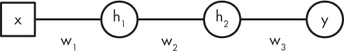

*图 9-3：一个简单的网络，用于说明链式法则*

为了简化，我们将忽略任何偏置值。此外，我们假设激活函数为恒等函数，*h*(*x*) = *x*。这个简化去除了激活函数的导数，使得事情更加清晰。

对于这个网络，前向传播计算

*h*[1] = *w*[1]*x*

*h*[2] = *w*[2]*h*[1]

*y* = *w*[3]*h*[2]

这遵循了我们之前使用的形式，通过将一层的输出作为下一层的输入来连接各个部分。这给出了网络的输出 *y*，对于输入 *x*。如果我们想训练网络，我们将拥有一个训练集，一组对 (*x*[*i*], *ŷ*)，*i* = 0, 1, …，它们是给定输入的期望输出的示例。请注意，正向传播是从输入 *x* 到输出 *y* 的。接下来我们将看到为什么反向传播是从输出到输入的。

现在让我们定义损失函数 *ℒ* 为 *y*，即给定输入 *x* 的网络输出与 *ŷ*，即我们应得到的输出之间的平方误差。功能上，损失函数看起来如下所示。

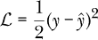

为了简化，我们忽略了损失是训练集的均值或从中抽取的某个小批量的事实。因子 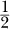 并非严格必要，但通常用来使导数看起来更简洁。由于我们希望最小化特定权重集的损失，即使我们总是将损失乘以常数因子 ，这也无关紧要——最小的损失仍然是最小的损失，无论其实际数值如何。

为了使用梯度下降，我们需要找出损失如何随着权重变化。在这个简单的网络中，这意味着我们需要找到三个梯度值，分别是 *w*[1]、*w*[2] 和 *w*[3]。这就是链式法则发挥作用的地方。我们将首先写出方程，然后再讨论它们：

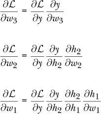

这些方程的顺序展示了为什么这个算法被称为 *反向传播*。要获得输出层参数的偏导数，我们只需要输出和损失 *y* 和 *ℒ*。要获得中间层权重的偏导数，我们需要以下两个来自输出层的偏导数：

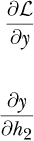

最后，要获得输入层权重的偏导数，我们需要来自输出层和中间层的偏导数。实际上，我们已经通过网络向后传播，传递了来自后续层的值。

对于这些方程中的每一个，右侧与左侧相匹配，如果我们想象“项”像分数一样抵消。由于我们为网络选择了一个特别简单的形式，我们可以手动计算实际的梯度。我们需要以下来自前述方程右侧的梯度。

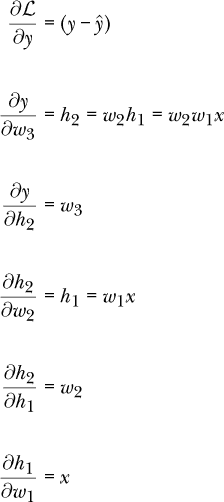

*∂ℒ*/*∂y* 来自我们为损失函数选择的形式以及微积分的微分规则。

将这些代入权重梯度的方程中，得到

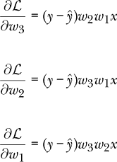

在正向传播之后，我们得到了这些方程右侧所有量的数值。因此，我们知道了梯度的数值。然后，梯度下降的更新规则告诉我们按以下方式更改权重。

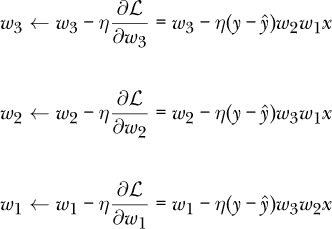

其中 *η* 是学习率参数，定义了更新时步长的大小。

总结一下，我们需要使用链式法则，这是反向传播算法的核心，来找到更新训练过程中权重所需的梯度。对于我们简单的网络，我们能够通过从输出到输入反向计算这些梯度的值。当然，这只是一个玩具网络。现在，让我们再看一看如何在更一般的情况下使用反向传播来计算任何网络所需的梯度。

#### 反向传播，第 2 次

让我们从重新审视损失函数开始，并引入一些新的符号。损失函数是网络中所有参数的函数，意味着每个权重和偏置值都对其有所贡献。例如，图 8-1 中的网络有 20 个权重和偏置，其损失可以写作

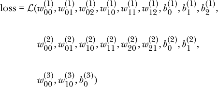

请注意，我们引入了一个新的符号表示参数：

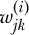

这表示将第*i - 1*层的第*j*个输入（第*i - 1*层的输出）链接到第*i*层第*k*个节点的权重。我们还有

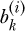

表示第*i*层第*k*个节点的偏置值。这里层 0 是输入层本身。指数上的括号是标签，表示层号；它们不应解释为实际的指数。因此，

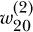

是从第一层第三个输出到第二层第一个节点的权重。这个权重在图 9-4 中被突出显示。记住，我们总是从上到下为节点编号，从 0 开始。

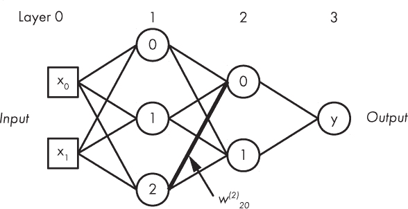

*图 9-4：具有加粗线标记的权重 w^((2))[20]的图 8-1 网络*

这个符号看起来有些复杂，但它让我们能够精确地引用网络中的任何权重或偏置。我们在反向传播中需要使用的数值是损失相对于每个权重或偏置的偏导数。因此，我们最终想要找到的结果可以写作，用所有辉煌的数学符号表示，

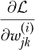

这给出了斜率：损失随着链接第*i*层第*k*个节点与第*i - 1*层第*j*个输出的权重变化而变化的量。类似的方程给出了偏置的偏导数。

我们可以通过仅处理层号来简化这个繁琐的符号，理解在符号中隐含着一个向量（偏置、激活）或矩阵（权重），所以我们想要找到

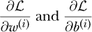

这些分别对应于将第*i - 1*层与第*i*层链接的所有权重的矩阵，以及第*i*层的所有偏置的向量。

我们将通过从向量和矩阵的角度来看待问题，以保护我们的符号规范性。让我们从输出层开始，看看这能给我们带来什么。我们知道，输出层 *L* 的激活值是通过以下公式得到的：

*a*^((*L*)) = *h*(*W*^((*L*))*a*^((*L*–1)) + *b*^((*L*)))

*a* 是来自层 *L –* 1 的激活值，*b* 是层 *L* 的偏置向量，*W* 是层 *L –* 1 和 *L* 之间的权重矩阵。激活函数是 *h*。

此外，我们将定义 *h* 的参数为 *z*^((*L*))

*z*^((*L*)) ≡ *W*^((*L*))*a*^((*L*–1)) + *b*^((*L*))

并且将 *∂L*/*∂z*^((*l*)) 称为 *误差*，即来自层 *l* 输入的损失贡献。接下来，我们定义

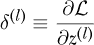

这样我们就可以从现在开始处理 *δ*（delta）。

对于输出层，我们可以将 *δ* 写作：

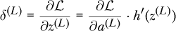

符号 *h*′(*z*^((*L*))) 是另一种表示 *h*（对 *z* 求导）在 *z*^((*L*)) 处的导数的方式。⋅ 代表逐元素相乘。这是 NumPy 在乘以两个相同大小的数组时的运作方式，因此如果 *C* = *A* ⋅ *B*，则 *C*[*ij*] = *A*[*ij*]*B*[*ij*]。从技术上讲，这个乘积被称为 *Hadamard 乘积*，以法国数学家雅克·哈达玛命名。

上述意味着，为了使用反向传播，我们需要一个可以微分的损失函数——一个在每个点都有导数的损失函数。这并不算负担；我们将在下一节中考察的损失函数都符合这一标准。我们还需要一个可以微分的激活函数，以便找到 *h*(*z*)。同样，我们目前考虑的激活函数基本上都是可微分的。

**注意** 我说“基本上”是因为 ReLU 的导数在 *x = 0* 时是未定义的。左侧的导数是 0，而右侧的导数是 1。在实际操作中，实施通常会选择一个特定的值来返回，如果 ReLU 的导数的参数恰好为 0。例如，TensorFlow 只是判断参数是否小于或等于 0，如果是，则返回 0 作为导数。否则，返回 1。这是可行的，因为在计算过程中，由于浮点数值会有很多舍入误差，因此传递给 ReLU 函数导数的值不太可能真正等于 0。

*δ* 的公式告诉我们由特定层输入导致的误差。接下来，我们将看到如何使用这个公式得到每一层权重的误差。

有了 *δ*^((*L*))，我们可以通过以下公式将误差传播到下一层：

*δ*^((*l*)) = ((*W*^((*l*+1)))^(*Tδ*^(*l*+1))) · *h*′(*z*^((*l*)))

其中，对于倒数第二层，*l* + 1 = *L*。*T* 代表矩阵转置。这是一个标准的矩阵操作，涉及沿对角线的反射，因此如果

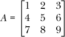

然后

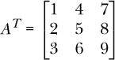

我们需要权重矩阵的转置，因为我们是在进行与前向传播相反的方向。如果层 *l* 中有三个节点，层 *l* + 1 中有两个节点，那么它们之间的权重矩阵 *W* 是一个 2 × 3 矩阵，因此 *Wx* 是一个二维向量。在反向传播中，我们是从层 *l* + 1 到层 *l*，所以我们转置权重矩阵，将这个二维向量（这里是 *δ*）映射为层 *l* 的三维向量。

*δ*^((*l*)) 方程用于通过网络向后传播的每一层。输出层的值由 *δ*^((*L*)) 给出，启动这个过程。

一旦我们获得每一层的误差，就可以最终找到我们需要的梯度值。对于偏差，这些值是该层*δ*的元素。

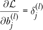

对于 *l* 层的 *j* -th 偏差元素。对于权重，我们需要

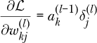

将前一层的 *k* -th 输出与当前层 *l* 的 *j* -th 误差相连接。

使用前面提到的方程式为每一层网络计算出一组权重和偏差梯度值，进而继续应用梯度下降。

正如我希望你从这一节较为密集的内容中看到的那样，我们可以使用一个方便的数学定义来设立一个迭代过程，把误差从网络输出层向后传播，直到输入层。我们无法在不知道下一层误差的情况下计算当前层的误差，因此我们最终通过网络将误差反向传播，这也就是 *反向传播* 的含义。

### 损失函数

*损失函数* 在训练过程中用于衡量网络的表现如何。训练的目标是将这个值尽可能小，同时仍能概括数据的真实特征。从理论上讲，如果我们觉得某个损失函数与当前问题相关，我们可以创建任何损失函数。如果你阅读深度学习的文献，你会发现很多论文都在这么做。然而，大多数研究最终还是会回归到几个标准的损失函数，这些损失函数在经验上大多数情况下表现得很好。我们将在这里讨论其中的三个：绝对损失（有时称为 *L*[1] 损失）、均方误差（有时称为 *L*[2] 损失）和交叉熵损失。

#### 绝对损失和均方误差损失

让我们从绝对损失和均方误差损失函数开始。我们将它们一起讨论，因为它们在数学上非常相似。

我们在讨论反向传播时已经看到过均方误差。绝对损失是新的。数学上，这两个方程是

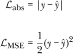

我们已经将它们标记为 *abs* 代表 *绝对值* 和 *MSE* 代表 *均方误差*。请注意，我们总是使用 *y* 表示网络输出，即前向传播的输出，输入为 *x*。我们总是使用 *ŷ* 表示已知的训练类标签，它始终是一个从 0 开始的整数标签。

尽管我们在简单形式下写出了损失函数，但我们需要记住，当使用时，实际上是对训练集或小批量数据集中的损失值求平均值。这也是*均方误差*中*均*的来源。因此，我们实际上应该这样写：

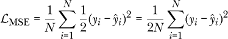

在这里，我们计算的是训练集（或小批量数据集）中*N*个值的平方误差损失的平均值。

如果我们考虑它们所衡量的内容，这两种损失函数都是合理的。我们希望网络输出一个与预期值（即样本标签）匹配的值。这两者之间的差异反映了网络输出的错误程度。对于绝对损失，我们找到差异并去掉符号，这就是绝对值的作用。对于均方误差（MSE）损失，我们找到差异后将其平方。这同样使差异变为正数，因为将负数与自身相乘总是得到正数。如在第 200 页的“反向传播”部分所提到，MSE 损失中的因子简化了损失函数的导数，但并没有改变它的工作方式。

然而，绝对损失和均方误差是不同的。均方误差对异常值更敏感。这是因为我们在求差异时进行平方，*y* = *x*²的图形会随着*x*（差异）的增大而快速增长。而对于绝对损失，由于没有平方，这种效应被最小化；差异只是差异而已。

事实上，这两种损失函数通常不用于神经网络进行*分类*时，这是本书中的隐含假设。在这种情况下，更常用的是交叉熵损失，接下来将介绍。我们希望网络输出能够给出输入的正确类别标签。然而，也完全可以训练一个网络输出连续的实数值。这称为*回归*，在这种情况下，这两种损失函数都非常有用。

#### 交叉熵损失

即使我们可以在训练神经网络进行分类时使用绝对损失和均方误差损失，最常用的损失函数是*交叉熵损失*（与对数损失密切相关）。该损失函数假设网络的输出是多类情况下的 softmax（向量）或二类情况下的 sigmoid（逻辑回归，标量）。在数学上，对于*M*类的多类情况，它表现为：

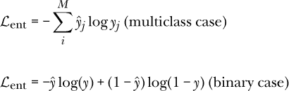

交叉熵在训练神经网络进行分类时通常为什么是更好的选择？我们可以考虑使用 softmax 输出的多类情况。*softmax*的定义意味着网络输出可以看作是输入属于各个可能类别的概率估计。如果我们有三个类别，可能得到一个看起来像这样的 softmax 输出：

*y* = (0.03, 0.87, 0.10)

这个输出大致意味着网络认为输入属于类别 0 的概率为 3%，属于类别 1 的概率为 87%，属于类别 2 的概率为 10%。这是输出向量，*y*。我们通过提供实际标签的向量来计算损失，其中 0 表示*不是这个类别*，1 表示*是这个类别*。因此，导致这个*y*的输入所关联的*ŷ*向量将是

*ŷ* = (0,1,0)

总的损失值为

*ℒ*[ent] = –(0(log 0.03) + 1(log 0.87) + 0(log 0.10)) = 0.139262

网络的三个预测可以看作是一个概率分布，就像我们抛两个骰子时，计算不同结果的可能性并将其相加一样。我们还拥有来自类别标签的已知概率分布。以之前的例子为例，实际类别是类别 1，因此我们生成了一个概率分布，给类别 0 和类别 2 的概率分配为 0，而将 100%的概率分配给类别 1，即实际类别。随着网络的训练，我们希望输出分布逐渐接近（0,1,0），即标签的分布。

最小化交叉熵会推动网络朝着更好的预测不同类别的概率分布的方向发展。理想情况下，这些输出分布应该像训练标签一样：除了实际类别外，其他类别的输出为 0，实际类别的输出为 1。

对于分类任务，我们通常使用交叉熵损失。sklearn 的 MLPClassifier 类使用交叉熵。Keras 也支持交叉熵损失，但提供了许多其他损失函数，包括绝对误差和均方误差。

### 权重初始化

在我们训练神经网络之前，需要初始化权重和偏置。列表 9-1 中的第 1 步提到“为权重和偏置选择一些智能的起始值。”

这里讨论的初始化技术都依赖于在某个范围内选择随机数。更重要的是，这些随机数需要在该范围内均匀分布或呈正态分布。*均匀分布*意味着该范围内的所有值被选中的概率相等。如果你多次掷一个公平的骰子，你得到的每个数字（从 1 到 6）就呈均匀分布。正态分布的值在第四章中已介绍。这些值有一个特定的均值，即最可能返回的值，并且围绕均值有一个范围，在该范围内值被选中的概率会根据一个称为*标准差*的参数逐渐降低至 0。这就是经典的钟形曲线形状。两种分布都可以使用。关键点是，初始权重不能都相同（如 0），因为如果相同，在反向传播过程中所有的梯度也将相同，每个权重将以相同的方式改变。初始权重需要不同，以打破这种对称性，并允许每个权重根据训练数据进行自我调整。

在神经网络的早期，人们通过均匀地选择[0,1)范围内的值（*U*(0,1)）或从标准正态分布中抽取权重和偏置，*N*(0,1)，均值为 0，标准差为 1，来初始化权重。这些值通常会乘以某个小常数，如 0.01。在许多情况下，这种方法有效，至少对于简单的网络有效。然而，随着网络的复杂性增加，这种简单的方法逐渐失效。以这种方式初始化的网络在学习上遇到了困难，许多网络甚至完全无法学习。

让我们快进到几十年后，经过大量研究，研究人员意识到，如何初始化某一层的权重，主要取决于几个因素：所使用的激活函数类型、进入该层的权重数量（*f*[*in*]）以及可能离开该层的权重数量（*f*[*out*]）。这些认识促成了今天广泛使用的主要初始化方法。

sklearn 的 MLPClassifier 类使用*Glorot 初始化*。这有时也被称为*Xavier 初始化*，尽管一些工具包在使用这个术语时有不同的含义。^(1)（注意，*Xavier*和*Glorot*实际上指的是同一个人。）让我们来看看 sklearn 是如何使用 Glorot 初始化的。在 MLPClassifier 中，用于初始化权重的关键方法是 _init_coef。该方法使用均匀分布并设置其范围，使得权重位于

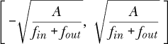

其中，括号表示选定的最小值（左侧）到最大值（右侧）。由于分布是均匀的，该范围内的每个值被选中的概率相等。

我们还没有指定*Ａ*是什么。这个值取决于所使用的激活函数。根据文献，如果激活函数是 sigmoid（逻辑函数），则建议*Ａ* = 2。否则，推荐*Ａ* = 6。

现在来增加一些复杂度。某些工具包，如 Caffe，使用一种 Xavier 初始化的替代形式，这意味着它们从标准正态分布中抽取样本并加上一个乘数。在这种情况下，我们通过从中初始化权重

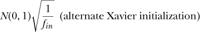

为了增加更多的混淆，引入修正线性单元（ReLU）后，推荐进行进一步的更改。这现在被称为*He 初始化*，它将 Xavier 初始化中的 1 替换为 2：

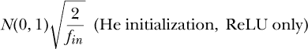

欲了解更多内容，请参见 Kaiming He 等人所著的《深入探索修正线性单元（ReLU）：超越人类水平的 ImageNet 分类性能》。

这些初始化方案的关键点在于，旧式的“随机小值”被更有原则的数值集合所取代，这些数值通过*f*[*in*]和*f*[*out*]考虑了网络架构。

上述讨论忽略了偏置值。这是故意为之的。虽然将偏置值初始化为非零值可能是可以接受的，但当前主流观点（虽然变化迅速）认为将它们全部初始化为 0 是最好的做法。也就是说，sklearn 的 MLPClassifier 将偏置值初始化与权重的方式相同。

### 过拟合与正则化

训练模型的目标是让它学习数据集所采样的母体分布的基本通用特征。这样，当模型遇到新的输入时，它就能正确地解释这些输入。正如我们在本章中所看到的，训练神经网络的主要方法是优化——寻找“最佳”参数集合，以使网络在训练集上的错误尽可能少。

然而，仅仅寻找最小化训练误差的最佳值集是不够的。如果我们在对训练数据进行分类时没有犯任何错误，通常意味着我们已经过拟合，并且实际上并没有学习到数据的通用特征。这种情况在传统模型中更为常见，无论是神经网络还是经典模型，而在像第十二章中的卷积神经网络这样的深度模型中则较少发生。

#### 理解过拟合

我们之前时不时提到过过拟合问题，但并没有深入理解它的本质。理解过拟合的一种方法是考虑一个不同的问题，即将一个函数拟合到一组数据点上。这被称为*曲线拟合*，其中一种方法是通过找到使误差最小化的函数参数来优化数据点的误差度量。这听起来应该很熟悉，这正是我们在训练神经网络时所做的。

作为曲线拟合的一个例子，考虑以下数据点：

| *x* | *y* |
| --- | --- |
| 0.00 | 50.0 |
| 0.61 | –17.8 |
| 1.22 | 74.1 |
| 1.83 | 29.9 |
| 2.44 | 114.8 |
| 3.06 | 55.3 |
| 3.67 | 66.0 |
| 4.28 | 89.1 |
| 4.89 | 128.3 |
| 5.51 | 180.8 |
| 6.12 | 229.7 |
| 6.73 | 229.3 |
| 7.34 | 227.7 |
| 7.95 | 354.9 |
| 8.57 | 477.1 |
| 9.18 | 435.4 |
| 9.79 | 470.1 |

我们想找到一个函数，*y* = *f* (*x*)，来描述这些点——一个可能是这些点的母函数，尽管这些点是带有噪声的。

通常，在曲线拟合时，我们已经知道函数的形式；我们要寻找的是参数。但如果我们不知道函数的确切形式，只知道它是某种多项式怎么办？一般来说，对于某个最大指数 *n*，多项式看起来是这样的：

*y* = *a*[0] + *a*[1]*x* + *a*[2]*x*² + *a*[3]*x*³ + … + *a[n]x^n*

拟合多项式到数据集的目标是找到参数，*a*[0]，*a*[1]，*a*[2]，…，*a*[*n*]。通常的做法是最小化 *y*（给定 *x* 位置的输出）和 *f*（在相同 *x* 下当前参数集的函数输出）之间的平方差。这应该很熟悉，因为我们曾讨论过使用这种损失函数来训练神经网络。

这与过拟合有什么关系？让我们绘制之前的数据集，并将拟合两个不同函数的结果显示出来。第一个函数是

*y* = *a*[0] + *a*[1]*x* + *a*[2]*x*²

这是一个二次函数，可能是你作为初学代数时学到并讨厌的函数类型。第二个函数是

*y* = *a*[0] + *a*[1]*x* + *a*[2]*x*² + *a*[3]*x*³ + … + *a*[14]*x*¹⁴ + *a*[15]*x*¹⁵

这是一个 15 次方的多项式。结果见图 9-5。

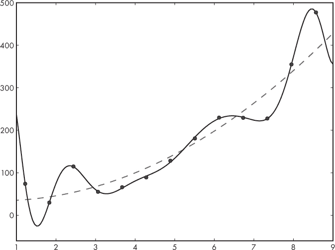

*图 9-5：一个数据集和拟合到它的两个函数：一个二次函数（虚线）和一个 15 次方多项式（实线）*

哪个函数更好地捕捉了数据集的一般趋势？二次函数明显跟随数据的一般趋势，而 15 次方多项式则显得四处波动。再看一下图 9-5。如果我们只根据数据点与相应函数值之间的距离来判断我们是否拟合得好，那么我们会说 15 次方多项式拟合得更好；毕竟它几乎穿过了所有数据点。这类似于训练一个神经网络并在训练集上实现完美的情况。这种完美的代价可能是对新输入的泛化能力较差。图 9-5 中的二次拟合虽然没有通过数据点，但它捕捉到了数据的总体趋势，因此在我们希望对新的 *x* 值进行预测时，它会更有用。

当人类想要拟合一条曲线到类似我们样本数据集的东西时，他们通常会查看数据，并且注意到一般趋势后，选择一个合适的函数来拟合。而在某些情况下，期望的函数形式可能已经从理论中知道。然而，如果我们想与神经网络类比，我们会发现自己处于一个我们不知道合适的拟合函数是什么的境地，需要从 *x* 的函数空间及其参数中找到一个“最佳”函数。

希望这个例子能够强调这样一个观点：训练神经网络并不像其他优化问题那样是一个简单的优化问题——我们需要一些方法推动网络学习的函数朝着能够捕捉数据本质的方向发展，而不是陷入过分关注训练数据中特定特征的陷阱。这个方法就是正则化，尤其对于具有巨大容量的大型网络，正则化是必不可少的。

#### 理解正则化

*正则化* 是指任何能够促使网络学习父分布相关特征而不是训练集细节的方法。最好的正则化形式是增加训练集的规模和代表性。数据集越大，越能代表网络在实际中会遇到的所有类型的样本，网络的学习效果就越好。当然，我们通常只能使用有限的训练集。机器学习社区已经花费了大量时间和精力研究如何从小数据集中获得更多信息。

在第五章中，我们遇到了可能是第二好的正则化方法——数据增强。这是通过使用我们现有的数据生成新的训练样本来替代拥有更大数据集的做法，这些新样本合理地来自父分布。例如，我们考虑通过对已经在训练集中的图像进行简单的旋转、翻转和位移来增加有限的训练图像集。数据增强非常强大，尽可能使用它。当处理图像作为输入时，应用起来特别容易，尽管在第五章中我们也看到了一个增广包含连续值向量的数据集的方法。

我们现在在正则化工具箱中有两个技巧：更多的数据和数据增强。这些是最好的技巧，但当有其他可用方法时，你也应该使用它们。我们来看看另外两个技巧：L2 正则化和 dropout。前者现在已经成为标准，并且得到了包括 sklearn 和 Keras 在内的工具包的广泛支持。后者非常强大，并且在 2012 年出现时改变了游戏规则。

#### L2 正则化

拥有少量大值权重的模型在某种程度上比权重较小的模型复杂。因此，保持权重较小可以帮助网络实现一个更简单的函数，更适合我们希望它学习的任务。

我们可以通过使用 L2 正则化来鼓励权重变小。*L2 正则化*向损失函数中添加了一个项，使得损失变为

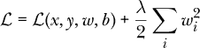

其中，第一个项是我们已经使用的任何损失，第二个项是新的 L2 正则化项。请注意，损失是输入(*x*)、标签(*y*)、权重(*w*)和偏置(*b*)的函数，这里我们指的是网络的所有权重和所有偏置。正则化项是网络中所有权重的和，仅限于权重。 “L2”标签是导致我们将权重平方的原因。

这里的*L2*指的是一种范数或距离。你可能熟悉平面上两点之间的距离公式：*d*² = (*x*[2] *– x*[1])² + (*y*[2] *– y*[1])²。这是*欧几里得距离*，也称为*L2 距离*，因为这些值被平方了。这就是正则化项被称为*L2*并且权重值被平方的原因。也可以使用 L1 损失项，在这种情况下，我们不是对权重进行平方，而是使用绝对值。实际上，L2 正则化更为常见，至少在经验上，它似乎在神经网络分类器中表现得更好。

*λ*（lambda）乘数设置了这个项的重要性；它越大，它在训练网络时占据的损失总量就越大。*λ*的典型值约为 0.0005。稍后我们会看到，为什么这个乘数是*λ*/2，而不仅仅是*λ*。

L2 项的作用是什么？回想一下，损失是我们在训练过程中希望最小化的东西。新的 L2 项是所有权重的平方和。如果权重很大，损失也会很大，而这正是我们在训练中不希望发生的。较小的权重会使 L2 项变小，因此梯度下降会倾向于小的权重，不论它们是正的还是负的，因为我们会对权重值进行平方。如果网络的所有权重都相对较小，且没有权重特别占主导地位，那么网络将利用所有的权重来表示数据，这在防止过拟合方面是有好处的。

L2 正则化也被称为*权重衰减*，因为 L2 项在反向传播过程中起到的作用。反向传播给我们提供了损失函数相对于*w*[*i*]的偏导数。添加 L2 正则化意味着总损失的偏导数现在会加入 L2 项本身相对于某个特定权重*w*[*i*]的偏导数。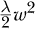的导数是*λw*；消除了本应存在的 2 的因子。此外，由于我们想要的是特定权重*w*[*i*]的偏导数，L2 项的其余部分会归零。最终效果是，在梯度下降过程中，权重*w*[*i*]的更新变为

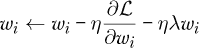

其中，*η*（eta）是学习率，我们忽略了任何额外的动量项。*ηλw*[*i*]项是新的，它是 L2 正则化的结果，我们可以看到随着训练的进行，它推动权重接近 0，因为*η*和*λ*都小于 1，所以在每个小批量中，我们都在减去权重值的一小部分。权重仍然可以增加，但要做到这一点，原始损失的梯度必须很大。

我们之前提到过，损失函数的形式是由我们网络的开发者决定的。正则化项并不是我们可以添加到损失函数中的唯一项。就像我们对 L2 项的处理一样，我们可以创建并添加项，以改变网络在训练过程中的行为，并帮助它学习我们希望它学习的内容。这是一种强大的技术，可以用来定制神经网络学习的各个方面。

#### Dropout

Dropout 在 2012 年出现时，迅速引起了机器学习社区的轰动，参见 Alex Krizhevsky 等人所著的《Imagenet 分类与深度卷积神经网络》。截至 2020 年秋，这篇论文已经被引用超过 70,000 次，正如当时一位知名的机器学习研究者私下对我说的那样，“如果我们在 1980 年代就有 Dropout，现在的世界可能会完全不同。”那么，什么是 Dropout，为什么每个人都如此兴奋呢？

为了回答这个问题，我们需要回顾一下模型集成的概念。在第六章中我们曾稍微提到过它们。集成是指一组模型，这些模型略有不同，且都在相同的数据集或该数据集的稍微不同版本上进行训练。这个想法很简单：由于训练大多数模型都涉及随机性，训练多个相似的模型应该能得到一个相互强化的集合——在这个集合中，输出结果可以被组合成一个比任何单一模型都要好的结果。集成是有用的，我们经常使用它们，但它们也带来了运行时的成本。如果一个样本通过神经网络需要*x*毫秒，而我们有一个包含 20 个网络的集成，那么我们的评估时间（推理时间）就变成了 20*x*毫秒，忽略并行执行的可能性。在某些情况下，这是不可接受的（更不用说 20 个大网络所需的存储和电力比 1 个网络要多得多）。由于模型集成的最终结果是更好的整体性能，我们可以说集成本身也是一种正则化器，因为它体现了“群众的智慧”。

*Dropout* 将集成方法推向了极致，但仅在训练过程中使用，并且不会创建第二个网络，因此最终我们仍然只有一个模型来处理。像许多统计学中的好方法一样，这个方法也需要随机性。现在，当我们训练网络时，我们使用当前的权重和偏置进行前向传播。如果在前向传播过程中，我们随机为每个节点分配一个 0 或 1，使得节点值为 1 的会被用于下一层，而节点值为 0 的会被丢弃呢？这样，我们实际上每次都会使用不同的神经网络配置运行训练样本。例如，请参见图 9-6。

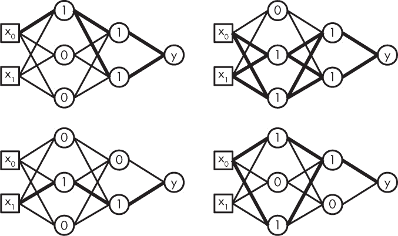

*图 9-6：应用 dropout 进行训练时可能使用的网络*

这里我们展示了图 8-1 中的网络，但每个隐藏节点的值为 0 或 1。这个 0 或 1 决定了输出是否被使用。网络中的粗线表示仍然有效的连接。换句话说，粗线显示了实际上用于生成反向传播中累积输出的网络。如果我们对每个训练样本都这样做，我们可以很容易地看到，我们将训练大量的神经网络，每个网络只训练一个样本。而且，由于权重和偏置在前向传播过程中会持续存在，所有网络将共享这些权重，期望这个过程能强化代表数据集本质的好的权重值。正如我们在本章中多次提到的，学习数据的本质是训练的目标；我们希望能够很好地泛化到来自同一虚拟母体分布的新数据，这个分布最初生成了训练集。Dropout 是一种严格的正则化方法。

我之前说过我们“随机为节点分配一个 0 或 1”。那我们是否是均等地分配它们呢？我们在一层中丢弃节点的概率是我们可以指定的。我们称之为*p*。通常情况下，*p* = 0.5，意味着每个训练样本中，一层中大约 50%的节点会被丢弃。如果设置*p* = 0.8，那么 80%的节点会被丢弃，而*p* = 0.1 则只丢弃 10%。有时，网络的不同层使用不同的概率，特别是第一输入层，它应该使用比隐藏节点更小的概率。如果我们丢弃了过多的输入，就会失去我们试图让网络识别的信号来源。对输入层应用 dropout 可以看作是一种数据增强形式。

从概念上讲，dropout 是训练一组共享权重的大规模网络。每个网络的输出可以通过几何平均与其他网络的输出结合，前提是我们使用 softmax 输出。两个数的几何平均是它们乘积的平方根。*n* 个数的几何平均是它们乘积的 *n* 次方根。在 dropout 的情况下，事实证明，这可以通过使用整个网络，并将所有权重乘以它们被包含的概率来近似。假设 *p* 是节点被丢弃的概率，那么权重需要乘以 1 *– p*，因为这是该节点不被丢弃的概率。因此，如果我们将 *p* 固定为 0.5，并且对所有节点都使用该值，那么最终的网络是所有权重都被除以 2 的网络。

截至本文写作时，sklearn 的 MLPClassifier 类不支持 dropout，但 Keras 肯定支持，因此我们将在第十二章再次看到 dropout。

### 总结

因为这是一个重要的章节，让我们更深入地回顾一下我们学到的内容。在这一章中，我们描述了如何使用梯度下降法和反向传播来训练神经网络。整体步骤的顺序如下：

1.  选择模型的架构。这意味着层的数量、每一层的大小以及激活函数的类型。

1.  使用智能选择的初始值初始化网络的权重和偏置。

1.  将一个小批量的训练样本通过网络，计算该小批量的平均损失。我们讨论了常见的损失函数。

1.  使用反向传播计算每个权重和偏置对小批量整体损失的贡献。

1.  使用梯度下降法，根据反向传播找到的贡献更新模型的权重和偏置值。我们讨论了随机梯度下降法及其与小批量概念的关系。

1.  从第 3 步开始重复，直到达到所需的训练周期数或小批量处理数，或者损失降到某个阈值以下，或者损失变化不大，或者验证集上的得分达到了最小值。

1.  如果网络学习效果不佳，应用正则化并重新训练。在本章中，我们讨论了 L2 正则化和 dropout。数据增强，或者说增加训练集的大小或代表性，也可以看作是正则化的一种方式。

训练神经网络的目标是学习一个能够很好地泛化到未见过输入的模型参数。这是所有监督学习的目标。对于神经网络，我们知道，只要拥有足够的容量和训练数据，它能够逼近任何函数。天真地说，我们可能认为我们做的不过是普通的优化，但从一个重要的角度来看，我们并非如此。训练集上的完美表现往往不是一件好事；它通常是过拟合的表现。相反，我们希望模型学习到一个能够捕捉训练集所隐含的函数本质的函数。我们使用测试数据来增强信心，确保我们已经学到了一个有用的函数。

在下一章中，我们将通过一系列使用 sklearn 的实验，深入探索传统神经网络。

1. 更多相关内容，请参见 Glorot, Xavier 和 Yoshua Bengio 的《理解训练深度前馈神经网络的难度》。
