## **12

卷积神经网络简介**

在本章中，我们将介绍一种处理多维信息的新方法，特别是我们将深入探讨*卷积神经网络*（CNN）的理论和高层次操作，CNN 是现代深度学习的基石。

我们将首先介绍 CNN 发展的动机。卷积是 CNN 的核心，所以下面我们会介绍卷积的内容。我们将详细讨论卷积的使用方式，特别是 CNN 是如何使用卷积的。接着，我们将介绍一个基本的 CNN，并分析其结构。我们将在本章的其余部分使用这个基本的 CNN 架构。在剖析完 CNN 之后，我们将探讨卷积层是如何工作的。接下来是池化层，我们将了解池化层的作用，它们带来的好处以及它们的代价。为了完善我们对 CNN 基本组成部分的讨论，我们将介绍完全连接层，实际上，它们只是传统的完全连接前馈神经网络中的层，就像第八章中的那样。

本章将明显缺少一个话题：训练 CNN 的机制。部分原因是，卷积层的引入使得训练过程变得复杂，但主要是因为我们在第九章中已经讨论过反向传播算法，我们使用相同的算法来训练 CNN。我们通过计算训练小批量数据的平均损失来更新所有层的权重和偏置，并通过反向传播计算所需的导数，从而更新每一步随机梯度下降的权重和偏置。

### 为什么选择卷积神经网络？

相比传统的神经网络，CNN（卷积神经网络）有几个优势。首先，CNN 的卷积层所需的参数远少于完全连接的神经网络，正如我们在本章稍后会看到的那样。CNN 之所以需要更少的参数，是因为卷积操作在每一层中只对输入的一个小子集应用参数，而不是像传统神经网络那样对整个输入一次性应用参数。

其次，CNN 引入了*空间不变性*的概念，即无论输入中某个特征出现在哪里，CNN 都能检测到它的空间关系。例如，如果神经网络的输入是猫的图像，传统的神经网络会将图像作为一个单一的特征向量进行处理，这意味着如果猫出现在图像的左上角，网络就会学习到猫可以出现在左上角，但无法学习到猫也可以出现在右下角（除非训练数据中包含了右下角有猫的例子）。然而，对于 CNN，卷积操作可以检测到猫出现的任何位置。

尽管 CNN 通常用于二维输入数据，它们也可以用于一维输入数据，比如我们到目前为止处理的特征向量。然而，我们处理的特征向量，如虹膜测量数据，并不反映像猫图像的各个部分之间的空间关系。这里没有任何可以让卷积操作利用的空间结构。这并不意味着 CNN 无法工作，但确实意味着它可能不是最佳的模型选择。正如往常一样，我们需要了解各种模型类型的工作原理，以便为手头的任务选择最合适的模型。

**注意** *根据你问的人不同，CNN 的发明时间有所不同。有些人认为是福岛在 1980 年为了实现 Neocognitron 模型而开发的，另一些人认为是 LeCun 等人在 1998 年通过他们著名的论文“基于梯度的学习应用于文档识别”中提出的，这篇论文至今已经被引用超过 21,000 次。我个人认为，两者都应该获得一定的认可，尽管 LeCun 使用了卷积神经网络*（convolutional neural network）*或者* convnet *这一术语，正如它们现在有时被称呼的那样，论文中描述的内容就是我们在本书中将要使用的内容。Neocognitron 反映了一些 CNN 的思想，但它并非 CNN 本身。*

### 卷积

*卷积*涉及将一个对象滑动到另一个对象上。对于我们来说，这意味着将一个*卷积核*，一个小的二维数组，滑动到输入数据上，这个输入可能是 CNN 的输入图像，或者是某个低层卷积层的输出。卷积有正式的数学定义，但现在它对我们帮助不大。幸运的是，我们的所有输入都是离散的，这意味着我们可以稍微简化一些处理。为了简便起见，我们只关注二维的情况。

#### 使用卷积核扫描

*卷积核*是我们在训练过程中要求卷积层学习的内容。它是由多个小的二维数组组成，我们将它滑动到输入数据上。最终，卷积核会成为 CNN 中卷积层的权重。

卷积的基本操作是：选取输入数据中一个与卷积核大小相同的小区域，用卷积核覆盖这个区域，对这些数字执行某些操作，得到一个单一的输出数字，然后将卷积核移动到输入的新位置后，重复该过程。卷积核滑动的距离被称为*步幅*（stride）。通常情况下，步幅为 1，意味着卷积核滑动一个输入元素。

图 12-1 展示了卷积对 MNIST 数字图像一部分的影响。

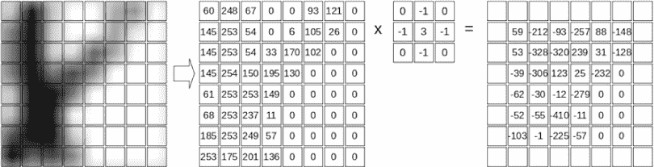

*图 12-1：卷积核与图像的卷积*

图像部分位于图 12-1 的左侧，你可以看到手写数字 8 的一部分。框框代表了像素的强度，不过为了展示目的，我们将原始图像进行了扩展，使得每个“像素”框内能看到更多不同的灰度值。卷积操作所处理的实际像素值将在箭头后给出。

这里，卷积核是

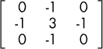

这是我们将滑动到输入像素上的数字集合。这个是一个 3 × 3 的矩阵，因此我们需要覆盖输入图像的 3 × 3 区域。第一个 3 × 3 区域，即左上角是

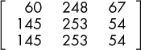

我们说过，卷积通过与核以及覆盖区域作为输入来执行操作。操作很简单：将对应的项相乘并求和。卷积的第一个输出值的计算从以下开始：

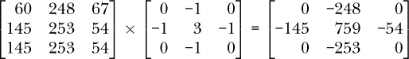

当前面的元素求和时，得到的输出值是

0 + (–248) + 0 + (–145) + 759 + (–54) + 0 + (–253) + 0 = 59

好的，第一个卷积操作的输出是 59。我们该如何处理这个数字呢？核是 3 × 3，每一边都是奇数。这意味着它有一个中间元素，那个含有 3 的元素。在输出数组中，那个包含中间数字的位置会被输出值 59 替代。图 12-1 显示了卷积的完整输出。果然，当核覆盖左上角时，输出的第一个元素是 59，位于核的中心。

剩余的输出值通过完全相同的方式计算，但每次将核移动 1 个像素。当一行的末尾被到达时，核会回到左侧，但下移 1 个像素。这样，它就像旧式模拟电视的扫描线一样，滑过整个输入图像，从而产生图 12-1 中显示的输出。

下一个输出值是

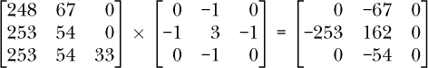

求和后得到*–* 212，正如我们在图 12-1 右侧所看到的。

重复卷积操作会产生图 12-1 中显示的输出。注意输出周围的空框。这些值是空的，因为我们的 3 × 3 核的中间部分没有覆盖输入数组的边缘。因此，输出的数字矩阵在每个维度上都比输入小 2。如果核是 5 × 5，那么边界将宽 2 个像素，而不是 1 个像素。

2D 卷积的实现需要对这些边界像素做出决策。有几种选项，大多数工具包都支持其中的一些。一种方法是简单地忽略这些像素，使输出比输入小，正如我们在图 12-1 中所展示的那样。这种方法通常被称为*精确*或*有效*，因为我们仅保留那些实际由操作输出的值。

另一种方法是想象输入图像四周围绕着一个 0 值的边框。这个边框的厚度根据需要来调整，以便使卷积核的中心值与输入图像的左上角像素匹配。对于图 12-1 中的示例，这意味着边框宽度为 1 个像素，因为卷积核是 3×3，并且卷积核中心的两侧各有一个元素。如果卷积核是 5×5，则边框宽度为 2 个像素，因为卷积核中心的两侧各有两个值。这被称为*零填充*，并且输出的大小与输入相同。这样，卷积一个 28×28 像素的 MNIST 数字图像与一个 3×3 卷积核，得到的输出仍然是 28×28 像素，而不是如图 12-1 所示的 26×26 像素输出。

如果我们对图 12-1 中的示例图像进行零填充，我们可以像这样填充第一个空的输出方格。

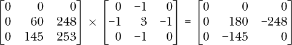

其总和为*–* 213。这意味着在图 12-1 中的输出矩阵的左上角，当前是一个空框，可以替换为*–* 213。同样，其他空框也会有值，卷积操作的输出将是 28×28 像素。

#### 图像处理中的卷积

卷积在神经网络中使用时，有时被视为一种神奇的操作，允许卷积神经网络做出它们所能做的奇妙事情。这个说法或多或少是正确的，但卷积操作绝对不是新鲜事物。即使我们完全忽略数学，只考虑二维图像的离散卷积，我们也会看到，图像科学家们在卷积被应用于机器学习之前的几十年，就已经在图像处理领域使用卷积了。

卷积操作可以实现各种各样的图像处理。例如，考虑图 12-2 中展示的图像。

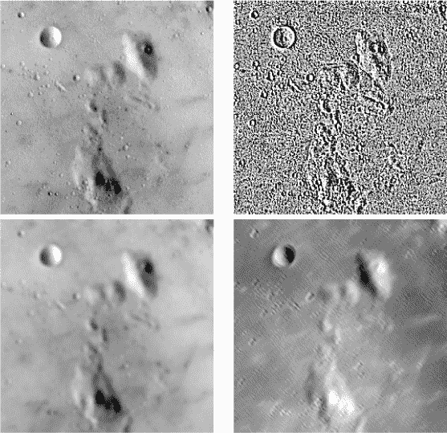

*图 12-2：应用于图像的 5×5 卷积核*

原始月亮图像位于左上角。其他三幅图像是通过将月亮图像与不同的 5×5 卷积核进行卷积得到的输出。从右上角开始，顺时针方向，卷积核分别突出边缘、对角线结构（从左上到右下）或模糊输入图像。所有这些都通过改变卷积核中的值来实现，但卷积操作本身保持不变。

从机器学习的角度来看，卷积方法的优势部分来自于参数的节省。如果一个模型可以学习一组卷积核，那么学习这些卷积核所需的数字集合比全连接模型所需的权重少。这本身就是一件好事。卷积可以提取图像中的其他信息，例如图像的缓慢变化部分（图 12-2 的模糊），快速变化的部分（图 12-2 的边缘），甚至沿特定方向的部分（图 12-2 的对角线），这意味着模型能够获得有关输入的更多信息。而且，由于我们将卷积核在图像上滑动，我们并不依赖于这些结构在图像中的具体位置。

### 卷积神经网络的解剖学

医学生通过解剖尸体来学习解剖学，观察各部分及其相互关系。同样，尽管挑战性较小，我们将从 CNN 的结构开始，展示其基本架构，然后逐步拆解它，学习每个组件的功能及其作用。

图 12-3 展示了我们的身体。这是 Keras 工具包用于训练分类 MNIST 数字模型的默认示例 CNN。我们将在本章的其余部分使用它作为标准。

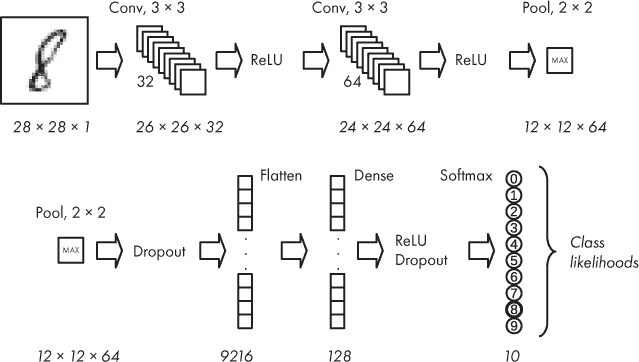

*图 12-3：基本卷积神经网络的架构*

我们如何解读这个图？像传统神经网络一样，卷积神经网络（CNN）也有输入和输出。在这个例子中，输入是左上角的数字图像。网络从左到右流动，沿着箭头的方向。到达顶部行的末尾时，网络继续沿着下一行进行。请注意，我们已将顶部行末的层复制并放置到下一行的开始部分，便于展示。

流程继续沿着底行，从左到右，直到达到输出。这里的输出是一个 softmax 层，用于给出每个可能数字的概率，就像我们在第十章的传统神经网络中看到的那样。

#### 层的不同类型

每个箭头之间是网络的一个层。我们首先注意到，与传统神经网络不同，卷积神经网络有许多种类的层。我们在这里列出它们，并将逐一讨论每一种：

+   卷积（*Conv*）

+   ReLU

+   池化（*Pool*）

+   Dropout

+   展平

+   Dense

我们应该注意到，我们使用的是 Keras 命名的层。例如，Keras 使用*Dense*来表示许多其他工具包称之为*全连接*或*内积*层。

其中一些层应该已经很熟悉。我们知道，ReLU 层实现了一个修正线性单元，它会检查每个输入是否大于或小于 0。如果输入小于 0，输出为 0；否则，输出为输入值。我们可以用数学公式表达为：

ReLU(*x*) = max(0, *x*)

其中，*max*函数返回其两个参数中的最大值。

同样，我们在第九章中提到了 dropout。Dropout 在训练过程中随机选择一定比例的输出，并将其设置为 0。这为网络提供了一种强大的正则化形式，帮助网络学习输入数据的有意义表示。我们的基本 CNN 中有两个 dropout 层，第一个 dropout 层的概率为 25%，这意味着在每次训练的小批量传递过程中，大约 25%的输出会被设置为 0。第二个 dropout 层的概率为 50%。

*Flatten*和*Dense*层是老朋友，尽管我们通常以另一种名称认识它们，而不是作为独立的实体。我们传统的前馈神经网络使用全连接层处理一维向量。在这里，Flatten 和 Dense 一起实现一个全连接层。Flatten 层将其输入（通常是一个四维数组，我们稍后会解释原因）转换为一个向量。它的工作类似于我们构建 MNIST 数据集的向量形式时所做的事情，即将每一行的像素首尾相接，展开二维图像。Dense 层实现传统的神经网络层，其中每个输入值都映射到 Dense 层的每个节点。通常，Dense 层的输出会传递给另一个 Dense 层或 softmax 层，以便网络进行预测。

在内部，许多 CNN 层期望四维数组作为输入，并生成四维数组作为输出。第一维是小批量中的输入数量。因此，如果我们有一个大小为 24 的小批量，那么四维数组的第一维将是 24。

第二维和第三维被称为*高度*和*宽度*。如果层的输入是模型的输入（例如，一张图像），那么这两个维度实际上就是图像的高度和宽度。如果输入实际上是其他层的输出，例如一个（稍后描述的）卷积层的输出，则*高度*和*宽度*指的是应用卷积核于某个输入后得到的输出。例如，图 12-1 中的输出的高度和宽度为 26。

最后一维是通道数，如果是输入图像的话；如果是卷积层或池化层的输出，则是*特征图*的数量。图像中的通道数实际上就是带的数量，灰度图像有一个带，彩色图像通常有三个带，分别对应红色、绿色和蓝色。有些彩色图像还有一个 alpha 通道，用于指定像素的透明度，但这些通常会在将图像传递给 CNN 之前被丢弃。

图 12-1 中的输出被称为*特征图*，因为它是将卷积核在输入上进行卷积操作的响应。正如我们在图 12-2 中看到的那样，通过对图像进行卷积操作，可以提取出图像中的特征，因此卷积层使用的卷积核的输出称为*特征图*。

这留下了两个层次需要研究：*卷积*层和*池化*层。这些层是新的。

在我们的基本 CNN 中，卷积操作作用于二维输入的集合，其中*集合*指的是一个二维数组的堆叠，第三维是通道数或特征图的数量。这意味着与我们在本书中看到的其他模型不同，这里的输入是真正的完整图像，而不是从图像创建的向量。然而，在 CNN 中，卷积不一定仅作用于二维输入。也存在三维卷积和一维卷积，尽管这两种卷积相比于二维卷积使用得较少。

池化层用于通过按照某些规则合并输入值来减少输入的空间维度。最常见的规则是*最大池化*，即在输入的一个小块中保留最大值，其他值则被丢弃。我们将在本章中详细讨论池化层。

现代网络可以使用许多其他类型的层，且这些层中的许多在 Keras 中已经得到直接支持，尽管也可以添加自定义层。这种灵活性是 Keras 能够快速支持新深度学习发展的原因之一。与传统的神经网络一样，为了让某一层具有可以学习的权重，该层在数学意义上需要是可微分的，以便链式法则可以继续应用，部分导数可以计算出来，从而学习如何在梯度下降过程中调整权重。如果前一句话不清楚，是时候回顾一下第九章的反向传播部分了。

#### 数据通过 CNN 的传递

让我们再看看图 12-3。这里不仅仅是层的顺序和名称在变化。许多层的底部有斜体数字，这些数字表示该层输出的维度，包括高度、宽度和特征图的数量。如果该层只有一个数字，它输出一个包含该数量元素的向量。

CNN 的输入是 28 × 28 × 1 的图像。卷积层的输出是一组特征图。因此，第一层卷积层的输出是 26 × 26 × 32，这意味着有 32 个特征图，每个特征图是从单个 28 × 28 × 1 的输入图像计算得出的 26 × 26 的图像。同样，第二层卷积层的输出是 24 × 24 × 64，这是一组由 26 × 26 × 32 的输入计算得出的 64 个特征图，而这个输入本身是第一层卷积层的输出。

我们看到，第一行末尾的池化层将其 24 × 24 × 64 的输入减少到 12 × 12 × 64。标签“max”告诉我们池化层的操作；它会对输入的 2 × 2 区域进行操作，并返回最大的值。由于输入是 2 × 2，且池化层只返回一个值，这将每个 24 × 24 的输入减少为 12 × 12 的输出。这个过程应用于每个特征图，因此输出为 12 × 12 × 64。

看一下 图 12-3 的底部行，我们可以看到 Flatten 层将池化层的 12 × 12 × 64 输出转换成了一个包含 9,216 个元素的向量。为什么是 9,216？因为 12 × 12 × 64 = 9,216。接下来，Dense 层有 128 个节点，最后我们的输出 softmax 层有 10 个节点，因为有 10 个类别，数字 0 到 9。

在 图 12-3 中，ReLU 和 Dropout 层下面没有数字。这些层不会改变输入的形状。它们仅对每个元素执行某些操作，无论其形状如何。

我们的基本 CNN 的卷积层还有其他相关的数字：“3 × 3”和“32”或“64”。3 × 3 告诉我们卷积核的大小，而 32 或 64 告诉我们特征图的数量。

我们已经提到了池化层中的 2 × 2 部分。这代表了池化核的大小，池化核就像卷积核一样，在输入的每个特征图（或通道）上滑动，减少输入的大小。使用 2 × 2 池化核意味着，通常情况下，输出在行和列维度上将是输入的一半大小。

图 12-3 有一些熟悉的部分，但展示的方式对我们来说是新的，我们还需要思考一些神秘的新层，例如卷积层和池化层，因此我们现在对这些内容的理解可能会有些模糊。这个完全没问题。我们已经有了一些新想法，并通过一些视觉指示看到了它们如何连接在一起形成一个 CNN。现在，这些就是我们所需要的。接下来的章节将会带给你一系列的“啊哈”时刻，当你回顾这张图及其各部分时，你会明白每个部分的作用，进而理解它们在图像输入到输出 softmax 预测的处理链中所处的位置。

### 卷积层

如果我们关于卷积的讨论仅仅停留在前面的部分，我们会理解卷积的基本操作，但仍然无法确切理解卷积层在 CNN 中是如何工作的。考虑到这一点，让我们来看看卷积的概念是如何在 CNN 的卷积层的输入和输出中泛化的。

#### 卷积层是如何工作的

卷积层的输入和输出都可以被看作是 2D 数组（或矩阵）的堆叠。卷积层的操作通过一个简单的例子最能说明，展示如何将输入数组堆栈映射到输出数组堆栈。

在我们展示示例之前，需要介绍一些术语。我们之前描述了卷积操作，即将一个内核应用于输入，二者都是二维的。我们将继续使用*内核*这一术语来指代这个单一的二维矩阵。然而，在实现卷积层时，我们很快就会看到，我们需要一堆内核，这些内核在机器学习中通常被称为*滤波器*。滤波器是内核的堆叠。滤波器通过它的内核作用于输入堆栈，从而产生输出堆栈。由于在训练过程中模型学习的是内核，因此可以说模型也在学习滤波器。

在我们的示例中，输入是两个 5 × 5 的数组堆栈，内核大小为 3 × 3，我们希望得到一个深度为三的输出堆栈。为什么是三？因为作为 CNN 架构的设计者，我们认为学习三个输出将有助于网络学习当前任务。卷积操作决定了每个输出数组的宽度和高度；我们选择深度。我们将使用有效卷积，输出会丢失一像素的边框，这意味着输入的宽度和高度都会减少 2。因此，一个 5 × 5 的输入与一个 3 × 3 的内核卷积后将产生一个 3 × 3 的输出。

这解释了尺寸变化，但我们如何将两个数组的堆栈转换为三个数组的堆栈呢？将 5 × 5 × 2 的输入映射到所需的 3 × 3 × 3 输出的关键是训练过程中学习到的一组内核，即滤波器。让我们看看滤波器是如何提供我们想要的映射的。

我们假设此时已经知道滤波器，每个滤波器是一个 3 × 3 × 2 的内核堆叠。一般来说，如果输入堆栈中有 *M* 个数组，并且我们希望输出堆栈中有 *N* 个数组，且使用的内核是 *K* × *K*，那么我们需要一组 *N* 个滤波器，每个滤波器都是一个 *K* × *K* 的内核堆栈，深度为 *M*。让我们来探讨一下原因。

如果我们把堆栈分开，这样可以清晰地看到每个元素，那么我们的输入堆栈看起来是这样的：

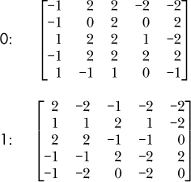

我们有两个 5 × 5 的矩阵，分别标记为 0 和 1。值是随机选择的。

为了得到一个深度为三的输出堆栈，我们需要一组三个滤波器。每个滤波器中的内核堆栈深度为二，以与输入堆栈中的数组数量相对应。内核本身是 3 × 3 的，所以我们有三个 3 × 3 × 2 的滤波器，其中每个滤波器的内核与相应的输入数组进行卷积。这三个滤波器是：

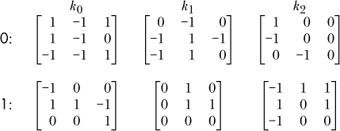

我们在这里添加了 0 和 1 标签，以显示哪些卷积核应用于哪些输入堆栈数组。我们还拥有一个偏置向量，正如我们在传统神经网络层中所做的那样。这是一个向量，每个卷积核堆栈都有一个值，我们在最后加上它，帮助将卷积层的输出与数据对齐，就像我们在传统神经网络层中所做的那样。偏置为层添加了一个额外的自由度——它是一个可以学习的项，帮助层从数据中学习到更多东西。在我们的示例中，偏置向量是 *b* = *{*1,0,2*}*，是随机选择的。

为了获得输出堆栈，我们将每个卷积核与相应的输入数组进行卷积，求出输出的元素之和，并加上偏置值。对于卷积核 *k*[0]，我们将第一个输入数组与第一个卷积核进行卷积，得到：

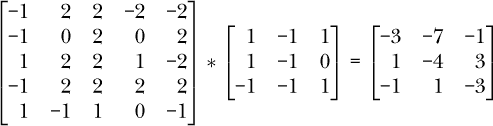

请注意，我们使用 * 来表示完整的卷积操作，这是相当标准的。我们对 *k*[0] 中的第二个卷积核重复这个操作，将其应用于输入的第二个数组：

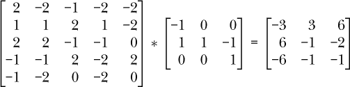

最后，我们将两个卷积输出相加，并加上偏置值：

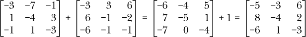

这将给我们第一个输出数组，即卷积核 *k*[0] 对输入堆栈的应用。

我们对卷积核 *k*[1] 和 *k*[2] 执行相同的过程，以获得它们的输出，因此给定输入的最终卷积层输出为：

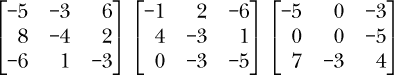

在这里，我们将堆叠的数组并排写出，得到一个 3 × 3 × 3 的输出，正如所希望的那样。

我们的卷积层示例将一个 5 × 5 × 2 的输入映射到 3 × 3 × 3 的输出。如果我们天真地使用全连接层替代，则需要一个包含 50 × 27 = 1350 个权重的权重矩阵，这些权重需要学习。相比之下，卷积层每个卷积核只使用了 3 × 3 × 2 个权重，三个卷积核总共需要 54 个权重（不包括偏置值）。这是一项显著的减少。

#### 使用卷积层

上面的示例向我们展示了卷积层是如何工作的。现在让我们看看它的效果。假设我们已经训练了图 12-3 中显示的网络，因此我们拥有运行未知图像时所需的权重和偏置。（你将在《使用 Keras 和 MNIST 的实验》一章中看到如何训练 CNN。）

图 12-3 中的网络第一层是一个卷积层，它将 28 × 28 × 1 的输入（单通道灰度数字图像）映射到 26 × 26 × 32 的输出，使用的是 32 个 3 × 3 的卷积核。因此，我们知道输入图像和输出之间的权重可以存储在一个 3 × 3 × 1 × 32 的数组中：3 × 3 是卷积核的大小，1 是输入通道数，32 是卷积核的数量。

训练完成后，卷积核的 32 个 3 × 3 的实际样子是什么样的？我们可以从训练好的模型中提取它们，并以一组 32 个 3 × 3 的矩阵形式打印出来。以下是前两个：

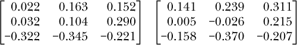

这很好，但对于理解卷积核的作用并没有特别大的帮助。

我们还可以通过将矩阵转换为图像来可视化卷积核。为了将卷积核转换为图像，我们首先注意到所有卷积核值都恰好适合在范围 [*–*0.5, +0.5] 之间，因此，如果我们给每个卷积核值加上 0.5，就把范围映射到了 [0,1]。之后，乘以 255 将卷积核值转换为字节值，这与灰度图像使用的值相同。此外，值为 0 的地方现在变成了 127，这是一个中灰色值。

转换后，卷积核可以作为灰度图像显示，其中负的卷积核值接近黑色，正的卷积核值接近白色。然而，还需要最后一步，因为映射后的卷积核仍然只有 3×3 像素。最后一步是将 3 × 3 的图像放大到 64×64 像素。我们将以两种不同的方式进行放大。第一种方法使用最近邻插值显示卷积核的块状图像。第二种方法使用 Lanczos 滤波器，这可以平滑图像，使得卷积核的方向更加清晰。图 12-4 展示了卷积核图像，顶部是块状版本，底部是平滑版本。

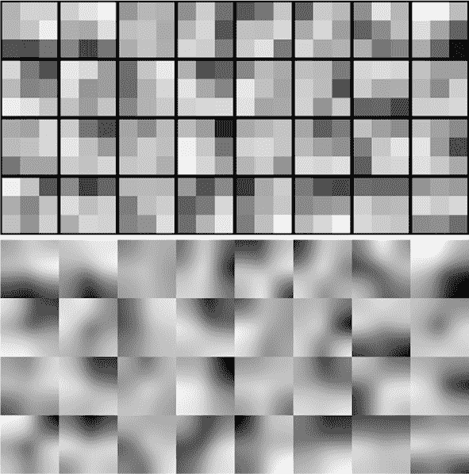

*图 12-4：第一卷积层的 32 个学习到的卷积核（上）。平滑版本清晰显示卷积核的方向（下）。*

这些图像代表了模型第一卷积层学习到的 32 个卷积核，见 图 12-3。这些图像包含足够的细节，暗示着卷积核正在选择特定方向上的结构，就像 图 12-2 右下角的卷积核生成的图像一样，强调了对角结构。

现在我们来关注卷积核的效果。卷积核对输入的 MNIST 图像做了什么？我们可以通过将每个卷积核与示例图像（这里是一个“3”）进行卷积，并遵循类似于生成前面卷积核图像的过程，来对一个示例 MNIST 图像进行处理。结果是一组 32 个 26 × 26 的图像，我们再次将它们放大到 64 × 64 后再显示出来。图 12-5 展示了结果。

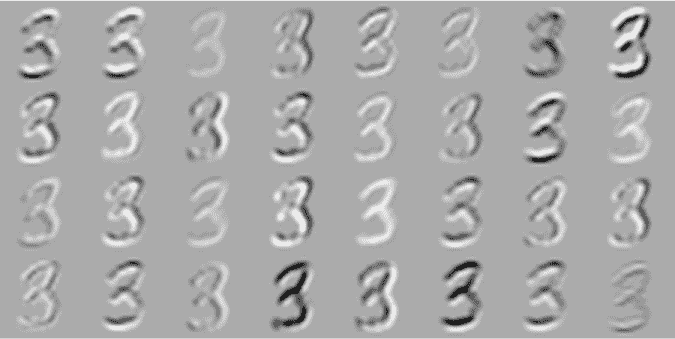

*图 12-5：应用于示例 MNIST 输入的 32 个卷积核*

在图 12-4 中显示的卷积核顺序与图 12-5 中的图像相匹配。例如，图 12-4 右上角的图像显示了一个左上方亮、右下方暗的卷积核，意味着它将检测从左下到右上的对角线结构。将此卷积核应用于样本后的输出是图 12-5 中的右上角图像。我们看到，卷积核增强了那些主要从左下到右上的对角线部分。请注意，这个例子容易解释，因为输入是一个单通道的灰度图像。这意味着我们没有像之前更一般的操作那样跨通道求和卷积核输出。

通常，CNN 的第一个卷积层学习的卷积核会选择特定的方向、纹理，或者如果输入图像是 RGB 的，则选择颜色。对于灰度 MNIST 图像，方向最为重要。CNN 中更高层的卷积层学习的卷积核也在选择某些特征，但卷积核选择的*具体内容*变得越来越抽象，难以理解。值得注意的是，CNN 第一个卷积层学习到的卷积核与哺乳动物大脑中视觉处理的第一层非常相似。这就是初级视觉皮层或 V1 层，负责检测线条和边缘。此外，请始终记住，卷积层和池化层的集合旨在学习一个新的特征表示：输入图像的全新表示。这种新表示能更好地分离不同类别，从而使得全连接层能够更容易地区分它们。

#### 多个卷积层

大多数卷积神经网络（CNN）都有多个卷积层。其原因之一是随着网络的深入，能够构建出受输入更大部分影响的特征。这引出了*感受野*和*有效感受野*的概念。这两个概念相似且常常被混淆。我们可以通过查看图 12-6 来解释这两者。

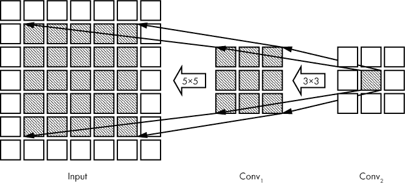

*图 12-6：感受野*

该图显示了两个卷积层的*输出*和模型的输入。我们只展示了输出的相关部分，使用了一个 3 × 3 的卷积核。我们也忽略了滤波器的深度，因为感受野（接下来定义）在卷积层的输出深度上是相同的。

图 12-6 应按照箭头所示从右向左阅读。这是与数据流经网络的方向相反的。这里，我们回头看更早的层，查看是什么影响了更高层的输出值。方框是输出值。最右边的阴影方框是 Conv[2]的输出之一。这是我们回溯以查看影响此值的因素的起点。箭头指向影响 Conv[2]中阴影值的 Conv[1]输出。然后，Conv[2]中的值有一个 3 × 3 的*感受野*，因为它直接受 Conv[1]中 3 × 3 阴影输出的影响。这就是我们定义*感受野*的方式：即直接影响当前层输出的前一层输出集合。

如果我们查看直接影响 Conv[1]的 3 × 3 阴影区域的输入值集合，我们会看到一个 5 × 5 的区域。这是有道理的：Conv[1]的每个阴影输出都有一个 3 × 3 的感受野。感受野为 3 × 3，因为 Conv[1]的卷积核是 3 × 3 的卷积核。它们重叠在一起，以便阴影的 5 × 5 输入区域就是所有阴影 Conv[1]输出所受影响的区域。

再次看看最右边的阴影输出值。如果我们追溯到输入，所有能够影响它的值，我们会发现输入中的这个阴影的 5 × 5 区域能够影响它的值。这个输入区域是 Conv[2]最右边阴影输出的*有效感受野*。这个输出值最终响应的是输入图像中最左边阴影区域的内容。随着 CNN 的加深，增加了卷积层，我们可以看到有效感受野如何变化，以便更深的卷积层处理的值最终来自越来越大范围的输入数据。

#### 初始化卷积层

在第九章中，我们看到传统神经网络的性能受到所使用的随机初始化方法（用于学习的权重和偏置）的强烈影响。对于 CNN 来说，情况也是如此。回想一下，卷积层的权重就是卷积核的值。这些值在反向传播过程中被学习，就像传统神经网络的权重一样。当我们设置网络时，我们需要一种智能的方式来初始化这些值。幸运的是，传统神经网络的最佳初始化方法同样适用于卷积层。例如，Keras 默认使用 Glorot 初始化，就像我们在第九章中看到的那样，在其他工具包中有时称其为 Xavier 初始化。

现在，让我们从卷积层转到池化层。这些层较为简单，但它们执行着一个重要的、虽然有点有争议的功能。

### 池化层

我们最喜欢的图，图 12-3，展示了在前两层卷积后有一个池化层。这个池化层将 24 × 24 × 64 的输入堆栈转换为 12 × 12 × 64 的输出堆栈。池化部分标记为“2 × 2”。这里到底发生了什么？

关键在于“2 × 2”。这意味着，对于每个 64 个 24 × 24 的输入，我们将一个 2 × 2 的滑动窗口移动在输入上，并执行类似卷积的操作。在图 12-3 中没有明确指出的是，步幅也是 2，以便滑动的 2 × 2 窗口每次移动两步，避免重叠。这通常是这样的，但不一定非得如此。由于池化操作是针对堆栈中的每个输入执行的，因此输出的堆栈大小保持不变。这与卷积层的做法通常不同。

让我们看看池化操作如何应用于堆栈中的单个输入，一个 24 × 24 的矩阵。图 12-7 向我们展示了发生了什么。

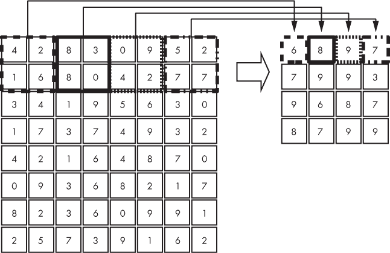

*图 12-7：对 8 × 8 输入应用 2 × 2 最大池化*

第一个 2 × 2 的值映射到第一个输出值。然后我们向右移动两个单位，将下一个 2 × 2 的区域映射到输出，以此类推，直到整个输入都被映射。每个 2 × 2 区域上执行的操作由 CNN 的设计者决定。最常见的操作是“选择最大值”，即*最大池化*，这就是我们在图 12-7 中展示的操作。这也是图 12-3 中的模型所执行的操作。另一个相当常见的池化操作是对值进行平均。

我们从图 12-7 中可以看到，8 × 8 的输入矩阵被映射为 4 × 4 的输出矩阵。这就解释了为什么图 12-3 中池化层的输出是 12 × 12；每个维度的大小是输入的一半。

池化操作简单，但会丢失信息。那么为什么要进行池化呢？池化的主要动机是减少网络中的值的数量。通常，随着深度的增加，卷积层使用的滤波器数量会增加，这是设计上的要求。即使是图 12-3 中的简单网络，我们也能看到这一点，其中第一层卷积有 32 个滤波器，而第二层有 64 个滤波器。因此，第二层卷积输出的值是 24 × 24 × 64 = 36,864 个，但经过 2 × 2 池化后，剩下的值只有 12 × 12 × 64 = 9,216 个，减少了 75%。需要注意的是，我们谈论的是数据通过网络时存在的值的数量，而不是层中学习的参数数量。图 12-3 中的第二层卷积有 3 × 3 × 32 × 64 = 18,432 个学习参数（忽略偏置值），而池化层没有学习参数。

这种输出值数量的减少，即我们对输入的表示，能够加速计算，并且作为正则化手段，帮助防止过拟合。第九章中的正则化技术和理论同样适用于 CNN。然而，由于池化会丢弃信息，并选择代理来表示整个区域（卷积层的输出），它改变了输入部分之间的空间关系。空间关系的丧失可能对某些应用至关重要，这也促使像 Geoffrey Hinton 这样的人通过引入其他类型的网络来消除池化（可以搜索“胶囊网络”）。

具体来说，Hinton 在 Reddit 上回应关于池化层的提问时表示了以下观点，这是针对一个询问他关于机器学习最具争议观点的问题的回答：

卷积神经网络中使用的池化操作是一个大错误，尽管它效果显著，但这实际上是灾难性的。如果池化区域没有重叠，池化就会丢失关于物体位置的宝贵信息。我们需要这些信息来检测物体各部分之间的精确关系。

他在回答中进一步阐述道，允许池化操作重叠在粗略程度上确实可以保留一些空间关系。一个重叠的池化操作可能是使用 2 × 2 窗口，就像我们在图 12-7 中使用的那样，但步长设为 1 而非 2。

摆脱忧虑，池化层是目前卷积神经网络（CNN）中不可或缺的一部分，但在将它们添加到模型时要小心。现在我们来讲解 CNN 的顶部层，即全连接层。

### 全连接层

在图 12-3 的第二行中，从*Flatten*开始的所有层组成了模型的全连接层。该图使用了 Keras 术语；许多人将*Dense*层称为全连接层，并假设它包含 Flatten 操作、激活函数（ReLU）以及在 softmax 层之前的可选 dropout。因此，图 12-3 中的模型只有一个全连接层。

我们之前提到过，卷积层和池化层的总体作用是将输入特征（例如图像）的表示转换成一种更便于模型推理的形式。在训练过程中，我们要求网络学习输入的另一种、更紧凑的表示，以帮助模型在面对未知输入时表现更好。对于图 12-3 中的模型，所有层次，直到包括池化层（以及池化层后的 dropout 层用于训练），都在学习输入图像的新表示。在这种情况下，全连接层即是模型：它将利用这个新表示，最终做出基于该表示的分类。

完全连接层顾名思义，就是完全连接的。图 12-3 中，来自最终池化层（9,216 个元素）的扁平化权重与 128 个元素的 Dense 层之间的连接，就像我们在构建传统神经网络时一样。这意味着有 9,216 × 128 = 1,179,648 个权重，以及额外的 128 个偏置值需要在训练过程中学习。因此，在图 12-3 模型中的 1,199,882 个参数（权重和偏置）中，98.3%的参数都存在于最终池化层和完全连接层之间的过渡部分。这说明了一个重要的观点：完全连接层在需要学习的参数方面是*昂贵的*，就像传统神经网络一样。理想情况下，如果特征学习层（卷积层和池化层）做得很好，我们可能只需要一两个完全连接层。

除了内存使用外，完全连接层还有一个缺点，这会影响它们的实用性。为了理解这个缺点是什么，考虑以下场景：你希望能够在灰度图像中定位数字。假设为了简化，背景是黑色的。如果你使用的是在 MNIST 数字数据集上训练的图 12-3 模型，那么你会得到一个非常擅长识别居中在 28×28 像素图像中的数字的模型，但如果输入的图像很大，而且你不知道图像中数字的位置，更别提有多少个数字了呢？那么事情就变得有趣了。图 12-3 模型期望输入图像的大小为 28×28 像素，且仅限这种大小。在第十三章中，我们将详细探讨这个问题并进行实验，但现在，让我们讨论完全卷积层，这是一种可能解决在 CNN 中使用完全连接层所带来的缺点的方法。

### 全卷积层

在上一节中，我提到图 12-3 模型期望输入图像的大小为 28×28 像素，并且仅限这种大小。现在让我们看看为什么。

这个模型中有许多种不同的层。有些层，如 ReLU 和 dropout 层，对流经网络的数据的维度没有影响。而卷积层、池化层和完全连接层则不能这么说。让我们逐一看一下这些层，看看它们是如何与输入图像的维度相关联的。

卷积层实现了卷积操作。根据定义，卷积操作涉及将一个固定大小的卷积核在输入图像上滑动（这里只考虑二维情况）。这个操作中没有任何部分指定输入图像的大小。图 12-3 中第一个卷积层的输出是 26 × 26 × 32。32 来自架构选择的过滤器数量。26 × 26 则来自使用一个 3 × 3 卷积核对 28 × 28 的输入图像进行卷积，没有填充。如果输入图像是 64×64 像素，则该层的输出将是 62 × 62 × 32，且不需要改变网络架构。CNN 的卷积层对其输入的空间维度是无关的。

图 12-3 中的池化层接收一个 24 × 24 × 64 的输入并产生一个 12 × 12 × 64 的输出。正如我们之前所看到的，池化操作很像卷积操作：它在空间上滑动一个固定大小的窗口，并产生一个输出；在这种情况下，输出的空间维度是输入的一半，而深度保持不变。同样，这个操作没有固定输入堆栈的空间维度。如果输入堆栈是 32 × 32 × 64，那么这个最大池化操作的输出将是 16 × 16 × 64，而不需要改变架构。

最后，我们有一个全连接层，它将 12 × 12 × 64 = 9,216 的池化输出映射到一个 128 元素的全连接（Dense）层。正如我们在第八章中看到的，全连接神经网络在实现中使用层间的权重矩阵。池化层的输出有 9,216 个元素，而全连接层的固定大小为 128，因此我们需要一个 9,216 × 128 的矩阵。这个大小*是*固定的。如果我们使用更大尺寸的输入图像，比如 32 × 32，那么在池化层处理完后，输出大小将是 14 × 14 × 64 = 12,544，这就需要一个现有的 12,544 × 128 的权重矩阵来映射到全连接层。当然，这样是行不通的；我们训练的是一个使用 9,216 × 128 矩阵的网络。CNN 的全连接层固定了 CNN 的输入大小。如果我们能绕过这个限制，我们就能将任何大小的输入应用于 CNN，只要内存允许。

我们可以简单地将一个 28 × 28 的窗口在更大的输入图像上滑动，按照我们训练模型的方式，逐个将每个 28×28 像素的图像传入模型，并输出一个更大的图像，其中每个像素现在都有一个数字出现的概率。由于有 10 个数字，我们将得到 10 个输出图。这个滑动窗口方法当然可行，但它非常计算密集，因为许多简单的算法实现通常都是如此。

幸运的是，通过将全连接层转换为等效的卷积层，我们可以做得更好，从而使模型成为*全卷积网络*。在全卷积网络中，没有全连接层，我们也不受限于使用固定的输入大小。输入大小和网络输出之间的关系将在第十三章中讨论，但本质操作是查看最后一个标准卷积或池化层的大小，并用相同大小的卷积核替换后续的全连接层。

在图 12-3 中，池化层的输出是 12 × 12 × 64。因此，我们可以通过将全连接层更改为 12 × 12 × 128 的卷积层，数学上得到与之前一样的计算。对 12 × 12 的卷积核与 12 × 12 的输入进行卷积，会生成一个单一的数字。因此，12 × 12 × 128 卷积层的输出将是一个 1 × 1 × 128 的数组，其功能上与我们原本使用的 128 个全连接层输出相同。此外，12 × 12 的卷积核与 12 × 12 输入之间的卷积操作，就是将卷积核的值逐元素地与输入值相乘并求和。这正是全连接层为每个节点所做的操作。

使用这种方式的卷积层并不会在参数数量上节省任何东西。我们可以从图 12-3 中看到这一点。池化层输出的 9,216 个元素与全连接层的 128 个节点相乘，意味着我们需要 9,216 × 128 = 1,179,648 个权重和 128 个偏置项，这对于全连接层和全卷积层都是一样的。当我们转到 12 × 12 × 128 的卷积层时，我们需要学习的权重数为 12 × 12 × 64 × 128 = 1,179,648，与之前一样。然而，现在我们也有了更改输入大小的自由，因为 12 × 12 × 128 的卷积层将自动对任何更大的输入进行卷积，输出将表示网络对输入的 28 × 28 区域应用，步幅由网络的具体架构决定。

全卷积网络源自 2014 年 Long、Shelhamer 和 Darrell 的论文《全卷积网络用于语义分割》（Fully Convolutional Networks for Semantic Segmentation），截至撰写时该论文已被引用超过 19,000 次。*语义分割*一词指的是为输入图像的每个像素分配一个类别标签。目前，语义分割的主流架构是 U-Net（参见 Ronneberger、Fischer 和 Brox 的 2015 年论文《U-Net: 用于生物医学图像分割的卷积网络》），该架构在医学领域尤其取得了广泛的成功。

我们已经讨论了主要的 CNN 层，这些层见于图 12-3。虽然还有许多其他层我们可以介绍，但它们通常超出了我们在此阶段的讨论范围，唯一的例外是批量归一化，我们将在第十五章中进行实验。新的层类型正在不断增加，以应对活跃的研究项目。然而，最终，核心层还是我们在本章中讨论的这些层。接下来，我们将看到一个训练好的 CNN 如何处理未知的输入。

### 步骤详解

在前面的章节中，我们讨论了我们的样本 CNN 的架构和层，图 12-3 中展示了这些内容。在本节中，我们将展示网络的操作，看看它如何对两个新输入作出响应，一个是“4”，另一个是“6”。我们假设网络已经完全训练好；我们将在第十三章中进行真实训练。

输入图像通过模型一层一层地传递

输入 → 卷积[0] → 卷积[1] → 池化 → 全连接 → softmax

使用训练好的权重和偏置来计算每一层的输出。我们称这些为*激活值*。第一个卷积层的输出是 32 个 26 × 26 的图像堆叠，表示输入图像对每个 32 个卷积核的响应。这个堆叠接着传递到第二个卷积层，生成 64 个 24 × 24 的输出。请注意，在两个卷积层之间有一个 ReLU 操作，它会将输出中任何本应为负的值剪裁为 0。这样做为数据在网络中流动时增加了非线性。如果没有这个非线性，两个卷积层的综合效果就相当于一个单一的卷积层。通过 ReLU 施加的非线性，我们使得两个卷积层能够学习到数据中的不同特征。

第二次 ReLU 操作使得 64 个 24 × 24 输出要么为 0，要么为正数。接着，2 × 2 的最大池化操作将 64 个输出的大小减少到 12 × 12。之后，一个标准的全连接层将从 12 × 12 激活堆叠中的 9,216 个值中生成 128 个输出值作为向量。从中，通过 softmax 计算得到 10 个输出值，每个数字对应一个输出。这些是网络的输出值，表示网络对应该为输入图像分配哪个类别标签的信心。

我们可以通过显示输出图像来说明激活情况：第一个卷积层为 26 × 26，第二个卷积层为 24 × 24，池化层为 12 × 12。为了展示全连接层的激活情况，我们可以制作 128 条条形图，其中每条条形的强度代表向量值。图 12-8 展示了我们两个样本数字的激活情况。

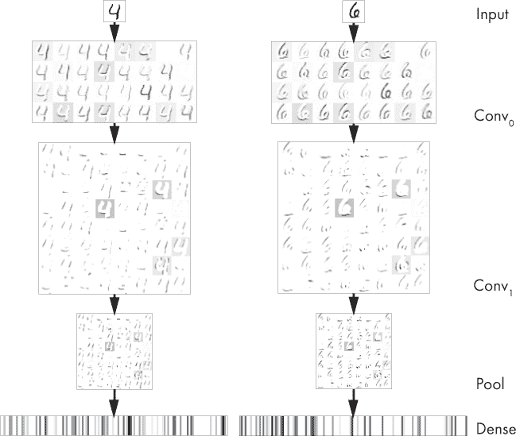

*图 12-8：每一层的模型激活情况。输出是倒置的：越深的颜色意味着越强的激活。*

请注意，这些图像已经被反转，因此较暗的部分对应于更强的激活值。我们没有展示 softmax 的输出。这些值是

|  | 0 | 1 | 2 | 3 | 4 | 5 | 6 | 7 | 8 | 9 |
| --- | --- | --- | --- | --- | --- | --- | --- | --- | --- | --- |
| 4 | 0.00 | 0.00 | 0.00 | 0.00 | 0.99 | 0.00 | 0.00 | 0.00 | 0.00 | 0.00 |
| 6 | 0.00 | 0.00 | 0.00 | 0.00 | 0.00 | 0.00 | 0.99 | 0.00 | 0.00 | 0.00 |

这表明，在这两种情况下，模型都非常有信心应该分配给哪个类别标签，并且它实际上是正确的。

回顾图 12-8，我们可以看到第一个卷积层的输出实际上是单张输入图像（灰度图）与该层卷积核的响应。这让我们想起了图 12-2，在其中我们看到卷积可以用来突出输入图像的不同特征。在 ReLU 操作之后，第二个卷积层的 64 个滤波器的响应，每个滤波器都是 32 个卷积核的堆叠，似乎在从输入图像中选出不同的部分或笔画。这些可以被看作是构成输入图像的较小组件。第二次 ReLU 操作和池化操作保持了第二个卷积层输出的大部分结构，但将其大小缩小到之前的四分之一。最后，全连接层的输出显示了从输入图像中提取出的模式，这一新的表示形式预计比原始输入图像更容易分类。

图 12-8 中的全连接层输出彼此不同。这引出了一个问题：对于多个“四”和“六”的实例，这些输出是什么样子的？我们是否可以看到一些共同点，即使是在这些值中？我们可能会预期会有所发现，因为我们知道这个网络已经经过训练，并且在测试集上的准确率已经超过了 99%。让我们来看看通过网络处理十张“四”和十张“六”图像的情况，并比较全连接层的激活情况。这给出了图 12-9。

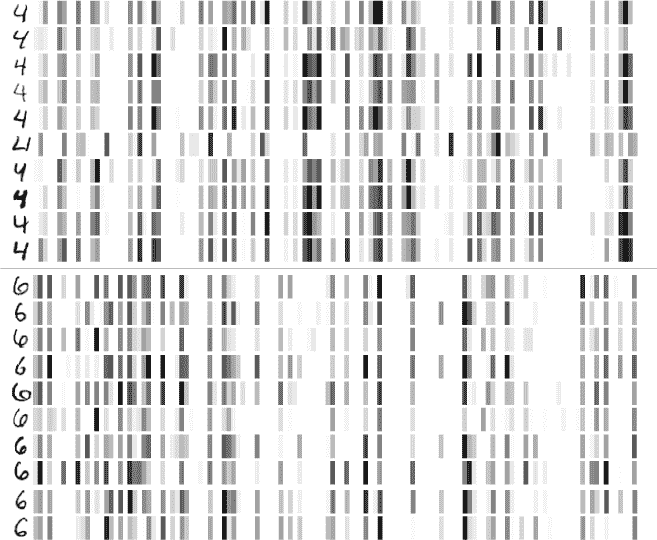

*图 12-9：四和六的十个实例的全连接层激活。输出被反转：较暗表示更强的激活。*

左侧是模型的实际输入。右侧是全连接层 128 个输出的表示，这些输出最终输入到 softmax 层。每个数字都有一个特定的模式，该模式在每个数字中都是共同的。然而，也存在一些变化。中间的“四”有一个非常短的笔画，我们可以看到它在全连接层中的表示也与其他所有例子不同。尽管如此，模型依然成功地将其识别为“四”，且置信度为 0.999936。

图 12-9 提供了证据，证明模型学到了我们希望它学习的输入表示。Softmax 层将密集层的 128 个元素映射到 10 个输出节点，进而计算 softmax 概率。这实际上是一个没有隐藏层的简单传统神经网络。这个简单的模型能够正确标注图像，是因为输入的新表示在分离各类方面做得更好，甚至一个简单的模型也能做出可靠的预测。它成功的另一个原因是，训练过程同时优化了这个顶层模型的权重和生成输入到模型的低层权重，因此它们相互强化。有时，文献中会将这种方法称为*端到端*训练。

我们可以通过查看 MNIST 测试数据的密集层激活图来证明特征分离更好的这一说法。当然，我们无法看到实际的图形，因为我不知道如何可视化一个 128 维的图形，但并非全然无望。机器学习社区创造了一个强大的可视化工具，叫做*t-SNE*，幸运的是它是 sklearn 的一部分。这个算法智能地将高维空间映射到低维空间，包括 2D。如果我们将 1000 个随机选择的 MNIST 测试图像通过模型，然后将生成的 128 维密集层激活通过 t-SNE 处理，就可以生成一个 2D 图形，在该图形中，类与类之间的分离反映了 128 维空间中的实际分离。图 12-10 即为结果。

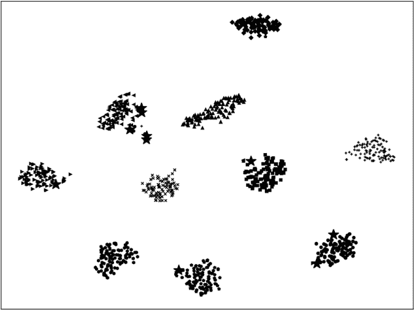

*图 12-10：模型如何按类别分离测试样本（t-SNE 图）*

在这个图中，每个类别使用不同的图形符号。如果模型未能正确分类样本，则以更大的星号表示。在这种情况下，只有少数样本被错误分类。类别之间的分离非常明显；模型已经学到了一个表示方式，使得在大多数情况下，正确的类别标签容易判断。我们可以在 t-SNE 图中清楚地数出 10 个不同的簇。

### 总结

在本章中，我们介绍了卷积神经网络的主要组成部分。这些是现代深度学习的主力网络，尤其是在视觉任务中，因为它们能够从空间关系中学习。我们通过了一个模型来分类 MNIST 数字，并详细介绍了新的处理层，包括卷积层和池化层。接着，我们了解到 CNN 的全连接层是我们在前几章中学习的传统神经网络的类比。

接下来，我们看到了如何修改全连接层以便能够处理更大的输入。最后，我们观察了当一张样本图像通过网络时，网络生成的激活函数，并看到了卷积层和池化层如何协同工作，产生输入的新表示，从而帮助在特征空间中分离不同类别，实现了高准确度。

在下一章中，我们将继续探讨卷积神经网络（CNN），但不同于理论，我们将通过实际例子来观察网络的各种参数以及训练过程中使用的超参数如何影响模型的表现。这将帮助我们建立未来使用 CNN 时的直觉。
