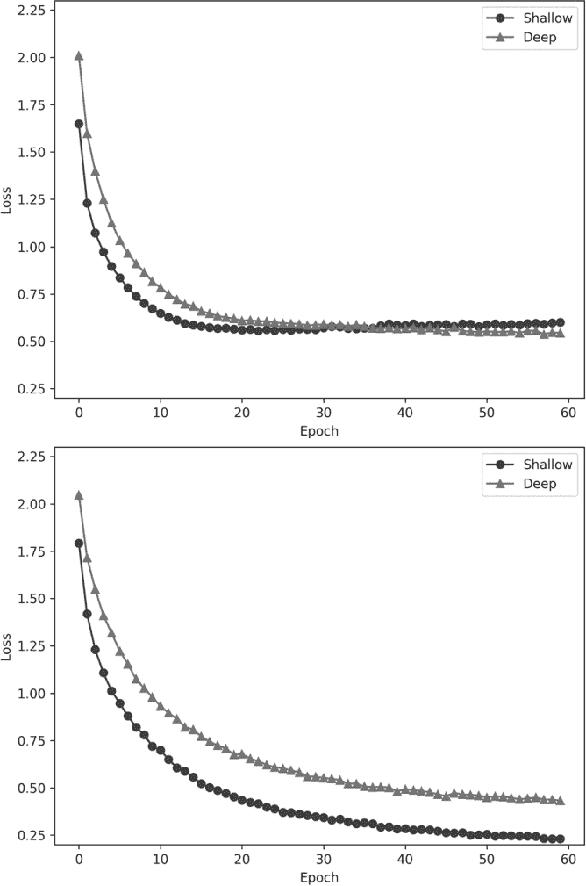
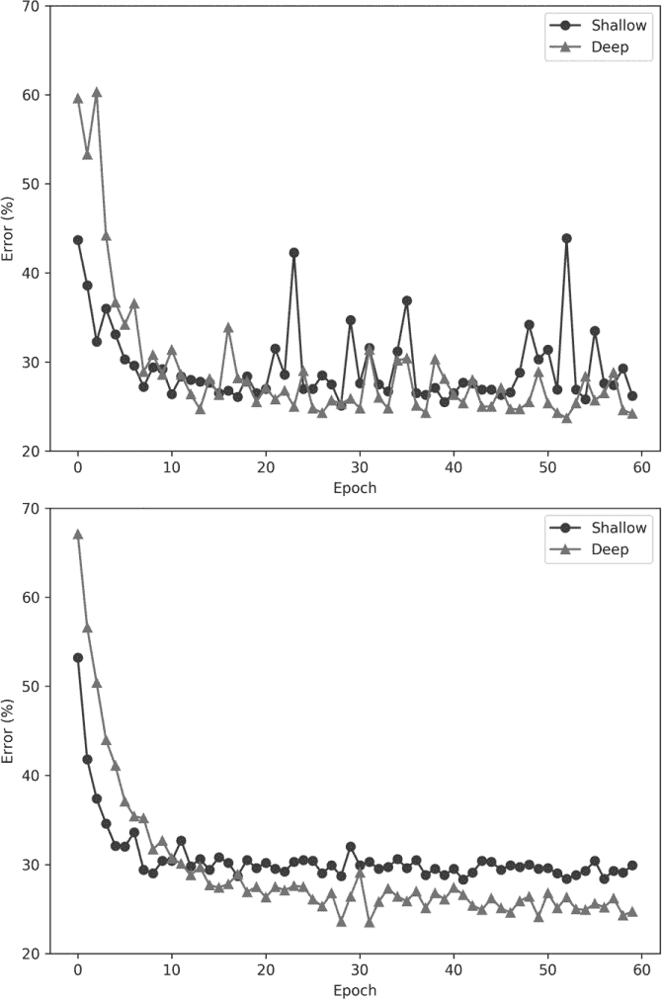
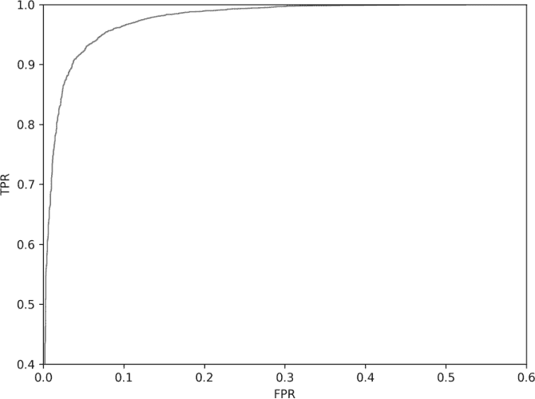
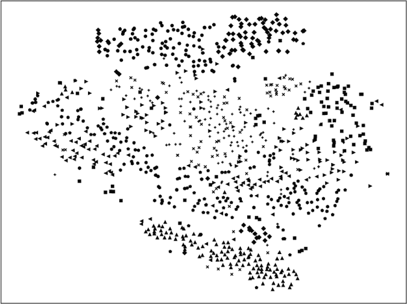
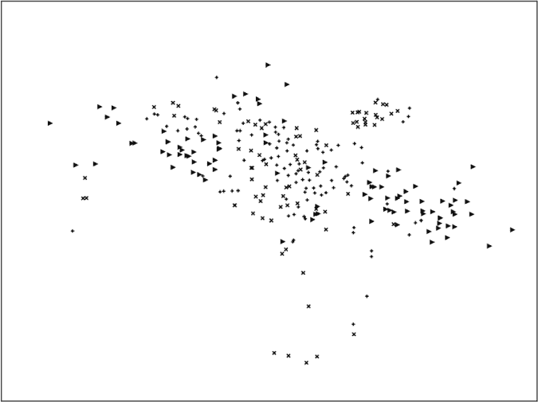

## **14

**CIFAR-10 实验**

在本章中，我们将对在第五章中构建的 CIFAR-10 数据集进行一系列实验。首先，我们将观察两个模型，一个浅层的，另一个较深的，在整个数据集上的表现。接下来，我们将使用整个数据集的分组子集，看看能否区分动物和交通工具。之后，我们将探讨对于 CIFAR-10 数据集，是单一的多类模型效果更好，还是每个类别一个二分类模型效果更好。

我们将在本章结束时介绍迁移学习和微调。这些是机器学习社区中广泛使用的重要概念，尽管它们常常容易混淆，因此我们应该对它们的工作原理有直观的理解。

### CIFAR-10 复习

在我们深入实验之前，让我们重新熟悉一下我们正在使用的数据集。CIFAR-10 是来自加拿大高级研究院（CIFAR）的 10 类数据集。我们在第五章中构建了这个数据集，但直到现在才开始使用。CIFAR-10 由 32×32 像素的 RGB 动物（六个类别）和交通工具（四个类别）图像组成。可以查看图 5-4 以查看一些示例图像。训练集包含 50,000 张图像，每个类别 5,000 张，因此是一个平衡的数据集。测试集由 10,000 张图像组成，每个类别 1,000 张。CIFAR-10 可能是仅次于 MNIST 的最广泛使用的标准数据集。还有一个 100 类版本 CIFAR-100，尽管我们在本书中不会使用它，但你会经常在文献中看到它。

截至目前，最好的未经增强的 CIFAR-10 模型在测试集上的错误率已达到 1%（[benchmarks.ai](http://benchmarks.ai)）。实现这一点的模型有 5.57 亿个参数。我们的模型将明显更小，并且测试误差会大得多。然而，这是真正的图像数据集，不像 MNIST 那样非常干净且每个数字都有统一的黑色背景。由于自然图像，尤其是背景的变化，我们可能会预期模型在学习 CIFAR-10 类别时会比 MNIST 更困难。

作为参考，以下是 CIFAR-10 的类别：

| **标签** | **类别** | **标签** | **类别** |
| --- | --- | --- | --- |
| 0 | 飞机 | 5 | 狗 |
| 1 | 汽车 | 6 | 青蛙 |
| 2 | 鸟 | 7 | 马 |
| 3 | 猫 | 8 | 船 |
| 4 | 鹿 | 9 | 卡车 |

### 使用完整的 CIFAR-10 数据集

我们将在整个 CIFAR-10 数据集上训练两种不同的模型。第一个模型与我们在第十三章中用于 MNIST 数据集的模型相同。我们将这个模型称为 *浅层模型*，因为它只有两个卷积层。我们需要对其进行一些调整，以适应 32 × 32 的 RGB 输入，但这足够简单。第二个模型，我们称之为 *深层模型*，在池化层和全连接层之前使用多个卷积层。

此外，我们还将尝试使用随机梯度下降（SGD）和 Adadelta 作为优化算法。我们将固定小批量大小为 64，训练 60 个 epoch，共进行 46,875 次梯度下降步骤。对于 SGD，我们将使用 0.01 的学习率和 0.9 的动量。回想一下，Adadelta 是自适应的，可以动态调整学习率。我们可以随着训练的进行为 SGD 降低学习率，但由于 0.01 已经相对较小，并且我们有大量的梯度下降步骤，所以我们将保持学习率不变。

浅层模型有 1,626,442 个参数，而深层模型只有 1,139,338 个参数。深层模型之所以称为“深”，是因为它有更多的层，但由于每个卷积层都使用精确卷积，输出每次减少两个（对于 3 × 3 的卷积核）。因此，池化层后的展平层的值只有 7,744，相比之下，浅层模型有 12,544 个值。展平层与 128 节点的全连接层之间的权重矩阵包含了绝大多数参数，7,744 × 128 = 991,232，而浅层模型则为 12,544 × 128 = 1,605,632。因此，变得更深实际上减少了需要学习的参数数量。这个稍微违反直觉的结果提醒我们，完全连接层的巨大开销以及卷积神经网络（CNN）创建的初衷。

#### 构建模型

你可以在 *cifar10_cnn.py*（Adadelta）和 *cifar10_cnn_SGD.py*（SGD）中找到浅层模型的代码。我们将逐步讲解代码。浅层模型的构建方式与 MNIST 数据集的方式非常相似，如 Listing 14-1 所示。

导入 keras

from keras.models import Sequential

from keras.layers import Dense, Dropout, Flatten

from keras.layers import Conv2D, MaxPooling2D

from keras import backend as K

import numpy as np

batch_size = 64

num_classes = 10

epochs = 60

img_rows, img_cols = 32, 32

x_train = np.load("cifar10_train_images.npy")

y_train = np.load("cifar10_train_labels.npy")

x_test = np.load("cifar10_test_images.npy")

y_test = np.load("cifar10_test_labels.npy")

if K.image_data_format() == 'channels_first':

x_train = x_train.reshape(x_train.shape[0], 3, img_rows, img_cols)

x_test = x_test.reshape(x_test.shape[0], 3, img_rows, img_cols)

input_shape = (3, img_rows, img_cols)

else:

x_train = x_train.reshape(x_train.shape[0], img_rows, img_cols, 3)

x_test = x_test.reshape(x_test.shape[0], img_rows, img_cols, 3)

input_shape = (img_rows, img_cols, 3)

x_train = x_train.astype('float32')

x_test = x_test.astype('float32')

(*\newpage*)

x_train /= 255

x_test /= 255

y_train = keras.utils.to_categorical(y_train, num_classes)

y_test = keras.utils.to_categorical(y_test, num_classes)

*Listing 14-1: 准备 CIFAR-10 数据集*

我们导入必要的模块，并从我们在 第五章 中创建的 NumPy 文件加载 CIFAR-10 数据集。注意，图像的尺寸现在是 32 × 32，而不是 28 × 28，并且通道数是 3（RGB），而不是 1（灰度）。和之前一样，我们通过 255 来缩放输入数据，将图像映射到 [0,1] 范围，并使用 to_categorical 将标签数字转换为独热编码向量。

接下来，我们定义模型架构（Listing 14-2）。

model = Sequential()

model.add(Conv2D(32, kernel_size=(3, 3),

activation='relu',

input_shape=input_shape))

model.add(Conv2D(64, (3, 3), activation='relu'))

model.add(MaxPooling2D(pool_size=(2, 2)))

model.add(Dropout(0.25))

model.add(Flatten())

model.add(Dense(128, activation='relu'))

model.add(Dropout(0.5))

model.add(Dense(num_classes, activation='softmax'))

model.compile(loss=keras.losses.categorical_crossentropy,

optimizer=keras.optimizers.Adadelta(),

metrics=['accuracy'])

*Listing 14-2: 构建浅层 CIFAR-10 模型*

这一步与浅层模型的 MNIST 版本相同（参见 Listing 13-1）。对于深层模型，我们增加了更多的卷积层，如 Listing 14-3 所示。

model = Sequential()

model.add(Conv2D(32, kernel_size=(3, 3),

activation='relu',

input_shape=input_shape))

model.add(Conv2D(64, (3,3), activation='relu'))

model.add(Conv2D(64, (3,3), activation='relu'))

model.add(Conv2D(64, (3,3), activation='relu'))

model.add(Conv2D(64, (3,3), activation='relu'))

model.add(MaxPooling2D(pool_size=(2,2)))

model.add(Dropout(0.25))

model.add(Flatten())

model.add(Dense(128, activation='relu'))

model.add(Dropout(0.5))

model.add(Dense(128, activation='relu'))

model.add(Dropout(0.5))

model.add(Dense(num_classes, activation='softmax'))

model.compile(loss=keras.losses.categorical_crossentropy,

optimizer=keras.optimizers.Adadelta(),

metrics=['accuracy'])

*Listing 14-3: 构建深层 CIFAR-10 模型*

额外的卷积层使模型有机会学习输入数据的更好表示，对于 CIFAR-10，数据比简单的 MNIST 图像更为复杂。深层网络能学习到更抽象的表示，涵盖了输入数据中的更大结构，因此可能获得更好的表示。

Listings 14-2 和 14-3 中的代码片段使用 Adadelta 作为优化算法来编译模型。我们还希望有一个使用 SGD 的版本。如果我们将 compile 方法中对 Adadelta() 的引用替换为以下内容

optimizer=keras.optimizers.SGD(lr=0.01, momentum=0.9)

我们将使用先前设定的学习率和动量值来进行 SGD。为了完整性，浅层和深层模型的其余代码见代码清单 14-4。

print("模型参数 = %d" % model.count_params())

print(model.summary())

history = model.fit(x_train, y_train,

batch_size=batch_size,

epochs=epochs,

verbose=1,

validation_data=(x_test[:1000], y_test[:1000]))

score = model.evaluate(x_test[1000:], y_test[1000:], verbose=0)

print('测试损失:', score[0])

print('测试准确率:', score[1])

model.save("cifar10_cnn_model.h5")

*代码清单 14-4：训练和测试 CIFAR-10 模型*

这段代码总结了模型架构和参数数量，通过调用 fit 方法使用前 1,000 个测试样本进行训练，并在剩余的 9,000 个测试样本上调用 evaluate 方法评估训练好的模型。我们报告测试损失和准确率。然后我们将模型保存到磁盘（save），并存储训练过程中每个 epoch 的损失和准确率历史。我们将使用这些历史文件生成图表，展示损失和误差（1 - 准确率）与训练 epoch 的关系。

代码清单 14-4 给我们四个文件：浅层模型 + Adadelta，浅层模型 + SGD，深层模型 + Adadelta，和深层模型 + SGD。让我们运行这些文件，看看最终的测试准确率，然后查看训练过程的图表，看看我们能从中学到什么。

运行这段代码会训练并评估模型。这在我们仅有 CPU 的系统上需要一些时间，总共大约八个小时。Keras 使用的随机初始化意味着当你自己运行代码时，可能会看到略有不同的结果。当我运行代码时，我得到了表 14-1。

**表 14-1：** 按模型大小和优化器划分的测试集准确率

|  | **浅层** | **深层** |
| --- | --- | --- |
| Adadelta | 71.9% | 74.8% |
| SGD | 70.0% | 72.8% |

表格告诉我们，使用 Adadelta 比 SGD 更能提高浅层和深层模型的准确性。我们还看到，不管优化器如何，深层模型都优于浅层模型。像 Adadelta 和 Adam（Keras 中也有）这样的自适应优化器通常比普通的 SGD 更受欢迎，原因就在于此。然而，我也看到过一些说法，认为一旦学习率设置正确并且随着训练进展逐步降低，SGD 最终可能与 Adadelta 一样好，甚至更好。当然，我们完全可以在某个 epoch 之后，从自适应优化器切换到 SGD。这里的想法是，自适应优化器可以“接近”损失函数的最小值，而 SGD 在这一点上进行微调。

#### 分析模型

让我们看看训练过程中损失是如何变化的。图 14-1 展示了使用 Adadelta（上）和 SGD（下）训练浅层和深层模型的每个 epoch 的损失。

*图 14-1：使用 Adadelta（上）和 SGD（下）训练浅层和深层模型的损失*

从 Adadelta 损失图开始，我们看到与 SGD 相比，Adadelta 的损失并没有那么低。我们还看到，对于浅层模型，每个周期的损失略有增加。这是一个反直觉的结果，似乎与传统观点相矛盾，即训练损失应该只会减少。已有报告指出这种情况在 Adam（另一种自适应优化器）中也会发生，因此很可能是自适应算法的副作用。无论如何，正如我们在表 14-1 中看到的，Adadelta 为浅层和深度模型都带来了更高的准确率。

在图 14-1 底部，我们看到 SGD 对于浅层模型的损失较小，相比之下深度模型的损失更大。这通常被解读为可能发生过拟合的信号。随着损失趋向于 0，模型开始学习训练集的细节。根据表 14-1，使用 SGD 的浅层模型是表现最差的模型。使用 SGD 的深度模型直到训练达到 60 个周期时，也没有出现如此小的损失。

那么训练期间验证集的准确率如何呢？图 14-2 绘制了每个周期的*误差*。从视觉上看，误差更易于理解；它应该随着准确率的提高而趋向于 0。同样，Adadelta 模型在上方，SGD 模型在下方。

正如预期的那样，无论优化器如何，深度模型在训练期间的验证集误差较小，性能更好。需要注意的是，验证集误差并非最终的持出测试集误差，而是训练过程中使用的测试集部分，在本例中是前 1,000 个样本。

图 14-2 底部的 SGD 曲线符合我们直觉的预期：随着模型训练，性能逐渐提升，导致误差减小。深度模型迅速超过了浅层模型——这同样是一个直观的结果。此外，随着模型的逐步优化，曲线也相对平滑。

图 14-2 顶部的 Adadelta 误差图呈现出不同的情况。在前几个训练周期后，误差明显下降。然而，此后，验证集误差略显混乱地波动，尽管仍然符合我们的直觉：深度模型的误差应低于浅层模型。这种混乱的结果是由于 Adadelta 算法的自适应特性，它在运行过程中调整学习率，以寻找更好的最小值。从表 14-1 的结果来看，Adadelta 确实找到了性能更优的模型。

*图 14-2：使用 Adadelta（上图）和 SGD（下图）对浅层和深度模型的验证集误差*

这些实验告诉我们，自适应优化算法和更深的网络（到一定程度）倾向于更好的模型性能。虽然承认在这一领域提供建议存在的风险，但似乎可以安全地说，应该从自适应优化开始，并使用足够大的模型。为了了解“足够大”是什么意思，我建议从一个适中的模型开始，训练后将其加深，看看是否能改善结果。最终，模型会变得过于庞大，无法适应训练集，因此会有一个临界点，在该点之后，增加模型大小不再有帮助。如果是这种情况，尽量获取更多的训练数据。

现在让我们将注意力转向处理 CIFAR-10 的子集。

### 动物还是车辆？

CIFAR-10 中有十个类别，其中四个是车辆，其余六个是动物。让我们构建一个模型来区分这两类，看看我们能从中学到什么。我们已经有了图像，所需要做的就是重新编码标签，将所有车辆标记为类别 0，将所有动物标记为类别 1。这样做很简单，如列表 14-5 所示。

import numpy as np

y_train = np.load("cifar10_train_labels.npy")

y_test  = np.load("cifar10_test_labels.npy")

for i in range(len(y_train)):

if (y_train[i] in [0,1,8,9]):

y_train[i] = 0

else:

y_train[i] = 1

for i in range(len(y_test)):

if (y_test[i] in [0,1,8,9]):

y_test[i] = 0

else:

y_test[i] = 1

np.save("cifar10_train_animal_vehicle_labels.npy", y_train)

np.save("cifar10_test_animal_vehicle_labels.npy", y_test)

*列表 14-5：将 CIFAR-10 的标签调整为车辆（类别 0）和动物（类别 1）*

我们加载现有的训练集和测试集标签文件，这些文件已经按顺序与训练集和测试集图像文件匹配，并构建新的标签向量，将车辆类别——类别 0、1、8 和 9——映射为 0，将所有其他类别映射为 1。

前一节构建和训练模型的代码保持不变，唯一的不同是模型架构的定义和我们加载的训练集和测试集标签文件。类别数（num_classes）设置为 2，迷你批次大小为 128，我们将训练 12 个周期。训练集并不完全平衡——有 20,000 辆车和 30,000 只动物——但不平衡并不严重，所以我们应该处于良好的状态。记住，当某一类别稀缺时，模型很难学习该类别。我们将继续使用 Adadelta 作为优化器，并使用前 1,000 个测试样本进行验证，剩下的 9,000 个用于最终测试。我们将使用前一节中使用的相同的浅层架构。

在 CIFAR-10 图像上使用重新编码的标签训练此模型，最终测试准确率为 93.6%。让我们稍微严格一点，计算所有的性能指标，参考 第十一章。为此，我们更新了该章节中定义的 tally_predictions 函数 (清单 11-1)，使其适用于 Keras 模型。我们还将使用 第十一章中的 basic_metrics (清单 11-2) 和 advanced_metrics (清单 11-3)。更新后的 tally_predictions 代码见 清单 14-6。

def tally_predictions(model, x, y):

pp = model.predict(x)

p = np.zeros(pp.shape[0], dtype="uint8")

❶ for i in range(pp.shape[0]):

p[i] = 0 if (pp[i,0] > pp[i,1]) else 1

tp = tn = fp = fn = 0

for i in range(len(y)):

if (p[i] == 0) and (y[i] == 0):

tn += 1

elif (p[i] == 0) and (y[i] == 1):

fn += 1

elif (p[i] == 1) and (y[i] == 0):

fp += 1

else:

tp += 1

score = float(tp+tn) / float(tp+tn+fp+fn)

return [tp, tn, fp, fn, score]

*清单 14-6：计算 Keras 模型的基本指标*

我们将模型、测试样本 (x) 和测试标签 (y) 传入。与 sklearn 版本的 tally_predictions 不同，这里我们首先使用模型预测每个类别的概率 (pp)。这会返回一个二维数组，每一行对应 x 中的一个样本，每列是分配给每个类别的概率。这里有两列，因为只有两个类别：车辆或动物。

在我们计算真阳性、真阴性、假阳性（车辆被分类为动物）和假阴性（动物被分类为车辆）之前，我们需要为每个测试样本分配一个类别标签。我们通过逐行遍历预测结果，并检查类别 0 的概率是否大于类别 1 来完成此操作 ❶。一旦分配了预测的类别标签 (p)，我们就可以计算计数并返回它们以及整体评分（准确率）。我们将 tally_predictions 返回的列表传递给 basic_metrics，然后将这两个函数的输出传递给 advanced_metrics，正如 第十一章 中所示。

二元分类器的完整指标集如下所示：

| **指标** | **结果** |
| --- | --- |
| 真阳性 (TP) | 5,841 |
| 假阳性 (FP) | 4,80 |
| 真阴性 (TN) | 3,520 |
| 假阴性 (FN) | 159 |
| 真阳性率 (TPR, 敏感性, 召回率) | 0.9735 |
| 真负率 (TNR, 特异性) | 0.8800 |
| 精确率 (PPV) | 0.9241 |
| 负预测值 (NPV) | 0.9568 |
| 假阳性率 (FPR) | 0.1200 |
| 假阴性率 (FNR) | 0.0265 |
| F1 值 | 0.9481 |
| 马修斯相关系数 (MCC) | 0.8671 |
| *κ* | 0.8651 |
| 信息度 (Informedness) | 0.8535 |
| 标记度 (Markedness) | 0.8808 |
| 准确率 | 0.9361 |

我们看到这是一个表现良好的模型，尽管特异性为 88%，稍显偏低。如 第十一章 所述，马修斯相关系数 (MCC) 可能是表征二元分类器的最佳单一指标。在这里，MCC 为 0.8671，满分为 1.0，表明这是一个不错的模型。

记住，*敏感性*是模型将动物标记为“动物”的概率，*特异性*是模型将车辆标记为“车辆”的概率。*精度*是模型标记为“动物”时，正确的概率，*NPV（负预测值）*是模型在标记为“车辆”时，正确的概率。还需注意，假阳性率（FPR）是 1 - 特异性，假阴性率（FNR）是 1 - 敏感性。

下面的代码会计算 ROC 曲线及其面积：

从 sklearn.metrics 导入 roc_auc_score 和 roc_curve

定义 roc_curve_area(model, x, y):

pp = model.predict(x)

p = np.zeros(pp.shape[0], dtype="uint8")

对于 i in range(pp.shape[0])：

p[i] = 0 如果 (pp[i,0] > pp[i,1]) 否则 1

auc = roc_auc_score(y, p)

roc = roc_curve(y, pp[:,1])

return [auc, roc]

再次传入训练好的模型、测试样本（x）和动物或车辆标签（y）。我们还将输出的概率转换为类别预测，正如我们在示例 14-6 中所做的那样。AUC 为 0.9267，图 14-3 展示了 ROC 曲线（请注意放大的坐标轴）。这条曲线陡峭且接近图形的左上角——这是一个表现良好的模型的好兆头。

*图 14-3：动物或车辆模型的 ROC 曲线*

我们将动物和车辆分组，并要求一个模型学习它们之间的区别。显然，一些特征区分了这两个类别，模型成功地学会了使用这些特征。然而，不同于大多数二元分类器，我们知道测试数据的更细致标签。例如，我们知道哪些动物是鸟类、鹿或青蛙。同样，我们知道哪些样本是飞机、船或卡车。

当模型出错时，错误要么是假阳性（将车辆称为动物），要么是假阴性（将动物称为车辆）。我们将动物归为类别 1，因此假阳性是将车辆称为动物的情况。假阴性的情况则相反。我们可以使用完整的类别标签，告诉我们假阳性中有多少代表了哪些车辆类别，假阴性也一样，可以告诉我们哪些动物类别被误判为车辆类别。在示例 14-7 中的几行代码可以帮助我们获取这些信息。

导入 numpy 为 np

从 keras.models 导入 load_model

x_test = np.load("cifar10_test_images.npy")/255.0

y_label = np.load("cifar10_test_labels.npy")

y_test = np.load("cifar10_test_animal_vehicle_labels.npy")

model = load_model("cifar10_cnn_animal_vehicle_model.h5")

pp = model.predict(x_test)

p = np.zeros(pp.shape[0], dtype="uint8")

对于 i in range(pp.shape[0])：

p[i] = 0 如果 (pp[i,0] > pp[i,1]) 否则 1

hp = []; hn = []

❶ 对于 i in range(len(y_test))：

如果 (p[i] == 0) 且 (y_test[i] == 1)：

hn.append(y_label[i])

elif (p[i] == 1) 且 (y_test[i] == 0)：

hp.append(y_label[i])

hp = np.array(hp)

hn = np.array(hn)

a = np.histogram(hp, bins=10, range=[0,9])[0]

b = np.histogram(hn, bins=10, range=[0,9])[0]

print("车辆作为动物: %s" % np.array2string(a))

print("动物作为车辆: %s" % np.array2string(b))

*清单 14-7: 使用精细类别标签来确定哪些类别导致假阳性和假阴性*

首先，我们加载测试集图像、实际标签（y_label）和动物或车辆标签（y_test）。然后，像之前一样，加载模型并获取模型预测（p）。我们想追踪每个假阳性和假阴性的实际类别标签，即分类器所犯的错误。我们通过遍历预测并将其与动物或车辆标签进行比较来做到这一点❶。当发生错误时，我们保留样本的实际标签，无论是 FN（假阴性，hn）还是 FP（假阳性，hp）。请注意，这之所以可行，是因为在定义动物或车辆标签时，我们特别注意保持与原始标签集的顺序一致。

一旦我们获得了所有假阳性和假阴性案例的实际标签，我们就使用直方图来进行统计。共有 10 个实际类别标签，因此我们告诉直方图我们需要使用 10 个桶。我们还需要指定桶的范围（range=[0,9]）。我们只需要计数值，因此我们只保留直方图返回的第一个数组，因此调用末尾加上了[0]。最后，我们打印数组以获得结果。

车辆作为动物: [189  69   0   0   0   0   0   0 105 117]

动物作为车辆: [ 0  0 64 34 23 11 12 15  0  0]

这意味着在被模型判断为“动物”的车辆中，有 189 个属于类别 0，飞机。最不可能被识别为动物的车辆类别是类别 1，汽车。船只和卡车也同样容易被误认为是动物。从另一个角度来看，我们看到类别 2，鸟类，最容易被误认为是车辆，而类别 5，狗，最不容易被误分类，尽管青蛙也接近第二。

该如何解读这些数据呢？最常被误分类为车辆的是飞机，而最常被误分类为动物的是鸟。这是有道理的：一张飞机的图片和一张飞鸟的图片确实看起来很相似。我将留给你去连接其他类别之间的关系。

### 二分类还是多分类？

机器学习中的传统观点是，多类别模型通常会优于多个二分类模型。虽然对于大数据集、大模型和许多类别（如具有 1,000 个类别的 ImageNet 数据集）来说这几乎肯定是正确的，但对于像我们在本章中使用的小型模型，它会有什么表现呢？我们来看看。

CIFAR-10 数据集中每个类别有 5000 个实例，共有 10 个类别。这意味着我们可以训练 10 个二分类模型，其中目标类别（类别 1）是 10 个类别中的一个，其他类别为“其他”。这被称为 *一对其余* 方法。为了对一个未知样本进行分类，我们会将其输入到每一个二分类器中，并分配返回最有信心答案的模型的标签。数据集是失衡的，类别 1 有 5000 个实例，类别 0 有 45000 个，但正如我们所看到的，仍然有足够的数据来学习类别之间的差异。

我们需要一些代码来训练 10 个一对其余模型。我们将使用之前使用过的浅层架构，批处理大小为 128，并训练 12 个周期。然而，在训练之前，我们需要重新分配训练和测试集的类别标签，使得目标类别的所有实例为 1，其他所有实例为 0。为了构建每个类别的标签，我们将使用 清单 14-8。

导入 sys

导入 numpy 作为 np

❶ class1 = eval("["+sys.argv[1]+"]")

y_train = np.load("cifar10_train_labels.npy")

y_test = np.load("cifar10_test_labels.npy")

对于 `i` 在 `range(len(y_train))` 中：

如果 (y_train[i] 在 class1 中)：

y_train[i] = 1

否则：

y_train[i] = 0

对于 `i` 在 `range(len(y_test))` 中：

如果 (y_test[i] 在 class1 中)：

y_test[i] = 1

否则：

y_test[i] = 0

np.save(sys.argv[2], y_train)

np.save(sys.argv[3], y_test)

*清单 14-8：构建每个类别的标签*

这段代码使用了命令行。要调用它，可以使用类似下面的命令：

$ python3 make_label_files.py 1 train_1.npy test_1.npy

第一个参数是期望的目标类别标签，这里为 1，表示汽车，接下来的两个参数是存储训练和测试图像的新标签分配的文件名。代码本身会遍历实际的训练和测试标签，如果标签是目标类别，则对应的输出标签为 1；否则，输出标签为 0。

这段代码比映射单一类别更灵活。通过使用 `eval ❶`，我们可以传入一个逗号分隔的字符串，包含我们希望视为目标类别的所有 CIFAR-10 标签。例如，为了使用这段代码来生成前一节中提到的动物与车辆的标签，我们将第一个参数设为 `2,3,4,5,6,7`。

一旦我们为每个类别重新分配了标签，就可以使用它们来训练 10 个模型。我们只需要将 `num_classes` 设置为 2，并加载各自的重新分配标签文件作为 `y_train` 和 `y_test`。在文件的底部，我们还需要更改对 `model.save` 的调用，以便保存每个类别的模型。我们假设这些模型保存在名为 *cifar10_cnn_<X>_model.h5* 的文件中，其中 *<X>* 是一个数字，表示 CIFAR-10 的类别标签。我们的多类别模型是一个在整个 CIFAR-10 数据集上训练了 12 个周期的浅层架构模型 (*cifar10_cnn_model.h5*)。要训练二分类模型，请使用 `train_single_models` 脚本。该脚本调用 *cifar10_cnn_arbitrary.py* 来使用指定的二分类数据集训练模型。

为了测试这些模型，我们首先需要从磁盘加载它们以及测试集数据。然后我们需要将所有数据通过多分类模型和每个单独的类别模型进行预测，并保留预测结果。通过这些预测，我们可以分配类别标签并构建混淆矩阵，以查看每种方法的效果如何。首先，让我们加载测试集和模型：

x_test = np.load("cifar10_test_images.npy")/255.0

y_test = np.load("cifar10_test_labels.npy")

mm = load_model("cifar10_cnn_model.h5")

m = []

for i in range(10):

m.append(load_model("cifar10_cnn_%d_model.h5" % i))

注意，我们将测试集的值按 255 进行缩放，就像我们处理训练数据时一样。我们将把多分类模型保存在 mm 中，并将 10 个单类模型加载到列表 m 中。

接下来，我们将模型应用于每个测试集样本：

mp = np.argmax(mm.predict(x_test), axis=1)

p = np.zeros((10,10000), dtype="float32")

for i in range(10):

p[i,:] = m[i].predict(x_test)[:,1]

bp = np.argmax(p, axis=0)

调用 predict，使用 10,000 个测试样本，会返回一个 10,000 × 10 的矩阵用于多分类模型，或 10,000 × 2 的矩阵用于单类模型。每行对应一个测试样本，每列是模型对每个类别的输出。对于多分类情况，我们通过对列（axis=1）取最大值，设置 mp，得到一个包含 10,000 个值的向量，每个值代表预测的类别标签。

我们遍历各个单独的模型并调用 predict，保留类别 1 的概率。这些概率被存储在 p 中，其中行代表每个单独模型对于该类别标签的输出，列代表每个测试样本在该类别上的预测概率。如果我们使用 argmax 并设置 axis=0 来返回行中的最大值，我们就能得到每个测试样本中预测概率最高的模型类别标签。这就是 bp 的内容。

有了我们的预测结果后，我们可以生成混淆矩阵：

cm = np.zeros((10,10), dtype="uint16")

cb = np.zeros((10,10), dtype="uint16")

for i in range(10000):

cm[y_test[i],mp[i]] += 1

cb[y_test[i],bp[i]] += 1

np.save("cifar10_multiclass_conf_mat.npy", cm)

np.save("cifar10_binary_conf_mat.npy", cb)

这里行表示真实类别标签，列表示模型预测的标签。我们还会存储混淆矩阵以备将来使用。

我们可以使用列表 14-9 中的代码来显示混淆矩阵：

print("一对多混淆矩阵（行是真实标签，列是预测标签）:")

print("%s" % np.array2string(100*(cb/1000.0), precision=1))

print()

print("多分类混淆矩阵:")

print("%s"  % np.array2string(100*(cm/1000.0), precision=1))

*列表 14-9：显示混淆矩阵。见* cifar10_one_vs_many.py

我们将 cb 和 cm 中的计数除以 1,000，因为每个类别在测试集中的样本数为 1,000 个。这将把混淆矩阵中的条目转化为分数，然后乘以 100 转换成百分比。

那么，我们做得怎么样？多个一对多分类器产生了

| **类别** | **0** | **1** | **2** | **3** | **4** | **5** | **6** | **7** | **8** | **9** |
| --- | --- | --- | --- | --- | --- | --- | --- | --- | --- | --- |
| **0** | **75.0** | 2.8 | 3.4 | 2.1 | 1.7 | 0.4 | 2.3 | 0.2 | 4.1 | 8.0 |
| **1** | 0.8 | **84.0** | 0.2 | 0.9 | 0.3 | 0.3 | 1.1 | 0.0 | 1.2 | 11.2 |
| **2** | 6.5 | 1.6 | **54.0** | 6.3 | 9.5 | 5.3 | 9.1 | 2.3 | 0.8 | 4.6 |
| **3** | 1.6 | 3.6 | 3.8 | **52.1** | 7.1 | 12.9 | 10.6 | 2.2 | 0.9 | 5.2 |
| **4** | 1.8 | 0.8 | 3.6 | 6.5 | **67.6** | 2.3 | 8.6 | 5.3 | 1.3 | 2.2 |
| **5** | 1.4 | 1.4 | 3.5 | 16.9 | 4.7 | **61.8** | 4.0 | 2.6 | 0.5 | 3.2 |
| **6** | 0.8 | 0.7 | 1.4 | 3.4 | 2.8 | 1.0 | **86.4** | 0.2 | 0.3 | 3.0 |
| **7** | 1.5 | 1.3 | 1.7 | 4.9 | 5.2 | 5.2 | 1.5 | **71.5** | 0.1 | 7.1 |
| **8** | 5.3 | 4.4 | 0.1 | 1.1 | 0.5 | 0.6 | 1.1 | 0.5 | **79.1** | 7.3 |
| **9** | 1.7 | 4.0 | 0.2 | 0.8 | 0.1 | 0.4 | 0.5 | 0.3 | 0.8 | **91.2** |

该多类分类器给出的结果是

| **类别** | **0** | **1** | **2** | **3** | **4** | **5** | **6** | **7** | **8** | **9** |
| --- | --- | --- | --- | --- | --- | --- | --- | --- | --- | --- |
| **0** | **70.2** | 1.6 | 6.0 | 2.6 | 3.3 | 0.5 | 1.8 | 0.9 | 9.8 | 3.3 |
| **1** | 2.0 | **79.4** | 1.0 | 1.3 | 0.5 | 0.5 | 1.3 | 0.4 | 2.8 | 10.8 |
| **2** | 5.2 | 0.6 | **56.2** | 6.6 | 13.5 | 6.1 | 7.3 | 2.6 | 1.4 | 0.5 |
| **3** | 1.2 | 1.1 | 7.2 | **57.7** | 10.2 | 11.5 | 7.3 | 1.7 | 1.2 | 0.9 |
| **4** | 1.9 | 0.2 | 5.2 | 4.6 | **77.4** | 1.6 | 4.8 | 2.7 | 1.5 | 0.1 |
| **5** | 1.0 | 0.2 | 6.4 | 20.7 | 7.7 | **56.8** | 2.7 | 3.5 | 0.8 | 0.2 |
| **6** | 0.3 | 0.1 | 4.5 | 5.2 | 5.7 | 1.5 | **82.4** | 0.0 | 0.0 | 0.3 |
| **7** | 1.4 | 0.2 | 4.0 | 6.3 | 10.1 | 4.1 | 0.9 | **71.7** | 0.1 | 1.2 |
| **8** | 4.7 | 3.0 | 0.8 | 2.0 | 1.3 | 0.6 | 1.0 | 0.6 | **82.6** | 3.4 |
| **9** | 2.4 | 6.1 | 0.7 | 2.6 | 1.2 | 0.7 | 1.2 | 1.6 | 3.2 | **80.3** |

对角线上的数字是正确的类别分配。理想情况下，矩阵应该只有对角线元素。其他所有元素都是错误的，即模型选择了错误的标签。由于每个类别在测试集中代表的样本数相等，我们可以通过计算对角线的无权平均值来得到两个模型的整体准确率。如果我们这么做，结果是：

一对多分类器：72.3%

多类分类器：71.5%

在这种情况下，一对多分类器略占优势，尽管差距不到 1%。当然，我们需要做 10 倍的工作来得到一对多的混淆矩阵——使用了十个分类器，而不是仅仅一个。多类模型在类别 4（鹿）上的表现比一对多模型好约 10%，但在类别 9（卡车）上的表现差约 11%。这是按类别计算的两个最显著的准确度差异。多类模型更频繁地将卡车与类别 8（船只，3.2%）和类别 1（汽车，6.1%）混淆，而一对多模型则较少出现这种情况。我们可以理解这可能是怎么发生的。卡车和汽车有轮子，而卡车和船（特别是在 CIFAR-10 的低分辨率下）都是类似盒子的形状。

我们是否就一对多模型与多类模型得出了一个明确的结论？没有，一般来说我们也无法得出结论。然而，客观而言，使用多个模型确实获得了略微更好的性能。

针对使用多个模型的一个反对论点，除了额外的计算开销外，还在于使用单一模型处理多个类别会让模型有机会看到与某一特定类别相似的例子，但这些例子并不属于该类别。这些“难例”通过迫使模型（间接地）关注类别之间不同的特征，而不是那些可能与某个类别强相关但同时也出现在其他类别中的特征，从而对模型进行正则化。我们第一次遇到“难例”是在第四章。

然而，在这种情况下，很难说这个论点成立。对于多类模型，类别 9（卡车）与类别 1（汽车）的混淆率（6.1%）比一对多模型（4.0%）更高。一个可能的解释是，多类模型在有限的训练数据下被迫尝试学习卡车、汽车和其他车辆之间的差异，而一对多模型则是分别学习卡车与任何其他车辆之间的差异。

### 迁移学习

我们将使用*迁移学习*一词，指的是采用一个预训练的深度网络，并用它为另一个机器学习模型生成新的特征。我们的迁移学习示例将是一个玩具模型，旨在展示这一过程，但许多模型都是利用由大型预训练网络生成的特征构建的，这些网络使用了庞大的数据集。特别是，许多模型是利用由 AlexNet 和各种 ResNet 架构生成的特征构建的，这些网络是在 ImageNet 数据集上进行预训练的。

我们将使用预训练模型将输入图像转换为输出特征向量，然后用这些特征向量训练经典的机器学习模型。当一个模型用于将输入转换为另一种特征表示，通常是一个新的特征向量时，输出通常被称为*嵌入*：我们正在使用预训练的网络将我们想要分类的输入嵌入到另一个空间——我们希望这个空间能帮助我们构建一个有用的模型。当我们想要开发的模型拥有太少的训练样本，无法独立构建一个好的模型时，我们可以使用迁移学习。

在使用迁移学习时，了解或相信两个模型都是使用类似数据训练的会很有帮助。如果你阅读文献，你会发现对于许多典型的迁移学习示例来说，这种情况是成立的。输入通常是某个类别的自然图像，而嵌入模型是用自然图像训练的。所谓自然图像，指的是世界上的物体照片，而不是 X 光或其他医学图像。显然，CIFAR-10 图像和 MNIST 图像彼此之间差异很大，因此我们不应指望迁移学习会有太大的成功。我们只是用现有的资源来展示这个技术。

我们将使用一个浅层的 CIFAR-10 模型，就像我们刚才看到的那样，来生成嵌入向量。这个模型已经在完整的 CIFAR-10 数据集上训练了 12 个周期。我们将通过将 MNIST 数字图像传入预训练模型，保留 Dense 层的输出，即用于生成 10 类 softmax 预测的 128 节点向量，来对 MNIST 数据集进行嵌入。

在进行嵌入之前，我们需要考虑一些因素。首先，CIFAR-10 模型是用 32 × 32 RGB 图像训练的。因此，我们需要使 MNIST 数字图像符合这一输入要求。其次，尽管 CIFAR-10 和 MNIST 都有 10 个类别，但这只是巧合；实际上，这两个数据集之间的类别数量不必匹配。

我们如何将 28 × 28 的 MNIST 图像输入到一个期望 32 × 32 RGB 图像的模型中呢？通常，在处理图像数据和迁移学习时，我们会调整图像的大小使其适配。在这里，由于 MNIST 数字图像比 CIFAR-10 图像小，我们可以将 28 × 28 的数字图像居中放置在 32 × 32 的输入图像中。此外，我们还可以通过将每个通道（红、绿、蓝）设置为单通道灰度输入，将灰度图像转换为 RGB 图像。

以下所有代码都在*transfer_learning.py*中。设置嵌入过程如下所示：

import numpy as np

from keras.models import load_model

from keras import backend as K

from keras.datasets import mnist

(x_train, y_train), (x_test, y_test) = mnist.load_data()

x_train = x_train/255.0

x_test = x_test/255.0

model = load_model("cifar10_cnn_model.h5")

我们首先从 Keras 加载所需的模块。然后我们加载 Keras 模型文件 *cifar10_cnn_model.h5*，该文件包含本章第一部分训练 12 轮的浅层模型，使用完整的 CIFAR-10 数据集。

一旦我们加载并缩放了数据，就可以将每张 MNIST 训练图像和测试图像传递给 Keras 模型，并从 Dense 层提取 128 节点的向量。这将每张 MNIST 图像转换为一个 128 元素的向量；见 示例 14-10。

train = np.zeros((60000,128))

k = 0

for i in range(600):

t = np.zeros((100,32,32,3))

❶ t[:,2:30,2:30,0] = x_train[k:(k+100)]

t[:,2:30,2:30,1] = x_train[k:(k+100)]

t[:,2:30,2:30,2] = x_train[k:(k+100)]

_ = model.predict(t)

❷ out = [model.layers[5].output]

func = K.function([model.input, K.learning_phase()], out)

(*\newpage*)

train[k:(k+100),:] = func([t, 1.])[0]

k += 100

np.save("mnist_train_embedded.npy", train)

test = np.zeros((10000,128))

k = 0

for i in range(100):

t = np.zeros((100,32,32,3))

t[:,2:30,2:30,0] = x_test[k:(k+100)]

t[:,2:30,2:30,1] = x_test[k:(k+100)]

t[:,2:30,2:30,2] = x_test[k:(k+100)]

_ = model.predict(t)

out = [model.layers[5].output]

func = K.function([model.input, K.learning_phase()], out)

test[k:(k+100),:] = func([t, 1.])[0]

k += 100

np.save("mnist_test_embedded.npy", test)

*示例 14-10：通过预训练的 CIFAR-10 模型处理 MNIST 图像*

MNIST 训练集有 60,000 张图像。我们每次以 100 张为一组通过 Keras 模型进行处理，以比逐个处理每张图像更高效；这意味着我们需要处理 600 组 100 张图像。对于测试图像（共 10,000 张），我们也以 100 张为一组进行处理，因此需要处理 100 组 100 张图像。我们会将输出向量存储在 train 和 test 中。

训练和测试图像的处理循环首先创建一个临时数组 t，用来存储当前的 100 张图像集。为了使用 Keras 模型的预测方法，我们需要一个四维输入：图像数量、高度、宽度和通道数。我们通过将当前的 100 张训练或测试图像（由 k 索引）复制到 t 中来加载 t；我们这样做了三次，每次分别为每个通道 ❶。加载完 t 后，我们调用模型的 predict 方法。我们丢弃输出，因为我们关注的是 Keras 模型的 Dense 层输出的值。这对于浅层架构来说是第 5 层 ❷。func 的输出是经过网络处理后的 100 个 Dense 层输出向量。我们将这些向量分配到当前的 100 个训练样本中，然后继续处理下一个 100 个样本。当我们处理完整个 MNIST 数据集时，我们将嵌入向量保存在一个 NumPy 文件中。然后我们对测试集重复处理训练集的每个步骤。

在这一点上，我们已经得到了嵌入向量，因此自然会问嵌入是否有助于区分各个类别。我们可以通过使用 t-SNE 图来查看这些向量按类别标签是否有所区分 (图 14-4)。

*图 14-4：t-SNE 图展示了通过类别进行的嵌入 MNIST 数字向量的分离情况*

将此图与图 12-10 进行比较，后者显示了一个在 MNIST 数字上显式训练的模型的分类情况。该模型展示了类之间明显、无歧义的分离，但图 14-4 则远不如此清晰。然而，尽管存在重叠，不同类别在图中不同区域仍有聚集，因此我们有理由相信，某个模型可能能够利用这些向量学习如何分类数字。

让我们使用嵌入向量训练一些模型。为此，我们将重新进入经典机器学习的世界。我们将使用 MNIST 数字图像的向量形式训练第七章中训练过的一些模型。

训练和测试模型的代码很简单。我们将训练一个最近质心模型、一个 3-近邻模型、一个 50 棵树的随机森林模型，以及一个线性 SVM（*C* = 0.1），如清单 14-11 所示。

from sklearn.neighbors import KNeighborsClassifier

from sklearn.ensemble import RandomForestClassifier

from sklearn.neighbors import NearestCentroid

from sklearn.svm import LinearSVC

clf0 = NearestCentroid()

clf0.fit(train, y_train)

nscore = clf0.score(test, y_test)

clf1 = KNeighborsClassifier(n_neighbors=3)

clf1.fit(train, y_train)

kscore = clf1.score(test, y_test)

clf2 = RandomForestClassifier(n_estimators=50)

clf2.fit(train, y_train)

rscore = clf2.score(test, y_test)

clf3 = LinearSVC(C=0.1)

clf3.fit(train, y_train)

sscore = clf3.score(test, y_test)

print("最近质心    : %0.2f" % nscore)

print("3-近邻             : %0.2f" % kscore)

print("随机森林       : %0.2f" % rscore)

print("SVM                 : %0.2f" % sscore)

*清单 14-11：使用 MNIST 嵌入向量训练经典模型*

我们加载相关的 sklearn 模块，创建特定的模型实例，并调用 fit 方法，传入 128 元素的训练向量和相关的类别标签。score 方法返回现在已经训练好的模型在测试集上的总体准确率。

运行此代码将给我们以下分数：

| **模型** | **分数** |
| --- | --- |
| 最近质心 | 0.6799 |
| 3-近邻 | 0.9010 |
| 随机森林 (50) | 0.8837 |
| SVM (C=0.1) | 0.8983 |

我们可以将此与表 7-10 中相同模型的缩放分数进行比较：

| **模型** | **分数** |
| --- | --- |
| 最近质心 | 0.8203 |
| 3-近邻 | 0.9705 |
| 随机森林 (50) | 0.9661 |
| SVM (C =0.1) | 0.9181 |

很明显，在这种情况下，我们的嵌入并没有为我们提供比原始数据更好的起点。对此我们不应感到惊讶：我们知道这两个数据集差异较大，而且 t-SNE 图显示预训练的 CIFAR-10 模型并不完全适合在嵌入空间中分离 MNIST 图像。 图 14-4 中类之间的差分差表明了最近质心模型的糟糕表现：准确率为 68%，而当在数字图像上训练时为 82%。此外，数字图像本身具有显著的区别，尤其是在统一背景下，因为这些数字本身就是为了便于视觉区分而由人类设计的。

一段代码可以为我们提供任意这些模型的混淆矩阵：

def conf_mat(clf,x,y):

p = clf.predict(x)

c = np.zeros((10,10))

for i in range(p.shape[0]):

c[y[i],p[i]] += 1

return c

cs = conf_mat(clf, test, y_test)

cs = 100.0*cs / cs.sum(axis=1)

np.set_printoptions(suppress=True)

print(np.array2string(cs, precision=1, floatmode="fixed"))

这里 clf 是任意一个模型，test 是嵌入的测试集，y_test 是标签。我们返回每个元素的混淆矩阵计数，因此我们通过除以行的总和来进行归一化，因为该行代表真实标签，并乘以 100 以得到百分比。然后，我们使用 NumPy 命令打印数组，得到单一精度的准确率，并避免科学计数法。

我们已经知道为什么最近质心（Nearest Centroid）结果如此差。那么随机森林（Random Forest）和支持向量机（SVM）如何呢？随机森林模型的混淆矩阵如下：

| **类别** | **0** | **1** | **2** | **3** | **4** | **5** | **6** | **7** | **8** | **9** |
| --- | --- | --- | --- | --- | --- | --- | --- | --- | --- | --- |
| **0** | 96.7 | 0.0 | 0.5 | 0.5 | 0.4 | 0.2 | 0.9 | 0.0 | 0.4 | 0.3 |
| **1** | 0.0 | 98.6 | 0.5 | 0.0 | 0.4 | 0.1 | 0.4 | 0.0 | 0.1 | 0.1 |
| **2** | 1.8 | 0.2 | 87.0 | 2.5 | 1.0 | 1.0 | 1.7 | 0.8 | 4.1 | 0.6 |
| **3** | 1.1 | 0.1 | 2.5 | **80.8** | 0.2 | **6.7** | 0.9 | 1.1 | **6.0** | 1.6 |
| **4** | 0.3 | 0.4 | 1.3 | 0.0 | 88.3 | 0.1 | 1.9 | 1.7 | 0.6 | 5.2 |
| **5** | 0.6 | 0.8 | 0.7 | **9.8** | 1.6 | **78.8** | **1.8** | 1.1 | 1.6 | 0.8 |
| **6** | 3.0 | 0.4 | 0.6 | 0.0 | 0.7 | 1.0 | 93.5 | 0.2 | 0.4 | 0.0 |
| **7** | 0.2 | 1.0 | 2.9 | 0.1 | 2.7 | 0.4 | 0.0 | 87.7 | 0.7 | 4.4 |
| **8** | 1.4 | 0.1 | 2.7 | 5.0 | 1.5 | 1.6 | 0.6 | 0.8 | 84.0 | 2.0 |
| **9** | 2.2 | 0.2 | 1.3 | 1.6 | 2.9 | 0.6 | 0.3 | 3.4 | 1.5 | 86.2 |

我们已经突出显示了表现最差的两个类别，3 和 5，以及它们最常混淆的两个数字。我们看到模型将 3 和 5、3 和 8 混淆。SVM 的混淆矩阵也显示了同样的效果。如果我们取 图 14-4，仅显示类别 3、5 和 8，那么我们得到 图 14-5。类之间的混淆非常明显。

*图 14-5：t-SNE 图展示了类别 3（加号）、类别 5（叉号）和类别 8（右三角形）*

本节的目的是通过使用我们现有的数据集来介绍迁移学习的概念。正如你所看到的，这个实验并没有成功。我们使用的数据集彼此差异很大，所以我们可能早就预料到会这样，但亲自验证一下仍然是有用的。在下一节中，我们将看到如何在迁移学习的基础上更进一步。

### 微调模型

在上一节中，我们将迁移学习定义为使用在一个数据集上训练的模型的权重，再在一个（希望非常相似的）数据集上使用这些权重。我们使用这些权重将输入映射到新的空间，并在映射后的数据上训练模型。在本节中，我们将做类似的事情，但与其保持权重不变，我们将允许权重变化，同时继续使用新的、更小的数据集训练模型。我们将这种方法称为*微调*。

在微调中，我们正在训练一个神经网络，但不同于将权重初始化为随机值（按照智能初始化方案选择），我们从一个在相似但不同的数据集上训练的模型中获取权重开始。当我们没有很多训练数据时，但我们相信数据来自与我们拥有大量数据或已训练模型的数据分布非常相似的情况时，我们可能会使用微调。例如，我们可能能够获取一个在大型数据集（如我们之前提到的 ImageNet 数据集）上训练的大型模型的权重。下载这样的预训练模型是非常简单的。此外，我们可能有一个小型数据集，其中包含一些不在 ImageNet 中的类别图像；比如，孔雀鱼、天使鱼和四刺鱼的照片。这些是受欢迎的淡水水族馆鱼类，但不在 ImageNet 中。我们可以从一个在 ImageNet 上预训练的大型模型开始，然后使用较小的鱼类数据集进行微调。这样，我们可以利用该模型已经很好地适应此类输入的事实，并希望能在小型数据集上得到一个良好的模型。

我们的实验将使用 CIFAR-10。我们的目标是训练一个模型，通过本章第一部分的深度架构区分狗和猫的图像。然而，我们的数据集较小；每个类别大约有 500 张图片可以使用。我们还有一个更大的数据集，包括 CIFAR-10 中的所有车辆图像。

因此，我们将使用这些数据训练以下模型：

1.  使用小型狗和猫数据集的浅层架构。

1.  使用小型狗和猫数据集的深度架构。

1.  使用在车辆数据上预训练并在小型狗和猫数据集上微调的深度架构。

对于最后一种情况，我们将使用不同的冻结权重组合训练几个变体。

#### 构建我们的数据集

在我们进行微调之前，我们需要构建数据集。我们将使用未增强的 CIFAR-10 来构建小型猫狗数据集。我们将使用*增强版*的 CIFAR-10 来构建车辆数据集。我们在第五章中增强了 CIFAR-10。

构建小型猫狗数据集很简单，如 Listing 14-12 所示。

x_train = np.load("cifar10_train_images.npy")[:,2:30,2:30,:]

y_train = np.load("cifar10_train_labels.npy")

x_test = np.load("cifar10_test_images.npy")[:,2:30,2:30,:]

y_test = np.load("cifar10_test_labels.npy")

xtrn = []; ytrn = []

xtst = []; ytst = []

for i in range(y_train.shape[0]):

if (y_train[i]==3):

xtrn.append(x_train[i])

ytrn.append(0)

if (y_train[i]==5):

xtrn.append(x_train[i])

ytrn.append(1)

for i in range(y_test.shape[0]):

if (y_test[i]==3):

xtst.append(x_test[i])

ytst.append(0)

if (y_test[i]==5):

xtst.append(x_test[i])

ytst.append(1)

np.save("cifar10_train_cat_dog_small_images.npy", np.array(xtrn)[:1000])

np.save("cifar10_train_cat_dog_small_labels.npy", np.array(ytrn)[:1000])

np.save("cifar10_test_cat_dog_small_images.npy", np.array(xtst)[:1000])

np.save("cifar10_test_cat_dog_small_labels.npy", np.array(ytst)[:1000])

*Listing 14-12: 构建小型猫狗数据集*

我们加载了完整的 CIFAR-10 数据集，包括训练集和测试集，然后遍历每个样本。如果类别是 3（猫）或 5（狗），我们将图像和标签添加到我们的列表中，并确保重新编码类标签，使得 0 代表猫，1 代表狗。当所有样本都添加完毕后，我们保留前 1,000 个样本并将它们写入磁盘，作为我们的小型猫狗训练集和测试集。保留前 1,000 个样本能让我们获得一个接近 50/50 类别分布的数据集。

注意，在加载 CIFAR-10 图像后，我们通过 [:,2:30,2:30,:] 对其进行了切片。回想一下，增强版数据集包括图像的小幅移动，因此当我们在第五章中构建它时，我们将图像的大小从 32 × 32 缩小到 28 × 28。因此，在构建车辆数据集时，我们将使用 28×28 像素的图像。这个切片提取了每张图像的中心 28 × 28 区域。第一个维度是训练集或测试集中的图像数量，最后一个维度是通道数——由于这些是 RGB 图像，所以通道数为 3。

构建车辆数据集同样简单（Listing 14-13）。

x_train = np.load("cifar10_aug_train_images.npy")

y_train = np.load("cifar10_aug_train_labels.npy")

x_test = np.load("cifar10_aug_test_images.npy")

y_test = np.load("cifar10_test_labels.npy")

vehicles= [0,1,8,9]

xv_train = []; xv_test = []

yv_train = []; yv_test = []

for i in range(y_train.shape[0]):

if (y_train[i] in vehicles):

xv_train.append(x_train[i])

yv_train.append(vehicles.index(y_train[i]))

for i in range(y_test.shape[0]):

if (y_test[i] in vehicles):

xv_test.append(x_test[i])

yv_test.append(vehicles.index(y_test[i]))

np.save("cifar10_train_vehicles_images.npy", np.array(xv_train))

np.save("cifar10_train_vehicles_labels.npy", np.array(yv_train))

np.save("cifar10_test_vehicles_images.npy", np.array(xv_test))

np.save("cifar10_test_vehicles_labels.npy", np.array(yv_test))

*列表 14-13：构建车辆数据集*

在这里，我们使用增强版的数据集。增强后的测试集每张图片为 28×28 像素，使用原始测试集的中心区域。此外，当我们遍历训练集和测试集，寻找属于某个车辆类别的样本时，可以通过请求当前样本的类别标签在车辆列表中的索引，来进行类别标签的重编码，从而使用车辆列表的索引。车辆数据集在训练集有 200,000 个样本，每个类别有 50,000 个样本。

接下来，我们需要进行以下操作：(1) 在车辆数据集上训练深度模型；(2) 将模型适配到狗和猫数据集；(3) 使用从车辆模型初始化的权重训练深度模型。我们还将从头开始训练浅层和深度模型，使用狗和猫数据集进行比较。

我们在本章的第一部分中提供了深度模型的代码，因此这里不再重复。特别是，参见列表 14-3。代码本身位于文件*cifar10_cnn_vehicles.py*中。车辆模型的相关更改如下所示：

batch_size = 64

num_classes = 4

epochs = 12

img_rows, img_cols = 28,28

x_train = np.load("cifar10_train_vehicles_images.npy")

y_train = np.load("cifar10_train_vehicles_labels.npy")

x_test = np.load("cifar10_test_vehicles_images.npy")

y_test = np.load("cifar10_test_vehicles_labels.npy")

我们使用 64 的最小批量大小。共有四个类别（飞机、汽车、船、卡车），我们将训练 12 个 epochs。训练完成后，我们将模型存储在*cifar10_cnn_vehicles_model.h5*中，以便以后可以使用其权重和偏差进行狗和猫模型的微调。训练此模型需要几个小时，在我们的 CPU 系统上完成。最终的测试准确率是 88.2%，因此它的表现足够好，适合我们的需求。

#### 微调模型的适配

现在，我们需要将车辆模型适配到狗和猫数据集并进行微调。具体来说，我们需要将期望四个类别的顶部 softmax 层替换为期望两个类别的层。我们还需要决定在训练过程中哪个层的权重冻结，哪个层的权重进行更新。这个步骤至关重要，我们将看到我们的选择如何影响微调结果。

在微调过程中，标准做法是冻结较低层的权重；它们在训练过程中不会被更新。这里的想法是，如果我们的新数据与预训练步骤中使用的数据相似，那么模型的较低层已经适应了这些数据，我们不应更改它们。我们只允许较高层的权重发生变化，因为它们需要学习新数据的表示。冻结哪些层，允许哪些层训练，取决于模型的大小和数据本身。需要进行实验。请注意，上一节中的迁移学习可以视为冻结所有权重的微调。

请注意，如果我们在微调时使用 SGD，通常会将学习率降低 10 倍。其原理与冻结低级权重相同：模型已经“接近”误差函数的最小值，因此我们不需要大步伐来找到它。我们的实验将使用 Adadelta，它会为我们调整学习率的步长。

深度模型包含多个卷积层。我们将尝试冻结前两个卷积层；这些是最低层，最有可能已经针对 CIFAR-10 数据集的低级特征进行了调整，至少对于车辆类图像是如此。当然，由于我们的猫狗图像也来自 CIFAR-10，我们知道它们与车辆图像来自相同的父分布或领域。我们还将尝试冻结所有卷积层，仅在训练过程中调整密集层的权重。这样做有点像迁移学习，尽管我们允许密集层更新其权重。

让我们通过使用之前训练的车辆模型来创建微调代码（清单 14-14）。

import keras

from keras.models import load_model

from keras.layers import Dense

from keras import backend as K

import numpy as np

batch_size = 64

num_classes = 2

epochs = 36

img_rows, img_cols = 28,28

x_train = np.load("cifar10_train_cat_dog_small_images.npy")

y_train = np.load("cifar10_train_cat_dog_small_labels.npy")

x_test = np.load("cifar10_test_cat_dog_small_images.npy")

y_test = np.load("cifar10_test_cat_dog_small_labels.npy")

if K.image_data_format() == 'channels_first':

x_train = x_train.reshape(x_train.shape[0], 3, img_rows, img_cols)

x_test = x_test.reshape(x_test.shape[0], 3, img_rows, img_cols)

input_shape = (3, img_rows, img_cols)

else:

x_train = x_train.reshape(x_train.shape[0], img_rows, img_cols, 3)

x_test = x_test.reshape(x_test.shape[0], img_rows, img_cols, 3)

input_shape = (img_rows, img_cols, 3)

x_train = x_train.astype('float32')

x_test = x_test.astype('float32')

x_train /= 255

x_test /= 255

y_train = keras.utils.to_categorical(y_train, num_classes)

y_test = keras.utils.to_categorical(y_test, num_classes)

*清单 14-14：微调车辆模型。见* cifar10_cnn_cat_dog_fine_tune_3.py。

这些行现在应该很熟悉了。首先，我们加载并预处理小型狗猫数据集。请注意，我们使用的是 64 的迷你批次大小，两个类别（0 = 猫，1 = 狗），以及 36 个 epochs。

接下来，我们需要加载车辆模型，移除其顶层，并替换为二分类 softmax 层（清单 14-15）。这里也是我们将冻结前两个卷积层某种组合的位置。

model = load_model("cifar10_cnn_vehicles_model.h5")

❶ model.layers.pop()

❷ model.outputs = [model.layers[-1].output]

model.layers[-1].outbound_nodes = []

❸ model.add(Dense(num_classes, name="softmax", activation='softmax'))

❹ model.layers[0].trainable = False

model.layers[1].trainable = False

model.compile(loss=keras.losses.categorical_crossentropy,

optimizer=keras.optimizers.Adadelta(),

metrics=['accuracy'])

*清单 14-15：调整适用于狗和猫的车辆模型*

加载模型后，我们使用 Keras 移除顶部层❶。我们需要对模型进行补丁处理，使倒数第二层看起来像顶层，这样才能正确使用 add 方法❷。然后，我们为两个类别添加一个新的 softmax 层❸。这个例子将冻结前两个卷积层的权重❹。我们将测试涉及前两个卷积层的每种可能组合。最后，我们编译更新后的模型并指定 Adadelta 优化器。

我们通过调用 fit 方法来训练模型，和之前一样，如清单 14-16 所示。

score = model.evaluate(x_test[100:], y_test[100:], verbose=0)

print('初始测试损失：', score[0])

print('初始测试准确率：', score[1])

history = model.fit(x_train, y_train,

batch_size=batch_size,

epochs=epochs,

verbose=0,

validation_data=(x_test[:100], y_test[:100]))

score = model.evaluate(x_test[100:], y_test[100:], verbose=0)

print('测试损失：', score[0])

print('测试准确率：', score[1])

model.save("cifar10_cnn_cat_dog_fine_tune_3_model.h5")

*清单 14-16：训练和测试狗猫模型*

我们在调用 fit 方法之前，使用最后 90%的测试数据调用 evaluate。这将帮助我们了解使用当前车辆权重时，狗猫模型的表现如何。然后我们调用 fit 方法并进行第二次评估。最后，我们保存模型和训练历史。这种模型冻结了前两个卷积层。其他模型会冻结或解冻这两层，来测试剩下的三种可能组合。

我们之前提到过，我们还将通过冻结所有卷积层来训练模型。从本质上讲，这意味着我们希望保留车辆模型学到的任何新表示，并将其直接应用到狗和猫模型上，只允许顶层的全连接层自我调整。这几乎与上一节的迁移学习方法相同。为了冻结所有卷积层，我们将对所有层进行循环，而不是直接指定特定层的可训练属性：

for i in range(5):

model.layers[i].trainable = 假

#### 测试我们的模型

让我们进行微调测试。我们将训练每种可能的组合六次，以便获得均值准确率的统计数据。这考虑了初始化过程的随机性。尽管我们用预训练的权重初始化了模型，但我们添加了一个具有两个输出的新顶层 softmax 层。下面的密集层有 128 个节点，因此每个模型需要随机初始化 128 × 2 + 2 = 258 个权重和偏置。这就是差异的来源。

没有训练时，初始模型的准确率徘徊在 50%到 51%之间，每个模型由于我们刚才提到的初始化过程有所不同。这是一个二类模型，所以这意味着没有任何训练时，它在狗和猫之间随机猜测。

在我们训练完所有模型并统计每个模型的准确率后，我们得到了表 14-2，其中我们以均值 ± 标准误差的形式呈现准确率。

**表 14-2：** 浅层、深层和微调深层模型在狗和猫测试集上的准确率

| **模型** | **冻结 Conv0** | **冻结 Conv1** | **准确率 (%)** |
| --- | --- | --- | --- |
| 浅层 | – | – | 64.375 ± 0.388 |
| 深层 | – | – | 61.142 ± 0.509 |
| 微调 0 | 假 | 假 | 62.683 ± 3.689 |
| 微调 1 | 真 | 假 | 69.142 ± 0.934 |
| 微调 2 | 假 | 真 | 68.842 ± 0.715 |
| 微调 3 | 真 | 真 | 70.050 ± 0.297 |
| 冻结所有 | – | – | 57.042 ± 0.518 |

如何解读这些结果？首先，我们看到，使用小型狗猫数据集从零开始训练深度架构并不特别有效：准确率仅约为 61%。从零开始训练浅层架构效果更好，准确率约为 64%。这些是我们的基准。通过微调一个在不同数据上训练的模型会有帮助吗？从微调结果来看，答案是“有”，但显然并不是所有微调选项都同样有效：有两个选项甚至比最好的从零开始的结果还要差（“微调 0”和“冻结所有”）。因此，我们不希望冻结所有卷积层，也不希望完全不限制它们的更新。

这让我们需要考虑微调模型 1、2 和 3。“微调 3”模型表现最佳，尽管这些模型之间的差异在统计学上并不显著。那么，选择冻结前两个卷积层会怎么样呢？是什么原因使得这种方法比其他模型更好呢？通过冻结这些最底层的卷积层，我们将它们固定，防止它们被训练过程改变。这些层是在一个更大规模的车辆数据集上训练的，该数据集包括了标准的数据增强方式，如平移和旋转。而且，正如我们在图 12-4 中已经看到的，这些低层卷积核学习到的是边缘和纹理检测器。它们已经被训练来识别 CIFAR-10 图像中存在的结构类型，而由于我们的狗和猫数据集也来自 CIFAR-10，因此可以合理地相信这些相同的卷积核也能在这些图像中发挥作用。

然而，当我们冻结了深度架构中的所有卷积层时，性能显著下降。这意味着高层卷积层并没有很好地适应狗和猫的结构，这一点同样是有道理的。由于它们有效的感受野，高层卷积层正在学习输入图像中的更大结构；这些也是区分狗和猫的较大结构。如果我们不能修改这些层，就没有机会让它们学习到我们需要它们去学习的那些特征。

这个微调的例子展示了在适用的情况下，这种技术的强大。然而，像机器学习中的大多数技术一样，微调的成功与否往往只能依赖直觉。近期的研究表明，有时候，微调一个在与目标数据集差距较大的数据集上训练的大型模型，其表现可能与训练一个较浅的模型相当，前提是有足够的数据存在。例如，参见 Maithra Raghu 等人撰写的《Transfusion: Understanding Transfer Learning for Medical Imaging》一文。该论文展示了在 ImageNet 预训练模型与医学图像之间的迁移学习/微调，并表明从头开始训练的浅层模型通常也能达到同样好的效果。

### 总结

本章探讨了卷积神经网络在 CIFAR-10 数据集上的应用。我们首先在完整数据集上训练了两种架构，一种浅层模型，另一种深层模型。然后，我们提出了是否能够训练一个模型来区分动物和车辆的问题。接着，我们回答了是否单一的多分类模型还是多个二分类模型在 CIFAR-10 上表现更好的问题。之后，我们介绍了两个基本技术：迁移学习和微调，并展示了如何在 Keras 中实现它们。这些技术应当被理解，并成为你今后深度学习工具包中的一部分。

在下一章，我们将展示一个案例研究，使用一个我们尚未处理过的数据集。我们将扮演数据科学家的角色，负责为这个数据集构建模型，并从初步的数据处理到模型探索，最后到模型构建，逐步进行分析。
