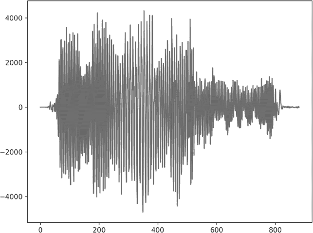
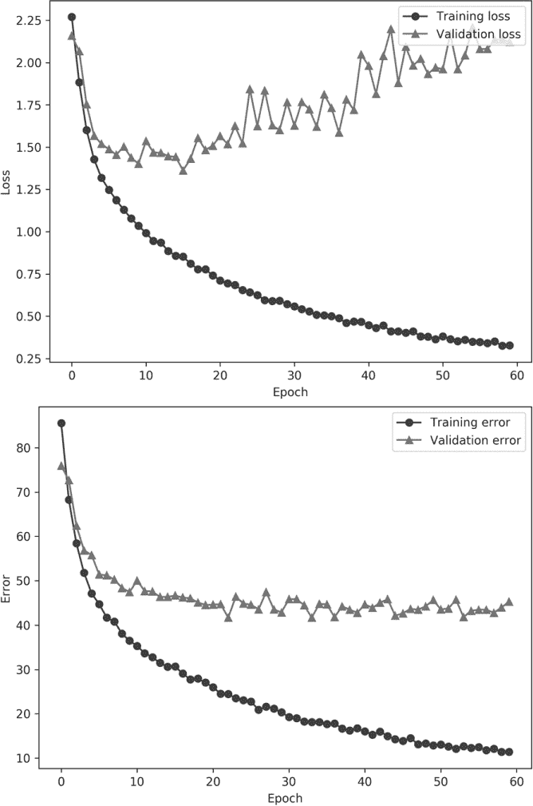
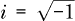
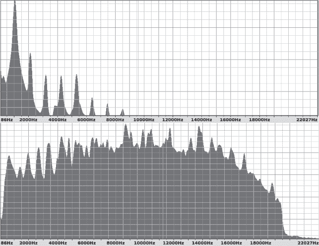
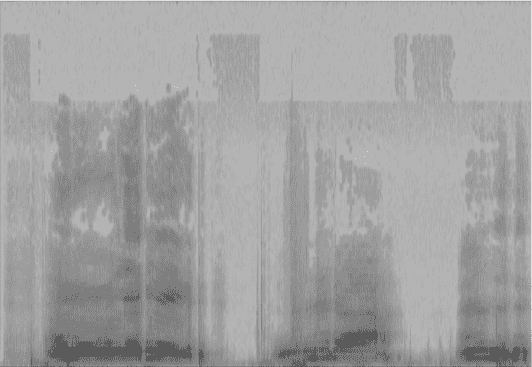
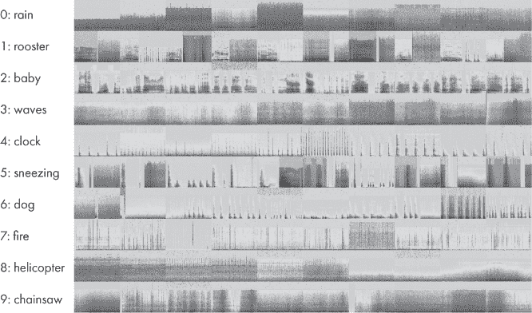
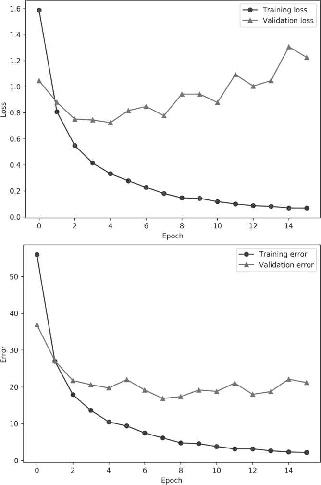

## **15

一个案例研究：**音频样本分类**

让我们将书中所学的内容整合在一起。我们将通过一个案例研究来展示。场景是这样的：我们是数据科学家，我们的老板委派我们为存储为*.wav*文件的音频样本构建一个分类器。我们从数据本身开始。首先，我们想要建立一些基本的直觉来理解数据的结构。然后，我们将构建可以用于训练模型的增强数据集。第一个数据集使用的是声音样本本身，这是一个一维数据集。我们将看到这种方法并不像我们希望的那样成功。

然后，我们将音频数据转换为图像，以便探索二维 CNN。这个表示方式的变化将显著改善模型的性能。最后，我们将多个模型结合在一起，形成集成模型，以观察如何利用个体模型的相对优缺点，进一步提高整体性能。

### 构建数据集

我们的数据集中有 10 个类别，共有 400 个样本，每个类别 40 个样本，每个样本长度为 5 秒。我们假设无法获得更多的数据，因为录制样本和标注它们既费时又昂贵。我们必须利用现有的数据，不能再增加。

在本书中，我们始终强调拥有一个良好的数据集是多么重要。我们假设我们收到的数据集是完整的，意味着我们的系统将只遇到数据集中的声音样本类型；不会有未知的类别。此外，我们还假设数据集的平衡性是正确的，所有类别的样本发生的概率相等。

我们将使用的音频数据集叫做 ESC-10。有关详细描述，请参见 Karol J. Piczal（2015）的《ESC：环境声音分类数据集》。该数据集可通过[`github.com/karoldvl/ESC-50/`](https://github.com/karoldvl/ESC-50/)获取。但它需要从更大的 ESC-50 数据集中提取，因为 ESC-50 没有我们可以使用的许可，而 ESC-10 子集有。

让我们做一些预处理，将 ESC-10 *.wav* 文件从更大的 ESC-50 数据集中提取出来。从前面的 URL 下载数据集的单个 ZIP 文件并解压缩。这将创建一个名为*ESC-50-master*的目录。然后，使用 Listing 15-1 中的代码从中构建 ESC-10 数据集。

import sys

import os

import shutil

classes = {

"rain":0,

"rooster":1,

"crying_baby":2,

"sea_waves":3,

"clock_tick":4,

"sneezing":5,

"dog":6,

"crackling_fire":7,

"helicopter":8,

"chainsaw":9,

}

with open("ESC-50-master/meta/esc50.csv") as f:

lines = [i[:-1] for i in f.readlines()]

lines = lines[1:]

os.system("rm -rf ESC-10")

os.system("mkdir ESC-10")

os.system("mkdir ESC-10/audio")

meta = []

for line in lines:

t = line.split(",")

if (t[-3] == 'True'):

meta.append("ESC-10/audio/%s %d" % (t[0],classes[t[3]]))

src = "ESC-50-master/audio/"+t[0]

dst = "ESC-10/audio/"+t[0]

shutil.copy(src,dst)

with open("ESC-10/filelist.txt","w") as f:

for m in meta:

f.write(m+"\n")

*清单 15-1：构建 ESC-10 数据集*

代码使用 ESC-50 的元数据来识别属于 ESC-10 数据集的 10 个类别的声音样本，然后将它们复制到*ESC-10/audio*目录中。它还会将音频文件的列表写入*filelist.txt*。运行这段代码后，我们将只使用 ESC-10 文件。

如果一切顺利，我们现在应该拥有 400 个五秒钟的*.wav*文件，每个类别有 40 个，共来自 10 个类别：雨声、公鸡叫声、婴儿哭声、海浪声、时钟滴答声、打喷嚏声、狗叫声、噼啪的火声、直升机声和链锯声。我们会礼貌地避免询问老板，究竟她为什么要区分这些特定的声音类别。

#### 数据集增强

我们的第一反应应该是，数据集太小了。毕竟，我们每种声音只有 40 个样本，而且我们知道其中一些将需要留作测试集，这样每个类别的训练样本就更少了。

我们可以 resort to *k*-fold 验证，但在这种情况下，我们将选择数据增强。那么，如何增强音频数据呢？

回想一下，数据增强的目标是创建新的数据样本，这些样本应该是来自数据集中的各个类别的。对于图像，我们可以进行显而易见的变换，比如平移、左右翻转等等。对于连续向量，我们已经看到如何使用 PCA 来增强数据（参见第五章）。对于音频文件，我们需要思考可以做哪些处理来生成新的文件，同时又能保持其原始类别的特点。以下是四个思路。

首先，我们可以在时间上平移样本，就像我们可以将图像向左或向右平移几个像素一样。其次，我们可以通过为声音添加少量的随机噪声来模拟一个嘈杂的环境。第三，我们可以改变声音的音高，稍微提高或降低音高。这就是所谓的*音高移位*。最后，我们可以在时间上延长或压缩声音，这就是*时间移位*。

做这些事情听起来很复杂，特别是如果我们之前没有处理过音频数据的话。我应该指出，在实践中，面对不熟悉的数据是非常常见的情况；我们并不总是能够选择自己要处理的数据。

幸运的是，我们使用的是 Python，Python 社区非常庞大且充满才华。事实证明，只需要安装一个库，我们就能轻松地进行时间伸缩和音高移位。让我们来安装 librosa 库。这应该能帮我们解决问题：

$ sudo pip3 install librosa

安装好所需的库后，我们可以使用清单 15-2 中的代码来增强 ESC-10 数据集。

import os

import random

import numpy as np

from scipy.io.wavfile import read, write

import librosa as rosa

N = 8

os.system("rm -rf augmented; mkdir augmented")

os.system("mkdir augmented/train augmented/test")

❶ src_list = [i[:-1] for i in open("ESC-10/filelist.txt")]

z = [[] for i in range(10)]

for s in src_list:

_,c = s.split()

z[int(c)].append(s)

❷ train = []

test = []

for i in range(10):

p = z[i]

random.shuffle(p)

test += p[:8]

train += p[8:]

random.shuffle(train)

random.shuffle(test)

augment_audio(train, "train")

augment_audio(test, "test")

*清单 15-2：增强 ESC-10 数据集，第一部分*

这段代码加载了必要的模块，包括 librosa 模块（我们简称为 rosa），以及 SciPy wavfile 模块中的两个函数，用于读取和写入 NumPy 数组作为*.wav*文件。

我们设置每个类别用于测试的样本数量（N=8），并创建输出目录，保存增强后的声音文件（augmented）。然后，我们读取之前创建的文件列表，参考清单 15-1 ❶。接下来，我们创建一个嵌套列表（z），用于保存与 10 个类别每个类别相关联的音频文件名称。

使用每个类别的文件列表，我们将其拆分并创建训练和测试文件列表 ❷。注意，我们随机打乱每个类别的文件列表以及最终的训练和测试列表。该代码遵循我们在第四章中讨论的先分离训练集和测试集，再进行数据增强的惯例。

我们可以通过调用 augment_audio 来增强训练和测试文件。该函数位于清单 15-3 中。

def augment_audio(src_list, typ):

flist = []

for i,s in enumerate(src_list):

f,c = s.split()

❶ wav = read(f) #（采样率，数据）

base = os.path.abspath("augmented/%s/%s" %

(typ, os.path.basename(f)[:-4]))

fname = base+".wav"

❷ write(fname, wav[0], wav[1])

flist.append("%s %s" % (fname,c))

for j in range(19):

d = augment(wav)

fname = base+("_%04d.wav" % j)

❸ write(fname, wav[0], d.astype(wav[1].dtype))

flist.append("%s %s" % (fname,c))

random.shuffle(flist)

with open("augmented_%s_filelist.txt" % typ,"w") as f:

for z in flist:

f.write("%s\n" % z)

*清单 15-3：增强 ESC-10 数据集，第二部分*

该函数循环遍历给定列表中的所有文件名（src_list），该列表可以是训练集或测试集。文件名与类别标签分开，然后从磁盘读取文件 ❶。如注释所示，wav 是一个包含两个元素的列表。第一个元素是采样率，以 Hz 为单位（每秒的周期数）。这表示模拟波形被数字化以生成*.wav*文件的频率。对于 ESC-10，采样率始终为 44,100 Hz，这是标准的 CD 采样率。第二个元素是一个 NumPy 数组，包含实际的数字化声音样本。这些值将用于增强数据，生成新的数据文件。

在设置了一些输出路径名之后，我们将原始声音样本写入增强目录❷。然后，我们开始一个循环，生成当前声音样本的 19 个增强版本。整个增强数据集的大小将是原始数据集的 20 倍，总共有 8,000 个声音文件，其中 6,400 个用于训练，1,600 个用于测试。请注意，增强源文件的声音样本分配给 d。新的声音文件使用 44,100 Hz 的采样率和与源数据相匹配的数据类型写入磁盘❸。

在创建增强的声音文件时，我们还会追踪文件名和类别，并将它们写入一个新的文件列表中。这里 typ 是一个字符串，表示训练集或测试集。

这个函数调用了另一个函数 augment。这个函数通过随机应用之前提到的四种增强策略的某些子集，来生成单个声音文件的增强版本：平移、噪声、音高平移或时间平移。对于每次调用 augment，这些方法中的一些或全部可能会被使用。augment 函数本身在 Listing 15-4 中展示。

def augment(wav):

sr = wav[0]

d = wav[1].astype("float32")

❶ if (random.random() < 0.5):

s = int(sr/4.0*(np.random.random()-0.5))

d = np.roll(d,s)

if (s < 0):

d[s:] = 0

else:

d[:s] = 0

❷ if (random.random() < 0.5):

d += 0.1*(d.max()-d.min())*np.random.random(d.shape[0])

❸ if (random.random() < 0.5):

pf = 20.0*(np.random.random()-0.5)

d = rosa.effects.pitch_shift(d, sr, pf)

❹ if (random.random() < 0.5):

rate = 1.0 + (np.random.random()-0.5)

d = rosa.effects.time_stretch(d,rate)

if (d.shape[0] > wav[1].shape[0]):

d = d[:wav[1].shape[0]]

else:

w = np.zeros(wav[1].shape[0], dtype="float32")

w[:d.shape[0]] = d

d = w.copy()

return d

*Listing 15-4: 增强 ESC-10 数据集，部分 3*

这个函数将样本（d）与采样率（sr）分开，并确保样本是浮动点数。对于 ESC-10，源样本全为 int16 类型（有符号 16 位整数）。接下来是四个 if 语句。每个 if 语句都会生成一个随机浮动数，如果该浮动数小于 0.5，则执行 if 语句的内容。这意味着我们以 50%的概率应用每一种可能的增强方式。

第一个 if 语句通过将 NumPy 数组（向量）按某个样本数 s 滚动，来在时间上平移声音样本❶。这个值最多为四分之一秒的时间，即 sr/4.0。请注意，平移可以是正向的或负向的。sr/4.0 是四分之一秒内的样本数量。然而，随机浮动数在[*–*0.5, +0.5]的范围内，因此最终的平移量最多为四分之一秒。如果平移是负向的，我们需要在数据末尾置零样本；否则，我们在开始位置置零样本。

随机噪声通过字面地将音频信号范围的十分之一以内的随机值加回去❷。这会导致播放时产生类似旧磁带中听到的嘶嘶声。

接下来是使用 librosa 调整样本的音高。音高变化以音乐的半音阶或其分数表示。我们随机选择一个在[*–*10,+10]范围内的浮动值（pf），并将其与数据（d）和采样率（sr）一起传递给 librosa 的 pitch_shift 效果函数❸。

最后的扩充使用了 librosa 函数来拉伸或压缩时间（time_stretch）❹。我们使用在范围[*–*0.5,+0.5]内的时间（rate）进行调整。如果时间被拉伸，我们需要去除额外的样本，以确保样本长度保持不变。如果时间被压缩，我们需要在结尾添加零样本。

最后，我们返回新的、扩充过的样本。

运行列表 15-2 中的代码会创建一个新的*扩充*数据目录，并包含子目录*train*和*test*。这些是我们接下来要处理的原始声音文件。我鼓励你去听一听它们，以理解扩充操作的效果。文件名应该能帮助你快速区分原始文件和扩充后的文件。

#### 数据预处理

我们准备好开始构建模型了吗？还没有。我们的经验告诉我们，数据集太小，因此我们做了相应的扩充。然而，我们还没有将原始数据转换成可以传递给模型的格式。

第一个想法是使用原始的声音样本。这些样本已经是表示音频信号的向量，样本之间的时间由采样率 44,100 Hz 决定。但我们不想直接使用它们。样本的时长都是精确的五秒钟。以 44,100 样本每秒的速度，意味着每个样本是一个 44,100 × 5 = 220,500 个样本的向量。这对我们来说太长，无法有效处理。

再想一想，我们可能会说，区分哭泣的婴儿和叫的狗可能不需要那么高的采样率。如果我们不保留所有样本，而只保留每第 100 个样本会怎样？此外，我们真的需要五秒钟的数据来识别声音吗？如果我们只保留前两秒的数据呢？

我们只保留每个声音文件的前两秒；即 88,200 个样本。并且我们只保留每第 100 个样本，因此每个声音文件现在变成了一个包含 882 个元素的向量。这几乎与一个展开的 MNIST 数字图像差不多，我们知道我们可以处理这些。

列表 15-5 包含了用于构建我们将用于构建模型的初始版本数据集的代码。

import os

import random

import numpy as np

from scipy.io.wavfile import read

sr = 44100 # Hz

N = 2*sr   # 要保留的样本数量

w = 100    # 每 100 个

afiles = [i[:-1] for i in open("augmented_train_filelist.txt")]

trn = np.zeros((len(afiles),N//w,1), dtype="int16")

lbl = np.zeros(len(afiles), dtype="uint8")

for i,t in enumerate(afiles):

❶ f,c = t.split()

trn[i,:,0] = read(f)[1][:N:w]

lbl[i] = int(c)

np.save("esc10_raw_train_audio.npy", trn)

np.save("esc10_raw_train_labels.npy", lbl)

afiles = [i[:-1] for i in open("augmented_test_filelist.txt")]

tst = np.zeros((len(afiles), N//w, 1), dtype="int16")

lbl = np.zeros(len(afiles), dtype="uint8")

对于 i, t 在 afiles 中的每一项：

f, c = t.split()

tst[i,:,0] = read(f)[1][:N:w]

lbl[i] = int(c)

np.save("esc10_raw_test_audio.npy", tst)

np.save("esc10_raw_test_labels.npy", lbl)

*代码清单 15-5: 构建减少样本数据集*

这段代码构建了包含原始数据的训练和测试 NumPy 文件。这些数据来自我们在 代码清单 15-2 中构建的增强音频文件。文件列表包含文件位置和类标签 ❶。我们加载列表中的每个文件并将其放入数组中，可能是训练数组或测试数组。

我们有一个一维特征向量和一些训练或测试文件，因此我们可能需要一个二维数组来存储数据，可以是训练集的 6400 × 882 或测试集的 1600 × 882。然而，我们知道最终将使用 Keras，而且 Keras 需要一个通道数维度，因此我们将数组定义为 6400 × 882 × 1 和 1600 × 882 × 1。该代码中最关键的行是：

trn[i,:,0] = read(f)[1][:N:w]

它读取当前音频文件，只保留音频样本 ([1])，并从音频样本中保留前两秒，每隔 100 个样本取一个，[:N:w]。花点时间理解这段代码。如果你感到困惑，建议在 Python 交互式提示符下尝试使用 NumPy 来理解它在做什么。

最终，我们得到了用于 882 元素向量及其相关标签的训练文件和测试文件。我们将用这些来构建第一个模型。图 15-1 显示了哭泣婴儿的特征向量。

*图 15-1: 哭泣婴儿的特征向量*

x 轴是样本编号（可以理解为“时间”），y 轴是样本值。

### 分类音频特征

我们已经有了训练集和测试集。接下来让我们构建一些模型，看看它们的表现如何。由于我们有特征向量，可以快速开始使用经典模型。之后，我们可以构建一些一维卷积网络，看看它们的表现是否更好。

#### 使用经典模型

我们可以使用与 第七章 中乳腺癌数据集相同的经典模型进行测试。代码清单 15-6 提供了设置代码。

import numpy as np

from sklearn.neighbors import NearestCentroid

from sklearn.neighbors import KNeighborsClassifier

from sklearn.naive_bayes import GaussianNB

from sklearn.ensemble import RandomForestClassifier

from sklearn.svm import LinearSVC

x_train = np.load("esc10_raw_train_audio.npy")[:,:,0]

y_train = np.load("esc10_raw_train_labels.npy")

(*\pagebreak*)

x_test = np.load("esc10_raw_test_audio.npy")[:,:,0]

y_test = np.load("esc10_raw_test_labels.npy")

❶ x_train = (x_train.astype('float32') + 32768) / 65536

x_test = (x_test.astype('float32') + 32768) / 65536

train(x_train, y_train, x_test, y_test)

*列表 15-6：使用经典模型对音频特征进行分类，第一部分*

在这里，我们导入必要的模型类型，加载数据集，对其进行缩放，然后调用一个我们稍后会介绍的 train 函数。

缩放在这里至关重要。考虑图 15-1 中的 y 轴范围。它大约从-4000 到 4000。我们需要对数据进行缩放，使其范围更小，值更接近 0。回想一下，对于 MNIST 和 CIFAR-10 数据集，我们通过最大值来缩放到[0,1]。

音频样本是 16 位有符号整数。这意味着它们可以取的值的完整范围覆盖[*–*32,768,+32,767]。如果我们将样本转换为浮动数，添加 32,768，然后除以 65,536（即 2 倍的最小值）❶，我们将得到范围在 0,1)内的样本，这就是我们想要的。

训练和评估经典模型非常直接，如[列表 15-7 所示。

def run(x_train, y_train, x_test, y_test, clf):

clf.fit(x_train, y_train)

score = 100.0*clf.score(x_test, y_test)

print("score = %0.2f%%" % score)

def train(x_train, y_train, x_test, y_test):

print("Nearest Centroid          : ", end='')

run(x_train, y_train, x_test, y_test, NearestCentroid())

print("k-NN 分类器 (k=3)     : ", end='')

run(x_train, y_train, x_test, y_test, KNeighborsClassifier(n_neighbors=3))

print("k-NN 分类器 (k=7)     : ", end='')

run(x_train, y_train, x_test, y_test, KNeighborsClassifier(n_neighbors=7))

print("朴素贝叶斯（高斯）        : ", end='')

run(x_train, y_train, x_test, y_test, GaussianNB())

print("Random Forest (trees=  5) : ", end='')

run(x_train, y_train, x_test, y_test,

RandomForestClassifier(n_estimators=5))

print("Random Forest (trees= 50) : ", end='')

run(x_train, y_train, x_test, y_test,

RandomForestClassifier(n_estimators=50))

print("Random Forest (trees=500) : ", end='')

run(x_train, y_train, x_test, y_test,

RandomForestClassifier(n_estimators=500))

print("Random Forest (trees=1000): ", end='')

run(x_train, y_train, x_test, y_test,

RandomForestClassifier(n_estimators=1000))

print("LinearSVM (C=0.01)        : ", end='')

run(x_train, y_train, x_test, y_test, LinearSVC(C=0.01))

print("LinearSVM (C=0.1)         : ", end='')

run(x_train, y_train, x_test, y_test, LinearSVC(C=0.1))

print("LinearSVM (C=1.0)         : ", end='')

run(x_train, y_train, x_test, y_test, LinearSVC(C=1.0))

print("LinearSVM (C=10.0)        : ", end='')

run(x_train, y_train, x_test, y_test, LinearSVC(C=10.0))

*列表 15-7：使用经典模型对音频特征进行分类，第二部分*

train 函数创建特定的模型实例，然后调用 run 函数。我们在第七章中看到了这个相同的代码结构。run 函数使用 fit 来训练模型，使用 score 来评估模型在测试集上的表现。目前，我们将仅根据模型的整体准确度（分数）来评估模型。运行这段代码会产生如下输出：

Nearest Centroid          : score = 11.9%

k-NN 分类器 (k=3)        : score = 12.1%

k-NN 分类器 (k=7)        : score = 10.5%

朴素贝叶斯（高斯）      : score = 28.1%

随机森林 (树木= 5)       : score = 22.6%

随机森林 (树木= 50)      : score = 30.8%

随机森林 (树木=500)      : score = 32.8%

随机森林 (树木=1000)      : score = 34.4%

LinearSVM (C=0.01)        : score = 16.5%

LinearSVM (C=0.1)         : score = 17.5%

LinearSVM (C=1.0)         : score = 13.4%

LinearSVM (C=10.0)        : score = 10.2%

我们很快就可以看到经典模型的表现非常糟糕。许多模型实际上几乎是在随机猜测类别标签。由于有 10 个类别，所以随机猜测的准确率应该大约是 10%。表现最好的经典模型是一个拥有 1000 棵树的随机森林，但即便如此，它的表现也仅为 34.44%——准确率仍然太低，无法成为大多数情况下我们愿意使用的模型。这个数据集并不简单，至少对传统方法来说是这样。令人有些意外的是，高斯朴素贝叶斯模型有 28%的准确率。请记住，高斯朴素贝叶斯假设样本之间是独立的。而在这里，特定测试输入下的声音样本之间并不独立。特征向量在这种情况下表示的是时间上不断变化的信号，而不是互相独立的特征集合。

最常失败的模型是最近质心、*k*-NN 和线性 SVM。我们有一个合理高维的输入，882 个元素，但训练集仅有 6400 个样本。这对最近邻分类器来说样本可能太少——特征空间太过稀疏。再次出现了维度灾难的问题。线性 SVM 失败是因为这些特征似乎不是线性可分的。我们没有尝试 RBF（高斯核）SVM，但我们将留给读者作为练习。如果你尝试了，记得现在有两个超参数需要调整：*C* 和 *γ*。

#### 使用传统神经网络

我们还没有尝试传统神经网络。我们可以像之前一样使用 sklearn 的 MLPClassifier 类，但现在是展示如何在 Keras 中实现传统神经网络的好时机。Listing 15-8 包含代码。

import keras

from keras.models import Sequential

from keras.layers import Dense, Dropout, Flatten

from keras import backend as K

import numpy as np

batch_size = 32

num_classes = 10

epochs = 16

nsamp = (882,1)

x_train = np.load("esc10_raw_train_audio.npy")

y_train = np.load("esc10_raw_train_labels.npy")

x_test = np.load("esc10_raw_test_audio.npy")

y_test  = np.load("esc10_raw_test_labels.npy")

x_train = (x_train.astype('float32') + 32768) / 65536

x_test = (x_test.astype('float32') + 32768) / 65536

y_train = keras.utils.to_categorical(y_train, num_classes)

y_test = keras.utils.to_categorical(y_test, num_classes)

model = Sequential()

model.add(Dense(1024, activation='relu', input_shape=nsamp))

model.add(Dropout(0.5))

model.add(Dense(512, activation='relu'))

model.add(Dropout(0.5))

model.add(Flatten())

model.add(Dense(num_classes, activation='softmax'))

model.compile(loss=keras.losses.categorical_crossentropy,

optimizer=keras.optimizers.Adam(),

metrics=['accuracy'])

model.fit(x_train, y_train,

batch_size=batch_size,

epochs=epochs,

verbose=0,

validation_data=(x_test, y_test))

(*\pagebreak*)

score = model.evaluate(x_test, y_test, verbose=0)

print('测试准确率:', score[1])

*清单 15-8: Keras 中的传统神经网络*

加载必要的模块后，我们加载数据并像经典模型一样对其进行缩放。接下来，我们构建模型架构。我们只需要 Dense 层和 Dropout 层。我们确实添加了一个 Flatten 层，以在最终的 softmax 输出之前消除额外的维度（注意 nsamp 的形状）。不幸的是，这个模型并没有为我们带来改进：我们的准确率仅为 27.6%。

#### 使用卷积神经网络

经典模型和传统神经网络并不够好。我们不应该感到太惊讶，但尝试它们也很容易。接下来，我们将应用一维卷积神经网络（CNN）到这个数据集，看看它能否表现得更好。

我们还没有使用过一维 CNN。除了输入数据的结构外，唯一的区别是我们将 Conv2D 和 MaxPooling2D 替换为 Conv1D 和 MaxPooling1D。

我们将尝试的第一个模型的代码如清单 15-9 所示。

导入 keras

从 keras.models 导入 Sequential

从 keras.layers 导入 Dense, Dropout, Flatten

从 keras.layers 导入 Conv1D, MaxPooling1D

导入 numpy as np

batch_size = 32

num_classes = 10

epochs = 16

nsamp = (882,1)

x_train = np.load("esc10_raw_train_audio.npy")

y_train = np.load("esc10_raw_train_labels.npy")

x_test = np.load("esc10_raw_test_audio.npy")

y_test = np.load("esc10_raw_test_labels.npy")

x_train = (x_train.astype('float32') + 32768) / 65536

x_test = (x_test.astype('float32') + 32768) / 65536

y_train = keras.utils.to_categorical(y_train, num_classes)

y_test = keras.utils.to_categorical(y_test, num_classes)

model = Sequential()

model.add(Conv1D(32, kernel_size=3, activation='relu',

input_shape=nsamp))

model.add(MaxPooling1D(pool_size=3))

model.add(Dropout(0.25))

model.add(Flatten())

model.add(Dense(512, activation='relu'))

model.add(Dropout(0.5))

model.add(Dense(num_classes, activation='softmax'))

model.compile(loss=keras.losses.categorical_crossentropy,

optimizer=keras.optimizers.Adam(),

metrics=['accuracy'])

history = model.fit(x_train, y_train,

batch_size=batch_size,

epochs=epochs,

verbose=1,

validation_data=(x_test[:160], y_test[:160]))

score = model.evaluate(x_test[160:], y_test[160:], verbose=0)

print('测试准确率:', score[1])

*清单 15-9: Keras 中的一维卷积神经网络*

这个模型加载并预处理数据集，与之前相同。我们将这种架构称为*浅层*架构，它只有一个卷积层，包含 32 个滤波器，卷积核大小为 3。我们将像在 MNIST 模型中尝试不同的 2D 卷积核大小那样，改变这个卷积核的大小。紧随 Conv1D 层之后的是一个最大池化层，池化核大小为 3。接下来是 Dropout 层和 Flatten 层，最后是一个带有 dropout 的 512 节点的全连接 Dense 层。Softmax 层完成了这个架构。

我们将训练 16 个 epoch，使用批量大小为 32。我们会保留训练历史，以便检查损失和验证性能与 epoch 的关系。测试样本有 1,600 个。我们将使用 10%的数据进行训练验证，其余 90%用于整体准确度的计算。最后，我们会将 Conv1D 的卷积核大小从 3 调整到 33，试图找到一个适合训练数据的卷积核大小。

我们将定义另外四种架构。我们将它们分别称为*中等*、*深层 0*、*深层 1*和*深层 2*。由于没有与这些数据打交道的经验，尝试多种架构是有意义的。目前，没有办法预先知道哪种架构最适合新的数据集。我们能做的只是依赖之前的经验。

Listing 15-10 列出了具体的架构，并用注释分隔。

# medium

model = Sequential()

model.add(Conv1D(32, kernel_size=3, activation='relu',

input_shape=nsamp))

model.add(Conv1D(64, kernel_size=3, activation='relu'))

model.add(Conv1D(64, kernel_size=3, activation='relu'))

model.add(MaxPooling1D(pool_size=3))

model.add(Dropout(0.25))

model.add(Flatten())

model.add(Dense(512, activation='relu'))

model.add(Dropout(0.5))

model.add(Dense(num_classes, activation='softmax'))

# deep0

model = Sequential()

model.add(Conv1D(32, kernel_size=3, activation='relu',

input_shape=nsamp))

model.add(Conv1D(64, kernel_size=3, activation='relu'))

model.add(Conv1D(64, kernel_size=3, activation='relu'))

model.add(MaxPooling1D(pool_size=3))

model.add(Dropout(0.25))

model.add(Conv1D(64, kernel_size=3, activation='relu'))

model.add(Conv1D(64, kernel_size=3, activation='relu'))

model.add(MaxPooling1D(pool_size=3))

model.add(Dropout(0.25))

model.add(Flatten())

model.add(Dense(512, activation='relu'))

model.add(Dropout(0.5))

model.add(Dense(num_classes, activation='softmax'))

# deep1

model = Sequential()

model.add(Conv1D(32, kernel_size=3, activation='relu',

input_shape=nsamp))

model.add(Conv1D(64, kernel_size=3, activation='relu'))

model.add(Conv1D(64, kernel_size=3, activation='relu'))

model.add(MaxPooling1D(pool_size=3))

model.add(Dropout(0.25))

model.add(Conv1D(64, kernel_size=3, activation='relu'))

model.add(Conv1D(64, kernel_size=3, activation='relu'))

model.add(MaxPooling1D(pool_size=3))

model.add(Dropout(0.25))

model.add(Conv1D(64, kernel_size=3, activation='relu'))

model.add(Conv1D(64, kernel_size=3, activation='relu'))

model.add(MaxPooling1D(pool_size=3))

model.add(Dropout(0.25))

model.add(Flatten())

model.add(Dense(512, activation='relu'))

model.add(Dropout(0.5))

model.add(Dense(num_classes, activation='softmax'))

# deep2

model = Sequential()

model.add(Conv1D(32, kernel_size=3, activation='relu',

input_shape=nsamp))

model.add(Conv1D(64, kernel_size=3, activation='relu'))

model.add(Conv1D(64, kernel_size=3, activation='relu'))

model.add(MaxPooling1D(pool_size=3))

model.add(Dropout(0.25))

model.add(Conv1D(64, kernel_size=3, activation='relu'))

model.add(Conv1D(64, kernel_size=3, activation='relu'))

model.add(MaxPooling1D(pool_size=3))

model.add(Dropout(0.25))

model.add(Conv1D(64, kernel_size=3, activation='relu'))

model.add(Conv1D(64, kernel_size=3, activation='relu'))

model.add(MaxPooling1D(pool_size=3))

model.add(Dropout(0.25))

model.add(Conv1D(64, kernel_size=3, activation='relu'))

model.add(Conv1D(64, kernel_size=3, activation='relu'))

model.add(MaxPooling1D(pool_size=3))

model.add(Dropout(0.25))

model.add(Flatten())

model.add(Dense(512, activation='relu'))

model.add(Dropout(0.5))

model.add(Dense(num_classes, activation='softmax'))

*列表 15-10：不同的 1D CNN 架构*

如果我们训练多个模型，每次改变第一个 Conv1D 卷积核的大小，我们可以得到表 15-1 中的结果。我们已将每种架构中表现最好的模型标出。

**表 15-1：不同卷积核大小和模型架构的测试集准确率**

| **卷积核大小** | **浅层** | **中层** | **深层 0** | **深层 1** | **深层 2** |
| --- | --- | --- | --- | --- | --- |
| 3 | **44.51** | 41.39 | **48.75** | **54.03** | 9.93 |
| 5 | 43.47 | 41.74 | 44.72 | 53.96 | 48.47 |
| 7 | 38.47 | 40.97 | 46.18 | 52.64 | 49.31 |
| 9 | 41.46 | **43.06** | 46.88 | 48.96 | 9.72 |
| 11 | 39.65 | 40.21 | 45.21 | 52.99 | 10.07 |
| 13 | 42.71 | 41.67 | 46.53 | 50.56 | **52.57** |
| 15 | 40.00 | 42.78 | 46.53 | 50.14 | 47.08 |
| 33 | 27.57 | 42.22 | 41.39 | 48.75 | 9.86 |

看表 15-1，我们可以看到一个普遍趋势，即随着模型深度的增加，准确度逐步提升。然而，在深层 2 模型中，情况开始变得糟糕。部分模型未能收敛，表现出类似随机猜测的准确率。深层 1 模型在所有卷积核大小中表现最好。从卷积核大小来看，宽度为 3 的卷积核在五种架构中有三种表现最佳。所有这些表明，对于 1D CNN 来说，最佳组合是使用初始宽度为 3 的卷积核以及深层 1 架构。

我们仅训练了这种架构 16 个周期。如果我们训练更多的周期，结果会有改善吗？让我们训练深层 1 模型 60 个周期，并绘制训练和验证损失及误差图，看看它们是否收敛（或者没有）。执行此操作后，得到图 15-2，我们可以看到训练和验证损失（顶部）以及误差（底部）随着周期的变化。

*图 15-2：深层 1 架构的训练和验证损失（顶部）与误差（底部）*

立刻，我们应该注意到验证集损失的激增。训练损失在持续下降，直到大约第 18 个 epoch 左右；然后验证损失上升并变得震荡。这是一个典型的过拟合例子。过拟合的可能原因是我们有限的训练集规模，只有 6400 个样本，即使在数据增强之后也是如此。验证误差在初始下降后基本保持恒定。结论是，使用一维向量，我们不能期望在这个数据集上得到比约 54%的总体准确率更好的结果。

如果我们想要提高性能，就需要更好地表达我们的数据集。幸运的是，我们还有一个额外的预处理技巧可以使用。

### 声谱图

让我们回到我们增强后的音频文件集。为了构建数据集，我们从声音样本中只保留两秒钟的音频，并且仅选择每 100 个样本中的一个。我们能做到的最好的准确率大约是 50%以上。

然而，如果我们使用一个小的输入音频文件样本集，比如 200 毫秒，我们可以利用这些样本的向量来计算*傅里叶变换*。傅里叶变换是通过定期采样信号得到的，它告诉我们构成信号的频率。任何信号都可以被看作是许多不同正弦波和余弦波的总和。如果信号仅由少数几个波组成，比如来自欧卡里纳这样的乐器的声音，那么傅里叶变换将仅在这些频率上有几个峰值。如果信号很复杂，如语音或音乐，则傅里叶变换将有许多不同的频率，导致许多不同的峰值。

傅里叶变换本身是复值的：每个元素都有一个实部和一个虚部。你可以将其写为 *a* + *bi*，其中 *a* 和 *b* 是实数，且 。如果我们使用这些量的绝对值，我们将得到一个实数，表示某个特定频率的能量。这被称为信号的*功率谱*。一个简单的音调可能只在少数几个频率上有能量，而像镲片撞击声或白噪声这样的信号将使能量在所有频率上更加均匀地分布。图 15-3 展示了两个功率谱。

*图 15-3：欧卡里纳（上）和镲片（下）的功率谱*

上面是欧卡里纳的频谱，下面是镲片撞击的频谱。正如预期的那样，欧卡里纳的频谱只有少数几个频率，而镲片的频谱覆盖了所有频率。对我们来说，重要的一点是，*从视觉上*看，这两个频谱是完全不同的。（这些频谱是使用 Audacity 制作的，它是一款非常优秀的开源音频处理工具。）

我们可以将这些功率谱作为特征向量使用，但它们仅表示了时间切片的频谱。音频样本时长为五秒。我们将不使用频谱，而是使用*声谱图*。声谱图是由代表各个频谱的列组成的图像。这意味着 x 轴表示时间，y 轴表示频率。像素的颜色与该时间点在该频率上的能量成正比。

换句话说，声谱图就是我们将功率谱竖直排列，并使用颜色来表示给定频率下的强度时得到的图像。通过这种方法，我们可以将整个音频样本转化为图像。例如，Figure 15-4 展示了一个哭泣婴儿的声谱图。对比 Figure 15-1 的特征向量。

*Figure 15-4：哭泣婴儿的声谱图*

要创建增强的音频文件的声谱图，我们需要一个新的工具和一些代码。我们需要的工具叫做 sox。它不是一个 Python 库，而是一个命令行工具。如果你使用的是我们标准的 Ubuntu Linux 发行版，它很可能已经安装了。如果没有，你可以安装它：

$ sudo apt-get install sox

我们将从 Python 脚本内部使用 sox 来生成我们想要的声谱图图像。每个音频文件都会生成一张新的声谱图图像。

处理训练图像的源代码见 Listing 15-11。

import os

import numpy as np

来自 PIL 的 Image

rows = 100

cols = 160

❶ flist = [i[:-1] for i in open("augmented_train_filelist.txt")]

N = len(flist)

img = np.zeros((N,rows,cols,3), dtype="uint8")

lbl = np.zeros(N, dtype="uint8")

p = []

for i,f in enumerate(flist):

src, c = f.split()

❷ os.system("sox %s -n spectrogram" % src)

im = np.array(Image.open("spectrogram.png").convert("RGB"))

❸ im = im[42:542,58:858,:]

im = Image.fromarray(im).resize((cols,rows))

img[i,:,:,:] = np.array(im)

lbl[i] = int(c)

p.append(os.path.abspath(src))

os.system("rm -rf spectrogram.png")

p = np.array(p)

❹ idx = np.argsort(np.random.random(N))

img = img[idx]

lbl = lbl[idx]

p = p[idx]

np.save("esc10_spect_train_images.npy", img)

np.save("esc10_spect_train_labels.npy", lbl)

np.save("esc10_spect_train_paths.npy", p)

*Listing 15-11：构建声谱图*

我们首先定义声谱图的大小。这是我们模型的输入，我们不希望它太大，因为我们在处理输入时有大小限制。我们选择 100×160 像素。然后，我们加载训练文件列表❶并创建 NumPy 数组来保存声谱图图像和相应的标签。列表 p 将保存每个声谱图的源文件路径，以便在某些时候如果需要，我们可以回到原始音频文件。通常，保存源数据的信息是一个好习惯，方便我们追溯衍生数据集的来源。

然后，我们遍历文件列表，获取文件名和类别标签，接着调用 sox，传入源音频文件名❷。sox 应用程序功能强大。这里的语法将给定的音频文件转换为名为 *spectrogram.png* 的频谱图图像。我们立即将输出的频谱图加载到 im 中，并确保它是一个没有透明层的 RGB 文件（因此调用了 convert("RGB")）。

sox 创建的频谱图有一个包含频率和时间信息的边框。我们只需要频谱图图像部分，因此我们对图像进行子集处理❸。我们是通过经验确定了所使用的索引。虽然有可能，但不太可能，新版本的 sox 需要调整这些索引，以避免包含任何边框像素。

接下来，我们将频谱图调整大小，使其适合我们的 100×160 像素数组。这是下采样，没错，但希望仍然保留足够的特征信息，以便模型能够区分不同的类别。我们保留下采样后的频谱图、相应的类别标签和音频文件路径。

当我们生成完所有的频谱图后，循环结束，我们会删除最后一个多余的频谱图 PNG 文件。然后我们将音频文件路径列表转换为 NumPy 数组，这样就可以像存储图像和标签一样存储它。最后，我们随机打乱图像的顺序，以防止任何可能的隐式排序将同一类别的图像聚集在一起❹。这样做是为了确保按顺序提取的小批量能够代表所有类别的混合。最后，我们将图像、标签和路径名写入磁盘。我们为测试集重复整个过程。

我们能否通过肉眼区分不同类别的频谱图？如果我们能够轻松做到这一点，那么模型也有很好的机会能够区分这些类别。Figure 15-5 展示了同一类别的 10 张频谱图，每行展示一个类别。

*图 15-5：ESC-10 中每个类别的示例频谱图。每一行显示同一类别的 10 个示例。*

从视觉上看，我们通常能够区分不同的频谱，这让人很有信心。手头有了频谱图后，我们准备尝试一些 2D CNN，看看它们是否比 1D CNN 更有效。

### 频谱图分类

要处理频谱图数据集，我们需要使用二维卷积神经网络（2D CNN）。一个可能的起点是通过将 Conv1D 改为 Conv2D，并将 MaxPooling1D 改为 MaxPooling2D，将浅层的 1D CNN 架构转换为 2D CNN。然而，如果我们这么做，得到的模型将有 3070 万个参数，这比我们希望处理的参数要多得多。因此，我们选择一个更深的架构，参数更少，然后探索不同的第一个卷积层核大小的影响。代码见 Listing 15-12。

import keras

from keras.models import Sequential

from keras.layers import Dense, Dropout, Flatten

from keras.layers import Conv2D, MaxPooling2D

import numpy as np

batch_size = 16

num_classes = 10

epochs = 16

img_rows, img_cols = 100, 160

input_shape = (img_rows, img_cols, 3)

x_train = np.load("esc10_spect_train_images.npy")

y_train = np.load("esc10_spect_train_labels.npy")

x_test = np.load("esc10_spect_test_images.npy")

y_test = np.load("esc10_spect_test_labels.npy")

x_train = x_train.astype('float32') / 255

x_test = x_test.astype('float32') / 255

y_train = keras.utils.to_categorical(y_train, num_classes)

y_test = keras.utils.to_categorical(y_test, num_classes)

model = Sequential()

model.add(Conv2D(32, kernel_size=(3,3), activation='relu',

input_shape=input_shape))

model.add(Conv2D(64, (3, 3), activation='relu'))

model.add(MaxPooling2D(pool_size=(2, 2)))

model.add(Dropout(0.25))

model.add(Conv2D(64, (3, 3), activation='relu'))

model.add(MaxPooling2D(pool_size=(2, 2)))

model.add(Dropout(0.25))

model.add(Flatten())

model.add(Dense(128, activation='relu'))

model.add(Dropout(0.5))

model.add(Dense(num_classes, activation='softmax'))

model.compile(loss=keras.losses.categorical_crossentropy,

optimizer=keras.optimizers.Adam(),

metrics=['accuracy'])

history = model.fit(x_train, y_train,

batch_size=batch_size, epochs=epochs,

verbose=0, validation_data=(x_test, y_test))

score = model.evaluate(x_test, y_test, verbose=0)

print('测试准确率:', score[1])

model.save("esc10_cnn_deep_3x3_model.h5")

*列表 15-12: 分类频谱图*

在这里，我们使用的迷你批次大小为 16，训练 16 个周期，优化器使用 Adam。模型架构包括两个卷积层，一个带 dropout 的最大池化层，另一个卷积层，以及第二个带 dropout 的最大池化层。在 softmax 输出之前有一个 128 节点的全连接层。

我们将测试两种卷积核大小：3 × 3 和 7 × 7。3 × 3 的配置如列表 15-12 所示。将(3,3)替换为(7,7)来改变大小。所有初始的 1D 卷积运行都使用模型的单次训练进行评估。我们知道，由于随机初始化，每次训练的结果会有所不同，即使其他条件不变。对于 2D 卷积神经网络，我们将每个模型训练六次，并以均值±标准误差的形式呈现总体准确率。仅此一项，我们得到以下总体准确率：

| **卷积核大小** | **得分** |
| --- | --- |
| 3 × 3 | 78.78 ± 0.60% |
| 7 × 7 | 78.44 ± 0.72% |

这表明使用 3 × 3 或 7 × 7 初始卷积层核大小之间没有实质性的差异。因此，我们将在接下来的操作中继续使用 3 × 3。

图 15-6 展示了一个 2D 卷积神经网络在训练频谱图时的训练和验证损失（上图）及误差（下图）。正如我们在 1D 卷积神经网络的情况中看到的，经过几个周期后，验证误差开始增加。

2D CNN 的表现明显优于 1D CNN：准确率为 79%，而 1D CNN 仅为 54%。这个准确率对于许多应用来说仍然不是特别有用，但对于其他一些应用来说，可能完全可以接受。尽管如此，如果我们能做到更好，还是很值得尝试的。值得注意的是，我们的数据和硬件存在一些限制，因为我们限制自己使用仅 CPU 的方法，这限制了我们愿意等待模型训练的时间。在这种情况下，如果能使用 GPU，性能可能会提高大约 25 倍，这将非常有帮助，前提是我们的使用案例允许使用 GPU。如果我们计划在嵌入式系统上运行模型，例如，我们可能没有 GPU 可用，因此我们仍然需要坚持使用更小的模型。

*图 15-6：2D CNN 架构的训练和验证损失（上）及误差（下）*

#### 初始化、正则化与批归一化

文献告诉我们，还有其他方法可以尝试。我们已经增强了数据集，这是一个强大的技术，并且我们正在使用 dropout，另一种强大的技术。我们可以尝试使用新的初始化策略——He 初始化，研究表明它通常比 Keras 默认的 Glorot 初始化效果更好。我们还可以尝试应用 L2 正则化，Keras 将其实现为每层的权重衰减。有关这些技术的复习，请参见第十章。

要设置层初始化算法，我们需要向 Conv2D 和第一个 Dense 层添加以下关键字：

kernel_initializer="he_normal"

要添加 L2 正则化，我们向 Conv2D 和第一个 Dense 层添加以下关键字：

kernel_regularizer=keras.regularizers.l2(0.001)

这里*λ* = 0.001。回想一下，*λ*是 L2 正则化的缩放因子。

我们可以将这些一起测试，但我们选择分别测试它们，以查看它们对该数据集的影响（如果有的话）。像之前一样训练六个模型，得到以下总体准确率：

| **正则化器** | **得分** |
| --- | --- |
| He 初始化 | 78.5 ± 0.5% |
| L2 正则化 | 78.3 ± 0.4% |

从统计学上讲，这与之前的结果没有区别。在这种情况下，这些方法既没有带来好处，也没有造成伤害。

批归一化是另一种经过充分验证的、广泛使用的技术，深受机器学习社区青睐。我们在第十二章中简要提到了批归一化。批归一化正如其名字所示：它对网络层的输入进行归一化，减去每个特征的均值并除以每个特征的标准差。该层的输出将归一化后的输入乘以一个常数并加上一个偏移量。其净效应是，输入值通过一个两步过程映射到新的输出值：先归一化输入，然后应用线性变换得到输出。线性变换的参数是在反向传播过程中学习的。在推理时，从数据集中学习到的均值和标准差将应用于未知输入。

批归一化已经一次又一次地证明其有效性，尤其是在加速训练方面。机器学习研究人员仍在讨论其为何如此有效的确切原因。要在 Keras 中使用它，你只需在网络的卷积层和全连接层之后（以及这些层使用的任何激活函数，如 ReLU 之后）插入批归一化。批归一化已知与丢弃层（dropout）配合不好，因此我们还将移除丢弃层。该模型代码的相关架构部分在列表 15-13 中展示。

from keras.layers import BatchNormalization

model = Sequential()

model.add(Conv2D(32, kernel_size=(3, 3),

activation='relu', input_shape=input_shape))

model.add(BatchNormalization())

model.add(Conv2D(64, (3, 3), activation='relu'))

model.add(BatchNormalization())

model.add(MaxPooling2D(pool_size=(2, 2)))

model.add(Conv2D(64, (3, 3), activation='relu'))

model.add(BatchNormalization())

model.add(MaxPooling2D(pool_size=(2, 2)))

model.add(Flatten())

model.add(Dense(128, activation='relu'))

model.add(BatchNormalization())

model.add(Dense(num_classes, activation='softmax'))

*列表 15-13：添加批归一化*

如果我们重复我们的训练过程，六个模型的平均值和标准误差报告了整体准确度，我们得到

批归一化     75.56 ± 0.59%

这明显低于没有批归一化但包含丢弃层时的平均准确度。

#### 检查混淆矩阵

我们在这一节中已经看到，我们的数据集是一个很有挑战性的。数据增强和丢弃层已经很有效，但像 ReLU 特定初始化、L2 正则化（权重衰减）甚至批归一化等其他技术对我们并没有改善。这并不意味着这些技术无效，只是它们对这个特定的小数据集没有效果。

让我们快速查看由其中一个模型生成的混淆矩阵，该模型使用了我们选择的架构。我们之前已经看过如何计算该矩阵；这里展示它是为了讨论和与接下来我们将在下一节中生成的混淆矩阵进行比较。表 15-2 展示了该矩阵；一如既往，行代表真实类别标签，列代表模型分配的标签。

**表 15-2：** 光谱图模型的混淆矩阵

| **类别** | **0** | **1** | **2** | **3** | **4** | **5** | **6** | **7** | **8** | **9** |
| --- | --- | --- | --- | --- | --- | --- | --- | --- | --- | --- |
| **0** | **85.6** | 0.0 | 0.0 | 5.6 | 0.0 | 0.0 | 0.0 | 5.0 | 0.6 | 3.1 |
| **1** | 0.0 | **97.5** | 1.2 | 0.0 | 0.6 | 0.6 | 0.0 | 0.0 | 0.0 | 0.0 |
| **2** | 0.0 | 13.8 | **72.5** | 0.6 | 0.6 | 3.8 | 6.2 | 0.0 | 0.6 | 1.9 |
| **3** | 25.0 | 0.0 | 0.0 | **68.1** | 0.0 | 2.5 | 0.6 | 0.0 | 2.5 | 1.2 |
| **4** | 0.6 | 0.0 | 0.0 | 0.0 | **84.4** | 6.2 | 5.0 | 3.8 | 0.0 | 0.0 |
| **5** | 0.0 | 0.0 | 0.6 | 0.0 | 0.0 | **94.4** | 4.4 | 0.6 | 0.0 | 0.0 |
| **6** | 0.0 | 0.0 | 1.2 | 0.0 | 0.0 | 10.6 | **88.1** | 0.0 | 0.0 | 0.0 |
| **7** | 9.4 | 0.0 | 0.6 | 0.0 | 15.6 | 1.9 | 0.0 | **63.8** | 7.5 | 1.2 |
| **8** | 18.1 | 1.9 | 0.0 | 5.6 | 0.0 | 1.2 | 2.5 | 6.9 | **55.6** | 8.1 |
| **9** | 7.5 | 0.0 | 8.1 | 0.6 | 0.0 | 0.6 | 0.0 | 1.9 | 10.0 | **71.2** |

三个表现最差的类别是直升机（8）、火灾（7）和波浪（3）。波浪和直升机最常被误判为雨声（0），而火灾最常被误判为时钟（4）和雨声。表现最好的类别是公鸡（1）和打喷嚏（5）。这些结果是有道理的。公鸡的啼叫和人类的喷嚏是非常独特的声音，没有什么能与之混淆。然而，很容易理解波浪和直升机如何被误判为雨声，或火灾的噼啪声与时钟的滴答声混淆。

这是否意味着我们卡在了 78.8%的准确率上？不，我们还有一个方法可以尝试。我们一直在训练和评估单个模型的表现。没有什么能阻止我们训练多个模型并将它们的结果结合起来。这就是*集成学习*。我们在第六章和第九章讨论 dropout 时简要介绍了集成学习的概念。现在，让我们直接应用这个思想，看看能否提升我们声音样本分类器的表现。

### 集成学习

集成学习的核心思想是将多个在相同或极为相似数据集上训练的模型的输出结合起来。它体现了“群体智慧”的概念：一个模型在某些类别或输入类型上可能比另一个更好，因此，如果它们协同工作，可能会得出比任何一个模型独立工作时更好的结果。

在这里，我们将使用与上一节相同的机器学习架构。我们的不同模型将是使用谱图作为输入的该架构的独立训练。这是一种较弱的集成方法。通常，集成中的模型彼此之间差异较大，要么是不同架构的神经网络，要么是完全不同类型的模型，如随机森林和 *k*-最近邻。这里模型之间的差异来源于网络的随机初始化，以及训练停止时网络所处的不同损失景观。

我们的方法是这样的：

1.  使用谱图数据集训练多个模型（*n* = 6）。

1.  以某种方式将这些模型在测试集上的 softmax 输出结合起来。

1.  使用组合后的输出预测分配的类别标签。

我们希望，在结合单个模型输出后分配的类别标签集，能够优于单独使用该模型架构时分配的标签集。直观地，我们觉得这种方法应该会有所帮助，这也是有道理的。

然而，问题立刻出现了：我们如何最好地结合各个网络的输出？对此问题我们有完全的自由度。我们所寻找的是一个 *f* ()，使得

*y*[predict] = *f*(*y*[0], *y*[1], *y*[2], … , *y[n]*)

其中，*y*[*i*]，*i* = 0, 1, …, *n* 是集成中 *n* 个模型的输出，*f*() 是某个函数、操作或算法，它最好地将它们结合成一个新的预测结果 *y*[predict]。

一些组合方法立刻浮现在脑海中：我们可以对输出取平均并选择最大的值，保留每个类别中最大输出值，再从中选择最大的，或者使用投票来决定分配哪个类别标签。我们会尝试这三种方法。

让我们从前三种方法开始。我们已经有了六个集成模型：它们是我们在上一节中训练的模型，用于给出测试集上的平均准确度。该模型架构使用了 dropout，但没有使用替代初始化、L2 正则化或批量归一化。

运行测试集通过上一节中训练的每个模型是相当直接的（列表 15-14）：

import sys

import numpy as np

from keras.models import load_model

model = load_model(sys.argv[1])

x_test = np.load("esc10_spect_test_images.npy")/255.0

y_test = np.load("esc10_spect_test_labels.npy")

❶ prob = model.predict(x_test)

❷ p = np.argmax(prob, axis=1)

cc = np.zeros((10,10))

for i in range(len(y_test)):

cc[y_test[i],p[i]] += 1

❸ print(np.array2string(cc.astype("uint32")))

cp = 100.0 * cc / cc.sum(axis=1)

❹ print(np.array2string(cp, precision=1))

print("总体准确率 = %0.2f%%" % (100.0*np.diag(cc).sum()/cc.sum(),))

np.save(sys.argv[2], prob)

*列表 15-14：应用多个模型到测试集*

这段代码期望第一个参数是训练模型文件的名称，第二个参数是用于存储模型预测结果的输出文件名称。然后，它加载模型和频谱测试数据，应用模型到测试数据 ❶，并通过选择最高的输出值 ❷ 来预测类别标签。

代码还会计算混淆矩阵并显示两次，第一次显示实际计数 ❸，第二次显示每个类别的百分比 ❹。最后，它会显示总体准确率并将概率写入磁盘。通过这段代码，我们可以存储六个模型的预测结果。

现在我们已经得到了预测结果，接下来让我们按照前面提到的三种方法中的第一种将它们结合起来。为了计算模型预测的平均值，我们首先加载每个模型的预测结果，然后对每个样本进行平均，并选择最大值，如清单 15-15 所示。

p0 = np.load("prob_run0.npy")

p1 = np.load("prob_run1.npy")

p2 = np.load("prob_run2.npy")

p3 = np.load("prob_run3.npy")

p4 = np.load("prob_run4.npy")

p5 = np.load("prob_run5.npy")

y_test = np.load("esc10_spect_test_labels.npy")

prob = (p0+p1+p2+p3+p4+p5)/6.0

p = np.argmax(prob, axis=1)

*清单 15-15：对测试集结果进行平均*

结果的百分比混淆矩阵为

| **类别** | **0** | **1** | **2** | **3** | **4** | **5** | **6** | **7** | **8** | **9** |
| --- | --- | --- | --- | --- | --- | --- | --- | --- | --- | --- |
| **0** | **83.8** | 0.0 | 0.0 | 7.5 | 0.0 | 0.0 | 0.0 | 4.4 | 0.0 | 4.4 |
| **1** | 0.0 | **97.5** | 1.9 | 0.0 | 0.0 | 0.6 | 0.0 | 0.0 | 0.0 | 0.0 |
| **2** | 0.0 | 10.0 | **78.1** | 0.0 | 0.0 | 3.1 | 6.2 | 0.0 | 0.0 | 2.5 |
| **3** | 9.4 | 0.0 | 0.0 | **86.2** | 0.0 | 3.1 | 0.6 | 0.0 | 0.0 | 0.6 |
| **4** | 0.6 | 0.0 | 0.0 | 0.0 | **83.1** | 5.6 | 5.0 | 5.6 | 0.0 | 0.0 |
| **5** | 0.0 | 0.0 | 0.0 | 0.0 | 0.6 | **93.8** | 5.6 | 0.0 | 0.0 | 0.0 |
| **6** | 0.0 | 0.0 | 0.6 | 0.0 | 0.0 | 8.8 | **90.6** | 0.0 | 0.0 | 0.0 |
| **7** | 8.1 | 0.0 | 0.0 | 0.0 | 17.5 | 1.9 | 0.0 | **64.4** | 7.5 | 0.6 |
| **8** | 6.2 | 0.0 | 0.0 | 7.5 | 0.0 | 1.9 | 4.4 | 8.8 | **66.2** | 5.0 |
| **9** | 5.0 | 0.0 | 5.0 | 1.2 | 0.0 | 0.6 | 0.0 | 1.9 | 10.6 | **75.6** |

总体准确率为 82.0%。

这种方法是有效的：我们从总体准确率 79%提升到了 82%。最显著的改进发生在类别 3（波形）和类别 8（直升机）上。

我们的下一种方法，在清单 15-16 中展示，会保持六个模型中每个类别的最大概率，然后选择最大的值来分配类别标签。

p = np.zeros(len(y_test), dtype="uint8")

for i in range(len(y_test)):

t = np.array([p0[i],p1[i],p2[i],p3[i],p4[i],p5[i]])

p[i] = np.argmax(t.reshape(60)) % 10

*清单 15-16：保持测试集最大值*

这段代码定义了一个与实际标签向量 y_test 长度相同的向量 p。然后，对于每个测试样本，我们形成 t，它是所有六个模型在每个类别上的预测的连接。我们将 t 重塑为一个包含 60 个元素的一维向量。为什么是 60？因为我们有 10 个类别预测，乘以 6 个模型。这个向量的最大值就是最大的选择值，argmax 返回的是该值的索引。我们实际上并不关心这个索引；我们想要的是这个索引对应的类别标签。因此，如果我们对这个索引取模 10，就能得到正确的类别标签，然后将其分配给 p。通过 p 和 y_test，我们可以计算出混淆矩阵：

| **类别** | **0** | **1** | **2** | **3** | **4** | **5** | **6** | **7** | **8** | **9** |
| --- | --- | --- | --- | --- | --- | --- | --- | --- | --- | --- |
| **0** | **82.5** | 0.0 | 0.0 | 9.4 | 0.0 | 0.0 | 0.0 | 4.4 | 0.6 | 3.1 |
| **1** | 0.0 | **95.0** | 4.4 | 0.0 | 0.0 | 0.0 | 0.0 | 0.6 | 0.0 | 0.0 |
| **2** | 0.0 | 10.0 | **78.8** | 0.0 | 0.0 | 3.1 | 5.6 | 0.0 | 0.0 | 2.5 |
| **3** | 5.0 | 0.0 | 0.0 | **90.6** | 0.0 | 2.5 | 0.6 | 0.0 | 0.6 | 0.6 |
| **4** | 1.2 | 0.0 | 0.0 | 0.0 | **81.2** | 6.2 | 5.0 | 6.2 | 0.0 | 0.0 |
| **5** | 0.0 | 0.0 | 0.0 | 0.0 | 0.6 | **93.8** | 5.6 | 0.0 | 0.0 | 0.0 |
| **6** | 0.0 | 0.0 | 0.6 | 0.0 | 0.6 | 8.8 | **90.0** | 0.0 | 0.0 | 0.0 |
| **7** | 8.8 | 0.0 | 0.0 | 0.0 | 16.2 | 2.5 | 0.0 | **65.0** | 6.9 | 0.6 |
| **8** | 8.1 | 0.0 | 0.0 | 6.2 | 0.0 | 1.9 | 4.4 | 9.4 | **63.1** | 6.9 |
| **9** | 3.8 | 0.0 | 4.4 | 3.1 | 0.0 | 0.0 | 0.0 | 1.9 | 10.6 | **76.2** |

这给我们带来了 81.6%的总体准确率。

投票是结合多个模型输出的典型方法。为了在这种情况下实现投票，我们将使用示例 15-17。

t = np.zeros((6,len(y_test)), dtype="uint32")

❶ t[0,:] = np.argmax(p0, axis=1)

t[1,:] = np.argmax(p1, axis=1)

t[2,:] = np.argmax(p2, axis=1)

t[3,:] = np.argmax(p3, axis=1)

t[4,:] = np.argmax(p4, axis=1)

t[5,:] = np.argmax(p5, axis=1)

p = np.zeros(len(y_test), dtype="uint8")

for i in range(len(y_test)):

q = np.bincount(t[:,i])

p[i] = np.argmax(q)

*示例 15-17：通过投票选择最佳类别标签*

我们首先对六个模型的预测应用 argmax，以获得相关的标签❶，并将其存储在一个合并矩阵 t 中。然后，我们像之前一样定义 p，来保存最终分配的类别标签。我们遍历每个测试样本，在此过程中使用一个新的 NumPy 函数 bincount，统计当前测试样本中每个类别标签出现的次数。出现次数最多的标签就是最常被选择的标签，因此我们再次使用 argmax 来为 p 分配正确的输出标签。请注意，这段代码之所以有效，是因为我们的类别标签是从 0 到 9 按顺序排列的整数。仅凭这一点，使用如此简单且有序的类别标签就是一个合理的选择。

这是通过这种投票过程生成的混淆矩阵：

| **类别** | **0** | **1** | **2** | **3** | **4** | **5** | **6** | **7** | **8** | **9** |
| --- | --- | --- | --- | --- | --- | --- | --- | --- | --- | --- |
| **0** | **86.2** | 0.0 | 0.0 | 8.8 | 0.0 | 0.0 | 0.0 | 3.8 | 0.0 | 1.2 |
| **1** | 0.0 | **98.1** | 1.2 | 0.0 | 0.0 | 0.6 | 0.0 | 0.0 | 0.0 | 0.0 |
| **2** | 0.0 | 10.6 | **78.1** | 0.0 | 0.0 | 3.1 | 5.6 | 0.0 | 0.0 | 2.5 |
| **3** | 14.4 | 0.0 | 0.0 | **81.2** | 0.0 | 3.1 | 0.6 | 0.0 | 0.0 | 0.6 |
| **4** | 0.6 | 0.0 | 0.0 | 0.0 | **83.8** | 5.6 | 5.0 | 5.0 | 0.0 | 0.0 |
| **5** | 0.0 | 0.0 | 0.0 | 0.0 | 0.6 | **94.4** | 5.0 | 0.0 | 0.0 | 0.0 |
| **6** | 0.0 | 0.0 | 1.2 | 0.0 | 0.6 | 9.4 | **88.8** | 0.0 | 0.0 | 0.0 |
| **7** | 8.8 | 0.0 | 0.0 | 0.0 | 18.1 | 1.9 | 0.0 | **65.6** | 5.0 | 0.6 |
| **8** | 7.5 | 0.0 | 0.0 | 6.9 | 0.0 | 3.1 | 3.8 | 8.8 | **67.5** | 2.5 |
| **9** | 5.6 | 0.0 | 6.2 | 1.2 | 0.0 | 0.6 | 0.0 | 1.9 | 11.2 | **73.1** |

这给我们带来了 81.7%的整体准确率。

这三种集成方法每种都提高了我们的结果，几乎是完全相同的。通过简单地组合模型输出，我们基本上获得了比仅使用基础模型高出 3%的准确度，从而证明了集成技术的实用性。

### 总结

本章展示了一个案例研究，一个新的数据集，以及我们在构建有用模型时需要采取的步骤。我们首先处理了给定的数据集，作为原始声音样本，并成功进行了数据增强。我们注意到自己有一个特征向量，并尝试使用经典模型。从那里，我们转向了 1D 卷积神经网络。这些方法都没有特别成功。

幸运的是，我们的数据集支持一种新的表示方法，它更有效地展示了数据的组成，尤其对我们来说，引入了空间元素，使我们能够使用二维卷积网络。通过这些网络，我们在最好的 1D 结果上取得了相当大的提升，但仍然没有达到一个可能有用的水平。

在用尽了我们所有的 CNN 训练技巧后，我们转向了分类器的集成方法。在这些方法中，我们通过简单的组合基础模型输出（例如，取平均值）发现了适度的提升。

我们可以展示模型的演变及其整体准确率，看看我们的案例研究是如何发展的：

| **模型** | **数据来源** | **准确率** |
| --- | --- | --- |
| 高斯朴素贝叶斯 | 1D 声音样本 | 28.1% |
| 随机森林（1,000 棵树） | 1D 声音样本 | 34.4% |
| 1D CNN | 1D 声音样本 | 54.0% |
| 2D CNN | 频谱图 | 78.8% |
| 集成（平均） | 频谱图 | 82.0% |

这张表展示了现代深度学习的强大能力，以及将其与已验证的经典方法如集成方法相结合的实用性。

本章结束了我们对机器学习的探索。我们从头开始，了解数据和数据集。接着我们介绍了经典的机器学习模型，然后深入探讨了传统的神经网络，以便为理解现代卷积神经网络奠定坚实的基础。我们详细探讨了卷积神经网络，并通过一个案例研究作为例子，说明你如何处理一个新的数据集来构建一个成功的模型。在此过程中，我们学习了如何评估模型。我们熟悉了社区使用的评估指标，以便理解人们在论文中讨论和呈现的内容。

当然，这整本书一直是一个引导，我们只是稍微触及了机器学习这个不断扩展的世界的表面。我们的最后一章将作为一个起点——一个指南，告诉你接下来可能想要探索的方向，帮助你在我们在这里所设定的有限框架之外，拓展你的机器学习知识。
