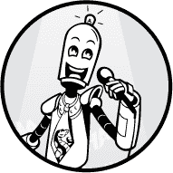

## 序言



通过这本书，我希望帮助你成为 Python 专家。为此，我们将专注于*Python 单行代码*：将有用的程序浓缩成一行 Python 代码。专注于单行代码将帮助你更快、更简洁地阅读和编写代码，并提高你对语言的理解。

还有五个理由，我认为学习 Python 单行代码将帮助你提高，并且值得学习。

第一，通过提升你的核心 Python 技能，你将能够克服许多制约你进步的小编程弱点。没有对基础的深刻理解，很难取得进展。单行代码是任何程序的基本构建块。理解这些基本构建块将帮助你掌握高级复杂性，而不会感到不知所措。

第二，你将学会如何利用广受欢迎的 Python 库，例如用于数据科学和机器学习的库。本书由五个单行代码章节组成，每一章涉及 Python 的不同领域，从正则表达式到机器学习。这种方法将给你一个关于可以构建的 Python 应用程序的概览，并教你如何使用这些强大的库。

第三，你将学会编写更 Pythonic 的代码。Python 初学者，尤其是那些来自其他编程语言的人，往往会以非 Pythonic 的方式编写代码。我们将介绍 Python 特有的概念，如列表推导式、多重赋值和切片，这些都将帮助你编写易于阅读且能够与其他开发者分享的代码。

第四，学习 Python 单行代码迫使你清晰而简洁地思考。当你让每个代码符号都发挥作用时，就没有空间进行冗长和不专注的编码。

第五，你新的单行代码技能将帮助你透过复杂的 Python 代码库，给朋友和面试官留下深刻印象。你也可能会发现用一行代码解决挑战性编程问题既有趣又令人满意。而且你并不孤单：一个充满活力的 Python 极客社区正在竞争解决各种实际（或不太实际）问题的最精简、最 Pythonic 的解决方案。

### **Python 单行代码示例**

本书的核心论点是，学习 Python 单行代码既是理解更高级代码库的基础，也是提升编程技能的绝佳工具。在理解一个拥有成千上万行代码的代码库之前，你必须理解一行代码的含义。

让我们快速看一下一个 Python 单行代码。不要担心如果你还没完全理解它。你将在第六章掌握这行代码。

```py
q = lambda l: q( ➊[x for x in l[1:] if x <= l[0]]) + [l[0]] + q([x for x in l if x > l[0]]) if l else []
```

这一行代码是压缩著名的快速排序算法的一种简洁优美的方式，尽管对许多 Python 初学者和中级开发者来说，其含义可能很难理解。

Python 的一行代码往往是相互衔接的，所以本书中的一行代码会逐步增加复杂性。在这本书中，我们将从简单的一行代码开始，逐步构建起更复杂的代码。例如，前面的快速排序一行代码既困难又长，它是基于更简单的列表推导式概念 ➊。下面是一个更简单的列表推导式，用来创建一个包含平方数的列表：

```py
lst  = [x**2 for x in range(10)]
```

我们可以将这一行代码拆解成更简单的一行代码，教会你 Python 的重要基础知识，比如变量赋值、数学运算符、数据结构、`for` 循环、成员运算符和 `range()` 函数——这些都在一行 Python 代码中完成！

请知道，*基础*并不意味着*琐碎*。我们要看的所有一行代码都是有用的，每一章都涉及计算机科学中的一个独立领域，给你一个广阔的视角，展示 Python 的强大功能。

### **关于可读性的说明**

*Python 之禅*包括了 19 条指导原则，针对 Python 编程语言。你可以通过在 Python shell 中输入`import this`来阅读它：

```py
>>> import this

The Zen of Python, by Tim Peters

Beautiful is better than ugly.

Explicit is better than implicit.

Simple is better than complex.

Complex is better than complicated.

Flat is better than nested.

Sparse is better than dense.

Readability counts.

--snip--
```

根据*Python 之禅*，“可读性很重要。”一行代码是解决问题的极简程序。在许多情况下，将一段代码重写成 Python 一行代码会提高可读性，并使代码更符合 Python 风格。一个例子是使用*列表推导式*将创建列表的过程压缩成一行代码。看下面的例子：

```py
# BEFORE

squares = []

for i in range(10):

    squares.append(i**2)

print(squares)

# [0, 1, 4, 9, 16, 25, 36, 49, 64, 81]
```

在这段代码中，我们需要五行代码来创建前 10 个平方数的列表并将其打印到 shell。然而，使用一行代码的解决方案要好得多，它能以更具可读性和更简洁的方式完成相同的任务：

```py
# AFTER

print([i**2 for i in range(10)])

# [0, 1, 4, 9, 16, 25, 36, 49, 64, 81]
```

输出结果是一样的，但这一行代码建立在更符合 Python 风格的列表推导式概念上。它更容易阅读，且更简洁。

然而，Python 的一行代码有时也难以理解。在某些情况下，写一个 Python 一行代码并不一定更具可读性。但正如国际象棋大师必须知道所有可能的棋步才能决定哪一步最优一样，你必须了解所有表达思路的方式，这样你才能决定最好的实现方式。追求*最美的*解决方案并非低优先级的问题；它是 Python 生态系统的核心。正如*Python 之禅*所教，“美胜于丑。”

### **这本书适合谁？**

你是一个初学到中级水平的 Python 编程者吗？像你身边的许多人一样，你可能在编程进展上遇到了一些瓶颈。这本书可以帮助你。你已经读了很多在线编程教程。你写过自己的源代码，并成功发布了一些小项目。你已经完成了基础编程课程，并阅读过一两本编程教材。也许你甚至完成了大学里的技术课程，学习了计算机科学和编程的基础知识。

也许你受限于某些信念，比如认为大多数程序员比你更快理解源代码，或者认为自己远没有达到程序员的前 10%。如果你想达到更高的编码水平并加入顶尖的编程专家行列，你需要学习新的实用技能。

我能理解，因为在我十年前开始学习计算机科学时，我也曾困惑于自己对编程一无所知。同时，似乎所有的同龄人都已经非常有经验并且熟练。

在本书中，我希望帮助你克服这些限制性信念，并推动你迈向 Python 大师的一步。

### **你将学到什么？**

这里是你将学到的内容概述。

**第一章：Python 复习** 介绍了 Python 的基础知识，帮助你刷新记忆。

**第二章：Python 技巧** 包含 10 个一行代码技巧，帮助你掌握基础内容，如列表推导式、文件输入、`lambda`函数、`map()`和`zip()`、`all()`量词、切片和基本的列表运算。你还将学习如何使用、操作和利用数据结构来解决日常问题。

**第三章：数据科学** 包含 10 个用于数据科学的一行代码，基于 NumPy 库构建。NumPy 是 Python 强大机器学习和数据科学能力的核心。你将学习 NumPy 的基础知识，如数组、形状、轴、类型、广播、高级索引、切片、排序、搜索、聚合和统计。

**第四章：机器学习** 涵盖了 10 个用于机器学习的简洁代码，使用 Python 的 scikit-learn 库。你将学习回归算法来预测值，诸如线性回归、K 近邻和神经网络等示例。你还将学习分类算法，如逻辑回归、决策树学习、支持向量机和随机森林。此外，你将学习如何计算多维数据数组的基本统计数据，以及用于无监督学习的 K 均值算法。这些算法和方法是机器学习领域最重要的算法之一。

**第五章：正则表达式** 包含 10 个一行代码，帮助你更好地使用正则表达式。你将学习各种基础的正则表达式，可以通过组合（和重新组合）来创建更复杂的正则表达式，使用分组和命名分组、负向前瞻、转义字符、空白字符、字符集（和否定字符集）、贪婪/非贪婪操作符。

**第六章：算法** 包含了 10 个单行算法，涉及广泛的计算机科学主题，包括字谜、回文、超集、排列、阶乘、素数、斐波那契数、混淆、搜索和算法排序。许多算法构成了更高级算法的基础，并包含了深入算法教育的种子。

**后记** 总结了本书，并将你释放到真实的世界中，带着你新获得的、更强的 Python 编程技能。

### **在线资源**

为了增强本书的训练材料，我添加了额外的资源，你可以在网上找到，链接地址是 [*https://pythononeliners.com/*](https://pythononeliners.com/) 或 [*http://www.nostarch.com/pythononeliners/*](http://www.nostarch.com/pythononeliners/)。这些互动资源包括以下内容：

**Python 备忘单** 你可以下载这些 Python 备忘单作为可打印的 PDF 文件，并将它们钉在墙上。备忘单包含了 Python 语言的核心特性，如果你仔细学习它们，你可以刷新你的 Python 技能，并确保填补任何知识空白。

**单行代码视频课程** 作为我的 Python 邮件课程的一部分，我录制了很多来自本书的 Python 单行代码课程，你可以免费访问。这些课程将帮助你学习，并提供多媒体学习体验。

**Python 谜题** 你可以访问在线资源来解决 Python 谜题，并使用*Finxter.com*应用免费测试和训练你的 Python 技能，随着你阅读本书，你还可以衡量自己的学习进度。

**代码文件和 Jupyter 笔记本** 你必须挽起袖子，开始动手编写代码，才能朝着 Python 精通的目标迈进。花点时间玩弄不同的参数值和输入数据。为了方便你，我已经将所有 Python 单行代码作为可执行代码文件添加进来。
