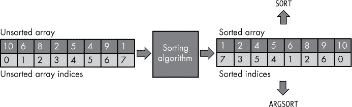
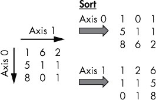
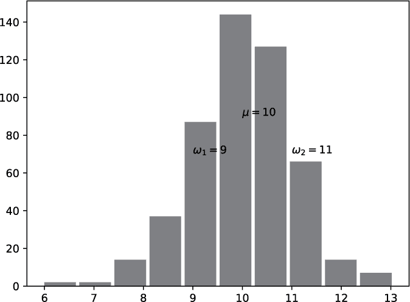

## 第三章：数据科学**


分析现实世界数据的能力是 21 世纪最受追捧的技能之一。在强大硬件能力、算法和无处不在的传感技术的帮助下，数据科学家从天气统计、金融交易、客户行为等大量原始数据中提取有意义的信息。如今世界上最大的公司——谷歌、Facebook、苹果和亚马逊——本质上是庞大的数据处理实体，数据是它们商业模式的核心。

本章将帮助你掌握使用 Python 的数值计算库*NumPy*来处理和分析数值数据的技能。我将给你提供 10 个实际问题，并解释如何用一行 NumPy 代码来解决它们。因为 NumPy 是许多高层数据科学和机器学习库（如 Pandas、scikit-learn 和 TensorFlow 等）的基础，仔细学习本章将提升你在数据驱动的现代经济中的市场竞争力。所以，请集中注意力！

### **基本的二维数组运算**

在这里，你将用一行代码解决一个日常的会计任务。我将介绍 NumPy 的一些基本功能，NumPy 是 Python 用于数值计算和数据科学的重要库。

#### ***基础知识***

NumPy 库的核心是*NumPy 数组*，它们存储你想要处理、分析和可视化的数据。许多更高级的数据科学库（如 Pandas）都建立在 NumPy 数组之上，或者隐式或显式地依赖于它。

NumPy 数组类似于 Python 列表，但具有一些额外的优点。首先，NumPy 数组占用更少的内存，并且在大多数情况下运行速度更快。其次，当访问多个维度时，NumPy 数组更加方便，这些数据被称为*多维*数据（多维列表难以访问和修改）。由于 NumPy 数组可以包含多个维度，我们通常从*维度*的角度来看待数组：具有两个轴的数组是二维数组。第三，NumPy 数组具有更强大的访问功能，例如广播（broadcasting），你将在本章中学习到更多相关内容。

清单 3-1 举例说明如何创建一维、二维和三维 NumPy 数组。

```py
import numpy as np

# Creating a 1D array from a list

a = np.array([1, 2, 3])

print(a)

"""

[1 2 3]

"""

# Creating a 2D array from a list of lists

b = np.array([[1, 2],

              [3, 4]])

print(b)

"""

[[1 2]

 [3 4]]

"""

# Creating a 3D array from a list of lists of lists

c = np.array([[[1, 2], [3, 4]],

              [[5, 6], [7, 8]]])

print(c)

"""

[[[1 2]

  [3 4]]

 [[5 6]

  [7 8]]]

"""
```

*清单 3-1：在 NumPy 中创建一维、二维和三维数组*

你首先通过使用该库的事实标准名称 `np` 将 NumPy 库导入到命名空间中。导入库后，你可以通过将一个标准的 Python 列表作为参数传递给 `np.array()` 函数来创建一个 NumPy 数组。一维数组对应于一个简单的数字值列表（事实上，NumPy 数组也可以包含其他数据类型，但我们在这里重点讨论数字）。二维数组对应于一个嵌套的 *列表的列表*，其中包含数字值。三维数组对应于一个嵌套的 *列表的列表的列表*，其中包含数字值。括号的开闭数量可以告诉你 NumPy 数组的维度。

NumPy 数组比内置的 Python 列表更强大。例如，你可以对两个 NumPy 数组进行基本的算术运算符 `+`、`-`、`*` 和 `/`。这些 *按元素操作* 将两个数组 `a` 和 `b`（例如，用 `+` 运算符将它们相加）按元素组合在一起，即将数组 `a` 中的每个元素与数组 `b` 中对应位置的元素进行组合。换句话说，按元素操作会聚合数组 `a` 和 `b` 中处于相同位置的两个元素。清单 3-2 展示了对二维数组进行基本算术操作的示例。

```py
import numpy as np

a = np.array([[1, 0, 0],

              [1, 1, 1],

              [2, 0, 0]])

b = np.array([[1, 1, 1],

              [1, 1, 2],

              [1, 1, 2]])

print(a + b)

"""

[[2 1 1]

 [2 2 3]

 [3 1 2]]

"""

print(a - b)

"""

[[ 0 -1 -1]

 [ 0  0 -1]

 [ 1 -1 -2]]

"""

print(a * b)

"""

[[1 0 0]

 [1 1 2]

 [2 0 0]]

"""

print(a / b)

"""

[[1.  0.  0\. ]

 [1.  1.  0.5]

 [2.  0.  0\. ]]

"""
```

*清单 3-2：基本算术数组操作*

**注意**

*当你将 NumPy 运算符应用于整数数组时，它们也会尽量生成整数数组作为结果。只有在使用除法运算符 *`a / b`* 对两个整数数组进行除法时，结果才会是浮动数组。通过小数点可以看出这一点：*`1.`*，*`0.`*，和 *`0.5`*。*

如果你仔细观察，你会发现每个操作都将两个对应的 NumPy 数组按元素进行组合。当对两个数组进行加法时，结果是一个新数组：每个新值是第一个和第二个数组中对应值的和。减法、乘法和除法也同样如此，如下所示。

NumPy 提供了更多用于操作数组的功能，包括 `np.max()` 函数，它计算 NumPy 数组中所有值的 *最大* 值。`np.min()` 函数计算 NumPy 数组中所有值的 *最小* 值。`np.average()` 函数计算 NumPy 数组中所有值的 *平均* 值。

清单 3-3 给出了这三种操作的示例。

```py
import numpy as np

a = np.array([[1, 0, 0],

              [1, 1, 1],

              [2, 0, 0]])

print(np.max(a))

## print(np.min(a))

## print(np.average(a))

# 0.6666666666666666
```

*清单 3-3：计算 NumPy 数组的最大值、最小值和平均值*

NumPy 数组中所有值的最大值是 2，最小值是 0，平均值是 (1 + 0 + 0 + 1 + 1 + 1 + 2 + 0 + 0) / 9 = 2/3。NumPy 还有许多更强大的工具，但这些已经足够解决以下问题：如何根据人们的年薪和税率，找到他们的最大税后收入？

#### ***代码***

让我们用 Alice、Bob 和 Tim 的薪资数据来解决这个问题。似乎在过去三年中，Bob 的薪水最高。但考虑到我们三位朋友的个人税率，他是否真的是拿到最多钱的人呢？看一下列表 3-4。

```py
## Dependencies

import numpy as np

## Data: yearly salary in ($1000) [2017, 2018, 2019]

alice = [99, 101, 103]

bob = [110, 108, 105]

tim = [90, 88, 85]

salaries = np.array([alice, bob, tim])

taxation = np.array([[0.2, 0.25, 0.22],

                     [0.4, 0.5, 0.5],

                     [0.1, 0.2, 0.1]])

## One-liner

max_income = np.max(salaries - salaries * taxation)

## Result

print(max_income)
```

*列表 3-4：使用基本数组运算的单行解决方案*

猜猜看：这段代码的输出是什么？

#### ***工作原理***

在导入 NumPy 库后，你将数据放入一个具有三行（每行代表一个人：Alice、Bob 和 Tim）和三列（每列代表一年：2017 年、2018 年和 2019 年）的二维 NumPy 数组中。你有两个二维数组：`salaries`保存每年的收入，`taxation`保存每个人和每年的税率。

为了计算税后收入，你需要从总收入中扣除税额（以美元为单位），而这些数据存储在`薪资`数组中。为此，你使用了重载的 NumPy 运算符`-`和`*`，它们对 NumPy 数组执行元素级的计算。

两个多维数组的元素级乘法叫做*Hadamard 积*。

列表 3-5 展示了从总收入中扣除税费后，NumPy 数组的样子。

```py
print(salaries - salaries * taxation)

"""

[[79.2  75.75 80.34]

 [66.   54.   52.5 ]

 [81.   70.4  76.5 ]]

"""
```

*列表 3-5：基本数组运算*

在这里，你可以看到 Bob 的高收入在支付了 40%和 50%的税率后显著减少，这在第二行中展示。

代码片段打印了这个结果数组的最大值。`np.max()`函数简单地找出数组中的最大值，并将其存储在`max_income`中。因此，最大值是 Tim 在 2017 年的$90,000 收入，他只需缴纳 10%的税——这段单行代码的结果是`81.`（再次说明，点表示浮动数据类型）。

你已经使用了 NumPy 的基本元素级数组运算来分析一组人的税率。现在让我们使用相同的示例数据集来应用 NumPy 的中级概念，如切片和广播。

### **使用 NumPy 数组：切片、广播和数组类型**

这个单行代码展示了三个有趣的 NumPy 特性的强大功能：切片、广播和数组类型。我们的数据是一个包含多种职业和薪资的数组。你将结合这三种概念，在每隔一年就将数据科学家的薪资提高 10%。

#### ***基础知识***

我们问题的核心是如何在具有多行的 NumPy 数组中更改特定的值。你想要更改单一行中的每隔一个值。让我们探索一下你需要了解的基础知识，才能解决这个问题。

##### **切片和索引**

NumPy 中的索引和切片与 Python 中的索引和切片类似（参见第二章）：你可以使用括号操作`[]`来指定索引或索引范围，从而访问一维数组的元素。例如，索引操作`x[3]`返回 NumPy 数组`x`的第四个元素（因为第一个元素的索引是 0）。

你也可以通过为每个维度独立指定索引，并使用逗号分隔的索引来访问不同的维度，从而对多维数组进行索引。例如，索引操作`y[0,1,2]`将访问第一个轴的第一个元素，第二个轴的第二个元素，以及第三个轴的第三个元素。请注意，这种语法对于多维 Python 列表是无效的。

接下来，我们将介绍 NumPy 中的*切片*。研究清单 3-6 中的示例，掌握 NumPy 中的一维切片，如果在理解这些示例时遇到困难，可以随时回顾第二章中的基本 Python 切片知识。

```py
import numpy as np

a = np.array([55, 56, 57, 58, 59, 60, 61])

print(a)

# [55 56 57 58 59 60 61]

print(a[:])

# [55 56 57 58 59 60 61]

print(a[2:])

# [57 58 59 60 61]

print(a[1:4]) 

# [56 57 58]

print(a[2:-2])

# [57 58 59]

print(a[::2])

# [55 57 59 61]

print(a[1::2])

# [56 58 60]

print(a[::-1])

# [61 60 59 58 57 56 55]

print(a[:1:-2])

# [61 59 57]

print(a[-1:1:-2])

# [61 59 57]
```

*清单 3-6：一维切片示例*

下一步是彻底理解多维切片。与索引类似，你分别对每个轴应用一维切片（以逗号分隔）来选择该轴上元素的范围。花些时间彻底理解清单 3-7 中的示例。

```py
import numpy as np

a = np.array([[0, 1, 2, 3],

              [4, 5, 6, 7],

              [8, 9, 10, 11],

              [12, 13, 14, 15]])

print(a[:, 2])

# Third col: [ 2  6 10 14]

print(a[1, :])

# Second row: [4 5 6 7]

print(a[1, ::2])

# Second row, every other element: [4 6]

print(a[:, :-1])

# All columns except last:

# [[ 0  1  2]

# [ 4  5  6]

# [ 8  9 10]

# [12 13 14]]

print(a[:-2])

# Same as a[:-2, :]

# [[ 0  1  2  3]

# [ 4  5  6  7]]
```

*清单 3-7：多维切片示例*

研究清单 3-7，直到你理解多维切片。你可以通过使用语法`a[`*`slice1`*`,` *`slice2`*`]`来执行二维切片。对于任何额外的维度，添加逗号分隔的切片操作（使用`start:stop`或`start:stop:step`切片操作符）。每个切片选择其各自维度中元素的独立子序列。如果你理解了这个基本概念，从一维切片到多维切片就变得非常简单。

##### **广播**

*广播*描述了将两个 NumPy 数组自动转换为相同形状的过程，从而可以应用某些按元素操作（参见“切片与索引”第 46 页）。广播与 NumPy 数组的*形状属性*密切相关，而形状属性又与轴的概念紧密相关。因此，接下来让我们深入探讨轴、形状和广播。

每个数组包含多个*轴*，每个维度对应一个轴（清单 3-8）。

```py
import numpy as np

a = np.array([1, 2, 3, 4])

print(a.ndim)

## b = np.array([[2, 1, 2], [3, 2, 3], [4, 3, 4]])

print(b.ndim)

## c = np.array([[[1, 2, 3], [2, 3, 4], [3, 4, 5]],

              [[1, 2, 4], [2, 3, 5], [3, 4, 6]]])

print(c.ndim)

# 3
```

*清单 3-8：三个 NumPy 数组的轴和维度*

这里，你可以看到三个数组：`a`、`b` 和 `c`。数组的属性 `ndim` 存储这个特定数组的轴数。你只需为每个数组打印它。数组 `a` 是一维的，数组 `b` 是二维的，数组 `c` 是三维的。每个数组都有一个相关的形状属性，它是一个元组，表示每个轴上元素的数量。对于二维数组，元组中有两个值：行数和列数。对于高维数组，*i* 第个元组值指定第 *i* 轴上元素的数量。因此，元组中的元素个数就是 NumPy 数组的维度。

**注意**

*如果你增加数组的维度（例如，从二维数组转为三维数组），新的轴将成为轴 0，而低维数组的第* i *个轴将成为高维数组的第（*i* + 1）个轴。*

清单 3-9 给出了与 清单 3-8 中相同数组的形状属性。

```py
import numpy as np

a = np.array([1, 2, 3, 4])

print(a)

"""

[1 2 3 4]

"""

print(a.shape)

# (4,)

b = np.array([[2, 1, 2], [3, 2, 3], [4, 3, 4]])

print(b)

"""

[[2 1 2]

 [3 2 3]

 [4 3 4]]

"""

print(b.shape)

# (3, 3)

c = np.array([[[1, 2, 3], [2, 3, 4], [3, 4, 5]],

              [[1, 2, 4], [2, 3, 5], [3, 4, 6]]])

print(c)

"""

[[[1 2 3]

  [2 3 4]

  [3 4 5]]

 [[1 2 4]

  [2 3 5]

  [3 4 6]]]

"""

print(c.shape)

# (2, 3, 3)
```

*清单 3-9：1D、2D 和 3D NumPy 数组的形状属性*

在这里，你可以看到 `shape` 属性包含的信息比 `ndim` 属性多得多。每个 `shape` 属性都是一个元组，表示每个轴上元素的数量：

+   数组 `a` 是一维的，因此 `shape` 元组只有一个元素，表示列数（四个元素）。

+   数组 `b` 是二维的，因此 `shape` 元组有两个元素，分别列出行数和列数。

+   数组 `c` 是三维的，因此 `shape` 元组包含三个元素——每个轴一个元素。轴 0 有两个元素（每个元素是一个二维数组），轴 1 有三个元素（每个是一个一维数组），轴 2 有三个元素（每个是一个整数值）。

现在你理解了 `shape` 属性，理解广播的基本概念会更容易：通过重新排列数据，将两个数组转换为相同的形状。我们来看一下广播是如何工作的。广播自动修正形状不同的 NumPy 数组之间的逐元素操作。例如，乘法运算符 `*` 通常在应用于 NumPy 数组时执行逐元素乘法。但如果左右数据不匹配会发生什么呢（比如，左边的操作数是一个 NumPy 数组，而右边是一个浮点值）？在这种情况下，NumPy 会自动从右侧数据创建一个新数组。这个新数组的大小和维度与左边的数组相同，且包含相同的浮点值。

因此，广播是将低维数组转换为高维数组以执行逐元素操作的过程。

##### **同质值**

NumPy 数组是 *同质的*，这意味着所有的值都有相同的类型。以下是可能的数组数据类型的非详尽列表：

**`bool`** Python 中的布尔数据类型（1 字节）

**`int`** Python 中的整数数据类型（默认大小：4 或 8 字节）

**`float`** Python 中的浮点数据类型（默认大小：8 字节）

**`complex`** Python 中的复数数据类型（默认大小：16 字节）

**`np.int8`** 一个整数数据类型（1 字节）

**`np.int16`** 一个整数数据类型（2 字节）

**`np.int32`** 一个整数数据类型（4 字节）

**`np.int64`** 一个整数数据类型（8 字节）

**`np.float16`** 一个浮点数据类型（2 字节）

**`np.float32`** 一个浮点数据类型（4 字节）

**`np.float64`** 一个浮点数据类型（8 字节）

清单 3-10 展示了如何创建具有不同类型的 NumPy 数组。

```py
import numpy as np

a = np.array([1, 2, 3, 4], dtype=np.int16)

print(a) # [1 2 3 4]

print(a.dtype) # int16

b = np.array([1, 2, 3, 4], dtype=np.float64)

print(b) # [1\. 2\. 3\. 4.]

print(b.dtype) # float64
```

*清单 3-10：具有不同类型的 NumPy 数组*

这段代码有两个数组，`a` 和 `b`。第一个数组 `a` 的数据类型是 `np.int16`。这些数字是整数类型（数字后面没有“点”）。具体来说，当打印数组 `a` 的 `dtype` 属性时，你会得到 `int16` 结果。

第二个数组 `b` 的数据类型是 `float64`。所以，即使你基于一个整数列表创建数组，NumPy 也会将数组类型转换为 `np.float64`。

这里有两个重要的要点：NumPy 让你控制数据类型，并且 NumPy 数组的数据类型是同质的。

#### ***代码***

你有多个职业的数据，并且你希望每隔一年仅增加数据科学家的薪水 10%。清单 3-11 展示了代码。

```py
## Dependencies

import numpy as np

## Data: yearly salary in ($1000) [2025, 2026, 2027]

dataScientist =     [130, 132, 137]

productManager =    [127, 140, 145]

designer =          [118, 118, 127]

softwareEngineer =  [129, 131, 137]

employees = np.array([dataScientist,

                      productManager,

                      designer,

                      softwareEngineer])

## One-liner

employees[0,::2] = employees[0,::2] * 1.1

## Result

print(employees)
```

*清单 3-11：使用切片和切片赋值的单行解决方案*

花点时间思考一下这段代码片段的输出。你预期会有什么变化？结果数组的数据类型是什么？这段代码的输出是什么？

#### ***原理***

这段代码将你放在 2024 年。首先，你创建了一个 NumPy 数组，每一行代表一个专业人员（数据科学家、产品经理、设计师或软件工程师）的预期年薪。每一列对应未来几年的薪水，分别是 2025、2026 和 2027 年。最终的 NumPy 数组有四行三列。

你有资金可以加强公司中最重要的专业人才。你相信数据科学的未来，所以你决定奖励公司中那些隐藏的英雄：数据科学家。你需要更新 NumPy 数组，使得从 2025 年起，每隔一年数据科学家的薪资增加 10%（非累积），并且是从 2025 年开始。

你开发了以下这个漂亮的单行代码：

```py
employees[0,::2] = employees[0,::2] * 1.1
```

它看起来简单且简洁，提供以下输出：

```py
[[143 132 150]

 [127 140 145]

 [118 118 127]

 [129 131 137]]
```

尽管很简单，你的单行代码包含了三个有趣且高级的概念。

##### **切片**

首先，你使用了*切片*和*切片赋值*的概念。在这个例子中，你通过切片获取了 NumPy 数组`employees`第一行的每隔一个值。然后，进行一些修改，通过切片赋值更新第一行的每隔一个值。切片赋值使用与切片相同的语法，但有一个关键区别：你选择赋值操作左边的切片。这些元素将被赋值操作右边指定的元素所替换。在代码片段中，你用更新后的薪资数据替换了 NumPy 数组中第一行的内容。

##### **广播**

第二，你使用了广播，它会自动调整不同形状的 NumPy 数组之间的逐元素操作。在这一行代码中，左侧操作符是一个 NumPy 数组，而右侧是一个浮动值。同样，NumPy 会自动创建一个新数组，使其与左侧数组的大小和维度相同，并在概念上填充该数组为浮动值的副本。实际上，NumPy 会执行的计算更像如下：

```py
np.array([130 137]) * np.array([1.1, 1.1])
```

##### **数组类型**

第三，你可能已经意识到，结果数据类型不是浮动类型，而是整数类型，即使你正在执行浮点运算。当你创建数组时，NumPy 发现它只包含整数值，因此认为它是一个整数数组。你对整数数组进行的任何操作都不会改变数据类型，NumPy 会将值四舍五入为整数。同样，你可以通过使用`dtype`属性来访问数组的类型：

```py
print(employees.dtype)

# int32

employees[0,::2] = employees[0,::2] * 1.1

print(employees.dtype)

# int32
```

总结一下，你已经学习了切片、切片赋值、广播和 NumPy 数组类型——在一行代码中取得了相当大的成就。接下来，我们将基于这个知识，通过解决一个具有现实世界影响的小型数据科学问题来进一步探讨：检测各个城市污染测量中的异常值。

### **条件数组搜索、筛选和广播以检测异常值**

在这一行代码中，你将探讨各个城市的空气质量数据。具体而言，给定一个二维的 NumPy 数组，其中包含多个城市（行）的污染测量值（列），你将找出那些污染测量值超过平均水平的城市。通过阅读本节，你将掌握在数据集中查找异常值的重要技巧。

#### ***基础概念***

空气质量指数（AQI）衡量对健康的不良影响风险，通常用于比较城市空气质量的差异。在这一行代码中，你将查看四个城市的 AQI：香港、纽约、柏林和蒙特利尔。

这一行代码找出污染超过平均水平的城市，定义为那些其峰值 AQI 超过所有城市所有测量值的总体平均值的城市。

我们解决方案的一个重要部分将是找出满足特定条件的 NumPy 数组中的元素。这是数据科学中非常常见的问题，你将经常使用它。

那么，让我们来探讨一下如何找到满足特定条件的数组元素。NumPy 提供了一个函数`nonzero()`，用于查找数组中不等于零的元素的索引。示例 3-12 给出了一个例子。

```py
import numpy as np

X = np.array([[1, 0, 0],

              [0, 2, 2],

              [3, 0, 0]])

print(np.nonzero(X))
```

*示例 3-12：非零函数*

结果是一个包含两个 NumPy 数组的元组：

```py
(array([0, 1, 1, 2], dtype=int64), array([0, 1, 2, 0], dtype=int64)).
```

第一个数组给出了行索引，第二个数组给出了非零元素的列索引。在这个二维数组中有四个非零元素：1、2、2 和 3，分别位于原数组中的`X[0,0]`、`X[1,1]`、`X[1,2]`和`X[2,0]`位置。

那么，如何使用`nonzero()`来查找数组中满足某个条件的元素呢？你将使用 NumPy 的另一个强大功能：结合广播的布尔数组操作（参见示例 3-13）！

```py
import numpy as np

X = np.array([[1, 0, 0],

              [0, 2, 2],

              [3, 0, 0]])

print(X == 2)

"""

[[False False False]

 [False  True  True]

 [False False False]]

"""
```

*示例 3-13：在 NumPy 中使用广播和逐元素布尔操作符*

广播发生时，整数值`2`会被复制（在概念上）到一个具有与原数组相同形状的新数组中。然后，NumPy 对每个整数与值`2`进行逐元素比较，并返回结果布尔数组。

在我们的主代码中，你将结合`nonzero()`函数和布尔数组操作来查找满足特定条件的元素。

#### ***代码***

在示例 3-14 中，你正在从一组数据中找到具有高于平均值的污染峰值的城市。

```py
## Dependencies

import numpy as np

## Data: air quality index AQI data (row = city)

X = np.array(

    [[ 42, 40, 41, 43, 44, 43 ], # Hong Kong

     [ 30, 31, 29, 29, 29, 30 ], # New York

     [ 8, 13, 31, 11, 11, 9 ], # Berlin

     [ 11, 11, 12, 13, 11, 12 ]]) # Montreal

cities = np.array(["Hong Kong", "New York", "Berlin", "Montreal"])

## One-liner

polluted = set(cities[np.nonzero(X > np.average(X))[0]])

## Result

print(polluted)
```

*示例 3-14：使用广播、布尔操作符和选择性索引的一行解决方案*

看看你能否判断出这段代码的输出是什么。

#### ***工作原理***

数据数组`X`包含四行（每行对应一个城市）和六列（每列对应一个测量单位——在本例中是天数）。字符串数组`cities`包含四个城市的名称，按数据数组中出现的顺序排列。

这是一个一行代码，用于查找具有高于平均值的 AQI 值的城市：

```py
## One-liner

polluted = set(cities[np.nonzero(X > np.average(X))[0]])
```

你需要先理解各个部分，才能理解整体。为了更好地理解这行代码，让我们从内部开始逐步分析。该一行代码的核心是布尔数组操作（参见示例 3-15）。

```py
print(X > np.average(X))

"""

[[ True  True  True  True  True  True]

 [ True  True  True  True  True  True]

 [False False  True False False False]

 [False False False False False False]]

"""
```

*示例 3-15：使用广播的布尔数组操作*

你使用布尔表达式通过广播将两个操作数调整为相同的形状。然后使用`np.average()`函数计算所有 NumPy 数组元素的平均 AQI 值。布尔表达式随后执行逐元素比较，生成一个布尔数组，如果相应的测量值是高于平均的 AQI 值，则该位置为`True`。

通过生成这个布尔数组，你可以精确知道哪些元素满足高于平均值的条件，哪些元素不满足。

记得 Python 中的`True`值由整数`1`表示，而`False`值由`0`表示。事实上，`True`和`False`对象是`bool`类型，它是`int`的子类。因此，每个布尔值也是一个整数值。有了这个，你可以使用`nonzero()`函数找到满足条件的所有行和列索引，如下所示：

```py
print(np.nonzero(X > np.average(X)))

"""

(array([0, 0, 0, 0, 0, 0, 1, 1, 1, 1, 1, 1, 2], dtype=int64),

array([0, 1, 2, 3, 4, 5, 0, 1, 2, 3, 4, 5, 2], dtype=int64))

"""
```

你有两个元组，第一个给出非零元素的行索引，第二个给出它们各自的列索引。

我们只关心那些空气质量指数（AQI）值高于平均值的城市名字，而不关心其他内容，所以你只需要行索引。你可以使用这些行索引通过*高级索引*从字符串数组中提取城市名字，*高级索引*是一种允许你定义一系列数组索引的索引技巧，无需它是连续的切片。这样，你可以通过指定整数序列（要选择的索引）或布尔序列（选择布尔值为`True`的特定索引）来访问给定 NumPy 数组中的任意元素：

```py
print(cities[np.nonzero(X > np.average(X))[0]])

"""

['Hong Kong' 'Hong Kong' 'Hong Kong' 'Hong Kong' 'Hong Kong' 'Hong Kong'

 'New York' 'New York' 'New York' 'New York' 'New York' 'New York'

 'Berlin']

"""
```

你会注意到在生成的字符串序列中有很多重复项，因为香港和纽约有多个 AQI 高于平均值的测量数据。

现在，只剩下一件事要做：去除重复项。你可以通过将序列转换为 Python 集合来完成这项工作，集合默认是去重的，这样可以简洁地总结所有污染超过平均 AQI 值的城市名称。

**练习 3-1**

回到《基本二维数组运算》中的税务示例，参见第 42 页，并通过使用选择性布尔索引的思路从矩阵中提取薪资最高的人的名字。问题回顾：在给定一组人的年薪和税率的情况下，我们如何找到税后收入最高的人？

总结一下，你学习了如何在 NumPy 数组上使用布尔表达式（再次使用广播）和`nonzero()`函数来查找满足特定条件的行或列。在通过这行代码保存环境后，我们继续分析社交媒体中的网红。

### **布尔索引过滤二维数组**

在这里，你将通过从一个小数据集中提取 Instagram 用户（粉丝数超过 1 亿）来巩固你的数组索引和广播知识。具体来说，给定一个二维的网红数组（行），第一列定义了网红的名字（字符串），第二列定义了网红的粉丝数，你将找出所有粉丝数超过 1 亿的网红名字！

#### ***基础知识***

NumPy 数组通过增加多维切片和多维索引等额外功能，丰富了基本的列表数据类型。看看代码清单 3-16 中的代码片段。

```py
import numpy as np

a = np.array([[1, 2, 3],

              [4, 5, 6],

              [7, 8, 9]])

indices = np.array([[False, False, True],

                    [False, False, False],

                    [True, True, False]])

print(a[indices])

# [3 7 8]
```

*代码清单 3-16：NumPy 中的选择性（布尔）索引*

你创建了两个数组：`a` 包含二维数值数据（可以将其视为 *数据数组*），`indices` 包含布尔值（可以将其视为 *索引数组*）。NumPy 的一个伟大特性是，你可以使用布尔数组对数据数组进行细粒度访问。简单来说，你创建一个新数组，其中仅包含那些在索引数组 `indices` 中对应位置为 `True` 的数据数组 `a` 元素。例如，如果 `indices[i,j] == True`，则新数组包含 `a[i,j]` 的值。类似地，如果 `indices[i,j] == False`，新数组则不包含 `a[i,j]` 的值。这样，结果数组包含三个值：`3`、`7` 和 `8`。

在接下来的这行代码中，你将使用这个特性对社交网络进行简单分析。

#### ***代码***

在列表 3-17 中，你可以找到粉丝超过 1 亿的 Instagram 超级明星的名字！

```py
## Dependencies

import numpy as np

## Data: popular Instagram accounts (millions followers)

inst = np.array([[232, "@instagram"],

                 [133, "@selenagomez"],

                 [59,  "@victoriassecret"],

                 [120, "@cristiano"],

                 [111, "@beyonce"],

                 [76,  "@nike"]])

## One-liner

superstars = inst[inst[:,0].astype(float) > 100, 1]

## Results

print(superstars)
```

*列表 3-17：使用切片、数组类型和布尔运算符的单行解决方案*

像往常一样，在阅读解释之前，看看你是否能在脑海中计算出这个单行代码的结果。

#### ***原理***

数据由一个二维数组 `inst` 组成，每一行代表一位 Instagram 网红。第一列表示他们的粉丝数（以百万为单位），第二列表示他们的 Instagram 名称。根据这些数据，你想提取粉丝超过 1 亿的 Instagram 网红的名字。

解决这个问题的方式有很多种，一行代码的最简单方法如下：

```py
## One-liner

superstars = inst[inst[:,0].astype(float) > 100, 1]
```

让我们一步步分解这行代码。内部表达式计算出一个布尔值，表示每位网红的粉丝数是否超过 1 亿：

```py
print(inst[:,0].astype(float) > 100)

# [ True  True False  True  True False]
```

第一列包含粉丝数，因此你使用切片来访问这些数据；`inst[:,0]` 返回所有行的第一列。但是，由于数据数组包含混合数据类型（整数和字符串），NumPy 会自动将数组的类型设置为非数值类型。原因是数值类型无法表示字符串数据，所以 NumPy 将数据转换为可以表示数组中所有数据（字符串和数值）的类型。你需要对数据数组的第一列执行数值比较，检查每个值是否大于 100，因此你首先通过 `.astype(float)` 将结果数组转换为浮点类型。

接下来，你检查浮点类型的 NumPy 数组中的值是否都大于整数值 100。这里，NumPy 再次使用广播机制自动将两个操作数转换为相同的形状，从而可以逐元素地进行比较。结果是一个布尔值数组，显示出四位网红的粉丝超过 1 亿。

现在，你可以使用这个布尔数组（也叫做 *掩码索引数组*）通过布尔索引来选择粉丝超过 1 亿的网红（即选择行）：

```py
inst[inst[:,0].astype(float) > 100, 1]
```

由于你只对这些影响者的名字感兴趣，你选择第二列作为最终结果，并将其存储在`superstars`变量中。

我们数据集中拥有超过 1 亿 Instagram 粉丝的影响者如下：

```py
# ['@instagram' '@selenagomez' '@cristiano' '@beyonce']
```

总结来说，你已经将 NumPy 的概念（如切片、广播、布尔索引和数据类型转换）应用于一个小型的数据科学问题，这个问题来自社交媒体分析。接下来，你将学习物联网中的新应用场景。

### **广播、切片赋值和重塑以清理每个 i-th 数组元素**

现实世界中的数据很少是干净的，可能由于多种原因（包括损坏或故障的传感器）而包含错误或缺失值。在这一部分，你将学习如何处理一些小的清理任务，以消除错误的数据点。

#### ***基础知识***

假设你在花园里安装了一个温度传感器，用来测量几周的温度数据。每个星期天，你都会把温度传感器从花园里带进屋内，以数字化传感器的值。你知道，星期天的传感器值是有问题的，因为在一天的部分时间里，它们测量的是你家里的温度，而不是外面的温度。

你想通过将每个星期天的传感器值替换为过去七天的平均传感器值来清理数据（你将星期天的值包含在平均计算中，因为它并不是完全错误的）。在开始编写代码之前，我们先探讨一下你需要作为基本理解的最重要概念。

##### **切片赋值**

使用 NumPy 的切片赋值功能（参见“使用 NumPy 数组：切片、广播和数组类型”第 46 页），你在等式的左侧指定你想要替换的值，在等式的右侧指定替换这些值的内容。代码清单 3-18 提供了一个例子，以防你需要简单的回顾。

```py
import numpy as np

a = np.array([4] * 16)

print(a)

# [4 4 4 4 4 4 4 4 4 4 4 4 4 4 4 4]

a[1::] = [42] * 15

print(a)

# [ 4 42 42 42 42 42 42 42 42 42 42 42 42 42 42 42]
```

*代码清单 3-18：简单的 Python 列表创建和切片赋值*

这个代码片段创建了一个包含值`4`的数组，重复了 16 次。你使用切片赋值将最后 15 个值替换为值`42`。回想一下，`a[start:stop:step]`这种写法选择了从索引`start`开始，直到索引`stop`结束（不包括`stop`），并且只考虑每个`step`的元素。如果没有指定参数，NumPy 会假定默认值。`a[1::]`表示替换所有序列元素，除了第一个。代码清单 3-19 展示了如何将切片赋值与一个你已经多次见过的功能结合使用。

```py
import numpy as np

a = np.array([4] * 16)

a[1:8:2] = 16

print(a)

# [ 4 16  4 16  4 16  4 16  4  4  4  4  4  4  4  4]
```

*代码清单 3-19：NumPy 中的切片赋值*

在这里，你将替换索引 1 到 8 之间（不包括 8）的每隔一个值。你可以看到，只需要指定一个单一的值`16`，就能替换选定的元素，因为——你猜对了——*广播*！等式右侧的内容会自动转换为一个与左侧数组形状相同的 NumPy 数组。

##### **重塑**

在深入了解单行代码之前，你需要学习一个重要的 NumPy 函数：`x.reshape((a,b))`，它将 NumPy 数组 `x` 转换为一个具有 `a` 行和 `b` 列的新数组（形状为 `(a,b)`）。以下是一个示例：

```py
a = np.array([1, 2, 3, 4, 5, 6])

print(a.reshape((2, 3)))

'''

[[1 2 3]

 [4 5 6]]

'''
```

如果列数是明确的，你也可以让 NumPy 自动计算列数。假设你想将一个包含六个元素的数组重新形状为一个具有两行的二维数组。NumPy 现在能够自动计算出需要三列，以匹配原始数组中的六个元素。下面是一个示例：

```py
a = np.array([1, 2, 3, 4, 5, 6])

print(a.reshape((2, -1)))

'''

[[1 2 3]

 [4 5 6]]

'''
```

列参数的形状值 `-1` 表示 NumPy 应该将其替换为正确的列数（在本例中是三列）。

##### **轴参数**

最后，让我们考虑下面的代码片段，它引入了 `axis` 参数。这里有一个数组 `solar_x`，包含了埃隆·马斯克的 SolarX 公司每天的股价。我们想计算早晨、中午和晚上的平均股价。我们该如何实现呢？

```py
import numpy as np

# daily stock prices

# [morning, midday, evening]

solar_x = np.array(

    [[1, 2, 3], # today

     [2, 2, 5]]) # yesterday

# midday - weighted average

print(np.average(solar_x, axis=0))

# [1.5 2.  4\. ]
```

数组 `solar_x` 包含 SolarX 公司的股价。它有两行（每天一行）和三列（每列一个股价）。假设我们想计算早晨、中午和晚上的平均股价。大致来说，我们想将每列中的所有值通过平均值合并。换句话说，我们沿着轴 0 计算平均值。这正是关键字参数 `axis=0` 的作用。

#### ***代码***

这是你解决下列问题所需的所有知识（示例 3-20）：给定一个温度值数组，如何将每第七个温度值替换为过去七天的平均值（包括第七天的温度值）。

```py
## Dependencies

import numpy as np

## Sensor data (Mo, Tu, We, Th, Fr, Sa, Su)

tmp = np.array([1, 2, 3, 4, 3, 4, 4,

                5, 3, 3, 4, 3, 4, 6,

                6, 5, 5, 5, 4, 5, 5])

## One-liner

tmp[6::7] = np.average(tmp.reshape((-1,7)), axis=1)

## Result

print(tmp)
```

*示例 3-20：使用平均值和重塑操作符、切片赋值以及轴参数的单行解决方案*

你能计算出这段代码的输出吗？

#### ***它是如何工作的***

数据以一维数组的形式到达，包含传感器值。

首先，你创建一个数据数组 `tmp`，它是一个一维的传感器值序列。在每一行中，你定义了七天的传感器值。

第二，你使用切片赋值来替换这个数组中的所有星期天的值。由于星期天是第七天，你使用表达式 `tmp[6::7]` 来选择相应的星期天值，从原始数组 `tmp` 的第七个元素开始。

第三步，我们将一维传感器数组重新调整为一个具有七列三行的二维数组，这样可以更方便地计算每周的平均温度值来替换周日的数据。由于重塑，现在可以将每一行的七个值合并为一个平均值。要重塑数组，你将元组值`-1`和`7`传递给`tmp.reshape()`，这告诉 NumPy 自动选择行数（*轴 0*）。大致来说，你指定了七列，NumPy 会根据需要创建足够的行数，以满足七列的条件。在我们的例子中，重塑后得到如下数组：

```py
print(tmp.reshape((-1,7)))

"""

[[1 2 3 4 3 4 4]

 [5 3 3 4 3 4 6]

 [6 5 5 5 4 5 5]]

"""
```

每一行代表一周，每一列代表一个工作日。

现在，你通过使用带有轴参数的`np.average()`函数计算七天的平均值：`axis=1`告诉 NumPy 将第二个轴压缩为一个单一的平均值。注意，周日的值已包含在平均值的计算中（参见本节开头的问题描述）。这是方程右侧的结果：

```py
print(np.average(tmp.reshape((-1,7)), axis=1))

# [3\. 4\. 5.]
```

这一行代码的目标是替换三项周日的温度值。其他所有值应该保持不变。让我们看看你是否达成了这个目标。在替换完所有周日的传感器值后，你将得到以下一行代码的最终结果：

```py
# [1 2 3 4 3 4 3 5 3 3 4 3 4 4 6 5 5 5 4 5 5]
```

注意，你仍然拥有一个一维的 NumPy 数组，里面存有所有的温度传感器值。但现在，你已经用更具代表性的读数替换了那些不代表性的数据。

总结来说，这行代码主要是要理解数组形状和重塑的概念，以及如何使用`axis`属性来进行聚合函数，如`np.average()`。虽然这个应用比较具体，但它在很多场景中都会有所帮助。接下来，你将学习一个超级通用的概念：在 NumPy 中排序。

### **何时使用 sort() 函数以及何时使用 argsort() 函数**

排序在许多情况下都是有用的，甚至是必不可少的。比如你在书架上搜索*Python 单行代码*。如果你的书架按字母顺序排列，找书会更加轻松。

这个一行代码的解决方案将展示如何通过 NumPy 在一行 Python 代码中实现排序。

#### ***基础知识***

排序是更高级应用的核心，比如商业计算、操作系统中的进程调度（优先级队列）和搜索算法。幸运的是，NumPy 提供了多种排序算法。默认的排序算法是流行的*快速排序*算法。在第六章中，你将学习如何实现快速排序算法。然而，对于这一行代码，你将采取更高层次的方法，将排序函数视为一个黑盒，你只需要将 NumPy 数组输入，得到一个排序后的 NumPy 数组。

图 3-1 展示了将一个未排序的数组转换为排序数组的算法。这是 NumPy 的 `sort()` 函数的目的。



*图 3-1：`sort()`与`argsort()`函数的区别*

但通常，获取将未排序数组转换为排序数组的索引数组也是很重要的。例如，未排序数组元素 1 的索引是 `7`。因为数组元素 1 是排序数组中的第一个元素，所以它的索引 `7` 是排序索引数组中的第一个元素。这就是 NumPy 的 `argsort()` 函数的作用：它在排序后创建一个新的原始索引数组（见 图 3-1 中的示例）。粗略来说，这些索引将排序原始数组中的元素。通过使用这个数组，你可以重建排序后的数组和原始数组。

列表 3-21 展示了如何在 NumPy 中使用 `sort()` 和 `argsort()`。

```py
import numpy as np

a = np.array([10, 6, 8, 2, 5, 4, 9, 1])

print(np.sort(a))

# [ 1  2  4  5  6  8  9 10]

print(np.argsort(a))

# [7 3 5 4 1 2 6 0]
```

*列表 3-21：NumPy 中的 `sort()` 和 `argsort()` 函数*

你创建一个未排序的数组 `a`，用 `np.sort(a)` 对其进行排序，并用 `np.argsort(a)` 获取排序后的原始索引。NumPy 的 `sort()` 函数与 Python 的 `sorted()` 函数不同，它也可以对多维数组进行排序！

图 3-2 展示了排序二维数组的两种方式。



*图 3-2：沿一个轴进行排序*

数组有两个轴：轴 0（行）和轴 1（列）。你可以沿轴 0 排序，称为*垂直排序*，或者沿轴 1 排序，称为*水平排序*。通常，`axis` 关键字定义了你进行 NumPy 操作的方向。列表 3-22 展示了如何技术性地实现这一点。

```py
import numpy as np

a = np.array([[1, 6, 2],

              [5, 1, 1],

              [8, 0, 1]])

print(np.sort(a, axis=0))

"""

[[1 0 1]

 [5 1 1]

 [8 6 2]]

"""

print(np.sort(a, axis=1))

"""

[[1 2 6]

 [1 1 5]

 [0 1 8]]

"""
```

*列表 3-22：沿一个轴进行排序*

可选的 `axis` 参数帮助你沿固定方向对 NumPy 数组进行排序。首先，你按列排序，从最小值开始。然后按行排序。这是 NumPy 的 `sort()` 函数相比于 Python 内建的 `sorted()` 函数的主要优势。

#### ***代码***

这个单行代码将找到 SAT 成绩最高的前三个学生的名字。注意，你要求的是学生的名字，而不是排序后的 SAT 成绩。看看数据，看看你是否能自己找到这个单行解决方案。尝试一下后，看看 列表 3-23。

```py
## Dependencies

import numpy as np

## Data: SAT scores for different students

sat_scores = np.array([1100, 1256, 1543, 1043, 989, 1412, 1343])

students = np.array(["John", "Bob", "Alice", "Joe", "Jane", "Frank", "Carl"])

## One-liner

top_3 = students[np.argsort(sat_scores)][:-4:-1]

## Result

print(top_3)
```

*列表 3-23：使用`argsort()`函数和带负步长切片的单行解决方案*

和往常一样，尝试推测输出结果。

#### ***工作原理***

我们的初始数据由学生的 SAT 成绩组成，作为一个一维数据数组，另有一个对应学生姓名的数组。例如，John 获得了稳健的 1100 分 SAT 成绩，而 Frank 获得了优异的 1412 分。

任务是找到三位最成功学生的姓名。你将通过运行`argsort()`函数，获取一个包含原始索引的新排序位置的数组，而不是仅仅排序 SAT 分数。

下面是`argsort()`函数在 SAT 分数上的输出：

```py
print(np.argsort(sat_scores))

# [4 3 0 1 6 5 2]
```

你需要保留索引，因为你需要根据`students`数组中对应的原始位置来查找学生姓名。索引 4 出现在输出的第一个位置，因为 Jane 的 SAT 分数最低，只有 989 分。请注意，`sort()`和`argsort()`都是按升序排序的，从最低值到最高值。

现在你已经排序了索引，接下来需要通过索引`student`数组来获取相应学生的姓名：

```py
print(students[np.argsort(sat_scores)])

# ['Jane' 'Joe' 'John' 'Bob' 'Carl' 'Frank' 'Alice']
```

这是 NumPy 库的一个有用功能：你可以通过使用高级索引来重新排序序列。如果你指定一个索引序列，NumPy 将触发高级索引并返回一个重新排序的 NumPy 数组，按你指定的索引顺序排列。例如，命令`students[np.argsort(sat_scores)]`的输出为`students[[4 3 0 1 6 5 2]]`，因此 NumPy 创建了一个如下的新数组：

```py
[students[4]  students[3]  students[0]  students[1]  students[6]  students[5]  students[2]]
```

从中你可以得知，Jane 的 SAT 分数最低，而 Alice 的 SAT 分数最高。剩下的唯一任务就是反转列表，并通过简单的切片提取出前三名学生：

```py
## One-liner

top_3 = students[np.argsort(sat_scores)][:-4:-1]

## Result

print(top_3)

# ['Alice' 'Frank' 'Carl']
```

Alice、Frank 和 Carl 分别拥有 1543、1412 和 1343 的最高 SAT 分数。

总结一下，你已经了解了两个重要的 NumPy 函数的应用：`sort()`和`argsort()`。接下来，你将通过在实际的数据科学问题中使用布尔索引和 lambda 函数，进一步提升你对 NumPy 索引和切片的深入理解。

### **如何使用 Lambda 函数和布尔索引来过滤数组**

现实世界的数据通常是噪声的。作为数据科学家，你的工作就是消除噪声，使数据易于访问，并创造出有意义的结论。因此，过滤数据对于现实世界的数据科学任务至关重要。在本节中，你将学习如何用一行代码创建一个最小的过滤函数。

#### ***基础知识***

要创建一个一行的函数，你需要使用*lambda 函数*。正如你在第二章中所学，lambda 函数是匿名函数，你可以在一行代码中定义它：

```py
lambda arguments : expression
```

你定义了一个由逗号分隔的参数列表作为输入。然后 lambda 函数评估表达式并返回结果。

让我们探索如何通过创建一个使用 lambda 函数定义的过滤器函数来解决我们的难题。

#### ***代码***

考虑下面的问题，见示例 3-24：创建一个过滤器函数，接受一本书的列表`x`和一个最小评分`y`，并返回评分高于最小评分`y'>y`的潜在畅销书列表。

```py
## Dependencies

import numpy as np

## Data (row = [title, rating])

books = np.array([['Coffee Break NumPy', 4.6],

                  ['Lord of the Rings', 5.0],

                  ['Harry Potter', 4.3],

                  ['Winnie-the-Pooh', 3.9],

                  ['The Clown of God', 2.2],

                  ['Coffee Break Python', 4.7]])

## One-liner

predict_bestseller = lambda x, y : x[x[:,1].astype(float) > y]

## Results

print(predict_bestseller(books, 3.9))
```

*示例 3-24：使用 lambda 函数、类型转换和布尔运算符的一行解决方案*

在继续之前，先猜一下这段代码的输出。

#### ***工作原理***

数据由一个二维 NumPy 数组组成，其中每一行包含书籍的标题和平均用户评分（浮动数，范围在 0.0 到 5.0 之间）。评分数据集中有六本书。

目标是创建一个过滤函数，该函数接收书籍评分数据集`x`和阈值评分`y`作为输入，并返回评分高于阈值`y`的书籍。你将阈值设置为 3.9。

你可以通过定义一个匿名的 lambda 函数来实现这一点，该函数返回以下表达式的结果：

```py
x[➊x[:,1] ➋.astype(float)➌> y]
```

假设数组`x`具有两列作为我们的书籍评分数组`books`。为了访问潜在的畅销书，你使用类似于列表 3-17 中的高级索引方案。

首先，你提取第二列 ➊，它包含书籍评分，并通过对 NumPy 数组`x`使用`astype(float)`方法 ➋ 将其转换为浮动数组。这是必要的，因为初始数组`x`包含混合数据类型（浮动数和字符串）。

接下来，你创建一个布尔数组，如果相应行索引的书籍评分大于`y`，则该数组的值为`True` ➌。请注意，浮动的`y`会隐式广播为一个新的 NumPy 数组，使得布尔运算符`>`的两个操作数具有相同的形状。此时，你已经创建了一个布尔数组，表示每本书是否可以被视为畅销书：`x[:,1].astype(float)> y = [ True True True False False True]`。因此，前两本书和最后一本书是畅销书。

接着，我们使用布尔数组作为原始书籍评分数组的索引数组，提取出所有评分超过阈值的书籍。更具体地说，我们使用布尔索引`x[[ True True True False False True]]`，从原始数组中获取一个仅包含四本书的子数组：即评分为`True`值的书籍。这将得到以下一行代码的最终输出：

```py
## Results

print(predict_bestseller(books, 3.9))

"""

[['Coffee Break NumPy' '4.6']

 ['Lord of the Rings' '5.0']

 ['Harry Potter' '4.3']

 ['Coffee Break Python' '4.7']]

"""
```

总结一下，你已经学会了如何仅使用布尔索引和 lambda 函数来过滤数据。接下来，你将深入学习逻辑运算符，并学会一个有用的技巧，以简洁地编写逻辑与操作。

### **如何创建具有统计、数学和逻辑功能的高级数组过滤器**

本节向你展示了最基本的异常值检测算法：如果观察值偏离均值超过标准差，它就被视为一个*异常值*。你将通过分析网站数据的一个示例，来确定活跃用户数、跳出率和平均会话时长（单位：秒）。(*跳出率*是指访问者在仅访问一个网站后立即离开的百分比。高跳出率是一个坏信号：它可能表明网站很无聊或不相关。)你将查看数据并识别异常值。

#### ***基础知识***

为了解决异常值检测问题，你首先需要学习三项基本技能：理解均值和标准差，计算绝对值，以及执行逻辑与操作。

##### **理解均值和标准差**

首先，你将通过使用基础统计学慢慢发展我们对异常值的定义。你会做出一个基本假设：所有观察到的数据都是围绕均值分布的。例如，考虑以下数据值序列：

```py
[ 8.78087409 10.95890859  8.90183201  8.42516116  9.26643393 12.52747974

  9.70413087 10.09101284  9.90002825 10.15149208  9.42468412 11.36732294

  9.5603904   9.80945055 10.15792838 10.13521324 11.0435137  10.06329581 

--snip--

 10.74304416 10.47904781]
```

如果你绘制这个序列的直方图，你将得到图 3-3 中的结果。

该序列似乎呈现出一个*正态分布*，其*均值*为 10，*标准差*为 1。均值，表示为μ符号，是所有序列值的平均值。标准差，表示为σ符号，衡量数据集围绕均值的变动程度。根据定义，如果数据确实是正态分布的，68.2%的样本值会落在标准差区间[ω[1] = μ – σ,ω[2] = μ + σ]内。这为异常值提供了一个范围：任何不在该范围内的值都被视为异常值。

在这个例子中，我从均值μ=10 和标准差σ=1 的正态分布中生成了数据，结果得到了区间ω[1] = μ – 1 = 9 和ω[2] = μ + 1 = 11。在接下来的内容中，你可以简单地假设*任何超出均值周围标准差标记区间的观察值都是异常值*。对于我们的数据，这意味着任何不落在区间[9,11]内的值都是异常值。



*图 3-3：数据值序列的直方图*

我用于生成该图的简单代码显示在清单 3-25 中。你能找到定义均值和标准差的代码行吗？

```py
import numpy as np

import matplotlib.pyplot as plt

sequence = np.random.normal(10.0, 1.0, 500)

print(sequence)

plt.xkcd()

plt.hist(sequence)

plt.annotate(r"$\omega_1=9$", (9, 70))

plt.annotate(r"$\omega_2=11$", (11, 70))

plt.annotate(r"$\mu=10$", (10, 90))

plt.savefig("plot.jpg")

plt.show()
```

*清单 3-25：使用 Matplotlib 库绘制直方图*

这段代码展示了如何使用 Python 的 Matplotlib 库绘制直方图。不过，这一部分的重点并不在此，我想强调的是如何创建前面提到的数据值序列。

只需导入 NumPy 库并使用模块`np.random`，它提供了一个函数`normal(mean, deviation, shape)`，该函数会创建一个新的 NumPy 数组，其中的值是从具有给定均值和标准差的正态分布中随机抽取的。这就是你设置`mean=10.0`和`deviation=1.0`来创建数据序列的地方。在这个例子中，设置`shape=500`表示你只关心一个包含 500 个数据点的一维数据数组。剩余的代码导入了特殊的 xkcd 绘图样式`plt.xkcd()`，并使用`plt.hist(sequence)`根据序列绘制直方图，进行注释样式设置，并输出最终的图表。

**注意**

*xkcd 绘图的名称来自于流行的网络漫画页面 xkcd（[`xkcd.com/`](https://xkcd.com/)）。*

在深入了解一行代码之前，让我们快速回顾一下完成此任务所需的另外两项基本技能。

##### **查找绝对值**

第二，你需要将负值转为正值，这样你就可以检查每个异常值是否偏离其均值超过标准差。你关心的只是绝对偏差，而不是它是正还是负。这就是所谓的取*绝对值*。示例 3-26 中的 NumPy 函数会创建一个包含原始数组绝对值的新 NumPy 数组。

```py
import numpy as np

a = np.array([1, -1, 2, -2])

print(a)

# [ 1 -1  2 -2]

print(np.abs(a))

# [1 1 2 2]
```

*示例 3-26：在 NumPy 中计算绝对值*

`np.abs()`函数将 NumPy 数组中的负值转换为其正值。

##### **执行逻辑与运算**

第三，以下 NumPy 函数执行逐元素的*逻辑与*操作，将两个布尔数组`a`和`b`合并，并返回一个使用逻辑与操作合并*各个*布尔值的数组（见示例 3-27）。

```py
import numpy as np

a = np.array([True, True, True, False])

b = np.array([False, True, True, False])

print(np.logical_and(a, b))

# [False  True  True False]
```

*示例 3-27：应用于 NumPy 数组的逻辑与操作*

你通过使用`np.logical_and(a, b)`将数组`a`中索引为*i*的每个元素与数组`b`中索引为*i*的元素组合在一起。结果是一个布尔值数组，当两个操作数`a[`*`i`*`]`和`b[`*`i`*`]`都为`True`时，结果为`True`，否则为`False`。通过这种方式，你可以使用标准的逻辑操作将多个布尔数组合并成一个布尔数组。这个操作的一个有用应用是将*布尔过滤器数组*组合在一起，如下所示的单行代码所做的那样。

请注意，你也可以*相乘*两个布尔数组`a`和`b`——这等同于`np.logical_and(a, b)`操作。Python 将`True`值表示为整数值`1`（或任何非零整数值），而将`False`值表示为整数值`0`。如果你将任何值与`0`相乘，结果将是`0`，因此是`False`。这意味着，只有当所有操作数都为`True`时，你才会得到一个`True`的结果（整数值`>1`）。

有了这些信息，你现在已经完全具备理解以下单行代码片段的能力。

#### ***代码***

这行代码将找到所有异常值日期，这些日期的统计值偏离其均值超过标准差。

```py
## Dependencies

import numpy as np

## Website analytics data:

## (row = day), (col = users, bounce, duration)

a = np.array([[815, 70, 115],

              [767, 80, 50],

              [912, 74, 77],

              [554, 88, 70],

              [1008, 65, 128]])

mean, stdev = np.mean(a, axis=0), np.std(a, axis=0)

# [811.2  76.4  88\. ], [152.97764543   6.85857128  29.04479299]

## One-liner

outliers = ((np.abs(a[:,0] - mean[0]) > stdev[0])

            * (np.abs(a[:,1] - mean[1]) > stdev[1])

            * (np.abs(a[:,2] - mean[2]) > stdev[2]))

## Result

print(a[outliers])
```

*示例 3-28：使用均值函数、标准差和布尔运算符与广播的单行解决方案*

你能猜出这段代码的输出吗？

#### ***它是如何工作的***

数据集由表示不同日期的行和三列组成，分别表示每日活跃用户、跳出率和平均会话时长（秒数）。

对每一列，你计算其均值和标准差。例如，"每日活跃用户"这一列的均值为 811.2，标准差为 152.97。请注意，你在这里使用`axis`参数的方式与“广播、切片赋值和重塑以清理每个*i*索引元素”中第 60 页的做法相同。

我们的目标是检测出在所有三个列中都是异常值的网站。对于日活跃用户列，任何观察值小于 811.2 – 152.97 = 658.23 或大于 811.2 + 152.23 = 963.43 的值都被视为异常值。

然而，你认为只有当所有三个观察到的列都是异常值时，*一天*才被认为是异常值。你通过使用逻辑与运算符将这三个布尔数组结合起来来实现这一点。结果是只有一行数据，且这三列都是异常值：

```py
[[1008   65  128]]
```

总结一下，你已经了解了 NumPy 的逻辑与运算符以及如何使用它进行基本的异常值检测，同时利用 NumPy 库中的简单统计量。接下来，你将学习亚马逊成功的一个秘密成分：如何提供相关的产品购买推荐。

### **简单的关联分析：购买 X 的人也购买了 Y**

你有没有曾经购买过亚马逊算法推荐的产品？推荐算法通常基于一种叫做*关联分析*的技术。在这一节中，你将了解关联分析的基本概念，并如何踏入推荐系统的深海。

#### ***基础知识***

关联分析基于历史客户数据，例如亚马逊上的“购买了*x*的人也购买了*y*”数据。这种不同产品的关联是一个强大的营销概念，因为它不仅将相关但互补的产品联系在一起，还为你提供了*社会证明*——知道其他人也购买了某个产品，会增加你自己购买该产品的心理安全感。这是一个对营销人员非常有用的工具。

让我们来看一个实践例子，见 图 3-4。


*图 3-4：产品-客户矩阵——哪个客户购买了哪个产品？*

四个客户 Alice、Bob、Louis 和 Larissa 购买了不同组合的产品：书籍、游戏、足球、笔记本电脑、耳机。假设你知道这四个人购买的每个产品，但不知道 Louis 是否购买了笔记本电脑。你认为 Louis 有可能购买笔记本电脑吗？

关联分析（或*协同过滤*）为这个问题提供了答案。其基本假设是，如果两个人过去做过类似的事情（例如，购买了相似的产品），他们在未来更有可能继续做类似的事情。Louis 的购买行为与 Alice 相似，而 Alice 购买了笔记本电脑。因此，推荐系统预测 Louis 也可能购买笔记本电脑。

以下代码片段简化了这个问题。

#### ***代码***

考虑以下问题：有多少客户一起购买了两本电子书？基于这些数据，如果推荐系统发现客户原本只打算购买一本书，它就可以为客户提供一本“书籍捆绑”来购买。请参见 清单 3-29。

```py
## Dependencies

import numpy as np

## Data: row is customer shopping basket

## row = [course 1, course 2, ebook 1, ebook 2]

## value 1 indicates that an item was bought.

basket = np.array([[0, 1, 1, 0],

                   [0, 0, 0, 1],

                   [1, 1, 0, 0],

                   [0, 1, 1, 1],

                   [1, 1, 1, 0],

                   [0, 1, 1, 0],

                   [1, 1, 0, 1],

                   [1, 1, 1, 1]])

## One-liner

copurchases = np.sum(np.all(basket[:,2:], axis = 1)) / basket.shape[0]

## Result

print(copurchases)
```

*列表 3-29：使用切片、轴参数、形状属性以及带广播的基本数组运算的单行解决方案*

这段代码的输出是什么？

#### ***工作原理***

购物篮数据数组包含每个顾客一行，每个产品一列。前两个产品的列索引为 0 和 1，是在线课程，后两个产品的列索引为 2 和 3，是电子书。在单元格`(i,j)`中值为`1`表示顾客`i`购买了产品`j`。

我们的任务是找到购买了两本电子书的顾客比例，所以我们只关心第 2 列和第 3 列。首先，你需要从原始数组中提取相关的列，得到以下子数组：

```py
print(basket[:,2:])

"""

[[1 0]

 [0 1]

 [0 0]

 [1 1]

 [1 0]

 [1 0]

 [0 1]

 [1 1]]

"""
```

这将给你一个只有第三列和第四列的数组。

NumPy 的`all()`函数检查 NumPy 数组中的所有值是否都评估为`True`。如果是，返回`True`，否则返回`False`。当与`axis`参数一起使用时，函数会沿指定的轴执行此操作。

**注意**

*你会注意到，`axis`参数是许多 NumPy 函数中的一个反复出现的元素，因此值得花时间深入理解*`axis`*参数。指定的轴会根据相应的聚合函数（此处为*`all()`*）被压缩为一个单一值。*

因此，应用`all()`函数在子数组上的结果是：

```py
print(np.all(basket[:,2:], axis = 1))

# [False False False  True False False False  True]
```

用简单的语言来说：只有第四位和最后一位顾客购买了两本电子书。

因为你对顾客的比例感兴趣，所以你对这个布尔数组求和，得到总和为 2，然后除以顾客的总数 8\。结果是 0.25，即购买了两本电子书的顾客比例。

总结来说，你加深了对 NumPy 基础知识的理解，如`shape`属性和`axis`参数，以及如何将它们结合起来分析不同产品的共同购买情况。接下来，你将继续使用这个例子，学习使用 NumPy 和 Python 的特殊功能——即*广播*和*列表推导*——进行更高级的数组聚合技术。

### **中级关联分析：寻找畅销商品组合**

让我们更详细地探讨关联分析的主题。

#### ***基础知识***

考虑上一节的例子：你的顾客从四种不同的产品中购买个别商品。你的公司希望通过促销相关产品（向顾客推荐额外的、通常相关的产品）来增加销量。对于每一对产品组合，你需要计算它们被同一顾客购买的频率，并找出最常一起购买的两种产品。

对于这个问题，你已经学会了所有需要了解的内容，我们直接开始吧！

#### ***代码***

这个单行代码旨在找到最常一起购买的两件商品；参见列表 3-30。

```py
## Dependencies

import numpy as np

## Data: row is customer shopping basket

## row = [course 1, course 2, ebook 1, ebook 2]

## value 1 indicates that an item was bought.

basket = np.array([[0, 1, 1, 0],

                   [0, 0, 0, 1],

                   [1, 1, 0, 0],

                   [0, 1, 1, 1],

                   [1, 1, 1, 0],

                   [0, 1, 1, 0],

                   [1, 1, 0, 1],

                   [1, 1, 1, 1]])

## One-liner (broken down in two lines;)

copurchases = [(i,j,np.sum(basket[:,i] + basket[:,j] == 2))

               for i in range(4) for j in range(i+1,4)]

## Result

print(max(copurchases, key=lambda x:x[2]))
```

*Listing 3-30: 使用 lambda 函数作为`max()`函数的`key`参数，结合列表推导式和布尔运算符进行广播的单行解决方案*

这个单行代码的输出是什么？

#### ***工作原理***

数据数组包含历史购买数据，每一行代表一个顾客，每一列代表一个产品。我们的目标是获取一个元组列表：每个元组描述了产品组合及其一起购买的次数。对于每个列表元素，你希望前两个元组值为列索引（即两种产品的组合），第三个元组值为这两种产品一起购买的次数。例如，元组`(0,1,4)`表示购买*产品 0*的顾客也购买了*产品 1*，共四次。

那么，如何实现这一点呢？让我们拆解一下这个单行代码，这里略微调整了一下格式，因为它太宽，无法放在一行内：

```py
## One-liner (broken down in two lines;)

copurchases = [(i,j,np.sum(basket[:,i] + basket[:,j] == 2))

               for i in range(4) for j in range(i+1,4)]
```

你可以看到外部格式`[(..., ..., ...) for ... in ... for ... in ...]`，这是通过列表推导式创建元组列表（参见第二章）。你关注的是一个四列数组中每一对独特的列索引组合。以下是该单行代码外部部分的结果：

```py
print([(i,j) for i in range(4) for j in range(i+1,4)])

# [(0, 1), (0, 2), (0, 3), (1, 2), (1, 3), (2, 3)]
```

因此，列表中有六个元组，每个都是独特的列索引组合。

知道这一点后，你可以深入查看第三个元组元素：这两种产品`i`和`j`一起购买的次数：

```py
np.sum(basket[:,i] + basket[:,j] == 2)
```

你使用切片从原始的 NumPy 数组中提取列`i`和`j`。然后，你将它们按元素相加。对于得到的数组，你按元素检查和是否等于 2，这意味着在两个列中都有 1，从而表示这两种产品被一起购买。结果是一个布尔数组，如果两个产品被同一个顾客一起购买，值为`True`。

你将所有结果元组存储在列表`copurchases`中。以下是该列表的元素：

```py
print(copurchases)

# [(0, 1, 4), (0, 2, 2), (0, 3, 2), (1, 2, 5), (1, 3, 3), (2, 3, 2)]
```

现在只剩下一件事：找出最常一起购买的两种产品：

```py
## Result

print(max(copurchases, key=lambda x:x[2]))
```

你使用`max()`函数找出列表中的最大元素。你定义了一个键函数，该函数接受一个元组并返回第三个元组值（共购次数），然后从这些值中找到最大值。单行代码的结果如下：

```py
## Result

print(max(copurchases, key=lambda x:x[2]))

# (1, 2, 5)
```

第二种和第三种产品一共被一起购买了五次。没有其他产品组合能达到这么高的共购频率。因此，你可以告诉你的老板，当销售*产品 1*时，推荐*产品 2*，反之亦然。

总结来说，你已经了解了 Python 和 NumPy 的各种核心功能，如广播、列表推导式、lambda 函数以及关键函数。通常，Python 代码的表达力来自于多个语言元素、函数和代码技巧的结合。

### **总结**

在本章中，你学习了基础的 NumPy 知识，如数组、形状、轴、类型、广播、先进索引、切片、排序、搜索、聚合和统计。通过练习重要的技巧，比如列表推导式、逻辑运算和 lambda 函数，你还提升了你的基本 Python 技能。最重要的是，你提升了快速阅读、理解并编写简洁代码的能力，同时在这个过程中掌握了基本的数据科学问题。

让我们保持这种快速学习 Python 相关有趣话题的节奏。接下来，你将深入探索机器学习这个令人兴奋的主题。你将学习基本的机器学习算法，以及如何通过使用流行的 scikit-learn 库，用一行代码利用它们强大的功能。每个机器学习专家都对这个库非常熟悉。不过不用担心——你刚刚掌握的 NumPy 技能将极大帮助你理解接下来讲解的代码片段。
