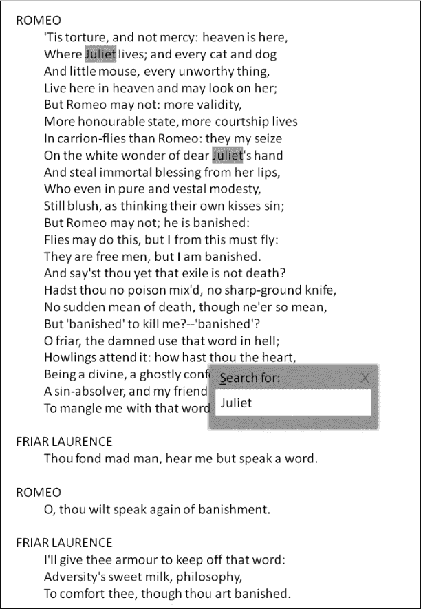

## 第五章：**正则表达式**


你是办公室职员、学生、软件开发者、经理、博主、研究员、作家、文案、教师，还是自由职业者？很可能，你每天都在电脑前度过许多小时。如果能稍微提高你的日常工作效率，哪怕只是一个小小的百分比，也能带来数千甚至数万美元的生产力提升，以及数百小时的额外空闲时间。

本章向你展示了一种被低估的技术，帮助高级程序员在处理文本数据时更高效：使用正则表达式。本章将展示 10 种使用正则表达式来解决日常问题的方法，这些方法能节省你大量的时间、精力和工作量。仔细学习本章内容——它会是值得你投入的时间！

### **在字符串中查找基本文本模式**

本节介绍了使用`re`模块和其重要的`re.findall()`函数的正则表达式。我将从解释几个基本的正则表达式开始。

#### ***基础知识***

*正则表达式*（简称*regex*）正式描述了一个搜索*模式*，你可以用它来匹配文本的某些部分。图 5-1 中的简单示例展示了如何在莎士比亚的《罗密欧与朱丽叶》文本中搜索`Juliet`模式。



*图 5-1：在莎士比亚的《罗密欧与朱丽叶》中搜索模式`Juliet`*

图 5-1 展示了最基础的正则表达式是一个简单的字符串模式。字符串`'Juliet'`就是一个完全有效的正则表达式。

正则表达式功能强大，能够做的不仅仅是常规的文本搜索，但它们仅由少数几个基本命令构建。掌握这些基本命令，你就能理解并编写复杂的正则表达式。在本节中，我们将重点介绍三条最重要的正则表达式命令，它们扩展了在给定文本中简单字符串模式搜索的功能。

##### **点号正则表达式**

首先，你需要知道如何使用*点号正则表达式*（`.`字符）来匹配任意字符。点号正则表达式可以匹配任何字符（包括空白字符）。你可以使用它来表示你不在乎匹配的是什么字符，只要*恰好匹配一个*字符即可：

```py
import re

text = '''A blockchain, originally block chain,

is a growing list of records, called blocks,

which are linked using cryptography.

'''

print(re.findall('b...k', text))

# ['block', 'block', 'block']
```

这个示例使用了`re`模块的`findall()`方法。第一个参数是正则表达式本身：你搜索的是任何以字符`'b'`开头、接着三个任意字符`...`、最后是字符`'k'`的字符串模式。这个正则表达式`b...k`匹配单词`'block'`，但也匹配`'boook'`、`'b erk'`和`'bloek'`。`findall()`的第二个参数是你要搜索的`text`文本。字符串变量`text`包含了三个匹配模式，正如你在`print`语句的输出中看到的那样。

##### **星号正则表达式**

其次，假设你想匹配以字符`'y'`开头并以字符`'y'`结尾，中间包含任意数量字符的文本。如何实现这一点？你可以使用*星号正则表达式*，即`*`字符。与点号正则表达式不同，星号正则表达式不能单独使用；它需要修饰另一个正则表达式。考虑以下例子：

```py
print(re.findall('y.*y', text))

# ['yptography']
```

星号操作符应用于紧接其前面的正则表达式。在这个例子中，正则表达式模式以字符`'y'`开头，后跟任意数量的字符`.*`，然后是字符`'y'`。正如你所看到的，单词`'cryptography'`包含了这样一个模式的实例：`'yptography'`。

你可能会想，为什么这段代码没有找到`'originally'`和`'cryptography'`之间的长子串，尽管这个子串也应该匹配正则表达式`y.*y`。原因很简单，因为点号操作符匹配除了换行符以外的任何字符。变量`text`中存储的字符串是一个多行字符串，包含三行换行符。你也可以将星号操作符与其他任何正则表达式结合使用。例如，你可以使用正则表达式`abc*`来匹配字符串`'ab'`、`'abc'`、`'abcc'`和`'abccdc'`。

##### **零次或一次正则表达式**

第三，你需要知道如何使用*零次或一次正则表达式*（`?`字符）来匹配零个或一个字符。就像星号操作符一样，问号修饰另一个正则表达式，正如以下例子所示：

```py
print(re.findall('blocks?', text))

# ['block', 'block', 'blocks']
```

零次或一次正则表达式`?`应用于紧接其前面的正则表达式。在我们的例子中，这个正则表达式是字符`s`。零次或一次正则表达式表示它修饰的模式是可选的。

在 Python 的`re`包中，问号还有另一种用法，但与零次或一次正则表达式无关：问号可以与星号操作符`*?`结合使用，从而实现*非贪婪*模式匹配。例如，如果你使用正则表达式`.*?`，Python 将搜索最小数量的任意字符。相反，如果你使用没有问号的星号操作符`*`，它会*贪婪*地匹配尽可能多的字符。

让我们来看一个例子。当使用正则表达式`<.*>`搜索 HTML 字符串`'<div>hello world</div>'`时，它会匹配整个字符串`'<div>hello world</div>'`，而不是仅仅匹配前缀`'<div>'`。如果你只想匹配前缀，可以使用非贪婪正则表达式`<.*?>`：

```py
txt = '<div>hello world</div>'

print(re.findall('<.*>', txt))

# ['<div>hello world</div>']

print(re.findall('<.*?>', txt))

# ['<div>', '</div>']
```

配备了这三种工具——点号正则表达式`.`、星号正则表达式`*`和零次或一次正则表达式`?`——你现在可以理解下一个单行解决方案。

#### ***代码***

我们的输入是一个字符串，我们的目标是使用非贪婪的方法，找到所有以字符`'p'`开头、以字符`'r'`结尾，并且在其中至少包含一次字符`'e'`（并可能包含任意数量的其他字符）的模式！

这些类型的文本查询非常常见——尤其是在专注于文本处理、语音识别或机器翻译的公司中（如搜索引擎、社交网络或视频平台）。请查看清单 5-1。

```py
## Dependencies

import re

## Data

text = 'peter piper picked a peck of pickled peppers'

## One-Liner

result = re.findall('p.*?e.*?r', text)

## Result

print(result)
```

*清单 5-1：搜索特定短语的单行解决方案（非贪婪模式）*

这段代码会打印出 `text` 中所有匹配的短语。它们是什么？

#### ***工作原理***

正则表达式搜索查询是`p.*?e.*?r`。让我们来分解一下。你在寻找一个以字符 `'p'` 开头并以字符 `'r'` 结尾的短语。在这两个字符之间，你需要至少出现一次字符 `'e'`。除此之外，你允许任意数量的字符（无论是否有空格）。然而，你通过使用`.*?`以非贪婪的方式进行匹配，这意味着 Python 将搜索尽可能少的任意字符。以下是解决方案：

```py
## Result

print(result)

# ['peter', 'piper', 'picked a peck of pickled pepper']
```

将这个解决方案与使用贪婪正则表达式 `p.*e.*r` 时得到的结果进行比较：

```py
result = re.findall('p.*e.*r', text)

print(result)

# ['peter piper picked a peck of pickled pepper']
```

第一个贪婪星号操作符 `.*` 匹配几乎整个字符串，直到它终止。

### **使用正则表达式编写你的第一个网页抓取器**

在上一节中，你学习了在字符串中查找任意文本模式的最强大方法：正则表达式。本节将进一步激发你使用正则表达式的动力，并通过一个实际的例子来拓展你的知识。

#### ***基础知识***

假设你正在作为自由职业的软件开发者工作。你的客户是一家金融科技初创公司，需要及时了解加密货币的最新发展。他们雇佣你编写一个网页抓取器，定期获取新闻网站的 HTML 源代码，并在其中搜索以 `'crypto'` 开头的词汇（例如，`'cryptocurrency'`、`'crypto-bot'`、`'crypto-crash'` 等等）。

你第一次尝试的代码片段如下：

```py
import urllib.request

search_phrase = 'crypto'

with urllib.request.urlopen('https://www.wired.com/') as response:

   html = response.read().decode("utf8") # convert to string

   first_pos = html.find(search_phrase) 

   print(html[first_pos-10:first_pos+10])
```

方法`urlopen()`（来自模块`urllib.request`）从指定的 URL 获取 HTML 源代码。由于结果是字节数组，因此你必须先使用`decode()`方法将其转换为字符串。然后，你使用字符串方法`find()`返回搜索字符串第一次出现的位置。通过切片（请参见第二章），你提取出一个子字符串，返回该位置的即时环境。结果是以下字符串：

```py
# ,r=window.crypto||wi
```

哦，这看起来不太好。事实证明，搜索短语是模糊的——包含 `'crypto'` 的大多数单词在语义上与*加密货币*无关。你的网页抓取器生成了*假阳性*（它找到了你原本并不想找到的字符串结果）。那么你该如何解决呢？

幸运的是，你刚读完这本 Python 书，所以答案显而易见：正则表达式！你消除假阳性的方法是查找 `'crypto'` 后跟最多 30 个任意字符，接着是 `coin` 的情况。大致来说，搜索查询是 `crypto +` *`<最多 30 个任意字符>`* `+ coin`。考虑以下两个示例：

+   `'``加密机器人正在交易比特币'`—是的

+   `'``加密加密方法，可以轻松被量子计算机破解``'`—不

那么如何解决这个问题，使得两个字符串之间允许最多 30 个任意字符呢？这超出了简单的字符串搜索。你不能列举出每个精确的字符串模式——允许的匹配是几乎无限的。例如，搜索模式必须匹配以下所有情况：`'cryptoxxxcoin'`，`'crypto coin'`，`'crypto bitcoin'`，`'crypto is a` `currency``。比特币'`，以及其他所有在两个字符串之间最多有 30 个字符的字符组合。即使只有 26 个字母表中的字符，理论上符合我们要求的字符串数量也超过 26[30] = 2,813,198,901,284,745,919,258,621,029,615,971,520,741,376。在接下来的内容中，你将学习如何搜索一个文本，找到与大量可能的字符串模式对应的正则表达式模式。

#### ***代码***

在这里，给定一个字符串，你将查找 `'crypto'` 后跟最多 30 个任意字符，接着是 `'coin'` 的情况。让我们先看一下 清单 5-2，然后再讨论代码如何解决这个问题。

```py
## Dependencies

import re

## Data

text_1 = "crypto-bot that is trading Bitcoin and other currencies"

text_2 = "cryptographic encryption methods that can be cracked easily with quantum computers"

## One-Liner

pattern = re.compile("crypto(.{1,30})coin") 

## Result

print(pattern.match(text_1))

print(pattern.match(text_2))
```

*清单 5-2：查找形如 `crypto``(some text)``coin` 的文本片段的一行解决方案*

这段代码搜索了两个字符串变量 `text_1` 和 `text_2`。搜索查询（模式）是否匹配它们？

#### ***工作原理***

首先，你导入 Python 中的标准正则表达式模块 `re`。重要的部分发生在这一行代码中，你编译了搜索查询 `crypto(.{1,30})coin`。这是你可以用来搜索各种字符串的查询。你使用了以下特殊的正则表达式字符。按照从上到下的顺序阅读，你就能理解 清单 5-2 中模式的含义：

+   `()` 匹配括号内的内容。

+   `.` 匹配任意字符。

+   `{1,30}` 匹配前面正则表达式的 1 到 30 次出现。

+   `(.{1,30})` 匹配 1 到 30 个任意字符。

+   `crypto(.{1,30})coin` 匹配由三部分组成的正则表达式：单词 `'``crypto``'`，接着是一个长度为 1 到 30 个字符的任意序列，最后是单词 `'``coin``'`。

我们称该模式为*编译过的*，因为 Python 会创建一个模式对象，可以在多个位置重用——就像编译后的程序可以多次执行一样。现在，你可以对我们的编译模式和要搜索的文本调用 `match()` 函数。这将得到以下结果：

```py
## Result

print(pattern.match(text_1))

# <re.Match object; span=(0, 34), match='crypto-bot that is trading Bitcoin'>

print(pattern.match(text_2))

# None
```

字符串变量`text_1`匹配模式（通过结果匹配对象指示），但`text_2`不匹配（通过结果`None`指示）。尽管第一个匹配对象的文本表示看起来不太美观，但它清楚地表明字符串`'crypto-bot that is trading Bitcoin'`与正则表达式匹配。

### **分析 HTML 文档中的超链接**

在前面的章节中，你学习了如何使用正则表达式模式`.{x,y}`来搜索一个字符串中的大量模式。本节将进一步讲解，引入更多的正则表达式。

#### ***基础知识***

学会更多正则表达式将帮助你快速简洁地解决实际问题。那么，最重要的正则表达式有哪些呢？仔细研究下面的列表，因为我们将在本章中使用所有这些正则表达式。你可以把已经学过的当作一个小复习。

+   点号正则表达式`.`匹配任意字符。

+   星号正则表达式*`<pattern>`*`*`匹配任意多个*`<pattern>`*的正则表达式。注意，这包括零次匹配。

+   至少匹配一个的正则表达式*`<pattern>`*`+`可以匹配任意多个*`<pattern>`*，但必须至少匹配一个实例。

+   零次或一次匹配的正则表达式*`<pattern>`*`?`匹配零次或一次*`<pattern>`*的实例。

+   非贪婪星号正则表达式`*?`会尽可能匹配少量的任意字符，以匹配整个正则表达式。

+   正则表达式*`<pattern>`*`{m}`精确匹配`m`个*`<pattern>`*的副本。

+   正则表达式*`<pattern>`*`{m,n}`匹配`m`到`n`个*`<pattern>`*的副本。

+   正则表达式*`<pattern_1>`*`|`*`<pattern_2>`*匹配*`<pattern_1>`*或*`<pattern_2>`*。

+   正则表达式*`<pattern_1><pattern_2>`*先匹配*`<pattern_1>`*，然后匹配*`<pattern_2>`*。

+   正则表达式`(`*`<pattern>`*`)`匹配*`<pattern>`*。括号用于将正则表达式分组，从而控制执行顺序（例如，`(`*`<pattern_1><pattern_2>`*`)`|`*`<pattern_3>`*与*`<pattern_1>`*`(`*`<pattern_2>`*`|`*`<pattern_3>`*`)`是不同的）。括号正则表达式还会创建一个匹配组，稍后你将在本节中看到。

让我们考虑一个简短的示例。假设你创建了正则表达式`b?(.a)*`。这个正则表达式会匹配哪些模式呢？这个正则表达式会匹配所有以零个或一个`b`开头，并且后面跟有任意多个以字符`'a'`结尾的两字符序列。因此，字符串`'bcacaca'`、`'cadaea'`、`''`（空字符串）和`'aaaaaa'`都会匹配这个正则表达式。

在深入了解下一个一行代码之前，让我们快速讨论一下什么时候使用哪个*正则表达式函数*。三个最重要的正则表达式函数是`re.match()`、`re.search()`和`re.findall()`。你已经见过其中的两个，但让我们在这个例子中更深入地学习它们：

```py
import re

text = '''

"One can never have enough socks", said Dumbledore.

"Another Christmas has come and gone and I didn't

get a single pair. People will insist on giving me books."

Christmas Quote

'''

regex = 'Christ.*'

print(re.match(regex, text))

# None

print(re.search(regex, text))

# <re.Match object; span=(62, 102), match="Christmas has come and gone and I didn't">

print(re.findall(regex, text))

# ["Christmas has come and gone and I didn't", 'Christmas Quote']
```

这三个函数都接受正则表达式和要搜索的字符串作为输入。`match()`和`search()`函数返回一个匹配对象（如果正则表达式没有匹配到任何内容，则返回`None`）。匹配对象存储了匹配位置以及更多高级的元信息。`match()`函数不会在字符串中找到正则表达式（它返回`None`）。为什么？因为这个函数只会在字符串的*开始*部分查找模式。`search()`函数会在字符串的*任何位置*查找正则表达式的第一个匹配项。因此，它找到了匹配项`"Christmas has come and gone and I didn't"`。

`findall()`函数的输出最为直观，但也最不适合进一步处理。`findall()`的结果是一个字符串序列，而不是一个匹配对象——因此它不会给我们匹配位置的精确信息。话虽如此，`findall()`还是有它的用途：与`match()`和`search()`方法不同，`findall()`函数会提取*所有*匹配的模式，这在你想统计一个词在文本中出现的频率时非常有用（例如，字符串`'Juliet'`在文本`'Romeo and Juliet'`中，或者字符串`'crypto'`在关于加密货币的文章中）。

#### ***代码***

假设你的公司要求你创建一个小型的网页爬虫，它可以爬取网页并检查其中是否包含指向域名*finxter.com*的链接。同时，他们还要求你确保超链接的描述中包含字符串`'test'`或`'puzzle'`。在 HTML 中，超链接被包含在`<a></a>`标签环境中。超链接本身由`href`属性的值定义。所以更准确地说，目标是解决以下问题，见清单 5-3：给定一个字符串，找出所有指向域名*finxter.com*并且在链接描述中包含`'test'`或`'puzzle'`的超链接。

```py
## Dependencies

import re

## Data

page = '''

<!DOCTYPE html>

<html>

<body>

<h1>My Programming Links</h1>

<a href="https://app.finxter.com/">test your Python skills</a>

<a href="https://blog.finxter.com/recursion/">Learn recursion</a>

<a href="https://nostarch.com/">Great books from NoStarchPress</a>

<a href="http://finxter.com/">Solve more Python puzzles</a>

</body>

</html>

'''

## One-Liner

practice_tests = re.findall("(<a.*?finxter.*?(test|puzzle).*?>)", page)

## Result

print(practice_tests)
```

*清单 5-3：分析网页链接的单行解决方案*

这段代码查找正则表达式的两个匹配项。是哪两个？

#### ***它是如何工作的***

数据由一个简单的 HTML 网页（存储为多行字符串）组成，里面包含了一些超链接（标签环境`<a href="">`*`链接文本`*`</a>`）。这个单行解决方案使用了`re.findall()`函数来检查正则表达式`(<a.*?finxter.*?(test|puzzle).*?>)`。通过这种方式，正则表达式返回所有在标签环境`<a. . .>`中的匹配项，且有以下限制。

在开头标签后，你匹配任意数量的字符（非贪婪地，防止正则表达式“吞噬”多个 HTML 标签环境），然后是字符串 `'finxter'`。接下来，你匹配任意数量的字符（非贪婪地），然后是 `'test'` 或 `'puzzle'` 中的一个字符串。接着，你再次匹配任意数量的字符（非贪婪地），然后是闭合标签。这样，你就能找到所有包含这些字符串的超链接标签。请注意，这个正则表达式还匹配那些在链接本身中包含 `'test'` 或 `'puzzle'` 的标签。还要注意，你只使用了非贪婪的星号运算符 `'.*?'`，以确保总是查找最小的匹配，而不是匹配一个被多个嵌套标签环境包围的非常长的字符串。

单行代码的结果如下：

```py
## Result

print(practice_tests)

# [('<a href="https://app.finxter.com/">test your Python skills</a>', 'test'),

#  ('<a href="http://finxter.com/">Solve more Python puzzles</a>', 'puzzle')]
```

有两个超链接匹配我们的正则表达式：单行代码的结果是一个包含两个元素的列表。然而，每个元素是一个字符串元组，而不是一个简单的字符串。这与我们之前在代码片段中讨论的 `findall()` 方法的结果不同。为什么会这样呢？返回类型是一个元组列表——每个匹配的*匹配组*被 `()` 包围。比如，正则表达式 `(test|puzzle)` 使用括号表示法来创建一个匹配组。如果你在正则表达式中使用了匹配组，`re.findall()` 函数会为每个匹配的组添加一个元组值。这个元组值是匹配该组的子字符串。例如，在我们的例子中，子字符串 `'puzzle'` 匹配了组 `(test|puzzle)`。让我们深入探讨匹配组的概念，以更清楚地理解这一点。

### **从字符串中提取美元金额**

这行代码展示了正则表达式的另一个实际应用。在这里，你作为一名财务分析师工作。你的公司正在考虑收购另一家公司，你被分配去阅读另一家公司的报告。你特别关注所有的美元金额。现在，你可以手动扫描整篇文档，但这项工作非常繁琐，而且你不想把一天中最好的时间花在这些琐事上。所以你决定编写一个小的 Python 脚本。但最好的做法是什么呢？

#### ***基础知识***

幸运的是，你已经阅读了这篇正则表达式教程，因此，你无需浪费大量时间编写自己冗长且易出错的 Python 解析器，而是选择了通过正则表达式实现干净的解决方案——这是一个明智的选择。但在深入问题之前，让我们讨论三个正则表达式的概念。

首先，迟早你会想匹配一个特殊字符，而这个字符在正则表达式语言中也有特殊意义。在这种情况下，你需要使用前缀 `\` 来*转义*该特殊字符的含义。例如，为了匹配括号字符 `'('`（它通常用于正则表达式中的分组），你需要使用正则表达式 `\(` 来转义它。这样，正则表达式字符 `'('` 就失去了其特殊含义。

其次，方括号环境 `[ ]` 允许你定义一组特定的字符范围。例如，正则表达式 `[0-9]` 匹配以下字符之一：`'0'`、`'1'`、`'2'`、...、`'9'`。另一个例子是正则表达式 `[a-e]`，它匹配以下字符之一：`'a'`、`'b'`、`'c'`、`'d'`、`'e'`。

第三，正如我们在前面的单行解决方案部分讨论的那样，括号正则表达式 `(`*`<pattern>`*`)` 表示一个*分组*。每个正则表达式可以有一个或多个分组。当在带有分组的正则表达式上使用 `re.findall()` 函数时，返回的仅是匹配的分组，作为一个字符串元组—每个分组对应一个字符串—而不是整个匹配的字符串。例如，正则表达式 `hello(world)` 应用于字符串 `'helloworld'` 时，匹配的是整个字符串，但返回的仅是匹配的分组 `world`。另一方面，当正则表达式 `(hello(world))` 包含两个嵌套分组时，`re.findall()` 函数的结果将是所有匹配分组的元组 `('helloworld', 'world')`。请研究以下代码，彻底理解嵌套分组：

```py
string = 'helloworld'

regex_1 = 'hello(world)'

regex_2 = '(hello(world))'

res_1 = re.findall(regex_1, string)

res_2 = re.findall(regex_2, string)

print(res_1)

# ['world']

print(res_2)

# [('helloworld', 'world')]
```

现在，你已经掌握了理解以下代码片段所需的所有知识。

#### ***代码***

总结一下，你需要从给定的公司报告中调查所有货币金额。具体来说，你的目标是解决以下问题：给定一个字符串，查找所有包含美元金额的匹配项，金额中可能包含小数部分。以下示例字符串是有效匹配项：$10、$10. 或 $10.00021。如何在一行代码中高效地实现这一点？请查看清单 5-4。

```py
## Dependencies

import re

## Data

report = '''

If you invested $1 in the year 1801, you would have $18087791.41 today.

This is a 7.967% return on investment. 

But if you invested only $0.25 in 1801, you would end up with $4521947.8525.

'''

## One-Liner

dollars = [x[0] for x in re.findall('(\$[0-9]+(\.[0-9]*)?)', report)]

## Result

print(dollars)
```

*清单 5-4：查找文本中所有美元金额的一行解决方案*

猜猜看：这段代码的输出是什么？

#### ***工作原理***

该报告包含四个不同格式的美元金额。目标是开发一个正则表达式来匹配它们。你设计了正则表达式 `(\$[0-9]+(.[0-9]*)?)`，它可以匹配以下模式。首先，它匹配美元符号 `$`（因为它是正则表达式的特殊字符，所以需要进行转义）。其次，它匹配一个由任意数量的数字（0 到 9）组成的数字（但至少有一个数字）。第三，它匹配一个可选的小数部分，即点字符 `'.'` 后的任意数量的小数值（这个匹配是可选的，正如零或一个正则表达式 `?` 所示）。

此外，你使用列表推导式仅提取所有三个匹配结果中的第一个元组值。再次强调，`re.findall()`函数的默认结果是一个元组列表，每个成功匹配一个元组，每个匹配组中有一个元组值：

```py
[('$1', ''), ('$18087791.41', '.41'), ('$0.25', '.25'), ('$4521947.8525', '.8525')]
```

你只对全局组—元组中的第一个值感兴趣。你通过使用列表推导式过滤掉其他值，并获得如下结果：

```py
## Result

print(dollars)

# ['$1 ', '$18087791.41', '$0.25', '$4521947.8525']
```

值得再次强调的是，即使是实现一个简单的解析器，如果没有正则表达式的强大功能，也会变得非常困难且容易出错！

### **查找不安全的 HTTP URL**

这个单行代码展示了如何解决 Web 开发人员常遇到的一些小而耗时的问题。假设你拥有一个编程博客，你刚刚将网站从不安全的`http`协议迁移到更安全的`https`协议。然而，你的旧文章仍然指向旧的 URL。你如何找到所有出现旧 URL 的地方？

#### ***基础知识***

在前面的章节中，你学习了如何使用方括号符号来指定一个任意范围的字符。例如，正则表达式`[0-9]`匹配一个单一的数字，范围从 0 到 9。然而，方括号符号比这更强大。你可以在方括号内使用任意字符组合，精确地指定哪些字符匹配，哪些不匹配。例如，正则表达式`[0-3a-c]+`匹配字符串`'01110'`和`'01c22a'`，但不匹配`'443'`和`'00cd'`。你还可以通过使用符号`^`来指定一个不匹配的固定字符集：正则表达式`[⁰-3a-c]+`匹配字符串`'4444d'`和`'Python'`，但不匹配`'001'`和`'01c22a'`。

#### ***代码***

这里我们的输入是一个（多行）字符串，我们的目标是查找所有以前缀*http://*开头的有效 URL。然而，不要考虑没有顶级域名的无效 URL（找到的 URL 中必须至少有一个点号）。请看 Listing 5-5。

```py
## Dependencies

import re

## Data

article = '''

The algorithm has important practical applications

http://blog.finxter.com/applications/

in many basic data structures such as sets, trees,

dictionaries, bags, bag trees, bag dictionaries,

hash sets, https://blog.finxter.com/sets-in-python/

hash tables, maps, and arrays. http://blog.finxter.com/

http://not-a-valid-url

http:/bla.ba.com

http://bo.bo.bo.bo.bo.bo/

http://bo.bo.bo.bo.bo.bo/333483--33343-/

'''

## One-Liner

stale_links = re.findall('http://[a-z0-9_\-.]+\.[a-z0-9_\-/]+', article)

## Results

print(stale_links)
```

*Listing 5-5: 查找有效的* http:// *URL 的单行解决方案*

再次尝试在查看正确输出之前，预测代码会产生什么样的输出。

#### ***工作原理***

在正则表达式中，你分析一个给定的多行字符串（可能是一个旧的博客文章），以查找所有以`http://`为前缀的 URL。正则表达式期望出现一个或多个（小写字母）字符、数字、下划线、连字符或点号（`[a-z0-9_\-\.]+`）。注意，你需要转义连字符（`\-`），因为它通常表示方括号中的范围。同样，你需要转义点号（`\.`），因为你实际上是想匹配点号而不是任意字符。最终得到如下输出：

```py
## Results

print(stale_links)

# ['http://blog.finxter.com/applications/',

#  'http://blog.finxter.com/',

#  'http://bo.bo.bo.bo.bo.bo/',

#  'http://bo.bo.bo.bo.bo.bo/333483--33343-/']
```

四个有效的 URL 可能需要迁移到更安全的 HTTPS 协议。

到目前为止，你已经掌握了正则表达式中最重要的特性。但要达到更深的理解，你需要通过练习和学习大量示例——正则表达式也不例外。让我们再学习几个实际的示例，看看正则表达式如何让你的生活更轻松。

### **验证用户输入的时间格式，第一部分**

让我们学习如何检查用户输入格式的正确性。假设你编写了一个基于用户睡眠时间计算健康统计数据的 web 应用程序。用户输入他们入睡和醒来的时间。一个正确的时间格式示例如`12:45`，但由于网络机器人正在垃圾填充你的用户输入字段，许多“脏”数据导致了服务器的不必要处理开销。为了解决这个问题，你编写了一个时间格式检查器，用于确定输入是否值得进一步在后台应用程序中处理。使用正则表达式，编写代码只需几分钟。

#### ***基础知识***

在之前的几个章节中，你已经学习了`re.search()`、`re.match()`和`re.findall()`函数。这些并不是唯一的正则表达式函数。在本节中，你将使用`re.fullmatch(`*`regex, string`*`)`，它会检查`regex`是否完全匹配`string`，正如其名称所示。

此外，你将使用正则表达式语法*`pattern`*`{`*`m,n`*`}`，它匹配正则表达式*`pattern`*的*m*到*n*个实例，但不多也不少。注意，它会尽量匹配*`pattern`*的最大出现次数。以下是一个示例：

```py
import re

print(re.findall('x{3,5}y', 'xy'))

# []

print(re.findall('x{3,5}y', 'xxxy'))

# ['xxxy']

print(re.findall('x{3,5}y', 'xxxxxy'))

# ['xxxxxy']

print(re.findall('x{3,5}y', 'xxxxxxy'))

# ['xxxxxy']
```

使用括号符号，代码不匹配少于三个或多于五个`'x'`字符的子字符串。

#### ***代码***

我们的目标是编写一个函数`input_ok`，它接受一个字符串参数并检查它是否具有（时间）格式*`XX`*`:`*`XX`*，其中*`X`*是 0 到 9 之间的数字；参见清单 5-6。请注意，目前你接受像 12:86 这样的语义错误时间格式，但接下来的单行代码将解决这个更复杂的问题。

```py
## Dependencies

import re

## Data

inputs = ['18:29', '23:55', '123', 'ab:de', '18:299', '99:99']

## One-Liner

input_ok = lambda x: re.fullmatch('[0-9]{2}:[0-9]{2}', x) != None

## Result

for x in inputs:

    print(input_ok(x))
```

*清单 5-6：检查给定用户输入是否符合通用时间格式的单行解决方案* XX*:*XX

在继续之前，尝试确定代码中六个函数调用的结果。

#### ***工作原理***

数据由六个输入字符串组成，这些字符串是通过你的网站前端接收到的。它们的格式正确吗？为了检查这一点，你创建了函数`input_ok`，该函数使用一个输入参数`x`和一个布尔输出的 lambda 表达式。你使用`fullmatch(`*`regex`*`, x)`函数，尝试使用我们的时间格式正则表达式匹配输入参数`x`。如果匹配失败，结果将为`None`，布尔输出为`False`。否则，布尔输出为`True`。

正则表达式很简单：`[0-9]{2}:[0-9]{2}`。这个模式匹配两个从 0 到 9 的数字，后面跟着冒号`:`，然后再跟着两个从 0 到 9 的数字。因此，列表 5-6 的结果如下：

```py
## Result

for x in inputs:

    print(input_ok(x))

'''

True

True

False

False

False

True

'''
```

`input_ok`函数正确地识别了时间`输入`的正确格式。在这一行代码中，你学习了如何通过合适的工具集，在短短几秒钟内完成那些本来需要多行代码和更多努力的高度实用的任务。

### **验证用户输入的时间格式，第二部分**

在这一节中，你将深入探讨验证用户输入的时间格式，以解决上一节的问题：无效的时间输入，如`99:99`，不应被视为有效匹配。

#### ***基础***

解决问题的一个有用策略是分层处理问题。首先，简化问题，解决其中较简单的变体。然后，再精炼解决方案以适应你特定（且更复杂）的问题。本节通过一个重要的方式精炼了之前的解决方案：它不允许无效的时间输入，比如`99:99`或`28:66`。因此，问题变得更加具体（且更复杂），但你可以重用我们旧解决方案的部分内容。

#### ***代码***

我们的目标是编写一个`input_ok`函数，它接受一个字符串参数并检查它是否符合（时间）格式*`XX`*`:`*`XX`*，其中*`X`*是 0 到 9 之间的数字；参见列表 5-7。此外，给定的时间必须是 24 小时制的有效时间格式，范围从 00:00 到 23:59。

```py
## Dependencies

import re

## Data

inputs = ['18:29', '23:55', '123', 'ab:de', '18:299', '99:99']

## One-Liner

input_ok = lambda x: re.fullmatch('([01][0-9]|2[0-3]):[0-5][0-9]', x) != None

## Result

for x in inputs:

    print(input_ok(x))
```

*列表 5-7：单行解决方案，检查给定的用户输入是否符合通用时间格式`XX:XX`并在 24 小时制时间中有效*

这段代码打印了六行。它们是什么？

#### ***工作原理***

如本节引言所述，你可以重用之前那行代码的解决方案，轻松解决这个问题。代码保持不变——你只是修改了正则表达式`([01][0-9]|2[0-3]):[0-5][0-9]`。第一部分`([01][0-9]|2[0-3])`是一个分组，匹配一天中所有可能的小时。你使用了或操作符`|`来区分 00 到 19 小时和 20 到 23 小时。第二部分`[0-5][0-9]`匹配一天中的分钟，从 00 到 59。因此，结果如下：

```py
## Result

for x in inputs:

    print(input_ok(x))

'''

True

True

False

False

False

False

'''
```

注意，输出的第六行表示时间`99:99`不再被视为有效的用户输入。这个单行代码展示了如何使用正则表达式检查用户输入是否符合应用程序的语义要求。

### **字符串中的重复检测**

这一行代码引入了正则表达式的一个令人兴奋的功能：在同一个正则表达式中重用你已经匹配过的部分。这一强大的扩展功能让你能够解决一系列新问题，包括检测含有重复字符的字符串。

#### ***基础***

这一次，你作为计算机语言学研究员，正在分析某些单词用法如何随着时间的推移而变化。你使用已发布的书籍来分类和跟踪单词的使用情况。你的教授要求你分析单词中是否有更多的重复字符使用趋势。例如，单词 `'hello'` 包含重复字符 `'l'`，而单词 `'spoon'` 包含重复字符 `'o'`。然而，单词 `'mama'` 不会被视为包含重复字符 `'a'` 的单词。

解决这个问题的简单方法是列举所有可能的重复字符 `'aa'`、`'bb'`、`'cc'`、`'dd'`，...，`'zz'`，并将它们结合成一个或的正则表达式。这种方法繁琐且难以泛化。如果你的教授改变主意，要求你检查两个字符之间最多隔一个字符的重复字符（例如，字符串 `'mama'` 现在就能匹配）呢？

没问题：如果你了解正则表达式中命名分组的功能，就有一个简单、清晰且有效的解决方案。你已经学习过被括号 `(...)` 包围的分组。如其名所示，*命名分组*就是一个带有名称的分组。例如，你可以通过使用语法 `(?P<name>...)` 将模式 `...` 定义为名为 `name` 的命名分组。在定义了命名分组后，你可以在正则表达式的任何地方使用它，语法是 `(?P=name)`。考虑以下示例：

```py
import re

pattern = '(?P<quote>[\'"]).*(?P=quote)'

text = 'She said "hi"'

print(re.search(pattern, text))

# <re.Match object; span=(9, 13), match='"hi"'>
```

在代码中，你会搜索被单引号或双引号包围的子字符串。为此，首先通过正则表达式 `['"]` 匹配开头的引号（你需要转义单引号 `\`'`，以防止 Python 错误地认为单引号表示字符串的结束）。然后，你使用相同的分组来匹配与之对应的闭合引号（无论是单引号还是双引号）。

在进入代码之前，注意你可以使用正则表达式 `\s` 来匹配任意空白字符。此外，使用语法 `[^Y]` 你可以匹配不在集合 `Y` 中的字符。这就是解决问题所需了解的全部内容。

#### ***代码***

考虑列表 5-8 中说明的问题：给定一段文本，找出所有包含重复字符的单词。在这种情况下，*单词*被定义为任何由非空白字符组成的字符串，这些字符之间由任意数量的空白字符分隔。

```py
## Dependencies

import re

## Data

text = '''

It was a bright cold day in April, and the clocks were

striking thirteen. Winston Smith, his chin nuzzled into

his breast in an effort to escape the vile wind, slipped

quickly through the glass doors of Victory Mansions,

though not quickly enough to prevent a swirl of gritty

dust from entering along with him.

-- George Orwell, 1984

'''

## One-Liner

duplicates = re.findall('([^\s]*(?P<x>[^\s])(?P=x)[^\s]*)', text)

## Results

print(duplicates)
```

*列表 5-8：一行代码解决方案查找所有重复字符*

在这段代码中，找到哪些单词包含重复字符？

#### ***工作原理***

正则表达式`(?P<x>[^\s])`定义了一个名为`x`的新分组。该分组仅由一个不是空格字符的任意字符组成。正则表达式`(?P=x)`紧随其后，匹配与`x`分组匹配的相同字符。你已经找到了重复字符！然而，目标不是查找重复字符，而是查找具有重复字符的单词。所以你在重复字符前后匹配任意数量的非空格字符`[^\s]*`。

列表 5-8 的输出如下：

```py
## Results

print(duplicates)

'''

[('thirteen.', 'e'), ('nuzzled', 'z'), ('effort', 'f'),

('slipped', 'p'), ('glass', 's'), ('doors', 'o'),

('gritty', 't'), ('--', '-'), ('Orwell,', 'l')]

'''
```

正则表达式会查找文本中所有具有重复字符的单词。请注意，在列表 5-8 中的正则表达式有两个分组，因此`re.findall()`函数返回的每个元素都是一个匹配分组的元组。你在前面的章节中已经看过这种行为。

在这一节中，你增强了你的正则表达式工具集，增加了一个强大的工具：命名分组。结合使用`\s`匹配任意空格字符和`[^...]`操作符定义不匹配的字符集这两个小的正则表达式特性，你已经在 Python 正则表达式的掌握上取得了实质性的进展。

### **检测词汇重复**

在上一节中，你学习了命名分组。本节的目标是向你展示更多使用这个强大特性的高级方法。

#### ***基础知识***

在过去的几年里，我作为一名研究人员，花费大部分时间写作、阅读和编辑研究论文。在编辑我的研究论文时，一位同事常常抱怨我反复使用相同的词汇（并且在文中使用得太密集）。如果有一个工具能够以编程方式检查你的写作，岂不是很有用？

#### ***代码***

给定一个由小写字母和空格分隔的单词组成的字符串，没有特殊字符。找出一个匹配的子字符串，其中第一个和最后一个单词相同（重复），并且中间最多有 10 个单词。参见列表 5-9。

```py
## Dependencies

import re

## Data

text = 'if you use words too often words become used'

## One-Liner

style_problems = re.search('\s(?P<x>[a-z]+)\s+([a-z]+\s+){0,10}(?P=x)\s', ' ' + text + ' ')

## Results

print(style_problems)
```

*列表 5-9：查找词汇重复的单行解决方案*

这个代码能找到词汇重复吗？

#### ***工作原理***

再次假设给定的`text`仅由空格分隔的小写字母单词组成。现在，你通过正则表达式来搜索`text`。乍一看可能有点复杂，但让我们逐步分析：

```py
'➊\s(?P<x>[a-z]+)\s+➋([a-z]+\s+){0,10}➌(?P=x)\s'
```

你从一个空格字符开始。这一点很重要，确保你从一个完整的单词开始（而不是单词的后缀）。接着，匹配一个名为`x`的分组，`x`由一个正数个小写字母字符（从`'a'`到`'z'`）组成，后面跟着一个正数个空格字符 ➊。

然后，你继续匹配 0 到 10 个单词，每个单词由一个正数个小写字母字符（从`'a'`到`'z'`）组成，后面跟着一个正数个空格字符 ➋。

你以命名分组`x`结束，后面跟一个空格字符，确保最后的匹配是一个完整的单词（而不是单词的前缀） ➌。

以下是代码片段的输出：

```py
## Results

print(style_problems)

# <re.Match object; span=(12, 35), match=' words too often words '>
```

你发现了一个匹配的子字符串，它可能（也可能不）被认为是不好的样式。

在这个单行代码中，你将查找重复单词的问题简化到了核心，并解决了这个更简单的变种。请注意，实际上你需要考虑更复杂的情况，例如特殊字符、小写字母和大写字母的混合、数字等。或者，你也可以做一些预处理，将文本转换为期望的形式，例如小写字母、空格分隔的单词，没有特殊字符。

**练习 5-1**

编写一个 Python 脚本，允许使用更多特殊字符，例如用于结构化句子的字符（句号、冒号、逗号）。

### **在多行字符串中修改正则表达式模式**

在最后的正则表达式单行中，你将学习如何修改文本，而不仅仅是匹配其中的一部分。

#### ***基础知识***

要将某个正则表达式 `regex` 模式的所有出现替换为新字符串 `replacement`，可以使用正则表达式函数 `re.sub(regex, replacement, text)`。通过这种方式，你可以快速编辑大规模文本数据，而无需进行大量的手动操作。

在前面的章节中，你学习了如何匹配文本中出现的模式。但是如果你不想在某个模式出现时匹配另一个模式该怎么办？*负向前瞻*正则表达式 `A(?!X)` 会匹配正则表达式 `A`，前提是后面不跟着正则表达式 `X`。例如，正则表达式 `not (?!good)` 会匹配字符串 `'this is not great'`，但不会匹配字符串 `'this is not good'`。

#### ***代码***

我们的数据是一个字符串，我们的任务是将所有出现的 `Alice Wonderland` 替换为 `'Alice Doe'`，但不替换那些被单引号包围的 `'Alice Wonderland'`。参见 清单 5-10。

```py
## Dependencies

import re

## Data

text = '''

Alice Wonderland married John Doe.

The new name of former 'Alice Wonderland' is Alice Doe.

Alice Wonderland replaces her old name 'Wonderland' with her new name 'Doe'.

Alice's sister Jane Wonderland still keeps her old name.

'''

## One-Liner

updated_text = re.sub("Alice Wonderland(?!')", 'Alice Doe', text)

## Result

print(updated_text)
```

*清单 5-10：替换文本中模式的单行解决方案*

这段代码会打印更新后的文本。它是什么？

#### ***原理***

你将所有的 `Alice Wonderland` 替换为 `Alice Doe`，但不包括那些以单引号 `'` 结尾的。你通过使用负向前瞻来实现这一点。请注意，你只检查闭合引号是否存在。例如，包含开引号但没有闭引号的字符串会匹配，你可以简单地替换它。这在一般情况下可能不是期望的行为，但在我们的示例字符串中，它能达到预期效果：

```py
## Result

print(updated_text)

'''

Alice Doe married John Doe.

The new name of former 'Alice Wonderland' is Alice Doe.

Alice Doe replaces her old name 'Wonderland' with her new name 'Doe'.

Alice's sister Jane Wonderland still keeps her old name.

'''
```

你可以看到，原始的 `'Alice Wonderland'` 在被单引号包围时保持不变——这正是这段代码的目标。

### **总结**

本章内容涵盖了许多内容。你学习了正则表达式，可以用它来匹配给定字符串中的模式。特别是，你学习了 `re.compile()`、`re.match()`、`re.search()`、`re.findall()` 和 `re.sub()` 等函数。它们共同涵盖了正则表达式的绝大多数应用场景。你可以在实际使用正则表达式时，学习其他函数。

你还学习了各种基本的正则表达式，可以组合（并重新组合）以创建更高级的正则表达式。你已经了解了空白字符，转义字符，贪婪/非贪婪操作符，字符集（和负字符集），分组和命名分组，以及负向先行断言。最后，你已经了解到，解决原始问题的简化变体往往比过早泛化更好。

唯一剩下的就是把你新学的正则表达式技能应用到实践中。熟悉正则表达式的一个好方法是开始在你喜爱的文本编辑器中使用它们。大多数高级文本和代码编辑器（包括 Notepad++）都配备了强大的正则表达式功能。此外，在处理文本数据时（例如写电子邮件、博客文章、书籍和代码时），考虑使用正则表达式。正则表达式将让你的生活更轻松，节省许多繁琐工作时间。

在下一章中，我们将深入探讨编程的至高纪律：算法。
