## 第七章：**算法**


算法是古老的概念。一个*算法*不过是一组指令，就像一份烹饪食谱。然而，*算法*在社会中所扮演的角色正在急剧增加：随着计算机在我们生活中的作用越来越大，算法和算法决策在各个领域无处不在。

2018 年的一项研究强调了“数据以我们对世界的观察的形式渗透到现代社会中……这些信息反过来可以用来做出有根据的——在某些情况下甚至完全自动化的——决策……看起来这样的算法可能会与人类决策相结合，这是获得社会接受并因此广泛使用的必要发展。”

**注意**

*欲了解更多关于这项研究的信息，请参阅 S. C. Olhede 和 P. J. Wolfe 的《算法在社会中的日益普及：影响、冲击与创新》一书，网址为* [`royalsocietypublishing.org/doi/full/10.1098/rsta.2017.0364#d2696064e1`](https://royalsocietypublishing.org/doi/full/10.1098/rsta.2017.0364#d2696064e1)。

随着社会在自动化、人工智能和无处不在的计算的重大趋势下发展，理解算法与不了解算法的人之间的社会差距正在迅速扩大。例如，物流行业正在朝着自动化的方向发展——自动驾驶汽车和卡车的崛起——而专业司机面临着算法接管他们工作的事实。

21 世纪不断变化的热门技能和工作岗位使得年轻人必须理解、掌握并操作基本的算法。虽然唯一不变的就是变化，但算法和算法理论的概念与基础构成了即将到来的变化的基础。粗略地说，理解算法，你就能为未来几十年的发展做好充分准备。

本章旨在提高你对算法的理解，更侧重于直觉和全面理解概念及实际应用，而非理论。虽然算法理论与实际应用和概念理解同样重要，但许多优秀的书籍都专注于理论部分。阅读本章后，你将直观地理解一些计算机科学中最受欢迎的算法——并提高你的 Python 实际编程技能。这为即将到来的技术突破提供了坚实的基础。

**注意**

*《算法导论》*（作者：Thomas Cormen 等，MIT 出版社，2009 年）是一本关于算法理论的极好参考书。

让我们从一个小算法开始，解决一个对想要找到好工作的程序员来说相关的简单问题。

### **使用 Lambda 函数和排序查找字谜**

变位词是编程面试中常见的题目，用来测试你的计算机科学词汇和编写简单算法的能力。在本节中，你将学习如何在 Python 中使用简单算法查找变位词。

#### ***基础知识***

如果两个词由相同的字符组成，并且第一个词中的每个字符在第二个词中恰好出现一次，那么这两个词是*变位词*。这一点在图 6-1 以及以下示例中有说明：

+   “listen” → “silent”

+   “funeral ” → “real fun”

+   “elvis” → “lives”

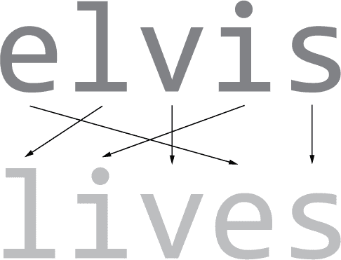

*图 6-1：单词* elvis *是单词* lives *的变位词。*

现在，我们将着手解决这个问题，并得出一个简洁的 Pythonic 解决方案来判断两个单词是否是变位词。让我们开始编写代码吧。

#### ***代码***

我们的目标是编写一个函数 `is_anagram()`，该函数接收两个字符串 `x1` 和 `x2`，并在它们是变位词时返回 `True`！在继续阅读之前，请暂停片刻思考一下这个问题。你会如何在 Python 中处理这个问题呢？清单 6-1 展示了一个解决方案。

```py
  ## One-Liner

➊ is_anagram = lambda x1, x2: sorted(x1) == sorted(x2)

  ## Results

  print(is_anagram("elvis", "lives"))

  print(is_anagram("elvise", "livees"))

  print(is_anagram("elvis", "dead"))
```

*清单 6-1：检查两个字符串是否是变位词的一行代码解决方案*

这段代码打印了三行。它们分别是什么？

#### ***工作原理***

如果两个字符串具有相同的排序字符序列，那么它们就是变位词，因此我们的方法是对两个字符串进行排序，然后进行逐元素比较。就是这么简单。无需外部依赖。你只需通过使用 Lambda 函数定义（参见第一章）并传入两个参数 `x1` 和 `x2` 来创建一个 `is_anagram()` 函数 ➊。该函数返回表达式 `sorted(x1) == sorted(x2)` 的结果，如果排序后的字符序列由相同的字符组成，则返回 `True`。以下是两个排序后字符序列的输出：

```py
print(sorted("elvis"))

# ['e', 'i', 'l', 's', 'v']

print(sorted("lives"))

# ['e', 'i', 'l', 's', 'v']
```

两个字符串 `'elvis'` 和 `'lives'` 由相同的字符组成，因此它们的排序列表表示是相同的。三条打印语句的结果如下：

```py
## Results

print(is_anagram("elvis", "lives")) # True

print(is_anagram("elvise", "livees")) # True

print(is_anagram("elvis", "dead")) # False
```

给高级程序员的小提示：在 Python 中对 *n* 个元素进行排序的运行时间复杂度是随着 *n log(n)* 函数渐近增长的。这意味着我们的这一行代码算法比那种检查每个字符是否都出现在两个字符串中并在相同字符存在时删除它们的天真算法更高效。天真算法的渐近增长复杂度是 *n**2*。

然而，还有一种高效的方法，叫做 *直方图法*，即为两个字符串创建一个直方图，统计该字符串中所有字符的出现次数，然后比较两个直方图。假设字母表大小是常数，直方图法的运行时复杂度是线性的；它的渐近增长复杂度是 *n*。不妨把这个算法当作一个小练习来实现！

### **使用 Lambda 函数和负切片查找回文**

本节介绍了另一个在面试问题中流行的计算机科学术语：回文。你将使用一个单行代码来检查两个单词是否是彼此的回文。

#### ***基础知识***

首先要弄清楚的是：什么是回文？*回文*可以定义为一种元素序列（例如字符串或列表），它从前向后和从后向前读取都是一样的。以下是一些有趣的例子，如果你去掉空格，它们就是回文：

+   “Mr Owl ate my metal worm”

+   “Was it a car or a cat I saw?”

+   “Go hang a salami, I’m a lasagna hog”

+   “老鼠生活在没有邪恶之星上”

+   “Hannah”

+   “Anna”

+   “Bob”

我们的单行解决方案将需要你对切片有基本的理解。正如你在第二章中所学，切片是 Python 特有的概念，用于从序列类型（如列表或字符串）中截取一段范围的值。切片使用简洁的表示法`[start:stop:step]`来截取一个从索引`start`（包含）开始并在索引`stop`（不包含）结束的序列。第三个参数`step`允许你定义*步长*，即在截取下一个字符之前，原始序列中跳过多少个字符（例如，`step=2`意味着你的切片将只包含每隔一个字符的元素）。当使用负的步长时，字符串会反向遍历。

这是你需要知道的所有内容，以便用 Python 提出一个简短而简洁的单行解决方案。

#### ***代码***

给定一个字符串时，你希望你的代码检查反转后的字符序列是否等于原始序列，以确定该字符串是否是回文。列表 6-2 展示了解决方案。

```py
## One-Liner

is_palindrome = lambda phrase: phrase == phrase[::-1]

## Result

print(is_palindrome("anna"))

print(is_palindrome("kdljfasjf"))

print(is_palindrome("rats live on no evil star"))
```

*列表 6-2：检查一个短语是否是回文的单行解决方案*

#### ***它是如何工作的***

这个简单的单行解决方案不依赖于任何外部库。你定义了一个 lambda 函数，它接受一个参数`phrase`——即需要测试的字符串——并返回一个布尔值，表示当字符串反转时，字符序列是否保持不变。为了反转字符串，你使用切片（请参见第二章）。

单行代码片段的结果如下：

```py
## Result

print(is_palindrome("anna")) # True

print(is_palindrome("kdljfasjf")) # False

print(is_palindrome("rats live on no evil star")) # True
```

第一个和第三个字符串是回文，而第二个不是。接下来，让我们深入探讨另一个流行的计算机科学概念：排列。

### **通过递归阶乘函数计数排列数**

本节介绍了一种简单而有效的方法，通过一行代码计算阶乘，以便找出数据集中可能的最大排列数。

#### ***基础知识***

考虑以下问题：英格兰超级联赛有 20 支足球队，每支队伍在赛季结束时都可以达到 20 个排名中的任何一个。给定 20 支固定的队伍，您可以计算这些排名的所有可能版本的数量。注意，这个问题不是问单个队伍可以达到多少个排名（答案是 20），而是问所有队伍的排名总数有多少种。图 6-2 展示了仅仅三种可能的排名。

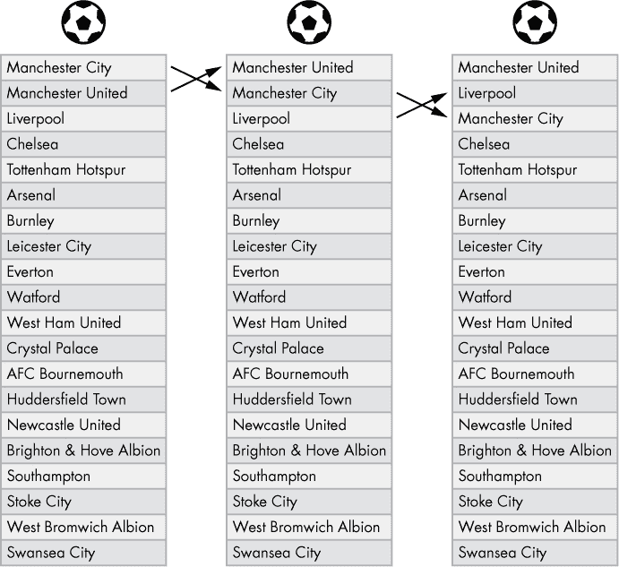

*图 6-2：英格兰超级联赛足球队的三种可能排名*

在计算机科学术语中，您会将每个排名表示为一个*排列*，它被定义为一组元素的特定顺序。我们的目标是找出给定集合的所有可能排列的数量。这些排列的数量对涉及投注应用程序、比赛预测和游戏分析的程序具有重要意义。例如，如果 100 个不同的排名每个都有相同的初始概率，那么某个特定排名的概率是 1/100 = 1%。这可以作为游戏预测算法的基础概率（*先验概率*）。在这些假设下，随机猜测的排名在一个赛季结束后有 1%的概率是正确的结果。

要计算给定*n*个元素的排列数量，您可以使用阶乘函数*n!*。在接下来的几段中，您将了解为什么是这样的。阶乘的定义如下：

*n! = n × (n – 1) × (n – 2) × . . . × 1*

例如：

*1! = 1*

*3! = 3 × 2 × 1 = 6*

*10! = 10 × 9 × 8 × 7 × 6 × 5 × 4 × 3 × 2 × 1 = 3,628,800*

*20! = 20 × 19 × 18 × . . . × 3 × 2 × 1 = 2,432,902,008,176,640,000*

让我们来看一下这个是如何工作的。假设您有一个包含 10 个元素的集合*S* = {*s*0, *s*1, *s*2, . . . , *s*9} 和 10 个桶*B* = {*b*0, *b*1, *b*2, . . . , *b*9}。您希望将集合*S*中的每个元素放入一个桶中。在足球的例子中，20 支队伍就是元素，20 个排名就是桶。为了得到*S*的一个特定排列，您只需要将所有元素放入所有桶中。将元素分配给桶的不同方式数量即为*S*中元素的排列总数。

以下算法确定了一个包含 10 个元素的集合的排列数量（这些元素需要放入 10 个桶中）：

1.  从集合*S*中取出第一个元素。现在有*10 个空桶*，所以你有*10 个选择*来放置元素。你将一个元素放入一个桶中。

1.  现在一个桶已经被占用了。取出集合中的第二个元素。现在剩下*9 个空桶*，因此你有*9 个选择*。

1.  最后，从集合中取出第 10 个（最后一个）元素。现在有九个桶已经占用。只剩下*一个空桶*，因此你有*一个选择*。

总共，你有 10 × 9 × 8 × 7 × 6 × 5 × 4 × 3 × 2 × 1 = 10! 种选项。每一个元素在桶中的潜在放置方式代表着集合元素的一种排列。因此，具有 *n* 个元素的集合的排列数就是 *n!*。

递归地，阶乘函数也可以这样定义：

*n! = n × (n – 1)!*

递归的基本情况如下所示：

*1! = 0! = 1*

这些基本情况背后的直觉是，具有一个元素的集合有一种排列，具有零个元素的集合也有一种排列（将零个元素分配到零个桶中只有一种方式）。

#### ***代码***

列表 6-3 中的单行代码将计算具有 *n* 个元素的集合的排列数 *n!*。

```py
## The Data

n = 5

## The One-Liner

factorial = lambda n: n * factorial(n-1) if n > 1 else 1

## The Result

print(factorial(n))
```

*列表 6-3：定义阶乘函数的单行递归解法*

尝试弄清楚这段代码的输出结果是什么。

#### ***它是如何工作的***

在代码中，你使用了阶乘的递归定义。让我们快速提升对递归的直观理解。斯蒂芬·霍金提出了一种简明的方式来解释递归：“要理解递归，必须首先理解递归。”

《梅里亚姆-韦伯斯特词典》将递归定义为“计算机编程技术，涉及使用一个……函数……多次调用自身，直到满足指定条件，此时每次重复的其余部分会从最后一次调用处理到第一次。”该定义的核心是*递归函数*，即一个调用自身的函数。但是，如果函数一直调用自身，它将永远不会停止。

基于这个原因，我们设置了一个特定的基本情况。当满足基本情况时，最后一次函数调用终止并返回给倒数第二次函数调用一个解答。倒数第二次函数调用也会将解答返回给倒数第三次函数调用。这引发了一个链式反应，将结果传递到更高的递归层级，直到第一次函数调用返回最终结果。几行英文文本可能让人难以理解这一点，但请跟着我走：我们将在接下来的单行示例中讨论这一点。

一般来说，你可以通过四个步骤创建一个递归函数*f*：

1.  将原问题拆解成更小的问题实例。

1.  将较小的问题实例作为函数*f*的输入（该函数随后将较小的输入拆解成更小的问题实例，以此类推）。

1.  定义一个*基本情况*，即可以直接解决的最小输入，无需再调用函数*f*。

1.  指定如何将获得的较小解重新组合成较大的解。

你创建了一个带有一个参数 `n` 的 lambda 函数，并将这个 lambda 函数赋值给名称 `factorial`。最后，你调用命名函数 `factorial(n-1)` 来计算函数调用 `factorial(n)` 的结果。值 `n` 可以是英超联赛的球队数量（`n=20`），或者是其他值，如清单 6-3 中的值（`n=5`）。

大致来说，你可以使用 `factorial(n-1)` 的简化解决方案，通过将前者与输入参数 `n` 相乘，来构建更难问题 `factorial(n)` 的解决方案。只要你达到递归的基本情况 `n <= 1`，你只需返回硬编码的解决方案 `factorial(1) =` `factorial(0) = 1`。

这个算法展示了如何通过彻底理解问题，通常能够找到解决问题的简单、简洁和高效的方法。在创建自己的算法时，选择最简单的解决方案是你可以做的最重要的事情之一。初学者通常发现自己编写的代码混乱且不必要地复杂。

在这种情况下，阶乘的递归（单行）定义比没有递归的迭代（单行）定义要简短。作为一个练习，试着重写这个单行代码，不使用递归定义，也不使用外部库——这并不简单，当然也没有那么简洁！

### **计算 Levenshtein 距离**

在本节中，你将学习一种重要的实际算法，用于计算 Levenshtein 距离。理解这个算法比之前的算法要复杂，所以你也将训练自己清晰地思考问题。

#### ***基础知识***

*Levenshtein 距离* 是一种计算两个字符串之间距离的度量；换句话说，它用于量化两个字符串的相似性。它的另一个名称 *编辑距离* 精确地描述了它所测量的内容：将一个字符串转换为另一个字符串所需的字符编辑次数（插入、删除或替换）。Levenshtein 距离越小，字符串越相似。

Levenshtein 距离在许多领域中有着重要的应用，比如智能手机上的自动纠正功能。如果你在 WhatsApp 消息中输入 *helo*，你的手机会检测到该单词不在其词库中，并选择几个高概率的单词作为潜在替换项，然后按 Levenshtein 距离对它们进行排序。例如，Levenshtein 距离最小的单词，因而最大相似度的单词是字符串 `'hello'`，因此你的手机可能会自动将 *helo* 修正为 *hello*。

让我们考虑一个例子，其中有两个不太相似的字符串 `'cat'` 和 `'chello'`。知道 Levenshtein 距离计算从第一个字符串到达第二个字符串所需的最小编辑次数，表 6-1 显示了最小的序列。

**表 6-1：** 将 `'cat'` 转换为 `'chello'` 所需的最小序列

| **当前单词** | **所做编辑** |
| --- | --- |
| **cat** | **—** |
| cht | 用 *h* 替换 *a* |
| che | 用 *e* 替换 *t* |
| chel | 在位置 3 插入 *l* |
| chell | 在位置 4 插入 *l* |
| chello | 在位置 5 插入 *o* |

表 6-1 将字符串 `'cat'` 转换为字符串 `'chello'`，需要五步编辑，这意味着 Levenshtein 距离是 5。

#### ***代码***

现在让我们编写一个 Python 单行代码来计算字符串 `a` 和 `b`，`a` 和 `c`，以及 `b` 和 `c` 的 Levenshtein 距离（见 清单 6-4）。

```py
## The Data

a = "cat"

b = "chello"

c = "chess"

## The One-Liner

ls = ➊lambda a, b: len(b) if not a else len(a) if not b else min(

 ➋ ls(a[1:], b[1:])+(a[0] != b[0]),

 ➌ ls(a[1:], b)+1,

 ➍ ls(a, b[1:])+1)

## The Result

print(ls(a,b))

print(ls(a,c))

print(ls(b,c))
```

*清单 6-4：用一行代码计算两个字符串的 Levenshtein 距离*

基于你目前所知道的，尝试在运行程序之前计算输出结果。

#### ***原理***

在进入代码之前，让我们快速探索一下一个在这个单行代码中大量使用的 Python 技巧。在 Python 中，*每个*对象都有一个布尔值，并且是 `True` 或 `False`。大多数对象实际上是 `True`，直观上，你可能能猜到一些是 `False` 的对象：

+   数值 `0` 为 `False`。

+   空字符串 `''` 为 `False`。

+   空列表 `[]` 为 `False`。

+   空集合 `set()` 为 `False`。

+   空字典 `{}` 为 `False`。

作为一个经验法则，如果 Python 对象是空的或零，它们被认为是 `False`。掌握了这一点后，让我们来看 Levenshtein 函数的第一部分：你创建了一个 lambda 函数，接受两个字符串 `a` 和 `b`，并返回将字符串 `a` 转换为字符串 `b` 所需的编辑次数 ➊。

有两个简单的情况：如果字符串 `a` 为空，最小的编辑距离是 `len(b)`，因为你只需要插入字符串 `b` 中的每个字符。同样，如果字符串 `b` 为空，最小的编辑距离是 `len(a)`。也就是说，如果其中一个字符串为空，你可以直接返回正确的编辑距离。

假设两个字符串都非空。你可以通过计算原始字符串 `a` 和 `b` 的较小后缀的 Levenshtein 距离来简化问题，如 图 6-3 所示。

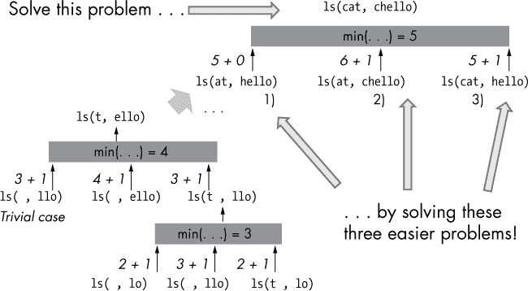

*图 6-3：通过递归解决较小的问题实例，计算单词 `'cat'` 和 `'chello'` 的 Levenshtein 距离*

要以递归方式计算字符串 `'cat'` 和 `'chello'` 之间的 Levenshtein 距离，你首先解决较容易的问题（递归地）：

1.  你计算后缀 `at` 和 `hello` 之间的距离，因为如果你知道如何将 `at` 转换为 `hello`，那么你可以通过修改第一个字符（或者如果两个字符串都以相同的字符开头，则保持第一个字符不变）轻松地将 `cat` 转换为 `chello`。假设这个距离是 5，你现在可以得出结论，`cat` 和 `chello` 之间的距离也最多是 5，因为你可以重用完全相同的编辑序列（两个词都以字符 `c` 开头，且你不需要编辑这个字符）。

1.  你计算`at`和`chello`之间的距离。假设这个距离是 6，那么你现在可以得出结论：`cat`和`chello`之间的距离至多是 6 + 1 = 7，因为你只需删除第一个单词的字符`c`（一个额外操作）。从此，你可以重用相同的解法从`at`变换到`chello`。

1.  你计算`cat`和`hello`之间的距离。假设这个距离是 5，那么你现在可以得出结论：`cat`和`chello`之间的距离至多是 5 + 1，因为你需要在第二个单词的开头插入字符`c`（一个额外操作）。

由于这些是你可以对首字符所做的所有可能操作（替换、删除、插入），`cat`和`chello`之间的 Levenshtein 距离是三种情况 1、2 和 3 中的最小值。现在让我们进一步分析列表 6-4 中的三种情况。

首先，你以递归方式计算从`a[1:]`到`b[1:]`的编辑距离 ➋。如果首字符`a[0]`和`b[0]`不同，你必须通过*替换*`a[0]`为`b[0]`来修正，因此你将编辑距离加一。如果首字符相同，较简单问题`ls(a[1:], b[1:])`的解也就是较复杂问题`ls(a, b)`的解，正如你在图 6-3 中所见。

第二，你以递归方式计算从`a[1:]`到`b`的距离 ➌。假设你已经知道这个距离的结果（从`a[1:]`到`b`）——那么如何计算从`a`到`b`的距离呢？答案是，只需*删除*`a`开头的第一个字符`a[0]`，这就是一个额外的操作。这样，你就将更复杂的问题简化为更简单的问题。

第三，你以递归方式计算从`a`到`b[1:]`的距离 ➍。假设你已经知道这个距离的结果（从`a`到`b[1:]`）。那么你如何计算从`a`到`b`的距离呢？在这种情况下，你只需再走一步（从`a`到`b[1:]`再到`b`），通过*插入*字符`b[0]`到单词`b[1:]`的开头，这样距离就增加了一。

最后，你只需选择所有三种结果的最小编辑距离（替换第一个字符、删除第一个字符、插入第一个字符）。

这个简洁的一行代码再次证明了训练递归技能的重要性。递归可能对你来说并不自然，但请放心，在像这样的递归问题学习之后，它会变得更加顺手。

### **使用函数式编程计算幂集**

在这一部分，你将学习一个重要的数学概念——幂集：所有子集的集合。你将在统计学、集合论、函数式编程、概率论和算法分析中用到幂集。

#### ***基础知识***

*幂集* 是给定集合 `s` 的所有子集的集合。它包括空集 `{}`、原始集合 `s` 和所有其他可能的子集。以下是几个示例。

示例 1:

+   给定集合：`s = {1}`

+   幂集: `P = {{},{1}}`

示例 2:

+   给定集合：`s = {1, 2}`

+   幂集: `P = {{},{1},{2},{1,2}}`

示例 3:

+   给定集合：`s = {1, 2, 3}`

+   幂集: `P = {{},{1},{2},{3},{1,2},{1,3},{2,3},{1,2,3}}`

要计算一个包含 *n* 个元素的集合 *s* 的幂集 *P*[n]*，你需要使用 *s* 中一个包含 (*n* – 1) 个元素的子集的较小幂集 *P*[n]*[–1]。假设你要计算集合 *s* = {1, 2, 3} 的幂集。

1.  用零个元素初始化幂集 *P*[0]，即 *P*[0] = {{}}。换句话说，这是空集的幂集，它只包含空集本身。

1.  要从包含 (*n* – 1) 个元素的幂集 *P*[n]*[–1] 创建包含 *n* 个元素的幂集 *P*[n]*，你需要从集合 *s* 中取出一个（任意）元素 *x*，并使用以下过程将所有生成的子集并入更大的幂集 *P*[n]*：

1.  遍历 *P*[n]*[–1] 中的所有集合 *p*，并创建一个新子集，该子集由 *x* 和 *p* 的并集组成。这将产生一个新的临时集合 *T*。例如，如果 *P*[2] = {{}, {1}, {2}, {1,2}}，你通过将元素 *x* = 3 添加到 *P*[2] 中的所有集合，会创建临时集合 *T* = {{3}, {1,3}, {2,3}, {1,2,3}}。

1.  将新的集合 *T* 与幂集 *P*[n]*[–1] 合并，得到幂集 *P*[n]*。例如，你可以通过将临时集合 *T* 与幂集 *P*[2] 合并，得到幂集 *P*[3]，合并过程如下： *P*[3] = *T union P*[2]。

1.  一直进行到原始集合 *s* 为空为止。

我将在接下来的部分更详细地解释这一策略。

##### **reduce() 函数**

但首先，你需要正确理解一个你将在一行代码中使用的重要 Python 函数：`reduce()` 函数。`reduce()` 函数内置于 Python 2 中，但开发者认为它的使用频率较低，因此没有将其包含在 Python 3 中，所以你需要先从 functools 库中导入它。

`reduce()` 函数接受三个参数：`reduce(function, iterable, initializer)`。`function` 参数定义了如何将两个值 `x` 和 `y` 合并成一个值（例如，`lambda x, y: x + y`）。这样，你可以迭代地将 `iterable`（第二个参数）中的两个值合并为一个值，直到 `iterable` 中只剩下一个值。`initializer` 参数是可选的——如果没有设置，Python 会默认将 `iterable` 的第一个值作为初始值。

例如，调用`reduce(lambda x, y: x + y, [0, 1, 2, 3])`会执行以下计算：`(((0 + 1)+ 2)+ 3) = 6`。换句话说，你首先将两个值`x=0`和`y=1`减少为和`x + y = 0 + 1 = 1`。然后，将这个 lambda 函数第一次调用的结果作为输入传递给第二次调用：`x=1`和`y=2`。结果是和`x + y = 1 + 2 = 3`。最后，我们将 lambda`function`第二次调用的结果作为输入传递给第三次调用，通过设置`x=3`和`y=3`。结果是和`x + y = 3 + 3 = 6`。

在上一个例子中，你已经看到值`x`始终携带前一个（lambda）`function`的结果。参数`x`作为累积值，而参数`y`作为来自`iterable`的*更新*值。这是预期的行为，旨在通过迭代地“减少”`iterable`参数中的所有值为单一值。可选的第三个参数`initializer`指定`x`的初始输入。这使得你可以定义一个*序列聚合器*，如列表 6-5 所示。

##### **列表算术**

在深入研究一行代码之前，你需要理解另外两个列表运算符。第一个是列表连接运算符`+`，它将两个列表拼接在一起。例如，表达式`[1, 2] + [3, 4]`的结果是新的列表`[1, 2, 3, 4]`。第二个是并集运算符`|`，它对两个集合执行简单的并集操作。例如，表达式`{1, 2} | {3, 4}`的结果是新的集合`{1, 2, 3, 4}`。

#### ***代码***

列表 6-5 提供了一个一行代码的解决方案，用于计算给定集合*s*的幂集。

```py
# Dependencies

from functools import reduce

# The Data

s = {1, 2, 3}

# The One-Liner

ps = lambda s: reduce(lambda P, x: ➊P + [subset | {x} for subset in P], s, ➋[set()])

# The Result

print(ps(s))
```

*列表 6-5：计算给定集合的幂集的一行代码解决方案*

猜猜这个代码片段的输出是什么！

#### ***工作原理***

这个一行代码的思想是将幂集从空集合开始 ➋，并不断向其中添加子集 ➊，直到无法再找到子集。

最初，幂集只包含空集合。在每一步，你从数据集`s`中取出一个元素`x`，并通过将`x`添加到幂集中已经存在的所有子集中来创建新的子集 ➋。正如你在本节介绍部分所看到的，每次考虑数据集`s`中的一个额外元素`x`时，幂集的大小都会翻倍。这样，你可以通过一次增加一个数据集元素（但每次增加*n*个子集）来扩展幂集。请注意，幂集的增长是指数级的：对于任何新的数据集元素`x`，你都会使幂集的大小翻倍。这是幂集的一个固有特性：它们会迅速超过任何存储容量——即使对于只有几十个元素的小型数据集也是如此。

你使用`reduce()`函数来维护当前的幂集变量`P`（最初只包含空集）。通过列表推导，`reduce()`函数为每个现有子集创建新的子集，并将其添加到幂集`P`中。具体而言，它将数据集中的值`x`添加到每个子集中，从而将幂集的大小翻倍（包含带有和不带有数据集元素`x`的子集）。通过这种方式，`reduce()`函数反复“合并”两个元素：幂集`P`和数据集中的元素`x`。

因此，这行代码的结果如下：

```py
# The Result

print(ps(s))

# [set(), {1}, {2}, {1, 2}, {3}, {1, 3}, {2, 3}, {1, 2, 3}]
```

这行代码很好地展示了理解 lambda 函数、列表推导和集合操作的重要性。

### **凯撒密码加密使用高级索引和列表推导**

在本节中，你将学习一种古老的加密技术——*凯撒密码*，这也是尤利乌斯·凯撒自己用来掩盖私人对话的工具。不幸的是，凯撒密码非常简单，很容易破解，无法提供真正的保护，但它仍然被用于娱乐和遮掩那些应该保护的论坛内容，以免被天真的读者看到。

#### ***基础知识***

凯撒密码的核心思想是将需要加密的字符按固定的位置数进行偏移。我们将特别看一种凯撒密码的变种——ROT13 算法。

*ROT13*算法是一种简单的加密算法，广泛用于许多论坛（例如 Reddit），用以防止剧透或隐藏对话的语义，避免新手看到。ROT13 算法容易破解——攻击者可以通过对加密文本中字母分布的概率分析来破解代码，即使攻击者不知道每个字符移动了多少位置。你不应该依赖这个算法来加密消息！尽管如此，ROT13 算法还是有很多轻度应用：

+   模糊化在线论坛中的谜题结果。

+   模糊化电影或书籍中的潜在剧透内容。

+   嘲笑其他弱加密算法：“56 位 DES 至少比 ROT13 强。”

+   在网站上模糊化电子邮件地址可以防止 99.999%的电子邮件垃圾机器人。

所以，ROT13 更像是互联网文化中的一个流行笑话和教育工具，而不是一个严肃的加密方法。

这个算法可以用一句话来解释：*ROT13 = 将要加密的字符串在 26 个字母的字母表中旋转 13 个位置（模 26）*（见图 6-4）。

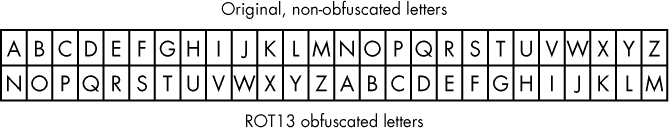

*图 6-4：该表显示了字母表中的每个字符在 ROT13 算法下的加密和解密方式。*

换句话说，你将每个字符在字母表中向后移动 13 个位置。当移动到最后一个字符*z*时，你会从字母表的第一个位置*a*重新开始。

#### ***代码***

清单 6-6 创建了一个单行代码，用来通过 ROT13 算法加密字符串`s`！

```py
## Data

abc = "abcdefghijklmnopqrstuvwxyz"

s = "xthexrussiansxarexcoming"

## One-Liner

rt13 = lambda x: "".join([abc[(abc.find(c) + 13) % 26] for c in x])

## Result

print(rt13(s))

print(rt13(rt13(s)))
```

*清单 6-6：使用 ROT13 算法加密字符串`s`的单行代码解决方案*

使用图 6-4 来破解这段代码：这段代码的输出是什么？

#### ***原理***

该单行代码解决方案通过将每个字符分别向右移动 13 个位置，使用存储在`abc`中的字母表加密每个字符，然后创建这些加密字符的列表，并将这些元素连接起来以得到加密后的短语`x`。

让我们更仔细地看看如何加密每个字符。你使用列表推导（参见第二章）通过将每个字符`c`替换为字母表中右移 13 个位置的字符来创建加密字符的列表。至关重要的是，要防止所有字母表中*索引 >= 13*的字符出现溢出。例如，将字符`z`（索引 25）向右移动 13 个位置，你会得到索引 25 + 13 = 38，但 38 不是字母表中的有效索引。为了解决这个问题，你使用模运算符来确保当字符超出字母表最大索引 25（字符`z`）时，重新计算字符的最终位置，且*索引 == 0*（字符`a`）。然后，继续向右移动剩余的 13 个位置，这些位置在重新开始前还没有应用过（参见图 6-5）。例如，字符`z`被右移 13 个位置到索引 38 取模 26（在 Python 代码中：`38%26`），结果是索引 12，即字符`m`。

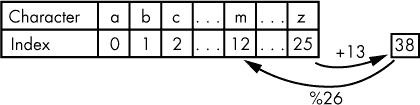

*图 6-5：通过从索引 0 重新开始移位操作来防止过度移位， resulting in the following shift sequence: 25 > 0 > 1 > . . . > 12*

下面是代码的关键部分，展示了如何将每个字符`c`移动 13 个位置：

```py
abc[(abc.find(c) + 13) % 26]
```

首先，你找到字符`c`在字母表`abc`中的索引。接着，你通过将整数 13 加到字符`c`的索引上来移动该索引，并考虑到我们之前提到的模 26 技巧。

这段单行代码的结果如下：

```py
## Result

print(rt13(s))

# kgurkehffvnafknerkpbzvat

print(rt13(rt13(s)))

# xthexrussiansxarexcoming
```

总结一下，你已经学会了凯撒密码的特殊变体——ROT13 算法，它将字符串中的每个字符在字母表中移动 13 个位置。将字符移动两次 13 + 13 = 26 个位置，结果得到原始字符，这意味着加密和解密使用相同的算法。

### **使用厄拉托斯特尼筛法寻找质数**

找到质数对于加密等实际应用至关重要。许多公钥方法（从密码学的角度来看）之所以安全，是因为计算大数的质因数通常效率低下且缓慢。我们将制作一个单行代码，使用一种古老的算法从一个数字范围中找出所有质数。

#### ***基础知识***

质数 *n* 是一个整数，除了 *i* 和 *n* 外，不能被任何其他整数整除而没有余数。换句话说，对于一个质数，不存在两个整数 *a>1* 和 *b>1* 使得它们的乘积等于该质数：*a**^b**=n*。

假设你想检查给定的数字 *n* 是否为质数。让我们从一个简单的算法开始来确定质数（参见 清单 6-7）。

```py
def prime(n):

➊ for i in range(2,n):

    ➋ if n % i == 0:

           return False

    return True

print(prime(10))

# False

print(prime(11))

# True

print(prime(7919))

# True
```

*清单 6-7：检查给定数字 `n` 是否为质数的简单实现*

算法检查 `2` 到 `n-1` 之间的所有数字 ➊，看看数字 `n` 是否能整除它而没有余数 ➋。例如，当确定数字 `n = 10` 是否是质数时，算法会迅速发现，表达式 `n % i == 0` 对于 `i = 2` 计算结果为 `True`。它找到了一个能整除 `n` 的数字 `i`，因此 `n` 不能是质数。在这种情况下，算法会中止进一步的计算并返回 `False`。

检查一个数字的时间复杂度与输入的 `n` 相同：在最坏情况下，算法需要 `n` 次循环迭代来检查数字 `n` 是否为质数。

假设你想计算从 `2` 到某个最大数字 `m` 之间的所有质数。你可以简单地重复 清单 6-7 中的质数测试 `m-1` 次（参见 清单 6-8）。然而，这会带来巨大的处理成本。

```py
# Find all prime numbers <= m

m = 20

primes = [n for n in range(2,m+1) if prime(n)]

print(primes)

# [2, 3, 5, 7, 11, 13, 17, 19]
```

*清单 6-8：找出所有小于最大数字 `m` 的质数*

这里我们使用列表推导式（参见 第二章）来创建一个包含所有小于 `m` 的质数的列表。我们引入了一个 `for` 循环，这意味着算法需要 `m` 次调用 `is_prime(n)` 函数，因此时间复杂度为 `m**2`。操作次数随输入 `m` 的增加呈平方增长。要找出所有小于 `m = 100` 的质数，需要进行最多 `m**2 = 10000` 次操作！

我们将构建一个单行代码，显著减少这个时间成本。

#### ***代码***

通过这行单行代码，我们将编写一个算法，找出所有小于最大整数 `m` 的质数，且该算法比我们的简单实现更高效。清单 6-9 中的单行代码灵感来自一种古老的算法——厄拉托斯特尼筛法，我将在本节中解释该算法。

```py
## Dependencies

from functools import reduce

## The Data

n=100

## The One-Liner

primes = reduce(lambda r, x: r - set(range(x**2, n, x)) if x in r else r,

                range(2, int(n**0.5) + 1), set(range(2, n)))

## The Result

print(primes)

# {2, 3, 5, 7, 11, 13, 17, 19, 23, 29, 31, 37, 41, 43,

#  47, 53, 59, 61, 67, 71, 73, 79, 83, 89, 97}
```

*清单 6-9：实现厄拉托斯特尼筛法的单行代码解决方案*

为了理解这里发生了什么，您可能需要一些额外的背景知识。

#### ***它是如何工作的***

坦白说，我曾犹豫是否将这行代码包括在书中。它令人困惑、复杂且难以阅读。然而，这正是你在实践中会遇到的代码类型，借助这本书，我希望确保你能理解每一行代码——即使需要一些时间。我在 StackOverflow 上偶然看到了这个单行代码版本。它大致基于一种古老的算法——*厄拉托斯特尼筛法*，该算法用于计算质数。

**注意**

*为了清晰起见，我修改了原始的 StackOverflow 一行代码。原始的一行代码可以在* [`stackoverflow.com/questions/10639861/python-prime-generator-in-one-line/`](https://stackoverflow.com/questions/10639861/python-prime-generator-in-one-line/) *找到，截止到本文撰写时。*

##### **埃拉托斯特尼筛法**

算法（概念上）创建了一个包含从`2`到*m*，最大整数值的巨大数字数组。数组中的所有数字都是*质数候选者*，意味着算法认为它们可能是质数（但不一定）。在算法的执行过程中，你会筛选掉不能是质数的候选者。只有在这个筛选过程中留下的数字，才是最终的质数。

为了实现这一点，算法会计算并标记数组中不是质数的数字。最后，所有未标记的数字就是质数。

算法重复以下步骤：

1.  从第一个数字 2 开始，并在每一步中递增，直到找到一个质数*x*。你知道*x*是质数，如果它未被标记，因为*x*未被标记意味着没有任何小于*x*的数字是它的除数——这就是质数的定义。

1.  标记所有数字*x*的倍数，因为它们也不是质数：数字*x*是所有这些数字的除数。

1.  进行简单优化：从数字*x × x*开始标记倍数，而不是从*2x*开始，因为所有在*2x*和*x × x*之间的数字已经被标记。这个优化有一个简单的数学推导，我稍后会描述。现在，只需知道你可以从*x × x*开始标记。

图 6-6 到 6-11 逐步解释了这个算法。

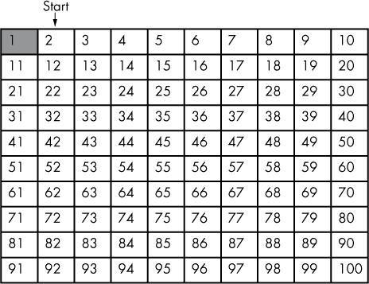

*图 6-6：初始化埃拉托斯特尼筛法算法*

最初，所有 2 到*m* = 100 之间的数字都未标记（白色单元格）。第一个未标记的数字 2 是一个质数。

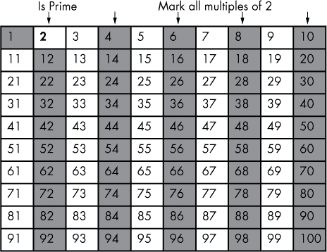

*图 6-7：标记所有 2 的倍数，因为它们不是质数。忽略接下来算法中的已标记数字。*

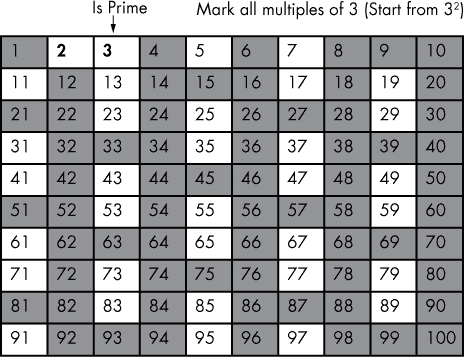

*图 6-8：标记 3 的倍数为“非质数”。*

增加到下一个未标记的数字 3。由于此时它未被标记，它是一个质数。由于你已经标记了所有小于当前数字 3 的倍数，因此没有任何小于 3 的数字是它的除数。根据定义，数字 3 必须是质数。标记所有 3 的倍数，因为它们不是质数。从数字 3 × 3 开始标记，因为在 3 和 3 × 3 = 9 之间的所有 3 的倍数已经被标记。

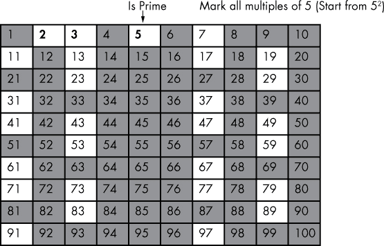

*图 6-9：标记 5 的倍数为“非质数”。*

转到下一个未标记的数字 5（它是一个质数）。标记所有 5 的倍数。从数字 5 × 5 开始标记，因为在 5 和 5 × 5 = 25 之间的所有 5 的倍数已经被标记。

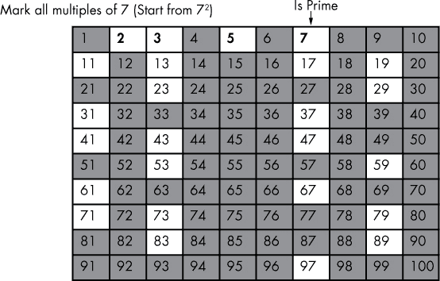

*图 6-10：标记 7 的倍数为“非质数”。*

增加到下一个未标记的数字 7（它是一个素数）。标记所有 7 的倍数。从 7 × 7 开始标记，因为 7 到 7 × 7 = 49 之间的所有 7 的倍数已经被标记过。

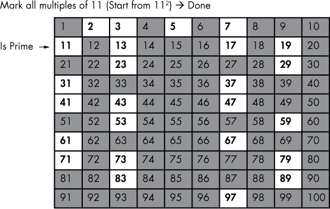

*图 6-11：将 11 的倍数标记为“非素数”。*

增加到下一个未标记的数字 11（它是一个素数）。标记所有 11 的倍数。因为你将从数字 11 × 11 = 121 开始标记，你会发现它已经大于我们的最大值*m* = 100。这使得算法终止。所有剩余的未标记数字都不能被任何数字整除，因此它们是素数。

埃拉托斯特尼筛法比朴素算法高效得多，因为朴素算法会*独立*地检查每个数字，忽略了之前的所有计算。而埃拉托斯特尼筛法则*重用*前面计算步骤的结果——这是许多算法优化领域中的一个常见思路。每次我们划去一个素数的倍数时，实际上是节省了检查这个倍数是否为素数的繁琐工作：我们已经知道它不是素数。

你可能会疑惑，为什么我们从平方的素数开始标记，而不是从素数本身开始。举例来说，在图 6-10 中的算法中，你刚刚找到了素数 7，并从 7 × 7 = 49 开始标记。原因是，你已经在之前的迭代中标记了所有其他倍数，如 7 × 2、7 × 3、7 × 4、7 × 5、7 × 6，因为你已经标记了所有比当前素数 7 小的数字的倍数：2、3、4、5、6。

##### **单行代码解析**

具备了对算法的全面概念理解后，你可以开始研究单行代码的解决方案：

```py
## The One-Liner

primes = reduce(lambda r, x: r - set(range(x**2, n, x)) if x in r else r,

                range(2, int(n**0.5) + 1), set(range(2, n)))
```

这个单行代码使用`reduce()`函数一步一步地从初始的所有数字集合中移除已标记的数字（在单行代码中：`set(range(2, n))`）。

将这个集合作为未标记值`r`的初始值，因为最开始时，所有的值都是未标记的。现在，这个单行代码会遍历所有`2`到`n`平方根之间的数字`x`（在单行代码中：`range(2, int(n**0.5) + 1)`），并从集合`r`中移除`x`的倍数（从`x**2`开始）——但仅当数字`x`是素数时，因为它在当前时刻没有从集合`r`中移除。

花 5 到 15 分钟重新阅读这段解释，仔细研究单行代码的不同部分。我保证你会觉得这个练习值得，因为它将显著提高你对 Python 代码的理解能力。

### **使用 reduce()函数计算斐波那契数列**

受欢迎的意大利数学家斐波那契（原名：比萨的莱昂纳多）在 1202 年引入了斐波那契数，并令人惊讶地观察到这些数字在数学、艺术和生物学等多个领域都有重要意义。本节将向你展示如何用一行代码计算斐波那契数。

#### ***基础知识***

斐波那契数列从 0 和 1 开始，然后，每个后续的元素是前两个元素的和。斐波那契数列的算法是内置的！

#### ***代码***

清单 6-10 计算了从 0 和 1 开始的前*n*个斐波那契数的列表。

```py
# Dependencies

from functools import reduce

# The Data

n = 10

# The One-Liner

fibs = reduce(lambda x, _: x + [x[-2] + x[-1]], [0] * (n-2), [0, 1])

# The Result

print(fibs)
```

*清单 6-10：用一行 Python 代码计算斐波那契数列*

研究这段代码并猜测输出结果。

#### ***原理解析***

你将再次使用强大的`reduce()`函数。一般来说，当你需要聚合实时计算的状态信息时，这个函数非常有用；例如，当你使用前两个计算出的斐波那契数来计算下一个斐波那契数时。这是使用列表推导式难以实现的（参见第二章），因为列表推导式通常无法访问从中新创建的值。

你使用`reduce()`函数，并传入三个参数，分别对应`reduce(function, iterable, initializer)`，依次将新的斐波那契数添加到聚合器对象中，`function`指定了如何将`iterable`对象中的每一个值依次合并到该聚合器对象中。

在这里，你使用一个简单的列表作为聚合器对象，初始斐波那契数为`[0, 1]`。记住，聚合器对象作为第一个参数传递给`function`（在我们的示例中是`x`）。

第二个参数是来自`iterable`的下一个元素。然而，你通过初始化`iterable`为`(n-2)`个虚拟值来强制`reduce()`函数执行`function` `(n-2)`次（目标是找到前`n`个斐波那契数——但你已经有了前两个，0 和 1）。你使用丢弃参数`_`表示你对`iterable`的虚拟值不感兴趣。相反，你只需将新计算的斐波那契数附加到聚合器列表`x`中，这个新数是前两个斐波那契数之和。

**另一种多行解决方案**

反复求和两个斐波那契数已经是清单 6-10 中单行代码的简单思路。清单 6-11 提供了一种美丽的替代方案。

```py
n = 10

x = [0,1]

fibs = x[0:2] + [x.append(x[-1] + x[-2]) or x[-1] for i in range(n-2)]

print(fibs)

# [0, 1, 1, 2, 3, 5, 8, 13, 21, 34]
```

*清单 6-11：以迭代方式查找斐波那契数的单行代码解决方案*

这段代码片段是由我的一位电子邮件订阅者提交的（欢迎加入我们，访问 [`blog.finxter.com/subscribe/`](https://blog.finxter.com/subscribe/)），它使用了带有副作用的列表推导式：变量 x 被更新`n-2`次，获取新的斐波那契数列元素。请注意，`append()`函数没有返回值，而是返回 None，这在布尔值上下文中被视为`False`。因此，列表推导式通过以下思路生成一个整数列表：

```py
print(0 or 10)

# 10
```

在两个整数之间执行`or`运算似乎不太正确，但请记住，布尔类型是基于整数类型的。除了 0 之外的每个整数值都被解释为 True。因此，`or`操作只是将第二个整数值作为返回值，而不是将其转换为显式的布尔值 True。这是一段精妙的 Python 代码！

总结来说，你已经提高了对 Python 一行代码中的另一个重要模式的理解：使用`reduce()`函数创建一个列表，该列表动态地使用新更新或添加的元素来计算新的列表元素。你在实践中会经常遇到这个有用的模式。

### **一个递归二分查找算法**

在这一节中，你将学习每个计算机科学家必须掌握的基本算法：二分查找算法。二分查找在许多基本数据结构的实现中有着重要的实际应用，比如集合、树、字典、哈希集合、哈希表、映射和数组。你在每个非平凡的程序中都会使用到这些数据结构。

#### ***基础知识***

简而言之，*二分查找算法*通过不断将序列的大小减半，来查找排序后的值序列`l`中的特定值`x`，直到只剩下一个值：它要么是要查找的值，要么在序列中不存在。接下来，你将详细了解这一通用思想。

例如，假设你想在一个已排序的列表中查找值 56。一个简单的算法会从列表的第一个元素开始，检查它是否等于 56，并继续检查下一个元素，直到检查完所有元素或者找到该值。在最坏的情况下，算法会遍历每一个列表元素。一个包含 10,000 个元素的已排序列表，需要大约 10,000 次操作来检查每个元素是否等于要查找的值。在算法理论中，我们说运行时间的复杂度是*线性*的，即与列表元素的数量成正比。这个算法没有利用所有可用信息来实现最大效率。

第一个有用的信息是，列表是已排序的！利用这一点，你可以创建一个只接触少量元素的算法，并且仍然能绝对确定某个元素是否存在于列表中。二分查找算法只遍历*log2(n)*个元素（以 2 为底的对数）。你只需要进行*log2*(10,000) < 14 次操作，就能查找一个包含 10,000 个元素的列表！

对于二分查找，你假设列表按升序排列。算法从检查中间元素开始。如果中间值大于你想要的值，你知道中间和列表最后部分之间的所有元素都大于你想要的值。你想要的值不会出现在这一半的列表中，所以你可以通过一次操作立即排除掉这一半的元素。

类似地，如果搜索的值大于中间元素，你可以排除列表的前半部分元素。然后，只需重复每一步将有效列表大小减半的过程来检查元素。 图 6-12 展示了一个可视化示例。

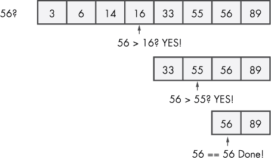

*图 6-12：二分查找算法的示例运行*

如果子列表包含偶数个元素，则没有明显的中间元素。在这种情况下，你需要向下取整中间元素的索引。

你想在一个排序的八个整数值的列表中找到值 56，并且尽量减少触碰的元素。二分查找算法检查中间元素 *x*（向下取整），然后丢弃列表中不可能包含 56 的那一半。这个检查有三种一般结果：

+   元素 *x* 大于 56\。算法忽略了列表的右半部分。

+   元素 *x* 小于 56\。算法忽略了列表的左半部分。

+   元素 *x* 等于 56，如 图 6-12 中的最后一行所示。恭喜你——你刚刚找到了所需的值！

清单 6-12 展示了二分查找算法的实际实现。

```py
def binary_search(lst, value):

    lo, hi = 0, len(lst)-1

    while lo <= hi:

        mid = (lo + hi) // 2

        if lst[mid] < value:

            lo = mid + 1

        elif value < lst[mid]:

            hi = mid - 1

        else:

            return mid

    return -1

l = [3, 6, 14, 16, 33, 55, 56, 89]

x = 56

print(binary_search(l,x))

# 6 (the index of the found element)
```

*清单 6-12：二分查找算法*

这个算法接受一个列表和一个待查找的值作为参数。然后，它通过使用两个变量 `lo` 和 `hi` 来反复将搜索空间减半，这两个变量定义了可能包含所需值的列表元素区间：`lo` 定义了起始索引，`hi` 定义了区间的结束索引。你检查中间元素落在哪种情况中，并通过调整 `lo` 和 `hi` 的值来适应潜在元素的区间，如所描述的那样。

虽然这是一个完全有效、可读且高效的二分查找算法实现，但它还不是一个真正的一行解决方案！

#### ***代码***

现在你将用一行代码实现二分查找算法（见 清单 6-13）！

```py
## The Data

l = [3, 6, 14, 16, 33, 55, 56, 89]

x = 33

## The One-Liner

➊ bs = lambda l, x, lo, hi: -1 if lo>hi else \ 

       ➋ (lo+hi)//2 if l[(lo+hi)//2] == x else \ 

       ➌ bs(l, x, lo, (lo+hi)//2-1) if l[(lo+hi)//2] > x else \ 

       ➍ bs(l, x, (lo+hi)//2+1, hi) 

## The Results

print(bs(l, x, 0, len(l)-1))
```

*清单 6-13：实现二分查找的单行解决方案*

猜猜这段代码的输出是什么！

#### ***它是如何工作的***

因为二分查找天然适合递归方法，学习这段一行代码将增强你对这一重要计算机科学概念的直观理解。注意，尽管我为了可读性将这段一行代码拆分成四行，你当然可以将它写成一行代码。在这段一行代码中，我采用了递归的方式定义二分查找算法。

你通过使用 `lambda` 运算符和四个参数：`l`、`x`、`lo` 和 `hi` ➊ 创建了一个新的函数 `bs`。前两个参数 `l` 和 `x` 是变量，分别表示排序后的列表和要查找的值。`lo` 和 `hi` 参数定义了当前子列表中要查找值 `x` 的最小和最大索引。在每一层递归中，代码会检查由 `hi` 和 `lo` 指定的子列表，随着索引 `lo` 增大和索引 `hi` 减小，子列表会越来越小。经过有限的步骤后，条件 `lo>hi` 为 `True`，此时搜索的子列表为空——你没有找到值 `x`。这是我们递归的基准情况。因为你没有找到元素 `x`，所以返回 `-1`，表示没有此元素。

你使用计算 `(lo+hi)//2` 来找到子列表的中间元素。如果这个元素恰好是你想要的值，你就返回该中间元素的索引 ➋。请注意，你使用整数除法来向下取整到下一个可用的整数值，该值可以作为列表的索引。

如果中间元素大于所需值，意味着右侧的元素也较大，因此你会递归调用该函数，但将 `hi` 索引调整为仅考虑中间元素左侧的列表元素 ➌。

同样，如果中间元素小于所需值，那么就没有必要搜索中间元素左边的所有元素，因此你会递归调用该函数，但将 `lo` 索引调整为仅考虑中间元素右侧的列表元素 ➍。

在列表 `[3, 6, 14, 16, 33, 55, 56, 89]` 中查找值 `33` 时，结果是索引 `4`。

这一行代码的部分加强了你对一些基本编程特性的理解，如条件执行、基础关键字、算术运算以及程序化序列索引等重要主题。更重要的是，你学会了如何利用递归使复杂的问题变得更简单。

### **递归快速排序算法**

现在你将构建一个一行代码来使用这种流行的算法 *快速排序*，顾名思义，它能快速地对数据进行排序。

#### ***基础知识***

快速排序是许多编程面试中的常见问题（谷歌、Facebook 和亚马逊都会问），同时它也是一种高效、简洁、易读的实际排序算法。由于其优雅性，大多数入门级算法课程都会讲解快速排序。

快速排序通过递归地将大问题分解为更小的问题，并以合并小问题的解决方案的方式解决大问题，从而对列表进行排序。

为了求解每个更小的问题，同样的策略会递归使用：将更小的问题进一步分解成更小的子问题，单独求解并合并，从而将快速排序归类为 *分治法* 算法。

快速排序选择一个*枢轴*元素，然后将所有大于枢轴的元素放到右侧，将所有小于或等于枢轴的元素放到左侧。这将排序列表的巨大问题分解为两个较小的子问题：排序两个更小的列表。然后，你递归地重复这一过程，直到获得一个包含零个元素的列表，该列表已排序，因此递归终止。

Figure 6-13 展示了快速排序算法的实际运行。

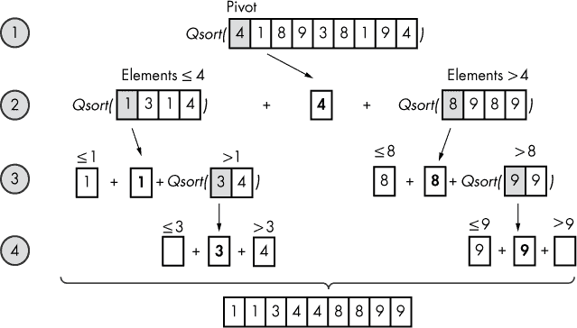

*Figure 6-13：快速排序算法的示例运行*

Figure 6-13 展示了快速排序算法在一个无序整数列表[4, 1, 8, 9, 3, 8, 1, 9, 4]上的应用。首先，它选择 4 作为枢轴元素，将列表分成一个无序子列表[1, 3, 1, 4]（其中所有元素小于或等于枢轴）和一个无序子列表[8, 9, 8, 9]（其中所有元素大于枢轴）。

接下来，快速排序算法递归地对这两个无序子列表进行排序。一旦子列表最多只包含一个元素，它们就被认为已排序，递归结束。

在每一层递归中，三个子列表（左子列表、枢轴、右子列表）会被连接起来，然后将结果列表传递给更高一层的递归。

#### ***代码***

你将创建一个`q`函数，在一行 Python 代码中实现快速排序算法，并对任何作为整数列表传递的参数进行排序（见 Listing 6-14）。

```py
## The Data

unsorted = [33, 2, 3, 45, 6, 54, 33]

## The One-Liner

q = lambda l: q([x for x in l[1:] if x <= l[0]]) + [l[0]] + q([x for x in l if x > l[0]]) if l else []

## The Result

print(q(unsorted))
```

*Listing 6-14：使用递归实现快速排序算法的单行解决方案*

现在，你能猜到——最后一次——这段代码的输出吗？

#### ***工作原理***

这行代码直接类似于我们刚才讨论的算法。首先，你创建一个新的`q` lambda 函数，它接收一个列表参数`l`用于排序。从高层次来看，lambda 函数具有以下基本结构：

```py
lambda l: q(left) + pivot + q(right) if l else []
```

在递归的基本情况中——即列表为空，因此可以被认为已经排序——lambda 函数返回空列表`[]`。

在其他任何情况下，函数将列表`l`的第一个元素作为枢轴元素，并根据元素是否小于或大于枢轴来将所有元素分为两个子列表（`left`和`right`）。为了实现这一点，你使用了简单的列表推导（见第二章）。由于两个子列表未必已经排序，你也会对它们递归地执行快速排序算法。最后，你将三个子列表合并并返回排序后的列表。因此，结果如下：

```py
## The Result

print(q(unsorted))

# [2, 3, 6, 33, 33, 45, 54]
```

### **总结**

在这一章中，你学习了计算机科学中的重要算法，涵盖了包括变位词、回文、幂集、排列、阶乘、质数、斐波那契数、混淆、搜索和排序等广泛主题。许多这些算法构成了更高级算法的基础，并包含了全面算法教育的种子。提升你对算法和算法理论的理解，是提高编程能力的最有效途径之一。我甚至可以说，缺乏算法理解是大多数中级程序员在学习进程中感到困惑的首要原因。

为了帮助你突破瓶颈，我在我的“Coffee Break Python”电子邮件系列中定期解释新的算法，旨在持续改进（访问 [*https://blog.finxter.com/subscribe/*](https://blog.finxter.com/subscribe/)）。感谢你花费宝贵的时间和精力研究所有的单行代码片段和解释，我希望你已经能够看到自己的技能有所提升。根据我教授成千上万名 Python 学习者的经验，超过一半的中级程序员在理解基础的 Python 单行代码时会遇到困难。只要你保持坚持不懈，就有很大的机会超越中级程序员，成为 Python 大师（或者至少是前 10%的优秀程序员）。
