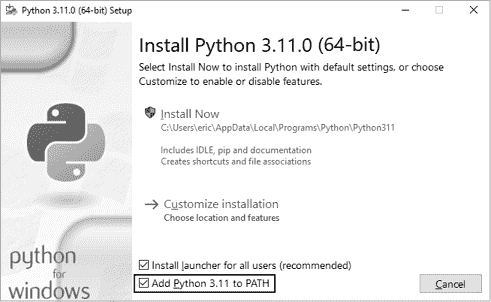

## 入门


在这一章中，你将运行你的第一个 Python 程序，*hello_world.py*。首先，你需要检查计算机上是否安装了最新版本的 Python；如果没有，你将安装它。你还将安装一个文本编辑器来处理你的 Python 程序。文本编辑器会识别 Python 代码，并在你编写时突出显示代码部分，使你更容易理解代码的结构。

## 设置你的编程环境

Python 在不同的操作系统上略有不同，因此你需要记住一些注意事项。在接下来的章节中，我们将确保 Python 在你的系统上正确设置。

### Python 版本

每种编程语言都会随着新想法和新技术的出现而不断发展，Python 的开发者们也不断让这门语言变得更加多功能和强大。截至目前，本书的内容应该可以在 Python 3.9 或更高版本上运行，但目前最新版本是 Python 3.11。在本节中，我们将检查你的系统是否已经安装了 Python，以及是否需要安装更新的版本。附录 A 还包含了在各大操作系统上安装最新版本 Python 的详细信息。

### 运行 Python 代码片段

你可以在终端窗口中运行 Python 的解释器，允许你尝试 Python 代码的片段，而不必保存并运行整个程序。

在本书中，你将看到如下所示的代码片段：

```py
>>> **print("Hello Python interpreter!")**
Hello Python interpreter!
```

三个尖括号（`>>>`）提示符，我们称之为*Python 提示符*，表示你应该使用终端窗口。粗体文本是你应该输入并通过按下 ENTER 键执行的代码。本书中的大部分示例是小型、独立的程序，你将在文本编辑器中运行它们，而不是通过终端，因为你将大部分代码编写在文本编辑器中。但有时，基本概念会通过一系列在 Python 终端会话中运行的代码片段来展示，以便更高效地演示特定概念。当你在代码列表中看到三个尖括号时，你正在查看来自终端会话的代码和输出。稍后我们将尝试在你的系统中运行解释器进行编码。

我们还将使用文本编辑器创建一个简单的程序，名为*Hello World!*，它已经成为学习编程的必备程序。在编程界有一个长期的传统，认为将`Hello world!`消息输出到屏幕作为新语言的第一个程序，会带来好运。如此简单的程序有着非常实际的用途。如果它在你的系统上正确运行，那么你编写的任何 Python 程序也应该能够正常运行。

### 关于 VS Code 编辑器

*VS Code* 是一个功能强大、专业级的文本编辑器，免费且适合初学者。VS Code 非常适合简单和复杂的项目，因此如果你在学习 Python 的过程中熟悉使用它，你可以继续使用它来处理更大更复杂的项目。VS Code 可以安装在所有现代操作系统上，并且支持包括 Python 在内的大多数编程语言。

附录 B 提供了关于其他文本编辑器的信息。如果你对其他选项感兴趣，可以在此时浏览该附录。如果你想快速开始编程，可以使用 VS Code 来启动。然后，在你积累了一些编程经验后，你可以考虑使用其他编辑器。在这一章中，我将带你完成在你的操作系统上安装 VS Code 的过程。

## 不同操作系统上的 Python

Python 是一种跨平台编程语言，这意味着它可以在所有主流操作系统上运行。你编写的任何 Python 程序应该可以在任何安装了 Python 的现代计算机上运行。然而，在不同操作系统上设置 Python 的方法略有不同。

在这一部分中，你将学习如何在你的系统上设置 Python。你将首先检查是否安装了最新版本的 Python，如果没有安装，则进行安装。然后，你将安装 VS Code。这是每个操作系统中唯一不同的两步。

在接下来的章节中，你将运行 *hello_world.py* 并解决任何无法正常工作的部分。我将为每个操作系统带你完成这个过程，这样你就能拥有一个可靠的 Python 编程环境。

### Windows 上的 Python

Windows 通常不会预装 Python，因此你可能需要先安装它，然后再安装 VS Code。

#### 安装 Python

首先，检查你的系统是否已安装 Python。通过在开始菜单中输入 `command` 并点击 **命令提示符** 应用来打开命令窗口。在终端窗口中，输入小写的 `python`。如果你看到 Python 提示符（`>>>`），则表示 Python 已安装在你的系统中。如果你看到错误信息，告诉你 `python` 不是一个已识别的命令，或者如果 Microsoft Store 被打开，那么 Python 就没有安装。如果 Microsoft Store 打开，关闭它；最好从官方渠道下载安装程序，而不是使用 Microsoft 版本。

如果你的系统上没有安装 Python，或者你看到的版本早于 Python 3.9，那么你需要下载 Windows 版本的 Python 安装程序。访问 [`python.org`](https://python.org)，将鼠标悬停在 **Downloads** 链接上。你应该看到一个按钮，点击该按钮即可自动下载适合你系统的最新版本的 Python 安装程序。下载完成后，运行安装程序。确保你选择了 **Add Python to PATH** 选项，这将使配置系统更加方便。图 1-1 显示了该选项已被选中。



图 1-1：确保你勾选了标有 *Add Python to PATH* 的复选框。

#### 在终端会话中运行 Python

打开一个新的命令窗口并输入小写的 `python`。你应该看到 Python 提示符（`>>>`），这意味着 Windows 找到了你刚安装的 Python 版本。

```py
C:\> **python**
Python 3.`x`.`x` (main, Jun . . . , 13:29:14) [MSC v.1932 64 bit (AMD64)] on win32
Type "help", "copyright", "credits" or "license" for more information.
>>>
```

在你的 Python 会话中输入以下命令：

```py
>>> **print("Hello Python interpreter!")**
Hello Python interpreter!
>>>
```

你应该看到输出 `Hello Python interpreter!`。每当你想运行一段 Python 代码时，只需打开命令窗口并启动一个 Python 终端会话。要关闭终端会话，按 CTRL-Z 然后按 ENTER，或者输入命令 `exit()`。

#### 安装 VS Code

你可以在 [`code.visualstudio.com`](https://code.visualstudio.com) 下载 VS Code 安装程序。点击 **Download for Windows** 按钮并运行安装程序。跳过接下来的 macOS 和 Linux 部分，按照第 9 页的“运行 Hello World 程序”步骤操作。

### macOS 上的 Python

在最新版本的 macOS 上，Python 默认没有安装，因此如果你还没有安装，你需要进行安装。在本节中，你将安装最新版本的 Python，然后安装 VS Code 并确保其正确配置。

#### 检查是否安装了 Python 3

通过访问 **应用程序**▶**实用工具**▶**终端** 来打开终端窗口。你也可以按 ⌘-空格键，输入 `terminal`，然后按回车键。要检查是否安装了足够新的 Python 版本，输入 `python3`。你很可能会看到一条关于安装 *命令行开发工具* 的消息。最好在安装 Python 后再安装这些工具，所以如果出现此消息，请取消弹出的窗口。

如果输出显示你安装了 Python 3.9 或更高版本，可以跳过下一节，直接进入“在终端会话中运行 Python”。如果你看到任何早于 Python 3.9 的版本，请按照下一节的说明安装最新版本。

请注意，在 macOS 上，每当你在本书中看到 `python` 命令时，你需要使用 `python3` 命令来确保你正在使用 Python 3。大多数 macOS 系统中，`python` 命令要么指向一个过时的 Python 版本，只应由内部系统工具使用，要么指向空白并产生错误信息。

#### 安装最新版本的 Python

你可以在 [`python.org`](https://python.org) 找到适用于你的系统的 Python 安装程序。将鼠标悬停在 **Download** 链接上，你应该会看到一个下载最新版本 Python 的按钮。点击该按钮，应该会自动开始下载适用于你系统的正确安装程序。文件下载后，运行该安装程序。

安装程序运行后，应该会出现一个 Finder 窗口。双击 *Install Certificates.command* 文件。运行此文件将帮助你更轻松地安装你在现实项目中需要的附加库，包括本书后半部分的项目。

#### 在终端会话中运行 Python

你现在可以通过打开一个新的终端窗口并输入 `python3` 来尝试运行 Python 代码片段：

```py
$ **python3**
Python 3.`x`.`x` (v3.11.0:eb0004c271, Jun . . . , 10:03:01)
[Clang 13.0.0 (clang-1300.0.29.30)] on darwin
Type "help", "copyright", "credits" or "license" for more information.
>>>
```

该命令会启动 Python 终端会话。你应该会看到 Python 提示符（`>>>`），这意味着 macOS 已经找到了你刚刚安装的 Python 版本。

在终端会话中输入以下命令：

```py
>>> **print("Hello Python interpreter!")**
Hello Python interpreter!
>>>
```

你应该会看到消息 `Hello Python interpreter!`，它应该会直接在当前终端窗口中打印出来。你可以通过按 CTRL-D 或输入命令 `exit()` 来关闭 Python 解释器。

#### 安装 VS Code

要安装 VS Code 编辑器，你需要在 [`code.visualstudio.com`](https://code.visualstudio.com) 下载安装程序。点击**下载**按钮，然后打开**Finder**窗口，进入**下载**文件夹。将**Visual Studio Code**安装程序拖到应用程序文件夹，然后双击安装程序运行。

跳过接下来的关于 Linux 上 Python 的部分，按照第 9 页“运行 Hello World 程序”中的步骤进行操作。

### Linux 上的 Python

Linux 系统专为编程设计，因此大多数 Linux 计算机上已经安装了 Python。编写和维护 Linux 的人期望你在某个时候自己进行编程，并鼓励你这样做。因此，开始编程时几乎没有需要安装的内容，只有少量的设置需要更改。

#### 检查你的 Python 版本

通过运行系统上的终端应用程序打开终端窗口（在 Ubuntu 中，你可以按 CTRL-ALT-T）。要查找安装的 Python 版本，输入小写的`python3`。当 Python 安装完成时，这个命令会启动 Python 解释器。你应该能看到显示已安装 Python 版本的输出。你还应该看到一个 Python 提示符（`>>>`），在这里你可以开始输入 Python 命令：

```py
$ **python3**
Python 3.10.4 (main, Apr  . . . , 09:04:19) [GCC 11.2.0] on linux
Type "help", "copyright", "credits" or "license" for more information.
>>>
```

这个输出表示 Python 3.10.4 是当前安装在这台计算机上的默认 Python 版本。当你看到这个输出时，按 CTRL-D 或输入`exit()`以退出 Python 提示符并返回终端提示符。每当你在本书中看到`python`命令时，应该输入`python3`代替。

你需要 Python 3.9 或更高版本才能运行本书中的代码。如果你系统上安装的 Python 版本低于 3.9，或者如果你想更新到当前可用的最新版本，请参考附录 A 中的说明。

#### 在终端会话中运行 Python

你可以通过打开终端并输入`python3`来尝试运行 Python 代码片段，正如你在检查版本时所做的那样。再次执行此操作，当 Python 正在运行时，在终端会话中输入以下行：

```py
>>> **print("Hello Python interpreter!")**
Hello Python interpreter!
>>>
```

消息应该直接显示在当前的终端窗口中。记住，你可以通过按 CTRL-D 或输入命令`exit()`来关闭 Python 解释器。

#### 安装 VS Code

在 Ubuntu Linux 上，你可以通过 Ubuntu 软件中心安装 VS Code。点击菜单中的 Ubuntu 软件图标，然后搜索*vscode*。点击名为**Visual Studio Code**的应用（有时也叫*code*），然后点击**安装**。安装完成后，搜索你的系统，找到*VS Code*，然后启动该应用。

## 运行 Hello World 程序

在安装了最新版本的 Python 和 VS Code 后，你几乎准备好在文本编辑器中运行你的第一个 Python 程序了。但在此之前，你需要为 VS Code 安装 Python 扩展。

### 为 VS Code 安装 Python 扩展

VS Code 支持多种编程语言；作为 Python 开发者，想要最大限度地发挥它的作用，你需要安装 Python 扩展。这个扩展提供了编写、编辑和运行 Python 程序的支持。

要安装 Python 扩展，点击 VS Code 应用程序左下角的齿轮图标。在出现的菜单中，点击 **扩展**。在搜索框中输入 `python`，然后点击 **Python** 扩展。（如果你看到多个名为 *Python* 的扩展，请选择由 Microsoft 提供的那个。）点击 **安装**，并安装任何你的系统需要的附加工具来完成安装。如果看到提示需要安装 Python，而你已经安装了，可以忽略此消息。

### 运行 hello_world.py

在编写第一个程序之前，在桌面上创建一个名为 *python_work* 的文件夹来存放你的项目。最好在文件和文件夹名称中使用小写字母和下划线代替空格，因为 Python 使用这种命名惯例。你可以在桌面以外的地方创建此文件夹，但如果直接将 *python_work* 文件夹保存在桌面上，之后的一些步骤会更容易跟随。

打开 VS Code，如果 **Get Started** 标签页还未关闭，请关闭它。通过点击 **文件**▶**新建文件**，或者按 CTRL-N（在 macOS 上为 ⌘-N）来创建一个新文件。将文件保存为 *hello_world.py*，保存在你的 *python_work* 文件夹中。扩展名 *.py* 告诉 VS Code 你的文件是用 Python 编写的，并且告诉它如何运行程序并以有帮助的方式高亮显示文本。

保存文件后，在编辑器中输入以下内容：

**hello_world.py**

```py
print("Hello Python world!")
```

要运行程序，选择 **运行**▶**无调试运行**，或者按 CTRL-F5。VS Code 窗口底部应该出现一个终端屏幕，显示你程序的输出：

```py
Hello Python world!
```

你可能会看到一些额外的输出，显示用于运行程序的 Python 解释器。如果你想简化显示的信息，只看到程序的输出，请参阅附录 B。附录 B 中也提供了关于如何更高效使用 VS Code 的一些有用建议。

如果你没有看到这个输出，可能程序出了问题。检查你输入的每个字符。你是否不小心把 `print` 大小写写错了？你是否忘记了一个或两个引号或括号？编程语言要求非常具体的语法，如果你没有遵循，程序就会出错。如果你无法运行程序，请参阅下一节中的建议。

## 故障排除

如果无法运行 *hello_world.py*，这里有一些可以尝试的解决办法，它们也是解决任何编程问题的常见方法：

+   当程序包含重大错误时，Python 会显示一个*traceback*（回溯），这是一个错误报告。Python 会浏览文件并尝试识别问题。检查回溯，它可能会给你一个线索，指示是什么问题导致程序无法运行。

+   离开电脑，休息一下，然后再试一次。记住，编程中语法非常重要，因此像引号不匹配或括号不匹配这样的简单问题就可能导致程序无法正常运行。重新阅读本章相关部分，检查你的代码，试着找到问题所在。

+   从头开始。你可能不需要卸载任何软件，但删除你的*hello_world.py*文件并从头创建它可能更有意义。

+   请别人按照本章中的步骤在你的电脑或其他电脑上操作，仔细观察他们的操作。你可能会错过一个小步骤，而别人恰好会发现。

+   请参阅附录 A 中的额外安装说明；附录中包含的一些细节可能会帮助你解决问题。

+   找一个懂 Python 的人，向他们求助帮助你完成设置。如果你问问周围的人，你可能会意外地发现有认识的人会使用 Python。

+   本章中的设置说明也可以通过本书的伴随网站访问：[`ehmatthes.github.io/pcc_3e`](https://ehmatthes.github.io/pcc_3e)。在线版本的这些说明可能会更有效，因为你可以直接剪切粘贴代码并点击链接获取所需资源。

+   在线寻求帮助。附录 C 提供了许多资源，例如论坛和在线聊天网站，你可以在这些地方向已经解决过你当前问题的人寻求解决方案。

永远不要担心打扰经验丰富的程序员。每个程序员都曾经卡在某个点上，而且大多数程序员都很乐意帮助你正确设置系统。只要你能清楚地说明你在做什么，已经尝试了哪些方法，得到了什么结果，那么很有可能有人能够帮助你。正如在导言中提到的，Python 社区对初学者非常友好和欢迎。

Python 应该能在任何现代计算机上良好运行。最初的设置问题可能令人沮丧，但完全值得解决。一旦你成功运行*hello_world.py*，你就可以开始学习 Python，并且你的编程工作将变得更加有趣和令人满足。

## 从终端运行 Python 程序

你将大部分程序直接在文本编辑器中运行。但是，有时从终端运行程序更有用。例如，你可能想运行一个现有的程序，而无需打开它进行编辑。

只要你知道如何访问存储程序文件的目录，你可以在任何安装了 Python 的系统上进行此操作。为了尝试这个，确保你已将*hello_world.py*文件保存在桌面上的*python_work*文件夹中。

### 在 Windows 上

你可以使用终端命令`cd`，即*切换目录*，在命令窗口中浏览你的文件系统。命令`dir`，即*目录*，会显示当前目录下所有存在的文件。

打开一个新的终端窗口，输入以下命令来运行*hello_world.py*：

```py
C:\> **cd Desktop\python_work**
C:\Desktop\python_work> **dir**
hello_world.py
C:\Desktop\python_work> **python hello_world.py**
Hello Python world!
```

首先，使用`cd`命令导航到*python_work*文件夹，该文件夹位于*Desktop*文件夹中。接下来，使用`dir`命令确认*hello_world.py*在该文件夹中。然后，使用命令`python hello_world.py`来运行该文件。

大多数程序可以直接从编辑器运行。然而，随着工作变得更加复杂，你可能会希望从终端运行一些程序。

### 在 macOS 和 Linux 上

在终端会话中运行 Python 程序在 Linux 和 macOS 上是相同的。你可以使用终端命令`cd`，即*切换目录*，在终端会话中浏览你的文件系统。命令`ls`，即*列出*，会显示当前目录下所有非隐藏的文件。

打开一个新的终端窗口，输入以下命令来运行*hello_world.py*：

```py
~$ **cd Desktop/python_work/**
~/Desktop/python_work$ **ls**
hello_world.py
~/Desktop/python_work$ **python3 hello_world.py**
Hello Python world!
```

首先，使用`cd`命令导航到*python_work*文件夹，该文件夹位于*Desktop*文件夹中。接下来，使用`ls`命令确认*hello_world.py*在该文件夹中。然后，使用命令`python3 hello_world.py`来运行该文件。

大多数程序可以直接从编辑器运行。但随着工作变得更加复杂，你可能会希望从终端运行一些程序。

## 小结

在本章中，你了解了 Python 的基本知识，如果你的系统尚未安装 Python，你也安装了它。你还安装了一个文本编辑器，以便更轻松地编写 Python 代码。你在终端会话中运行了 Python 代码片段，并运行了第一个程序*hello_world.py*。你可能还学到了一些故障排除的知识。

在下一章中，你将学习可以在 Python 程序中使用的不同数据类型，并且你也将开始使用变量。

