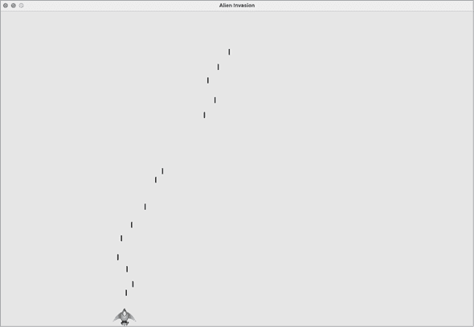

# 第十二章：12

一艘发射子弹的飞船


让我们来制作一个名为*外星人入侵*的游戏！我们将使用 Pygame，一个强大而有趣的 Python 模块集合，能够处理图形、动画，甚至音效，让你更容易构建复杂的游戏。借助 Pygame 来处理诸如绘制图像到屏幕等任务，你可以专注于游戏动态的更高级逻辑。

在本章中，你将设置 Pygame，并创建一艘能够响应玩家输入左右移动并发射子弹的火箭飞船。在接下来的两章中，你将创建一支外星舰队进行摧毁，然后继续通过设置飞船数量限制和添加记分板来完善游戏。

在构建这个游戏的过程中，你还将学习如何管理跨多个文件的大型项目。我们将重构大量代码并管理文件内容，以组织项目并使代码高效。

制作游戏是学习语言的理想方式，它既有趣又富有挑战性。玩自己写的游戏是一种极大的满足感，编写一个简单的游戏将让你学到很多关于专业人士如何开发游戏的知识。在本章过程中，输入并运行代码，找出每个代码块如何为整体游戏玩法做出贡献。尝试不同的值和设置，更好地理解如何优化游戏中的交互。

## 项目规划

当你在构建一个大型项目时，重要的是在开始编写代码之前先准备一个计划。你的计划将帮助你保持专注，并使你更有可能完成项目。

让我们写一个关于游戏玩法的一般描述。尽管以下描述没有涵盖*外星人入侵*的每个细节，但它提供了一个清晰的思路，帮助你开始构建游戏：

> 在*外星人入侵*中，玩家控制一艘出现在屏幕底部中央的火箭飞船。玩家可以使用箭头键控制飞船左右移动，使用空格键发射子弹。当游戏开始时，一支外星舰队充满了天空，并向屏幕的两侧和下方移动。玩家射击并摧毁外星人。如果玩家摧毁了所有外星人，新的舰队会出现，且它的移动速度比前一支更快。如果任何外星人撞到玩家的飞船或到达屏幕底部，玩家会失去一艘飞船。如果玩家失去了三艘飞船，游戏结束。

在开发的第一阶段，我们将制作一艘能够在玩家按下箭头键时左右移动，并在玩家按下空格键时发射子弹的飞船。在设置好这一行为后，我们可以创建外星人并优化游戏玩法。

## 安装 Pygame

在开始编写代码之前，先安装 Pygame。我们将以与第十一章安装 pytest 相同的方式进行安装：使用 pip。如果你跳过了第十一章或需要复习 pip，请参阅第 210 页的“使用 pip 安装 pytest”。

要安装 Pygame，在终端提示符下输入以下命令：

```py
$ **python -m pip install --user pygame**
```

如果你使用除`python`之外的命令来运行程序或启动终端会话，例如`python3`，请确保使用该命令来代替。

## 启动游戏项目

我们将通过创建一个空的 Pygame 窗口来开始构建游戏。稍后，我们将在该窗口上绘制游戏元素，例如飞船和外星人。我们还将使游戏响应用户输入，设置背景颜色，并加载飞船图像。

### 创建 Pygame 窗口并响应用户输入

我们将通过创建一个类来表示游戏，从而制作一个空的 Pygame 窗口。在文本编辑器中，创建一个新文件并将其保存为*alien_invasion.py*；然后输入以下内容：

**alien_invasion.py**

```py
import sys

import pygame

class AlienInvasion:
    """Overall class to manage game assets and behavior."""

    def __init__(self):
        """Initialize the game, and create game resources."""
❶         pygame.init()

❷         self.screen = pygame.display.set_mode((1200, 800))
        pygame.display.set_caption("Alien Invasion")

    def run_game(self):
        """Start the main loop for the game."""
❸         while True:
            # Watch for keyboard and mouse events.
❹             for event in pygame.event.get():
❺                 if event.type == pygame.QUIT:
                    sys.exit()

            # Make the most recently drawn screen visible.
❻             pygame.display.flip()

if __name__ == '__main__':
    # Make a game instance, and run the game.
    ai = AlienInvasion()
    ai.run_game()
```

首先，我们导入`sys`和`pygame`模块。`pygame`模块包含了制作游戏所需的功能。我们将使用`sys`模块中的工具来在玩家退出时退出游戏。

*Alien Invasion*从一个名为`AlienInvasion`的类开始。在`__init__()`方法中，`pygame.init()`函数初始化 Pygame 正常工作所需的背景设置❶。然后，我们调用`pygame.display.set_mode()`来创建一个显示窗口❷，在该窗口上我们将绘制所有游戏的图形元素。参数`(1200, 800)`是一个元组，定义了游戏窗口的尺寸，宽度为 1,200 像素，高度为 800 像素。（你可以根据显示器的大小调整这些值。）我们将这个显示窗口分配给属性`self.screen`，这样它将在类中的所有方法中可用。

我们分配给`self.screen`的对象称为表面。在 Pygame 中，*表面*是屏幕上的一部分，用于显示游戏元素。游戏中的每个元素，例如外星人或飞船，都是一个独立的表面。`display.set_mode()`返回的表面表示整个游戏窗口。当我们激活游戏的动画循环时，这个表面会在每次通过循环时重新绘制，因此可以更新任何由用户输入触发的变化。

游戏由`run_game()`方法控制。这个方法包含一个`while`循环❸，它会持续运行。`while`循环中包含一个事件循环和管理屏幕更新的代码。*事件*是用户在游戏过程中执行的操作，例如按下某个键或移动鼠标。为了使我们的程序响应事件，我们编写一个*事件循环*来*监听*事件，并根据发生的事件类型执行相应的任务。嵌套在`while`循环内的`for`循环就是一个事件循环。

要访问 Pygame 检测到的事件，我们将使用`pygame.event.get()`函数。该函数返回自上次调用该函数以来发生的事件列表。任何键盘或鼠标事件都会导致该`for`循环运行。在循环内部，我们将编写一系列`if`语句来检测并响应特定事件。例如，当玩家点击游戏窗口的关闭按钮时，会检测到`pygame.QUIT`事件，并调用`sys.exit()`来退出游戏❺。

调用`pygame.display.flip()` ❻ 告诉 Pygame 显示最近绘制的屏幕。在这种情况下，它会在每次通过`while`循环时绘制一个空白屏幕，抹去旧屏幕，只显示新屏幕。当我们移动游戏元素时，`pygame.display.flip()`会持续更新显示，以显示游戏元素的新位置并隐藏旧位置，创造出流畅运动的错觉。

在文件末尾，我们创建一个游戏实例，然后调用`run_game()`。我们将`run_game()`放在一个`if`语句块中，只有在文件被直接调用时才会运行。当你运行这个*alien_invasion.py*文件时，应该能看到一个空白的 Pygame 窗口。

### 控制帧率

理想情况下，游戏应该在所有系统上以相同的速度，或称为*帧率*运行。控制一个可以在多个系统上运行的游戏的帧率是一个复杂的问题，但 Pygame 提供了一种相对简单的方法来实现这一目标。我们将创建一个时钟，并确保时钟在每次主循环中滴答一次。任何时候如果循环处理速度超过我们定义的帧率，Pygame 将计算正确的暂停时间，以确保游戏以一致的速度运行。

我们将在`__init__()`方法中定义时钟：

**alien_invasion.py**

```py
 def __init__(self):
 """Initialize the game, and create game resources."""
 pygame.init()
 self.clock = pygame.time.Clock()
  *--snip--*
```

在初始化`pygame`后，我们创建一个`Clock`类的实例，来自`pygame.time`模块。然后我们将在`run_game()`的`while`循环末尾让时钟滴答作响：

```py
 def run_game(self):
 """Start the main loop for the game."""
 while True:
  *--snip--*
 pygame.display.flip()
            self.clock.tick(60)
```

`tick()`方法接受一个参数：游戏的帧率。在这里，我使用的是 60 的值，这样 Pygame 将尽力确保循环每秒运行 60 次。

### 设置背景颜色

Pygame 默认会创建一个黑色屏幕，但那太无聊了。让我们设置一个不同的背景颜色。我们将在`__init__()`方法的末尾进行设置。

**alien_invasion.py**

```py
 def __init__(self):
  *--snip--*
 pygame.display.set_caption("Alien Invasion")

        # Set the background color.
❶         self.bg_color = (230, 230, 230)

 def run_game(self):
  *--snip--*
 for event in pygame.event.get():
 if event.type == pygame.QUIT:
 sys.exit()

            # Redraw the screen during each pass through the loop.
❷             self.screen.fill(self.bg_color)

 # Make the most recently drawn screen visible.
 pygame.display.flip()
 self.clock.tick(60)
```

Pygame 中的颜色是通过 RGB 颜色指定的：由红色、绿色和蓝色混合而成。每个颜色值的范围是从 0 到 255。颜色值`(255, 0, 0)`是红色，`(0, 255, 0)`是绿色，`(0, 0, 255)`是蓝色。你可以混合不同的 RGB 值来创建多达 1600 万种颜色。颜色值`(230, 230, 230)`混合了相同数量的红色、绿色和蓝色，产生一种浅灰色背景颜色。我们将这种颜色赋值给`self.bg_color` ❶。

我们使用`fill()`方法 ❷ 填充背景颜色，该方法作用于一个表面，并且只接受一个参数：颜色。

### 创建一个设置类

每当我们向游戏中引入新功能时，通常也会创建一些新的设置。我们不再在代码中到处添加设置，而是编写一个名为`settings`的模块，其中包含一个叫做`Settings`的类来存储所有这些值。这个方法让我们每次需要访问单个设置时，只需操作一个`settings`对象。这也使得在项目发展过程中，修改游戏的外观和行为变得更加容易。为了修改游戏，我们将在接下来的*settings.py*中更改相关值，而不是在整个项目中搜索不同的设置。

在*alien_invasion*文件夹中创建一个名为*settings.py*的新文件，并添加这个初始的`Settings`类：

**settings.py**

```py
class Settings:
    """A class to store all settings for Alien Invasion."""

    def __init__(self):
        """Initialize the game's settings."""
        # Screen settings
        self.screen_width = 1200
        self.screen_height = 800
        self.bg_color = (230, 230, 230)
```

为了在项目中创建一个`Settings`实例，并使用它来访问我们的设置，我们需要按如下方式修改*alien_invasion.py*：

**alien_invasion.py**

```py
*--snip--*
import pygame

from settings import Settings

class AlienInvasion:
 """Overall class to manage game assets and behavior."""

 def __init__(self):
 """Initialize the game, and create game resources."""
 pygame.init()
 self.clock = pygame.time.Clock()
❶  self.settings = Settings()

❷         self.screen = pygame.display.set_mode(
            (self.settings.screen_width, self.settings.screen_height))
 pygame.display.set_caption("Alien Invasion")

 def run_game(self):
  *--snip--*
 # Redraw the screen during each pass through the loop.
❸             self.screen.fill(self.settings.bg_color)

 # Make the most recently drawn screen visible.
 pygame.display.flip()
 self.clock.tick(60)
*--snip--*
```

我们将`Settings`导入到主程序文件中。然后我们创建一个`Settings`实例，并将其赋值给`self.settings` ❶，在调用`pygame.init()`之后。当我们创建屏幕 ❷时，我们使用`self.settings`中的`screen_width`和`screen_height`属性，然后在填充屏幕时也使用`self.settings`来访问背景颜色 ❸。

当你现在运行*alien_invasion.py*时，你不会看到任何变化，因为我们所做的只是将已经在其他地方使用的设置移动过来。现在我们已经准备好开始向屏幕添加新元素了。

## 添加飞船图像

让我们将飞船添加到游戏中。为了在屏幕上绘制玩家的飞船，我们将加载一张图像，然后使用 Pygame 的`blit()`方法来绘制这张图像。

在选择游戏的艺术作品时，一定要注意授权。最安全且最便宜的起步方式是使用可以自由使用和修改的授权图形，可以从像[`opengameart.org`](https://opengameart.org)这样的网站找到。

你几乎可以在游戏中使用任何类型的图像文件，但使用位图(*.bmp*)文件是最简单的，因为 Pygame 默认加载位图。虽然你可以配置 Pygame 使用其他文件类型，但某些文件类型依赖于必须安装在你计算机上的特定图像库。你会发现大多数图像都是*.jpg*或*.png*格式，但你可以使用像 Photoshop、GIMP 和 Paint 这样的工具将它们转换为位图。

特别注意所选图像的背景颜色。尽量找到一个背景透明或背景是实色的文件，你可以使用图像编辑器将其替换为任何背景颜色。如果图像的背景颜色与你游戏的背景颜色相匹配，游戏的效果最好。或者，你也可以将游戏的背景颜色与图像的背景颜色匹配。

对于*外星入侵*，你可以使用文件*ship.bmp*（图 12-1），该文件可以在本书的资源中找到：[`ehmatthes.github.io/pcc_3e`](https://ehmatthes.github.io/pcc_3e)。该文件的背景颜色与我们在此项目中使用的设置相匹配。在你的主*alien_invasion*项目文件夹内创建一个名为*images*的文件夹，并将*ship.bmp*文件保存在该文件夹中。


图 12-1：*外星入侵*的飞船

### 创建 Ship 类

选择完飞船图像后，我们需要将其显示在屏幕上。为了使用我们的飞船，我们将创建一个新的`ship`模块，其中包含`Ship`类。这个类将管理玩家飞船的大部分行为：

**ship.py**

```py
import pygame

class Ship:
    """A class to manage the ship."""

    def __init__(self, ai_game):
        """Initialize the ship and set its starting position."""
❶         self.screen = ai_game.screen
❷         self.screen_rect = ai_game.screen.get_rect()

        # Load the ship image and get its rect.
❸         self.image = pygame.image.load('images/ship.bmp')
        self.rect = self.image.get_rect()

        # Start each new ship at the bottom center of the screen.
❹         self.rect.midbottom = self.screen_rect.midbottom

❺     def blitme(self):
        """Draw the ship at its current location."""
        self.screen.blit(self.image, self.rect)
```

Pygame 非常高效，因为它让你将所有游戏元素都当作矩形（*rects*）来处理，即使它们的形状并不完全是矩形。将元素当作矩形处理非常高效，因为矩形是简单的几何形状。例如，当 Pygame 需要判断两个游戏元素是否发生碰撞时，如果将每个对象视为矩形，它就能更快地完成这项任务。这种方法通常足够有效，以至于游戏中的玩家不会注意到我们并没有使用每个游戏元素的确切形状。在这个类中，我们将飞船和屏幕都当作矩形来处理。

在定义类之前，我们导入了`pygame`模块。`Ship`类的`__init__()`方法接收两个参数：`self`引用和当前`AlienInvasion`类实例的引用。这样，`Ship`类就可以访问`AlienInvasion`中定义的所有游戏资源。然后，我们将屏幕赋值给`Ship`的一个属性❶，这样在该类中的所有方法中都能方便地访问它。我们通过`get_rect()`方法访问屏幕的`rect`属性，并将其赋值给`self.screen_rect`❷。这样做允许我们将飞船放置在屏幕上的正确位置。

为了加载图像，我们调用`pygame.image.load()`❸，并给它传入飞船图像的路径。此函数返回一个代表飞船的表面，我们将其赋值给`self.image`。图像加载完成后，我们调用`get_rect()`来访问飞船表面的`rect`属性，以便以后用来放置飞船。

当你使用`rect`对象时，可以使用矩形的顶部、底部、左边和右边的* x *和* y *坐标，以及中心坐标来定位对象。你可以设置这些值中的任何一个来确定`rect`的位置。当你居中一个游戏元素时，可以使用`rect`的`center`、`centerx`或`centery`属性。当你在屏幕边缘工作时，可以使用`top`、`bottom`、`left`或`right`属性。还有一些属性是这些属性的组合，比如`midbottom`、`midtop`、`midleft`和`midright`。当你调整`rect`的水平或垂直位置时，可以直接使用`x`和`y`属性，这些属性是矩形左上角的* x *和* y *坐标。这些属性可以避免你进行游戏开发者以前需要手动计算的操作，且你会频繁使用它们。

我们将把飞船定位在屏幕的底部中央。为此，需要将`self.rect.midbottom`的值与屏幕`rect`的`midbottom`属性对齐❹。Pygame 使用这些`rect`属性来定位飞船图像，使其水平居中并与屏幕底部对齐。

最后，我们定义了`blitme()`方法❺，该方法将图像绘制到由`self.rect`指定的位置的屏幕上。

### 将飞船绘制到屏幕上

现在让我们更新*alien_invasion.py*，使其创建一个飞船并调用飞船的`blitme()`方法：

**alien_invasion.py**

```py
*--snip--*
from settings import Settings
from ship import Ship

class AlienInvasion:
 """Overall class to manage game assets and behavior."""

 def __init__(self):
  *--snip--*
 pygame.display.set_caption("Alien Invasion")

❶         self.ship = Ship(self)

 def run_game(self):
  *--snip--*
 # Redraw the screen during each pass through the loop.
 self.screen.fill(self.settings.bg_color)
❷             self.ship.blitme()

 # Make the most recently drawn screen visible.
 pygame.display.flip()
 self.clock.tick(60)
*--snip--*
```

我们导入了`Ship`，并在屏幕创建之后实例化了`Ship`❶。调用`Ship()`时需要传递一个参数：`AlienInvasion`的实例。这里的`self`参数指的是当前的`AlienInvasion`实例。这个参数使得`Ship`可以访问游戏的资源，例如`screen`对象。我们将这个`Ship`实例赋值给`self.ship`。

在填充背景之后，我们通过调用`ship.blitme()`来绘制飞船，这样飞船就会显示在背景之上❷。

现在运行*alien_invasion.py*时，你应该能看到一个空的游戏屏幕，火箭飞船位于屏幕的底部中央，如图 12-2 所示。


图 12-2：*Alien Invasion*游戏中，飞船位于屏幕底部中央

## 重构：_check_events()和 _update_screen()方法

在大型项目中，你通常会在添加更多代码之前重构已经写好的代码。重构简化了你已编写的代码结构，使得后续的扩展更加容易。在这一部分中，我们将把变得冗长的`run_game()`方法分解成两个辅助方法。*辅助方法*是在类内执行工作的，但不打算被类外的代码使用的。在 Python 中，单个前导下划线表示这是一个辅助方法。

### _check_events()方法

我们将管理事件的代码移到一个名为`_check_events()`的单独方法中。这将简化`run_game()`并隔离事件管理循环。隔离事件循环使得你可以将事件管理与游戏的其他部分（如更新屏幕）分开处理。

下面是带有新`_check_events()`方法的`AlienInvasion`类，这只影响`run_game()`中的代码：

**alien_invasion.py**

```py
 def run_game(self):
 """Start the main loop for the game."""
 while True:
❶  self._check_events()

 # Redraw the screen during each pass through the loop.
  *--snip--*

❷  def _check_events(self):
        """Respond to keypresses and mouse events."""
        for event in pygame.event.get():
 if event.type == pygame.QUIT:
 sys.exit()
```

我们创建了一个新的`_check_events()`方法❷，并将检查玩家是否点击关闭窗口的代码移入这个新方法中。

要从类内部调用方法，使用点符号和变量`self`以及方法名❶。我们在`run_game()`中的`while`循环内调用该方法。

### `_update_screen()` 方法

为了进一步简化`run_game()`，我们将更新屏幕的代码移到一个名为`_update_screen()`的单独方法中：

**alien_invasion.py**

```py
 def run_game(self):
 """Start the main loop for the game."""
 while True:
 self._check_events()
  self._update_screen()
 self.clock.tick(60)

 def _check_events(self):
  *--snip--*

 def _update_screen(self):
        """Update images on the screen, and flip to the new screen."""
        self.screen.fill(self.settings.bg_color)
 self.ship.blitme()

 pygame.display.flip()
```

我们将绘制背景、飞船和翻转屏幕的代码移到了`_update_screen()`中。现在`run_game()`中主循环的主体部分简单多了。很容易看出，在每次循环中，我们都在寻找新事件、更新屏幕并更新时间。

如果你已经开发了多个游戏，你可能会从将代码拆分成像这样的不同方法开始。但如果你从未尝试过这样的项目，你可能一开始并不知道如何构建你的代码。这个方法为你提供了一个现实的开发过程的思路：你开始时尽可能简单地编写代码，随着项目的复杂化再进行重构。

现在我们已经重构了代码，使其更容易扩展，我们可以开始处理游戏的动态部分了！

## 驾驶飞船

接下来，我们将赋予玩家控制飞船左右移动的能力。我们将编写响应玩家按下右箭头或左箭头的代码。我们首先关注向右移动的实现，然后将相同的原则应用到控制向左移动上。当我们添加这段代码时，你将学习如何控制屏幕上图像的移动并响应用户输入。

### 响应按键输入

每当玩家按下某个键时，Pygame 会将该按键记录为一个事件。每个事件都会被`pygame.event.get()`方法捕获。我们需要在`_check_events()`方法中指定游戏要检查哪些类型的事件。每个按键都会被记录为`KEYDOWN`事件。

当 Pygame 检测到`KEYDOWN`事件时，我们需要检查按下的键是否是触发某个动作的键。例如，如果玩家按下右箭头键，我们希望增加飞船的`rect.x`值，使飞船向右移动：

**alien_invasion.py**

```py
 def _check_events(self):
 """Respond to keypresses and mouse events."""
 for event in pygame.event.get():
 if event.type == pygame.QUIT:
 sys.exit()
❶             elif event.type == pygame.KEYDOWN:
❷                 if event.key == pygame.K_RIGHT:
                    # Move the ship to the right.
❸                     self.ship.rect.x += 1
```

在`_check_events()`内部，我们在事件循环中添加了一个`elif`块，以响应 Pygame 检测到的`KEYDOWN`事件 ❶。我们检查按下的键`event.key`是否是右箭头键 ❷。右箭头键由`pygame.K_RIGHT`表示。如果按下了右箭头键，我们通过增加`self.ship.rect.x`的值 1 来将船向右移动 ❸。

现在，当你运行*alien_invasion.py*时，每次按下右箭头键，船只应该向右移动一个像素。虽然这是一个开始，但这并不是一种高效的控制船只的方式。我们可以通过允许连续移动来改善这种控制方式。

### 允许连续移动

当玩家按住右箭头键时，我们希望船持续向右移动，直到玩家松开按键。我们将让游戏检测`pygame.KEYUP`事件，这样我们就能知道什么时候松开右箭头键；然后，我们将使用`KEYDOWN`和`KEYUP`事件结合一个名为`moving_right`的标志来实现连续运动。

当`moving_right`标志为`False`时，船将停止不动。当玩家按下右箭头键时，我们将该标志设置为`True`，当玩家松开键时，我们将该标志再次设置为`False`。

`Ship`类控制船的所有属性，所以我们将为其添加一个名为`moving_right`的属性，以及一个`update()`方法来检查`moving_right`标志的状态。如果该标志被设置为`True`，`update()`方法将改变船的位置。我们将在每次循环中调用此方法一次，以更新船的位置。

以下是对`Ship`的修改：

**ship.py**

```py
class Ship:
 """A class to manage the ship."""

 def __init__(self, ai_game):
  *--snip--*
 # Start each new ship at the bottom center of the screen.
 self.rect.midbottom = self.screen_rect.midbottom

 # Movement flag; start with a ship that's not moving.
❶         self.moving_right = False

❷     def update(self):
        """Update the ship's position based on the movement flag."""
        if self.moving_right:
            self.rect.x += 1

 def blitme(self):
  *--snip--*
```

我们在`__init__()`方法中添加了一个`self.moving_right`属性，并将其初始值设置为`False` ❶。然后我们添加了`update()`方法，如果标志为`True`，它会将船向右移动 ❷。`update()`方法将在类外部调用，因此它不被视为辅助方法。

现在我们需要修改`_check_events()`，使得在按下右箭头键时将`moving_right`设置为`True`，在松开按键时将其设置为`False`：

**alien_invasion.py**

```py
 def _check_events(self):
 """Respond to keypresses and mouse events."""
 for event in pygame.event.get():
  *--snip--*
 elif event.type == pygame.KEYDOWN:
 if event.key == pygame.K_RIGHT:
❶                     self.ship.moving_right = True
❷             elif event.type == pygame.KEYUP:
                if event.key == pygame.K_RIGHT:
                    self.ship.moving_right = False
```

在这里，我们修改了游戏对玩家按下右箭头键的响应方式：我们不直接改变船的位置，而是将`moving_right`设置为`True` ❶。然后我们添加了一个新的`elif`块，用于响应`KEYUP`事件 ❷。当玩家松开右箭头键（`K_RIGHT`）时，我们将`moving_right`设置为`False`。

接下来，我们修改`run_game()`中的`while`循环，使其在每次循环时调用船的`update()`方法：

**alien_invasion.py**

```py
 def run_game(self):
 """Start the main loop for the game."""
 while True:
 self._check_events()
  self.ship.update()
 self._update_screen()
 self.clock.tick(60)
```

船的位置将在检查键盘事件并更新屏幕之前进行更新。这使得船的位置可以根据玩家输入进行更新，并确保更新后的位置会用于绘制船只到屏幕上。

当你运行*alien_invasion.py*并按住右箭头键时，船应该会持续向右移动，直到你松开按键。

### 实现左右移动

既然飞船现在可以持续向右移动，添加向左移动就变得很简单了。我们再次修改 `Ship` 类和 `_check_events()` 方法。以下是对 `__init__()` 和 `update()` 在 `Ship` 中的相关修改：

**ship.py**

```py
 def __init__(self, ai_game):
  *--snip--*
     # Movement flags; start with a ship that's not moving.
 self.moving_right = False
     self.moving_left = False

 def update(self):
     """Update the ship's position based on movement flags."""
 if self.moving_right:
 self.rect.x += 1
     if self.moving_left:
            self.rect.x -= 1
```

在 `__init__()` 中，我们添加了一个 `self.moving_left` 标志。在 `update()` 中，我们使用两个独立的 `if` 块，而不是 `elif`，这样可以让飞船的 `rect.x` 值在按住两个箭头键时先增加然后减少。这样可以使飞船保持静止。如果我们对左移使用 `elif`，右箭头键将始终具有优先权。使用两个 `if` 块可以使飞船在玩家可能会短暂按住两个键时改变方向时更精确地移动。

我们需要在 `_check_events()` 中做两项新增操作：

**alien_invasion.py**

```py
 def _check_events(self):
 """Respond to keypresses and mouse events."""
 for event in pygame.event.get():
  *--snip--*
 elif event.type == pygame.KEYDOWN:
 if event.key == pygame.K_RIGHT:
 self.ship.moving_right = True
                elif event.key == pygame.K_LEFT:
                    self.ship.moving_left = True

 elif event.type == pygame.KEYUP:
 if event.key == pygame.K_RIGHT:
 self.ship.moving_right = False
                elif event.key == pygame.K_LEFT:
                    self.ship.moving_left = False
```

如果 `K_LEFT` 键发生 `KEYDOWN` 事件，我们将 `moving_left` 设置为 `True`。如果 `K_LEFT` 键发生 `KEYUP` 事件，我们将 `moving_left` 设置为 `False`。由于每个事件只与一个按键相关联，所以这里可以使用 `elif` 块。如果玩家同时按下两个按键，将会检测到两个独立的事件。

当你现在运行 *alien_invasion.py* 时，应该能够让飞船持续向左和向右移动。如果同时按住两个方向键，飞船应该会停止移动。

接下来，我们将进一步优化飞船的移动。让我们调整飞船的速度，并限制飞船的移动范围，以防止它消失在屏幕的边缘。

### 调整飞船的速度

目前，飞船每次通过 `while` 循环时移动一个像素，但我们可以通过向 `Settings` 类中添加 `ship_speed` 属性来更精细地控制飞船的速度。我们将使用这个属性来确定飞船在每次循环中应移动的距离。以下是 *settings.py* 中的新属性：

**settings.py**

```py
class Settings:
 """A class to store all settings for Alien Invasion."""

 def __init__(self):
  *--snip--*

        # Ship settings
        self.ship_speed = 1.5
```

我们将 `ship_speed` 的初始值设置为 `1.5`。现在飞船移动时，它的位置在每次循环中调整 1.5 像素（而不是 1 像素）。

我们使用浮动数值来设置速度，以便在稍后增加游戏节奏时更精细地控制飞船的速度。然而，`rect` 属性如 `x` 只存储整数值，因此我们需要对 `Ship` 做一些修改：

**ship.py**

```py
class Ship:
 """A class to manage the ship."""

    def __init__(self, ai_game):
 """Initialize the ship and set its starting position."""
 self.screen = ai_game.screen
❶         self.settings = ai_game.settings
  *--snip--*

 # Start each new ship at the bottom center of the screen.
  self.rect.midbottom = self.screen_rect.midbottom

        # Store a float for the ship's exact horizontal position.
❷         self.x = float(self.rect.x)

 # Movement flags; start with a ship that's not moving.
 self.moving_right = False
 self.moving_left = False

 def update(self):
 """Update the ship's position based on movement flags."""
        # Update the ship's x value, not the rect.
 if self.moving_right:
❸             self.x += self.settings.ship_speed
 if self.moving_left:
            self.x -= self.settings.ship_speed

        # Update rect object from self.x.
❹         self.rect.x = self.x

 def blitme(self):
  *--snip--*
```

我们为 `Ship` 创建了一个 `settings` 属性，这样就可以在 `update()` ❶ 中使用它。因为我们是通过像素的分数来调整飞船的位置，所以我们需要将位置赋值给一个可以存储浮动值的变量。你可以使用浮动数值来设置 `rect` 的属性，但 `rect` 只会保留该值的整数部分。为了精确追踪飞船的位置，我们定义了一个新的 `self.x` ❷。我们使用 `float()` 函数将 `self.rect.x` 的值转换为浮动数值，并将该值赋给 `self.x`。

现在，当我们在`update()`方法中改变飞船的位置时，`self.x`的值会根据`settings.ship_speed`中存储的数值进行调整 ❸。在更新了`self.x`之后，我们使用这个新值来更新`self.rect.x`，控制飞船的位置 ❹。只有`self.x`的整数部分会被赋给`self.rect.x`，但这对于显示飞船来说已经足够了。

现在我们可以改变`ship_speed`的值，任何大于 1 的值都会让飞船加速。这将有助于让飞船快速响应，打败外星人，并且随着玩家在游戏中的进展，我们可以改变游戏的节奏。

### 限制飞船的活动范围

此时，如果你长时间按住箭头键，飞船会消失在屏幕的两边。让我们修正这个问题，让飞船在到达屏幕边缘时停止移动。我们通过修改`Ship`中的`update()`方法来实现这个目标：

**ship.py**

```py
 def update(self):
 """Update the ship's position based on movement flags."""
 # Update the ship's x value, not the rect.
❶      if self.moving_right and self.rect.right < self.screen_rect.right:
 self.x += self.settings.ship_speed
❷      if self.moving_left and self.rect.left > 0:
 self.x -= self.settings.ship_speed

 # Update rect object from self.x.
 self.rect.x = self.x
```

这段代码在修改`self.x`的值之前会检查飞船的位置。代码`self.rect.right`返回的是飞船`rect`右边缘的* x *坐标。如果这个值小于`self.screen_rect.right`返回的值，那么飞船还没有到达屏幕的右边缘 ❶。左边缘的情况也是一样：如果`rect`左边的值大于 0，那么飞船还没有到达屏幕的左边缘 ❷。这确保了在调整`self.x`的值之前，飞船位于这些边界内。

现在运行*alien_invasion.py*时，飞船应该会在屏幕的两边停止移动。这真的很酷，我们所做的仅仅是添加了一个`if`语句中的条件测试，但感觉飞船在屏幕的两边像撞上了墙或者力场一样！

### 重构`_check_events()`

随着我们不断开发游戏，`_check_events()`方法会变得越来越长，所以让我们把`_check_events()`分解成两个独立的方法：一个处理`KEYDOWN`事件，另一个处理`KEYUP`事件：

**alien_invasion.py**

```py
 def _check_events(self):
 """Respond to keypresses and mouse events."""
 for event in pygame.event.get():
 if event.type == pygame.QUIT:
 sys.exit()
 elif event.type == pygame.KEYDOWN:
  self._check_keydown_events(event)
 elif event.type == pygame.KEYUP:
  self._check_keyup_events(event)

    def _check_keydown_events(self, event):
        """Respond to keypresses."""
 if event.key == pygame.K_RIGHT:
 self.ship.moving_right = True
 elif event.key == pygame.K_LEFT:
 self.ship.moving_left = True

    def _check_keyup_events(self, event):
        """Respond to key releases."""
 if event.key == pygame.K_RIGHT:
 self.ship.moving_right = False
 elif event.key == pygame.K_LEFT:
 self.ship.moving_left = False
```

我们创建了两个新的辅助方法：`_check_keydown_events()`和`_check_keyup_events()`。每个方法都需要一个`self`参数和一个`event`参数。这两个方法的代码体是从`_check_events()`中复制过来的，我们用调用新方法的代码替换了旧的代码。现在，`_check_events()`方法变得更加简洁，这种清晰的代码结构将使得进一步开发对玩家输入的响应更加容易。

### 按下 Q 退出

现在我们已经高效地响应了按键输入，我们可以添加另一种退出游戏的方式。每次测试新功能时，点击游戏窗口顶部的 X 来结束游戏会变得很麻烦，所以我们将添加一个快捷键，当玩家按下 Q 时结束游戏：

**alien_invasion.py**

```py
 def _check_keydown_events(self, event):
  *--snip--*
 elif event.key == pygame.K_LEFT:
 self.ship.moving_left = True
        elif event.key == pygame.K_q:
            sys.exit()
```

在`_check_keydown_events()`方法中，我们添加了一个新的代码块，当玩家按下 Q 时结束游戏。现在，在测试时，你可以按下 Q 来关闭游戏，而不需要使用光标关闭窗口。

### 在全屏模式下运行游戏

Pygame 有一个全屏模式，你可能会比在常规窗口中运行游戏更喜欢它。有些游戏在全屏模式下看起来更好，在某些系统上，游戏在全屏模式下可能整体表现得更好。

要以全屏模式运行游戏，请在 `__init__()` 方法中进行以下更改：

**alien_invasion.py**

```py
 def __init__(self):
 """Initialize the game, and create game resources."""
 pygame.init()
 self.settings = Settings()

❶         self.screen = pygame.display.set_mode((0, 0), pygame.FULLSCREEN)
❷         self.settings.screen_width = self.screen.get_rect().width
        self.settings.screen_height = self.screen.get_rect().height
        pygame.display.set_caption("Alien Invasion")
```

在创建屏幕表面时，我们传递了 `(0, 0)` 的大小和 `pygame.FULLSCREEN` 参数 ❶。这告诉 Pygame 计算一个将填充屏幕的窗口大小。因为我们无法提前知道屏幕的宽度和高度，所以在屏幕创建后我们更新这些设置 ❷。我们使用屏幕 `rect` 的 `width` 和 `height` 属性来更新 `settings` 对象。

如果你喜欢游戏在全屏模式下的外观或表现，可以保持这些设置。如果你更喜欢游戏在自己的窗口中运行，可以恢复到原始方法，在该方法中我们为游戏设置了一个特定的屏幕尺寸。

## 快速回顾

在下一部分，我们将增加开火的功能，这涉及添加一个名为 *bullet.py* 的新文件，并对我们已经使用的一些文件进行一些修改。目前，我们有三个文件包含多个类和方法。为了更清楚地了解项目的组织方式，在添加更多功能之前，让我们回顾一下这些文件。

### alien_invasion.py

主要文件 *alien_invasion.py* 包含 `AlienInvasion` 类。此类创建了许多在整个游戏中使用的重要属性：设置被分配给 `settings`，主显示表面被分配给 `screen`，并且在此文件中也创建了一个 `ship` 实例。游戏的主循环，一个 `while` 循环，也存储在这个模块中。`while` 循环调用 `_check_events()`、`ship.update()` 和 `_update_screen()` 方法。它还在每次通过循环时更新时钟。

`_check_events()` 方法检测相关事件，如按键和释放，并通过 `_check_keydown_events()` 和 `_check_keyup_events()` 方法处理这些事件。目前，这些方法管理船只的移动。`AlienInvasion` 类还包含 `_update_screen()`，该方法在每次通过主循环时重绘屏幕。

*alien_invasion.py* 文件是你运行游戏时唯一需要的文件。其他文件 *settings.py* 和 *ship.py* 包含的代码会被导入到这个文件中。

### settings.py

*settings.py* 文件包含 `Settings` 类。此类只有一个 `__init__()` 方法，用于初始化控制游戏外观和船只速度的属性。

### ship.py

*ship.py* 文件包含 `Ship` 类。`Ship` 类具有 `__init__()` 方法，一个用于管理船只位置的 `update()` 方法，以及一个用于将船只绘制到屏幕上的 `blitme()` 方法。船只的图像存储在 *ship.bmp* 文件中，该文件位于 *images* 文件夹内。

## 开火

现在让我们添加射击子弹的功能。当玩家按下空格键时，我们将编写代码发射子弹，子弹以小矩形的形式表示。子弹将一直向上移动，直到从屏幕顶部消失。

### 添加子弹设置

在`__init__()`方法的末尾，我们将更新*settings.py*，以包含我们为新的`Bullet`类所需的值：

**settings.py**

```py
 def __init__(self):
  *--snip--*
        # Bullet settings
        self.bullet_speed = 2.0
     self.bullet_width = 3
     self.bullet_height = 15
     self.bullet_color = (60, 60, 60)
```

这些设置创建了深灰色的子弹，宽度为`3`像素，高度为`15`像素。子弹的移动速度将略快于飞船。

### 创建子弹类

现在创建一个*bullet.py*文件来存储我们的`Bullet`类。以下是*bullet.py*的第一部分：

**bullet.py**

```py
import pygame
from pygame.sprite import Sprite

class Bullet(Sprite):
    """A class to manage bullets fired from the ship."""

    def __init__(self, ai_game):
        """Create a bullet object at the ship's current position."""
        super().__init__()
        self.screen = ai_game.screen
        self.settings = ai_game.settings
        self.color = self.settings.bullet_color

        # Create a bullet rect at (0, 0) and then set correct position.
❶         self.rect = pygame.Rect(0, 0, self.settings.bullet_width,
            self.settings.bullet_height)
❷         self.rect.midtop = ai_game.ship.rect.midtop

        # Store the bullet's position as a float.
❸         self.y = float(self.rect.y)
```

`Bullet`类继承自`Sprite`，我们从`pygame.sprite`模块导入它。使用精灵时，您可以将游戏中相关的元素分组，并同时对所有分组的元素进行操作。为了创建一个子弹实例，`__init__()`需要当前的`AlienInvasion`实例，并且我们调用`super()`以正确继承自`Sprite`。我们还为屏幕和设置对象以及子弹的颜色设置了属性。

```py`Next we create the bullet’s `rect` attribute ❶. The bullet isn’t based on an image, so we have to build a `rect` from scratch using the `pygame.Rect()` class. This class requires the *x*- and *y*-coordinates of the top-left corner of the `rect`, and the width and height of the `rect`. We initialize the `rect` at (0, 0), but we’ll move it to the correct location in the next line, because the bullet’s position depends on the ship’s position. We get the width and height of the bullet from the values stored in `self.settings`.    We set the bullet’s `midtop` attribute to match the ship’s `midtop` attribute ❷. This will make the bullet emerge from the top of the ship, making it look like the bullet is fired from the ship. We use a float for the bullet’s *y*-coordinate so we can make fine adjustments to the bullet’s speed ❸.    Here’s the second part of *bullet.py*, `update()` and `draw_bullet()`:    **bullet.py**    ``` def update(self):     """将子弹向屏幕上移."""     # 更新子弹的准确位置。 ❶     self.y -= self.settings.bullet_speed     # 更新矩形的位置。 ❷     self.rect.y = self.y  def draw_bullet(self):     """将子弹绘制到屏幕上.""" ❸     pygame.draw.rect(self.screen, self.color, self.rect) ```py    The `update()` method manages the bullet’s position. When a bullet is fired, it moves up the screen, which corresponds to a decreasing *y*-coordinate value. To update the position, we subtract the amount stored in `settings.bullet_speed` from `self.y` ❶. We then use the value of `self.y` to set the value of `self.rect.y` ❷.    The `bullet_speed` setting allows us to increase the speed of the bullets as the game progresses or as needed to refine the game’s behavior. Once a bullet is fired, we never change the value of its *x*-coordinate, so it will travel vertically in a straight line even if the ship moves.    When we want to draw a bullet, we call `draw_bullet()`. The `draw.rect()` function fills the part of the screen defined by the bullet’s `rect` with the color stored in `self.color` ❸.    ### Storing Bullets in a Group    Now that we have a `Bullet` class and the necessary settings defined, we can write code to fire a bullet each time the player presses the spacebar. We’ll create a group in `AlienInvasion` to store all the active bullets so we can manage the bullets that have already been fired. This group will be an instance of the `pygame.sprite.Group` class, which behaves like a list with some extra functionality that’s helpful when building games. We’ll use this group to draw bullets to the screen on each pass through the main loop and to update each bullet’s position.    First, we’ll import the new `Bullet` class:    **alien_invasion.py**    ``` *--snip--* from ship import Ship from bullet import Bullet ```py    Next we’ll create the group that holds the bullets in `__init__()`:    **alien_invasion.py**    ```  def __init__(self):   *--snip--*  self.ship = Ship(self)   self.bullets = pygame.sprite.Group() ```py    Then we need to update the position of the bullets on each pass through the `while` loop:    **alien_invasion.py**    ```  def run_game(self):  """启动游戏的主循环."""  while True:  self._check_events()  self.ship.update()   self.bullets.update()  self._update_screen()  self.clock.tick(60) ```py    When you call `update()` on a group, the group automatically calls `update()` for each sprite in the group. The line `self.bullets.update()` calls `bullet.update()` for each bullet we place in the group `bullets`.    ### Firing Bullets    In `AlienInvasion`, we need to modify `_check_keydown_events()` to fire a bullet when the player presses the spacebar. We don’t need to change `_check_keyup_events()` because nothing happens when the spacebar is released. We also need to modify `_update_screen()` to make sure each bullet is drawn to the screen before we call `flip()`.    There will be a bit of work to do when we fire a bullet, so let’s write a new method, `_fire_bullet()`, to handle this work:    **alien_invasion.py**    ```  def _check_keydown_events(self, event):   *--snip--*  elif event.key == pygame.K_q:  sys.exit() ❶         elif event.key == pygame.K_SPACE:             self._fire_bullet()   def _check_keyup_events(self, event):   *--snip--*      def _fire_bullet(self):         """创建一个新的子弹并将其添加到子弹组中.""" ❷         new_bullet = Bullet(self) ❸         self.bullets.add(new_bullet)   def _update_screen(self):  """更新屏幕上的图像，并切换到新屏幕."""  self.screen.fill(self.settings.bg_color) ❹       for bullet in self.bullets.sprites():             bullet.draw_bullet()  self.ship.blitme()   pygame.display.flip() *--snip--* ```py    We call `_fire_bullet()` when the spacebar is pressed ❶. In `_fire_bullet()`, we make an instance of `Bullet` and call it `new_bullet` ❷. We then add it to the group `bullets` using the `add()` method ❸. The `add()` method is similar to `append()`, but it’s written specifically for Pygame groups.    The `bullets.sprites()` method returns a list of all sprites in the group `bullets`. To draw all fired bullets to the screen, we loop through the sprites in `bullets` and call `draw_bullet()` on each one ❹. We place this loop before the line that draws the ship, so the bullets don’t start out on top of the ship.    When you run *alien_invasion.py* now, you should be able to move the ship right and left and fire as many bullets as you want. The bullets travel up the screen and disappear when they reach the top, as shown in Figure 12-3. You can alter the size, color, and speed of the bullets in *settings.py*.      Figure 12-3: The ship after firing a series of bullets      ### Deleting Old Bullets    At the moment, the bullets disappear when they reach the top, but only because Pygame can’t draw them above the top of the screen. The bullets actually continue to exist; their *y*-coordinate values just grow increasingly negative. This is a problem because they continue to consume memory and processing power.    We need to get rid of these old bullets, or the game will slow down from doing so much unnecessary work. To do this, we need to detect when the `bottom` value of a bullet’s `rect` has a value of 0, which indicates the bullet has passed off the top of the screen:    **alien_invasion.py**    ```  def run_game(self):  """启动游戏的主循环."""  while True:  self._check_events()  self.ship.update()  self.bullets.update()              # 去除已经消失的子弹。 ❶             for bullet in self.bullets.copy(): ❷                 if bullet.rect.bottom <= 0: ❸                     self.bullets.remove(bullet) ❹             print(len(self.bullets))   self._update_screen()  self.clock.tick(60) ```py    When you use a `for` loop with a list (or a group in Pygame), Python expects that the list will stay the same length as long as the loop is running. That means you can’t remove items from a list or group within a `for` loop, so we have to loop over a copy of the group. We use the `copy()` method to set up the `for` loop ❶, which leaves us free to modify the original `bullets` group inside the loop. We check each bullet to see whether it has disappeared off the top of the screen ❷. If it has, we remove it from `bullets` ❸. We insert a `print()` call to show how many bullets currently exist in the game and verify they’re being deleted when they reach the top of the screen ❹.    If this code works correctly, we can watch the terminal output while firing bullets and see that the number of bullets decreases to zero after each series of bullets has cleared the top of the screen. After you run the game and verify that bullets are being deleted properly, remove the `print()` call. If you leave it in, the game will slow down significantly because it takes more time to write output to the terminal than it does to draw graphics to the game window.    ### Limiting the Number of Bullets    Many shooting games limit the number of bullets a player can have on the screen at one time; doing so encourages players to shoot accurately. We’ll do the same in *Alien Invasion*.    First, store the number of bullets allowed in *settings.py*:    **settings.py**    ```  # 子弹设置   *--snip--*  self.bullet_color = (60, 60, 60)   self.bullets_allowed = 3 ```py    This limits the player to three bullets at a time. We’ll use this setting in `AlienInvasion` to check how many bullets exist before creating a new bullet in `_fire_bullet()`:    **alien_invasion.py**    ```  def _fire_bullet(self):  """创建一个新的子弹并将其添加到子弹组中."""   if len(self.bullets) < self.settings.bullets_allowed:  new_bullet = Bullet(self)  self.bullets.add(new_bullet) ```py    When the player presses the spacebar, we check the length of `bullets`. If `len(self.bullets)` is less than three, we create a new bullet. But if three bullets are already active, nothing happens when the spacebar is pressed. When you run the game now, you should only be able to fire bullets in groups of three.    ### Creating the _update_bullets() Method    We want to keep the `AlienInvasion` class reasonably well organized, so now that we’ve written and checked the bullet management code, we can move it to a separate method. We’ll create a new method called `_update_bullets()` and add it just before `_update_screen()`:    **alien_invasion.py**    ```  def _update_bullets(self):         """更新子弹位置并去除旧的子弹."""         # 更新子弹位置。  self.bullets.update()   # 去除已经消失的子弹。  for bullet in self.bullets.copy():  if bullet.rect.bottom <= 0:  self.bullets.remove(bullet) ```py    The code for `_update_bullets()` is cut and pasted from `run_game()`; all we’ve done here is clarify the comments.    The `while` loop in `run_game()` looks simple again:    **alien_invasion.py**    ```  while True:  self._check_events()  self.ship.update()   self._update_bullets()  self._update_screen()  self.clock.tick(60) ```py    Now our main loop contains only minimal code, so we can quickly read the method names and understand what’s happening in the game. The main loop checks for player input, and then updates the position of the ship and any bullets that have been fired. We then use the updated positions to draw a new screen and tick the clock at the end of each pass through the loop.    Run *alien_invasion.py* one more time, and make sure you can still fire bullets without errors.    ## Summary    In this chapter, you learned to make a plan for a game and learned the basic structure of a game written in Pygame. You learned to set a background color and store settings in a separate class where you can adjust them more easily. You saw how to draw an image to the screen and give the player control over the movement of game elements. You created elements that move on their own, like bullets flying up a screen, and you deleted objects that are no longer needed. You also learned to refactor code in a project on a regular basis to facilitate ongoing development.    In Chapter 13, we’ll add aliens to *Alien Invasion*. By the end of the chapter, you’ll be able to shoot down aliens, hopefully before they reach your ship!```
