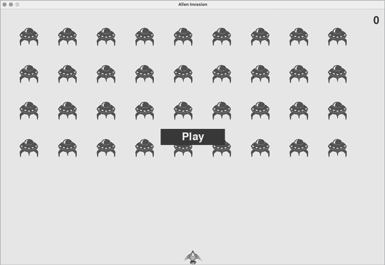
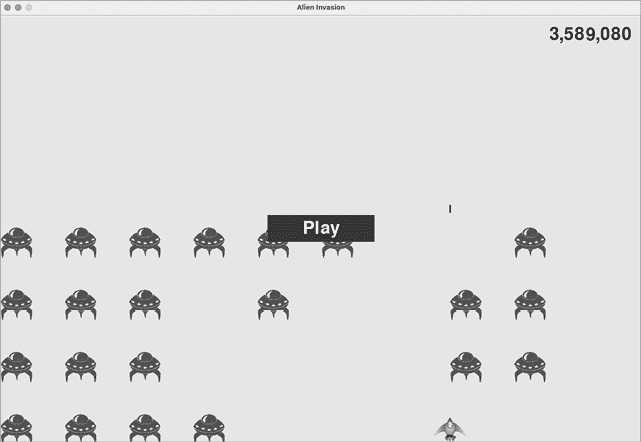
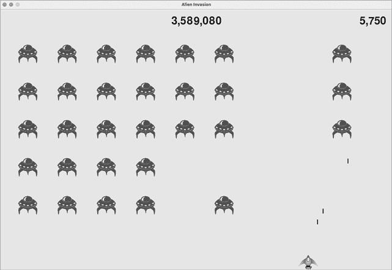
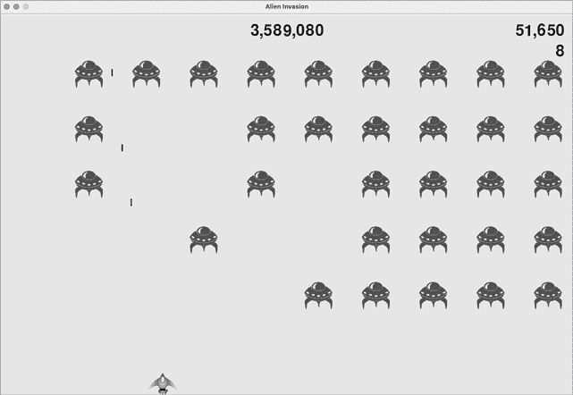
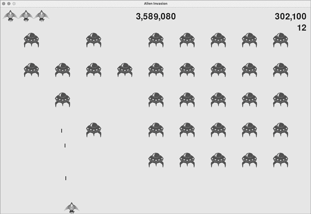

# 第十四章：14

计分


在本章中，我们将完成构建*外星人入侵*游戏。我们将添加一个播放按钮，让玩家可以随时开始游戏并在游戏结束后重新开始。我们还将修改游戏，使得玩家升到新的一关时，游戏速度会加快，并且实现一个计分系统。到本章结束时，你将掌握足够的知识来编写随着玩家进展而难度递增，并且包含完整计分系统的游戏。

## 添加播放按钮

在这一部分，我们将添加一个播放按钮，它会在游戏开始前显示，并在游戏结束后重新显示，以便玩家可以再次玩游戏。

现在，游戏在运行*alien_invasion.py*时会立即开始。让我们先让游戏处于非活动状态，然后提示玩家点击播放按钮开始游戏。为此，修改`AlienInvasion`的`__init__()`方法：

**alien_invasion.py**

```py
 def __init__(self):
 """Initialize the game, and create game resources."""
 pygame.init()
 *--snip--*

        # Start Alien Invasion in an inactive state.
        self.game_active = False
```

现在，游戏应该在非活动状态下启动，玩家在我们创建播放按钮之前无法启动游戏。

### 创建按钮类

由于 Pygame 没有内置的按钮制作方法，我们将编写一个`Button`类来创建一个带标签的填充矩形。你可以使用这段代码来制作任何游戏中的按钮。以下是`Button`类的第一部分；将其保存为*button.py*：

**button.py**

```py
import pygame.font

class Button:
    """A class to build buttons for the game."""

❶     def __init__(self, ai_game, msg):
        """Initialize button attributes."""
        self.screen = ai_game.screen
        self.screen_rect = self.screen.get_rect()

        # Set the dimensions and properties of the button.
❷         self.width, self.height = 200, 50
        self.button_color = (0, 135, 0)
        self.text_color = (255, 255, 255)
❸         self.font = pygame.font.SysFont(None, 48)

        # Build the button's rect object and center it.
❹         self.rect = pygame.Rect(0, 0, self.width, self.height)
        self.rect.center = self.screen_rect.center

        # The button message needs to be prepped only once.
❺         self._prep_msg(msg)
```

首先，我们导入`pygame.font`模块，它允许 Pygame 将文本渲染到屏幕上。`__init__()`方法接受`self`、`ai_game`对象和`msg`（包含按钮文本）作为参数 ❶。我们设置按钮的尺寸 ❷，将`button_color`设置为深绿色来着色按钮的`rect`对象，并将`text_color`设置为白色以渲染文本。

接下来，我们为渲染文本准备一个`font`属性 ❸。`None`参数告诉 Pygame 使用默认字体，而`48`指定了文本的大小。为了将按钮居中显示在屏幕上，我们为按钮创建一个`rect` ❹，并将其`center`属性设置为与屏幕中心对齐。

Pygame 通过将你想要显示的字符串渲染为图像来处理文本。最后，我们调用`_prep_msg()`来处理此渲染 ❺。

以下是`_prep_msg()`的代码：

**button.py**

```py
def _prep_msg(self, msg):
        """Turn msg into a rendered image and center text on the button."""
❶         self.msg_image = self.font.render(msg, True, self.text_color,
                self.button_color)
❷         self.msg_image_rect = self.msg_image.get_rect()
        self.msg_image_rect.center = self.rect.center
```

`_prep_msg()`方法需要一个`self`参数和要作为图像渲染的文本（`msg`）。对`font.render()`的调用将`msg`中存储的文本转化为图像，然后我们将其存储在`self.msg_image`中 ❶。`font.render()`方法还接受一个布尔值来开启或关闭抗锯齿效果（*抗锯齿*使文本的边缘更加平滑）。其余的参数是指定的字体颜色和背景颜色。我们将抗锯齿设置为`True`，并将文本背景设置为与按钮相同的颜色。（如果不包括背景颜色，Pygame 会尝试用透明背景渲染字体。）

我们通过创建一个来自图像的`rect`，并将其`center`属性设置为与按钮的中心对齐，从而将文本图像居中于按钮 ❷。

最后，我们创建了一个`draw_button()`方法，我们可以调用它在屏幕上显示按钮：

**button.py**

```py
def draw_button(self):
        """Draw blank button and then draw message."""
        self.screen.fill(self.button_color, self.rect)
        self.screen.blit(self.msg_image, self.msg_image_rect)
```

我们调用`screen.fill()`绘制按钮的矩形部分。然后，我们调用`screen.blit()`将文本图像绘制到屏幕上，传递给它一个图像和与该图像相关的`rect`对象。这完成了`Button`类的创建。

### 将按钮绘制到屏幕上

我们将在`AlienInvasion`中使用`Button`类创建 Play 按钮。首先，我们将更新`import`语句：

**alien_invasion.py**

```py
*--snip--*
from game_stats import GameStats
from button import Button
```

因为我们只需要一个 Play 按钮，所以我们将在`AlienInvasion`的`__init__()`方法中创建该按钮。我们可以将这段代码放在`__init__()`的末尾：

**alien_invasion.py**

```py
 def __init__(self):
  *--snip--*
 self.game_active = False

        # Make the Play button.
        self.play_button = Button(self, "Play")
```

这段代码创建了一个`Button`实例，标签为`Play`，但它没有将按钮绘制到屏幕上。为此，我们将在`_update_screen()`中调用按钮的`draw_button()`方法：

**alien_invasion.py**

```py
 def _update_screen(self):
  *--snip--*
 self.aliens.draw(self.screen)

        # Draw the play button if the game is inactive.
        if not self.game_active:
            self.play_button.draw_button()

 pygame.display.flip()
```

为了让“Play”按钮在屏幕上的其他所有元素之上可见，我们在绘制完所有其他元素后，但在切换到新屏幕之前绘制它。我们将其包含在`if`语句块中，因此按钮只会在游戏处于非活动状态时显示。

现在，当你运行*Alien Invasion*时，你应该会看到一个 Play 按钮出现在屏幕中央，如图 14-1 所示。


图 14-1：当游戏处于非活动状态时，出现一个 Play 按钮。

### 启动游戏

为了在玩家点击 Play 时开始新游戏，我们需要在`_check_events()`的末尾添加以下`elif`语句块，以监控按钮上的鼠标事件：

**alien_invasion.py**

```py
 def _check_events(self):
 """Respond to keypresses and mouse events."""
 for event in pygame.event.get():
 if event.type == pygame.QUIT:
  *--snip--*
❶             elif event.type == pygame.MOUSEBUTTONDOWN:
❷                 mouse_pos = pygame.mouse.get_pos()
❸                 self._check_play_button(mouse_pos)
```

Pygame 会在玩家点击屏幕上的任意位置时检测到`MOUSEBUTTONDOWN`事件❶，但我们希望游戏只响应鼠标点击 Play 按钮的事件。为此，我们使用`pygame.mouse.get_pos()`，它返回一个包含鼠标光标的*x*和*y*坐标的元组，当鼠标按钮被点击时会返回这些值❷。我们将这些值传递给新的方法`_check_play_button()`❸。

这是`_check_play_button()`，我选择将它放在`_check_events()`之后：

**alien_invasion.py**

```py
 def _check_play_button(self, mouse_pos):
        """Start a new game when the player clicks Play."""
❶         if self.play_button.rect.collidepoint(mouse_pos):
            self.game_active = True
```

我们使用`rect`方法`collidepoint()`来检查鼠标点击的位置是否与 Play 按钮的`rect`定义的区域重叠❶。如果重叠，我们将`game_active`设置为`True`，游戏开始！

此时，你应该能够启动并进行完整的游戏。当游戏结束时，`game_active`的值应变为`False`，并且 Play 按钮应重新出现。

### 重置游戏

我们刚刚编写的 Play 按钮代码在玩家第一次点击 Play 时有效。但在第一次游戏结束后它不再有效，因为导致游戏结束的条件尚未被重置。

为了在每次玩家点击 Play 时重置游戏，我们需要重置游戏统计信息，清除旧的外星人和子弹，重新建立新的舰队，并重新定位飞船，代码如下所示：

**alien_invasion.py**

```py
 def _check_play_button(self, mouse_pos):
 """Start a new game when the player clicks Play."""
 if self.play_button.rect.collidepoint(mouse_pos):
            # Reset the game statistics.
❶             self.stats.reset_stats()
 self.game_active = True

 # Get rid of any remaining bullets and aliens.
❷             self.bullets.empty()
            self.aliens.empty()

            # Create a new fleet and center the ship.
❸             self._create_fleet()
            self.ship.center_ship()
```

我们重置了游戏统计信息❶，这会给玩家三个新船只。然后我们将`game_active`设置为`True`，这样当这个函数中的代码运行完毕后，游戏就会开始。我们清空了`aliens`和`bullets`两个组❷，然后创建一个新的外星舰队并将飞船居中❸。

现在，每次点击 Play 时，游戏都会正确重置，允许你玩任意次数！

### 禁用 Play 按钮

Play 按钮存在一个问题，即即使 Play 按钮不可见，屏幕上的按钮区域仍然会响应点击。如果在游戏开始后不小心点击了 Play 按钮区域，游戏会重新开始！

为了解决这个问题，设置游戏只在`game_active`为`False`时开始：

**alien_invasion.py**

```py
 def _check_play_button(self, mouse_pos):
 """Start a new game when the player clicks Play."""
❶         button_clicked = self.play_button.rect.collidepoint(mouse_pos)
❷         if button_clicked and not self.game_active:
 # Reset the game statistics.
 self.stats.reset_stats()
  *--snip--*
```

标志`button_clicked`存储`True`或`False`值❶，只有在点击 Play 且游戏当前不活跃的情况下，游戏才会重新开始❷。要测试这个行为，启动一个新游戏并反复点击 Play 按钮应该所在的位置。如果一切按预期工作，点击 Play 按钮区域应该不会对游戏玩法产生任何影响。

### 隐藏鼠标光标

我们希望在游戏未激活时光标可见，但一旦游戏开始，光标就会妨碍操作。为了解决这个问题，我们将在游戏变为活跃状态时将光标设为不可见。我们可以在`_check_play_button()`函数的`if`块结束时实现这一点：

**alien_invasion.py**

```py
 def _check_play_button(self, mouse_pos):
 """Start a new game when the player clicks Play."""
 button_clicked = self.play_button.rect.collidepoint(mouse_pos)
 if button_clicked and not self.game_active:
  *--snip--*
            # Hide the mouse cursor.
            pygame.mouse.set_visible(False)
```

将`False`传递给`set_visible()`会告诉 Pygame 在鼠标悬停在游戏窗口时隐藏光标。

游戏结束后，我们会让光标重新出现，这样玩家就可以点击 Play 重新开始新游戏。以下是实现这一点的代码：

**alien_invasion.py**

```py
 def _ship_hit(self):
 """Respond to ship being hit by alien."""
 if self.stats.ships_left > 0:
  *--snip--*
 else:
 self.game_active = False
  pygame.mouse.set_visible(True)
```

当游戏变为未激活时，我们会再次让光标可见，这发生在`_ship_hit()`中。注意这些细节会让你的游戏看起来更专业，也能让玩家专注于游戏，而不是去琢磨界面。

## 升级关卡

在我们当前的游戏中，一旦玩家击败整个外星舰队，玩家就会进入新一关，但游戏的难度并不会改变。让我们稍微增加一点挑战性，增加游戏速度，使每当玩家清除屏幕时，游戏难度增加。

### 修改速度设置

我们将首先重新组织`Settings`类，将游戏设置分为静态和动态设置。我们还会确保任何在游戏中变化的设置会在重新开始新游戏时重置。以下是*settings.py*中的`__init__()`方法：

**settings.py**

```py
def __init__(self):
    """Initialize the game's static settings."""
    # Screen settings
 self.screen_width = 1200
 self.screen_height = 800
 self.bg_color = (230, 230, 230)

 # Ship settings
 self.ship_limit = 3

 # Bullet settings
 self.bullet_width = 3
 self.bullet_height = 15
 self.bullet_color = 60, 60, 60
 self.bullets_allowed = 3

 # Alien settings
 self.fleet_drop_speed = 10

    # How quickly the game speeds up
❶     self.speedup_scale = 1.1

❷     self.initialize_dynamic_settings()
```

我们继续在`__init__()`方法中初始化那些保持不变的设置。我们添加了一个`speedup_scale`设置 ❶ 来控制游戏加速的速度：值为 2 时，每次玩家达到新关卡，游戏速度会翻倍；值为 1 时，速度保持不变。像`1.1`这样的值应该足够增加游戏难度，但又不至于让游戏变得不可能完成。最后，我们调用`initialize_dynamic_settings()`方法来初始化那些在游戏过程中需要变化的属性 ❷。

下面是`initialize_dynamic_settings()`的代码：

**settings.py**

```py
 def initialize_dynamic_settings(self):
     """Initialize settings that change throughout the game."""
     self.ship_speed = 1.5
     self.bullet_speed = 2.5
     self.alien_speed = 1.0

     # fleet_direction of 1 represents right; -1 represents left.
     self.fleet_direction = 1
```

这个方法设置了飞船、子弹和外星人速度的初始值。随着玩家在游戏中的进展，我们将提高这些速度，并在每次玩家开始新游戏时重置它们。我们在这个方法中包含了`fleet_direction`，确保外星人在新游戏开始时总是向右移动。我们不需要增加`fleet_drop_speed`的值，因为当外星人横向移动速度加快时，它们也会更快地向下移动。

为了在玩家达到新关卡时提高飞船、子弹和外星人的速度，我们将编写一个新方法叫做`increase_speed()`：

**settings.py**

```py
 def increase_speed(self):
     """Increase speed settings."""
     self.ship_speed *= self.speedup_scale
     self.bullet_speed *= self.speedup_scale
     self.alien_speed *= self.speedup_scale
```

为了增加这些游戏元素的速度，我们将每个速度设置乘以`speedup_scale`的值。

当舰队中的最后一个外星人被击败时，我们在`_check_bullet_alien_collisions()`中调用`increase_speed()`来加速游戏：

**alien_invasion.py**

```py
 def _check_bullet_alien_collisions(self):
  *--snip--*
 if not self.aliens:
 # Destroy existing bullets and create new fleet.
 self.bullets.empty()
 self._create_fleet()
  self.settings.increase_speed()
```

只需改变飞船速度`ship_speed`、外星人速度`alien_speed`和子弹速度`bullet_speed`的值，就足以加速整个游戏！

### 重置速度

现在，我们需要每次玩家开始新游戏时将任何改变的设置恢复到初始值；否则，每个新游戏将从前一个游戏的加速设置开始：

**alien_invasion.py**

```py
 def _check_play_button(self, mouse_pos):
 """Start a new game when the player clicks Play."""
 button_clicked = self.play_button.rect.collidepoint(mouse_pos)
 if button_clicked and not self.game_active:
  # Reset the game settings.
            self.settings.initialize_dynamic_settings()
  *--snip--*
```

现在，玩*Alien Invasion*应该更有趣和更具挑战性了。每次你清除屏幕时，游戏应该加速并变得稍微更难。如果游戏变得太难，可以降低`settings.speedup_scale`的值。如果游戏不够有挑战性，可以稍微提高这个值。通过在合理的时间内逐步增加难度，找到一个平衡点。前几个屏幕应该很容易，接下来的几个应该有挑战性但可以完成，而之后的屏幕应该几乎不可完成。

## 得分

我们来实现一个得分系统，实时追踪游戏分数，并显示最高分、关卡和剩余飞船数量。

得分是游戏的统计数据，因此我们将向`GameStats`添加一个`score`属性：

**game_stats.py**

```py
class GameStats:
  *--snip--*
 def reset_stats(self):
 """Initialize statistics that can change during the game."""
 self.ships_left = self.ai_settings.ship_limit
        self.score = 0
```

为了每次开始新游戏时重置得分，我们将在`reset_stats()`中初始化`score`，而不是在`__init__()`中。

### 显示得分

为了在屏幕上显示分数，我们首先创建一个新的类`Scoreboard`。现在，这个类只会显示当前的分数。最终，我们将用它来报告最高分、等级和剩余的飞船数量。以下是该类的第一部分；将其保存为*scoreboard.py*：

**scoreboard.py**

```py
import pygame.font

class Scoreboard:
    """A class to report scoring information."""

❶     def __init__(self, ai_game):
        """Initialize scorekeeping attributes."""
        self.screen = ai_game.screen
        self.screen_rect = self.screen.get_rect()
        self.settings = ai_game.settings
        self.stats = ai_game.stats

        # Font settings for scoring information.
❷         self.text_color = (30, 30, 30)
❸         self.font = pygame.font.SysFont(None, 48)

 # Prepare the initial score image.
❹         self.prep_score()
```

因为`Scoreboard`会在屏幕上写入文本，我们首先导入`pygame.font`模块。接下来，我们为`__init__()`方法提供`ai_game`参数，这样它就可以访问`settings`、`screen`和`stats`对象，这些是用来报告我们正在跟踪的数值❶。然后，我们设置文本颜色❷，并实例化一个字体对象❸。

为了将显示的文本转化为图像，我们调用`prep_score()`❹，我们在这里定义它：

**scoreboard.py**

```py
def prep_score(self):
    """Turn the score into a rendered image."""
❶     score_str = str(self.stats.score)
❷         self.score_image = self.font.render(score_str, True,
                self.text_color, self.settings.bg_color)

    # Display the score at the top right of the screen.
❸     self.score_rect = self.score_image.get_rect()
❹     self.score_rect.right = self.screen_rect.right - 20
❺     self.score_rect.top = 20
```

在`prep_score()`中，我们将数值`stats.score`转换为字符串❶，然后将这个字符串传递给`render()`，它会创建图像❷。为了在屏幕上清晰地显示分数，我们将屏幕的背景颜色和文字颜色传递给`render()`。

我们将把分数放置在屏幕的右上角，并随着分数增加和数字宽度的增加，分数向左扩展。为了确保分数总是与屏幕的右侧对齐，我们创建一个名为`score_rect`的`rect`❸，并将它的右边缘设置为离屏幕右边缘 20 个像素❹。然后我们将其上边缘设置为距离屏幕顶部 20 个像素❺。

然后我们创建一个`show_score()`方法来显示渲染后的分数图像：

**scoreboard.py**

```py
def show_score(self):
        """Draw score to the screen."""
        self.screen.blit(self.score_image, self.score_rect)
```

这个方法将分数图像绘制到屏幕上，位置由`score_rect`指定。

### 创建记分板

为了显示分数，我们将在`AlienInvasion`中创建一个`Scoreboard`实例。首先，让我们更新`import`语句：

**alien_invasion.py**

```py
*--snip--*
from game_stats import GameStats
from scoreboard import Scoreboard
*--snip--*
```

接下来，我们在`__init__()`中创建一个`Scoreboard`实例：

**alien_invasion.py**

```py
 def __init__(self):
  *--snip--*
 pygame.display.set_caption("Alien Invasion")

        # Create an instance to store game statistics,
        #   and create a scoreboard.
        self.stats = GameStats(self)
        self.sb = Scoreboard(self)
  *--snip--*
```

然后我们在`_update_screen()`中绘制记分板：

**alien_invasion.py**

```py
 def _update_screen(self):
  *--snip--*
 self.aliens.draw(self.screen)

        # Draw the score information.
        self.sb.show_score()

 # Draw the play button if the game is inactive.
  *--snip--*
```

我们在绘制“Play”按钮之前调用`show_score()`。

当你现在运行*外星人入侵*时，屏幕右上角应该会出现一个 0。（此时，我们只是想确保分数出现在正确的位置，之后再继续开发得分系统。）图 14-2 显示了游戏开始前分数的样子。

接下来，我们将为每个外星人分配分值！



图 14-2：分数出现在屏幕的右上角。

### 当外星人被击落时更新分数

为了在屏幕上实时显示分数，我们每当外星人被击中时更新`stats.score`的值，然后调用`prep_score()`来更新分数图像。但首先，让我们确定每次击落外星人时玩家能获得多少分：

**settings.py**

```py
 def initialize_dynamic_settings(self):
  *--snip--*

        # Scoring settings
     self.alien_points = 50
```

随着游戏的进行，我们将增加每个外星人的分数值。为了确保每次新游戏开始时分数值都会重置，我们在`initialize_dynamic_settings()`中设置该值。

每次击落外星人时，让我们在`_check_bullet_alien_collisions()`中更新分数：

**alien_invasion.py**

```py
 def _check_bullet_alien_collisions(self):
 """Respond to bullet-alien collisions."""
 # Remove any bullets and aliens that have collided.
 collisions = pygame.sprite.groupcollide(
 self.bullets, self.aliens, True, True)

        if collisions:
            self.stats.score += self.settings.alien_points
            self.sb.prep_score()
  *--snip--*
```

当子弹击中外星人时，Pygame 会返回一个`collisions`字典。我们检查这个字典是否存在，如果存在，就将外星人的分值添加到总分中。然后我们调用`prep_score()`来更新记分板的分数。

现在，当你玩*Alien Invasion*时，你应该能够快速累积分数！

### 重置分数

现在，我们只是在外星人被击中后*才*准备新的分数，这对大多数游戏场景有效。但在开始新游戏时，我们仍然会看到上一个游戏的分数，直到第一个外星人被击中。

我们可以通过在开始新游戏时准备分数来解决这个问题：

**alien_invasion.py**

```py
 def _check_play_button(self, mouse_pos):
  *--snip--*
 if button_clicked and not self.game_active:
  *--snip--*
 # Reset the game statistics.
 self.stats.reset_stats()
            self.sb.prep_score()
  *--snip--*
```

我们在重置游戏统计数据后调用`prep_score()`来开始新游戏。这个方法将用 0 分初始化记分板。

### 确保为每次击中都得分

按照当前代码写法，我们可能会漏掉一些外星人的得分。例如，如果两颗子弹在同一轮循环中同时击中外星人，或者如果我们制作了一个超宽子弹来击中多个外星人，玩家只会为击中的一个外星人得分。为了修复这个问题，让我们改进子弹与外星人碰撞的检测方式。

在`_check_bullet_alien_collisions()`中，任何与外星人碰撞的子弹都会成为`collisions`字典中的一个键。每颗子弹相关的值是它所击中的外星人列表。我们遍历`collisions`字典中的值，确保为每个被击中的外星人得分：

**alien_invasion.py**

```py
 def _check_bullet_alien_collisions(self):
  *--snip--*
 if collisions:
            for aliens in collisions.values():
                self.stats.score += self.settings.alien_points * len(aliens)
 self.sb.prep_score()
  *--snip--*
```

如果`collisions`字典已定义，我们将遍历字典中的所有值。记住，每个值是一个被单颗子弹击中的外星人列表。我们将每个外星人的分值乘以每个列表中的外星人数量，并将这个值加到当前分数中。为了测试这个，先将子弹宽度改为 300 像素，验证你是否能为每个用超宽子弹击中的外星人得分；然后再把子弹宽度恢复到正常值。

### 增加分值

因为每次玩家达到新关卡时，游戏变得更加困难，所以后面的关卡中的外星人应该值更多的分。为了实现这个功能，我们将在游戏速度增加时添加代码来提高分值：

**settings.py**

```py
class Settings:
 """A class to store all settings for Alien Invasion."""

 def __init__(self):
  *--snip--*
        # How quickly the game speeds up
 self.speedup_scale = 1.1
  # How quickly the alien point values increase
❶         self.score_scale = 1.5

 self.initialize_dynamic_settings()

 def initialize_dynamic_settings(self):
  *--snip--*

 def increase_speed(self):
        """Increase speed settings and alien point values."""
 self.ship_speed *= self.speedup_scale
 self.bullet_speed *= self.speedup_scale
 self.alien_speed *= self.speedup_scale

❷         self.alien_points = int(self.alien_points * self.score_scale)
```

我们定义了一个分数增长的比率，称为`score_scale` ❶。小幅度的速度增加（`1.1`）能迅速增加游戏的挑战性。但为了看到得分差异更明显，我们需要通过更大的数值（`1.5`）来改变外星人的分值。现在，当我们提高游戏的速度时，每击中一个外星人的分值也会随之增加 ❷。我们使用`int()`函数将分值增加为整数。

要查看每个外星人的分值，可以在`Settings`中的`increase_speed()`方法中添加`print()`调用：

**settings.py**

```py
 def increase_speed(self):
  *--snip--*
 self.alien_points = int(self.alien_points * self.score_scale)
  print(self.alien_points)
```

每次达到新关卡时，新的分值应该出现在终端中。

### 四舍五入分数

大多数街机风格的射击游戏都会以 10 的倍数报告分数，因此我们也会按此方式报告我们的分数。此外，我们会格式化分数，以便在大数值中包含逗号分隔符。我们将在`Scoreboard`中进行此更改：

**scoreboard.py**

```py
 def prep_score(self):
 """Turn the score into a rendered image."""
        rounded_score = round(self.stats.score, -1)
        score_str = f"{rounded_score:,}"
 self.score_image = self.font.render(score_str, True,
 self.text_color, self.settings.bg_color)
  *--snip--*
```

`round()`函数通常会根据作为第二个参数传递的小数位数来四舍五入浮点数。然而，当你传递负数作为第二个参数时，`round()`会将数值四舍五入到最接近的 10、100、1,000 等。此代码告诉 Python 将`stats.score`的值四舍五入到最接近的 10，并将其赋值给`rounded_score`。

然后我们在 f-string 中使用格式说明符来表示分数。*格式说明符*是一种特殊的字符序列，用于修改变量值的呈现方式。在这种情况下，序列`:,`告诉 Python 在数值的适当位置插入逗号。这会将`1000000`格式化为`1,000,000`。

现在，当你运行游戏时，你应该能看到一个格式整齐、四舍五入的分数，即使你获得了大量分数，正如在图 14-3 中所示。



图 14-3：带有逗号分隔符的四舍五入分数

### 最高分

每个玩家都希望打破游戏的最高分，因此我们将跟踪并报告最高分，以便给玩家设定一个目标。我们将在`GameStats`中存储最高分：

**game_stats.py**

```py
 def __init__(self, ai_game):
  *--snip--*
     # High score should never be reset.
     self.high_score = 0
```

因为最高分永远不应重置，所以我们在`__init__()`方法中初始化`high_score`，而不是在`reset_stats()`方法中。

接下来，我们将修改`Scoreboard`来显示最高分。让我们从`__init__()`方法开始：

**scoreboard.py**

```py
 def __init__(self, ai_game):
  *--snip--*
     # Prepare the initial score images.
 self.prep_score()
❶      self.prep_high_score()
```

最高分将与分数分开显示，因此我们需要一个新的方法`prep_high_score()`来准备最高分图像❶。

这是`prep_high_score()`方法：

**scoreboard.py**

```py
 def prep_high_score(self):
     """Turn the high score into a rendered image."""
❶      high_score = round(self.stats.high_score, -1)
     high_score_str = f"{high_score:,}"
❷      self.high_score_image = self.font.render(high_score_str, True,
         self.text_color, self.settings.bg_color)

     # Center the high score at the top of the screen.
     self.high_score_rect = self.high_score_image.get_rect()
❸         self.high_score_rect.centerx = self.screen_rect.centerx
❹      self.high_score_rect.top = self.score_rect.top
```

我们将最高分四舍五入到最接近的 10，并用逗号格式化❶。然后我们从最高分生成一张图像❷，将最高分的`rect`水平居中❸，并将其`top`属性设置为与分数图像的顶部对齐❹。

`show_score()`方法现在会在屏幕的右上角绘制当前分数，并在屏幕的顶部中央绘制最高分：

**scoreboard.py**

```py
 def show_score(self):
 """Draw score to the screen."""
 self.screen.blit(self.score_image, self.score_rect)
     self.screen.blit(self.high_score_image, self.high_score_rect)
```

为了检查最高分，我们将在`Scoreboard`中编写一个新的方法`check_high_score()`：

**scoreboard.py**

```py
 def check_high_score(self):
"""Check to see if there's a new high score."""
        if self.stats.score > self.stats.high_score:
            self.stats.high_score = self.stats.score
            self.prep_high_score()
```

方法`check_high_score()`将当前分数与最高分进行比较。如果当前分数更高，我们会更新`high_score`的值，并调用`prep_high_score()`来更新最高分的图像。

每次击中外星人后更新分数时，我们需要调用`check_high_score()`：

**alien_invasion.py**

```py
 def _check_bullet_alien_collisions(self):
  *--snip--*
 if collisions:
 for aliens in collisions.values():
 self.stats.score += self.settings.alien_points * len(aliens)
 self.sb.prep_score()
     self.sb.check_high_score()
        *--snip--*
```

当`collisions`字典存在时，我们会调用`check_high_score()`，并在更新所有已击中外星人的分数后执行此操作。

第一次玩*Alien Invasion*时，你的分数将是高分，因此它会显示为当前分数和高分。但是当你开始第二局游戏时，你的高分应该显示在中间，当前分数则显示在右侧，如图 14-4 所示。



图 14-4：高分显示在屏幕的顶部中间。

### 显示关卡

为了在游戏中显示玩家的关卡，我们首先需要在`GameStats`中添加一个属性来表示当前的关卡。为了在每场新游戏开始时重置关卡，我们在`reset_stats()`中初始化它：

**game_stats.py**

```py
 def reset_stats(self):
 """Initialize statistics that can change during the game."""
 self.ships_left = self.settings.ship_limit
 self.score = 0
     self.level = 1
```

为了让`Scoreboard`显示当前的关卡，我们从`__init__()`中调用一个新方法`prep_level()`：

**scoreboard.py**

```py
 def __init__(self, ai_game):
  *--snip--*
 self.prep_high_score()
     self.prep_level()
```

这是`prep_level()`：

**scoreboard.py**

```py
def prep_level(self):
        """Turn the level into a rendered image."""
        level_str = str(self.stats.level)
❶         self.level_image = self.font.render(level_str, True,
                self.text_color, self.settings.bg_color)

        # Position the level below the score.
        self.level_rect = self.level_image.get_rect()
❷         self.level_rect.right = self.score_rect.right
❸         self.level_rect.top = self.score_rect.bottom + 10
```

`prep_level()`方法根据`stats.level`中存储的值创建一张图像 ❶，并将图像的`right`属性设置为与分数的`right`属性相匹配 ❷。然后，它将`top`属性设置为比分数图像底部低 10 个像素，以便分数和关卡之间留出空间 ❸。

我们还需要更新`show_score()`：

**scoreboard.py**

```py
 def show_score(self):
        """Draw scores and level to the screen."""
 self.screen.blit(self.score_image, self.score_rect)
 self.screen.blit(self.high_score_image, self.high_score_rect)
     self.screen.blit(self.level_image, self.level_rect)
```

这行新代码将关卡图像绘制到屏幕上。

我们将在`_check_bullet_alien_collisions()`中递增`stats.level`并更新关卡图像：

**alien_invasion.py**

```py
 def _check_bullet_alien_collisions(self):
  *--snip--*
 if not self.aliens:
   # Destroy existing bullets and create new fleet.
 self.bullets.empty()
 self._create_fleet()
 self.settings.increase_speed()

            # Increase level.
            self.stats.level += 1
            self.sb.prep_level()
```

如果一队飞船被摧毁，我们会增加`stats.level`的值，并调用`prep_level()`来确保新关卡正确显示。

为了确保在新游戏开始时关卡图像正确更新，我们还需要在玩家点击“开始”按钮时调用`prep_level()`：

**alien_invasion.py**

```py
 def _check_play_button(self, mouse_pos):
  *--snip--*
 if button_clicked and not self.game_active:
  *--snip--*
            self.sb.prep_score()
            self.sb.prep_level()
            *--snip--*
```

我们在调用`prep_score()`之后立即调用`prep_level()`。

现在你将看到你完成了多少个关卡，如图 14-5 所示。



图 14-5：当前关卡显示在当前得分下方。

### 显示飞船数量

最后，让我们显示玩家剩余的飞船数量，不过这次我们使用图形。为此，我们将在屏幕的左上角绘制飞船来表示剩余的飞船数量，就像许多经典街机游戏一样。

首先，我们需要让`Ship`继承自`Sprite`，这样我们就可以创建一组飞船：

**ship.py**

```py
import pygame
from pygame.sprite import Sprite

❶ class Ship(Sprite):
 """A class to manage the ship."""

 def __init__(self, ai_game):
 """Initialize the ship and set its starting position."""
❷         super().__init__()
  *--snip--*
```

在这里，我们导入`Sprite`，确保`Ship`继承自`Sprite` ❶，并在`__init__()`的开始调用`super()` ❷。

接下来，我们需要修改`Scoreboard`以创建一组可以显示的飞船。这里是`Scoreboard`的`import`语句：

**scoreboard.py**

```py
import pygame.font
from pygame.sprite import Group

from ship import Ship
```

因为我们要创建一组飞船，所以我们导入了`Group`和`Ship`类。

这是`__init__()`：

**scoreboard.py**

```py
 def __init__(self, ai_game):
 """Initialize scorekeeping attributes."""
  self.ai_game = ai_game
 self.screen = ai_game.screen
  *--snip--*
 self.prep_level()
        self.prep_ships()
```

我们将游戏实例分配给一个属性，因为我们需要它来创建一些飞船。我们在调用`prep_level()`后调用`prep_ships()`。

这是`prep_ships()`：

**scoreboard.py**

```py
def prep_ships(self):
        """Show how many ships are left."""
❶         self.ships = Group()
❷         for ship_number in range(self.stats.ships_left):
            ship = Ship(self.ai_game)
❸             ship.rect.x = 10 + ship_number * ship.rect.width
❹             ship.rect.y = 10
❺             self.ships.add(ship)
```

`prep_ships()`方法创建了一个空的组，`self.ships`，用来存放飞船实例 ❶。为了填充这个组，循环会为玩家剩余的每艘飞船运行一次 ❷。在循环内部，我们创建一艘新的飞船，并设置每艘飞船的* x *坐标值，使得飞船彼此相邻，且组内的左侧有 10 像素的间距 ❸。我们设置* y *坐标值为屏幕顶部下方 10 像素，使得飞船显示在屏幕的左上角 ❹。然后我们将每艘新的飞船添加到`ships`组中 ❺。

现在我们需要将飞船绘制到屏幕上：

**scoreboard.py**

```py
 def show_score(self):
        """Draw scores, level, and ships to the screen."""
 self.screen.blit(self.score_image, self.score_rect)
 self.screen.blit(self.high_score_image, self.high_score_rect)
 self.screen.blit(self.level_image, self.level_rect)
     self.ships.draw(self.screen)
```

为了在屏幕上显示飞船，我们在组上调用`draw()`，然后 Pygame 会绘制每一艘飞船。

为了显示玩家初始拥有多少艘飞船，我们在新游戏开始时调用`prep_ships()`。我们在`AlienInvasion`的`_check_play_button()`中执行此操作：

**alien_invasion.py**

```py
 def _check_play_button(self, mouse_pos):
  *--snip--*
 if button_clicked and not self.game_active:
  *--snip--*
            self.sb.prep_level()
            self.sb.prep_ships()
            *--snip--*
```

当飞船被击中时，我们也会调用`prep_ships()`，以更新飞船图像的显示，当玩家失去一艘飞船时：

**alien_invasion.py**

```py
 def _ship_hit(self):
 """Respond to ship being hit by alien."""
 if self.stats.ships_left > 0:
            # Decrement ships_left, and update scoreboard.
 self.stats.ships_left -= 1
            self.sb.prep_ships()
            `--snip--`
```

我们在减少`ships_left`的值后调用`prep_ships()`，以便每次飞船被摧毁时正确显示剩余飞船的数量。

图 14-6 展示了完整的得分系统，剩余的飞船显示在屏幕的左上角。



图 14-6：*Alien Invasion*的完整得分系统

## 小结

在本章中，你学习了如何实现一个“开始游戏”按钮来启动新游戏。你还学会了如何检测鼠标事件并在活动游戏中隐藏光标。你可以运用所学，创建其他按钮，例如帮助按钮来显示如何玩游戏的说明。你还学会了如何在游戏进程中调整游戏速度，实施渐进式得分系统，并以文本和非文本方式显示信息。
