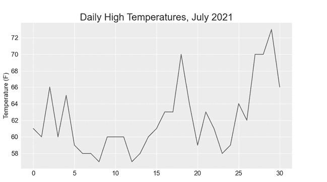
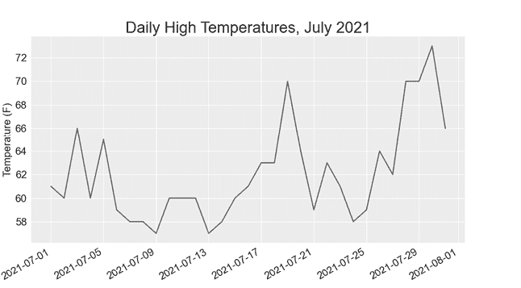
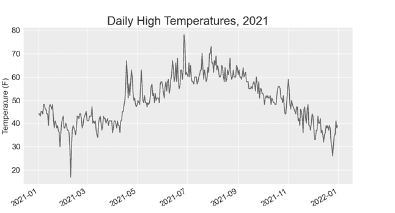
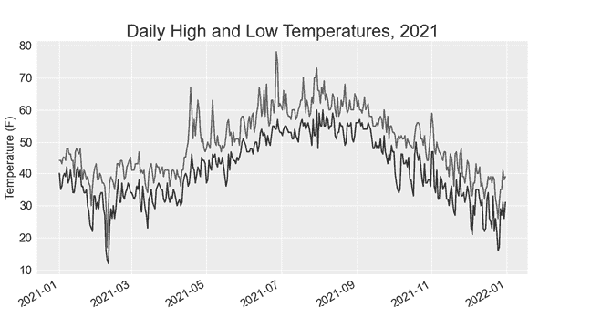
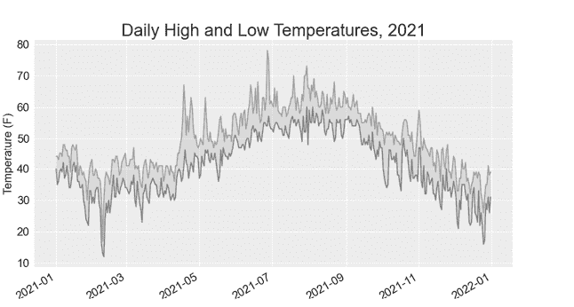
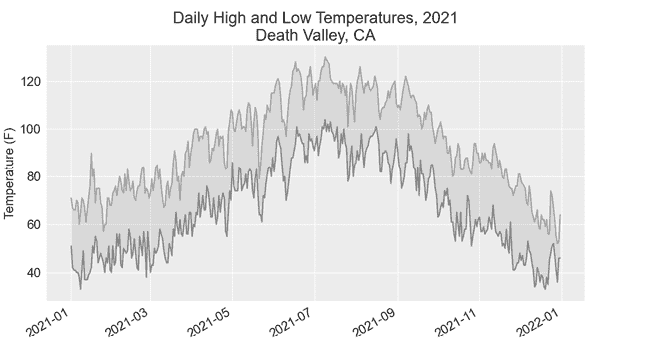
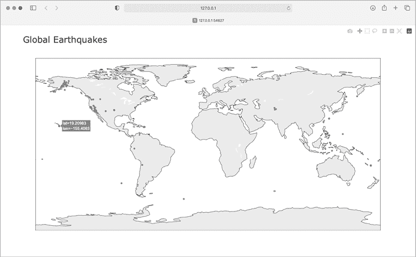
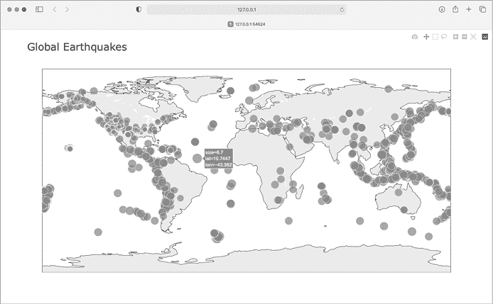
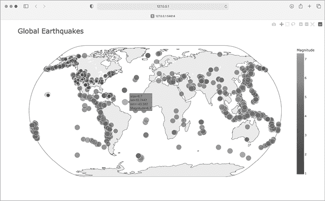
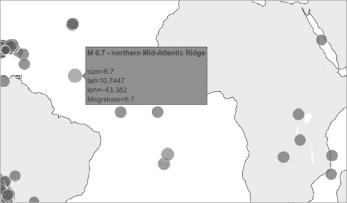

# 第十六章：16

下载数据


在本章中，你将从在线来源下载数据集并创建该数据的可视化效果。你可以在线找到各种各样的数据，其中许多数据尚未得到彻底研究。能够分析这些数据将帮助你发现其他人尚未发现的模式和联系。

我们将访问并可视化存储在两种常见数据格式中的数据：CSV 和 JSON。我们将使用 Python 的 `csv` 模块处理存储在 CSV 格式中的天气数据，并分析两个不同地点的高低温度变化。然后，我们将使用 Matplotlib 基于下载的数据生成图表，显示两个不同环境中温度的变化：阿拉斯加的锡特卡和加利福尼亚的死亡谷。之后，在本章的后续部分，我们将使用 `json` 模块访问存储在 GeoJSON 格式中的地震数据，并使用 Plotly 绘制一张世界地图，显示最近地震的地点和震级。

在本章结束时，你将能够处理各种格式的数据集，并深入理解如何构建复杂的可视化。能够访问和可视化在线数据是处理各种现实世界数据集的基础。

## CSV 文件格式

一种简单的文本文件数据存储方式是将数据写成由逗号分隔的一系列值，这就是所谓的 *逗号分隔值*。生成的文件即为 *CSV* 文件。例如，这里有一段以 CSV 格式存储的天气数据：

```py
"USW00025333","SITKA AIRPORT, AK US","2021-01-01",,"44","40"
```

这是来自 2021 年 1 月 1 日，位于阿拉斯加锡特卡的天气数据摘录。它包括当天的最高温度和最低温度，以及当天的其他若干测量值。CSV 文件对人类来说可能阅读起来很繁琐，但程序可以快速、准确地处理并提取其中的信息。

我们将从一小部分以 CSV 格式记录的锡特卡天气数据开始；这些数据可以在本书的资源中找到，网址为 [`ehmatthes.github.io/pcc_3e`](https://ehmatthes.github.io/pcc_3e)。在你保存本章程序的文件夹中创建一个名为 *weather_data* 的文件夹，并将文件 *sitka_weather_07-2021_simple.csv* 复制到这个新文件夹中。（下载本书资源后，你将获得该项目所需的所有文件。）

### 解析 CSV 文件标题

Python 标准库中的 `csv` 模块解析 CSV 文件中的行，允许我们快速提取感兴趣的值。让我们从检查文件的第一行开始，这一行包含数据的标题。标题告诉我们数据包含的是什么类型的信息：

**sitka_highs.py**

```py
from pathlib import Path
import csv

❶ path = Path('weather_data/sitka_weather_07-2021_simple.csv')
lines = path.read_text().splitlines()

❷ reader = csv.reader(lines)
❸ header_row = next(reader)
print(header_row)
```

我们首先导入 `Path` 和 `csv` 模块。然后我们创建一个 `Path` 对象，它指向 *weather_data* 文件夹，并指向我们想要处理的具体天气数据文件 ❶。我们读取文件，并链式调用 `splitlines()` 方法，以获取文件中所有行的列表，并将其赋值给 `lines`。

接下来，我们构建一个`reader`对象 ❷。这个对象可以用来解析文件中的每一行。要创建一个`reader`对象，调用函数`csv.reader()`并将 CSV 文件的行列表传递给它。

当给定一个`reader`对象时，`next()`函数返回文件中的下一行，从文件的开头开始。在这里，我们只调用了一次`next()`，因此我们得到了文件的第一行，其中包含文件头 ❸。我们将返回的数据赋值给`header_row`。如你所见，`header_row`包含了有意义的、与天气相关的标题，告诉我们每行数据所包含的信息：

```py
['STATION', 'NAME', 'DATE', 'TAVG', 'TMAX', 'TMIN']
```

`reader`对象处理文件中的第一行逗号分隔值，并将每个值存储为列表中的一项。标题`STATION`代表记录此数据的气象站的代码。该标题的位置告诉我们，每行的第一个值将是气象站的代码。`NAME`标题表明每行的第二个值是进行记录的气象站的名称。其余标题指定每次读取中记录了哪些类型的信息。现在我们最关心的数据是日期（`DATE`）、最高温度（`TMAX`）和最低温度（`TMIN`）。这是一个简单的数据集，仅包含与温度相关的数据。当你下载自己的天气数据时，你可以选择包括与风速、风向和降水数据等相关的其他测量项。

### 打印标题及其位置

为了更容易理解文件头数据，让我们打印出每个标题及其在列表中的位置：

**sitka_highs.py**

```py
*--snip--*
reader = csv.reader(lines)
header_row = next(reader)

for index, column_header in enumerate(header_row):
    print(index, column_header)
```

`enumerate()`函数在遍历列表时返回每个项的索引和对应的值。（请注意，我们已删除了`print(header_row)`这一行，改用更详细的版本。）

下面是显示每个标题索引的输出：

```py
0 STATION
1 NAME
2 DATE
3 TAVG
4 TMAX
5 TMIN
```

我们可以看到，日期及其对应的最高温度存储在第 2 列和第 4 列。为了探索这些数据，我们将处理*sitka_weather_07-2021_simple.csv*中的每一行数据，并提取索引为 2 和 4 的值。

### 提取和读取数据

现在我们知道了需要哪些数据列，让我们读取其中的一些数据。首先，我们将读取每天的最高温度：

**sitka_highs.py**

```py
*--snip--*
reader = csv.reader(lines)
header_row = next(reader)

# Extract high temperatures.
❶ highs = []
❷ for row in reader:
❸     high = int(row[4])
    highs.append(high)

print(highs)
```

我们创建一个名为`highs`的空列表 ❶，然后遍历文件中的其余行 ❷。`reader`对象从它在 CSV 文件中的当前位置继续，并自动返回当前行后的每一行。因为我们已经读取了标题行，循环将从第二行开始，实际数据也从这一行开始。在每次循环中，我们提取索引为 4 的数据显示，该索引对应标题`TMAX`，并将其赋值给变量`high` ❸。我们使用`int()`函数将存储为字符串的数据转换为数值格式，以便后续使用。然后我们将该值追加到`highs`列表中。

以下是当前存储在`highs`中的数据：

```py
[61, 60, 66, 60, 65, 59, 58, 58, 57, 60, 60, 60, 57, 58, 60, 61, 63, 63, 70, 64, 59, 63, 61, 58, 59, 64, 62, 70, 70, 73, 66]
```

我们已经提取了每个日期的最高温度，并将每个值存储在列表中。现在，让我们创建一个关于这些数据的可视化图表。

### 在温度图表中绘制数据

为了可视化我们拥有的温度数据，我们首先使用 Matplotlib 绘制一个简单的每日最高温度图，如下所示：

**sitka_highs.py**

```py
from pathlib import Path
import csv

import matplotlib.pyplot as plt

path = Path('weather_data/sitka_weather_07-2021_simple.csv')
lines = path.read_text().splitlines()
  *--snip--*

# Plot the high temperatures.
plt.style.use('seaborn')
fig, ax = plt.subplots()
❶ ax.plot(highs, color='red')

# Format plot.
❷ ax.set_title("Daily High Temperatures, July 2021", fontsize=24)
❸ ax.set_xlabel('', fontsize=16)
ax.set_ylabel("Temperature (F)", fontsize=16)
ax.tick_params(labelsize=16)

plt.show()
```

我们将最高温度列表传递给`plot()`，并传递`color='red'`来将点绘制为红色❶。（我们将用红色绘制最高温度，蓝色绘制最低温度。）然后，我们指定一些其他的格式细节，比如标题、字体大小和标签❷，就像我们在第十五章中做的那样。由于我们还没有添加日期，所以我们不会标注*X*轴，但`ax.set_xlabel()`确实修改了字体大小，使默认标签更具可读性❸。图 16-1 显示了生成的图表：一张展示 2021 年 7 月阿拉斯加锡特卡每日最高温度的简单折线图。



图 16-1：显示 2021 年 7 月阿拉斯加锡特卡每日最高温度的折线图

### datetime 模块

让我们向图表中添加日期，使其更加实用。天气数据文件中的第一行日期位于文件的第二行：

```py
"USW00025333","SITKA AIRPORT, AK US","2021-07-01",,"61","53"
```

数据将作为字符串读取，因此我们需要一种方法将字符串`"2021-07-01"`转换为表示该日期的对象。我们可以使用`datetime`模块中的`strptime()`方法来构造一个表示 2021 年 7 月 1 日的对象。让我们看一下`strptime()`在终端会话中的工作方式：

```py
>>> **from datetime import datetime**
>>> **first_date = datetime.strptime('2021-07-01', '%Y-%m-%d')**
>>> **print(first_date)**
2021-07-01 00:00:00
```

我们首先从`datetime`模块导入`datetime`类。然后，我们调用`strptime()`方法，并将包含我们要处理的日期的字符串作为第一个参数。第二个参数告诉 Python 日期的格式。在这个例子中，`'%Y-'`告诉 Python 在第一个破折号之前寻找四位数的年份；`'%m-'`表示第二个破折号之前是两位数的月份；`'%d'`表示字符串的最后部分是日期，范围从 1 到 31。

`strptime()`方法可以接受多种参数来决定如何解析日期。表 16-1 展示了这些参数的一部分。

表 16-1：`datetime`模块中的日期和时间格式化参数

| **参数** | **含义** |
| --- | --- |
| `%A` | 星期几的名称，例如星期一 |
| `%B` | 月份名称，例如一月 |
| `%m` | 月份，数字表示（01 到 12） |
| `%d` | 月份中的日期（01 到 31） |
| `%Y` | 四位数的年份，例如 2019 |
| `%y` | 两位数的年份，例如 19 |
| `%H` | 小时（24 小时制，00 到 23） |
| `%I` | 小时（12 小时制，01 到 12） |
| `%p` | AM 或 PM |
| `%M` | 分钟（00 到 59） |
| `%S` | 秒（00 到 61） |

### 绘制日期

我们可以通过提取每日最高温度的日期，并将这些日期用于*X*轴，来改善我们的图表：

**sitka_highs.py**

```py
from pathlib import Path
import csv
from datetime import datetime

import matplotlib.pyplot as plt

path = Path('weather_data/sitka_weather_07-2021_simple.csv')
lines = path.read_text().splitlines()

reader = csv.reader(lines)
header_row = next(reader)

# Extract dates and high temperatures.
❶ dates, highs = [], []
for row in reader:
❷     current_date = datetime.strptime(row[2], '%Y-%m-%d')
 high = int(row[4])
    dates.append(current_date)
 highs.append(high)

# Plot the high temperatures.
plt.style.use('seaborn')
fig, ax = plt.subplots()
❸ ax.plot(dates, highs, color='red')

# Format plot.
ax.set_title("Daily High Temperatures, July 2021", fontsize=24)
ax.set_xlabel('', fontsize=16)
❹ fig.autofmt_xdate()
ax.set_ylabel("Temperature (F)", fontsize=16)
ax.tick_params(labelsize=16)

plt.show()
```

我们创建了两个空列表，用来存储文件中的日期和高温数据 ❶。然后，我们将包含日期信息的数据（`row[2]`）转换为 `datetime` 对象 ❷，并将其附加到 `dates` 中。接着，我们将日期和高温数据传递给 `plot()` ❸。调用 `fig.autofmt_xdate()` ❹ 会将日期标签以对角线方式绘制，以避免它们重叠。图 16-2 显示了改进后的图表。



图 16-2：图表更有意义，因为它在 *x* 轴上有了日期。

### 绘制更长时间跨度的数据

图表设置好之后，让我们加入更多数据，以获得对 Sitka 天气的更全面了解。将包含 Sitka 一整年天气数据的文件 *sitka_weather_2021_simple.csv* 复制到你存储本章程序数据的文件夹中。

现在我们可以生成全年天气的数据图表：

**sitka_highs.py**

```py
*--snip--*
path = Path('weather_data/sitka_weather_2021_simple.csv')
lines = path.read_text().splitlines()
*--snip--*
# Format plot.
ax.set_title("Daily High Temperatures, 2021", fontsize=24)
ax.set_xlabel('', fontsize=16)
*--snip--*
```

我们修改文件名以使用新的数据文件 *sitka_weather_2021_simple.csv*，并更新图表的标题以反映其内容的变化。图 16-3 显示了生成的图表。



图 16-3：一年的数据

### 绘制第二组数据

我们可以通过包括低温数据使我们的图表更有用。我们需要从数据文件中提取低温数据，然后将其添加到图表中，如下所示：

**sitka_highs_lows.py**

```py
*--snip--*
reader = csv.reader(lines)
header_row = next(reader)

# Extract dates, and high and low temperatures.
❶ dates, highs, lows = [], [], []
for row in reader:
 current_date = datetime.strptime(row[2], '%Y-%m-%d')
 high = int(row[4])
❷     low = int(row[5])
 dates.append(current_date)
 highs.append(high)
    lows.append(low)

# Plot the high and low temperatures.
plt.style.use('seaborn')
fig, ax = plt.subplots()
ax.plot(dates, highs, color='red')
❸ ax.plot(dates, lows, color='blue')

# Format plot.
❹ ax.set_title("Daily High and Low Temperatures, 2021", fontsize=24)
*--snip--*
```

我们添加了空列表 `lows` 用来存放低温数据 ❶，然后从每行的第六个位置（`row[5]`）提取并存储每个日期的低温数据 ❷。我们为低温数据添加了 `plot()` 调用，并将这些值设置为蓝色 ❸。最后，我们更新了标题 ❹。图 16-4 显示了生成的图表。



图 16-4：同一图表上的两组数据

### 在图表中填充阴影区域

在添加了两组数据后，我们现在可以查看每天的温度范围。让我们通过使用阴影来显示每天的最高温度和最低温度之间的范围，为图表画上完美的句号。为此，我们将使用 `fill_between()` 方法，它需要传入一系列 *x* 值和两组 *y* 值，并在两组 *y* 值之间填充区域：

**sitka_highs_lows.py**

```py
*--snip--*
# Plot the high and low temperatures.
plt.style.use('seaborn')
fig, ax = plt.subplots()
❶ ax.plot(dates, highs, color='red', alpha=0.5)
ax.plot(dates, lows, color='blue', alpha=0.5)
❷ ax.fill_between(dates, highs, lows, facecolor='blue', alpha=0.1)
*--snip--*
```

`alpha` 参数控制颜色的透明度 ❶。`alpha` 值为 0 时完全透明，值为 1（默认）时完全不透明。通过将 `alpha` 设置为 0.5，我们让红色和蓝色的绘图线条看起来更轻。

我们将`fill_between()`应用于列表`dates`作为 *x* 值，然后是两组 *y* 值数据系列 `highs` 和 `lows` ❷。`facecolor` 参数决定了阴影区域的颜色；我们将其`alpha`值设置为 0.1，这样填充区域就可以连接两组数据系列，而不会干扰它们所代表的信息。图 16-5 显示了带有阴影区域的图表，其中高温和低温之间有一个填充区域。



图 16-5：两个数据集之间的区域已被阴影填充。

阴影有助于使两个数据集之间的范围立即显现。

### 错误检查

我们应该能够使用任何位置的数据运行 *sitka_highs_lows.py* 代码。但有些气象站收集的数据与其他站点不同，有些站点偶尔出现故障，未能收集到应收集的数据。缺失的数据可能会导致异常，进而导致程序崩溃，除非我们适当处理这些异常。

例如，让我们看看当我们尝试为加利福尼亚州的死亡谷生成温度图表时会发生什么。将文件*death_valley_2021_simple.csv*复制到你存储本章程序数据的文件夹中。

首先，让我们运行代码以查看此数据文件中包含的标题：

**death_valley_highs_lows.py**

```py
from pathlib import Path
import csv

path = Path('weather_data/death_valley_2021_simple.csv')
lines = path.read_text().splitlines()

reader = csv.reader(lines)
header_row = next(reader)

for index, column_header in enumerate(header_row):
    print(index, column_header)
```

以下是输出结果：

```py
0 STATION
1 NAME
2 DATE
3 TMAX
4 TMIN
5 TOBS
```

日期位于相同的位置，索引为 2。但最高和最低气温位于索引 3 和 4，因此我们需要更改代码中的索引以反映这些新位置。此站点不包括当天的平均温度，而是包括`TOBS`，即特定观察时间的读数。

更改 *sitka_highs_lows.py*，使用我们刚刚注意到的索引生成死亡谷的图表，并查看发生了什么：

**death_valley_highs_lows.py**

```py
*--snip--*
path = Path('weather_data/death_valley_2021_simple.csv')
lines = path.read_text().splitlines()
  *--snip--*
# Extract dates, and high and low temperatures.
dates, highs, lows = [], [], []
for row in reader:
 current_date = datetime.strptime(row[2], '%Y-%m-%d')
    high = int(row[3])
    low = int(row[4])
 dates.append(current_date)
*--snip--*
```

我们更新程序以从死亡谷数据文件中读取数据，并将索引更改为对应于该文件中 `TMAX` 和 `TMIN` 的位置。

当我们运行程序时，我们得到一个错误：

```py
Traceback (most recent call last):
  File "death_valley_highs_lows.py", line 17, in <module>
    high = int(row[3])
❶ ValueError: invalid literal for int() with base 10: ''
```

错误跟踪信息告诉我们，Python 无法处理某个日期的最高温度，因为它无法将空字符串(`''`)转换为整数 ❶。我们不会逐一查找缺失的数据，而是直接处理缺失数据的情况。

我们将在从 CSV 文件读取值时运行错误检查代码，以处理可能出现的异常。以下是如何做到这一点：

**death_valley_highs_lows.py**

```py
*--snip--*
for row in reader:
 current_date = datetime.strptime(row[2], '%Y-%m-%d')
❶     try:
 high = int(row[3])
 low = int(row[4])
    except ValueError:
❷  print(f"Missing data for {current_date}")
❸     else:
 dates.append(current_date)
 highs.append(high)
 lows.append(low)

# Plot the high and low temperatures.
*--snip--*

# Format plot.
❹ title = "Daily High and Low Temperatures, 2021\nDeath Valley, CA"
ax.set_title(title, fontsize=20)
ax.set_xlabel('', fontsize=16)
*--snip--*
```

每次我们检查一行时，我们尝试提取日期以及最高和最低气温 ❶。如果缺少任何数据，Python 会抛出一个`ValueError`，我们通过打印包含缺失数据日期的错误信息来处理它 ❷。在打印错误信息后，循环将继续处理下一行数据。如果没有出现错误并且所有日期的数据都成功获取，则`else`块将执行，数据会被追加到相应的列表中 ❸。由于我们要绘制新的位置的信息，因此我们更新标题以在图表中包含位置，并使用较小的字体大小以适应较长的标题 ❹。

当你现在运行*death_valley_highs_lows.py*时，你会看到只有一个日期缺少数据：

```py
Missing data for 2021-05-04 00:00:00
```

由于错误得到了适当处理，我们的代码能够生成图表，并跳过缺失的数据。图 16-6 显示了生成的图表。

比较这张图和西特卡图表，我们可以看到死亡谷总体上比东南阿拉斯加温暖，正如我们所预期的那样。此外，每天的温度范围在沙漠地区更大。阴影区域的高度清晰地表明了这一点。



图 16-6：死亡谷的每日最高和最低温度

你处理的许多数据集可能会有缺失、不正确格式化或不正确的数据。你可以使用本书前半部分介绍的工具来处理这些情况。在这里，我们使用了一个`try`-`except`-`else`块来处理缺失的数据。有时你会使用`continue`跳过一些数据，或者使用`remove()`或`del`在提取数据后删除一些数据。只要结果是有意义且准确的可视化，可以使用任何有效的方法。

### 下载你自己的数据

要下载你自己的天气数据，请按照以下步骤操作：

1.  访问 NOAA 气候数据在线网站 [`www.ncdc.noaa.gov/cdo-web`](https://www.ncdc.noaa.gov/cdo-web)。在“通过数据发现”部分，点击**搜索工具**。在“选择数据集”框中，选择**每日总结**。

1.  选择日期范围，在“搜索”部分，选择**邮政编码**。输入你感兴趣的邮政编码并点击**搜索**。

1.  在下一页，你将看到一个地图和关于你关注区域的一些信息。在位置名称下，点击**查看详细信息**，或者点击地图然后点击**查看详细信息**。

1.  向下滚动并点击**站点列表**，查看此区域可用的气象站。点击一个站点名称，然后点击**添加到购物车**。尽管该站点使用购物车图标，但这些数据是免费的。在右上角，点击购物车。

1.  在“选择输出格式”中，选择**自定义 GHCN-Daily CSV**。确保日期范围正确，然后点击**继续**。

1.  在下一页，你可以选择你想要的数据类型。你可以下载一种数据（例如，专注于空气温度），或者下载该站点提供的所有数据。做出选择后，点击**继续**。

1.  在最后一页，你会看到你订单的总结。输入你的电子邮件地址并点击**提交订单**。你会收到一封确认邮件，确认你的订单已被接收，并且几分钟后，你应该会收到另一封包含下载数据链接的邮件。

你下载的数据应与我们在本节中处理的数据结构相同。它可能会有与本节中不同的表头，但如果你按照我们在这里使用的相同步骤操作，你应该能够生成你感兴趣的数据的可视化图表。

## 映射全球数据集：GeoJSON 格式

在本节中，你将下载一个数据集，表示过去一个月内全球发生的所有地震。然后，你将制作一张地图，显示这些地震的位置以及每次地震的严重程度。由于数据以 GeoJSON 格式存储，我们将使用`json`模块来处理它。使用 Plotly 的`scatter_geo()`图表，你将创建清晰显示地震全球分布的可视化图。

### 下载地震数据

在你保存本章程序的文件夹内，创建一个名为*eq_data*的文件夹。将文件*eq_1_day_m1.geojson*复制到这个新文件夹中。地震按其里氏震级进行分类。此文件包含过去 24 小时内（截至撰写时）所有震级 M1 或更大的地震数据。这些数据来自美国地质调查局的地震数据源，网址为[`earthquake.usgs.gov/earthquakes/feed`](https://earthquake.usgs.gov/earthquakes/feed)。

### 检查 GeoJSON 数据

当你打开*eq_1_day_m1.geojson*时，你会看到它非常密集且难以阅读：

```py
{"type":"FeatureCollection","metadata":{"generated":1649052296000,...
{"type":"Feature","properties":{"mag":1.6,"place":"63 km SE of Ped...
{"type":"Feature","properties":{"mag":2.2,"place":"27 km SSE of Ca...
{"type":"Feature","properties":{"mag":3.7,"place":"102 km SSE of S...
{"type":"Feature","properties":{"mag":2.92000008,"place":"49 km SE...
{"type":"Feature","properties":{"mag":1.4,"place":"44 km NE of Sus...
`--snip--`
```

该文件的格式更适合机器处理而非人类阅读。但我们可以看到文件中包含了一些字典，以及我们感兴趣的信息，如地震的震级和位置。

`json`模块提供了多种工具，用于探索和处理 JSON 数据。其中一些工具将帮助我们重新格式化文件，以便在编程处理之前更容易查看原始数据。

让我们从加载数据并以更易读的格式显示它开始。由于这是一个长数据文件，因此我们将数据重写到一个新文件中，而不是直接打印它。然后我们可以打开该文件，方便地浏览数据：

**eq_explore_data.py**

```py
from pathlib import Path
import json

# Read data as a string and convert to a Python object.
path = Path('eq_data/eq_data_1_day_m1.geojson')
contents = path.read_text()
❶ all_eq_data = json.loads(contents)

# Create a more readable version of the data file.
❷ path = Path('eq_data/readable_eq_data.geojson')
❸ readable_contents = json.dumps(all_eq_data, indent=4)
path.write_text(readable_contents)
```

我们将数据文件作为字符串读取，并使用`json.loads()`将文件的字符串表示转换为 Python 对象❶。这与我们在第十章中使用的方法相同。在这种情况下，整个数据集被转换为一个字典，我们将其赋值给`all_eq_data`。然后，我们定义一个新的`path`，在其中以更易读的格式写入相同的数据❷。你在第十章中看到的`json.dumps()`函数可以接受一个可选的`indent`参数❸，该参数告诉它在数据结构中嵌套元素的缩进量。

当你查看你的*eq_data*目录并打开文件*readable_eq_data.json*时，你将看到以下是你所看到的第一部分内容：

**readable_eq_data.json**

```py
{
    "type": "FeatureCollection",
❶     "metadata": {
        "generated": 1649052296000,
        "url": "https://earthquake.usgs.gov/earthquakes/.../1.0_day.geojson",
        "title": "USGS Magnitude 1.0+ Earthquakes, Past Day",
        "status": 200,
        "api": "1.10.3",
        "count": 160
    },
❷     "features": [
    *--snip--*
```

文件的第一部分包括一个键为`"metadata"`的部分❶。这告诉我们数据文件生成的时间以及我们可以在哪里找到在线数据。它还为我们提供了一个人类可读的标题和文件中包含的地震数量。在这个 24 小时的时间段内，共记录了`160`次地震。

这个 GeoJSON 文件具有对基于位置的数据非常有用的结构。信息存储在与键`"features"`相关的列表中 ❷。由于该文件包含地震数据，因此数据以列表的形式存储，其中列表中的每一项对应一个地震。这个结构可能看起来有些混乱，但它非常强大。它允许地质学家将他们需要的所有信息存储在每个地震的字典中，然后将所有这些字典放入一个大的列表中。

让我们看一下表示单个地震的字典：

**readable_eq_data.json**

```py
 *--snip--*
        {
            "type": "Feature",
❶             "properties": {
                "mag": 1.6,
 `--snip--`
❷                 "title": "M 1.6 - 27 km NNW of Susitna, Alaska"
            },
❸             "geometry": {
                "type": "Point",
                "coordinates": [
❹                     -150.7585,
❺                     61.7591,
                    56.3
 ]
            },
            "id": "ak0224bju1jx"
        },
```

键`"properties"`包含了每个地震的许多信息 ❶。我们主要关心的是每个地震的震级，与键`"mag"`相关。我们还对每个事件的`"title"`感兴趣，它提供了震级和位置的简洁总结 ❷。

键`"geometry"`帮助我们理解地震发生的地点 ❸。我们需要这些信息来绘制每个事件的地图。我们可以在与键`"coordinates"`相关的列表中找到每个地震的经度 ❹ 和纬度 ❺。

该文件的嵌套层级比我们写的代码要多得多，所以如果看起来很混乱，别担心：Python 会处理大部分复杂性。我们将一次只处理一个或两个嵌套层级。我们将从提取在 24 小时内记录的每个地震的字典开始。

### 创建包含所有地震的列表

首先，我们将创建一个列表，其中包含发生的每个地震的所有信息。

**eq_explore_data.py**

```py
from pathlib import Path
import json

# Read data as a string and convert to a Python object.
path = Path('eq_data/eq_data_1_day_m1.geojson')
contents = path.read_text()
all_eq_data = json.loads(contents)

# Examine all earthquakes in the dataset.
all_eq_dicts = all_eq_data['features']
print(len(all_eq_dicts))
```

我们获取与键`'features'`相关的数据，并将其赋值给`all_eq_dicts`。我们知道该文件包含 160 个地震记录，输出结果验证了我们已捕获文件中的所有地震：

```py
160
```

注意这段代码是多么简洁。格式整齐的文件*readable_eq_data.json*有超过 6000 行。但只需几行代码，我们就能读取所有数据并将其存储在 Python 列表中。接下来，我们将从每个地震中提取震级。

### 提取震级

我们可以遍历包含每个地震数据的列表，并提取我们需要的任何信息。让我们提取每个地震的震级：

**eq_explore_data.py**

```py
*--snip--*
all_eq_dicts = all_eq_data['features']

❶ mags = []
for eq_dict in all_eq_dicts:
❷     mag = eq_dict['properties']['mag']
    mags.append(mag)

print(mags[:10])
```

我们创建一个空列表来存储震级，然后遍历列表`all_eq_dicts` ❶。在这个循环中，每个地震由字典`eq_dict`表示。每个地震的震级存储在该字典的`'properties'`部分，键为`'mag'` ❷。我们将每个震级存储在变量`mag`中，然后将其添加到列表`mags`中。

我们打印前`10`个震级，这样我们可以看看是否获取了正确的数据：

```py
[1.6, 1.6, 2.2, 3.7, 2.92000008, 1.4, 4.6, 4.5, 1.9, 1.8]
```

接下来，我们将提取每个地震的位置信息，然后我们可以绘制地震地图。

### 提取位置信息

每个地震的位置数据存储在键`"geometry"`下。几何字典内部有一个`"coordinates"`键，列表中的前两个值分别是经度和纬度。以下是我们如何提取这些数据：

**eq_explore_data.py**

```py
*--snip--*
all_eq_dicts = all_eq_data['features']

mags, lons, lats = [], [], []
for eq_dict in all_eq_dicts:
 mag = eq_dict['properties']['mag']
❶     lon = eq_dict['geometry']['coordinates'][0]
    lat = eq_dict['geometry']['coordinates'][1]
 mags.append(mag)
    lons.append(lon)
 lats.append(lat)

print(mags[:10])
print(lons[:5])
print(lats[:5])
```

我们为经度和纬度创建了空列表。代码`eq_dict['geometry']`访问表示地震几何元素的字典❶。第二个键`'coordinates'`提取与`'coordinates'`相关联的值列表。最后，`0`索引请求获取坐标列表中的第一个值，这对应于地震的经度。

当我们打印前`5`个经度和纬度时，输出显示我们正在提取正确的数据：

```py
[1.6, 1.6, 2.2, 3.7, 2.92000008, 1.4, 4.6, 4.5, 1.9, 1.8]
[-150.7585, -153.4716, -148.7531, -159.6267, -155.248336791992]
[61.7591, 59.3152, 63.1633, 54.5612, 18.7551670074463]
```

有了这些数据，我们可以继续绘制每次地震的位置。

### 构建世界地图

利用我们目前提取的信息，我们可以构建一张简单的世界地图。虽然它现在看起来还不美观，但我们希望在关注样式和展示问题之前，确保信息正确显示。以下是初始地图：

**eq_world_map.py**

```py
from pathlib import Path
import json

import plotly.express as px

*--snip--*
for eq_dict in all_eq_dicts:
  *--snip--*

title = 'Global Earthquakes'
❶ fig = px.scatter_geo(lat=lats, lon=lons, title=title)
fig.show()
```

我们导入`plotly.express`并给它取别名`px`，就像在第十五章中一样。`scatter_geo()`函数❶允许你在地图上叠加地理数据的散点图。在这种图表类型的最简单用法中，你只需要提供纬度列表和经度列表。我们将列表`lats`传递给`lat`参数，将`lons`传递给`lon`参数。

当你运行此文件时，你应该会看到一张类似于图 16-7 的地图。这再次展示了 Plotly Express 库的强大功能；仅用三行代码，我们就能得到一张全球地震活动的地图。



图 16-7：显示过去 24 小时所有地震发生地点的简单地图

现在我们知道数据集中的信息已经正确地绘制在地图上，我们可以做一些修改，让地图更有意义且更易于阅读。

### 表示震级

地震活动的地图应该显示每次地震的震级。现在我们知道数据已经正确绘制，可以加入更多数据。

```py
*--snip--*
# Read data as a string and convert to a Python object.
path = Path('eq_data/eq_data_30_day_m1.geojson')
contents = path.read_text()
*--snip--*

title = 'Global Earthquakes'
fig = px.scatter_geo(lat=lats, lon=lons, size=mags, title=title)
fig.show()
```

我们加载文件*eq_data_30_day_m1.geojson*，以包含过去 30 天的地震活动数据。我们还在`px.scatter_geo()`调用中使用了`size`参数，它指定了地图上点的大小。我们将列表`mags`传递给`size`，这样震级较大的地震将在地图上显示为较大的点。

结果地图如图 16-8 所示。地震通常发生在构造板块边界附近，包含的更长时间段的地震活动揭示了这些边界的确切位置。



图 16-8：地图现在显示了过去 30 天内所有地震的震级。

这张地图更好一些，但仍然很难从中挑出哪些点代表最重要的地震。我们可以通过使用颜色来表示震级，进一步改善这一点。

### 自定义标记颜色

我们可以使用 Plotly 的颜色刻度来根据相应地震的严重程度自定义每个标记的颜色。我们还将为底图使用不同的投影。

**eq_world_map.py**

```py
*--snip--*
fig = px.scatter_geo(lat=lats, lon=lons, size=mags, title=title,
❶         color=mags,
❷         color_continuous_scale='Viridis',
❸         labels={'color':'Magnitude'},
❹         projection='natural earth',
    )
fig.show()
```

这里所有显著的变化都发生在`px.scatter_geo()`函数调用中。`color`参数告诉 Plotly 应使用哪些值来确定每个标记在颜色刻度上的位置❶。我们使用`mags`列表来确定每个点的颜色，就像我们使用`size`参数时一样。

`color_continuous_scale`参数告诉 Plotly 使用哪个颜色刻度❷。*Viridis*是一种颜色刻度，从深蓝到亮黄，适用于这个数据集。默认情况下，地图右侧的颜色刻度标记为*color*；这并不代表颜色实际的含义。`labels`参数，如第十五章所示，接受一个字典作为值❸。我们只需要在这个图表上设置一个自定义标签，确保颜色刻度标记为*Magnitude*，而不是*color*。

我们添加了一个额外的参数来修改地震绘制的底图。`projection`参数接受多种常见的地图投影❹。这里我们使用了`'natural earth'`投影，它将地图的两端做了圆形处理。另外，注意这个最后一个参数后面的逗号。当一个函数调用有一个跨多行的长参数列表时，通常的做法是在最后一个参数后加上逗号，这样你就可以随时在下一行添加新的参数。

现在运行程序时，你会看到一张看起来更漂亮的地图。在图 16-9 中，颜色刻度显示了每个地震的严重程度；最严重的地震以浅黄色的点突出显示，与许多较暗的点形成对比。你还可以看出哪些区域的地震活动更为显著。



图 16-9：在 30 天内的地震数据中，颜色和大小用于表示每次地震的震级。

### 其他颜色刻度

你可以从多种其他颜色刻度中选择。要查看可用的颜色刻度，可以在 Python 终端会话中输入以下两行：

```py
>>> **import plotly.express as px**
>>> **px.colors.named_colorscales()**
['aggrnyl', 'agsunset', 'blackbody', ..., 'mygbm']
```

欢迎尝试在地震地图中，或者在任何数据集上使用这些颜色刻度，尤其是在连续变化的颜色可以帮助显示数据模式的情况下。

### 添加悬浮文本

为了完成这张地图，我们将添加一些信息文本，当你悬停在代表地震的标记上时会显示。除了显示经纬度（默认显示外），我们还将显示震级，并提供一个大致位置的描述。

为了进行此更改，我们需要从文件中提取更多数据：

**eq_world_map.py**

```py
*--snip--*
❶ mags, lons, lats, eq_titles = [], [], [], []
 mag = eq_dict['properties']['mag']
 lon = eq_dict['geometry']['coordinates'][0]
 lat = eq_dict['geometry']['coordinates'][1]
❷     eq_title = eq_dict['properties']['title']
 mags.append(mag)
 lons.append(lon)
 lats.append(lat)
    eq_titles.append(eq_title)

title = 'Global Earthquakes'
fig = px.scatter_geo(lat=lats, lon=lons, size=mags, title=title,
  *--snip--*
 projection='natural earth',
❸         hover_name=eq_titles,
 )
fig.show()
```

我们首先创建一个名为`eq_titles`的列表，用于存储每次地震的标题❶。数据中的`'title'`部分包含了每次地震的震级和位置的描述性名称，以及它的经纬度。我们提取这些信息并将其赋值给变量`eq_title`❷，然后将其追加到`eq_titles`列表中。

在`px.scatter_geo()`调用中，我们将`eq_titles`传递给`hover_name`参数❸。Plotly 现在会将每次地震的标题信息添加到每个数据点的鼠标悬停文本中。当你运行这个程序时，你应该能够将鼠标悬停在任何标记上，看到描述地震发生位置的文本，并查看其确切震级。这个信息的示例显示在图 16-10 中。



图 16-10：现在，鼠标悬停时的文本会包含每次地震的总结信息。

这非常令人印象深刻！不到 30 行代码，我们就创建了一个既美观又有意义的全球地震活动地图，同时还展示了地球的地质结构。Plotly 提供了多种方式来定制你可视化内容的外观和行为。利用 Plotly 的众多选项，你可以制作出准确显示你所需信息的图表和地图。

## 总结

在本章中，你学习了如何处理实际数据集。你处理了 CSV 和 GeoJSON 文件，并提取了你想要关注的数据。通过使用历史天气数据，你更深入地了解了如何使用 Matplotlib，包括如何使用`datetime`模块以及如何在一个图表上绘制多个数据系列。你在 Plotly 中将地理数据绘制到世界地图上，并学习了如何自定义地图的样式。

随着你在处理 CSV 和 JSON 文件方面的经验积累，你将能够处理几乎任何你想分析的数据。你可以下载大多数在线数据集，并以这两种格式之一或两者兼有的方式获取。通过处理这些格式，你也将能够更轻松地学习如何处理其他数据格式。

在下一章中，你将编写程序自动从在线来源收集数据，然后创建这些数据的可视化。如果你想把编程当作爱好，这些技能非常有趣；如果你有意从事编程职业，它们则是至关重要的技能。
