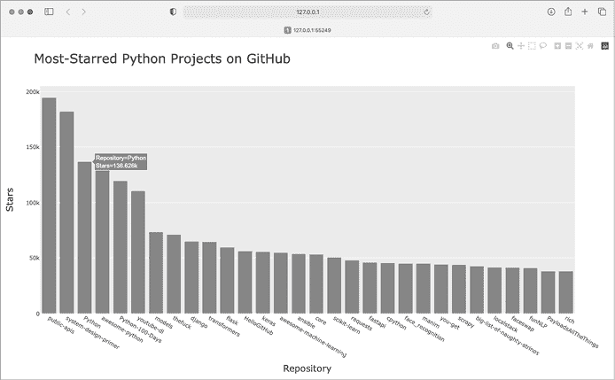
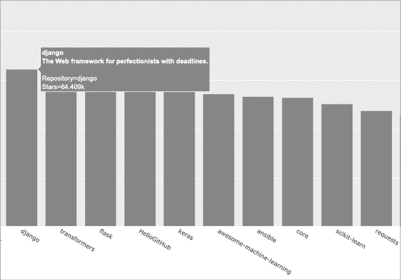

# 第十七章：使用 API


在这一章中，你将学习如何编写一个自包含的程序，基于它获取的数据生成可视化图表。你的程序将使用*应用程序编程接口（**API**）*来自动请求网站上的特定信息，然后使用这些信息生成可视化图表。因为这样的程序总是使用最新的数据来生成可视化图表，即使这些数据可能会快速变化，生成的图表也会始终保持最新。

## 使用 API

API 是网站的一部分，用于与程序交互。这些程序使用非常特定的 URL 请求某些信息。这样的请求被称为*API 调用*。请求的数据将以易于处理的格式返回，如 JSON 或 CSV。大多数使用外部数据源的应用程序，例如集成社交媒体网站的应用程序，都依赖于 API 调用。

### Git 和 GitHub

我们将基于 GitHub ([`github.com`](https://github.com)) 上的信息创建可视化图表，这个网站允许程序员共同协作编码项目。我们将使用 GitHub 的 API 请求网站上 Python 项目的信息，然后使用 Plotly 生成这些项目的相对受欢迎程度的交互式可视化图表。

GitHub 的名字来源于 Git，一种分布式版本控制系统。Git 帮助人们管理项目工作，防止一个人的更改与其他人的更改冲突。当你在一个项目中实现新功能时，Git 会跟踪你对每个文件所做的更改。当你的新代码正常工作时，你*提交*所做的更改，Git 会记录项目的新状态。如果你犯了错误并想恢复更改，你可以轻松返回到任何之前正常工作的状态。（了解更多关于使用 Git 的版本控制，参见附录 D。）GitHub 上的项目存储在*仓库*中，仓库包含与项目相关的所有内容：代码、协作者信息、任何问题或错误报告等。

当 GitHub 用户喜欢一个项目时，他们可以通过“加星”来表示支持，并跟踪可能想要使用的项目。在这一章中，我们将编写一个程序，自动下载 GitHub 上最受欢迎 Python 项目的信息，并创建这些项目的有用可视化图表。

### 使用 API 调用请求数据

GitHub 的 API 允许你通过 API 调用请求各种信息。要查看一个 API 调用的样式，输入以下内容到浏览器的地址栏并按下 ENTER：

```py
**https://api.github.com/search/repositories?q=language:python+sort:stars**
```

这个调用返回当前托管在 GitHub 上的 Python 项目数量，以及最受欢迎的 Python 仓库的相关信息。让我们来检查一下这个调用。第一部分，`https://api.github.com/`，将请求定向到 GitHub 处理 API 调用的部分。接下来的部分，`search/repositories`，指示 API 在 GitHub 上的所有仓库中进行搜索。

`repositories` 后面的问号表示我们即将传递一个参数。`q` 代表 *查询*，等号（`=`）让我们开始指定查询（`q=`）。通过使用 `language:python`，我们表示只想获取主语言为 Python 的仓库信息。最后部分，`+sort:stars`，按照项目的星标数量对项目进行排序。

以下代码片段显示了响应的前几行：

```py
{
❶   "total_count": 8961993,
❷   "incomplete_results": true,
❸   "items": [
    {
      "id": 54346799,
      "node_id": "MDEwOlJlcG9zaXRvcnk1NDM0Njc5OQ==",
      "name": "public-apis",
      "full_name": "public-apis/public-apis",
 `--snip--`
```

从响应中可以看到，这个 URL 并非主要是供人类输入的，因为它的格式是为了让程序处理的。到目前为止，GitHub 找到了不到九百万个 Python 项目 ❶。`"incomplete_results"` 的值为 `true`，这告诉我们 GitHub 没有完全处理查询 ❷。GitHub 限制了每个查询的运行时间，以保持 API 对所有用户的响应能力。在这种情况下，它找到了最受欢迎的一些 Python 仓库，但没有足够的时间找到所有的；稍后我们会修复这个问题。返回的 `"items"` 被显示在接下来的列表中，其中包含了 GitHub 上最受欢迎的 Python 项目的详细信息 ❸。

### 安装 Requests

*Requests* 包允许 Python 程序轻松地从网站请求信息并查看响应。使用 pip 安装 Requests：

```py
$ **python -m pip install --user requests**
```

如果你使用的命令不是 `python` 来运行程序或启动终端会话，比如 `python3`，你的命令将会像这样：

```py
$ **python3 -m pip install --user requests**
```

### 处理 API 响应

现在我们将编写一个程序来自动发起 API 调用并处理结果：

**python_repos.py**

```py
import requests

# Make an API call and check the response.
❶ url = "https://api.github.com/search/repositories"
url += "?q=language:python+sort:stars+stars:>10000"

❷ headers = {"Accept": "application/vnd.github.v3+json"}
❸ r = requests.get(url, headers=headers)
❹ print(f"Status code: {r.status_code}")

# Convert the response object to a dictionary.
❺ response_dict = r.json()

# Process results.
print(response_dict.keys())
```

我们首先导入 `requests` 模块。然后，我们将 API 调用的 URL 分配给 `url` 变量 ❶。这是一个很长的 URL，所以我们将其拆分成两行。第一行是 URL 的主体部分，第二行是查询字符串。我们在原查询字符串中添加了一个条件：`stars:>10000`，这表示 GitHub 只搜索那些星标超过 10,000 的 Python 仓库。这应该能让 GitHub 返回一个完整、一致的结果集。

GitHub 当前使用的是第三版 API，因此我们定义了 API 调用的头部，明确要求使用这个版本的 API，并以 JSON 格式返回结果 ❷。然后，我们使用 `requests` 来发起 API 调用 ❸。我们调用 `get()` 方法，并传入我们定义的 URL 和头部，将响应对象分配给变量 `r`。

响应对象有一个名为`status_code`的属性，它告诉我们请求是否成功。（状态码 200 表示响应成功。）我们打印`status_code`的值，以确保请求成功完成 ❹。我们请求 API 以 JSON 格式返回信息，因此我们使用`json()`方法将信息转换为 Python 字典 ❺。我们将结果字典赋值给`response_dict`。

最后，我们打印`response_dict`中的键并查看以下输出：

```py
Status code: 200
dict_keys(['total_count', 'incomplete_results', 'items'])
```

因为状态码是`200`，我们知道请求成功。响应字典只包含三个键：`'total_count'`、`'incomplete_results'`和`'items'`。让我们来看一下响应字典的内容。

### 处理响应字典

通过将 API 调用返回的信息表示为字典，我们可以处理存储在其中的数据。让我们生成一些输出，来总结这些信息。这是确保我们收到了预期信息并开始检查我们感兴趣的信息的好方法：

**python_repos.py**

```py
import requests

# Make an API call and store the response.
*--snip--*

# Convert the response object to a dictionary.
response_dict = r.json()
❶ print(f"Total repositories: {response_dict['total_count']}")
print(f"Complete results: {not response_dict['incomplete_results']}")

# Explore information about the repositories.
❷ repo_dicts = response_dict['items']
print(f"Repositories returned: {len(repo_dicts)}")

# Examine the first repository.
❸ repo_dict = repo_dicts[0]
❹ print(f"\nKeys: {len(repo_dict)}")
❺ for key in sorted(repo_dict.keys()):
    print(key)
```

我们通过打印与`'total_count'`关联的值开始探索响应字典，这个值表示该 API 调用返回的 Python 仓库的总数 ❶。我们还使用与`'incomplete_results'`关联的值，这样我们就能知道 GitHub 是否完全处理了查询。我们不是直接打印这个值，而是打印它的相反值：`True`值表示我们收到了完整的结果集。

`'items'`对应的值是一个列表，列表中包含多个字典，每个字典包含一个独立的 Python 仓库的数据。我们将这个字典列表赋值给`repo_dicts` ❷。然后我们打印`repo_dicts`的长度，以查看我们拥有多少个仓库信息。

为了更仔细地查看每个仓库返回的信息，我们从`repo_dicts`中取出第一个项目并赋值给`repo_dict` ❸。然后我们打印字典中的键的数量，以查看我们拥有多少信息 ❹。最后，我们打印所有字典的键，以查看包含了哪些类型的信息 ❺。

结果让我们更清楚地了解了实际的数据：

```py
Status code: 200
❶ Total repositories: 248
❷ Complete results: True
Repositories returned: 30

❸ Keys: 78
allow_forking
archive_url
archived
`--snip--`
url
visiblity
watchers
watchers_count
```

在写这篇文章时，只有`248`个 Python 仓库拥有超过 10,000 颗星 ❶。我们可以看到 GitHub 成功地处理了 API 请求 ❷。在这个响应中，GitHub 返回了符合我们查询条件的前`30`个仓库的信息。如果我们想要更多仓库信息，可以请求更多的数据页。

GitHub 的 API 返回了关于每个仓库的大量信息：`repo_dict`中有`78`个键 ❸。当你查看这些键时，你会大致了解你可以从一个项目中提取什么类型的信息。（通过 API 能获取哪些信息，唯一的方式就是阅读文档或者通过代码查看信息，就像我们现在所做的那样。）

让我们提取一些`repo_dict`中的键的值：

**python_repos.py**

```py
*--snip--*
# Examine the first repository.
repo_dict = repo_dicts[0]

print("\nSelected information about first repository:")
❶ print(f"Name: {repo_dict['name']}")
❷ print(f"Owner: {repo_dict['owner']['login']}")
❸ print(f"Stars: {repo_dict['stargazers_count']}")
print(f"Repository: {repo_dict['html_url']}")
❹ print(f"Created: {repo_dict['created_at']}")
❺ print(f"Updated: {repo_dict['updated_at']}")
print(f"Description: {repo_dict['description']}")
```

在这里，我们打印第一个仓库字典中多个键的值。我们从项目名称开始❶。整个字典表示项目的所有者，所以我们使用键`owner`来访问表示所有者的字典，然后使用键`login`来获取所有者的登录名❷。接下来，我们打印项目获得的星标数❸和该项目 GitHub 仓库的 URL。然后，我们展示它的创建时间❹和最后更新时间❺。最后，我们打印仓库的描述。

输出应类似于以下内容：

```py
Status code: 200
Total repositories: 248
Complete results: True
Repositories returned: 30

Selected information about first repository:
Name: public-apis
Owner: public-apis
Stars: 191493
Repository: https://github.com/public-apis/public-apis
Created: 2016-03-20T23:49:42Z
Updated: 2022-05-12T06:37:11Z
Description: A collective list of free APIs
```

我们可以看到，截至目前，GitHub 上星标最多的 Python 项目是*public-apis*。它的所有者是一个同名的组织，已获得近 20 万 GitHub 用户的星标。我们可以看到项目仓库的 URL、创建日期是 2016 年 3 月，并且它最近有更新。此外，描述中告诉我们，*public-apis* 包含了一份程序员可能感兴趣的免费 API 列表。

### 汇总顶级仓库

当我们为这些数据制作可视化时，我们希望包含多个仓库。让我们写一个循环来打印每个 API 调用返回的仓库的选定信息，这样我们就能将它们全部包含在可视化中：

**python_repos.py**

```py
*--snip--*
# Explore information about the repositories.
repo_dicts = response_dict['items']
print(f"Repositories returned: {len(repo_dicts)}")

❶ print("\nSelected information about each repository:")
❷ for repo_dict in repo_dicts:
 print(f"\nName: {repo_dict['name']}")
 print(f"Owner: {repo_dict['owner']['login']}")
 print(f"Stars: {repo_dict['stargazers_count']}")
 print(f"Repository: {repo_dict['html_url']}")
 print(f"Description: {repo_dict['description']}")
```

我们首先打印一条介绍性消息❶。然后我们遍历`repo_dicts`中的所有字典❷。在循环内部，我们打印每个项目的名称、所有者、星标数量、GitHub 上的 URL 以及项目描述：

```py
Status code: 200
Total repositories: 248
Complete results: True
Repositories returned: 30

Selected information about each repository:

Name: public-apis
Owner: public-apis
Stars: 191494
Repository: https://github.com/public-apis/public-apis
Description: A collective list of free APIs

Name: system-design-primer
Owner: donnemartin
Stars: 179952
Repository: https://github.com/donnemartin/system-design-primer
Description: Learn how to design large-scale systems. Prep for the system
  design interview.  Includes Anki flashcards.
`--snip--`

Name: PayloadsAllTheThings
Owner: swisskyrepo
Stars: 37227
Repository: https://github.com/swisskyrepo/PayloadsAllTheThings
Description: A list of useful payloads and bypass for Web Application Security
  and Pentest/CTF
```

一些有趣的项目出现在这些结果中，可能值得看一看。但不要在这里花太多时间，因为我们即将创建一个可视化，使得这些结果更易于阅读。

### 监控 API 请求限制

大多数 API 都有*请求限制*，这意味着你在一定时间内可以发出的请求数量是有限制的。要查看是否接近 GitHub 的限制，请在浏览器中输入[`api.github.com/rate_limit`](https://api.github.com/rate_limit)。你应该会看到类似以下的响应：

```py
{
  "resources": {
    `--snip--`
❶     "search": {
❷       "limit": 10,
❸       "remaining": 9,
❹       "reset": 1652338832,
      "used": 1,
      "resource": "search"
    },
    `--snip--`
```

我们关心的信息是搜索 API 的请求限制❶。我们看到限制是每分钟 10 次请求❷，并且当前分钟剩余 9 次请求❸。与键`"reset"`相关的值表示我们的配额将在何时重置，时间是*Unix* 或 *epoch 时间*（自 1970 年 1 月 1 日午夜以来的秒数）❹。如果达到配额限制，你会收到一条简短的响应，告知你已达到 API 限制。如果你达到了限制，只需等待配额重置。

## 使用 Plotly 可视化仓库

让我们使用收集到的数据制作一个可视化图，展示 GitHub 上 Python 项目的相对受欢迎程度。我们将制作一个交互式条形图：每个条形的高度表示该项目获得的星标数量，你可以点击条形的标签进入该项目在 GitHub 上的主页。

将我们正在编写的程序保存为*python_repos_visual.py*，然后修改它，使其如下所示：

**python_repos_visual.py**

```py
import requests
import plotly.express as px

# Make an API call and check the response.
url = "https://api.github.com/search/repositories"
url += "?q=language:python+sort:stars+stars:>10000"

headers = {"Accept": "application/vnd.github.v3+json"}
r = requests.get(url, headers=headers)
❶ print(f"Status code: {r.status_code}")

# Process overall results.
response_dict = r.json()
❷ print(f"Complete results: {not response_dict['incomplete_results']}")

# Process repository information.
repo_dicts = response_dict['items']
❸ repo_names, stars = [], []
for repo_dict in repo_dicts:
    repo_names.append(repo_dict['name'])
    stars.append(repo_dict['stargazers_count'])

# Make visualization.
❹ fig = px.bar(x=repo_names, y=stars)
fig.show()
```

我们导入 Plotly Express，然后像之前一样进行 API 调用。我们继续打印 API 调用响应的状态，以便在出现问题时知道❶。当我们处理总体结果时，继续打印确认信息，确保我们获得了完整的结果集❷。我们删除了其他的`print()`调用，因为我们不再处于探索阶段；我们知道我们已经得到了所需的数据。

然后，我们创建两个空列表❸来存储将要包含在初始图表中的数据。我们需要每个项目的名称来标记条形图（`repo_names`），以及每个项目的星标数量来确定条形图的高度（`stars`）。在循环中，我们将每个项目的名称和星标数量追加到这两个列表中。

我们用两行代码❹制作初步的可视化。这与 Plotly Express 的理念一致：在美化图表之前，你应该尽快看到你的可视化效果。在这里，我们使用`px.bar()`函数来创建条形图。我们将`repo_names`列表作为`x`参数，`stars`作为`y`参数。

图 17-1 展示了最终的图表。我们可以看到，前几个项目比其他项目受欢迎得多，但它们都是 Python 生态系统中非常重要的项目。


图 17-1：GitHub 上最受星标的 Python 项目

### 样式调整图表

一旦确认图表中的信息正确，Plotly 支持多种方式来调整和定制图表样式。我们将在最初的`px.bar()`调用中做一些修改，然后在图表创建后对`fig`对象进行进一步调整。

我们将通过为每个坐标轴添加标题和标签来开始为图表进行样式调整：

**python_repos_visual.py**

```py
*--snip--*
# Make visualization.
title = "Most-Starred Python Projects on GitHub"
labels = {'x': 'Repository', 'y': 'Stars'}
fig = px.bar(x=repo_names, y=stars, title=title, labels=labels)

❶ fig.update_layout(title_font_size=28, xaxis_title_font_size=20,
        yaxis_title_font_size=20)

fig.show()
```

我们首先添加一个标题和每个坐标轴的标签，正如我们在第十五章和第十六章中所做的那样。然后，我们使用`fig.update_layout()`方法来修改图表的特定元素❶。Plotly 使用一种约定，图表元素的各个方面通过下划线连接。当你熟悉 Plotly 的文档时，你会开始发现不同图表元素的命名和修改存在一致的模式。在这里，我们将标题的字体大小设置为`28`，每个坐标轴标题的字体大小设置为`20`。结果如图 17-2 所示。



图 17-2：已经为主图表和每个坐标轴添加了标题。

### 添加自定义工具提示

在 Plotly 中，你可以将光标悬停在单个柱状条上，以显示该柱状条所表示的信息。这通常被称为*工具提示*，在本例中，它目前显示项目的星标数。让我们创建一个自定义工具提示，显示每个项目的描述以及项目的所有者。

我们需要提取一些额外的数据来生成工具提示：

**python_repos_visual.py**

```py
*--snip--*
# Process repository information.
repo_dicts = response_dict['items']
❶ repo_names, stars, hover_texts = [], [], []
for repo_dict in repo_dicts:
 repo_names.append(repo_dict['name'])
 stars.append(repo_dict['stargazers_count'])

    # Build hover texts.
❷     owner = repo_dict['owner']['login']
    description = repo_dict['description']
❸     hover_text = f"{owner}<br />{description}"
    hover_texts.append(hover_text)

# Make visualization.
title = "Most-Starred Python Projects on GitHub"
labels = {'x': 'Repository', 'y': 'Stars'}
❹ fig = px.bar(x=repo_names, y=stars, title=title, labels=labels,
        hover_name=hover_texts)

fig.update_layout(title_font_size=28, xaxis_title_font_size=20,
 yaxis_title_font_size=20)

fig.show()
```

我们首先定义一个新的空列表`hover_texts`，用于存储我们希望为每个项目显示的文本❶。在处理数据的循环中，我们提取每个项目的所有者和描述❷。Plotly 允许在文本元素中使用 HTML 代码，因此我们生成一个包含换行符(`<br />`)的标签字符串，将项目所有者的用户名与描述分隔开❸。然后，我们将此标签附加到列表`hover_texts`中。

在`px.bar()`调用中，我们添加了`hover_name`参数，并将`hover_texts`传递给它❹。这与我们自定义全球地震活动图中每个点标签的做法相同。当 Plotly 创建每个柱状条时，它会从此列表中提取标签，并且只有当观众将光标悬停在柱状条上时才会显示这些标签。图 17-3 展示了其中一个自定义工具提示。



图 17-3：悬停在柱状图上会显示项目的所有者和描述。

### 添加可点击链接

由于 Plotly 允许在文本元素中使用 HTML，我们可以轻松地在图表中添加链接。我们可以使用*x*-轴标签作为方式，让观众访问任何项目在 GitHub 上的主页。我们需要从数据中提取 URLs，并在生成*x*-轴标签时使用它们：

**python_repos_visual.py**

```py
*--snip--*
# Process repository information.
repo_dicts = response_dict['items']
❶ repo_links, stars, hover_texts = [], [], []
for repo_dict in repo_dicts:
    # Turn repo names into active links.
    repo_name = repo_dict['name']
❷     repo_url = repo_dict['html_url']
❸     repo_link = f"<a href='{repo_url}'>{repo_name}</a>"
    repo_links.append(repo_link)

 stars.append(repo_dict['stargazers_count'])
  *--snip--*

# Make visualization.
title = "Most-Starred Python Projects on GitHub"
labels = {'x': 'Repository', 'y': 'Stars'}
fig = px.bar(x=repo_links, y=stars, title=title, labels=labels,
 hover_name=hover_texts)

fig.update_layout(title_font_size=28, xaxis_title_font_size=20,
 yaxis_title_font_size=20)

fig.show()
```

我们将创建的列表名称从`repo_names`更新为`repo_links`，以更准确地传达我们为图表整理的信息类型❶。然后，我们从`repo_dict`中提取项目的 URL，并将其赋值给临时变量`repo_url`❷。接下来，我们生成指向项目的链接❸。我们使用 HTML 锚标签，它的形式为`<a href='URL'>链接文本</a>`，来生成链接。然后，我们将这个链接附加到`repo_links`中。

当我们调用`px.bar()`时，我们使用`repo_links`作为图表中的*x*值。结果看起来和之前一样，但现在观众可以点击图表底部的任何项目名称，访问该项目在 GitHub 上的主页。现在我们有了一个互动的、富有信息的可视化，展示了通过 API 检索的数据！

### 自定义标记颜色

一旦图表创建完成，几乎图表的任何方面都可以通过更新方法进行自定义。我们之前使用过`update_layout()`方法。另一个方法`update_traces()`可以用来定制图表上呈现的数据。

让我们将柱状图的颜色改为更深的蓝色，并添加一些透明度：

```py
*--snip--*
fig.update_layout(title_font_size=28, xaxis_title_font_size=20,
 yaxis_title_font_size=20)

fig.update_traces(marker_color='SteelBlue', marker_opacity=0.6)

fig.show()
```

在 Plotly 中，*trace* 指的是图表上的一组数据。`update_traces()` 方法可以接受多种不同的参数；任何以 `marker_` 开头的参数都会影响图表上的标记。这里，我们将每个标记的颜色设置为 `'SteelBlue'`；任何命名的 CSS 颜色都可以在这里使用。我们还将每个标记的透明度设置为 `0.6`。透明度为 1.0 时，标记将完全不透明；透明度为 0 时，标记将完全透明。

### 更多关于 Plotly 和 GitHub API 的内容

Plotly 的文档内容丰富且组织良好；然而，可能很难知道从哪里开始阅读。一个不错的起点是阅读文章《Python 中的 Plotly Express》，地址是：[`plotly.com/python/plotly-express`](https://plotly.com/python/plotly-express)。这篇文章概述了你可以使用 Plotly Express 制作的所有图表，并且你可以找到关于每种单独图表类型的更长文章的链接。

如果你想更好地理解如何自定义 Plotly 图表，文章《Python 中的 Plotly Express 图表样式》将进一步扩展你在第 15 到 17 章中看到的内容。你可以在这里找到这篇文章：[`plotly.com/python/styling-plotly-express`](https://plotly.com/python/styling-plotly-express)。

关于 GitHub API 的更多信息，请参考它的文档：[`docs.github.com/en/rest`](https://docs.github.com/en/rest)。在这里，你将了解如何从 GitHub 拉取各种各样的信息。要扩展你在这个项目中看到的内容，可以在侧边栏中查找参考文献的搜索部分。如果你有 GitHub 账户，你也可以使用自己的数据以及其他用户的公开数据进行操作。

## Hacker News API

为了探索如何在其他网站上使用 API 调用，我们来快速看一下 Hacker News（[`news.ycombinator.com`](https://news.ycombinator.com)）。在 Hacker News 上，人们分享关于编程和技术的文章，并就这些文章进行热烈讨论。Hacker News 的 API 提供了对网站上所有提交和评论的数据访问，你可以在无需注册 API 密钥的情况下使用这个 API。

以下调用返回了截至目前的当前热门文章的信息：

```py
https://hacker-news.firebaseio.com/v0/item/31353677.json
```

当你在浏览器中输入这个 URL 时，你会看到页面上的文本被大括号括起来，这意味着它是一个字典。但是，如果没有更好的格式化，响应是很难查看的。让我们像第十六章的地震项目中那样，通过`json.dumps()`方法运行这个 URL，这样我们就能探索返回的关于文章的信息：

**hn_article.py**

```py
import requests
import json

# Make an API call, and store the response.
url = "https://hacker-news.firebaseio.com/v0/item/31353677.json"
r = requests.get(url)
print(f"Status code: {r.status_code}")

# Explore the structure of the data.
response_dict = r.json()
response_string = json.dumps(response_dict, indent=4)
❶ print(response_string)
```

这个程序中的所有内容应该都很熟悉，因为我们在前两章中已经使用过它。这里的主要区别是，我们可以打印格式化后的响应字符串❶，而不是将其写入文件，因为输出并不特别长。

输出是关于 ID 为`31353677`的文章的字典信息：

```py
{
    "by": "sohkamyung",
❶     "descendants": 302,
    "id": 31353677,
❷     "kids": [
        31354987,
        31354235,
        `--snip--`
    ],
    "score": 785,
    "time": 1652361401,
❸     "title": "Astronomers reveal first image of the black hole
        at the heart of our galaxy",
    "type": "story",
❹     "url": "https://public.nrao.edu/news/.../"
}
```

这个字典包含了我们可以使用的多个键。键`"descendants"`告诉我们文章收到的评论数❶。键`"kids"`提供了所有直接响应该提交的评论 ID❷。这些评论可能也会有自己的评论，因此一个提交的`descendants`通常会多于`kids`。我们可以看到正在讨论的文章的标题❸，以及该文章的 URL❹。

以下 URL 返回了一个简单的列表，列出了当前 Hacker News 上最热门文章的所有 ID：

```py
https://hacker-news.firebaseio.com/v0/topstories.json
```

我们可以使用此调用来查找当前首页上的文章，并生成一系列类似于我们刚才查看的 API 调用。通过这种方法，我们可以打印出当前 Hacker News 首页所有文章的摘要：

**hn_submissions.py**

```py
from operator import itemgetter

import requests

# Make an API call and check the response.
❶ url = "https://hacker-news.firebaseio.com/v0/topstories.json"
r = requests.get(url)
print(f"Status code: {r.status_code}")

# Process information about each submission.
❷ submission_ids = r.json()
❸ submission_dicts = []
for submission_id in submission_ids[:5]:
    # Make a new API call for each submission.
❹     url = f"https://hacker-news.firebaseio.com/v0/item/{submission_id}.json"
    r = requests.get(url)
    print(f"id: {submission_id}\tstatus: {r.status_code}")
    response_dict = r.json()

    # Build a dictionary for each article.
❺     submission_dict = {
        'title': response_dict['title'],
        'hn_link': f"https://news.ycombinator.com/item?id={submission_id}",
        'comments': response_dict['descendants'],
    }
❻     submission_dicts.append(submission_dict)

❼ submission_dicts = sorted(submission_dicts, key=itemgetter('comments'),
                            reverse=True)

❽ for submission_dict in submission_dicts:
    print(f"\nTitle: {submission_dict['title']}")
    print(f"Discussion link: {submission_dict['hn_link']}")
    print(f"Comments: {submission_dict['comments']}")
```

首先，我们进行一次 API 调用，并打印响应的状态❶。此 API 调用会返回一个列表，包含调用时 Hacker News 上最多 500 篇最受欢迎文章的 ID。然后，我们将响应对象转换为一个 Python 列表❷，并将其赋值给`submission_ids`。我们将使用这些 ID 来构建一个包含当前提交信息的字典集合。

我们设置了一个空的列表，名为`submission_dicts`，用于存储这些字典❸。然后，我们循环遍历前 30 个提交的 ID。我们为每个提交生成一个包含当前`submission_id`值的 URL，进行新的 API 调用❹。我们打印每个请求的状态及其 ID，以便查看请求是否成功。

接下来，我们为当前正在处理的提交创建一个字典❺。我们存储该提交的标题、讨论页面的链接以及该文章目前收到的评论数。然后，我们将每个`submission_dict`追加到`submission_dicts`列表中❻。

Hacker News 上的每个提交都会根据多个因素进行排名，包括投票次数、收到的评论数和提交的时间等。我们希望根据评论数对字典列表进行排序。为此，我们使用了一个名为`itemgetter()`的函数❼，它来自`operator`模块。我们将这个函数的键`'comments'`传递给它，函数会从列表中的每个字典中提取该键的值。然后，`sorted()`函数使用这个值来排序列表。我们按降序排序，以将评论数最多的文章排在最前面。

一旦列表排序完成，我们遍历列表❽并打印出每个顶级提交的三条信息：标题、讨论页面的链接以及该提交目前的评论数：

```py
Status code: 200
id: 31390506    status: 200
id: 31389893    status: 200
id: 31390742    status: 200
`--snip--`

Title: Fly.io: The reclaimer of Heroku's magic
Discussion link: https://news.ycombinator.com/item?id=31390506
Comments: 134

Title: The weird Hewlett Packard FreeDOS option
Discussion link: https://news.ycombinator.com/item?id=31389893
Comments: 64

Title: Modern JavaScript Tutorial
Discussion link: https://news.ycombinator.com/item?id=31390742
Comments: 20
`--snip--`
```

你可以使用类似的过程通过任何 API 访问和分析信息。通过这些数据，你可以创建一个可视化，显示哪些提交激发了最活跃的近期讨论。这也是为像 Hacker News 这样的站点提供定制化阅读体验的基础。要了解更多关于如何通过 Hacker News API 访问的信息，请访问文档页面 [`github.com/HackerNews/API`](https://github.com/HackerNews/API)。

## 总结

在本章中，你学习了如何使用 API 编写自包含程序，自动收集所需的数据，并利用这些数据创建可视化。你使用了 GitHub API 探索了 GitHub 上最受欢迎的 Python 项目，并且简要了解了 Hacker News API。你学会了如何使用 Requests 包自动发起 API 请求，并处理该请求的结果。我们还介绍了一些 Plotly 设置，用于进一步自定义你生成的图表外观。

在下一章，你将使用 Django 构建一个 Web 应用程序作为最终项目。
