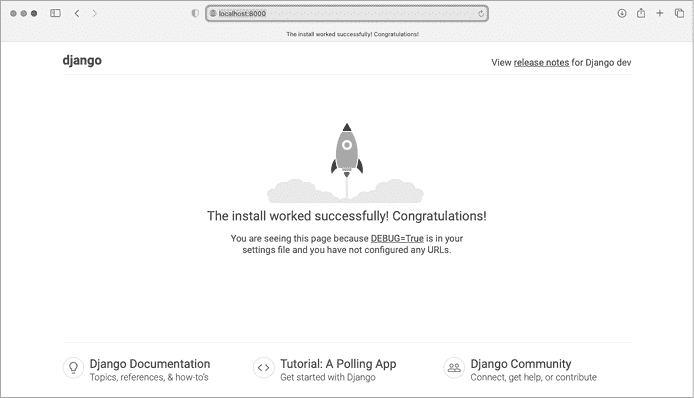
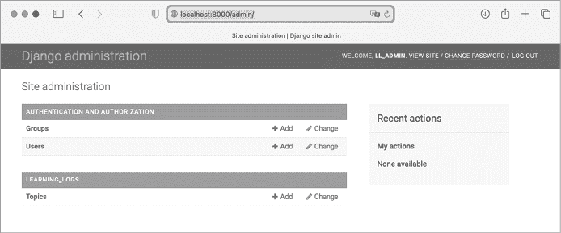
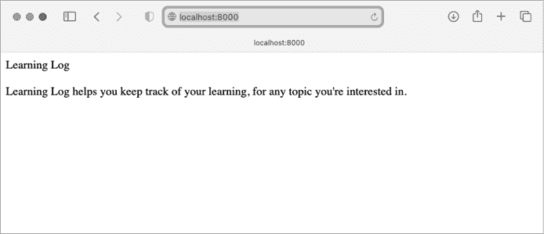
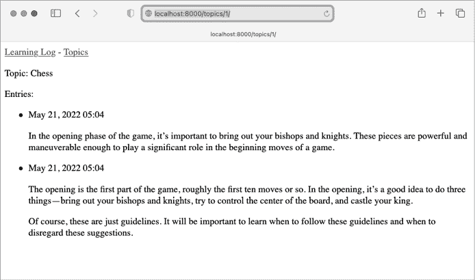

# 第十八章：开始使用 Django


随着互联网的发展，网站和移动应用之间的界限逐渐模糊。网站和应用都帮助用户以多种方式与数据互动。幸运的是，你可以使用 Django 来构建一个既能提供动态网站，又能支持一套移动应用的项目。*Django* 是 Python 最受欢迎的 *web 框架*，它是一个为构建互动式 web 应用而设计的一套工具。在本章中，你将学习如何使用 Django 构建一个名为 Learning Log 的项目，这是一个在线日记系统，可以帮助你记录你所学到的不同主题的信息。

我们将为这个项目编写一个规范，然后定义该应用将使用的数据模型。我们将使用 Django 的管理系统输入一些初始数据，然后编写视图和模板，以便 Django 能构建网站的页面。

Django 可以响应页面请求，并使得读取和写入数据库、更好地管理用户等变得更加简便。在第十九章和第二十章中，你将完善 Learning Log 项目，并将其部署到在线服务器，这样你（以及全世界的其他人）就可以使用它。

## 设置项目

在开始一个像 web 应用这样重要的项目时，首先需要在规范（*spec*）中描述项目的目标。一旦你有了明确的目标，就可以开始识别可管理的任务来实现这些目标。

在本节中，我们将为 Learning Log 编写一个规范，并开始着手项目的第一阶段。这将包括设置虚拟环境并构建 Django 项目的初步部分。

### 编写规范

完整的规范详细说明了项目目标，描述了项目的功能，并讨论了其外观和用户界面。像任何好的项目或商业计划一样，规范应帮助你保持专注，确保项目按计划推进。我们在这里不会编写完整的项目规范，但会列出一些清晰的目标，以确保开发过程有条不紊。以下是我们将使用的规范：

> 我们将编写一个名为 Learning Log 的 web 应用，它允许用户记录他们感兴趣的主题，并在学习每个主题时做日记记录。Learning Log 的主页将描述该网站，并邀请用户注册或登录。一旦登录，用户可以创建新主题、添加新条目，并阅读和编辑现有条目。

当你研究一个新主题时，保持学习日志可以帮助你跟踪新信息以及已经找到的信息。尤其在学习技术类内容时，这一点尤为重要。一个好的应用程序，像我们将要创建的这个应用，可以帮助你提高这一过程的效率。

### 创建虚拟环境

为了使用 Django，我们首先设置一个虚拟环境。*虚拟环境* 是系统中可以安装包并将其与其他 Python 包隔离的地方。将一个项目的库与其他项目分开是有益的，并且在第二十章将 Learning Log 部署到服务器时是必要的。

为你的项目创建一个新的目录，命名为 *learning_log*，在终端中切换到该目录，并输入以下代码来创建虚拟环境：

```py
learning_log$ **python -m venv ll_env**
learning_log$
```

在这里，我们运行 `venv` 虚拟环境模块，并使用它来创建名为 *ll_env* 的环境（请注意，这个名称以两个小写字母 *L* 开头，而不是两个数字 1）。如果你在运行程序或安装包时使用像 `python3` 这样的命令，请确保在这里也使用相同的命令。

### 激活虚拟环境

现在我们需要激活虚拟环境，使用以下命令：

```py
learning_log$ **source ll_env/bin/activate**
(ll_env)learning_log$
```

该命令运行 *ll_env/bin/* 中的 *activate* 脚本。当虚拟环境激活时，你会看到环境名称显示在括号中。这表示你可以向环境中安装新的包并使用已经安装的包。在 *ll_env* 中安装的包在环境不活跃时无法使用。

要停止使用虚拟环境，输入 `deactivate`：

```py
(ll_env)learning_log$ **deactivate**
learning_log$
```

当你关闭运行虚拟环境的终端时，环境也会变得不活跃。

### 安装 Django

在虚拟环境激活后，输入以下命令来更新 pip 并安装 Django：

```py
(ll_env)learning_log$ **pip install --upgrade pip**
(ll_env)learning_log$ **pip install django**
Collecting django
`--snip--`
Installing collected packages: sqlparse, asgiref, django
Successfully installed asgiref-3.5.2 django-4.1 sqlparse-0.4.2
(ll_env)learning_log$
```

由于 pip 会从多个来源下载资源，因此它会比较频繁地升级。每次创建新虚拟环境时，最好都升级 pip。

我们现在在虚拟环境中工作，所以安装 Django 的命令在所有系统中都是相同的。无需使用更长的命令，如 `python -m pip install` `package_name`，也不需要包括 `--user` 标志。请记住，Django 只有在 *ll_env* 环境激活时才可用。

### 在 Django 中创建项目

在不离开激活的虚拟环境（记得在终端提示符中查找括号里的 *ll_env*）的情况下，输入以下命令来创建一个新项目：

```py
❶ (ll_env)learning_log$ **django-admin startproject ll_project .**
❷ (ll_env)learning_log$ **ls**
ll_env ll_project manage.py
❸ (ll_env)learning_log$ **ls ll_project**
__init__.py asgi.py settings.py urls.py wsgi.py
```

`startproject` 命令❶ 告诉 Django 创建一个名为 *ll_project* 的新项目。命令末尾的点（`.`）会创建一个新的项目，并生成一个目录结构，这样在我们完成开发后，可以方便地将应用部署到服务器上。

运行 `ls` 命令（Windows 上使用 `dir`）❷ 可以看到 Django 创建了一个名为 *ll_project* 的新目录。它还创建了一个 *manage.py* 文件，这是一个简短的程序，用来接收命令并将其传递给 Django 的相关部分。我们将使用这些命令来管理任务，如操作数据库和运行服务器。

*ll_project*目录包含四个文件 ❸；其中最重要的是*settings.py*、*urls.py*和*wsgi.py*。*settings.py*文件控制 Django 如何与您的系统交互并管理您的项目。在项目发展过程中，我们会修改其中的一些设置并添加我们自己的设置。*urls.py*文件告诉 Django 在响应浏览器请求时构建哪些页面。*wsgi.py*文件帮助 Django 提供它所创建的文件。该文件名是“Web 服务器网关接口”的缩写。

### 创建数据库

Django 将项目的大部分信息存储在数据库中，因此接下来我们需要创建一个 Django 可以使用的数据库。输入以下命令（仍然在活动环境中）：

```py
(ll_env)learning_log$ **python manage.py migrate**
❶ Operations to perform:
 Apply all migrations: admin, auth, contenttypes, sessions
Running migrations:
  Applying contenttypes.0001_initial... OK
  Applying auth.0001_initial... OK
 `--snip--`
  Applying sessions.0001_initial... OK
❷ (ll_env)learning_log$ **ls**
db.sqlite3 ll_env ll_project manage.py
```

每当我们修改数据库时，我们称之为*迁移*数据库。首次执行`migrate`命令会告诉 Django 确保数据库与项目的当前状态相匹配。第一次在使用 SQLite 的新项目中运行此命令时，Django 会为我们创建一个新的数据库。在这里，Django 报告它将准备数据库以存储处理管理和认证任务所需的信息 ❶。

运行`ls`命令显示 Django 创建了另一个名为*db.sqlite3*的文件 ❷。*SQLite*是一个基于单个文件运行的数据库；它非常适合编写简单应用，因为您不需要过多关注数据库管理。

### 查看项目

让我们确保 Django 已正确设置项目。输入`runserver`命令查看当前状态下的项目：

```py
(ll_env)learning_log$ **python manage.py runserver**
Watching for file changes with StatReloader
Performing system checks...

❶ System check identified no issues (0 silenced).
May 19, 2022 - 21:52:35
❷ Django version 4.1, using settings 'll_project.settings'
❸ Starting development server at http://127.0.0.1:8000/
Quit the server with CONTROL-C.
```

Django 应该启动一个名为*开发服务器*的服务器，这样您就可以在系统上查看项目，看看它的运行效果。当您通过在浏览器中输入 URL 来请求页面时，Django 服务器会响应该请求，构建相应的页面并将其发送到浏览器。

Django 首先检查确保项目已正确设置 ❶；然后报告正在使用的 Django 版本以及正在使用的设置文件的名称 ❷。最后，它报告项目正在服务的 URL ❸。URL *http://127.0.0.1:8000/* 表示该项目正在监听计算机上端口 8000 的请求，这个地址被称为本地主机（localhost）。*localhost*指的是一个仅处理您系统上的请求的服务器；它不允许其他人查看您正在开发的页面。

打开一个网页浏览器并输入 URL *http://localhost:8000/*，或者如果第一个无法使用，可以输入 *http://127.0.0.1:8000/*。您应该会看到类似于图 18-1 的内容：Django 创建的页面，用来告诉您到目前为止一切正常。暂时保持服务器运行，但当您想停止服务器时，可以在发出`runserver`命令的终端中按 CTRL-C。



图 18-1：到目前为止一切正常。

## 启动一个应用

Django *项目* 被组织为一组独立的 *应用*，这些应用共同工作，使项目作为一个整体运作。现在，我们将创建一个应用来完成我们项目的大部分工作。在第十九章中，我们会添加另一个应用来管理用户账户。

你应该保持之前打开的终端窗口中的开发服务器正在运行。打开一个新的终端窗口（或标签页），并导航到包含 *manage.py* 的目录。激活虚拟环境，然后运行 `startapp` 命令：

```py
learning_log$ **source ll_env/bin/activate**
(ll_env)learning_log$ **python manage.py startapp learning_logs**
❶ (ll_env)learning_log$ **ls**
db.sqlite3 learning_logs ll_env ll_project manage.py
❷ (ll_env)learning_log$ **ls learning_logs/**
__init__.py admin.py apps.py migrations models.py tests.py views.py
```

命令 `startapp` `appname` 告诉 Django 创建构建应用所需的基础设施。当你现在查看项目目录时，你会看到一个名为 *learning_logs* ❶ 的新文件夹。使用 `ls` 命令查看 Django 创建了什么 ❷。最重要的文件是 *models.py*、*admin.py* 和 *views.py*。我们将使用 *models.py* 来定义我们想要在应用中管理的数据。稍后我们会再看看 *admin.py* 和 *views.py*。

### 定义模型

让我们思考一下我们的数据。每个用户需要在他们的学习日志中创建多个话题。每个条目都会与一个话题关联，并且这些条目将以文本的形式显示。我们还需要存储每个条目的时间戳，以便向用户展示他们何时创建了每个条目。

打开文件 *models.py* 并查看其现有内容：

**models.py**

```py
from django.db import models

# Create your models here.
```

一个名为 `models` 的模块正在被导入，我们被邀请创建我们自己的模型。*模型* 告诉 Django 如何处理将存储在应用中的数据。模型是一个类；它有属性和方法，就像我们讨论过的每个类一样。这里是用户将要存储的主题模型：

```py
from django.db import models

class Topic(models.Model):
    """A topic the user is learning about."""
❶     text = models.CharField(max_length=200)
❷     date_added = models.DateTimeField(auto_now_add=True)

❸     def __str__(self):
        """Return a string representation of the model."""
        return self.text
```

我们创建了一个名为 `Topic` 的类，它继承自 `Model` —— 这是 Django 中定义模型基本功能的父类。我们在 `Topic` 类中添加了两个属性：`text` 和 `date_added`。

`text` 属性是一个 `CharField`，它由字符或文本组成 ❶。当你想存储少量文本时，比如名称、标题或城市时，使用 `CharField`。在定义 `CharField` 属性时，我们需要告诉 Django 在数据库中为它预留多少空间。这里我们给它设置了 `max_length` 为 `200` 个字符，这应该足够容纳大多数话题名称。

`date_added` 属性是一个 `DateTimeField`，用于记录日期和时间 ❷。我们传递参数 `auto_now_add=True`，告诉 Django 每当用户创建一个新话题时，自动将此属性设置为当前日期和时间。

告诉 Django 你希望它如何表示模型的一个实例是个好主意。如果一个模型有 `__str__()` 方法，每当 Django 需要生成与该模型实例相关的输出时，它就会调用该方法。这里我们编写了一个 `__str__()` 方法，它返回分配给 `text` 属性的值 ❸。

要查看你可以在模型中使用的不同字段类型，请参考“模型字段参考”页面：[`docs.djangoproject.com/en/4.1/ref/models/fields`](https://docs.djangoproject.com/en/4.1/ref/models/fields)。你现在可能不需要所有信息，但在你开发自己的 Django 项目时，这些信息将非常有用。

### 激活模型

要使用我们的模型，我们必须告诉 Django 将我们的应用包含在整体项目中。打开 *settings.py*（在 *ll_project* 目录下）；你会看到一个部分，告诉 Django 哪些应用已安装在项目中：

**settings.py**

```py
`--snip--`
INSTALLED_APPS = [
    'django.contrib.admin',
    'django.contrib.auth',
    'django.contrib.contenttypes',
    'django.contrib.sessions',
    'django.contrib.messages',
    'django.contrib.staticfiles',
]
`--snip--`
```

通过修改 `INSTALLED_APPS` 来将我们的应用添加到此列表，使其看起来像这样：

```py
*--snip--*
INSTALLED_APPS = [
    # My apps.
    'learning_logs',

 # Default django apps.
 'django.contrib.admin',
  *--snip--*
]
*--snip--*
```

在一个项目中将应用分组有助于在项目增长并包含更多应用时进行追踪。这里我们开始一个名为 `My apps` 的部分，目前只包含 `'learning_logs'`。将自己的应用放在默认应用之前很重要，以防你需要用自定义行为覆盖默认应用的某些行为。

接下来，我们需要告诉 Django 修改数据库，以便它可以存储与模型 `Topic` 相关的信息。在终端中运行以下命令：

```py
(ll_env)learning_log$ **python manage.py makemigrations learning_logs**
Migrations for 'learning_logs':
  learning_logs/migrations/0001_initial.py
    - Create model Topic
(ll_env)learning_log$
```

命令 `makemigrations` 告诉 Django 找出如何修改数据库，以便它可以存储与我们定义的任何新模型相关的数据。这里的输出显示 Django 创建了一个名为 *0001_initial.py* 的迁移文件。这个迁移文件将在数据库中为模型 `Topic` 创建一个表。

现在我们将应用这个迁移，并让 Django 为我们修改数据库：

```py
(ll_env)learning_log$ **python manage.py migrate**
Operations to perform:
  Apply all migrations: admin, auth, contenttypes, learning_logs, sessions
Running migrations:
  Applying learning_logs.0001_initial... OK
```

这个命令的输出大部分与第一次执行 `migrate` 命令时的输出相同。我们需要检查输出的最后一行，Django 会在这里确认 `learning_logs` 的迁移是否成功 `OK`。

每当我们想修改 Learning Log 管理的数据时，我们将遵循以下三个步骤：修改 *models.py*，在 `learning_logs` 上调用 `makemigrations`，然后告诉 Django 执行 `migrate` 操作。

### Django 管理站点

Django 通过其管理站点使得与模型的交互变得简单。Django 的 *管理站点* 仅供网站管理员使用；不适用于普通用户。在本节中，我们将设置管理站点，并通过 `Topic` 模型使用它添加一些主题。

#### 设置超级用户

Django 允许你创建一个 *超级用户*，一个拥有网站所有权限的用户。用户的 *权限* 控制他们可以执行的操作。最严格的权限设置允许用户仅能读取网站上的公共信息。注册用户通常有权限读取自己的私人数据以及一些仅限成员查看的信息。为了有效地管理一个项目，网站所有者通常需要访问网站上存储的所有信息。一个好的管理员会小心处理用户的敏感信息，因为用户对他们访问的应用程序寄予了很大信任。

要在 Django 中创建超级用户，请输入以下命令并按照提示进行操作：

```py
(ll_env)learning_log$ **python manage.py createsuperuser**
❶ Username (leave blank to use 'eric'): **ll_admin**
❷ Email address:
❸ Password:
Password (again):
Superuser created successfully.
(ll_env)learning_log$
```

当你执行 `createsuperuser` 命令时，Django 会提示你输入超级用户的用户名 ❶。这里我使用的是 `ll_admin`，但你可以输入任何你想要的用户名。你可以输入一个电子邮件地址，也可以将该字段留空 ❷。你需要输入密码两次 ❸。

#### 在管理员网站注册模型

Django 自动将一些模型包含在管理员网站中，例如 `User` 和 `Group`，但是我们创建的模型需要手动添加。

当我们启动 `learning_logs` 应用时，Django 会在与 *models.py* 相同的目录中创建一个 *admin.py* 文件。打开 *admin.py* 文件：

**admin.py**

```py
from django.contrib import admin

# Register your models here.
```

要将 `Topic` 注册到管理员网站，请输入以下内容：

```py
from django.contrib import admin

from .models import Topic

admin.site.register(Topic)
```

这段代码首先导入我们要注册的模型 `Topic`。`models` 前面的点告诉 Django 在与 *admin.py* 相同的目录中查找 *models.py* 文件。`admin.site.register()` 代码告诉 Django 通过管理员网站管理我们的模型。

现在使用超级用户账户访问管理员网站。访问 *http://localhost:8000/admin/*，并输入你刚刚创建的超级用户的用户名和密码。你应该会看到一个类似 图 18-2 的页面。这个页面允许你添加新用户和组，并修改现有的用户和组。你也可以操作与我们刚刚定义的 `Topic` 模型相关的数据。



图 18-2：包含 `Topic` 的管理员网站

#### 添加主题

现在 `Topic` 已经在管理员网站注册，接下来让我们添加第一个主题。点击 **Topics** 进入主题页面，页面大部分为空，因为我们还没有需要管理的主题。点击 **Add Topic**，会出现一个添加新主题的表单。在第一个框中输入 `Chess`，然后点击 **Save**。你将被带回主题管理员页面，你会看到刚刚创建的主题。

让我们创建第二个主题，以便有更多的数据进行操作。再次点击 **Add Topic**，输入 `Rock Climbing`。点击 **Save**，你会再次被带回主主题页面。现在，你会看到 Chess 和 Rock Climbing 列出在页面上。

### 定义 Entry 模型

为了让用户记录他们在棋类和攀岩方面的学习内容，我们需要定义一个模型，用于记录用户可以在学习日志中做的条目。每个条目都需要与一个特定的主题相关联。这种关系被称为 *多对一关系*，意味着多个条目可以关联到一个主题。

下面是 `Entry` 模型的代码。将其放入你的 *models.py* 文件中：

**models.py**

```py
from django.db import models

class Topic(models.Model):
  *--snip--*

❶ class Entry(models.Model):
    """Something specific learned about a topic."""
❷     topic = models.ForeignKey(Topic, on_delete=models.CASCADE)
❸     text = models.TextField()
    date_added = models.DateTimeField(auto_now_add=True)

❹     class Meta:
        verbose_name_plural = 'entries'

    def __str__(self):
        """Return a simple string representing the entry."""
❺         return f"{self.text[:50]}..."
```

`Entry` 类继承自 Django 的基础 `Model` 类，就像 `Topic` 类一样 ❶。第一个属性 `topic` 是一个 `ForeignKey` 实例 ❷。*外键* 是一个数据库术语；它是指向数据库中另一个记录的引用。这段代码将每个条目与特定主题关联起来。每个主题在创建时都会分配一个*键*或 ID。当 Django 需要在两条数据之间建立连接时，它会使用与每条数据相关联的键。稍后我们将使用这些连接来检索与某个特定主题相关的所有条目。`on_delete=models.CASCADE` 参数告诉 Django，当删除一个主题时，与该主题关联的所有条目也应该被删除。这被称为 *级联删除*。

接下来是一个名为 `text` 的属性，它是 `TextField` 的一个实例 ❸。这种字段不需要大小限制，因为我们不希望限制单个条目的大小。`date_added` 属性允许我们按创建顺序展示条目，并为每个条目旁边添加一个时间戳。

`Meta` 类嵌套在 `Entry` 类中 ❹。`Meta` 类包含管理模型的额外信息；在这里，它允许我们设置一个特殊的属性，告诉 Django 在需要引用多个条目时使用 `Entries`。如果没有这个，Django 会将多个条目称为 `Entrys`。

`__str__()` 方法告诉 Django 在引用单个条目时显示哪些信息。因为一个条目可能包含大量文本，所以 `__str__()` 返回 `text` 的前 `50` 个字符 ❺。我们还添加了省略号，以明确表示我们并非总是显示完整的条目。

### 迁移条目模型

因为我们添加了一个新模型，所以我们需要再次迁移数据库。这个过程将变得非常熟悉：你修改 *models.py*，运行命令 `python manage.py makemigrations` `app_name`，然后运行命令 `python manage.py migrate`。

迁移数据库并通过输入以下命令来检查输出：

```py
(ll_env)learning_log$ **python manage.py makemigrations learning_logs**
Migrations for 'learning_logs':
❶   learning_logs/migrations/0002_entry.py
    - Create model Entry
(ll_env)learning_log$ **python manage.py migrate**
Operations to perform:
 `--snip--`
❷   Applying learning_logs.0002_entry... OK
```

生成了一个新的迁移文件 *0002_entry.py*，它告诉 Django 如何修改数据库以存储与模型 `Entry` 相关的信息 ❶。当我们执行 `migrate` 命令时，Django 会应用这个迁移，并且一切正常工作 ❷。

### 在管理员网站注册条目

我们还需要注册 `Entry` 模型。现在 *admin.py* 应该是这样的：

**admin.py**

```py
from django.contrib import admin

from .models import Topic, Entry

admin.site.register(Topic)
admin.site.register(Entry)
```

返回到 *http://localhost/admin/*，你应该看到在 *Learning_Logs* 下列出条目。点击**添加**链接来添加条目，或者点击**条目**，然后选择**添加条目**。你应该看到一个下拉列表，供你选择你要创建条目的主题，并且有一个文本框用来添加条目。选择下拉列表中的**国际象棋**，然后添加一个条目。这是我添加的第一个条目：

> 开局是游戏的第一部分，大约是前十步左右。在开局阶段，做三件事是个好主意——调动主教和骑士，尽量控制棋盘的中心，并为国王城堡。
> 
> 当然，这些只是指导原则。了解何时遵循这些原则以及何时忽视这些建议非常重要。

当你点击**保存**时，页面会带你回到条目的主管理页面。在这里，你会看到使用`text[:50]`作为每个条目的字符串表示的好处；如果只显示条目的前部分而不是每个条目的完整内容，管理界面处理多个条目会更容易。

为 Chess 创建第二个条目，并为 Rock Climbing 创建一个条目，以便我们有一些初始数据。以下是 Chess 的第二个条目：

> 在游戏的开局阶段，重要的是要把你的主教和骑士调出来。这些棋子强大且灵活，足以在游戏的开始阶段发挥重要作用。

这是 Rock Climbing 的第一个条目：

> 攀岩中最重要的概念之一是尽可能将重心放在脚上。有人误以为攀岩者可以整天用手臂挂着。实际上，优秀的攀岩者已经练习过在可能的情况下将重心放在脚上。

这三个条目将为我们提供一些内容，帮助我们继续开发 Learning Log。

### Django Shell

现在我们已经输入了一些数据，可以通过交互式终端会话以编程方式检查它。这个交互式环境叫做 Django 的*shell*，它是一个非常适合测试和排查项目问题的环境。以下是一个交互式 shell 会话的示例：

```py
(ll_env)learning_log$ **python manage.py shell**
❶ >>> **from learning_logs.models import Topic**
>>> **Topic.objects.all()**
<QuerySet [<Topic: Chess>, <Topic: Rock Climbing>]>
```

在激活的虚拟环境中运行`python manage.py shell`命令，可以启动一个 Python 解释器，您可以用它来探索存储在项目数据库中的数据。在这里，我们从`learning_logs.models`模块导入`Topic`模型❶。然后，我们使用方法`Topic.objects.all()`来获取所有`Topic`模型的实例；返回的列表称为*queryset*。

我们可以像遍历列表一样遍历一个 queryset。以下是您如何查看分配给每个主题对象的 ID：

```py
>>> **topics = Topic.objects.all()**
>>> **for topic in topics:**
...     **print(topic.id, topic)**
...
1 Chess
2 Rock Climbing
```

我们将 queryset 分配给`topics`，然后打印每个主题的`id`属性以及每个主题的字符串表示。我们可以看到`Chess`的 ID 是`1`，`Rock Climbing`的 ID 是`2`。

如果您知道某个特定对象的 ID，可以使用方法`Topic.objects.get()`来检索该对象，并检查该对象的任何属性。让我们来看一下`Chess`的`text`和`date_added`值：

```py
>>> **t = Topic.objects.get(id=1)**
>>> **t.text**
'Chess'
>>> **t.date_added**
datetime.datetime(2022, 5, 20, 3, 33, 36, 928759,
    tzinfo=datetime.timezone.utc)
```

我们还可以查看与某个特定主题相关的条目。之前，我们为`Entry`模型定义了`topic`属性。这个属性是一个`ForeignKey`，它在每个条目和一个主题之间建立了连接。Django 可以利用这个连接获取与某个特定主题相关的每个条目，像这样：

```py
❶ >>> **t.entry_set.all()**
<QuerySet [<Entry: The opening is the first part of the game, roughly...>, <Entry:
In the opening phase of the game, it's important t...>]>
```

要通过外键关系获取数据，你需要使用相关模型的小写名称，后跟下划线和单词`set` ❶。例如，假设你有 `Pizza` 和 `Topping` 两个模型，且 `Topping` 通过外键与 `Pizza` 相关。如果你的对象叫做 `my_pizza`，代表一个披萨，你可以使用代码 `my_pizza.topping_set.all()` 获取该披萨的所有配料。

当我们开始编写用户可以请求的页面代码时，我们将使用这个语法。shell 对于确保你的代码能正确获取你想要的数据非常有用。如果你的代码在 shell 中按预期工作，那么它也应该在项目中的文件中正确运行。如果你的代码产生错误或没有按预期获取数据，在简单的 shell 环境中调试代码要比在生成网页的文件中调试要容易得多。我们不会经常提到 shell，但你应该继续使用它来练习 Django 语法，以便访问项目中存储的数据。

每次修改模型后，你需要重新启动 shell 才能看到这些更改的效果。要退出 shell 会话，请按 CTRL-D；在 Windows 上，按 CTRL-Z 然后按 ENTER。

## 制作页面：Learning Log 主页

使用 Django 制作网页分为三个阶段：定义 URL、编写视图和编写模板。你可以按任何顺序进行这些操作，但在这个项目中，我们将始终从定义 URL 模式开始。*URL 模式*描述了 URL 的布局方式。它还告诉 Django 在匹配浏览器请求与网站 URL 时要查找什么，以便知道返回哪个页面。

每个 URL 都映射到一个特定的视图。*视图*函数获取并处理该页面所需的数据。视图函数通常会使用一个*模板*来渲染页面，模板包含页面的整体结构。为了了解这一过程，我们将制作 Learning Log 的主页。我们将定义主页的 URL，编写它的视图函数，并创建一个简单的模板。

因为我们只想确保 Learning Log 按预期工作，所以我们现在将制作一个简单的页面。完成后，功能完整的 Web 应用更容易进行样式化；而一个看起来不错但运行不良的应用毫无意义。目前，主页只会显示一个标题和简短的描述。

### 映射 URL

用户通过在浏览器中输入 URL 并点击链接来请求页面，因此我们需要决定需要哪些 URL。首先是主页的 URL：它是用户访问项目时使用的基础 URL。目前，基础 URL *http://localhost:8000/* 会返回默认的 Django 网站，这告诉我们项目已经正确设置。我们将通过将基础 URL 映射到 Learning Log 的主页来改变这一点。

在主 *ll_project* 文件夹中，打开 *urls.py* 文件。你应该会看到以下代码：

**ll_project/urls.py**

```py
❶ from django.contrib import admin
from django.urls import path

❷ urlpatterns = [
❸     path('admin/', admin.site.urls),
]
```

前两行导入了`admin`模块和一个用于构建 URL 路径的函数❶。文件的主体定义了`urlpatterns`变量❷。在这个*urls.py*文件中，它为整个项目定义了 URLs，`urlpatterns`变量包含了项目中各个应用的 URL 集合。列表中包括了模块`admin.site.urls`，它定义了所有可以从管理站点请求的 URLs❸。

我们需要包含`learning_logs`的 URLs，因此添加以下内容：

```py
from django.contrib import admin
from django.urls import path, include

urlpatterns = [
 path('admin/', admin.site.urls),
  path('', include('learning_logs.urls')),
]
```

我们已经导入了`include()`函数，并且还添加了一行来包含模块`learning_logs.urls`。

默认的*urls.py*文件在*ll_project*文件夹中；现在我们需要在*learning_logs*文件夹中创建一个第二个*urls.py*文件。创建一个新的 Python 文件，将其保存为*urls.py*在*learning_logs*文件夹中，并在其中输入以下代码：

**learning_logs/urls.py**

```py
❶ """Defines URL patterns for learning_logs."""

❷ from django.urls import path

❸ from . import views

❹ app_name = 'learning_logs'
❺ urlpatterns = [
    # Home page
❻     path('', views.index, name='index'),
]
```

为了明确我们正在处理哪个*urls.py*文件，我们在文件开头添加了文档字符串❶。然后我们导入了`path`函数，这是将 URLs 映射到视图时所需要的❷。我们还导入了`views`模块❸；点号告诉 Python 从与当前*urls.py*模块相同的目录导入*views.py*模块。变量`app_name`帮助 Django 区分这个*urls.py*文件与项目中其他应用中同名的文件❹。此模块中的`urlpatterns`变量是一个可以从`learning_logs`应用请求的单独页面的列表❺。

实际的 URL 模式是对`path()`函数的调用，该函数接受三个参数❻。第一个参数是一个字符串，帮助 Django 正确地路由当前请求。Django 接收到请求的 URL 后，会尝试将请求路由到一个视图。它通过搜索我们定义的所有 URL 模式，找到一个与当前请求匹配的模式来实现这一点。Django 忽略项目的基本 URL（*http://localhost:8000/*），所以空字符串（`''`）与基本 URL 匹配。任何其他 URL 都无法匹配此模式，如果请求的 URL 没有匹配任何现有的 URL 模式，Django 将返回一个错误页面。

`path()`中的第二个参数❻指定了要调用的函数，即*views.py*中的函数。当请求的 URL 与我们定义的模式匹配时，Django 会调用*views.py*中的`index()`函数。（我们将在下一节编写这个视图函数。）第三个参数为这个 URL 模式提供了名称*index*，这样我们就可以在项目中的其他文件中更方便地引用它。每当我们想提供一个指向主页的链接时，我们会使用这个名称，而不是写出完整的 URL。

### 编写视图

视图函数接收来自请求的信息，准备生成页面所需的数据，然后将数据发送回浏览器。它通常通过使用一个模板来定义页面的外观，来完成这一过程。

在运行命令`python manage.py startapp`时，*learning_logs*中的*views.py*文件是自动生成的。目前，*views.py*中的内容如下：

**views.py**

```py
from django.shortcuts import render

# Create your views here.
```

目前，这个文件只导入了`render()`函数，该函数根据视图提供的数据渲染响应。打开*views.py*并添加以下代码来创建主页：

```py
from django.shortcuts import render

def index(request):
    """The home page for Learning Log."""
    return render(request, 'learning_logs/index.xhtml')
```

当一个 URL 请求与我们刚刚定义的模式匹配时，Django 会在*views.py*文件中寻找一个名为`index()`的函数。然后，Django 将`request`对象传递给这个视图函数。在这种情况下，我们不需要处理页面的数据，所以函数中唯一的代码就是调用`render()`。这里的`render()`函数传递了两个参数：原始的`request`对象和一个可以用来构建页面的模板。让我们编写这个模板。

### 编写模板

模板定义了页面的外观，而 Django 则在每次请求页面时填充相关数据。模板允许你访问视图提供的任何数据。由于我们为主页提供的视图没有数据，因此这个模板相对简单。

在*learning_logs*文件夹内，创建一个名为*templates*的新文件夹。在*templates*文件夹内，再创建一个名为*learning_logs*的文件夹。这可能看起来有些冗余（我们在一个名为*learning_logs*的文件夹中再放一个名为*templates*的文件夹，里面再放一个名为*learning_logs*的文件夹），但这样可以建立一个 Django 可以明确理解的结构，即使在一个包含多个独立应用的大型项目中也是如此。在内部的*learning_logs*文件夹中，创建一个名为*index.xhtml*的新文件。该文件的路径将是*ll_project/learning_logs/templates/learning_logs/index.xhtml*。在该文件中输入以下代码：

**index.xhtml**

```py
<p>Learning Log</p>

<p>Learning Log helps you keep track of your learning, for any topic you're
interested in.</p>
```

这是一个非常简单的文件。如果你不熟悉 HTML，`<p></p>`标签表示段落。`<p>`标签用于打开一个段落，`</p>`标签用于关闭一个段落。我们有两个段落：第一个作为标题，第二个描述用户可以在 Learning Log 中做什么。

现在，当你请求项目的基础 URL，*http://localhost:8000/*时，你应该能看到我们刚刚创建的页面，而不是默认的 Django 页面。Django 会获取请求的 URL，并将其与模式`''`进行匹配；然后，Django 将调用函数`views.index()`，该函数将使用*index.xhtml*中包含的模板来渲染页面。图 18-3 显示了生成的页面。



图 18-3：Learning Log 的主页

虽然创建一个页面看起来像是一个复杂的过程，但 URL、视图和模板之间的这种分离方式其实非常有效。它让你可以分别思考项目的每个方面。在更大的项目中，它使得参与项目的人可以专注于自己最擅长的领域。例如，数据库专家可以专注于模型，程序员可以专注于视图代码，前端专家则可以专注于模板。

## 创建附加页面

既然我们已经建立了构建页面的常规流程，接下来我们可以开始构建学习日志项目。我们将构建两个显示数据的页面：一个列出所有主题的页面和一个显示特定主题下所有条目的页面。对于每个页面，我们将指定一个 URL 模式，编写一个视图函数，并编写一个模板。但在这之前，我们将创建一个所有模板都可以继承的基础模板。

### 模板继承

在构建网站时，一些元素需要在每个页面上重复。与其在每个页面中直接编写这些元素，不如编写一个包含重复元素的基础模板，然后让每个页面继承自该基础模板。这种方法让你可以专注于开发每个页面的独特部分，并使得更改项目的整体外观和感觉变得更加容易。

#### 父模板

我们将在与*index.xhtml*相同的目录下创建一个名为*base.xhtml*的模板。这个文件将包含所有页面共享的元素；其他所有模板都将继承自*base.xhtml*。目前我们只希望在每个页面上重复的元素是顶部的标题。因为我们将在每个页面中包含这个模板，所以让我们把标题做成指向主页的链接：

**base.xhtml**

```py
<p>
❶   <a href="">Learning Log</a>
</p>

❷ 
```

这个文件的第一部分创建了一个包含项目名称的段落，该名称还充当主页链接。为了生成链接，我们使用一个*模板标签*，它由大括号和百分号表示（``）。模板标签生成将在页面上显示的信息。这里显示的模板标签``生成一个与*learning_logs/urls.py*中定义的 URL 模式匹配的 URL，模式的名称为`'index'` ❶。在这个例子中，`learning_logs`是*命名空间*，而`index`是该命名空间中独一无二的 URL 模式。命名空间来自我们在*learning_logs/urls.py*文件中赋值给`app_name`的值。

在一个简单的 HTML 页面中，链接被*锚点* *标签* `<a>` 包围：

```py
<a href="`link_url`">`link text`</a>
```

让模板标签为我们生成 URL 可以大大简化更新链接的过程。我们只需要在*urls.py*中更改 URL 模式，Django 会在下次请求页面时自动插入更新后的 URL。我们项目中的每个页面都将继承自*base.xhtml*，因此从现在起，每个页面都会有一个指向主页的链接。

在最后一行，我们插入了一对`block`标签 ❷。这个名为`content`的块是一个占位符；子模板将定义放入`content`块中的信息类型。

子模板不必定义父模板中的每个块，因此你可以在父模板中保留尽可能多的块空间；子模板只使用它需要的部分。

#### 子模板

现在我们需要重写*index.xhtml*，使其继承自*base.xhtml*。请将以下代码添加到*index.xhtml*：

**index.xhtml**

```py
❶ 

❷ 
 <p>Learning Log helps you keep track of your learning, for any topic you're
 interested in.</p>
❸ 
```

如果你将其与原始的*index.xhtml*进行对比，你会看到我们将学习日志的标题替换为了继承父模板的代码❶。子模板的第一行必须有``标签，以告诉 Django 从哪个父模板继承。*base.xhtml*文件是`learning_logs`的一部分，因此我们在父模板的路径中包含了*learning_logs*。这一行引入了*base.xhtml*模板中的所有内容，并允许*index.xhtml*定义在`content`块中预留的空间中放置的内容。

我们通过插入一个名为`content`的``标签❷来定义内容块。所有没有从父模板继承的内容都放在`content`块内。这里，就是描述学习日志项目的段落。我们通过使用``标签❸来表示内容定义的结束。``标签不需要指定名称，但如果模板中包含多个块，知道具体哪个块结束会很有帮助。

你可以开始看到模板继承的好处：在子模板中，我们只需要包含该页面独特的内容。这不仅简化了每个模板的编写，还使得修改站点变得更加容易。要修改多个页面共享的元素，只需要修改父模板。然后，你的更改将应用于所有继承自该模板的页面。在一个包含数十或数百个页面的项目中，这种结构可以大大提高更新站点的效率和速度。

在一个大型项目中，通常会有一个名为*base.xhtml*的父模板，涵盖整个站点，以及每个主要部分的父模板。所有的部分模板都继承自*base.xhtml*，站点中的每个页面都继承自一个部分模板。这样，你可以轻松地修改站点的整体外观、任何部分的外观，或者任何单独页面的外观。这种配置提供了一种非常高效的工作方式，并鼓励你随着时间的推移稳步更新你的项目。

### 主题页面

现在我们有了高效的页面构建方法，可以专注于接下来的两个页面：一般主题页面和显示单个主题条目的页面。主题页面将展示用户创建的所有主题，这是第一个涉及数据处理的页面。

#### 主题 URL 模式

首先，我们定义主题页面的 URL。通常会选择一个简单的 URL 片段，反映页面上呈现的信息类型。我们将使用*topics*这个词，因此 URL *http://localhost:8000/topics/* 将返回该页面。以下是我们如何修改*learning_logs/urls.py*：

**learning_logs/urls.py**

```py
"""Defines URL patterns for learning_logs."""
*--snip--*
urlpatterns = [
 # Home page
 path('', views.index, name='index'),
    # Page that shows all topics.
    path('topics/', views.topics, name='topics'),
]
```

新的 URL 模式是单词 *topics*，后跟一个斜杠。当 Django 检查请求的 URL 时，这个模式将匹配任何以基本 URL 后跟 *topics* 的 URL。你可以选择在末尾添加或省略斜杠，但在 *topics* 后面不能有其他内容，否则模式将无法匹配。任何与此模式匹配的 URL 请求将被传递给 *views.py* 中的 `topics()` 函数。

#### 主题视图

`topics()` 函数需要从数据库中获取一些数据，并将其发送到模板。将以下内容添加到 *views.py*：

**views.py**

```py
from django.shortcuts import render

❶ from .models import Topic

def index(request):
  *--snip--*

❷ def topics(request):
    """Show all topics."""
❸     topics = Topic.objects.order_by('date_added')
❹     context = {'topics': topics}
❺     return render(request, 'learning_logs/topics.xhtml', context)
```

我们首先导入与我们需要的数据相关的模型 ❶。`topics()` 函数需要一个参数：Django 从服务器接收到的 `request` 对象 ❷。我们通过请求 `Topic` 对象并按 `date_added` 属性排序来查询数据库 ❸。我们将结果查询集分配给 `topics`。

然后我们定义一个上下文，将其传送到模板 ❹。*上下文* 是一个字典，其中键是我们在模板中用于访问所需数据的名称，值是我们需要传递给模板的数据。在这种情况下，有一对键值对，包含我们将在页面上显示的主题集合。在构建使用数据的页面时，我们调用 `render()`，传入 `request` 对象、我们想要使用的模板和 `context` 字典 ❺。

#### 主题模板

主题页面的模板接收 `context` 字典，因此模板可以使用 `topics()` 提供的数据。请在与 *index.xhtml* 相同的目录中创建一个名为 *topics.xhtml* 的文件。以下是我们如何在模板中显示主题：

**topics.xhtml**

```py




  <p>Topics</p>

❶   <ul>
❷     
❸       <li>{{ topic.text }}</li>
❹     
      <li>No topics have been added yet.</li>
❺     
❻   </ul>


```

我们使用 `` 标签从 *base.xhtml* 继承，就像在主页中做的那样，然后打开一个 `content` 块。该页面的主体包含已输入主题的项目符号列表。在标准 HTML 中，项目符号列表被称为 *无序列表*，并通过 `<ul></ul>` 标签表示。打开标签 `<ul>` 开始了主题的项目符号列表 ❶。

接下来，我们使用一个等效于 `for` 循环的模板标签，它遍历 `context` 字典中的 `topics` 列表 ❷。模板中使用的代码在一些重要方面与 Python 不同。Python 使用缩进来指示 `for` 语句中的哪些行属于循环。在模板中，每个 `for` 循环都需要一个明确的 `` 标签，指示循环的结束。因此，在模板中，你会看到类似这样的循环：

```py

  `do something with each item`

```

在循环内部，我们希望将每个话题转化为项目符号列表中的一个项目。要在模板中打印变量，请将变量名包裹在双大括号中。大括号不会出现在页面上，它们只是告诉 Django 我们正在使用模板变量。因此，代码`{{ topic.text }}` ❸将在循环的每次迭代中被当前话题的`text`属性的值所替代。HTML 标签`<li></li>`表示一个*列表项*。任何位于这两个标签之间、在`<ul></ul>`标签对中的内容，都将作为项目符号项目显示在列表中。

我们还使用了``模板标签 ❹，它告诉 Django 在列表中没有项目时该怎么办。在这种情况下，我们会打印一条消息，告知用户尚未添加任何话题。最后两行关闭`for`循环 ❺，然后关闭项目符号列表 ❻。

现在我们需要修改基础模板，以便包含指向话题页面的链接。将以下代码添加到*base.xhtml*中：

**base.xhtml**

```py
<p>
❶   <a href="">Learning Log</a> -
❷   <a href="">Topics</a>
</p>


```

我们在主页链接后添加一个破折号 ❶，然后再次使用``模板标签添加指向话题页面的链接 ❷。这一行告诉 Django 生成一个与*learning_logs/urls.py*中名为`'topics'`的 URL 模式匹配的链接。

现在，当您在浏览器中刷新主页时，您会看到一个话题链接。当您点击该链接时，您将看到一个类似于图 18-4 的页面。


图 18-4：话题页面

### 单个话题页面

接下来，我们需要创建一个页面，专注于单个话题，显示该话题的名称以及所有相关条目。我们将定义一个新的 URL 模式，编写一个视图，并创建一个模板。我们还将修改话题页面，使项目符号列表中的每个项目都链接到其对应的话题页面。

#### 话题 URL 模式

话题页面的 URL 模式与之前的 URL 模式略有不同，因为它将使用话题的`id`属性来指示请求的具体话题。例如，如果用户想查看象棋话题的详细页面（其中`id`为 1），则 URL 将是*http://localhost:8000/topics/1/*。以下是匹配此 URL 的模式，您应将其放置在*learning_logs/urls.py*中：

**learning_logs/urls.py**

```py
*--snip--*
urlpatterns = [
  *--snip--*
    # Detail page for a single topic.
    path('topics/<int:topic_id>/', views.topic, name='topic'),
]
```

让我们分析这个 URL 模式中的字符串`'topics/<int:topic_id>/'`。字符串的第一部分告诉 Django 在基础 URL 后查找包含单词*topics*的 URL。字符串的第二部分`/<int:topic_id>/`，匹配两个斜杠之间的整数，并将整数值分配给名为`topic_id`的参数。

当 Django 找到与此模式匹配的 URL 时，它会调用视图函数`topic()`，并将分配给`topic_id`的值作为参数传递。我们将在函数中使用`topic_id`的值来获取正确的话题。

#### 话题视图

`topic()`函数需要从数据库中获取话题及其所有相关条目，类似于我们之前在 Django shell 中所做的：

**views.py**

```py
`--snip--`
❶ def topic(request, topic_id):
    """Show a single topic and all its entries."""
❷     topic = Topic.objects.get(id=topic_id)
❸     entries = topic.entry_set.order_by('-date_added')
❹     context = {'topic': topic, 'entries': entries}
❺     return render(request, 'learning_logs/topic.xhtml', context)
```

这是第一个需要除了`request`对象外的其他参数的视图函数。该函数接受由表达式 `/<int:topic_id>/` 捕获的值，并将其分配给 `topic_id` ❶。然后我们使用 `get()` 来检索主题，就像我们在 Django shell 中做的那样 ❷。接下来，我们获取与此主题相关的所有条目，并按`date_added` ❸ 排序。`date_added` 前的负号将结果按逆序排列，从而使最新的条目首先显示。我们将主题和条目存储在 `context` 字典 ❹ 中，并使用 `render()` 函数，将 `request` 对象、*topic.xhtml* 模板和 `context` 字典传递给它 ❺。

#### 主题模板

模板需要显示主题的名称和条目。如果该主题尚未创建任何条目，我们还需要通知用户。

**topic.xhtml**

```py




❶   <p>Topic: {{ topic.text }}</p>

  <p>Entries:</p>
❷   <ul>
❸     
      <li>
❹         <p>{{ entry.date_added|date:'M d, Y H:i' }}</p>
❺         <p>{{ entry.text|linebreaks }}</p>
      </li>
❻     
 <li>There are no entries for this topic yet.</li>
    
  </ul>


```

我们扩展了 *base.xhtml*，正如我们将在项目中的所有页面中所做的那样。接下来，我们显示请求的主题的 `text` 属性 ❶。变量 `topic` 可用，因为它已包含在 `context` 字典中。然后我们开始一个项目符号列表 ❷，显示每个条目，并像之前处理主题时那样循环遍历它们 ❸。

每个项目列出两条信息：时间戳和每个条目的完整文本。对于时间戳 ❹，我们显示属性`date_added`的值。在 Django 模板中，竖线符号 (`|`) 代表模板的*过滤器*—一种在渲染过程中修改模板变量值的函数。过滤器`date:'M d, Y H:i'`以 *2022 年 1 月 1 日 23:00* 的格式显示时间戳。下一行显示当前条目的`text`属性值。过滤器`linebreaks` ❺ 确保长文本条目在浏览器中显示时会包含换行符，而不是一大段连续的文本。我们再次使用 `` 模板标签 ❻ 来打印一条消息，告知用户尚未创建任何条目。

#### 来自主题页面的链接

在我们浏览器中查看主题页面之前，我们需要修改主题模板，以便每个主题都链接到相应的页面。以下是你需要在*topics.xhtml*中做的修改：

**topics.xhtml**

```py
*--snip--*
    
      <li>
        <a href="">
          {{ topic.text }}</a></li>
      </li>
 
*--snip--*
```

我们使用 URL 模板标签来生成适当的链接，基于`learning_logs`中名为`'topic'`的 URL 模式。该 URL 模式需要一个`topic_id`参数，因此我们将属性`topic.id`添加到 URL 模板标签中。现在，主题列表中的每个主题都链接到相应的主题页面，例如 *http://localhost:8000/topics/1/*。

当你刷新主题页面并点击一个主题时，你应该会看到像图 18-5 那样的页面。



图 18-5：单一主题的详细页面，展示该主题的所有条目

## 总结

在本章中，你学习了如何使用 Django 框架开始构建一个简单的 web 应用程序。你了解了一个简要的项目规范，安装了 Django 到虚拟环境中，设置了一个项目，并检查了项目是否正确设置。你设置了一个应用并定义了模型，以表示应用的数据。你了解了数据库以及 Django 如何在你对模型进行更改后帮助你迁移数据库。你为管理站点创建了超级用户，并使用管理站点输入了一些初始数据。

你还探索了 Django shell，它允许你在终端会话中操作项目的数据。你学习了如何定义 URL、创建视图函数以及编写模板来制作你站点的页面。你还使用了模板继承来简化单个模板的结构，并在项目发展过程中使修改站点变得更加容易。

在第十九章中，你将创建直观且用户友好的页面，允许用户添加新的主题和条目，并编辑现有条目，而无需通过管理站点。你还将添加用户注册系统，允许用户创建账户并制作自己的学习日志。这是 web 应用的核心——创建一种任何数量的用户都可以互动的功能。
