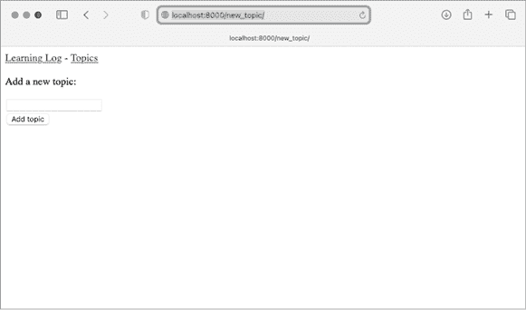
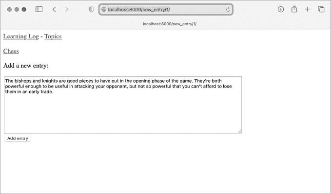
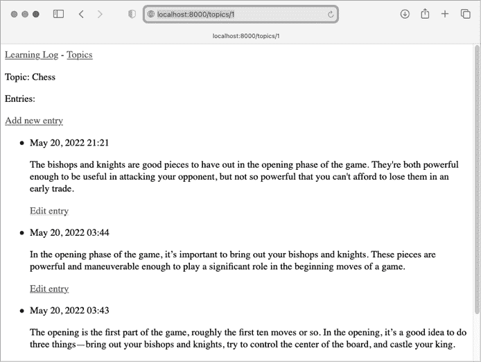
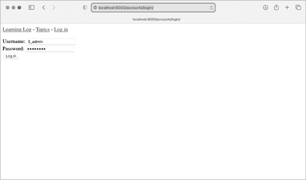

# 第十九章：用户账户


Web 应用程序的核心是让全球任何用户都能够在你的应用中注册账户并开始使用。在本章中，你将构建表单，让用户能够添加自己的主题和条目，并编辑现有条目。你还将学习 Django 如何防范常见的基于表单的页面攻击，这样你就不必花太多时间考虑如何确保应用的安全。

你还将实现一个用户身份验证系统。你将构建一个注册页面，让用户创建账户，然后将某些页面的访问权限限制为仅登录用户可见。接着，你将修改一些视图函数，让用户只能看到自己的数据。你将学习如何保持用户数据的安全性。

## 允许用户输入数据

在我们构建用于创建账户的身份验证系统之前，我们将首先添加一些允许用户输入自己数据的页面。我们将赋予用户添加新主题、添加新条目以及编辑其先前条目的能力。

目前，只有超级用户才能通过管理站点输入数据。我们不希望用户与管理站点进行交互，因此我们将使用 Django 的表单构建工具来构建允许用户输入数据的页面。

### 添加新主题

首先，让我们允许用户添加一个新主题。添加基于表单的页面与添加我们已经构建的页面方式类似：我们定义一个 URL，编写视图函数，然后编写模板。唯一显著的区别是增加了一个名为*forms.py*的新模块，它将包含表单。

#### 主题 `ModelForm`

任何让用户输入并提交信息的网页都涉及一个 HTML 元素，称为*表单*。当用户输入信息时，我们需要*验证*所提供的信息是否是正确的数据类型，且不包含恶意内容，例如设计用来干扰服务器的代码。然后，我们需要处理并将有效的信息保存到数据库的适当位置。Django 自动化了这项工作。

在 Django 中构建表单的最简单方法是使用 `ModelForm`，它利用我们在第十八章中定义的模型信息自动构建表单。在 *forms.py* 文件中编写你的第一个表单，该文件应与 *models.py* 位于同一目录：

**forms.py**

```py
from django import forms

from .models import Topic

❶ class TopicForm(forms.ModelForm):
    class Meta:
❷         model = Topic
❸         fields = ['text']
❹         labels = {'text': ''}
```

我们首先导入 `forms` 模块和我们将要使用的模型 `Topic`。然后，我们定义一个名为 `TopicForm` 的类，它继承自 `forms.ModelForm` ❶。

`ModelForm` 的最简单版本由一个嵌套的 `Meta` 类构成，该类告诉 Django 基于哪个模型构建表单，并指定应包含哪些字段。这里，我们指定表单应基于 `Topic` 模型 ❷，并且只包含 `text` 字段 ❸。标签字典中的空字符串告诉 Django 不为 `text` 字段生成标签 ❹。

#### 新主题的 URL

新页面的 URL 应该简短且富有描述性。当用户想要添加新主题时，我们将引导他们访问 *http://localhost:8000/new_topic/*。这是 `new_topic` 页面的网址模式；将其添加到 *learning_logs/urls.py* 中：

**learning_logs/urls.py**

```py
*--snip--*
urlpatterns = [
  *--snip--*
  # Page for adding a new topic.
    path('new_topic/', views.new_topic, name='new_topic'),
]
```

这个 URL 模式会将请求发送到视图函数 `new_topic()`，我们将在接下来编写它。

#### `new_topic()` 视图函数

`new_topic()` 函数需要处理两种不同的情况：初次请求 `new_topic` 页面时，应该显示一个空白表单；以及处理任何在表单中提交的数据。在表单数据处理完后，需要将用户重定向回 `topics` 页面：

**views.py**

```py
from django.shortcuts import render, redirect

from .models import Topic
from .forms import TopicForm

*--snip--*
def new_topic(request):
    """Add a new topic."""
❶     if request.method != 'POST':
        # No data submitted; create a blank form.
❷         form = TopicForm()
    else:
        # POST data submitted; process data.
❸         form = TopicForm(data=request.POST)
❹         if form.is_valid():
❺             form.save()
❻             return redirect('learning_logs:topics')

    # Display a blank or invalid form.
❼     context = {'form': form}
    return render(request, 'learning_logs/new_topic.xhtml', context)
```

我们导入了 `redirect` 函数，用于在用户提交主题后将他们重定向回 `topics` 页面。我们还导入了刚刚写的表单 `TopicForm`。

#### GET 和 POST 请求

构建应用时，您将使用的两种主要请求类型是 GET 和 POST。您使用 *GET* 请求来访问只从服务器读取数据的页面。通常，在用户需要通过表单提交信息时，您会使用 *POST* 请求。我们将为处理所有表单指定 POST 方法。（虽然存在一些其他类型的请求，但在这个项目中我们不会使用它们。）

`new_topic()` 函数接收 `request` 对象作为参数。当用户最初请求这个页面时，他们的浏览器会发送一个 GET 请求。当用户填写并提交表单后，他们的浏览器会发送一个 POST 请求。根据请求，我们可以判断用户是请求一个空白表单（GET）还是要求我们处理已填写的表单（POST）。

我们使用 `if` 语句来判断请求方法是 GET 还是 POST ❶。如果请求方法不是 POST，那么请求可能是 GET，因此我们需要返回一个空白表单。（如果是其他类型的请求，返回空白表单也是安全的。）我们创建一个 `TopicForm` 的实例 ❷，将其赋值给变量 `form`，并通过 `context` 字典将表单传递给模板 ❼。因为在实例化 `TopicForm` 时没有传递任何参数，Django 会创建一个空白表单，用户可以填写。

如果请求方法是 POST，`else` 块将运行并处理表单中提交的数据。我们创建一个 `TopicForm` 的实例 ❸，并将用户输入的数据传递给它，这些数据存储在 `request.POST` 中。返回的 `form` 对象包含用户提交的信息。

我们不能在数据库中保存提交的信息，直到我们检查它是否有效 ❹。`is_valid()` 方法检查所有必填字段是否已填写（表单中的所有字段默认都是必填的），并且检查输入的数据是否符合预期的字段类型——例如，`text` 的长度是否小于 200 个字符，如我们在第十八章的 *models.py* 中指定的那样。这个自动验证为我们节省了很多工作。如果一切有效，我们可以调用 `save()` ❺，它将表单中的数据写入数据库。

一旦我们保存了数据，就可以离开这个页面。`redirect()` 函数接受一个视图的名称，并将用户重定向到与该视图关联的页面。在这里，我们使用 `redirect()` 将用户的浏览器重定向到 `topics` 页面 ❻，在该页面上用户应该能看到他们刚刚输入的话题。

`context` 变量在视图函数的末尾定义，页面是使用模板 *new_topic.xhtml* 渲染的，我们接下来会创建这个模板。这段代码放在任何 `if` 块之外；无论是创建了一个空白表单，还是提交的表单被判断为无效时，这段代码都会运行。无效表单会包含一些默认的错误信息，帮助用户提交有效的数据。

#### new_topic 模板

现在我们将创建一个新模板 *new_topic.xhtml*，以展示我们刚刚创建的表单：

**new_topic.xhtml**

```py



  <p>Add a new topic:</p>

❶   <form action="" method='post'>
❷     
❸     {{ form.as_div }}
❹     <button name="submit">Add topic</button>
  </form>


```

这个模板继承了*base.xhtml*，因此它与学习日志中其他页面具有相同的基本结构。我们使用 `<form></form>` 标签来定义一个 HTML 表单 ❶。`action` 参数告诉浏览器将表单提交的数据发送到哪里；在这种情况下，我们将数据发送回视图函数 `new_topic()`。`method` 参数告诉浏览器将数据作为 POST 请求提交。

Django 使用模板标签 `` ❷ 来防止攻击者利用表单获取未经授权的服务器访问权限。（这种攻击被称为 *跨站请求伪造*。）接下来，我们展示表单；在这里你可以看到 Django 如何简化某些任务，例如显示表单。我们只需包含模板变量 `{{ form.as_div }}`，Django 就会自动创建所有必要的字段来展示表单 ❸。`as_div` 修饰符告诉 Django 将所有表单元素渲染为 HTML `<div></div>` 元素；这是一种简单而整洁的方式来显示表单。

Django 并不会为表单创建提交按钮，因此我们在关闭表单之前定义一个按钮 ❹。

#### 链接到新话题页面

接下来，我们在 `topics` 页面中包含一个指向 `new_topic` 页面链接：

**topics.xhtml**

```py




 <p>Topics</p>

 <ul>
  *--snip--*
 </ul>

  <a href="">Add a new topic</a>


```

将链接放置在现有话题列表后面。图 19-1 显示了最终的表单；尝试使用表单添加一些你自己的新话题。



图 19-1：添加新话题的页面

### 添加新条目

现在用户可以添加新主题了，他们也希望添加新的条目。我们将再次定义一个 URL，编写视图函数和模板，并链接到页面。但首先，我们将向 *forms.py* 添加另一个类。

#### Entry ModelForm

我们需要创建一个与 `Entry` 模型关联的表单，但这一次，我们需要比 `TopicForm` 更多的自定义：

**forms.py**

```py
from django import forms

from .models import Topic, Entry

class TopicForm(forms.ModelForm):
  *--snip--*

class EntryForm(forms.ModelForm):
    class Meta:
        model = Entry
        fields = ['text']
❶         labels = {'text': ''}
❷         widgets = {'text': forms.Textarea(attrs={'cols': 80})}
```

我们更新了 `import` 语句，包含了 `Entry` 和 `Topic`。我们创建了一个新的类 `EntryForm`，它继承自 `forms.ModelForm`。`EntryForm` 类有一个嵌套的 `Meta` 类，列出了它所基于的模型以及表单中要包含的字段。我们再次为字段 `'text'` 设置一个空的标签 ❶。

对于 `EntryForm`，我们包括了 `widgets` 属性 ❷。一个 *widget* 是一个 HTML 表单元素，如单行文本框、多行文本区域或下拉列表。通过包含 `widgets` 属性，你可以覆盖 Django 默认的 widget 选择。在这里，我们告诉 Django 使用一个 `forms.Textarea` 元素，宽度为 80 列，而不是默认的 40 列。这为用户提供了足够的空间来写下有意义的条目。

#### new_entry URL

新条目必须与特定主题关联，因此我们需要在添加新条目的 URL 中包含 `topic_id` 参数。以下是你需要添加到 *learning_logs/urls.py* 的 URL：

**learning_logs/urls.py**

```py
*--snip--*
urlpatterns = [
  *--snip--*
    # Page for adding a new entry.
    path('new_entry/<int:topic_id>/', views.new_entry, name='new_entry'),
]
```

这个 URL 模式匹配任何形如 *http://localhost:8000/new_entry/id/* 的 URL，其中 `id` 是与主题 ID 匹配的数字。代码 `<int:topic_id>` 捕获一个数字值并将其赋值给变量 `topic_id`。当请求匹配这个模式的 URL 时，Django 会将请求和主题的 ID 发送到 `new_entry()` 视图函数。

#### new_entry() 视图函数

`new_entry` 的视图函数与添加新主题的函数非常相似。将以下代码添加到你的 *views.py* 文件中：

**views.py**

```py
from django.shortcuts import render, redirect

from .models import Topic
from .forms import TopicForm, EntryForm

*--snip--*
def new_entry(request, topic_id):
    """Add a new entry for a particular topic."""
❶     topic = Topic.objects.get(id=topic_id)

❷     if request.method != 'POST':
        # No data submitted; create a blank form.
❸         form = EntryForm()
    else:
        # POST data submitted; process data.
❹         form = EntryForm(data=request.POST)
        if form.is_valid():
❺             new_entry = form.save(commit=False)
❻             new_entry.topic = topic
            new_entry.save()
❼             return redirect('learning_logs:topic', topic_id=topic_id)

    # Display a blank or invalid form.
    context = {'topic': topic, 'form': form}
    return render(request, 'learning_logs/new_entry.xhtml', context)
```

我们更新了 `import` 语句，包含了我们刚刚创建的 `EntryForm`。`new_entry()` 的定义有一个 `topic_id` 参数，用于存储它从 URL 中接收到的值。我们需要主题来渲染页面并处理表单数据，因此我们使用 `topic_id` 来获取正确的主题对象 ❶。

接下来，我们检查请求方法是 POST 还是 GET ❷。如果是 GET 请求，`if` 块将会执行，我们创建一个空的 `EntryForm` 实例 ❸。

如果请求方法是 POST，我们通过实例化 `EntryForm` 并用 `request` 对象中的 POST 数据填充它来处理数据❹。然后我们检查表单是否有效。如果有效，我们需要在保存条目到数据库之前设置条目对象的 `topic` 属性。当我们调用 `save()` 时，包含 `commit=False` 参数❺，告诉 Django 创建一个新的条目对象并将其分配给 `new_entry`，但暂时不保存到数据库。我们将 `new_entry` 的 `topic` 属性设置为函数开始时从数据库中获取的主题❻。然后我们再次调用 `save()`，不带参数，将条目与正确关联的主题一起保存到数据库。

`redirect()` 调用需要两个参数：我们希望重定向的视图名称和该视图函数所需的参数❼。在这里，我们将重定向到 `topic()`，它需要 `topic_id` 参数。这个视图随后会渲染用户创建条目的主题页面，用户应该能在条目列表中看到他们的新条目。

在函数的末尾，我们创建一个 `context` 字典，并使用 *new_entry.xhtml* 模板渲染页面。此代码会在空白表单或提交后发现无效的表单时执行。

#### `new_entry` 模板

正如以下代码所示，`new_entry` 的模板类似于 `new_topic` 的模板：

**new_entry.xhtml**

```py




❶   <p><a href="">{{ topic }}</a></p>

  <p>Add a new entry:</p>
❷   <form action="" method='post'>
    
    {{ form.as_div }}
    <button name='submit'>Add entry</button>
  </form>


```

我们在页面顶部显示主题❶，以便用户可以看到他们正在为哪个主题添加条目。该主题还充当返回该主题主页面的链接。

表单的 `action` 参数在 URL 中包含了 `topic.id` 的值，以便视图函数能够将新条目与正确的主题关联❷。除此之外，这个模板与 *new_topic.xhtml* 看起来几乎相同。

#### 链接到 `new_entry` 页面

接下来，我们需要在每个主题页面的主题模板中包括一个指向 `new_entry` 页面的链接：

**topic.xhtml**

```py




 <p>Topic: {{ topic }}</p>

 <p>Entries:</p>
  <p>
    <a href="">Add new entry</a>
  </p>

 <ul>
  *--snip--*
 </ul>


```

我们将添加条目的链接放在显示条目之前，因为添加新条目将是此页面上最常见的操作。图 19-2 显示了 `new_entry` 页面。现在，用户可以为每个主题添加新的条目，且每个主题可以添加任意数量的条目。通过向你创建的一些主题添加条目，尝试一下 `new_entry` 页面。



图 19-2：`new_entry` 页面

### 编辑条目

现在我们将创建一个页面，用户可以在其中编辑他们添加的条目。

#### edit_entry URL

页面 URL 需要传递要编辑的条目的 ID。这里是 *learning_logs/urls.py*：

**urls.py**

```py
*--snip--*
urlpatterns = [
  *--snip--*
    # Page for editing an entry.
    path('edit_entry/<int:entry_id>/', views.edit_entry, name='edit_entry'),
]
```

这个 URL 模式匹配像 *http://localhost:8000/edit_entry/id/* 这样的 URL。在这里，`id` 的值被分配给 `entry_id` 参数。Django 会将与此格式匹配的请求发送到视图函数 `edit_entry()`。

#### edit_entry() 视图函数

当`edit_entry`页面收到 GET 请求时，`edit_entry()`函数将返回一个用于编辑条目的表单。当页面收到包含修改后条目文本的 POST 请求时，它会将修改后的文本保存到数据库中：

**views.py**

```py
from django.shortcuts import render, redirect

from .models import Topic, Entry
from .forms import TopicForm, EntryForm
*--snip--*

def edit_entry(request, entry_id):
    """Edit an existing entry."""
❶     entry = Entry.objects.get(id=entry_id)
    topic = entry.topic

    if request.method != 'POST':
        # Initial request; pre-fill form with the current entry.
❷         form = EntryForm(instance=entry)
    else:
        # POST data submitted; process data.
❸         form = EntryForm(instance=entry, data=request.POST)
        if form.is_valid():
❹             form.save()
❺             return redirect('learning_logs:topic', topic_id=topic.id)

    context = {'entry': entry, 'topic': topic, 'form': form}
    return render(request, 'learning_logs/edit_entry.xhtml', context)
```

我们首先导入`Entry`模型。然后我们获取用户想要编辑的条目对象❶，以及与该条目相关联的主题。在`if`块中，这部分代码会在 GET 请求时执行，我们用`instance=entry`参数实例化`EntryForm`❷。该参数告诉 Django 创建表单，并预填充来自现有条目对象的信息。用户将看到他们现有的数据，并可以编辑这些数据。

在处理 POST 请求时，我们传递`instance=entry`和`data=request.POST`参数❸。这些参数告诉 Django 根据与现有条目对象关联的信息创建一个表单实例，并用`request.POST`中的相关数据更新它。然后，我们检查表单是否有效；如果有效，我们调用`save()`方法且不传递任何参数，因为条目已经与正确的主题关联❹。接着，我们重定向到`topic`页面，用户应该能看到他们编辑过的条目的更新版本❺。

如果我们展示的是用于编辑条目的初始表单，或者提交的表单无效，我们将创建`context`字典，并使用*edit_entry.xhtml*模板来渲染页面。

#### edit_entry 模板

接下来，我们创建一个*edit_entry.xhtml*模板，它类似于*new_entry.xhtml*：

**edit_entry.xhtml**

```py




  <p><a href="">{{ topic }}</a></p>

  <p>Edit entry:</p>

❶   <form action="" method='post'>
    
    {{ form.as_div }}
❷     <button name="submit">Save changes</button>
  </form>


```

`action`参数将表单发送回`edit_entry()`函数进行处理❶。我们在``标签中包含`entry.id`作为参数，以便视图函数可以修改正确的条目对象。我们将提交按钮标记为`Save changes`，提醒用户他们正在保存编辑内容，而不是创建新条目❷。

#### 链接到 edit_entry 页面

现在我们需要为每个条目在主题页面上添加指向`edit_entry`页面的链接：

**topic.xhtml**

```py
*--snip--*
 
 <li>
 <p>{{ entry.date_added|date:'M d, Y H:i' }}</p>
 <p>{{ entry.text|linebreaks }}</p>
  <p>
          <a href="">
           Edit entry</a></p>
 </li>
*--snip--*
```

我们在每个条目的日期和文本展示后，添加编辑链接。我们使用``模板标签来确定`edit_entry`的命名 URL 模式的 URL，并结合当前条目在循环中的 ID 属性（`entry.id`）。链接文本`Edit entry`将出现在页面上每个条目之后。图 19-3 展示了带有这些链接的主题页面样式。



图 19-3：每个条目现在都有一个编辑该条目的链接。

Learning Log 现在已经具备了大部分所需功能。用户可以添加主题和条目，并且可以浏览他们想要的任何一组条目。在下一节中，我们将实现一个用户注册系统，以便任何人都可以在 Learning Log 上注册账户并创建自己的主题和条目。

## 设置用户账户

在本节中，我们将设置一个用户注册和授权系统，以便用户可以注册帐户、登录和登出。我们将创建一个新应用来包含与用户相关的所有功能。我们将尽可能使用 Django 提供的默认用户认证系统来完成大部分工作。同时，我们还会稍微修改 `Topic` 模型，使每个主题都属于某个用户。

### 账户应用

我们将通过使用 `startapp` 命令创建一个名为 `accounts` 的新应用：

```py
(ll_env)learning_log$ **python manage.py startapp accounts**
(ll_env)learning_log$ **ls**
❶ accounts db.sqlite3 learning_logs ll_env ll_project manage.py
(ll_env)learning_log$ **ls accounts**
❷ __init__.py admin.py apps.py migrations models.py tests.py views.py
```

默认的认证系统是围绕用户帐户的概念构建的，因此使用 `accounts` 这个名称使得与默认系统的集成更加容易。这里显示的 `startapp` 命令会创建一个名为 *accounts* ❶ 的新目录，其结构与 `learning_logs` 应用 ❷ 完全相同。

#### 将账户添加到 settings.py

我们需要将新应用添加到 *settings.py* 的 `INSTALLED_APPS` 中，如下所示：

**settings.py**

```py
*--snip--*
INSTALLED_APPS = [
 # My apps
 'learning_logs',
    'accounts',

 # Default django apps.
  *--snip--*
]
*--snip--*
```

现在，Django 会将 `accounts` 应用包含到整个项目中。

#### 包含来自 accounts 的 URL

接下来，我们需要修改根目录下的 *urls.py*，以便它包含我们为 `accounts` 应用编写的 URL：

**ll_project/urls.py**

```py
from django.contrib import admin
from django.urls import path, include

urlpatterns = [
 path('admin/', admin.site.urls),
    path('accounts/', include('accounts.urls')),
 path('', include('learning_logs.urls')),
]
```

我们添加一行代码以包含来自 `accounts` 的 *urls.py* 文件。这一行代码将匹配任何以 *accounts* 开头的 URL，如 *http://localhost:8000/accounts/login/*。

### 登录页面

我们将首先实现一个登录页面。我们将使用 Django 提供的默认 `login` 视图，因此该应用的 URL 模式看起来稍微不同。在 *ll_project/accounts/* 目录下创建一个新的 *urls.py* 文件，并向其中添加以下内容：

**accounts/urls.py**

```py
"""Defines URL patterns for accounts."""

from django.urls import path, include

app_name = 'accounts'
urlpatterns = [
    # Include default auth urls.
    path('', include('django.contrib.auth.urls')),
]
```

我们导入 `path` 函数，然后导入 `include` 函数，这样我们可以包含一些 Django 已定义的默认认证 URL。这些默认的 URL 包括命名的 URL 模式，如 `'login'` 和 `'logout'`。我们将变量 `app_name` 设置为 `'accounts'`，以便 Django 可以区分这些 URL 和属于其他应用的 URL。即使是 Django 提供的默认 URL，当包含在 `accounts` 应用的 *urls.py* 文件中时，也将通过 `accounts` 命名空间进行访问。

登录页面的模式匹配网址 *http://localhost:8000/accounts/login/*。当 Django 读取这个 URL 时，*accounts* 会告诉 Django 去查看 *accounts/urls.py*，而 *login* 则会告诉它将请求发送到 Django 默认的 `login` 视图。

#### 登录模板

当用户请求登录页面时，Django 会使用默认的视图函数，但我们仍然需要为该页面提供一个模板。默认的认证视图会在一个名为 *registration* 的文件夹中查找模板，因此我们需要创建这个文件夹。在 *ll_project/accounts/* 目录下，创建一个名为 *templates* 的目录；在其中，再创建一个名为 *registration* 的目录。以下是 *login.xhtml* 模板，应该保存在 *ll_project/accounts/templates/registration* 中：

**login.xhtml**

```py




❶   
    <p>Your username and password didn't match. Please try again.</p>
  

❷   <form action="" method='post'>
    
❸     {{ form.as_div }}

❹     <button name="submit">Log in</button>
  </form>


```

这个模板继承自 *base.xhtml*，确保登录页面与网站的其他部分保持相同的外观和感觉。请注意，一个应用中的模板可以继承自另一个应用中的模板。

如果表单的 `errors` 属性已设置，我们会显示一条错误信息 ❶，报告用户名和密码组合与数据库中存储的内容不匹配。

我们希望登录视图处理表单，因此我们将 `action` 参数设置为登录页面的 URL ❷。登录视图会将一个 `form` 对象传递给模板，接下来由我们来显示表单 ❸ 并添加提交按钮 ❹。

#### LOGIN_REDIRECT_URL 设置

一旦用户成功登录，Django 需要知道将该用户重定向到哪里。我们在设置文件中控制这一点。

将以下代码添加到 *settings.py* 的末尾：

**settings.py**

```py
*--snip--*
# My settings.
LOGIN_REDIRECT_URL = 'learning_logs:index'
```

使用 *settings.py* 中的所有默认设置时，标记出我们添加新设置的部分会很有帮助。我们要添加的第一个新设置是 `LOGIN_REDIRECT_URL`，它告诉 Django 在成功登录后应该重定向到哪个 URL。

#### 链接到登录页面

我们来将登录链接添加到 *base.xhtml* 中，以便它出现在每个页面上。我们不希望在用户已经登录时显示该链接，因此我们将它嵌套在 `` 标签内：

**base.xhtml**

```py
<p>
 <a href="">Learning Log</a> -
  <a href="">Topics</a> -
❶   
❷     Hello, {{ user.username }}.
  
❸     <a href="">Log in</a>
  
</p>


```

在 Django 的认证系统中，每个模板都有一个可用的 `user` 对象，该对象始终具有 `is_authenticated` 属性：当用户登录时，属性值为 `True`，否则为 `False`。这个属性可以让你为已认证用户和未认证用户显示不同的消息。

在这里，我们显示了当前已登录用户的问候信息 ❶。已认证的用户会有一个额外的 `username` 属性，我们利用这个属性来个性化问候并提醒用户他们已经登录 ❷。对于未认证的用户，我们会显示一个指向登录页面的链接 ❸。

#### 使用登录页面

我们已经设置好了用户账户，现在让我们登录看看页面是否正常工作。访问 *http://localhost:8000/admin/*。如果你仍然以管理员身份登录，可以在页眉中找到一个 **logout** 链接并点击它。

当你注销后，访问 *http://localhost:8000/accounts/login/*。你应该看到一个类似于 图 19-4 所示的登录页面。输入你之前设置的用户名和密码，应该会跳转回主页。主页的页眉应该会显示一个带有用户名的个性化问候。



图 19-4：登录页面

### 注销

现在我们需要提供一个方法，让用户可以注销。注销请求应该以 POST 请求的形式提交，因此我们将向 *base.xhtml* 添加一个小的注销表单。当用户点击注销按钮时，他们会看到一个确认已注销的页面。

#### 将登出表单添加到 base.xhtml

我们将注销表单添加到 *base.xhtml*，这样它在每个页面上都可用。我们将其包含在另一个 `if` 语句块中，这样只有已登录的用户才能看到它：

**base.xhtml**

```py
*--snip--*



❶   <hr />
❷   <form action="" method='post'>
    
    <button name='submit'>Log out</button>
  </form>

```

登出的默认 URL 模式是 `'accounts/logout/'`。但是，请求必须作为 POST 请求发送；否则，攻击者可以轻易发起强制注销请求。为了让注销请求使用 POST 方法，我们定义了一个简单的表单。

我们将表单放在页面底部，位于水平线元素 (`<hr />`) ❶ 下面。这是一种简单的方式，确保注销按钮始终处于页面中任何其他内容下方的统一位置。表单本身的 `action` 参数是注销 URL，`'post'` 是请求方法 ❷。Django 中的每个表单都需要包含 ``，即使是像这样的简单表单。这个表单除了提交按钮外是空的。

#### `LOGOUT_REDIRECT_URL` 设置

当用户点击注销按钮时，Django 需要知道将用户发送到哪里。我们在 *settings.py* 中控制这一行为：

**settings.py**

```py
*--snip--*
# My settings.
LOGIN_REDIRECT_URL = 'learning_logs:index'
LOGOUT_REDIRECT_URL = 'learning_logs:index'
```

`LOGOUT_REDIRECT_URL` 设置指示 Django 在用户注销后将其重定向到主页。这是确认用户已注销的简单方法，因为注销后他们不应再看到自己的用户名。

### 注册页面

接下来，我们将构建一个页面，让新用户可以注册。我们将使用 Django 的默认 `UserCreationForm`，但会编写我们自己的视图函数和模板。

#### 注册 URL

以下代码提供了注册页面的 URL 模式，应当放在 *accounts/urls.py* 中：

**accounts/urls.py**

```py
"""Defines URL patterns for accounts."""

from django.urls import path, include

from . import views

app_name = accounts
urlpatterns = [
 # Include default auth urls.
 path('', include('django.contrib.auth.urls')),
    # Registration page.
    path('register/', views.register, name='register'),
]
```

我们从 `accounts` 导入 `views` 模块，这是因为我们正在为注册页面编写自己的视图。注册页面的 URL 模式对应于 *http://localhost:8000/accounts/register/* 并将请求发送到我们即将编写的 `register()` 函数。

#### `register()` 视图函数

`register()` 视图函数需要在首次请求注册页面时显示一个空白的注册表单，然后在表单提交后处理已完成的注册表单。当注册成功时，该函数还需要将新用户登录。将以下代码添加到 *accounts/views.py* 中：

**accounts/views.py**

```py
from django.shortcuts import render, redirect
from django.contrib.auth import login
from django.contrib.auth.forms import UserCreationForm

def register(request):
    """Register a new user."""
    if request.method != 'POST':
        # Display blank registration form.
❶         form = UserCreationForm()
    else:
        # Process completed form.
❷         form = UserCreationForm(data=request.POST)

❸         if form.is_valid():
❹             new_user = form.save()
            # Log the user in and then redirect to home page.
❺             login(request, new_user)
❻             return redirect('learning_logs:index')

    # Display a blank or invalid form.
    context = {'form': form}
    return render(request, 'registration/register.xhtml', context)
```

我们导入 `render()` 和 `redirect()` 函数，然后导入 `login()` 函数，以便在用户的注册信息正确时将其登录。我们还导入了默认的 `UserCreationForm`。在 `register()` 函数中，我们检查是否是对 POST 请求做出响应。如果不是，我们就用没有初始数据的 `UserCreationForm` 实例化 ❶。

如果我们对 POST 请求做出响应，我们就基于提交的数据实例化 `UserCreationForm` ❷。然后我们检查数据是否有效 ❸——在这种情况下，检查用户名是否符合要求，密码是否匹配，并且用户没有在提交中尝试恶意操作。

如果提交的数据有效，我们调用表单的`save()`方法，将用户名和密码的哈希值保存到数据库中❹。`save()`方法返回新创建的用户对象，我们将其赋值给`new_user`。当用户信息保存后，我们通过调用`login()`函数并传入`request`和`new_user`对象❺来登录用户，这会为新用户创建一个有效的会话。最后，我们将用户重定向到主页❻，在页眉中显示个性化的问候，告诉他们注册成功。

在函数的末尾，我们渲染页面，该页面可能是一个空白表单，或者是一个提交但无效的表单。

#### 注册模板

现在创建一个注册页面的模板，它将类似于登录页面。请确保将其保存在与*login.xhtml*相同的目录中：

**register.xhtml**

```py




  <form action="" method='post'>
    
    {{ form.as_div }}

    <button name="submit">Register</button>
  </form>


```

这应该与我们一直在编写的其他基于表单的模板类似。我们再次使用`as_div`方法，这样 Django 会适当地显示表单中的所有字段，包括如果表单填写不正确时的错误信息。

#### 链接到注册页面

接下来，我们将添加代码，向任何未登录的用户显示注册页面链接：

**base.xhtml**

```py
*--snip--*
 
 Hello, {{ user.username }}.
 
  <a href="">Register</a> -
 <a href="">Log in</a>
 
*--snip--*
```

现在，已登录的用户会看到个性化的问候语和登出按钮。未登录的用户则会看到注册链接和登录链接。通过创建多个不同用户名的用户账户来试用注册页面。

在下一部分，我们将限制一些页面的访问，使其仅对注册用户可用，并确保每个主题都属于特定的用户。

## 允许用户拥有自己的数据

用户应该能够在他们的学习日志中输入私人数据，因此我们将创建一个系统来识别哪些数据属于哪个用户。然后，我们将限制某些页面的访问，确保用户只能操作自己的数据。

我们将修改`Topic`模型，使每个主题都属于一个特定用户。这也将处理条目，因为每个条目都属于特定的主题。我们将从限制某些页面的访问开始。

### 使用@login_required 限制访问

Django 使得通过`@login_required`装饰器限制某些页面的访问变得非常容易。回想一下第十一章中的内容，*装饰器*是一个放置在函数定义之前的指令，它修改函数的行为。我们来看一个示例。

#### 限制访问主题页面

每个主题将由一个用户拥有，因此只有注册用户才能请求访问该主题页面。请将以下代码添加到*learning_logs/views.py*中：

**learning_logs/views.py**

```py
from django.shortcuts import render, redirect
from django.contrib.auth.decorators import login_required

from .models import Topic, Entry
*--snip--*

@login_required
def topics(request):
 """Show all topics."""
  *--snip--*
```

我们首先导入`login_required()`函数。我们通过在`topics()`视图函数前加上`@`符号来将`login_required()`作为装饰器应用到`topics()`视图函数。因此，Python 会在运行`topics()`中的代码之前先运行`login_required()`中的代码。

`login_required()`中的代码检查用户是否已登录，只有在用户登录后，Django 才会执行`topics()`中的代码。如果用户未登录，他们将被重定向到登录页面。

为了使这个重定向生效，我们需要修改*settings.py*，以便 Django 知道在哪里找到登录页面。在*settings.py*的末尾添加以下内容：

**settings.py**

```py
*--snip--*
# My settings.
LOGIN_REDIRECT_URL = 'learning_logs:index'
LOGOUT_REDIRECT_URL = 'learning_logs:index'
LOGIN_URL = 'accounts:login'
```

现在，当未经过身份验证的用户请求受`@login_required`装饰器保护的页面时，Django 将把用户发送到*settings.py*中定义的`LOGIN_URL` URL。

你可以通过注销任何用户帐户并访问主页来测试此设置。点击**Topics**链接，这应该会将你重定向到登录页面。然后登录到任何一个账户，再次从主页点击**Topics**链接。你应该能够访问主题页面。

#### 限制在学习日志中的访问

Django 使得限制页面访问变得简单，但你需要决定哪些页面需要保护。最好先考虑哪些页面需要公开访问，然后限制项目中的所有其他页面。你可以轻松纠正过度限制的访问，这比让敏感页面没有限制更安全。

在 Learning Log 中，我们将保持主页和注册页面不受限制。我们将限制对其他页面的访问。

这是带有`@login_required`装饰器的*learning_logs/views.py*，除了`index()`之外，其他每个视图都应用了该装饰器：

**learning_logs/views.py**

```py
*--snip--*
@login_required
def topics(request):
  *--snip--*

@login_required
def topic(request, topic_id):
  *--snip--*

@login_required
def new_topic(request):
  *--snip--*

@login_required
def new_entry(request, topic_id):
  *--snip--*

@login_required
def edit_entry(request, entry_id):
  *--snip--*
```

尝试在登出状态下访问这些页面；你应该会被重定向回登录页面。你还无法点击像`new_topic`这样的页面链接。但如果你输入 URL *http://localhost:8000/new_topic/*，你会被重定向到登录页面。你应该限制任何与私人用户数据相关并且是公开访问的 URL。

### 将数据与特定用户关联

接下来，我们需要将数据与提交的用户关联。我们只需要将层次结构中最高级的数据与用户关联，低级数据会随之而来。在 Learning Log 中，主题是应用中最高级的数据，所有条目都与一个主题相关。只要每个主题属于一个特定的用户，我们就可以追溯到数据库中每个条目的所有者。

我们将通过向`Topic`模型添加一个外键关系来关联用户。接着，我们需要迁移数据库。最后，我们将修改一些视图，使它们只显示当前登录用户相关的数据。

#### 修改主题模型

对*models.py*的修改仅仅是两行代码：

**models.py**

```py
from django.db import models
from django.contrib.auth.models import User

class Topic(models.Model):
 """A topic the user is learning about."""
 Text = models.CharField(max_length=200)
 date_added = models.DateTimeField(auto_now_add=True)
    owner = models.ForeignKey(User, on_delete=models.CASCADE)

 def __str__(self):
 """Return a string representing the topic."""
 Return self.text

class Entry(models.Model):
  *--snip--*
```

我们从`django.contrib.auth`导入`User`模型。然后，我们在`Topic`中添加一个`owner`字段，这样就建立了与`User`模型的外键关系。如果用户被删除，所有与该用户相关的主题也将被删除。

#### 识别现有用户

当我们迁移数据库时，Django 将修改数据库，以便能够存储每个话题与用户之间的关联。为了进行迁移，Django 需要知道与每个现有话题关联的用户。最简单的方法是先将所有现有话题分配给一个用户——例如，超级用户。但首先，我们需要知道该用户的 ID。

让我们看看目前为止创建的所有用户的 ID。在 Django shell 会话中输入以下命令：

```py
(ll_env)learning_log$ **python manage.py shell**
❶ >>> **from django.contrib.auth.models import User**
❷ >>> **User.objects.all()**
<QuerySet [<User: ll_admin>, <User: eric>, <User: willie>]>
❸ >>> **for user in User.objects.all():**
...     **print(user.username, user.id)**
...
ll_admin 1
eric 2
willie 3
>>>
```

我们首先将`User`模型导入到 shell 会话中❶。然后查看到目前为止创建的所有用户❷。输出显示了我版本中的三个用户：`ll_admin`、`eric`和`willie`。

接下来，我们循环遍历用户列表，打印每个用户的用户名和 ID❸。当 Django 询问要将现有话题与哪个用户关联时，我们将使用这些 ID 值之一。

#### 迁移数据库

现在我们知道了用户的 ID，可以开始迁移数据库。当我们进行迁移时，Python 会要求我们暂时将`Topic`模型与某个特定的用户关联，或者在我们的*models.py*文件中添加默认值来告诉它该如何操作。选择选项**1**：

```py
❶ (ll_env)learning_log$ **python manage.py makemigrations learning_logs**
❷ It is impossible to add a non-nullable field 'owner' to topic without
specifying a default. This is because...
❸ Please select a fix:
 1) Provide a one-off default now (will be set on all existing rows with a
    null value for this column)
 2) Quit and manually define a default value in models.py.
❹ Select an option: **1**
❺ Please enter the default value now, as valid Python
The datetime and django.utils.timezone modules are available...
Type 'exit' to exit this prompt
❻ >>> **1**
Migrations for 'learning_logs':
  learning_logs/migrations/0003_topic_owner.py
- Add field owner to topic
(ll_env)learning_log$
```

我们首先执行`makemigrations`命令❶。在输出中，Django 表示我们正在尝试向现有模型(`topic`)中添加一个必需的（*非空*）字段，但未指定默认值❷。Django 提供了两个选项：我们可以立即提供默认值，或者可以退出并在*models.py*中添加默认值❸。在这里，我选择了第一个选项❹。然后，Django 会要求我们输入默认值❺。

为了将所有现有话题与原始管理员用户`ll_admin`关联，我输入了用户 ID `1` ❻。你可以使用任何你创建的用户的 ID，它不必是超级用户。Django 然后使用该值迁移数据库，并生成迁移文件*0003_topic_owner.py*，该文件将`owner`字段添加到`Topic`模型中。

现在我们可以执行迁移。在一个活动的虚拟环境中输入以下命令：

```py
(ll_env)learning_log$ **python manage.py migrate**
Operations to perform:
  Apply all migrations: admin, auth, contenttypes, learning_logs, sessions
Running migrations:
❶   Applying learning_logs.0003_topic_owner... OK
(ll_env)learning_log$
```

Django 应用新迁移，结果是`OK` ❶。

我们可以通过在 shell 会话中执行以下命令来验证迁移是否按预期工作：

```py
>>> **from learning_logs.models import Topic**
>>> **for topic in Topic.objects.all():**
...     **print(topic, topic.owner)**
...
Chess ll_admin
Rock Climbing ll_admin
>>>
```

我们从`learning_logs.models`导入`Topic`，然后循环遍历所有现有话题，打印每个话题以及它所属的用户。你可以看到每个话题现在都属于用户`ll_admin`。（如果运行这段代码时遇到错误，请尝试退出 shell 并重新启动一个新的 shell。）

### 限制话题访问权限到适当的用户

目前，如果你登录了系统，你将能够看到所有话题，无论你以哪个用户身份登录。我们将通过只显示属于该用户的话题来改变这一点。

在*views.py*中的`topics()`函数中进行以下更改：

**learning_logs/views.py**

```py
*--snip--*
@login_required
def topics(request):
 """Show all topics."""
    topics = Topic.objects.filter(owner=request.user).order_by('date_added')
 context = {'topics': topics}
 return render(request, 'learning_logs/topics.xhtml', context)
*--snip--*
```

当用户登录时，`request`对象会设置`request.user`属性，其中包含用户信息。查询`Topic.objects.filter(owner=request.user)`会告诉 Django 只检索数据库中`owner`属性与当前用户匹配的`Topic`对象。由于我们没有改变主题的显示方式，所以不需要更改主题页面的模板。

要检查这是否有效，首先以你已将所有现有主题关联的用户身份登录，然后访问主题页面。你应该能看到所有的主题。接下来注销，并以另一个用户身份重新登录。你应该看到消息“尚未添加任何主题”。

### 保护用户的主题

我们还没有限制访问主题页面，因此任何注册用户都可以尝试多个 URL（如*http://localhost:8000/topics/1/*），并检索到恰好匹配的主题页面。

亲自尝试一下。当以拥有所有主题的用户身份登录时，复制一个主题的 URL 或记下 URL 中的 ID，然后注销并以另一个用户身份重新登录。输入该主题的 URL。即使你以不同的用户身份登录，你仍然应该能够读取该条目。

我们现在通过在`topic()`视图函数中执行检查，来解决这个问题，在检索请求的条目之前进行检查：

**learning_logs/views.py**

```py
from django.shortcuts import render, redirect
from django.contrib.auth.decorators import login_required
❶ from django.http import Http404

*--snip--*
@login_required
def topic(request, topic_id):
 """Show a single topic and all its entries."""
 topic = Topic.objects.get(id=topic_id)
    # Make sure the topic belongs to the current user.
❷     if topic.owner != request.user:
        raise Http404

 entries = topic.entry_set.order_by('-date_added')
 context = {'topic': topic, 'entries': entries}
 return render(request, 'learning_logs/topic.xhtml', context)
*--snip--*
```

404 响应是标准的错误响应，当请求的资源在服务器上不存在时返回。在这里，我们导入了`Http404`异常❶，如果用户请求一个他们没有权限访问的主题，我们将抛出此异常。在接收到主题请求后，我们在渲染页面之前，确保主题的拥有者与当前登录的用户匹配。如果请求的主题的拥有者与当前用户不相同，我们会抛出`Http404`异常❷，然后 Django 返回一个 404 错误页面。

现在，如果你尝试查看其他用户的主题条目，你会看到 Django 的“页面未找到”消息。在第二十章，我们将配置项目，使用户看到一个合适的错误页面，而不是调试页面。

### 保护`edit_entry`页面

`edit_entry`页面的 URL 形式为*http://localhost:8000/edit_entry/entry_id/*，其中 `entry_id` 是一个数字。我们来保护这个页面，以便没有人能通过 URL 访问他人的条目：

**learning_logs/views.py**

```py
*--snip--*
@login_required
def edit_entry(request, entry_id):
 """Edit an existing entry."""
 entry = Entry.objects.get(id=entry_id)
 topic = entry.topic
    if topic.owner != request.user:
        raise Http404

    if request.method != 'POST':
  *--snip--*
```

我们检索与该条目关联的主题。然后我们检查该主题的拥有者是否与当前登录的用户匹配；如果不匹配，我们会抛出一个`Http404`异常。

### 将新主题与当前用户关联

当前，添加新主题的页面无法正常工作，因为它没有将新主题与任何特定用户关联。如果你尝试添加新主题，你会看到 `IntegrityError` 消息，伴随 `NOT NULL constraint failed: learning_logs_topic.owner_id`。Django 表示你无法创建一个新主题，除非为主题的 `owner` 字段指定一个值。

这个问题有一个直接的解决办法，因为我们可以通过`request`对象访问当前用户。添加以下代码，将新主题与当前用户关联起来：

**learning_logs/views.py**

```py
*--snip--*
@login_required
def new_topic(request):
  *--snip--*
 else:
 # POST data submitted; process data.
 form = TopicForm(data=request.POST)
 if form.is_valid():
❶             new_topic = form.save(commit=False)
❷             new_topic.owner = request.user
❸             new_topic.save()
 return redirect('learning_logs:topics')

 # Display a blank or invalid form.
 context = {'form': form}
 return render(request, 'learning_logs/new_topic.xhtml', context)
  *--snip--*
```

当我们第一次调用`form.save()`时，我们传递了`commit=False`参数，因为在将新主题保存到数据库之前，我们需要修改它 ❶。然后，我们将新主题的`owner`属性设置为当前用户 ❷。最后，我们在刚刚定义的主题实例上调用`save()` ❸。现在，主题拥有了所有必需的数据，并将成功保存。

你应该能够为不同的用户添加尽可能多的新主题，每个用户只能访问属于他们自己的数据，无论他们是在查看数据、输入新数据，还是修改旧数据。

## 小结

在本章中，你学会了如何使用表单让用户添加新主题和条目，并编辑现有条目。然后，你学会了如何实现用户账户。你让现有用户能够登录和退出，并使用 Django 的默认`UserCreationForm`来让人们创建新账户。

在构建一个简单的用户身份验证和注册系统之后，你使用`@login_required`装饰器限制了登录用户访问某些页面。然后，你通过外键关系将数据分配给特定的用户。你还学会了在迁移时，如何在迁移需要你指定某些默认数据时进行数据库迁移。

最后，你学会了通过修改视图函数来确保用户只能看到属于他们的数据。你使用`filter()`方法检索了适当的数据，并将请求数据的所有者与当前登录用户进行了比较。

可能并不总是显而易见你应该提供哪些数据，哪些数据需要保护，但这个技能会通过实践逐渐掌握。本章中我们为了保护用户数据所做的决策也说明了在构建项目时与他人合作的好处：让别人检查你的项目可以提高你发现漏洞的可能性。

你现在已经在本地机器上运行了一个功能完整的项目。在最后一章中，你将对 Learning Log 进行样式美化，使其更具视觉吸引力，并将项目部署到服务器上，这样任何有互联网访问的人都可以注册并创建账户。
