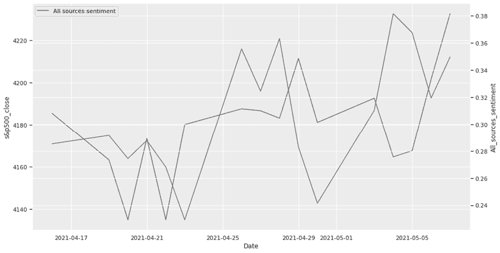

## 第一章：数据基础


*数据*对不同的人意味着不同的东西：股票交易员可能认为数据是实时股票报价，而 NASA 工程师可能会将数据与来自火星探测器的信号联系在一起。然而，在数据处理和分析中，无论数据的来源如何，相同或类似的方法和技术可以应用于各种数据集。重要的是数据是如何被结构化的。

本章提供了数据处理和分析的概念性介绍。我们首先将介绍你可能需要处理的主要数据类别，然后简单讨论常见的数据来源。接下来，我们将考虑典型数据处理管道中的步骤（即获取、准备和分析数据的实际过程）。最后，我们将探讨 Python 作为数据科学工具的独特优势。

## 数据类别

程序员将数据分为三大类：非结构化数据、结构化数据和半结构化数据。在数据处理管道中，源数据通常是非结构化的；从这些数据中，你可以形成结构化或半结构化的数据集以便进一步处理。然而，一些管道从一开始就使用结构化数据。例如，处理地理位置的应用程序可能会直接从 GPS 传感器接收结构化数据。以下章节将探讨三大数据类别以及时间序列数据，这是一种可以是结构化或半结构化的数据类型。

### 非结构化数据

非结构化数据是没有预定义组织系统或模式的数据。这是最广泛的数据显示形式，常见的例子包括图像、视频、音频和自然语言文本。举个例子，考虑一下来自制药公司的财务报表：

```py
GoodComp shares soared as much as 8.2% on 2021-01-07 after the company announced positive early-stage trial results for its vaccine.
```

这段文本被认为是非结构化数据，因为其中的信息并没有按照预定义的模式进行组织。相反，信息在报表中是随机分散的。你可以用许多不同的方式重写这份报表，同时传达相同的信息。例如：

```py
Following the January 7, 2021, release of positive results from its vaccine trial, which is still in its early stages, shares in GoodComp rose by 8.2%.
```

尽管缺乏结构，非结构化数据可能包含重要信息，你可以通过适当的转换和分析步骤将其提取并转化为结构化或半结构化数据。例如，图像识别工具首先将图像中的像素集合转换为预定义格式的数据集，然后分析这些数据以识别图像中的内容。类似地，接下来的部分将展示一些方法，通过这些方法，我们可以将从财务报表中提取的数据进行结构化。

### 结构化数据

结构化数据具有预定义的格式，指定了数据的组织方式。这类数据通常存储在像关系数据库这样的存储库中，或者只是存储在一个*.**csv*（逗号分隔值）文件中。输入到这样的存储库中的数据称为*记录*，其中的信息按必须与预期结构匹配的顺序组织在*字段*中。在数据库中，具有相同结构的记录被逻辑地分组在一个名为*表*的容器中。一个数据库可以包含多个表，每个表都有一组结构化字段。

结构化数据有两种基本类型：数值型和分类型。*分类数据*是指可以根据相似特征进行分类的数据；例如，汽车可能根据品牌和型号进行分类。*数值数据*则以数字形式表示信息，允许对其进行数学运算。

请记住，分类数据有时可以采用数值形式。例如，考虑邮政编码或电话号码。虽然它们用数字表示，但对它们进行数学运算没有意义，比如找出中位数邮政编码或平均电话号码。

我们如何将上一节中介绍的文本样本组织为结构化数据？我们关注的是文本中的特定信息，例如公司名称、日期和股票价格。我们希望将这些信息以以下格式的字段呈现，准备插入数据库：

```py
Company:   `ABC`
Date:      `yyyy-mm-dd`
Stock:     `nnnnn`
```

使用*自然语言处理*（*NLP*）技术，这一学科训练机器理解人类可读的文本，我们可以提取适合这些字段的信息。例如，我们通过识别一个只能是预设值之一的分类数据变量来查找公司名称，比如 Google、Apple 或 GoodComp。同样，我们可以通过将日期的显式顺序与一组显式的排序格式（如`yyyy-mm-dd`）进行匹配来识别日期。在我们的示例中，我们识别、提取并以预定义的格式呈现数据，如下所示：

```py
Company:   GoodComp
Date:      2021-01-07
Stock:     +8.2%
```

为了将此记录存储在数据库中，最好将其呈现为类似行的字段序列。因此，我们可能会将记录重新组织为矩形数据对象或二维矩阵：

```py
Company  | Date      | Stock
---------------------------
GoodComp |2021-01-07 | +8.2%
```

你选择从同一非结构化数据源中提取的信息取决于你的需求。我们的示例语句不仅包含了 GoodComp 公司某一日期的股票变化，还指出了变化的原因，即“公司宣布其疫苗的早期阶段试验结果积极”。从这个角度来看，你可能会创建一个包含以下字段的记录：

```py
Company:   GoodComp
Date:      2021-01-07
Product:   vaccine
Stage:     early-stage trial
```

将此与我们提取的第一个记录进行比较：

```py
Company:   GoodComp
Date:      2021-01-07
Stock:     +8.2%
```

请注意，这两个记录包含不同的字段，因此具有不同的结构。结果，它们必须存储在两个不同的数据库表中。

### 半结构化数据

在信息的结构标识与严格的格式要求不符的情况下，我们可能需要处理半结构化数据格式，它允许我们在同一个容器（数据库表或文档）中存储不同结构的记录。与非结构化数据一样，半结构化数据不依赖于预定义的组织模式；然而，与非结构化数据不同，半结构化数据的样本通常具有一定的结构，通常表现为自描述标签或其他标记。

最常见的半结构化数据格式包括 XML 和 JSON。这是我们的财务报表可能在 JSON 格式中的样子：

```py
{
  "Company": "GoodComp",
  "Date":    "2021-01-07",
  "Stock":   8.2,
  "Details": "the company announced positive early-stage trial results for its vaccine."
}
```

在这里，你可以识别我们之前从声明中提取的关键信息。每一条信息都配有一个描述性标签，如“`公司`”或“`日期`”。感谢这些标签，信息被组织得与前一部分中出现的方式相似，但现在我们有了一个第四个标签，“`详情`”，它与原始声明中的整个片段配对，该片段看起来没有结构。这个例子展示了半结构化数据格式如何在单个记录中容纳结构化和非结构化数据。

此外，你可以将多个不同结构的记录放入同一个容器中。在这里，我们将从示例财务报表中衍生的两条不同记录存储在同一个 JSON 文档中：

```py
[
  {
    "Company": "GoodComp",
    "Date":    "2021-01-07",
    "Stock":   8.2
  },
 {
    "Company": "GoodComp",
    "Date":    "2021-01-07",
    "Product": "vaccine",
    "Stage":   "early-stage trial"
  }
]
```

回想前一部分的讨论，关系型数据库作为一种严格结构化的数据存储库，不能在同一表中容纳具有不同结构的记录。

### 时间序列数据

时间序列是一组按时间顺序排列或列出的数据点。许多金融数据集作为时间序列存储，因为金融数据通常包含特定时间的观察结果。

时间序列数据可以是结构化的或半结构化的。想象一下，你从出租车的 GPS 跟踪设备中按定时间隔接收位置数据。数据可能以以下格式到达：

```py
[
  {
    "cab": "cab_238",
    "coord": (43.602508,39.715685),
    "tm": "14:47",
    "state": "available"
  },
  {
    "cab": "cab_238",
    "coord": (43.613744,39.705718),
    "tm": "14:48",
    "state": "available"
  }
  ...
]
```

每分钟会有一条新的数据记录，其中包含来自`cab_238`的最新位置坐标（纬度/经度）。每条记录的字段顺序相同，且每个字段在一条记录到下一条记录之间保持一致的结构，从而可以将这些时间序列数据存储在关系型数据库表中，作为常规结构化数据。

假设数据以不等时间间隔到达，这在实际中经常发生，并且你每分钟收到不止一组坐标。接收到的数据结构可能如下所示：

```py
[
  {
    "cab": "cab_238",
    "coord": [(43.602508,39.715685),(43.602402,39.709672)],
    "tm": "14:47",
    "state": "available"
 },
  {
    "cab": "cab_238",
    "coord": (43.613744,39.705718),
    "tm": "14:48",
    "state": "available"
  }
]
```

请注意，第一个`coord`字段包含两组坐标，因此与第二个`coord`字段不一致。这些数据是半结构化的。

## 数据来源

现在你知道了数据的主要类别，那么你可能从哪些来源获取这些数据呢？一般来说，数据可以来自很多不同的来源，包括文本、视频、图像和设备传感器等。从你将编写的 Python 脚本的角度来看，最常见的数据来源有：

+   应用程序编程接口（API）

+   网页

+   数据库

+   文件

这个列表并不是为了全面或限制性地列出所有选项；还有很多其他的数据来源。例如，在第九章，你将看到如何使用智能手机作为数据处理管道的 GPS 数据提供者，具体来说是通过使用一个机器人应用程序作为中介，连接智能手机和你的 Python 脚本。

从技术上讲，这里列出的所有选项都需要你使用相应的 Python 库。例如，在你能够从 API 获取数据之前，你需要安装该 API 的 Python 封装器，或者直接使用 Requests Python 库向 API 发起 HTTP 请求。同样，为了从数据库中访问数据，你需要在你的 Python 代码中安装一个连接器，以便能够访问特定类型的数据库。

虽然许多这些库需要下载和安装，但有些用于加载数据的库默认情况下与 Python 一起分发。例如，要从 JSON 文件中加载数据，你可以利用 Python 内置的 `json` 包。

在第四章和第五章中，我们将更详细地讨论数据源问题。特别是，你将学习如何将来自不同来源的特定数据加载到 Python 脚本中的数据结构中，以便进一步处理。现在，我们简要看看前面提到的每种常见数据源类型。

### API

也许今天获取数据最常见的方式是通过 API（一个软件中介，它使两个应用程序能够相互交互）。如前所述，要在 Python 中利用 API，你可能需要为该 API 安装一个 Python 库封装器。如今最常见的做法是通过 `pip` 命令。

并非所有 API 都有自己的 Python 封装器，但这并不意味着你不能通过 Python 向它们发起请求。如果一个 API 提供 HTTP 请求，你可以通过 Python 的 Requests 库与该 API 进行交互。这使你能够访问成千上万的 API，能够在你的 Python 代码中请求数据集以供进一步处理。

在为特定任务选择 API 时，你应该考虑以下几点：

1.  功能性 许多 API 提供类似的功能，因此你需要了解你的具体需求。例如，许多 API 允许你在 Python 脚本中进行网页搜索，但只有一些 API 允许你按发布时间来缩小搜索结果范围。

1.  成本 许多 API 允许你使用所谓的 *开发者密钥*，通常是免费的，但会有一些限制，例如每天调用次数的限制。

1.  稳定性得益于 Python 包索引（PyPI）仓库（[`pypi.org`](https://pypi.org)），任何人都可以将 API 打包成`pip`包并公开发布。因此，几乎所有你能想到的任务都有对应的 API（或多个 API），但并非所有 API 都完全可靠。幸运的是，PyPI 仓库会跟踪包的性能和使用情况。

1.  文档：流行的 API 通常有相应的文档网站，允许你查看所有 API 命令及其示例用法。作为一个好的示范，查看 Nasdaq Data Link（又名 Quandl）API 的文档页面（[`docs.data.nasdaq.com/docs/python-time-series`](https://docs.data.nasdaq.com/docs/python-time-series)），在这里你可以找到进行不同时间序列调用的示例。

许多 API 会以以下三种格式之一返回结果：JSON、XML 或 CSV。这些格式中的数据可以轻松转换为 Python 内置或常用的数据结构。例如，Yahoo Finance API 检索并分析股票数据，然后将信息转换为 pandas DataFrame，这是一种我们将在第三章讨论的广泛使用的数据结构。

### 网页

网页可以是静态的，也可以是根据用户的互动动态生成的，在这种情况下，它们可能包含来自多个不同来源的信息。无论是哪种情况，程序都可以读取网页并提取其中的部分内容。这种操作被称为*网页抓取*，只要页面是公开可用的，这种行为是合法的。

在 Python 中的典型抓取场景涉及两个库：Requests 和 BeautifulSoup。Requests 用于获取页面的源代码，然后 BeautifulSoup 为页面创建一个*解析树*，它是页面内容的层次化表示。你可以搜索解析树并使用 Pythonic 的习惯用法从中提取数据。例如，以下是解析树的一个片段：

```py
[<td title="03/01/2020 00:00:00"><a href="Download.aspx?ID=630751" id="lnkDownload630751" 
 target="_blank">03/01/2020</a></td>,
<td title="03/01/2020 00:00:00"><a href="Download.aspx?ID=630753" id="lnkDownload630753" 
 target="_blank">03/01/2020</a></td>,
<td title="03/01/2020 00:00:00"><a href="Download.aspx?ID=630755" id="lnkDownload630755" 
 target="_blank">03/01/2020</a></td>]
```

可以在 Python 脚本中的`for`循环中轻松转换为以下项目列表：

```py
[
  {'Document_Reference': '630751', 'Document_Date': '03/01/2020', 
   'link': 'http://www.dummy.com/Download.aspx?ID=630751'}
  {'Document_Reference': '630753', 'Document_Date': '03/01/2020', 
   'link': 'http://www.dummy.com/Download.aspx?ID=630753'}
  {'Document_Reference': '630755', 'Document_Date': '03/01/2020', 
   'link': 'http://www.dummy.com/Download.aspx?ID=630755'}
]
```

这是将半结构化数据转换为结构化数据的一个示例。

### 数据库

另一个常见的数据来源是关系型数据库，这是一种提供高效存储、访问和操作结构化数据机制的结构。你可以通过结构化查询语言（SQL）请求，从数据库中的表格中提取数据或将数据发送到表格中。例如，以下请求发往数据库中的`employees`表格，只会检索在 IT 部门工作的程序员列表，这样就无需提取整个表格：

```py
SELECT first_name, last_name FROM employees WHERE department = 'IT' and title = 'programmer'
```

Python 有一个内置的数据库引擎 SQLite。你也可以使用其他可用的数据库。在访问数据库之前，你需要在环境中安装数据库客户端软件。

除了传统的严格结构化数据库外，近年来对在类数据库容器中存储异构和非结构化数据的需求日益增长。这促使了所谓的 *NoSQL*（*非 SQL* 或 *不仅仅是 SQL*）数据库的兴起。NoSQL 数据库使用灵活的数据模型，允许你使用 *键值* 方法存储大量非结构化数据，其中每个数据项都可以通过关联的键进行访问。以下是我们早先示例的财务报表，如果存储在 NoSQL 数据库中，它可能看起来是这样的：

```py
key   value
---   -----
...   
26    GoodComp shares soared as much as 8.2% on 2021-01-07 after the company announced ...
```

整个语句与一个标识键 `26` 配对存储。将整个语句存储在数据库中似乎有些奇怪。然而，回想一下，从单个语句中可以提取多个记录。存储整个语句为我们提供了灵活性，可以在稍后提取不同的数据信息。

### 文件

文件可能包含结构化、半结构化和非结构化的数据。Python 内置的 `open()` 函数允许你打开文件并在脚本中使用其数据。然而，根据数据的格式（例如 CSV、JSON 或 XML），你可能需要导入相应的库才能执行读取、写入和/或追加操作。

普通文本文件不需要额外的库进行处理，只需在 Python 中将其视为一系列行即可。例如，查看下面一条可能由思科路由器发送到日志文件的消息：

```py
dat= 'Jul 19 10:30:37'
host='sm1-prt-highw157'
syslogtag='%SYS-1-CPURISINGTHRESHOLD:'
msg=' Threshold: Total CPU Utilization(Total/Intr): 17%/1%, 
           Top 3 processes(Pid/Util):  85/9%, 146/4%, 80/1%'
```

你可以逐行读取文件，查找所需的信息。因此，如果你的任务是找到包含 CPU 利用率信息的消息并提取其中的特定数字，你的脚本应该能够将该片段的最后一行识别为要选中的消息。在第二章中，你将看到如何使用文本处理技术从文本数据中提取特定信息的示例。

## 数据处理管道

在本节中，我们将从概念上了解数据处理的步骤，这也被称为数据处理管道。应用于数据的常见步骤包括：

1.  获取

1.  清洗

1.  转换

1.  分析

1.  存储

如你所见，这些步骤并不总是非常明确。在某些应用中，你可以将多个步骤合并为一个，或者完全省略某些步骤。

### 获取

在你对数据进行任何操作之前，你需要先获取数据。这就是为什么数据采集是任何数据处理管道中的第一步。在上一节中，你已经了解了最常见的数据源类型。部分数据源允许你根据需求仅加载所需的数据部分。

例如，向 Yahoo Finance API 发出的请求要求你指定公司的股票代码以及要检索该公司股票价格的时间段。类似地，新闻 API 允许你检索新闻文章，并可以处理多个参数以缩小请求的文章列表，包括来源和发布日期。然而，尽管有这些限定参数，检索到的文章列表仍可能需要进一步过滤。也就是说，数据可能需要清理。

### 清理

数据清理是检测和修正损坏或不准确数据的过程，或者移除不必要的数据。在某些情况下，这一步骤是无需执行的，获取的数据可以直接用于分析。例如，yfinance 库（一个 Python 封装的 Yahoo Finance API）返回的股票数据是一个现成可用的 pandas DataFrame 对象。通常，这让你可以跳过清理和转换步骤，直接进入数据分析。

然而，如果你的采集工具是一个网页爬虫，那么数据肯定需要清理，因为 HTML 标记的片段可能会与有效载荷数据一起被包含在内，如下所示：

```py
6.\tThe development shall comply with the requirements of DCCâ\x80\x99s Drainage Division as follows\r\n\r\n
```

清理后，这段文本应该是这样的：

```py
6\. The development shall comply with the requirements of DCC's Drainage Division as follows
```

除了 HTML 标记外，抓取的文本可能还包括其他不需要的文本，如以下示例中，*A View full text* 只是一个超链接文本。你可能需要打开这个链接才能访问其中的文本：

```py
Permission for proposed amendments to planning permission received on the 30th A View full text
```

你也可以使用数据清理步骤来过滤特定的实体。例如，在从新闻 API 请求一组文章后，你可能需要选择仅包含标题中带有金钱或百分比短语的指定时期内的文章。这个过滤步骤可以视为数据清理操作，因为它的目的是移除不必要的数据，并为数据转换和数据分析操作做好准备。

### 转换

数据转换是将数据的格式或结构改变，以便为分析做好准备。例如，为了像在“结构化数据”中那样提取我们从 GoodComp 非结构化文本数据中获得的信息，你可能会将其分解为单独的单词或 *标记*，以便命名实体识别（NER）工具可以寻找所需的信息。在信息提取中，*命名实体* 通常代表一个现实世界的对象，如一个人、一个组织或一个产品，这些对象可以通过专有名词来识别。还有一些命名实体代表日期、百分比、金融术语等。

许多 NLP 工具可以自动处理这种类型的转换。在经过这样的转换后，处理过的 GoodComp 数据会是这样的：

```py
['GoodComp', 'shares', 'soared', 'as', 'much', 'as', '8.2%', 'on',
 '2021-01-07', 'after', 'the', 'company', 'announced', 'positive',
 'early-stage', 'trial', 'results', 'for', 'its', 'vaccine']
```

其他形式的数据转换更为深入，例如将文本数据转化为数字数据。例如，如果我们收集了一些新闻文章，我们可以通过执行*情感分析*来转换这些文章，情感分析是一种文本处理技术，可以生成一个表示文本中表达的情感的数字。

情感分析可以使用像 SentimentAnalyzer 这样的工具来实现，它可以在`nltk.sentiment`包中找到。典型的分析输出可能如下所示：

```py
Sentiment  URL
---------  ----------------------------------------------------------------
0.9313     https://mashable.com/uk/shopping/amazon-face-mask-store-july-28/
0.9387     https://skillet.lifehacker.com/save-those-crustacean-shells-to
                -make-a-sauce-base-1844520024
```

我们的数据集中每个条目现在都包含一个数字，例如`0.9313`，表示对应文章中表达的情感。通过将每篇文章的情感转化为数字，我们可以计算整个数据集的平均情感，从而确定对某个感兴趣对象（如某公司或产品）的总体情感。

### 分析

分析是数据处理流程中的关键步骤。在此步骤中，您对原始数据进行解读，从而得出那些不立即显现的结论。

继续我们的情感分析示例，您可能想要研究在某一特定期间内，某公司股票价格与该公司情感的关系。或者，您可能会将股市指数数据（例如标准普尔 500 指数）与同一时期内广泛采样的新闻文章中表达的情感进行比较。以下片段展示了数据集的可能样子，其中 S&P 500 数据与当天新闻的整体情感一同呈现：

```py
Date         News_sentiment   S&P_500
---------------------------------------
2021-04-16    0.281074         4185.47 
2021-04-19    0.284052         4163.26
2021-04-20    0.262421         4134.94 
```

由于情感数据和股票数据均以数字形式表示，您可以在同一图表上绘制两个相应的图形进行视觉分析，如图 1-1 所示。



图 1-1：数据可视化分析示例

可视化分析是最常用和高效的解读数据方法之一。我们将在第八章中更详细地讨论可视化分析。

### 存储

在大多数情况下，您需要存储在数据分析过程中生成的结果，以便以后使用。您的存储选项通常包括文件和数据库。如果您预计数据将频繁重用，数据库更为理想。

## Pythonic 方式

在使用 Python 进行数据科学时，您的代码应当以*Pythonic*的方式编写，这意味着代码应该简洁高效。Pythonic 代码通常与使用*列表推导式*相关，列表推导式是一种通过单行代码实现有用数据处理功能的方法。

我们将在第二章中更详细地介绍列表推导式，但现在，以下快速示例演示了 Pythonic 概念在实践中的运作方式。假设您需要处理以下多句子文本片段：

```py
txt = ''' Eight dollars a week or a million a year - what is the difference? A mathematician or a wit would give you the wrong answer. The magi brought valuable gifts, but that was not among them. - The Gift of the Magi, O'Henry'''
```

具体来说，你需要按句子拆分文本，为每个句子创建一个单独的单词列表，且不包含标点符号。由于 Python 的列表推导特性，所有这些都可以在一行代码中实现，这就是所谓的*一行代码*：

```py
word_lists = [[w.replace(',','') ❶ for w in line.split() if w not in ['-']]
            ❷ for line in txt.replace('?','.').split('.')]
```

`for line in txt` 循环 ❷ 将文本拆分为句子，并将这些句子存储在一个列表中。接着，`for w in line` 循环 ❶ 将每个句子拆分成单独的单词，并将这些单词存储在更大列表中的子列表里。最终，你会得到以下的列表嵌套列表：

```py
[['Eight', 'dollars', 'a', 'week', 'or', 'a', 'million', 'a', 'year', 'what',
  'is', 'the', 'difference'], ['A', 'mathematician', 'or', 'a', 'wit',
  'would', 'give', 'you', 'the', 'wrong', 'answer'], ['The', 'magi',
  'brought', 'valuable', 'gifts', 'but', 'that', 'was', 'not', 'among',
  'them'], ['The', 'Gift', 'of', 'the', 'Magi', "O'Henry"]]
```

在这一行代码中，你已经成功地完成了数据处理管道的两个步骤：数据清洗和转换。你通过去除文本中的标点符号清洗了数据，并通过将单词彼此分隔，将每个句子转化为一个单词列表。

如果你是从其他编程语言转到 Python 的，可以尝试用那个语言来实现这个任务。需要多少行代码呢？

## 概述

阅读完本章后，你应该对数据的主要类别、数据来源以及典型的数据处理管道的组织方式有一个大致的了解。

正如你所看到的，数据主要分为三大类：非结构化数据、结构化数据和半结构化数据。在数据处理管道中，原始输入材料通常是非结构化数据，经过清洗和转换步骤后，它会变成结构化或半结构化数据，准备好进行分析。你还了解了那些一开始就使用结构化或半结构化数据的数据处理管道，这些数据通常来自 API 或关系型数据库。
