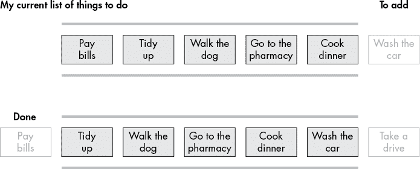
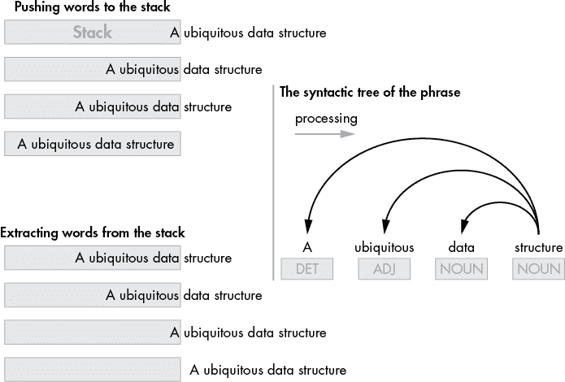
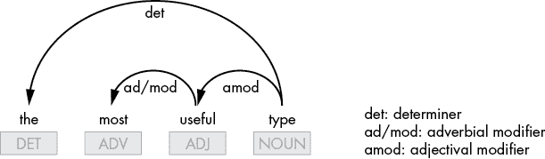

## 第二章：Python 数据结构


数据结构组织和存储数据，使得数据更容易访问。Python 提供了四种数据结构：列表、元组、字典和集合。这些结构易于使用，但也可以用于处理复杂的数据操作，使得 Python 成为数据分析中最受欢迎的语言之一。

本章将介绍 Python 的四种内置数据结构，重点讲解如何利用这些特性，轻松构建功能性数据驱动应用程序，减少编码量。你还将学习如何将这些基本结构组合成更复杂的结构，如字典列表，从而更准确地表示现实世界中的对象。你将在自然语言处理领域和照片处理的简要介绍中应用这些知识。

## 列表

Python 的*列表*是一个有序的对象集合。列表中的元素由逗号分隔，整个列表被方括号括起来，如下所示：

```py
[2,4,7]
['Bob', 'John', 'Will']
```

列表是可变的，这意味着你可以添加、删除和修改列表的元素。与后面会讨论的集合不同，列表可以包含重复元素。

列表包含表示通常相关、相似事物的元素，这些元素可以被逻辑地分组在一起。典型的列表只包含属于同一类别的元素（即同质数据，如人名、文章标题或参与者编号）。理解这一点对于选择适合任务的工具至关重要。如果你需要一个包含具有不同属性对象的结构，可以考虑使用元组或字典。

### 创建列表

要创建一个基本列表，只需将一系列元素放入方括号中，并将该序列赋值给一个变量名：

```py
regions = ['Asia', 'America', 'Europe']
```

然而，在实际应用中，列表通常是通过动态方式从零开始填充的，通常使用一个循环，在每次迭代中计算出一个项目。在这种情况下，你的第一步是创建一个空列表，如下所示：

```py
regions = []
```

一旦你创建了一个列表，就可以根据需要添加、删除和排序列表中的项目。你可以使用 Python 的各种列表对象方法来执行这些操作以及其他任务。

### 使用常见的列表对象方法

列表对象方法是实现特定行为的函数。在本节中，我们将介绍一些常见的列表对象方法，包括`append()`、`index()`、`insert()`和`count()`。为了练习使用它们，可以从创建一个空列表开始。接下来，你将逐步将其构建为一个待办事项列表，填充其中的任务并进行整理：

```py
my_list = []
```

也许最常见的列表对象方法是`append()`。它将一个项目添加到列表的末尾。你可以使用`append()`将一些待办事项添加到你的待办列表中，如下所示：

```py
my_list.append('Pay bills')
my_list.append('Tidy up')
my_list.append('Walk the dog')
my_list.append('Cook dinner')
```

该列表现在包含四个项目，按照它们被添加的顺序：

```py
['Pay bills', 'Tidy up', 'Walk the dog', 'Cook dinner']
```

列表中的每个项都有一个数字键，称为 *索引*。这个特性使得列表能够保持项的特定顺序。Python 使用零基索引，这意味着序列中的第一个项被分配为索引 0。

要访问列表中的单个项，指定列表的名称，后跟所需项的索引，并用方括号括起来。例如，以下是如何打印你的待办事项列表中的第一个项：

```py
print(my_list[0])
```

`print()` 函数输出如下内容：

```py
Pay bills
```

你不仅可以使用列表的索引来访问所需的项，还可以在列表中的某个位置插入新项。假设你想在遛狗和做晚餐之间添加一个新任务。要进行这个插入，你首先使用 `index()` 方法确定要插入新项的位置之前的项的索引。这里，你将其存储在变量 `i` 中：

```py
i = my_list.index('Cook dinner')
```

这将成为新任务的索引，你现在可以使用 `insert()` 方法将其添加，如下所示：

```py
my_list.insert(i, 'Go to the pharmacy')
```

新任务被添加到列表的指定索引位置，所有后续任务的索引向后移动一位。更新后的列表如下所示：

```py
['Pay bills', 'Tidy up', 'Walk the dog', 'Go to the pharmacy', 'Cook dinner']
```

因为列表允许重复项，你可能需要检查某个项在列表中出现的次数。可以使用 `count()` 方法来实现，如以下示例所示：

```py
print(my_list.count('Tidy up'))
```

`print()` 函数只会显示列表中 `'Tidy up'` 的一个实例，但你可能会想把这个任务在你的每日列表中多次列出！

### 使用切片表示法

你可以使用 *切片表示法* 从顺序数据类型（如列表）中访问一系列项。要获取列表的切片，需要指定起始位置的索引和结束位置的索引加 1。用冒号分隔这两个索引，并将它们括在方括号中。例如，你可以按如下方式打印你的待办事项列表中的前三个项：

```py
print(my_list[0:3])
```

结果是一个包含索引从 0 到 2 的项的列表：

```py
['Pay bills', 'Tidy up', 'Walk the dog']
```

切片中的起始和结束索引都是可选的。如果省略起始索引，切片将从列表的开头开始。这意味着前面的示例中的切片可以安全地改为：

```py
print(my_list[:3])
```

如果省略结束索引，切片将一直延续到列表的末尾。以下是如何打印索引为 3 或更高的项：

```py
print(my_list[3:])
```

结果是你待办事项列表中的最后两项：

```py
['Go to the pharmacy', 'Cook dinner']
```

最后，你可以省略两个索引，在这种情况下，你将得到整个列表的副本：

```py
print(my_list[:])
```

结果是：

```py
['Pay bills', 'Tidy up', 'Walk the dog', 'Go to the pharmacy', 'Cook dinner']
```

切片表示法不仅限于从列表中提取子序列。你还可以使用它来代替 `append()` 和 `insert()` 方法，将数据填充到列表中。例如，在这里，你将两个项添加到列表的末尾：

```py
my_list[len(my_list):] = ['Mow the lawn', 'Water plants']
```

`len()` 函数返回列表中项的数量，这也是列表之外第一个未使用位置的索引。你可以从这个索引开始安全地添加新项。现在列表如下所示：

```py
['Pay bills', 'Tidy up', 'Walk the dog', 'Go to the pharmacy', 'Cook dinner',
 'Mow the lawn', 'Water plants']
```

类似地，你可以使用`del`命令和切片来移除项目，如下所示：

```py
del my_list[5:]
```

这会移除索引为 5 及以上的项，从而将列表恢复到之前的状态：

```py
['Pay bills', 'Tidy up', 'Walk the dog', 'Go to the pharmacy', 'Cook dinner']
```

### 使用列表作为队列

*队列*是一种抽象数据类型，可以使用列表数据结构来实现。队列的一端总是用于插入元素（*入队*），另一端用于移除元素（*出队*），因此遵循*先进先出（FIFO）*方法论。在实际应用中，FIFO 方法论常用于仓储：最早到达仓库的商品是最先离开的商品。以这种方式组织商品销售有助于防止商品过期，确保先销售较旧的商品。

使用 Python 的`deque`对象（*双端队列*的缩写）将 Python 列表转变为队列非常简单。在这一部分，我们将通过使用你的待办事项列表来探索这一方法。为了让列表像队列一样工作，已完成的任务应该从列表的开头移除，而新任务则出现在列表的末尾，正如图 2-1 所示。



图 2-1：使用列表作为队列的示例

下面是如何实现图中所示的过程：

```py
from collections import deque
queue = deque(my_list)
queue.append('Wash the car')
print(queue.popleft(), ' - Done!')
my_list_upd = list(queue)
```

在这个脚本中，你首先将之前示例中的`my_list`对象转换为`deque`对象，它是 Python `collections`模块的一部分。`deque()`对象构造器为传入的列表对象添加了一些方法，使得该列表更容易用作队列。在这个特定的示例中，你使用`append()`方法向队列的右侧添加了一个新元素，然后使用`popleft()`方法从队列的左侧移除一个元素。这个方法不仅移除最左边的元素，还会返回该元素，从而将它传入打印消息中。你应该看到以下消息作为结果：

```py
Pay bills - Done!
```

在脚本的最后一行将`deque`对象转换回列表后，更新后的待办事项列表如下所示：

```py
['Tidy up', 'Walk the dog', 'Go to the pharmacy', 'Cook dinner', 'Wash the car']
```

如你所见，列表中的第一个元素已经被推出，而一个新的元素被附加到了列表中。

### 使用列表作为栈

像队列一样，*栈*是一种抽象数据结构，你可以在列表上组织它。栈实现了*后进先出（LIFO）*方法论，最后加入的元素是第一个被取出的元素。为了让你的待办事项列表像栈一样工作，你需要按反向顺序完成任务，从最右边的任务开始。以下是如何在 Python 中实现这一概念：

```py
my_list = ['Pay bills', 'Tidy up', 'Walk the dog', 'Go to the pharmacy', 'Cook dinner']
stack = []
for task in my_list:
  stack.append(task)
while stack:
  print(stack.pop(), ' - Done!'))
print('\nThe stack is empty')
```

在`for`循环中，你将待办事项列表中的任务逐一推入一个作为栈定义的另一个列表，从第一个任务开始。这是一个在循环中使用`append()`动态填充空列表的示例。然后，在`while`循环中，你从栈中移除任务，从最后一个任务开始。你通过`pop()`方法完成这项操作，该方法移除列表中的最后一个项目并返回被移除的项目。栈的输出将如下所示：

```py
Cook dinner - Done!
Go to the pharmacy - Done!
Walk the dog - Done!
Tidy up - Done!
Pay bills - Done!

The stack is empty
```

### 使用列表和栈进行自然语言处理

列表和栈在许多现实世界的应用中都有广泛应用，包括自然语言处理领域。例如，你可以使用列表和栈来从文本中提取所有名词短语。一个名词短语由一个名词和其左侧句法子节点组成（即所有在名词左侧且句法依赖于名词的单词，如形容词或限定词）。因此，要从文本中提取名词短语，你需要搜索文本中的所有名词及其左侧句法子节点。这可以通过基于栈的算法来实现，如图 2-2 所示。



图 2-2：使用列表作为栈的示例

该图使用一个单一的名词短语作为示例，*一个普遍存在的数据结构*。右侧句法树中的箭头展示了如何将单词*A*、*ubiquitous*和*data*作为名词*structure*的句法子节点，*structure*是这些句法子节点的*头*。该算法从左到右逐个单词地分析文本，如果遇到名词或名词的左句法子节点，就将单词推入栈中。当算法遇到一个不符合此描述的单词，或者文本中没有剩余单词时，就找到了一个完整的名词短语，该短语会从栈中提取出来。

为了实现这个基于栈的名词短语提取算法，你需要安装 spaCy，领先的开源 Python 自然语言处理库，以及其中的一个英语模型。使用以下命令：

```py
$ **pip install -U spacy**
$ **python -m spacy download en_core_web_sm**
```

以下脚本使用 spaCy 实现领先的开源 Python 自然语言处理库：

```py
import spacy
txt = 'List is a ubiquitous data structure in the Python programming language.'

nlp = spacy.load('en_core_web_sm')
doc = nlp(txt)
stk = []
for w in doc:
  if w.pos_ == 'NOUN' or w.pos_ == 'PROPN': ❶
    stk.append(w.text)
  elif (w.head.pos_ == 'NOUN' or w.head.pos_ == 'PROPN') and (w in w.head.lefts): ❷
    stk.append(w.text)
  elif stk: ❸
    chunk = ''
    while stk:
      chunk = stk.pop() + ' ' + chunk ❹
    print(chunk.strip())
```

脚本的前几行通过标准设置过程来分析一个使用 spaCy 处理的文本短语。你导入 spaCy 库，定义要处理的句子，并加载 spaCy 的英语模型。之后，你将`nlp`管道应用于句子，指示 spaCy 生成该句子的句法结构，这是进行名词短语提取等任务所必需的。

接下来，你实现之前描述的算法，遍历文本中的每个单词。如果你找到一个名词❶或其左语法子节点之一❷，你就通过`append()`操作将其加入栈中。你通过使用 spaCy 内置的属性来做出这些判断，例如`w.head.lefts`，它们允许你遍历句子的语法结构并在其中查找所需的单词。因此，使用`w in w.head.lefts`，你查找单词的主语（`w.head`），然后查找该主语的左语法子节点（`.lefts`），并确定该单词是否是其中之一。例如，在评估单词*ubiquitous*时，`w.head`会得到*structure*，它是*ubiquitous*的语法主语，而*structure*的`.lefts`会得到单词*a*、*ubiquitous*和*data*，这表明*ubiquitous*确实是*structure*的左孩子。

完成算法后，一旦你确定文本中的下一个单词不属于当前名词短语（既不是名词，也不是名词的左孩子）❸，你就得到了一个完整的名词短语，并从栈中提取出单词❹。该脚本会找到并输出以下三个名词短语：

```py
List
a ubiquitous data structure
the Python programming language.
```

### 使用列表推导式进行改进

在第一章中，你看到过一个使用列表推导式创建列表的例子。在这一节中，我们将使用列表推导式来改进我们的名词短语提取算法。改进解决方案的功能通常需要对现有代码进行显著增强。然而，在这个案例中，由于涉及到列表推导式，所做的增强将非常简洁。

看一下图 2-2 中显示的语法依赖树，你可能会注意到那里所展示的每个短语元素都与名词*structure*通过语法弧线直接关联。然而，名词短语也可以遵循另一种模式，其中一些单词并未通过直接的语法关系与短语的名词连接。图 2-3 说明了这种短语的依赖树可能是什么样的。请注意副词*most*是形容词*useful*的孩子，而不是名词*type*的孩子，但它仍然是以*type*为主语的名词短语的一部分。



图 2-3：一个更复杂的名词短语的语法依赖树

我们需要改进上一节中的脚本，以便它也能提取像图 2-3 中所示的名词短语，其中一些词并未直接连接到短语的名词。为了优化我们的算法，我们首先通过比较图 2-2 和图 2-3 中展示的句法依赖树，找出它们的相似之处。重要的相似之处在于，在这两棵树中，作为名词短语依赖的每个单词的词头都可以在该单词的右侧找到。然而，构成短语的名词可能不遵循这个模式。例如，在句子“List is a ubiquitous data structure in the Python programming language.”中，单词*structure*是名词短语的词头，但它的词头*is*位于其左侧。为了确保这一点，你可以运行以下脚本，输出句子中每个单词的词头：

```py
txt = 'List is a ubiquitous data structure in the Python programming language.'
import spacy
nlp = spacy.load('en')
doc = nlp(txt)
for t in doc:
  print(t.text, t.head.text)
```

我们的新算法需要扫描文本，寻找其右侧有词头的单词，从而指示潜在的名词短语。其思路是为句子创建一种矩阵，指示一个单词的词头是否在其右侧。为了提高可读性，词头在右侧的单词可以按照它们在句子中的顺序包含在矩阵中，而其他所有单词则用零替代。因此，对于以下句子：

```py
List is arguably the most useful type in the Python programming language.
```

你将得到以下矩阵：

```py
['List', 0, 0, 'the', 'most', 'useful', 0, 0, 'the', 'Python', 'programming', 0, 0]
```

你可以通过列表推导式来创建这个矩阵：

```py
txt = 'List is arguably the most useful type in the Python
                                      programming language.'
import spacy
nlp = spacy.load('en')
doc = nlp(txt)
❶ head_lefts = [t.text if t in t.head.lefts else 0 for t in doc]
print(head_lefts)
```

在这里，你在列表推导式中的循环中遍历所提交句子的单词，对那些词头不在右侧的单词用零进行替换❶。

生成的列表如下所示：

```py
['List', 0, 0, 'the', 'most', 'useful', 0, 0, 'the', 'Python', 'programming', 0, 0]
```

你可能会注意到，列表中包含的元素比句子中的单词数量多一个。这是因为 spaCy 实际上将文本拆分成标记（tokens），这些标记可能是单词或标点符号。列表中的最终`0`表示句子末尾的句号。

现在你需要一种方法来遍历这个列表，以便找到并提取名词短语。你需要创建一系列文本片段，每个片段从某个位置开始，并一直延续到文本的末尾。在下面的代码片段中，你从开始处逐词遍历文本的其余部分，在每次迭代中生成一个矩阵，用于表示每个单词词头的左右位置：

```py
for w in doc:
  head_lefts = [t.text if t in t.head.lefts else 0 for t in ❶ doc[w.i:]]
  print(head_lefts)
```

你使用`doc`对象中的切片表示法来获取所需的文本片段❶。这个机制允许你在每次`for`循环迭代中，将结果切片的最左边位置向右移动一个单词。代码生成了以下矩阵集合：

```py
['List', 0, 0, 'the', 'most', 'useful', 0, 0, 'the', 'Python', 'programming', 0, 0]
[0, 0, 'the', 'most', 'useful', 0, 0, 'the', 'Python', 'programming', 0, 0]
[0, 'the', 'most', 'useful', 0, 0, 'the', 'Python', 'programming', 0, 0]
['the', 'most', 'useful', 0, 0, 'the', 'Python', 'programming', 0, 0]
['most', 'useful', 0, 0, 'the', 'Python', 'programming', 0, 0]
['useful', 0, 0, 'the', 'Python', 'programming', 0, 0]
[0, 0, 'the', 'Python', 'programming', 0, 0]
[0, 'the', 'Python', 'programming', 0, 0]
['the', 'Python', 'programming', 0, 0]
['Python', 'programming', 0, 0]
['programming', 0, 0]
[0, 0]
[0]
```

接下来，你必须分析每个片段，寻找第一个零。到达该零并包括该零的所有单词可能构成一个名词短语。以下是实现这一点的代码：

```py
for w in doc:
  head_lefts = [t.text if t in t.head.lefts else 0 for t in doc[w.i:]]
❶ i0 = head_lefts.index(0)
  if i0 > 0:
  ❷ noun = [1 if t.pos_== 'NOUN' or t.pos_== 'PROPN' else 0 for t in
                   reversed(doc[w.i:w.i+i0 +1])]
    try:
    ❸ i1 = noun.index(1)+1
    except ValueError:
      pass
    print(head_lefts[:i0 +1])
  ❹ print(doc[w.i+i0 +1-i1])
```

你将`i0`设置为`head_lefts.index(0)`，以查找片段中第一个零的索引 ❶。如果有多个零元素，`head_lefts.index(0)`返回第一个元素的索引。然后，你检查`i0 > 0`，以筛选出那些不以头部左侧元素开始的片段。

然后，你使用另一个列表推导式来处理要发送到堆栈的名词短语元素。在这个第二个列表推导式中，你会查找每个片段中可能是名词短语的名词或专有名词。你逆序遍历片段，首先选取构成名词短语的名词或专有名词，因此它应该出现在片段的最后位置 ❷。当你找到名词或专有名词时，实际发送到列表的是`1`，其他元素则发送`0`。因此，列表中找到的第一个`1`表示片段中主名词相对于片段末尾的位置 ❸。在计算表示名词短语的文本切片时，你需要用到它 ❹。

目前，你只需输出生成的片段以及其中找到的名词。你将看到以下输出：

```py
['List', 0]
List
['the', 'most', 'useful', 0]
type
['most', 'useful', 0]
type
['useful', 0]
type
['the', 'Python', 'programming', 0]
language
['Python', 'programming', 0]
language
['programming', 0]
language
```

现在，你可以将新代码融入到前一节中介绍的解决方案中。将所有内容结合在一起，你将得到以下脚本：

```py
txt = 'List is arguably the most useful type in the Python
                                      programming language.'
import spacy
nlp = spacy.load('en')
doc = nlp(txt)
stk = []
❶ for w in doc:
❷ head_lefts = [1 if t in t.head.lefts else 0 for t in doc[w.i:]]
  i0 = 0
  try: i0 = head_lefts.index(0)
  except ValueError: pass
  i1 = 0
  if i0 > 0:
    noun = [1 if t.pos_== 'NOUN' or t.pos_== 'PROPN' else 0 for t in 
                   reversed(doc[w.i:w.i+i0 +1])]
    try: i1 = noun.index(1)+1  
    except ValueError: pass
  if w.pos_ == 'NOUN' or w.pos_ == 'PROPN':
  ❸ stk.append(w.text)
  elif (i1 > 0):
  ❹ stk.append(w.text)
  elif stk:
    chunk = ''
    while stk:
 ❺ chunk = stk.pop() + ' ' + chunk
    print(chunk.strip())
```

你遍历提交的句子中的标记 ❶，在每次迭代中生成一个`head_lefts`列表 ❷。回想一下，这个列表是一个矩阵，其中包含那些句子中其句法主语位于其左侧的单词的零。这些矩阵用于识别名词短语。对于你识别的每个名词短语，你将每个名词或专有名词发送到堆栈 ❸，以及属于该短语但不是名词的其他单词 ❹。一旦到达名词短语的末尾，你从堆栈中提取标记，形成一个短语 ❺。

脚本将产生以下输出：

```py
List
the most useful type
the Python programming language
```

## 元组

像列表一样，*元组*是一个有序的对象集合。然而，与列表不同的是，元组是不可变的。一旦创建了一个元组，它就不能被更改。元组中的项由逗号分隔，并可以选择性地用括号括起来，如下所示：

```py
('Ford', 'Mustang', 1964)
```

元组通常用于存储异构数据集合；也就是说，存储不同类型的数据，例如汽车的品牌、型号和年份。正如这个例子所示，当你需要一个结构来保存现实世界对象的属性时，元组特别有用。

### 元组列表

在 Python 中，将数据结构嵌套在一起是常见的做法。例如，你可以有一个列表，每个元素是一个元组，这让你能够为列表中的每个元素分配多个属性。假设你想为之前章节中创建的待办事项列表中的每个任务分配一个开始时间。列表中的每个项目将成为一个数据结构，由两个元素组成：任务描述和计划的开始时间。

为了实现这样的结构，元组是理想的选择，因为它们旨在将异构数据收集到一个结构中。你的元组列表可能如下所示：

```py
[('8:00','Pay bills'), ('8:30','Tidy up'), ('9:30','Walk the dog'),
 ('10:00','Go to the pharmacy'), ('10:30','Cook dinner')]
```

你可以从以下两个简单的列表构建这个元组列表：

```py
task_list = ['Pay bills', 'Tidy up', 'Walk the dog', 'Go to the pharmacy', 'Cook dinner']
tm_list = ['8:00', '8:30', '9:30', '10:00', '10:30']
```

如你所见，第一个列表是原始的 `my_list`，第二个是包含对应开始时间的列表。将它们组合成元组列表的最简单方法是使用列表推导式，如下所示：

```py
sched_list = [(tm, task) for tm, task in zip(tm_list, task_list)]
```

在列表推导式中，你使用了 Python 的 `zip()` 函数，它同时遍历这两个简单的列表，将相应的时间和任务组合成元组。

与列表一样，要访问元组中的元素，你需要在元组名称后面指定元素的索引，并将其用方括号括起来。然而，值得注意的是，嵌套在列表中的元组没有名称。要访问嵌套元组中的元素，你首先需要指定列表的名称，然后是列表中元组的索引，最后是元组中元素的索引。例如，要查看待办事项列表中第二个任务分配的时间，你可以使用以下语法：

```py
print(sched_list[1][0])
```

这将生成以下输出：

```py
8:30
```

### 不可变性

需要记住的一个重要点是，元组是不可变的。也就是说，你不能修改它们。例如，如果你尝试更改某个任务的开始时间：

```py
sched_list[1][0] = '9:00'
```

你会收到以下错误：

```py
TypeError: 'tuple' object does not support item assignment
```

由于元组是不可变的，它们不适合存储需要定期更新的数据值。

## 字典

*字典* 是 Python 中另一种广泛使用的内置数据结构。字典是可变的、无序的 *键值对* 集合，其中每个 *键* 是一个唯一的名称，用于标识数据项，即 *值*。字典由大括号界定。每个键与其值之间由冒号分隔，键值对之间由逗号分隔，如下所示：

```py
{'Make': 'Ford', 'Model': 'Mustang', 'Year': 1964}
```

字典和元组一样，适用于存储关于现实世界对象的异构数据。正如这个示例所展示的，字典具有为每个数据项分配标签的额外好处。

### 字典列表

像其他数据结构一样，字典可以嵌套在其他结构中。将待办事项列表实现为字典的列表时，可能会如下所示：

```py
dict_list = [
  {'time': '8:00', 'name': 'Pay bills'},
  {'time': '8:30', 'name': 'Tidy up'},
  {'time': '9:30', 'name': 'Walk the dog'},
  {'time': '10:00', 'name': 'Go to the pharmacy'},
  {'time': '10:30', 'name': 'Cook dinner'}
]
```

与元组不同，字典是可变的，这意味着你可以轻松更改键值对中的值：

```py
dict_list[1]['time'] = '9:00'
```

这个示例还展示了如何访问字典中的值：与列表和元组不同，你使用的是键名而非数字索引。

### 使用 `setdefault()` 向字典添加数据

`setdefault()` 方法提供了一种便捷的方式向字典添加新数据。它以键值对作为参数。如果指定的键已经存在，方法会直接返回该键的当前值。如果该键不存在，`setdefault()` 会插入该键并赋予指定的值。要查看示例，首先创建一个名为 `car` 的字典，其中模型是 `Jetta`：

```py
car = {
  "brand": "Volkswagen",
  "style": "Sedan",
  "model": "Jetta"
}
```

现在，尝试使用`setdefault()`添加一个新的`model`键，并将其值设置为`Passat`：

```py
print(car.setdefault("model", "Passat"))
```

这将产生以下输出，显示`model`键的值保持不变：

```py
Jetta
```

然而，如果你指定一个新的键，`setdefault()`会插入键值对并返回值：

```py
print(car.setdefault("year", 2022))
```

输出将如下所示：

```py
2022
```

如果现在打印整个字典：

```py
print(car)
```

这就是你所看到的：

```py
{
  "brand": "Volkswagen",
  "style": "Sedan",
  "model": "Jetta",
  "year": 2022
}
```

正如你所看到的，`setdefault()`方法使你无需手动检查要插入的键值对中的键是否已经存在于字典中。你可以安全地尝试将一个键值对插入字典，而不用担心覆盖已存在键的值。

现在你已经了解了`setdefault()`的工作原理，接下来我们来看一个实际的例子。统计文本中每个单词出现的次数是自然语言处理（NLP）中的常见任务。以下示例演示了如何借助字典，使用`setdefault()`方法来完成这个任务。以下是你需要处理的文本：

```py
txt = '''Python is one of the most promising programming languages today. Due to the simplicity of Python syntax, many researchers and scientists prefer Python over many other languages.'''
```

第一步是去除文本中的标点符号。如果不这样做，`'languages'`和`'languages.'`会被算作两个不同的单词。这里，我们去掉句号和逗号：

```py
txt = txt.replace('.', '').replace(',', '')
```

接下来，你将文本分割成单词，并将它们放入一个列表中：

```py
lst = txt.split()
print(lst)
```

生成的单词列表如下：

```py
['Python', 'is', 'one', 'of', 'the', 'most', 'promising', 'programming',
 'languages', 'today', 'Due', 'to', 'the', 'simplicity', 'of', 'Python',
 'syntax', 'many', 'researchers', 'and', 'scientists', 'prefer', 'Python',
 'over', 'many', 'other', 'languages']
```

现在你可以计算列表中每个单词的出现次数。可以使用字典和`setdefault()`方法来实现，代码如下：

```py
dct = {}
for w in lst:
  c = dct.setdefault(w,0)
  dct[w] += 1
```

首先，你创建一个空字典。然后，你将列表中的单词作为键，使用`setdefault()`方法将每个键的初始值设置为`0`。当每个单词第一次出现时，值会增加 1，得到计数 1。对于该单词的后续出现，`setdefault()`会保持之前的计数值不变，但会通过`+=`运算符将计数值增加 1，从而得到准确的计数。

在输出字典之前，你可能想根据单词出现的次数对其进行排序：

```py
dct_sorted = dict(sorted(dct.items(), key=lambda x: x[1], reverse=True))
print(dct_sorted)
```

使用字典的`items()`方法，你可以将该字典转换为一个元组列表，其中每个元组包含一个键及其值。因此，当你在`sorted()`函数的`key`参数中为`lambda`指定`x[1]`时，你实际上是按照元组中索引为`1`的项（即原字典中的值，表示单词计数）进行排序。排序后的字典如下所示：

```py
{'Python': 3, 'of': 2, 'the': 2, 'languages': 2, 'many': 2, 'is': 1, 'one': 1,
 'most': 1, 'promising': 1, 'programming': 1, 'today': 1, 'Due': 1, 'to': 1,
 'simplicity': 1, 'syntax': 1, 'researchers': 1, 'and': 1, 'scientists': 1,
 'prefer': 1, 'over': 1, 'other': 1}
```

### 将 JSON 加载到字典中

借助字典，你可以轻松地将 Python 数据结构转换为 JSON 字符串，反之亦然。以下是如何仅使用赋值运算符将表示 JSON 文档的字符串加载到字典中的方法：

```py
d = { "PONumber"             : 2608,
      "ShippingInstructions" : {"name"   : "John Silver",
                                "Address": {  "street"  : "426 Light Street",
                                              "city"    : "South San Francisco",
                                              "state"   : "CA",
                                              "zipCode" : 99237,
                                              "country" : "United States of America" },
                                 "Phone" : [ { "type" : "Office", "number" : "809-123-9309" },
                                             { "type" : "Mobile", "number" : "417-123-4567" }
                                           ] 
                               } 
    }
```

正如你可能注意到的，这个字典具有复杂的结构。`ShippingInstructions`键的值本身是一个字典，其中`Address`键的值又是一个字典，而`Phone`键的值是一个字典列表。

你可以使用 Python 的`json`模块通过`json.dump()`方法将字典直接保存到 JSON 文件中：

```py
import json
with open("po.json", "w") as outfile:
  json.dump(d, outfile)
```

类似地，你可以使用`json.load()`方法将 JSON 文件的内容直接加载到 Python 字典中：

```py
with open("po.json",) as fp:
    d = json.load(fp) 
```

结果是你得到的字典与本节开始时展示的字典相同。我们将在第四章详细讨论文件操作。

## 集合

Python 中的*集合*是一个无序的唯一项集合。集合中不允许有重复项。集合通过花括号定义，其中包含由逗号分隔的项，如下所示：

```py
{'London', 'New York', 'Paris'}
```

### 从序列中删除重复项

由于集合的成员必须是唯一的，因此集合在需要从列表或元组中删除重复项时非常有用。假设某个企业想查看其客户的列表。你可能通过从他们所下的订单中提取客户的名字来获得这样的列表。由于一个客户可能下了多个订单，列表中可能会有重复的名字。可以通过使用集合来删除这些重复项，如下所示：

```py
lst = ['John Silver', 'Tim Jemison', 'John Silver', 'Maya Smith']
lst = list(set(lst))
print(lst)
```

你只需将原始列表转换为集合，再转换回列表。集合构造函数会自动删除重复项。更新后的列表大致如下：

```py
['Maya Smith', 'Tim Jemison', 'John Silver']
```

这种方法的一个缺点是它不能保留元素的初始顺序。这是因为集合是无序的项集合。实际上，如果你运行前面的代码两到三次，输出的顺序可能每次都不同。

为了在不丢失初始顺序的情况下执行相同的操作，可以使用 Python 的`sorted()`函数，如下所示：

```py
lst = ['John Silver', 'Tim Jemison', 'John Silver', 'Maya Smith']
lst = list(sorted(set(lst), key=lst.index))
```

这会根据原始列表的索引对集合进行排序，从而保留顺序。更新后的列表如下：

```py
['John Silver', 'Tim Jemison', 'Maya Smith']
```

### 执行常见的集合操作

集合对象带有用于对序列执行常见数学操作的方法，如并集和交集。这些方法使你可以轻松地合并集合或提取多个集合之间共享的元素。

假设你需要根据照片中的内容将大量照片分类。为了自动化这个任务，你可能会使用像 Clarifai API 这样的视觉识别工具，它会为每张照片生成一组描述性标签。然后，可以使用`intersection()`方法对这些标签集合进行比较。这个方法比较两个集合，并创建一个新集合，包含两个集合中都存在的所有元素。在这个特定的案例中，两个集合中标签数量越多，说明这两张照片的主题越相似。

为简便起见，以下示例仅使用两张照片。通过它们对应的描述性标签集合，你可以确定两张照片的主题内容重合的程度：

```py
photo1_tags = {'coffee', 'breakfast', 'drink', 'table', 'tableware', 'cup', 'food'}
photo2_tags = {'food', 'dish', 'meat', 'meal', 'tableware', 'dinner', 'vegetable'}
intersection = photo1_tags.intersection(photo2_tags)
if len(intersection) >= 2:
  print("The photos contain similar objects.")
```

在这段代码中，你执行交集操作来找到两个集合之间共享的项。如果两个集合中共同的项的数量大于或等于两个，则可以得出结论：这些照片具有相似的主题，因此可以将它们分组在一起。

## 总结

本章涵盖了 Python 的四种内置数据结构：列表、元组、字典和集合。你看到了大量的示例，展示了这些结构如何表示现实世界中的对象，同时你还学习了如何将它们组合成嵌套结构，包括元组的列表、字典的列表，以及值为列表的字典。

本章还探讨了让你能够轻松构建功能性数据分析应用程序的特性。例如，你学习了如何使用列表推导式从现有列表创建新列表，以及如何使用 `setdefault()` 方法高效地访问和操作字典中的数据。通过示例，你看到了这些特性如何应用于常见的挑战，如文本处理和照片分析。
