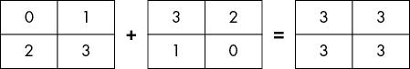
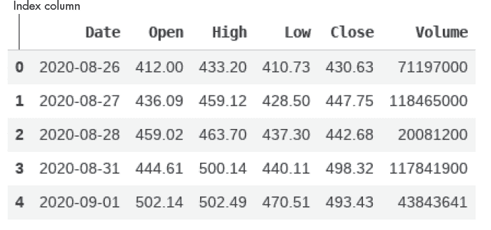
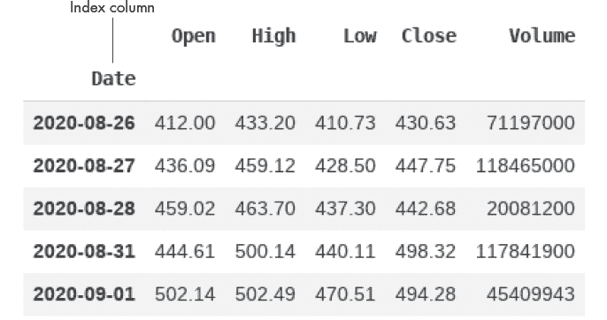
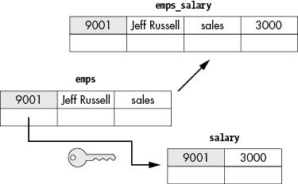
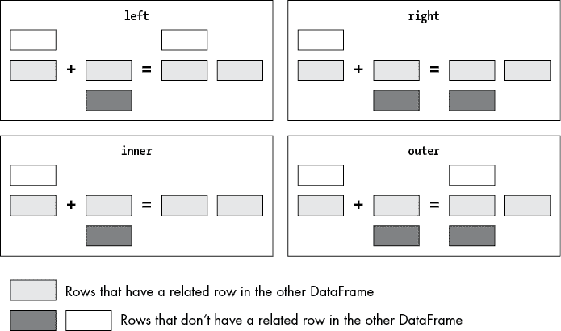
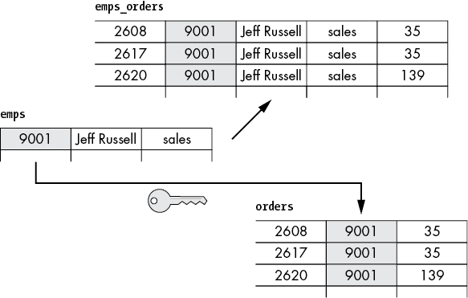

## 第三章：Python 数据科学库


Python 提供了访问一个强大的第三方库生态系统，这些库对于数据分析和处理非常有用。本章将向你介绍三种较为流行的数据科学库：NumPy、pandas 和 scikit-learn。正如你所见，许多数据分析应用程序都广泛使用这些库，无论是显式使用还是隐式使用。

## NumPy

NumPy，或称为数值 Python 库，对于处理*数组*非常有用，数组是一种存储相同数据类型值的数据结构。许多执行数值计算的 Python 库都依赖于 NumPy。

NumPy 数组是 NumPy 库的关键组成部分，它是一个元素类型相同的网格。NumPy 数组中的元素由一组非负整数元组进行索引。NumPy 数组类似于 Python 列表，不同之处在于它们需要更少的内存，并且通常更快，因为它们使用了优化过的预编译 C 代码。

NumPy 数组支持*元素级操作*，这使你可以使用简洁且易读的代码对整个数组执行基本的算术运算。元素级操作是对两个具有相同维度的数组执行操作，结果是一个相同维度的新数组，其中每个元素*i*，*j* 是对原始两个数组的元素*i*，*j* 进行计算后的结果。图 3-1 展示了对两个 NumPy 数组执行元素级操作的示意图。



图 3-1：添加两个 NumPy 数组

正如你所见，结果数组具有与原始两个数组相同的维度，每个新元素是原始数组中对应元素的和。

### 安装 NumPy

NumPy 是一个第三方库，这意味着它不是 Python 标准库的一部分。最简单的安装方法是使用以下命令：

```py
$ **pip install NumPy**
```

Python 将 NumPy 视为一个模块，因此你需要在脚本中导入它才能使用。

### 创建 NumPy 数组

你可以通过一个或多个 Python 列表中的数据创建 NumPy 数组。假设你为每个员工创建一个列表，包含该员工过去三个月的基本薪资支付。你可以使用如下代码将所有薪资信息放入一个数据结构中：

```py
❶ import numpy as np
❷ jeff_salary = [2700,3000,3000]
nick_salary = [2600,2800,2800]
tom_salary = [2300,2500,2500]
❸ base_salary = np.array([jeff_salary, nick_salary, tom_salary])
print(base_salary)
```

你可以通过导入 NumPy 库 ❶ 开始。然后定义一组列表，每个列表包含员工过去三个月的基本薪资数据 ❷。最后，将这些列表合并为一个 NumPy 数组 ❸。数组看起来是这样的：

```py
[[2700 3000 3000]
 [2600 2800 2800]
 [2300 2500 2500]]
```

这是一个二维数组。它有两个轴，轴的索引是整数，从 0 开始。轴 0 垂直向下运行，跨越数组的行，而轴 1 水平运行，跨越数组的列。

你可以按照相同的步骤创建一个包含员工月度奖金的数组：

```py
jeff_bonus = [500,400,400]
nick_bonus = [600,300,400]
tom_bonus = [200,500,400]
bonus = np.array([jeff_bonus, nick_bonus, tom_bonus])
```

### 执行逐元素操作

对多个维度相同的 NumPy 数组执行逐元素操作非常简单。例如，您可以将 `base_salary` 和 `bonus` 数组合并在一起，以确定每个月支付给每个员工的总金额：

```py
❶ salary_bonus = base_salary + bonus
print(type(salary_bonus))
print(salary_bonus)
```

如您所见，添加操作是一行代码❶。结果数据集也是一个 NumPy 数组，其中每个元素是 `base_salary` 和 `bonus` 数组中对应元素的和：

```py
<class 'NumPy.ndarray'>
[[3200 3400 3400]
 [3200 3100 3200]
 [2500 3000 2900]]
```

### 使用 NumPy 统计函数

NumPy 的统计函数允许您分析数组的内容。例如，您可以查找整个数组的最大值，或者沿着给定的轴查找数组的最大值。

假设您想要查找上节中创建的 `salary_bonus` 数组中的最大值。您可以使用 NumPy 数组的 `max()` 函数来实现：

```py
print(salary_bonus.max())
```

该函数返回数据集中过去三个月内支付给任何员工的最高金额：

```py
3400
```

NumPy 还可以沿着给定的轴查找数组的最大值。如果您想确定过去三个月支付给每个员工的最高金额，您可以使用 NumPy 的 `amax()` 函数，如下所示：

```py
print(np.amax(salary_bonus, axis = 1))
```

通过指定 `axis = 1`，您指示 `amax()` 函数横向遍历列，查找 `salary_bonus` 数组中的最大值，从而对每一行应用该函数。这将计算过去三个月内每个月支付给每个员工的最高金额：

```py
[3400 3200 3000]
```

同样，您可以通过将 `axis` 参数设置为 `0` 来计算每个月支付给任何员工的最高金额：

```py
print(np.amax(salary_bonus, axis = 0))
```

结果如下：

```py
[3200 3400 3400]
```

## pandas

pandas 库是数据导向 Python 应用程序的事实标准。（如果您在想，名字源自 Python 数据分析库。）该库包含两种数据结构：*Series*（一维）和 *DataFrame*（二维）。虽然 DataFrame 是 pandas 的主要数据结构，但 DataFrame 实际上是多个 Series 对象的集合。因此，理解 Series 和 DataFrame 都很重要。

### pandas 安装

标准的 Python 发行版并不包含 pandas 模块。您可以使用以下命令安装 pandas：

```py
$ **pip install pandas**
```

`pip` 命令还会解决库的依赖关系，隐式地安装 NumPy、pytz 和 python-dateutil 包。

就像使用 NumPy 一样，您需要先将 pandas 模块导入到脚本中，才能使用它。

### pandas Series

pandas Series 是一个一维标记数组。默认情况下，Series 中的元素根据其位置用整数标记，就像 Python 列表中的元素一样。然而，您也可以指定自定义标签。这些标签不必唯一，但必须是可哈希类型，如整数、浮动、字符串或元组。

Series 的元素可以是任何类型（整数、字符串、浮点数、Python 对象等），但如果 Series 中的所有元素类型相同，它的工作效果最好。最终，Series 可能成为一个更大 DataFrame 中的一列，而且你不太可能希望将不同类型的数据存储在同一列中。

#### 创建一个 Series

创建 Series 有多种方式。在大多数情况下，你会传入某种 1D 数据集。以下是如何从 Python 列表创建 Series：

```py
❶ import pandas as pd
❷ data = ['Jeff Russell','Jane Boorman','Tom Heints']
❸ emps_names = pd.Series(data)
print(emps_names)
```

你首先导入 pandas 库并将其别名为 `pd` ❶。然后，你创建一个用于 Series 数据的项列表 ❷。最后，你创建 Series，并将该列表传入 `Series` 构造方法 ❸。

这样，你就得到了一个默认从 0 开始的数字索引的单一列表：

```py
0    Jeff Russell
1    Jane Boorman
2      Tom Heints
dtype: object
```

`dtype` 属性指示给定 Series 的底层数据类型。默认情况下，pandas 使用 `object` 数据类型来存储字符串。

你可以按如下方式创建一个具有用户定义索引的 Series：

```py
data = ['Jeff Russell','Jane Boorman','Tom Heints']
emps_names = pd.Series(data,index=[9001,9002,9003])
print(emps_names)
```

这时 `emps_names` Series 对象中的数据如下所示：

```py
9001    Jeff Russell
9002    Jane Boorman
9003      Tom Heints
dtype: object
```

#### 访问 Series 中的数据

要访问 Series 中的元素，指定 Series 名称并在方括号内跟上元素的索引，如下所示：

```py
print(emps_names[9001])
```

这将输出对应索引 9001 的元素：

```py
Jeff Russell
```

或者，你可以使用 Series 对象的 `loc` 属性：

```py
print(emps_names.loc[9001])
```

尽管在这个 Series 对象中使用了自定义索引，但你仍然可以通过位置（即使用基于整数位置的索引）来访问它的元素，通过 `iloc` 属性。例如，在这里，你可以打印 Series 中的第一个元素：

```py
print(emps_names.iloc[0])
```

你可以通过切片操作按索引访问多个元素，正如第二章所讨论的那样：

```py
print(emps_names.loc[9001:9002])
```

这将产生如下输出：

```py
9001    Jeff Russell
9002    Jane Boorman
```

注意，使用 `loc` 切片时包括右端点（在此案例中是索引 9002），而通常 Python 的切片语法是不包括右端点的。

你也可以使用切片操作根据位置而非索引来定义元素的范围。例如，前面的结果可以通过以下代码生成：

```py
print(emps_names.iloc[0:2])
```

或者简单地如下：

```py
print(emps_names[0:2])
```

正如你所看到的，和 `loc` 切片不同，使用 `[]` 或 `iloc` 切片与普通的 Python 切片相同：起始位置包括，但停止位置不包括。因此，`[0:2]` 会跳过位置 2 的元素，只返回前两个元素。

#### 将多个 Series 合并为 DataFrame

多个 Series 可以结合成一个 DataFrame。我们可以通过创建另一个 Series，并将其与 `emps_names` Series 合并，来尝试这一点：

```py
data = ['jeff.russell','jane.boorman','tom.heints']
❶ emps_emails = pd.Series(data,index=[9001,9002,9003], name = 'emails')
❷ emps_names.name = 'names'
❸ df = pd.concat([emps_names,emps_emails], axis=1)
print(df)
```

要创建新的 Series，你需要调用 `Series()` 构造函数 ❶，并传入以下参数：要转换为 Series 的列表、Series 的索引以及 Series 的名称。

在将多个 Series 合并成 DataFrame 之前，你需要先为它们命名，因为它们的名称将成为相应 DataFrame 列的名称。由于你在之前创建 `emps_names` Series 时没有命名它，所以在此处通过设置它的 `name` 属性为 `'names'` ❷ 来命名。之后，你可以将它与 `emps_emails` Series ❸ 合并。你需要指定 `axis=1`，以便沿着列方向进行合并。

生成的 DataFrame 如下所示：

```py
 names        emails
9001  Jeff Russell  jeff.russell
9002  Jane Boorman  jane.boorman
9003    Tom Heints    tom.heints
```

### pandas DataFrame

pandas DataFrame 是一个二维标签化的数据结构，具有不同类型的列。可以将 DataFrame 看作是一个类似字典的容器，其中每个字典的键是列标签，每个值是一个 Series。

如果你熟悉关系型数据库，你会发现 pandas DataFrame 类似于普通的 SQL 表。图 3-2 展示了一个 pandas DataFrame 的示例。



图 3-2：一个 pandas DataFrame 的示例

请注意，DataFrame 包含一个索引列。与 Series 一样，pandas 默认使用基于零的数字索引。但你可以用一个或多个现有列替代默认的索引。图 3-3 显示了相同的 DataFrame，但将 Date 列设置为索引。



图 3-3：一个使用列作为索引的 pandas DataFrame

在这个特定的示例中，索引是一个 `date` 类型的列。事实上，pandas 允许你使用任何类型作为 DataFrame 的索引。最常用的索引类型是整数和字符串。然而，你并不限于使用简单类型。你可以定义一个序列类型的索引，比如 List 或 Tuple，甚至使用不是 Python 内置的对象类型；这可以是第三方类型，甚至是你自己的对象类型。

#### 创建 pandas DataFrame

你已经看到可以通过将多个 Series 对象合并来创建 pandas DataFrame。你还可以通过从数据库、CSV 文件、API 请求或其他外部源加载数据来创建 DataFrame，方法是使用 pandas 库的 *reader* 方法。Reader 方法允许你将不同类型的数据，如 JSON 和 Excel，读取到 DataFrame 中。

考虑图 3-2 所示的 DataFrame。它可能是通过 yfinance 库向 Yahoo Finance API 发起请求的结果。要自己创建该 DataFrame，首先使用 `pip` 安装 yfinance，方法如下：

```py
**$ pip install yfinance**
```

然后请求股票数据，如下所示：

```py
import yfinance as yf
❶ tkr = yf.Ticker('TSLA')
❷ hist = tkr.history(period="5d")
❸ hist = hist.drop("Dividends", axis = 1)
hist = hist.drop("Stock Splits", axis = 1)
❹ hist = hist.reset_index()
```

在这个脚本中，你向 API 发送请求，获取给定股票代码的股票价格数据❶，并使用 yfinance 的 `history()` 方法指定你希望获取五天的数据❷。结果数据存储在变量 `hist` 中，已经是 pandas DataFrame 的形式。你不需要显式地创建 DataFrame；yfinance 会在后台为你处理。获取 DataFrame 后，你删除其中一些列❸，并切换为数字索引❹，得到如 图 3-2 所示的结构。

要将索引设置为 Date 列，如 图 3-3 所示，你需要执行以下代码行：

```py
hist = hist.set_index('Date')
```

现在，让我们尝试将一个 JSON 文档转换为 pandas 对象。此处使用的示例数据集包含三名员工的每月薪资数据，每名员工通过其在 `Empno` 列中的 ID 进行标识：

```py
import json
import pandas as pd
data = [
 {"Empno":9001,"Salary":3000},
 {"Empno":9002,"Salary":2800},
 {"Empno":9003,"Salary":2500}
]
❶ json_data = json.dumps(data)
❷ salary = pd.read_json(json_data)
❸ salary = salary.set_index('Empno')
print(salary)
```

你使用 pandas 的 `read_json()` 读取方法将 JSON 字符串传递给 DataFrame❷。为了简单起见，本示例使用通过 `json.dumps()` 从列表转换的 JSON 字符串❶。或者，你可以将一个 `path` 对象传递给读取器，该对象指向一个 JSON 文件，或者指向发布 JSON 格式数据的 HTTP API 的 URL。最后，你将 `Empno` 列设置为 DataFrame 索引❸，从而替换掉默认的数字索引。

结果的 DataFrame 看起来是这样的：

```py
 Salary
Empno        
9001     3000
9002     2800
9003     2500
```

另一种常见的做法是从上一章介绍的标准 Python 数据结构中创建 pandas DataFrame。例如，以下是如何从一个列表的列表中创建 DataFrame：

```py
import pandas as pd
❶ data = [['9001','Jeff Russell', 'sales'],
        ['9002','Jane Boorman', 'sales'],
        ['9003','Tom Heints', 'sales']]
❷ emps = pd.DataFrame(data, columns = ['Empno', 'Name', 'Job'])
❸ column_types = {'Empno': int, 'Name': str, 'Job': str}
emps = emps.astype(column_types)
❹ emps = emps.set_index('Empno')
print(emps)
```

首先，你初始化一个包含待发送数据的列表列表❶。每个嵌套列表将成为 DataFrame 中的一行。然后，你显式地创建 DataFrame，定义要使用的列❷。接下来，你使用一个字典 `column_types` 来更改列的默认数据类型❸。这一步是可选的，但如果你计划将 DataFrame 与另一个 DataFrame 合并，这一步是至关重要的。因为你只能在相同数据类型的列上合并两个 DataFrame。最后，你将 `Empno` 列设置为 DataFrame 索引❹。结果的 DataFrame 看起来是这样的：

```py
 Name       Job
Empno                        
9001   Jeff Russell     sales
9002   Jane Boorman     sales
9003     Tom Heints     sales
```

请注意，`emps` 和 `salary` DataFrame 都使用 `Empno` 作为索引列，以唯一标识每一行。在这两种情况下，你都将该列设置为 DataFrame 索引，以简化将两个 DataFrame 合并成一个 DataFrame 的过程，我们将在下一节中讨论。

#### 合并 DataFrame

pandas 允许你合并（或连接）DataFrame，就像你在关系数据库中连接不同的表一样。这使得你可以将数据聚合在一起进行分析。DataFrame 支持通过两种方法：`merge()` 和 `join()` 进行数据库风格的连接操作。尽管这两种方法有一些不同的参数，但你可以在大多数情况下互换使用它们。

首先，让我们连接上一节中定义的 `emps` 和 `salary` DataFrame。这是一个 *一对一连接* 的例子，因为一个 DataFrame 中的一行与另一个 DataFrame 中的单独一行相关联。图 3-4 说明了这是如何工作的。



图 3-4：连接两个具有一对一关系的 DataFrame

这里我们可以看到 `emps` DataFrame 和 `salary` DataFrame 中的一个条目。它们共享相同的索引值 `9001`，因此可以合并成一个新的 `emps_salary` DataFrame 中的单个条目。在关系型数据库术语中，通过这些列关联的表被称为 *关键列*。尽管 pandas 使用 *index* 来表示这些列，图 3-4 使用关键图标来做视觉关联。

借助 `join()` 方法，实施起来非常简单：

```py
emps_salary = emps.join(salary)
print(emps_salary)
```

`join()` 方法旨在基于索引轻松地连接 DataFrame。在这个具体的例子中，你甚至不需要提供任何额外的参数来连接这两个 DataFrame；按索引连接是默认行为。

结果数据集如下所示：

```py
 Name       Job  Salary
Empno                                
9001   Jeff Russell     sales    3000
9002   Jane Boorman     sales    2800
9003     Tom Heints     sales    2500
```

在实际操作中，即使其中一个 DataFrame 中的某些行在另一个 DataFrame 中没有匹配的行，你可能仍然需要连接这两个 DataFrame。假设你在 `emps` DataFrame 中有多出的一行，而在 `salary` DataFrame 中没有相应的行：

```py
new_emp = pd.Series({'Name': 'John Hardy', 'Job': 'sales'}, name = 9004)
emps = emps.append(new_emp)
print(emps)
```

在这里，你创建一个 pandas Series 对象，并使用 `append()` 方法将其添加到 `emps` DataFrame 中。这是向 DataFrame 添加新行的常见方法。

更新后的 `emps` DataFrame 如下所示：

```py
 Name       Job
Empno                        
9001   Jeff Russell     sales
9002   Jane Boorman     sales
9003     Tom Heints     sales
9004     John Hardy     sales
```

如果你现在再次应用连接操作：

```py
emps_salary = emps.join(salary)
print(emps_salary)
```

结果是如下的 DataFrame：

```py
 Name       Job  Salary
Empno                                
9001   Jeff Russell     sales  3000.0
9002   Jane Boorman     sales  2800.0
9003     Tom Heints     sales  2500.0
9004     John Hardy     sales     NaN
```

注意，添加到 `emps` DataFrame 中的那一行出现在结果数据集中，尽管它在 `salary` DataFrame 中没有相关联的行。最后一行中的 `Salary` 字段中的 `NaN` 条目表示该工资值缺失。在某些情况下，你可能希望允许像这样的不完整行，但在其他情况下，你可能希望排除那些在另一个 DataFrame 中没有相关行的行。

默认情况下，`join()` 方法在结果的连接 DataFrame 中使用调用 DataFrame 的索引，从而执行 *左连接*。在这个例子中，调用 DataFrame 是 `emps`，它被视为连接操作中的左侧 DataFrame，因此它的所有行都会包含在结果数据集中。你可以通过传递 `how` 参数到 `join()` 方法来改变这一默认行为。这个参数可以取以下值：

1.  `left` 使用调用 DataFrame 的索引（或者如果指定了 `on` 参数，则为其他列），返回调用（左侧）DataFrame 中的所有行以及来自另一个（右侧）DataFrame 的匹配行。

1.  `right` 使用另一个（右侧）DataFrame 的索引，返回该 DataFrame 中的所有行以及调用（左侧）DataFrame 中的匹配行。

1.  `outer` 形成调用 DataFrame 的索引（或者如果指定了 `on` 参数，则为其他列）与另一个 DataFrame 的索引的组合，返回两个 DataFrame 中的所有行。

1.  `inner` 形成调用的 DataFrame 的索引（或者如果指定了 `on` 参数，则为其他列）与另一个 DataFrame 的索引的交集，只返回在两个 DataFrame 中都出现的那些行。

图 3-5 展示了每种连接类型。



图 3-5：不同类型连接的结果。

如果你希望结果 DataFrame 仅包含 `emps` 中那些在 `salary` DataFrame 中有相关行的行，可以将 `join()` 的 `how` 参数设置为 `inner`：

```py
emps_salary = emps.join(salary, how = 'inner')
print(emps_salary)
```

结果 DataFrame 看起来是这样的：

```py
 Name       Job  Salary
Empno                                
9001   Jeff Russell     sales    3000
9002   Jane Boorman     sales    2800
9003     Tom Heints     sales    2500
```

获取此结果的另一种方法是将 `right` 作为 `how` 参数传递。在这种情况下，`join()` 会返回所有来自 `salary` DataFrame 的行，并将来自 `emps` DataFrame 的匹配行的字段附加到这些行上。然而，重要的是要意识到，右连接在许多其他情况下与内连接并不相等。例如，如果你向 `salary` DataFrame 添加一行，并且该行在 `emps` DataFrame 中没有匹配项，则右连接会包括这行以及与 `emps` 中匹配的行。

#### 一对多连接

在 *一对多连接* 中，来自一个 DataFrame 的一行可以与来自另一个 DataFrame 的多行匹配。考虑这样一种情况：`emps` DataFrame 中的每个销售人员处理了若干订单。这可以在 `orders` DataFrame 中反映如下：

```py
import pandas as pd
data = [[2608, 9001,35], [2617, 9001,35], [2620, 9001,139],
        [2621, 9002,95], [2626, 9002,218]]
orders = pd.DataFrame(data, columns = ['Pono', 'Empno', 'Total'])
print(orders)
```

这是 `orders` DataFrame 的样子：

```py
 Pono  Empno  Total
0  2608   9001     35
1  2617   9001     35
2  2620   9001    139
3  2621   9002     95
4  2626   9002    218
```

现在你已经有了一个订单的 DataFrame，可以将它与之前定义的员工 DataFrame 结合。这是一个一对多连接，因为 `emps` DataFrame 中的一名员工可以与 `orders` DataFrame 中的多行关联：

```py
emps_orders = emps.merge(orders, how='inner', left_on='Empno',
                         right_on='Empno').set_index('Pono')
print(emps_orders)
```

在这段代码中，你使用 `merge()` 方法定义一对多连接，将 `emps` 和 `orders` DataFrame 中的数据合并。`merge()` 方法允许你指定在两个 DataFrame 中进行连接的列，使用 `left_on` 来指定调用 DataFrame 中的列，使用 `right_on` 来指定另一个 DataFrame 中的列。使用 `join()` 时，你只能为调用 DataFrame 指定连接的列。对于另一个 DataFrame，`join()` 使用索引列。

在这个示例中，你使用了内连接类型，只包括两个 DataFrame 中相关的行。结果数据集如下所示：

```py
 Empno          Name       Job  Total
Pono                                      
2608   9001  Jeff Russell     sales     35
2617   9001  Jeff Russell     sales     35
2620   9001  Jeff Russell     sales    139
2621   9002  Jane Boorman     sales     95
2626   9002  Jane Boorman     sales    218
```

图 3-6 展示了这种一对多连接是如何工作的。



图 3-6：连接具有一对多关系的两个 DataFrame

如你所见，图中的一对多连接在连接的*多*方每一行都对应数据集中的一行。由于你使用的是内连接类型，其他行将不会被包含。然而，在左连接或外连接的情况下，连接还会包含那些在*一*方数据集中没有与*多*方匹配的行。

除了一对多和一对一连接，还有*多对多连接*。以这种关系为例，考虑两个数据集：一个列出书籍，另一个列出作者。作者数据集中的每条记录可以与书籍数据集中的一条或多条记录关联，而书籍数据集中的每条记录也可以与一个或多个作者记录关联。我们将在第七章中讨论这种类型的关系，届时将更详细地讲解如何连接、合并和连接数据集。

#### 使用 groupby()聚合数据

pandas 的`groupby()`函数可以让你在 DataFrame 的多行数据中进行聚合。例如，它可以求出某一列的总和，或计算某一列中某一部分值的平均值。

假设你需要计算`orders` DataFrame 中每个员工处理的订单的平均总额。你可以像下面这样使用`groupby()`函数：

```py
print(orders.groupby(['Empno'])['Total'].mean())
```

`groupby()`返回一个支持多种聚合函数的 GroupBy 对象。在这个具体的例子中，你使用`mean()`来计算与员工相关联的订单组的平均总额。为此，你首先根据`Empno`列对`orders` DataFrame 中的行进行分组，然后对`Total`列应用`mean()`操作。生成的数据集是一个 Series 对象：

```py
Empno
9001     69.666667
9002    156.500000
Name: Total, dtype: float64
```

现在假设你想要对每组的订单总数进行求和。这时，GroupBy 对象的`sum()`函数就派上用场了：

```py
print(orders.groupby(['Empno'])['Total'].sum())
```

生成的 Series 对象中的数据如下：

```py
Empno
9001    209
9002    313
Name: Total, dtype: int64
```

## scikit-learn

scikit-learn 是一个专为机器学习应用设计的 Python 包。与 NumPy 和 pandas 一起，它是 Python 数据科学生态系统中的另一个核心组件。scikit-learn 提供了高效、易于使用的工具，可应用于常见的机器学习问题，包括探索性和预测性数据分析。我们将在本书的最后部分深入探讨机器学习。目前，本节只是简单介绍 Python 在机器学习领域，特别是在预测数据分析中的应用。

预测性数据分析是机器学习的一个领域，依赖于分类和回归算法。分类和回归都使用过去的数据来预测新数据，但分类将数据分入离散的类别，而回归可以输出一个连续的数值范围。在本节中，我们将通过一个使用 scikit-learn 实现的分类示例来进行讲解。我们将构建一个预测模型，分析客户产品评论，并将其分为两类：正面评论和负面评论。该模型将从已经分类的样本中学习如何预测其他样本的类别。一旦我们训练好模型，就会展示一些新的评论，进行正面或负面的分类。

### 安装 scikit-learn

与 NumPy 和 pandas 一样，scikit-learn 是一个第三方 Python 库。你可以按照以下方式安装它：

```py
$ **pip install sklearn**
```

scikit-learn 包含多个子模块，每个子模块都有其特定功能。因此，通常会根据具体任务导入所需的子模块（比如 `sklearn.model_selection`），而不是导入整个模块。

### 获取示例数据集

为了确保准确性，预测模型应在大量标注样本上进行训练。因此，构建一个能够分类产品评论的模型的第一步是获取一组已经标注为正面或负面的评论。这可以避免你自己收集评论并手动标注它们。

有多个在线资源提供标注数据集，其中最好的之一是 UC Irvine 的机器学习资源库，网址为[`archive.ics.uci.edu/ml/index.php`](https://archive.ics.uci.edu/ml/index.php)。使用“customer product reviews”搜索该资源库，你会找到指向情感标注句子数据集的链接（或者，你也可以直接将浏览器指向[`archive.ics.uci.edu/ml/datasets/Sentiment+Labelled+Sentences`](https://archive.ics.uci.edu/ml/datasets/Sentiment+Labelled+Sentences)）。从数据集的网页下载并解压*sentiment labelled sentences.zip*文件。

*.zip* 文件包含来自 IMDb、Amazon 和 Yelp 的评论，存储在三个不同的 *.txt* 文件中。这些评论已经根据情感（分别为 `1` 或 `0`）进行了标注；每个来源有 500 条正面评论和 500 条负面评论，总共有 3000 条标注评论。为了简化，我们将仅使用来自 Amazon 的实例。它们可以在 *amazon_cells_labelled.txt* 文件中找到。

### 将示例数据集加载到 pandas DataFrame 中

为了简化后续计算，你需要将评论从文本文件加载到一个更易于处理的数据结构中。你可以按如下方式将数据从 *amazon_cells_labelled.txt* 读取到 pandas DataFrame 中：

```py
import pandas as pd
df = pd.read_csv('/usr/Downloads/sentiment labelled sentences/amazon_cells_labelled.txt',
                 names=[❶ 'review', ❷ 'sentiment'], ❸ sep='\t')
```

在这里，你使用 pandas 的 `read_csv()` 读取方法将数据加载到 DataFrame 中。你指定了两列：第一列存储评论 ❶，第二列存储相应的情感得分 ❷。由于原始文件中评论和情感得分之间是通过制表符分隔的，你指定 `\t` 作为分隔符 ❸。

### 将样本数据集拆分为训练集和测试集

现在你已经导入了数据集，接下来的步骤是将数据集拆分为两部分：一部分用于训练预测模型，另一部分用于测试模型的准确性。scikit-learn 允许你只需几行代码就能完成这一步：

```py
from sklearn.model_selection import train_test_split
reviews = df['review'].values
sentiments = df['sentiment'].values
reviews_train, reviews_test, sentiment_train, sentiment_test = train_test_split(reviews,
                                         sentiments, ❶ test_size=0.2, ❷ random_state=500)
```

你使用来自 `sklearn.model_selection` 模块的 `train_test_split()` 函数来拆分数据集。评论及其对应的情感（情感得分）作为通过 `values` 属性从 DataFrame 提取的相应 Series 对象获得的 NumPy 数组传入函数。你传入 `test_size` 参数 ❶ 来控制数据集的拆分方式。值 `0.2` 表示 20% 的评论将被随机分配到测试集。因此，你遵循 80/20 的模式；剩余的 80% 评论将组成训练集。`random_state` 参数 ❷ 初始化内部随机数生成器，用于随机拆分数据。

### 将文本转换为数值特征向量

要训练和测试你的模型，你需要一种将文本数据转化为数值的方式。这时，*词袋模型（BoW）* 就派上用场了。该模型通过将文本表示为单词的集合（词袋），以生成有关文本的数值数据。BoW 模型生成的最典型的数值特征是词频，即每个单词在文本中出现的次数。这个简单的示例展示了 BoW 模型如何根据词频将文本转化为数值特征向量：

```py
Text: I know it. You know it too.
BoW: {"I":1,"know":2,"it":2,"You":1,"too":1}
Vector: [1,2,2,1,1]
```

你可以使用 scikit-learn 的 `CountVectorizer()` 函数来为文本数据创建一个词袋（BoW）矩阵。`CountVectorizer()` 将文本数据转换为数值特征向量（表示某个对象的 *n* 维数值特征向量），并使用默认的分词器或自定义分词器进行分词（将文本拆分为单独的单词和标点符号）。自定义分词器可以使用像 spaCy 这样的自然语言处理工具实现，spaCy 在上一章中有介绍。在这个示例中，我们将使用默认选项，以保持简单。

下面是将评论转换为特征向量的方法：

```py
from sklearn.feature_extraction.text import CountVectorizer
vectorizer = CountVectorizer()
vectorizer.fit(reviews)
X_train = vectorizer.transform(reviews_train)
X_test = vectorizer.transform(reviews_test)
```

首先，你创建一个 `vectorizer` 对象。然后，应用 `vectorizer` 的 `fit()` 方法来构建 `reviews` 数据集中发现的词汇表，`reviews` 数据集包含训练集和测试集中的所有评论。之后，你使用 `vectorizer` 对象的 `transform()` 方法，将训练集和测试集中的文本数据转换为数值特征向量。

### 训练和评估模型

现在你已经拥有了以数值向量形式表示的训练集和测试集，你可以开始训练和测试模型了。首先，你将训练 scikit-learn 的 `LogisticRegression()` 分类器来预测评论的情感。*逻辑回归*是一种基础但流行的解决分类问题的算法。

在这里，你创建一个 `LogisticRegression()` 分类器，然后使用它的 `fit()` 方法根据给定的训练数据来训练模型：

```py
from sklearn.linear_model import LogisticRegression
classifier = LogisticRegression()
classifier.fit(X_train, sentiment_train)
```

现在你必须评估模型在新数据上的预测准确性。你需要一组标注数据，因此通常会将一个标注数据集分为训练集和测试集，就像你之前所做的那样。在这里，你使用测试集来评估模型：

```py
accuracy = classifier.score(X_test, sentiment_test)
print("Accuracy:", accuracy)
```

准确率通常如下所示：

```py
Accuracy: 0.81
```

这意味着模型的准确率为 81%。如果你尝试调整 `train_test_split()` 函数中的 `random_state` 参数，可能会得到稍微不同的值，因为训练集和测试集中的实例是从原始数据集中随机选择的。

### 对新数据进行预测

现在你已经训练并测试了模型，它可以开始分析新的、未标记的数据了。这将帮助你更全面地了解模型的表现。试试看，给模型提供一些新的示例评论：

```py
new_reviews = ['Old version of python useless', 'Very good effort, but not
               five stars', 'Clear and concise']
X_new = vectorizer.transform(new_reviews)
print(classifier.predict(X_new))
```

首先，你需要创建一个新的评论列表，然后将这些新文本转换为数值特征向量。最后，你为这些新样本预测类别情感。情感结果将作为一个列表返回：

```py
[0, 1, 1]
```

记住，`0` 表示负面评论，`1` 表示正面评论。正如你所见，模型已经对这些示例评论起作用，显示第一个是负面的，而后两个是正面的。

## 总结

本章介绍了一些最流行的第三方 Python 库，用于数据科学应用。首先，我们探索了 NumPy 库及其多维数组对象，接着了解了 pandas 库及其 Series 和 DataFrame 数据结构。你学会了如何从 Python 内建结构（如列表）以及存储在标准格式（如 JSON）中的数据源创建 NumPy 数组、pandas Series 和 pandas DataFrame 对象。你还了解了如何访问和操作这些对象中的数据。最后，你使用了 scikit-learn 这个流行的机器学习 Python 库，构建了一个分类预测模型。
