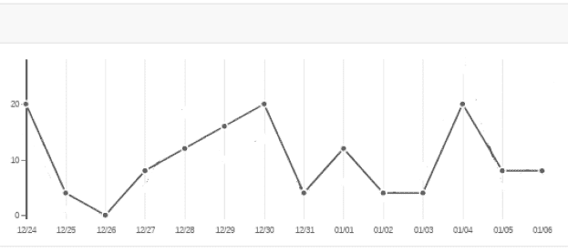
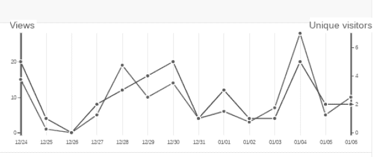
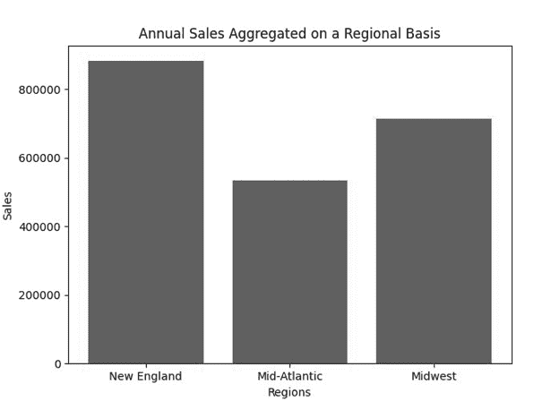
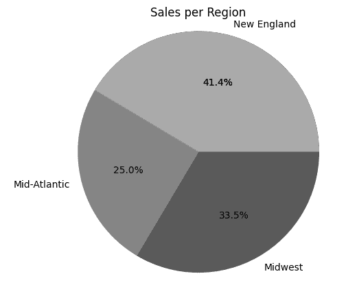
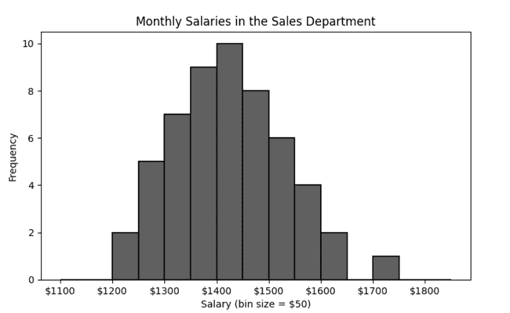
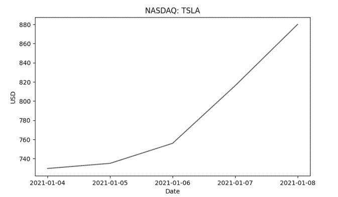
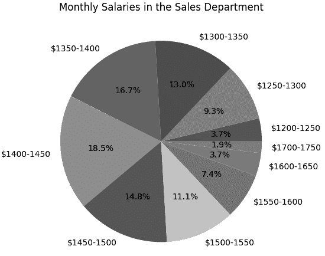
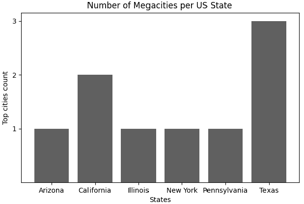
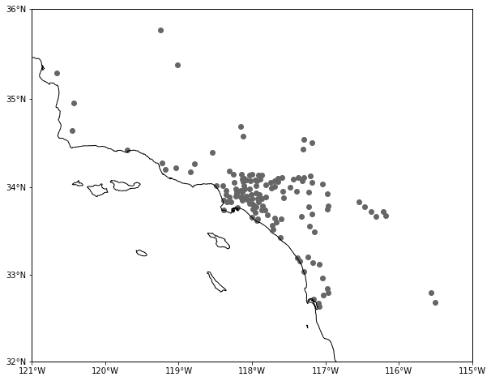
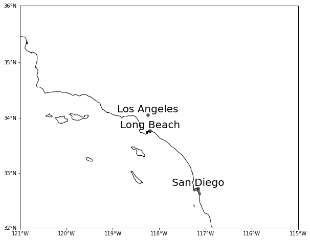

## 第八章：创建可视化图表


与原始数据相比，数据的可视化形式能更清晰地展示信息。例如，你可能想要创建一张折线图，展示股票价格随时间变化的趋势。或者，你也可以使用直方图跟踪网站文章的兴趣，显示每篇文章的日浏览量。像这样的可视化图表能帮助你立即识别数据中的趋势。

本章概述了最常见的数据可视化类型，并介绍了如何使用流行的 Python 绘图库 Matplotlib 创建这些可视化图表。你还将学习如何将 Matplotlib 与 pandas 集成，以及如何使用 Matplotlib 和 Cartopy 库创建地图。

## 常见的可视化图表

可用于数据可视化的图表类型有多种，包括折线图、条形图、饼图和直方图。在本节中，我们将讨论这些常见的可视化图表，并探索每种图表的典型使用案例。

### 折线图

*折线图*，也称为 *折线图表*，用于展示一段时间内数据的趋势。在折线图中，你将数据集的时间戳列放置在 x 轴上，将一个或多个数值列放置在 y 轴上。

以一个用户可以查看不同文章的网站为例，你可以为某篇文章创建一张图表，其中 x 轴表示一系列日期，y 轴表示每天该文章的浏览量。这一点在图 8-1 中得到了展示。



图 8-1：一张展示文章浏览量随时间变化的折线图

你可以在同一张折线图中叠加多个参数的数据，以展示它们之间的相关性，用不同颜色的线条绘制每个参数的数据。例如，图 8-2 展示了网站的日独立访客数与文章浏览量的叠加。



图 8-2：一张折线图，展示了各参数之间的关系

这张折线图的左侧 y 轴显示了文章浏览量，右侧 y 轴显示了独立访客数。将两者的数据叠加后，可以直观地看到文章浏览量与独立访客数之间的普遍关联。

### 条形图

*条形图*，也叫 *条形图表* 或 *柱形图表*，使用矩形条来显示类别数据，条形的高度与所代表的值成比例，从而可以对不同类别进行比较。例如，以下图示展示了一家公司按地区汇总的年度销售数据：

```py
New England   $882,703
Mid-Atlantic  $532,648
Midwest       $714,406
```

图 8-3 展示了将这些销售数据绘制为条形图后的效果。



图 8-3：一个显示比较分类数据的条形图

在此图中，y 轴显示了与 x 轴上显示的区域相比较的销售数据。

### 饼图

*饼图*展示了每个类别在整个数据集中的比例，通常以百分比表示。图 8-4 展示了之前示例中的销售数据在饼图中的表现。



图 8-4：饼图表示每个类别作为圆的一部分的百分比。

在这个图中，每个切片的大小提供了每个类别在整体中所占比例的可视化表示。你可以轻松地看出每个区域的销售额相互比较。对于每个切片表示整体中相对较大部分的情况，饼图非常有效，但如你所猜测的那样，当你需要表示非常小的部分时，饼图就不是最佳选择。例如，表示整个数据集 0.01% 的切片可能在图表中根本不可见。

### 直方图

*直方图*显示频率分布，即某个特定值或值的范围在数据集中出现的次数。每个值或结果由一个垂直条表示，条形的高度与该值的频率对应。例如，图 8-5 中的直方图立即展示了销售部门中不同薪资群体的频率。

在这个直方图中，薪资被分成$50 的区间，每个垂直条表示收入在某一范围内的人数。通过这种可视化，你可以迅速看到比如$1,200 到$1,250 之间的员工数量，与其他区间如$1,250 到$1,300 进行比较。



图 8-5：一个显示薪资分布的直方图

## 使用 Matplotlib 绘图

现在你已经了解了最常见的图表类型，我们将讨论如何使用 Matplotlib 来创建它们。Matplotlib 是一个流行的 Python 数据可视化库，你将学习如何制作折线图、饼图、条形图和直方图。

每个 Matplotlib 可视化图形或*图表*是由一系列嵌套的对象组成的。你可以直接操作这些对象来创建高度可定制的可视化，或者通过 `matplotlib.pyplot` 模块中提供的函数间接操作这些对象。后一种方法更简单，通常足以创建基本的图表和图形。

### 安装 Matplotlib

通过在 Python 解释器会话中尝试导入 Matplotlib，检查它是否已经安装：

```py
> **import matplotlib**
```

如果你遇到`ModuleNotFoundError`错误，使用以下命令通过`pip`安装 Matplotlib：

```py
$ **python -m pip install -U matplotlib**
```

### 使用 matplotlib.pyplot

`matplotlib.pyplot`模块，通常在代码中称为`plt`，提供了一系列函数，用于创建美观的图表。该模块使你能够轻松定义图表的各种属性，如标题、轴标签等。例如，下面是如何构建一个展示特斯拉五个连续交易日收盘股价的折线图：

```py
from matplotlib import pyplot as plt

days = ['2021-01-04', '2021-01-05', '2021-01-06', '2021-01-07', '2021-01-08']
prices = [729.77, 735.11, 755.98, 816.04, 880.02]

plt.plot(days,prices)
plt.title('NASDAQ: TSLA')
plt.xlabel('Date')
plt.ylabel('USD')
plt.show()
```

首先，你将数据集定义为两个列表：`days`，包含将在 x 轴上绘制的日期，以及`prices`，包含将在 y 轴上绘制的价格。然后，你使用`plt.plot()`函数创建一个*图表*，即实际显示数据的部分，并传入 x 轴和 y 轴的数据。在接下来的三行代码中，你对图表进行定制：使用`plt.title()`添加标题，使用`plt.xlabel()`和`plt.ylabel()`为 x 轴和 y 轴添加标签。最后，使用`plt.show()`显示图表。图 8-6 展示了结果。



图 8-6：使用`matplotlib.pyplot`模块生成的简单折线图

默认情况下，`plt.plot()` 会生成一个可视化图像，将数据点连接成一系列线条，这些数据点会被绘制在 x 轴和 y 轴上。Matplotlib 自动为 y 轴选择了一个 720 到 880 的范围，间隔为 20，便于查看每日的股价。

构建一个基本的饼图和制作折线图一样简单。例如，以下代码生成了如前所示的图 8-4 中的饼图：

```py
import matplotlib.pyplot as plt

regions = ['New England', 'Mid-Atlantic', 'Midwest']
sales = [882703, 532648, 714406]

plt.pie(sales, labels=regions, autopct='%1.1f%%')
plt.title('Sales per Region')
plt.show()
```

该脚本遵循了你用来生成折线图的基本模式：首先定义要绘制的数据，创建图表，定制一些图表的特征，然后显示它。这一次，数据包含了一个地区列表，这将作为每个饼图切片的标签，和一个包含各地区销售总额的列表，这将决定每个切片的大小。为了将图表变为饼图而非折线图，你调用`plt.pie()`函数，将`sales`作为要绘制的数据，`regions`作为数据的标签。你还使用`autopct`参数在饼图的切片上显示百分比值，并使用 Python 字符串格式化来显示百分比值到小数点后一位。

在这里，你将相同的输入数据可视化为柱状图，类似于图 8-3 中的那张图：

```py
import matplotlib.pyplot as plt
regions = ['New England', 'Mid-Atlantic', 'Midwest']
sales = [882703, 532648, 714406]

plt.bar(regions, sales)
plt.xlabel("Regions")
plt.ylabel("Sales")
plt.title("Annual Sales Aggregated on a Regional Basis")

plt.show()
```

你将`regions`列表传递给`plt.bar()`函数，作为柱状图的 x 轴标签。你传递给`plt.bar()`的第二个参数是与`regions`中每个项对应的销售数据列表。无论在这里还是在饼图的例子中，你都能使用单独的列表来表示标签和销售数据，因为 Python 列表中的元素顺序是持久的。

### 使用 Figure 和 Axes 对象

本质上，一个 Matplotlib 可视化是由两种主要类型的对象构成的：`Figure` 对象和一个或多个 `Axes` 对象。在前面的例子中，`matplotlib.pyplot` 作为一个接口间接操作这些对象，允许你自定义可视化的一些元素。然而，你可以通过直接操作 `Figure` 和 `Axes` 对象本身，来对可视化进行更精细的控制。

`Figure` 对象是 Matplotlib 可视化的最上层、最外层容器。它可以包含一个或多个子图。当你需要对整体可视化进行操作时，比如调整其大小或保存到文件中，你会使用 `Figure` 对象。与此同时，每个 `Axes` 对象代表图形中的一个子图。你使用 `Axes` 对象来自定义子图并定义其布局。例如，你可以设置子图的坐标系统，并在坐标轴上标记位置。

你通过 `matplotlib.pyplot.subplots()` 函数访问 `Figure` 和 `Axes` 对象。当该函数没有参数时，它返回一个 `Figure` 实例和一个与该 `Figure` 关联的单一 `Axes` 实例。通过向 `subplots()` 函数添加参数，你可以创建一个 `Figure` 实例和多个关联的 `Axes` 实例。换句话说，你将创建一个包含多个绘图的图形。例如，调用 `subplots(2,2)` 创建一个四个子图的图形，排列为两行两列。每个子图由一个 `Axes` 对象表示。

#### 使用 `subplots()` 创建直方图

在下面的脚本中，你使用 `subplots()` 创建一个 `Figure` 对象和一个 `Axes` 对象。然后你操作这些对象来生成先前在 图 8-5 中显示的直方图，展示一组员工的薪资分布。除了操作 `Figure` 和 `Axes` 对象外，你还会使用一个名为 `matplotlib.ticker` 的 Matplotlib 模块来格式化子图中 x 轴的刻度，并使用 NumPy 来定义一个以 50 为增量的直方图分箱序列：

```py
# importing modules
import numpy as np
from matplotlib import pyplot as plt
import matplotlib.ticker as ticker

# data to plot
❶ salaries = [1215, 1221, 1263, 1267, 1271, 1274, 1275, 1318, 1320, 1324, 1324,
            1326, 1337, 1346, 1354, 1355, 1364, 1367, 1372, 1375, 1376, 1378,
            1378, 1410, 1415, 1415, 1418, 1420, 1422, 1426, 1430, 1434, 1437,
            1451, 1454, 1467, 1470, 1473, 1477, 1479, 1480, 1514, 1516, 1522,
            1529, 1544, 1547, 1554, 1562, 1584, 1595, 1616, 1626, 1717]

# preparing a histogram
❷ fig, ax = plt.subplots()
❸ fig.set_size_inches(5.6, 4.2)
❹ ax.hist(salaries, bins=np.arange(1100, 1900, 50), edgecolor='black',
        linewidth=1.2)
❺ formatter = ticker.FormatStrFormatter('$%1.0f')
❻ ax.xaxis.set_major_formatter(formatter)
❼ plt.title('Monthly Salaries in the Sales Department')
plt.xlabel('Salary (bin size = $50)')
plt.ylabel('Frequency')
# showing the histogram
plt.show()
```

你首先定义一个 `salaries` 列表，包含你想要可视化的薪资数据❶。然后你调用 `subplots()` 函数，且不传递任何参数❷，从而指示该函数创建一个包含单个子图的图形。该函数返回一个元组，包含两个对象，分别是表示图形的 `fig` 和表示子图的 `ax`。

现在你已经拥有了这些 `Figure` 和 `Axes` 实例，你可以开始自定义它们了。首先，你调用 `Figure` 对象的 `set_size_inches()` 方法来调整整个图形的大小 ❸。然后，你调用 `Axes` 对象的 `hist()` 方法来绘制直方图 ❹。你将 `salaries` 列表作为直方图的输入数据传递给该方法，并使用 NumPy 数组定义直方图箱子的 x 轴点。你通过 NumPy 的 `arange()` 函数生成这个数组，它会在给定区间内生成一个均匀分布的数值数组（在这种情况下是 `1100` 到 `1900` 之间每 `50` 为递增值）。你使用 `hist()` 方法的 `edgecolor` 参数来绘制箱子的黑色边界线，并使用 `linewidth` 参数定义这些边界的宽度。

接下来，你使用 `matplotlib.ticker` 模块中的 `FormatStrFormatter()` 函数创建一个格式化器，用于在每个 x 轴标签前加上美元符号 ❺。你通过 `ax.xaxis` 对象的 `set_major_formatter()` 方法将格式化器应用到 x 轴标签 ❻。最后，你通过 `matplotlib.pyplot` 接口 ❼ 设置图表的总体属性，如标题和主坐标轴标签，并显示图表。

#### 在饼图上显示频率分布

虽然直方图非常适合用于可视化频率分布，但你也可以使用饼图来传达频率分布的百分比。例如，本节展示了如何将你刚刚创建的薪资分布直方图转化为一个饼图，显示薪资如何作为整体的一部分进行分布。

在你创建这样的饼图之前，你需要从直方图中提取并组织一些关键信息。特别是，你需要了解每个 $50 区间内的薪资数量。你可以使用 NumPy 的 `histogram()` 函数来实现这一点；它会计算一个直方图，但不显示它：

```py
import numpy as np
count, labels = np.histogram(salaries, bins=np.arange(1100, 1900, 50))
```

在这里，你调用了 `histogram()` 函数，将之前创建的相同的 `salaries` 列表传递给它，并再次使用 NumPy 的 `arange()` 函数生成均匀分布的箱子。调用 `histogram()` 会返回两个 NumPy 数组：`count` 和 `labels`。`count` 数组表示每个区间内具有相应薪资的员工数量，具体如下：

```py
[0,  0,  2,  5,  7,  9, 10,  8,  6,  4,  2,  0,  1,  0,  0]
```

同时，`labels` 数组包含了箱间隔的边缘：

```py
[1100, 1150, 1200, 1250, 1300, 1350, 1400, 1450, 1500, 1550, 1600, 1650,
 1700, 1750, 1800, 1850]
```

接下来，你需要将 `labels` 数组中的相邻元素组合起来，将它们变成饼图切片的标签。例如，相邻的元素 `1100` 和 `1150` 应该合并为一个标签，格式为 `'$1100-1150'`。可以使用以下列表推导式：

```py
labels = ['$'+str(labels[i])+'-'+str(labels[i+1]) for i, _ in enumerate(labels[1:])]
```

因此，`labels` 列表将如下所示：

```py
['$1100-1150', '$1150-1200', '$1200-1250', '$1250-1300', '$1300-1350',
 '$1350-1400', '$1400-1450', '$1450-1500', '$1500-1550', '$1550-1600',
 '$1600-1650', '$1650-1700', '$1700-1750', '$1750-1800', '$1800-1850']
```

`labels` 中的每个元素对应 `count` 数组中相同索引位置的元素。然而，回顾 `count` 数组，你可能会注意到一个问题：某些区间的计数为 `0`，你不希望将这些空区间包含到饼图中。为了排除这些空区间，你需要生成一个列表，列出 `count` 数组中非空区间对应的索引：

```py
non_zero_pos = [i for i, x in enumerate(count) if x != 0]
```

现在你可以使用 `non_zero_pos` 来过滤 `count` 和 `labels`，排除那些代表空区间的元素：

```py
labels = [e for i, e in enumerate(labels) if i in non_zero_pos]
count = [e for i, e in enumerate(count) if i in non_zero_pos]
```

现在剩下的就是使用 `matplotlib.pyplot` 接口和 `plt.pie()` 创建并显示饼图：

```py
from matplotlib import pyplot as plt
plt.pie(count, labels=labels, autopct='%1.1f%%')
plt.title('Monthly Salaries in the Sales Department')
plt.show()
```

图 8-7 显示了结果。

该饼图展示了与 图 8-5 中直方图相同的数据，但它显示的是每个区间占总体的百分比，而不是精确地表示有多少员工的薪资落在该区间内。



图 8-7：一个可视化频率分布的饼图

## 使用其他库与 Matplotlib 配合

Matplotlib 可以轻松地与其他 Python 库进行接口对接，从不同来源绘制数据或创建其他类型的可视化。例如，你可以将 Matplotlib 与 pandas 配合使用，绘制来自 DataFrame 的数据，或者通过将 Matplotlib 与 Cartopy（一个专门处理地理空间数据的库）结合使用来创建地图。

### 绘制 pandas 数据图

pandas 库与 Matplotlib 紧密集成。实际上，每个 pandas 的 Series 或 DataFrame 都有一个 `plot()` 方法，它实际上是 `matplotlib.pyplot.plot()` 方法的一个封装。它允许你直接将 pandas 数据结构转换为 Matplotlib 图表。为了演示，你将使用美国城市的人口数据创建一个条形图。你将使用来自 *us-cities-top-1k.csv* 文件的原始数据，文件可以在 [`github.com/plotly/datasets`](https://github.com/plotly/datasets) 获取。这个条形图将展示每个美国州的百万级大城市（人口达到或超过 1,000,000）的数量。操作步骤如下：

```py
import pandas as pd
import matplotlib.pyplot as plt

# preparing the DataFrame
❶ us_cities = pd.read_csv("https://raw.githubusercontent.com/plotly/datasets/
                               master/us-cities-top-1k.csv")
❷ top_us_cities = us_cities[us_cities.Population.ge(1000000)]
❸ top_cities_count = top_us_cities.groupby(['State'], as_index = False)
                   .count().rename(columns={'City': 'cities_count'})
                      [['State','cities_count']]

# drawing the chart
❹ top_cities_count.plot.bar('State', 'cities_count', rot=0)
❺ plt.xlabel("States")
plt.ylabel("Top cities count")
plt.title("Number of Megacities per US State")
❻ plt.yticks(range(min(top_cities_count['cities_count']),
                 max(top_cities_count['cities_count'])+1 ))
plt.show()
```

首先，你通过 pandas 的 `read_csv()` 方法将数据集加载到 DataFrame 中 ❶。该数据集包含了美国 1,000 个最大城市的人口、纬度和经度。为了将数据集筛选为仅包含特大城市，你使用 DataFrame 的 `ge()` 方法，`ge()` 是 *greater than or equal to*（大于或等于）的缩写，要求仅返回 `Population` 字段大于或等于 `1000000` 的行 ❷。然后，你按 `State` 列对数据进行分组，并应用 `count()` 聚合函数，计算每个州的特大城市数量 ❸。在 `groupby` 操作中，你将 `as_index` 设置为 `False`，以避免将 `State` 列转换为结果 DataFrame 的索引。这是因为稍后你还需要在脚本中引用 `State` 列。你将 `City` 列重命名为 `cities_count`，以反映它现在包含了汇总信息，并且只保留 `State` 和 `cities_count` 列，生成新的 `top_cities_count` DataFrame。

接下来，你使用 DataFrame 的 `plot.bar()` 方法绘制一个条形图 ❹。记住，`plot()` 实际上是 Matplotlib 的 `pyplot.plot()` 方法的一个封装。在这次调用中，你指定了将用作图表 x 轴和 y 轴的 DataFrame 列名，并将 x 轴的刻度标签旋转为 0 度。创建图形后，你可以像前面的示例中那样，使用 `matplotlib.pyplot` 接口来定制图形。你设置了坐标轴标签和图形标题 ❺，并使用 `plt.yticks()` 设置 y 轴的数字标签，以反映特大城市的数量 ❻。最后，你通过 `plt.show()` 显示图形。图 8-8 显示了结果。



图 8-8：从 pandas DataFrame 生成的条形图

如你所见，图形的外观与本章中你创建的其他图形非常相似，尤其是 图 8-3 中的条形图。这并不令人惊讶，因为它是由同一个 Matplotlib 库生成的，而 pandas 在幕后也使用了这个库。

### 使用 Cartopy 绘制地理空间数据

Cartopy 是一个用于创建地理空间可视化（或地图）的 Python 库。它包含了 `matplotlib.pyplot` 的编程接口，使得绘制地图变得简单。基本上，使用 Cartopy 绘制地图就是创建一个 Matplotlib 图形，其中经度坐标沿 x 轴绘制，纬度坐标沿 y 轴绘制。Cartopy 处理将地球的球形转化为绘图二维平面的复杂性。为了演示，你将使用前一节介绍的 *us-cities-top-1k.csv* 数据集，绘制显示南加州各城市位置的轮廓图。但首先，你需要设置 Cartopy。

#### 在 Google Colab 中使用 Cartopy

安装 Cartopy 可能会有些棘手，且过程因系统而异。因此，本节将展示如何通过 Google Colab Web IDE 使用 Cartopy，该 IDE 允许您通过浏览器编写和执行 Python 代码。

要加载 Colab，请访问 [`colab.research.google.com`](https://colab.research.google.com)。然后点击**新建** **笔记本**以启动一个新的 Colab 笔记本，您可以在其中创建、填充并运行任意数量的代码单元。在每个代码单元中，您可以将一行或多行 Python 代码组合在一起，并通过点击单元格左上角的运行按钮执行它们。Colab 会记住任何先前执行的单元所建立的执行状态，类似于 Python 解释器会话。您可以通过点击 Colab 窗口左上角的 +Code 按钮来创建新的代码单元。

在第一个代码单元中，输入并运行以下命令，以在 Colab 笔记本中安装 Cartopy：

```py
**!pip install cartopy**
```

一旦安装了 Cartopy，您可以继续查看下一节的示例，将每个独立的代码列表示为单独的代码单元执行。

#### 创建地图

在这一节中，您将使用 Cartopy 创建两张南加州的地图。首先，您将绘制一张显示 *us-cities-top-1k.csv* 数据集中所有南加州城市的地图。您从导入所有所需模块开始：

```py
import pandas as pd
%matplotlib inline 
import matplotlib.pyplot as plt
import cartopy.crs as ccrs
from cartopy.mpl.ticker import LongitudeFormatter, LatitudeFormatter
```

您将需要 pandas、`matplotlib.pyplot` 接口，以及一些不同的 Cartopy 模块：`cartopy.crs` 用于生成地图，`LongitudeFormatter` 和 `LatitudeFormatter` 用于正确格式化刻度标签。`%matplotlib inline` 命令是必需的，以便将 Matplotlib 图形嵌入到 Google Colab 笔记本中，显示在代码旁边。

接着，您加载所需的数据并绘制地图：

```py
❶ us_cities = pd.read_csv("https://raw.githubusercontent.com/plotly/datasets/
                               master/us-cities-top-1k.csv")
❷ calif_cities = us_cities[us_cities.State.eq('California')]
❸ fig, ax = plt.subplots(figsize=(15,8))
❹ ax = plt.axes(projection=ccrs.Mercator())
❺ ax.coastlines('10m')
❻ ax.set_yticks([32,33,34,35,36], crs=ccrs.PlateCarree())
ax.set_xticks([-121, -120, -119, -118, -117, -116, -115],
              crs=ccrs.PlateCarree())
❼ lon_formatter = LongitudeFormatter()
lat_formatter = LatitudeFormatter()
ax.xaxis.set_major_formatter(lon_formatter)
ax.yaxis.set_major_formatter(lat_formatter)
❽ ax.set_extent([-121, -115, 32, 36])
X = calif_cities['lon']
Y = calif_cities['lat']
❾ ax.scatter(X, Y, color='red', marker='o', transform=ccrs.PlateCarree())
plt.show()
```

您将 *us-cities-top-1k.csv* 数据集加载到 DataFrame 中 ❶，就像在上一节中做的那样。请记住，它包含以经纬度坐标形式表示的地理空间数据，以及人口数据。接着，您使用 DataFrame 的 `eq()` 方法 ❷（即 *等于* 的简写）来筛选数据，仅保留加利福尼亚州的城市。

由于绘制地图需要比 `matplotlib.pyplot` 接口更多的定制化，因此您需要直接操作可视化的底层 Matplotlib 对象。因此，您调用 `plt.subplots()` 函数来获取一个 `Figure` 对象和一个单独的 `Axes` 对象，同时设置图形大小 ❸。接着，您调用 `plt.axes()` 来覆盖 `Axes` 对象，将其转变为一个 Cartopy 地图 ❹。您通过告诉 Matplotlib 在绘制坐标时使用 Cartopy 的墨卡托投影法，来实现这一点。墨卡托投影是一种标准的制图技术，它将地球从球体转换为圆柱形，然后将圆柱展开成一个矩形。

接下来，您调用`ax.coastlines()`来显示地图上的陆地轮廓 ❺。海岸线是从 Natural Earth 的*海岸线*形状文件集合中添加到当前的`Axes`对象中的。通过指定`10m`，您以 1 比 1000 万的比例绘制海岸线；也就是说，地图上的 1 厘米相当于现实中的 100 公里。

要定义 y 轴和 x 轴上的刻度，您使用`set_yticks()`和`set_xticks()`方法，分别传递纬度和经度的列表 ❻。具体来说，您将`32`到`36`作为 y 刻度，将`-121`到`-115`作为 x 刻度（即 32°N 到 36°N 和 121°W 到 115°W），因为这些纬度和经度覆盖了南加州的区域。在这两种情况下，您都添加了`crs=ccrs.PlateCarree()`来指定如何将纬度和经度信息投影到平面上。像墨卡托投影一样，Plate Carrée 将地球视为一个圆柱体，并将其展平为矩形。

接下来，您使用 Cartopy 的`LongitudeFormatter()`和`LatitudeFormatter()`对象创建格式化器，并将它们应用于 x 轴和 y 轴 ❼。使用这些格式化器可以确保经度和纬度值显示带有度数符号，并且分别带有表示*西*或*北*的*W*或*N*。您还设置了绘图的范围，指定了适当的经纬度，以限制地图仅显示南加州 ❽。然后，您从 DataFrame 中提取两个 pandas Series 对象，分别为表示经度和纬度值的`X`和`Y`。最后，您使用 Matplotlib 的`scatter()`方法绘制地图 ❾，将数据传递到 x 轴和 y 轴上，并指示将城市作为红点显示。图 8-9 显示了结果。



图 8-9：标注了城市的南加州轮廓地图

这张地图清晰地展示了人口密度较高的区域。但是，如果您只想看到标注了城市名称的最大城市，应该怎么做呢？以下是您可以这样做的方法：

```py
❶ top_calif_cities = calif_cities[calif_cities.Population.ge(400000)]
fig, ax = plt.subplots(figsize=(15,8))
ax = plt.axes(projection=ccrs.Mercator())
ax.coastlines('10m')
ax.set_yticks([32,33,34,35,36], crs=ccrs.PlateCarree())
ax.set_xticks([-121, -120, -119, -118, -117, -116, -115],
              crs=ccrs.PlateCarree())
lon_formatter = LongitudeFormatter()
lat_formatter = LatitudeFormatter()
ax.xaxis.set_major_formatter(lon_formatter)
ax.yaxis.set_major_formatter(lat_formatter)
ax.set_extent([-121, -115, 32, 36])
X = top_calif_cities['lon']
Y = top_calif_cities['lat']
❷ cities = top_calif_cities['City']
ax.scatter(X, Y, color='red', marker='o', transform=ccrs.PlateCarree())
❸ for i in X.index:
  label = cities[i]
  plt.text(X[i], Y[i]+0.05, label, clip_on = True, fontsize = 20,
           horizontalalignment='center', transform=ccrs.Geodetic())
plt.show()
```

您过滤了在前一部分生成的`calif_cities` DataFrame，仅包括人口超过 40 万的城市 ❶。然后，您按照之前的相同步骤生成图表，并添加一些额外的步骤来添加城市标签。您将城市名称存储在一个名为`cities`的 pandas Series 中 ❷，然后遍历城市名称，使用 Matplotlib 的`plt.text()`方法将其作为中心标签添加到地图上的点上 ❸。您指定`transform=ccrs.Geodetic()`以使 Matplotlib 在添加标签时使用 Cartopy 的 Geodetic 坐标系统。该系统将地球视为一个球体，并将坐标指定为纬度和经度值。图 8-10 显示了结果。



图 8-10：加利福尼亚南部最大的城市

现在，这张地图展示了加利福尼亚南部三座人口超过 40 万的城市的位置和名称。

## 摘要

如你所见，数据可视化是发现趋势和从数据中获得洞察的强大工具。例如，折线图能立即揭示股价的趋势，而地图则能清晰地展示人口密度较高的区域。在本章中，你学习了如何使用 Matplotlib 库创建常见的可视化图表，如折线图、柱状图、饼图和直方图。你了解了如何通过`matplotlib.pyplot`接口构建简单但强大的可视化图表，并通过直接操作可视化的底层`Figure`和`Axes`对象，获得更高的控制能力。你还学习了如何将 Matplotlib 与 pandas 配合使用，来可视化 DataFrame 数据，并且练习了使用 Matplotlib 和 Cartopy 地理空间数据处理库创建地图。
