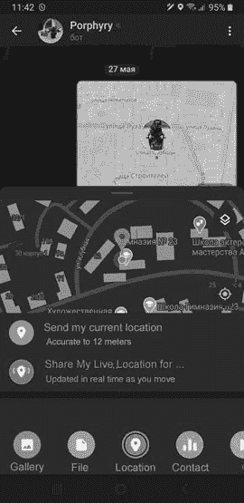

## 第九章：分析位置数据


每一件事都有发生的地点。这就是为什么对象的位置在数据分析中可能与其非空间属性一样重要的原因。实际上，空间数据和非空间数据往往是密切相关的。

例如，考虑一个共享出行应用。你在订车后，可能想要实时追踪汽车在前往你的途中在地图上的位置。你可能还想了解与订单相关的汽车和司机的一些基本非空间信息：如汽车的品牌和型号，司机的评分等。

在上一章中，你了解了如何使用位置数据生成地图。在这一章中，你将学习如何使用 Python 收集和分析位置数据，并且你将看到如何将空间数据和非空间数据整合到分析中。贯穿整个过程，我们将考虑一个出租车管理服务的例子，并试图回答哪个出租车应该被指派给特定任务的核心问题。

## 获取位置数据

执行空间分析的第一步是获取感兴趣对象的位置数据。具体来说，这些位置数据应该是*地理坐标*（简称*geo 坐标*），即纬度和经度值。这种坐标系统使得地球上的每个位置都能用一组数字表示，从而使得这些位置可以通过程序化方式进行分析。在本节中，我们将考虑获取静态和动态物体的 geo 坐标的方法。这将演示我们的出租车服务如何确定顾客的接送位置以及其各种出租车的实时位置。

### 将人类可读的地址转换为地理坐标

大多数人习惯于通过街道名称和楼号来思考，而不是地理坐标。这就是为什么出租车服务、外卖应用等通常允许用户指定接送地点为街道地址。然而，在后台，许多这些服务会将人类可读的地址转换为相应的 geo 坐标。这样，应用就可以利用位置数据进行计算，例如确定离指定接送地点最近的可用出租车。

如何将街道地址转换为地理坐标？一种方法是使用地理编码（Geocoding），这是 Google 提供的一个 API。要从 Python 脚本与 Geocoding API 进行交互，你需要使用 googlemaps 库。通过以下`pip`命令安装它：

```py
$ **pip install -U googlemaps**
```

你还需要通过 Google Cloud 账户获取 Geocoding API 的 API 密钥。有关获取 API 密钥的信息，请参见 [`developers.google.com/maps/documentation/geocoding/get-api-key`](https://developers.google.com/maps/documentation/geocoding/get-api-key)。API 费用结构的详细信息请见 [`cloud.google.com/maps-platform/pricing`](https://cloud.google.com/maps-platform/pricing)。截至本文撰写时，Google 为 API 用户提供每月 200 美元的信用额度，足够你在本书的代码中进行实验。

以下脚本展示了如何使用 googlemaps 调用 Geocoding API 的示例。此调用获取与地址 1600 Amphitheatre Parkway, Mountain View, CA 对应的经纬度坐标：

```py
import googlemaps

gmaps = googlemaps.Client(key='`YOUR_API_KEY_HERE`')
address = '1600 Amphitheatre Parkway, Mountain View, CA'
geocode_result = gmaps.geocode(address)

print(geocode_result[0]['geometry']['location'].values())
```

在此脚本中，你与 API 建立连接并发送你想要转换的地址。API 返回一个具有嵌套结构的 JSON 文档。地理坐标存储在 `location` 键下，该键是 `geometry` 的子字段。在最后一行，你访问并打印坐标，输出如下：

```py
dict_values([37.422388, -122.0841883])
```

### 获取移动物体的地理坐标

你现在知道如何通过街道地址获取一个固定位置的地理坐标，但如何获取一个移动物体的实时地理坐标，比如出租车呢？一些出租车服务可能使用专门的 GPS 设备来实现这一目的，但我们将重点讨论一个低成本、易于实现的解决方案。所需的仅仅是一部智能手机。

智能手机通过内置的 GPS 传感器来检测其位置，并可以调整设置以共享该信息。在这里，我们将探讨如何通过流行的消息应用 Telegram 收集智能手机的 GPS 坐标。使用 Telegram Bot API，你将创建一个*机器人*，即在 Telegram 中运行的应用程序。机器人通常用于自然语言处理，但这个将用于收集并记录选择与机器人共享数据的 Telegram 用户的地理位置数据。

#### 设置 Telegram 机器人

要创建一个 Telegram 机器人，你需要下载 Telegram 应用并创建一个帐户。然后使用智能手机或 PC 按照以下步骤操作：

1.  在 Telegram 应用中，搜索 @BotFather。BotFather 是一个 Telegram 机器人，负责管理你账户中的所有其他机器人。

1.  在 BotFather 页面，点击 **开始**，查看你可以用来设置 Telegram 机器人的命令列表。

1.  在消息框中输入 `/newbot`。系统会提示你为你的机器人设置名称和用户名。然后，你会获得新机器人的授权令牌。记下这个令牌；在编写程序时你会用到它。

完成这些步骤后，你可以使用 python-telegram-bot 库用 Python 实现这个机器人。安装库的方法如下：

```py
$ **pip install python-telegram-bot –upgrade**
```

编写机器人程序所需的工具位于库的 `telegram.ext` 模块中。它是基于 Telegram Bot API 构建的。

#### 编写机器人程序

在这里，你使用 python-telegram-bot 库的`telegram.ext`模块来编程，使机器人监听并记录 GPS 坐标：

```py
from telegram.ext import Updater, MessageHandler, Filters
from datetime import datetime
import csv

❶ def get_location(update, context):
  msg = None
  if update.edited_message:
    msg = update.edited_message
  else:
    msg = update.message
❷ gps = msg.location
  sender = msg.from_user.username
  tm = datetime.now().strftime("%H:%M:%S")
  with open(r'`/HOME/PI/LOCATION_BOT/LOG.CSV`', 'a') as f:
    writer = csv.writer(f)
  ❸ writer.writerow([sender, gps.latitude, gps.longitude, tm])
  ❹ context.bot.send_message(chat_id=msg.chat_id, text=str(gps))

def main():
❺ updater = Updater('`TOKEN`', use_context=True)
❻ updater.dispatcher.add_handler(MessageHandler(Filters.location,
                                 get_location))
  ❼ updater.start_polling()
  ❽ updater.idle()

if __name__ == '__main__':
    main()
```

`main()`函数包含实现 Telegram 机器人脚本中常见的调用。你首先创建一个`Updater`对象❺，并传入你的机器人授权令牌（由 BotFather 生成）。这个对象在脚本中负责协调机器人的执行过程。接着，你使用与`Updater`关联的`Dispatcher`对象，添加一个名为`get_location()`的处理函数，用于处理传入的消息❻。通过指定`Filters.location`，你为该处理函数添加了一个过滤器，使其只在机器人接收到包含发送者位置数据的消息时被调用。你通过调用`Updater`对象的`start_polling()`方法❼来启动机器人。由于`start_polling()`是一个非阻塞方法，你还需要调用`Updater`对象的`idle()`方法❽，以使脚本在收到消息之前保持阻塞状态。

在脚本的开头，你定义了`get_location()`处理函数❶。在处理函数中，你将传入的消息存储为`msg`，然后使用消息的`location`属性❷提取发送者的位置数据。你还会记录发送者的用户名并生成包含当前时间的字符串。然后，使用 Python 的`csv`模块，你将所有这些信息作为一行存储在你选择的位置的 CSV 文件中❸。你还将位置数据传回给发送者，让他们知道他们的位置已经被接收❹。

#### 从机器人获取数据

在一台连接互联网的机器上运行脚本。一旦脚本运行，用户可以按照几个简单的步骤开始与机器人共享实时位置数据：

1.  创建一个 Telegram 账户。

1.  在 Telegram 中，点击机器人的名称。

1.  点击回形针图标，从菜单中选择**位置**。

1.  选择**分享我的位置为**，并设置 Telegram 将与机器人共享实时位置数据的时长。选项包括 15 分钟、1 小时或 8 小时。

图 9-1 中的截图展示了在 Telegram 中分享实时位置是多么简单。



图 9-1：在 Telegram 中分享你智能手机的实时位置

一旦用户开始共享他们的位置数据，机器人将开始以如下所示的行形式将数据发送到 CSV 文件中：

```py
cab_26,43.602508,39.715685,14:47:44
cab_112,43.582243,39.752077,14:47:55
cab_26,43.607480,39.721521,14:49:11
cab_112,43.579258,39.758944,14:49:51
cab_112,43.574906,39.766325,14:51:53
cab_26,43.612203,39.720491,14:52:48
```

每行的第一个字段包含用户名，第二和第三个字段包含用户位置的纬度和经度，第四个字段包含时间戳。对于某些任务，如寻找离特定接送地点最近的车辆，你只需要每辆车的最新一行数据。然而，对于其他任务，如计算一段行程的总距离，多个时间排序的数据行会更有帮助。

## 使用 geopy 和 Shapely 进行空间数据分析

空间数据分析归结为回答关于关系的问题：哪个物体离某个位置最近？两个物体是否位于同一区域？在这一部分中，你将使用两个 Python 库——geopy 和 Shapely，结合我们出租车服务的实例来回答这些常见的空间分析问题。

由于 geopy 设计用于基于地理坐标进行计算，因此它特别适合用来回答关于距离的问题。而 Shapely 专注于定义和分析几何平面，因此它非常适合用来判断一个物体是否位于某个特定区域内。正如你将看到的，这两个库可以在识别最佳出租车时发挥作用。

在继续之前，请按照以下方式安装所需的库：

```py
**$ pip install geopy**
**$ pip install shapely**
```

### 寻找最接近的物体

继续以我们出租车服务的例子，我们将学习如何利用位置数据来识别离接客地点最近的出租车。首先，你需要一些示例位置数据。如果你已经部署了前面部分讨论的 Telegram 机器人，可能已经有了以 CSV 文件形式存在的数据。在这里，你将数据加载到 pandas DataFrame 中，以便轻松地进行排序和过滤：

```py
import pandas as pd
df = pd.read_csv("`HOME/PI/LOCATION_BOT/LOG.CSV`", names=['cab', 'lat',
                                                        'long', 'tm'])
```

如果你没有部署一个 Telegram 机器人，可以创建一个包含一些示例位置数据的元组列表，并将其加载到 DataFrame 中，如下所示：

```py
import pandas as pd
locations = [
  ('cab_26',43.602508,39.715685,'14:47:44'),
  ('cab_112',43.582243,39.752077,'14:47:55'),
  ('cab_26',43.607480,39.721521,'14:49:11'),
  ('cab_112',43.579258,39.758944,'14:49:51'),
  ('cab_112',43.574906,39.766325,'14:51:53'),
 ('cab_26',43.612203,39.720491,'14:52:48')
]

df = pd.DataFrame(locations, columns =['cab', 'lat', 'long', 'tm'])
```

无论哪种方式，你都会得到一个名为 `df` 的 DataFrame，其中包含出租车 ID、纬度、经度和时间戳等列。

该 DataFrame 为每辆出租车包含多行数据，但为了识别离接客地点最近的出租车，你只需要每辆出租车的最新位置。你可以通过如下方式过滤掉不必要的行：

```py
latestrows = df.sort_values(['cab','tm'],ascending=False).drop_duplicates('cab')
```

在这里，你按 `cab` 和 `tm` 字段对行进行降序排序。此操作通过 `cab` 列对数据集进行分组，并将每个出租车组中最新的行排在前面。然后，你应用 `drop_duplicates()` 方法删除每个出租车的除第一行以外的所有行。结果 `latestrows` DataFrame 如下所示：

```py
 cab        lat       long        tm
5   cab_26  43.612203  39.720491  14:52:48
3  cab_112  43.574906  39.766325  14:51:53
```

现在，你拥有了一个仅包含每辆出租车最新位置数据的 DataFrame。为了方便后续计算，你将 DataFrame 转换为一个更简单的 Python 结构——列表的列表。这样，你就可以更容易地将新字段添加到每一行中，例如计算出租车与接客地点之间距离的字段：

```py
latestrows = latestrows.values.tolist()
```

`latestrows` 的 `values` 属性返回一个 NumPy 表示形式的 DataFrame，你可以使用 `tolist()` 将其转换为一个列表的列表。

现在，你准备好计算每辆出租车与接客地点之间的距离了。你将使用 geopy 库，它可以通过几行代码完成此任务。在这里，你使用 geopy 的 `distance` 模块中的 `distance()` 函数来进行必要的计算：

```py
from geopy.distance import distance
pick_up = 43.578854, 39.754995

for i,row in enumerate(latestrows):
❶ dist = distance(pick_up, (row[1],row[2])).m
  print(row[0] + ':', round(dist))
  latestrows[i].append(round(dist))
```

为了简化，你通过手动定义纬度和经度坐标来设置接送地点。然而，在实际操作中，你可能会使用 Google 的地理编码 API，从街道地址自动生成坐标，正如本章前面讨论的那样。接下来，你遍历数据集中的每一行，并通过调用`distance()` ❶计算每辆出租车与接送地点之间的距离。这个函数接受两个包含纬度/经度坐标的元组作为参数。通过添加`.m`，你可以获取以米为单位的距离。为了演示，你会打印每次距离计算的结果，然后将其附加到行尾作为新字段。脚本输出如下：

```py
cab_112: 1015
cab_26: 4636
```

显然，`cab_112`更近，但你如何通过编程来确定这一点呢？使用 Python 内置的`min()`函数，如下所示：

```py
closest = min(latestrows, key=lambda x: x[4])
print('The closest cab is: ', closest[0], ' - the distance in meters: ', closest[4])
```

你将数据传递给`min()`并使用一个 lambda 函数根据每行第`4`列的项目来评估排序顺序。这是新添加的距离计算方法。然后，你将结果以人类可读的格式打印出来，得到如下结果：

```py
The closest cab is:  cab_112  - the distance in meters:  1015
```

在这个例子中，你计算了每辆出租车与接送地点之间的直线距离。虽然这些信息肯定是有用的，但现实中的汽车几乎从不沿着一条完全笔直的路线从一个地方开到另一个地方。街道布局意味着，出租车到达接送地点的实际距离通常会大于直线距离。考虑到这一点，接下来我们将看看一种更可靠的方法来匹配接送地点和出租车。

### 在特定区域中寻找物体

通常，确定适合工作任务的最佳出租车时，正确的问题不是“哪辆出租车离得最近？”，而是“哪辆出租车在一个包含接送地点的特定区域内？”这不仅仅是因为两个点之间的驾驶距离几乎总是大于它们之间的直线距离。在实际操作中，河流或铁路等障碍物常常将地理区域划分为独立的区域，这些区域之间通过桥梁、隧道等有限的连接点相连。这使得直线距离往往具有误导性。考虑图 9-2 中的例子。


图 9-2：像河流这样的障碍物可能会导致距离测量产生误导。

如你所见，在这种情况下，`cab_26`在空间上离接送地点最近，但由于河流的存在，`cab_112`可能能够更快地到达那里。你可以通过查看地图轻松得出这个结论，但如何通过 Python 脚本得出相同的结论呢？一种方法是将区域划分为多个较小的*多边形*，即由一组连接的直线围成的区域，然后检查哪些出租车位于与接送地点相同的多边形内。

在这个具体的例子中，你应该定义一个包含接送地点并沿河流有边界的多边形。你可以通过 Google Maps 手动识别多边形的边界：右键点击几个连接起来形成封闭多边形的点，并记录每个点的地理坐标。一旦获取坐标，你就可以在 Python 中使用 Shapely 库定义该多边形。

以下是如何使用 Shapely 创建一个多边形并检查给定点是否位于该多边形内部的方法：

```py
❶ from shapely.geometry import Point, Polygon

coords = [(46.082991, 38.987384), (46.075489, 38.987599), (46.079395, 
           38.997684), (46.073822, 39.007297), (46.081741, 39.008842)]
❷ poly = Polygon(coords)
❸ cab_26 = Point(46.073852, 38.991890)
cab_112 = Point(46.078228, 39.003949)
pick_up = Point(46.080074, 38.991289)

❹ print('cab_26 within the polygon:', cab_26.within(poly))
print('cab_112 within the polygon:', cab_112.within(poly))
print('pick_up within the polygon:', pick_up.within(poly))
```

首先，导入两个 Shapely 类，`Point` 和 `Polygon` ❶，然后使用一组纬度/经度元组创建一个 `Polygon` 对象 ❷。这个对象表示位于河流北侧的区域，包括接送地点。接下来，创建多个 `Point` 对象，分别表示 `cab_26`、`cab_112` 和接送地点的位置 ❸。最后，执行一系列空间查询，通过 Shapely 的 `within()` 方法检测某个点是否在多边形内部 ❹。最终，脚本应产生以下输出：

```py
cab_26 within the polygon: False
cab_112 within the polygon: True
pick_up within the polygon: True
```

### 结合两种方法

到目前为止，我们通过计算线性距离并在特定区域内找到最接近的出租车来选择最佳的接送出租车。事实上，找到合适的出租车的最准确方法可能是结合这两种方法的元素。这是因为盲目排除所有不在接送位置同一多边形中的出租车并不一定安全。即使考虑到出租车可能需要绕过河流或其他障碍物，位于相邻多边形中的出租车也可能是实际驾车距离最短的。关键是考虑一个多边形和另一个多边形之间的入口点。图 9-3 展示了我们如何考虑这一点。


图 9-3：使用入口点连接相邻区域

图中间的虚线表示将区域分为两个多边形的边界：一个位于河流北侧，另一个位于河流南侧。放置在桥梁上的等号标记了出租车从一个多边形移动到另一个多边形的入口点。对于位于接送地点边界相邻多边形中的出租车，前往接送地点的距离由两个区间组成：出租车当前位置到入口点的区间，以及入口点到接送地点的区间。

为了找到最靠近的出租车，您需要确定每辆出租车所在的多边形，并基于此决定如何计算出租车与接送地点之间的距离：如果出租车在与接送地点相同的多边形内，则计算直接的直线距离；如果出租车在相邻的多边形中，则通过入口点计算距离。这里我们仅对`cab_26`进行这种计算：

```py
from shapely.geometry import Point, Polygon
from geopy.distance import distance

coords = [(46.082991, 38.987384), (46.075489, 38.987599), (46.079395,
           38.997684), (46.073822, 39.007297), (46.081741, 39.008842)]
❶ poly = Polygon(coords)
❷ cab_26 = Point(46.073852, 38.991890)
pick_up = Point(46.080074, 38.991289)
entry_point = Point(46.075357, 39.000298)

if cab_26.within(poly):
❸ dist = distance((pick_up.x, pick_up.y), (cab_26.x,cab_26.y)).m
else:
❹ dist = distance((cab_26.x,cab_26.y), (entry_point.x,entry_point.y)).m +
         distance((entry_point.x,entry_point.y), (pick_up.x, pick_up.y)).m

print(round(dist))
```

脚本同时使用了 Shapely 和 geopy。首先，您定义一个包含接送地点的 Shapely `Polygon` 对象，如之前所示 ❶。接着，您定义`Point`对象，分别表示出租车、接送地点和入口点 ❷。然后，借助 geopy 的`distance()`函数计算距离（单位为米）。如果出租车在多边形内，您可以直接计算出租车和接送地点之间的距离 ❸。如果不在，您首先计算出租车与入口点之间的距离，再计算入口点与接送地点之间的距离，将两者相加得到总距离 ❹。以下是结果：

```py
1544
```

## 结合空间数据与非空间数据

迄今为止，在本章中，您主要处理了空间数据，但需要意识到，空间分析往往也需要考虑非空间数据。例如，如果您不知道某个物品在店内是否有货，那么知道商店位于离您当前位置 10 英里以内又有什么用？又比如，回到出租车的例子，如果您知道如何找出离接送地点最近的出租车，但不知道该出租车是否有空，或者是否正在服务其他订单，又有何意义呢？在本节中，我们将探讨如何将非空间数据纳入空间分析中。

### 推导非空间属性

关于当前出租车可用性的信息可以通过包含乘车订单的数据集来获取。一旦订单被分配给某辆出租车，该信息可能会被放入一个`orders`数据结构中，其中订单按状态列出，状态可能是“开放”（进行中）或“关闭”（已完成）。根据这种方案，仅识别出那些“开放”的订单可以告诉您哪些出租车无法接受新的订单。以下是如何在 Python 中实现这一逻辑：

```py
import pandas as pd
orders = [
  ('order_039', 'open', 'cab_14'),
 ('order_034', 'open', 'cab_79'),
  ('order_032', 'open', 'cab_104'),
  ('order_026', 'closed', 'cab_79'),
  ('order_021', 'open', 'cab_45'),
  ('order_018', 'closed', 'cab_26'),
  ('order_008', 'closed', 'cab_112')
]

df_orders = pd.DataFrame(orders, columns =['order','status','cab'])
df_orders_open = df_orders[df_orders['status']=='open']
unavailable_list = df_orders_open['cab'].values.tolist()
print(unavailable_list)
```

本例中使用的`orders`元组列表可能来自一个更完整的数据集，例如过去两小时内所有已开订单的集合，数据集包含每个订单的附加信息（如接送地点、送达地点、开始时间、结束时间等）。为了简化起见，这里数据集已被简化为仅包含当前任务所需的字段。您将列表转换为 DataFrame，然后筛选出状态为`open`的订单。最后，您将 DataFrame 转换为仅包含`cab`列值的列表。这个包含不可用出租车的列表如下所示：

```py
['cab_14', 'cab_79', 'cab_104', 'cab_45']
```

拥有了这个列表之后，你需要检查其他出租车，并确定哪个出租车最接近接送地点。将以下代码附加到之前的脚本：

```py
from geopy.distance import distance
pick_up = 46.083822, 38.967845
cab_26 = 46.073852, 38.991890
cab_112 = 46.078228, 39.003949
cab_104 = 46.071226, 39.004947
cab_14 = 46.004859, 38.095825
cab_79 = 46.088621, 39.033929
cab_45 = 46.141225, 39.124934
cabs = {'cab_26': cab_26, 'cab_112': cab_112, 'cab_14': cab_14,
        'cab_104': cab_104, 'cab_79': cab_79, 'cab_45': cab_45}
dist_list = []

for cab_name, cab_loc in cabs.items():
  if cab_name not in unavailable_list:
    dist = distance(pick_up, cab_loc).m
    dist_list.append((cab_name, round(dist)))

print(dist_list)
print(min(dist_list, key=lambda x: x[1]))
```

为了示例的目的，你手动定义了接送地点和所有出租车的地理坐标作为元组，并将出租车的坐标发送到一个字典中，字典的键是出租车名称。然后，你遍历字典，对于每辆不在`unavailable_list`中的出租车，使用 geopy 计算出租车与接送地点之间的距离。最后，你打印出所有可用出租车的完整列表及其到接送地点的距离，以及仅打印出最近的出租车，输出如下：

```py
[('cab_26', 2165), ('cab_112', 2861)]
('cab_26', 2165)
```

在这种情况下，`cab_26`是最近的可用出租车。

### 空间数据和非空间数据的结合

在之前的示例中，你将空间数据（每辆出租车的位置）和非空间数据（哪些出租车可用）保存在不同的数据结构中。然而，有时将空间数据和非空间数据结合在同一结构中可能会更有利。

考虑到出租车可能需要满足除可用性外的其他条件才能被分配到订单。例如，客户可能需要带有婴儿座椅的出租车。为了找到合适的出租车，你需要依赖一个数据集，该数据集包含出租车的非空间信息，以及每辆出租车与接送地点的距离。对于前者，你可以使用一个仅包含两列的数据集：出租车名称和是否有婴儿座椅。你可以在这里创建它：

```py
cabs_list = [
  ('cab_14',1),
  ('cab_79',0),
  ('cab_104',0),
  ('cab_45',1),
  ('cab_26',0),
  ('cab_112',1)
]
```

第二列中带有`1`的出租车包含婴儿座椅。接下来，你将列表转换为 DataFrame。你还将创建一个第二个 DataFrame，来自`dist_list`，即你在前一部分中生成的可用出租车及其到达接送地点的距离列表：

```py` ``` df_cabs = pd.DataFrame(cabs_list, columns =['cab', 'seat']) df_dist = pd.DataFrame(dist_list, columns =['cab', 'dist']) ```py    You now merge these DataFrames based on the `cab` column:    ``` df = pd.merge(df_cabs, df_dist, on='cab', how='inner') ```py    You use an inner join, meaning only cabs included in both `df_cabs` and `df_dist` make it into the new DataFrame. In practice, since `df_dist` contains only cabs that are currently available, this excludes unavailable cabs from the result set. The merged DataFrame now includes both spatial data (each cab’s distance to the pick-up place) and nonspatial data (whether or not each cab has a baby seat):    ```  cab  seat  dist 0   cab_26     0  2165 1  cab_112     1  2861 ```py    You convert the DataFrame into a list of tuples, which you then filter, leaving only the rows where the `seat` field is set to `1`:    ``` result_list = list(df.itertuples(index=False,name=None)) result_list = [x for x in result_list if x[1] == 1] ```py    You use the DataFrame’s `itertuples()` method to convert each row into a tuple, then you wrap the tuples into a list with the `list()` function.    The final step is to determine the row with the lowest value in the distance field, which is identified by index `2`:    ``` print(min(result_list, key=lambda x: x[2])) ```py    Here’s the result:    ``` ('cab_112', 1, 2861) ```py    Compare this to the result shown at the end of the previous section. As you can see, the need for a baby seat led us to choose a different cab for the job.    ## Summary    Using the real-world example of a taxi service, this chapter illustrated how you can perform spatial data analyses. To start with, you looked at an example of turning a human-readable address into geo coordinates using Google’s Geocoding API and the googlemaps Python library. Then you learned to use a Telegram bot to collect location data from smartphones. Next, you used the geopy and Shapely libraries to perform fundamental geospatial operations, such as measuring the distance between points and determining if points are within a certain area. With the help of these libraries, built-in Python data structures, and pandas DataFrames, you designed an application to identify the best cab for a given pick-up based on various spatial and nonspatial criteria. ```
