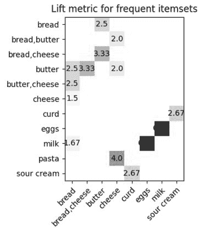

## 第十一章：从数据中获取洞察


公司每天生成大量的数据，以原始事实、数字和事件的形式存在，但所有这些数据到底告诉了你什么？要从数据中提取知识并获得洞察，您需要将其转换、分析和可视化。换句话说，您需要将原始数据转化为可以用来做决策、回答问题和解决问题的有意义信息。

考虑一个收集大量客户交易数据的超市的情况。超市的分析师可能有兴趣研究这些数据，以洞察客户的购买偏好。特别是，他们可能希望执行*市场篮子分析*，这是一种分析交易并识别常一起购买的物品的数据挖掘技术。有了这些知识，超市可以做出更加明智的业务决策，例如关于商店内物品的布局或如何将物品捆绑成折扣。

在本章中，我们将详细探讨这个例子，通过 Python 执行市场篮子分析，深入分析如何从交易数据中获取洞察。您将学习如何使用 mlxtend 库和 Apriori 算法识别常一起购买的项目，并了解如何利用这些知识做出明智的业务决策。

尽管识别购买者偏好是本章的重点，但这并不是市场篮子分析的唯一应用。该技术还用于电信、网络使用挖掘、银行和医疗等领域。例如，在网络使用挖掘中，市场篮子分析可以确定网页用户下一步可能去哪里，并生成经常一起访问的页面的关联。

## 关联规则

市场篮子分析是衡量对象之间基于它们在相同交易中共同出现的关系强度的技术。对象之间的关系表示为*关联规则*，如下所示：

```py
X -> Y
```

`X` 和 `Y`，分别被称为*前项*和*后项*规则，表示从被挖掘的交易数据中分组的不同*项目集*，或者一个或多个项的组。例如，描述*curd*和*sour cream*项之间关系的关联规则将如下所示：

```py
curd -> sour cream
```

在这种情况下，`curd`是前项，`sour cream`是后项。规则断言购买 curd 的人也可能购买 sour cream。

单独看这样一条关联规则，其实并不能告诉你太多。成功的市场篮分析的关键在于利用交易数据根据各种指标评估关联规则的强度。为了演示这一点，我们用一个简单的例子。假设我们有 100 笔顾客交易，其中 25 笔包含奶酪，30 笔包含酸奶油。在这 30 笔包含酸奶油的交易中，有 20 笔同时包含奶酪。表 11-1 汇总了这些数据。

表 11-1：奶酪和酸奶油的交易数据

|  | **奶酪** | **酸奶油** | **奶酪和酸奶油** | **总计** |
| --- | --- | --- | --- | --- |
| **交易数量** | 25 | 30 | 20 | 100 |

根据这些交易数据，我们可以使用支持度、置信度和提升度等指标来评估 `奶酪 -> 酸奶油` 关联规则的强度。这些指标将帮助我们判断奶酪和酸奶油之间是否确实存在关联。

### 支持度

*支持度*是至少包含一个项目的交易占总交易数的比例。例如，可以如下计算样本交易数据中奶酪的支持度：

```py
support(curd) = curd/total = 25/100 = 0.25
```

在关联规则的上下文中，支持度是同时包含前件和后件的交易占总交易数的比例。因此，`奶酪 -> 酸奶油` 关联规则的支持度为：

```py
support(curd -> sour cream) = (curd & sour cream)/total = 20/100 = 0.2
```

支持度指标的范围是 0 到 1，它告诉你一个项目集在交易中出现的百分比。在这种情况下，我们可以看到 20% 的交易同时包含了奶酪和酸奶油。对于任何给定的关联规则，支持度是对称的；也就是说，`奶酪 -> 酸奶油` 的支持度与 `酸奶油 -> 奶酪` 的支持度是相同的。

### 置信度

关联规则的 *置信度* 是同时购买前件和后件的交易占购买前件的交易数的比例。换句话说，置信度衡量的是包含前件的交易中有多少比例也包含后件。可以如下计算 `奶酪 -> 酸奶油` 关联规则的置信度：

```py
confidence(curd -> sour cream) = (curd & sour cream)/curd = 20/25 = 0.8
```

你可以将其理解为，如果一个顾客购买了奶酪，那么他们有 80% 的可能性也购买了酸奶油。

和支持度一样，置信度的范围是从 0 到 1，但与支持度不同的是，置信度并不是对称的。这意味着规则 `奶酪 -> 酸奶油` 的置信度可能与规则 `酸奶油 -> 奶酪` 的置信度不同，如下所示：

```py
confidence(sour cream -> curd) = (curd & sour cream)/sour cream = 20/30 = 0.66
```

在这种情况下，当关联规则的前件和后件位置交换时，你会得到一个较低的置信度值。这告诉你，购买酸奶油的人同时购买奶酪的可能性低于购买奶酪的人同时购买酸奶油的可能性。

### 提升度

*提升*评估关联规则的强度，相对于规则中出现的项的随机共现情况。关联规则`酸奶 -> 酸奶油`的提升值是观察到的`酸奶 -> 酸奶油`支持度与假设酸奶和酸奶油彼此独立时预期的支持度之比。可以通过以下公式计算：

```py
lift(sour cream -> curd) = support(curd & sour cream)/(support(curd)*support(sour cream))
                         = 0.2/(0.25*0.3) = 2.66
```

提升值是对称的——如果你交换前件和后件，提升值保持不变。提升值的可能范围是从 0 到无穷大，提升比率越大，关联性越强。特别地，提升比率大于 1 表明前件和后件之间的关系比它们独立时预期的要强，这意味着这两个项目经常一起被购买。提升比率等于 1 表示前件和后件之间没有相关性。提升比率小于 1 则表示前件和后件之间存在负相关，意味着它们不太可能一起被购买。在这种情况下，你可以将提升比率 2.66 解释为：当顾客购买酸奶时，预期他们购买酸奶油的概率增加了 166%。

## Apriori 算法

你已经了解了什么是关联规则，并看到了评估其强度的一些指标，但你如何实际生成市场篮子分析的关联规则呢？一种方法是使用*Apriori 算法*，这是一种自动化的交易数据分析过程。一般来说，该算法由两个步骤组成：

1.  在数据集中识别所有的*频繁项集*，即出现在许多交易中的一个或多个项目的组合。该算法通过找到所有支持度值超过某个阈值的项目或项目组合来实现这一点。

1.  通过考虑每个频繁项集的所有可能的二元分割（即将项集分为前件组和后件组的所有划分），并为每个划分计算一组关联指标，来生成这些频繁项集的关联规则。

一旦生成了关联规则，你可以根据前一节中讨论的指标来评估它们。

有几个第三方 Python 库提供了 Apriori 算法的实现。其中一个是 mlxtend 库。mlxtend 是*机器学习扩展*的缩写，包含了执行许多常见数据科学任务的工具。在本节中，我们将通过一个使用 mlxtend 的 Apriori 算法实现的市场篮子分析示例来演示。但首先，使用`pip`安装 mlxtend 库，如下所示：

```py
$ **pip install mlxtend**
```

### 创建交易数据集

为了进行市场篮子分析，你需要一些样本交易数据。为了简化，可以只使用几个交易数据，定义为如下所示的列表列表：

```py
transactions = [
 ['curd', 'sour cream'], ['curd', 'orange', 'sour cream'],
 ['bread', 'cheese', 'butter'], ['bread', 'butter'], ['bread', 'milk'],
 ['apple', 'orange', 'pear'], ['bread', 'milk', 'eggs'], ['tea', 'lemon'],
 ['curd', 'sour cream', 'apple'], ['eggs', 'wheat flour', 'milk'],
 ['pasta', 'cheese'], ['bread', 'cheese'], ['pasta', 'olive oil', 'cheese'],
 ['curd', 'jam'], ['bread', 'cheese', 'butter'],
 ['bread', 'sour cream', 'butter'], ['strawberry', 'sour cream'],
 ['curd', 'sour cream'], ['bread', 'coffee'], ['onion', 'garlic']
]
```

每个内层列表包含单个交易的项集，而整个 `transactions` 列表包含 20 笔交易。为了保持原始酸奶/酸奶油示例中定义的数量比例，数据集包含五笔包含酸奶的交易，六笔包含酸奶油的交易，以及四笔同时包含酸奶和酸奶油的交易。

为了通过 mlxtend 的 Apriori 算法处理交易数据，你需要将其转换为 *独热编码布尔数组*，这种结构中每一列代表一个可以购买的商品，每一行代表一笔交易，每个值要么是 `True`（如果交易中包括该商品），要么是 `False`（如果交易中不包括该商品）。在这里，你通过 mlxtend 的 `TransactionEncoder` 对象执行必要的转换：

```py
import pandas as pd
from mlxtend.preprocessing import TransactionEncoder

❶ encoder = TransactionEncoder()
❷ encoded_array = encoder.fit(transactions).transform(transactions)
❸ df_itemsets = pd.DataFrame(encoded_array, columns=encoder.columns_)
```

你创建一个 `TransactionEncoder` 对象 ❶ 并使用它将 `transactions` 列表列表转换为一个名为 `encoded_array` 的独热编码布尔数组 ❷。然后你将这个数组转换为一个名为 `df_itemsets` 的 pandas DataFrame ❸，其片段如下所示：

```py
 apple  bread  butter  cheese  coffee   curd   eggs  ...
0   False  False   False   False   False   True  False  ...
1   False  False   False   False   False   True  False  ...
2   False   True    True    True   False  False  False  ...
3   False   True    True   False   False  False  False  ...
4   False   True   False   False   False  False  False  ...
5    True  False   False   False   False  False  False  ...
6   False   True   False   False   False  False   True  ...
`--snip--`

[20 rows x 20 columns]
```

该 DataFrame 由 20 行和 20 列组成，行代表交易，列代表商品。为了确认原始的列表列表包含 20 笔交易并涉及 20 个可能的商品，可以使用以下代码：

```py
print('Number of transactions: ', len(transactions))
print('Number of unique items: ', len(set(sum(transactions, []))))
```

在这两种情况下，你应该得到 `20`。

### 识别频繁项集

现在，交易数据已经是可用格式，你可以使用 mlxtend 的 `apriori()` 函数来识别交易数据中的所有频繁项集——也就是说，识别所有支持度足够高的商品或商品组合。操作如下：

```py
from mlxtend.frequent_patterns import apriori
frequent_itemsets = apriori(df_itemsets, min_support=0.1, use_colnames=True)
```

你从 `mlxtend.frequent_patterns` 模块导入 `apriori()` 函数。然后调用该函数，将包含交易数据的 DataFrame 作为第一个参数传递。你还将 `min_support` 参数设置为 `0.1`，以返回至少支持度为 10% 的项集。（记住，支持度指标表示某个商品或商品组合出现在交易中的百分比。）你将 `use_colnames` 设置为 `True`，以通过名称（如 `curd` 或 `sour cream`）而非索引号来识别每个项集中的列。结果，`apriori()` 返回如下 DataFrame：

```py
 support                 itemsets
0      0.10                  (apple)
1      0.40                  (bread)
2      0.20                 (butter)
3      0.25                 (cheese)
4      0.25                   (curd)
5      0.10                   (eggs)
6      0.15                   (milk)
7      0.10                 (orange)
8      0.10                  (pasta)
9      0.30             (sour cream)
10     0.20          (bread, butter)
11     0.15          (bread, cheese)
12     0.10            (bread, milk)
13     0.10         (cheese, butter)
14     0.10          (pasta, cheese)
15     0.20       (sour cream, curd)
16     0.10             (milk, eggs)
17     0.10  (bread, cheese, butter)
```

如前所述，项集可以由一个或多个商品组成，实际上，`apriori()` 返回了几个单一商品的项集。最终，mlxtend 在生成关联规则时会忽略这些单一商品的项集，但在成功生成规则时，仍然需要 *所有* 频繁项集的数据（包括那些只有一个商品的项集）。不过，出于兴趣，你此时可能希望仅查看包含多个商品的项集。为此，首先在 `frequent_itemsets` DataFrame 中添加一个 `length` 列，如下所示：

```py
**frequent_itemsets['length'] = frequent_itemsets['itemsets'].apply(lambda itemset: len(itemset))**
```

然后，使用 pandas 的选择语法来过滤 DataFrame，仅保留 `length` 字段值为 `2` 或更多的行：

```py
**print(frequent_itemsets[frequent_itemsets['length'] >= 2])**
```

你将看到以下结果，且没有任何单一项项集：

```py
10     0.20          (bread, butter)       2
11     0.15          (bread, cheese)       2
12     0.10            (bread, milk)       2
13     0.10         (cheese, butter)       2
14     0.10          (pasta, cheese)       2
15     0.20       (sour cream, curd)       2
16     0.10             (milk, eggs)       2
17     0.10  (bread, cheese, butter)       3
```

然而，值得重申的是，mlxtend 在生成关联规则时需要所有频繁项集的信息。因此，请确保你没有从原始 `frequent_itemsets` DataFrame 中删除任何行。

### 生成关联规则

你已经找出了所有满足所需支持度阈值的项集。Apriori 算法的第二步是为这些项集生成关联规则。为此，你使用 mlxtend `frequent_patterns` 模块中的 `association_rules()` 函数：

```py
from mlxtend.frequent_patterns import association_rules
rules = association_rules(frequent_itemsets, metric="confidence", min_threshold=0.5)
```

在这里，你调用 `association_rules()` 函数，将 `frequent_itemsets` DataFrame 作为第一个参数传入。你还选择了一个用于评估规则的指标，并设置了该指标的阈值。具体来说，你指定该函数仅返回置信度指标为 0.5 或更高的关联规则。如前一节所述，函数会自动跳过生成单一项集的规则。

`association_rules()` 函数返回以 DataFrame 形式表示的规则，每一行代表一个关联规则。该 DataFrame 包含前提、后果和各种指标的列，包括支持度、置信度和提升度。在这里，你可以打印出选择的列：

```py
print(rules.iloc[:,0:7])
```

你将看到以下输出：

```py
 antecedents    consequents  antecedent sup. consequent sup.  support  confidence    lift
0          (bread)       (butter)           0.40            0.20     0.20    0.500000 2.500000
1         (butter)        (bread)           0.20            0.40     0.20    1.000000 2.500000
2         (cheese)        (bread)           0.25            0.40     0.15    0.600000 1.500000
3           (milk)        (bread)           0.15            0.40     0.10    0.666667 1.666667
4         (butter)       (cheese)           0.20            0.25     0.10    0.500000 2.000000
5          (pasta)       (cheese)           0.10            0.25     0.10    1.000000 4.000000
6     (sour cream)         (curd)           0.30            0.25     0.20    0.666667 2.666667
7           (curd)   (sour cream)           0.25            0.30     0.20    0.800000 2.666667
8           (milk)         (eggs)           0.15            0.10     0.10    0.666667 6.666667
9           (eggs)         (milk)           0.10            0.15     0.10    1.000000 6.666667
10 (bread, cheese)       (butter)           0.15            0.20     0.10    0.666667 3.333333
11 (bread, butter)       (cheese)           0.20            0.25     0.10    0.500000 2.000000
12(cheese, butter)        (bread)           0.10            0.40     0.10    1.000000 2.500000
13        (butter)(bread, cheese)           0.20            0.15     0.10    0.500000 3.333333

[14 rows x 7 columns]
```

看这些规则，有些可能显得冗余。例如，既有 `bread -> butter` 规则，又有 `butter -> bread` 规则。同样，也有多个基于 `(bread, cheese, butter)` 项集的规则。部分原因是，正如本章早些时候提到的，置信度并不是对称的；如果你交换规则中的前提和后果，置信度值可能会变化。此外，对于一个三项项集，提升度也可能会根据哪些项目是前提，哪些是后果而发生变化。因此，`(bread, cheese) -> butter` 的提升度与 `(bread, butter) -> cheese` 的提升度不同。

## 可视化关联规则

正如你在第八章中学到的，数据可视化是一种简单而强大的分析技术。在市场购物篮分析的背景下，可视化提供了一种便捷的方式，通过查看不同前提/后果对的指标来评估一组关联规则的强度。在这一节中，你将使用 Matplotlib 将前一节生成的关联规则可视化为带注释的热力图。

*热力图* 是一种网格状的图表，其中的单元格通过颜色编码来表示其值。在这个例子中，你将创建一个显示各种关联规则提升度的热力图。你将把所有前提沿着 y 轴排列，后果沿着 x 轴排列，并在规则的前提和后果相交的区域填充颜色，以表示该规则的提升度。颜色越深，提升度越高。

要创建可视化，首先创建一个空的 DataFrame，并将之前创建的 `rules` DataFrame 中的 `antecedents`、`consequents` 和 `lift` 列复制到其中：

```py
rules_plot = pd.DataFrame()
rules_plot['antecedents']= rules['antecedents'].apply(lambda x: ','.join(list(x)))
rules_plot['consequents']= rules['consequents'].apply(lambda x: ','.join(list(x)))
rules_plot['lift']= rules['lift'].apply(lambda x: round(x, 2))
```

您使用 lambda 函数将 `rules` DataFrame 中 `antecedents` 和 `consequents` 列的值转换为字符串，这样可以更方便地将它们用作可视化中的标签。最初，值是 frozenset 类型，即 Python 集合的不可变版本。您使用另一个 lambda 函数将 lift 值四舍五入到小数点后两位。

接下来，您需要将新创建的 `rules_plot` DataFrame 转换为一个矩阵，用于创建热图，其中后件水平排列，前件垂直排列。为此，您可以重塑 `rules_plot`，使得 `antecedents` 列中的唯一值形成索引，`consequents` 列中的唯一值成为新列，而 `lift` 列的值用于填充重塑后的 DataFrame 值。您可以使用 `rules_plot` DataFrame 的 `pivot()` 方法，如下所示：

```py
pivot = rules_plot.pivot(index = 'antecedents', columns = 'consequents', values= 'lift')
```

您指定 `antecedents` 和 `consequents` 列作为结果 `pivot` DataFrame 的轴，并用 `lift` 列作为值。如果打印 `pivot`，它将如下所示：

```py
consequents    bread  butter  cheese  cheese,bread  curd  eggs  milk  sour cream
antecedents                                                                     
bread            NaN    2.50     NaN           NaN   NaN   NaN   NaN         NaN
bread,butter     NaN     NaN     2.0           NaN   NaN   NaN   NaN         NaN
butter          2.50     NaN     2.0          3.33   NaN   NaN   NaN         NaN
cheese          1.50     NaN     NaN           NaN   NaN   NaN   NaN         NaN
cheese,bread     NaN    3.33     NaN           NaN   NaN   NaN   NaN         NaN
cheese,butter   2.50     NaN     NaN           NaN   NaN   NaN   NaN         NaN
curd             NaN     NaN     NaN           NaN   NaN   NaN   NaN        2.67
eggs             NaN     NaN     NaN           NaN   NaN   NaN  6.67         NaN
milk            1.67     NaN     NaN           NaN   NaN  6.67   NaN         NaN
pasta            NaN     NaN     4.0           NaN   NaN   NaN   NaN         NaN
sour cream       NaN     NaN     NaN           NaN  2.67   NaN   NaN         NaN
```

该 DataFrame 包含构建热图所需的一切：索引的值（前件）将成为 y 轴标签，列名（后件）将成为 x 轴标签，数字和 `NaN` 的网格将成为绘图的值。（在此上下文中，`NaN` 表示未为该前件/后件对生成关联规则。）在这里，您将这些组件提取到单独的变量中：

```py
antecedents = list(pivot.index.values)
consequents = list(pivot.columns)
import numpy as np
pivot = pivot.to_numpy()
```

现在，您已经有了 `antecedents` 列表中的 y 轴标签，`consequents` 列表中的 x 轴标签，以及 `pivot` NumPy 数组中的绘图值。您将使用以下脚本中的所有组件来使用 Matplotlib 构建热图：

```py
import matplotlib
import matplotlib.pyplot as plt
import numpy as np
fig, ax = plt.subplots()
❶ im = ax.imshow(pivot, cmap = 'Reds')
ax.set_xticks(np.arange(len(consequents)))
ax.set_yticks(np.arange(len(antecedents)))
ax.set_xticklabels(consequents)
ax.set_yticklabels(antecedents)
❷ plt.setp(ax.get_xticklabels(), rotation=45, ha="right",
         rotation_mode="anchor")
❸ for i in range(len(antecedents)):
  for j in range(len(consequents)):
  ❹ if not np.isnan(pivot[i, j]):
    ❺ text = ax.text(j, i, pivot[i, j], ha="center", va="center")
ax.set_title("Lift metric for frequent itemsets")
fig.tight_layout()
plt.show()
```

绘制 Matplotlib 图表的关键点已在第八章中介绍。这里，我们只考虑与此特定示例相关的代码行。`imshow()` 方法将 `pivot` 数组中的数据转换为颜色编码的 2D 图像 ❶。通过该方法的 `cmap` 参数，您可以指定如何将数组中的数值映射到颜色。Matplotlib 提供了多个内置的颜色映射供您选择，其中包括此处使用的 `Reds` 映射。

在创建坐标轴标签后，你使用`setp()`方法将 x 轴标签旋转 45 度 ❷。这样可以帮助将标签适配到分配的水平空间内。然后，你遍历 `pivot` 数组中的数据 ❸，并使用 `text()` 方法为热力图中的每个方格创建文本注释 ❺。前两个参数，`j` 和 `i`，是标签的 x 和 y 坐标。下一个参数，`pivot[i, j]`，是标签的文本，剩余的参数设置标签的对齐方式。在调用 `text()` 方法之前，你使用 `if` 语句过滤掉没有任何提升度数据的前置/后置项对 ❹。否则，热力图中的每个空白方格会显示 `NaN` 标签。

图 11-1 展示了结果可视化。



图 11-1：样本关联规则的提升度热力图

热力图帮助你通过阴影的深浅立即看到哪些关联规则具有最高的提升度值。通过观察这个可视化图表，你可以非常确定地说，购买牛奶的顾客也很可能购买鸡蛋。同样，你可以相当确定购买意大利面条的顾客也会购买奶酪。其他关联规则，例如黄油与奶酪的关系也存在，但正如你所见，它们并没有像前者那样得到提升度指标的强有力支持。

热力图还说明了提升度指标的对称性。例如，看看 `bread -> butter` 和 `butter -> bread` 规则的值。它们是一样的。然而，你可能会注意到，图中的某些前置/后置项对并没有对称的提升度值。例如，`cheese -> bread` 规则的提升度显示为 `1.5`，但图中没有显示 `bread -> cheese` 的提升度值。这是因为在最初使用 mlxtend 的 `association_rules()` 函数生成关联规则时，你设置了 50% 的置信度阈值。这排除了许多潜在的关联规则，包括 `bread -> cheese`，它的置信度为 37.5%，而 `cheese -> bread` 的置信度为 60%。因此，没有数据可供绘制 `bread -> cheese` 规则。

## 从关联规则中获得可操作的见解

使用 Apriori 算法，你从一批交易数据中识别出了频繁项集，并基于这些项集生成了关联规则。这些规则本质上告诉你，如果顾客购买了一种产品，他们购买另一种产品的可能性有多大。通过在热力图上可视化规则的提升度指标，你看到了哪些规则特别具有说服力。接下来需要考虑的合理问题是，企业如何从这些信息中获益。

在本节中，我们将探讨企业如何从关联规则集中提取有用的见解的两种不同方法。我们将研究如何基于客户已购买的商品生成产品推荐，以及如何围绕频繁项集高效地规划折扣。这两种应用不仅能为企业增加收入，还能为客户提供更好的体验。

### 生成推荐

在顾客的购物篮中出现一个商品后，下一个可能被添加的商品是什么？当然，你不能完全确定，但你可以根据从交易数据中挖掘出来的关联规则做出预测。这个预测的结果可以作为一组推荐的基础，推荐那些与当前购物篮中的商品经常一起购买的商品。零售商常常利用这些推荐向顾客展示他们可能想购买的其他商品。

生成此类推荐最自然的方式或许是查看所有当前购物篮中商品作为前项的关联规则。然后，找出最强的规则——可能是三个具有最高置信度值的规则——并提取它们的后项。以下示例演示了如何针对商品*黄油*进行此操作。你首先找到*黄油*作为前项的规则，使用 pandas 库的过滤功能：

```py
butter_antecedent = rules[rules['antecedents'] == {'butter'}][['consequents','confidence']]
            .sort_values('confidence', ascending = False)
```

在这里，你按 `confidence` 列对规则进行排序，这样置信度最高的规则就会出现在 `butter_antecedent` 数据框的前面。接着，你使用列表推导提取前三个后项：

```py
butter_consequents = [list(item) for item in butter_antecedent.iloc[0:3:,]['consequents']]
```

在这个列表推导中，你遍历 `butter_antecedent` 数据框中的 `consequents` 列，提取前三个值。基于 `butter_consequents` 列表，你可以生成一个推荐：

```py
item = 'butter'
print('Items frequently bought together with', item, 'are:', butter_consequents)
```

推荐将如下所示：

```py
Items frequently bought together with butter are: [['bread'], ['cheese'], ['cheese', 'bread']]
```

这表明购买黄油的顾客也常常购买面包或奶酪，或者两者都买。

### 基于关联规则规划折扣

为频繁项集生成的关联规则也可以用于选择哪些产品进行折扣。理想情况下，你应该在每个重要的产品组中都有一个折扣商品，以满足尽可能多的客户。换句话说，你应该在每个频繁项集中选择一个商品进行折扣。

为了实现这一点，首先你需要一组频繁项集来进行处理。不幸的是，`association_rules()` 函数之前生成的 `rules` 数据框有前项和后项列，但没有规则的完整项集。因此，你需要通过合并 `antecedents` 和 `consequents` 列来创建一个 `itemsets` 列，如下所示：

```py
from functools import reduce
rules['itemsets'] = rules[['antecedents', 'consequents']].apply(lambda x:
                reduce(frozenset.union, x), axis=1)
```

你使用 Python 的`functools`模块中的`reduce()`函数，将`frozenset.union()`方法应用于`antecedents`和`consequents`列的值。这会将这两列中的单独 frozenset 合并成一个 frozenset。

若要查看结果，你可以打印新创建的`itemsets`列，以及`antecedents`和`consequents`列：

```py
print(rules[['antecedents','consequents','itemsets']])
```

输出将如下所示：

```py
 antecedents      consequents                 itemsets
0           (butter)          (bread)          (butter, bread)
1            (bread)         (butter)          (butter, bread)
2           (cheese)          (bread)          (bread, cheese)
3             (milk)          (bread)            (milk, bread)
4           (butter)         (cheese)         (butter, cheese)
5            (pasta)         (cheese)          (pasta, cheese)
6       (sour cream)           (curd)       (sour cream, curd)
7             (curd)     (sour cream)       (sour cream, curd)
8             (milk)           (eggs)             (milk, eggs)
9             (eggs)           (milk)             (milk, eggs)
10  (butter, cheese)          (bread)  (bread, butter, cheese)
11   (butter, bread)         (cheese)  (butter, cheese, bread)
12   (bread, cheese)         (butter)  (bread, butter, cheese)
13          (butter)  (bread, cheese)  (butter, cheese, bread)
```

请注意，新`itemsets`列中有一些重复项。正如前面讨论的，相同的项集可能形成多个关联规则，因为商品的顺序会影响某些规则度量。不过，对于当前任务，项集中的商品顺序并不重要，因此你可以安全地移除重复的项集，如下所示：

```py
rules.drop_duplicates(subset=['itemsets'], keep='first', inplace=True)
```

你使用 DataFrame 的`drop_duplicates()`方法，指定检查`itemsets`列中的重复项。你保留一组重复项中的第一行，并通过设置`inplace`为`True`，直接从现有的 DataFrame 中删除重复行，而不是创建一个新的 DataFrame 来移除重复项。

如果你现在打印出`itemsets`列：

```py
print(rules['itemsets'])
```

你将只看到以下内容：

```py
0             (bread, butter)
2             (bread, cheese)
3               (bread, milk)
4            (butter, cheese)
5             (cheese, pasta)
6          (curd, sour cream)
8                (milk, eggs)
10    (bread, cheese, butter)
```

接下来，你从每个项集中选择一个商品进行折扣：

```py
discounted = []
others = []
❶ for itemset in rules['itemsets']:
❷ for i, item in enumerate(itemset):
  ❸ if item not in others:
    ❹ discounted.append(item)
      itemset = set(itemset)
      itemset.discard(item)
    ❺ others.extend(itemset)
      break
  ❻ if i == len(itemset)-1:
      discounted.append(item)
      itemset = set(itemset)
      itemset.discard(item)
      others.extend(itemset)
print(discounted)
```

你首先创建`discounted`列表来积累被选择为折扣商品的商品，并创建`others`列表来接收项集中未被选择为折扣商品的商品。然后你遍历每个项集❶和项集中的每个商品❷。你会查找一个未包含在`others`列表中的商品，因为这种商品要么不在任何前面的项集中，要么已经被选为前一个项集的折扣商品，这意味着选择它作为当前项集的折扣商品也是高效的❸。你将选择的商品发送到`discounted`列表❹，然后将项集中其余的商品发送到`others`列表❺。如果你遍历完项集中的所有商品后，仍未找到一个不在`others`列表中的商品，那么你选择项集中的最后一个商品，并将其发送到`discounted`列表❻。

结果的`discounted`列表会有所不同，因为表示项集的 Python frozensets 是无序的，但它看起来会像以下示例：

```py
['bread', 'bread', 'bread', 'cheese', 'pasta', 'curd', 'eggs', 'bread']
```

将结果与之前显示的`itemsets`列进行比较，你会发现每个项集都有一个折扣商品。此外，你已经非常高效地分配了折扣，因此实际的折扣商品数量显著少于项集的数量。你可以通过从`discounted`列表中移除重复项来看到这一点：

```py
print(list(set(discounted)))
```

正如输出所示，尽管有八个项集，你只需要对五个商品进行折扣：

```py
['cheese', 'eggs', 'bread', 'pasta', 'curd']
```

因此，你成功地在每个项集中折扣了一件商品（对于许多客户来说这是一个显著的好处），而实际上并没有折扣太多商品（对于企业来说这是一个显著的好处）。

## 总结

正如你所看到的，进行市场篮分析是从大量交易数据中提取有用信息的一种宝贵方式。在本章中，你学习了如何使用 Apriori 算法挖掘交易数据中的关联规则，并了解了如何通过不同的度量标准来评估这些规则。通过这种方式，你能够深入了解哪些商品通常会一起购买。你利用这些知识向客户提供产品推荐，并有效地规划折扣。
