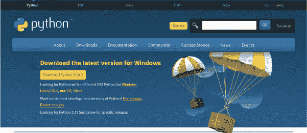
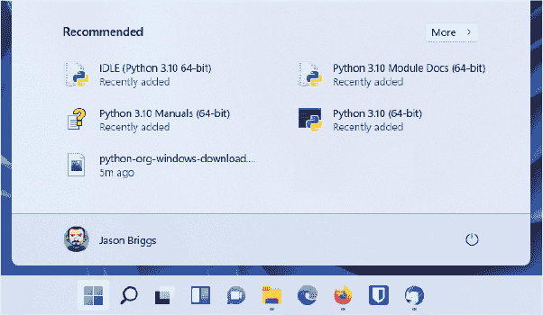
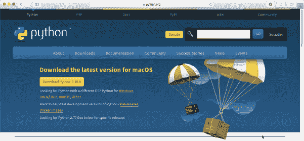
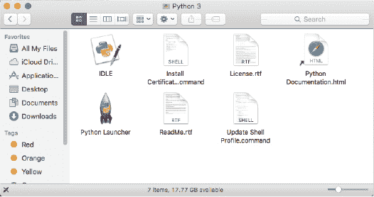
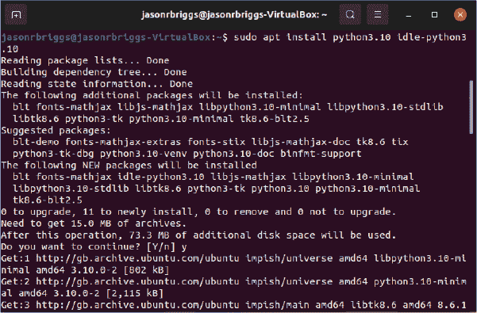
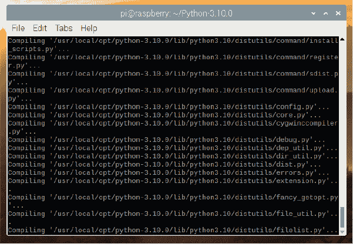
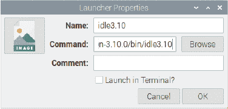
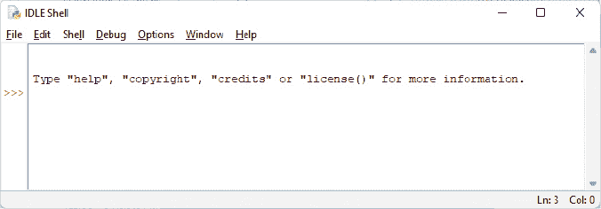
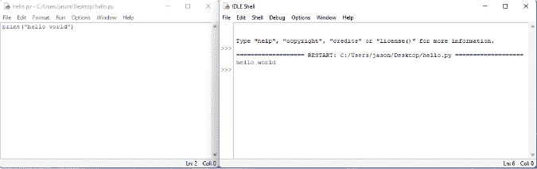
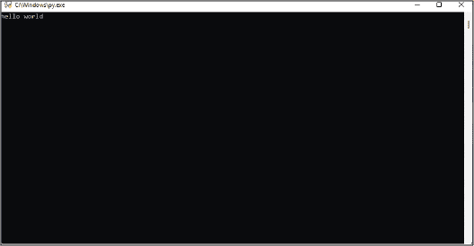

## 第一章：并非所有的蛇都会滑行


计算机程序是一组指令，使计算机执行某种操作。它不是计算机的物理部件——例如电线、微芯片、卡片、硬盘等——而是在这些硬件上运行的隐形内容。我通常将计算机程序简称为*程序*，它是一组指令，告诉硬件该做什么。*软件*是计算机程序的集合。

没有计算机程序，几乎你每天使用的每个设备都将停止工作或变得不如现在那么有用。计算机程序以某种形式控制着你个人的计算机，也控制着视频游戏系统、手机以及汽车中的 GPS 单元。软件还控制着像 LCD 电视及其遥控器、以及一些最新的收音机、DVD 播放器、烤箱和冰箱等设备。甚至汽车发动机、交通信号灯、街道灯、火车信号、电子广告牌和电梯也都由程序控制。

程序有点像思想。如果你没有思想，你可能只是坐在地板上，空洞地盯着一面墙。你的思想“从地板上起来”是一条指令或*命令*，它告诉你的身体站起来。同样，计算机程序也使用命令来告诉计算机该做什么。

如果你知道如何编写计算机程序，你就能做各种有用的事情。当然，你可能不能写出控制汽车、交通信号灯或冰箱的程序（至少一开始不能），但你可以创建网页，编写自己的游戏，甚至制作一个帮助做作业的程序。

### 关于语言的几句话

像人类一样，计算机使用多种语言进行沟通——这些语言叫做编程语言。*编程语言*只是一种通过使用人类和计算机都能理解的指令与计算机沟通的方式。

有些编程语言是以人名命名的（如 Ada 和 Pascal），有些是使用简单的缩写命名的（如 BASIC 和 FORTRAN），甚至还有一些编程语言是以电视节目命名的，比如 Python。是的，Python 编程语言是以*蒙提·派森飞行马戏团*（Monty Python’s Flying Circus）电视节目命名的，而不是因为蛇。

**注意**

*蒙提·派森飞行马戏团*是一个 1970 年代首次播出的另类英国喜剧节目，今天在某些观众群体中依然非常受欢迎。节目包含了像“傻乎乎的走路部”、 “打鱼舞蹈”和“奶酪店”（它根本不卖奶酪）这样的滑稽小品。

Python 编程语言有许多特性，使其对初学者极为有用。最重要的是，你可以快速编写简单而高效的程序。Python 不像其他编程语言那样使用许多复杂的符号，这使得它更容易阅读，也对初学者更友好。（这并不是说 Python 不使用符号——只是它不像许多其他语言那样频繁使用符号。）

### 安装 Python

安装 Python 是相当简单的。这里，我们将介绍在 Windows、macOS、Ubuntu 和 Raspberry Pi 上安装 Python 的步骤。在安装 Python 时，你还将安装 IDLE 程序，它是 **I**ntegrated **D**eve**L**opment **E**nvironment（集成开发环境），让你能够编写 Python 程序。如果你的电脑已经安装了 Python，可以跳到 第 10 页的“安装 Python 后”部分继续。

#### 在 Windows 上安装 Python

要在 Microsoft Windows 11 上安装 Python，请下载一个版本为 3.10 或更高的 Windows 版 Python，下载地址是 *[`www.python.org/downloads/`](http://www.python.org/downloads/)*。你下载的具体版本不重要，只要它至少是 3.10 版本。然而，如果你使用的是旧版 Windows（如 Windows 7），最新版本的 Python 将无法使用——在这种情况下，你需要安装 Python 3.8。有关哪个版本的 Python 可以与您的 Windows 版本兼容，请参见 Windows 下载页面 (*[`www.python.org/downloads/windows/`](https://www.python.org/downloads/windows/))*。



*图 1-1：Windows 的 Python 下载*

如果浏览器询问是否保存或打开文件，请选择保存。下载完 Python Windows 安装文件后，你应该会看到提示让你运行它。如果没有提示，请打开 *下载* 文件夹并双击该文件。接下来，按照屏幕上的安装说明，将 Python 安装到默认位置，步骤如下：

1.  点击 **立即安装**。

1.  当询问是否允许该应用对你的设备进行更改时，选择 **是**。

1.  安装完成后点击 **关闭**，然后你应该能在 Windows 开始菜单中看到多个 Python 3.1*x* 的图标：



*图 1-2：你的开始菜单可能会因使用的 Python 版本不同而有所不同。*

现在跳到 第 10 页的“安装 Python 后”部分，开始使用 Python。

#### 在 macOS 上安装 Python

如果你使用的是 Mac，应该会预装一个版本的 Python，但可能是较旧版本的语言。为了确保你使用的是足够新的版本，点击右上角的聚光灯图标（放大镜），在出现的对话框中输入 **terminal**。当终端打开后，输入 **python3 --version**（注意是两个短横线，后面跟着 *version*）并按下 ENTER 键。

如果你看到“命令未找到”或者版本低于 3.10，请在浏览器中访问以下 URL 以下载适用于 macOS 的最新安装程序： *[`www.python.org/downloads/`](http://www.python.org/downloads/)*。



*图 1-3：macOS 的 Python 下载*

下载完成后，双击该文件（它应该叫做类似于 *python-3.10.0-macosx11.pkg* 的名字）。同意许可协议并按照屏幕上的提示安装软件。安装 Python 之前，系统会提示你输入 Mac 的管理员密码。如果你没有密码，向你的父母或计算机所有者询问。



*图 1-4：Mac Finder 中的 Python*

跳转到 第 10 页的“安装 Python 后”部分，开始使用 Python。

#### 在 Ubuntu 上安装 Python

Python 在 Ubuntu Linux 上预装，但可能不是最新版本。按照这些说明操作，获取最新版本的 Python（请注意，接下来的命令中可能需要更改版本号，以反映最新版本）。

1.  点击显示应用程序图标（通常位于屏幕左下角，形状是九个点）。

1.  在输入框中输入**terminal**（如果已显示**终端**，则点击它）。

1.  当终端窗口出现时，输入：

    ```py
    sudo apt update
    sudo apt install python3.10 idle-python3.10
    ```

    输入第一个命令后，系统可能会提示你输入计算机的管理员密码（如果没有管理员密码，你可能需要向父母或老师请求输入）。



*图 1-5：Ubuntu 终端中的 Python 安装；根据你下载的版本，输出可能略有不同*

跳转到 第 10 页的“安装 Python 后”部分，开始使用 Python。

#### 在树莓派上安装 Python（树莓派操作系统或 Raspbian）

树莓派的操作系统预装了 Python 3，但在写这篇文章时，版本是 3.7。安装更高版本比其他操作系统稍微复杂一些——你需要自己下载并构建 Python 安装。听起来可能有点吓人，但其实并不复杂。只需依次输入以下命令，并等待每个命令完成（请注意，如果你下载的 Python 版本高于 3.10，可能需要更改版本号）：

```py
sudo apt update
sudo apt install libffi-dev libssl-dev tk tk-dev
wget https://www.python.org/ftp/python/3.10.0/Python-3.10.0.tar.xz
tar -xvf Python3.10.0.tar.xz
cd Python-3.10.0
./configure --prefix=/usr/local/opt/python-3.10.0
make -j 4
sudo make altinstall
```

倒数第二步将花费最长的时间，因为它正在构建所有的代码，这些代码将被加入到 Python 应用程序中。



*图 1-6：树莓派终端中的 Python 安装；根据你下载的 Python 版本，输出可能会略有不同。*

安装完 Python 后，你需要将一个名为 IDLE 的程序添加到菜单中（这会使后续操作更方便）：

1.  点击屏幕左上角的树莓派图标，然后点击**首选项**和**主菜单编辑器**。

1.  在弹出的窗口中，点击**编程**，然后点击**新建项目**按钮。

1.  在图 1-7 所示的启动器属性对话框中，输入名称为**idle3.10**，并将此作为命令输入，必要时更改版本号：

    ```py
    /usr/local/opt/python-3.10.0/bin/idle3.10
    ```

1.  点击 **确定**，然后在主编辑窗口中再次点击 **确定** 来完成。然后你就可以继续进行下一部分了。



*图 1-7：树莓派上的启动器设置*

### 安装 Python 后

安装 Python 后，让我们在 IDLE（也叫 *Shell*）中编写第一个程序。

如果你使用的是 Windows，在 Windows 搜索框（屏幕左下角）输入 **idle**，然后在最佳匹配菜单中选择 **IDLE (Python 3.1*x* 64-bit)**。

如果你使用的是 Mac，导航到 **前往** ▸ **应用程序**，然后打开 Python 3.1*x* 文件夹找到 IDLE。

如果你使用的是 Ubuntu，当你点击 **显示应用程序**，然后点击底部的 **所有** 标签，你应该能看到一个名为 *IDLE (使用* *Python-3.1*x*)* 的条目 —— 如果看不见它，你也可以在搜索框中输入 IDLE。

如果你使用的是树莓派，点击屏幕左上角的树莓派图标，点击 **编程**，然后从显示的列表中选择 **idle3.1*x***。

当你打开 IDLE 时，应该会看到如下窗口：



*图 1-8：Windows 中的 IDLE Shell*

这就是 *Python Shell*，它是 Python 集成开发环境的一部分。三个大于号（>>>）叫做 *提示符*。

让我们从提示符处输入一些命令，开始时输入以下内容：

```py
>>> print("Hello World")
```

确保包括双引号（“ ”）。完成输入后按键盘上的 ENTER 键。如果你输入正确的命令，应该会看到如下内容：

```py
>>> print("Hello World")
Hello World
>>>
```

提示符应该会重新出现，提醒你 Python Shell 已经准备好接受更多命令。

恭喜你！你刚刚创建了第一个 Python 程序。单词 print 是一种 Python 命令，叫做 *函数*，它会把括号内的内容打印到屏幕上。从本质上讲，你已经给计算机下达了一个指令，显示出 “Hello World” —— 这个指令既是你理解的，也是计算机能够执行的。


### 保存你的 Python 程序

如果每次使用 Python 程序时都需要重新编写它们，那这些程序就没有太大用处，更别提打印出来方便查看了。虽然重写短程序可能没问题，但一个大型程序，如文字处理器，可能包含数百万行代码。如果把这些都打印出来，可能会有超过 100,000 页。试想一下，拿着这么一大摞纸回家会是什么样子。希望你不会遇到大风。

幸运的是，我们可以保存程序以备后用。要创建并保存一个新程序，打开 IDLE，选择 **文件** ▸ **新建** **窗口**。一个空白窗口会出现，菜单栏中显示 *无标题*。在新出现的 Shell 窗口中输入以下代码：

```py
>>> print("Hello World")
```

现在，选择 **文件** ▸ **保存**。当提示输入文件名时，输入 *hello.py*，并将文件保存到桌面。然后选择 **运行** ▸ **运行模块**。

如果一切顺利，你保存的程序应该会运行，像这样：



*图 1-9：IDLE 中的 Hello World*

现在，如果你关闭了 shell 窗口，但保持 *hello.py* 窗口打开，然后选择 **运行** ▸ **运行模块**，Python Shell 应该会重新出现，且你的程序将再次运行（如果只想重新打开 Python Shell 而不运行程序，选择 **运行** ▸ **Python Shell**）。

运行代码后，你会在桌面上看到一个新的图标，名为 *hello.py*。如果你双击该图标，一个黑色的窗口会短暂出现，然后消失。发生了什么？

你看到的是 Python 命令行控制台（类似于 shell）启动，打印 Hello World，然后退出。如果你拥有超能力般的视力，能在窗口关闭前看到它，这就是你会看到的内容：



*图 1-10：控制台中的 Hello World*

**注意**

*根据你的操作系统，这可能无法正常工作——或者它可能会使用与我们安装的版本不同的 Python 版本运行。*

除了菜单，你还可以使用键盘快捷键来创建新的 shell 窗口、保存文件并运行程序：

+   在 Windows、Ubuntu 和 Raspberry Pi 上，按 CTRL-N 创建新的 shell 窗口，按 CTRL-S 保存文件（编辑完成后），按 F5 运行程序。

+   在 macOS 上，按 COMMAND-N 创建新的 shell 窗口，按 COMMAND-S 保存文件，按住功能键（Fn）并按 F5 运行程序。

### 你学到了什么

在本章中，我们从一个简单的 Hello World 应用程序开始——这是几乎每个人学习计算机编程时都会首先编写的程序。在下一章，我们将使用 Python Shell 做一些更有用的事情。
