## 4

使用海龟绘图


Python 中的海龟与现实中的海龟有些不同。我们知道海龟是一种爬行动物，移动非常缓慢，并且背上背着自己的壳。在 Python 中，*海龟*是一个小的黑色箭头，缓慢地在屏幕上移动。实际上，考虑到 Python 海龟在屏幕上移动时会留下痕迹，它更像是蜗牛或蛞蝓，而不太像海龟。

在本章中，我们将使用 Python 的 Turtle 库，通过绘制一些简单的形状和线条来学习计算机图形学的基础知识。

### 使用 Python 的 Turtle 模块

在 Python 中，*模块*是程序员为其他程序员提供有用代码的一种方式。（模块中可以包含我们可以使用的*函数*。）我们将在第七章中深入学习模块和函数。

海龟是 Python 中的一个特殊模块，我们可以用它来学习计算机如何在屏幕上绘制图像。海龟模块是一种编程向量图形的方式，基本上就是用简单的线条、点和曲线进行绘图。


让我们看看海龟是如何工作的。首先，启动 Python Shell。接下来，通过导入 turtle 模块告诉 Python 使用海龟，命令如下：

```py
>>> import turtle
```

导入一个模块告诉 Python 你想要使用它。

### 创建画布

现在我们已经导入了 turtle 模块，我们需要创建一个 *画布*——一个空白的绘图区域，就像艺术家的画布一样。为此，我们调用 turtle 模块中的 Turtle 函数，它会自动创建一个画布（我们将在第七章中了解更多关于函数的内容）。

在 Python Shell 中输入以下内容：

```py
>>> t = turtle.Turtle()
```

你应该能看到一个空白的框（画布），中央有一个箭头（类似于图 4-1）。屏幕中央的箭头就是海龟，而你是对的——它看起来并不像真正的海龟。

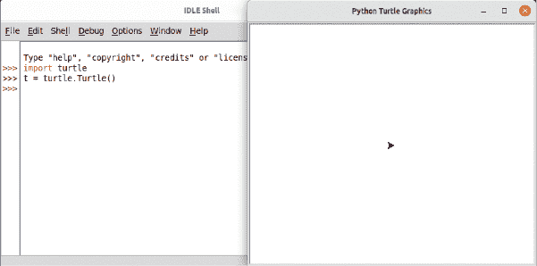

*图 4-1：在 Python Shell 中运行海龟*

**注意**

*如果 turtle 模块似乎没有正常工作，可以在附录 C 中尝试一些额外的步骤。*

### 移动海龟

你可以通过使用我们刚才创建的变量 t 上的函数来向海龟发送指令，这就像在 turtle 模块中使用 Turtle 函数一样。例如，`forward` 指令告诉海龟向前移动。要让海龟前进 50 像素，可以输入以下命令：

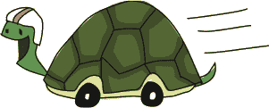

```py
>>> t.forward(50)
```

你应该能看到类似于图 4-2 的内容。

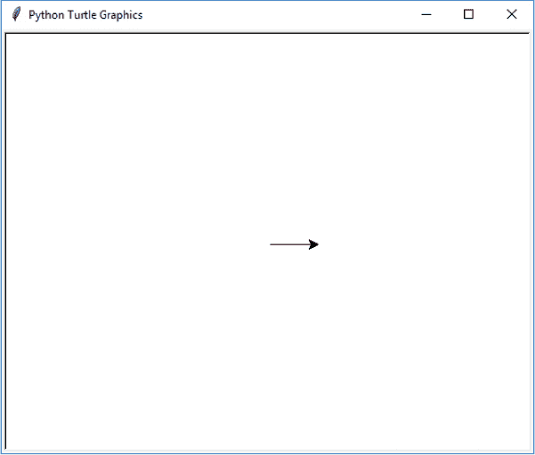

*图 4-2：海龟向前移动*

海龟已经向前移动了 50 个像素。*像素*是屏幕上的一个点——它是可以表示的最小元素。你在计算机显示器上看到的所有内容，都是由像素组成的，它们是微小的正方形点。如果你能够放大画布并查看海龟画的线条，你会看到，表示海龟路径的箭头其实就是由一堆像素组成的。这是简单计算机图形学的基础。

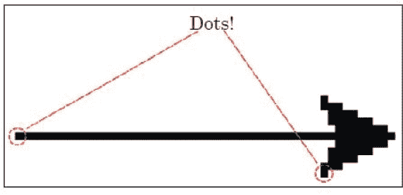

*图 4-3：像素就是点！*

现在我们将告诉海龟向左转 90 度，使用以下命令：

```py
>>> t.left(90)
```

如果你还没有学习过*度数*，可以想象你站在一个圆的中心：

+   你面朝的方向是 0 度。

+   如果你伸出左臂，那就是向左 90 度。

+   如果你伸出右臂，那就是向右 90 度。

你可以在图 4-4 中看到这个 90 度的左转或右转。

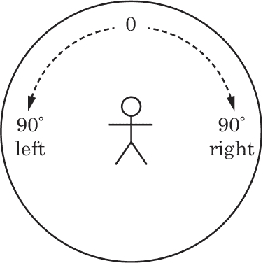

*图 4-4：向左和向右 90 度*

如果你从右臂指向的方向继续沿着圆周向右转，180 度是你身后的方向，270 度是左臂指向的方向，360 度是回到起点；度数从 0 到 360。顺时针旋转的度数增量可以在图 4-5 中看到，每次增量为 45 度。

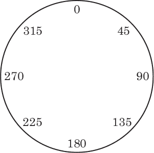

*图 4-5：45 度增量*

当 Python 的海龟向左转时，它会旋转并面向新的方向（就像你转身面向手臂指向的方向，向左转 90 度）。t.left(90) 命令将箭头指向上方（因为它最初指向的是右侧）。你可以在图 4-6 中看到这个效果。

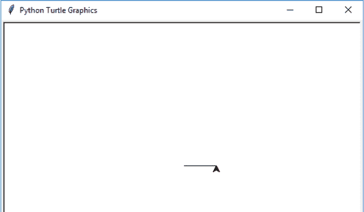

*图 4-6：海龟左转后的状态*

**注意**

*当你调用 t.left(90) 时，它的效果与调用 t.right(270) 在海龟最终朝向的方向上是相同的。当调用 t.right(90) 时，效果也与 t.left(270) 相同。只需要想象那个圆，并跟随度数来理解。*

现在我们将绘制一个正方形。将以下代码添加到你已经输入的代码中：

```py
>>> t.forward(50)
>>> t.left(90)
>>> t.forward(50)
>>> t.left(90)
>>> t.forward(50)
>>> t.left(90)
```

你的海龟应该已经画出了一个正方形，并且现在面朝它开始时的方向，如图 4-7 所示。

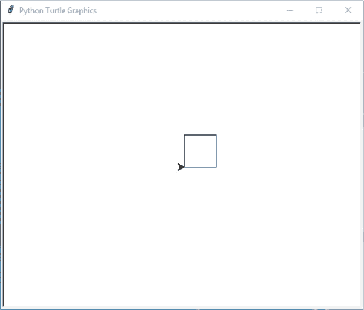

*图 4-7：海龟绘制正方形*

要清除画布，可以输入 t.reset()。这将清空画布，并将海龟恢复到起始位置。

```py
>>> t.reset()
```

你也可以使用 t.clear()，它只会清空屏幕，并让海龟保持当前位置。

```py
>>> t.clear()
```

我们还可以让海龟向右转或向后移动。我们可以使用 up 来抬起“画笔”（也就是说，告诉海龟停止绘图），使用 down 来重新开始绘制。这些功能的写法与我们之前使用的其他命令相同。

让我们尝试使用这些命令进行另一个绘图。这一次，我们将让海龟画两条线。请输入以下代码：

```py
>>> t.reset()
>>> t.backward(100)
>>> t.up()
>>> t.right(90)
>>> t.forward(20)
>>> t.left(90)
>>> t.down()
>>> t.forward(100)
```

首先，我们清空画布，并使用 t.reset() 将海龟移回起始位置。接着，我们使用 t.backward(100) 将海龟向后移动 100 像素，然后用 t.up() 抬起画笔停止绘制。

然后，使用 t.right(90) 命令，我们将海龟向右转 90 度，指向屏幕底部，再用 t.forward(20) 向前移动 20 像素。由于在第三行我们使用了 up 命令，所以没有绘制任何内容。接着，我们用 t.left(90) 将海龟向左转 90 度，面朝右侧，然后使用 down 命令让海龟重新开始绘制。最后，我们画出一条与我们之前绘制的第一条平行的线，使用 t.forward(100)。这两条平行线最终看起来像图 4-8。

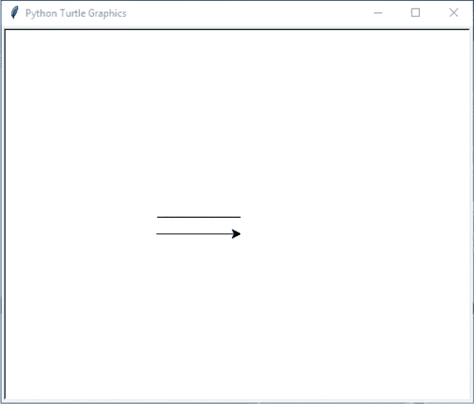

*图 4-8：海龟绘制平行线*

### 你学到了什么

在本章中，你学习了如何使用 Python 的海龟模块。我们绘制了一些简单的线条，使用了左转、右转以及向前和向后的命令。你了解了如何使用 up 命令停止海龟绘制，并使用 down 命令重新开始绘制。你还发现海龟是按角度转动的。

### 编程谜题

尝试用海龟绘制以下一些形状。解决方案可以在 *[`python-for-kids.com`](http://python-for-kids.com)* 上找到。

#### #1：一个矩形

使用海龟模块的 Turtle 函数创建一个新的画布，然后绘制一个矩形。

#### #2：一个三角形

创建另一个画布并绘制一个三角形。回顾一下圆形的图示（“移动海龟”在第 45 页），提醒自己应该将海龟转向哪个方向。

#### #3：没有角的框

编写一个程序，绘制图 4-9 中显示的四条线（大小不重要，形状最重要）。

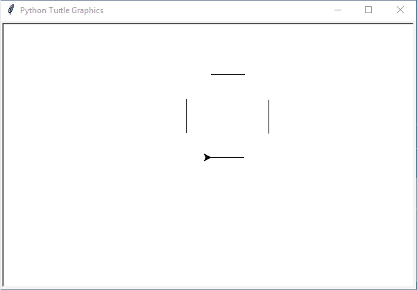

*图 4-9：海龟画的没有角的框*

#### #4：没有角的倾斜框

编写一个程序，绘制图 4-10 中显示的四条线（与之前的谜题类似，但框的方向倾斜）。同样，框的大小并不重要——只要形状正确即可。

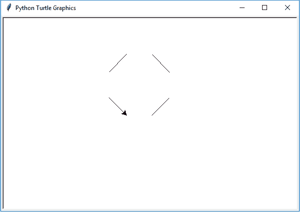

*图 4-10：海龟画的没有角的倾斜框*
