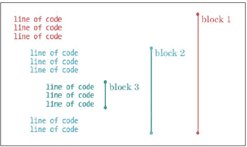
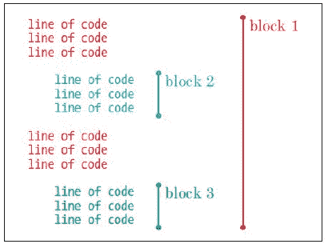
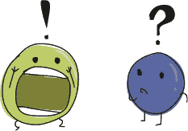

## 使用 if 和 else 提问


在编程中，我们经常提出“是”或“否”的问题，并根据答案执行某些操作。例如，我们可能会问：“你是否超过 20 岁？”如果答案是“是”，则回应“你太老了！”这类问题叫做*条件*，我们将条件及其响应组合到 if 语句中。条件可以比一个简单的问题更复杂，if 语句可以结合多个问题，并根据每个问题的答案执行不同的响应。在本章中，你将学习如何使用 if 语句来构建程序。

### if 语句

我们可能会在 Python 中写出这样的 if 语句：

```py
>>> age = 13
>>> if age > 20:
        print('You are too old!')
```

if 语句由 if 关键字组成，后面跟着条件和冒号（:），例如 this if age > 20: 语句。冒号后面的行必须属于一个代码块；如果问题的答案是“是的”（或 True），那么代码块中的命令将会执行。现在，让我们探索如何编写代码块和条件。


**注意**

*True 是一个* 布尔 *值，以数学家 George Boole 命名。布尔值只能有两个值：True 或 False。*

### 一个代码块是一个编程语句的集合

一个*代码块*是一个编程语句的集合。例如，当 if age > 20: 为 True 时，你可能不仅仅想打印出“You are too old！”也许你想打印更多的句子，例如：

```py
>>> age = 25
>>> if age > 20:
        print('You are too old!')
        print('Why are you here?')
        print('Why aren\'t you mowing a lawn or sorting papers?')
```

这个代码块由三个 print 调用组成，只有当条件 age > 20 被判断为 True 时才会执行。代码块中的每一行前面都有四个空格。让我们再看看这段代码，并显示空格：

```py
>>> age = 25
>>> if age > 20:
 .... print('You are too old!')
 .... print('Why are you here?')
 .... print('Why aren\'t you mowing a lawn or sorting papers?')
```

在 Python 中，*空白字符*——比如制表符（按下 TAB 键时插入）或空格（按下空格键时插入）——是有意义的。处于相同位置（或从左边距缩进相同数量的空格）的代码会被归为一个代码块。每当你用比上一行更多的空格开始新的一行时，就意味着你开始了一个新的代码块。这个新代码块也是前一个代码块的一部分，就像图 5-1 所示。



*图 5-1：代码块如何工作*

我们将语句归为代码块，因为它们是相关的，且需要一起执行。当你改变代码的缩进时，通常是在创建新的代码块。图 5-2 展示了仅通过改变缩进就可以创建三个代码块。



*图 5-2：第二个示例展示了代码块如何工作*

在这里，尽管第 2 和第 3 个代码块具有相同的缩进，它们仍然被视为不同的代码块，因为它们之间存在一个缩进较少（空格较少）的代码块。

一个包含四个空格的代码块在一行上，而下一行包含六个空格时，在运行时会产生*缩进错误*。这是因为 Python 期望在一个代码块中的所有行使用相同数量的空格。以下是一个示例：

```py
>>> if age > 20:
 .... print('You are too old!')
 ...... print('Why are you here?')
```

我已经将空格显示出来，以便你看到差异。注意，第二行的 print 前面有六个空格，而不是四个。我们尝试运行这段代码时，Python 会用红色方块高亮显示出问题的那一行，并显示一个解释性的语法错误（SyntaxError）消息：

```py
>>> age = 25
>>> if age > 20:
        print('You are too old!')
          print('Why are you here?')
SyntaxError: unexpected indent
```

Python 没有预期在第二行的 print 前面看到两个额外的空格。

**注意**

*使用一致的空格来使代码更易读。如果你在开始编写程序时在一个代码块的开头使用了四个空格，那么在程序中的其他代码块开头也应该继续使用四个空格。确保每个代码块中的每一行都使用相同数量的空格进行缩进。*

### 条件帮助我们比较事物

*条件*是一个编程表达式，用来比较事物，并告诉我们比较设定的标准是否为真（是）或假（否）。例如，age > 10 是一个条件，询问“age 变量的值是否大于 10？”另一个条件可能是 hair_color == 'mauve'，即“hair_color 变量的值是否是紫色？”

我们在 Python 中使用符号——称为 *运算符*——来创建条件，比如 *等于*、*大于* 和 *小于*。表 5-1 列出了常见的运算符。

**表 5-1：** 条件符号

| **符号** | **定义** |
| --- | --- |
| == | 等于 |
| != | 不等于 |
| > | 大于 |
| < | 小于 |
| >= | 大于或等于 |
| <= | 小于或等于 |

例如，如果你 10 岁，条件 your_age == 10 会返回 True；否则，它会返回 False。如果你 12 岁，条件 your_age > 10 会返回 True。

**注意**

*定义等于条件时，务必使用双等号（==）。*

让我们尝试一些示例。在这里，我们将年龄设置为 10，并写一个条件语句，如果年龄大于 10，就打印“你太老，不能理解我的笑话！”：

```py
>>> age = 10
>>> if age > 10:
        print('You are too old for my jokes!')
```

当我们在 Python Shell 中输入这些并按下 ENTER 时会发生什么？

什么也没有。

因为 age 返回的值不大于 10，Python 不会执行 print 代码块。但是，如果我们将 age 设置为 20，消息就会被打印出来。

现在让我们将前一个示例改成使用大于或等于（>=）条件：


```py
>>> age = 10
>>> if age >= 10:
        print('You are too old for my jokes!')
```

你应该看到“你太老，不能理解我的笑话！”被打印到屏幕上，因为 age 的值等于 10。

接下来，让我们尝试使用等于（==）条件：

```py
>>> age = 10
>>> if age == 10:
        print("What's brown and sticky? A stick!!")
```

你应该看到消息“什么又棕又黏？一根棍子！！”被打印到屏幕上。

### If-Then-Else 语句

除了使用 if 语句在条件成立（True）时执行某些操作，我们还可以在条件不成立时使用 if 语句来执行操作。例如，如果你的年龄是 12，则打印一条消息，否则打印另一条消息。

这里的技巧是使用 if-then-else 语句，它的基本意思是，“如果某事为真，那么做这个；否则，做那个。”

让我们创建一个 if-then-else 语句。在 Python Shell 中输入以下内容：

```py
>>> print('Want to hear a dirty joke?')
Want to hear a dirty joke?
>>> age = 12
>>> if age == 12:
 print('A pig fell in the mud!')
    else:
        print("Shh. It's a secret.")

A pig fell in the mud!
```

由于我们将 `age` 设置为 12，并且条件检查 `age` 是否等于 12，所以你应该在屏幕上看到第一个打印消息。现在尝试将 `age` 的值更改为 12 以外的数字，如下所示：


```py
>>> print('Want to hear a dirty joke?')
Want to hear a dirty joke?
>>> age = 8
>>> if age == 12:
        print('A pig fell in the mud!')
    else:
        print("Shh. It's a secret.")

Shh. It's a secret.
```

这次，你应该看到第二个打印消息。

### IF 和 ELIF 语句

我们可以通过 `elif` 扩展 `if` 语句，`elif` 是 *else-if* 的缩写。这些语句与 `if-then-else` 语句不同，因为同一个语句中可以有多个 `elif`。例如，我们可以检查一个人的年龄是否为 10、11 或 12（等等），并根据答案让程序做不同的事情：

```py
>>> age = 12
>>> if age == 10:
        print('What do you call an unhappy cranberry?')
        print('A blueberry!')
    elif age == 11:
        print('What did the green grape say to the blue grape?')
        print('Breathe! Breathe!')
    elif age == 12:
 print('What did 0 say to 8?')
        print('Hi guys!')
    elif age == 13:
        print("Why wasn't 10 afraid of 7?")
        print('Because rather than eating 9, 7 8 pi.')
    else:
        print('Huh?')

What did 0 say to 8?
Hi guys!
```

在这个例子中，第二行的 `if` 语句检查 `age` 的值是否等于 10。如果是，那么后面的 `print` 函数就会执行。然而，因为我们将 `age` 设置为 12，所以计算机会跳到 `if` 语句的下一个部分（第一个 `elif` 或 *else if*）并检查 `age` 是否等于 11。结果不是，所以计算机会跳到下一个 `elif` 检查 `age` 是否等于 12。它是，所以这次计算机会执行接下来的 `print` 调用。

当你在 IDLE 中输入这段代码时，它会自动缩进，所以确保在输入每个 `print` 语句后按下 BACKSPACE 键（如果你使用的是 Mac，按 DELETE 键）。这样，`if`、`elif` 和 `else` 语句将从最左侧的边缘开始。这与没有提示符（>>>）时 `if` 语句的位置相同。



### 组合条件

你可以使用 `and` 和 `or` 关键字组合条件，这样可以生成更短更简洁的代码。以下是一个使用 `or` 的示例：

```py
>>> if age == 10 or age == 11 or age == 12 or age == 13:
        print('What is 13 + 49 + 84 + 155 + 97? A headache!')
    else:
        print('Huh?')
```

在这段代码中，如果第一行的任何条件为真（即年龄为 10、11、12 或 13），则下一行的 `print` 语句将会执行。

如果第一行的条件不成立（`else`），Python 将在屏幕上显示 "Huh?"。

为了进一步缩小这个例子，我们可以使用 `and` 关键字，结合大于或等于运算符 (>=) 和小于或等于运算符 (<=)，如下所示：

```py
>>> if age >= 10 and age <= 13:
        print('What is 13 + 49 + 84 + 155 + 97? A headache!')
    else:
        print('Huh?')
```

这里，如果 `age` 大于或等于 10 且小于或等于 13，下一行的 `print` 语句将会执行。例如，如果 `age` 的值是 12，那么 "What is 13 + 49 + 84 + 155 + 97? A headache!" 会被打印到屏幕上，因为 12 大于 10 且小于 13。


### 没有值的变量—None

就像我们可以将数字、字符串和列表赋值给变量一样，我们也可以赋值为空值，或者说一个空的值。在 Python 中，空值称为 `None`。需要注意的是，`None` 的值与 0 的值不同，因为它表示的是 *没有* 值，而不是一个值为 0 的数字。以下是一个将变量设置为 `None` 的示例：

```py
>>> myval = None
>>> print(myval)
None
```

将 None 赋值给变量意味着告诉 Python 该变量不再有任何值（或者说，它不再代表某个值）。这也是一种定义变量但不设置其值的方法。当你知道在程序后续部分会使用该变量时，提前定义所有变量可能会很有用。

**注意**

*程序员通常在程序（或函数）开始时定义他们的变量，以便快速查看代码块中使用的所有变量。*

你也可以在 if 语句中检查 None，像下面的例子一样：

```py
>>> myval = None
>>> if myval is None:
        print("The variable myval doesn't have a value")

The variable myval doesn't have a value
```

当你只想在变量尚未计算时才计算一个值时，这会很有用。在这种情况下，检查 None 会告诉 Python 仅在变量没有值时才进行计算。

### 字符串与数字的区别

*用户输入*是指用户在键盘上输入的内容——无论是字符、按下的箭头键、回车键还是其他任何内容。在 Python 中，用户输入是一个字符串，这意味着当你在键盘上输入数字 10 时，Python 会将数字 10 保存为字符串，而不是数字。

比较数字 10 和字符串‘10’。虽然我们看到两者唯一的区别是一个被引号包围，但对于计算机来说，它们是完全不同的。

例如，我们可以将变量 age 的值与一个数字进行比较，在 if 语句中，像这样：

```py
>>> if age == 10:
        print("What's the best way to speak to a monster?")
        print("From as far away as possible!")
```

如果我们先将变量 age 设置为数字 10：

```py
>>> age = 10
>>> if age == 10:
        print("What's the best way to speak to a monster?")
        print("From as far away as possible!")

What's the best way to speak to a monster?
From as far away as possible!
```

如你所见，print 语句执行了。

接下来，我们将 age 设置为字符串‘10’（带引号），像这样：

```py
>>> age = '10'
>>> if age == 10:
        print("What's the best way to speak to a monster?")
        print("From as far away as possible!")

>>>
```

在这里，print 语句没有执行，因为 Python 并不认为字符串是一个数字。


幸运的是，Python 有一些函数可以将字符串转化为数字，也可以将数字转化为字符串。例如，你可以使用 int 函数将字符串‘10’转换为数字：

```py
>>> age = '10'
>>> converted_age = int(age)
```

变量 converted_age 现在保存的是数字 10（而不是字符串）。

要将一个数字转换为字符串，可以使用 str，像这样：

```py
>>> age = 10
>>> converted_age = str(age)
```

现在，converted_age 保存的是字符串‘10’而不是数字 10。

记得之前提到的 if age == 10 语句吗？当变量被设置为字符串（age = '10'）时，它没有打印任何内容。如果我们先转换变量，结果就完全不同了：

```py
>>> age = '10'
>>> converted_age = int(age)
>>> if converted_age == 10:
        print("What's the best way to speak to a monster?")
        print("From as far away as possible!")

What's the best way to speak to a monster?
From as far away as possible!
```

但是请注意：如果你尝试将一个带有小数点的数字（也称为*浮动点数*，因为小数点可以在数字中“移动”）转换成整数，你会遇到错误，因为 int 函数期望的是一个*整数*（没有小数点的数字）：

```py
>>> age = '10.5'
>>> converted_age = int(age)
Traceback (most recent call last):
    File "<pyshell#35>", line 1, in <module>
    converted_age = int(age)
ValueError: invalid literal for int() with base 10: '10.5'
```

Python 会抛出一个 ValueError 来告诉你，你尝试使用的值不合适。要解决这个问题，可以使用 float 而不是 int，因为 float 函数能够处理非整数的数字：

```py
>>> age = '10.5'
>>> converted_age = float(age)
>>> print(converted_age)
10.5
```

如果你尝试将一个不包含数字的字符串转换成数字，也会遇到 ValueError：

```py
>>> age = 'ten'
>>> converted_age = int(age)
Traceback (most recent call last):
    File "<pyshell#1>", line 1, in <module>
    converted_age = int(age)}
ValueError: invalid literal for int() with base 10: 'ten'
```

因为我们使用了单词“ten”而不是数字 10，Python 无法处理这个情况。

### 你学到的内容

在这一章中，你学习了如何使用 if 语句来创建只有在特定条件为真时才执行的代码块。你还了解了如何通过使用 elif 扩展 if 语句，从而根据不同的条件执行不同的代码块，以及如何使用 else 关键字在条件都不成立时执行代码。

你通过使用 and 和 or 关键字将条件组合起来，以检查数字是否在某个范围内，并使用 int、str 和 float 函数将字符串转换为数字。你还发现 None 可以将变量重置为其初始的空状态。

### 编程谜题

尝试使用 if 语句和条件来解答以下谜题。答案可以在 *[`python-for-kids.com`](http://python-for-kids.com)* 下载。

#### #1: 你富有吗？

你认为下面的代码会做什么？尝试在不输入到 Python Shell 中的情况下猜测答案，然后检查你的结果。

```py
>>> money = 2000
>>> if money > 1000:
        print("I'm rich!!")
    else:
        print("I'm not rich!!")
          print("But I might be later...")
```

#### #2: Twinkies！

创建一个 if 语句，检查 Twinkie 的数量（保存在变量 twinkies 中）是否小于 100 或大于 500。如果条件为真，程序应该打印出“Too few or too many”（太少或太多）。

#### #3: 正确的数量

创建一个 if 语句，检查 money 变量中包含的钱是否在 100 到 500 之间，或者在 1,000 到 5,000 之间。

#### #4: 我能打败那些忍者

创建一个 if 语句，当变量 ninjas 的值小于 50 时打印出“That's too many”（太多了）；当值小于 30 时打印出“It’ll be a struggle, but I can take ’em”（会有点困难，但我能打败他们）；当值小于 10 时打印出“I can fight those ninjas!”（我能打败那些忍者）。你可以尝试以下代码：

```py
>>> ninjas = 5
```
