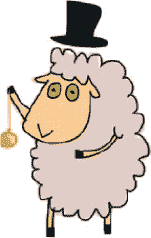
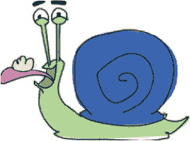
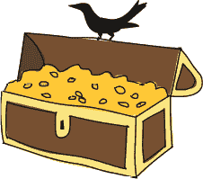
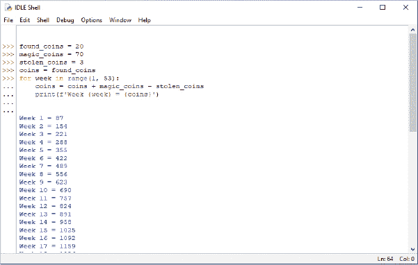
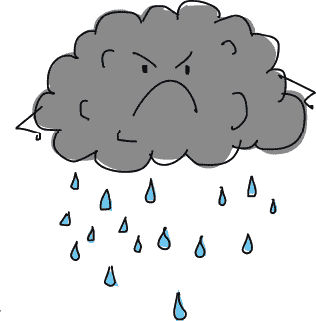

## 第六章：循环进行中


没有什么比需要一遍又一遍地做同样的事情更糟糕了。我们被告知在难以入睡时数羊是有原因的，这与羊毛哺乳动物的神奇催眠能力无关。原因是无休止的重复让人感到无聊，如果你不专注于某些有趣的事情，你的大脑很容易就会漂移进入睡眠状态。

程序员也不喜欢重复自己，除非他们也在试图入睡。幸运的是，大多数编程语言都有 for 循环，它可以自动重复像语句和代码块这样的内容。

在本章中，我们将探讨 for 循环以及 Python 提供的另一种循环类型：while 循环。



### 使用 for 循环

若要在 Python 中打印五次 hello，你 *可以* 这样做：

```py
>>> print('hello')
hello
>>> print('hello')
hello
>>> print('hello')
hello
>>> print('hello')
hello
>>> print('hello')
hello
```

但这相当繁琐。相反，你可以使用 for 循环来减少打字量和重复，如下所示：

```py
➊ >>> for x in range(0, 5):
       ➋ print('hello')

  hello
  hello
  hello
  hello
  hello
```

range 函数 ➊ 可以创建一个从起始数字到接近结束数字的数字列表。可能这有点令人困惑，所以让我们将 range 函数与 list 函数结合起来，看看它到底是如何工作的。range 函数实际上并不创建数字列表；它返回一个 *迭代器*，这是一个专为循环设计的 Python 对象。不过，如果我们将 range 与 list 结合使用，就能得到一个数字列表：

```py
>>> print(list(range(10, 20)))
[10, 11, 12, 13, 14, 15, 16, 17, 18, 19]
```

在我们之前的示例中，for x in range(0,5): 实际上是告诉 Python 执行以下操作：

1.  从 0 开始计数，并在达到 5 之前停止。

1.  对于我们计数的每个数字，将其值存储在 x 变量中。

然后，Python 执行 print(’hello’) 语句。注意第二行 ➋ 开头的四个额外空格（与第一行 ➊ 相比）。IDLE 应该已经自动为你缩进了。当我们按下 ENTER 键后，Python 会打印五次 hello。

我们还可以在 print 语句中使用变量 x 来计算 hello 的数量：

```py
>>> for x in range(0, 5):
        print(f'hello {x}')
hello 0
hello 1
hello 2
hello 3
hello 4
```

如果我们去掉 for 循环，代码可能会变成这样：

```py
>>> x = 0
>>> print(f'hello {x}')
hello 0
>>> x = 1
>>> print(f'hello {x}')
hello 1
>>> x = 2
>>> print(f'hello {x}')
hello 2
>>> x = 3
>>> print(f'hello {x}')
hello 3
>>> x = 4
>>> print(f'hello {x}')
hello 4
```

使用 for 循环使我们免去了写八行额外代码！避免重复做事是最佳实践，因此 for 循环在程序员中非常流行。

在制作 for 循环时，你不必坚持使用 range 函数。你还可以使用你已经创建的列表，比如来自第三章的购物清单，如下所示：

```py
>>> wizard_list = ['spider legs', 'toe of frog', 'snail tongue', 
                   'bat wing', 'slug butter', 'bear burp']
>>> for ingredient in wizard_list:
        print(ingredient)
spider legs
toe of frog
snail tongue
bat wing
slug butter
bear burp
```

这段代码告诉 Python：“对于 wizard_list 中的每一项，将其值存储在 i 变量中，然后打印该变量的内容。”如果去掉 for 循环，我们将需要做如下操作：



```py
>>> wizard_list = ['spider legs', 'toe of frog', 'snail tongue', 
                   'bat wing', 'slug butter', 'bear burp']
>>> print(wizard_list[0])
spider legs
>>> print(wizard_list[1])
toe of frog
>>> print(wizard_list[2])
snail tongue
>>> print(wizard_list[3])
bat wing
>>> print(wizard_list[4])
slug butter
>>> print(wizard_list[5])
bear burp
```

再一次，for 循环为我们节省了大量的打字工作。

让我们再创建一个循环。在 Python Shell 中输入以下代码；它应该会自动为你缩进代码：

```py
>>> hugehairypants = ['huge', 'hairy', 'pants']
>>> for i in hugehairypants:
        print(i)
        print(i)

huge
huge
hairy
hairy
pants
pants
```

在第一行，我们创建了一个包含 ‘huge’、‘hairy’ 和 ‘pants’ 的列表。在接下来的一行中，我们遍历列表中的项目，并将每个项目赋值给变量 i。然后，在接下来的两行代码中，我们打印变量的内容两次。按下 ENTER 键进入下一行空白行，告诉 Python 结束代码块。接着，它会执行代码并打印列表中的每个元素两次。


记住，如果你输入了错误的空格数量，就会收到错误信息。如果你在第四行输入了额外的空格，Python 会显示缩进错误：

```py
>>> hugehairypants = ['huge', 'hairy', 'pants']
>>> for i in hugehairypants:
        print(i)
         print(i)

IndentationError: unexpected indent
```

如你在第五章中学到的，Python 要求代码块中的空格数量保持一致。无论你插入多少空格，只要每一行使用相同的空格数就可以（这也使得代码更易于人类阅读）。

这是一个更复杂的例子，展示了一个包含两个代码块的 for 循环：

```py
>>> hugehairypants = ['huge', 'hairy', 'pants']
>>> for i in hugehairypants:
        print(i)
        for j in hugehairypants:
            print(j)
```

那么在这段代码中，哪些是代码块呢？第一个代码块是第一个 for 循环：

```py
hugehairypants = ['huge', 'hairy', 'pants']
for i in hugehairypants:
    print(i)                  #
    for j in hugehairypants:  # These lines are the FIRST block.
        print(j)              #
```

下一个代码块是第二个 for 循环中的单一 print 行：

```py
hugehairypants = ['huge', 'hairy', 'pants']
for i in hugehairypants:
    print(i)
    for j in hugehairypants:
       print(j)              # This line is also the SECOND block.
```

你能猜到这段代码会做什么吗？

在创建了一个名为 hugehairypants 的列表后，我们可以从接下来的两行代码中看出，Python 会遍历列表中的项目并打印出每一个。然而，在 `for j in hugehairypants` 这一行时，它会再次遍历列表，这次将值赋给变量 j，然后再次打印每个项目。这最后两行代码依然属于第一个 for 循环，这意味着它们会随着 for 循环遍历列表而为每个项目执行。

当这段代码运行时，我们应该看到 huge 后跟 huge，再后面是 hairy，pants，接着是 hairy 后跟 huge，hairy，pants，如此循环。

将代码输入 Python Shell，亲自试试看：

```py
   >>> hugehairypants = ['huge', 'hairy', 'pants']
   >>> for i in hugehairypants:
           print(i)
           for j in hugehairypants:
               print(j)

→ huge
   huge
   hairy
   pants
→ hairy
   huge
   hairy
   pants
→ pants
   huge
   hairy
   pants

```

Python 进入第一个循环并打印列表中的一个项目。接着，它进入第二个循环并打印出列表中的所有项目。之后，它用 `print(i)` 打印出列表中的第二个项目，再用 `print(j)` 打印出完整的列表一次。最后，它再次用 `print(i)` 打印出列表中的第三个项目，再次通过内层循环打印完整列表。在输出中，标有 **→** 的行是由 `print(i)` 打印的，未标记的行是由 `print(j)` 语句打印的。

让我们尝试做一些比打印愚蠢单词更实际的事情。还记得我们在第二章中提出的计算公式吗？它用来算出如果你使用祖父的复制机，年末你会有多少金币？它长这样：

```py
>>> found_coins + magic_coins * 365 - stolen_coins * 52
```

这表示 20 个找到的硬币加上 10 个魔法硬币，再乘以一年中的 365 天，减去每周被渡鸦偷走的 3 个硬币。

让我们看看你的金币堆每周是如何增长的。我们可以通过 for 循环做到这一点，但首先我们需要修改 magic_coins 变量的值，使其代表每周的金币总数。我们每天获得 10 枚魔法金币，一周有 7 天，所以 magic_coins 应该是 70：



```py
>>> found_coins = 20
>>> magic_coins = 70
>>> stolen_coins = 3
```

我们可以通过创建另一个变量，称为 coins，并使用 for 循环，看到我们的财富每周增加：

```py
   >>> found_coins = 20
   >>> magic_coins = 70
   >>> stolen_coins = 3
➊ >>> coins = found_coins
   >>> for week in range(1, 53):
           coins = coins + magic_coins - stolen_coins
           print(f'Week {week} = {coins}')
```

coins 变量加载了 found_coins 变量的值 ➊；这是我们的起始值。接下来的代码设置了 for 循环，它将执行代码块中的命令。每次循环时，week 变量都会加载 1 到 52 范围内的下一个数字。

包含 coins = coins + magic_coins - stolen_coins 的这一行稍微复杂一些。每周我们都想增加我们魔法创造的金币数量，并减去乌鸦偷走的金币数量。可以把 coins 变量想象成一个宝箱。每周，新的金币都会被堆进宝箱。所以这一行是在告诉 Python：“用当前金币的数量，加上这周我创造的金币数量，来替换 coins 的内容。”等号（=）是一个指令，意思是：“先计算右边的内容，然后把结果保存到左边的变量中。”

print 语句将周数和（到目前为止的）金币总数打印到屏幕上。（请考虑重新阅读《嵌入字符串中的值》一节，见 第 29 页。）如果你运行这个程序，你会看到类似于 图 6-1 的内容。



*图 6-1：运行循环*

### 既然我们在谈论循环...

for 循环并不是你在 Python 中可以创建的唯一类型的循环。还有 while 循环。while 循环不同于 for 循环，它没有固定的长度。如果你事先不知道循环何时停止，就可以使用 while 循环。

想象一段有 20 个台阶的楼梯。楼梯在室内，你知道你可以轻松爬完这 20 个台阶。for 循环就像这样：

```py
>>> for step in range(0, 20):
        print(step)
```

现在想象一下有一段通往山顶的楼梯。山很高，你可能在到达山顶之前就筋疲力尽了，或者天气变坏，迫使你停下来。这就像一个 while 循环：

```py
step = 0
while step < 10000:
    print(step)
    if tired == True:
        break
 elif badweather == True:
        break
    else:
        step = step + 1
```

如果你尝试运行这段代码，你会遇到一个错误，因为我们没有创建 tired 和 badweather 变量。虽然这里的代码不够完整，无法运行一个完整的程序，但它演示了一个简单的 while 循环。



我们首先通过 step = 0 创建了 step 变量。接下来，我们创建了一个 while 循环，检查 step 的值是否小于 10,000（step < 10000），这代表从山脚到山顶的步数。只要 step 小于 10,000，Python 就会执行其余的代码。

使用 `print(step)` 打印 `step` 的值，然后使用 `if tired == True` 条件检查变量 `tired` 的值是否为 `True`。如果是，我们使用 `break` 退出循环。`break` 关键字是一种立即跳出（或停止）循环的方式，适用于 `while` 和 `for` 循环。

在这个示例中，`break` 使得 Python 跳出代码块并跳到步骤 = 步骤 + 1 这一行后面的任何命令。

语句 `elif badweather == True` 检查 `badweather` 是否被设置为 `True`；如果是，`break` 就会退出循环。如果 `tired` 和 `badweather` 都不为真（在 `else` 中看到），我们使用 `step = step + 1` 将 `step` 增加 1，循环继续。

`while` 循环的步骤如下：

1.  检查条件。

1.  执行代码块中的代码。

1.  重复。

更常见的是，可能会创建一个带有多个条件的 `while` 循环，而不仅仅是一个条件，像这样：

```py
>>> x = 45
>>> y = 80
>>> while x < 50 and y < 100:
        x = x + 1
        y = y + 1
        print(x, y)
```

在这里，我们创建了一个值为 45 的 x 变量和一个值为 80 的 y 变量。循环检查两个条件：x 是否小于 50，y 是否小于 100。只要两个条件都成立，接下来的代码行就会执行，分别将 1 加到这两个变量上，然后打印它们。该代码的输出如下：

```py
46 81
47 82
48 83
49 84
50 85
```

你能弄明白它是如何工作的吗？

我们从 x = 45 和 y = 80 开始计数，然后每次运行循环中的代码时，*递增*（将 1 加到每个变量）。只要 x 小于 50 且 y 小于 100，循环将继续运行。经过五次循环后，x 的值达到 50。现在，第一个条件（x < 50）不再成立，因此 Python 停止循环。

我们还可以使用 `while` 循环创建一个 *半永恒的循环*，它可能会永远持续下去，但会在代码中的某个地方发生某些事情，导致它跳出循环。

这里是一个示例：

```py
while True:
    lots of code here
    lots of code here
    lots of code here
    if some_value == True:
        break
```

这个 `while` 循环的条件是 `True`，它总是成立，因此代码块中的代码将永远运行（因此，这个循环是永恒的）。只有当变量 `some_value` 为真时，Python 才会跳出循环。

### 你学到了什么

在这一章中，我们使用了两种类型的循环来执行重复任务：`for` 循环和 `while` 循环。它们相似，但可以以不同的方式使用。我们通过将任务写在代码块中，然后将这些代码块放入循环中，告诉 Python 我们想要重复的内容。我们还使用了 `break` 关键字来停止循环。

### 编程谜题

这里有一些循环示例供你尝试。解决方案可以在 *[`python-for-kids.com`](http://python-for-kids.com)* 找到。

#### #1: Hello 循环

你认为以下代码会做什么？猜一猜它会发生什么，然后在 Python 中运行代码看看你猜的是否正确。

```py
>>> for x in range(0, 20):
        print(f'hello {x}')
        if x < 9:
           break
```

#### #2: 偶数

创建一个循环，打印出偶数，直到达到你的年龄（如果你的年龄是奇数，创建一个循环打印出奇数，直到达到你的年龄）。例如，它可能会打印出如下内容：

```py
2
4
6
8
10
12
14
```

#### #3: 我的五个最爱配料

创建一个包含五种不同三明治配料的列表，如下所示：

```py
>>> ingredients = ['snails', 'leeches', 'gorilla belly-button lint', 
                   'caterpillar eyebrows', 'centipede toes']
```

现在创建一个循环，打印出列表（包括数字）：

```py
1 snails
2 leeches
3 gorilla belly-button lint
4 caterpillar eyebrows
5 centipede toes
```

#### #4：你在月球上的体重

如果你现在站在月球上，你的体重将是地球体重的 16.5%。你可以通过将地球体重乘以 0.165 来计算。

如果你每年增加两磅体重，接下来的 15 年里，你的体重在每年访问月球时以及 15 年后的体重大概是多少？写一个使用`for`循环的程序，打印出你每年在月球上的体重。
