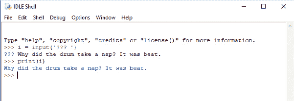

## 第七章：使用函数和模块回收你的代码


想想你每天扔掉多少东西：水瓶、汽水罐、薯片袋、塑料三明治包装袋、曾装胡萝卜条或苹果片的袋子、购物袋、报纸、杂志等等。现在想象一下，所有这些垃圾都被堆放在你车道的尽头，且没有分类纸张、塑料和铁罐。

你可能会尽量回收利用，这很好，因为没有人喜欢在上学的路上爬过一堆垃圾。与其坐在一堆又大又脏的垃圾堆里，回收后的玻璃瓶被熔化并转变成新的罐子和瓶子；纸张被制成再生纸；塑料被转化为更重的塑料制品。我们重新利用那些本应被丢弃的物品。

在编程世界中，回收同样很重要。你的程序可能不会在一堆垃圾下消失，但如果你从不重用任何代码，你将输入大量内容，最终手指可能会疼到无法忍受！回收还可以使你的代码更简洁、更易读。


正如你将在本章中学到的，Python 提供了多种重用代码的方法。

### 使用函数

*函数* 是告诉 Python 做某事的代码块。它们是重用代码的一种方式——你可以在程序中反复使用函数。Python 提供了许多可以使用的函数，这些被称为*内置函数*，或*内建函数*（有关内建函数的更多信息，请参见 附录 B）。模块中也有可用的函数（下文会讲到），你甚至可以自己编写函数。

我们在上一章就开始学习函数，当时我们使用 range 和 list 来实现 Python 的计数：

```py
>>> list(range(0, 5))
[0, 1, 2, 3, 4]
```

自己输入一串连续的数字并不太难，但列表越大，输入的内容就越多。使用函数时，你可以轻松地创建一个包含千个数字的列表。

以下是一个使用 list 和 range 函数生成数字列表的示例：

```py
>>> list(range(0, 1000))
[0, 1, 2, 3, 4, 5, 6, 7, 8, 9, 10, 11, 12, 13, 14, 15, 16..., 997, 998, 999]
```

当你写简单程序时，函数非常方便。一旦你开始编写长且复杂的程序——比如游戏——函数就变得*不可或缺*（假设你希望在这个世纪完成编写程序）。

让我们来看看如何编写我们自己的函数。

### 函数的组成部分

一个函数有三个部分：名称、参数和函数体。以下是一个简单函数的示例：

```py
>>> def testfunc(myname):
        print(f'hello {myname}')
```

这个函数的名称是 testfunc。它有一个参数 myname，函数体是紧随 def 这一行（*define*的缩写）后的代码块。*参数* 是在函数使用期间存在的变量。

你可以通过调用函数的名称并使用括号将参数值传递进去来运行函数：

```py
>>> testfunc('Mary')
hello Mary
```

函数可以接受任意数量的参数：

```py
>>> def testfunc(fname, lname):
        print(f'Hello {fname} {lname}')
```

使用多个参数时，确保用逗号分隔各个值：

```py
>>> testfunc('Mary', 'Smith')
Hello Mary Smith
```

我们也可以先创建变量，然后使用它们来调用函数：

```py
>>> firstname = 'Joe'
>>> lastname = 'Robertson'
>>> testfunc(firstname, lastname)
Hello Joe Robertson
```

函数可以通过 return 语句返回一个值。例如，你可以写一个函数来计算你节省了多少钱：

```py
>>> def savings(pocket_money, paper_route, spending):
        return pocket_money + paper_route - spending
```

这个函数有三个参数。它将前两个参数（pocket_money 和 paper_route）相加，再减去最后一个参数（spending）。结果会返回，并且可以赋值给一个变量（就像我们设置其他值给变量一样）或打印出来：

```py
>>> print(savings(10, 10, 5))
15
```

我们传入 10、10 和 5 三个参数，savings 函数计算出 15 作为结果，然后返回这个值。

### 变量和作用域

一个在函数体内的变量在函数运行结束后不能再次使用，因为它只存在于函数内部。在编程的世界中，一个变量可以在哪些地方使用被称为它的*作用域*。让我们来看一个使用几个变量但没有任何参数的简单函数：

```py
>>> def variable_test():
        first_variable = 10
        second_variable = 20
        return first_variable * second_variable
```

在这个例子中，我们创建了变量 _test 函数，它将 first_variable 和 second_variable 相乘并返回结果：

```py
>>> print(variable_test())
200
```

如果我们使用 print 调用这个函数，我们得到 200。然而，如果我们尝试在函数的代码块外打印 first_variable（或 second_variable，实际上是一样的）的内容，我们会得到一个错误信息：

```py
>>> print(first_variable)
Traceback (most recent call last):
  File "<pyshell#50>", line 1, in <module>
    print(first_variable)
NameError: name 'first_variable' is not defined
```

如果一个变量在函数外定义，它有不同的作用域。例如，让我们在创建函数之前定义一个变量，然后在函数内部尝试使用它：

```py
➊ >>> another_variable = 100
  >>> def variable_test2():
          first_variable = 10
          second_variable = 20
       ➋ return first_variable * second_variable * another_variable
```

在这段代码中，尽管变量 first_variable 和 second_variable 不能在函数外使用，但变量 another_variable（它是在函数外创建的➊）可以在函数内部使用➋。

这是调用这个函数的结果：

```py
>>> print(variable_test2())
20000
```

现在，假设你正在用一种经济的材料，比如回收的锡罐，来建造一艘宇宙飞船。你每周可以压扁两个罐子来打造宇宙飞船的弯曲墙壁，但你需要大约 500 个罐子才能完成机身。让我们尝试写一个函数，打印出每周压扁的总罐子数量，持续一整年。


我们的函数将计算每周我们压扁了多少罐子，罐子的数量作为参数（这使得以后修改罐子数量更容易）：

```py
>>> def spaceship_building(cans):
        total_cans = 0
        for week in range(1, 53):
 total_cans = total_cans + cans
            print(f'Week {week} = {total_cans} cans')
```

在函数的第一行，我们创建了 total_cans 变量并将其值设置为 0。然后，我们创建一个循环来遍历一年的每周，并将每周压扁的罐子数量加起来。这段代码构成了我们函数的内容，最后两行构成了 for 循环的另一个代码块。

让我们尝试在 Python Shell 中输入这个函数，并用不同的罐子数量调用它，从 2 开始：

```py
>>> spaceship_building(2)
Week 1 = 2 cans
Week 2 = 4 cans
Week 3 = 6 cans
Week 4 = 8 cans
Week 5 = 10 cans
Week 6 = 12 cans
Week 7 = 14 cans
Week 8 = 16 cans
...
Week 50 = 100 cans
Week 51 = 102 cans
Week 52 = 104 cans

>>> spaceship_building(10)
Week 1 = 10 cans
Week 2 = 20 cans
Week 3 = 30 cans
Week 4 = 40 cans
Week 5 = 50 cans
...
Week 48 = 480 cans
Week 49 = 490 cans
Week 50 = 500 cans
Week 51 = 510 cans
Week 52 = 520 cans
```

这个函数可以在每周压扁不同数量的罐子的情况下重复使用，比每次想尝试不同数量时重新输入 for 循环更高效。当我们运行 spaceship_building(10)时，我们可以看到在第 50 周时，我们会有足够的罐子来建造宇宙飞船的墙壁。

函数也可以组合成模块，这使得 Python *非常*有用，而不仅仅是稍微有用。

### 使用模块

*模块*用于将函数、变量和其他内容组织成更大、更强大的程序。有些模块是内置的，有些则需要单独下载。比如有帮助编写游戏的模块（如内置的 tkinter 和非内置的 PyGame），也有用于处理图像的模块（如 Python 图像库 Pillow），还有用于绘制三维图形的模块（如 Panda3D）。


模块可以用来做各种有用的事情。例如，如果你在设计一个模拟游戏，并且希望世界根据现实世界发生变化，你可以使用内置的 `time` 模块计算当前的日期和时间：

```py
>>> import time
```

`import` 命令告诉 Python 我们想使用 `time` 模块。

然后，我们可以通过使用点符号调用此模块中可用的函数。（我们在 第四章 中使用了类似的函数来处理 `turtle` 模块，如 `t.forward(50)`。）例如，下面是我们如何调用 `time` 模块中的 `asctime` 函数：

```py
>>> print(time.asctime())
Tue Aug 12 07:05:32 2025
```

`asctime` 函数是 `time` 模块的一部分，它返回当前的日期和时间作为一个字符串。

现在假设你想要求某人输入一个值，比如他们的出生日期或年龄。你可以使用 `print` 语句显示一条信息，并使用 `sys`（即 *系统*）模块，这个模块包含了与 Python 系统交互的工具。首先，我们导入 `sys` 模块：


```py
>>> import sys
```

在 `sys` 模块中，有一个特殊的对象叫做 `stdin`（即 *标准输入*），它提供了一个有用的函数 `readline`。`readline` 函数用于读取键盘上输入的一行文本，直到你按下 ENTER 键。（我们将在 第八章 中查看对象的工作原理。）要测试 `readline`，可以在 Python Shell 中输入以下代码：

```py
>>> import sys
>>> print(sys.stdin.readline())
```

如果你接着输入一些文字并按下 ENTER，这些文字会在 Python Shell 中显示出来。

回想一下我们在 第五章 中编写的代码，使用了 `if` 语句：

```py
>>> if age >= 10 and age <= 13:
        print('What is 13 + 49 + 84 + 155 + 97? A headache!')
    else:
        print('Huh?')
```

我们现在可以让某人输入值，而不需要在 `if` 语句之前就创建 `age` 变量并赋予它一个具体的值。首先，让我们将代码改成一个函数：

```py
>>> def silly_age_joke(age):
        if age >= 10 and age <= 13:
            print('What is 13 + 49 + 84 + 155 + 97? A headache!')
        else:
            print('Huh?')
```

现在，你可以通过输入函数的名称并在括号中输入数字来调用函数。这样能正常工作吗？

```py
>>> silly_age_joke(9)
Huh?
>>> silly_age_joke(10)
What is 13 + 49 + 84 + 155 + 97? A headache!
```

它工作了！现在让我们让函数要求输入一个人的年龄。（你可以随时增加或修改函数的内容。）

```py
>>> def silly_age_joke():
        print('How old are you?')
     ➊ age = int(sys.stdin.readline())
     ➋ if age >= 10 and age <= 13:
            print('What is 13 + 49 + 84 + 155 + 97? A headache!')
        else:
            print('Huh?')
```

你认出了函数 `int` ➊ 吗？它将字符串转换为数字。我们包含了这个函数，因为 `sys.stdin.readline()` 返回的是用户输入的字符串，但我们需要一个数字来与数字 10 和 13 ➋ 进行比较。要自己尝试一下，请调用该函数而不传递任何参数，然后在显示 “How old are you?” 时输入一个数字：

```py
>>> silly_age_joke()
How old are you?
10
What is 13 + 49 + 84 + 155 + 97? A headache!
>>> silly_age_joke()
How old are you?
15
Huh?
```

第一次调用函数时，它会显示“你多大了？”然后我们输入 10，它打印出笑话。第二次我们输入 15，它打印出“哈？”

### 输入函数

`sys.stdin.readline` 并不是读取键盘输入的唯一方式。一个更简单的选择是内置的 `input` 函数。`input` 函数接受一个可选的提示参数（你想要显示的消息字符串），然后返回输入的内容，直到按下 ENTER 键。图 7-1 展示了运行这段代码时的结果：

```py
i = input('??? ')
print(i)
```



*图 7-1：使用输入函数*

让我们将 silly_age_joke 函数重写为使用输入：

```py
>>> def silly_age_joke():
        age = int(input('How old are you?\n'))
        if age >= 10 and age <= 13:
            print('What is 13 + 49 + 84 + 155 + 97? A headache!')
        else:
            print('Huh?')
```

除了行数略少外，早期代码与此版本的另一个区别在于我们在字符串末尾添加了一个*换行*字符（∖n）('How old are you?∖n')。换行符只是将光标从当前行移动到下一行。使用 print 时这一操作会自动发生，但在输入函数中则不会。

不过，这段代码的效果和以前完全一样。

### 你学到了什么

在本章中，你学会了如何在 Python 中使用函数制作可重用的代码块，并使用模块提供的函数。你了解了变量的作用域如何控制它们是否可以在函数内外访问。你还学会了如何使用 `def` 关键字创建函数，并如何导入模块来使用其内容。

### 编程难题

尝试以下示例来实验创建你自己的函数。解决方案可以在 *[`python-for-kids.com`](http://python-for-kids.com)* 找到。

#### #1: 基本月球体重函数

在 第六章 的编程难题中，我们创建了一个 for 循环来确定你在月球上的体重，时间跨度为 15 年。这个 for 循环可以很容易地转化为一个函数。尝试创建一个接受起始体重并每年增加一定体重的函数。你可以使用如下代码来调用这个新函数：

```py
>>> moon_weight(30, 0.25)
```

#### #2: 月球体重函数与年数

拿到你刚创建的函数，并将其修改为计算不同时间段的体重变化，例如 5 年或 20 年。务必修改函数，使其接受三个参数：初始体重、每年增加的体重和年数：

```py
>>> moon_weight(90, 0.25, 5)
```

#### #3: 月球体重程序

你可以不使用简单的函数并将值作为参数传入，而是使用 `sys.stdin.readline()` 或 `input()` 创建一个小程序来提示输入这些值。在这种情况下，你可以直接调用没有任何参数的函数：

```py
>>> moon_weight()
```

该函数将显示一条消息，询问起始体重，第二条消息询问每年增加的体重，最后一条消息询问年份。你会看到类似下面的内容：

```py
Please enter your current Earth weight
45
Please enter the amount your weight might increase each year
0.4
Please enter the number of years
12
```

如果你使用 `sys.stdin.readline()`，记得在创建函数之前先导入 sys 模块：

```py
>>> import sys
```

#### #4: 火星体重程序

让我们修改月球体重计算程序，改为计算在火星上的体重——这次是为你全家计算。这个函数应该要求输入每个家庭成员的体重，计算他们在火星上的体重（通过将体重乘以 0.3782），然后加总并在最后显示总重量。你可以用多种方式来编写这个代码；重要的是它最终能够显示总重量。
