## 第八章：如何使用类和对象


为什么长颈鹿像人行道一样？因为长颈鹿和人行道都是*事物*，在英语中被称为名词，在 Python 中被称为*对象*。在编程中，对象是组织代码的一种方式，并且将事物拆解成更易于操作复杂想法的模块。（我们在第四章中使用过对象，当时我们使用了乌龟模块的 Turtle 对象。）

要全面理解 Python 中对象的工作方式，我们需要思考对象的类型。我们从长颈鹿和人行道开始。

长颈鹿是一种哺乳动物，哺乳动物又是动物的一种。长颈鹿也是一种有生命的物体——它是活的。

关于人行道，没有什么好说的，它只是一个非生物体。我们可以称它为无生命体（换句话说，它是死的）。*哺乳动物*、*动物*、*有生命*和*无生命*这些术语都是分类事物的方式。

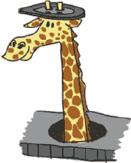

### 将事物拆分成类别

在 Python 中，对象由*类*定义，类将对象分为不同的组。例如，图 8-1 中的树状图显示了长颈鹿和人行道根据我们之前的定义所属于的类。

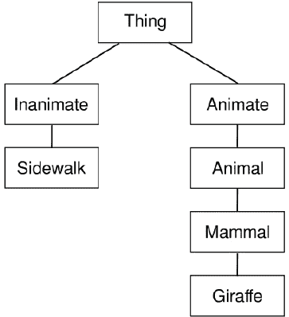

*图 8-1：一些类的树状图*

主要类是 Thing。在 Thing 类下，我们有 Inanimate 和 Animate。这些类进一步细分为 Inanimate 的 Sidewalk 和 Animate 的 Animal、Mammal 和 Giraffe。

我们可以使用类来组织代码片段。例如，考虑乌龟模块。Python 的乌龟模块能做的所有事情——例如前进、后退、左转和右转——都是 Turtle 类中的函数。一个对象是某个类的成员，我们可以为一个类创建任意数量的对象，这一点我们很快就会讲到。

现在，让我们从顶部开始创建与树状图中相同的类集合。我们使用 class 关键字来定义类，后面跟着一个名称。Thing 是最广泛的类，因此我们首先创建它：

```py
>>> class Thing:
        pass

```

我们命名类为 Thing，并使用 pass 语句告诉 Python 我们不会提供更多信息。pass 关键字用于当我们想提供一个类或函数，但暂时不想填充具体细节时。

接下来，我们将添加其他类并建立它们之间的关系。

### 子类与父类

如果一个类是另一个类的组成部分，它被认为是该类的*子类*，而另一个类则是它的*父类*。类可以既是其他类的*子类*，也可以是其他类的*父类*。在我们的树状图中，一个类位于另一个类上方时，它是父类，位于下方的类则是子类。例如，Inanimate 和 Animate 都是 Thing 类的子类，这意味着 Thing 是它们的父类。

要告诉 Python 一个类是另一个类的子类，我们在新类的名称后加上父类的名称，像这样：

```py
>>> class Inanimate(Thing):
        pass

>>> class Animate(Thing):
        pass

```

在这里，我们创建了一个名为 Inanimate 的类，并告诉 Python 它的父类是 Thing。接下来，我们创建了一个名为 Animate 的类，并告诉 Python 它的父类也是 Thing。

让我们创建一个名为 Sidewalk 的类，父类为 Inanimate：

```py
>>> class Sidewalk(Inanimate):
        pass

```

我们还可以使用它们的父类来组织 Animal、Mammal 和 Giraffe 类：

```py
>>> class Animal(Animate):
        pass

>>> class Mammal(Animal):
        pass

>>> class Giraffe(Mammal):
        pass

```

### 向类中添加对象

现在我们有了一堆类，但我们如何将更多信息添加到这些类中呢？假设我们有一只名叫 Reginald 的长颈鹿。我们知道他属于 Giraffe 类，但我们在编程术语中用什么来描述这只名叫 Reginald 的单独的长颈鹿呢？

我们称 Reginald 为 Giraffe 类的*对象*（也称为*实例*）。为了将 Reginald “引入” Python，我们使用这段小代码：

```py
>>> reginald = Giraffe()

```

这段代码告诉 Python 创建一个 Giraffe 类的对象，并将其赋值给 reginald 变量。就像调用函数时一样，类名后面跟着括号。在本章后面，我们将看到如何创建对象并使用括号中的参数。

但是，reginald 对象做什么呢？目前，什么也不做。为了使我们的对象更有用，当我们创建类时，我们还需要定义可以与该类中的对象一起使用的函数。与其在定义类后立即使用 pass 关键字，我们可以添加函数定义。

### 定义类的函数

第七章介绍了函数作为重用代码的一种方式。当我们定义与类相关联的函数时，我们的做法与定义其他函数相同，只不过我们将其缩进到类定义之下。例如，这是一个与类无关的普通函数：

```py
>>> def this_is_a_normal_function():
        print('I am a normal function')

```

这里有几个为类定义的函数：

```py
>>> class ThisIsMySillyClass:
        def this_is_a_class_function():
            print('I am a class function')
        def this_is_also_a_class_function():
            print('I am also a class function. See?')

```

### 添加类特征

考虑我们在“子类和父类”一节中定义的 Animate 类的子类。我们可以为每个类添加描述它是什么以及它能做什么的特征。*特征*是所有该类（及其子类）成员所共有的属性。

例如，所有动物有什么共同点？首先，它们都会呼吸、移动和进食。那么哺乳动物呢？哺乳动物用乳汁喂养后代，它们也会呼吸、移动和进食。我们知道长颈鹿吃树上的高处叶子。像所有哺乳动物一样，它们也用乳汁喂养后代，呼吸、移动和进食。当我们将这些特征添加到我们的树形图时，得到的结果类似于图 8-2。

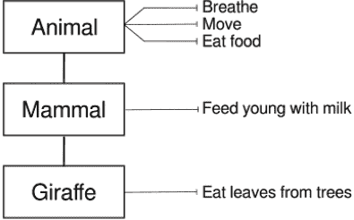

*图 8-2：具有特征的类*

这些特征可以被视为动作或函数——即该类的对象可以做的事情。

要向类中添加函数，我们使用 def 关键字。所以 Animal 类看起来会像这样：

```py
>>> class Animal(Animate):
        def breathe(self):
            pass
        def move(self):
            pass
        def eat_food(self):
            pass

```

在这段代码的第一行，我们像之前一样定义了类，但在下一行我们不再使用 pass，而是定义了一个名为 breathe 的函数，并给它提供了 self 参数。self 参数是类中一个函数调用另一个函数（包括父类中的函数）的一种方式。稍后我们会看到这个参数的使用。

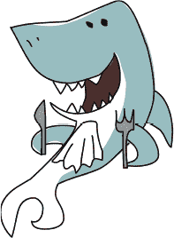

在下一行，pass 告诉 Python 我们不会提供更多关于 breathe 函数的信息，因为它现在什么也不做。然后我们添加了 move 和 eat_food 函数，并且对这两个函数都使用了 pass 关键字。稍后我们会重新创建类，并在函数中加入适当的代码。这是开发程序的一种常见方式。

**注意**

*通常，程序员会创建没有任何功能的类，作为在深入细节之前确定类应执行什么的方式。*

我们还可以向 Mammal 和 Giraffe 类添加函数。每个类都能够使用其父类的特征（或函数），这意味着你不需要创建一个非常复杂的类。相反，你可以将函数放在最高的父类中，只要该特征适用即可。（这使得你的类更加简洁且易于理解。）

```py
>>> class Mammal(Animal):
        def feed_young_with_milk(self):
            pass

>>> class Giraffe(Mammal):
        def eat_leaves_from_trees(self):
            pass

```

在上面的代码中，Mammal 类提供了一个名为 feed _young_with_milk 的函数。Giraffe 类是 Mammal 类的子类（或*子类*），并提供了另一个函数：eat_leaves_from_trees。

### 为什么使用类和对象？

我们现在已经给类添加了函数，但如果可以仅仅写出像 breathe、move、eat_food 这样的普通函数，为什么还要使用类和对象呢？

为了回答这个问题，我们将使用我们之前创建的名为 Reginald 的长颈鹿对象，它是 Giraffe 类的一个实例，像这样：

```py
>>> reginald = Giraffe()

```

因为 Reginald 是一个对象，我们可以调用（或运行）Giraffe 类及其父类提供的函数。我们通过使用点号（.）操作符和函数名称来对对象调用函数。要告诉 Reginald 移动或吃东西，我们可以像这样调用这些函数：

```py
>>> reginald = Giraffe()
>>> reginald.move()
>>> reginald.eat_leaves_from_trees()

```

假设 Reginald 有一个长颈鹿朋友叫 Harriet。让我们再创建一个名为 harriet 的 Giraffe 对象：

```py
>>> harriet = Giraffe()

```

因为我们正在使用对象和类，所以当我们想要运行 move 函数时，可以告诉 Python 我们在谈论哪个长颈鹿。例如，如果我们想让 Harriet 移动，但让 Reginald 保持原地，我们可以通过使用我们的 harriet 对象来调用 move 函数，像这样：

```py
>>> harriet.move()

```

在这种情况下，只有 Harriet 会移动。

让我们稍微修改一下我们的类，让这一点更加明显。给每个函数添加一个 print 语句，而不是使用 pass：

```py
>>> class Animal(Animate):
        def breathe(self):
            print('breathing')
        def move(self):
            print('moving')
        def eat_food(self):
            print('eating food')
>>> class Mammal(Animal):
        def feed_young_with_milk(self):
            print('feeding young')

>>> class Giraffe(Mammal):
        def eat_leaves_from_trees(self):
            print('eating leaves')

```

现在，当我们创建我们的 Reginald 和 Harriet 对象并对它们调用函数时，我们可以看到一些实际的效果发生：

```py
>>> reginald = Giraffe()
>>> harriet = Giraffe()
>>> reginald.move()
moving
>>> harriet.eat_leaves_from_trees()
eating leaves

```

在前两行中，我们创建了变量 reginald 和 harriet，它们是 Giraffe 类的对象。接下来，我们调用 reginald 的 move 函数，Python 在下一行输出“moving”。同样，我们调用 harriet 的 eat_leaves_from_trees 函数，Python 输出“eating leaves”。如果这些是现实中的长颈鹿，而不是计算机中的对象，那么一只长颈鹿会走路，另一只则在吃叶子。

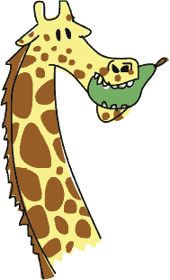

**注意**

*为类定义的函数实际上称为方法。两者几乎可以互换使用，唯一的区别是方法只能在类的对象上调用。另一种说法是，方法与类关联，而函数则不与类关联。由于它们几乎相同，因此在本书中我们将使用函数这个术语。*

### 图片中的对象和类

让我们尝试采用更具图形化的方法来理解对象和类，并回到我们在第四章中玩过的海龟模块。当我们使用 turtle.Turtle()时，Python 会创建一个由海龟模块提供的 Turtle 类对象（类似于我们的 reginald 和 harriet 对象）。我们可以像创建两只长颈鹿一样，创建两个 Turtle 对象（分别命名为 Avery 和 Kate）：

```py
>>> import turtle
>>> avery = turtle.Turtle()
>>> kate = turtle.Turtle()

```

每个海龟对象（avery 和 kate）都是 Turtle 类的成员。

现在，物体开始展现它们的强大之处。创建了我们的 Turtle 对象后，我们可以在每个对象上调用函数，它们将独立绘制。试试下面这段代码：

```py
>>> avery.forward(50)
>>> avery.right(90)
>>> avery.forward(20)

```

通过这一系列指令，我们告诉 Avery 向前移动 50 个像素，向右转 90 度，然后向前移动 20 个像素，最终面朝下。记住，海龟总是从面朝右方开始。

现在是时候移动 Kate 了。

```py
>>> kate.left(90)
>>> kate.forward(100)

```

我们让 Kate 向左转 90 度，然后向前移动 100 个像素，这样她最终面朝上。到目前为止，我们已经有了一条带箭头的线，箭头朝向两个不同的方向，每个箭头的头部表示一个不同的海龟对象：Avery 指向下方，Kate 面朝上（参见图 8-3）。

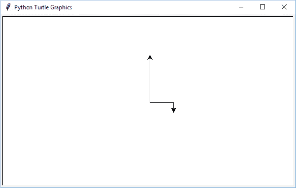

*图 8-3：Kate 和 Avery*

现在让我们再添加一只海龟 Jacob，并在不干扰 Kate 或 Avery 的情况下移动它：

```py
>>> jacob = turtle.Turtle()
>>> jacob.left(180)
>>> jacob.forward(80)

```

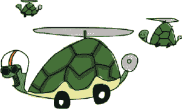

首先，我们创建一个新的海龟对象，名为 jacob；然后将它向左转 180 度并向前移动 80 个像素。我们使用三只海龟的绘图应当像图 8-4 那样。

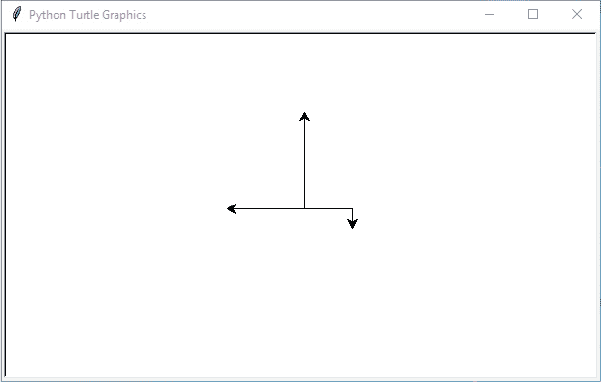

*图 8-4：Kate、Avery 和 Jacob*

每次我们调用 turtle.Turtle()来创建一只海龟时，我们都会添加一个新的独立对象。每个对象仍然是 Turtle 类的实例，我们可以在每个对象上使用相同的函数。但由于我们使用的是对象，我们可以独立地移动每只海龟。就像我们独立的长颈鹿对象（Reginald 和 Harriet）一样，Avery、Kate 和 Jacob 是独立的 Turtle 对象。如果我们使用与已创建对象相同的变量名来创建新对象，旧的对象不会一定消失。

### 对象和类的其他有用功能

类和对象使得组织函数变得更加简单。当我们想将一个程序分成更小的块来思考时，它们也非常有用。

例如，考虑一个庞大的软件应用程序，比如文字处理器或 3D 电脑游戏。对于大多数人来说，完全理解像这样的庞大程序几乎是不可能的，因为代码量非常大。但是，如果将这些巨大的程序拆分成较小的部分，每一部分都会变得容易理解——当然，前提是你了解它的编程语言！

在编写大型程序时，将程序拆分开还允许你将工作分配给其他程序员。最复杂的程序（如你的网页浏览器）是由许多人或不同团队的人在全球范围内同时在不同部分工作时写成的。

假设我们想扩展本章中创建的一些类（**动物**、**哺乳动物**和**长颈鹿**），但是我们有太多工作要做，而我们的朋友们愿意提供帮助。我们可以将写代码的工作分配给不同的人，一个人负责**动物**类，另一个人负责**哺乳动物**类，另一个人负责**长颈鹿**类。

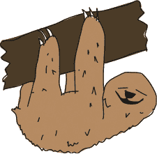

### 继承的函数

你可能会意识到，最终负责**长颈鹿**类的人很幸运，因为由负责**动物**类和**哺乳动物**类的人创建的任何函数，也可以被**长颈鹿**类使用。**长颈鹿**类*继承*了**哺乳动物**类的函数，而**哺乳动物**类又继承了**动物**类的函数。换句话说，当我们创建一个**长颈鹿**对象时，我们可以使用定义在**长颈鹿**类中的函数，也可以使用定义在**哺乳动物**和**动物**类中的函数。同样，如果我们创建一个**哺乳动物**对象，我们可以使用**哺乳动物**类以及它的父类**动物**类中定义的函数。

再次查看**动物**（Animal）、**哺乳动物**（Mammal）和**长颈鹿**（Giraffe）类之间的关系。**动物**类是**哺乳动物**类的父类，**哺乳动物**类是**长颈鹿**类的父类（图 8-5）。

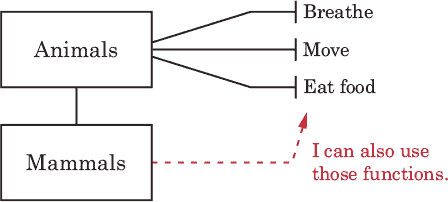

*图 8-5：类和继承的函数*

即使**Reginald**是**长颈鹿**类的对象，我们仍然可以调用在**动物**类中定义的**move**函数，因为在任何父类中定义的函数都可以在其子类中使用：

```py
>>> reginald = Giraffe()
>>> reginald.move()
moving

```

实际上，我们在**动物**类和**哺乳动物**类中定义的所有函数都可以从我们的**Reginald**对象中调用，因为这些函数是继承过来的：

```py
>>> reginald = Giraffe()
>>> reginald.breathe()
breathing
>>> reginald.eat_food()
eating food
>>> reginald.feed_young_with_milk()
feeding young

```

在这段代码中，我们创建了一个名为**Reginald**的**长颈鹿**类对象。当我们调用每个函数时，无论该函数是定义在**长颈鹿**类中，还是在父类中，都将打印一条信息。

### 函数调用其他函数

当我们在对象上调用函数时，我们使用对象的变量名。例如，我们可以像这样在长颈鹿**Reginald**上调用**move**函数：

```py
>>> reginald.move()

```

要让长颈鹿类中的某个函数调用 `move` 函数，我们需要使用 `self` 参数。`self` 参数是类中一个函数调用另一个函数的一种方式。例如，假设我们向长颈鹿类中添加一个名为 `find_food` 的函数：

```py
>>> class Giraffe(Mammal):
        def find_food(self):
            self.move()
            print('I\'ve found food!')
            self.eat_food()

```

我们创建了一个将两个其他函数结合的函数，这在编程中是很常见的。通常，你会编写一个有用的函数，然后可以在另一个函数中使用它。（我们将在第十一章中做这件事，那时我们将编写更复杂的函数来创建一个游戏。）

让我们使用 `self` 向长颈鹿类添加一些函数：

```py
>>> class Giraffe(Mammal):
        def find_food(self):
            self.move()
            print('I\'ve found leaves!')
            self.eat_food()
        def eat_leaves_from_trees(self):
            print('tear leaves from branches')
            self.eat_food()
        def dance_a_jig(self):
            self.move()
            self.move()
            self.move()
            self.move()

```

我们使用来自父类 Animal 的 `eat_food` 和 `move` 函数来定义长颈鹿类的 `eat_leaves_from_trees` 和 `dance_a_jig`，因为这些是继承来的函数。通过添加调用其他函数的函数，当我们创建这些类的对象时，我们可以调用一个同时完成多项任务的函数。看看当我们调用 `dance_a_jig` 函数时会发生什么：

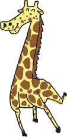

```py
>>> reginald = Giraffe()
>>> reginald.dance_a_jig()
moving
moving
moving
moving

```

在这段代码中，我们的长颈鹿移动了四次（也就是说，移动的文字被打印了四次）。

如果我们调用 `find_food` 函数，打印出来的会有三行：

```py
>>> reginald.find_food()
moving
I've found leaves!
eating food

```

### 初始化对象

有时在创建对象时，我们希望为以后使用设置一些值（也叫做 *属性*）。当我们 *初始化* 一个对象时，我们就是在为它的后续使用做准备。

例如，假设我们希望在创建（或初始化）长颈鹿对象时设置它们的斑点数。为此，我们创建一个 `__init__` 函数（注意每边有两个下划线字符，总共四个）。`__init__` 函数在对象首次创建时设置对象的属性。Python 会在我们创建新对象时自动调用这个函数。以下是如何使用它。

```py
>>> class Giraffe(Mammal):
        def __init__(self, spots):
            self.giraffe_spots = spots

```

首先，我们使用 `self` 和 `spots` 参数定义 `__init__` 函数。与我们在类中定义的其他函数一样，`__init__` 函数也需要将 `self` 作为第一个参数。接下来，我们通过 `self` 参数将 `spots` 参数设置为一个名为 `giraffe_spots` 的对象变量（即它的属性）。你可以把这一行代码理解为：“将 `spots` 参数的值保存起来供以后使用（使用 `giraffe_spots` 对象变量）。”就像类中的一个函数可以使用 `self` 参数调用另一个函数一样，类中的变量也通过 `self` 来访问。

接下来，如果我们创建几个新的长颈鹿对象（分别命名为 ozwald 和 gertrude），并显示它们的斑点数，你可以看到初始化函数的作用：

```py
>>> ozwald = Giraffe(100)
>>> gertrude = Giraffe(150)
>>> print(ozwald.giraffe_spots)
100
>>> print(gertrude.giraffe_spots)
150

```

首先，我们使用参数值 100 创建了一个长颈鹿类的实例。这样会调用 `__init__` 函数，并将 100 作为斑点参数的值。接着，我们创建了另一个斑点数为 150 的长颈鹿类实例。最后，我们打印每个长颈鹿对象的 `giraffe_spots` 变量，结果是 100 和 150。它成功了！

请记住，当我们创建一个类的对象时，比如在这个例子中的 ozwald，我们可以使用点操作符和我们想要使用的变量或函数的名称来引用它们（例如，ozwald.giraffe_spots）。但是当我们在类内创建函数时，我们通过使用 self 参数来引用这些相同的变量（以及其他函数）（例如 self.giraffe_spots）。

### 你学到了什么

在这一章中，我们使用类来创建事物的类别，并创建了这些类的对象（或实例）。你学到了类的子类如何继承父类的函数，而且即使两个对象属于同一个类，它们也不一定是克隆。例如，两个长颈鹿对象可以有自己独特的斑点数。

你学会了如何在对象上调用（或运行）函数，以及对象变量如何用来保存这些对象中的值。最后，我们在函数中使用了 self 参数来引用其他函数和变量。这些概念是 Python 的基础，你将在本书的其余部分多次看到它们。

### 编程难题

尝试以下例子，实验一下创建你自己的函数。解决方案可以在*[`python-for-kids.com`](http://python-for-kids.com)*找到。

#### #1：长颈鹿舞蹈

为长颈鹿类添加函数来移动长颈鹿的左右脚向前和向后。一个让左脚向前移动的函数可能如下所示：

```py
>>> def left_foot_forward(self):
        print('left foot forward')

```

然后创建一个名为 dance 的函数来教我们的长颈鹿跳舞（该函数将调用你刚才创建的四个脚步函数）。调用这个新函数的结果将是一个简单的舞蹈：

```py
>>> harriet = Giraffe()
>>> harriet.dance()
left foot forward
left foot back
right foot forward
right foot back
left foot back
right foot back
right foot forward
left foot forward 
```

#### #2：乌龟叉形图

使用四个 Turtle 对象创建以下侧向叉形图（线条的确切长度不重要）。记得首先导入 turtle 模块！

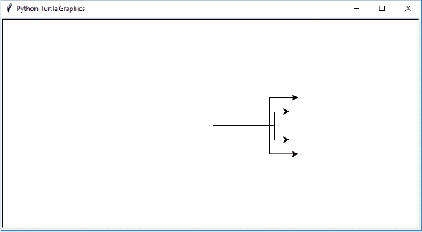

#### #3：两个小螺旋

使用两个 Turtle 对象创建以下两个小螺旋图形（同样，螺旋的大小不重要）。

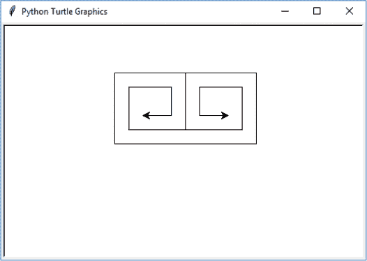

#### #4：四个小螺旋

让我们拿来在前面代码中创建的两个螺旋图形，并制作它们的镜像，创造出四个螺旋图形，应该看起来像以下的图像。

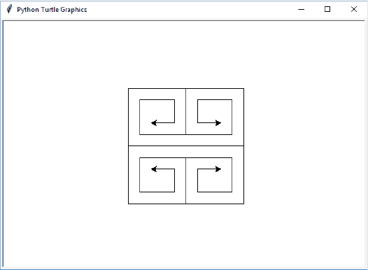
