## 9

更多的 Turtle 图形


让我们回到我们在第四章中开始使用的 turtle 模块。在本章中，我们将学习 Python 海龟能做的不仅仅是绘制简单的黑色线条。你可以使用它们绘制更复杂的几何形状，创建不同的颜色，甚至给形状填充颜色。

### 从基础正方形开始

我们之前已经使用 turtle 模块绘制了简单的形状。让我们导入 turtle 模块并创建 Turtle 对象：

```py
>>> import turtle
>>> t = turtle.Turtle()

```

我们在第四章中使用了以下代码来创建一个正方形：

```py
>>> t.forward(50)
>>> t.left(90)
>>> t.forward(50)
>>> t.left(90)
>>> t.forward(50)
>>> t.left(90)
>>> t.forward(50)
>>> t.left(90)

```

在第六章中，我们学习了 `for` 循环。利用我们新学到的知识，我们可以使用 `for` 循环来简化这段代码，如下所示：

```py
>>> t.reset()
>>> for x in range(1, 5):
        t.forward(50)
        t.left(90)

```

在第一行，我们告诉 Turtle 对象重置自己。接下来，我们启动一个 `for` 循环，范围从 1 到 4（即 `range(1, 5)`）。在接下来的每一行中，每次循环执行时，我们会前进 50 像素并向左转 90 度。因为我们使用了 `for` 循环，这段代码比之前的版本短了一些——忽略重置行，我们从八行代码缩减到了三行。

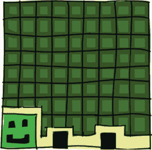

### 绘制星星

现在，通过对我们的 `for` 循环进行一些简单的修改，我们可以创建更有趣的东西。输入以下代码：

```py
>>> t.reset()
>>> for x in range(1, 9):
        t.forward(100)
        t.left(225)

```

这段代码生成了一个八点星，如图 9-1 所示。

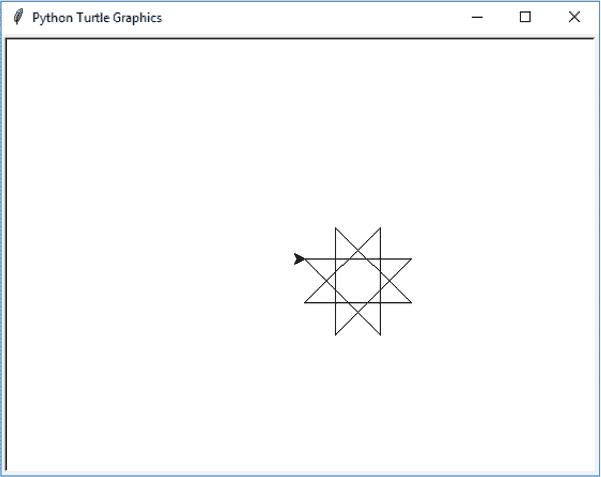

*图 9-1：八点星星*

这段代码本身与我们用来绘制正方形的代码非常相似，只是有一些不同：

+   我们不再使用 `range(1, 5)` 循环四次，而是使用 `range(1, 9)` 循环八次。

+   我们不再前进 50 像素，而是前进 100 像素。

+   我们不再转动 90 度，而是向左转 225 度。

让我们再进一步改进我们的星星。通过使用 175 度的角度并循环 37 次，我们可以制作一个有更多点的星星。输入以下代码：

```py
>>> t.reset()
>>> for x in range(1, 38):
        t.forward(100)
        t.left(175)

```

你可以在图 9-2 中看到运行这段代码的结果。

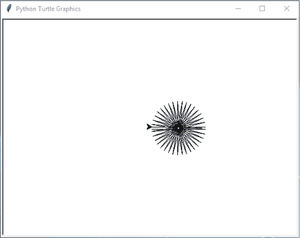

*图 9-2：多点星星*

现在，尝试输入这段代码来生成一个螺旋星：

```py
>>> t.reset()
>>> for x in range(1, 20):
        t.forward(100)
        t.left(95)

```

通过改变转向的角度并减少循环次数，海龟最终绘制出一种完全不同风格的星星，你可以在图 9-3 中看到它。


*图 9-3：螺旋星*

使用类似的代码，我们可以创建多种形状，从基本的正方形到螺旋星星。正如你所看到的，使用 `for` 循环让绘制这些形状变得更加简单。如果没有 `for` 循环，我们的代码将需要大量繁琐的输入。

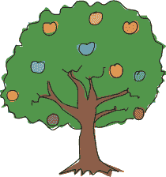

让我们尝试使用 `if` 语句来控制海龟的转向方式，并绘制另一个星星的变体。在这个例子中，我们希望海龟第一次转动一个角度，接下来转动另一个角度：

```py
   t.reset()
➊ for x in range(1, 19):
    ➋ t.forward(100)
       if x % 2 == 0:
           t.left(175)
       else:
           t.left(225)

```

在这里，我们创建了一个循环，将运行 18 次 ➊，并告诉海龟向前移动 100 像素 ➋。我们还添加了 if 语句，它检查变量 x 是否包含偶数，使用了 *取余运算符*。取余运算符是代码中的 %，例如 x % 2 == 0，表示“*x* 除以 2 的余数为 0”。

代码 x % 2 问的是：“将变量 x 中的数字分成两等份后剩下多少？”例如，如果我们把 7 个球分成两部分，我们会得到两组各 3 个球（共计 6 个球），剩下 1 个球，如 图 9-4 所示。


*图 9-4: 将 7 个球分成两等份*

如果我们把 13 个球分成两部分，我们会得到两组各 6 个球，剩下 1 个球（见 图 9-5）。

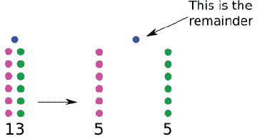

*图 9-5: 将 13 个球分成两等份*

当我们检查 x 除以 2 后的余数是否为零时，实际上是在问这个数是否能被分成两部分且没有余数。这种方法是检查变量中数字是否为偶数的好方法，因为偶数总是可以被均分为两等份。

在我们代码的第五行，我们告诉海龟如果 x 中的数字是偶数（if x % 2 == 0），就向左转 175 度（t.left(175)）；否则（else），在最后一行，我们告诉它转 225 度（t.left(225)）。

图 9-6 显示了结果。

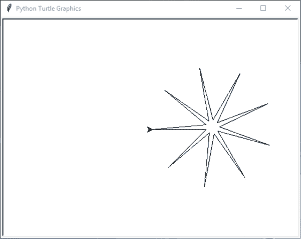

*图 9-6: 九点星*

如果你尝试过上一章的四个螺旋挑战，可能已经创建了四个海龟对象，并且为每个海龟复制了四次代码，每次略有不同，以便它们能够在正确的方向上绘制螺旋。使用 for 循环和 if 语句，你可以用更简洁的代码实现相同的功能。

### 绘制一辆车

海龟还可以更改颜色并绘制特定的形状。在这个例子中，我们将绘制一辆简单的、虽然不太酷的汽车。

首先，我们将绘制汽车的车身。在 IDLE 中，选择 **文件 ▸ 新建文件**，然后在窗口中输入以下代码：

```py
t.reset()
t.color(1,0,0)
t.begin_fill()
t.forward(100)
t.left(90)
t.forward(20)
t.left(90)
t.forward(20)
t.right(90)
t.forward(20)
t.left(90)
t.forward(60)
t.left(90)
t.forward(20)
t.right(90)
t.forward(20)
t.left(90)
t.forward(20)
t.end_fill() 
```

接下来，我们将绘制第一个车轮：

```py
t.color(0,0,0)
t.up()
t.forward(10)
t.down()
t.begin_fill()
t.circle(10)
t.end_fill()

```

最后，我们将绘制第二个车轮：

```py
t.setheading(0)
t.up()
t.forward(90)
t.right(90)
t.forward(10)
t.setheading(0)
t.begin_fill()
t.down()
t.circle(10)
t.end_fill()

```

选择 **文件 ▸ 另存为**，并为文件命名，例如 *car.py*。选择 **运行 ▸ 运行模块** 来尝试这段代码。我们的汽车可以在 图 9-7 中看到。

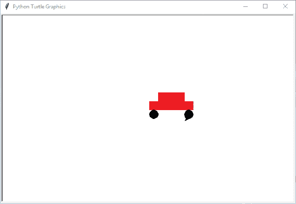

*图 9-7: 海龟绘制汽车*

你可能注意到，代码中多了一些新的海龟函数：

+   color 用于更改画笔的颜色。

+   begin_fill 和 end_fill 用于用颜色填充画布上的区域。

+   circle 绘制一个特定大小的圆形。

+   setheading 用于将海龟转向特定方向。

让我们来看看如何使用这些函数为我们的图形添加颜色。

### 上色

颜色函数接受三个参数。第一个指定红色的量，第二个指定绿色的量，第三个指定蓝色的量。例如，为了得到汽车的鲜红色，我们使用了 color(1,0,0)，这告诉海龟使用 100%的红色。

这种红色、绿色和蓝色的颜色配方叫做*RGB*，它是计算机显示器上颜色的表示方式。混合这些基本颜色可以产生其他颜色，就像你混合蓝色和红色油漆会得到紫色，或者黄色和红色会得到橙色一样。红色、绿色和蓝色被称为*原色*，因为你无法通过混合其他颜色来得到它们。

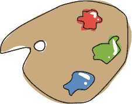

虽然我们在计算机显示器上不是使用油漆来创建颜色（我们使用的是光），但通过想象你有三罐油漆：一罐红色，一罐绿色和一罐蓝色，可能有助于理解 RGB。每罐油漆都是满的，我们将每罐满罐油漆的值设为 1（或 100%）。然后我们将所有的红色油漆和所有的绿色油漆混合在一个大桶里，得到黄色（这就是每种颜色的 1 和 1，或者 100%的每种颜色）。

现在让我们回到代码的世界。要用海龟画一个黄色圆圈，我们需要使用 100%的红色和绿色油漆，但不使用蓝色，就像这样：

```py
   >>> t.color(1,1,0)
   >>> t.begin_fill()
➊ >>> t.circle(50)
   >>> t.end_fill()

```

第一行中的 1,1,0 表示 100%的红色，100%的绿色和 0%的蓝色。在下一行，我们告诉海龟用这个 RGB 颜色填充它绘制的形状，然后我们告诉它画一个圆圈 ➊。最后一行告诉海龟用这个 RGB 颜色填充圆圈。

### 画一个填充圆圈的函数

为了更方便地实验颜色，我们可以从我们用来画填充圆圈的代码中创建一个函数：

```py
>>> def mycircle(red, green, blue):
        t.color(red, green, blue)
        t.begin_fill()
        t.circle(50)
        t.end_fill()

```

我们可以通过只使用绿色油漆来画一个明亮的绿色圆圈，就像这样：

```py
>>> mycircle(0, 1, 0)

```

或者我们可以通过只使用一半的绿色油漆（0.5）来画一个较暗的绿色圆圈：

```py
>>> mycircle(0, 0.5, 0)

```

为了在你的屏幕上玩弄 RGB 颜色，试着先画一个完全红色的圆圈，然后是半红色（1 和 0.5），再画一个完全蓝色的圆圈，然后是半蓝色的圆圈，就像这样：

```py
>>> mycircle(1, 0, 0)
>>> mycircle(0.5, 0, 0)
>>> mycircle(0, 0, 1)
>>> mycircle(0, 0, 0.5)

```

**注意**

*如果你的画布开始变得混乱，可以使用 t.reset()来删除旧的绘图。还记得你可以通过使用 t.up()抬起笔和 t.down()把笔放下来来移动海龟而不画线。*

红色、绿色和蓝色的各种组合将产生多种多样的颜色，比如金色：

```py
>>> mycircle(0.9, 0.75, 0)

```

或者浅粉色：

```py
>>> mycircle(1, 0.7, 0.75)

```

这里有两种不同的橙色：

```py
>>> mycircle(1, 0.5, 0)
>>> mycircle(0.9, 0.5, 0.15)

```

尝试自己混合一些颜色！

### 创建纯黑色和白色

晚上关掉所有灯会发生什么？一切都变黑了。在计算机上，颜色也会发生同样的事情。没有光就没有颜色，所以一个所有原色都为 0 的圆圈会变成黑色：

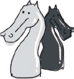

```py
>>> mycircle(0, 0, 0)

```

图 9-8 展示了结果。

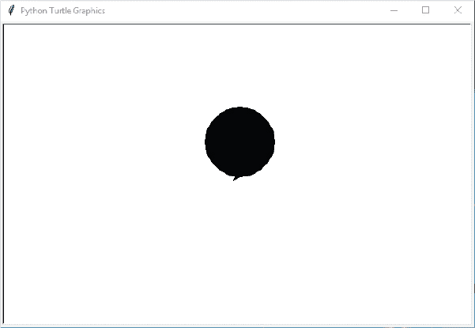

*图 9-8：黑色圆圈*

如果你使用 100%的三种颜色，你会得到白色。输入以下代码可以擦除你的黑色圆圈：

```py
>>> mycircle(1, 1, 1)

```

### 画一个正方形的函数

现在我们将尝试进行更多的形状实验。让我们使用本章开头的画方形函数，并将方形的大小作为参数传递：

```py
>>> def mysquare(size):
        for x in range(1, 5):
            t.forward(size)
            t.left(90)

```

通过调用该函数并传入 50 的大小来测试它，如下所示：

```py
>>> mysquare(50)

```

这会产生图 9-9 中的小方形。

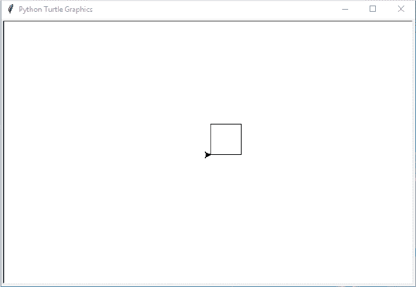

*图 9-9：海龟画一个小方形*

现在让我们尝试使用不同的大小来运行我们的函数。以下代码创建了五个连续的方形，大小分别为 25、50、75、100 和 125：

```py
>>> t.reset()
>>> mysquare(25)
>>> mysquare(50)
>>> mysquare(75)
>>> mysquare(100)
>>> mysquare(125)

```

这些方形应该像图 9-10 一样。

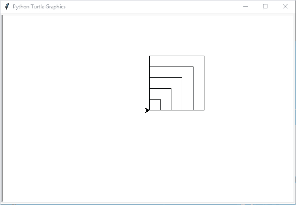

*图 9-10：海龟画多个方形*

### 绘制填充的方形

要绘制一个填充的方形，我们需要重置画布，开始填充，然后再次调用方形函数，代码如下：

```py
>>> t.reset()
>>> t.begin_fill()
>>> mysquare(50)

```

在你结束填充之前，你应该看到一个空方形：

```py
>>> t.end_fill()

```

你的方形应该像图 9-11 一样。

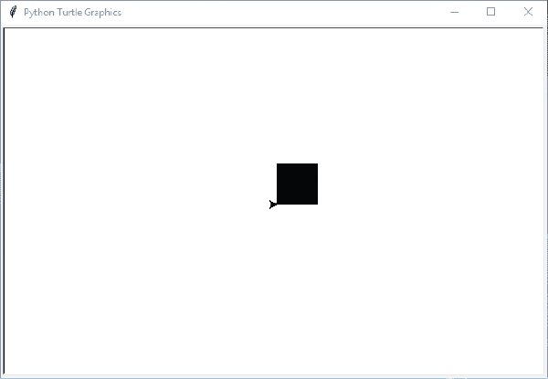

*图 9-11：海龟画一个填充的方形*

让我们修改这个函数，以便既能绘制填充的方形，也能绘制不填充的方形。为此，我们需要另一个参数，并稍微复杂一点的代码：

```py
>>> def mysquare(size, filled):
        if filled == True:
            t.begin_fill()
        for x in range(1, 5):
            t.forward(size)
            t.left(90)
        if filled == True:
            t.end_fill()

```

在第一行中，我们将函数的定义修改为接受两个参数：大小和填充。接下来，我们检查 filled 的值是否为 True，使用 if filled == True。如果是，我们调用 begin_fill，告诉海龟填充我们绘制的形状。然后我们循环四次（for x in range(1, 5)），绘制方形的四个边（前进并向左转），之后再次检查 filled 是否为 True。如果是，我们用 t.end_fill 停止填充，海龟就会用颜色填充方形。

现在我们可以通过这一行代码绘制一个填充的方形：

```py
>>> mysquare(50, True)

```

或者我们可以用这一行代码创建一个不填充的方形：

```py
>>> mysquare(150, False)

```

在这两次调用 mysquare 函数之后，我们得到图 9-12，它有点像一个方形的眼睛。

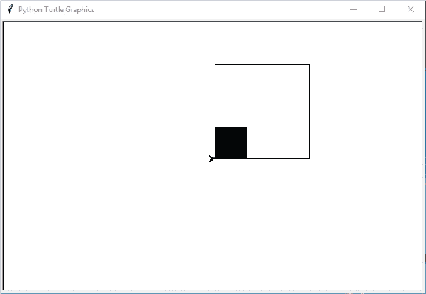

*图 9-12：海龟画一个方形眼睛*

但在这里停下没有意义，你可以绘制各种形状并用颜色填充它们。

### 绘制填充的星形

在我们的最终示例中，我们将为之前绘制的星形添加颜色。原始代码如下：

```py
for x in range(1, 19):
    t.forward(100)
    if x % 2 == 0:
        t.left(175)
    else:
        t.left(225)

```

现在我们将创建一个 mystar 函数。我们将使用 mysquare 函数中的 if 语句并添加大小参数：

```py
>>> def mystar(size, filled):
        if filled == True:
            t.begin_fill()
        for x in range(1, 19):
            t.forward(size)
            if x % 2 == 0:
                t.left(175)
            else:
                t.left(225)
        if filled == True:
            t.end_fill()

```

在这个函数的前两行，我们检查 filled 是否为 True；如果是，我们开始填充。在最后两行，我们再次检查，如果 filled 为 True，则停止填充。此外，像 mysquare 函数一样，我们将星形的大小作为参数 size 传递，并在调用 t.forward 时使用该值。

现在让我们将颜色设置为金色（90%的红色，75%的绿色，0%的蓝色），然后再次调用该函数：

```py
>>> t.color(0.9, 0.75, 0)
>>> mystar(120, True)

```

海龟将在图 9-13 中绘制填充的星形。


*图 9-13：绘制金色的星形*

要为星形添加轮廓，请将颜色改为黑色，并在不填充的情况下重新绘制星形：

```py
>>> t.color(0,0,0)
>>> mystar(120, False)

```

现在，星星是金色的，并带有黑色轮廓，就像图 9-14 一样。

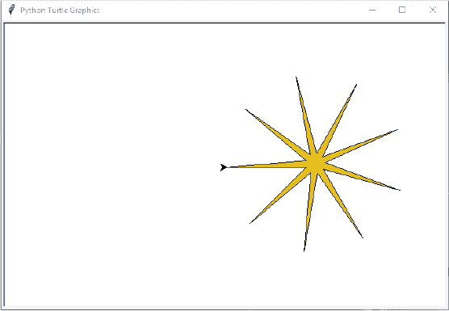

*图 9-14：绘制一个金色星星并带有轮廓*

### 你学到了什么

在本章中，你学会了如何使用海龟模块绘制几何形状，使用 for 循环和 if 语句来控制海龟在屏幕上做什么。我们改变了海龟线条的颜色，并填充了它绘制的形状。我们还将绘图代码重用到一些函数中，使得通过一次函数调用绘制不同颜色的形状变得更简单。

### 编程难题

在接下来的实验中，你将使用海龟绘制你自己的形状。像往常一样，解决方案可以在*[`python-for-kids.com`](http://python-for-kids.com)*找到。

#### #1：绘制一个八边形

在本章中，我们画了星星、方形和矩形。那么，如何创建一个绘制八边形的函数呢？（提示：试着让海龟转动 45 度。）你的形状应该与图 9-15 相似。

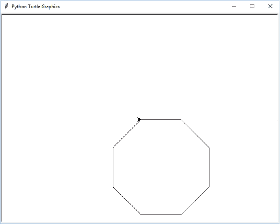

*图 9-15：绘制一个八边形*

#### #2：绘制一个填充的八边形

现在你已经有了绘制八边形的函数，修改它来绘制一个填充的八边形。尝试像我们为星星所做的那样绘制一个有轮廓的八边形。它应该看起来与图 9-16 相似。

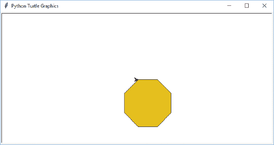

*图 9-16：绘制一个填充的八边形*

#### #3：另一个绘制星星的函数

创建一个函数来绘制星星，该函数需要两个参数：大小和点数。函数的开始应该像这样：

```py
def draw_star(size, points):

```

#### #4：重新审视四个螺旋

取出你在上一章中为编程难题#4 创建的代码（用来创建四个螺旋）并再次绘制相同的螺旋——这次尝试使用 for 循环和 if 语句来简化代码。
