## 第十章：使用 tkinter 创建更好的图形


使用 turtle 来绘图的问题是……海龟……真的……很慢。即使海龟以最快速度移动，它仍然不算快。虽然这对海龟来说不是问题，但对计算机图形来说却是个问题。

计算机图形通常需要快速移动。如果你在游戏机或电脑上玩游戏，想一想屏幕上显示的图形。二维（2D）图形是平面的：角色通常只上下或左右移动，像许多任天堂和手机游戏那样。在伪三维（3D）游戏中——即接近三维的游戏——图像看起来更加真实，但角色通常只在一个平面上移动（这也被称为*等距图形*）。最后，我们有了 3D 游戏，它们的图形试图模拟现实。无论游戏使用 2D、伪 3D 还是 3D 图形，它们都有一个共同点：需要在计算机屏幕上非常快速地绘图。

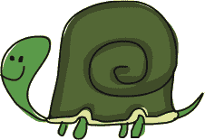

如果你从未尝试过创建自己的动画，尝试这个简单的项目：

1.  拿一张空白纸，在第一页的底角画一些东西（可能是一个火柴人）。

1.  在下一页的角落画出相同的火柴人，但稍微移动它的腿。

1.  在下一页上，再次绘制火柴人，并稍微移动一下它的腿。

1.  逐页进行，在每页的底角画一个修改过的火柴人。

完成后，迅速翻阅页面，你应该能看到火柴人动起来了。这是所有动画的基本方法，无论是卡通还是视频游戏。先绘制一个图像，然后在图像上进行微小的改变，再次绘制它，以创造运动的错觉。要让图像看起来像是移动，你需要非常快速地显示每个*帧*——或动画的每一部分。

Python 提供了多种创建图形的方式。除了 turtle 模块外，你还可以使用*外部*模块（需要单独安装），以及 tkinter 模块，这个模块你应该已经在标准的 Python 安装中拥有。tkinter 模块不仅可以用于创建完整的应用程序，比如一个简单的文字处理器，还可以用于绘制图形。在本章中，我们将探索如何使用 tkinter 创建图形。

### 创建一个可点击的按钮

在我们的第一个示例中，我们将使用 tkinter 模块来创建一个带按钮的基本应用程序。请输入以下代码：

```py
>>> from tkinter import *
>>> tk = Tk()
>>> btn = Button(tk, text='click me')
>>> btn.pack()

```

在第一行，我们导入 tkinter 模块的内容。`from *module-name* import *` 语句允许我们使用模块的内容，而无需使用模块名。相比之下，当我们在之前的示例中使用 `import turtle` 时，我们需要包含模块名称才能访问其内容，像这样：

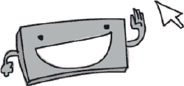

```py
import turtle
t = turtle.Turtle()

```

当我们使用 `import *` 时，我们不需要像在 第四章 和 第九章 中那样调用 `turtle.Turtle`。当你使用包含大量类和函数的模块时，这非常有用，因为它减少了你需要输入的内容：

```py
from turtle import *
t = Turtle()

```

在我们的按钮示例中的下一行，我们创建了一个包含 Tk 类对象的变量 `tk = Tk()`，就像我们为海龟创建 `Turtle` 对象一样。`tk` 对象创建了一个基本窗口，我们可以在这个窗口中添加其他内容，如按钮、输入框或绘图画布。这是 tkinter 模块提供的主类；如果不创建 Tk 类的对象，就无法进行图形或动画操作。

在第三行，我们创建了一个按钮 `btn = Button`，并将 `tk` 变量作为第一个参数传入，同时使用 `text='click me'` 设置按钮显示的文字。虽然我们已经将这个按钮添加到窗口中，但直到你输入 `btn.pack()` 这一行代码，按钮才会显示出来，这行代码告诉按钮显示出来。如果窗口中有其他按钮或对象需要显示，它还会正确地将所有元素排列到屏幕上。结果应该类似于 图 10-1。

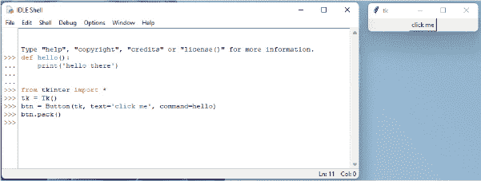

*图 10-1：一个带有单个按钮的 tkinter 应用程序*

现在，"Click Me" 按钮没有什么功能。你可以整天点击它，但直到我们稍微修改代码，它才会有所动作。（记得关闭你之前创建的窗口！）

首先，我们创建一个函数来打印一些文本：

```py
>>> def hello():
        print('hello there')

```

然后我们修改示例，使用这个新函数：

```py
>>> from tkinter import *
>>> tk = Tk()
>>> btn = Button(tk, text='click me', command=hello)
>>> btn.pack()

```

我们只对之前版本的代码进行了轻微修改，添加了 `command` 参数，告诉 Python 在点击按钮时使用 `hello` 函数。

现在，当你点击按钮时，你将看到 "hello there" 被打印到 Python Shell 中。每次点击按钮时，这个消息都会出现。在 图 10-2 中，我点击了按钮五次。

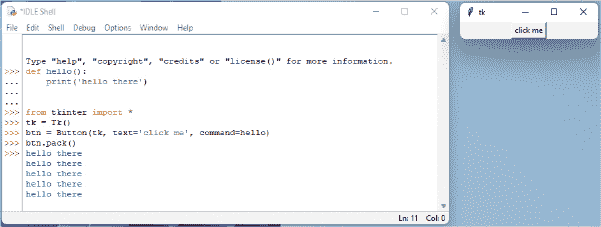

*图 10-2：点击按钮*

这是我们第一次在代码示例中使用命名参数，在继续绘制之前，我们先简单讨论一下它们。

### 使用命名参数

*命名参数* 就像普通参数一样，只不过我们不再使用传入函数的值的特定顺序来确定哪个值属于哪个参数（第一个值是第一个参数，第二个值是第二个参数，依此类推），而是明确给值命名，这样它们就可以按任意顺序出现。

有时候，函数可能有很多参数，我们不一定需要为每个参数提供值。使用命名参数，我们只需要为需要的参数提供值。

例如，假设我们有一个名为 `person` 的函数，它接受两个参数：宽度和高度：

```py
>>> def person(width, height):
        print(f'I am {width} feet wide, {height} feet high')

```

通常，我们可能这样调用这个函数：

```py
>>> person(4, 3)
I am 4 feet wide, 3 feet high

```

使用命名参数，我们可以调用这个函数并为每个值指定参数名称：

```py
>>> person(height=3, width=4)
I am 4 feet wide, 3 feet high

```

命名参数在我们深入使用 tkinter 模块时将特别有用。

### 创建绘图画布

按钮是很好的工具，但在我们想要在屏幕上绘图时，它们并不特别有用。当需要绘制时，我们需要一个不同的组件：画布对象，它是 Canvas 类的一个对象（由 tkinter 模块提供）。

创建画布时，我们需要将画布的宽度和高度（以像素为单位）传递给 Python。否则，代码与按钮代码相似。例如：

```py
>>> from tkinter import *
>>> tk = Tk()
>>> canvas = Canvas(tk, width=500, height=500)
>>> canvas.pack()

```

与按钮示例一样，当你输入 `tk = Tk()` 时，会弹出一个窗口。在最后一行，我们用 `canvas.pack()` 来打包画布，这会应用画布的大小变化（宽度为 500 像素，高度为 500 像素，如代码第三行所指定）。

同样像按钮示例一样，`pack` 函数告诉画布在窗口中以正确的位置显示自己。如果不调用 `pack`，画布将无法正确显示。

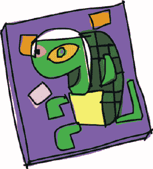

### 绘制线条

要在画布上绘制一条线，我们使用像素坐标。*坐标* 决定了像素在表面上的位置。在 tkinter 画布中，坐标描述了将像素放置到画布上的水平距离（从左到右）和垂直距离（从上到下）。

例如，因为我们的画布宽度是 500 像素，高度是 500 像素，所以屏幕右下角的坐标是 (500, 500)。要绘制 图 10-3 中显示的那条线，我们将使用起始坐标 (0, 0) 和结束坐标 (500, 500)。

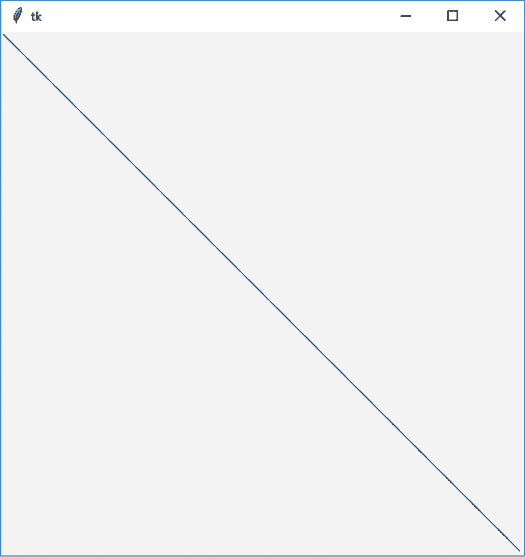

*图 10-3：使用 tkinter 绘制对角线*

我们通过使用 `create_line` 函数来指定坐标，如下所示：

```py
>>> from tkinter import *
>>> tk = Tk()
>>> canvas = Canvas(tk, width=500, height=500)
>>> canvas.pack()
>>> canvas.create_line(0, 0, 500, 500)
1

```

`create_line` 函数返回 1，这是一个标识符；我们稍后会详细了解。如果我们使用 turtle 模块做同样的事，我们就需要以下代码：

```py
>>> import turtle
>>> turtle.setup(width=500, height=500)
>>> t = turtle.Turtle()
>>> t.up()
>>> t.goto(-250, 250)
>>> t.down()
>>> t.goto(500, -500) 
```

在这段代码中，画布宽 500 像素，高 500 像素，所以 turtle 出现的位置是 250, 250（画布的中间）。如果我们使用 `t.goto(-250, 250)`，我们将向左移动 250 像素并向上移动 250 像素到屏幕的左上角。当我们调用 `t.goto(500, -500)` 时，我们则向右移动 500 像素并向下移动 500 像素到右下角。

所以我们可以看到 tkinter 代码已经有所改进。它稍微简短且更简单了。现在让我们来看看 canvas 对象上可以使用的一些函数，这些函数能帮助我们绘制更有趣的图形。

### 绘制框

使用 turtle 模块，我们通过前进、转弯、前进、再转弯等方式绘制了一个框。最终，我们通过改变前进的距离，能够画出矩形或正方形框。

tkinter 模块使得绘制正方形或矩形变得更加容易。你只需要知道角落的坐标。试试以下示例（你现在可以关闭其他窗口）：

```py
>>> from tkinter import *
>>> tk = Tk()
>>> canvas = Canvas(tk, width=400, height=400)
>>> canvas.pack()
>>> canvas.create_rectangle(10, 10, 50, 50)

```

在这段代码中，我们使用 tkinter 创建一个宽 400 像素、高 400 像素的画布，然后在窗口的左上角绘制一个正方形，像图 10-4 那样。

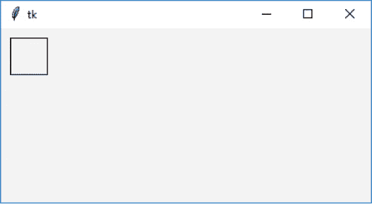

*图 10-4：绘制一个框*

我们在代码的最后一行传递给 canvas.create_rectangle 的参数是正方形的左上角和右下角的坐标。我们提供这些坐标作为距离画布左边和顶部的距离。在这种情况下，第一个坐标（左上角）是距离左边 10 像素，距离顶部 10 像素——这就是前两个数字：10，10。正方形的右下角距离左边 50 像素，距离顶部 50 像素——这就是第二组数字：50，50。

我们将这两个坐标点分别称为*x1*，*y1* 和 *x2*，*y2*。要绘制一个矩形，我们可以增加第二个角点距离画布边缘的距离（增大*x2*参数的值），像这样：

```py
>>> from tkinter import *
>>> tk = Tk()
>>> canvas = Canvas(tk, width=400, height=400)
>>> canvas.pack()
>>> canvas.create_rectangle(10, 10, 300, 50)

```

在这个例子中，矩形的左上角坐标（它在屏幕上的位置）是（10，10），右下角坐标是（300，50）。结果是一个矩形，它的高度和原始正方形一样（40 像素），但宽度大得多。

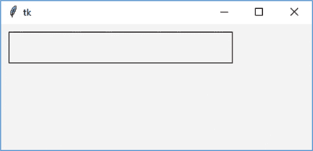

*图 10-5：一个宽的矩形*

我们还可以通过增加第二个角点距离画布顶部的距离（增大*y2*参数的值）来绘制一个矩形，像这样：

```py
>>> from tkinter import *
>>> tk = Tk()
>>> canvas = Canvas(tk, width=400, height=400)
>>> canvas.pack()
>>> canvas.create_rectangle(10, 10, 50, 300)

```

在调用 create_rectangle 函数时，我们告诉 tkinter：

+   在画布上横向移动 10 像素（从左上角开始）。

+   在画布上向下移动 10 像素。这是矩形的起始角。

+   将矩形绘制到 50 像素处。

+   绘制到底部 300 像素处。

最终结果应该类似于图 10-6。

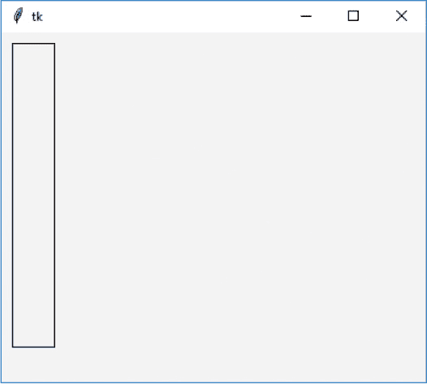

*图 10-6：一个高的矩形*

### 绘制大量矩形

让我们尝试通过导入 random 模块并创建一个函数，使用一个随机数来确定矩形左上角和右下角的坐标，从而填充画布，绘制不同大小的矩形。

我们将使用 random 模块提供的 randrange 函数。当我们给这个函数一个数字时，它会返回一个介于 0 和我们给定数字之间的随机整数。例如，调用 randrange(10)会返回一个 0 到 9 之间的数字，调用 randrange(100)会返回一个 0 到 99 之间的数字，依此类推。

要在函数中使用 randrange，首先通过选择**文件 ▸ 新建文件**来创建一个新窗口，并输入以下代码：

```py
from tkinter import *
import random
tk = Tk()
canvas = Canvas(tk, width=400, height=400)
canvas.pack()

def random_rectangle(width, height):
    x1 = random.randrange(width)
    y1 = random.randrange(height)
 x2 = x1 + random.randrange(width)
    y2 = y1 + random.randrange(height)
    canvas.create_rectangle(x1, y1, x2, y2) 
```

我们首先将(random_rectangle)函数定义为接受两个参数：宽度和高度。接着，我们通过使用 randrange 函数来创建矩形的左上角坐标变量，传入宽度和高度作为参数，分别为 x1 = random.randrange(width)和 y1 = random.randrange(height)。在函数的第二行，我们的意思是：“创建一个名为 x1 的变量，并将其值设为 0 到参数宽度之间的随机数。”

接下来的两行代码为矩形的右下角创建变量，考虑到左上角的坐标（x1 或 y1），并为这些值添加一个随机数。函数的第三行实际上是在说：“通过将一个随机数加到我们已经计算的 x1 值上，创建变量 x2。”

最后，使用 canvas.create_rectangle 时，我们利用 x1、y1、x2 和 y2 这些变量在画布上绘制矩形。

为了尝试我们的 random_rectangle 函数，我们将传入画布的宽度和高度。在你刚刚输入的函数下面添加以下代码：

```py
random_rectangle(400, 400)
```

保存你输入的代码（选择**文件 ▸ 保存**并输入文件名，例如*randomrect.py*），然后选择**运行 ▸ 运行模块**。

**注意**

*我们的 random_rectangle 函数可以在画布的边缘或底部绘制矩形。这是因为矩形的左上角可以位于画布的任何位置（甚至是右下角），而且即使绘制超出画布的宽度或高度也不会导致错误。*

一旦你看到函数正常工作，可以通过创建一个循环来多次调用 random_rectangle，填满屏幕上的矩形。让我们尝试用一个 for 循环生成 100 个随机矩形。添加以下代码，保存你的工作，然后再次运行：

```py
for x in range(0, 100):
    random_rectangle(400, 400)

```

这段代码虽然有点混乱，但它算是一种现代艺术（图 10-7）。

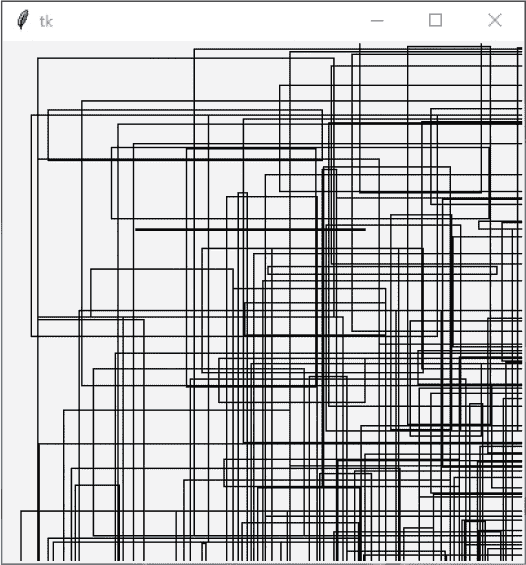

*图 10-7：使用 tkinter 的现代艺术*

### 设置颜色

让我们通过颜色为我们的图形增加一些趣味。我们将修改 random_rectangle 函数，传递一个矩形的颜色作为额外的参数（fill_color）。在新窗口中输入此代码，并保存时将文件命名为*colorrect.py*：

```py
from tkinter import *
import random
tk = Tk()
canvas = Canvas(tk, width=400, height=400)
canvas.pack()

def random_rectangle(width, height, fill_color):
    x1 = random.randrange(width)
    y1 = random.randrange(height)
    x2 = random.randrange(x1 + random.randrange(width))
 y2 = random.randrange(y1 + random.randrange(height))
    canvas.create_rectangle(x1, y1, x2, y2, fill=fill_color) 
```

create_rectangle 函数现在接受一个 fill_color 参数，用来指定绘制矩形时使用的颜色。

我们可以像这样将命名的颜色传递给函数，以创建一堆独特颜色的矩形。如果你尝试这个例子，考虑在输入第一行后复制并粘贴，以节省输入时间。方法是选择要复制的文本，按 CTRL-C 复制，点击一个空白行，然后按 CTRL-V 粘贴。将此代码添加到*colorrect.py*文件中，紧接着在函数下面：

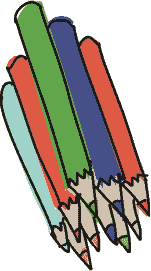

```py
random_rectangle(400, 400, 'green')
random_rectangle(400, 400, 'red')
random_rectangle(400, 400, 'blue')
random_rectangle(400, 400, 'orange')
random_rectangle(400, 400, 'yellow')
random_rectangle(400, 400, 'pink')
random_rectangle(400, 400, 'purple')
random_rectangle(400, 400, 'violet')
random_rectangle(400, 400, 'magenta')
random_rectangle(400, 400, 'cyan')

```

这些命名的颜色中的许多将显示你预期的颜色，但其他颜色可能会产生错误信息（这取决于你使用的是 Windows、macOS 还是 Linux）。但是，如果是一个自定义颜色，且与命名颜色不完全相同呢？回想一下在第九章，我们通过使用红色、绿色和蓝色的百分比设置了海龟笔的颜色。使用 tkinter 设置颜色组合中每种原色的量稍微复杂一点，但我们将一步步解决这个问题。

在使用 turtle 模块时，我们通过使用 90%的红色、75%的绿色和没有蓝色来创建金色。在 tkinter 中，我们可以通过以下代码创建相同的金色：

```py
random_rectangle(400, 400, '#e5d800')

```

值 ffd800 前面的井号（#）告诉 Python 我们提供的是一个*十六进制*数字。十六进制是一种在计算机编程中常用的数字表示方式，它使用 16 为基数（0 到 9，然后是 A 到 F），而十进制的基数是 10（0 到 9）。如果你没有学过数学中的进制知识，只需要知道你可以通过字符串中的*格式占位符*将普通的十进制数转换为十六进制：{:x}（参见第 29 页的“在字符串中嵌入值”）。例如，要将十进制数 15 转换为十六进制，你可以这样做：

```py
>>> print(f'{15:x}')
f

```

这是一个 f-string，带有一个特殊的格式修饰符（即:x），告诉 Python 将数字转换为十六进制。

为了确保我们的数字至少有两位，我们可以稍微修改格式占位符，改为：

```py
>>> print(f'{15:02x}')
0f

```

这次我们使用了一个稍微不同的格式修饰符（02x），它表示我们想要十六进制转换，但保留两位数字（对于任何缺少的数字，使用 0）。

tkinter 模块提供了一种获取十六进制颜色值的简便方法。尝试在 IDLE 中运行以下代码：

```py
from tkinter import *
from tkinter import colorchooser
tk = Tk()
tk.update()
print(colorchooser.askcolor())

```

这段代码显示了一个颜色选择器，如图 10-8 所示。请注意，你必须显式导入 colorchooser 模块，因为在使用`from tkinter import *`时，它不会自动提供。

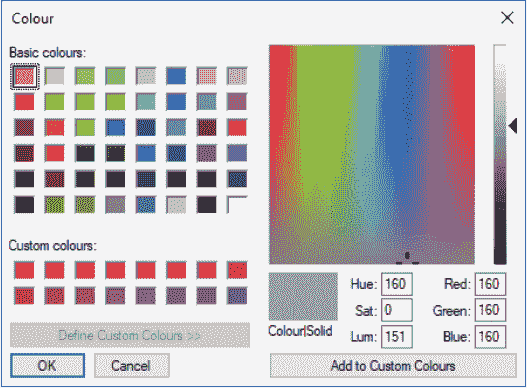

*图 10-8：tkinter 颜色选择器（在你的操作系统上可能看起来不同）*

当你选择一个颜色并点击**确定**时，一个元组将会显示出来。这个元组包含另一个包含三个数字和一个字符串的元组：

```py
>>> print(colorchooser.askcolor())
((157, 163, 164), '#9da3a4')

```

这三个数字代表红色、绿色和蓝色的量。在 tkinter 中，颜色组合中每种原色的使用量由 0 到 255 之间的数字表示（这与 turtle 模块中为每种原色使用百分比不同）。元组中的字符串包含这三个数字的十六进制版本。

你可以直接复制并粘贴字符串值来使用它，或者将元组存储为变量并使用十六进制值的索引位置。

让我们使用`random_rectangle`函数来看看这个是如何工作的，方法是用以下代码替换*colorrect.py*底部所有的`random_rectangle`调用：

```py
from tkinter import colorchooser
c = colorchooser.askcolor()
random_rectangle(400, 400, c[1])

```

你可以在 图 10-9 中看到结果。

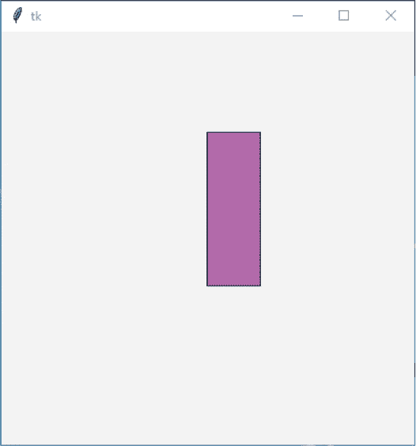

*图 10-9：绘制一个紫色矩形*

### 绘制弧形

*弧形*是圆周或曲线的一部分。要使用 tkinter 绘制弧形，你需要在一个矩形内绘制它，使用 create_arc 函数，代码如下：

```py
canvas.create_arc(10, 10, 200, 100, extent=180, style=ARC)

```

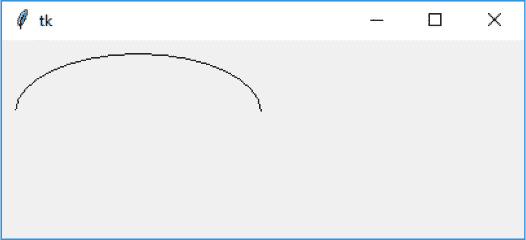

*图 10-10：绘制弧形*

**注意**

*如果你已经关闭了所有 tkinter 窗口或重启了 IDLE，请确保重新导入 tkinter，并使用以下代码重新创建画布：*

```py
>>> from tkinter import *
>>> tk = Tk()
>>> canvas = Canvas(tk, width=400, height=400)
>>> canvas.pack()
>>> canvas.create_arc(10, 10, 200, 100, extent=180, style=ARC)

```

这段代码将包含弧形的矩形的左上角放置在坐标 (10, 10) 处，即向右 10 像素，向下 10 像素，右下角放置在坐标 (200, 100) 处，即向右 200 像素，向下 100 像素。下一个参数 extent 用来指定弧形的角度。回想一下 第四章，度数是测量沿圆周行驶距离的一种方式。图 10-11 显示了两个弧形的示例，其中我们分别沿圆周行驶了 90 度和 270 度。

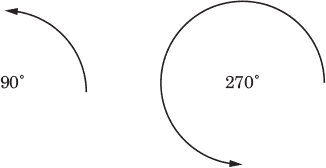

*图 10-11：90 度和 270 度弧形*

以下代码会沿页面绘制几个不同的弧形，让你看到使用 create_arc 函数时不同角度的效果：

```py
>>> from tkinter import *
>>> tk = Tk()
>>> canvas = Canvas(tk, width=400, height=400)
>>> canvas.pack()
>>> canvas.create_arc(10, 10, 200, 80, extent=45, style=ARC)
>>> canvas.create_arc(10, 80, 200, 160, extent=90, style=ARC)
>>> canvas.create_arc(10, 160, 200, 240, extent=135, style=ARC)
>>> canvas.create_arc(10, 240, 200, 320, extent=180, style=ARC)
>>> canvas.create_arc(10, 320, 200, 400, extent=359, style=ARC)

```

结果如 图 10-12 所示。

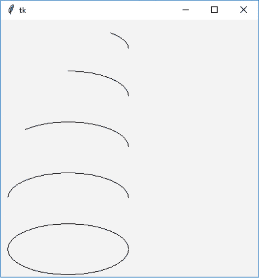

*图 10-12：多个弧形*

**注意**

*我们在最后的圆形中使用 359 度，而不是 360 度，因为 tkinter 认为 360 度等同于 0 度，且不会绘制任何内容。*

样式参数是你想要绘制的弧形类型。还有两种其他类型的弧形：弦和切片。*弦*与我们已经绘制的弧形几乎相同，只是两端通过一条直线连接在一起。*切片*顾名思义，就像你从披萨或馅饼中切下了一块。

### 绘制多边形

*多边形*是任何具有三条或更多边的形状。常见的规则多边形有三角形、正方形、矩形、五边形、六边形等，也有*不规则*多边形，它们的边缘不均匀，边数较多，形状奇特。

在使用 tkinter 绘制多边形时，你需要为每个顶点提供坐标。我们可以使用以下代码绘制一个三角形：

```py
>>> from tkinter import *
>>> tk = Tk()
>>> canvas = Canvas(tk, width=400, height=400)
>>> canvas.pack()
>>> canvas.create_polygon(10, 10, 100, 10, 100, 110, fill='', 
    outline='black')

```

这个示例通过从 *x* 和 *y* 坐标 (10, 10) 开始绘制一个三角形，然后移动到 (100, 10)，最后结束于 (100, 110)。我们将填充颜色设置为空（一个空字符串），因此三角形不会填充颜色，轮廓颜色设置为‘黑色’，所以它会用黑色线条绘制。它应该看起来像 图 10-13。

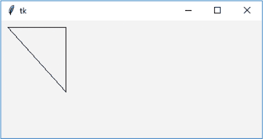

*图 10-13：绘制三角形*

我们可以使用以下代码添加一个不规则的多边形：

```py
canvas.create_polygon(200, 10, 240, 30, 120, 100, 140, 120, fill='',
outline='black')

```

这段代码从坐标(200, 10)开始，移动到(240, 30)，然后到(120, 100)，最后到(140, 120)。tkinter 模块会自动将线条连接回第一个坐标。结果如图 10-14 所示。

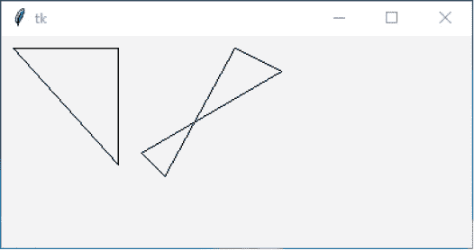

*图 10-14：不规则多边形*

### 显示文本

除了绘制形状，你还可以使用 create_text 函数在画布上书写文本。该函数仅接受两个坐标——文本的*x*和*y*位置——以及一个显示文本的命名参数。在以下代码中，我们像之前一样创建了画布，然后在坐标(150, 100)处显示一行文本。将此代码保存为*text.py*：

```py
from tkinter import *
tk = Tk()
canvas = Canvas(tk, width=400, height=400)
canvas.pack()
canvas.create_text(150, 100, text='There once was a man from Toulouse,')

```

create_text 函数可以接受其他有用的参数，例如文本填充颜色。在以下代码中，我们调用 create_text 函数，指定坐标(130, 120)、要显示的文本和红色填充颜色：

```py
canvas.create_text(130, 120, text='Who rode around on a moose.', fill='red')

```

你还可以指定*font*，即显示文本时使用的字体，作为一个包含字体名称和文本大小的元组。例如，*Times*字体大小为 20 时，元组为('Times', 20)。在以下代码中，我们使用*Times*字体（大小为 15）、*Helvetica*字体（大小为 20）以及*Courier*字体（大小为 22 和 30）显示文本：

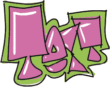

```py
canvas.create_text(150, 150, text='He said, "It\'s my curse,', font=('Times', 15))
canvas.create_text(200, 200, text='But it could be worse,', font=('Helvetica', 20))
canvas.create_text(220, 250, text='My cousin rides round', font=('Courier', 22))
canvas.create_text(220, 300, text='on a goose."', font=('Courier', 30))

```

图 10-15 显示了使用三种指定字体和五种不同大小后的结果。

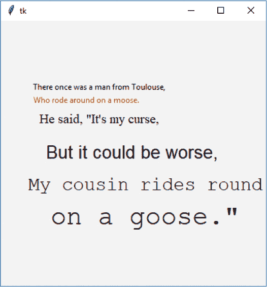

*图 10-15：使用 tkinter 绘制文本*

### 显示图像

要在画布上显示图像，可以先加载图像，然后使用 create_image 函数在画布对象上显示该图像。你加载的任何图像都必须位于 Python 可以访问的文件夹（或目录）中。

放置图像的最佳位置是你的主文件夹。在 Windows 中，这是*c:**\**Users**\**<your username>*；在 macOS 中，是*/Users/<your username>*；在 Ubuntu 或 Raspberry Pi 中，是*/home/<your* *username>*。 图 10-16 显示了 Windows 上的主文件夹。

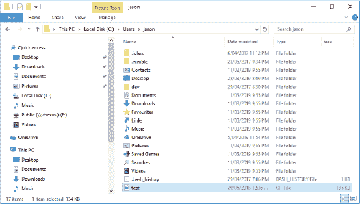

*图 10-16：Windows 上的“主文件夹”*

**注意**

*使用 tkinter，你只能加载 GIF 图像—扩展名为*.gif*的图像文件。*你可以显示其他类型的图像，例如 PNG* (.png) *和 JPG* (.jpg)，*但你需要使用其他模块，如 Pillow（Python 图像库，网址为* [`python-pillow.org`](https://python-pillow.org)*）。如果你没有 GIF 图像可以使用，试着打开一张照片，然后将其保存为 GIF 格式。在 Windows 上，你可以通过“画图”应用程序轻松完成这项操作——当然，也有很多其他方式可以将图像转换为 GIF 格式。*

我们可以如下显示名为*test.gif*的图像。

```py
from tkinter import *
tk = Tk()
canvas = Canvas(tk, width=400, height=400)
canvas.pack()
my_image = PhotoImage(file='c:\\Users\\jason\\test.gif')
canvas.create_image(0, 0, anchor=NW, image=my_image)

```

在前四行中，我们像之前的示例一样设置了画布。在第五行，图像被加载到 my_image 变量中。我们用文件名 *c:\\* *Users\\jason\\test.gif* 创建了 PhotoImage。我们需要在 Windows 文件名中使用两个反斜杠（*\\*），因为反斜杠在 Python 字符串中是一个特殊字符（用于表示转义字符——例如，*\\t* 是表示制表符的转义字符，*\\n* 是表示换行符的转义字符，这在第七章中我们也使用过），而两个反斜杠只是为了表示“不想在这里使用转义字符——我要使用单个反斜杠”。

如果你将图像保存在桌面上，你应该像这样在那个文件夹中创建 PhotoImage：

```py
my_image = PhotoImage(file='C:\\Users\\JoeSmith\\Desktop\\test.gif')

```

一旦图像被加载到变量中，canvas.create_image(0, 0, anchor=NW, image=my_image) 就会使用 create_image 函数显示它。坐标 (0, 0) 是图像显示的位置，而 anchor=NW（其中 NW 代表*西北*）告诉函数在绘制时使用图像的左上角作为起始点；否则，它默认使用图像的中心作为起始点。最后一个命名参数 image 指向已加载图像的变量。你的屏幕应该类似于图 10-17。

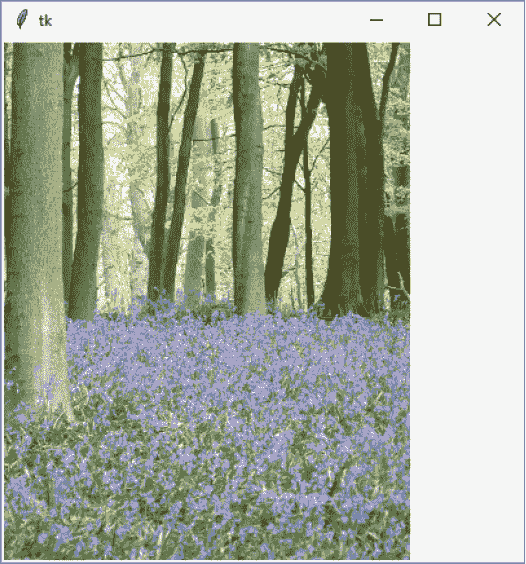

*图 10-17：显示图像*

### 创建基础动画

我们已经介绍了如何创建不动的静态图像。现在，我们将转向创建动画。

动画不一定是 tkinter 模块的专长，但它能处理基本的动画。例如，我们可以创建一个填充的三角形，然后通过使用以下代码使其在屏幕上移动：

```py
>>> import time
>>> from tkinter import *
>>> tk = Tk()
>>> canvas = Canvas(tk, width=400, height=200)
>>> canvas.pack()
>>> canvas.create_polygon(10, 10, 10, 60, 50, 35)
>>> for x in range(1, 61):
        canvas.move(1, 5, 0)
        tk.update()
        time.sleep(0.05)

```

当你运行这段代码时，三角形将开始沿着屏幕移动，直到它的路径终点，如图 10-18 所示。

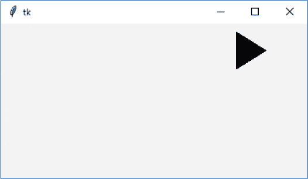

*图 10-18：移动三角形*

和之前一样，在导入 tkinter 后，我们使用前三行代码完成基本的画布显示设置。我们通过调用 canvas.create_polygon(10, 10, 10, 60, 50, 35) 函数创建三角形。

**注意**

*当你进入这一行时，屏幕上会打印出一个数字。这是多边形的标识符。我们可以用它来在后续中引用这个形状，如下面的示例所示。*

接下来，我们创建一个简单的 for 循环，从 1 计数到 61，代码为 for x in range(1, 61)。

循环中的这段代码将三角形移动到屏幕上。canvas.move 函数通过将值添加到对象的 x 和 y 坐标来移动任何绘制的对象。例如，使用 canvas.move(1, 5, 0)，我们将 ID 为 1 的对象（三角形的标识符——见前述说明）向右移动 5 像素，向下移动 0 像素。为了将其移回去，我们可以使用函数调用 canvas.move(1, -5, 0)。


tk.update()函数强制 tkinter 更新屏幕（重新绘制）。如果我们不使用 update，tkinter 会等到循环完成后再移动三角形，这意味着你会看到它跳到最后的位置，而不是平滑地在画布上移动。循环的最后一行，time.sleep(0.05)，告诉 Python 在继续之前暂停二十分之一秒（0.05 秒）。

要让三角形在屏幕上斜着向下移动，我们可以通过调用 move(1, 5, 5)来修改这段代码。关闭画布并创建一个新文件（**文件 ▸ 新建文件**）来输入以下代码：

```py
import time
from tkinter import *
tk = Tk()
canvas = Canvas(tk, width=400, height=400)
canvas.pack()
canvas.create_polygon(10, 10, 10, 60, 50, 35)
for x in range(0, 60):
    canvas.move(1, 5, 5)
    tk.update()
    time.sleep(0.05)

```

这段代码与原始代码有两个不同之处：

+   我们将画布的高度改为 400，而不是 200，代码为 canvas = Canvas(tk, width=400, height=400)。

+   我们通过 canvas.move(1, 5, 5)将三角形的* x *和* y *坐标各增加了 5。

图 10-19 展示了循环结束时三角形的位置，在你保存代码并运行后。

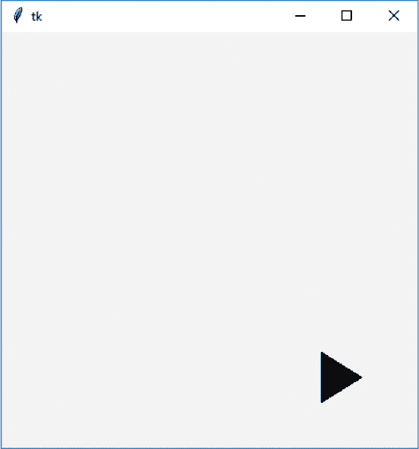

*图 10-19：三角形移动到屏幕底部。*

要将三角形斜着向上移回到起始位置，可以使用(-5, -5)。将以下代码添加到文件的底部：

```py
>>> for x in range(0, 60):
        canvas.move(1, -5, -5)
        tk.update()
        time.sleep(0.05)

```

运行这段代码后，三角形将返回到它开始的位置。

### 让对象对某些事件做出反应

我们可以通过使用*事件绑定*让三角形对按键做出反应。*事件*是在程序运行时发生的事情，比如有人移动鼠标、按下键盘或关闭窗口。你可以告诉 tkinter 监视这些事件，然后做出响应。

要开始*处理*事件（让 Python 在事件发生时做出反应），我们首先创建一个函数。绑定的部分是我们告诉 tkinter 某个特定的函数绑定（或关联）到一个特定事件。换句话说，它将由 tkinter 自动调用来处理该事件。

例如，要让三角形在按下 ENTER 时移动，我们可以定义这个函数：

```py
def movetriangle(event):
    canvas.move(1, 5, 0)

```

这个函数接受一个参数（event），tkinter 用它来将有关事件的信息发送给函数。我们通过在画布上使用 bind_all 函数来告诉 tkinter 此函数应当处理特定的事件。完整的代码现在如下——我们在 IDLE 中新建文件并保存为*movingtriangle.py*，然后运行它：

```py
from tkinter import *
tk = Tk()
canvas = Canvas(tk, width=400, height=400)
canvas.pack()
canvas.create_polygon(10, 10, 10, 60, 50, 35)
def movetriangle(event):
    canvas.move(1, 5, 0)
canvas.bind_all('<KeyPress-Return>', movetriangle)

```

这个函数的第一个参数描述了我们希望 tkinter 监视的事件。在这种情况下，它被称为<KeyPress-Return>，即按下 ENTER 或 RETURN 键。我们告诉 tkinter 每当发生这个 KeyPress 事件时，就应该调用 movetriangle 函数。运行这段代码，点击画布，然后按下键盘上的 ENTER 键。

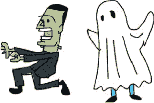

让我们试着根据不同的按键改变三角形的移动方向，比如方向键。首先我们需要将 movetriangle 函数改为以下内容：

```py
def movetriangle(event):
    if event.keysym == 'Up':
        canvas.move(1, 0, -3)
    elif event.keysym == 'Down':
        canvas.move(1, 0, 3)
    elif event.keysym == 'Left':
        canvas.move(1, -3, 0)
    else:
        canvas.move(1, 3, 0)

```

传递给 `movetriangle` 的事件对象包含多个变量。其中一个变量是 `keysym`（表示 *键符号*），它是一个字符串，保存了实际按下的键的值。`if event.keysym == 'Up'` 这一行表示，如果 `keysym` 变量包含字符串 "Up"，我们应该调用 `canvas.move`，并传入参数 (1, 0, –3)，正如下面的代码所示。如果 `keysym` 包含 "Down"，如 `elif event.keysym == 'Down'`，我们就调用带参数 (1, 0, 3) 的函数，以此类推。

记住：第一个参数是画布上绘制形状的标识编号，第二个是添加到 *x*（水平）坐标的值，第三个是添加到 *y*（垂直）坐标的值。

然后，我们告诉 tkinter，`movetriangle` 函数将用于处理来自四个不同键（上、下、左、右）的事件。以下是现在 *movingtriangle.py* 代码的样子：

```py
from tkinter import *
tk = Tk()
canvas = Canvas(tk, width=400, height=400)
canvas.pack()
canvas.create_polygon(10, 10, 10, 60, 50, 35)
def movetriangle(event):
 ➊ if event.keysym == 'Up':
     ➋ canvas.move(1, 0, -3)
 ➌ elif event.keysym == 'Down':
     ➍ canvas.move(1, 0, 3)
    elif event.keysym == 'Left':
 canvas.move(1, -3, 0)
 ➎ else:
     ➏ canvas.move(1, 3, 0)
canvas.bind_all('<KeyPress-Up>', movetriangle)
canvas.bind_all('<KeyPress-Down>', movetriangle)
canvas.bind_all('<KeyPress-Left>', movetriangle)
canvas.bind_all('<KeyPress-Right>', movetriangle) 
```

在 `movetriangle` 函数的第一行，我们检查 `keysym` 变量是否包含 "Up" ➊。如果包含，我们使用 `move` 函数将三角形向上移动，参数为 1、0、{3 ➋。第一个参数是三角形的标识符，第二个是向右移动的量（我们不希望水平移动，因此值为 0），第三个是向下移动的量（–3 像素）。

然后我们检查 `keysym` 是否包含 "Down" ➌；如果是的话，我们将三角形向下移动（3 像素） ➍。最后的检查是判断值是否为 "Left"；如果是的话，我们将三角形向左移动（–3 像素）。如果没有任何值匹配，最终的 `else` ➎ 将三角形向右移动 ➏。

现在，三角形应该会根据按下的箭头键的方向移动。

### 使用标识符的更多方法

每当我们使用画布的 `create_function`，例如 `create_polygon` 或 `create_rectangle`，都会返回一个标识符。这个标识符可以与其他画布函数一起使用，就像我们之前使用 `move` 函数一样：

```py
>>> from tkinter import *
>>> tk = Tk()
>>> canvas = Canvas(tk, width=400, height=400)
>>> canvas.pack()
>>> canvas.create_polygon(10, 10, 10, 60, 50, 35)
1
>>> canvas.move(1, 5, 0)

```

这个例子的问题在于，`create_polygon` 不会总是返回 1。例如，如果你创建了其他形状，它可能返回 2、3，甚至 100（取决于你创建了多少个形状）。如果我们改变代码，将返回的值存储为一个变量，然后使用该变量（而不是仅仅引用数字 1），那么无论返回什么数字，代码都会正常工作。

```py
>>> mytriangle = canvas.create_polygon(10, 10, 10, 60, 50, 35)
>>> canvas.move(mytriangle, 10, 0)

```

`move` 函数允许我们通过标识符在屏幕上移动对象。但其他画布函数也可以改变我们绘制的东西。例如，`itemconfig` 函数可以更改形状的一些参数，如填充色和轮廓色。

假设我们创建了一个红色的三角形：

```py
>>> from tkinter import *
>>> tk = Tk()
>>> canvas = Canvas(tk, width=400, height=400)
>>> canvas.pack()
>>> mytriangle = canvas.create_polygon(10, 10, 10, 60, 50, 35,
    fill='red')

```

我们可以通过 `itemconfig` 改变三角形的颜色，并使用标识符作为第一个参数。以下代码表示“将变量 `mytriangle` 中标识的对象的填充颜色改为蓝色”：

```py
>>> canvas.itemconfig(mytriangle, fill='blue')

```

我们还可以给三角形添加不同颜色的轮廓，同样使用标识符作为第一个参数：

```py
>>> canvas.itemconfig(mytriangle, outline='red')

```

稍后我们将学习如何对图形进行其他修改，比如隐藏图形并再次显示它。当我们开始编写游戏时，改变图形的能力将非常有用。

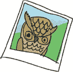

### 你学到了什么

在本章中，你使用了 tkinter 模块在画布上绘制简单的几何图形、显示图像并执行基本的动画。你学会了事件绑定如何使图形响应键盘按键，这对于我们接下来编写游戏时非常有用。你还学会了 tkinter 的创建函数如何返回一个标识编号，可以用来修改已绘制的图形，比如移动它们或更改它们的颜色。

### 编程难题

尝试以下内容，进一步探索 tkinter 模块和基础动画。访问 *[`python-for-kids.com`](http://python-for-kids.com)* 下载解决方案。

#### #1: 填满屏幕的三角形

使用 tkinter 创建一个程序，填满屏幕的三角形。然后将代码修改为用不同颜色的（填充的）三角形来填满屏幕。

#### #2: 移动的三角形

修改移动三角形的代码（见第 159 页中的“创建基础动画”）使其在屏幕上向右移动，然后向下，再向左，最后回到起始位置。

#### #3: 移动的照片

尝试在画布上显示你的照片。确保它是一个 GIF 图像！你能让它在屏幕上移动吗？

#### #4: 填满屏幕的照片

拿着你在前一个谜题中使用的照片，将它缩小。

在 macOS 上，你可以使用预览来调整图像大小（选择 **工具 ▸ 调整大小**，输入新的宽度和高度。然后，点击 **文件 ▸ 导出** 保存为新文件名）。

在 Windows 上，你可以使用画图（点击 **调整大小** 按钮，选择水平和垂直尺寸，然后 **文件 ▸ 另存为** 保存为新文件名）。

在 Ubuntu 和 Raspberry Pi 上，你需要一个叫做 GIMP 的程序（如果你没有安装，请跳到第十三章中的第 203 页）——在 GIMP 中选择 **图像** ▸ **缩放图像**，然后选择 **文件 ▸ 另存为** 来保存为新文件名。

导入时间模块，然后使用 sleep 函数（尝试使用 time.sleep(0.5)）让照片出现得更慢。
