## 13

为《Mr. Stick Man》游戏创建图形


在创建游戏（或任何程序）时，制定一个计划是个好主意。你的计划应包括游戏的概述，以及主要的元素和角色。当开始编程时，这个描述将帮助你集中注意力，确保你知道自己在开发什么。你的游戏可能不会完全按照最初的描述来实现——这是可以预料的！在本章中，我们将开始开发一个有趣的游戏，名为*Mr. Stick Man races for the Exit*。

### Mr. Stick Man 游戏计划

以下是我们新游戏的描述：

+   秘密特工 Mr. Stick Man 被困在 Dr. Innocuous 的巢穴里；你需要帮助他通过顶楼的出口逃脱。

+   游戏中有一个可以从左到右跑并跳起来的火柴人。每层楼有一些平台，玩家需要让他跳到这些平台上。

+   目标是在游戏结束之前，抵达出口的门。

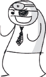

根据这个描述，我们需要几个图像，分别用于 Mr. Stick Man、平台和门。我们将编写代码将这些元素组合在一起，但在此之前，我们需要为游戏创建图形。这样，我们在下一章时就有了可以使用的素材。

我们可以像在*Bounce!*游戏中一样使用图形来绘制这些元素，但那样的图形比较简单。相反，我们将创建精灵。

*精灵*是游戏中移动的物体——通常是某种角色。精灵通常是*预渲染*的，意味着它们是在程序运行之前就被绘制好的，而不是像我们在*Bounce!*游戏中那样，由程序通过多边形动态生成的。在这个游戏中，Mr. Stick Man、平台和门将会是精灵。为了创建这些图像，我们需要安装一个图形程序。

### 获取 GIMP

有很多图形程序可供选择，但对于这个游戏，我们需要一个支持*透明度*（有时也叫做*alpha 通道*）的程序，这样可以让图像的部分区域在屏幕上不显示颜色。我们需要透明部分的图像，因为当一张图像在屏幕上移动时，它可能会经过或接近另一张图像，这时候我们不希望一张图像的背景遮挡了另一张图像的内容。例如，在图 13-1 中，背景的棋盘图案代表了透明区域。

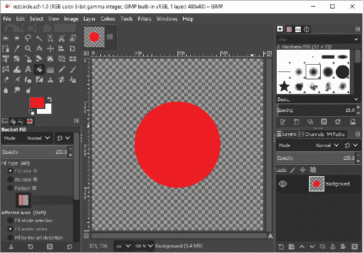

*图 13-1：GIMP 中的透明背景*

如果我们复制整个图像并将它粘贴到另一个图像上面（也叫做*叠加*），背景就不会遮挡任何内容。这一点在图 13-2 中得到了展示。

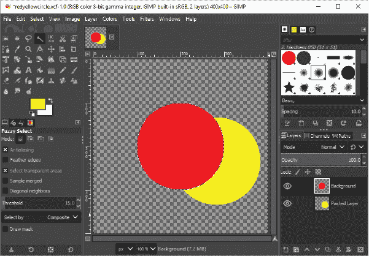

*图 13-2：图像叠加*

GIMP（*[`www.gimp.org`](http://www.gimp.org)*），即*GNU 图像处理程序*，是一个免费的图形程序，支持透明图像，适用于 Linux、macOS 和 Windows 系统。请按照以下步骤下载并安装它。

+   如果你使用的是 Windows 或 macOS，可以在 GIMP 项目页面找到安装程序，网址是 *[`www.gimp.org/downloads/`](https://www.gimp.org/downloads/)*。

+   如果你使用的是 Ubuntu，可以通过打开 Ubuntu 软件中心并在搜索框中输入*gimp*来安装 GIMP。当“GNU 图像处理程序”出现在搜索结果中时，点击安装按钮。

+   如果你使用的是 Raspberry Pi，最简单的安装 GIMP 方法是使用命令行。打开终端并输入以下命令进行安装（此方法在 Ubuntu 上也适用）：

    ```py
    sudo apt install gimp
    ```

你还应该为你的游戏创建一个文件夹。为此，在桌面上任何空白区域右键点击并选择**新建** ▸ **文件夹**（在 Ubuntu 上，选项是**创建新文件夹**；在 macOS 上，是**新建文件夹**）。将文件夹命名为*stickman*。

### 创建游戏元素

一旦你安装好图形程序，你就可以开始绘制了。我们将为游戏元素创建这些图像：

+   可以左右奔跑和跳跃的火柴人图像

+   平台的图像，三种不同的尺寸

+   门的图像：一扇开着的和一扇关着的

+   游戏背景图像（因为单一的白色或灰色背景会让游戏显得很无聊）

在我们开始绘制之前，我们需要准备带透明背景的图像。

### 准备透明图像

要设置一个透明背景的图像，启动 GIMP 并按照以下步骤操作：

1.  选择**文件** ▸ **新建**。

1.  在对话框中，设置图像宽度为 27 像素，高度为 30 像素。

1.  选择**图层** ▸ **透明度** ▸ **添加 Alpha 通道**。

1.  选择**选择** ▸ **全选**。

1.  选择**编辑** ▸ **剪切**。

最终的结果应该是一个填充了深灰色和浅灰色棋盘格的图像，如图 13-3 所示（已放大）。

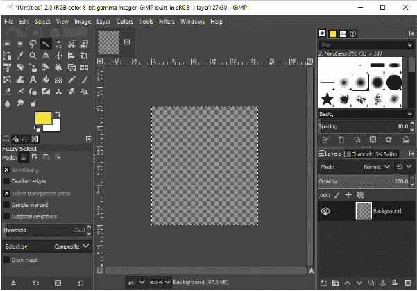

*图 13-3：放大透明背景*

现在我们可以开始创建我们的秘密特工：火柴人了。

### 绘制火柴人

要绘制我们的第一张火柴人图像，在 GIMP 工具箱中点击画笔工具，然后在画笔工具栏中选择看起来像小点的画笔（称为*Pixel*），如图 13-4 所示。

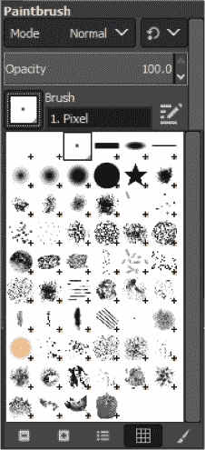

*图 13-4：GIMP 工具箱*

我们将为火柴人绘制三张不同的图像（或*帧*），展示他向右奔跑和跳跃。我们将使用这些帧来为火柴人做动画，就像我们在第十章中做的动画一样。

如果你放大查看这些图像，它们可能看起来像是图 13-5。

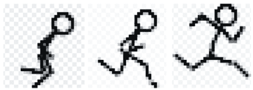

*图 13-5：放大火柴人*

你的图像不需要完全相同，但它们应该展示火柴人在运动的三个不同姿势。每张图像应为 27 像素宽，30 像素高。

#### 右侧奔跑的火柴人

首先，我们将为火柴人向右奔跑绘制一系列帧。按以下方式创建第一张图像：

1.  绘制第一张图像（图 13-5 中最左边的图像）。

1.  选择 **文件** ▸ **另存为**。

1.  在对话框中，输入 *figure-R1.gif* 作为文件名。然后点击标有 **选择文件类型** 的小加号 (+) 按钮。

1.  在出现的列表中选择 **GIF 图像**。

1.  将文件保存到之前创建的 *stickman* 文件夹中（点击 **浏览其他文件夹** 查找正确的文件夹）。

按照相同的步骤，为下一个小人角色创建一个 27 x 30 像素的图像，如 图 13-5 中所示。将此图像保存为 *figure-R2.gif*。重复此过程，创建最后一张图像，并将其保存为 *figure-R3.gif*。

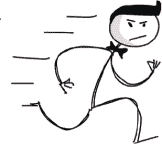

#### 小人角色跑向左侧

我们可以不必重新绘制小人角色向左移动的画面，而是使用 GIMP 翻转小人角色向右移动的帧。

在 GIMP 中，按顺序打开每个图像，然后选择 **工具** ▸ **变换工具** ▸ **翻转**。当你点击图像时，你应该能看到它从一侧翻转到另一侧，如 图 13-6 所示。将图像保存为 *figure-L1.gif*、*figure-L2.gif* 和 *figure-L3.gif*。

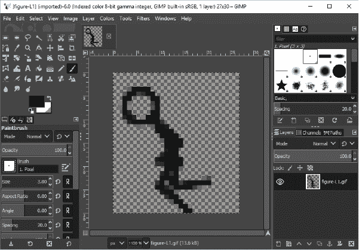

*图 13-6：翻转的小人角色*

现在我们已经为小人角色创建了六个图像，但我们仍然需要为平台、门和背景创建图像。

### 绘制平台

我们将创建三种不同大小的平台：100 像素宽，10 像素高；66 像素宽，10 像素高；以及 32 像素宽，10 像素高。你可以根据自己的喜好绘制平台，但要确保它们的背景是透明的，就像小人图像一样。

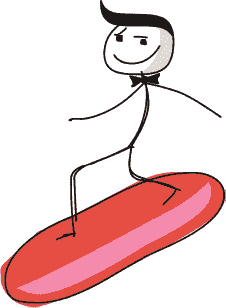

图 13-7 显示了当我们放大时平台可能的样子。

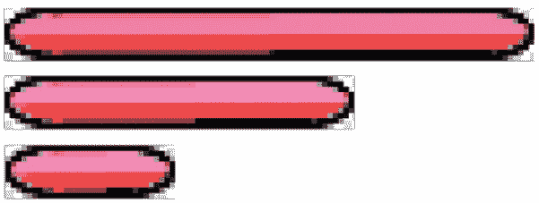

*图 13-7：放大平台*

与小人图像一样，将这些图像保存到 *stickman* 文件夹中。将最大的平台命名为 *platform1.gif*，中等大小的命名为 *platform2.gif*，最小的平台命名为 *platform3.gif*。

### 绘制门

门的大小应与小人角色的大小成比例（27 像素宽，30 像素高）。我们需要两张图像：一张是关闭的门，另一张是打开的门。这些门可能像 图 13-8 所示（放大后的效果）。

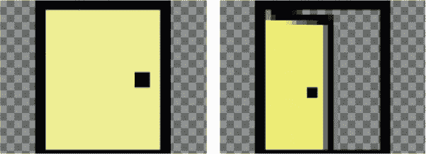

*图 13-8：放大门的效果*

要创建这些图像，请按照以下步骤操作：

1.  点击前景色框（在 GIMP 工具箱的底部），以显示颜色选择器。

1.  选择你希望用于门的颜色。图 13-9 显示了一个选择了黄色的示例。

1.  选择桶形工具（在工具箱中显示已选中），并用你选择的颜色填充屏幕。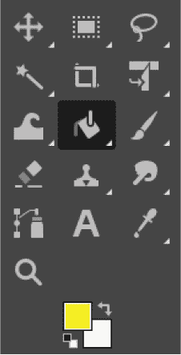

    *图 13-9：GIMP 显示背景颜色选择器*

1.  将前景颜色更改为黑色。

1.  选择铅笔或画笔工具（这两种工具都在桶形工具的右侧），并绘制门和门把手的黑色轮廓。

1.  将这些文件保存到*stickman*文件夹，并命名为*door1.gif*和*door2.gif*。

### 绘制背景

我们需要创建的最后一张图像是背景。我们将把这张图像的宽度设为 100 像素，高度设为 100 像素。它不需要透明背景，因为我们将用单一的颜色填充它，作为游戏中所有其他元素的背景“壁纸”。

要创建背景，选择**文件** ▸ **新建**，并输入图像尺寸为 100 像素宽，100 像素高。为恶棍的巢穴选择一个合适的邪恶颜色。我选择了较暗的粉色调。

你可以用花朵、条纹、星星等装饰你的壁纸——随你为游戏选择任何你喜欢的风格。例如，要在壁纸上添加星星，选择另一种颜色，选择铅笔工具，绘制第一颗星星。然后使用选择工具在星星周围选择一个框，并复制粘贴到图像的其他位置（选择**编辑** ▸ **复制**，然后**编辑** ▸ **粘贴**）。你应该能够通过点击已粘贴的图像并拖动它来调整位置。图 13-10 展示了一个带有星星的例子，并且选择工具已在工具箱中被选中。

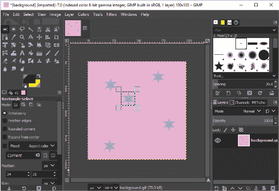

*图 13-10：GIMP 选择工具*

一旦你对你的图像满意，保存图像为*background.gif*并放入*stickman*文件夹中。

### 透明度

随着我们创建了这些图形，你可以更好地理解为什么我们的图像（除了背景）需要透明度。如果我们将 Mr. Stick Man 放在背景壁纸前面，并且他没有透明背景，我们的游戏就会像图 13-11 那样。


*图 13-11：没有透明度的小人*

Mr. Stick Man 的白色背景遮挡了部分壁纸。如果我们使用透明图像，就能得到图 13-12。

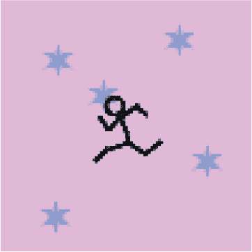

*图 13-12：带透明度的小人*

除了人物自己遮住的部分，背景中的内容不会被小人图像遮挡。这看起来专业多了！

### 你学到了什么

在本章中，你学会了如何为游戏编写基本的计划，并弄清楚从哪里开始。因为在制作游戏之前，我们需要图形元素，所以我们使用图形程序创建了基本框架。在这个过程中，你学会了如何使这些图像的背景透明，以免它们遮挡屏幕上的其他图像。

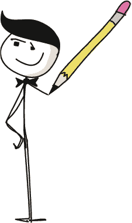

在下一章中，我们将为游戏创建一些类。
