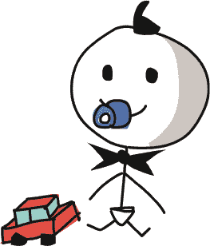
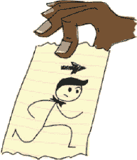
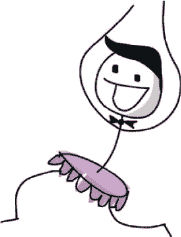

## 创建 Mr. Stick Man


在本章中，我们将创建 *Mr. Stick Man Races for the Exit* 的主角。这将是迄今为止我们编写的最复杂的代码，因为 Mr. Stick Man 需要向左和向右奔跑、跳跃、在碰到平台时停下，并在跑出平台边缘时下落。我们将使用事件绑定来响应左右箭头键，使 stick figure 向左和向右奔跑，当玩家按下空格键时让他跳跃。

### 初始化 Stick Figure

我们的新 stick figure 类的`__init__`函数与游戏中其他类的函数非常相似。我们首先给新类命名——StickFigureSprite——并将此类分配给父类 Sprite：

```py
class StickFigureSprite(Sprite):
    def __init__(self, game):
        Sprite.__init__(self, game)
```

这段代码与第十四章中的 PlatformSprite 类很相似，除了我们没有使用任何额外的参数（除了 self 和 game）。这是因为，与 PlatformSprite 类不同，在游戏中只会使用一个 StickFigureSprite 对象。

### 加载 Stick Figure 图像

因为屏幕上有很多平台对象，我们将平台图像作为参数传递给 PlatformSprite 的 `__init__` 函数（有点像在说：“这里，PlatformSprite，画图时用这张图像。”）。但由于只有一个 stick figure 对象，将图像加载到 sprite 外部再作为参数传递并不合理。StickFigureSprite 类将知道如何加载它自己的图像。



`__init__`函数的接下来几行代码加载了三张左侧图像（用于让 stick figure 向左奔跑的动画）和三张右侧图像（用于让 stick figure 向右奔跑的动画）。我们需要现在就加载这些图像，因为我们不希望每次在屏幕上显示 stick figure 时都重新加载它们（这样会浪费时间并让游戏运行变慢）：

```py
class StickFigureSprite(Sprite):
    def __init__(self, game):
        Sprite.__init__(self, game)
     ➊ self.images_left = [
            PhotoImage(file='figure-L1.gif'),
            PhotoImage(file='figure-L2.gif'),
            PhotoImage(file='figure-L3.gif')
        ]
     ➋ self.images_right = [
            PhotoImage(file='figure-R1.gif'),
            PhotoImage(file='figure-R2.gif'),
            PhotoImage(file='figure-R3.gif')
        ]
     ➌ self.image = game.canvas.create_image(200, 470,
                image=self.images_left[0], anchor='nw')
```

这段代码加载了三张左侧图像（我们将用它们来让 stick figure 向左奔跑），以及三张右侧图像（我们将用它们来让 stick figure 向右奔跑）。

我们创建了对象变量 images_left ➊ 和 images_right ➋。每个变量都包含我们在第十章中创建的 PhotoImage 对象的列表，显示了 stick figure 面朝左和右的图像。

我们使用 `images_left[0]` 在 (200, 470) 的位置通过画布的 `create_image` 函数绘制第一张图像 ➌，这将把 stick figure 放置在游戏屏幕的中间，画布的底部。`create_image` 函数返回一个标识图像的编号。我们将这个标识符存储在对象变量 image 中，以便后续使用。

### 设置变量

`__init__`函数的下一个部分设置了我们将在后续代码中使用的更多变量：

```py
        self.image = game.canvas.create_image(200, 470, 
                image=self.images_left[0], anchor='nw')
     ➊ self.x = -2
     ➋ self.y = 0
        self.current_image = 0
        self.current_image_add = 1
        self.jump_count = 0 
        self.last_time = time.time()
        self.coordinates = Coords()
```

对象变量 x ➊ 和 y ➋ 将存储我们在 stick figure 移动时会增加的水平坐标（*x1* 和 *x2*）或垂直坐标（*y1* 和 *y2*）。

正如你在第十一章中学到的，要使用 tkinter 模块制作动画，我们需要在对象的 x 或 y 位置上添加值来移动它在画布上。通过将 x 设置为-2，y 设置为 0，我们在代码中稍后会从 x 位置减去 2，而垂直位置不做任何变化，这样人物就会向左移动。

注意

*记住，负的 x 数值意味着在画布上向左移动，正的 x 数值意味着向右移动；负的 y 数值意味着向上移动，正的 y 数值意味着向下移动。*

接下来，我们创建对象变量`current_image`，用来存储当前显示在屏幕上的图像的索引位置。我们的左向图像列表`images_left`包含*figure-L1.gif*、*figure-L2.gif*和*figure-L3.gif*。它们分别是索引位置 0、1 和 2。

`current_image_add`变量将包含我们添加到`current_image`中存储的索引位置的数值，以获得下一个索引位置。例如，如果索引位置 0 的图像被显示，我们加 1 得到下一个索引位置 1 的图像，再加 1 得到列表中的最后一张图像，即索引位置 2 的图像。（你将在下一章看到我们如何使用这个变量来进行动画。）

`jump_count`变量是我们在人物跳跃时使用的计数器。`last_time`变量将记录我们在动画中更改人物图像的最后时间。我们使用时间模块的 time 函数来存储当前时间。

最后，我们将坐标对象变量设置为一个没有初始化参数的 Coords 类对象（x1、y1、x2 和 y2 都是 0）。与平台不同的是，人物的坐标会发生变化，因此我们稍后会设置这些值。

### 绑定按键

在`__init__`函数的最后部分，绑定函数将一个按键绑定到我们代码中需要在按键按下时执行的某个操作：

```py
        self.jump_count = 0 
        self.last_time = time.time()
        self.coordinates = Coords()
        game.canvas.bind_all('<KeyPress-Left>', self.turn_left)
        game.canvas.bind_all('<KeyPress-Right>', self.turn_right)
        game.canvas.bind_all('<space>', self.jump)
```

我们将<KeyPress-Left>绑定到`turn_left`函数，将<KeyPress-Right>绑定到`turn_right`函数，将<space>绑定到`jump`函数。现在我们需要创建这些函数，使人物能够移动。

### 转动人物向左和向右

`turn_left`和`turn_right`函数确保人物没有在跳跃，然后设置对象变量 x 的值来使人物左右移动。（我们的游戏不允许人物在空中改变方向。）



```py
        game.canvas.bind_all('<KeyPress-Left>', self.turn_left)
        game.canvas.bind_all('<KeyPress-Right>', self.turn_right)
        game.canvas.bind_all('<space>', self.jump)

    def turn_left(self, evt):
        if self.y == 0:
         ➊ self.x = -2

    def turn_right(self, evt):
        if self.y == 0:
         ➋ self.x = 2
```

当玩家按下左箭头键时，Python 会调用`turn_left`函数，并传递一个包含玩家所做操作信息的对象作为参数。这个对象叫做*事件对象*，我们将其参数命名为`evt`。

注意

*事件对象对我们来说并不重要，但我们需要将它作为函数的参数，否则会出现错误，因为 Python 期望它在那儿。事件对象包含像* x *和* y *的鼠标位置（对于鼠标事件），一个表示按下的特定键的代码（对于键盘事件），以及其他信息。对于这个游戏，这些信息都没有用，所以我们可以安全地忽略它。*

要判断小人是否在跳跃，我们检查 y 对象变量的值。如果值不为 0，表示小人正在跳跃。在这段代码中，如果 y 的值为 0，我们将 x 设置为-2，表示向左跑 ➊，或者将 x 设置为 2，表示向右跑 ➋。我们使用-2 和 2，是因为将值设置为-1 或 1 不足以让小人快速穿越屏幕。

一旦小人的动画正常工作，尝试改变这个值，看看会有什么不同。

### 让小人跳跃

跳跃函数和 turn_left、turn_right 函数非常相似：

```py
    def turn_right(self, evt):
        if self.y == 0:
            self.x = 2

    def jump(self, evt):
        if self.y == 0:
            self.y = -4
            self.jump_count = 0
```

这个函数再次接收一个 evt 参数（事件对象），我们可以忽略它，因为我们不需要有关事件的任何更多信息（和之前一样）。如果调用了这个函数，我们就知道空格键被按下了。

因为我们希望小人只有在不再跳跃的情况下才进行跳跃，我们检查 y 是否等于 0。如果小人没有跳跃，我们将 y 设置为-4（让他向屏幕上方跳跃），并将 jump_count 设置为 0。我们使用 jump_count 来确保小人不会永远跳跃。相反，我们让他跳跃一定次数后，再让他下落，就像重力在拉他一样。我们将在下一章添加这段代码。



### 到目前为止我们做了什么

让我们回顾一下目前为止我们游戏中各个类和函数的定义，以及它们应该在文件中的位置。

在程序的顶部，你应该有你的导入语句，接着是 Game 和 Coords 类。Game 类将用于创建一个对象，作为我们游戏的主控制器，而 Coords 类的对象用于保存游戏中物体的位置（比如平台和小人）：

```py
from tkinter import *
import random
import time

class Game:
    --snip--
class Coords:
    --snip--
```

接下来，你应该有 within 函数（用于判断一个精灵的坐标是否在另一个精灵的区域内），Sprite 父类（这是我们游戏中所有精灵的父类），PlatformSprite 类，以及 StickFigureSprite 类的开头。我们使用 PlatformSprite 类创建平台对象，让小人跳跃其上。我们还创建了一个 StickFigureSprite 类的对象，表示游戏中的主角：

```py
def within_x(co1, co2):
     --snip--
def within_y(co1, co2):
     --snip--
def collided_left(co1, co2):
     --snip--
def collided_right(co1, co2):
     --snip--
def collided_top(co1, co2):
     --snip--
def collided_bottom(y, co1, co2):
     --snip--
class Sprite:
     --snip--
class PlatformSprite(Sprite):
     --snip--
class StickFigureSprite(Sprite):
     --snip--
```

最后，在程序的末尾，你应该有一段代码来创建游戏中到目前为止的所有对象：游戏对象本身和平台。最后一行是调用 mainloop 函数的地方：

```py
g = Game()
platform1 = PlatformSprite(g, PhotoImage(file='platform1.gif'),
                           0, 480, 100, 10)
...
g.sprites.append(platform1)
...
g.mainloop()
```

如果你的代码看起来有点不同，或者你在让它正常工作时遇到问题，你可以随时跳到第十六章的结尾，查看整个游戏的完整代码。

### 你学到了什么

在本章中，我们开始了火柴人类的工作。目前，如果我们创建了这个类的一个对象，它其实不会做太多事情，除了加载它需要的图像以便动画化火柴人，并设置一些稍后在代码中使用的对象变量。这个类包含了几个函数，用于根据键盘事件（当玩家按下左箭头、右箭头或空格键时）来改变这些对象变量的值。

在下一章，我们将完成我们的游戏。我们将为**StickFigureSprite**类编写函数，以显示和动画化火柴人，并将他移动到屏幕上。我们还将添加出口（门），火柴人先生正试图到达那里。
