## 16

完善《小人先生》游戏


在前面的三章中，我们一直在开发我们的游戏：《小人先生竞速逃生》。我们创建了图像，然后编写代码添加背景图像、平台和小人。在本章中，我们将填补缺失的部分，给小人添加动画并添加门。你可以在本章末尾找到完整游戏的代码清单。如果你在编写某些代码时迷失了方向或感到困惑，可以将你的代码与该清单进行比较，看看你可能出了什么问题。

### 动画化小人

到目前为止，我们已经为小人创建了一个基本类，加载了我们将使用的图像，并将按键绑定到一些函数。但如果你此时运行游戏，我们的代码不会做出任何特别有趣的事情。

现在我们将向我们在第十五章中创建的 StickFigureSprite 类添加剩余的函数：animate、move 和 coords。animate 函数将绘制不同的小人图像；move 函数将确定角色需要移动的位置；coords 函数将返回小人当前位置。（与平台精灵不同，我们需要在小人移动时重新计算其在屏幕上的位置。）

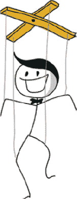

### 创建动画函数

首先，我们将添加动画函数，该函数需要检查是否有移动，并相应地更改图片。

#### 检查是否移动

我们不希望在动画中改变小人图像的速度太快，否则其运动看起来不真实。想象一下在记事本角落绘制的翻页动画——如果翻页速度太快，你可能无法完全呈现你所绘制的效果。

动画函数的前半部分检查小人是向左还是向右跑，然后利用 last_time 变量来决定是否更换当前图片。这个变量将帮助我们控制动画的速度。这个函数会紧接着我们在第十五章（第 238 页）中为 StickFigureSprite 类添加的跳跃函数之后。

```py
    def animate(self):
        if self.x != 0 and self.y == 0:
            if time.time() - self.last_time > 0.1:
                self.last_time = time.time()
                self.current_image += self.current_image_add
                if self.current_image >= 2:
                    self.current_image_add = -1
                if self.current_image <= 0:
                    self.current_image_add = 1
```

在第一个 if 语句中，我们检查 x 是否不为 0，以确定小人是否在移动（向左或向右），并检查 y 是否为 0，以确认小人没有跳跃。如果此 if 语句为 True，我们需要为小人添加动画；如果不为 True，则说明小人静止不动，因此无需继续绘制。如果小人没有移动，我们就跳出函数，后面的代码将被忽略。

然后，我们通过用`time.time()`获取当前时间，并减去 last_time 变量的值，计算出自上次调用 animate 函数以来经过的时间。这个计算用于决定是否绘制序列中的下一张图像。如果结果大于 0.1 秒，我们继续执行代码块。我们将 last_time 变量设置为当前时间，基本上是重置计时器，为下一次图像更改开始计时。

接下来，我们将对象变量 current_image_add 的值加到当前图像索引位置的变量 current_image 中。记住，我们在第十五章的火柴人`__init__`函数中创建了 current_image_add 变量（见第 235 页），所以当 animate 函数第一次被调用时，变量的值已经设置为 1。

然后，我们检查 current_image 中的索引位置的值是否大于或等于 2；如果是，我们将 current_image_add 的值改为-1。最后两行的过程类似；一旦达到 0，我们需要重新开始计数。

注意

*如果你在弄清楚如何缩进这段代码时遇到困难，给你一个提示：在“if self.x”这一行开头有 8 个空格，而在最后一行有 20 个空格。*

为了帮助你理解到目前为止函数中发生的事情，想象一下你在地板上有一排彩色块。你把手指从一个块移动到下一个块，每个你手指指向的块都有一个数字（1，2，3，4，依此类推）——这就是 current_image 变量。你手指指向的块的编号（它一次指向一个块）是存储在 current_image_add 变量中的数字。当你的手指朝着块的方向向前移动时，每次你都在加 1，而当它到达末端并向下移动时，你在减去 1（即加-1）。

我们添加到 animate 函数中的代码执行了这个过程，但不同的是，我们在列表中存储了三个方向的火柴人图像，而不是彩色块。这些图像的索引位置分别是 0、1 和 2。当我们动画展示火柴人时，一旦到达最后一张图像，我们开始倒计时；当我们到达第一张图像时，我们需要重新开始计数。因此，我们创造了一个奔跑人物的效果。

表 16-1 展示了我们如何通过 animate 函数中计算的索引位置，遍历图像列表。

**表 16-1：** 动画中的图像位置

| 位置 0 | 位置 1 | 位置 2 | 位置 1 | 位置 0 | 位置 1 |
| --- | --- | --- | --- | --- | --- |
| 计数增加 | 计数增加 | 计数增加 | 计数减少 | 计数减少 | 计数增加 |
| 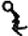 | 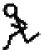 | 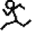 |  | 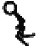 |  |

#### 更改图像

在 animate 函数的下一部分，我们使用计算出的索引位置更改当前显示的图像：

```py
    def animate(self):
    ...
        if self.x < 0:
            if self.y != 0:
                self.game.canvas.itemconfig(self.image, 
                        image=self.images_left[2])
         ➊ else:
                self.game.canvas.itemconfig(self.image, 
                        image=self.images_left[self.current_image])
        elif self.x > 0:
            if self.y != 0:
                self.game.canvas.itemconfig(self.image, 
                        image=self.images_right[2])
            else:
                self.game.canvas.itemconfig(self.image, 
                        image=self.images_right[self.current_image])
```

首先，如果 x 小于 0，小人正在向左移动，那么 Python 会进入代码块，检查 y 是否不等于 0（意味着小人在跳跃）。如果 y 不等于 0（小人正在跳跃），我们会使用 canvas 的 itemconfig 函数将显示的图像更改为我们的左向图像列表中的最后一张图像 images_left[2]。由于小人正在跳跃，我们将使用显示他全程奔跑的图像，让动画看起来更加逼真，正如你在 图 16-1 中看到的那样。

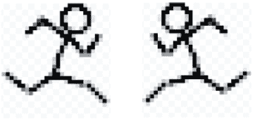

*图 16-1：跳跃图像*

如果小人没有跳跃（也就是说，y 等于 0），else 块 ➊ 会使用 itemconfig 将显示的图像更改为当前图像索引变量 current_image 中的内容。

在 elif 语句中，我们检查小人是否在向右跑（x 大于 0），然后 Python 进入该代码块。这个代码与第一个块非常相似，再次检查小人是否跳跃，并在跳跃时绘制正确的图像，只不过这次使用的是 images_right 列表。

### 获取小人位置

因为我们需要确定小人当前在屏幕上的位置（因为他会移动），所以 coords 函数与其他 Sprite 类函数有所不同。我们将使用 canvas 的 coords 函数来确定小人所在的位置，然后使用这些值来设置我们在 第十五章 开头的 __init__ 函数中创建的坐标变量的 x1、y1 和 x2、y2 值。将以下代码添加到 animate 函数后面：

```py
    def coords(self):
        xy = self.game.canvas.coords(self.image)
        self.coordinates.x1 = xy[0]
        self.coordinates.y1 = xy[1]
        self.coordinates.x2 = xy[0] + 27
        self.coordinates.y2 = xy[1] + 30
        return self.coordinates
```

当我们在 第十四章 中创建 Game 类时，其中一个对象变量是 canvas。我们使用这个 canvas 变量的 coords 函数（通过 self.game.canvas.coords），它接受画布上某个绘制物体的标识符，并返回一个包含 *x* 和 *y* 位置的两个数字的列表。在这里，我们使用存储在变量 current_image 中的标识符，并将返回的列表存储在变量 xy 中。然后我们使用这两个值来设置小人的坐标。xy[0] 的值（即列表中的第一个数字）成为我们的 x1 坐标，xy[1] 的值（列表中的第二个数字）成为我们的 y1 坐标。所以那是小人图像的左上角位置。

因为我们创建的所有小人图像都是 27 像素宽、30 像素高，所以我们可以通过将宽度和高度分别加到 xy[0] 和 xy[1] 值上来确定 x2 和 y2 应该是什么（那是小人的右下角位置）。

因此，如果 self.game.canvas.coords(self.image) 返回 [270, 350]，我们将得到以下值：

+   self.coordinates.x1 的值将为 270

+   self.coordinates.y1 的值将为 350

+   self.coordinates.x2 的值将为 297

+   self.coordinates.y2 的值将为 380

最后，在函数的最后一行，我们返回刚刚更新的对象变量坐标。

### 让小人移动

StickFigureSprite 类的最后一个函数 move 负责实际控制游戏角色在屏幕上的移动。它还需要能够告诉我们角色是否碰到什么物体。

#### 开始移动函数

以下代码是移动函数的第一部分。这将跟在 coords 之后：

```py
    def move(self):
        self.animate()
        if self.y < 0:
            self.jump_count += 1
            if self.jump_count > 20:
                self.y = 4
        if self.y > 0:
            self.jump_count -= 1
```

第一行（self.animate()）调用我们在本章前面创建的函数，如果需要，它会更改当前显示的图像。然后，我们检查 y 的值是否小于 0。如果小于 0，我们知道小人正在跳跃，因为负值会将他往上移动。（记住，0 是在画布的顶部，画布的底部是像素位置 500。）

接下来，我们给 jump_count 加 1。我们希望小人跳起来，但不能让他一直在屏幕上浮动（毕竟是在跳），所以我们使用这个变量来计算我们执行了多少次移动函数——如果计数达到 20，我们应该把 y 值设为 4，让小人再次开始下落。

然后我们检查 y 的值是否大于 0（这意味着角色必须在下落）；如果是，我们从 jump_count 中减去 1，因为当计数到 20 时，我们需要重新向下计数。（把手慢慢向空中抬起，同时数到 20，然后再从 20 开始倒数，把手放回去，你就能明白计算小人上下跳跃的原理了。）

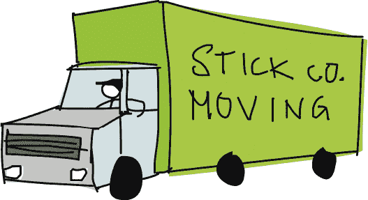

在接下来的几行 move 函数中，我们调用 coords 函数，它告诉我们角色在屏幕上的位置，然后将结果存储在 co 变量中。接着我们创建变量 left、right、top、bottom 和 falling。在这个函数的后续部分，我们将使用这些变量：

```py
        co = self.coords()
        left = True
        right = True
        top = True
        bottom = True
        falling = True
```

注意，每个变量都被设置为布尔值 True。我们将使用这些作为标志，检查角色是否碰到屏幕上的物体或正在下落。

#### 小人是否碰到画布的底部或顶部？

move 函数的下一个部分检查我们的角色是否碰到画布的底部或顶部。请添加以下代码：

```py
        if self.y > 0 and co.y2 >= self.game.canvas_height:
            self.y = 0
            bottom = False
        elif self.y < 0 and co.y1 <= 0:
            self.y = 0
            top = False
```

如果角色正在屏幕上方下落，y 将大于 0，因此我们需要确保它还没有碰到底部（否则它会从屏幕底部消失）。为此，我们检查其*y2*位置（小人底部）是否大于或等于游戏对象的 canvas_height 变量。如果是，我们将 y 的值设为 0，以停止小人下落，然后将 bottom 变量设为 False，这样剩下的代码就知道我们不再需要检查小人是否触底了。

确定棒人是否撞到屏幕顶部的过程与确定他是否撞到底部非常相似。为此，我们首先检查棒人是否在跳跃（y 小于 0），然后检查他的 *y1* 位置是否小于或等于 0，这意味着他撞到了画布顶部。如果两个条件都为真，我们将 y 设置为 0 以停止移动。我们还将 top 变量设置为 False，告知其余代码我们不再需要检查棒人是否撞到顶部。

#### 棒人是否撞到画布的边缘？

我们几乎按照与前面代码完全相同的过程来判断棒人是否撞到画布的左右两侧，具体如下：

```py
        if self.x > 0 and co.x2 >= self.game.canvas_width:
            self.x = 0
            right = False
        elif self.x < 0 and co.x1 <= 0:
            self.x = 0
            left = False
```

这个 if 语句基于以下事实：如果 x 大于 0，我们知道棒人在向右跑。我们还可以通过查看 *x2* 位置（co.x2）是否大于或等于存储在 canvas_width 中的画布宽度，来判断他是否撞到屏幕的右侧。如果任一条件为真，我们将 x 设置为 0（以停止棒人跑动），并将 right 或 left 变量设置为 False。

#### 与其他精灵发生碰撞

一旦确定棒人是否撞到屏幕的两侧，我们需要检查他是否撞到屏幕上的其他物体。我们使用以下代码循环遍历存储在游戏对象中的精灵列表，查看棒人是否撞到其中任何一个：

```py
        for sprite in self.game.sprites:
            if sprite == self:
                continue
            sprite_co = sprite.coords()
            if top and self.y < 0 and collided_top(co, sprite_co):
                self.y = -self.y
                top = False
```

在 for 语句中，我们循环遍历精灵列表，依次将每个精灵赋值给变量 sprite。然后我们说，如果精灵等于 self（这是另一种说法，“如果这个精灵实际上是我”），我们就不需要确定棒人是否发生碰撞，因为他只会撞到自己。如果 sprite 变量等于 self，我们使用 continue 跳到列表中的下一个精灵（continue 只是告诉 Python 忽略代码块中的其余代码，继续循环）。

接下来，我们通过调用其 coords 函数并将结果存储在 sprite_co 变量中来获取新精灵的坐标。

最终的 if 语句检查以下内容：

+   棒人没有撞到画布顶部（top 变量仍为真）。

+   棒人正在跳跃（y 值小于 0）。

+   棒人的顶部与精灵列表中的精灵发生了碰撞（使用我们在 第 224 页 创建的 collided_top 函数）。

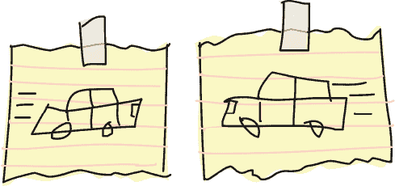

如果这些条件都为真，我们希望精灵重新开始下落，因此我们将 y 变量的值反转（self.y 变为 -self.y）。top 变量设置为 False，因为一旦棒人撞到顶部，我们就不需要继续检查碰撞。

#### 底部碰撞

循环的下一部分检查我们的角色底部是否撞到什么东西：

```py
            if bottom and self.y > 0 and collided_bottom(self.y,
                    co, sprite_co):
                self.y = sprite_co.y1 - co.y2
                if self.y < 0:
                    self.y = 0
                bottom = False
                top = False
```

我们从三个相似的检查开始：底部变量是否仍然设置，角色是否在下落（y 大于 0），以及我们角色的底部是否碰到精灵。如果这三个检查都为真，我们将小人底部的 *y* 值（y2）从精灵顶部的 *y* 值（y1）中减去。这个看起来可能有些奇怪，下面我们来讨论一下为什么要这样做。

假设我们的游戏角色已经从平台上掉下来。每当 mainloop 函数运行时，他都会下移 4 像素，直到小人脚下距离下一个平台只有 3 像素。假设小人底部（y2）的位置是 57，平台顶部（y1）的位置是 60。在这种情况下，collided_bottom 函数会返回 True，因为它的代码会将 y 的值（即 4）加到小人的 y2 变量上，得到 61。

然而，我们并不希望小人一看到他会碰到平台或屏幕底部就停止下落，因为那就像是从台阶上跳下来却在半空中停住，离地面只有一英寸。虽然那可能是一个有趣的特技，但在我们的游戏中看起来不太合适。相反，如果我们将角色的 y2 值（57）从平台的 y1 值（60）中减去，我们得到 3，这就是小人应该下落的距离，以便能够正确地落在平台上。

我们继续确保计算不会导致负数（if self.y < 0:）；如果是负数，我们将 y 设置为 0。（如果允许这个数值为负，小人就会飞回去，我们不希望那样发生。）

最后，我们将顶部和底部标志设置为 False，这样我们就不再需要检查小人是否与其他精灵在顶部或底部发生碰撞。

接下来，我们再做一次“底部”检查，查看小人是否已经跑出了平台的边缘。以下是该 if 语句的代码：

```py
            if bottom and falling and self.y == 0 \
                    and co.y2 < self.game.canvas_height \
                    and collided_bottom(1, co, sprite_co):
                falling = False
```

要将下落变量设置为 False，我们必须确保以下五个元素都为真：

+   底部标志被设置为 True。

+   小人应该正在下落（下落标志仍然为 True）。

+   小人并未开始下落（y 为 0）。

+   精灵的底部没有碰到底部屏幕（它小于画布的高度）。

+   小人已经碰到了平台的顶部（collided_bottom 返回 True）。

然后，我们将下落变量设置为 False，停止角色继续向下掉落。

注意

*你可以通过简单地引用变量来检查布尔变量的值是否为 True。例如，如果 bottom == True 且 falling == True，可以简化为 if bottom 和 falling（就像我们上面做的那样）。*

#### 检查左右

我们已经检查了小人是否碰到了精灵的底部或顶部。现在我们需要检查他是否碰到了左右两侧，可以使用以下代码：

```py
            if left and self.x < 0 and collided_left(co, sprite_co):
                self.x = 0
                left = False
            if right and self.x > 0 and collided_right(co, sprite_co):
                self.x = 0
                right = False
```

首先，我们检查是否仍需要检查左侧的碰撞（left 仍然设置为 True）以及火柴人是否在向左移动（x 小于 0）。我们还检查火柴人是否与精灵发生碰撞，使用 collided_left 函数。如果这三个条件都成立，我们将 x 设置为 0（使火柴人停止跑动），并将 left 设置为 False，这样我们就不再检查左侧的碰撞了。

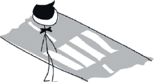

对右侧碰撞的代码类似。我们再次将 x 设置为 0，并将 right 设置为 False，以停止检查右侧的碰撞。

现在，经过四个方向碰撞的检查，我们的 for 循环应该是这样的：

```py
        for sprite in self.game.sprites:
            if sprite == self:
                continue
            sprite_co = sprite.coords()
            if top and self.y < 0 and collided_top(co, sprite_co):
                self.y = -self.y
                top = False
            if bottom and self.y > 0 and collided_bottom(self.y,
                    co, sprite_co):
                self.y = sprite_co.y1 - co.y2
                if self.y < 0:
                    self.y = 0
                bottom = False
                top = False
            if bottom and falling and self.y == 0 \
                    and co.y2 < self.game.canvas_height \
                    and collided_bottom(1, co, sprite_co):
                falling = False
            if left and self.x < 0 and collided_left(co, sprite_co):
                self.x = 0
                left = False
            if right and self.x > 0 and collided_right(co, sprite_co):
                self.x = 0
                right = False
```

我们只需要向移动函数中再添加几行，如下所示：

```py
        if falling and bottom and self.y == 0 \
                and co.y2 < self.game.canvas_height:
            self.y = 4
        self.game.canvas.move(self.image, self.x, self.y)
```

我们检查掉落和底部变量是否都设置为 True。如果是这样，我们就已经遍历了列表中的每一个平台精灵，而没有在底部发生碰撞。

这行中的最终检查确定我们的角色底部是否小于画布的高度——也就是说，是否在地面上方（画布底部）。如果火柴人没有与任何物体碰撞并且在地面上方，他就站在空中，因此他应该开始掉落（换句话说，他已经跑出了平台的边缘）。为了让他跑出任何平台的边缘，我们将 y 设置为 4。

最后，我们根据在 x 和 y 变量中设置的值将图像在屏幕上移动。我们遍历精灵并检查碰撞，可能意味着我们已经将两个变量都设置为 0，因为火柴人已经在左边和底部发生碰撞。在这种情况下，调用画布的移动函数实际上什么也不做。

也有可能是火柴人走出了平台的边缘。如果发生这种情况，y 将被设置为 4，火柴人将向下掉落。

呼，那个函数真长！

### 测试我们的火柴人精灵

创建了 StickFigureSprite 类之后，让我们通过在调用 mainloop 函数之前添加以下两行来进行测试：

```py
sf = StickFigureSprite(g)
g.sprites.append(sf)
```

我们创建一个 StickFigureSprite 对象，并用 sf 变量标记它。像对待平台一样，我们将这个新变量添加到存储在游戏对象中的精灵列表中。

现在运行程序。你应该发现火柴人能够跑动、从平台跳到平台并掉落！

### 退出！

我们游戏中唯一缺少的就是出口。我们将通过创建一个门的精灵、添加检测门的代码以及给程序添加门对象来完成这个部分。

### 创建 DoorSprite 类

我们需要创建一个新类：DoorSprite。代码的开头如下所示：

```py
class DoorSprite(Sprite):
    def __init__(self, game, photo_image, x, y, width, height):
        Sprite.__init__(self, game)
        self.photo_image = photo_image
        self.image = game.canvas.create_image(x, y, 
                image=self.photo_image, anchor='nw')
        self.coordinates = Coords(x, y, x + (width / 2), y + height)
        self.endgame = True
```

DoorSprite 类的 __init__ 函数有自我、游戏对象、photo_image 对象、x 和 y 坐标以及图像的宽度和高度等参数。我们像其他精灵类一样调用 Sprite.__init__。

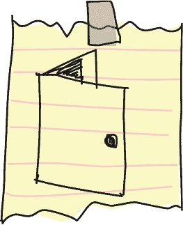

然后，我们像处理 PlatformSprite 一样，使用相同名称的对象变量保存参数 photo_image。我们使用画布的 create_image 函数创建显示图像，并使用该函数返回的标识号将其保存到对象变量 image 中。

接下来，我们将门精灵的坐标设置为 x 和 y 参数（它们变成门的*x1*和*y1*位置），然后计算*x2*和*y2*位置。我们通过将宽度的一半（宽度变量除以 2）加到 x 参数来计算*x2*位置。例如，如果 x 是 10（x1 坐标也是 10），而宽度是 40，那么 x2 坐标就是 30（10 加上 40 的一半）。

为什么使用这个让人困惑的小计算呢？因为与平台不同，在平台上我们希望小人碰到平台的边缘时立刻停止，但我们希望他停在门前。你会在玩游戏并到达门时看到这一点。

与*x1*位置不同，*y1*位置的计算非常简单。我们只需将高度变量的值加到 y 参数上，其他的就没什么了。

最后，我们将 endgame 对象变量设置为 True。这表示当小人到达门时，游戏结束。

### 检测门

现在我们需要修改 StickFigureSprite 类中 move 函数的代码，该函数决定小人何时与左侧或右侧的精灵发生碰撞。以下是第一次修改：

```py
 if left and self.x < 0 and collided_left(co, sprite_co):
                self.x = 0
                left = False
                if sprite.endgame:
                    self.game.running = False
```

我们检查小人是否与一个设置了 endgame 变量为 True 的精灵发生了碰撞。如果发生了碰撞，我们将 running 变量设置为 False，一切停止——游戏结束。

我们将这些相同的代码行添加到检查右侧碰撞的代码中。以下是代码：

```py
            if right and self.x > 0 and collided_right(co, sprite_co):
                self.x = 0
                right = False
                if sprite.endgame:
                    self.game.running = False
```

### 添加门对象

我们对游戏代码的最终补充是为门创建一个对象。我们将在主循环之前添加这个对象。在创建小人对象之前，我们将创建一个门对象，然后将其添加到精灵列表中。以下是代码：

```py
g.sprites.append(platform7)
g.sprites.append(platform8)
g.sprites.append(platform9)
g.sprites.append(platform10)
door = DoorSprite(g, PhotoImage(file='door1.gif'), 45, 30, 40, 35)
g.sprites.append(door)
sf = StickFigureSprite(g)
g.sprites.append(sf)
g.mainloop()
```

我们使用游戏对象的变量 g 创建一个门对象，后面跟一个 PhotoImage（我们在第十三章中创建的门图像）。我们将 x 和 y 参数设置为 45 和 30，将门放在屏幕顶部附近的一个平台上，并设置宽度和高度为 40 和 35。我们像处理游戏中其他精灵一样将门对象添加到精灵列表中。

你可以看到当小人到达门时的效果。他停在门前，而不是门旁边，正如图 16-2 所示。

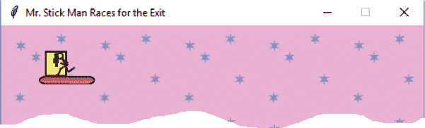

*图 16-2：到达门*

### 最终游戏

我们的游戏完整代码现在已经有 200 多行了。以下是游戏的完整代码。如果你在运行游戏时遇到问题，可以将每个函数（以及每个类）与这段代码进行对比：

```py
from tkinter import *
import random
import time

class Coords:
    def __init__(self, x1=0, y1=0, x2=0, y2=0):
        self.x1 = x1
        self.y1 = y1
        self.x2 = x2
        self.y2 = y2

def within_x(co1, co2):
    if (co1.x1 > co2.x1 and co1.x1 < co2.x2) \
            or (co1.x2 > co2.x1 and co1.x2 < co2.x2) \
            or (co2.x1 > co1.x1 and co2.x1 < co1.x2) \
            or (co2.x2 > co1.x1 and co2.x2 < co1.x2):
        return True
    else:
        return False

def within_y(co1, co2):
    if (co1.y1 > co2.y1 and co1.y1 < co2.y2) \
            or (co1.y2 > co2.y1 and co1.y2 < co2.y2) \
            or (co2.y1 > co1.y1 and co2.y1 < co1.y2) \
            or (co2.y2 > co1.y1 and co2.y2 < co1.y2):
        return True
    else:
        return False

def collided_left(co1, co2):
    if within_y(co1, co2):
        if co1.x1 >= co2.x1 and co1.x1 <= co2.x2:
            return True
    return False

def collided_right(co1, co2):
    if within_y(co1, co2):
        if co1.x2 >= co2.x1 and co1.x2 <= co2.x2:
            return True
    return False

def collided_top(co1, co2):
    if within_x(co1, co2):
        if co1.y1 >= co2.y1 and co1.y1 <= co2.y2:
            return True
    return False

def collided_bottom(y, co1, co2):
    if within_x(co1, co2):
        y_calc = co1.y2 + y
        if y_calc >= co2.y1 and y_calc <= co2.y2:
            return True
    return False

class Sprite:
    def __init__(self, game):
        self.game = game
        self.endgame = False
        self.coordinates = None
    def move(self):
        pass
    def coords(self):
        return self.coordinates

class PlatformSprite(Sprite):
    def __init__(self, game, photo_image, x, y, width, height):
        Sprite.__init__(self, game)
        self.photo_image = photo_image
        self.image = game.canvas.create_image(x, y, 
                image=self.photo_image, anchor='nw')
        self.coordinates = Coords(x, y, x + width, y + height)

class StickFigureSprite(Sprite):
    def __init__(self, game):
        Sprite.__init__(self, game)
        self.images_left = [
            PhotoImage(file='figure-L1.gif'),
            PhotoImage(file='figure-L2.gif'),
            PhotoImage(file='figure-L3.gif')
        ]
        self.images_right = [
            PhotoImage(file='figure-R1.gif'),
            PhotoImage(file='figure-R2.gif'),
            PhotoImage(file='figure-R3.gif')
        ]
        self.image = game.canvas.create_image(200, 470, 
                image=self.images_left[0], anchor='nw')
        self.x = -2
        self.y = 0
        self.current_image = 0
        self.current_image_add = 1
        self.jump_count = 0
        self.last_time = time.time()
        self.coordinates = Coords()
        game.canvas.bind_all('<KeyPress-Left>', self.turn_left)
        game.canvas.bind_all('<KeyPress-Right>', self.turn_right)
        game.canvas.bind_all('<space>', self.jump)

    def turn_left(self, evt):
        if self.y == 0:
            self.x = -2

    def turn_right(self, evt):
        if self.y == 0:
            self.x = 2

    def jump(self, evt):
        if self.y == 0:
            self.y = -4
            self.jump_count = 0

    def animate(self):
        if self.x != 0 and self.y == 0:
            if time.time() - self.last_time > 0.1:
                self.last_time = time.time()
                self.current_image += self.current_image_add
                if self.current_image >= 2:
                    self.current_image_add = -1
                if self.current_image <= 0:
                    self.current_image_add = 1
        if self.x < 0:
            if self.y != 0:
                self.game.canvas.itemconfig(self.image, 
                        image=self.images_left[2])
            else:
                self.game.canvas.itemconfig(self.image, 
                        image=self.images_left[self.current_image])
        elif self.x > 0:
            if self.y != 0:
                self.game.canvas.itemconfig(self.image, 
                        image=self.images_right[2])
            else:
                self.game.canvas.itemconfig(self.image, 
                        image=self.images_right[self.current_image])

    def coords(self):
        xy = self.game.canvas.coords(self.image)
        self.coordinates.x1 = xy[0]
        self.coordinates.y1 = xy[1]
        self.coordinates.x2 = xy[0] + 27
        self.coordinates.y2 = xy[1] + 30
        return self.coordinates

    def move(self):
        self.animate()
        if self.y < 0:
            self.jump_count += 1
            if self.jump_count > 20:
                self.y = 4
        if self.y > 0:
            self.jump_count -= 1
        co = self.coords()
        left = True
        right = True
        top = True
        bottom = True
        falling = True
        if self.y > 0 and co.y2 >= self.game.canvas_height:
            self.y = 0
            bottom = False
        elif self.y < 0 and co.y1 <= 0:
            self.y = 0
            top = False
        if self.x > 0 and co.x2 >= self.game.canvas_width:
            self.x = 0
            right = False
        elif self.x < 0 and co.x1 <= 0:
            self.x = 0
            left = False

        for sprite in self.game.sprites:
            if sprite == self:
                continue
            sprite_co = sprite.coords()
            if top and self.y < 0 and collided_top(co, sprite_co):
                self.y = -self.y
                top = False
            if bottom and self.y > 0 and collided_bottom(self.y, 
                    co, sprite_co):
                self.y = sprite_co.y1 - co.y2
                if self.y < 0:
                    self.y = 0
                bottom = False
                top = False
            if bottom and falling and self.y == 0 \
                    and co.y2 < self.game.canvas_height \
                    and collided_bottom(1, co, sprite_co):
                falling = False
            if left and self.x < 0 and collided_left(co, sprite_co):
                self.x = 0
                left = False
                if sprite.endgame:
                    self.game.running = False
            if right and self.x > 0 and collided_right(co, sprite_co):
                self.x = 0
                right = False
                if sprite.endgame:
                    self.game.running = False

        if falling and bottom and self.y == 0 \
                and co.y2 < self.game.canvas_height:
            self.y = 4
        self.game.canvas.move(self.image, self.x, self.y)

class DoorSprite(Sprite):
    def __init__(self, game, photo_image, x, y, width, height):
        Sprite.__init__(self, game)
        self.photo_image = photo_image
        self.image = game.canvas.create_image(x, y, 
                image=self.photo_image, anchor='nw')
        self.coordinates = Coords(x, y, x + (width / 2), y + height)
        self.endgame = True

class Game:
    def __init__(self):
        self.tk = Tk()
        self.tk.title('Mr. Stick Man Races for the Exit')
        self.tk.resizable(0, 0)
        self.tk.wm_attributes('-topmost', 1)
        self.canvas = Canvas(self.tk, width=500, height=500, 
                             highlightthickness=0)
        self.canvas.pack()
        self.tk.update()
        self.canvas_height = self.canvas.winfo_height()
        self.canvas_width = self.canvas.winfo_width()
        self.bg = PhotoImage(file='background.gif')
        w = self.bg.width()
        h = self.bg.height()
        for x in range(0, 5):
            for y in range(0, 5):
                self.canvas.create_image(x * w, y * h, 
                        image=self.bg, anchor='nw')
        self.sprites = []
        self.running = True

    def mainloop(self):
        while True:
            if self.running == True:
                for sprite in self.sprites:
                    sprite.move()
            self.tk.update_idletasks()
            self.tk.update()
            time.sleep(0.01)

g = Game()
platform1 = PlatformSprite(g, PhotoImage(file='platform1.gif'), 
                           0, 480, 100, 10)
platform2 = PlatformSprite(g, PhotoImage(file='platform1.gif'), 
                           150, 440, 100, 10)
platform3 = PlatformSprite(g, PhotoImage(file='platform1.gif'), 
                           300, 400, 100, 10)
platform4 = PlatformSprite(g, PhotoImage(file='platform1.gif'), 
                           300, 160, 100, 10)
platform5 = PlatformSprite(g, PhotoImage(file='platform2.gif'), 
                           175, 350, 66, 10)
platform6 = PlatformSprite(g, PhotoImage(file='platform2.gif'), 
                           50, 300, 66, 10)
platform7 = PlatformSprite(g, PhotoImage(file='platform2.gif'), 
                           170, 120, 66, 10)
platform8 = PlatformSprite(g, PhotoImage(file='platform2.gif'), 
                           45, 60, 66, 10)
platform9 = PlatformSprite(g, PhotoImage(file='platform3.gif'), 
                           170, 250, 32, 10)
platform10 = PlatformSprite(g, PhotoImage(file='platform3.gif'), 
                            230, 200, 32, 10)
g.sprites.append(platform1)
g.sprites.append(platform2)
g.sprites.append(platform3)
g.sprites.append(platform4)
g.sprites.append(platform5)
g.sprites.append(platform6)
g.sprites.append(platform7)
g.sprites.append(platform8)
g.sprites.append(platform9)
g.sprites.append(platform10)
door = DoorSprite(g, PhotoImage(file='door1.gif'), 45, 30, 40, 35)
g.sprites.append(door)
sf = StickFigureSprite(g)
g.sprites.append(sf)
g.mainloop()
```

### 你学到了什么

在这一章中，我们完成了我们的游戏，*小棍人跑向出口*。我们为动画小棍人创建了一个类，并编写了函数来移动他在屏幕上的位置，并在他移动时进行动画处理（通过图像切换来营造奔跑的错觉）。我们使用了基本的碰撞检测来判断他是否撞到画布的左右边缘，或者是否撞到其他精灵，如平台或门。我们还添加了碰撞代码，以判断他是否撞到屏幕的顶部或底部，并确保当他跑出平台的边缘时，会相应地跌落下来。我们添加了代码来判断小棍人是否到达门口，这样游戏就结束了。

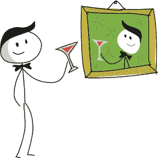

### 编程难题

还有很多事情可以做，以改善游戏。我们可以添加代码，使其看起来更专业，也更有趣。尝试添加以下功能，然后将你的代码与* [`python-for-kids.com`](http://python-for-kids.com)*上的解决方案进行比较。

#### #1：“你赢了！”

类似于我们在第十二章中完成的*Bounce!*游戏中的“游戏结束”文字，当小棍人到达门口时，添加“你赢了！”的文字。

#### #2：动画门的实现

在第十三章中，我们为门创建了两个图像：一个是开着的，另一个是关着的。当小棍人到达门时，门的图像应该切换为开门状态，小棍人应该消失，而门的图像应该恢复为关门状态。这将产生小棍人退出并关闭门的错觉。你可以通过修改 DoorSprite 类和 StickFigureSprite 类来实现这一点。

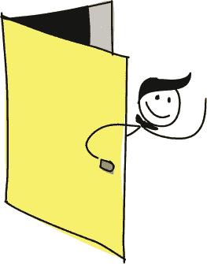

#### #3：移动平台

尝试添加一个新的类，名为 MovingPlatformSprite。这个平台应该左右移动，使得小棍人更难到达顶部的门。你可以选择一些平台设置为移动的，其他平台保持静态，具体取决于你希望游戏的难度有多大。

#### #4：台灯作为精灵

不再使用我们在第十四章的第三个编程难题中添加的书架和台灯作为背景图片，而是尝试添加一个小棍人需要跳过的台灯。它将不再是游戏背景的一部分，而是一个与平台或门类似的精灵。

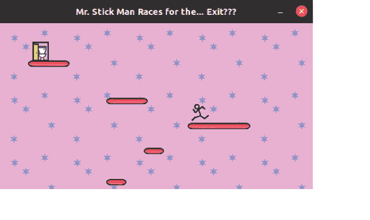
