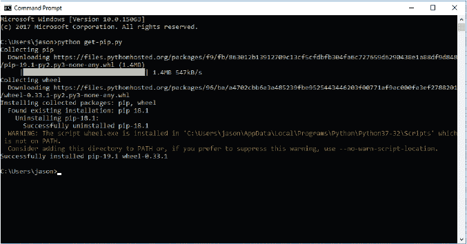
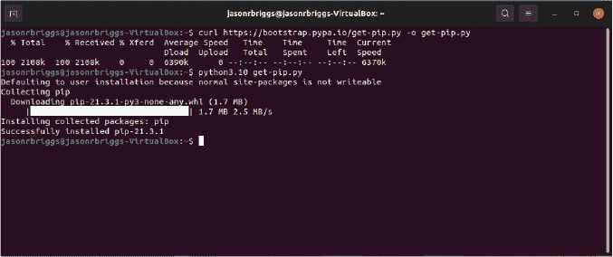
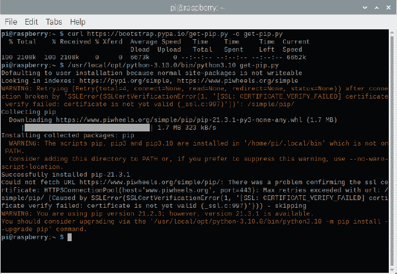
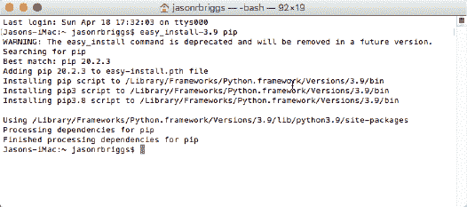

## 后记：接下来该做什么


你在 Python 之旅中已经学到了一些基本的编程概念，但还有很多内容等待你去发现——无论是用 Python 还是使用其他编程语言。虽然 Python 非常有用，但并非每个任务都是最适合使用它的，因此不要害怕尝试其他方式来编程。

如果你想继续使用 Python，并寻找更高级的书籍阅读，Python 维基（书籍页面）是一个不错的起点：*[`wiki.python.org/moin/PythonBooks/`](https://wiki.python.org/moin/PythonBooks/)*。

如果你只想探索 Python 能做些什么，它有很多内置模块。（这就是 Python 的“电池附带”理念。查阅 Python 文档，获取完整的模块列表：*[`docs.python.org/3/py-modindex.html`](https://docs.python.org/3/py-modindex.html)*。）此外，还有大量由世界各地程序员免费提供的模块。例如，你可以尝试 *Pygame* (*[`www.pygame.org`](https://www.pygame.org)*) 用于游戏开发，或者尝试 *Jupyter Notebooks* (*[`jupyter.org`](https://jupyter.org)*)，这是一个基于 web 的环境，可以在浏览器中编辑和运行 Python 代码。这些模块及其他模块可以在 *[`pypi.org`](https://pypi.org)* 上浏览。要安装这些模块，你需要使用一个名为 pip 的工具，我们将在接下来简要介绍。

### 在 Windows 上安装 Python pip

只要你已经安装了 Python 3.10 或更新版本，pip 应该会默认安装。要在 Windows 上安装 pip，如果你使用的是较旧版本的 Python，可以从 *[`bootstrap.pypa.io/get-pip.py`](https://bootstrap.pypa.io/get-pip.py)* 下载脚本 *get-pip.py*。

将文件保存到你的主文件夹，然后打开命令提示符（点击**开始**并在搜索框中输入 cmd）。要安装，输入**python get-pip.py**。



### 在 Ubuntu 上安装 Python pip

要在 Ubuntu Linux 上安装 pip，你需要系统管理员密码。打开终端并输入以下命令（确保根据需要更改以下命令中的版本号）：

```py
sudo apt install python3.10-distutils
sudo apt install curl
curl https://bootstrap.pypa.io/get-pip.py -o get-pip.py
python3.10 get-pip.py
```

使用前两个命令时，可能会出现已经安装的错误信息；这个错误可以安全忽略。



### 在 Raspberry Pi 上安装 Python pip

要在 Raspberry Pi 上安装 pip，打开终端并输入以下命令：

```py
curl https://bootstrap.pypa.io/get-pip.py -o get-pip.py
python3.10 get-pip.py
```

你可以安全地忽略显示的任何警告信息。



### 在 macOS 上安装 Python pip

只要你已经安装了 Python 3.10 或更新版本，pip 应该会默认安装。如果你使用的是较旧版本的 Python，可能需要通过打开终端并运行以下命令来安装 pip：

```py
easy_install-3.9 pip
```

根据你安装的 Python 版本，可能需要输入不同版本的 easy_install（例如，easy_install-3.7）。



### 尝试 PyGame

要了解*PyGame*的工作原理，首先使用 pip 进行安装。打开命令提示符（在 Windows 上，搜索框中输入 cmd；在 Ubuntu、Raspberry Pi 或 macOS 上，搜索终端），然后输入以下命令（你的版本号可能不同）：

```py
pip3.10 install pygame
```

注意

*根据你的 Windows 和 Python 版本，这可能无法正常工作。如果你遇到如下错误：*

'pip' 不是内部或外部命令，

可操作的程序或批处理文件。

*那么尝试运行以下命令：*

```py
cd %HOMEPATH%
AppData\Local\Programs\Python\Python310\python -m pip install pygame
```

使用 PyGame 编写代码比使用 tkinter 稍微复杂。例如，在第十章中，我们通过使用 tkinter 并运行以下代码显示了图像：

```py
from tkinter import *
tk = Tk()
canvas = Canvas(tk, width=400, height=400)
canvas.pack()
myimage = PhotoImage(file='c:\\Users\\jason\\test.gif')
canvas.create_image(0, 0, anchor=NW, image=myimage)
```

要使用 PyGame 显示图像，可以使用以下代码：

```py
import pygame
pygame.init()
display = pygame.display.set_mode((500, 500))
img = pygame.image.load('c:\\Users\\jason\\test.gif')
display.blit(img, (0, 0))
pygame.display.flip()
```

导入 pygame 模块后，我们调用 init 函数；这会初始化该模块，以便可以使用。然后我们设置显示，传递一个元组用于宽度和高度（宽 500 像素，高 500 像素）。注意，这里的额外括号非常重要：首先是函数本身的括号（set_mode(...)），然后是元组的括号（500, 500）。

然后我们加载图像，其引用（或标签）是变量 img（记住，根据你使用的操作系统，可能需要更改该图像的路径）。接下来，我们使用 blit 函数将图像绘制到显示器上，传递 img 变量和一个包含图像左上角位置的元组（0, 0）。图像暂时不会显示在窗口中；最后一行中的下一个函数——我们翻转显示——实际上会导致图像出现。这一行有效地告诉 Pygame 重绘显示窗口。

注意

*如果你在 IDLE 外运行这段代码，你需要在最后添加几行额外的代码：*

```py
while True:
    for event in pygame.event.get():
        if event.type == pygame.QUIT:
            raise SystemExit
```

这段代码是为了防止窗口在显示图像后立即关闭。

### 其他游戏和图形编程

如果你想在游戏或图形编程方面做得更多，你会发现有许多选择，不仅仅是 Python。以下是一些例子：

+   Scratch (*[`scratch.mit.edu`](http://scratch.mit.edu)*)，一个用于开发游戏和动画的工具。（它是基于块的可视化编程语言，因此与使用 Python 编程有很大不同。）

+   Construct3 (*[`www.construct.net`](https://www.construct.net)*)，一个浏览器中创建游戏的商业工具。

+   Game Maker Studio (*[`www.yoyogames.com`](https://www.yoyogames.com)*)，另一个商业工具，用于创建游戏。

+   Godot (*[`godotengine.org`](https://godotengine.org)*)，一个免费的游戏引擎，用于创建 2D 和 3D 图形。

+   Unity (*[`unity.com`](http://unity.com)*)，另一个创建游戏的商业工具。

+   Unreal Engine (*[`www.unrealengine.com`](https://www.unrealengine.com)*)，另一个创建游戏的商业工具。

在线搜索将揭示大量资源，帮助你入门这些选项，或者至少展示如果你将来继续编程，可能会实现的事情。

### 其他编程语言

如果你对其他编程语言感兴趣，可以考虑了解一些最受欢迎的语言：JavaScript、Java、C#、C、C++、Ruby、Go、Rust 和 Swift（尽管还有很多其他语言）。我们将简要介绍这些语言，并看看每种语言中的 Hello World 程序（就像我们在 第一章 中开始的 Python 版本）是如何写的。请注意，这些语言并非专门为初学者设计，大多数与 Python 有显著不同。

#### JavaScript

JavaScript (*[`dev.java/`](https://dev.java/)*) 是一种常用于网页、游戏编程和其他活动的编程语言。你可以轻松地创建一个简单的 *HTML* 页面（用于创建网页的语言），其中包含一个 JavaScript 程序，并在浏览器中运行它，而无需使用 shell、命令行或其他工具。

在 JavaScript 中，打印“Hello World”的示例会根据你是在浏览器还是 shell 中运行它而有所不同。在 shell 中，你可以键入以下内容：

```py
print('Hello World');
```

在浏览器中，它可能看起来像这样：

```py
<html>
    <body>
        <script type="text/javascript">
            alert("Hello World");
        </script>
 </body>
</html>
```

#### Java

Java (*[`www.oracle.com/technetwork/java/index.html`](http://www.oracle.com/technetwork/java/index.html)*) 是一种中等复杂的编程语言，拥有一个庞大的内置模块库（称为 *packages*）。Java 是 Android 移动设备上使用的编程语言，你可以在大多数操作系统上使用它。

这是在 Java 中打印“Hello World”的示例：

```py
public class HelloWorld {
    public static final void main(String[] args) {
        System.out.println("Hello World");
    }
}
```

#### C#

C# (*[`docs.microsoft.com/en-us/dotnet/csharp/programming-guide`](https://docs.microsoft.com/en-us/dotnet/csharp/programming-guide)*)，发音为“C sharp”，是一种适用于 Windows 的中等复杂的编程语言，语法上与 Java 和 JavaScript 非常相似。它是 Microsoft .NET 平台的一部分。

这是在 C# 中打印“Hello World”的示例：

```py
public class Hello
{
   public static void Main()
   {
      System.Console.WriteLine("Hello World");
   }
}
```

#### C/C++

C (*[`www.cprogramming.com`](http://www.cprogramming.com)*) 和 C++ (*[`www.stroustrup.com/C++.html`](http://www.stroustrup.com/C++.html)*) 是复杂的编程语言，适用于所有操作系统。你会发现这两种语言都有免费的版本和商业版本。两者（尽管 C++ 比 C 更加如此）都有陡峭的学习曲线（换句话说，它们不一定适合初学者）。例如，你会发现你需要手动编写 Python 提供的一些功能（比如告诉计算机你需要使用一块内存来存储一个对象）。许多商业游戏和游戏主机都是使用某种形式的 C 或 C++ 编写的。

在 C 中打印“Hello World”的示例如下：

```py
#include <stdio.h>
int main ()
{
  printf ("Hello World\n");
}
```

C++ 中的示例可能是这样的：

```py
#include <iostream>
int main()
{
  std::cout << "Hello World\n";
  return 0;
}
```

#### Ruby

Ruby (*[`www.ruby-lang.org`](http://www.ruby-lang.org)*) 是一种免费的编程语言，适用于所有主要的操作系统。它主要用于创建网站，特别是使用 *Ruby on Rails* 框架。（*框架* 是一组支持开发特定类型应用程序的库。）

这是一个使用 Ruby 打印“Hello World”的示例：

```py
puts "Hello World"
```

#### Go

Go (*[`golang.org`](https://golang.org)*) 是一种类似于 C 的编程语言，但稍微简单一些。

你可以通过以下方式使用 Go 打印“Hello World”：

```py
package main
import "fmt"
func main() {
 fmt.Println("Hello World")
}
```

#### Rust

Rust (*[`www.rust-lang.org`](https://www.rust-lang.org)*) 是一种最初由 Mozilla Research（开发 Firefox 浏览器的团队）开发的语言。

一个简单的 Rust 程序来打印“Hello World”可能像这样：

```py
fn main() {
    println!("Hello World")
}
```

#### Swift

Swift (*[`swift.org`](https://swift.org)*) 是 Apple 为其设备（iOS、macOS 等）开发的语言，因此如果你使用 Apple 产品，它最为合适。

我们可以像这样用 Swift 打印“Hello World”：

```py
import Swift
print("Hello World")
```

### 结束语

无论你选择继续使用 Python 还是尝试其他编程语言，你都应该会发现本书中介绍的概念对你有帮助。即使你不再从事计算机编程，理解一些基本概念也能帮助你进行各种活动，无论是在学校还是以后工作中。

祝你好运，享受编程的乐趣！


