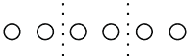
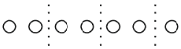
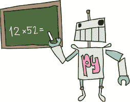

## 第十九章：B

Python 的内建函数


Python 拥有丰富的编程工具箱，包括大量现成的函数和模块，供你使用。这些内建工具可以让编写程序变得更加轻松。

正如你在第七章中看到的，模块需要先导入才能使用。Python 的*内建函数*无需先导入；它们在 Python Shell 启动时就已经可以使用了。在本附录中，我们将查看一些有用的内建函数，并重点介绍其中一个：open 函数，它允许你打开文件进行读写。

### 使用内建函数

让我们来看一些 Python 程序员常用的内建函数。我将描述它们的功能和用法，然后展示它们如何在你的程序中发挥作用。

### abs 函数

abs 函数返回一个数字的*绝对值*，即数字的值去掉符号后的结果。例如，10 的绝对值是 10，–10 的绝对值也是 10。

要使用 abs 函数，只需调用它并将一个数字或变量作为参数，像这样：

```py
>>> print(abs(10))
10
>>> print(abs(-10))
10

```

你可能会使用 abs 函数来计算游戏中角色的移动的绝对值，不管角色是向哪个方向移动。例如，假设角色向左走了 3 步（负 3 或–3），然后向右走了 10 步（正 10）。

如果我们不关心方向（正数或负数），那么这些数字的绝对值就是 3 和 10。你可能会在一个棋盘游戏中用到这个，其中你掷两个骰子，然后根据骰子的总数决定角色最大可以朝任意方向移动多少步。现在，如果我们将步数存储在一个变量中，我们就可以使用以下代码判断角色是否在移动。我们可能希望在玩家决定移动时显示一些信息（在这个例子中，我们将根据步数显示“角色正在移动很远”或“角色正在移动”）：


```py
>>> steps = -3
>>> if abs(steps) > 5:
        print('Character is moving far')
    elif abs(steps) != 0:
        print('Character is moving')

```

如果没有使用 abs，if 语句可能看起来是这样的：

```py
>>> steps = 10
>>> if steps < -5 or steps > 5:
        print('Character is moving far')
    elif steps != 0:
        print('Character is moving')

```

如你所见，使用 abs 使得 if 语句更简洁易懂。

### all 函数

all 函数如果列表（或任何其他类型的集合）中的所有项都为 True，则返回 True。简单来说，这意味着列表中所有项的值都不是 0、None、空字符串（''）或布尔值 False。

所以，如果列表中的所有项都是非零数字，all 会返回 True：

```py
>>> mylist = [1,2,5,6]
>>> all(mylist)
True

```

但如果任何值为 0，它将返回 False：

```py
>>> mylist = [1, 2, 3, 0]
>>> all(mylist)
False

```

不仅仅是数字—包含 None 的混合列表也会返回 False：

```py
>>> mylist = [100, 'a', None, 'b', True, 'zzz', ' ']
>>> all(mylist)
False

```

如果去掉 None，我们再试一次同样的例子：

```py
>>> mylist = [100, 'a', 'b', True, 'zzz', ' ']
>>> all(mylist)
True

```

### any 函数

any 函数与 all 函数类似，不同之处在于如果任何一个值的结果为 True，它就会返回 True。让我们用相同的例子来测试这些数字：

```py
>>> mylist = [1, 2, 5, 6]
>>> any(mylist)
True

```

我们的混合列表包含零、None、空字符串和 False，它的表现和 all 一样：

```py
>>> mylist = [0, False, None, "", 0, False, '']
>>> any(mylist)
False

```

但是，如果我们对列表做一个小的改动——比如添加一个非零数字如 100——我们就会得到 True 了：

```py
>>> mylist = [0, False, None, "", 0, False, '', 100]
>>> any(mylist)
True

```

### bin 函数

bin 函数将数字转换为 *二进制表示*。二进制超出了本书的范围，但简而言之，它是由 1 和 0 组成的计数系统，是计算机中几乎一切的基础。以下是一个简单的例子，将一些数字转换为二进制：

```py
>>> bin(100)
'0b1100100'
>>> bin(5)
'0b101'

```

### bool 函数

bool 的名字是 *Boolean*（布尔型）的缩写，程序员用这个词来描述一种数据类型，它只能拥有两种可能的值：通常是 True 或 False。

bool 函数接受一个参数，并根据其值返回 True 或 False。当对数字使用 bool 时，0 返回 False，但其他任何数字返回 True。下面是你可能如何对不同数字使用 bool 的示例：

```py
>>> print(bool(0))
False
>>> print(bool(1))
True
>>> print(bool(1123.23))
True
>>> print(bool(-500))
True

```

当你将 bool 用于其他值时，比如字符串，如果字符串没有值（换句话说，值是 None 或空字符串），则返回 False。否则，返回 True，如下所示：

```py
>>> print(bool(None))
False
>>> print(bool('a'))
True
>>> print(bool(' '))
True
>>> print(bool('What do you call a pig doing karate? Pork Chop!'))
True

```

bool 函数对于不包含任何值的列表、元组和映射将返回 False，当它们包含值时则返回 True：

```py
>>> my_silly_list = []
>>> print(bool(my_silly_list))
False
>>> my_silly_list = ['s', 'i', 'l', 'l', 'y']
>>> print(bool(my_silly_list))
True

```

当你需要决定某个值是否已设置时，可能会使用 bool。例如，如果我们要求使用我们程序的用户输入他们的出生年份，我们的 if 语句可以使用 bool 来测试他们输入的值：

```py
>>> year = input('Year of birth: ')
Year of birth:
>>> if not bool(year):
        print('You need to enter a value for your year of birth')

You need to enter a value for your year of birth

```

本例的第一行使用 input 函数将用户输入的内容存储为变量 year。在下一行按下 ENTER（不输入任何其他内容）会使变量 year 存储一个空字符串。（我们在 第七章 中也使用过 sys.stdin.readline()，这是另一种做法。）


在下一行中，if 语句检查变量的布尔值。由于用户在本例中没有输入任何内容，bool 函数返回 False。if 语句使用了 not 关键字，它的意思是“如果函数没有返回 True，就执行这个”，所以代码在下一行输出：你需要输入你的出生年份。

### 可调用函数

可调用函数仅仅告诉你某个对象是否是函数（换句话说，它能否被调用？）。以下代码返回 False……

```py
>>> callable('peas')
False

```

……因为字符串 'peas' 不是一个函数。但以下代码将返回 True……

```py
>>> callable(bin)
True

```

……因为 bin 是一个函数。以下代码也将返回 True：

```py
>>> class People:
        def run(self):
            print('running')

>>> callable(People.run)
True

```

People 类有一个名为 run 的函数。如果我们检查该类函数是否可调用（它是可调用的），我们会得到 True。此外，如果我们创建一个该类的对象，然后检查该对象的函数（p.run）是否可调用，再次得到 True：

```py
>>> p = People()
>>> callable(p.run)
True

```

### chr 函数

你在 Python 中输入的每个字符都有一个底层的数字编码来标识它。例如，字符’a’的数字值是 97。大写字母’A’的数字值是 65。chr 函数接受一个数字参数并返回相应的字符。所以我们可以试试值 97 和 65：

```py
>>> chr(97)
'a'
>>> chr(65)
'A'

```

我们可以试试更多随机数字，比如 22283，它是汉字字符集中的一个字符：

```py
>>> chr(22283)

```

或者 949，这是希腊字母*epsilon*：

```py
>>> chr(949)
'ε'

```

或者 8595，这其实并不是一个字符——它是一个指向下方的箭头：

```py
>>> chr(8595)
'↓'

```

### dir 函数

dir 函数（*directory*的简称）返回关于任何值的信息。基本上，它告诉你可以与该值一起使用的函数，按字母顺序排列。

例如，要显示列表值可用的函数，请输入以下内容：

```py
>>> dir(['a', 'short', 'list'])
['__add__', '__class__', '__contains__', '__delattr__',
'__delitem__', '__doc__', '__eq__', '__format__', '__ge__',
'__getattribute__', '__getitem__', '__gt__', '__hash__', '__iadd__',
'__imul__', '__init__', '__iter__', '__le__', '__len__', '__lt__',
'__mul__', '__ne__', '__new__', '__reduce__', '__reduce_ex__',
'__repr__', '__reversed__', '__rmul__', '__setattr__', '__setitem__',
'__sizeof__', '__str__', '__subclasshook__', 'append', 'count',
'extend', 'index', 'insert', 'pop', 'remove', 'reverse', 'sort']

```

dir 函数几乎可以用于任何东西，包括字符串、数字、函数、模块、对象和类。但有时它返回的信息可能并不十分有用。例如，如果你对数字 1 调用 dir，它会显示一堆特殊函数（那些前后都带有下划线的函数），这些函数是 Python 本身使用的，这其实并不实用（你通常可以忽略它们中的大部分）：

```py
>>> dir(1)
['__abs__', '__add__', '__and__', '__bool__', '__ceil__', '__class__',
'__delattr__', '__dir__', '__divmod__', '__doc__', '__eq__', '__float__', 
'__floor__', '__floordiv__', '__format__', '__ge__', '__getattribute__', 
'__getnewargs__', '__gt__', '__hash__', '__index__', '__init__',
'__init_subclass__', '__int__', '__invert__', '__le__', '__lshift__',
'__lt__', '__mod__', '__mul__', '__ne__', '__neg__', '__new__', '__or__', 
'__pos__', '__pow__', '__radd__', '__rand__', '__rdivmod__', '__reduce__', 
'__reduce_ex__', '__repr__', '__rfloordiv__', '__rlshift__', '__rmod__', 
'__rmul__', '__ror__', '__round__', '__rpow__', '__rrshift__', '__rshift__', 
'__rsub__', '__rtruediv__', '__rxor__', '__setattr__', '__sizeof__', '__str__', 
'__sub__', '__subclasshook__', '__truediv__', '__trunc__', '__xor__', 
'as_integer_ratio', 'bit_count', 'bit_length',
'conjugate', 'denominator', 'from_bytes', 'imag', 'numerator',
'real', 'to_bytes']

```

dir 函数在你有一个变量并希望快速了解可以对它执行什么操作时非常有用。例如，运行 dir 来查看包含字符串值的变量 popcorn，你会得到字符串类提供的函数列表（所有字符串都是字符串类的成员）：

```py
>>> popcorn = 'I love popcorn!'
>>> dir(popcorn)
['__add__', '__class__', '__contains__', '__delattr__', '__dir__', '__doc__', 
'__eq__', '__format__', '__ge__', '__getattribute__', '__getitem__',
'__getnewargs__', '__gt__', '__hash__', '__init__', '__init_subclass__', 
'__iter__', '__le__', '__len__', '__lt__', '__mod__', '__mul__', '__ne__',
'__new__', '__reduce__', '__reduce_ex__', '__repr__', '__rmod__', 
'__rmul__', '__setattr__', '__sizeof__', '__str__',
'__subclasshook__', 'capitalize', 'casefold', 'center', 'count', 'encode', 
'endswith', 'expandtabs', 'find', 'format', 'format_map', 'index',
'isalnum', 'isalpha', 'isascii', 'isdecimal', 'isdigit', 'isidentifier', 
'islower', 'isnumeric', 'isprintable', 'isspace', 'istitle', 'isupper', 
'join', 'ljust', 'lower', 'lstrip', 'maketrans', 'partition',
'removeprefix', 'removesuffix', 'replace', 'rfind', 'rindex', 'rjust', 
'rpartition', 'rsplit', 'rstrip', 'split', 'splitlines', 'startswith',
'strip', 'swapcase', 'title', 'translate', 'upper', 'zfill']

```

此时，你可以使用 help 来获取列表中任何函数的简短描述。以下是运行 help 获取上面函数的示例：

```py
>>> help(popcorn.upper)
Help on built-in function upper:

upper() method of builtins.str instance
    Return a copy of the string converted to uppercase.

```

返回的信息可能有点让人困惑，所以我们来仔细看看。第一行告诉你 upper 是一个字符串实例（对象）的内置函数。第二行则告诉你它的作用是什么（返回字符串的大写副本）。

### divmod 函数

辅助函数 divmod 接受两个参数（两个数字，分别表示被除数和除数），然后返回这两个数字相除的结果，以及这两个数字执行模除操作的结果。除法是计算一个数字能被分成多少个第二个数字的部分的数学运算。例如，我们可以将六个球分成两球一组多少次？


答案是：我们可以将其除三次。



模除操作几乎是相同的，除了模除返回的是除法后的余数。所以，以上将六个球除以二的结果是零（因为没有剩余）。如果我们再加一个球呢？如果我们将七个球分成两组，除法的结果仍然是三，但会剩下一个球。



这就是`divmod`作为一个包含两个数字的元组返回的结果：除法的结果和取模操作的结果。让我们先试试 6 和 2：

```py
>>> divmod(6, 2)
(3, 0)

```

然后是 7 和 2：

```py
>>> divmod(7, 2)
(3, 1)

```

### `eval`函数

`eval`函数（即*求值*的缩写）将一个字符串作为参数，并像运行 Python 表达式一样执行它。例如，`eval('print("wow")')`将实际执行语句`print("wow")`。

`eval`函数仅适用于简单的表达式，例如以下内容：

```py
>>> eval('10*5')
50

```

跨越多行的表达式（如`if`语句）通常不会求值，如下例所示：

```py
>>> eval('''if True:
        print("this won't work at all")''')

Traceback (most recent call last):
  File "<pyshell#2>", line 1, in <module>
    eval('''if True:
  File "<string>", line 1
    if True:
    ^^
SyntaxError: invalid syntax

```

`eval`函数通常用于将用户输入转换为 Python 表达式。例如，你可以编写一个简单的计算器程序，该程序读取输入到 Python 中的方程式并计算（求值）答案。



因为用户输入作为字符串读取，Python 需要将其转换为数字和运算符，才能进行任何计算。`eval`函数使这种转换变得简单：

```py
>>> your_calculation = input('Enter a calculation: ')

Enter a calculation: 12*52
>>> eval(your_calculation)
624

```

在这个示例中，我们使用`input`函数来读取用户输入到`your_calculation`变量中。在下一行，我们输入表达式 12*52。我们使用`eval`来运行这个计算，结果将在最后一行打印出来。

### `exec`函数

`exec`函数类似于`eval`，只是你可以用它来运行更复杂的程序。虽然`eval`返回一个值（你可以将其保存在变量中），但`exec`不会返回值。以下是一个示例：

```py
>>> my_small_program = '''print('ham')
print('sandwich')'''
>>> exec(my_small_program)
ham
sandwich

```

在前两行中，我们创建了一个包含两个打印语句的多行字符串变量，然后使用`exec`来运行这个字符串。

你可以使用`exec`来运行 Python 程序从文件中读取的迷你程序——程序中的程序！这在编写长且复杂的应用程序时非常有用。例如，你可以创建一个*决斗机器人*游戏，在这个游戏中，两台机器人在屏幕上移动并试图相互攻击。玩家为自己的机器人提供迷你 Python 程序作为指令。*决斗机器人*游戏将读取这些脚本并使用`exec`来运行。

### `float`函数

`float`函数将一个字符串或数字转换为*浮点数*，即带有小数点的数字（也称为*实数*或*浮动数*）。例如，数字 10 是一个整数（也称为*整数*），但 10.0、10.1 和 10.253 都是浮点数。如果你在编写一个简单的程序来计算货币金额，可能会使用浮点数。浮点数在图形程序（如 3D 游戏）中也很常用，用来计算如何以及在哪里在屏幕上绘制物体。


你可以通过调用`float`函数将一个字符串转换为浮点数：

```py
>>> float('12')
12.0

```

你也可以在字符串中使用小数点：

```py
>>> float('123.456789')
123.456789

```

你可能会使用 float 来将用户输入的值转换为适当的数字，这在你需要将用户输入的值与其他值进行比较时特别有用。例如，要检查某个人的年龄是否超过某个数字，我们可以这样做：

```py
>>> your_age = input('Enter your age: ')

Enter your age: 20
>>> age = float(your_age)
>>> if age > 13:
        print(f'You are {age - 13} years too old')

You are 7.0 years too old

```

### input 函数

input 函数用于读取使用你程序的人的输入——他们输入的所有内容，直到按下 ENTER 键为止。结果以字符串形式返回供你使用。你可以提示程序的用户输入某些内容，像这样：

```py
>>> s = input('Tell me a play on words:\n')
Tell me a play on words:
A hedgehog went to see a play about a plucky young girl, but left
dis-a-pointed
>>> print(s)
A hedgehog went to see a play about a plucky young girl, but left
dis-a-pointed

```

或者没有消息：

```py
>>> s = input()
A hedgehog went to see a play about a plucky young girl, but left
dis-a-pointed

```

在这两种情况下，input 函数的结果是相同的：一个包含文本的字符串。更多关于使用返回值的例子，请参见之前关于 float 函数的部分。

### int 函数

int 函数将字符串或数字转换为整数（或*整型*），这基本上意味着小数点后面的所有内容都会被舍去。例如，下面是如何将一个浮点数转换为普通整数：

```py
>>> int(123.456)
123

```

这个例子将字符串转换为整数：

```py
>>> int('123')
123

```

但是，尝试将包含浮点数的字符串转换为整数时，会收到错误消息。例如，在这里我们尝试使用 int 函数将包含浮点数的字符串转换：

```py
>>> int('123.456')
Traceback (most recent call last):
  File "<pyshell>", line 1, in <module>
    int('123.456')
ValueError: invalid literal for int() with base 10: '123.456'

```

如你所见，结果是一个 ValueError 错误消息。

### len 函数


len 函数返回一个对象的长度，或者在字符串的情况下，返回字符串中的字符数。例如，要获取“this is a test string”的长度，可以这样做：

```py
>>> len('this is a test string')
21

```

当与列表或元组一起使用时，len 会返回该列表或元组中的项目数量：

```py
>>> creature_list = ['unicorn', 'cyclops', 'fairy', 'elf', 'dragon', 
                     'troll']
>>> print(len(creature_list))
6

```

与 dict（或*字典*）一起使用时，len 也会返回字典中的项目数量：

```py
>>> enemies = {'Batman' : 'Joker',
               'Superman' : 'Lex Luthor', 
               'Spiderman' : 'Green Goblin'}
>>> print(len(enemies))
3

```

len 函数在处理循环时特别有用。例如，我们可以用它来显示列表中元素的索引位置，如下所示：

```py
>>> fruit = ['apple', 'banana', 'clementine', 'dragon fruit']
>>> length = len(fruit)
>>> for x in range(0, length):
        print(f'the fruit at index {x} is {fruit[x]}')

the fruit at index 0 is apple
the fruit at index 1 is banana
the fruit at index 2 is clementine
the fruit at index 3 is dragon fruit

```

首先，我们将列表的长度存储在变量 length 中，然后使用该变量在 range 函数中创建我们的循环。当我们循环遍历列表中的每一项时，我们会打印一条显示项的索引位置和值的消息。如果你有一个字符串列表，并且想打印列表中的每第二个或第三个项目，也可以使用 len 函数。

### list 函数

如果你调用没有任何参数的 list，你将得到一个空的列表对象作为响应。在这一点上，list() 和使用方括号没有区别。我们可以通过测试这两个列表是否相等（==）来检查这是否确实如此。

```py
>>> l1 = list()
>>> l2 = []
>>> l1 == l2
True

```

虽然这看起来并不是特别有用，但列表也可以用来将某些类型的 Python 对象（称为*可迭代对象*）转换为列表。最简单的例子是使用 range 函数（该函数在第 317 页中描述）与列表配合使用：

```py
>>> list(range(0, 10))
[0, 1, 2, 3, 4, 5, 6, 7, 8, 9]

```

### max 和 min 函数

max 函数返回列表、元组或字符串中的最大项。例如，下面是如何在数字列表中使用它：

```py
>>> numbers = [5, 4, 10, 30, 22]
>>> print(max(numbers))
30

```

你也可以完全一样地操作字符串，或者字符串列表：


```py
>>> strings = 'stringSTRING'
>>> print(max(strings))
t
>>> strings = ['s', 't', 'r', 'i', 'n', 'g', 'S', 'T', 'R', 'I', 'N', 'G']
>>> print(max(strings))
t

```

字母按字母顺序排列，但小写字母在大写字母之后，所以 t 比 T 大。但你不必仅仅使用列表、元组或字符串。你还可以直接调用 max 函数，并将你想要比较的项作为参数输入括号中：

```py
>>> print(max(10, 300, 450, 50, 90))
450

```

min 函数的作用与 max 函数类似，不同的是它返回列表、元组或字符串中的最小项。以下是我们使用 min 而不是 max 的数字列表示例：

```py
>>> numbers = [5, 4, 10, 30, 22]
>>> print(min(numbers))
4

```

假设你正在和四个玩家一起玩猜数字游戏，每个玩家都必须猜测一个比你数字小的数字。如果有任何玩家猜测的数字超过你的数字，所有玩家都输了；如果他们都猜得更小，他们就赢了。我们可以使用 max 快速检查是否有任何猜测数字过大，如下所示：

```py
>>> guess_this_number = 61
>>> player_guesses = [12, 15, 70, 45]
>>> if max(player_guesses) > guess_this_number:
        print('Boom! You all lose')
    else:
        print('You win')

Boom! You all lose

```

在这个示例中，我们通过变量 `guess_this_number` 存储要猜测的数字。队员们的猜测存储在列表 `player_guesses` 中。if 语句检查最大猜测值是否与 `guess_this_number` 中的数字相符，如果有任何玩家猜测的数字超过了该数字，我们就打印消息“Boom! 你们都输了。”

### ord 函数

ord 函数基本上是 chr 函数的反操作：chr 将数字转换为字符，而 ord 告诉你一个字符的数字编码。以下是一些示例：

```py
>>> ord('a')
97
>>> ord('A')
65
>>> ord('')
22283

```

### pow 函数

pow 函数接受两个数字并计算一个数字（我们称之为 x）到另一个数字（我们称之为 y）的幂。基本上，pow 会将 x 乘以它自身 y 次。例如，2 的 3 次方（在数学术语中这是 2³）就是 2 * 2 * 2（或在数学符号中表示为 2 × 2 × 2），结果是 8（2 * 2 是 4，4 * 2 是 8）。另一个例子：3 的 3 次方（3³）是 27。让我们看看这在代码中的表现：

```py
>>> pow(2, 3)
8
>>> pow(3, 3)
27

```

### range 函数

range 函数主要用于 for 循环中，以特定次数循环执行某段代码。传递给 range 的前两个参数被称为 *start* 和 *stop*。你在之前使用 len 函数与循环配合的示例中已经看过带有这两个参数的 range。


range 生成的数字从第一个参数给定的数字开始，到第二个参数减去 1 的数字结束。例如，以下代码展示了当我们打印 range 创建的 0 到 5 之间的数字时发生了什么：

```py
>>> for x in range(0, 5):
        print(x)

0
1
2
3
4

```

range 函数实际上返回一个特殊的对象，称为 *迭代器*，它会重复某个操作若干次。在这种情况下，每次调用它时，它都会返回下一个较大的数字。

你可以通过使用 list 函数将迭代器转换为列表。如果你在调用 range 时打印返回值，你也会看到它包含的数字：

```py
>>> print(list(range(0, 5)))
[0, 1, 2, 3, 4]

```

你还可以向 range 函数添加一个第三个参数，称为步长（step）。如果未包含步长值，则默认步长为 1。但是当我们传入数字 2 作为步长时会发生什么呢？以下是结果：

```py
>>> count_by_twos = list(range(0, 30, 2))
>>> print(count_by_twos)
[0, 2, 4, 6, 8, 10, 12, 14, 16, 18, 20, 22, 24, 26, 28]

```

列表中的每个数字都是前一个数字加 2，列表以数字 28 结尾，它比 30 少 2。你也可以使用负步长：

```py
>>> count_down_by_twos = list(range(40, 10, -2))
>>> print(count_down_by_twos)
[40, 38, 36, 34, 32, 30, 28, 26, 24, 22, 20, 18, 16, 14, 12]

```

### sum 函数

sum 函数将列表中的项加总并返回总和。以下是一个示例：

```py
>>> my_list_of_numbers = list(range(0, 500, 50))
>>> print(my_list_of_numbers)
[0, 50, 100, 150, 200, 250, 300, 350, 400, 450]
>>> print(sum(my_list_of_numbers))
2250

```

在第一行，我们使用 range 函数创建一个 0 到 500 之间的数字列表，步长为 50。接下来，我们打印该列表以查看结果。最后，将 my_list_of_numbers 变量传递给 sum 函数，并使用 print(sum(my_list_of_numbers)) 输出该列表中所有项的总和，结果为 2250。

### 在 Python 中打开文件

Python 的内置 open 函数用于打开文件，以便你可以对其执行一些有用的操作（例如显示文件内容）。如何告诉函数打开哪个文件，取决于你的操作系统。请先阅读 Windows 文件的示例，如果你使用的是 Mac 或 Ubuntu 系统，再阅读针对这些系统的部分。首先，在你的主目录下创建一个名为 *test.txt* 的纯文本文件——在 Windows 上，你可以使用记事本；在 Ubuntu Linux 或 Raspberry Pi 上，使用 TextEditor；在 macOS 上，使用 TextEdit（但在 TextEdit 中，你需要选择 **格式** ▸ **使文本格式化**）。你可以随意在文件中放入内容。

#### 打开一个 Windows 文件

如果你使用的是 Windows，请输入以下代码以打开 *test.txt*：

```py
>>> test_file = open('c:\\Users\\<your username>\\test.txt')
>>> text = test_file.read()
>>> print(text)
There once was a boy named Marcelo
Who dreamed he ate a marshmallow
He awoke with a start
As his bed fell apart
And he found he was a much rounder fellow

```

在第一行，我们使用 open 函数，它返回一个文件对象，提供操作文件的功能。我们与 open 函数一起使用的参数是一个字符串，告诉 Python 文件的存放位置。如果你使用的是 Windows 系统，并且将 *test.txt* 文件保存在 *C:* 盘的用户文件夹中，那么你需要指定文件的位置为 c:\Users\<你的用户名>\test.txt。（不要忘记将 <你的用户名> 替换为你的实际用户名！）

Windows 文件名中的两个反斜杠告诉 Python 反斜杠只是反斜杠本身，而不是某种命令。（正如你在 第三章 中所读到的，反斜杠在 Python 中有特殊意义，尤其是在字符串中。）我们将文件对象保存到 test_file 变量中。

在第二行，我们使用 read 函数，它由文件对象提供，用于读取文件内容并将其存储在 text 变量中。最后，我们打印变量以显示文件的内容。

#### 打开 macOS 文件

如果你使用的是 macOS，你需要在第一行输入一个不同的位置来打开 *test.txt*，与 Windows 示例中的位置不同。在字符串中使用你保存文本文件时选择的用户名。例如，如果用户名是 *sarahwinters*，则 open 参数应该像这样：

```py
>>> test_file = open('/Users/sarahwinters/test.txt')

```

#### 打开 Ubuntu 或 Raspberry Pi 文件

如果你使用的是 Ubuntu Linux 或 Raspberry Pi，你需要在 Windows 示例的第一行输入一个不同的位置来打开 *test.txt*。使用你保存文本文件时点击的用户名。例如，如果用户名是 *jacob*，那么打开参数应该像这样：

```py
>>> test_file = open('/home/jacob/test.txt')

```

### 写入文件

open 返回的文件对象除了 read 外，还有其他函数。我们可以通过在调用 open 时使用第二个参数——字符串 ’w’——来创建一个新的空文件（这个参数告诉 Python，我们想写入文件对象，而不是从中读取）：

```py
>>> test_file = open('c:\\Users\\rachel\\myfile.txt', 'w')

```

现在我们可以使用 write 函数向这个新文件添加信息：

```py
>>> test_file = open('c:\\Users\\rachel\\myfile.txt', 'w')
>>> test_file.write('What is green and loud? A froghorn!')
20

```

最后，我们需要告诉 Python 当我们写入完文件时，使用 close 函数：

```py
>>> test_file = open('c:\\Users\\rachel\\myfile.txt', 'w')
>>> test_file.write('What is green and loud? A froghorn!')
>>> test_file.close()

```

现在，如果你用文本编辑器打开文件，你应该会看到它包含了文本：“什么东西既绿色又响亮？一只青蛙号角！”或者，你也可以用 Python 再次读取它：


```py
>>> test_file = open('c:\\Users\\rachel\\myfile.txt')
>>> print(test_file.read())
What is green and loud? A froghorn!
```
