## 第三章：# Spirographs


你可以使用 Spirograph 玩具（如图 2-1 所示）来绘制数学曲线。该玩具由两个不同大小的齿轮环组成，一个大一个小。小的环有几个孔。你将笔或铅笔插入一个孔，然后旋转小齿轮环，使其在大齿轮环内旋转（大齿轮环的内侧有齿轮），保持两个环相互接触，从而绘制出无尽的复杂且对称的图案。

在这个项目中，你将使用 Python 创建类似 Spirograph 的曲线动画。该程序将使用参数方程来描述 Spirograph 环的运动，并绘制曲线（我称之为*spiros*）。你将把完成的绘图保存为 PNG 图像文件。程序会绘制随机的 spiros，或者你可以使用命令行选项来绘制具有特定参数的 spiro。

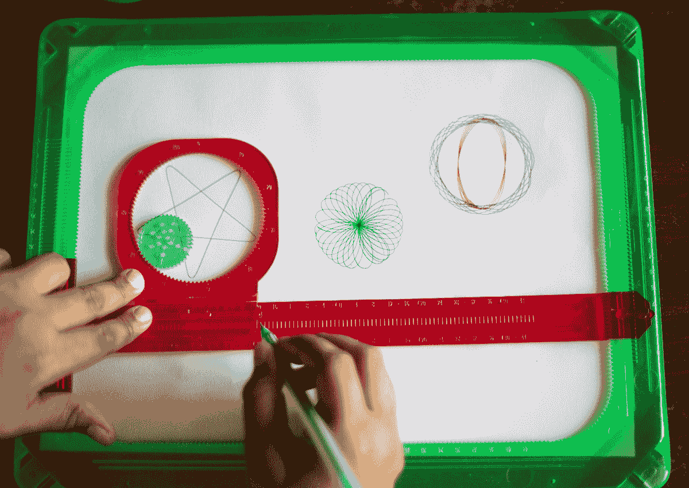

图 2-1：Spirograph 玩具

在这个项目中，你将学习如何在计算机上绘制 spiros。你还将学习如何做以下事情：

+   • 使用参数方程生成曲线。

+   • 使用 `turtle` 模块将曲线绘制为一系列直线。

+   • 使用定时器来使图形动画化。

+   • 将图形保存为图像文件。

提醒一句：我选择使用 `turtle` 模块来绘制 spiros，主要是为了演示目的，并且因为它很有趣，但 `turtle` 运行较慢，在性能至关重要时并不理想。（你能指望海龟做什么呢？）如果你想快速绘制一些东西，有更好的方法可以做到这一点，你将在接下来的项目中探索其中的一些选项。

## 工作原理

这个项目的核心是使用 *参数方程*，即将曲线上的点的坐标表示为一个或多个变量（称为 *参数*）的函数。你将把参数的值代入方程，计算出形成 spiro 图案的点。然后，你将把这些点传递给 `turtle` 模块来绘制曲线。

### 理解参数方程

为了理解参数方程如何工作，我们从一个简单的例子开始：圆。考虑一个半径为 *r* 的圆，圆心位于二维平面的原点。这个圆包含所有满足方程 *x*² + *y*² = *r*² 的点。然而，这并不是一个参数方程。一个参数方程会根据某个变量（即参数）的变化，给出所有可能的 *x* 和 *y* 值。

现在，考虑以下方程：

*x* = *r* cos(θ)

*y* = *r* sin(θ)

这些方程是我们圆的 *参数化* 表示，其中参数是 θ，表示点 (*x*, *y*) 相对于正 x 轴的角度。任何 (*x*, *y*) 的值都将满足原始的 *x*² + *y*² = *r*² 方程。当你将 θ 从 0 变化到 2π 时，这些方程生成的 x 和 y 坐标将形成圆形。图 2-2 展示了这一方案。

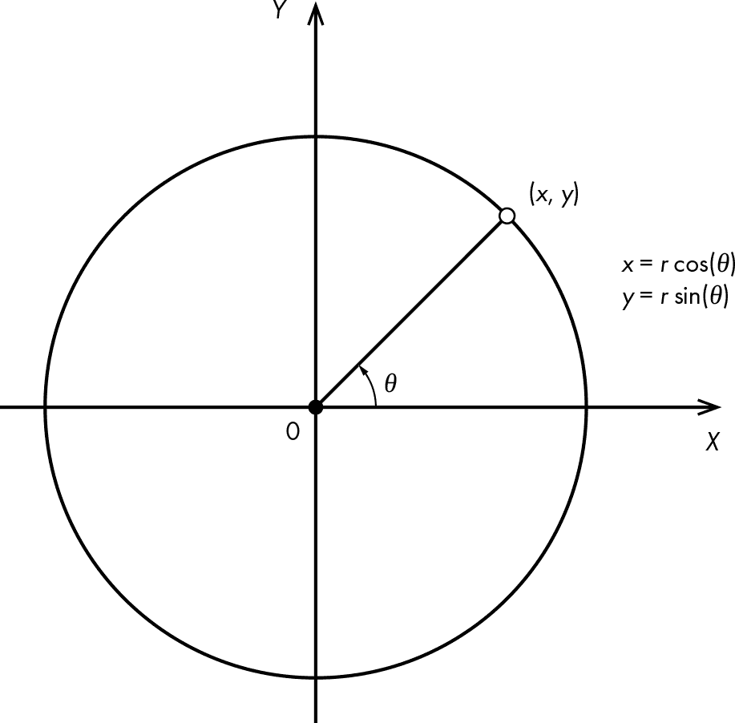

图 2-2：用参数方程描述一个圆

请记住，这两个方程适用于以坐标系原点为中心的圆。你可以通过将圆心从 (0, 0) 平移到 (*a*, *b*) 来将圆放置在 XY 平面上的任何点。然后，较一般的参数方程变为 *x* = *a* + *r* cos(θ) 和 *y* = *b* + *r* sin(θ)。

开发参数方程来模拟涡轮图玩具与开发圆的参数方程并没有太大区别，因为从本质上讲，涡轮图只不过是画两个互锁的圆。图 2-3 展示了类似涡轮图运动的数学模型。该模型没有齿轮齿；齿轮齿仅用于涡轮图玩具中防止滑动，在理想的数学建模世界中，你不需要担心任何东西会滑动。

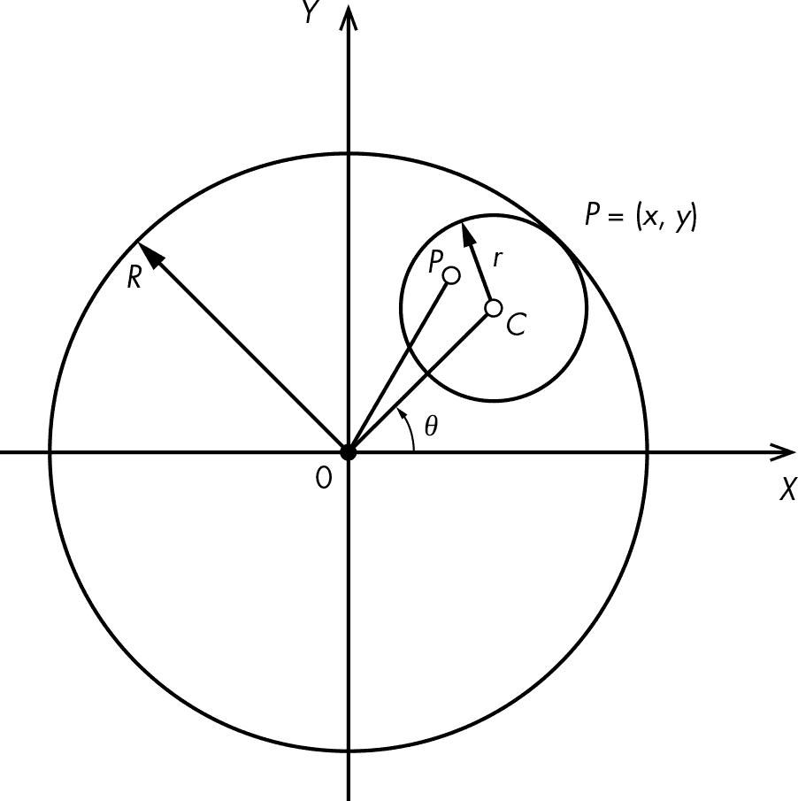

图 2-3：涡轮图玩具的数学模型

在图 2-3 中，*C* 是较小圆的中心，*P* 是笔尖，*q* 是 *C* 相对于正 x 轴的角度。较大圆的半径是 *R*，较小圆的半径是 *r*。你可以将半径的比值表示为变量 *k*，如下所示：

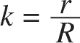

线段 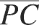 告诉你笔尖距离较小圆中心的距离。你可以将  与较小圆的半径 *r* 的比值表示为变量 *l*，如以下所示：

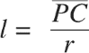

你现在可以将这些变量结合成以下参数方程，表示较小圆在较大圆内旋转时 *P* 点（即笔尖）的 x 和 y 坐标：

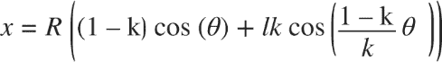

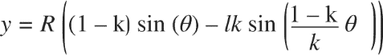

注意 这些曲线被称为 *内切轨迹*。虽然方程式看起来有些吓人，但推导过程非常直接。如果你想深入了解数学部分，可以参考维基百科上的涡轮图页面：[`en.wikipedia.org/wiki/Spirograph`](http://en.wikipedia.org/wiki/Spirograph)。

图 2-4 展示了使用这些方程绘制的示例曲线。对于这条曲线，我将*R*设置为 220，*r*设置为 65，*l*设置为 0.8。通过选择这三个参数的不同值并增量地改变角度θ，你可以生成各种各样迷人的曲线。

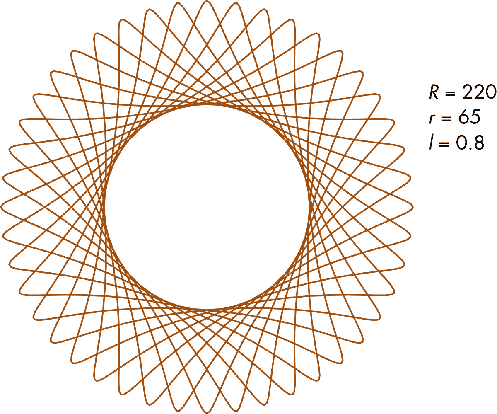

图 2-4：一个示例曲线

唯一剩下的任务是确定何时停止绘制，因为 Spirographs 可能需要小圆围绕大圆旋转多次才能形成完整的图案。你可以通过观察内外圆的半径比来计算 Spirograph 的*周期性*（即 Spirograph 开始重复的时间间隔）：

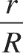

通过将分子和分母除以*最大公约数（**GCD**）*，可以简化这个分数。然后，分子告诉你曲线需要多少周期才能完成自身。例如，在图 2-4 中，(*r*, *R*)的 GCD 是 5：

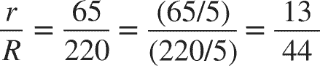

这告诉你，在小圆围绕大圆旋转 13 圈后，曲线将开始重复自身。分母中的 44 告诉你小圆围绕其自身中心旋转的次数，这也为你提供了曲线形状的提示。如果你数一下图 2-4 中的花瓣（或叶片），你会发现正好是 44 个！

一旦你将半径比表示为简化形式的*r*/*R*，绘制 Spirograph 的角度参数θ的范围是[0, 2π*r*]。这告诉你何时停止绘制特定的 Spirograph。在图 2-4 的例子中，你应该在θ达到 26π（即 2π × 13）时停止。如果没有知道角度的结束范围，你将会不停地循环，重复曲线。

### 使用 turtle 图形绘制曲线

Python 的`turtle`模块没有绘制曲线的功能。相反，你将通过之前讨论的参数方程计算出不同点之间的直线来绘制 Spirograph。只要从一个点到下一个点的角度θ变化相对较小，结果就会看起来是弯曲的。

为了演示，以下程序使用`turtle`绘制一个圆。它利用我们基本的圆的参数方程，*x* = *a* + *r* cos(θ) 和 *y* = *b* + *r* sin(θ)，来计算圆上的点，并通过直线连接这些点。从技术上讲，该程序实际上生成的是一个*N*边的多边形，但由于角度参数会以小的增量变化，*N*会非常大，因此多边形看起来就像一个圆。输入以下代码，将其保存为*drawcircle.py*，并在 Python 中运行：

```py
import math
import turtle
# draw the circle using turtle
def drawCircleTurtle(x, y, r):
    # move to the start of circle
    turtle.up()
  ❶ turtle.setpos(x + r, y)
    turtle.down()
    # draw the circle
  ❷ for i in range(0, 365, 5):
      ❸ a = math.radians(i)
      ❹ turtle.setpos(x + r*math.cos(a), y + r*math.sin(a))
❺ drawCircleTurtle(100, 100, 50)
turtle.mainloop()

```

这里你定义了 `drawCircleTurtle()` 函数，其参数是要绘制的圆的中心（*x*，*y*）和圆的半径 *r*。该函数首先将海龟移动到圆的水平轴上的第一个点位置：（*x* + *r*，*y*）❶。调用 `up()` 和 `down()` 防止海龟在进入位置时进行绘制。接下来，你启动一个使用 `range(0, 365, 5)` 的循环，它将变量 `i` 从 0 增加到 360，每次增加 5❷。`i` 变量是你将传递给参数化圆方程的角度参数，但首先你需要将其从度数转换为弧度❸。（大多数计算机程序需要使用弧度进行角度计算。）

使用两个参数方程计算下一组圆坐标，并相应地设置海龟的位置❹。这会从海龟的上一个位置绘制一条直线到新计算的位置。由于你每次只改变角度参数 5 度，直线将呈现出圆形的外观。

现在你有了你的函数，你可以调用它来绘制一个圆❺。调用 `turtle.mainloop()` 会保持 `tkinter` 窗口打开，这样你就可以欣赏你的作品了。（`tkinter` 是 Python 默认的图形用户界面库。）

现在你准备好绘制一些螺旋图案了！你将使用之前展示过的相同 `turtle` 方法。唯一需要更改的是用于计算点的参数方程的细节。

## 要求

你将使用以下代码来创建你的螺旋图案：

+   • `turtle` 模块用于绘图

+   • `Pillow`，一个 *Python Imaging Library (**PIL)* 的分支，用于保存螺旋图像

## 代码

首先你将定义一个 `Spiro` 类来绘制曲线。你可以使用这个类来绘制单个具有可定制参数的曲线，或者作为一个动画的一部分，绘制多个随机螺旋图案并行运行。为了协调动画，你将定义另一个名为 `SpiroAnimator` 的类。在程序的顶层，你将编写一个函数来将你的绘图保存为图像文件，并使用 `main()` 函数来获取用户输入并启动绘图。

要查看完整的项目代码，请跳到“完整代码”在第 36 页。你也可以从[`github.com/mkvenkit/pp2e/blob/main/spirograph/spiro.py`](https://github.com/mkvenkit/pp2e/blob/main/spirograph/spiro.py)下载该项目的代码。

### 绘制螺旋图案

`Spiro` 类提供了绘制单个螺旋图案的方法。以下是 `Spiro` 类的构造函数：

```py
class Spiro:
    # constructor
    def __init__(self, xc, yc, col, R, r, l):
        # create the turtle object
      ❶ self.t = turtle.Turtle()
        # set the cursor shape
      ❷ self.t.shape('turtle')
        # set the step in degrees
      ❸ self.step = 5
        # set the drawing complete flag
      ❹ self.drawingComplete = False
        # set the parameters
        self.setparams(xc, yc, col, R, r, l)
        # initialize the drawing
        self.restart()

```

`Spiro` 构造函数创建一个新的 `turtle` 对象 ❶。这样，每个独立的 `Spiro` 对象都会有一个与之关联的 `turtle` 对象，这意味着你可以创建多个 `Spiro` 对象，同时绘制多个螺旋线。你将海龟光标的形状设置为海龟 ❷。（你可以在 [`docs.python.org/3/library/turtle.xhtml`](https://docs.python.org/3/library/turtle.xhtml) 的 `turtle` 文档中找到其他形状选项。）你将参数绘图的角度增量设置为 5 度 ❸，并创建一个布尔类型的 `drawingComplete` 标志，用于指示螺旋线是否绘制完成 ❹。这个标志在多个 `Spiro` 对象并行绘制时非常有用，它可以帮助你追踪某一条螺旋线是否完成。构造函数的最后，你调用了两个设置方法，接下来会讨论这些方法。

#### 设置方法

`Spiro` 类的 `setparams()` 和 `restart()` 方法都用于在绘制螺旋图案之前进行必要的设置。我们首先来看一下 `setparams()` 方法：

```py
def setparams(self, xc, yc, col, R, r, l):
    # the Spirograph parameters
    self.xc = xc
    self.yc = yc
    self.R = int(R)
    self.r = int(r)
    self.l = l
    self.col = col
    # reduce r/R to its smallest form by dividing with the GCD
  ❶ gcdVal = math.gcd(self.r, self.R)
  ❷ self.nRot = self.r//gcdVal
    # get ratio of radii
    self.k = r/float(R)
    # set the color
    self.t.color(*col)
    # store the current angle
  ❸ self.a = 0

```

首先，你存储螺旋线中心的坐标（`xc` 和 `yc`）。然后你将每个圆的半径（`R` 和 `r`）转换为整数并存储这些值。你还存储了 `l`，它定义了画笔的位置，以及 `col`，它决定了螺旋线的颜色。接下来，你使用 Python 内置 `math` 模块中的 `gcd()` 方法来计算半径的最大公约数 ❶。你利用这些信息来确定曲线的周期性，并将其保存为 `self.nRot` ❷。最后，你将角度参数 `a` 的起始值设为 `0` ❸。

`restart()` 方法通过重置 `Spiro` 对象的绘图参数并将其定位到绘制螺旋线的位置来继续设置工作。这个方法使得可以重复使用同一个 `Spiro` 对象来依次绘制多个螺旋线，作为程序动画的一部分。每当对象准备好绘制新的螺旋线时，程序会调用 `restart()` 方法。以下是该方法的代码：

```py
def restart(self):
    # set the flag
    self.drawingComplete = False
    # show the turtle
    self.t.showturtle()
    # go to the first point
  ❶ self.t.up()
  ❷ R, k, l = self.R, self.k, self.l
    a = 0.0
  ❸ x = R*((1-k)*math.cos(a) + l*k*math.cos((1-k)*a/k))
    y = R*((1-k)*math.sin(a) - l*k*math.sin((1-k)*a/k))
  ❹ self.t.setpos(self.xc + x, self.yc + y)
  ❺ self.t.down()

```

你将 `drawingComplete` 标志重置为 `False`，表示该对象准备好绘制新的螺旋线。然后你显示海龟光标，以防它被隐藏。接下来抬起画笔 ❶，这样你可以在不绘制线条的情况下移动到第一个位置 ❹。在 ❷ 处，你只是使用一些局部变量来保持代码的简洁。然后你将这些变量传递给螺旋线的参数方程，计算曲线起点的 x 和 y 坐标，使用 `0` 作为角度 `a` 的初始值 ❸。最后，一旦海龟定位好，你就放下画笔，让海龟开始绘制螺旋线 ❺。

#### `draw()` 方法

如果你使用命令行选项来设置螺旋线的参数，程序只会绘制那一条螺旋线，使用 `Spiro` 类的 `draw()` 方法。该方法一次性绘制整个螺旋线，作为一连串连续的直线段：

```py
def draw(self):
    # draw the rest of the points
    R, k, l = self.R, self.k, self.l
  ❶ for i in range(0, 360*self.nRot + 1, self.step):
        a = math.radians(i)
      ❷ x = R*((1-k)*math.cos(a) + l*k*math.cos((1-k)*a/k))
        y = R*((1-k)*math.sin(a) - l*k*math.sin((1-k)*a/k))
        try:
          ❸ self.t.setpos(self.xc + x, self.yc + y)
        except:
            print("Exception, exiting.")
            exit(0)
    # drawing is now done so hide the turtle cursor
  ❹ self.t.hideturtle()

```

在这里，你遍历参数`i`的完整范围，该范围以度数表示为 360 乘以`nRot` ❶。你使用参数方程计算每个`i`参数值对应的 x 和 y 坐标 ❷，调用海龟的`setpos()`方法 ❸，从一个点画到下一个点。此方法被包含在`try`块中，这样如果出现异常—比如用户在绘制过程中关闭了窗口—你可以捕获异常并优雅地退出。最后，你隐藏光标，因为你已经完成绘制 ❹。

#### `update()` 方法

如果你没有使用任何命令行选项，程序将绘制多个随机的螺旋图形作为动画。这个方法需要对我们刚刚看到的绘图代码进行一些重构。你需要一种方法来绘制螺旋的单个线段，而不是一次性绘制整个螺旋图形。然后，你将在动画的每个时间步调用该方法。`Spiro`类的`update()`方法正好满足这个需求：

```py
def update(self):
    # skip the rest of the steps if done
  ❶ if self.drawingComplete:
        return
    # increment the angle
  ❷ self.a += self.step
    # draw a step
    R, k, l = self.R, self.k, self.l
    # set the angle
  ❸ a = math.radians(self.a)
    x = self.R*((1-k)*math.cos(a) + l*k*math.cos((1-k)*a/k))
    y = self.R*((1-k)*math.sin(a) - l*k*math.sin((1-k)*a/k))
    try:
      ❹ self.t.setpos(self.xc + x, self.yc + y)
    except:
        print("Exception, exiting.")
        exit(0)
    # if drawing is complete, set the flag
  ❺ if self.a >= 360*self.nRot:
        self.drawingComplete = True
        # drawing is now done so hide the turtle cursor
        self.t.hideturtle()

```

首先检查`drawingComplete`标志是否已设置 ❶；如果没有，继续执行其余代码。你增加当前角度 ❷，计算与当前角度对应的 (*x*, *y*) 位置 ❸，并将海龟移动到该位置，在此过程中绘制线段 ❹。这就像是`draw()`方法中的`for()`循环内部的代码，区别在于它只执行一次。

当我讨论 Spirograph 参数方程时，我提到过曲线的周期性。Spirograph 在某个角度之后会开始重复。你通过检查角度是否已达到为此特定曲线计算的完整范围来完成`update()`函数 ❺。如果是这样，你就设置`drawingComplete`标志，因为螺旋图形已经完成。最后，你隐藏海龟光标，这样你就可以看到你美丽的作品。

### 协调动画

`SpiroAnimator`类将允许你同时绘制多个随机的螺旋图形作为动画。该类协调多个`Spiro`对象的活动，这些对象具有随机分配的参数，并使用计时器定期调用每个`Spiro`对象的`update()`方法。这种技术定期更新图形，并让程序处理诸如按钮按下、鼠标点击等事件。

让我们首先看看`SpiroAnimator`类的构造函数：

```py
class SpiroAnimator:
    # constructor
    def __init__(self, N):
        # set the timer value in milliseconds
      ❶ self.deltaT = 10
        # get the window dimensions
      ❷ self.width = turtle.window_width()
        self.height = turtle.window_height()
        # restarting
      ❸ self.restarting = False
        # create the Spiro objects
        self.spiros = []
        for i in range(N):
            # generate random parameters
          ❹ rparams = self.genRandomParams()
            # set the spiro parameters
          ❺ spiro = Spiro(*rparams)
            self.spiros.append(spiro)
        # call timer
      ❻ turtle.ontimer(self.update, self.deltaT)

```

`SpiroAnimator`构造函数将`deltaT`设置为`10`，这是你将在定时器中使用的毫秒时间间隔❶。然后你存储海龟窗口的尺寸❷，并初始化一个标志，用于指示重启正在进行中❸。在一个重复*N*次的循环中（`N`是作为构造函数参数传递给`SpiroAnimator`的），你创建新的`Spiro`对象❺并将它们添加到`spiros`列表中。在创建每个`Spiro`对象之前，你调用`genRandomParams()`辅助方法❹来随机分配螺旋的参数（我们接下来会看这个方法）。这里的`rparams`是一个元组，你需要将它传递给`Spiro`构造函数。然而，构造函数期望多个参数，因此你使用 Python 的`*`运算符将元组解包成一系列参数。最后，你设置`turtle.ontimer()`方法，在`deltaT`毫秒后调用`update()`❻，从而启动动画。

#### 生成随机参数

你将使用`genRandomParams()`方法生成随机参数，并在每个`Spiro`对象创建时将这些参数发送给它，以生成各种各样的曲线。每次`Spiro`对象完成绘制一个螺旋并准备开始绘制新的螺旋时，你也会调用这个方法：

```py
def genRandomParams(self):
    width, height = self.width, self.height
    R = random.randint(50, min(width, height)//2)
    r = random.randint(10, 9*R//10)
    l = random.uniform(0.1, 0.9)
    xc = random.randint(-width//2, width//2)
    yc = random.randint(-height//2, height//2)
    col = (random.random(),
           random.random(),
           random.random())
  ❶ return (xc, yc, col, R, r, l)

```

为了生成随机数，你使用 Python 的`random`模块中的三个方法：`randint()`，它返回指定范围内的随机整数；`uniform()`，它对浮点数执行相同操作；以及`random()`，它返回一个介于 0 和 1 之间的浮点数。你将`R`设置为 50 到窗口最小维度一半之间的随机整数，并将`r`设置为`R`的 10%到 90%之间。然后你将`l`设置为 0.1 到 0.9 之间的随机分数。

接下来，你选择屏幕上的一个随机点来确定螺旋的中心，通过在屏幕边界内随机选择 x 和 y 坐标（`xc`和`yc`）。你通过设置随机的红色、绿色和蓝色色彩分量（这些值在 0 到 1 的范围内）为曲线分配一个随机颜色`col`。最后，所有计算出的参数将作为一个元组❶返回。

#### 重启动画

`SpiroAnimator`类有它自己的`restart()`方法，用于重启动画以绘制一组新的螺旋：

```py
def restart(self):
    # ignore restart if already in the middle of restarting
  ❶ if self.restarting:
        return
    else:
        self.restarting = True
    for spiro in self.spiros:
        # clear
        spiro.clear()
        # generate random parameters
        rparams = self.genRandomParams()
        # set the spiro parameters
        spiro.setparams(*rparams)
        # restart drawing
        spiro.restart()
    # done restarting
  ❷ self.restarting = False

```

这个方法遍历所有的`Spiro`对象。对于每个对象，你清除之前的绘图并随机生成一组新的螺旋参数。然后你使用`Spiro`对象的设置方法`setparams()`和`restart()`，为它分配新的参数，并让对象准备好绘制下一个螺旋。`self.restarting`标志❶防止这个方法在完成之前被调用，如果用户反复按空格键，就可能发生这种情况。该标志会在方法结束时重置，这样下次重启就不会被忽略❷。

#### 更新动画

以下代码展示了 `SpiroAnimator` 中的 `update()` 方法，该方法每 10 毫秒由定时器调用一次，用于更新动画中使用的所有 `Spiro` 对象：

```py
def update(self):
    # update all spiros
  ❶ nComplete = 0
    for spiro in self.spiros:
        # update
      ❷ spiro.update()
        # count completed spiros
      ❸ if spiro.drawingComplete:
            nComplete += 1
    # restart if all spiros are complete
  ❹ if nComplete == len(self.spiros):
        self.restart()
    # call the timer
    try:
      ❺ turtle.ontimer(self.update, self.deltaT)
    except:
        print("Exception, exiting.")
        exit(0)

```

`update()` 方法使用计数器 `nComplete` 来追踪已完成绘制的 `Spiro` 对象的数量 ❶。该方法遍历 `Spiro` 对象列表并更新它们 ❷，每次更新都会在每个 spiro 中绘制一个新的线段。如果某个 `Spiro` 已完成绘制，你会增加计数器 ❸。

在循环外，你检查计数器，以确定所有对象是否已经完成绘制 ❹。如果完成，你通过调用 `restart()` 方法重新开始动画，生成新的 spiro。`update()` 方法最后会调用 `turtle` 模块的 `ontimer()` 方法 ❺，在 `deltaT` 毫秒后再次调用 `update()`。这就是保持动画持续进行的方式。

#### 显示或隐藏游标

你使用 `SpiroAnimator` 类的以下方法来切换 turtle 游标的显示与隐藏。关闭游标可以加快绘图速度。

```py
def toggleTurtles(self):
    for spiro in self.spiros:
        if spiro.t.isvisible():
            spiro.t.hideturtle()
        else:
            spiro.t.showturtle()

```

该方法使用内置的 `turtle` 方法来隐藏游标（如果它可见）或显示游标（如果它不可见）。稍后你将看到，当动画运行时，这个 `toggleTurtles()` 方法如何通过按键触发。

### 保存曲线

在你辛苦生成 spiro 之后，有一种方法可以保存结果会很方便。独立的 `saveDrawing()` 函数将绘图窗口的内容保存为 PNG 图片文件：

```py
def saveDrawing():
    # hide the turtle cursor
      ❶ turtle.hideturtle()
        # generate unique filenames
      ❷ dateStr = (datetime.now()).strftime("%d%b%Y-%H%M%S")
        fileName = 'spiro-' + dateStr
        print('saving drawing to {}.eps/png'.format(fileName))
        # get the tkinter canvas
        canvas = turtle.getcanvas()
        # save the drawing as a postscript image
      ❸ canvas.postscript(file = fileName + '.eps')
        # use the Pillow module to convert the postscript image file to PNG
      ❹ img = Image.open(fileName + '.eps')
      ❺ img.save(fileName + '.png', 'png')
        # show the turtle cursor
        turtle.showturtle()

```

你隐藏 turtle 游标，这样它们就不会出现在最终的绘图中 ❶。然后，你使用 `datetime()` 生成基于时间戳的唯一图像文件名（采用 *日-月-年-小时-分钟-秒* 格式） ❷。你将这个字符串附加到 *spiro-* 后生成文件名。

`turtle` 程序使用由 `tkinter` 创建的用户界面（UI）窗口，你使用 `tkinter` 的 `canvas` 对象将窗口保存为嵌入式 PostScript（EPS）文件格式 ❸。由于 EPS 是基于矢量的，你可以使用它以高分辨率打印图像，但 PNG 格式更为通用，因此你使用 `Pillow` 打开 EPS 文件 ❹ 并将其保存为 PNG 文件 ❺。最后，你会重新显示 turtle 游标。

### 解析命令行参数和初始化

本书中的大多数项目都有命令行参数，用于定制代码。与其试图手动解析它们并制造混乱，不如将这项繁琐的任务委托给 Python 的 `argparse` 模块。这就是你在 spiro 程序的 `main()` 函数的第一部分中所做的：

```py
def main():
  ❶ parser = argparse.ArgumentParser(description=descStr)
    # add expected arguments
  ❷ parser.add_argument('--sparams', nargs=3, dest='sparams', required=False,
                        help="The three arguments in sparams: R, r, l.")
    # parse args
  ❸ args = parser.parse_args()

```

你创建了一个`ArgumentParser`对象来管理命令行参数 ❶。然后，你将`--sparams`参数添加到解析器中 ❷。它包含三个组件，分别是涡旋的*R*、*r*和*l*参数。你使用`dest`选项指定参数解析后存储值的变量名，而`required=False`表示该参数是可选的。你调用`parse_args()`方法 ❸来实际解析参数。这将使得参数作为`args`对象的属性可以使用。在这个例子中，`--sparams`参数的值将通过`args.sparams`来访问。

注意：你将在本书中按照这里描述的基本模式，创建并解析每个项目的命令行参数。

`main()`函数继续设置一些`turtle`参数：

```py
    # set the width of the drawing window to 80 percent of the screen width
  ❶ turtle.setup(width=0.8)
    # set the cursor shape to turtle
    turtle.shape('turtle')
    # set the title to Spirographs!
    turtle.title("Spirographs!")
    # add the key handler to save our drawings
  ❷ turtle.onkey(saveDrawing, "s")
    # start listening
  ❸ turtle.listen()
    # hide the main turtle cursor
  ❹ turtle.hideturtle()

```

你使用`setup()`方法将绘图窗口的宽度设置为屏幕宽度的 80% ❶。（你还可以给`setup()`方法指定特定的高度和原点参数。）接着，你将光标形状设置为海龟，并将程序窗口的标题设置为*Spirographs!* 然后，你使用`onkey()`与`saveDrawing()`函数结合，指示程序在按下键盘上的 S 键时保存绘图 ❷。调用`listen()`方法使绘图窗口监听用户事件（例如按键输入） ❸。最后，你隐藏了海龟光标 ❹。

`main()`函数的其余部分如下：

```py
    # check for any arguments sent to --sparams and draw the Spirograph
  ❶ if args.sparams:
      ❷ params = [float(x) for x in args.sparams]
        # draw the Spirograph with the given parameters
        col = (0.0, 0.0, 0.0)
      ❸ spiro = Spiro(0, 0, col, *params)
      ❹ spiro.draw()
    else:
        # create the animator object
      ❺ spiroAnim = SpiroAnimator(4)
        # add a key handler to toggle the turtle cursor
        turtle.onkey(spiroAnim.toggleTurtles, "t")
        # add a key handler to restart the animation
        turtle.onkey(spiroAnim.restart, "space")
    # start the turtle main loop
  ❻ turtle.mainloop()

```

你首先检查是否给`--sparams`参数提供了任何值 ❶；如果有，程序将仅绘制由这些参数定义的一个涡旋图。当前，这些参数作为字符串存在，但你需要将它们解释为数字。你使用列表推导式将它们转换为浮动数字的列表 ❷。（*列表推导式*是 Python 中的一种构造方式，让你以简洁而强大的方式创建列表。例如，`a = [2*x for x in range(1, 5)]`将创建一个包含前四个偶数的列表。）接着，你使用这些参数构造一个`Spiro`对象 ❸（通过 Python 的`*`运算符，它将列表解包成一系列参数），并调用`draw()`方法绘制涡旋图 ❹。

如果在命令行没有指定任何参数，则进入随机动画模式。为此，你需要创建一个`SpiroAnimator`对象 ❺，并传递参数`4`，该参数告诉它同时绘制四个涡旋图。接着，你使用两个`onkey`调用来捕捉额外的按键输入。按下 T 键将通过`toggleTurtles()`方法显示或隐藏海龟光标，而按下空格键（`space`）则会调用`restart()`方法，在任何时候中断动画并开始绘制四个不同的随机涡旋图。最后，你调用`mainloop()`方法，告诉`tkinter`窗口保持打开，监听事件 ❻。

## 运行涡旋动画

现在是时候运行你的程序了：

```py
$ `python spiro.py`

```

默认情况下，*spiro.py* 程序同时绘制四个随机的 spiro，如图 2-5 所示。按 S 键保存绘图，按 T 键切换光标，按空格键重新开始动画。

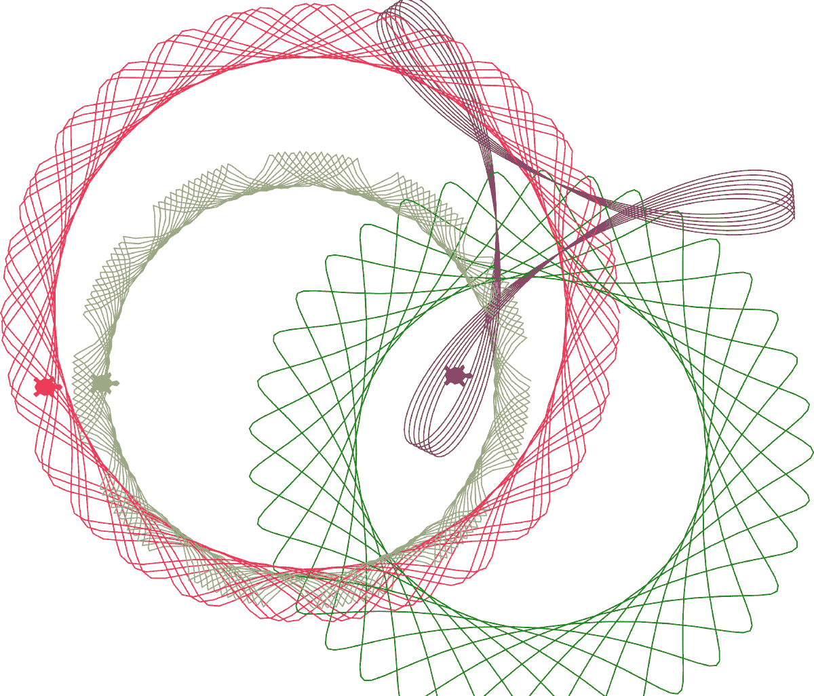

图 2-5：*spiro.py* 的示例运行

现在再次运行程序，这次在命令行传递参数来绘制一个特定的 spiro：

```py
$ `python spiro.py --sparams 300 100 0.9`

```

图 2-6 显示了输出。如你所见，这段代码根据用户指定的参数绘制了一个单一的 spiro，与图 2-5 的多个随机 spiro 动画展示不同。

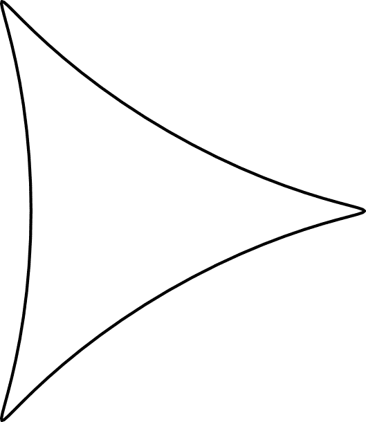

图 2-6：带有特定参数的 *spiro.py* 示例运行

玩得开心，尝试不同的参数，看看它们如何影响结果曲线。

## 总结

在这个项目中，你学习了如何创建类似于旋转图形的曲线。你还学习了如何调整输入参数，以生成各种不同的曲线，并在屏幕上动画展示它们。希望你喜欢创建这些 spiro。（你会在第十三章发现一个惊喜，在那里你将学习如何将 spiro 投影到墙上！）

## 实验！

这里有一些进一步尝试 spiro 的方法：

1.  1\. 现在你知道如何绘制圆形了，写一个程序来绘制随机的 *螺旋线*。找到 *对数螺旋* 的参数方程，然后用它来绘制螺旋线。

1.  2\. 你可能注意到，乌龟光标在绘制曲线时总是朝右，但这并不是乌龟的移动方式！将乌龟的方向调整为，在绘制曲线时，它朝着绘制的方向。 （提示：计算每一步连续点之间的方向向量，并使用 `turtle`.`setheading()` 方法重新调整乌龟的方向。）

## 完整代码

这是完整的 Spirograph 程序：

```py
"""
spiro.py
A Python program that simulates a Spirograph.
Author: Mahesh Venkitachalam
"""
import random, argparse
import numpy as np
import math
import turtle
import random
from PIL import Image
from datetime import datetime
# a class that draws a spiro
class Spiro:
    # constructor
    def __init__(self, xc, yc, col, R, r, l):
        # create own turtle
        self.t = turtle.Turtle()
        # set cursor shape
        self.t.shape('turtle')
        # set step in degrees
        self.step = 5
        # set drawing complete flag
        self.drawingComplete = False
        # set parameters
        self.setparams(xc, yc, col, R, r, l)
        # initialize drawing
        self.restart()
    # set parameters
    def setparams(self, xc, yc, col, R, r, l):
        # spirograph parameters
        self.xc = xc
        self.yc = yc
        self.R = int(R)
        self.r = int(r)
        self.l = l
        self.col = col
        # reduce r/R to smallest form by dividing with GCD
        gcdVal = math.gcd(self.r, self.R)
        self.nRot = self.r//gcdVal
        # get ratio of radii
        self.k = r/float(R)
        # set color
        self.t.color(*col)
        # current angle
        self.a = 0
    # restart drawing
    def restart(self):
        # set flag
        self.drawingComplete = False
        # show turtle
        self.t.showturtle()
        # go to first point
        self.t.up()
        R, k, l = self.R, self.k, self.l
        a = 0.0
        x = R*((1-k)*math.cos(a) + l*k*math.cos((1-k)*a/k))
        y = R*((1-k)*math.sin(a) - l*k*math.sin((1-k)*a/k))
        try:
            self.t.setpos(self.xc + x, self.yc + y)
        except:
            print("Exception, exiting.")
            exit(0)
        self.t.down()
    # draw the whole thing
    def draw(self):
        # draw rest of points
        R, k, l = self.R, self.k, self.l
        for i in range(0, 360*self.nRot + 1, self.step):
            a = math.radians(i)
            x = R*((1-k)*math.cos(a) + l*k*math.cos((1-k)*a/k))
            y = R*((1-k)*math.sin(a) - l*k*math.sin((1-k)*a/k))
            try:
                self.t.setpos(self.xc + x, self.yc + y)
            except:
                print("Exception, exiting.")
                exit(0)
        # done - hide turtle
        self.t.hideturtle()
    # update by one step
    def update(self):
        # skip if done
        if self.drawingComplete:
            return
        # increment angle
        self.a += self.step
        # draw step
        R, k, l = self.R, self.k, self.l
        # set angle
        a = math.radians(self.a)
        x = self.R*((1-k)*math.cos(a) + l*k*math.cos((1-k)*a/k))
        y = self.R*((1-k)*math.sin(a) - l*k*math.sin((1-k)*a/k))
        try:
            self.t.setpos(self.xc + x, self.yc + y)
        except:
            print("Exception, exiting.")
            exit(0)
        # check if drawing is complete and set flag
        if self.a >= 360*self.nRot:
            self.drawingComplete = True
            # done - hide turtle
            self.t.hideturtle()
    # clear everything
    def clear(self):
        # pen up
        self.t.up()
        # clear turtle
        self.t.clear()
# a class for animating spiros
class SpiroAnimator:
    # constructor
    def __init__(self, N):
        # timer value in milliseconds
        self.deltaT = 10
        # get window dimensions
        self.width = turtle.window_width()
        self.height = turtle.window_height()
        # restarting
        self.restarting = False
        # create spiro objects
        self.spiros = []
        for i in range(N):
            # generate random parameters
            rparams = self.genRandomParams()
            # set spiro params
            spiro = Spiro(*rparams)
            self.spiros.append(spiro)
        # call timer
        turtle.ontimer(self.update, self.deltaT)
    # restart spiro drawing
    def restart(self):
        # ignore restart if already in the middle of restarting
        if self.restarting:
            return
        else:
            self.restarting = True
        # restart
        for spiro in self.spiros:
            # clear
            spiro.clear()
            # generate random parameters
            rparams = self.genRandomParams()
            # set spiro params
            spiro.setparams(*rparams)
            # restart drawing
            spiro.restart()
        # done restarting
        self.restarting = False
    # generate random parameters
    def genRandomParams(self):
        width, height = self.width, self.height
        R = random.randint(50, min(width, height)//2)
        r = random.randint(10, 9*R//10)
        l = random.uniform(0.1, 0.9)
        xc = random.randint(-width//2, width//2)
        yc = random.randint(-height//2, height//2)
        col = (random.random(),
               random.random(),
               random.random())
        return (xc, yc, col, R, r, l)
    def update(self):
        # update all spiros
        nComplete = 0
        for spiro in self.spiros:
            # update
            spiro.update()
            # count completed ones
            if spiro.drawingComplete:
                nComplete+= 1
        # if all spiros are complete, restart
        if nComplete == len(self.spiros):
            self.restart()
        # call timer
        try:
            turtle.ontimer(self.update, self.deltaT)
        except:
            print("Exception, exiting.")
            exit(0)
    # toggle turtle on/off
    def toggleTurtles(self):
        for spiro in self.spiros:
            if spiro.t.isvisible():
                spiro.t.hideturtle()
            else:
                spiro.t.showturtle()
# save spiros to image
def saveDrawing():
    # hide turtle
    turtle.hideturtle()
    # generate unique filename
    dateStr = (datetime.now()).strftime("%d%b%Y-%H%M%S")
    fileName = 'spiro-' + dateStr
    print('saving drawing to {}.eps/png'.format(fileName))
    # get tkinter canvas
    canvas = turtle.getcanvas()
    # save postscript image
    canvas.postscript(file = fileName + '.eps')
    # use PIL to convert to PNG
    img = Image.open(fileName + '.eps')
    img.save(fileName + '.png', 'png')
    # show turtle
    turtle.showturtle()
# main() function
def main():
    # use sys.argv if needed
    print('generating spirograph...')
    # create parser
    descStr = """This program draws spirographs using the Turtle module.
    When run with no arguments, this program draws random spirographs.
    Terminology:
    R: radius of outer circle.
    r: radius of inner circle.
    l: ratio of hole distance to r.
    """
    parser = argparse.ArgumentParser(description=descStr)
    # add expected arguments
    parser.add_argument('--sparams', nargs=3, dest='sparams', required=False,
                        help="The three arguments in sparams: R, r, l.")
    # parse args
    args = parser.parse_args()
    # set to 80% screen width
    turtle.setup(width=0.8)
    # set cursor shape
    turtle.shape('turtle')
    # set title
    turtle.title("Spirographs!")
    # add key handler for saving images
    turtle.onkey(saveDrawing, "s")
    # start listening
    turtle.listen()
    # hide main turtle cursor
    turtle.hideturtle()
    # check args and draw
    if args.sparams:
        params = [float(x) for x in args.sparams]
        # draw spirograph with given parameters
        # black by default
        col = (0.0, 0.0, 0.0)
        spiro = Spiro(0, 0, col, *params)
        spiro.draw()
    else:
        # create animator object
        spiroAnim = SpiroAnimator(4)
        # add key handler to toggle turtle cursor
        turtle.onkey(spiroAnim.toggleTurtles, "t")
        # add key handler to restart animation
        turtle.onkey(spiroAnim.restart, "space")
    # start turtle main loop
    turtle.mainloop()
# call main
if __name__ == '__main__':
    main()

```
