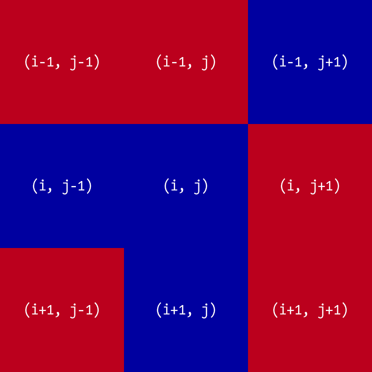
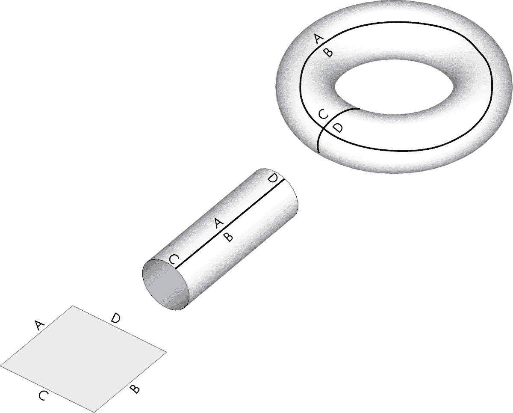
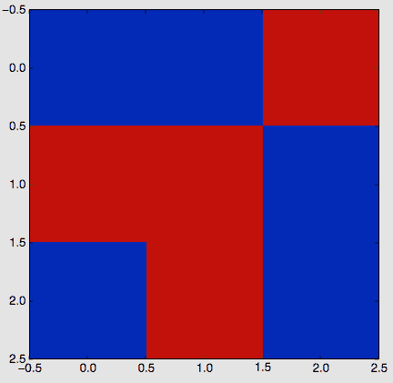
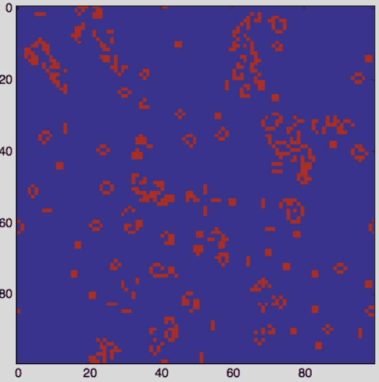
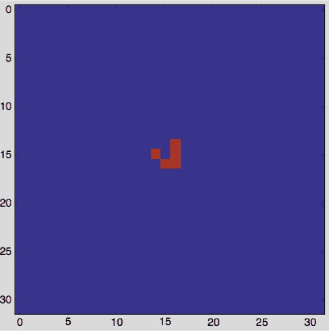
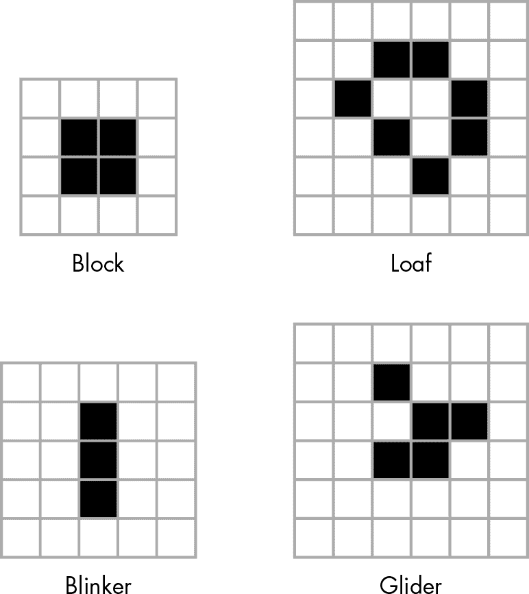

## 第三章：# 康威生命游戏


你可以通过创建该系统的数学模型，编写程序来表示模型，然后让模型随时间演化来用计算机研究一个系统。计算机仿真有很多种，但我将专注于一个著名的仿真——康威的生命游戏，这是英国数学家约翰·康威的工作。生命游戏是一个*细胞自动机*的例子，细胞自动机是网格上由一组彩色细胞组成的集合，通过一系列时间步长根据规则定义相邻细胞的状态而演化。

在这个项目中，你将创建一个 *N*×*N* 的细胞网格，并通过应用康威生命游戏的规则来模拟系统随时间的演变。你将显示每个时间步长的游戏状态，并提供将输出保存到文件的方法。你将把系统的初始状态设置为随机分布或预先设计的模式。

这个仿真由以下几个组件组成：

+   • 在一维或二维空间中定义的属性

+   • 一个数学规则，用于在仿真中的每一步改变这一属性

+   • 显示或捕捉系统随时间演变状态的方法

康威生命游戏中的细胞可以是开（ON）或关（OFF）。游戏从一个初始状态开始，在这个状态下，每个细胞都被分配到这两种状态之一。然后，数学规则决定每个细胞状态如何随时间变化。康威生命游戏的神奇之处在于，仅凭四个简单的规则，系统就能演变出极其复杂的模式，几乎仿佛它们是活的。这些模式包括“滑翔者”在网格中滑动，“闪烁器”开关闪烁，甚至是自复制的模式。

当然，这个游戏的哲学意义也非常重大，因为它表明复杂的结构可以从简单的规则中演化出来，而不必遵循任何预设模式。

下面是本项目中涵盖的一些主要概念：

+   • 使用`matplotlib imshow`来表示二维数据网格

+   • 使用`matplotlib`进行动画处理

+   • 使用`numpy`数组

+   • 使用 `%` 运算符处理边界条件

+   • 设置随机值分布

## 它是如何工作的

因为生命游戏是基于九个方格的网格构建的，所以每个细胞都有八个相邻的细胞，如图 3-1 所示。仿真中给定的细胞 (*i*, *j*) 在网格 [*i*][*j*] 上访问，其中 *i* 和 *j* 分别是行和列的索引。给定时刻某个细胞的值依赖于前一个时间步长中其相邻细胞的状态。



图 3-1：一个中心细胞 (*i*, *j*) 和其八个相邻的细胞

康威的生命游戏有四个规则：

1.  1\. 如果一个单元格为开启状态且有少于两个相邻单元格为开启状态，则该单元格会变为关闭状态。

1.  2\. 如果一个单元格为开启状态且有两个或三个相邻单元格为开启状态，则该单元格保持开启状态。

1.  3\. 如果一个单元格为开启状态且有超过三个相邻单元格为开启状态，则该单元格会变为关闭状态。

1.  4\. 如果一个单元格为关闭状态且有恰好三个相邻单元格为开启状态，则该单元格会变为开启状态。

这些规则旨在模拟群体生物随时间变化的基本方式：人口过少和过多会通过在单元格相邻单元格少于两个或多于三个时将单元格关闭来杀死细胞；但当人口平衡时，细胞保持开启状态并通过将另一个单元格从关闭状态变为开启状态来繁殖。

我提到过每个单元格有八个邻居单元格，但对于网格边缘的单元格呢？它们的邻居是谁？为了解答这个问题，你需要考虑*边界条件*，即支配网格边缘或边界上单元格行为的规则。我将通过使用*环形边界条件*来回答这个问题，这意味着方形网格会像圆环一样环绕。正如图 3-2 所示，网格首先被弯曲，使其水平边缘（A 和 B）连接形成一个圆柱，然后圆柱的垂直边缘（C 和 D）连接形成一个环面。一旦环面形成，所有单元格都有邻居，因为整个空间没有边界。



图 3-2：环形边界条件的概念可视化

环形边界条件在二维模拟和游戏中很常见。例如，游戏*吃豆人*就使用了这种边界条件。如果你从屏幕顶部走出，你会从底部重新出现。如果你从屏幕的左侧走出，你会从右侧重新出现。对于“生命游戏”的模拟，你也会遵循相同的逻辑：例如，对于网格的左上角单元格，其上方的邻居将是左下角的单元格，其左侧的邻居将是右上角的单元格。

这是你将用于应用这四个规则并运行模拟的算法描述：

1.  1\. 初始化网格中的单元格。

1.  2\. 在每次模拟的时间步长中，对于网格中的每个单元格（*i*, *j*），执行以下操作：

    1.  a. 根据邻居的状态更新单元格（*i*, *j*）的值，同时考虑边界条件。

    1.  b. 更新网格值的显示。

## 需求

你将使用`numpy`数组和`matplotlib`库来显示模拟输出，并使用`matplotlib`的`animation`模块来更新模拟。

## 代码

我们将逐步分析程序的关键部分，包括如何使用`numpy`和`matplotlib`表示仿真网格，如何设置仿真的初始条件，如何处理环形边界条件，以及如何实现《生命游戏》规则。我们还将看看程序的`main()`函数，该函数将命令行参数传递给程序并启动仿真。要查看完整的项目代码，请跳转到“完整代码”部分，位于第 56 页。你也可以从[`github.com/mkvenkit/pp2e/tree/main/conway`](https://github.com/mkvenkit/pp2e/tree/main/conway)下载代码。

### 表示网格

为了表示网格上一个单元格是生存（ON）还是死亡（OFF），你将分别使用`255`和`0`来表示 ON 和 OFF。你将使用`matplotlib`中的`imshow()`方法显示网格的当前状态，该方法将一个数字矩阵表示为图像。为了了解它是如何工作的，我们在 Python 解释器中尝试一个简单的例子。输入以下内容：

```py
>>> `import numpy as np`
>>> `import matplotlib.pyplot as plt`
❶ >>> `x = np.array([[0, 0, 255], [255, 255, 0], [0, 255, 0]])`
❷ >>> `plt.imshow(x, interpolation='nearest')`
>>> `plt.show()`

```

你定义了一个形状为(3, 3)的二维`numpy`数组❶，这意味着该数组有三行三列。数组的每个元素是一个整数值。然后，你使用`plt.imshow()`方法将这个数值矩阵显示为图像❷，并传递插值选项`'nearest'`以获得单元格的锐利边缘（否则它们会模糊）。图 3-3 显示了此代码的输出。



图 3-3：显示值的网格

注意，值为`0`（OFF）的方格会显示较暗的颜色，而值为`255`（ON）的方格会显示较亮的颜色。

### 设置初始条件

要开始仿真，首先为二维网格中的每个单元格设置初始状态。你可以使用随机分布的 ON 和 OFF 单元格，观察出现的各种模式，或者你可以添加一些特定的模式，看看它们如何演化。我们将讨论这两种方法。

要设置随机的初始状态，可以使用`numpy`中的`random`模块的`choice()`方法。在 Python 解释器中输入以下内容以查看其工作原理：

```py
>>> `np.random.choice([0, 255], 4*4, p=[0.1, 0.9]).reshape(4, 4)`

```

输出将类似于这样：

```py
array([[255, 255, 255, 255],
       [255, 255, 255, 255],
       [255, 255, 255, 255],
       [255, 255, 255, 0]])

```

`np.random.choice()`从给定的列表`[0, 255]`中选择一个值，选择每个值的概率由参数`p=[0.1, 0.9]`给定。在这里，你要求 0 出现的概率为 0.1（或 10%），要求 255 出现的概率为 90%。(`p`中的两个值之和必须为 1。) `choice()`方法创建一个一维数组，在此例中包含 16 个值（由`4*4`指定）。你使用`reshape()`将其转换为一个具有四行四列的二维数组。

要设置初始条件以匹配特定的模式，而不是仅仅填充一组随机值，首先使用 `np.zeros()` 初始化网格，将所有单元格设置为零：

```py
grid = np.zeros(N*N).reshape(N, N)

```

这创建了一个 *N*×*N* 的零值数组。现在，定义一个函数，在网格的特定行和列添加一个模式：

```py
def addGlider(i, j, grid):
    """adds a glider with top left cell at (i, j)"""
  ❶ glider = np.array([[0, 0, 255],
                       [255, 0, 255],
                       [0, 255, 255]])
  ❷ grid[i:i+3, j:j+3] = glider

```

你定义了一个滑翔机模式（一个在网格中稳定移动的观察模式），使用形状为 (3, 3) 的 `numpy` 数组 ❶。然后你使用 `numpy` 切片操作，将 `glider` 数组复制到模拟的二维网格中 ❷，并将模式的左上角放置在你指定的坐标（`i` 和 `j`）位置。

现在，你可以通过调用你刚才定义的 `addGlider()` 函数，将滑翔机模式添加到零值网格中：

```py
addGlider(1, 1, grid)

```

你指定坐标（1, 1）将滑翔机添加到网格的左上角附近（即坐标为 (0, 0)）。注意，对于 `grid[i, j]`，`i` 从 `0` 开始并向下运行，而 `j` 从 `0` 开始并向右运行。

### 强制边界条件

现在我们可以考虑如何实现环形边界条件。首先，让我们看看在一个 *N*×*N* 大小的网格的右边缘发生了什么。第 *i* 行的最后一个单元格可以通过 `grid[i, N-1]` 访问。它右侧的邻居是 `grid[i, N]`，但根据环形边界条件，访问 `grid[i, N]` 时应该用 `grid[i, 0]` 替代。下面是一种实现方式：

```py
if j == N-1:
    right = grid[i, 0]
else:
    right = grid[i, j+1]

```

当然，你还需要在网格的左侧、上侧和下侧应用类似的边界条件，但这样做需要添加更多的代码，因为网格的四个边都需要进行测试。一个更简洁的实现边界条件的方式是使用 Python 的取模（`%`）操作符，这里在 Python 解释器中演示了这一点：

```py
>>> `N = 16`
>>> `i1 = 14`
>>> `i2 = 15`
>>> `(i1+1)%N`
15
>>> `(i2+1)%N`
0

```

如你所见，`%` 操作符给出了整数除法的余数，除数为 `N`。在这个例子中，`15%16` 结果是 `15`，而 `16%16` 结果是 `0`。你可以通过重写网格访问代码来使用 `%` 操作符，让值在右边界处回绕，像这样：

```py
right = grid[i, (j+1)%N]

```

现在，当一个单元格位于网格的边缘时（也就是说，当 `j = N-1` 时），使用这种方法请求右侧的单元格将得到 `(j+1)%N`，这会将 `j` 重置为 `0`，使网格的右侧回绕到左侧。当你对网格的底部做同样的处理时，它会回绕到顶部：

```py
bottom = grid[(i+1)%N, j]

```

### 实现规则

生命游戏的规则基于邻居单元格的开（ON）或关（OFF）状态。为了简化这些规则的应用，你只需要计算邻居单元格中开（ON）状态的数量。因为开（ON）对应的值为 255，只需将所有邻居单元格的值相加，然后除以 255，就能得到开（ON）单元格的数量。以下是相关代码：

```py
total = int((grid[i, (j-1)%N] + grid[i, (j+1)%N] +
             grid[(i-1)%N, j] + grid[(i+1)%N, j] +
             grid[(i-1)%N, (j-1)%N] + grid[(i-1)%N, (j+1)%N] +
             grid[(i+1)%N, (j-1)%N] + grid[(i+1)%N, (j+1)%N])/255)

```

对于给定的单元格(*i*, *j*)，你通过使用`%`运算符来考虑环形边界条件，求出其八个相邻单元格的值之和。将结果除以 255 即可得到开启状态的相邻单元格数量，这个值存储在变量`total`中。现在你可以使用`total`来应用生命游戏的规则：

```py
# apply Conway's rules
if grid[i, j] == ON:
  ❶ if (total < 2) or (total > 3):
        newGrid[i, j] = OFF
else:
  ❷ if total == 3:
        newGrid[i, j] = ON

```

任何处于开启状态的单元格，如果其相邻单元格中开启的数量少于两个，或者多于三个，则会被关闭❶。`else`分支中的代码仅应用于关闭状态的单元格：如果恰好有三个相邻单元格处于开启状态，则该单元格会被开启❷。这些变化会被应用到`newGrid`中的对应单元格，`newGrid`最初是`grid`的副本。一旦每个单元格都被评估和更新，`newGrid`就包含了展示仿真下一时间步的数据。你不能直接修改`grid`，否则在评估单元格时它们的状态会不断变化。

### 向程序传递命令行参数

现在你可以开始编写仿真程序的`main()`函数，它首先将命令行参数传递给程序：

```py
def main():
    # command line arguments are in sys.argv[1], sys.argv[2], ...
    # sys.argv[0] is the script name and can be ignored
    # parse arguments
  ❶ parser = argparse.ArgumentParser(description="Runs Conway's Game of Life
                                     simulation.")
    # add arguments
  ❷ parser.add_argument('--grid-size', dest='N', required=False)
  ❸ parser.add_argument('--interval', dest='interval', required=False)
  ❹ parser.add_argument('--glider', action='store_true', required=False)
    args = parser.parse_args()

```

你创建了一个`argparse.ArgumentParser`对象来为代码添加命令行选项❶，然后在接下来的行中为它添加了各种选项。❷处的选项指定了仿真网格大小*N*，❸处的选项设置了动画更新间隔（毫秒）。你还创建了一个选项，用于以滑行器模式启动仿真❹。如果没有设置此选项，仿真将以随机的开启和关闭状态开始。

### 初始化仿真

继续编写`main()`函数，你会看到以下部分，它初始化了仿真：

```py
    # set grid size
  ❶ N = 100
    # set animation update interval
  ❷ updateInterval = 50
    if args.interval:
        updateInterval = int(args.interval)
    # declare grid
    grid = np.array([])
    # check if "glider" demo flag is specified
  ❸ if args.glider:
        grid = np.zeros(N*N).reshape(N, N)
        addGlider(1, 1, grid)
  ❹ else:
        # set N if specified and valid
        if args.N and int(args.N) > 8:
            N = int(args.N)
        # populate grid with random on/off - more off than on
        grid = randomGrid(N)

```

这部分代码应用在命令行传入的任何参数，一旦命令行选项被解析。首先，设置默认的网格大小为 100×100 单元格❶和 50 毫秒的更新时间间隔❷，以防这些选项没有在命令行中设置。然后，你设置初始条件，默认情况下是一个随机模式❹，或者是一个滑行器模式❸。

最后，你设置动画：

```py
    # set up the animation
  ❶ fig, ax = plt.subplots()
    img = ax.imshow(grid, interpolation='nearest')
  ❷ ani = animation.FuncAnimation(fig, update, fargs=(img, grid, N, ),
                                  interval=updateInterval,
                                  save_count=50)
    plt.show()

```

仍然在`main()`函数中，你配置`matplotlib`绘图和动画参数❶。然后，你设置`animation.FuncAnimation()`，定期调用程序前面定义的`update()`函数，该函数根据康威的“生命游戏”规则，使用环形边界条件更新网格❷。

## 运行生命游戏仿真

现在运行代码：

```py
$ `python conway.py`

```

这使用了仿真的默认参数：一个 100×100 的单元格网格和 50 毫秒的更新时间间隔。当你观看仿真时，你将看到它如何发展，随着时间的推移创造并维持各种模式，如图 3-4 (a)和(b)所示。



(a)



(b)

图 3-4：生命游戏的进行状态

图 3-5 展示了模拟中需要注意的几种模式。除了滑翔机外，还可以观察到三格闪烁器和一些静态模式，如块状或面包形状。



图 3-5：生命游戏中的一些模式

现在稍微改变一下，通过以下参数运行模拟：

```py
$ `python conway.py --grid-size 32 --interval 500 --glider`

```

这会创建一个 32×32 的模拟网格，每 500 毫秒更新一次动画，并使用右下角图 3-5 中显示的初始滑翔机模式。

## 总结

在这个项目中，你探索了康威的生命游戏。你学习了如何基于一些规则设置基本的计算机模拟，并且如何使用`matplotlib`来可视化系统在演变过程中的状态。

我对康威生命游戏的实现强调简洁性而非性能。你可以通过多种方式加速生命游戏中的计算，关于如何做到这一点已经有大量的研究。你可以通过快速的互联网搜索找到许多相关的研究。

## 实验！

下面是一些进一步实验康威生命游戏的方法：

1.  1\. 编写一个`addGosperGun()`方法，将图 3-6 中显示的模式添加到网格中。这个模式被称为*Gosper 滑翔机枪*。运行模拟并观察枪的行为。

    

    图 3-6：Gosper 滑翔机枪

1.  2\. 编写一个`readPattern()`方法，从文本文件中读取初始模式，并用它设置模拟的初始条件。你可以使用 Python 方法，如`open`和`file.read`来实现这一点。以下是输入文件的建议格式：

    ```py
    8
    0 0 0 255...

    ```

    文件的第一行定义了*N*，其余部分是*N*×*N*的整数（0 或 255），并用空格分隔。这个探索将帮助你研究任何给定模式在生命游戏规则下是如何演变的。添加一个`--pattern-file`命令行选项，在运行程序时使用这个文件。

## 完整代码

下面是生命游戏项目的完整代码：

```py
"""
conway.py
A simple Python/matplotlib implementation of Conway's Game of Life.
Author: Mahesh Venkitachalam
"""
import sys, argparse
import numpy as np
import matplotlib.pyplot as plt
import matplotlib.animation as animation
def randomGrid(N):
    """returns a grid of NxN random values"""
    return np.random.choice([255, 0], N*N, p=[0.2, 0.8]).reshape(N, N)
def addGlider(i, j, grid):
    """adds a glider with top left cell at (i, j)"""
    glider = np.array([[0,    0, 255],
                       [255,  0, 255],
                       [0,  255, 255]])
    grid[i:i+3, j:j+3] = glider
def update(frameNum, img, grid, N):
    # copy grid since we require 8 neighbors for calculation
    # and we go line by line
    newGrid = grid.copy()
    for i in range(N):
        for j in range(N):
            # compute 8-neighbor sum
            # using toroidal boundary conditions - x and y wrap around
            # so that the simulation takes place on a toroidal surface
            total = int((grid[i, (j-1)%N] + grid[i, (j+1)%N] +
                         grid[(i-1)%N, j] + grid[(i+1)%N, j] +
                         grid[(i-1)%N, (j-1)%N] + grid[(i-1)%N, (j+1)%N] +
                         grid[(i+1)%N, (j-1)%N] + grid[(i+1)%N, (j+1)%N])/255)
            # apply Conway's rules
            if grid[i, j]  == 255:
                if (total < 2) or (total > 3):
                    newGrid[i, j] = 0
            else:
                if total == 3:
                    newGrid[i, j] = 255
    # update data
    img.set_data(newGrid)
    grid[:] = newGrid[:]
    # need to return a tuple here, since this callback
    # function needs to return an iterable
    return img,
# main() function
def main():
    # command line args are in sys.argv[1], sys.argv[2]...
    # sys.argv[0] is the script name itself and can be ignored
    # parse arguments
    parser = argparse.ArgumentParser(description="Runs Conway's Game of Life
                                     simulation.")
    # add arguments
    parser.add_argument('--grid-size', dest='N', required=False)
    parser.add_argument('--interval', dest='interval', required=False)
    parser.add_argument('--glider', action='store_true', required=False)
    parser.add_argument('--gosper', action='store_true', required=False)
    args = parser.parse_args()
    # set grid size
    N = 100
    # set animation update interval
    updateInterval = 50
    if args.interval:
        updateInterval = int(args.interval)
    # declare grid
    grid = np.array([])
    # check if "glider" demo flag is specified
    if args.glider:
        grid = np.zeros(N*N).reshape(N, N)
        addGlider(1, 1, grid)
    elif args.gosper:
        grid = np.zeros(N*N).reshape(N, N)
        addGosperGliderGun(10, 10, grid)
    else:
        # set N if specified and valid
        if args.N and int(args.N) > 8:
            N = int(args.N)
        # populate grid with random on/off - more off than on
        grid = randomGrid(N)
    # set up animation
    fig, ax = plt.subplots()
    img = ax.imshow(grid, interpolation='nearest')
    ani = animation.FuncAnimation(fig, update, fargs=(img, grid, N, ),
                                  frames = 10,
                                  interval=updateInterval)
    plt.show()
# call main
if __name__ == '__main__':
    main()

```
