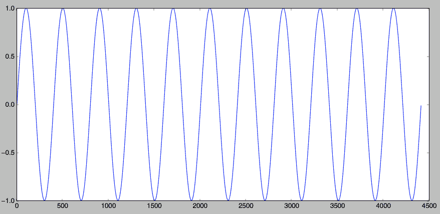
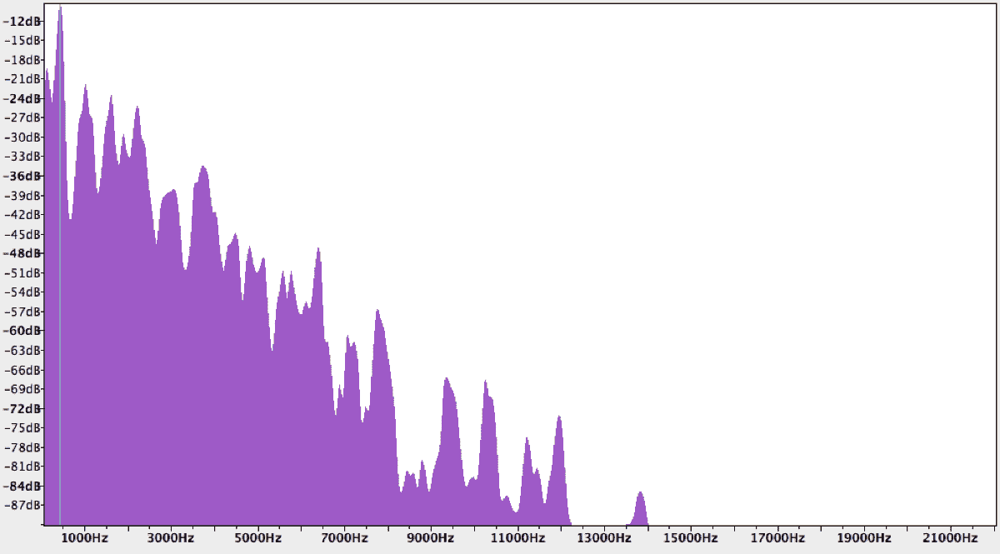
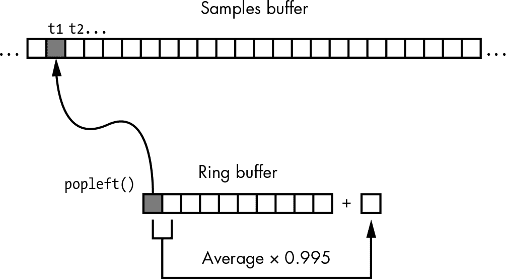
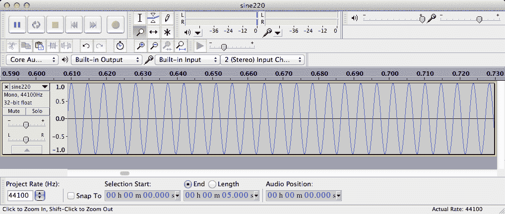
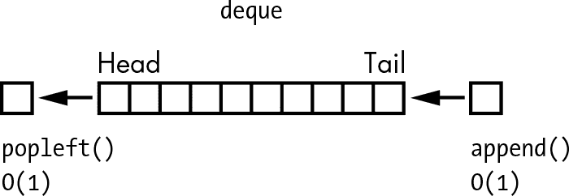
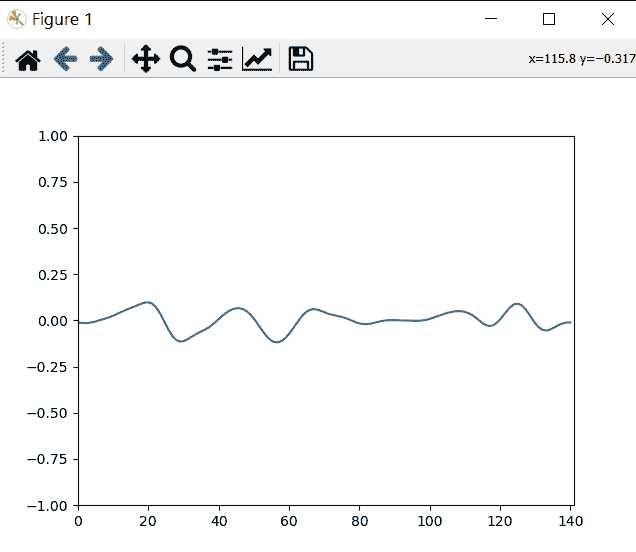

# 4

# 卡普鲁斯-斯特朗的音乐泛音

任何音乐声音的主要特征之一是其音高，或*频率*。这是声音每秒的振动次数，单位是赫兹（Hz）。例如，原声吉他的第四根弦会产生一个频率为 146.83 Hz 的 D 音符。你可以通过在计算机上创建一个频率为 146.83 Hz 的正弦波来近似这个声音，如图 4-1 所示。

不幸的是，如果你在计算机上播放这个正弦波，它不会听起来像吉他。它也不会像钢琴或任何其他真实世界的乐器那样发声。为什么计算机播放相同音符时听起来与乐器的声音差异如此之大？

图 4-1：146.83 Hz 的正弦波

当你弹奏吉他弦时，乐器会产生不同强度的频率混合。声音在第一次拨弦时最为强烈，之后强度逐渐减弱。在拨动吉他 D 弦的情况下，你听到的主频率被称为*基频*，为 146.83 Hz，但声音中也包含了一些该频率的倍频，称为*泛音*。实际上，任何乐器上发出的音符声音都由基频和泛音组成，正是这些不同频率在不同强度下的组合，使得吉他听起来像吉他，钢琴听起来像钢琴，等等。相比之下，由计算机生成的纯正弦波仅包含基频，没有泛音。

你可以在*频谱图*中看到泛音的证据，图图 4-2 展示的是吉他 D 弦的频谱图。频谱图显示了在特定时间点上声音中所有存在的频率及其强度。请注意，图中频谱图有许多不同的峰值，告诉我们在拨动吉他 D 弦时，声音中有许多不同的频率。频谱图最左边的最高峰代表了基频。其他的峰代表泛音，虽然强度较小，但它们仍然对声音的质量起到了作用。

图 4-2：吉他弹奏 D3 音符的频谱图

如你所见，要在计算机上模拟拨弦乐器的声音，你需要能够生成基频和泛音。诀窍就是使用卡普鲁斯-斯特朗算法。在这个项目中，你将使用卡普鲁斯-斯特朗算法生成五个类似吉他的音符（一个系列相关音符）。你将可视化生成这些音符的算法并将声音保存为 WAV 文件。你还将创建一种随机播放它们的方式，并学习如何做以下事情：

+   • 使用 Python 的`deque`类实现环形缓冲区。

+   • 使用`numpy`数组。

+   • 使用`pyaudio`播放 WAV 文件。

+   • 使用`matplotlib`绘制图表。

+   • 演奏五声音阶。

## 它是如何工作的

想象一根两端固定的弦，就像吉他上的弦。当你拨动这根弦时，它会震动一段时间，发出声音，然后恢复到静止位置。在弦震动的任何时刻，弦的不同部分将会与它的静止位置有不同的位移。这些位移也可以看作是弦震动所产生的声波的振幅。卡普鲁斯-斯特朗算法是一系列步骤，用于生成和更新这些位移或振幅值，以表示拨动弦上的波动。将这些值作为 WAV 文件播放，你就能得到一个非常逼真的拨弦声音模拟。

卡普鲁斯-斯特朗算法将位移值存储在*环形缓冲区*（也叫*循环缓冲区*）中，这是一个固定长度的缓冲区（实际上是一个数值数组），它会绕回自身。换句话说，当你到达缓冲区的末尾时，接下来的元素会是缓冲区中的第一个元素。（关于环形缓冲区的更多内容，请参见“使用 deque 实现环形缓冲区”，详见第 66 页。）

环形缓冲区的长度(*N*)与所需模拟音符的基频有关，关系式为*N* = *S*/*f*，其中*S*是采样率（稍后会讲解），*f*是频率。在模拟开始时，缓冲区会被填充为[−0.5, 0.5]范围内的随机值，你可以将这些值理解为表示弦在首次拨动时的随机位移。随着模拟的进行，数值会根据卡普鲁斯-斯特朗算法的步骤进行更新，接下来我们将概述这些步骤。

除了环形缓冲区，你还需要使用*采样缓冲区*来存储某一特定时间点的声音强度。这个缓冲区代表了最终的声音数据，并且是基于环形缓冲区中的数值构建的。采样缓冲区的长度和采样率决定了声音片段的长度。

### 模拟

在仿真的每个时间步骤中，环形缓冲区中的一个值会被存储到样本缓冲区中，然后环形缓冲区中的值会以一种反馈机制进行更新，如图 4-3 所示。一旦样本缓冲区已满，就将其内容写入 WAV 文件，以便模拟的音符可以作为音频播放。对于仿真的每个时间步骤，您将遵循以下步骤，这些步骤共同构成了卡普鲁斯-斯特朗算法：

1.  1\. 将环形缓冲区中的第一个值存储到样本缓冲区。

1.  2\. 计算环形缓冲区中前两个元素的平均值。

1.  3\. 将该平均值乘以一个衰减因子（在此例中为 0.995）。

1.  4\. 将该值附加到环形缓冲区的末尾。

1.  5\. 移除环形缓冲区中的第一个元素。

图 4-3：环形缓冲区与卡普鲁斯-斯特朗算法

该反馈机制旨在模拟波在振动弦上的传播。环形缓冲区中的数字表示弦上每个点的波能量。根据物理学原理，振动弦的基频与其长度成反比。由于我们希望生成特定频率的声音，因此选择与期望频率成反比的环形缓冲区长度（这就是前面提到的 *N* = *S*/*f* 公式）。算法第 2 步中的平均操作充当了一个*低通滤波器*，它会切除较高的频率，允许较低的频率通过，从而消除较高的谐波（即基频的较大倍数），因为我们主要关心的是基频。第 3 步中的衰减因子模拟了波沿弦来回传播时能量的损失。这对应于声音随时间的衰减。

在仿真步骤 1 中添加的样本缓冲区表示生成的声音随时间的振幅。通过在环形缓冲区的末尾存储衰减值（步骤 4）并从环形缓冲区中移除第一个项目（步骤 5），可以确保逐渐衰减的值不断传递到样本缓冲区，从而构建模拟的声音。

让我们来看一个卡普鲁斯-斯特朗算法实际应用的简单示例。表 4-1 表示两个连续时间步骤中的环形缓冲区。环形缓冲区中的每个值代表声音的振幅，这与拨动弦线时某个点相对于其静止位置的位移相同。缓冲区有五个元素，最初填充了一些数值。

表 4-1：卡普鲁斯-斯特朗算法中两个时间步骤的环形缓冲区

| 时间步骤 1 | 0.1 | −0.2 | 0.3 | 0.6 | −0.5 |
| --- | --- | --- | --- | --- | --- |
| 时间步骤 2 | −0.2 | 0.3 | 0.6 | −0.5 | −0.04975 |

当你从时间步长 1 进入时间步长 2 时，你按如下方式应用 Karplus-Strong 算法。第一行中的第一个值 0.1 被移除，时间步长 1 中的所有后续值按相同顺序添加到第二行中，这代表时间步长 2。时间步长 2 中的最后一个值是时间步长 1 中第一个和第二个值的衰减平均值，计算方式为 0.995 × ((0.1 + −0.2) ÷ 2) = −0.04975。

### WAV 文件格式

*波形音频文件格式 (WAV)* 用于存储音频数据。这个格式适用于小型音频项目，因为它简单且不需要你担心复杂的压缩技术。

在最简单的形式下，WAV 文件由一系列值组成，每个值表示在给定时间点存储声音的振幅。每个值都分配了固定数量的位，称为 *分辨率*。在这个项目中，你将使用 16 位分辨率。WAV 文件还有一个固定的 *采样率*，即每秒钟对音频进行的 *采样* 次数，或者说读取的次数。在这个项目中，你使用的是 44,100 Hz 的采样率，这是音频 CD 所使用的采样率。总之，当你生成一个模拟拨弦声音的 WAV 文件时，每秒钟的音频将包含 44,100 个 16 位的值。

对于这个项目，你将使用 Python 的 `wave` 模块，它包含了处理 WAV 文件的方法。为了了解它的工作方式，让我们使用 Python 生成一个 220 Hz 正弦波的五秒钟音频片段。首先，你可以使用这个公式表示一个正弦波：

*A* = sin(2π*ft*)

在这里，*A* 是波的振幅，*f* 是频率，*t* 是当前的时间索引。现在你将这个方程重新写为如下形式：

*A* = sin(2π*fi*/*R*)

在这个方程中，*i* 是样本的索引，*R* 是采样率。使用这两个方程，你可以为 200 Hz 的正弦波创建一个五秒钟的 WAV 文件，如下所示。（此代码可以在章节的 GitHub 仓库中的 *sine.py* 文件中找到。）

import numpy as np

import wave, math

sRate = 44100

nSamples = sRate * 5

❶ x = np.arange(nSamples)/float(sRate)

❷ vals = np.sin(2.0*math.pi*220.0*x)

❸ data = np.array(vals*32767, 'int16').tostring()

file = wave.open('sine220.wav', 'wb')

❹ file.setparams((1, 2, sRate, nSamples, 'NONE', 'uncompressed'))

❺ file.writeframes(data)

file.close()

你创建了一个从 `0` 到 `nSamples − 1` 的 `numpy` 数组，并将这些数字除以采样率，以得到每个音频片段样本的时间值，单位为秒 ❶。这个数组代表了先前讨论的正弦波方程中的 *i*/*R* 部分。接下来，你使用这个数组创建了第二个 `numpy` 数组，包含了正弦波的振幅值，同样遵循正弦波方程 ❷。`numpy` 数组是一种快速且方便的方式，可以将像 `sin()` 函数这样的函数应用于许多值。

计算得到的正弦波值在[-1, 1]范围内被缩放为 16 位值，并转换为字符串，以便写入 WAV 文件 ❸。然后你设置 WAV 文件的参数；在这种情况下，它是一个单通道（单声道）、2 字节（16 位）、未压缩的格式 ❹。最后，你将数据写入文件 ❺。图 4-4 显示了在 Audacity（一款免费的音频编辑软件）中生成的*sine220.wav*文件。如预期所示，你看到一个频率为 220 Hz 的正弦波，当你播放该文件时，你会听到一个 220 Hz 的音调，持续五秒钟。（请注意，你需要在 Audacity 中使用缩放工具，才能看到如图 4-4 所示的正弦波。）

图 4-4：220 Hz 的正弦波，已缩放

在你的项目中，一旦你用音频数据填充了样本缓冲区，你将按照图 4-4 中展示的相同模式将其写入 WAV 文件。

### 小调五声音阶

*音阶*是一个音符的系列，这些音符按升高或降低的音高（频率）排列。通常，一首音乐中的所有音符都是从某个特定的音阶中选出的。*音程*是两个音高之间的差异。*半音*是音阶的基本构建块，也是西方音乐中最小的音程。*全音*是半音的两倍长度。*大调音阶*是最常见的音阶之一，其间隔模式为*全音-全音-半音-全音-全音-全音-半音*。

我们将在这里简要介绍五声音阶，因为你将在该音阶中生成音符。本节将解释在最终程序中使用的频率数字的来源，这些频率数字将通过 Karplus-Strong 算法生成音符。*五声音阶*是一个由五个音符组成的音乐音阶。该音阶的变体是*小调五声音阶*，其间隔模式为*(全音+半音)-全音-全音-(全音+半音)-全音*。因此，C 小调五声音阶由 C、降 E、F、G 和降 B 五个音符组成。表 4-2 列出了你将使用 Karplus-Strong 算法生成的 C 小调五声音阶的五个音符的频率。（在这里，C4 表示钢琴第四八度的 C 音，或*中央 C*，根据约定。）

表 4-2：小调五声音阶中的音符

| 音符 | 频率（Hz） |
| --- | --- |
| C4 | 261.6 |
| 降 E | 311.1 |
| F | 349.2 |
| G | 392.0 |
| 降 B | 466.2 |

本项目的一个方面将是将随机的音符序列串联在一起以创建旋律。我们之所以专注于小调五声音阶，是因为该音阶的音符无论以何种顺序演奏都听起来和谐。因此，这个音阶特别适合生成随机旋律，而不像其他音阶（例如大调音阶）那样受限。

## 需求

在这个项目中，你将使用 Python 的`wave`模块来创建 WAV 格式的音频文件。为了实现 Karplus-Strong 算法，你将使用 Python `collections`模块中的`deque`类作为环形缓冲区，以及使用`numpy`数组作为样本缓冲区。你还将使用`matplotlib`来可视化模拟的吉他弦，并使用`pyaudio`模块来回放 WAV 文件。

## 代码

现在，让我们开发实现 Karplus-Strong 算法所需的各种代码块，并将它们组合成完整的程序。要查看完整的项目代码，请跳至“完整代码”，该部分位于第 74 页。你也可以从本书的 GitHub 仓库下载代码：[`github.com/mkvenkit/pp2e/tree/main/karplus`](https://github.com/mkvenkit/pp2e/tree/main/karplus)。

### 使用 deque 实现环形缓冲区

回想一下，Karplus-Strong 算法使用环形缓冲区来生成一个音符。你将使用`deque`容器（发音为“deck”）来实现环形缓冲区，它是 Python `collections`模块中的一个专用容器数据类型。你可以从`deque`的开头（头部）或结尾（尾部）插入和移除元素（参见图 4-5）。这个插入和移除过程是一个`O(1)`，即“常数时间”操作，这意味着无论`deque`容器的大小如何，所花费的时间都是相同的。

图 4-5：使用`deque`实现的环形缓冲区

以下代码展示了如何在 Python 中使用`deque`的示例：

>>> `from collections import deque`

❶ >>> `d = deque(range(10), maxlen=10)`

>>> `print(d)`

deque([0, 1, 2, 3, 4, 5, 6, 7, 8, 9], maxlen=10)

❷ >>> `d.append(10)`

>>> `print(d)`

deque([1, 2, 3, 4, 5, 6, 7, 8, 9, 10], maxlen=10)

你通过传入一个使用`range()`函数创建的列表来创建`deque`容器❶。你还指定了`deque`的最大长度`maxlen`为`10`。接下来，你将元素`10`追加到`deque`容器的末尾❷。当你打印出`deque`时，你会发现`10`已经被添加到`deque`的末尾，同时第一个元素`0`已经被自动移除，以保持`deque`容器的最大长度为 10 个元素。这个方案将允许你同时实现 Karplus-Strong 算法的步骤 4 和步骤 5——在环形缓冲区的末尾添加新值，同时移除第一个值。

### 实现 Karplus-Strong 算法

现在，你将在`generateNote()`函数中实现 Karplus-Strong 算法，使用`deque`容器实现环形缓冲区，使用`numpy`数组实现样本缓冲区。在同一个函数中，你还将使用`matplotlib`进行算法的可视化。绘图将展示拨弦时弦的振幅如何随时间变化，实质上展示了弦在振动过程中的运动。

你首先进行一些初始化设置：

# 初始化绘图

❶ fig, ax = plt.subplots(1)

❷ line, = ax.plot([], [])

def generateNote(freq):

"""使用 Karplus-Strong 算法生成音符"""

nSamples = 44100

sampleRate = 44100

❸ N = int(sampleRate/freq)

❹ 如果 gShowPlot:

# 设置坐标轴

ax.set_xlim([0, N])

ax.set_ylim([-1.0, 1.0])

line.set_xdata(np.arange(0, N))

# 初始化环形缓冲区

❺ buf = deque([random.random() - 0.5 for i in range(N)], maxlen=N)

# 初始化样本缓冲区

❻ samples = np.array([0]*nSamples, 'float32')

首先，你创建一个`matplotlib`图形 ❶ 和一个折线图 ❷，然后用数据填充这些图形。接着你开始定义`generateNote()`函数，函数接受生成音符的频率作为参数。你将声音片段的样本数和采样率都设置为 44,100，这意味着生成的片段将持续一秒钟。然后，你将采样率除以所需的频率，来设置 Karplus-Strong 环形缓冲区的长度`N` ❸。如果`gShowPlot`标志设置为`True` ❹，你将初始化图表的 x 和 y 范围，并使用`arange()`函数将 x 值初始化为`[0, ... N-1]`。

接下来，你初始化环形缓冲区为`deque`容器，并用范围为[−0.5, 0.5]的随机数填充，设置`deque`的最大长度为`N` ❺。你还初始化样本缓冲区为`numpy`浮点数组 ❻。你将数组的长度设置为声音片段将包含的样本数。

接下来是`generateNote()`函数的核心部分，在这里你实现 Karplus-Strong 算法的步骤并创建可视化效果：

for i in range(nSamples):

❶ samples[i] = buf[0]

❷ avg = 0.995*0.5*(buf[0] + buf[1])

❸ buf.append(avg)

# 标志设置的绘图

❹ 如果 gShowPlot:

如果 i % 1000 == 0:

line.set_ydata(buf)

fig.canvas.draw()

fig.canvas.flush_events()

# 将样本转换为 16 位字符串

# 最大值为 16 位的 32767

❺ samples = np.array(samples * 32767, 'int16')

❻ return samples.tobytes()

在这里，你遍历样本缓冲区中的每个元素，并执行 Karplus-Strong 算法的步骤。每次迭代时，你将环形缓冲区的第一个元素复制到样本缓冲区 ❶。然后，你通过平均环形缓冲区中的前两个元素并将结果乘以 0.995 来进行低通滤波和衰减 ❷。这个衰减后的值会被添加到环形缓冲区的末尾 ❸。由于`deque`表示的环形缓冲区有最大长度，`append()`操作也会移除缓冲区中的第一个元素。

`samples` 数组通过将每个值乘以 32,767 转换为 16 位格式 ❺（16 位有符号整数的取值范围仅为 −32,768 到 32,767，而 0.5 × 65,534 = 32,767）。然后，数组将被转换为字节表示，用于 `wave` 模块，你将使用它将数据保存到文件中 ❻。

当算法运行时，你将可视化环形缓冲区的演变 ❹。每当处理一千个采样时，你会更新 `matplotlib` 图形，以显示环形缓冲区中的数据值，这显示了数据随时间的变化。

### 写入 WAV 文件

一旦你拥有音频数据，可以使用 Python 的 `wave` 模块将其写入 WAV 文件。定义一个 `writeWAVE()` 函数来完成此操作：

def writeWAVE(fname, data):

# 打开文件

❶ file = wave.open(fname, 'wb')

# WAV 文件参数

nChannels = 1

sampleWidth = 2

frameRate = 44100

nFrames = 44100

# 设置参数

❷ file.setparams((nChannels, sampleWidth, frameRate, nFrames,

'NONE', 'noncompressed'))

❸ file.writeframes(data)

file.close()

你创建一个 WAV 文件 ❶ 并使用单通道、16 位、无压缩格式设置其参数 ❷。然后，你将数据写入文件 ❸。

### 使用 pyaudio 播放 WAV 文件

现在你将使用 Python 的 `pyaudio` 模块来播放由算法生成的 WAV 文件。`pyaudio` 是一个高性能、低级别的库，可以让你访问计算机上的声音设备。为了方便起见，你将代码封装在一个 `NotePlayer` 类中，如下所示：

class NotePlayer:

# 构造函数

def __init__(self):

# 初始化 pyaudio

❶ self.pa = pyaudio.PyAudio()

# 打开流

❷ self.stream = self.pa.open(

format=pyaudio.paInt16,

channels=1,

rate=44100,

output=True)

# 音符字典

❸ self.notes = []

在 `NotePlayer` 类的构造函数中，你首先创建了一个 `PyAudio` 对象，用来播放 WAV 文件 ❶。然后，你打开一个 16 位单通道的 `PyAudio` 输出流 ❷。你还创建了一个空列表，稍后会用五个五声音阶音符 WAV 文件的文件名填充 ❸。

在 Python 中，当对象的所有引用都被删除时，系统会通过一个叫做 *垃圾回收* 的过程销毁该对象。此时，如果定义了 `__del__()` 方法，它会作为 *析构函数* 被调用。以下是 `NotePlayer` 类的析构函数：

def __del__(self):

# 析构函数

self.stream.stop_stream()

self.stream.close()

self.pa.terminate()

这个方法确保当 `NotePlayer` 对象被销毁时，`PyAudio` 流会被清理。如果没有为类提供 `__del__()` 方法，在反复创建和销毁对象时可能会出现问题，因为某些系统级资源（如本例中的 `pyaudio`）可能没有被正确清理。

`NotePlayer` 类的其余方法用于构建一个可能音符的列表并播放它们。首先是 `add()` 方法，用于将一个 WAV 文件名添加到类中：

def add(self, fileName):

self.notes.append(fileName)

该方法接收一个与生成的 WAV 文件之一对应的文件名作为参数，并将其添加到你在类构造函数中初始化的 `notes` 列表中。类在需要播放 WAV 文件时会使用此列表。

接下来，我们来看一下 `play()` 方法，它用于播放音符：

def play(self, fileName):

try:

print("正在播放 " + fileName)

# 打开 WAV 文件

❶ wf = wave.open(fileName, 'rb')

# 读取一块数据

❷ data = wf.readframes(CHUNK)

# 读取剩余数据

while data != b'':

❸ self.stream.write(data)

❹ data = wf.readframes(CHUNK)

# 清理

❺ wf.close()

except BaseException as err:

❻ print(f"异常！{err=}, {type(err)=}.\n 退出程序。")

exit(0)

在这里，你使用 Python 的`wave`模块打开所需的 WAV 文件 ❶。然后，你从文件中读取 `CHUNK` 帧（在此情况下全局定义为 1,024）到 `data` 中 ❷。接下来，在一个 `while` 循环中，你将 `data` 的内容写入 `PyAudio` 输出流 ❸，并从 WAV 文件中读取下一块数据 ❹。写入输出流的效果是通过计算机的默认音频设备（通常是扬声器）播放音频。你以块的方式读取数据，以保持输出端的采样率。如果块太大，并且在读取和写入之间的时间过长，音频将无法正确播放。

`while` 循环会一直持续，直到读取完所有数据，即直到 `data` 为空为止。此时，你关闭 WAV 文件对象 ❺。你处理在播放过程中可能发生的任何异常（例如用户按下 CTRL-C），通过打印错误 ❻ 并退出程序。

最后，`NotePlayer` 类的 `playRandom()` 方法从你生成的五个音符中随机挑选一个并播放：

def playRandom(self):

"""播放一个随机音符"""

index = random.randint(0, len(self.notes)-1)

note = self.notes[index]

self.play(note)

该方法从 `notes` 列表中选择一个随机的 WAV 文件名，并将该文件名传递给 `play()` 方法进行播放。

### 创建音符并解析参数

现在，让我们来看一下程序的 `main()` 函数，它创建音符并处理各种命令行选项来播放音符：

def main():

--`snip`--

parser = argparse.ArgumentParser(description="生成声音并

Karplus-Strong 算法")

# 添加参数

parser.add_argument('--display', action='store_true', required=False)

parser.add_argument('--play', action='store_true', required=False)

args = parser.parse_args()

# 如果标志设置为真，则显示图形

❶ if args.display:

gShowPlot = True

plt.show(block=False)

# 创建音符播放器

❷ nplayer = NotePlayer()

print('正在创建音符...')

for name, freq in list(pmNotes.items()):

fileName = name + '.wav'

❸ if not os.path.exists(fileName) or args.display:

data = generateNote(freq)

print('正在创建 ' + fileName + '...')

writeWAVE(fileName, data)

else:

print('文件名已创建，跳过...')

# 将音符添加到播放器

❹ nplayer.add(name + '.wav')

# 如果设置了显示标志，则播放音符

if args.display:

❺ nplayer.play(name + '.wav')

time.sleep(0.5)

# 播放一段随机曲调

if args.play:

while True:

try:

❻ nplayer.playRandom()

# rest - 1 到 8 拍

❼ rest = np.random.choice([1, 2, 4, 8], 1,

p=[0.15, 0.7, 0.1, 0.05])

time.sleep(0.25*rest[0])

except KeyboardInterrupt:

exit()

首先，你使用`argparse`为程序设置了一些命令行选项，如前面的项目中所讨论的。`--display`选项将依次播放五个音符，并使用`matplotlib`可视化每个音符的波形。`--play`选项使用这五个音符生成一个随机旋律。

如果使用了`--display`命令行选项❶，你设置了一个`matplotlib`绘图来显示卡普鲁斯-斯特朗算法过程中波形的变化。`plt.show(block=False)`调用确保`matplotlib`显示方法不会阻塞。这样，当你调用此函数时，它会立即返回并继续执行下一条语句。这是你所需要的行为，因为你正在手动更新每一帧的图表。

接下来，你创建了`NotePlayer`类的一个实例❷。然后你生成了 C 小调五声音阶中五个音符的 WAV 文件。这些音符的频率在全局字典`pmNotes`中定义，如下所示：

pmNotes = {'C4': 262, 'Eb': 311, 'F': 349, 'G': 391, 'Bb': 466}

为了生成音符，你遍历字典，首先通过字典键加上*.wav*扩展名来构造音符的文件名——例如，*C4.wav*。你使用`os.path.exists()`方法来检查某个音符的 WAV 文件是否已经创建❸。如果是这样，你跳过该音符的计算。（如果你多次运行该程序，这是一个方便的优化。）否则，你使用之前定义的`generateNote()`和`writeWAVE()`函数来生成该音符。一旦音符被计算并且 WAV 文件被创建，你将该音符的文件名添加到`NotePlayer`对象的音符列表中❹，然后如果使用了`--display`命令行选项，你将播放该音符❺。

如果使用了`--play`选项，`NotePlayer`中的`playRandom()`方法将反复从五个音符中随机播放一个音符❻。为了使音符序列听起来稍微像音乐，你需要在音符之间添加休止符，因此你使用`numpy`中的`random.choice()`方法来选择一个随机的休止时间❼。该方法还允许你选择休止符的概率，你可以设置一个二拍休止符为最可能的，八拍休止符为最不可能的。尝试更改这些值，创造你自己的随机音乐风格！

## 运行拨弦模拟

要运行此项目的代码，请在命令行中输入以下内容：

$ `python ks.py --display`

如图 4-6 所示，`matplotlib`图表显示了 Karplus-Strong 算法如何将初始随机位移转换为所需频率的波形。

图 4-6：拨弦模拟的示例运行

现在尝试使用以下命令播放一个随机音符序列：

$ `python ks.py --play`

这应该使用生成的五声音阶 WAV 文件播放一个随机音符序列。

## 总结

在这个项目中，你使用 Karplus-Strong 算法模拟了拨弦声音并播放了从生成的 WAV 文件中得到的音符。你学会了如何使用`deque`容器作为环形缓冲区来实现 Karplus-Strong 算法。你还学习了 WAV 文件格式，以及如何使用`pyaudio`播放 WAV 文件，如何使用`matplotlib`可视化振动弦。你甚至还学会了五声音阶！

## 实验！

这里是一些实验的想法：

1.  1. 我已经提到，Karplus-Strong 算法通过生成泛音和音符的基频来创造逼真的拨弦声音。但是你如何知道它在工作？通过创建你 WAV 文件的谱图，如图 4-2 所示。你可以使用免费的程序 Audacity 来做到这一点。在 Audacity 中打开一个 WAV 文件，并选择**Analyze‣Plot** **Spectrum**。你应该能看到声音包含许多频率。

1.  2. 使用你在本章中学到的技术，创建一个方法，模拟两根不同频率的弦一起振动的声音。记住，Karplus-Strong 算法生成一个充满声音幅度值的环形缓冲区。你可以通过将两个声音的幅度加在一起，来合成这两种声音。

1.  3. 如前面的实验所述，模拟两根弦一起振动的声音，但在第一根和第二根弦的拨动之间添加时间延迟。

1.  4. 编写一个方法，从文本文件读取音乐并生成音符。然后使用这些音符播放音乐。你可以使用一种格式，其中音符名称后跟整数的休止时间间隔，例如：C4 1 F4 2 G4 1 . . .。

## 完整代码

这是本项目的完整代码：

"""

ks.py

使用 Karplus-Strong 算法生成音乐音符

在五声音阶中。

作者：Mahesh Venkitachalam

"""

导入 sys 和 os 模块：`import sys, os`

导入时间和随机模块：`import time, random`

导入 wave 和 argparse 模块：`import wave, argparse`

导入 numpy：`import numpy as np`

从 collections 模块导入 deque：`from collections import deque`

导入 matplotlib：`import matplotlib`

# 修复 macOS 上图形显示的问题

matplotlib.use('TkAgg')

来自 matplotlib 的 pyplot 模块：`import pyplot as plt`

导入 pyaudio：`import pyaudio`

# 显示算法运行时的图形？

gShowPlot = False

# 五声音阶的音符

# 钢琴音符 C4-E(b)-F-G-B(b)-C5

pmNotes = {'C4': 262, 'Eb': 311, 'F': 349, 'G':391, 'Bb':466}

CHUNK = 1024

# 初始化绘图

fig, ax = plt.subplots(1)

line, = ax.plot([], [])

# 写出 WAV 文件

def writeWAVE(fname, data):

"""将数据写入 WAV 文件"""

# 打开文件

file = wave.open(fname, 'wb')

# WAV 文件参数

nChannels = 1

sampleWidth = 2

frameRate = 44100

nFrames = 44100

# 设置参数

file.setparams((nChannels, sampleWidth, frameRate, nFrames,

'NONE', 'noncompressed'))

file.writeframes(data)

file.close()

def generateNote(freq):

"""使用 Karplus-Strong 算法生成音符"""

nSamples = 44100

sampleRate = 44100

N = int(sampleRate/freq)

if gShowPlot:

# 设置坐标轴

ax.set_xlim([0, N])

ax.set_ylim([-1.0, 1.0])

line.set_xdata(np.arange(0, N))

# 初始化环形缓冲区

buf = deque([random.random() - 0.5 for i in range(N)], maxlen=N)

# 初始化采样缓冲区

samples = np.array([0]*nSamples, 'float32')

for i in range(nSamples):

samples[i] = buf[0]

avg = 0.995*0.5*(buf[0] + buf[1])

buf.append(avg)

# 如果设置了标志，则展示图形

if gShowPlot:

if i % 1000 == 0:

line.set_ydata(buf)

fig.canvas.draw()

fig.canvas.flush_events()

# 将样本转为 16 位字符串

# 最大值为 32767，适用于 16 位

samples = np.array(samples * 32767, 'int16')

return samples.tobytes()

# 播放 WAV 文件

class NotePlayer:

# 构造函数

def __init__(self):

# 初始化 pyaudio

self.pa = pyaudio.PyAudio()

# 打开流

self.stream = self.pa.open(

format=pyaudio.paInt16,

channels=1,

rate=44100,

output=True)

# 音符字典

self.notes = []

def __del__(self):

# 析构函数

self.stream.stop_stream()

self.stream.close()

self.pa.terminate()

# 添加一个音符

def add(self, fileName):

self.notes.append(fileName)

# 播放音符

def play(self, fileName):

try:

print("正在播放 " + fileName)

# 打开 WAV 文件

wf = wave.open(fileName, 'rb')

# 读取一段

data = wf.readframes(CHUNK)

# 读取剩余部分

while data != b'':

self.stream.write(data)

data = wf.readframes(CHUNK)

# 清理

wf.close()

except BaseException as err:

print(f"异常！{err=}, {type(err)=}。\n 退出。")

exit(0)

def playRandom(self):

"""播放一个随机音符"""

index = random.randint(0, len(self.notes)-1)

note = self.notes[index]

self.play(note)

# main() function

def main():

# 声明全局变量

global gShowPlot

parser = argparse.ArgumentParser(description="使用声音生成的

Karplus-Strong 算法。")

# 添加参数

parser.add_argument('--display', action='store_true', required=False)

parser.add_argument('--play', action='store_true', required=False)

args = parser.parse_args()

# 如果设置了显示标志，展示图形

if args.display:

gShowPlot = True

# plt.ion()

plt.show(block=False)

# 创建音符播放器

nplayer = NotePlayer()

print('正在创建笔记...')

for name, freq in list(pmNotes.items()):

fileName = name + '.wav'

if not os.path.exists(fileName) or args.display:

data = generateNote(freq)

print('正在创建 ' + fileName + '...')

writeWAVE(fileName, data)

else:

print('fileName 已经创建，跳过...')

# 添加音符到播放器

nplayer.add(name + '.wav')

# 如果设置了显示标志，则播放音符

if args.display:

nplayer.play(name + '.wav')

time.sleep(0.5)

# 播放一首随机曲调

if args.play:

while True:

try:

nplayer.playRandom()

# rest - 1 到 8 拍

rest = np.random.choice([1, 2, 4, 8], 1,

p=[0.15, 0.7, 0.1, 0.05])

time.sleep(0.25*rest[0])

except KeyboardInterrupt:

exit()

# call main

if __name__ == '__main__':

main()
