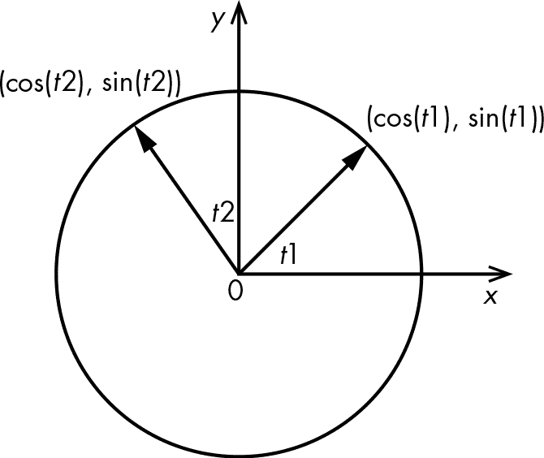
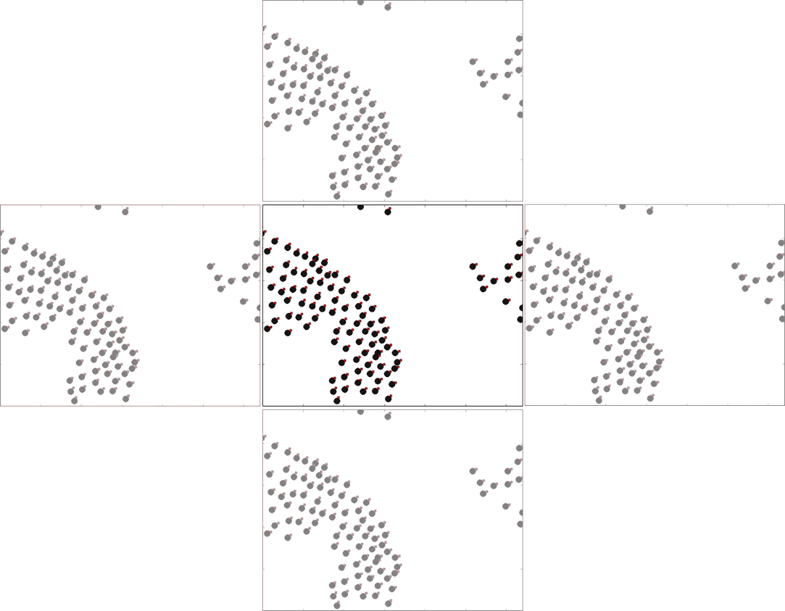
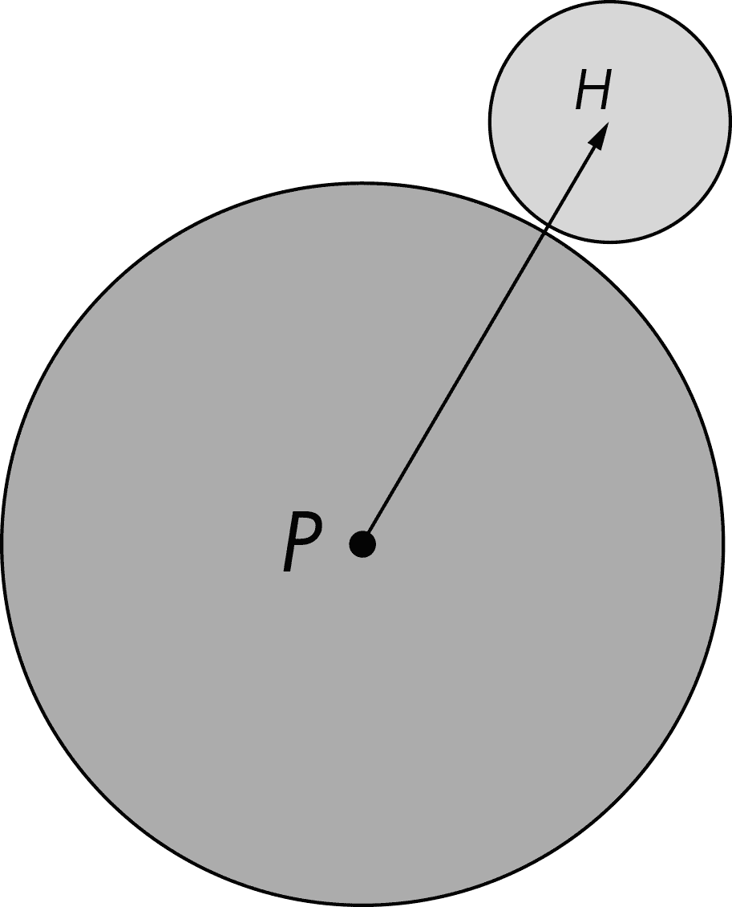
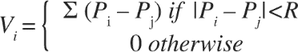
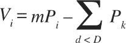
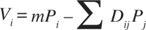
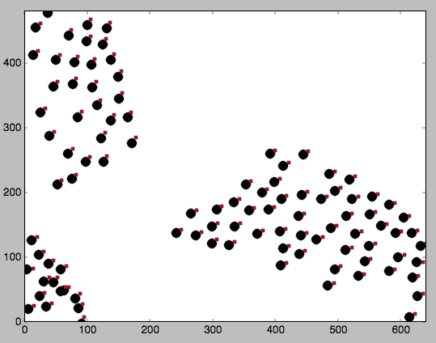

# 5

# 鸟群模拟

仔细观察一群鸟或一群鱼，你会注意到，尽管这个群体由个体构成，但整个群体似乎有着自己独特的生命力。鸟群中的鸟在移动时相互对齐，穿越和绕过障碍物。当受到惊扰时，它们会打破队形，但很快会重新聚集，仿佛被某种更大的力量所控制。

1986 年，Craig Reynolds 创建了一个模拟鸟群行为的现实感十足的模拟系统，称为 *Boids 模型*。Boids 模型（以典型的纽约口音发音的 *birds* 来命名）一个显著的特点是，尽管只有三个简单的规则来控制鸟群成员之间的相互作用，但该模型却能产生极为真实的群体行为。Boids 模型被广泛研究，甚至曾被用于动画生成计算机生成的鸟群，比如电影《蝙蝠侠归来》（1992）中的行进企鹅。

在本项目中，你将使用 Reynolds 的三条规则，创建一个模拟 *N* 只鸟的 Boids 群体行为的模拟，并绘制它们随时间变化的位置和移动方向。你还将提供一个方法来将鸟加入群体，以及一个散点效果，用于研究局部干扰对鸟群的影响。Boids 被称为 *N* 体模拟，因为它模拟了一个动态系统，其中 *N* 个粒子相互施加力。

## 它是如何工作的

Boids 模拟的三条核心规则如下：

分离 让 boids 之间保持最小距离。

对齐 让每只小鸟朝着本地群体的平均移动方向前进。

团结 让每只小鸟朝向其本地群体中心移动。

Boids 模拟还可以添加其他规则，例如避免障碍物或在群体受到干扰时分散鸟群，正如你将在接下来的章节中学习的那样。为了创建 Boids 动画，你需要在每一个时间步长中执行以下操作：

1.  1\. 对所有 boids 执行以下操作：

    1.  a. 应用三个核心规则。

    1.  b. 应用任何附加规则。

    1.  c. 应用所有边界条件。

1.  2\. 更新群体中每个小鸟的位置和速度。

1.  3\. 绘制新的位置和速度。

正如你将看到的，这些简单的步骤创建了一个具有不断变化、复杂行为的鸟群。

## 需求

以下是你将在本模拟中使用的 Python 模块：

+   • `numpy` 数组用于存储 boids 的位置和速度

+   • `matplotlib` 库用于动画化 boids

+   • `argparse` 用于处理命令行选项

+   • `scipy.spatial.distance` 模块，它提供了一些非常实用的方法来计算点之间的距离。

我选择使用 `matplotlib` 来绘制 boids，因为它简单且方便。为了尽可能快速地绘制大量 boids，你可能会使用类似 OpenGL 库的东西。我们将在本书的 第三部分中更详细地探讨图形学。

## 代码

你将通过创建一个名为`Boids`的类来封装一群 boids 的行为。首先，你将设置 boids 的初始位置和速度。接下来，设置仿真的边界条件，查看 boids 如何被绘制，并实现之前讨论过的 Boids 仿真规则。最后，你将通过允许用户添加 boids 并打散群体，向仿真中添加一些有趣的事件。要查看完整的项目代码，请跳到 “完整代码” 位于 第 96 页。你还可以从本书的 GitHub 仓库下载代码：[`github.com/mkvenkit/pp2e/blob/main/boids/boids.py`](https://github.com/mkvenkit/pp2e/blob/main/boids/boids.py)。

### 初始化仿真

Boids 仿真需要通过从 `numpy` 数组中提取信息，计算每个步骤中 boids 的位置和速度。在仿真开始时，你使用 `Boids` 类的 `__init__()` 方法来创建这些数组，并将所有 boids 初始化到大致位于屏幕中心的位置，其速度设定为随机方向。

import argparse

import math

import numpy as np

import matplotlib.pyplot as plt

import matplotlib.animation as animation

from scipy.spatial.distance import squareform, pdist

from numpy.linalg import norm

❶ width, height = 640, 480

class Boids:

"""表示 Boids 仿真的类"""

def __init__(self, N):

"""初始化 Boids 仿真"""

# 初始化位置与速度

❷ self.pos = [width/2.0, height/2.0] +

10*np.random.rand(2*N).reshape(N, 2)

# 归一化随机速度

❸ angles = 2*math.pi*np.random.rand(N)

❹ self.vel = np.array(list(zip(np.cos(angles), np.sin(angles))))

self.N = N

首先，你导入程序所需的模块，并设置模拟窗口的宽度和高度 ❶。然后，你开始声明 `Boids` 类。在类的 `__init__()` 方法中，你创建了一个名为 `pos` 的 `numpy` 数组，用于存储所有鸟群的 x 和 y 坐标 ❷。对于每一对坐标的初始值，你从窗口的中心 `[width/2.0, height/2.0]` 开始，并加上最多 10 个单位的随机偏移。代码 `np.random.rand(2*N)` 创建一个 2*N 个随机数的一维数组，范围为 [0, 1]，然后乘以 10 将范围调整为 [0, 10]。`reshape()` 调用将这个一维数组转换成形状为 (*N*, 2) 的二维数组，非常适合存储 *N* 对 x 和 y 坐标。这里还需要注意 `numpy` 的广播规则：表示窗口中心的 1×2 数组 `[width/2.0, height/2.0]` 被加到每个 *N*×2 数组的元素上，从而随机偏移每个鸟群的位置。

接下来，你为每个鸟群创建一个随机单位速度向量的数组（这些是大小为 1.0、指向随机方向的向量），使用以下方法：给定一个角度 *t*，一对数字 (cos(*t*), sin(*t*)) 位于半径为 1.0 的圆上，圆心在原点 (0, 0)。如果你从原点画一条线到圆上的一个点，那么它就成为一个单位向量，依赖于角度 *t*。因此，如果你随机选择 *t*，你就得到了一个随机的速度向量。图 5-1 说明了这个方案。

图 5-1：生成随机单位速度向量

回到代码，你通过首先生成一个包含 *N* 个随机角度的数组来启动此方法，角度范围为[0, 2π] ❸。然后，通过计算这些角度的余弦和正弦，你创建一个随机单位速度向量的数组 ❹。你使用 Python 内置的 `zip()` 方法将每个向量的坐标组合在一起。以下是 `zip()` 的一个简单示例。它将两个列表合并成一个包含元组的列表。因为直接调用 `zip` 只会创建一个迭代器，所以你需要使用 `list()` 来获取所有元素。

>>> list(`zip([0, 1, 2], [3, 4, 5]))`

[(0, 3), (1, 4), (2, 5)]

总结来说，你已经生成了两个数组，这将在整个模拟过程中发挥作用，分别是 `pos` 和 `vel`。第一个数组包含围绕屏幕中心 10 像素半径范围内的随机位置，第二个数组包含指向随机方向的单位速度向量。这意味着在模拟开始时，所有的鸟群都会围绕屏幕中心悬停，并且朝向随机的方向。

`__init__()` 方法继续声明一些常量值，这些值将有助于控制模拟过程：

# 最小接近距离

❶ self.minDist = 25.0

# 由“规则”计算出的最大速度大小

❷ self.maxRuleVel = 0.03

# 最终速度的最大大小

❸ self.maxVel = 2.0

在这里，你定义了两个 Boid 之间的最小接近距离 ❶。稍后你将使用这个值来应用分离规则。然后你定义了`maxRuleVel`，它限制每次应用模拟规则时 Boid 速度的变化幅度 ❷。你还定义了`maxVel`，它设置了 Boid 速度的总限制 ❸。

### 设置边界条件

鸟儿飞翔在无边的天空，但 Boid 必须在有限的空间中游戏。为了创造这个空间，你需要设置边界条件，就像你在第三章中的生命游戏模拟中使用环形边界条件一样。在这种情况下，你将应用*瓷砖式边界条件*（实际上是你在第三章中使用的边界条件的连续空间版本）。

把 Boid 模拟想象成在瓷砖空间中进行：当一个 Boid 从一个瓷砖移出时，它会从对面方向进入一个相同的瓷砖。环形和瓷砖式边界条件的主要区别在于，这个 Boid 模拟不会发生在离散的网格上；相反，鸟儿在一个连续的区域上移动。图 5-2 展示了这些瓷砖式边界条件的样子。

图 5-2: 瓷砖式边界条件

看看中间的瓷砖。飞出右边的鸟进入了右边的瓷砖，但边界条件确保它们实际上从左边的瓷砖返回到中心瓷砖。你也可以在顶部和底部的瓷砖看到同样的情况。

你在`Boids`类中实现了瓷砖式边界条件的方法，用于 Boids 模拟：

def applyBC(self):

"""应用边界条件"""

deltaR = 2.0

for coord in self.pos:

❶ if coord[0] > width + deltaR:

coord[0] = - deltaR

if coord[0] < - deltaR:

coord[0] = width + deltaR

if coord[1] > height + deltaR:

coord[1] = - deltaR

if coord[1] < - deltaR:

coord[1] = height + deltaR

该方法将瓷砖式边界条件应用于`pos`数组中每组 Boid 坐标。例如，如果 x 坐标大于窗口的宽度 ❶，你将其设置回窗口的左边缘。该行中的`deltaR`提供了一个小的缓冲区，使得 Boid 可以在开始从相反方向返回之前稍微移出窗口，从而产生更好的视觉效果。你在窗口的左边、顶部和底部边缘也执行类似的检查。

### 绘制 Boid

要构建动画，你需要知道每个 Boid 的位置和速度，并且在每个时间步长上都能够指示出位置和运动方向。

#### 绘制 Boid 的身体和头部

为了使飞鸟动画生动起来，你使用 `matplotlib` 和一个小技巧来绘制飞鸟的位置和速度。将每个飞鸟绘制为两个圆圈，如图 5-3 所示。较大的圆圈代表身体，较小的圆圈代表头部。点 *P* 标记身体的中心。对于我们的目的，你可以认为 *P* 是飞鸟的位置，并且你将使用之前讨论的 `pos` 数组中的坐标来设置它。点 *H* 是头部的中心。你根据公式 *H* = *P* + *k* × *V* 计算 *H* 的位置，其中 *V* 是飞鸟的速度，*k* 是表示从身体中心到头部中心的距离的常数。这样，飞鸟的头部将在任何时刻与它的运动方向对齐，这比单纯绘制身体能更清楚地传达飞鸟的运动方向。

图 5-3：表示一个飞鸟

在以下来自程序 `main()` 函数的代码片段中，你使用 `matplotlib` 将飞鸟的身体和头部绘制为圆形标记：

fig = plt.figure()

ax = plt.axes(xlim=(0, width), ylim=(0, height))

❶ pts, = ax.plot([], [], markersize=10, c='k', marker='o', ls='None')

❷ head, = ax.plot([], [], markersize=4, c='r', marker='o', ls='None')

❸ anim = animation.FuncAnimation(fig, tick, fargs=(pts[0], head, boids),

interval=50)

你设置了飞鸟身体（`pts`）❶ 和头部（`head`）❷ 的标记大小和形状。`'k'` 和 `'r'` 字符串分别指定黑色和红色，`'o'` 生成圆形标记。`ax.plot()` 方法返回一个 `matplotlib.lines.Line2D` 对象的列表。这些行中的 `,` 语法获取该列表中的第一个也是唯一一个元素。

接下来，你初始化一个 `matplotlib animation.FuncAnimation()` 对象❸，它设置了一个回调函数 `tick()`，每帧动画都会调用该函数（我们稍后会详细讲解这个函数）。`fargs` 参数让你指定回调函数的参数，你还可以设置该函数调用的时间间隔（此例为 50 毫秒）。现在你已经知道了如何绘制身体和头部，接下来我们来看如何更新它们的位置。

#### 更新飞鸟的位置

动画开始后，你需要更新飞鸟的身体位置和头部位置，头部位置告诉你飞鸟的运动方向。你可以使用以下代码实现：

vec = self.pos + 10*self.vel/self.maxVel

head.set_data(vec.reshape(2*self.N)[::2], vec.reshape(2*self.N)[1::2])

首先，你通过应用前面讨论的*H* = *P* + *k* × *V* 公式来计算头部的位置。你使用一个* k *值为 10 个单位，方向与速度（`vel`）相同。然后，你用新的头部位置更新（`reshape`）`matplotlib` 坐标轴（`set_data`）。`[::2]` 选取速度列表中的偶数索引元素（x 轴值），而 `[1::2]` 选取奇数索引元素（y 轴值）。

### 应用 Boids 规则

在这一部分，我们将讨论如何实现 Boids 仿真中的三条规则——分离、对齐和聚集——以在每个时间步重新计算 Boid 的速度。我们将首先专注于分离规则。目标是为每个 Boid 生成一个新的速度向量，将它从附近的同伴推开，这些同伴定义为所有处于某个半径 *R* 内的 Boid。给定两个 Boid *i* 和 *j*，它们的位置分别是 *P*[i] 和 *P*[j]，*P*[i] − *P*[j] 将为 Boid *i* 生成一个新的速度向量，使其远离 Boid *j*。我们称之为 *位移向量*。为了计算 Boid *i* 的新速度向量 *V*[i]，它将平均地将其推离所有附近的同伴，只需将 Boid *i* 和半径 *R* 内的每个 Boid 之间的位移向量相加即可。换句话说，*V*[i] = (*P*[i] − *P*[1]) + (*P*[i] − *P*[2]) + . . . (*P*[i] − *P*[N])，前提是 Boid *i* 和 Boid *j* 之间的距离小于 *R*。你可以更正式地写作：

注意，实现这个规则——实际上，其他 Boids 规则的实现也是——涉及计算每个 Boid 与其他所有 Boid 之间的距离，以确定哪些 Boid 是局部的同伴。用传统的 Python 方法，通常会使用一对嵌套循环来遍历 Boids。然而，正如你将看到的，`numpy` 数组提供了更高效的方法，可以避免使用循环。我们将实现这两种方法并比较结果，然后将我们学到的应用到实际的仿真代码中。

#### 使用嵌套循环

首先，让我们定义一个函数`test1()`，它通过使用循环直接实现分离规则：

def test1(pos, radius):

# 填充输出为零

vel = np.zeros(2*N).reshape(N, 2)

# 针对每个位置

❶ for (i1, p1) in enumerate(pos):

# 速度贡献

val = np.array([0.0, 0.0])

# 针对其他位置

❷ for (i2, p2) in enumerate(pos):

if i1 != i2:

# 计算 p1 之间的距离

dist = math.sqrt((p2[0]-p1[0])*(p2[0]-p1[0]) +

(p2[1]-p1[1])*(p2[1]-p1[1]))

# 应用阈值

❸ if dist < radius:

❹ val += (p2 - p1)

# 设置速度

vel[i1] = val

# 返回计算的速度

return vel

这段代码使用了一对嵌套的循环。外循环❶遍历`pos`数组中的每个 boid。内循环❷计算当前 boid 与数组中每个其他 boid 之间的距离。如果距离小于作为函数`radius`参数定义的阈值❸，你就像之前讨论的那样计算位移向量，并将结果添加到`val` ❹。在每次内循环结束时，`val`保存了一个新的速度，它将推动当前 boid 远离邻居。你将这个速度存储回`vel`数组中。

#### 使用 numpy 方法

现在让我们定义一个函数`test2()`，它以“`numpy`方式”做同样的事情，避免使用循环，并利用高度优化的`numpy`方法。你还将使用`scipy.spatial.distance`模块中的方法来高效地计算点之间的距离：

def test2(pos, radius):

# 获取距离矩阵

❶ distMatrix = squareform(pdist(pos))

# 应用阈值

❷ D = distMatrix < radius

# 计算速度

❸ vel = pos*D.sum(axis=1).reshape(N, 1) - D.dot(pos)

return vel

你使用了`squareform()`和`pdist()`方法（在`scipy`库中定义）来计算`pos`数组中每一对点之间的距离❶。对于一个*N*个点的数组，`squareform()`会给你一个*N*×*N*的矩阵，其中任意给定的条目*M*[ij]表示点*P*[i]和*P*[j]之间的距离。让我们通过一个快速示例来看看这种情况。在这段代码中，你对一个包含三个点的数组调用这些方法：

>>> `import numpy as np`

>>> `from scipy.spatial.distance import squareform, pdist`

>>> `x = np.array([[0.0, 0.0], [1.0, 1.0], [2.0, 2.0]])`

>>> `squareform(pdist(x))`

array([[0.        , 1.41421356, 2.82842712],

[1.41421356, 0.        , 1.41421356],

[2.82842712, 1.41421356, 0.        ]])

由于你提供了一个包含三个点的数组，结果是一个 3×3 的距离计算矩阵。例如，第一行中的值告诉你第一个点（`[0.0, 0.0]`）与数组中每个点之间的距离。数组中的对角线上的零值对应于每个点与自身的距离。

回到`test2()`函数，你接下来根据距离是否小于指定的`radius` ❷来过滤矩阵。使用相同的三个点的示例数组，你将得到以下结果：

>>> `squareform(``pdist(x)) < 1.4`

array([[ True, False, False],

[False,  True, False],

[False, False,  True]])

`<` 比较生成了一个布尔矩阵，`True/False`值对应于原始的距离矩阵——如果距离小于给定的阈值（在这个示例中是 1.4），则为`True`。

回到`test2()`，你使用了之前讨论的*V*[i]方程的修改版本，并广播到整个`pos`数组❸。这个方程可以重写为：

这里，右侧的第二个求和项只包括满足距离标准的*P*点。求和项中的元素数量是*m*。这个方程可以再次写作：

其中 *D*[ij] 是你生成的布尔矩阵的第 *i* 行 ❷，*m* 是该行中 `True` 值的数量，而 *P*[j] 是所有位于当前鸟群指定半径内的 *P* 点。

`D.sum` 方法 ❸ 按列加总布尔矩阵中的 `True` 值，得到方程中的 *m*。 reshape 操作是必需的，因为求和的结果是一个包含 *N* 个值的单维数组（形状为 (*N*, )），而你希望它具有形状 (*N*, 1)，以便与位置数组相乘。`D.dot(pos)` 这一行 ❸ 是将布尔矩阵与鸟群位置数组进行点积（乘法），这对应于方程中的 *D*[ij]*P*[j] 部分。

#### 比较方法

比较这两种方法，`test2()` 比 `test1()` 更简洁，但它的真正优势在于速度。让我们使用 Python 的 `timeit` 模块来评估这两个函数的性能。首先，将 `test1()` 和 `test2()` 函数的代码输入到一个名为 *test.py* 的文件中，如下所示：

import math

import numpy as np

from scipy.spatial.distance import squareform, pdist, cdist

N = 100

width, height = 640, 480

pos = np.array(list(zip(width*np.random.rand(N), height*np.random.rand(N))))

def test1(pos, radius):

--`snip`--

def test2(post, radius):

--`snip`--

现在，在 Python 解释器会话中使用 `timeit` 模块比较这两个函数的性能：

>>> `from` `timeit import timeit`

>>> `timeit('test1(pos, 100)', 'from test import test1, N, pos, width, height', number=100)`

7.880876064300537

>>> `timeit('test2(pos, 100)', 'from test import test2, N, pos, width, height', number=100)`

0.036969900131225586

在我的计算机上，使用不带循环的 `numpy` 代码运行速度比使用显式循环的代码快大约 200 倍！但是，为什么呢？难道它们不做差不多相同的事情吗？

作为一种解释性语言，Python 本质上比像 C 这样的编译语言要慢。`numpy` 库通过提供高度优化的对数据数组进行操作的方法，将 Python 的便利性与几乎等同于 C 的性能结合在一起。通常，你会发现 `numpy` 最适合将算法重构为一次操作整个数组的步骤，而不是逐个元素循环进行计算。

#### 编写最终方法

现在你已经比较了这两种方法，你可以利用所学知识编写最终版本的方法，该方法应用模拟的所有三条规则，并返回所有鸟群的更新速度。`applyRules()` 方法是 `Boids` 类的一部分，使用了之前讨论的优化 `numpy` 技术。

def applyRules(self):

# 获取成对的距离

❶ self.distMatrix = squareform(pdist(self.pos))

# 应用规则 #1：分离

D = self.distMatrix < self.minDist

❷ vel = self.pos*D.sum(axis=1).reshape(self.N, 1) - D.dot(self.pos)

❸ self.limit(vel, self.maxRuleVel)

# 对齐的距离阈值（与分离不同）

❹ D = self.distMatrix < 50.0

# 应用规则 #2：对齐

❺ vel2 = D.dot(self.vel)

self.limit(vel2, self.maxRuleVel)

❻ vel += vel2

# 应用规则 #3：凝聚

❼ vel3 = D.dot(self.pos) - self.pos

self.limit(vel3, self.maxRuleVel)

❽ vel += vel3

return vel

你使用`scipy`库中的`squareform()`和`pdist()`方法计算鸟群之间的成对距离矩阵，如前所述❶。当你使用`numpy`方法❷应用分离规则时，每个鸟群都会被推离距离`minDist`（25 像素）内的邻居。计算出的速度会被限制，或者说被约束在某个最大值内，使用的是`Boids`类中的`limit()`方法❸，我们稍后会讨论。如果没有这个限制，速度将在每个时间步长后增加，模拟就会失控。

接下来，你使用 50 像素的距离阈值生成一个新的布尔矩阵，而不是 25 像素❹。你将使用这个更广泛的邻近群体定义来应用对齐和凝聚规则。对齐规则的实现方式是每个鸟群（boid）都会受到其邻居的平均速度的影响，并与之对齐。你通过取`D`（布尔矩阵）和速度数组的点积❺来获得这个平均值。再一次，你限制计算出的速度，以防它们无限增长。（使用简洁的`numpy`语法使得所有这些计算变得简单且快速。）

最后，你通过将所有邻近鸟群的位置加在一起，然后减去当前鸟群的位置❼来应用凝聚规则。这会产生一个指向邻居的*质心*或几何中心的速度向量。再次强调，你限制了速度，以避免它们失控。

三条规则中的每一条都会为每个鸟群生成一个自己的速度向量。在❻和❽处，你将这些向量加在一起，生成一个反映所有三条模拟规则影响的总体速度向量。你将最终的速度向量存储在`vel`数组中。

#### 限制速度

在前一部分，你已经看到如何在应用每条规则后调用`limit()`方法，以防止鸟群的速度失控。下面是该方法：

def limit(self, X, maxVal):

"""限制数组 X 中 2D 向量的大小到最大值"""

❶ for vec in X:

self.limitVec(vec, maxVal)

该方法设计用来接收一个速度向量数组，提取每个单独的向量❶，并将其传递给`limitVec()`方法，方法如下所示：

def limitVec(self, vec, maxVal):

"""限制 2D 向量的大小"""

❶ mag = norm(vec)

if mag > maxVal:

❷ vec[0], vec[1] = vec[0]*maxVal/mag, vec[1]*maxVal/mag

你使用来自`numpy`库的`norm()`函数来计算向量❶的大小。如果它超过了最大值，你会按向量的大小按比例缩放向量的 x 和 y 部分❷。最大值被定义为`self.maxRuleVel = 0.03`，这是`Boids`类初始化的一部分。

### 影响仿真

Boids 仿真中的核心规则将使 boid 自动展现出群体行为。但为了让事情更有趣，我们允许用户在仿真进行时影响它。具体来说，你将创建一种能力，可以通过鼠标点击向群体添加 boid 或使群体散开。

向正在运行的仿真注入事件的第一步是将一个*事件处理器*添加到`matplotlib`画布。它是一段代码，每次发生某个特定事件（如鼠标点击）时都会调用一个函数。以下是如何实现：

cid = fig.canvas.mpl_connect('button_press_event', boids.buttonPress)

你使用`mpl_connect()`方法将一个按钮按下事件处理器添加到`matplotlib`画布上。每次在仿真窗口中按下鼠标按钮时，这个处理器都会调用`Boids`类的`buttonPress()`方法。接下来，你需要定义`buttonPress()`方法。

#### 添加一个 Boid

`buttonPress()`方法的第一部分是在左键按下时，在你的光标位置向仿真中添加一个 boid，并为该 boid 分配一个随机速度。

def buttonPress(self, event):

"""matplotlib 按钮按下事件的事件处理器"""

# 左键点击以添加一个 boid

❶ 如果 event.button 是 1：

❷ self.pos = np.concatenate((self.pos,

np.array([[event.xdata, event.ydata]])),

axis=0)

# 生成一个随机速度

angles = 2*math.pi*np.random.rand(1)

v = np.array(list(zip(np.sin(angles), np.cos(angles))))

❸ self.vel = np.concatenate((self.vel, v), axis=0)

❹ self.N += 1

首先，你确保鼠标事件是左键点击❶。然后，你将由（`event.xdata, event.ydata`）给出的鼠标位置添加到 boid 位置数组中❷。你还会生成一个随机速度向量，将其添加到 boid 速度数组中❸，并将 boid 的数量加 1❹。

#### 散布 Boid

三个仿真规则保持 boid 们在同一个群体中随着它们的移动。但当群体受到干扰时会发生什么？为了模拟这种情况，你可以引入一个“散布”效果：当你在仿真窗口中右键点击时，群体会从点击位置散开。你可以把这想象成群体对捕食者突然出现或一声大响让鸟儿受惊的反应。你可以将此效果作为`buttonPress()`方法的延续来实现：

# 右键点击以散布 boid

❶ elif event.button is 3:

# 添加散布速度

self.vel += 0.1*(self.pos - np.array([[event.xdata, event.ydata]]))

这里你检查鼠标按键是否是右键点击事件 ❶。如果是，你通过添加一个指向扰动源（即鼠标点击的位置）的向量来改变每只鸟的速度。你计算这个向量的方法就像计算分离规则的位移向量一样。如果 *P*[i] 是鸟群的位置，*P*[m] 是鼠标点击的点，*P*[i] − *P*[m] 就是指向鼠标点击位置的向量。你将这个向量乘以 `0.1` 来保持扰动的幅度较小。最初，鸟群会从那个点飞开，但正如你将看到的，三个规则最终会占主导，鸟群将再次聚集成群。

### 递增仿真

在仿真中的每个时间步骤，你需要应用规则来计算鸟群的新速度，基于这些速度更新鸟群的位置，执行边界条件，并在显示窗口中重新绘制所有内容。你可以通过 `tick()` 函数来协调这一切活动，该函数将在每一帧的 `matplotlib` 动画中被调用。

def tick(frameNum, pts, head, boids):

"""更新动画的函数"""

boids.tick(frameNum, pts, head)

return pts, head

独立的 `tick()` 函数仅仅调用了 `Boids` 类的 `tick()` 方法。后者定义如下：

def tick(self, frameNum, pts, head)

"""通过一个时间步骤更新仿真"""

# 应用规则

❶ self.vel += self.applyRules()

❷ self.limit(self.vel, self.maxVel)

❸ self.pos += self.vel

❹ self.applyBC()

# 更新数据

❺ pts.set_data(self.pos.reshape(2*self.N)[::2],

self.pos.reshape(2*self.N)[1::2])

❻ vec = self.pos + 10*self.vel/self.maxVel

❼ head.set_data(vec.reshape(2*self.N)[::2],

vec.reshape(2*self.N)[1::2])

这个方法将一切结合在一起。你使用我们之前看过的 `applyRules()` 方法来应用鸟群规则 ❶。然后，你使用 `self.maxVel` 阈值限制计算得到的鸟群速度 ❷。（即使你已经限制了每个单独规则生成的速度向量，通过将所有三个规则合成后的总体速度仍然可能太大。）接下来，你通过将新的速度向量加到旧的位置数组中来计算鸟群的更新位置 ❸。例如，如果一只鸟的位置是 [0, 0]，速度向量是 [1, 1]，它经过一个时间步骤后的新位置将是 [1, 1]。你通过调用 `applyBC()` 来应用仿真的边界条件 ❹。

对`pts.set_data()` ❺的调用会更新`matplotlib`轴，显示 boids 的新位置。`[::2]`选取`pos`数组中偶数编号的元素（x 轴值），而`[1::2]`选取奇数编号的元素（y 轴值）。这将重新绘制表示 boids 身体的大圆圈。接下来，你需要绘制表示 boids 头部的小圆圈。你通过应用前面讨论过的 *H* = *P* + *k* × *V* 公式来计算每个 boid 头部的位置，使其指向 boid 运动的方向 ❻。回想一下，*P* 是 boid 身体的中心，*k* 是常数，表示从身体中心到头部中心的距离（你使用的值是 10 个单位），*V* 是 boid 的速度。得到了新的头部位置后，你通过与绘制身体相同的方法来绘制它们 ❼。

### 解析参数并实例化 Boids 类

程序的`main()`函数首先处理命令行参数并实例化`Boids`类：

def main():

# 如有需要，使用 sys.argv

print('正在启动 boids...')

parser = argparse.ArgumentParser(description="实现 Craig

Reynolds 的 Boids..."

# 添加参数

❶ parser.add_argument('--num-boids', dest='N', required=False)

args = parser.parse_args()

# 设置初始的 boids 数量

❷ N = 100

if args.N:

N = int(args.N)

# 创建 boids

❸ boids = Boids(N)

你使用熟悉的`argparse`模块来创建命令行选项，以设置模拟中 boids 的初始数量 ❶。如果命令行没有提供参数，模拟将默认为 100 个 boids ❷。你通过创建一个`Boids`类的对象来启动模拟 ❸。

`main()`函数继续编写创建和动画化`matplotlib`图表的代码。我们已经在“绘制 Boid 的身体和头部”一节中讨论过这段代码，详见第 84 页。

## 运行 Boids 模拟

让我们看看当你运行模拟时会发生什么。请输入以下内容：

$ `python boids.py`

Boids 模拟应当从所有 boids 聚集在窗口中心开始。让模拟运行一段时间，boids 应该开始成群，并形成类似于图 5-4 所示的模式。

图 5-4：Boids 模拟的示例运行

左键单击模拟窗口。一个新的 boid 应该出现在那个位置，并且当它与鸟群相遇时，它的速度应该发生变化。现在右键单击。鸟群应该最初会从你的光标位置散开，然后再重新聚集。

## 总结

在这个项目中，你使用 Craig Reynolds 提出的三个规则模拟了鸟群（或鸟群算法）的聚集行为。你观察到一次性操作整个 `numpy` 数组比在显式循环内执行相同的操作要快得多。你使用了 `scipy.spatial` 模块来进行快速且便捷的距离计算，并实现了一个 `matplotlib` 技巧，使用两个标记来表示点的位置和方向。最后，你为仿真添加了交互性，作为事件处理程序响应 `matplotlib` 图表中的按钮按下事件。  

## 实验！  

下面是你可以进一步探索群体行为的一些方法：  

1.  1\. 通过编写一个名为`avoidObstacle()`的新方法，并在应用三个规则后立即应用它，来实现你群体中鸟群的避障功能，具体如下：  

    self.vel += self.applyRules()  

    self.vel += self.avoidObstacle()

    `avoidObstacle()` 方法应该使用预定义的元组 (*x*, *y*, *R*) 来为鸟群加上一个额外的速度项，将其从障碍物位置 (*x*, *y*) 推开，但只有在鸟群在障碍物半径 *R* 内时才生效。可以将其视为鸟群感知到障碍物并避开它的距离。你可以使用命令行选项来指定 (*x*, *y*, *R*) 元组。  

1.  2\. 当鸟群飞过强风时会发生什么？通过在仿真中的随机时间步骤为所有鸟群添加一个全局速度分量来模拟这一现象。鸟群应该暂时受到风的影响，但风停止后会返回到群体中。  

## 完整代码  

这是 Boids 仿真的完整代码：  

"""  

boids.py  

Craig Reynolds 的 Boids 仿真实现。  

作者: Mahesh Venkitachalam  

"""  

import argparse  

import math  

import numpy as np  

import matplotlib.pyplot as plt  

import matplotlib.animation as animation  

from scipy.spatial.distance import squareform, pdist  

from numpy.linalg import norm  

width, height = 640, 480  

class Boids:  

"""表示 Boids 仿真的类"""  

def __init__(self, N):  

"""初始化 Boids 仿真"""  

# 初始化位置和速度  

self.pos = [width/2.0, height/2.0] +  

10*np.random.rand(2*N).reshape(N, 2)  

# 标准化的随机速度  

angles = 2*math.pi*np.random.rand(N)  

self.vel = np.array(list(zip(np.cos(angles), np.sin(angles))))  

self.N = N  

# 最小接近距离  

self.minDist = 25.0  

# 由“规则”计算的速度的最大大小  

self.maxRuleVel = 0.03  

# 最终速度的最大大小  

self.maxVel = 2.0  

def tick(self, frameNum, pts, head):  

"""通过一个时间步长更新仿真"""  

# 应用规则  

self.vel += self.applyRules()  

self.limit(self.vel, self.maxVel)  

self.pos += self.vel  

self.applyBC()  

# 更新数据  

pts.set_data(self.pos.reshape(2*self.N)[::2],  

self.pos.reshape(2*self.N)[1::2])  

vec = self.pos + 10*self.vel/self.maxVel  

head.set_data(vec.reshape(2*self.N)[::2],  

vec.reshape(2*self.N)[1::2])

def limitVec(self, vec, maxVal):

"""限制 2D 向量的大小"""

mag = norm(vec)

if mag > maxVal:

vec[0], vec[1] = vec[0]*maxVal/mag, vec[1]*maxVal/mag

def limit(self, X, maxVal):

"""限制数组 X 中 2D 向量的大小为 maxValue"""

for vec in X:

self.limitVec(vec, maxVal)

def applyBC(self):

"""应用边界条件"""

deltaR = 2.0

for coord in self.pos:

if coord[0] > width + deltaR:

coord[0] = - deltaR

if coord[0] < - deltaR:

coord[0] = width + deltaR

if coord[1] > height + deltaR:

coord[1] = - deltaR

if coord[1] < - deltaR:

coord[1] = height + deltaR

def applyRules(self):

# 获取成对的距离

self.distMatrix = squareform(pdist(self.pos))

# 应用规则 #1 - 分离

D = self.distMatrix < self.minDist

vel = self.pos*D.sum(axis=1).reshape(self.N, 1) - D.dot(self.pos)

self.limit(vel, self.maxRuleVel)

# 不同的距离阈值

D = self.distMatrix < 50.0

# 应用规则 #2 - 对齐

vel2 = D.dot(self.vel)

self.limit(vel2, self.maxRuleVel)

vel += vel2;

# 应用规则 #1 - 凝聚力

vel3 = D.dot(self.pos) - self.pos

self.limit(vel3, self.maxRuleVel)

vel += vel3

return vel

def buttonPress(self, event):

"""matplotlib 按钮点击事件处理程序"""

# 左键点击 - 添加一个个体

if event.button == 1:

self.pos = np.concatenate((self.pos,

np.array([[event.xdata, event.ydata]])),

axis=0)

# 随机速度

angles = 2*math.pi*np.random.rand(1)

v = np.array(list(zip(np.sin(angles), np.cos(angles))))

self.vel = np.concatenate((self.vel, v), axis=0)

self.N += 1

# 右键点击 - 散布

elif event.button == 3:

# 添加散布速度

self.vel += 0.1*(self.pos - np.array([[event.xdata, event.ydata]]))

def tick(frameNum, pts, head, boids):

"""动画更新函数"""

boids.tick(frameNum, pts, head)

return pts, head

# main() 函数

def main():

# 如果需要，使用 sys.argv

print('启动群体...')

parser = argparse.ArgumentParser(description=

"实现 Craig Reynolds 的群体模型..."

# 添加参数

parser.add_argument('--num-boids', dest='N', required=False)

args = parser.parse_args()

# 群体数量

N = 100

if args.N:

N = int(args.N)

# 创建群体

boids = Boids(N)

# 设置图表

fig = plt.figure()

ax = plt.axes(xlim=(0, width), ylim=(0, height))

pts = ax.plot([], [], markersize=10,

c='k', marker='o', ls='None')

head, = ax.plot([], [], markersize=4,

c='r', marker='o', ls='None')

anim = animation.FuncAnimation(fig, tick, fargs=(pts[0], head, boids),

interval=50)

# 添加“按钮按下”事件处理程序

cid = fig.canvas.mpl_connect('button_press_event', boids.buttonPress)

plt.show()

# call main

if __name__ == '__main__':

main()
