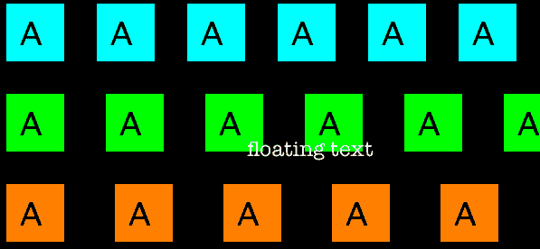
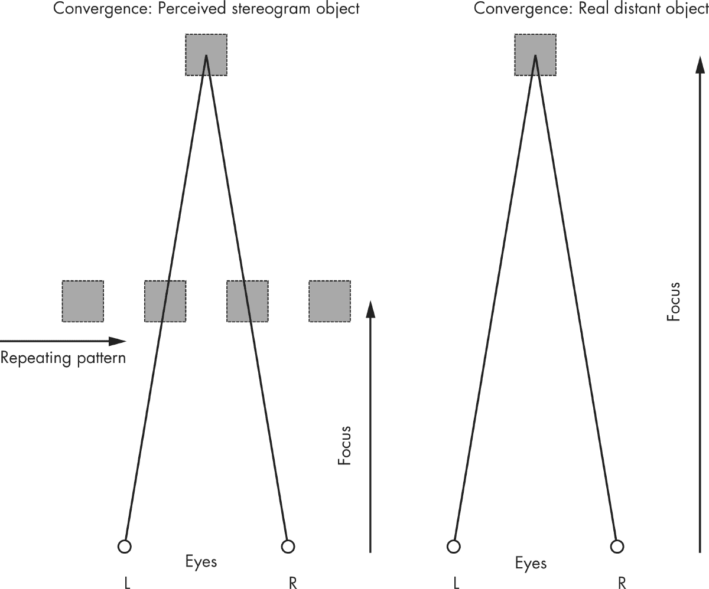
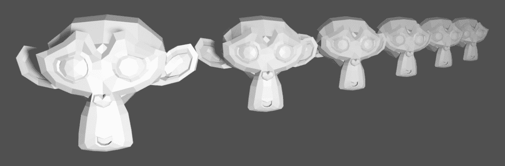
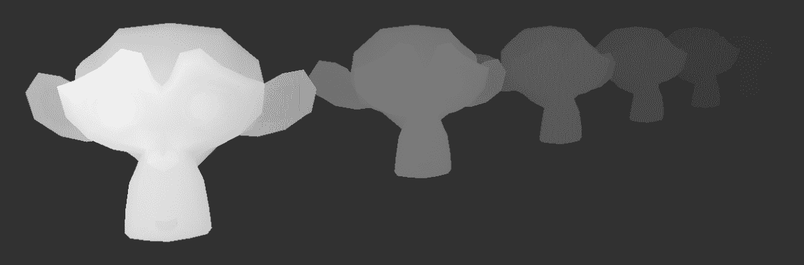
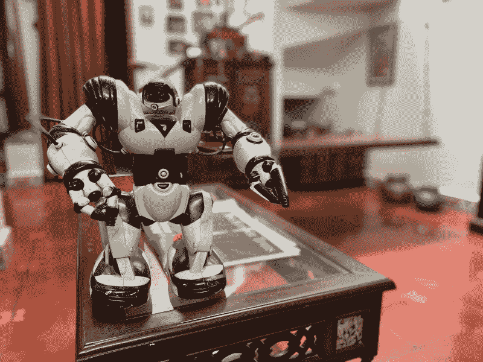
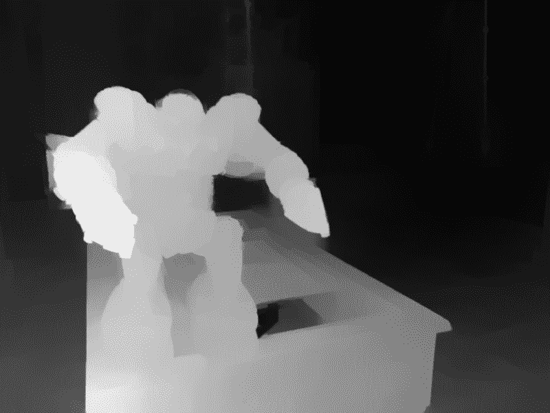
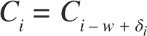
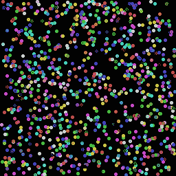
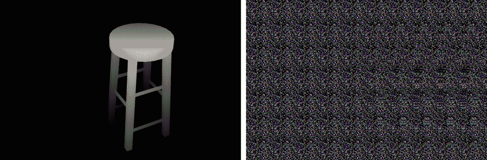
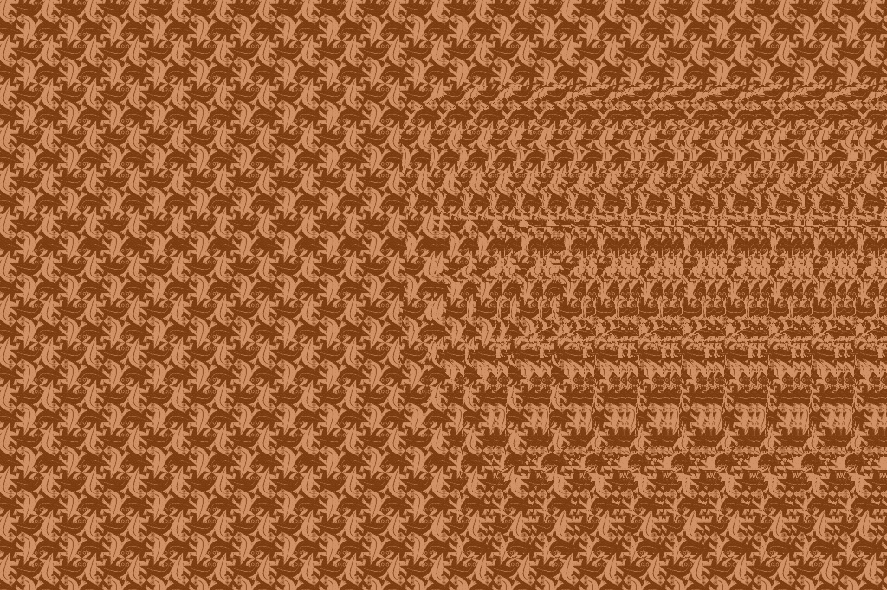

# 8

# 自动立体图


准备好凝视图 8-1 一分钟。你看到除了随机点以外的其他东西了吗？图 8-1 是一个*自动立体图*，它是一个二维图像，能创造出三维的幻觉。自动立体图通常由重复的图案组成，经过仔细观察后会变成三维。如果你看不到任何图像，不用担心；我自己也花了一些时间和实验才看到。（如果你在书中打印的版本看不清楚，试试书的 GitHub 仓库中*images*文件夹里的彩色版本。图注的脚注会告诉你应该看到什么。）

在本项目中，你将使用 Python 来创建自动立体图。以下是本项目中涉及的一些概念：

+   • 线性间距与深度感知

+   • 深度图

+   • 使用`Pillow`创建和编辑图像

+   • 使用`Pillow`在图像中绘制


图 8-1：一个可能让你头疼的难题 1

你将在本项目中生成的自动立体图是为“斜视”观看设计的。查看这些图像的最佳方法是将眼睛聚焦于图像后面的一个点（例如墙壁）。几乎神奇的是，一旦你在图案中感知到某些东西，你的眼睛应该会自动将其聚焦，当三维图像“锁定”后，你将很难把它移除。（如果你仍然难以查看图像，可以参考 Gene Levin 的文章《如何观看立体图和观看练习》2 寻求帮助。）

## 工作原理

自动立体图从一个具有重复平铺图案的图像开始。通过改变重复图案之间的线性间距，将隐藏的 3D 图像嵌入其中，从而创造出深度的幻觉。当你在自动立体图中查看重复的图案时，大脑可以将这些间距解读为深度信息，特别是当有多个不同间距的图案时。

### 在自动立体图中感知深度

当你的眼睛聚焦于图像后面的一个假想点时，大脑会将左眼看到的点与右眼看到的不同组点进行匹配，从而使你看到这些点位于图像后的平面上。感知到的平面距离取决于图案中的间距。例如，图 8-2 显示了三行*A*。这些*A*在每一行内的间距是相等的，但它们的水平间距从上到下逐渐增大。



图 8-2：线性间距与深度感知

当以“交叉眼”的方式查看此图像时，图 8-2 中的最上面一行应该看起来位于纸张的后面，中间一行应该显得稍微在第一行的后面，最下面一行应该看起来离你的眼睛最远。标有*浮动文本*的文字应该看起来“漂浮”在这些行的上方。

为什么你的大脑将这些图案之间的间距解释为深度？通常，当你看远处的物体时，你的眼睛会一起工作，对焦并向同一点汇聚，两只眼睛会向内旋转，直接指向物体。但当你查看“交叉眼”自动立体图时，焦点和汇聚发生在不同的位置。你的眼睛对焦于自动立体图，但大脑将重复的图案视为来自同一个虚拟（假想的）物体，而你的眼睛则汇聚在图像的后方，如图 8-3 所示。这种焦点与汇聚解耦的组合使你能够在自动立体图中看到深度。



图 8-3：在自动立体图中看到深度

自动立体图的感知深度取决于像素的水平间距。由于图 8-2 中的第一行间距最小，它看起来位于其他行的前面。然而，如果图像中的点间距有所变化，大脑会感知每个点的不同深度，并且你可以看到一个虚拟的三维图像显现出来。

### 与深度图一起工作

自动立体图中的隐藏图像来自*深度图*，它是一种图像，其中每个像素的值表示深度值，即从眼睛到该像素所代表的物体部分的距离。深度图通常以灰度图像显示，靠近的点为亮色，远处的点为暗色，如图 8-4 所示。


图 8-4：深度图

注意到鲨鱼的鼻子，图像中最亮的部分，看起来离你最近。朝尾部延伸的较暗区域似乎最远。（顺便提一下，图 8-4 中的图像与用于创建图 8-1 中展示的第一个自动立体图的深度图相同。）

由于深度图表示的是从每个像素中心到眼睛的深度或距离，因此你可以用它来获取与图像中某个像素位置相关的深度值。你知道，水平位移在图像中被感知为深度。因此，如果你根据相应像素的深度值按比例移动图像中的某个像素，你将为该像素创建与深度图一致的深度感知。如果你对所有像素执行此操作，你将把整个深度图编码到图像中，从而创建出自动立体图。

深度图存储每个像素的深度值，值的分辨率取决于用于表示它的位数。由于本章将使用常见的 8 位图像，深度值将位于 [0, 255] 范围内。

为了本项目的目的，我已经将几个示例深度图上传到本书的 GitHub 仓库。你可以下载这些图像，并将它们作为生成自动立体图的输入。不过，你也可以尝试自己制作深度图，创造一些更有创意的图像。有两种方法可以选择：使用 3D 建模软件创建的合成图像，或使用智能手机相机拍摄的照片。

#### 从 3D 模型创建深度图

如果你使用像 Blender 这样的 3D 计算机图形程序创建了某个物体的 3D 模型，你也可以使用该程序生成该模型的深度图。图 8-5 展示了一个示例。



(a)



(b)

图 8-5：3D 模型（a）及其对应的深度图（b）

图 8-5(a)展示了使用 Blender 渲染的 3D 模型，图 8-5(b)展示了从该模型创建的深度图。在 YouTube 上搜索“Blender 深度图 5 分钟教程！”可以找到 Jonty Schmidt 的教程 3，介绍如何做到这一点。关键是根据从相机的 Z 距离为图像着色。

#### 从智能手机照片创建深度图

如今，许多智能手机相机都有 *人像模式*，它不仅拍摄照片，还记录深度信息，以便选择性地模糊背景。如果你能获取到这些深度数据，你将得到该照片的深度图，进而可以用来创建自动立体图！图 8-6 展示了一个示例。



(a)



(b)

图 8-6：iPhone 11 相机拍摄的人像模式照片（a）和深度图（b）

图 8-6(a)展示了使用 iPhone 11 拍摄的竖屏照片，图 8-6(b)展示了相应的深度图。深度图是通过开源软件 ExifTool 和以下命令创建的：

```py
exiftool -b -MPImage2 photo.jpg > depth.jpg

```

该命令从文件 *photo.jpg* 的元数据中提取深度信息，并将其保存到文件 *depth.jpg* 中。可以从[`exiftool.org`](https://exiftool.org)下载 ExifTool，自己尝试这个过程。该命令适用于 iPhone 的照片，但你也可以使用类似的技术从其他类型的手机拍摄的图像中提取深度数据。还有一些应用程序可在 Android 和 iOS 应用商店中找到，可以帮助你完成此操作。这里有一个在线深度图提取器，适用于多种手机型号拍摄的肖像模式图像：[`www.hasaranga.com/dmap`](http://www.hasaranga.com/dmap/)。

### 平移像素

我们已经了解了大脑如何将图像中重复元素之间的间距视为深度信息，并且我们已经看到深度信息是如何通过深度图传递的。现在让我们看看如何根据深度图中的值来平移瓷砖图像中的像素。这是创建自立体图像的关键步骤。

瓷砖图像是通过在 x 轴和 y 轴方向上重复一个较小的图像（即瓷砖）来创建的，但对于深度感知，我们只关心 x 轴方向。如果构成图像的瓷砖宽度为 *w* 像素，你知道图像的像素颜色值会在 x 轴的每一行中每隔 *w* 像素重复一次。换句话说，某一行中位于 x 轴上 *i* 点的像素的颜色可以表示为：

*C*[i] = *C*[i − w] 对于 *i* ≥ *w*

让我们考虑一个例子。给定一个 100 像素宽度的瓷砖，对于一个 x 轴位置为 140 的像素，方程式告诉你 *C*[140] = *C*[140 − 100] = *C*[40]。这意味着 x 位置为 140 的像素的颜色值与 x 位置为 40 的像素相同，因为图像是重复的。（对于前面公式中小于*w*的*i*值，颜色就是 *C*[i]，因为瓷砖尚未重复。）

目标是根据深度图中的值来平移瓷砖图像中的像素。令 δ[i] 为深度图中 x 位置 *i* 的值。相应像素在瓷砖图像中的平移后的颜色值由以下公式给出：



返回到之前的例子，假设瓷砖宽度为 100 像素，给定一个 x 位置为 140 的像素以及一个对应的深度图值为 10，公式表示 *C*[140] = *C*[140 − 100 + 10] = *C*[50]。由于深度图，位置为 140 的像素的颜色应当改变为与位置 50 的像素颜色一致。由于 *C*[50] 与 *C*[150] 相同，这实际上是将 x 位置为 150 的像素向左移动了 10 个像素。结果，位置 50 和 150 之间的重复变得 10 像素更窄，而你的大脑会将这一变化感知为深度信息。

为了创建完整的自视立体图，你将沿着图像的宽度和所有行重复这一移动过程。你可以在查看代码时看到如何实现这种移动。

## 要求

在本项目中，你将使用`Pillow`读取图像，访问它们的底层数据，并创建和修改图像。

## 代码

本项目的代码将按照以下步骤创建自视立体图：

1.  1\. 读取深度图。

1.  2\. 读取图块图像或创建一个“随机点”图块。这将作为自视立体图的重复模式基础。

1.  3\. 通过重复拼接图块创建一个新图像。该图像的尺寸应与深度图相匹配。

1.  4\. 对于新图像中的每个像素，根据深度图中对应像素的深度值，按比例移动该像素。

1.  5\. 将生成的自视立体图写入文件。

若要查看完整项目，请跳到“完整代码”部分，见第 147 页。你还可以从[`github.com/mkvenkit/pp2e/tree/main/autos`](https://github.com/mkvenkit/pp2e/tree/main/autos)下载本章的完整代码。

### 从随机圆形创建图块

用户可以选择在程序开始时提供一个图块图像（我已将一幅基于 M.C. Escher 画作的图像上传到 GitHub 以供使用）。如果没有提供，将使用`createRandomTile()`函数创建一个随机圆点图块。

```py
def createRandomTile(dims):
    # create image
  ❶ img = Image.new('RGB', dims)
  ❷ draw = ImageDraw.Draw(img)
    # set the radius of a random circle to 1% of
    # width or height, whichever is smaller
  ❸ r = int(min(*dims)/100)
    # number of circles
  ❹ n = 1000
    # draw random circles
    for i in range(n):
        # -r makes sure that the circles stay inside and aren't cut off
        # at the edges of the image so that they'll look better when tiled
      ❺ x, y = random.randint(r, dims[0]-r), random.randint(r, dims[1]-r)
      ❻ fill = (random.randint(0, 255), random.randint(0, 255),
                random.randint(0, 255))
      ❼ draw.ellipse((x-r, y-r, x+r, y+r), fill)
    return img

```

首先，你创建一个新的 Python 图像库（PIL）`Image`对象，其尺寸由`dims` ❶给出。然后使用`ImageDraw.Draw()` ❷在图像中绘制圆形，半径（`r`）任意选择为图像宽度或高度的 1/100，取较小值 ❸。（Python 的`*`操作符解包`dims`元组中的宽度和高度值，以便将其传递给`min()`方法。）

你设置绘制的圆形数量为`1000` ❹，然后通过调用`random.randint()`获取随机整数，计算每个圆形的中心点的 x 和 y 坐标，范围为[`r`, `width`-r]和[`r`, `height`-r] ❺。通过将范围偏移`r`，可以确保生成的圆形完全落在图块的边界内。如果不这样做，圆形可能会画到图像的边缘，导致部分被裁剪。如果你用这样的图像拼接生成自视立体图，结果看起来不好，因为两个图块之间的边缘处，圆形没有间隔。

接下来，你为每个圆选择一个填充颜色，方法是从 `[0`, `255`] 范围内随机选择 RGB 值❻。最后，你使用 `draw` 中的 `ellipse()` 方法绘制每个圆❼。此方法的第一个参数是一个元组，定义了圆的边界框，由左上角和右下角的坐标 (`x-r`, `y-r`) 和 (`x+r`, `y+r`) 给出，其中 (`x`, `y`) 是圆心，`r` 是圆的半径。另一个参数是随机选择的填充颜色。

你可以在 Python 解释器中按如下方式测试此方法：

```py
>>> `import autos`
>>> `img = autos.createRandomTile((256, 256))`
>>> `img.save('out.png')`
>>> `exit()`

```

图 8-7 展示了测试的输出结果。



图 8-7：`createRandomTile()` 的示例运行

如你在图 8-7 中所见，你已经创建了一个带有随机点的图像，可以将其用作自动立体图的平铺图案。

### 重复给定的平铺图案

既然你已经有了一个平铺图案，可以通过重复该图案来创建图像。这将成为你的自动立体图的基础。定义一个`createTiledImage()`函数来完成这项工作。

```py
def createTiledImage(tile, dims):
    # create the new image
  ❶ img = Image.new('RGB', dims)
    W, H = dims
    w, h = tile.size
    # calculate the number of tiles needed
  ❷ cols = int(W/w) + 1
  ❸ rows = int(H/h) + 1
    # paste the tiles into the image
    for i in range(rows):
        for j in range(cols):
          ❹ img.paste(tile, (j*w, i*h))
    # output the image
    return img

```

该函数接收一张将作为平铺图案的图像（`tile`），以及输出图像的期望尺寸（`dims`）。尺寸以元组的形式给出，格式为（`width`，`height`）。你使用提供的尺寸创建一个新的`Image`对象❶。接下来，你存储了单个平铺图案和整个图像的宽度和高度。将整个图像的尺寸除以平铺图案的尺寸可以得到所需的列数❷和行数❸。你需要对每个计算结果加 1，以确保当输出图像尺寸不是平铺图案尺寸的整数倍时，右侧的最后一列和底部的最后一行不会丢失。没有这一预防措施，图像的右边和底部可能会被裁剪。最后，你通过行和列循环，将其填充为平铺图案❹。你通过将 `(j*w, i*h)` 相乘来确定平铺图案左上角的位置，这样它就能与行列对齐，就像你在摄影马赛克项目中做的那样。完成后，函数返回一个指定尺寸的`Image`对象，该对象已用输入图像`tile`进行平铺。

### 创建自动立体图

现在，让我们创建一些自动立体图。`createAutostereogram()` 函数完成大部分工作。代码如下：

```py
def createAutostereogram(dmap, tile):
    # convert the depth map to a single channel if needed
  ❶ if dmap.mode != 'L':
        dmap = dmap.convert('L')
    # if no image is specified for a tile, create a random circles tile
  ❷ if not tile:
        tile = createRandomTile((100, 100))
    # create an image by tiling
  ❸ img = createTiledImage(tile, dmap.size)
    # create a shifted image using depth map values
  ❹ sImg = img.copy()
    # get access to image pixels by loading the Image object first
  ❺ pixD = dmap.load()
    pixS = sImg.load()
    # shift pixels horizontally based on depth map
  ❻ cols, rows = sImg.size
    for j in range(rows):
        for i in range(cols):
          ❼ xshift = pixD[i, j]/10
          ❽ xpos = i - tile.size[0] + xshift
          ❾ if xpos > 0 and xpos < cols:
              ❿ pixS[i, j] = pixS[xpos, j]
    # display the shifted image
    return sImg

```

首先，你将提供的深度图（`dmap`）转换为单通道灰度图像（如有需要） ❶。如果用户没有提供平铺图像，你将使用之前定义的 `createRandomTile()` 函数创建一个随机圆形的平铺 ❷。接下来，你使用 `createTiledImage()` 函数创建一个与提供的深度图像大小匹配的平铺图像 ❸。然后，你复制该平铺图像 ❹。此副本将成为最终的自动立体图。

函数接下来使用 `Image.load()` 方法加载深度图和输出图像 ❺。该方法将图像数据加载到内存中，使你可以将图像的像素作为二维数组 `[i, j]` 来访问。你将图像尺寸存储为行数和列数 ❻，将图像视为一个像素网格。

自动立体图生成算法的核心在于根据深度图信息调整平铺图像中的像素。为此，你需要遍历平铺图像并处理每个像素。首先，你查找深度图中对应像素的值，并将该值除以 10，以确定平铺图像的位移值 ❼。除以 10 是因为这里使用的是 8 位深度图，这意味着深度值的范围是从 0 到 255。如果将这些值除以 10，你将得到大约在 0 到 25 之间的深度值。由于深度图输入图像的尺寸通常是数百像素，这些位移值是可行的。（你可以通过改变除数来实验，看看它如何影响最终图像。）

接下来，你使用在 “像素位移” 中讨论的公式，在 第 140 页 计算 x 轴坐标，以寻找像素的新颜色值 ❽。深度图值为 0（黑色）的像素将不会被位移，并将被视为背景。检查确保你没有试图访问图像中不存在的像素（因为位移可能会发生在图像的边缘） ❾，然后将每个像素替换为其位移后的值 ❿。

### 提供命令行选项

程序的 `main()` 函数提供了一些命令行选项，用于自定义自动立体图。

```py
def main():
    # create a parser
    parser = argparse.ArgumentParser(description="Autostereograms...")
    # add expected arguments
  ❶ parser.add_argument('--depth', dest='dmFile', required=True)
    parser.add_argument('--tile', dest='tileFile', required=False)
    parser.add_argument('--out', dest='outFile', required=False)
    # parse args
    args = parser.parse_args()
    # set the output file
    outFile = 'as.png'
    if args.outFile:
        outFile = args.outFile
    # set tile
    tileFile = False
    if args.tileFile:
        tileFile = Image.open(args.tileFile)

```

与之前的项目一样，你使用 `argparse` 来定义程序的命令行选项。唯一必需的参数是深度图文件的名称 ❶。还有两个可选参数，一个用于提供作为平铺模式的图像文件，另一个用于设置输出文件的名称。如果未指定平铺图像，程序将生成一个随机圆形平铺。如果未指定输出文件名，自动立体图将写入名为 *as.png* 的文件。

## 运行自动立体图生成器

现在让我们使用一个凳子的深度图（*stool-depth.png*），它在这个项目的 GitHub 仓库中的 *data* 文件夹里，来运行程序：

```py
$ `python autos.py --depth data/stool-depth.png`

```

图 8-8 显示了左侧的深度图像和右侧生成的自动立体图。因为你没有为图块提供图像，所以这个自动立体图是通过随机图块生成的。



图 8-8：*autos.py* 的一次示例运行

现在让我们提供一个图块图像作为输入。使用之前提到的 *stool-depth.png* 深度图，但这次为图块提供图像 *escher-tile.jpg*。

```py
$ `python autos.py --depth data/stool-depth.png –-tile data/escher-tile.jpg`

```

图 8-9 显示了输出结果。



图 8-9：使用图块的 *autos.py* 示例运行

享受使用我在 GitHub 上提供的图像或你自己的深度图来创建莫尔纹自动立体图吧！

## 总结

在这个项目中，你学习了如何创建自动立体图。从深度图像开始，你现在可以创建一个随机点的自动立体图，或者创建一个用你提供的图像拼贴的自动立体图。

## 实验！

下面是一些进一步探索自动立体图的方法：

1.  1. 编写代码创建一个类似于图 8-2 的图像，演示图像中线性间距的变化如何产生深度的错觉。（提示：使用图像拼贴和 `Image.paste()` 方法。）

1.  2. 向程序添加一个命令行选项，指定要应用于深度图值的缩放比例。（记住，代码会将深度图值除以 10。）改变这个值会如何影响自动立体图？

## 完整代码

这是完整的自动立体图项目代码：

```py
"""
autos.py
A program to create autostereograms.
Author: Mahesh Venkitachalam
"""
import sys, random, argparse
from PIL import Image, ImageDraw
# create spacing/depth example
def createSpacingDepthExample():
    tiles = [Image.open('test/a.png'), Image.open('test/b.png'),
             Image.open('test/c.png')]
    img = Image.new('RGB', (600, 400), (0, 0, 0))
    spacing = [10, 20, 40]
    for j, tile in enumerate(tiles):
        for i in range(8):
            img.paste(tile, (10 + i*(100 + j*10), 10 + j*100))
    img.save('sdepth.png')
# create image filled with random dots
def createRandomTile(dims):
    # create image
    img = Image.new('RGB', dims)
    draw = ImageDraw.Draw(img)
    # calculate radius - % of min dimension
    r = int(min(*dims)/100)
    # number of dots
    n = 1000
    # draw random circles
    for i in range(n):
        # -r is used so circle stays inside - cleaner for tiling
        x, y = random.randint(r, dims[0]-r), random.randint(r, dims[1]-r)
        fill = (random.randint(0, 255), random.randint(0, 255),
                random.randint(0, 255))
        draw.ellipse((x-r, y-r, x+r, y+r), fill)
    # return image
    return img
# create a larger image of size dims by tiling the given image
def createTiledImage(tile, dims):
    # create output image
    img = Image.new('RGB', dims)
    W, H = dims
    w, h = tile.size
    # calculate # of tiles needed
    cols = int(W/w) + 1
    rows = int(H/h) + 1
    # paste tiles
    for i in range(rows):
        for j in range(cols):
            img.paste(tile, (j*w, i*h))
    # output image
    return img
# create a depth map for testing:
def createDepthMap(dims):
    dmap = Image.new('L', dims)
    dmap.paste(10, (200, 25, 300, 125))
    dmap.paste(30, (200, 150, 300, 250))
    dmap.paste(20, (200, 275, 300, 375))
    return dmap
# given a depth map (image) and an input image, create a new image
# with pixels shifted according to depth
def createDepthShiftedImage(dmap, img):
    # size check
    assert dmap.size == img.size
    # create shifted image
    sImg = img.copy()
    # get pixel access
    pixD = dmap.load()
    pixS = sImg.load()
    # shift pixels output based on depth map
    cols, rows = sImg.size
    for j in range(rows):
        for i in range(cols):
            xshift = pixD[i, j]/10
            xpos = i - 140 + xshift
            if xpos > 0 and xpos < cols:
                pixS[i, j] = pixS[xpos, j]
    # return shifted image
    return sImg
# given a depth map (image) and an input image, create a new image
# with pixels shifted according to depth
def createAutostereogram(dmap, tile):
    # convert depth map to single channel if needed
    if dmap.mode != 'L':
        dmap = dmap.convert('L')
    # if no tile specified, use random image
    if not tile:
        tile = createRandomTile((100, 100))
    # create an image by tiling
    img = createTiledImage(tile, dmap.size)
    # create shifted image
    sImg = img.copy()
    # get pixel access
    pixD = dmap.load()
    pixS = sImg.load()
    # shift pixels output based on depth map
    cols, rows = sImg.size
    for j in range(rows):
        for i in range(cols):
            xshift = pixD[i, j]/10
            xpos = i - tile.size[0] + xshift
            if xpos > 0 and xpos < cols:
                pixS[i, j] = pixS[xpos, j]
    # return shifted image
    return sImg
# main() function
def main():
    # use sys.argv if needed
    print('creating autostereogram...')
    # create parser
    parser = argparse.ArgumentParser(description="Autostereograms...")
    # add expected arguments
    parser.add_argument('--depth', dest='dmFile', required=True)
    parser.add_argument('--tile', dest='tileFile', required=False)
    parser.add_argument('--out', dest='outFile', required=False)
    # parse args
    args = parser.parse_args()
    # set output file
    outFile = 'as.png'
    if args.outFile:
        outFile = args.outFile
    # set tile
    tileFile = False
    if args.tileFile:
        tileFile = Image.open(args.tileFile)
    # open depth map
    dmImg = Image.open(args.dmFile)
    # create stereogram
    asImg = createAutostereogram(dmImg, tileFile)
    # write output
    asImg.save(outFile)
# call main
if __name__ == '__main__':
    main()

```

1 隐藏的图像是鲨鱼。

2 [`colorstereo.com/texts_.txt/practice.htm`](http://colorstereo.com/texts_.txt/practice.htm)

3 [`www.youtube.com/watch?v=oqpDqKpOChE`](https://www.youtube.com/watch?v=oqpDqKpOChE)
