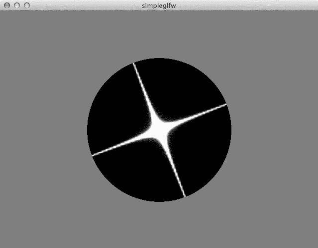
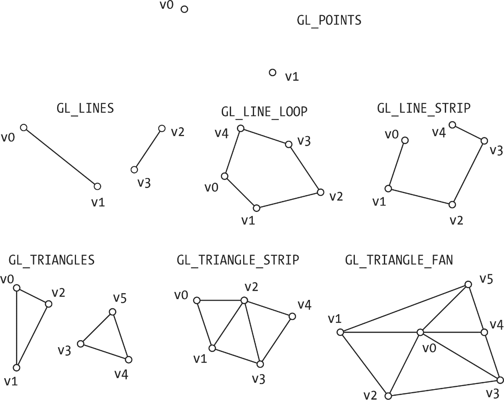
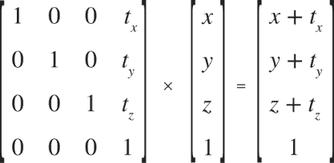
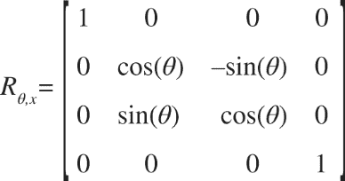
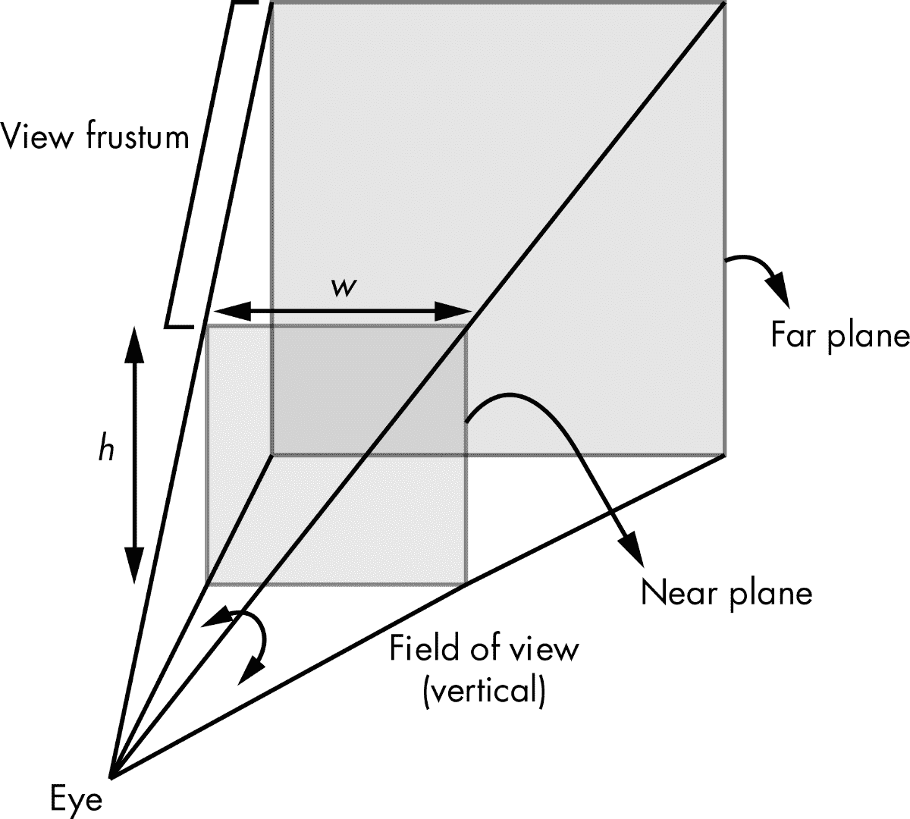
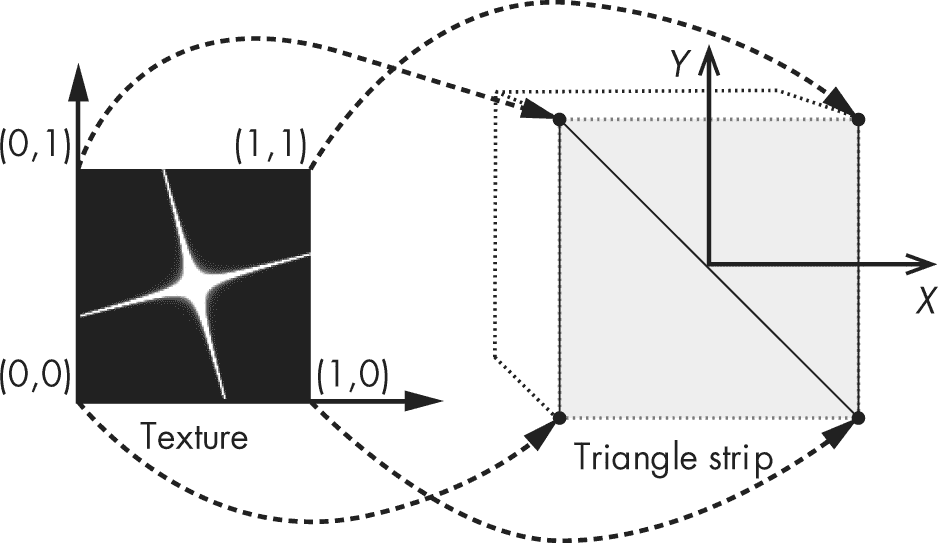
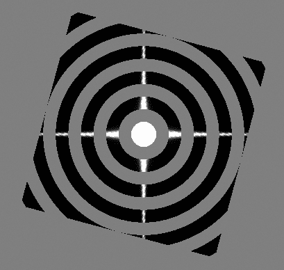

## # 理解 OpenGL


在这个项目中，你将创建一个简单的程序，使用 OpenGL 和 GLFW 显示一个纹理映射的方形。OpenGL 是你与图形处理单元（GPU）之间的软件接口，而 GLFW 是一个窗口工具包。你还将学习如何使用类似 C 语言的 OpenGL 着色语言（GLSL）来编写 *着色器*——在 GPU 上执行的代码。着色器为 OpenGL 中的计算带来了巨大的灵活性。我将向你展示如何使用 GLSL 着色器来变换和上色几何体，同时创建一个旋转的、带纹理的多边形（如图 9-1 所示）。

GPU 被优化为在大量数据上反复执行相同的操作，并行处理，这使得它们在渲染计算机图形时比中央处理单元（CPU）更快。此外，GPU 还被用于通用计算，专门的编程语言现在允许你将 GPU 硬件应用于各种各样的应用程序。在本项目中，你将利用 GPU、OpenGL 和着色器。



图 9-1：本章项目的最终图像——一个旋转的多边形，带有星形图像。这个方形多边形边界使用着色器被裁剪成黑色圆形。

Python 是一种出色的“胶水”语言。有大量的 Python *绑定* 可用于其他语言编写的库，例如 C，使你能够在 Python 中使用这些库。在本章以及第十章和第十一章中，你将使用 `PyOpenGL`，它是 OpenGL 的 Python 绑定，用于创建计算机图形。

下面是本项目中介绍的一些概念：

+   • 使用 GLFW 窗口库进行 OpenGL 编程

+   • 使用 GLSL 编写顶点着色器和片段着色器

+   • 执行纹理映射

+   • 使用 3D 变换

首先，让我们来看看 OpenGL 是如何工作的。

注意：OpenGL 在几年前经历了重大变革。它从使用固定功能的图形管线转变为使用具有专用着色语言的可编程管线。我们称之为 *现代 OpenGL*，而这就是本书中使用的版本。具体来说，我们将使用 OpenGL 版本 4.1。

## OpenGL 工作原理

现代 OpenGL 通过一系列操作将图形呈现在屏幕上，这些操作通常被称为 *3D 图形管线*。图 9-2 显示了 OpenGL 3D 图形管线的简化表示。


图 9-2：简化的 OpenGL 图形管线

从本质上讲，计算机图形学归结为计算屏幕上像素的颜色值。假设你想让一个三角形出现。在管线的第一步，你通过定义三角形的 3D 顶点并指定与每个顶点相关的颜色来定义 3D 几何形状。这些顶点和颜色会保存在一种叫做*顶点缓冲对象（VBOs）*的数据结构中。接下来，你会对顶点进行变换：第一步变换将顶点置于 3D 空间中，第二步将 3D 坐标投影到 2D 空间，以便在 2D 屏幕上显示。此步骤中还会根据照明等因素计算相应顶点的颜色值，通常在名为*顶点着色器*的代码中进行计算。

接下来，几何图形会被*光栅化*（从 3D 表示转换为 2D 像素），对于每个像素（或者更准确地说是*片段*），会执行另一段代码，叫做*片段着色器*。就像顶点着色器操作 3D 顶点一样，片段着色器则作用于光栅化后的 2D 片段。我使用*片段*而不是*像素*，因为像素是显示在屏幕上的内容，而片段是片段着色器计算的输出，根据管线中的下一步，片段可能在成为屏幕上的像素之前被丢弃。

最后，每个片段会经过一系列帧缓冲操作，在这些操作中，它会进行*深度缓冲测试*（检查一个片段是否遮挡了另一个片段）、*混合*（将两个具有透明度的片段混合）以及其他将其当前颜色与帧缓冲区中该位置已有的颜色相结合的操作。这些更改最终会出现在最终的帧缓冲区中，通常会显示在屏幕上。

### 几何图元

由于 OpenGL 是一个低级图形库，你不能直接要求它绘制一个立方体或球体，尽管建立在 OpenGL 基础上的库可以为你完成这些任务。OpenGL 只理解低级的几何图元，如点、线和三角形。

现代 OpenGL 仅支持以下基本图元类型：`GL_POINTS`、`GL_LINES`、`GL_LINE_STRIP`、`GL_LINE_LOOP`、`GL_TRIANGLES`、`GL_TRIANGLE_STRIP` 和 `GL_TRIANGLE_FAN`。图 9-3 显示了这些图元的顶点是如何组织的。每个顶点都有一个像 (*x*, *y*, *z*) 这样的 3D 坐标。



图 9-3：OpenGL 基本图元

在 OpenGL 中绘制一个球体，首先需要通过数学定义球体的几何形状并计算其 3D 顶点。然后将这些顶点组装成基本的几何图元；例如，可以将每组三个顶点组成一个三角形。接下来使用 OpenGL 渲染这些顶点。

### 3D 变换

你不学习 3D 变换就无法学习计算机图形学。从概念上讲，这些是相当简单的理解。你有一个对象——你可以对它做什么？你可以移动它，拉伸（或压缩）它，或者旋转它。你还可以对它做其他事情，但这三项任务——平移、缩放和旋转——是对一个对象执行的最常见操作或变换。除了这些常用的变换之外，你还会使用透视投影将 3D 对象映射到屏幕的 2D 平面上。这些变换都应用于你要变换的对象的坐标。

虽然你可能已经熟悉形式为（*x*，*y*，*z*）的 3D 坐标，但在 3D 计算机图形学中，你使用的是形式为（*x*，*y*，*z*，*w*）的坐标，称为 *齐次坐标*。（这些坐标来源于一种叫做 *射影几何* 的数学分支，超出了本书的范围。）齐次坐标使你能够将常见的 3D 变换（如平移、缩放和旋转）表示为 4×4 矩阵。但对于这些 OpenGL 项目的目的来说，你只需要知道齐次坐标（*x*，*y*，*z*，*w*）等同于 3D 坐标（*x*/*w*，*y*/*w*，*z*/*w*，1.0）。一个 3D 点（1.0，2.0，3.0）可以表示为齐次坐标（1.0，2.0，3.0，1.0）。

这是一个使用 4×4 矩阵进行 3D 变换的例子。请看矩阵乘法是如何将一个点（*x*，*y*，*z*，1.0）转换为（*x* + *t*[*x*]， *y* + *t*[*y*]，*z* + *t*[*z*]，1.0）的：



由于此操作是将一个点在空间中平移，所涉及的 4×4 矩阵被称为 *平移矩阵*。

现在让我们来看另一个用于 3D 变换的有用矩阵——旋转矩阵。下面的矩阵将一个点（*x*，*y*，*z*，1.0）绕 x 轴逆时针旋转 θ 弧度：



但有一点需要记住：如果你打算在着色器代码中应用此旋转，矩阵将以 *列主格式* 存储，这意味着你应该按以下方式声明它：

```py
// rotational transform
mat4 rot =  mat4(
    vec4(1.0,  0.0,          0.0,         0.0),
    vec4(0.0,  cos(uTheta),  sin(uTheta), 0.0),
    vec4(0.0, -sin(uTheta),  cos(uTheta), 0.0),
    vec4(0.0,  0.0,          0.0,         1.0)
);

```

注意，在代码中，与 *R*[θ][,][x] 的定义相比，矩阵沿其对角线被翻转了。

在 OpenGL 中，你会经常遇到两个术语：*模型视图*和*投影*变换。随着现代 OpenGL 可自定义着色器的出现，模型视图和投影已经成为通用变换。从历史上看，在旧版 OpenGL 中，模型视图变换用于将你的 3D 模型定位在空间中，而投影变换用于将 3D 坐标映射到 2D 表面以进行显示，正如你稍后会看到的那样。模型视图变换是用户定义的变换，让你能够定位 3D 对象，而投影变换是将 3D 映射到 2D 的投影变换。

最常用的两种 3D 图形投影变换是*正交*投影和*透视*投影，但在这里你将只使用透视投影，它由*视场*（眼睛可以看到的范围）、*近裁剪面*（离眼睛最近的平面）、*远裁剪面*（离眼睛最远的平面）和*宽高比*（近裁剪面宽度与高度的比率）定义。这些参数共同构成一个相机模型，用于定义如何将 3D 物体映射到 2D 屏幕上，如图 9-4 所示。图中的截头金字塔就是*视锥体*，*眼睛*则是放置相机的 3D 位置。（对于正交投影，眼睛的位置将在无穷远处，且金字塔将变成一个矩形立方体。）



图 9-4：一个透视投影相机模型

一旦透视投影完成并且在光栅化之前，图形原语会根据图 9-4 中显示的近裁剪面和远裁剪面进行裁剪（或剪切）。选择近裁剪面和远裁剪面时，确保你希望在屏幕上显示的 3D 物体位于视锥体内部；否则，它们会被裁剪掉。

### 着色器

你已经了解了着色器如何融入现代 OpenGL 可编程图形管线。现在让我们来看一对简单的顶点和片段着色器，来感受一下 GLSL 是如何工作的。

#### 一个顶点着色器

这里是一个简单的顶点着色器，它计算顶点的位置和颜色：

```py
❶ # version 410 core
❷ in vec3 aVert;
❸ uniform mat4 uMVMatrix;
❹ uniform mat4 uPMatrix;
❺ out vec4 vCol;
void main() {
    // apply transformations
  ❻ gl_Position = uPMatrix * uMVMatrix * vec4(aVert, 1.0);
    // set color
  ❼ vCol = vec4(1.0, 0.0, 0.0, 1.0);
}

```

你首先在着色器中设置所使用的 GLSL 版本为 4.1 ❶。然后，使用关键字`in`定义一个名为`aVert`的输入变量，其类型为`vec3`（一个三维向量）❷。接下来，你定义了两个类型为`mat4`（4×4 矩阵）的变量，分别对应于模型视图矩阵 ❸ 和投影矩阵 ❹。这些变量前缀为`uniform`，表示在给定的渲染调用中，这些变量在顶点着色器执行过程中不会改变。你使用`out`前缀来定义顶点着色器的输出变量，它是一个类型为`vec4`的颜色变量（一个 4 维向量，用于存储红色、绿色、蓝色和透明度通道）❺。

现在你进入了`main()`函数，顶点着色器程序从这里开始。`gl_Position`的值是通过使用传入的 uniform 矩阵对输入的`aVert`进行变换来计算的 ❻。GLSL 变量`gl_Position`用于存储变换后的顶点。你将顶点着色器的输出颜色设置为红色且不透明，使用的值是(1, 0, 0, 1) ❼。你将在管线中的下一个着色器中使用这个值作为输入。

#### 一个片段着色器

现在让我们来看一个简单的片段着色器，它根据传入的顶点颜色计算片段颜色：

```py
❶ # version 410 core
❷ in vec4 vCol;
❸ out vec4 fragColor;
void main() {
    // use vertex color
  ❹ fragColor = vCol;
}

```

在设置着色器使用的 GLSL 版本 ❶ 后，你将 `vCol` 设置为片段着色器的输入 ❷。这个变量 `vCol` 是从顶点着色器的输出设置的。（记住，顶点着色器在 3D 场景中的每个顶点上执行，而片段着色器在屏幕上的每个片段上执行。）你还设置了片段着色器的输出颜色变量 `fragColor` ❸。

在光栅化过程中（发生在顶点着色器和片段着色器之间），OpenGL 将变换后的顶点转换为片段，并通过对顶点的颜色值进行插值，计算位于顶点之间的片段的颜色；`vCol` 是前面代码中的插值颜色。你将片段着色器的输出设置为与输入到片段着色器中的插值颜色相同❹。默认情况下，在大多数情况下，片段着色器的目标输出是屏幕，而你设置的颜色最终会显示在屏幕上（除非受到诸如深度测试等操作的影响，这些操作发生在图形管线的最后阶段）。

为了让 GPU 执行着色器代码，它需要被编译并链接到硬件可以理解的指令。OpenGL 提供了方法来实现这一点，并报告详细的编译器和链接器错误，帮助你开发着色器代码。编译过程还会生成一个表，列出你在着色器中声明的变量的位置或索引，以便你可以将它们连接到 Python 代码中的变量。

### 顶点缓冲区

*顶点缓冲区*是 OpenGL 着色器中使用的一个重要机制。现代图形硬件和 OpenGL 设计用于处理大量的 3D 几何体。因此，OpenGL 内置了多种机制，以帮助将数据从程序传输到 GPU。绘制 3D 几何体的典型设置将执行以下操作：

1.  1\. 为每个顶点的 3D 几何体定义坐标、颜色和其他属性的数组。

1.  2\. 创建一个顶点数组对象（VAO）并绑定到它。

1.  3\. 为每个属性创建顶点缓冲对象（VBO），并按顶点为单位定义。

1.  4\. 绑定到 VBO 并使用预定义数组设置缓冲数据。

1.  5\. 指定着色器中将使用的顶点属性的数据和位置。

1.  6\. 启用顶点属性。

1.  7\. 渲染数据。

在你定义了 3D 几何体的顶点之后，你创建并绑定一个顶点数组对象。VAO 是一种方便的方式，用于将几何体按坐标、颜色等多个数组进行分组。然后，为每个顶点的每个属性，创建一个顶点缓冲对象，并将你的 3D 数据设置进去。VBO 将顶点数据存储在 GPU 内存中。现在，只剩下连接缓冲数据，这样你就可以在着色器中访问它。你可以通过使用着色器中使用的变量位置来完成此操作。

### 纹理映射

现在让我们来看一下纹理映射，这是一种在本章中将使用的重要计算机图形学技术。*纹理映射* 是一种通过使用 3D 物体的 2D 图像（类似舞台背景）来赋予场景现实感的方法。纹理通常是从图像文件中读取的，并通过将 2D 坐标（在 [0, 1] 范围内）映射到多边形的 3D 坐标，拉伸并覆盖在几何区域上。例如，图 9-5 展示了一个图像被覆盖在立方体的一个面上。（我使用了 `GL_TRIANGLE_STRIP` 基元来绘制立方体面，并且顶点的顺序通过面上的线条表示。）



图 9-5：纹理映射

在图 9-5 中，纹理的(0, 0)角被映射到立方体面部的左下顶点。同样，你可以看到纹理的其他角是如何映射的，最终效果是纹理被“粘贴”到立方体的这一面。立方体面部的几何形状定义为三角带，顶点从底部到左上和从底部到右上呈之字形排列。纹理是非常强大且多功能的计算机图形工具，正如你将在第十一章中看到的那样。

### OpenGL 上下文

现在让我们讨论如何让 OpenGL 在屏幕上绘制内容。存储所有 OpenGL 状态信息的实体被称为 *OpenGL 上下文*。上下文具有一个可视化的、类似窗口的区域，OpenGL 绘制内容会显示在这个区域上，并且每个进程或应用程序运行可以有多个上下文，但每次只有一个上下文可以是当前上下文（线程）。 (幸运的是，窗口工具包会处理大部分上下文的管理。)

为了让你的 OpenGL 输出出现在屏幕上的窗口中，你需要操作系统的帮助。对于这些项目，你将使用 GLFW，一个轻量级的跨平台 C 库，它允许你创建和管理 OpenGL 上下文、在窗口中显示 3D 图形，并处理用户输入（如鼠标点击和键盘按键）。(附录 A 涵盖了此库的安装细节。)

由于你正在使用 Python 编写代码而不是 C，你还将使用一个 Python 绑定库来访问 GLFW（*glfw.py*，可以在本书代码库的 *common* 目录中找到），这样你就可以使用 Python 访问所有 GLFW 功能。

## 需求

你将使用 `PyOpenGL`，一个流行的 OpenGL Python 绑定库来进行渲染，并且你会使用 `numpy` 数组来表示 3D 坐标和变换矩阵。

## 代码

在这个项目中，你将构建一个简单的 Python 应用程序，用 OpenGL 显示一个旋转的纹理多边形。要查看完整的项目代码，请跳到 “完整代码”，位于 第 172 页。我们简单的 OpenGL 应用程序的完整代码分布在两个文件中。本章讨论的主要项目代码在 *simpleglfw.py* 中，代码可以在 [`github.com/mkvenkit/pp2e/tree/main/simplegl`](https://github.com/mkvenkit/pp2e/tree/main/simplegl) 找到。辅助函数在 *glutils.py* 中，可以在 GitHub 仓库的 *common* 目录下找到。

### RenderWindow 类

`RenderWindow` 类管理显示 OpenGL 图形的窗口的创建。它初始化 GLFW，设置 OpenGL，管理渲染，并设置回调以接收键盘输入。

#### 创建一个 OpenGL 窗口

`RenderWindow` 类的首要任务是设置 GLFW，以便你有一个 OpenGL 窗口用于渲染。该类的初始化代码完成了这一任务：

```py
class RenderWindow:
    """GLFW rendering window class"""
    def __init__(self):
        # save current working directory
        cwd = os.getcwd()
        # initialize glfw
      ❶ glfw.glfwInit()
        # restore cwd
        os.chdir(cwd)
        # version hints
      ❷ glfw.glfwWindowHint(glfw.GLFW_CONTEXT_VERSION_MAJOR, 4)
        glfw.glfwWindowHint(glfw.GLFW_CONTEXT_VERSION_MINOR, 1)
        glfw.glfwWindowHint(glfw.GLFW_OPENGL_FORWARD_COMPAT, GL_TRUE)
        glfw.glfwWindowHint(glfw.GLFW_OPENGL_PROFILE,
                            glfw.GLFW_OPENGL_CORE_PROFILE)
        # make a window
        self.width, self.height = 800, 600
        self.aspect = self.width/float(self.height)
      ❸ self.win = glfw.glfwCreateWindow(self.width, self.height,
                                         b'simpleglfw')
        # make the context current
      ❹ glfw.glfwMakeContextCurrent(self.win)

```

你初始化了 GLFW 库❶，然后从 ❷ 开始，将 OpenGL 版本设置为 OpenGL 4.1 核心配置文件。接着，你创建了一个 OpenGL 可用的窗口，尺寸为 800×600❸。最后，你使上下文变为当前❹，然后就可以开始执行 OpenGL 调用了。

接下来，仍在 `__init__()` 定义中，你会进行一些初始化调用：

```py
        # initialize GL
      ❶ glViewport(0, 0, self.width, self.height)
      ❷ glEnable(GL_DEPTH_TEST)
      ❸ glClearColor(0.5, 0.5, 0.5, 1.0)

```

在这里，你设置视口或屏幕尺寸（宽度和高度），这是 OpenGL 渲染你的 3D 场景的区域❶。然后，你通过 `GL_DEPTH_TEST` 开启深度测试❷，并设置当执行 `glClear()` 渲染时背景的颜色❸。你选择 50% 灰色，并将 `alpha` 设置为 1.0（Alpha 是片段透明度的度量——1.0 表示完全不透明）。

#### 设置回调

你通过注册用户界面事件的回调函数来完成 `__init__()` 定义，这样你就可以响应按键事件。

```py
        # set window callbacks
        glfw.glfwSetKeyCallback(self.win, self.onKeyboard)

```

这段代码设置了键盘按键的回调。每次发生这些事件时，注册为回调的函数 `onKeyboard()` 会被执行。现在让我们看看该键盘回调函数的定义：

```py
def onKeyboard(self, win, key, scancode, action, mods):
    # print 'keyboard: ', win, key, scancode, action, mods
  ❶ if action == glfw.GLFW_PRESS:
        # ESC to quit
        if key == glfw.GLFW_KEY_ESCAPE:
          ❷ self.exitNow = True
        else:
            # toggle cut
          ❸ self.scene.showCircle = not self.scene.showCircle

```

每次发生键盘事件时，都会调用 `onKeyboard()` 回调函数。函数的参数中会包含有用的信息，例如发生了什么类型的事件（例如，按键抬起与按键按下）以及哪个键被按下。代码 `glfw.GLFW_PRESS` 表示只监听按键按下（`PRESS`）事件❶。如果按下 ESC 键，你会设置一个退出标志❷。如果按下其他任何键，则切换 `showCircle` 布尔值❸。这个变量将在片段着色器中用于保留或丢弃圆形区域外的片段。

#### 定义主循环

`RenderWindow`类还通过其`run()`方法定义了程序的主循环。（GLFW 并没有提供默认的程序循环。）`run()`方法以预设的时间间隔更新 OpenGL 窗口。调用渲染方法绘制场景后，它还会轮询系统，查看是否有待处理的窗口或键盘事件。让我们看看方法的定义：

```py
def run(self):
    # initializer timer
  ❶ glfw.glfwSetTime(0)
    t = 0.0
  ❷ while not glfw.glfwWindowShouldClose(self.win) and not self.exitNow:
        # update every x seconds
      ❸ currT = glfw.glfwGetTime()
        if currT - t > 0.1:
            # update time
            t = currT
            # clear
          ❹ glClear(GL_COLOR_BUFFER_BIT | GL_DEPTH_BUFFER_BIT)
            # set viewport
          ❺ self.width, self.height = glfw.glfwGetFramebufferSize(self.win)
          ❻ self.aspect = self.width/float(self.height)
          ❼ glViewport(0, 0, self.width, self.height)

```

在主循环中，`glfw.glfwSetTime()`将 GLFW 计时器重置为 0❶。你将使用这个计时器在定时的间隔内重新绘制图形。你启动一个`while`循环❷，只有当窗口关闭或`exitNow`被设置为`True`时才退出。当循环退出时，调用`glfw.glfwTerminate()`以清理地关闭 GLFW。

在循环内，`glfw.glfwGetTime()`获取当前的计时器值❸，你可以用它来计算自上次绘制以来经过的时间。通过在这里设置一个期望的间隔（在本例中为 0.1 秒或 100 毫秒），你可以调整渲染帧率。接下来，`glClear()`清除深度和颜色缓冲区，并用设定的背景色替换它们，为下一帧做好准备❹。

你使用`glfwGetFramebufferSize()`函数查询并设置窗口的宽度和高度❺。这样做是为了防止用户改变窗口的大小。请注意，在某些系统（例如带有 Retina 显示屏的 MacBook）中，窗口大小和帧缓冲区大小可能不同，因此为了安全起见，始终查询后者。接下来，你计算窗口的宽高比❻，稍后将用它来设置投影矩阵。然后，使用你获取的新帧缓冲区尺寸清除视口❼。

现在让我们看一下`run()`方法的剩余部分：

```py
            # build projection matrix
          ❶ pMatrix = glutils.perspective(45.0, self.aspect, 0.1, 100.0)
          ❷ mvMatrix = glutils.lookAt([0.0, 0.0, -2.0], [0.0, 0.0, 0.0],
                                      [0.0, 1.0, 0.0])
            # render
          ❸ self.scene.render(pMatrix, mvMatrix)
            # step
          ❹ self.scene.step()
          ❺ glfw.glfwSwapBuffers(self.win)
            # poll for and process events
          ❻ glfw.glfwPollEvents()
    # end
    glfw.glfwTerminate()

```

仍然在`while`循环中，你使用*glutils.py*中定义的`perspective()`方法❶计算投影矩阵。投影矩阵是将 3D 场景映射到 2D 屏幕的变换。这里你设置了 45 度的视场角和近/远平面的距离为 0.1/100.0。然后，你使用*glutils.py*中定义的`lookAt()`方法❷设置模型视图矩阵。默认的 OpenGL 视图将你的眼睛放在原点，朝向负 z 方向。`lookAt()`方法创建的模型视图矩阵会将顶点进行转换，使得视图与眼睛位置和方向匹配。你将眼睛位置设置为(0, 0, -2)，并朝向原点(0, 0, 0)，"上"向量为(0, 1, 0)。接下来，你调用`scene`对象的`render()`方法❸，传入这些矩阵，并调用`scene.step()`来更新时间步长所需的变量❹。（我们接下来会看`Scene`类，它封装了多边形的设置和渲染。）`glfwSwapBuffers()`调用❺交换前后缓冲区，从而显示更新后的 3D 图形，而`glfwPollEvents()`调用❻检查任何 UI 事件，并将控制权返回给`while`循环。

### 场景类

现在让我们来看一下 `Scene` 类，它负责初始化和绘制 3D 几何体。以下是类声明的开头：

```py
class Scene:
    """ OpenGL 3D scene class"""
    # initialization
    def __init__(self):
        # create shader
      ❶ self.program = glutils.loadShaders(strVS, strFS)
      ❷ glUseProgram(self.program)

```

在 `Scene` 类构造函数中，首先编译并加载着色器。为此，你使用在 *glutils.py* 中定义的工具方法 `loadShaders()` ❶，它为从字符串加载着色器代码、编译代码并将其链接到 OpenGL 程序对象所需的一系列 OpenGL 调用提供了一个便捷的封装。由于 OpenGL 是一个状态机，因此你需要使用 `glUseProgram()` 调用 ❷ 设置代码以使用特定的“程序对象”（因为一个项目可能有多个程序）。

`__init__()` 方法继续通过将 Python 代码中的变量与着色器中的变量连接起来：

self.pMatrixUniform = glGetUniformLocation(self.program, b'uPMatrix')

self.mvMatrixUniform = glGetUniformLocation(self.program, b'uMVMatrix')

# 纹理

self.tex2D = glGetUniformLocation(self.program, b'tex2D')

这段代码使用 `glGetUniformLocation()` 方法检索顶点着色器和片段着色器中定义的变量 `uPMatrix`、`uMVMatrix` 和 `tex2D` 的位置。然后可以使用这些位置设置着色器变量的值。

#### 定义 3D 几何体

`Scene` 类的 `__init__()` 方法的下一部分定义了场景的 3D 几何体。首先，你定义了多边形的几何形状，这将呈现为一个正方形：

```py
        # define triangle strip vertices
      ❶ vertexData = numpy.array(
            [-0.5, -0.5, 0.0,
             0.5, -0.5, 0.0,
             -0.5, 0.5, 0.0,
             0.5, 0.5, 0.0], numpy.float32)
        # set up vertex array object (VAO)
      ❷ self.vao = glGenVertexArrays(1)
        glBindVertexArray(self.vao)
        # vertices
      ❸ self.vertexBuffer = glGenBuffers(1)
        glBindBuffer(GL_ARRAY_BUFFER, self.vertexBuffer)
        # set buffer data
      ❹ glBufferData(GL_ARRAY_BUFFER, 4*len(vertexData), vertexData,
                     GL_STATIC_DRAW)
        # enable vertex array
      ❺ glEnableVertexAttribArray(0)
        # set buffer data pointer
      ❻ glVertexAttribPointer(0, 3, GL_FLOAT, GL_FALSE, 0, None)
        # unbind VAO
      ❼ glBindVertexArray(0)

```

首先，你定义了用于绘制正方形的三角形带的顶点数组❶。可以将一个边长为 1.0，中心位于原点的正方形想象出来。该正方形的左下角顶点坐标为（−0.5，−0.5，0.0）；接下来的顶点（右下角）坐标为（0.5，−0.5，0.0）；依此类推。四个坐标的顺序是 `GL_TRIANGLE_STRIP` 的顺序。实际上，你通过定义两个共享斜边的直角三角形来创建正方形。

接下来，你创建一个 VAO ❷。一旦绑定到该 VAO，所有后续的调用将绑定到它。然后你创建一个 VBO 来管理顶点数据的渲染❸。一旦缓冲区被绑定，你就可以从已定义的顶点设置缓冲区数据❹。

现在你需要启用着色器以访问这些数据。为此，你调用 `glEnableVertexAttribArray()` ❺。你使用索引 0，因为这是你在顶点着色器中为顶点数据变量设置的位置。调用 `glVertexAttribPointer()` 设置顶点属性数组的位置和数据格式❻。属性的索引是 0，组件数为 3（你使用 3D 顶点），顶点的数据类型为 `GL_FLOAT`。然后你解除绑定 VAO❼，以防其他相关调用干扰它。在 OpenGL 中，完成后重置状态是一种最佳实践。OpenGL 是一个状态机，如果你不清理，它们将保持原样。

以下代码将一张星星的图像加载为 OpenGL 纹理：

```py
        # texture
        self.texId = glutils.loadTexture('star.png')

```

返回的纹理 ID 将在渲染时使用。

#### 旋转正方形

接下来，你需要更新`Scene`对象中的变量，使得正方形能够在屏幕上旋转。使用类的`step()`方法：

```py
# step
def step(self):
    # increment angle
  ❶ self.t = (self.t + 1) % 360

```

在❶处，你递增角度变量`t`并使用取模运算符（`%`）保持该值在[0, 360]范围内。这个变量将用于更新顶点着色器中的旋转角度。

#### 渲染场景

现在让我们来看一下`Scene`对象的主要渲染代码：

```py
def render(self, pMatrix, mvMatrix):
    # use shader
  ❶ glUseProgram(self.program)
    # set projection matrix
  ❷ glUniformMatrix4fv(self.pMatrixUniform, 1, GL_FALSE, pMatrix)
    # set modelview matrix
    glUniformMatrix4fv(self.mvMatrixUniform, 1, GL_FALSE, mvMatrix)
    # set shader angle in radians
  ❸ glUniform1f(glGetUniformLocation(self.program, 'uTheta'),
                math.radians(self.t))
    # show circle?
  ❹ glUniform1i(glGetUniformLocation(self.program, b'showCircle'),
                self.showCircle)
    # enable texture
  ❺ glActiveTexture(GL_TEXTURE0)
  ❻ glBindTexture(GL_TEXTURE_2D, self.texId)
  ❼ glUniform1i(self.tex2D, 0)
    # bind VAO
  ❽ glBindVertexArray(self.vao)
    # draw
  ❾ glDrawArrays(GL_TRIANGLE_STRIP, 0, 4)
    # unbind VAO
  ❿ glBindVertexArray(0)

```

首先，你设置渲染使用着色器程序❶。从❷开始，你使用`glUniformMatrix4fv()`方法在着色器中设置计算得到的投影矩阵和模型视图矩阵。然后，你使用`glUniform1f()`方法设置着色器程序中的`uTheta`❸。你像之前一样使用`glGetUniformLocation()`获取着色器中的`uTheta`角度变量的位置，然后使用 Python 的`math.radians()`方法将角度从度数转换为弧度。接下来，你使用`glUniform1i()`设置片段着色器中`showCircle`变量的当前值❹。OpenGL 有多个纹理单元的概念，`glActiveTexture()`❺激活纹理单元 0（默认）。你将之前从*star.png*图像生成的纹理 ID 绑定到当前激活的渲染单元❻。片段着色器中的`sampler2D`变量被设置为纹理单元 0❼。

你继续绑定之前创建的 VAO❽。现在你可以看到使用 VAO 的好处：你无需在实际绘制之前重复一堆与顶点缓冲区相关的调用。然后你调用`glDrawArrays()`来渲染绑定的顶点缓冲区❾。基本图元类型是三角带，渲染的顶点数量为四个。最后，你在❿处解绑 VAO，这始终是一种良好的编程实践。

#### 定义 GLSL 着色器

现在让我们来看一下项目中最激动人心的部分——GLSL 着色器。首先，来看一下顶点着色器，它计算顶点的位置和纹理坐标：

```py
# version 410 core
❶ layout(location = 0) in vec3 aVert;
❷ uniform mat4 uMVMatrix;
uniform mat4 uPMatrix;
uniform float uTheta;
❸ out vec2 vTexCoord;
void main() {
    // rotational transform
  ❹ mat4 rot = mat4(
                vec4(1.0, 0.0, 0.0, 0.0),
                vec4(0.0, cos(uTheta), -sin(uTheta), 0.0),
                vec4(0.0, sin(uTheta),  cos(uTheta), 0.0),
                vec4(0.0, 0.0,          0.0,         1.0)
                );
    // transform vertex
  ❺ gl_Position = uPMatrix * uMVMatrix * rot * vec4(aVert, 1.0);
    // set texture coordinate
  ❻ vTexCoord = aVert.xy + vec2(0.5, 0.5);
}

```

你使用`layout`关键字❶显式地设置顶点属性`aVert`的位置——在此案例中是 0。这个属性让顶点着色器访问你为多边形定义的顶点。从❷开始，你声明了三个`uniform`变量，用于投影矩阵、模型视图矩阵和旋转角度。这些变量将在 Python 代码中设置。你还设置了一个 2D 向量`vTexCoord`作为此着色器的输出❸。它将作为片段着色器的输入。

在着色器的`main()`方法中，你设置了一个旋转矩阵❹，它绕着 x 轴按给定的角度`uTheta`进行旋转。你通过连接投影矩阵、模型视图矩阵和旋转矩阵来计算`gl_Position`❺。这将为你提供着色器输出顶点的位置。接着，你设置了一个二维向量作为纹理坐标❻。你可能记得你为一个以原点为中心、边长为 1.0 的正方形定义了三角形条带。因为纹理坐标的范围是[0, 1]，你可以通过将(0.5, 0.5)加到 x 和 y 值上来生成这些纹理坐标。这也展示了着色器在计算中的强大和巨大的灵活性。纹理坐标和其他变量并非不可更改；你可以将它们设置为几乎任何值。

现在我们来看一下片段着色器，它计算我们 OpenGL 程序的输出像素：

```py
# version 410 core
❶ in vec2 vTexCoord;
❷ uniform sampler2D tex2D;
❸ uniform bool showCircle;
❹ out vec4 fragColor;
void main() {
    if (showCircle) {
        // discard fragment outside circle
      ❺ if (distance(vTexCoord, vec2(0.5, 0.5)) > 0.5) {
            discard;
        }
        else {
          ❻ fragColor = texture(tex2D, vTexCoord);
        }
    }
        else {
          ❼ fragColor = texture(tex2D, vTexCoord);
        }
}

```

你首先定义了片段着色器的输入——在本例中是你在顶点着色器中设置为输出的纹理坐标❶。回想一下，片段着色器是按像素操作的，因此为这些变量设置的值是当前像素的值，这些值是跨多边形进行插值的。你声明了一个`sampler2D`变量❷，它链接到一个特定的纹理单元，并用于查找纹理值，还有一个布尔型的 uniform 标志`showCircle`❸，它是从 Python 代码中设置的。你还声明了`fragColor`作为片段着色器的输出❹。默认情况下，它会被送到屏幕上（经过最终的帧缓冲操作，如深度测试和混合）。

在`main()`方法中，如果没有设置`showCircle`标志❼，你使用 GLSL 的`texture()`方法，通过纹理坐标和采样器查找纹理颜色值。实际上，你只是用星形图像给三角形条带加上纹理。然而，如果`showCircle`标志为`true`❺，你使用 GLSL 内建的`distance()`方法来检查当前像素与多边形中心的距离。它使用（插值后的）纹理坐标进行此操作，而这些坐标是由顶点着色器传递过来的。如果距离大于某个阈值（在此案例中为 0.5），你调用 GLSL 的`discard()`方法，这将丢弃当前像素。如果距离小于阈值，则从纹理中设置相应的颜色❻。基本上，这么做是为了忽略位于正方形中心半径为 0.5 的圆形外部的像素，从而在`showCircle`被设置时将多边形切割成一个圆形。

### 工具函数

我提到过为了方便使用 OpenGL，你可以使用在*glutils.py*中定义的几个工具函数。现在我们来看其中一个函数的例子。`loadTexture()`函数将图像加载到 OpenGL 纹理中：

```py
def loadTexture(filename):
    """load OpenGL 2D texture from given image file"""
  ❶ img = Image.open(filename)
  ❷ imgData = numpy.array(list(img.getdata()), np.int8)
  ❸ texture = glGenTextures(1)
  ❹ glBindTexture(GL_TEXTURE_2D, texture)
  ❺ glPixelStorei(GL_UNPACK_ALIGNMENT, 1)
  ❻ glTexParameterf(GL_TEXTURE_2D, GL_TEXTURE_WRAP_S, GL_CLAMP_TO_EDGE)
    glTexParameterf(GL_TEXTURE_2D, GL_TEXTURE_WRAP_T, GL_CLAMP_TO_EDGE)
  ❼ glTexParameterf(GL_TEXTURE_2D, GL_TEXTURE_MAG_FILTER, GL_LINEAR)
    glTexParameterf(GL_TEXTURE_2D, GL_TEXTURE_MIN_FILTER, GL_LINEAR)
  ❽ glTexImage2D(GL_TEXTURE_2D, 0, GL_RGBA, img.size[0], img.size[1],
                 0, GL_RGBA, GL_UNSIGNED_BYTE, imgData)
    return texture

```

`loadTexture()` 函数使用 Python Imaging Library (PIL) 的 `Image` 模块来读取图像文件 ❶。然后，它将 `Image` 对象中的数据提取到一个 8 位的 `numpy` 数组 ❷ 中，并创建一个 OpenGL `texture` 对象 ❸，这是在 OpenGL 中操作纹理的前提。接下来，你执行了现在熟悉的绑定操作，将 `texture` 对象 ❹ 绑定，这样所有后续与纹理相关的设置都会应用于该对象。你将数据的解包对齐方式设置为 1 ❺，这意味着图像数据将被硬件视为 1 字节或 8 位数据。从 ❻ 开始，你告诉 OpenGL 如何处理纹理的边缘。在这个例子中，你指示它将纹理颜色限制到几何体的边缘。（在指定纹理坐标时，通常使用字母 `S` 和 `T` 来表示轴，而不是 `x` 和 `y`。）在 ❼ 和接下来的行中，你指定了纹理在拉伸或压缩时映射到多边形的插值方式。在这种情况下，指定了*线性过滤*。最后，你将图像数据设置到已绑定的纹理 ❽ 中。此时，图像数据已传输到图形内存，纹理已经可以使用。

## 运行 OpenGL 应用程序

这是该项目的一个示例运行：

```py
$ `python simpleglfw.py`

```

你可以在 图 9-1 中看到输出。记得尝试按键切换圆形的显示与隐藏。

## 总结

恭喜你完成了使用 Python 和 OpenGL 编写的第一个程序！通过这个项目，你学会了如何创建 3D 变换，使用 OpenGL 3D 图形管线，以及使用 GLSL 顶点和片段着色器来创建有趣的 3D 图形。你已经开始了进入迷人的 3D 图形编程世界的旅程。

## 实验！

这是一些修改此项目的想法：

1.  1\. 本项目中的顶点着色器使得正方形围绕 x 轴 (1, 0, 0) 旋转。你能使其围绕 y 轴 (0, 0, 1) 旋转吗？你可以通过两种方式来实现：第一，修改着色器中的旋转矩阵；第二，在 Python 代码中计算这个矩阵，并将其作为*uniform* 传递给着色器。试试看这两种方法！

1.  2\. 在该项目中，纹理坐标是在顶点着色器内生成并传递到片段着色器的。这是一种技巧，只有选择了合适的三角形条的顶点值才有效。将纹理坐标作为单独的属性传递到顶点着色器中，类似于传递顶点的方式。现在，你能让星形纹理*拼接*在三角形条上吗？你希望在正方形上显示一个 4×4 的星形网格，而不是单一的星星。（提示：使用大于 1.0 的纹理坐标，并在 `glTexParameterf()` 中将 `GL_TEXTURE_WRAP_S/T` 参数设置为 `GL_REPEAT`。）

1.  3. 只需修改你的片段着色器，你能让你的方形看起来像图 9-6 吗？（提示：使用 GLSL 的`sin()`函数。）



图 9-6：使用片段着色器绘制同心圆

## 完整代码

这是完整的*simpleglfw.py*代码：

```py
"""
simpleglfw.py
A simple Python OpenGL program that uses PyOpenGL + GLFW to get an
OpenGL 4.1 context.
Author: Mahesh Venkitachalam
"""
import OpenGL
from OpenGL.GL import *
import numpy, math, sys, os
import glutils
import glfw
strVS = """
# version 410 core
layout(location = 0) in vec3 aVert;
uniform mat4 uMVMatrix;
uniform mat4 uPMatrix;
uniform float uTheta;
out vec2 vTexCoord;
void main() {
  // rotational transform
  mat4 rot =  mat4(
        vec4(1.0,  0.0,          0.0,         0.0),
        vec4(0.0,  cos(uTheta),  sin(uTheta), 0.0),
        vec4(0.0, -sin(uTheta),  cos(uTheta), 0.0),
        vec4(0.0,  0.0,          0.0,         1.0)
        );
  // transform vertex
  gl_Position = uPMatrix * uMVMatrix * rot * vec4(aVert, 1.0);
  // set texture coord
  vTexCoord = aVert.xy + vec2(0.5, 0.5);
}
"""
strFS = """
# version 410 core
in vec2 vTexCoord;
uniform sampler2D tex2D;
uniform bool showCircle;
out vec4 fragColor;
void main() {
  if (showCircle) {
    // discard fragment outside circle
    if (distance(vTexCoord, vec2(0.5, 0.5)) > 0.5) {
      discard;
    }
    else {
      fragColor = texture(tex2D, vTexCoord);
    }
  }
  else {
    fragColor = texture(tex2D, vTexCoord);
  }
}
"""
class Scene:
    """ OpenGL 3D scene class"""
    # initialization
    def __init__(self):
        # create shader
        self.program = glutils.loadShaders(strVS, strFS)
        glUseProgram(self.program)
        self.pMatrixUniform = glGetUniformLocation(self.program,
                                                  b'uPMatrix')
        self.mvMatrixUniform = glGetUniformLocation(self.program,
                                                  b'uMVMatrix')
        # texture
        self.tex2D = glGetUniformLocation(self.program, b'tex2D')
        # define triangle strip vertices
        vertexData = numpy.array(
            [-0.5, -0.5, 0.0,
              0.5, -0.5, 0.0,
              -0.5, 0.5, 0.0,
              0.5, 0.5, 0.0], numpy.float32)
        # set up vertex array object (VAO)
        self.vao = glGenVertexArrays(1)
        glBindVertexArray(self.vao)
        # vertices
        self.vertexBuffer = glGenBuffers(1)
        glBindBuffer(GL_ARRAY_BUFFER, self.vertexBuffer)
        # set buffer data
        glBufferData(GL_ARRAY_BUFFER, 4*len(vertexData), vertexData,
                     GL_STATIC_DRAW)
        # enable vertex array
        glEnableVertexAttribArray(0)
        # set buffer data pointer
        glVertexAttribPointer(0, 3, GL_FLOAT, GL_FALSE, 0, None)
        # unbind VAO
        glBindVertexArray(0)
        # time
        self.t = 0
        # texture
        self.texId = glutils.loadTexture('star.png')
        # show circle?
        self.showCircle = False
    # step
    def step(self):
        # increment angle
        self.t = (self.t + 1) % 360
    # render
    def render(self, pMatrix, mvMatrix):
        # use shader
        glUseProgram(self.program)
        # set proj matrix
        glUniformMatrix4fv(self.pMatrixUniform, 1, GL_FALSE, pMatrix)
        # set modelview matrix
        glUniformMatrix4fv(self.mvMatrixUniform, 1, GL_FALSE, mvMatrix)
        # set shader angle in radians
        glUniform1f(glGetUniformLocation(self.program, 'uTheta'),
                    math.radians(self.t))
        # show circle?
        glUniform1i(glGetUniformLocation(self.program, b'showCircle'),
                    self.showCircle)
        # enable texture
        glActiveTexture(GL_TEXTURE0)
        glBindTexture(GL_TEXTURE_2D, self.texId)
        glUniform1i(self.tex2D, 0)
        # bind VAO
        glBindVertexArray(self.vao)
        # draw
        glDrawArrays(GL_TRIANGLE_STRIP, 0, 4)
        # unbind VAO
        glBindVertexArray(0)
class RenderWindow:
    """GLFW rendering window class"""
    def __init__(self):
        # save current working directory
        cwd = os.getcwd()
        # initialize glfw - this changes cwd
        glfw.glfwInit()
        # restore cwd
        os.chdir(cwd)
        # version hints
        glfw.glfwWindowHint(glfw.GLFW_CONTEXT_VERSION_MAJOR, 4)
        glfw.glfwWindowHint(glfw.GLFW_CONTEXT_VERSION_MINOR, 1)
        glfw.glfwWindowHint(glfw.GLFW_OPENGL_FORWARD_COMPAT, GL_TRUE)
        glfw.glfwWindowHint(glfw.GLFW_OPENGL_PROFILE,
                            glfw.GLFW_OPENGL_CORE_PROFILE)
        # make a window
        self.width, self.height = 800, 600
        self.aspect = self.width/float(self.height)
        self.win = glfw.glfwCreateWindow(self.width, self.height,
                                         b'simpleglfw')
        # make context current
        glfw.glfwMakeContextCurrent(self.win)
        # initialize GL
        glViewport(0, 0, self.width, self.height)
        glEnable(GL_DEPTH_TEST)
        glClearColor(0.5, 0.5, 0.5, 1.0)
        # set window callbacks
        glfw.glfwSetKeyCallback(self.win, self.onKeyboard)
        # create 3D
        self.scene = Scene()
        # exit flag
        self.exitNow = False
    def onKeyboard(self, win, key, scancode, action, mods):
        # print 'keyboard: ', win, key, scancode, action, mods
        if action == glfw.GLFW_PRESS:
            # ESC to quit
            if key == glfw.GLFW_KEY_ESCAPE:
                self.exitNow = True
            else:
                # toggle cut
                self.scene.showCircle = not self.scene.showCircle
    def run(self):
        # initializer timer
        glfw.glfwSetTime(0)
        t = 0.0
        while not glfw.glfwWindowShouldClose(self.win) and not self.exitNow:
            # update every x seconds
            currT = glfw.glfwGetTime()
            if currT - t > 0.1:
                # update time
                t = currT
                # clear
                glClear(GL_COLOR_BUFFER_BIT | GL_DEPTH_BUFFER_BIT)
                # set viewport
                self.width, self.height =
                                    glfw.glfwGetFramebufferSize(self.win)
                self.aspect = self.width/float(self.height)
                glViewport(0, 0, self.width, self.height)
                # build projection matrix
                pMatrix = glutils.perspective(45.0, self.aspect, 0.1, 100.0)
                mvMatrix = glutils.lookAt([0.0, 0.0, -2.0], [0.0, 0.0, 0.0],
                                          [0.0, 1.0, 0.0])
                # render
                self.scene.render(pMatrix, mvMatrix)
                # step
                self.scene.step()
                glfw.glfwSwapBuffers(self.win)
                # poll for and process events
                glfw.glfwPollEvents()
        # end
        glfw.glfwTerminate()
    def step(self):
        # step
        self.scene.step()
# main() function
def main():
    print("Starting simpleglfw. "
          "Press any key to toggle cut. Press ESC to quit.")
    rw = RenderWindow()
    rw.run()
# call main
if __name__ == '__main__':
    main()

```
