## 第十章：# 圆环上的康威生命游戏


在第三章中，我们使用 Python 和`matplotlib`库实现了康威的生命游戏。你可能还记得那个项目中的一个有趣方面：它使用了环形边界条件。图 3-2 在第 48 页展示了我们如何有效地将平面的 2D 网格视为一个 3D 环形表面，这要归功于边界条件如何将边缘连接起来。在前一章，你接触了 OpenGL 并学会了如何渲染 3D 对象。现在，让我们将你在生命游戏和 OpenGL 中的经验结合起来，重新创建康威的 3D 生命游戏模拟，并展示在实际的圆环上。

在本项目中，你将首先计算圆环的 3D 几何形状。然后，你将以一种易于在 OpenGL 中绘制和着色的方式排列圆环的顶点。你将设置一个旋转摄像机，从各个角度查看圆环，并在着色器中实现一些基本的光照。最后，你将改编第三章中的生命游戏代码，用来在圆环的网格上进行着色。随着模拟的进行，你将看到生命游戏在圆环表面上“复活”！

以下是本项目涉及的主要内容：

+   • 使用矩阵运算构建圆环的 3D 几何形状

+   • 在圆环上实现生命游戏网格的着色方案

+   • 在 OpenGL 中实现旋转摄像机

+   • 在 OpenGL 中实现简单的光照

## 工作原理

在进入代码之前，让我们考虑一下如何使用 OpenGL 渲染、照明和查看一个 3D 圆环。首先要做的是计算组成圆环的顶点。

### 计算顶点

圆环本质上是一些圆形或环形的集合，这些圆形按顺序围绕一个中心点排列。然而，在 OpenGL 中无法直接绘制圆形；它们需要被*离散化*，或者表示为由直线连接的顶点序列。图 10-1 中的简化模型展示了如何将圆环定义为一组顶点。

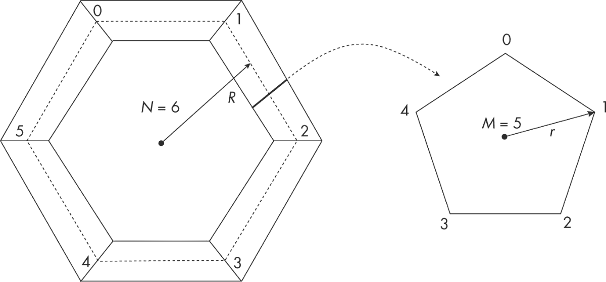

图 10-1：圆环渲染模型。简化的圆环在左侧，组成圆环的单个“环”在右侧。

图 10-1 的右侧显示了一个半径为*r*的环，并将其离散化为*M* = 5 个点。图 10-1 的左侧则展示了一个简单的环面，主半径为*R*，通过将*N* = 6 个离散化的环（标记为 0 到 5）围绕一个中心点排列来构建。（*主半径*是环面孔的中心到外环中心的距离。）不要担心图中环面的方块感，随着*N*和*M*值的增加，环面会变得更加平滑。

通过绘制带子连接相邻的环来填充环面。你将使用`GL_TRIANGLE_STRIP`原语来绘制这些带子，并且每个生命游戏模拟中的单元格将由带上的两个相邻三角形组成，这些三角形共同形成一个*四边形*。当单元格为开启状态时，你将其四边形涂成黑色，当单元格为关闭状态时，你将其四边形涂成白色。

为了计算环面的顶点，你首先需要为其定义一个坐标系。假设环面位于 XY 平面上，且以原点为中心，穿过环面中心的线与 z 轴对齐，如图 10-2 所示。

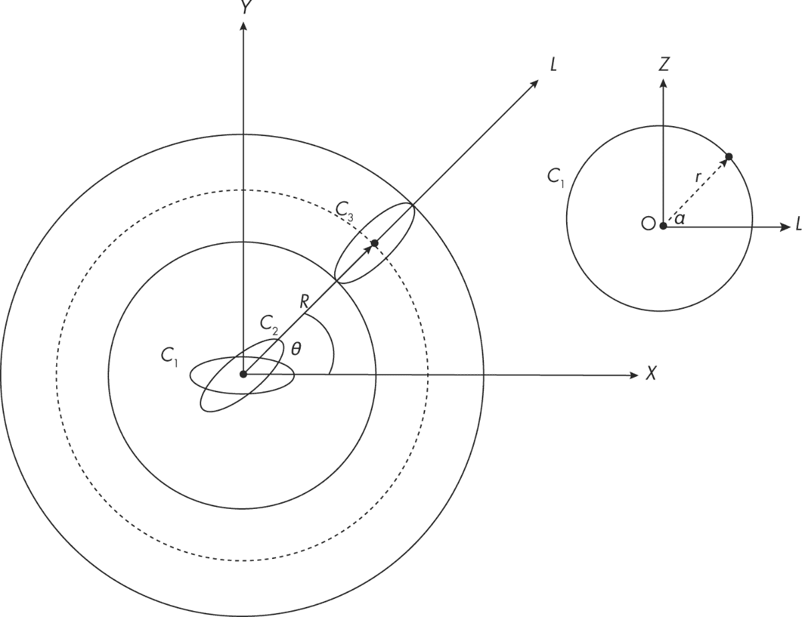

图 10-2：环面渲染策略

在与 x 轴成θ角度的环面上，圆*C*[3]的顶点可以按如下方式计算：

1.  1\. 计算 XZ 平面上圆*C*[1]的顶点，该圆的半径为*r*，并且圆心位于原点。

1.  将圆*C*[1]围绕 z 轴旋转θ角度。这会得到圆*C*[2]。

1.  3\. 将圆*C*[2]沿角度θ方向平移*R*的距离，得到位于环面正确位置的圆*C*[3]。

你可能还记得在第二章的陀螺图形项目中使用参数方程来定义一个圆。在这里我们将使用相同的概念。标记 XZ 平面上圆*C*[1]（半径为*r*，以原点为中心）周长的顶点由以下公式给出：

*P* = (*r* cos(α), 0, *r* sin(α))

这里，α是点*P*与 x 轴之间的角度。当α从 0 变化到 360 度（或 2π弧度）时，*P*点将形成一个圆。请注意，在前面的方程中，点的 y 坐标为零。这是可以预期的，因为圆位于 XZ 平面上。

现在你必须将这些点绕 z 轴旋转θ角度。此操作的旋转矩阵如下所示：

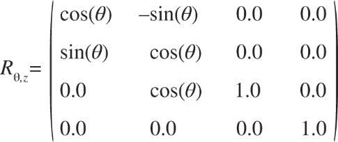

一旦旋转了这些点，你需要将它们平移到正确的位置。这是通过以下平移矩阵完成的。（该格式在第九章中有讨论。）

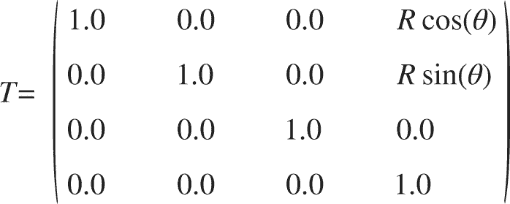

因此，环形体上的变换点由以下公式给出：

*P*ʹ = *T* × *R* [θ,Z] × *P*

这与以下内容相同：

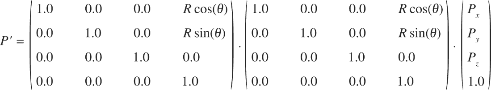

在前面的方程中，*P*首先与旋转矩阵相乘，这样它就能正确对齐，然后与平移矩阵相乘，这样“推动”点到达环面上的正确位置。注意，*P*使用*齐次*坐标（*x*，*y*，*z*，1.0）表示，这在上一章中有讨论。

### 计算光照法向量

为了让环面看起来更加美观，你需要对几何体应用光照，这意味着你需要计算前一节中计算的点*P*的*法向量*。表面上的光照取决于表面与入射光之间的方向，而方向可以通过法向量来量化，法向量是指在特定点上垂直于表面的向量。请查看图 10-3 以查看示例。

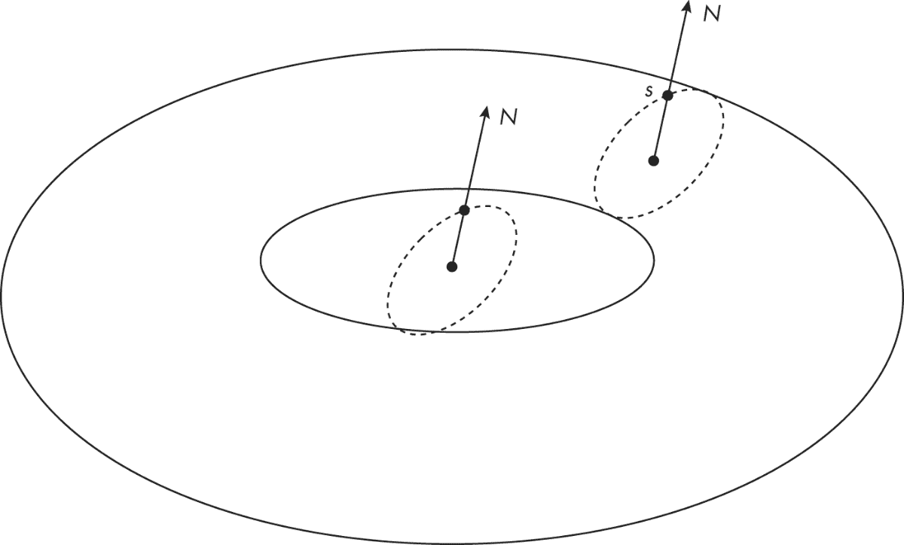

图 10-3：计算法向量

由于环面的几何形状，环上点*s*的法向量与连接点*s*和环中心的线方向相同。这意味着法向量与旋转后的点相同。平移矩阵不影响法向量的方向，因此你可以按如下方式计算法向量：

*N* = *R*[θ,Z] × *P*

请注意，你需要在进行任何光照计算之前*归一化*法向量。你可以通过将法向量除以其大小来实现这一点。

实际的光照将来自一个固定位置的单一光源。光照将在顶点着色器中定义。

### 渲染

现在你已经拥有了环面的顶点和法向量，接下来我们来讨论如何使用 OpenGL 渲染它。首先，你需要将环面划分成带状区域，如图 10-4 所示。每个带状区域是两个相邻环之间的区域。

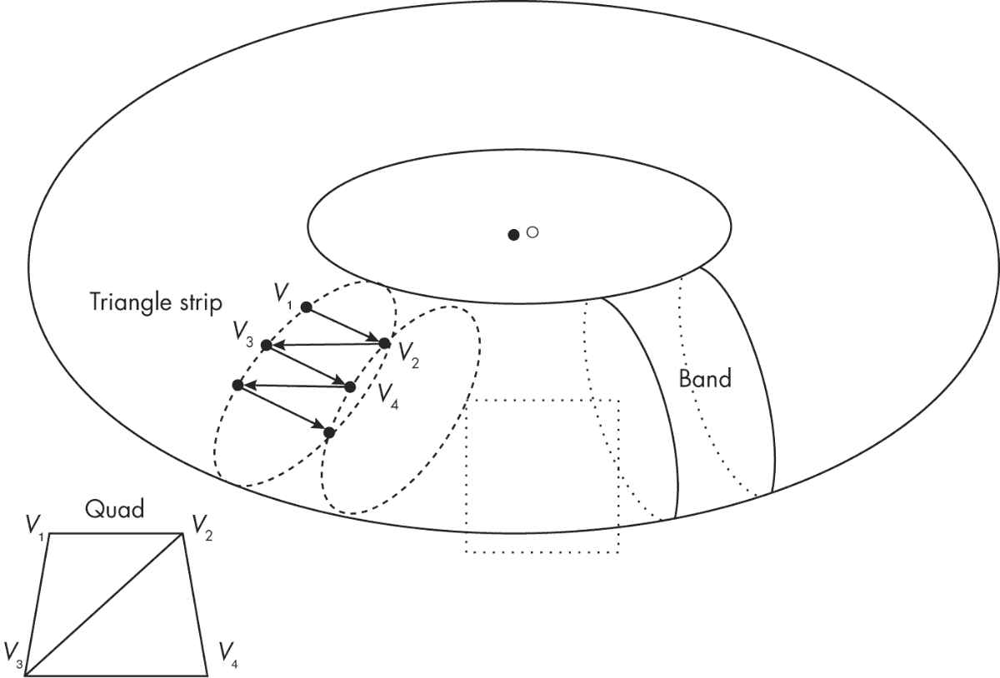

图 10-4：使用三角带渲染环面

每个带状区域都是使用 OpenGL 的`GL_TRIANGLE_STRIP`原语进行渲染的。除了构成环面的基础构件外，这些三角带还提供了一种方便的方式来创建“生命游戏”模拟网格：网格中的每个单元格由由两个相邻三角形组成的四边形表示。图 10-5 展示了环面中一个带状区域的详细信息。

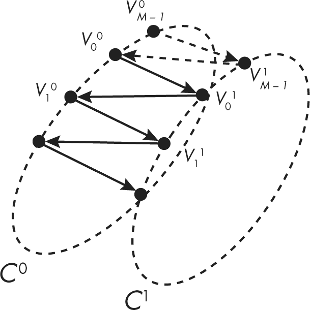

图 10-5：使用三角带渲染带状区域

该带状区域由相邻的*C*⁰和*C*¹环组成。每个环有*M*个顶点。构成该带状区域的三角带由*M*对顶点组成，顶点在两个环之间来回交错：

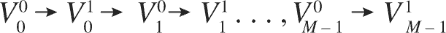

但还有一对额外的顶点需要添加：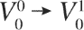。你需要重复前两个顶点来关闭带子末端的间隙。因此，形成该带子的三角形带中的顶点总数为 2 × *M* + 2。

图 10-5 中显示的带子是由环  组成的。圆环被分为 *N* 条带，其中 *N* 是环的数量：

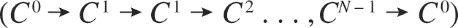

请注意，最后一条带子是如何通过回到第一个环来绕一圈的，*C*⁰。这意味着渲染圆环所需的顶点总数由 *N* × (2 × *M* + 2) 给出。你将在查看代码时看到更多实现的细节。

现在，让我们来看一下圆环的着色方案。

### 给三角形带着色

你需要单独为《生命游戏》模拟中的每个格子着色。你知道每个格子是一个四边形——由两个三角形组成，属于一个更大的三角形带。例如，顶点组成的四边形 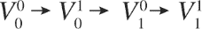 由两个三角形组成：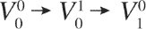 和 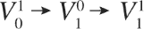。每个顶点都有一个对应的颜色，该颜色是一个三元组，形式为 (*r*, *g*, *b*)，表示红色、绿色和蓝色的分量。默认情况下，四边形中第一个顶点（在这种情况下是 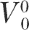）的颜色为四边形中第一个三角形设置颜色，而第二个顶点（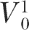）的颜色为四边形中第二个三角形设置颜色。只要你将这两种颜色设置为相同，你就能均匀地给四边形上色。我们将在查看代码时进一步讨论 OpenGL 的顶点颜色约定。

注意，OpenGL 函数 `glProvokingVertex()` 改变了哪一个颜色值被映射到顶点的约定。

### 控制相机

为了查看圆环，你需要创建一个围绕 3D 场景原点旋转的相机，并从上方以一定角度俯视。图 10-6 展示了相机的设置。

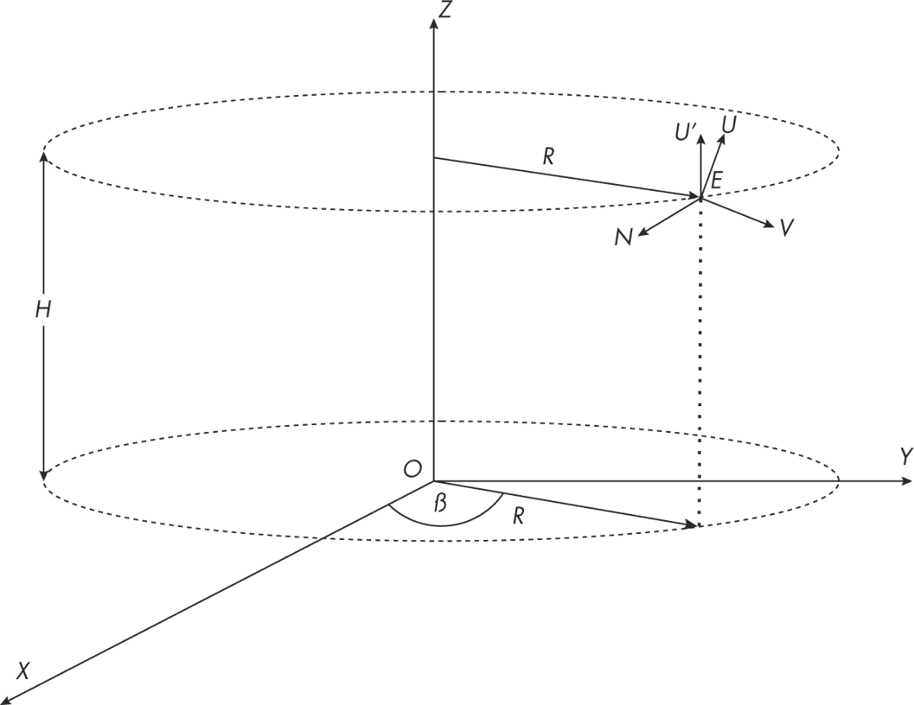

图 10-6：实现一个旋转相机

将相机视为点*E*，它被放置在一个半径为*R*，高度为*H*的圆柱体上，朝向原点*O*。相机由相互垂直的向量*V*、*U*和*N*定义，其中*V*是从*E*指向*O*的*视线向量*；*U*是相机的*上向量*；*N*是与*V*和*U*都垂直的向量。每个时间步，你会让相机沿着圆柱体的边缘以恒定的距离移动。这一运动由角度β来参数化，如图 10-6 所示。正如你在第九章中学到的，你使用`lookAt()`方法来设置视图，它接受三个参数：眼睛、中心和上向量。中心就是原点：(0, 0, 0)。眼睛的三维坐标为：

*E* = (*R* cos(β), *R* sin(β), *H*)

当相机沿着圆柱体的边缘移动时，它会始终朝向*O*，并且上向量*U*也会不断变化。要计算上向量*U*，首先从一个初始猜测*U*ʹ开始，它与 z 轴平行。然后找到*N*，即垂直于*U*ʹ和*V*所定义平面的向量。可以通过以下方式计算：

*N* = *V* × *U*ʹ

*N*由*V*和*U*ʹ的叉积给出。那么，如果你将*N*和*V*进行叉积，会发生什么呢？你将得到一个垂直于 NV 平面的向量，也就是你要找的上向量*U*！

*U* = *N* × *V* = (*V* × *U*ʹ) × *V*

一旦计算出*U*，请确保在使用之前将其标准化。完成后，你就可以用`lookAt()`方法来设置相机：*E*（眼睛）、*O*（中心）和*U*（上向量）。

### 将网格映射到环面

最后，让我们看看二维生命游戏的模拟网格是如何映射到三维环面上的，因为该网格具有环形边界条件。图 10-7 展示了这一映射。

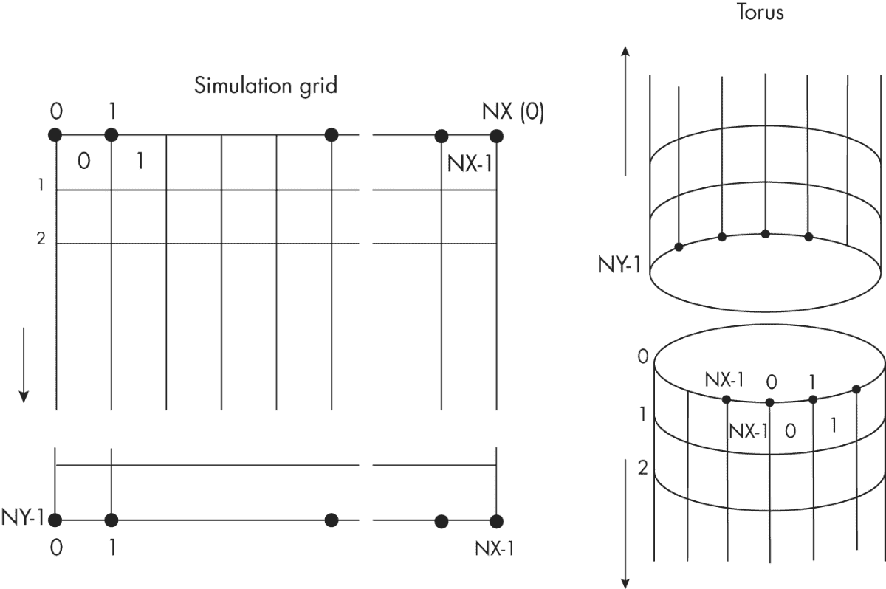

图 10-7：将模拟网格映射到环面

二维生命游戏网格有*NX*列和*NY*行。你可以在图的右侧看到，划分每一行的*NX*个点是如何绕着环面圆柱体的管道展开的。点的索引从 0 到*NX* − 1。下一个索引*NX*与 0 相同，因为存在绕回。y 方向也会发生类似的绕回，你有*NY*个单元格：索引为*NY*的点与索引为 0 的点相同。

你之前已经看到，每个环面环的离散化包含了*M*个点。为了将二维网格映射到环面，设置*NX* = *M*。类似地，设置*NY* = *N*，其中*N*是环面上的带数。

## 需求

我们将使用`PyOpenGL`和 GLFW 进行 OpenGL 渲染，正如在第九章中所示，并使用`numpy`进行矩阵/向量计算。

## 代码

该项目的代码分为多个文件：

torus.py 这个文件包含了环面几何计算和渲染代码。

gol.py 这个文件实现了康威的生命游戏，改编自第三章。

camera.py 这个文件包含了旋转相机的实现，用于查看环面。

gol_torus.py 这是主文件，用于设置 OpenGL 和 GLFW，并调用其他模块中的渲染代码。

完整的项目代码可以在线访问，链接：[`github.com/mkvenkit/pp2e/blob/main/gol_torus`](https://github.com/mkvenkit/pp2e/blob/main/gol_torus)。

### 渲染环面

我们将首先考虑渲染环面的代码，它封装在一个名为`Torus`的类中，定义在文件*torus.py*中。要查看完整的代码列表，请跳转到“完整的环面渲染代码”，见第 203 页。

#### 定义着色器

首先，定义环面的 GLSL 着色器。以下是顶点着色器，它获取每个顶点的属性（位置、颜色、法线）并计算传递给片段着色器的变换输入：

```py
strVS = """
# version 410 core
layout(location = 0) in vec3 aVert;
layout(location = 1) in vec3 aColor;
layout(location = 2) in vec3 aNormal;
uniform mat4 uMVMatrix;
uniform mat4 uPMatrix;
❶ flat out vec3 vColor;
❷ out vec3 vNormal;
❸ out vec3 fragPos;
void main() {
  // transform vertex
  gl_Position = uPMatrix * uMVMatrix * vec4(aVert, 1.0);
❹ fragPos = aVert;
  vColor = aColor;
  vNormal = aNormal;
}
"""

```

你将顶点着色器代码定义为一个存储在`strVS`中的字符串。着色器的属性变量有`aVert`、`aColor`和`aNormal`，分别表示每个顶点的坐标、颜色和法向量。注意在初始化`vColor`时使用了`flat`限定符，❶ 表示该变量在片段着色器中不会进行插值。实际上，我们是在说这个变量将在整个图元（一个三角形带中的三角形之一）上保持不变。这确保了每个“生命游戏”单元格将呈现单一颜色。这种类型的图元着色被称为*平面着色*。接下来的顶点着色器输出是`vNormal` ❷，默认情况下它将在片段着色器中进行插值。你需要这个输出，以便计算图元上的光照，但稍后你将看到如何修改这个着色器代码来支持平面着色。另一个输出叫做`fragPos` ❸。在主着色器代码中，你将这个输出设置为`aVert` ❹，以便将其传递到片段着色器进行光照计算。着色器还计算`gl_Position`，并将接收到的颜色和法线数据传递给片段着色器。

这是片段着色器，应用光照并计算片段的最终颜色。它作为另一个字符串定义，叫做`strFS`。

```py
strFS = """
# version 410 core
flat in vec3 vColor;
in vec3 vNormal;
in vec3 fragPos;
out vec4 fragColor;
void main() {
❶ vec3 lightPos = vec3(10.0, 10.0, 10.0);
❷ vec3 lightColor = vec3(1.0, 1.0, 1.0);
❸ vec3 lightDir = normalize(lightPos - fragPos);
  float diff = max(dot(vNormal, lightDir), 0.0);
  vec3 diffuse = diff * lightColor;
  float ambient = 0.1;
❹ vec3 result = (ambient + diffuse) * vColor.xyz;
  fragColor = vec4(result, 1.0);
}
"""

```

请注意，颜色、法线和片段位置变量，这些是顶点着色器的输出，现在作为片段着色器的输入。在主着色器代码中，你定义了光源的位置❶和颜色❷。接着你计算了光源的方向❸。最终的颜色❹是环境光和漫反射光的混合，并作为片段着色器的输出。

请记住，`fragPos`和`vNormal`是通过插值为每个片段计算的，而`vColor`对于给定的原语是常量。其净效果是，原语（在此情况下是三角形条带）的内在颜色保持不变，而感知到的颜色则根据原语相对于光源的朝向而变化。这正是你需要的效果，可以让每个生命游戏单元显示为固色，同时通过改变颜色来创建光照效果。

#### 初始化 Torus 类

现在让我们来看一下`Torus`类构造函数中的初始化代码：

```py
class Torus:
    """ OpenGL 3D scene class"""
    # initialization
  ❶ def __init__(self, R, r, NX, NY):
        global strVS, strFS
        # modify shader for flat shading
        # create shader
      ❷ self.program = glutils.loadShaders(strVS, strFS)
        glProvokingVertex(GL_FIRST_VERTEX_CONVENTION)
        self.pMatrixUniform = glGetUniformLocation(self.program,
                                                   b'uPMatrix')
        self.mvMatrixUniform = glGetUniformLocation(self.program,
                                                    b'uMVMatrix')
        # torus geometry
        self.R = R
        self.r = r
        # grid size
        self.NX = NX
        self.NY = NY
        # no. of points
      ❸ self.N = self.NX
        self.M = self.NY
        # time
        self.t = 0
        # compute parameters for glMultiDrawArrays
        M1 = 2*self.M + 2
      ❹ self.first_indices = [2*M1*i for i in range(self.N)]
        self.counts = [2*M1 for i in range(self.N)]
        # colors: {(i, j) : (r, g, b)}
        # with NX * NY entries
      ❺ self.colors_dict = self.init_colors(self.NX, self.NY)
        # create an empty array to hold colors
      ❻ self.colors = np.zeros((3*self.N*(2*self.M + 2), ), np.float32)
        # get vertices, normals, indices
      ❼ vertices, normals = self.compute_vertices()
      ❽ self.compute_colors()
        # set up vertex buffer objects
      ❾ self.setup_vao(vertices, normals, self.colors)

```

`Torus`类在其构造函数❶中包含以下参数：外环的半径`R`、圆环管道的半径`r`，以及`NX`和`NY`，分别表示生命游戏模拟单元在 x 和 y 方向上的数量。构造函数的首要任务是加载着色器。你使用在公共*glutils.py*文件中定义的`loadShaders()`方法❷。在接下来的几行代码中，你将传递给`Torus`构造函数的变量存储在实例变量中，例如`self.R`，以便可以在其他方法中访问。然后，你将外环圆上的点数`N`设置为`NX`，即 x 方向上的单元数❸。同样，你将圆环较小半径`r`上的点数`M`设置为`NY`。这个方案在“将网格映射到圆环”部分中进行了讨论。

接下来，你需要做一些额外的准备工作，以渲染将形成圆环外缘带状三角形条带的几何图形。你最终将使用`glMultiDrawArrays()` OpenGL 方法一次性渲染所有三角形条带。该方法是一种高效的方式，允许你通过一次函数调用绘制多个三角形条带原语。如在“渲染”部分所述，每个三角形条带有 2*M* + 2 个顶点，而你有*N*个这样的条带。因此，这些三角形条带的起始索引将是[0, (2*M* + 2), (2*M* + 2) × 2, . . . , (2*M* + 2) × *N*]。因此，你设置了`first_indices`和`counts`❹，它们将是调用`glMultiDrawArrays()`时需要的参数。

`init_colors()`方法❺初始化了`color_dict`，它将每个网格单元映射到一个颜色——黑色或白色。我们很快会详细讲解`init_colors()`方法的内容。你将`numpy`数组`colors`初始化为零❻。稍后，你会将正确的值填充到这个数组中。你通过计算圆环的顶点和法线❼，以及颜色❽，并设置顶点数组对象（VAO）来渲染圆环❾，来结束构造函数。

现在，让我们来看一下刚刚提到的`Torus`类中的`init_colors()`方法：

```py
def init_colors(self, NX, NY):
    """initialize color dictionary"""
    colors = {}
    c1 = [1.0, 1.0, 1.0]
    for i in range(NX):
        for j in range(NY):
          ❶ colors[(i, j)] = c1
    return colors

```

`init_colors()`方法创建了一个名为`colors`的字典，映射从仿真单元索引（*i*, *j*）到应应用于该单元的颜色。首先，你将所有单元的颜色值设置为`c1`，即纯白色❶。随着生命游戏仿真进展，字典中的值将被更新，以开启或关闭单元格。

#### 计算顶点

接下来几个方法将一起工作，用来计算所有圆环的顶点。我们从`compute_vertices()`方法开始：

```py
def compute_vertices(self):
        R, r, N, M = self.R, self.r, self.N, self.M
        # create an empty array to hold vertices/normals
        vertices = []
        normals = []
        for i in range(N):
            # for all M points around a ring
            for j in range(M+1):
                # compute angle theta of point
              ❶ theta = (j % M) *2*math.pi/M
                #---ring #1------
                # compute angle
              ❷ alpha1 = i*2*math.pi/N
                # compute transforms
              ❸ RM1, TM1 = self.compute_rt(R, alpha1)
                # compute points
              ❹ Pt1, NV1 = self.compute_pt(r, theta, RM1, TM1)
                #---ring #2------
                # index of next ring
              ❺ ip1 = (i + 1) % N
                # compute angle
              ❻ alpha2 = ip1*2*math.pi/N
                # compute transforms
                RM2, TM2 = self.compute_rt(R, alpha2)
                # compute points
                Pt2, NV2 = self.compute_pt(r, theta, RM2, TM2)
                # store vertices/normals in right order for GL_TRIANGLE_STRIP
              ❼ vertices.append(Pt1[0:3])
                vertices.append(Pt2[0:3])
                # add normals
                normals.append(NV1[0:3])
                normals.append(NV2[0:3])
        # return vertices and colors in correct format
      ❽ vertices = np.array(vertices, np.float32).reshape(-1)
        normals = np.array(normals, np.float32).reshape(-1)
        # print(vertices.shape)
        return vertices, normals

```

`compute_vertices()`方法首先创建空列表来存储顶点和法线。然后，你通过使用嵌套循环来实现我们在“渲染”部分讨论的策略，来计算圆环的顶点和法线。外层循环遍历构成圆环的`N`个环。内层循环遍历每个环上的`M`个点。在循环内部，你首先计算角度`theta`，它是索引`j`的环上某一点所形成的角度❶。你使用`j % M`，并让内层循环遍历范围`[0, M+1)`，这样当*j*等于`M`时，`(j % M)`就会回到`0`。这是为了完成圆环的最后一个部分。

圆环以一组带（平面三角带）呈现，每个带由两个相邻的圆环组成。你计算`alpha1`，即带中第一个环的角度，它在索引`i`处❷，然后使用`alpha1`通过`compute_rt()`方法计算这个第一个环的旋转和位移矩阵❸。接着，你将这些矩阵传递给`compute_pt()`方法，以计算角度`theta`处环上点的顶点和法线❹。我们稍后将了解`compute_rt()`和`compute_pt()`方法的具体实现。

接下来，你需要移动到索引为`i+1`的相邻环，使用`ip1 = (i+1) % N`来确保在结束时回到零❺。你计算索引`ip1`处环的角度`alpha2`❻，然后像对待第一个环一样，计算`ip1`环上角度`theta`处的顶点和法线。

从❼开始，你将相邻圆环的顶点和法线附加到方法开始时创建的列表中。你只选择每个顶点和法线的前三个坐标，如`Pt1[0:3]`，因为所有矩阵变换都使用齐次坐标（*x*, *y*, *z*, *w*）形式进行，并且只需要(*x*, *y*, *z*)。此操作将顶点和法线存储为一个 Python 列表，列表中的元素是`[[x1, y1, z1], [x2, y2, z2], ...]`格式的三元组。然而，OpenGL 期望顶点属性以已知大小的扁平数组提供。因此，你将`vertices`和`normals`列表转换为 32 位浮点数的`numpy`数组❽，并使用`reshape(-1)`确保它们是扁平数组，形式为`[x1, y1, z1, x2, y2, z2, ...]`。

现在让我们来看一下帮助你计算顶点和法线的`compute_rt()`和`compute_pt()`方法。我们将从`compute_rt()`开始，它计算渲染圆环所需的旋转和平移矩阵：

```py
def compute_rt(self, R, alpha):
        # compute position of ring
      ❶ Tx = R*math.cos(alpha)
        Ty = R*math.sin(alpha)
        Tz = 0.0
        # rotation matrix
      ❷ RM = np.array([
            [math.cos(alpha), -math.sin(alpha), 0.0, 0.0],
            [math.sin(alpha), math.cos(alpha), 0.0, 0.0],
            [0.0, 0.0, 1.0, 0.0],
            [0.0, 0.0, 0.0, 1.0]
            ], dtype=np.float32)
        # translation matrix
      ❸ TM = np.array([
            [1.0, 0.0, 0.0, Tx],
            [0.0, 1.0, 0.0, Ty],
            [0.0, 0.0, 1.0, Tz],
            [0.0, 0.0, 0.0, 1.0]
            ], dtype=np.float32)
        return (RM, TM)

```

你首先使用参数方程计算矩阵的平移分量❶。然后，你创建旋转矩阵❷和平移矩阵❸，作为`numpy`数组。你在“计算顶点”部分见过这些矩阵。你在方法结束时返回这些数组。

这是另一个辅助方法`compute_pt()`，它使用平移和旋转矩阵来确定圆环上某个点的顶点和法向量：

```py
def compute_pt(self, r, theta, RM, TM):
    # compute point coords
  ❶ P = np.array([r*math.cos(theta), 0.0, r*math.sin(theta), 1.0],
                 dtype=np.float32)
    # print(P)
    # apply rotation - this also gives us the vertex normals
  ❷ NV = np.dot(RM, P)
    # apply translation
  ❸ Pt = np.dot(TM, NV)
    return (Pt, NV)

```

你计算圆环上角度为`theta`的点`P`，该点位于 XZ 平面❶上。然后，你通过将其与旋转矩阵❷相乘来对该点进行旋转。这也给出了该点的法向量。你将法向量与平移矩阵相乘，得到圆环上的顶点❸。

#### 管理单元格颜色

现在我们来看看一些有助于设置圆环上单元格颜色的方法。首先是`compute_colors()`方法，我们最初在`Torus`类的构造函数中调用过。它根据“生命游戏”模拟确定的值，设置组成圆环的三角带中每个三角形的颜色。

```py
def compute_colors(self):
    R, r, N, M = self.R, self.r, self.N, self.M
    # the points on the ring are generated on the X-Z plane
    # then they are rotated and translated into the correct
    # position on the torus
    # for all N rings around the torus
    for i in range(N):
        # for all M points around a ring
        for j in range(M+1):
            # j value
            jj = j % M
            # store colors - same color applies to (V_i_j, V_ip1_j)
          ❶ col = self.colors_dict[(i, jj)]
            # get index into array
          ❷ index = 3*(2*i*(M+1) + 2*j)
            # set color
          ❸ self.colors[index:index+3] = col
          ❹ self.colors[index+3:index+6] = col

```

该方法遵循在“为三角形条纹着色”中描述的逻辑，在第 185 页更新`colors`数组中的值，该数组初始化为全零的数组。你从`colors_dict`中获取单元格`(i, jj)`的颜色，`colors_dict`是你之前创建的将单元格与颜色映射的字典❶。（你定义`jj = j % M`，使其在结束时回滚为零。）然后你计算应更新新计算值的`colors`数组中的索引❷。组成带的每对环有`2*(M+1)`个顶点，且共有`N`对这些环。从数组中的每个位置开始，你存储三个连续的值（单元格颜色的 RGB 分量）。因此，环中第*j*个颜色在*第 i*段圆环中的索引将由`3*(2*i*(M+1) + 2*j)`给出。注意，在计算索引时你使用的是`j`而非`jj`，因为你在此处存储的是计算出的值，不希望索引回滚为零。现在你得到了索引，你就可以用新的计算值更新`colors`数组。你同时在`[index:index+3]`❸和`[index+3:index+6]`❹处更新该数组，因为圆环上的每个单元格是一个四边形，由两个相邻的三角形组成。

现在让我们来看一下`recalc_colors()`方法，这是在生命游戏模拟的每一步更新 GPU 上存储的颜色值的方法：

```py
def recalc_colors(self):
    # get colors
    self.compute_colors()
    # bind VAO
    glBindVertexArray(self.vao)
    glBindBuffer(GL_ARRAY_BUFFER, self.colorBuffer)
    # set buffer data
  ❶ glBufferSubData(GL_ARRAY_BUFFER, 0, 4*len(self.colors), self.colors)
    # unbind VAO
    glBindVertexArray(0)

```

在每一步模拟中，单元格的颜色都会更新，这意味着你需要更新圆环上所有三角形条纹的颜色，并且你需要高效地完成这一操作，以免拖慢渲染速度。`recalc_colors()`方法通过使用 OpenGL 的`glBufferSubData()`方法❶来完成这一操作。顶点、法线和颜色被存储在 GPU 上的属性数组中。由于顶点和法线不会变化，因此你只需在开始时通过调用类构造方法中的`compute_vertices()`计算一次。当颜色发生变化时，`glBufferSubData()`会更新颜色属性数组，而不是重新创建它们。

#### 绘制圆环

最后，这是绘制圆环的`render()`方法：

```py
def render(self, pMatrix, mvMatrix):
    # use shader
  ❶ glUseProgram(self.program)
    # set proj matrix
  ❷ glUniformMatrix4fv(self.pMatrixUniform, 1, GL_FALSE, pMatrix)
    # set modelview matrix
  ❸ glUniformMatrix4fv(self.mvMatrixUniform, 1, GL_FALSE, mvMatrix)
    # bind VAO
  ❹ glBindVertexArray(self.vao)
    # draw
  ❺ glMultiDrawArrays(GL_TRIANGLE_STRIP, self.first_indices,
                      self.counts, self.N)
    # unbind VAO
    glBindVertexArray(0)

```

该方法类似于你在上一章中看到的渲染方法。你首先调用使用着色器程序❶，并设置投影❷和模型视图❸矩阵的统一变量。然后，你绑定到顶点数组对象❹，这是你通过在类的构造函数中调用`setup_vao()`创建的。VAO 包含了你所需的所有属性数组缓冲区。接下来，你使用`glMultiDrawArrays()`方法绘制`N`个三角形条纹❺。你已经在`Torus`构造函数中计算了`first_indices`和`counts`。

### 实现生命游戏模拟

在第三章中，你通过使用`matplotlib`来可视化更新后的模拟网格值，来实现了康威的《生命游戏》(GOL)。在这里，你将之前的实现改编为更新单元格颜色的字典，而不是更新网格值，该字典将用于更新环面的颜色。相关代码封装在一个名为`GOL`的类中，该类在文件*gol.py*中声明。要查看完整的代码清单，请跳到“完整的生命游戏模拟代码”在第 209 页。

#### 类的构造函数

首先，让我们看一下`GOL`类的构造函数：

```py
class GOL:
  ❶ def __init__(self, NX, NY, glider):
        """GOL constructor"""
        # a grid of NX x NY random values
        self.NX, self.NY = NX, NY
        if glider:
          ❷ self.addGlider(1, 1, NX, NY)
        else:
          ❸ self.grid = np.random.choice([1, 0], NX * NY,
                                         p=[0.2, 0.8]).reshape(NX, NY)

```

`GOL`构造函数接受网格尺寸`NX`和`NY`作为输入，以及一个布尔标志`glider`❶。如果设置了该标志，你将使用`addGlider()`方法❷初始化带有“滑翔机”图案的模拟网格。由于我们已经在第三章中讨论了此方法，这里不再详细说明。如果没有设置`glider`标志，你将只初始化一个随机的零和一的网格❸。

`GOL`类使用`update()`方法在每个时间步更新模拟网格。同样，这与之前的实现完全相同。

#### `get_colors()` 方法

`get_colors()` 方法是本章《生命游戏》实现与第三章的不同之处。该方法构建了一个字典，将每个《生命游戏》单元格映射到模拟中某一步的颜色值：开启时为黑色，关闭时为白色。这个字典将在场景更新时传递给`Torus`对象。

```py
def get_colors(self):
    colors = {}
  ❶ c1 = np.array([1.0, 1.0, 1.0], np.float32)
  ❷ c2 = np.array([0.0, 0.0, 0.0], np.float32)
    for i in range(self.NX):
        for j in range (self.NY):
            if self.grid[i, j] == 1:
                colors[(i, j)] = c2
            else :
                colors[(i, j)] = c1
    return colors

```

在这里，你遍历模拟网格中的所有单元格，并根据网格值是`0`还是`1`来设置 RGB 颜色。可能的颜色定义为`c1`表示白色❶，`c2`表示黑色❷。这些颜色将在渲染环面时使用。

### 创建相机

在“控制相机”中，位于第 185 页，我们讨论了如何构建一个环绕环面旋转的相机。现在让我们来看一下其实现。代码封装在名为`OrbitCamera`的类中，该类在文件*camera.py*中声明。要查看完整的代码清单，请跳到“完整的相机代码”在第 211 页。

#### 构造类

这是`OrbitCamera`类的构造函数：

```py
class OrbitCamera:
    """helper class for viewing"""
    def __init__(self, height, radius, beta_step=1):
      ❶ self.radius = radius
      ❷ self.beta = 0
      ❸ self.beta_step = beta_step
      ❹ self.height = height
        # initial eye vector is (-R, 0, -H)
        rr = radius/math.sqrt(2.0)
      ❺ self.eye = np.array([rr, rr, height], np.float32)
        # compute up vector
      ❻ self.up = self.__compute_up_vector(self.eye )
        # center is origin
      ❼ self.center = np.array([0, 0, 0], np.float32)

```

你首先设置传递给`OrbitCamera`构造函数的相机参数。这些参数包括相机的轨道半径❶和`beta`，即视角向量（投影在 XY 平面上）与 x 轴的夹角❷。你还设置`beta`在每个相机旋转时间步长中的增量❸以及相机距离 XY 平面的高度❹。

接下来，你将眼睛位置的初始值设置为位于正 x 轴和正 y 轴之间的中点，距离原点 `R`，并悬停在指定的 `height` 处 ❺。你可以通过以下公式计算出这个位置：

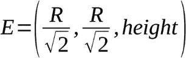

最后，你计算相机的向上向量 ❻ 并将中心设置为原点 (0, 0, 0) ❼。请记住，这些信息是 OpenGL 在模拟相机时所需要的，连同眼睛位置一起。

#### 计算向上向量

这是你在 `OrbitCamera` 类的构造函数中调用的方法，用于计算向上向量：

```py
def __compute_up_vector(self, E):
    # N = (E x k) x E
    Z = np.array([0, 0, 1], np.float32)
  ❶ U = np.cross(np.cross(E, Z), E)
    # normalize
  ❷ U = U / np.linalg.norm(U)
    return U

```

`__compute_up_vector()` 方法根据我们在 “控制相机” 中讨论的方式，计算出向上向量 `U`，该内容位于 第 185 页。具体来说，你通过叉积运算和初始的向上向量猜测值 (0, 0, 1) 来计算正确的向上向量 ❶。然后，在返回之前，你对向上向量 ❷ 进行归一化处理。

#### 旋转相机

每次你需要围绕圆环旋转相机一步时，都会调用 `OrbitCamera` 类的 `rotate()` 方法。以下是该方法的定义：

```py
def rotate(self):
    """rotate by one step and compute new camera parameters"""
  ❶ self.beta = (self.beta + self.beta_step) % 360
    # recalculate eye E
  ❷ self.eye = np.array([self.radius*math.cos(math.radians(self.beta)),
                         self.radius*math.sin(math.radians(self.beta)),
                         self.height], np.float32)
    # up vector
  ❸ self.up = self.__compute_up_vector(self.eye)

```

你通过增加增量 `beta_step` 来增加角度 `beta`，并使用 `%` 运算符确保当角度达到 360 度时会回绕到 0 ❶。然后，你使用新的 `beta` 值来计算更新后的眼睛位置 ❷，并用新的眼睛位置来通过 `__compute_up_vector()` 方法计算新的向上向量 ❸。

### 将一切组合在一起

你已经构建了渲染圆环所需的所有类。现在，你需要一些代码将这些类连接起来，创建和管理 OpenGL 窗口，并协调渲染的对象。为此，创建 `RenderWindow` 类（定义在 *gol_torus.py* 中）。它类似于 第九章 中使用的 `RenderWindow` 类，因此我们只讨论与当前项目独特的代码部分。要查看完整的代码清单，请跳至 “完整的 RenderWindow 代码” 在 第 211 页。

#### main() 函数

在我们检查 `RenderWindow` 类之前，先来看一下程序的 `main()` 函数，它启动了整个仿真。这个函数也定义在 *gol_torus.py* 中。

```py
def main():
    print("Starting GOL. Press ESC to quit.")
    # parse arguments
    parser = argparse.ArgumentParser(description="Runs Conway's Game of Life
                                     simulation on a Torus.")
    # add arguments
  ❶ parser.add_argument('--glider', action='store_true', required=False)
    args = parser.parse_args()
    glider = False
    if args.glider:
      ❷ glider = True
  ❸ rw = RenderWindow(glider)
  ❹ rw.run()

```

你添加了一个名为 `--glider` 的命令行参数，这样你就可以通过仅带有滑翔模式的圆环来启动 ❶，并设置相应的标志 ❷。然后你创建一个 `RenderWindow` 对象 ❸，它初始化了程序所需的所有其他对象，并通过调用 `RenderWindow` 对象的 `run()` 方法 ❹ 来启动渲染。

#### RenderWindow 构造函数

`RenderWindow`类的构造函数以你在第九章中看到的标准 GLFW OpenGL 设置开始，包括设置窗口大小、调用渲染方法以及处理窗口和键盘事件。然后，构造函数继续进行以下生命游戏（Game of Life）特定的初始化：

```py
class RenderWindow:
    def __init__(self, glider):
    --`snip`--
       # create 3D
        NX = 64
        NY = 64
        R = 4.0
        r = 1.0
      ❶ self.torus = Torus(R, r, NX, NY)
      ❷ self.gol = GOL(NX, NY, glider)
        # create a camera
      ❸ self.camera = OrbitCamera(5.0, 10.0)
        # exit flag
      ❹ self.exitNow = False
      # rotation flag
      ❺ self.rotate = True
        # skip count
      ❻ self.skip = 0

```

首先，你为模拟设置一些参数，包括网格中细胞的数量以及环面的内外半径。然后，你使用这些参数❶创建`Torus`对象，并创建将管理模拟的`GOL`对象❷。你还创建了一个环绕相机，距离原点 5 个单位，距离 XY 平面 10 个单位❸。

接下来，你设置退出标志以退出程序❹，并将旋转标志初始化为`True`❺。最后，你设置一个`skip`变量❻，它将用于控制模拟更新的频率。你将在本节后面看到`skip`变量是如何工作的。

#### `run()`和`step()`方法

`RenderWindow`对象的`run()`方法负责运行模拟，并借助`step()`方法。我们首先来看一下`run()`方法：

```py
def run(self):
    # initializer timer
    glfw.glfwSetTime(0)
    t = 0.0
  ❶ while not glfw.glfwWindowShouldClose(self.win) and not self.exitNow:
        # update every x seconds
        currT = glfw.glfwGetTime()
      ❷ if currT - t > 0.05:
            # update time
            t = currT
            # set viewport
          ❸ self.width, self.height = glfw.glfwGetFramebufferSize(self.win)
            self.aspect = self.width/float(self.height)
            glViewport(0, 0, self.width, self.height)
            # clear
            glClear(GL_COLOR_BUFFER_BIT | GL_DEPTH_BUFFER_BIT)
            # build projection matrix
            pMatrix = glutils.perspective(60.0, self.aspect, 0.1, 100.0)
            mvMatrix = glutils.lookAt(self.camera.eye, self.camera.center,
                                      self.camera.up)
            # render
          ❹ self.torus.render(pMatrix, mvMatrix)
            # step
          ❺ if self.rotate:
                self.step()
            glfw.glfwSwapBuffers(self.win)
            # poll for and process events
            glfw.glfwPollEvents()
    # end
    glfw.glfwTerminate()

```

渲染方案的设计是保持渲染帧循环，直到窗口关闭或按下 ESC 键❶。在继续之前，你会检查自上次渲染以来是否经过了超过 0.05 秒❷。这有助于维持最大帧率。从❸开始，你执行一些标准的 OpenGL 操作，比如设置视口、清除屏幕以及计算需要设置到顶点着色器中的当前变换。然后，你渲染环面❹并调用`step()`方法❺，它会旋转相机并更新生命游戏模拟一步。渲染完成后，你交换 OpenGL 缓冲区并轮询进一步的窗口事件。如果退出循环，你会调用`glfwTerminate()`方法进行清理。

这是`step()`方法，它会增加相机和模拟的步进：

```py
def step(self):
  ❶ if self.skip == 9:
        # update GOL
      ❷ self.gol.update()
      ❸ colors = self.gol.get_colors()
      ❹ self.torus.set_colors(colors)
        # step
      ❺ self.torus.step()
        # reset
      ❻ self.skip = 0
    # update skip
  ❼ self.skip += 1
    # rotate camera
  ❽ self.camera.rotate()

```

每次调用此方法时，它会将相机旋转一步❽。你还想更新生命游戏模拟，但以相同的速度更新模拟与相机的移动相比视觉效果会不太理想。因此，你使用`skip`变量来将模拟的速度减慢到相对于相机运动的 1/9。该变量从`0`开始，每次调用`step()`方法时递增❼。当`skip`达到`9`❶时，你将更新模拟的时间步长。为此，你首先调用`GOL`类的`update()`方法❷，该方法根据康威的生命游戏规则打开或关闭细胞。然后，你从模拟中获取更新后的细胞颜色❸，将它们设置到环面（torus）❹中，并调用`torus.step()`❺，这将更新属性缓冲区中的新颜色。最后，你将`skip`变量重置为`0`，以便该过程可以重复❻。

## 运行 3D 生命游戏模拟

现在我们准备好运行代码了。在终端中输入以下内容：

```py
$ `python gol_torus.py`

```

图 10-8 展示了输出结果。

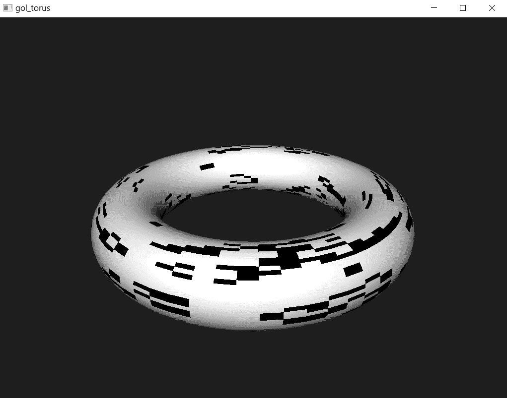

图 10-8：环面上的生命游戏渲染

程序会打开一个窗口，显示你精心构建的环面，并在其表面运行生命游戏模拟！随着模拟的演变，试着找到你在第三章中看到的一些熟悉的生命游戏模式。注意，光照方向保持不变，而摄像头绕环面旋转。当摄像头转动时，你将能够看到环面的明暗部分。

现在让我们尝试一下滑行器选项：

```py
$ `python gol_torus.py --glider`

```

图 10-9 展示了输出结果。

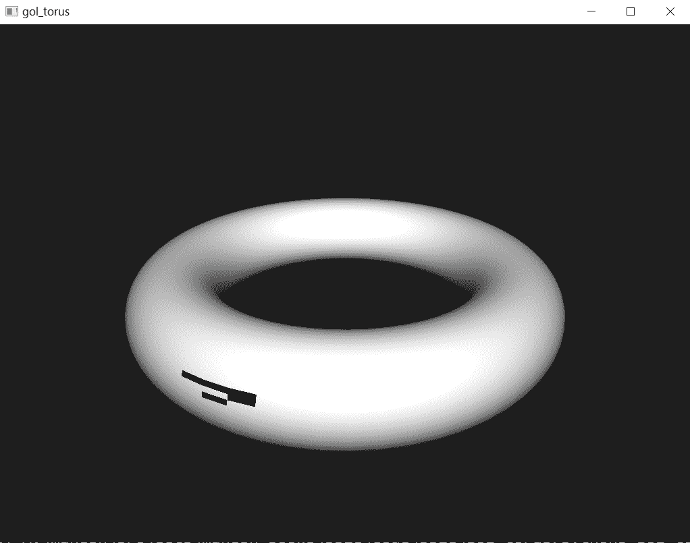

图 10-9：环面上的生命游戏滑行器

放轻松，享受观看孤独的滑行器在环面表面上移动吧！

## 摘要

在本章中，你实现了康威生命游戏在环面上的运行。你学习了如何计算环面的顶点，如何使用 OpenGL 渲染它，并且你看到了代码如何从一个上下文（生命游戏模拟的平面渲染）适配到另一个上下文（同一模拟的 3D 渲染）。在这个过程中，我希望你对我们在第三章讨论的环面边界条件有了更直观的理解。

## 实验！

这是你可以尝试的一些实验：

1.  1. 在本章的实现中，环面由一个光源照亮。尝试在着色器代码中添加另一个光源。现在，计算得到的顶点颜色将是两个光源贡献的总和。尝试改变光源的位置和颜色，看看它们对环面照明的影响。

1.  2. 为了获得模拟的代表性视图，你定义了一个围绕环面 z 轴旋转的摄像头，摄像头运动在一个与 XY 平面平行的平面上。现在，创建一个摄像头，让它飞越环面。你的摄像头将从负 z 轴方向向下看环面，并沿 XZ 平面以固定的距离绕着环面的中心旋转。思考一下如何计算每一步运动的眼点、视线方向和上向量。

## 完整的环面渲染代码

这里是文件*torus.py*的完整代码列表：

```py
"""
torus.py
A Python OpenGL program that generates a torus.
Author: Mahesh Venkitachalam
"""
import OpenGL
from OpenGL.GL import *
import numpy as np
import math, sys, os
import glutils
import glfw
strVS = """
# version 330 core
layout(location = 0) in vec3 aVert;
layout(location = 1) in vec3 aColor;
layout(location = 2) in vec3 aNormal;
uniform mat4 uMVMatrix;
uniform mat4 uPMatrix;
flat out vec3 vColor;
out vec3 vNormal;
out vec3 fragPos;
void main() {
  // transform vertex
  gl_Position = uPMatrix * uMVMatrix * vec4(aVert, 1.0);
  fragPos = aVert;
  vColor = aColor;
  vNormal = aNormal;
}
"""
strFS = """
# version 330 core
flat in vec3 vColor;
in vec3 vNormal;
in vec3 fragPos;
out vec4 fragColor;
void main() {
  vec3 lightPos = vec3(10.0, 10.0, 10.0);
  vec3 lightColor = vec3(1.0, 1.0, 1.0);
  vec3 lightDir = normalize(lightPos - fragPos);
  float diff = max(dot(vNormal, lightDir), 0.0);
  vec3 diffuse = diff * lightColor;
  float ambient = 0.1;
  vec3 result = (ambient + diffuse) * vColor.xyz;
  fragColor = vec4(result, 1.0);
}
"""
class Torus:
    """ OpenGL 3D scene class"""
    # initialization
    def __init__(self, R, r, NX, NY):
        global strVS, strFS
        # create shader
        self.program = glutils.loadShaders(strVS, strFS)
        glProvokingVertex(GL_FIRST_VERTEX_CONVENTION)
        self.pMatrixUniform = glGetUniformLocation(self.program,
                                                   b'uPMatrix')
        self.mvMatrixUniform = glGetUniformLocation(self.program,
                                                    b'uMVMatrix')
        # torus geometry
        self.R = R
        self.r = r
        # grid size
        self.NX = NX
        self.NY = NY
        # no. of points
        self.N = self.NX
        self.M = self.NY
        # time
        self.t = 0
        # compute parameters for glMultiDrawArrays
        M1 = 2*self.M + 2
        self.first_indices = [2*M1*i for i in range(self.N)]
        self.counts = [2*M1 for i in range(self.N)]
        # colors: {(i, j) : (r, g, b)}
        # with NX * NY entries
        self.colors_dict = self.init_colors(self.NX, self.NY)
        # create an empty array to hold colors
        self.colors = np.zeros((3*self.N*(2*self.M + 2), ), np.float32)
        # get vertices, normals, indices
        vertices, normals = self.compute_vertices()
        self.compute_colors()
        # set up vertex buffer objects
        self.setup_vao(vertices, normals, self.colors)
    def init_colors(self, NX, NY):
        """initialize color dictionary"""
        colors = {}
        c1 = [1.0, 1.0, 1.0]
        for i in range(NX):
            for j in range (NY):
                colors[(i, j)] = c1
        return colors
    def compute_rt(self, R, alpha):
        # compute position of ring
        Tx = R*math.cos(alpha)
        Ty = R*math.sin(alpha)
        Tz = 0.0
        # rotation matrix
        RM = np.array([
            [math.cos(alpha), -math.sin(alpha), 0.0, 0.0],
            [math.sin(alpha), math.cos(alpha), 0.0, 0.0],
            [0.0, 0.0, 1.0, 0.0],
            [0.0, 0.0, 0.0, 1.0]
            ], dtype=np.float32)
        # translation matrix
        TM = np.array([
            [1.0, 0.0, 0.0, Tx],
            [0.0, 1.0, 0.0, Ty],
            [0.0, 0.0, 1.0, Tz],
            [0.0, 0.0, 0.0, 1.0]
            ], dtype=np.float32)
        return (RM, TM)
    def compute_pt(self, r, theta, RM, TM):
        # compute point coords
        P = np.array([r*math.cos(theta), 0.0, r*math.sin(theta), 1.0],
                     dtype=np.float32)
        # print(P)
        # apply rotation - this also gives us the vertex normals
        NV = np.dot(RM, P)
        # normalize
        # NV = NV / np.linalg.norm(NV)
        # apply translation
        Pt = np.dot(TM, NV)
        return (Pt, NV)
    def compute_vertices(self):
        """compute vertices for the torus
           returns np float32 array of n coords (x, y, z): shape (3*n, )
        """
        R, r, N, M = self.R, self.r, self.N, self.M
        # create an empty array to hold vertices/normals
        vertices = []
        normals = []
        # the points on the ring are generated on the X-Z plane
        # then they are rotated and translated into the correct
        # position on the torus
        # for all N rings around the torus
        for i in range(N):
            # for all M points around a ring
            for j in range(M+1):
                # compute angle theta of point
                theta = (j % M) *2*math.pi/M
                #---ring #1------
                # compute angle
                alpha1 = i*2*math.pi/N
                # compute transforms
                RM1, TM1 = self.compute_rt(R, alpha1)
                # compute points
                Pt1, NV1 = self.compute_pt(r, theta, RM1, TM1)
                #---ring #2------
                # index of next ring
                ip1 = (i + 1) % N
                # compute angle
                alpha2 = ip1*2*math.pi/N
                # compute transforms
                RM2, TM2 = self.compute_rt(R, alpha2)
                # compute points
                Pt2, NV2 = self.compute_pt(r, theta, RM2, TM2)
                # store vertices/normals in right order for GL_TRIANGLE_STRIP
                vertices.append(Pt1[0:3])
                vertices.append(Pt2[0:3])
                # add normals
                normals.append(NV1[0:3])
                normals.append(NV2[0:3])
        # return vertices and colors in correct format
        vertices = np.array(vertices, np.float32).reshape(-1)
        normals = np.array(normals, np.float32).reshape(-1)
        # print(vertices.shape)
        return vertices, normals
    def compute_colors(self):
        """compute vertices for the torus
           returns np float32 array of n coords (x, y, z): shape (3*n, )
        """
        R, r, N, M = self.R, self.r, self.N, self.M
        # the points on the ring are generated on the X-Z plane
        # then they are rotated and translated into the correct
        # position on the torus
        # for all N rings around the torus
        for i in range(N):
            # for all M points around a ring
            for j in range(M+1):
                # j value
                jj = j % M
                # store colors - same color applies to (V_i_j, V_ip1_j)
                col = self.colors_dict[(i, jj)]
                # get index into array
                index = 3*(2*i*(M+1) + 2*j)
                # set color
                self.colors[index:index+3] = col
                self.colors[index+3:index+6] = col
    def setup_vao(self, vertices, normals, colors):
        # set up vertex array object (VAO)
        self.vao = glGenVertexArrays(1)
        glBindVertexArray(self.vao)
        # --------
        # vertices
        # --------
        self.vertexBuffer = glGenBuffers(1)
        glBindBuffer(GL_ARRAY_BUFFER, self.vertexBuffer)
        # set buffer data
        glBufferData(GL_ARRAY_BUFFER, 4*len(vertices), vertices,
                     GL_STATIC_DRAW)
        # enable vertex attribute array
        glEnableVertexAttribArray(0)
        # set buffer data pointer
        glVertexAttribPointer(0, 3, GL_FLOAT, GL_FALSE, 0, None)
        # normals
        # --------
        self.normalBuffer = glGenBuffers(1)
        glBindBuffer(GL_ARRAY_BUFFER, self.normalBuffer)
        # set buffer data
        glBufferData(GL_ARRAY_BUFFER, 4*len(normals), normals,
                     GL_STATIC_DRAW)
        # enable vertex attribute array
        glEnableVertexAttribArray(2)
        # set buffer data pointer
        glVertexAttribPointer(2, 3, GL_FLOAT, GL_FALSE, 0, None)
        # --------
        # colors
        # --------
        self.colorBuffer = glGenBuffers(1)
        glBindBuffer(GL_ARRAY_BUFFER, self.colorBuffer)
        # set buffer data
        glBufferData(GL_ARRAY_BUFFER, 4*len(colors), colors,
                     GL_STATIC_DRAW)
        # enable color attribute array
        glEnableVertexAttribArray(1)
        # set buffer data pointer
        glVertexAttribPointer(1, 3, GL_FLOAT, GL_FALSE, 0, None)
        # unbind VAO
        glBindVertexArray(0)
    def set_colors(self, colors):
        self.colors_dict = colors
        self.recalc_colors()
    def recalc_colors(self):
        # get colors
        self.compute_colors()
        # bind VAO
        glBindVertexArray(self.vao)
        # --------
        # colors
        # --------
        glBindBuffer(GL_ARRAY_BUFFER, self.colorBuffer)
        # set buffer data
        glBufferSubData(GL_ARRAY_BUFFER, 0, 4*len(self.colors), self.colors)
        # unbind VAO
        glBindVertexArray(0)
    # step
    def step(self):
        # recompute colors
        self.recalc_colors()
    # render
    def render(self, pMatrix, mvMatrix):
        # use shader
        glUseProgram(self.program)
        # set proj matrix
        glUniformMatrix4fv(self.pMatrixUniform, 1, GL_FALSE, pMatrix)
        # set modelview matrix
        glUniformMatrix4fv(self.mvMatrixUniform, 1, GL_FALSE, mvMatrix)
        # bind VAO
        glBindVertexArray(self.vao)
        # draw
        glMultiDrawArrays(GL_TRIANGLE_STRIP, self.first_indices,
                          self.counts, self.N)
        # unbind VAO
        glBindVertexArray(0)

```

## 完整的生命游戏模拟代码

这里是文件*gol.py*的完整代码列表。

"""

gol.py

实现康威生命游戏。

作者：Mahesh Venkitachalam

"""

import numpy as np

class GOL:

"""GOL - 实现康威生命游戏的类

"""

def __init__(self, NX, NY, glider):

"""GOL 构造函数"""

# 一个 NX x NY 的随机值网格

self.NX, self.NY = NX, NY

if glider:

self.addGlider(1, 1, NX, NY)

else:

self.grid = np.random.choice([1, 0], NX * NY, p=[0.2, 0.8]).reshape(NX, NY)

def addGlider(self, i, j, NX, NY):

"""在(i, j)处添加一个滑翔机，左上角的单元格为(i, j)"""

self.grid = np.zeros(NX * NY).reshape(NX, NY)

glider = np.array([[0,    0, 1],

[1,  0, 1],

[0,  1, 1]])

self.grid[i:i+3, j:j+3] = glider

def update(self):

"""更新 GOL 模拟的一个时间步骤"""

# 复制网格，因为我们需要 8 个邻居来计算

# 然后逐行进行

newGrid = self.grid.copy()

NX, NY = self.NX, self.NY

for i in range(NX):

for j in range(NY):

# 计算 8 个邻居的和

# 使用环面边界条件 - x 和 y 会环绕

# 使得模拟在环面上进行

total = (self.grid[i, (j-1) % NY] + self.grid[i, (j+1) % NY] +

self.grid[(i-1) % NX, j] + self.grid[(i+1) % NX, j] +

self.grid[(i-1) % NX, (j-1) % NY] + self.grid[(i-1) % NX, (j+1) % NY] +

self.grid[(i+1) % NX, (j-1) % NY] + self.grid[(i+1) % NX, (j+1) % NY])

# 应用康威的规则

if self.grid[i, j]  == 1:

if (total < 2) or (total > 3):

newGrid[i, j] = 0

else:

if total == 3:

newGrid[i, j] = 1

# 更新数据

self.grid[:] = newGrid[:]

def get_colors(self):

"""返回颜色字典"""

colors = {}

c1 = np.array([1.0, 1.0, 1.0], np.float32)

c2 = np.array([0.0, 0.0, 0.0], np.float32)

for i in range(self.NX):

for j in range(self.NY):

if self.grid[i, j] == 1:

colors[(i, j)] = c2

else :

colors[(i, j)] = c1

return colors

## 完整的相机代码

这是文件*camera.py*中的完整代码：

```py
"""
camera.py
A simple camera class for OpenGL rendering.
Author: Mahesh Venkitachalam
"""
import numpy as np
import math
class OrbitCamera:
    """helper class for viewing"""
    def __init__(self, height, radius, beta_step=1):
        self.radius = radius
        self.beta = 0
        self.beta_step = beta_step
        self.height = height
        # initial eye vector is (-R, 0, -H)
        rr = radius/math.sqrt(2.0)
        self.eye = np.array([rr, rr, height], np.float32)
        # compute up vector
        self.up = self.__compute_up_vector(self.eye )
        # center is origin
        self.center = np.array([0, 0, 0], np.float32)
    def __compute_up_vector(self, E):
        """compute up vector
        N = (E x k) x E
        """
        # N = (E x k) x E
        Z = np.array([0, 0, 1], np.float32)
        U = np.cross(np.cross(E, Z), E)
        # normalize
        U = U / np.linalg.norm(U)
        return U
    def rotate(self):
        """rotate by one step and compute new camera parameters"""
        self.beta = (self.beta + self.beta_step) % 360
        # recalculate eye E
        self.eye = np.array([self.radius*math.cos(math.radians(self.beta)),
                             self.radius*math.sin(math.radians(self.beta)),
                             self.height], np.float32)
        # up vector
        self.up = self.__compute_up_vector(self.eye)

```

## 完整的 RenderWindow 代码

完整代码清单对于*gol_torus.py*，包括`RenderWindow`类和`main()`函数，如下所示。

"""

gol_torus.py

一个显示环面图形的 Python OpenGL 程序。

作者：Mahesh Venkitachalam

"""

import OpenGL

来自 OpenGL.GL 导入 *

import numpy, math, sys, os

import argparse

import glutils

import glfw

来自 torus 的 Torus

来自 camera 的 OrbitCamera

来自 gol 的 GOL

class RenderWindow:

"""GLFW 渲染窗口类"""

def __init__(self, glider):

# 保存当前工作目录

cwd = os.getcwd()

# 初始化 glfw - 这会改变 cwd

glfw.glfwInit()

# 恢复 cwd

os.chdir(cwd)

# 版本提示

glfw.glfwWindowHint(glfw.GLFW_CONTEXT_VERSION_MAJOR, 3)

glfw.glfwWindowHint(glfw.GLFW_CONTEXT_VERSION_MINOR, 3)

glfw.glfwWindowHint(glfw.GLFW_OPENGL_FORWARD_COMPAT, GL_TRUE)

glfw.glfwWindowHint(glfw.GLFW_OPENGL_PROFILE, glfw.GLFW_OPENGL_CORE_PROFILE)

# 创建一个窗口

self.width, self.height = 640, 480

self.aspect = self.width/float(self.height)

self.win = glfw.glfwCreateWindow(self.width, self.height, b'gol_torus')

# 使上下文当前

glfw.glfwMakeContextCurrent(self.win)

# 初始化 GL

glViewport(0, 0, self.width, self.height)

glEnable(GL_DEPTH_TEST)

#glClearColor(0.2, 0.2, 0.2, 1.0)

glClearColor(0.11764706, 0.11764706, 0.11764706, 1.0)

# 设置窗口回调

glfw.glfwSetMouseButtonCallback(self.win, self.onMouseButton)

glfw.glfwSetKeyCallback(self.win, self.onKeyboard)

# 创建 3D

NX = 64

NY = 64

R = 4.0

r = 1.0

self.torus = Torus(R, r, NX, NY)

self.gol = GOL(NX, NY, glider)

# 创建相机

self.camera = OrbitCamera(5.0, 10.0)

# 退出标志

self.exitNow = False

# 旋转标志

self.rotate = True

# 跳过计数

self.skip = 0

def onMouseButton(self, win, button, action, mods):

# 打印 'mouse button: ', win, button, action, mods

pass

def onKeyboard(self, win, key, scancode, action, mods):

# 打印 'keyboard: ', win, key, scancode, action, mods

if action == glfw.GLFW_PRESS:

# 按 ESC 退出

if key == glfw.GLFW_KEY_ESCAPE:

self.exitNow = True

elif key == glfw.GLFW_KEY_R:

self.rotate = not self.rotate

def run(self):

# 初始化计时器

glfw.glfwSetTime(0)

t = 0.0

while not glfw.glfwWindowShouldClose(self.win) and not self.exitNow:

# 每 x 秒更新

currT = glfw.glfwGetTime()

if currT - t > 0.05:

# 更新时间

t = currT

# 设置视口

self.width, self.height = glfw.glfwGetFramebufferSize(self.win)

self.aspect = self.width/float(self.height)

glViewport(0, 0, self.width, self.height)

# 清理

glClear(GL_COLOR_BUFFER_BIT | GL_DEPTH_BUFFER_BIT)

# 构建投影矩阵

pMatrix = glutils.perspective(60.0, self.aspect, 0.1, 100.0)

mvMatrix = glutils.lookAt(self.camera.eye, self.camera.center, self.camera.up)

# 渲染

self.torus.render(pMatrix, mvMatrix)

# 步骤

if self.rotate:

self.step()

glfw.glfwSwapBuffers(self.win)

# 轮询并处理事件

glfw.glfwPollEvents()

# 结束

glfw.glfwTerminate()

def step(self):

if self.skip == 9:

# 更新 GOL

self.gol.update()

colors = self.gol.get_colors()

self.torus.set_colors(colors)

# 步骤

self.torus.step()

# 重置

self.skip = 0

# 更新跳过

self.skip += 1

# 旋转相机

self.camera.rotate()

# main() 函数

def main():

print("开始 GOL。按 ESC 退出。")

# 解析参数

parser = argparse.ArgumentParser(description="运行康威的生命游戏模拟")

在 Torus 上。)

# 添加参数

parser.add_argument('--glider', action='store_true', required=False)

args = parser.parse_args()

# 设置参数

glider = False

if args.glider:

glider = True

rw = RenderWindow(glider)

rw.run()

# 调用 main

if __name__ == '__main__':

main()
