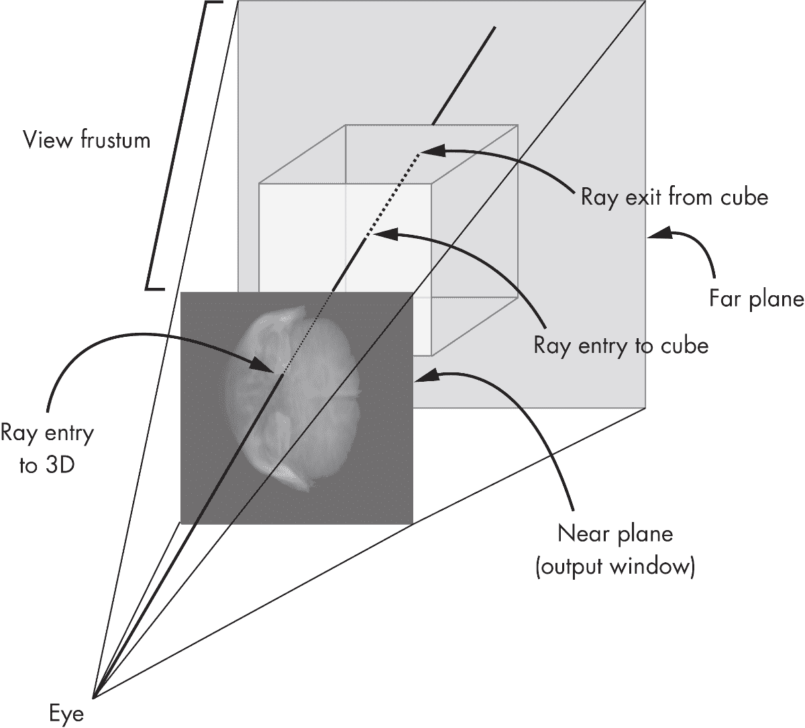
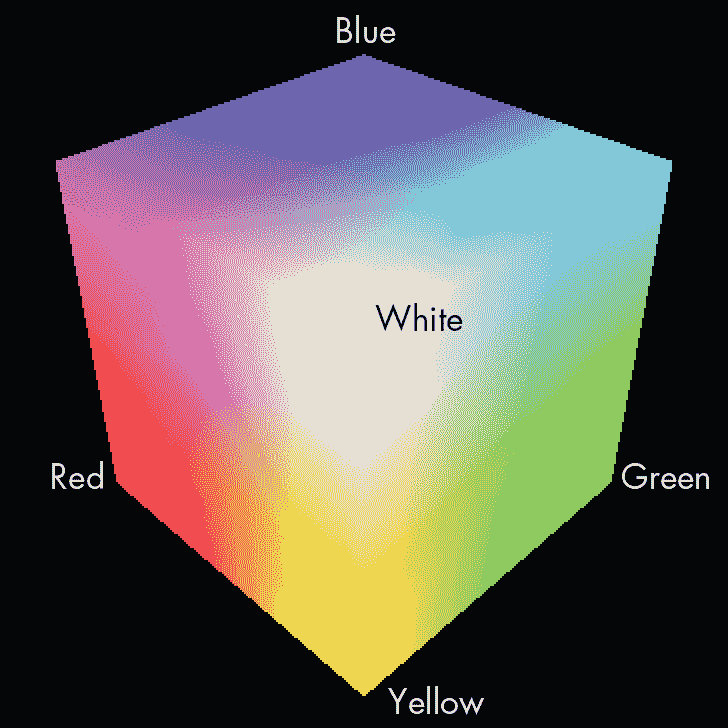
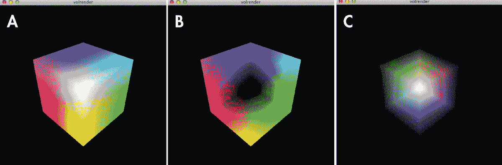
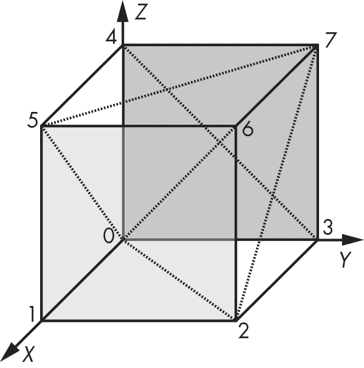
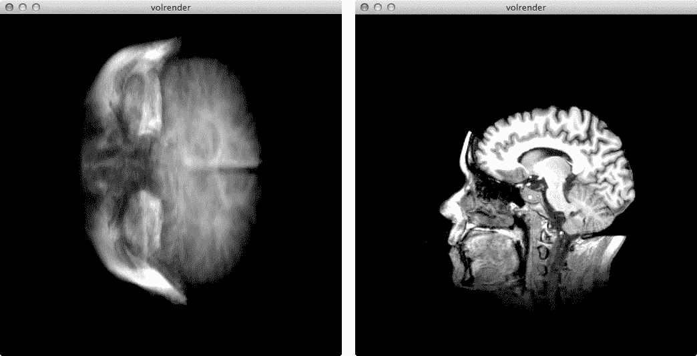

## 第十一章：# 卷积渲染


磁共振成像（MRI）和计算机断层扫描（CT）是诊断过程，用于生成*体积数据*，这类数据由一组 2D 图像组成，显示了通过 3D 体积的横截面。*卷积渲染*是一种计算机图形技术，用于从这种类型的体积数据中构建 3D 图像。尽管卷积渲染通常用于分析医学扫描数据，但它也可以用于在地质学、考古学和分子生物学等学术领域中创建 3D 科学可视化。

MRI 和 CT 扫描捕获的数据通常采用*N*[x]×*N*[y]×*N*[z]维度的 3D 网格形式。换句话说，有*N*[z]个 2D“切片”，每个切片的大小为*N*[x]×*N*[y]。卷积渲染算法用于以某种透明度显示收集到的切片数据，采用各种技术突出渲染体积中感兴趣的部分。

在本项目中，您将研究一种叫做*体积光线投射*的卷积渲染方法，它充分利用图形处理单元（GPU）通过 OpenGL 着色语言（GLSL）着色器执行计算。您的代码会对每个屏幕上的像素进行计算，并利用 GPU 进行高效的并行计算。您将使用一组包含来自 3D 数据集切片的 2D 图像的文件夹，通过体积光线投射算法构建卷积渲染图像。您还将实现一种方法，展示数据在 x、y 和 z 方向上的 2D 切片，用户可以使用箭头键浏览这些切片。键盘命令将允许用户在 3D 渲染和 2D 切片之间切换。

以下是本项目中涵盖的一些主题：

+   • 使用 GLSL 进行 GPU 计算

+   • 创建顶点和片段着色器

+   • 表示 3D 体积数据并使用体积光线投射算法

+   • 使用`numpy`数组进行 3D 变换矩阵

## 工作原理

渲染 3D 数据集有多种方式。在本项目中，您将使用体积光线投射方法，这是一种*基于图像*的渲染技术，用于逐像素生成最终图像。与之相比，典型的 3D 渲染方法是*基于对象*的：它们从 3D 对象表示开始，然后应用变换生成投影 2D 图像中的像素。

在你将要使用的体积光线投射方法中，对于输出图像中的每一个像素，都会向离散的 3D 体积数据集发射一条光线，这些数据集通常表示为一个长方体。当光线穿过体积时，数据会按照规则的间隔进行采样，并将这些采样结果进行组合或*合成*，以计算最终图像的颜色值或强度。（你可以将这个过程理解为像是将一堆透明片堆叠在一起，并将其举到明亮的光源下，以查看所有图层的混合效果。）

虽然体积光线投射渲染实现通常会采用诸如应用渐变以改善最终渲染效果、滤波以隔离 3D 特征、以及使用空间优化技术以提高速度等技巧，但你将仅实现基本的光线投射算法，并通过 X 射线投射合成最终图像。（我的实现主要基于 2003 年 Kruger 和 Westermann 在该领域的开创性论文。1）

### 数据格式

在这个项目中，你将使用来自斯坦福体积数据档案的 3D 扫描医学数据。2 该档案提供了一些优秀的 3D 医学数据集（包括 CT 和 MRI）TIFF 图像，每一幅图像代表体积的 2D 切面。你将把这些图像文件夹读入 OpenGL 3D 纹理；这有点像是将一组 2D 图像堆叠起来形成一个长方体，如图 11-1 所示。


图 11-1：从 2D 切片构建 3D 体积数据

回想一下第九章中提到的，在 OpenGL 中，2D 纹理是通过 2D 坐标（*s*，*t*）来寻址的。类似地，3D 纹理是通过形如（*s*，*t*，*p*）的 3D 纹理坐标来寻址的。正如你将看到的，将体积数据存储为 3D 纹理可以让你快速访问数据，并为光线投射方案提供所需的插值值。

### 光线生成

你在这个项目中的目标是生成 3D 体积数据的透视投影，如图 11-2 所示。该图展示了 OpenGL 视锥体，如第九章所讨论。具体来说，它展示了一个从眼睛发出的光线如何在近平面进入视锥体，通过包含体积数据的立方体体积，并从远平面后方退出。



图 11-2：3D 体积数据的透视投影

要实现光线投射，你需要生成进入体积的光线。对于输出窗口中的每个像素，如 图 11-2 所示，你需要生成一个进入体积的向量 *R*，你可以认为该体积是一个单位立方体（我称之为 *颜色立方体*），它的坐标范围在 (0, 0, 0) 和 (1, 1, 1) 之间。你为立方体内的每个点着色，RGB 值等于该点的 3D 坐标。原点的颜色是 (0, 0, 0)，即黑色；(1, 0, 0) 角是红色；与原点对角的立方体上的点的颜色是 (1, 1, 1)，即白色。图 11-3 显示了这个立方体。



图 11-3：一个颜色立方体

注意：在 OpenGL 中，颜色可以表示为一组 8 位无符号值 (*r*, *g*, *b*)，其中 *r*、*g* 和 *b* 的取值范围是 [0, 255]。它也可以表示为一组三个 32 位浮点值 (*r*, *g*, *b*)，其中 *r*、*g* 和 *b* 的取值范围是 [0.0, 1.0]。这两种表示方式是等价的。例如，前者中的红色（255, 0, 0）与后者中的（1.0, 0.0, 0.0）是一样的。

为了绘制这个立方体，首先使用 OpenGL 基本图元 `GL_TRIANGLES` 绘制其六个面。然后为每个顶点着色，并在 OpenGL 光栅化多边形时利用其提供的插值功能，处理各顶点之间的颜色。例如，图 11-4(a) 显示了立方体的三个前面。立方体的后面通过在 图 11-4(b) 中设置 OpenGL 剔除前面来绘制。



图 11-4：用于计算光线的颜色立方体

如果你将 图 11-4(a) 中的颜色从 图 11-4(b) 中减去，方法是将 (*r*, *g*, *b*)[front] 减去 (*r*, *g*, *b*)[back]，你实际上计算了一组从立方体前面到后面的向量，因为这个立方体上每个颜色 (*r*, *g*, *b*) 都等同于该颜色位置的 3D 坐标。图 11-4(c) 显示了结果。（为了说明的目的，负值已被转换为正值，因为负数不能直接显示为颜色。）读取像素的颜色值 (*r*, *g*, *b*)，如 图 11-4(c) 所示，会给出穿过该点的光线的 (*r*[x]，*r*[y]，*r*[z]) 坐标。

一旦你获得了光线投射结果，就可以将它们渲染为图像或 2D 纹理，以便稍后与 OpenGL 的帧缓冲对象（FBO）功能一起使用。在生成此纹理后，你可以在着色器中访问它，以实现光线投射算法。

#### GPU 中的光线投射

要实现光线投射算法，首先在 FBO 中绘制颜色立方体的背面。接着，前面绘制到屏幕上。大部分光线投射算法发生在第二次渲染的片段着色器中，该着色器针对输出的每个像素运行。光线是通过从纹理中读取颜色立方体的背面颜色，并减去传入片段的前面颜色来计算的。然后，计算出的光线被用来通过 3D 体积纹理数据累加和计算最终的像素值，这些数据在着色器中可用。

#### 显示 2D 切片

除了 3D 渲染，你还可以通过从 3D 数据中提取垂直于 x、y 或 z 轴的 2D 截面并将其作为纹理应用于四边形，来显示数据的 2D 切片。由于你将体积数据存储为 3D 纹理，你可以通过指定纹理坐标（*s*，*t*，*p*）轻松获取所需的数据。OpenGL 内建的纹理插值使你能够在 3D 纹理内部的任何位置获得纹理值。

### OpenGL 窗口

与其他 OpenGL 项目一样，该项目使用 GLFW 库来显示 OpenGL 窗口。你将使用处理程序来绘制、调整窗口大小以及处理键盘事件。你将使用键盘事件在体积和切片渲染之间切换，还可以旋转和切片 3D 数据。

## 要求

你将使用流行的 Python OpenGL 绑定库 `PyOpenGL` 进行渲染。你还将使用 Python 图像库（PIL）加载来自体积数据集的 2D 图像，并使用 `numpy` 数组表示 3D 坐标和变换矩阵。

## 代码

你将从读取的图像文件中的体积数据生成 3D 纹理。接着，你会学习一种颜色立方体技术，用于生成从眼睛发出的射线指向体积，这在实现体积光线投射算法时是一个关键概念。你将学习如何定义立方体几何体，以及如何绘制立方体的前后面。然后，你将探索体积光线投射算法及相关的顶点着色器和片段着色器。最后，你将学习如何实现体积数据的 2D 切片。

这个项目有七个 Python 文件：

glutils.py 包含 OpenGL 着色器、变换等的实用方法

makedata.py 包含用于创建测试用体积数据的实用方法

raycast.py 实现了用于光线投射的 `RayCastRender` 类

raycube.py 实现了用于 `RayCastRender` 的 `RayCube` 类

slicerender.py 实现了用于体积数据 2D 切片的 `SliceRender` 类

volreader.py 包含将体积数据读入 OpenGL 3D 纹理的实用方法

volrender.py 包含创建 GLFW 窗口和渲染器的主要方法

本章将涵盖除了两个文件以外的所有文件。*makedata.py*文件与本章的其他项目文件一起位于[`github.com/mkvenkit/pp2e/tree/main/volrender`](https://github.com/mkvenkit/pp2e/tree/main/volrender)。*glutils.py*文件可以从[`github.com/mkvenkit/pp2e/tree/main/common`](https://github.com/mkvenkit/pp2e/tree/main/common)下载。

### 生成 3D 纹理

第一步是从包含图像的文件夹中读取体积数据，如以下代码所示。要查看完整的*volreader.py*代码，请跳转到“完整的 3D 纹理代码”在第 241 页。你也可以在[`github.com/mkvenkit/pp2e/tree/main/volrender`](https://github.com/mkvenkit/pp2e/tree/main/volrender)找到*volreader.py*文件。请注意，此文件中的`loadTexture()`函数用于打开图像文件，读取内容，并创建一个 OpenGL 纹理对象，随后该对象将在渲染中使用。

```py
def loadVolume(dirName):
    """read volume from directory as a 3D texture"""
    # list images in directory
  ❶ files = sorted(os.listdir(dirName))
    print('loading images from: %s' % dirName)
    imgDataList = []
    count = 0
    width, height = 0, 0
    for file in files:
      ❷ file_path = os.path.abspath(os.path.join(dirName, file))
        try:
            # read image
          ❸ img = Image.open(file_path)
            imgData = np.array(img.getdata(), np.uint8)
            # check if all images are of the same size
          ❹ if count is 0:
                width, height = img.size[0], img.size[1]
                imgDataList.append(imgData)
            else:
              ❺ if (width, height) == (img.size[0], img.size[1]):
                    imgDataList.append(imgData)
            else:
                print('mismatch')
                raise RunTimeError("image size mismatch")
            count += 1
            # print img.size
      ❻ except:
            # skip
            print('Invalid image: %s' % file_path)
    # load image data into single array
    depth = count
  ❼ data = np.concatenate(imgDataList)
    print('volume data dims: %d %d %d' % (width, height, depth))

```

`loadVolume()`方法首先使用`os`模块的`listdir()`方法列出给定目录中的文件❶。然后，你逐一加载图像文件。为此，你将当前文件名附加到目录路径，使用`os.path.abspath()`和`os.path.join()`❷，这样就避免了需要处理相对路径和操作系统特定的路径约定。（你经常会在遍历文件和目录的 Python 代码中看到这个有用的惯用法。）接下来，你使用 PIL 的 `Image` 类将当前图像加载到 8 位的 `numpy` 数组中❸。如果指定的文件不是图像或图像加载失败，则会抛出异常，你可以通过打印错误信息来捕获此异常❻。

因为你正在将这些图像切片加载到一个 3D 纹理中，所以需要确保它们的尺寸（宽度×高度）一致，你可以在❹和❺确认这一点。你存储第一张图像的尺寸，并将其与新加载的图像进行比较。一旦所有图像加载到独立的数组中，你可以使用 `numpy` 的 `concatenate()` 方法将这些数组连接成一个包含 3D 数据的最终数组❼。

`loadVolume()`函数继续将 3D 图像数据数组加载到 OpenGL 纹理中：

```py
    # load data into 3D texture
  ❶ texture = glGenTextures(1)
    glPixelStorei(GL_UNPACK_ALIGNMENT, 1)
    glBindTexture(GL_TEXTURE_3D, texture)
    glTexParameterf(GL_TEXTURE_3D, GL_TEXTURE_WRAP_S, GL_CLAMP_TO_EDGE)
    glTexParameterf(GL_TEXTURE_3D, GL_TEXTURE_WRAP_T, GL_CLAMP_TO_EDGE)
    glTexParameterf(GL_TEXTURE_3D, GL_TEXTURE_WRAP_R, GL_CLAMP_TO_EDGE)
    glTexParameterf(GL_TEXTURE_3D, GL_TEXTURE_MAG_FILTER, GL_LINEAR)
    glTexParameterf(GL_TEXTURE_3D, GL_TEXTURE_MIN_FILTER, GL_LINEAR)
  ❷ glTexImage3D(GL_TEXTURE_3D, 0, GL_RED,
                 width, height, depth, 0,
                 GL_RED, GL_UNSIGNED_BYTE, data)
    # return texture
  ❸ return (texture, width, height, depth)

```

在这里，你会创建一个 OpenGL 纹理❶并设置过滤和解包的参数。然后，你将 3D 数据数组加载到 OpenGL 纹理中❷。此处使用的格式是`GL_RED`，数据格式是`GL_UNSIGNED_BYTE`，因为每个像素的数据仅包含一个 8 位值。最后，你返回 OpenGL 纹理 ID 和 3D 纹理的尺寸❸。

### 生成光线

生成射线的代码被封装在一个名为`RayCube`的类中。这个类负责绘制颜色立方体，并且有方法将立方体的背面绘制到 FBO 或纹理中，将前面绘制到屏幕上。如需查看完整的*raycube.py*代码，可以跳到“完整的射线生成代码”，该内容位于第 242 页。你还可以在[`github.com/mkvenkit/pp2e/tree/main/volrender`](https://github.com/mkvenkit/pp2e/tree/main/volrender)找到*raycube.py*文件。

首先，让我们定义此类使用的着色器。着色器将在`RayCube`类的构造函数中编译：

```py
❶ strVS = """
# version 410 core
layout(location = 1) in vec3 cubePos;
layout(location = 2) in vec3 cubeCol;
uniform mat4 uMVMatrix;
uniform mat4 uPMatrix;
out vec4 vColor;
void main()
{
    // set back-face color
    vColor = vec4(cubeCol.rgb, 1.0);
    // transformed position
    vec4 newPos = vec4(cubePos.xyz, 1.0);
    // set position
    gl_Position = uPMatrix * uMVMatrix * newPos;
}
"""
❷ strFS = """
# version 410 core
in vec4 vColor;
out vec4 fragColor;
void main()
{
    fragColor = vColor;
}
"""

```

你定义了`RayCube`类使用的顶点着色器❶。该着色器有两个输入属性，`cubePos`和`cubeCol`，分别用于访问顶点的位置和颜色值。模型视图和投影矩阵通过统一变量`uMVMatrix`和`uPMatrix`传入。`vColor`变量被声明为输出，因为它需要传递给片段着色器，在那里它将被插值。片段着色器❷将片段的颜色设置为顶点着色器中传入的（插值后的）`vColor`值。

#### 定义颜色立方体几何形状

现在，让我们看看`RayCube`类的构造函数中定义的颜色立方体几何形状：

```py
class RayCube:
    def __init__(self, width, height):
    --`snip`--
        # cube vertices
      ❶ vertices = numpy.array([
                0.0, 0.0, 0.0,
                1.0, 0.0, 0.0,
                1.0, 1.0, 0.0,
                0.0, 1.0, 0.0,
                0.0, 0.0, 1.0,
                1.0, 0.0, 1.0,
                1.0, 1.0, 1.0,
                0.0, 1.0, 1.0
                ], numpy.float32)
        # cube colors
      ❷ colors = numpy.array([
                0.0, 0.0, 0.0,
                1.0, 0.0, 0.0,
                1.0, 1.0, 0.0,
                0.0, 1.0, 0.0,
                0.0, 0.0, 1.0,
                1.0, 0.0, 1.0,
                1.0, 1.0, 1.0,
                0.0, 1.0, 1.0
                ], numpy.float32)
        # individual triangles
      ❸ indices = numpy.array([
                4, 5, 7,
                7, 5, 6,
                5, 1, 6,
                6, 1, 2,
                1, 0, 2,
                2, 0, 3,
                0, 4, 3,
                3, 4, 7,
                6, 2, 7,
                7, 2, 3,
                4, 0, 5,
                5, 0, 1
                ], numpy.int16)

```

你将立方体的几何形状❶和颜色❷定义为`numpy`数组。注意，这两种定义中的数值是相同的。正如我们之前讨论的，颜色立方体中每个像素的颜色对应于该像素的三维坐标。颜色立方体有六个面，每个面可以由两个三角形构成，共有 6×6 或 36 个顶点。但你并不需要指定所有 36 个顶点，而是只指定立方体的八个角❶，然后使用`indices`数组❸定义由这些角点构成的三角形，如图 11-5 所示。例如，前两个三元组索引(4, 5, 7)和(7, 5, 6)定义了立方体顶部面的三角形。



图 11-5：通过索引，立方体可以表示为一组三角形，每个面由两个三角形组成。

接下来，仍然在`RayCube`类的构造函数中，你需要将顶点信息放入缓冲区：

# 设置顶点数组对象（VAO）

self.vao = glGenVertexArrays(1)

glBindVertexArray(self.vao)

# 顶点缓冲区

self.vertexBuffer = glGenBuffers(1)

glBindBuffer(GL_ARRAY_BUFFER, self.vertexBuffer)

glBufferData(GL_ARRAY_BUFFER, 4*len(vertices), vertices, GL_STATIC_DRAW)

# 顶点缓冲区 – 立方体顶点颜色

self.colorBuffer = glGenBuffers(1)

glBindBuffer(GL_ARRAY_BUFFER, self.colorBuffer)

glBufferData(GL_ARRAY_BUFFER, 4*len(colors), colors, GL_STATIC_DRAW)

# 索引缓冲区

self.indexBuffer = glGenBuffers(1)

glBindBuffer(GL_ELEMENT_ARRAY_BUFFER, self.indexBuffer); ❶

glBufferData(GL_ELEMENT_ARRAY_BUFFER, 2*len(indices), indices,

GL_STATIC_DRAW)

与之前的项目一样，你会创建并绑定一个顶点数组对象（VAO），然后定义它管理的缓冲区。这里的一个不同之处是，`indices` 数组被指定为 `GL_ELEMENT_ARRAY_BUFFER` ❶，这意味着它的缓冲区中的元素将用于索引和访问颜色与顶点缓冲区中的数据。

#### 创建帧缓冲对象

现在让我们跳转到 `RayCube` 类的方法，它创建了帧缓冲对象，你将进行渲染：

```py
def initFBO(self):
    # create frame buffer object
    self.fboHandle = glGenFramebuffers(1)
    # create texture
    self.texHandle = glGenTextures(1)
    # create depth buffer
    self.depthHandle = glGenRenderbuffers(1)
    # bind
    glBindFramebuffer(GL_FRAMEBUFFER, self.fboHandle)
    glActiveTexture(GL_TEXTURE0)
    glBindTexture(GL_TEXTURE_2D, self.texHandle)
    # set parameters to draw the image at different sizes
  ❶ glTexParameteri(GL_TEXTURE_2D, GL_TEXTURE_MIN_FILTER, GL_LINEAR)
    glTexParameteri(GL_TEXTURE_2D, GL_TEXTURE_MAG_FILTER, GL_LINEAR)
    glTexParameteri(GL_TEXTURE_2D, GL_TEXTURE_WRAP_S, GL_CLAMP_TO_EDGE)
    glTexParameteri(GL_TEXTURE_2D, GL_TEXTURE_WRAP_T, GL_CLAMP_TO_EDGE)
    # set up texture
    glTexImage2D(GL_TEXTURE_2D, 0, GL_RGBA, self.width, self.height,
                 0, GL_RGBA, GL_UNSIGNED_BYTE, None)
    # bind texture to FBO
  ❷ glFramebufferTexture2D(GL_FRAMEBUFFER, GL_COLOR_ATTACHMENT0,
                           GL_TEXTURE_2D, self.texHandle, 0)
    # bind
  ❸ glBindRenderbuffer(GL_RENDERBUFFER, self.depthHandle)
    glRenderbufferStorage(GL_RENDERBUFFER, GL_DEPTH_COMPONENT24,
                          self.width, self.height)
    # bind depth buffer to FBO
    glFramebufferRenderbuffer(GL_FRAMEBUFFER, GL_DEPTH_ATTACHMENT,
                              GL_RENDERBUFFER, self.depthHandle)
    # check status
  ❹ status = glCheckFramebufferStatus(GL_FRAMEBUFFER)
    if status == GL_FRAMEBUFFER_COMPLETE:
        pass
        # print "fbo %d complete" % self.fboHandle
    elif status == GL_FRAMEBUFFER_UNSUPPORTED:
        print "fbo %d unsupported" % self.fboHandle
    else:
        print "fbo %d Error" % self.fboHandle

```

在这里，你创建一个帧缓冲对象、一个 2D 纹理和一个渲染缓冲对象；然后设置纹理参数 ❶。纹理被绑定到帧缓冲 ❷，在 ❸ 和接下来的几行代码中，渲染缓冲设置了一个 24 位深度缓冲并附加到帧缓冲。接下来，你检查帧缓冲的状态 ❹，并在出现问题时打印状态信息。现在，只要帧缓冲和渲染缓冲正确绑定，所有的渲染都会输出到纹理中。

#### 渲染立方体的背面

以下是渲染颜色立方体背面的代码：

```py
def renderBackFace(self, pMatrix, mvMatrix):
    """renders back-face of ray-cube to a texture and returns it"""
    # render to FBO
  ❶ glBindFramebuffer(GL_FRAMEBUFFER, self.fboHandle)
    # set active texture
    glActiveTexture(GL_TEXTURE0)
    # bind to FBO texture
    glBindTexture(GL_TEXTURE_2D, self.texHandle)
    # render cube with face culling enabled
  ❷ self.renderCube(pMatrix, mvMatrix, self.program, True)
    # unbind texture
  ❸ glBindTexture(GL_TEXTURE_2D, 0)
    glBindFramebuffer(GL_FRAMEBUFFER, 0)
    glBindRenderbuffer(GL_RENDERBUFFER, 0)
    # return texture ID
  ❹ return self.texHandle

```

首先你绑定 FBO ❶，设置活动纹理单元，并绑定纹理句柄，以便你可以渲染到 FBO。然后你调用 `RayCube` 类的 `renderCube()` 方法 ❷，我们稍后会看看它。该方法将面剔除标志作为参数，允许你使用相同的代码绘制立方体的正面或背面。你将该标志设置为 `True`，以便在 FBO 纹理中显示背面。

接下来，你进行必要的调用，以解除 FBO 的绑定，这样其他渲染代码就不会受到影响 ❸。最后，你返回 FBO 纹理 ID ❹，以便在算法的下一阶段使用。

#### 渲染立方体的正面

以下代码用于在射线投射算法的第二次渲染过程中绘制颜色立方体的正面：

```py
def renderFrontFace(self, pMatrix, mvMatrix, program):
    """render front-face of ray-cube"""
    # no face culling
    self.renderCube(pMatrix, mvMatrix, program, False)

```

该方法仅调用 `renderCube()`，并将面剔除标志设置为 `False`，以便显示正面。

#### 渲染整个立方体

现在让我们看一下 `renderCube()` 方法，它绘制了前面讨论的颜色立方体：

```py
def renderCube(self, pMatrix, mvMatrix, program, cullFace):
    """renderCube uses face culling if flag set"""
    glClear(GL_COLOR_BUFFER_BIT | GL_DEPTH_BUFFER_BIT)
    # set shader program
    glUseProgram(program)
    # set projection matrix
    glUniformMatrix4fv(glGetUniformLocation(program, b'uPMatrix'),
                       1, GL_FALSE, pMatrix)
    # set modelview matrix
    glUniformMatrix4fv(glGetUniformLocation(program, b'uMVMatrix'),
                       1, GL_FALSE, mvMatrix)
    # enable face culling
    glDisable(GL_CULL_FACE)
  ❶ if cullFace:
        glFrontFace(GL_CCW)
        glCullFace(GL_FRONT)
        glEnable(GL_CULL_FACE)
    # bind VAO
    glBindVertexArray(self.vao)
    # animated slice
  ❷ glDrawElements(GL_TRIANGLES, self.nIndices, GL_UNSIGNED_SHORT, None)
    # unbind VAO
    glBindVertexArray(0)
    # reset cull face
    if cullFace:
        # disable face culling
        glDisable(GL_CULL_FACE)

```

你清除颜色和深度缓冲区，选择着色器程序，并设置变换矩阵。然后你设置一个标志来控制面剔除 ❶，它决定是否绘制立方体的正面或背面。注意，你使用 `glDrawElements()` ❷，因为你使用的是索引数组来渲染立方体，而不是顶点数组。

#### 调整窗口大小

因为 FBO 是为特定的窗口大小创建的，当窗口大小变化时，你需要重新创建它。为此，你为 `RayCube` 类创建了一个调整大小处理函数，如下所示：

```py
def reshape(self, width, height):
    self.width = width
    self.height = height
    self.aspect = width/float(height)
    # re-create FBO
    self.clearFBO()
    self.initFBO()

```

`reshape()` 方法在 OpenGL 窗口大小调整时被调用。它检查新的窗口尺寸，然后清除并重新创建 FBO。

### 实现射线投射算法

接下来，你将在`RayCastRender`类中实现射线投射算法。算法的核心在于该类使用的片段着色器，它还借助`RayCube`类生成射线。要查看完整的*raycast.py*代码，请跳到“完整的体积射线投射代码”，在第 248 页。你也可以在[`github.com/mkvenkit/pp2e/tree/main/volrender`](https://github.com/mkvenkit/pp2e/tree/main/volrender)找到该文件。

在`RayCastRender`的构造函数中，首先创建一个`RayCube`对象，并加载着色器：

```py
class RayCastRender:
    def __init__(self, width, height, volume):
        """RayCastRender construction"""
        # create RayCube object
      ❶ self.raycube = raycube.RayCube(width, height)
        # set dimensions
        self.width = width
        self.height = height
        self.aspect = width/float(height)
        # create shader
      ❷ self.program = glutils.loadShaders(strVS, strFS)
        # texture
      ❸ self.texVolume, self.Nx, self.Ny, self.Nz = volume
        # initialize camera
      ❹ self.camera = Camera()

```

构造函数创建了一个`RayCube`类型的对象 ❶，用于生成射线。你加载射线投射所需的着色器 ❷，然后设置 OpenGL 的 3D 纹理和维度 ❸，这些数据作为元组`volume`传递给构造函数。接着，你创建一个`Camera`对象 ❹，用来设置 OpenGL 的透视变换，以进行 3D 渲染。

注意：`Camera`类，也在*raycast.py*中声明，基本与第十章中使用的类相同。你将在第 248 页的完整代码清单中看到它。

这是`RayCastRender`的渲染方法：

```py
def draw(self):
    # build projection matrix
  ❶ pMatrix = glutils.perspective(45.0, self.aspect, 0.1, 100.0)
    # modelview matrix
  ❷ mvMatrix = glutils.lookAt(self.camera.eye, self.camera.center,
                              self.camera.up)
    # render
    # generate ray-cube back-face texture
  ❸ texture = self.raycube.renderBackFace(pMatrix, mvMatrix)
    # set shader program
  ❹ glUseProgram(self.program)
    # set window dimensions
    glUniform2f(glGetUniformLocation(self.program, b"uWinDims"),
                float(self.width), float(self.height))
    # bind to texture unit 0, which represents back-faces of cube
  ❺ glActiveTexture(GL_TEXTURE0)
    glBindTexture(GL_TEXTURE_2D, texture)
    glUniform1i(glGetUniformLocation(self.program, b"texBackFaces"), 0)
    # texture unit 1: 3D volume texture
  ❻ glActiveTexture(GL_TEXTURE1)
    glBindTexture(GL_TEXTURE_3D, self.texVolume)
    glUniform1i(glGetUniformLocation(self.program, b"texVolume"), 1)
    # draw front-face of cubes
  ❼ self.raycube.renderFrontFace(pMatrix, mvMatrix, self.program)

```

首先，你需要为渲染设置一个透视投影矩阵，使用`glutils.perspective()`工具方法 ❶。然后，你将当前的相机参数设置到`glutils.lookAt()`方法中 ❷。接着，进行渲染的第一遍 ❸，使用`RayCube`中的`renderBackFace()`方法将颜色立方体的背面绘制到纹理中。（此方法还会返回生成纹理的 ID。）

然后，启用射线投射算法的着色器 ❹。接下来，为着色器程序设置纹理。步骤❸中返回的纹理被设置为纹理单元 0 ❺，而从你读取的体积数据中创建的 3D 纹理被设置为纹理单元 1 ❻。最后，使用`RayCube`中的`renderFrontFace()`方法渲染立方体的正面 ❼。当这段代码执行时，`RayCastRender`的着色器将作用于顶点和片段。

#### 顶点着色器

现在，我们来看`RayCastRender`使用的着色器。首先来看顶点着色器：

```py
strVS = """
# version 410 core
❶ layout(location = 1) in vec3 cubePos;
layout(location = 2) in vec3 cubeCol;
❷ uniform mat4 uMVMatrix;
uniform mat4 uPMatrix;
❸ out vec4 vColor;
void main()
{
    // set position
  ❹ gl_Position = uPMatrix * uMVMatrix * vec4(cubePos.xyz, 1.0);
    // set color
  ❺ vColor = vec4(cubeCol.rgb, 1.0);
}
"""

```

首先，你设置位置和颜色的输入变量❶。布局使用与`RayCube`顶点着色器中定义的相同索引，因为`RayCastRender`使用该类中定义的 VBO 来绘制几何体，并且着色器中的位置必须匹配。然后，你定义输入的变换矩阵❷，并设置颜色值作为着色器输出❸。常规的变换计算内建的`gl_Position`输出❹，然后将输出设置为当前的立方体顶点颜色❺。后者将在顶点之间插值，以便在片段着色器中获得正确的颜色。

#### 片段着色器

片段着色器是整个过程的核心。它实现了射线投射算法的核心部分。

```py
strFS = """
# version 410 core
in vec4 vColor;
uniform sampler2D texBackFaces;
uniform sampler3D texVolume;
uniform vec2 uWinDims;
out vec4 fragColor;
void main()
{
    // start of ray
  ❶ vec3 start = vColor.rgb;
    // calculate texture coordinates at fragment,
    // which is a fraction of window coordinates
  ❷ vec2 texc = gl_FragCoord.xy/uWinDims.xy;
    // get end of ray by looking up back-face color
  ❸ vec3 end = texture(texBackFaces, texc).rgb;
    // calculate ray direction
  ❹ vec3 dir = end – start;
    // normalized ray direction
    vec3 norm_dir = normalize(dir);
    // the length from front to back is calculated and
    // used to terminate the ray
    float len = length(dir.xyz);
    // ray step size
    float stepSize = 0.01;
    // X-ray projection
    vec4 dst = vec4(0.0);
    // step through the ray
  ❺ for(float t = 0.0; t < len; t += stepSize) {
        // set position to endpoint of ray
      ❻ vec3 samplePos = start + t*norm_dir;
        // get texture value at position
      ❼ float val = texture(texVolume, samplePos).r;
        vec4 src = vec4(val);
        // set opacity
      ❽ src.a *= 0.1;
        src.rgb *= src.a;
        // blend with previous value
      ❾ dst = (1.0 - dst.a)*src + dst;
        // exit loop when alpha exceeds threshold
      ❿ if(dst.a >= 0.95)
            break;
    }
    // set fragment color
    fragColor = dst;
}
"""

```

片段着色器的输入是立方体的顶点颜色。片段着色器还可以访问通过渲染颜色立方体生成的 2D 纹理、包含体积数据的 3D 纹理以及 OpenGL 窗口的尺寸。

在片段着色器执行时，你将立方体的正面传入，因此通过查找传入的颜色值❶，你可以得到进入立方体的射线起点。（回顾一下在“射线生成”一节中关于立方体内颜色与射线方向之间关系的讨论，第 217 页）

你计算传入片段在屏幕上的纹理坐标❷。这里，通过将片段在窗口坐标中的位置除以窗口尺寸，将位置映射到[0, 1]的范围内。射线的终点通过使用这个纹理坐标查找立方体的背面颜色来获得❸。

接下来，你计算射线的方向❹，然后计算该射线的标准化方向和长度，这在射线投射计算中会派上用场。然后，你通过射线的起点和方向遍历体积，直到它击中射线的终点❺。在这个循环中，你计算射线在数据体积内的当前位置❻，并查找该点的数据值❼。然后，你在❽和❾处执行混合方程，产生 X 射线效果。你将`dst`值与当前的强度值结合（该强度值通过 alpha 值进行衰减），并且该过程沿射线继续进行。alpha 值会不断增加，直到它达到最大阈值 0.95❿，此时你退出循环。最终结果是每个像素在体积中的一种平均不透明度，从而产生“透视”或 X 射线效果。（尝试改变阈值和 alpha 衰减，产生不同的效果。）

### 显示 2D 切片

除了显示体积数据的 3D 视图外，你还希望在屏幕上显示沿 x、y 和 z 方向的 2D 切片数据。为此，代码封装在一个名为 `SliceRender` 的类中，该类创建 2D 体积切片。要查看完整的 *slicerender.py* 代码，请跳到《完整的 2D 切片代码》，它位于第 251 页。你还可以在 [`github.com/mkvenkit/pp2e/tree/main/volrender`](https://github.com/mkvenkit/pp2e/tree/main/volrender) 找到 *slicerender.py* 文件。

这是 `SliceRender` 类构造函数中的初始化代码，它设置了切片的几何形状：

```py
class SliceRender:
    def __init__(self, width, height, volume):
    --`snip`--
        # set up vertex array object (VAO)
        self.vao = glGenVertexArrays(1)
        glBindVertexArray(self.vao)
        # define quad vertices
      ❶ vertexData = numpy.array([0.0, 1.0, 0.0,
                                  0.0, 0.0, 0.0,
                                  1.0, 1.0, 0.0,
                                  1.0, 0.0, 0.0], numpy.float32)
        # vertex buffer
        self.vertexBuffer = glGenBuffers(1)
        glBindBuffer(GL_ARRAY_BUFFER, self.vertexBuffer)
        glBufferData(GL_ARRAY_BUFFER, 4*len(vertexData), vertexData,
                     GL_STATIC_DRAW)
        # enable arrays
        glEnableVertexAttribArray(self.vertIndex)
        # set buffers
        glBindBuffer(GL_ARRAY_BUFFER, self.vertexBuffer)
        glVertexAttribPointer(self.vertIndex, 3, GL_FLOAT, GL_FALSE, 0, None)
        # unbind VAO
        glBindVertexArray(0)

```

这段代码设置了一个 VAO 来管理 VBO，和之前的示例一样。你在 XY 平面 ❶ 中定义了一个正方形的几何形状。（顶点顺序使用的是 `GL_TRIANGLE_STRIP`，该顺序在第九章中介绍过。）无论你显示的是与 *x*、*y* 还是 *z* 垂直的切片，你都会使用相同的几何形状。在这些情况下唯一变化的是你选择在 3D 纹理中显示的数据平面。我们在查看顶点着色器时会回到这个概念。

这是渲染 2D 切片的方法：

```py
def draw(self):
    # clear buffers
    glClear(GL_COLOR_BUFFER_BIT | GL_DEPTH_BUFFER_BIT)
    # build projection matrix
  ❶ pMatrix = glutils.ortho(-0.6, 0.6, -0.6, 0.6, 0.1, 100.0)
    # modelview matrix
  ❷ mvMatrix = numpy.array([1.0, 0.0, 0.0, 0.0,
                            0.0, 1.0, 0.0, 0.0,
                            0.0, 0.0, 1.0, 0.0,
                            -0.5, -0.5, -1.0, 1.0], numpy.float32)
    # use shader
    glUseProgram(self.program)
    # set projection matrix
    glUniformMatrix4fv(self.pMatrixUniform, 1, GL_FALSE, pMatrix)
    # set modelview matrix
    glUniformMatrix4fv(self.mvMatrixUniform, 1, GL_FALSE, mvMatrix)
    # set current slice fraction
  ❸ glUniform1f(glGetUniformLocation(self.program, b"uSliceFrac"),
                float(self.currSliceIndex)/float(self.currSliceMax))
    # set current slice mode
  ❹ glUniform1i(glGetUniformLocation(self.program, b"uSliceMode"),
                self.mode)
    # enable texture
    glActiveTexture(GL_TEXTURE0)
    glBindTexture(GL_TEXTURE_3D, self.texture)
    glUniform1i(glGetUniformLocation(self.program, b"tex"), 0)
    # bind VAO
    glBindVertexArray(self.vao)
    # draw
    glDrawArrays(GL_TRIANGLE_STRIP, 0, 4)
    # unbind VAO
    glBindVertexArray(0)

```

每个 2D 切片都是一个正方形，你使用 OpenGL 三角形带原语将其构建起来。此代码处理三角形带的渲染设置。请注意，你在 ❶ 使用 `glutils.ortho()` 方法实现了正交投影。你设置了一个投影，在表示切片的单位正方形周围添加了 0.1 的缓冲区。

当你使用 OpenGL 绘制某些东西时，默认视图（没有应用任何变换）会将视角设定在 (0, 0, 0)，并沿着 z 轴查看，y 轴指向上方。将平移变换（−0.5, −0.5, −1.0）应用到几何体上会使其在 z 轴上居中 ❷。你设置当前的切片分数 ❸（例如，100 个切片中的第 10 个切片为 0.1），设置切片模式 ❹（选择沿 x、y 或 z 方向查看切片，分别由整数 0、1 和 2 表示），并将这两个值传递给着色器。

#### 顶点着色器

现在让我们来看一下 `SliceRender` 的顶点着色器：

```py
strVS = """
# version 410 core
in vec3 aVert;
uniform mat4 uMVMatrix;
uniform mat4 uPMatrix;
uniform float uSliceFrac;
uniform int uSliceMode;
out vec3 texcoord;
void main() {
    // x slice
    if (uSliceMode == 0) {
      ❶ texcoord = vec3(uSliceFrac, aVert.x, 1.0-aVert.y);
    }
    // y slice
    else if (uSliceMode == 1) {
      ❷ texcoord = vec3(aVert.x, uSliceFrac, 1.0-aVert.y);
    }
    // z slice
    else {
      ❸ texcoord = vec3(aVert.x, 1.0-aVert.y, uSliceFrac);
    }
    // calculate transformed vertex
    gl_Position = uPMatrix * uMVMatrix * vec4(aVert, 1.0);
}
"""

```

顶点着色器将三角形带顶点数组作为输入，并将纹理坐标作为输出。当前的切片分数和切片模式作为统一变量 `uSliceFrac` 和 `uSliceMode` 传入。

该着色器有三个分支，具体取决于切片模式。例如，如果 `uSliceMode` 为 `0`，您将计算 *x* 切片的纹理坐标 ❶。由于您在 x 方向上进行切片，因此您希望得到与 YZ 平面平行的切片。传入顶点着色器的 3D 顶点也作为 3D 纹理坐标，因为它们的范围是 [0, 1]，因此纹理坐标表示为 (*f*, *V*[x], *V*[y])，其中 *f* 是在 x 轴方向上切片编号的分数，而 *V*[x] 和 *V*[y] 是顶点坐标。不幸的是，生成的图像会颠倒过来，因为 OpenGL 的坐标系统原点位于左下角，y 方向朝上；这与您希望的效果相反。为了解决这个问题，您将纹理坐标 *t* 修改为 (1 − *t*) 并使用 (*f*, *V*[x], 1 − *V*[y]) ❶。如果 `uSliceMode` 的值为 `1` 或 `2`，您将使用类似的逻辑来计算 y 方向 ❷ 和 z 方向 ❸ 的切片纹理坐标。

#### 片段着色器

这是片段着色器：

```py
strFS = """
# version 410 core
❶ in vec3 texcoord;
❷ uniform sampler3D texture;
out vec4 fragColor;
void main() {
    // look up color in texture
  ❸ vec4 col = texture(tex, texcoord);
  ❹ fragColor = col.rrra;
}
"""

```

片段着色器将 `texcoord` 声明为输入 ❶，这在顶点着色器中设置为输出。纹理采样器声明为 `uniform` ❷。您使用 `texcoord` ❸ 查找纹理颜色，并将 `fragColor` 设置为输出 ❹。（因为您只读取纹理的红色通道，所以使用 `col.rrra`。）

#### 2D 切片的用户界面

现在您需要一种方法，让用户能够切片数据。可以通过在 `SliceRender` 类上使用键盘处理方法来实现：

```py
def keyPressed(self, key):
    """keypress handler"""
  ❶ if key == 'x':
        self.mode = SliceRender.XSLICE
        # reset slice index
        self.currSliceIndex = int(self.Nx/2)
        self.currSliceMax = self.Nx
    elif key == 'y':
        self.mode = SliceRender.YSLICE
        # reset slice index
        self.currSliceIndex = int(self.Ny/2)
        self.currSliceMax = self.Ny
    elif key == 'z':
        self.mode = SliceRender.ZSLICE
        # reset slice index
        self.currSliceIndex = int(self.Nz/2)
        self.currSliceMax = self.Nz
    elif key == 'l':
      ❷ self.currSliceIndex = (self.currSliceIndex + 1) % self.currSliceMax
    elif key == 'r':
        self.currSliceIndex = (self.currSliceIndex - 1) % self.currSliceMax

```

当按下键盘上的 X、Y 或 Z 键时，`SliceRender` 切换到 *x*、*y* 或 *z* 切片模式。例如，在 *x* 切片模式下，您可以看到这种效果 ❶，在这里，您设置适当的模式，将当前切片索引设置为数据的中间位置，并更新最大切片数。

当按下键盘上的左箭头或右箭头键时，您可以翻页切片。例如，当按下左箭头键时，切片索引会增加 ❷。取模运算符 (`%`) 确保当索引超过最大值时，“回绕”到 0。

### 将代码整合在一起

让我们快速查看项目中的主文件 *volrender.py*。该文件使用一个 `RenderWin` 类，它创建并管理 GLFW OpenGL 窗口。（由于与 第九章 和 第十章 中使用的类类似，因此我不会详细介绍此类。）要查看完整的 *volrender.py* 代码，请跳到 “完整的主文件代码”，位于 第 254 页。您还可以在 [`github.com/mkvenkit/pp2e/tree/main/volrender`](https://github.com/mkvenkit/pp2e/tree/main/volrender) 找到 *volrender.py* 文件。

在此类的初始化代码中，您按如下方式创建渲染器：

```py
class RenderWin:
    def __init__(self, imageDir):
    --`snip`--
        # load volume data
      ❶ self.volume = volreader.loadVolume(imageDir)
        # create renderer
      ❷ self.renderer = RayCastRender(self.width, self.height, self.volume)

```

在这里，你使用我们之前讨论的 `loadVolume()` 函数将 3D 数据读取到 OpenGL 纹理中❶。然后，你创建一个 `RayCastRender` 类型的对象来显示这些数据❷。

#### 按键处理器

`RenderWindow` 类需要一个自己的键盘处理方法，用于在体积渲染和切片渲染之间切换，以及关闭窗口。这个方法还会将按键事件传递给 `RayCastRender` 和 `SliceRender` 类的键盘处理器，用于旋转相机或在 2D 切片中导航。

```py
def onKeyboard(self, win, key, scancode, action, mods):
    # print 'keyboard: ', win, key, scancode, action, mods
    # ESC to quit
    if key is glfw.GLFW_KEY_ESCAPE:
        self.renderer.close()
        self.exitNow = True
    else:
      ❶ if action is glfw.GLFW_PRESS or action is glfw.GLFW_REPEAT:
            if key == glfw.GLFW_KEY_V:
                # toggle render mode
              ❷ if isinstance(self.renderer, RayCastRender):
                    self.renderer = SliceRender(self.width, self.height,
                                                self.volume)
                else:
                    self.renderer = RayCastRender(self.width, self.height,
                                                  self.volume)
                # call reshape on renderer
                self.renderer.reshape(self.width, self.height)
            else:
                # send keypress to renderer
              ❸ keyDict = {glfw.GLFW_KEY_X: 'x', glfw.GLFW_KEY_Y: 'y',
                           glfw.GLFW_KEY_Z: 'z', glfw.GLFW_KEY_LEFT: 'l',
                           glfw.GLFW_KEY_RIGHT: 'r'}
                try:
                    self.renderer.keyPressed(keyDict[key])
                except:
                    pass

```

按下 ESC 键退出程序。你设置了其他按键事件，无论是按下键还是保持按下都能触发❶。如果按下 V 键，则在体积和切片渲染之间切换❷，通过 Python 的 `isinstance()` 方法来识别当前类类型。为了处理其他按键事件（如 X、Y、Z 或左右箭头键），你使用字典 ❸ 并将按键事件传递给当前渲染器的 `keyPressed()` 处理方法。例如，我们在《2D 切片的用户界面》一章的第 237 页中查看了切片渲染器的 `keyPressed()` 方法。

注意：我选择不直接传递 `glfw.KEY` 值，而是使用字典将这些值转换为字符值，因为减少源文件中的依赖是一个好习惯。目前，项目中唯一依赖于 GLFW 的文件是 *volrender.py*。如果你将 GLFW 特定的类型传递给其他代码，它们也需要导入并依赖于 GLFW 库。然后，如果你切换到不同的 OpenGL 窗口工具包，代码就会变得凌乱。

## 运行程序

这里是使用斯坦福体积数据档案中的数据运行应用程序的示例：

```py
$ `python volrender.py --dir mrbrain-8bit/`

```

你应该看到类似于图 11-6 的内容。



图 11-6：*volrender.py* 的一个示例运行。左侧是体积渲染图像，右侧是 2D 切片图像。

当应用程序运行时，使用 V 键在体积和切片渲染之间切换。在切片模式下，使用 X、Y 和 Z 键来更改切片轴，使用箭头键来更改切片位置。

## 总结

在这一章中，你实现了使用 Python 和 OpenGL 的体积射线投射算法。你学习了如何使用 GLSL 着色器高效实现该算法，以及如何从体积数据中创建 2D 切片。

## 实验！

这里有几种方法，你可以继续修改体积射线投射程序：

1.  1\. 当前，在射线投射模式下，很难看到体积数据“立方体”的边界。实现一个类`WireFrame`，在这个立方体周围绘制一个框。将 x 轴、y 轴和 z 轴分别涂成红色、绿色和蓝色，并为每个轴指定不同的着色器。你将在`RayCastRender`类中使用`WireFrame`。

1.  2\. 实现数据缩放。在当前实现中，你为体积绘制了一个立方体，为二维切片绘制了一个正方形，这假设你有一个对称的数据集（每个方向上的切片数量相同），但大多数真实数据的切片数量是变化的。尤其是医学数据，通常在 z 方向上切片较少，例如，维度可能是 256×256×99。为了正确显示这些数据，你需要在计算中引入缩放。可以通过将缩放应用于立方体顶点（3D 体积）和正方形顶点（2D 切片）来实现这一点。用户可以通过命令行参数输入缩放参数。

1.  3\. 我们的体积射线投射实现使用 X 射线投射来计算像素的最终颜色或强度。另一种常用的方法是使用*最大强度投影（MIP）*，在每个像素处设置最大强度。请在代码中实现此功能。（提示：在`RayCastRender`的片段着色器中，修改通过射线逐步计算的代码，检查并设置沿射线的最大值，而不是混合值。）

1.  4\. 目前，你实现的唯一 UI 功能是围绕 x、y 和 z 轴的旋转。实现一个缩放功能，使得按 I/O 键可以放大/缩小体积渲染的图像。你可以通过在`glutils.lookAt()`方法中设置适当的相机参数来实现这一点，但有一个警告：如果你将视角移到数据立方体内部，射线投射将会失败，因为 OpenGL 会裁剪立方体的前面；射线投射所需的计算需要同时渲染立方体的前面和背面。相反，你可以通过调整`glutils.projecton()`方法中的视场来实现缩放。

## 完整的 3D 纹理代码

这是*volreader.py*的完整代码列表。

```py
import os
import numpy as np
from PIL import Image
import OpenGL
from OpenGL.GL import *
from scipy import misc
def loadVolume(dirName):
    """read volume from directory as a 3D texture"""
    # list images in directory
    files = sorted(os.listdir(dirName))
    print('loading images from: %s' % dirName)
    imgDataList = []
    count = 0
    width, height = 0, 0
    for file in files:
        file_path = os.path.abspath(os.path.join(dirName, file))
        try:
            # read image
            img = Image.open(file_path)
            imgData = np.array(img.getdata(), np.uint8)
            # check if all are of the same size
            if count is 0:
                width, height = img.size[0], img.size[1]
                imgDataList.append(imgData)
            else:
                if (width, height) == (img.size[0], img.size[1]):
                    imgDataList.append(imgData)
                else:
                    print('mismatch')
                    raise RunTimeError("image size mismatch")
            count += 1
            # print img.size
        except:
            # skip
            print('Invalid image: %s' % file_path)
    # load image data into single array
    depth = count
    data = np.concatenate(imgDataList)
    print('volume data dims: %d %d %d' % (width, height, depth))
    # load data into 3D texture
    texture = glGenTextures(1)
    glPixelStorei(GL_UNPACK_ALIGNMENT, 1)
    glBindTexture(GL_TEXTURE_3D, texture)
    glTexParameterf(GL_TEXTURE_3D, GL_TEXTURE_WRAP_S, GL_CLAMP_TO_EDGE)
    glTexParameterf(GL_TEXTURE_3D, GL_TEXTURE_WRAP_T, GL_CLAMP_TO_EDGE)
    glTexParameterf(GL_TEXTURE_3D, GL_TEXTURE_WRAP_R, GL_CLAMP_TO_EDGE)
    glTexParameterf(GL_TEXTURE_3D, GL_TEXTURE_MAG_FILTER, GL_LINEAR)
    glTexParameterf(GL_TEXTURE_3D, GL_TEXTURE_MIN_FILTER, GL_LINEAR)
    glTexImage3D(GL_TEXTURE_3D, 0, GL_RED,
                 width, height, depth, 0,
                 GL_RED, GL_UNSIGNED_BYTE, data)
    # return texture
    return (texture, width, height, depth)
# load texture
def loadTexture(filename):
    img = Image.open(filename)
    img_data = np.array(list(img.getdata()), 'B')
    texture = glGenTextures(1)
    glPixelStorei(GL_UNPACK_ALIGNMENT,1)
    glBindTexture(GL_TEXTURE_2D, texture)
    glTexParameterf(GL_TEXTURE_2D, GL_TEXTURE_WRAP_S, GL_CLAMP_TO_EDGE)
    glTexParameterf(GL_TEXTURE_2D, GL_TEXTURE_WRAP_T, GL_CLAMP_TO_EDGE)
    glTexParameterf(GL_TEXTURE_2D, GL_TEXTURE_MAG_FILTER, GL_LINEAR)
    glTexParameterf(GL_TEXTURE_2D, GL_TEXTURE_MIN_FILTER, GL_LINEAR)
    glTexImage2D(GL_TEXTURE_2D, 0, GL_RGBA, img.size[0], img.size[1],
                 0, GL_RGBA, GL_UNSIGNED_BYTE, img_data)
    return texture

```

## 完整的射线生成代码

这是`RayCube`类的完整代码列表。

导入 OpenGL

从 OpenGL.GL 导入*

从 OpenGL.GL.shaders 导入*

导入 numpy, math, sys

导入 volreader, glutils

strVS = """

# 版本 330 核心

布局(位置 = 1) 输入 vec3 cubePos;

布局(位置 = 2) 输入 vec3 cubeCol;

uniform mat4 uMVMatrix;

uniform mat4 uPMatrix;

输出 vec4 vColor;

void main()

{

// 设置背面颜色

vColor = vec4(cubeCol.rgb, 1.0);

// 变换后的位置

vec4 newPos = vec4(cubePos.xyz, 1.0);

// 设置位置

gl_Position = uPMatrix * uMVMatrix * newPos;

}

"""

strFS = """

# 版本 330 核心

输入 vec4 vColor;

输出 vec4 fragColor;

void main()

{

fragColor = vColor;

}

"""

类 RayCube:

"""用于生成射线的类，供射线投射使用"""

def __init__(self, width, height):

"""RayCube 构造函数"""

# 设置尺寸

self.width, self.height = width, height

# 创建着色器

self.program = glutils.loadShaders(strVS, strFS)

# 立方体顶点

vertices = numpy.array([

0.0, 0.0, 0.0,

1.0, 0.0, 0.0,

1.0, 1.0, 0.0,

0.0, 1.0, 0.0,

0.0, 0.0, 1.0,

1.0, 0.0, 1.0,

1.0, 1.0, 1.0,

0.0, 1.0, 1.0

], numpy.float32)

# 立方体颜色

colors = numpy.array([

0.0, 0.0, 0.0,

1.0, 0.0, 0.0,

1.0, 1.0, 0.0,

0.0, 1.0, 0.0,

0.0, 0.0, 1.0,

1.0, 0.0, 1.0,

1.0, 1.0, 1.0,

0.0, 1.0, 1.0

], numpy.float32)

# 单独的三角形

indices = numpy.array([

4, 5, 7,

7, 5, 6,

5, 1, 6,

6, 1, 2,

1, 0, 2,

2, 0, 3,

0, 4, 3,

3, 4, 7,

6, 2, 7,

7, 2, 3,

4, 0, 5,

5, 0, 1

], numpy.int16)

self.nIndices = indices.size

# 设置顶点数组对象（VAO）

self.vao = glGenVertexArrays(1)

glBindVertexArray(self.vao)

# 顶点缓冲区

self.vertexBuffer = glGenBuffers(1)

glBindBuffer(GL_ARRAY_BUFFER, self.vertexBuffer)

glBufferData(GL_ARRAY_BUFFER, 4*len(vertices), vertices, GL_STATIC_DRAW)

# 立方体顶点颜色 - 顶点缓冲区

self.colorBuffer = glGenBuffers(1)

glBindBuffer(GL_ARRAY_BUFFER, self.colorBuffer)

glBufferData(GL_ARRAY_BUFFER, 4*len(colors), colors, GL_STATIC_DRAW);

# 索引缓冲区

self.indexBuffer = glGenBuffers(1)

glBindBuffer(GL_ELEMENT_ARRAY_BUFFER, self.indexBuffer);

glBufferData(GL_ELEMENT_ARRAY_BUFFER, 2*len(indices), indices,

GL_STATIC_DRAW)

# 使用着色器中的布局索引启用属性

aPosLoc = 1

aColorLoc = 2

# 绑定缓冲区

glEnableVertexAttribArray(1)

glEnableVertexAttribArray(2)

# 顶点

glBindBuffer(GL_ARRAY_BUFFER, self.vertexBuffer)

glVertexAttribPointer(aPosLoc, 3, GL_FLOAT, GL_FALSE, 0, None)

# 颜色

glBindBuffer(GL_ARRAY_BUFFER, self.colorBuffer)

glVertexAttribPointer(aColorLoc, 3, GL_FLOAT, GL_FALSE, 0, None)

# 索引

glBindBuffer(GL_ELEMENT_ARRAY_BUFFER, self.indexBuffer)

# 解绑 VAO

glBindVertexArray(0)

# FBO

self.initFBO()

def renderBackFace(self, pMatrix, mvMatrix):

"""将射线立方体的背面渲染到纹理并返回"""

# 渲染到 FBO

glBindFramebuffer(GL_FRAMEBUFFER, self.fboHandle)

# 设置激活的纹理

glActiveTexture(GL_TEXTURE0)

# 绑定到 FBO 纹理

glBindTexture(GL_TEXTURE_2D, self.texHandle)

# 启用面剔除渲染立方体

self.renderCube(pMatrix, mvMatrix, self.program, True)

# 解绑纹理

glBindTexture(GL_TEXTURE_2D, 0)

glBindFramebuffer(GL_FRAMEBUFFER, 0)

glBindRenderbuffer(GL_RENDERBUFFER, 0)

# 返回纹理 ID

return self.texHandle

def renderFrontFace(self, pMatrix, mvMatrix, program):

"""渲染射线立方体的前面"""

# 不进行面剔除

self.renderCube(pMatrix, mvMatrix, program, False)

def renderCube(self, pMatrix, mvMatrix, program, cullFace):

"""使用面剔除渲染立方体（如果标志设置了的话）"""

glClear(GL_COLOR_BUFFER_BIT | GL_DEPTH_BUFFER_BIT)

# 设置着色器程序

glUseProgram(program)

# 设置投影矩阵

glUniformMatrix4fv(glGetUniformLocation(program, b'uPMatrix'),

1, GL_FALSE, pMatrix)

# 设置模型视图矩阵

glUniformMatrix4fv(glGetUniformLocation(program, b'uMVMatrix'),

1, GL_FALSE, mvMatrix)

# 启用面剔除

glDisable(GL_CULL_FACE)

if cullFace:

glFrontFace(GL_CCW)

glCullFace(GL_FRONT)

glEnable(GL_CULL_FACE)

# 绑定 VAO

glBindVertexArray(self.vao)

# 动画切片

glDrawElements(GL_TRIANGLES, self.nIndices, GL_UNSIGNED_SHORT, None)

# 解除绑定 VAO

glBindVertexArray(0)

# 重置面剔除

if cullFace:

# 禁用面剔除

glDisable(GL_CULL_FACE)

def reshape(self, width, height):

self.width = width

self.height = height

self.aspect = width/float(height)

# 重新创建 FBO

self.clearFBO()

self.initFBO()

def initFBO(self):

# 创建帧缓冲对象

self.fboHandle = glGenFramebuffers(1)

# 创建纹理

self.texHandle = glGenTextures(1)

# 创建深度缓冲区

self.depthHandle = glGenRenderbuffers(1)

# 绑定

glBindFramebuffer(GL_FRAMEBUFFER, self.fboHandle)

glActiveTexture(GL_TEXTURE0)

glBindTexture(GL_TEXTURE_2D, self.texHandle)

# 设置参数以绘制不同尺寸的图像

glTexParameteri(GL_TEXTURE_2D, GL_TEXTURE_MIN_FILTER, GL_LINEAR)

glTexParameteri(GL_TEXTURE_2D, GL_TEXTURE_MAG_FILTER, GL_LINEAR)

glTexParameteri(GL_TEXTURE_2D, GL_TEXTURE_WRAP_S, GL_CLAMP_TO_EDGE)

glTexParameteri(GL_TEXTURE_2D, GL_TEXTURE_WRAP_T, GL_CLAMP_TO_EDGE)

# 设置纹理

glTexImage2D(GL_TEXTURE_2D, 0, GL_RGBA, self.width, self.height,

0, GL_RGBA, GL_UNSIGNED_BYTE, None)

# 绑定纹理到 FBO

glFramebufferTexture2D(GL_FRAMEBUFFER, GL_COLOR_ATTACHMENT0,

GL_TEXTURE_2D, self.texHandle, 0)

# 绑定

glBindRenderbuffer(GL_RENDERBUFFER, self.depthHandle)

glRenderbufferStorage(GL_RENDERBUFFER, GL_DEPTH_COMPONENT24,

self.width, self.height)

# 绑定深度缓冲区到 FBO

glFramebufferRenderbuffer(GL_FRAMEBUFFER, GL_DEPTH_ATTACHMENT,

GL_RENDERBUFFER, self.depthHandle)

# 检查状态

status = glCheckFramebufferStatus(GL_FRAMEBUFFER)

if status == GL_FRAMEBUFFER_COMPLETE:

pass

# 打印 "fbo %d 完成" % self.fboHandle

elif status == GL_FRAMEBUFFER_UNSUPPORTED:

print("fbo %d 不支持" % self.fboHandle)

else:

print("fbo %d 错误" % self.fboHandle)

glBindTexture(GL_TEXTURE_2D, 0)

glBindFramebuffer(GL_FRAMEBUFFER, 0)

glBindRenderbuffer(GL_RENDERBUFFER, 0)

return

def clearFBO(self):

"""清除旧的 FBO"""

# 删除 FBO

if glIsFramebuffer(self.fboHandle):

glDeleteFramebuffers(1, int(self.fboHandle))

# 删除纹理

if glIsTexture(self.texHandle):

glDeleteTextures(int(self.texHandle))

def close(self):

"""调用此函数以释放 OpenGL 资源"""

glBindTexture(GL_TEXTURE_2D, 0)

glBindFramebuffer(GL_FRAMEBUFFER, 0)

glBindRenderbuffer(GL_RENDERBUFFER, 0)

# 删除 FBO

if glIsFramebuffer(self.fboHandle):

glDeleteFramebuffers(1, int(self.fboHandle))

# 删除纹理

if glIsTexture(self.texHandle):

glDeleteTextures(int(self.texHandle))

# 删除渲染缓冲区

"""

if glIsRenderbuffer(self.depthHandle):

glDeleteRenderbuffers(1, int(self.depthHandle))

"""

# 删除缓冲区

"""

glDeleteBuffers(1, self._vertexBuffer)

glDeleteBuffers(1, &_indexBuffer)

glDeleteBuffers(1, &_colorBuffer)

"""

## 完整的体积光线投射代码

这是完整的*raycast.py*代码列表。

```py
import OpenGL
from OpenGL.GL import *
from OpenGL.GL.shaders import *
import numpy as np
import math, sys
import raycube, glutils, volreader
strVS = """
# version 330 core
layout(location = 1) in vec3 cubePos;
layout(location = 2) in vec3 cubeCol;
uniform mat4 uMVMatrix;
uniform mat4 uPMatrix;
out vec4 vColor;
void main()
{
    // set position
    gl_Position = uPMatrix * uMVMatrix * vec4(cubePos.xyz, 1.0);
    // set color
    vColor = vec4(cubeCol.rgb, 1.0);
}
"""
strFS = """
# version 330 core
in vec4 vColor;
uniform sampler2D texBackFaces;
uniform sampler3D texVolume;
uniform vec2 uWinDims;
out vec4 fragColor;
void main()
{
    // start of ray
    vec3 start = vColor.rgb;
    // calculate texture coords at fragment,
    // which is a fraction of window coords
    vec2 texc = gl_FragCoord.xy/uWinDims.xy;
    // get end of ray by looking up back-face color
    vec3 end = texture(texBackFaces, texc).rgb;
    // calculate ray direction
    vec3 dir = end - start;
    // normalized ray direction
    vec3 norm_dir = normalize(dir);
    // the length from front to back is calculated and
    // used to terminate the ray
    float len = length(dir.xyz);
    // ray step size
    float stepSize = 0.01;
    // X-ray projection
    vec4 dst = vec4(0.0);
    // step through the ray
    for(float t = 0.0; t < len; t += stepSize) {
        // set position to endpoint of ray
        vec3 samplePos = start + t*norm_dir;
        // get texture value at position
        float val = texture(texVolume, samplePos).r;
        vec4 src = vec4(val);
        // set opacity
        src.a *= 0.1;
        src.rgb *= src.a;
        // blend with previous value
        dst = (1.0 - dst.a)*src + dst;
        // exit loop when alpha exceeds threshold
        if(dst.a >= 0.95)
           break;
    }
    // set fragment color
    fragColor =  dst;
}
"""
class Camera:
    """helper class for viewing"""
    def __init__(self):
        self.r = 1.5
        self.theta = 0
        self.center = [0.5, 0.5, 0.5]
        self.eye = [0.5 + self.r, 0.5, 0.5]
        self.up = [0.0, 0.0, 1.0]
    def rotate(self, clockWise):
        """rotate eye by one step"""
        if clockWise:
            self.theta = (self.theta + 5) % 360
        else:
            self.theta = (self.theta - 5) % 360
        # recalculate eye
        self.eye = [0.5 + self.r*math.cos(math.radians(self.theta)),
                    0.5 + self.r*math.sin(math.radians(self.theta)),
                    0.5]
class RayCastRender:
    """class that does Ray Casting"""
    def __init__(self, width, height, volume):
        """RayCastRender constr"""
        # create RayCube object
        self.raycube = raycube.RayCube(width, height)
        # set dimensions
        self.width = width
        self.height = height
        self.aspect = width/float(height)
        # create shader
        self.program = glutils.loadShaders(strVS, strFS)
        # texture
        self.texVolume, self.Nx, self.Ny, self.Nz = volume
        # initialize camera
        self.camera = Camera()
    def draw(self):
        # build projection matrix
        pMatrix = glutils.perspective(45.0, self.aspect, 0.1, 100.0)
        # modelview matrix
        mvMatrix = glutils.lookAt(self.camera.eye, self.camera.center,
                                  self.camera.up)
        # render
        # generate ray-cube back-face texture
        texture = self.raycube.renderBackFace(pMatrix, mvMatrix)
        # set shader program
        glUseProgram(self.program)
        # set window dimensions
        glUniform2f(glGetUniformLocation(self.program, b"uWinDims"),
                    float(self.width), float(self.height))
        # texture unit 0, which represents back-faces of cube
        glActiveTexture(GL_TEXTURE0)
        glBindTexture(GL_TEXTURE_2D, texture)
        glUniform1i(glGetUniformLocation(self.program, b"texBackFaces"), 0)
        # texture unit 1: 3D volume texture
        glActiveTexture(GL_TEXTURE1)
        glBindTexture(GL_TEXTURE_3D, self.texVolume)
        glUniform1i(glGetUniformLocation(self.program, b"texVolume"), 1)
        # draw front-face of cubes
        self.raycube.renderFrontFace(pMatrix, mvMatrix, self.program)
        #self.render(pMatrix, mvMatrix)
    def keyPressed(self, key):
        if key == 'l':
            self.camera.rotate(True)
        elif key == 'r':
            self.camera.rotate(False)
    def reshape(self, width, height):
        self.width = width
        self.height = height
        self.aspect = width/float(height)
        self.raycube.reshape(width, height)
    def close(self):
        self.raycube.close()

```

## 完整的 2D 切片代码

这是完整的 2D 切片代码列表。

import OpenGL

from OpenGL.GL import *

from OpenGL.GL.shaders import *

import numpy, math, sys

import volreader, glutils

strVS = """

# version 330 core

in vec3 aVert;

uniform mat4 uMVMatrix;

uniform mat4 uPMatrix;

uniform float uSliceFrac;

uniform int uSliceMode;

out vec3 texcoord;

void main() {

// x 切片

if (uSliceMode == 0) {

texcoord = vec3(uSliceFrac, aVert.x, 1.0-aVert.y);

}

// y 切片

else if (uSliceMode == 1) {

texcoord = vec3(aVert.x, uSliceFrac, 1.0-aVert.y);

}

// z 切片

else {

texcoord = vec3(aVert.x, 1.0-aVert.y, uSliceFrac);

}

// 计算变换后的顶点

gl_Position = uPMatrix * uMVMatrix * vec4(aVert, 1.0);

}

"""

strFS = """

# version 330 core

in vec3 texcoord;

uniform sampler3D tex;

out vec4 fragColor;

void main() {

// 在纹理中查找颜色

vec4 col = texture(tex, texcoord);

fragColor = col.rrra;

}

"""

class SliceRender:

# 切片模式

XSLICE, YSLICE, ZSLICE = 0, 1, 2

def __init__(self, width, height, volume):

"""SliceRender 构造函数"""

self.width = width

self.height = height

self.aspect = width/float(height)

# 切片模式

self.mode = SliceRender.ZSLICE

# 创建着色器

self.program = glutils.loadShaders(strVS, strFS)

glUseProgram(self.program)

self.pMatrixUniform = glGetUniformLocation(self.program, b'uPMatrix')

self.mvMatrixUniform = glGetUniformLocation(self.program, b"uMVMatrix")

# 属性

self.vertIndex = glGetAttribLocation(self.program, b"aVert")

# 设置顶点数组对象（VAO）

self.vao = glGenVertexArrays(1)

glBindVertexArray(self.vao)

# 定义四边形顶点

vertexData = numpy.array([0.0, 1.0, 0.0,

0.0, 0.0, 0.0,

1.0, 1.0, 0.0,

1.0, 0.0, 0.0], numpy.float32)

# 顶点缓冲区

self.vertexBuffer = glGenBuffers(1)

glBindBuffer(GL_ARRAY_BUFFER, self.vertexBuffer)

glBufferData(GL_ARRAY_BUFFER, 4*len(vertexData), vertexData,

GL_STATIC_DRAW)

# 启用数组

glEnableVertexAttribArray(self.vertIndex)

# 设置缓冲区

glBindBuffer(GL_ARRAY_BUFFER, self.vertexBuffer)

glVertexAttribPointer(self.vertIndex, 3, GL_FLOAT, GL_FALSE, 0, None)

# 解绑 VAO

glBindVertexArray(0)

# 加载纹理

self.texture, self.Nx, self.Ny, self.Nz = volume

# 当前切片索引

self.currSliceIndex = int(self.Nz/2);

self.currSliceMax = self.Nz;

def reshape(self, width, height):

self.width = width

self.height = height

self.aspect = width/float(height)

def draw(self):

# 清空缓冲区

glClear(GL_COLOR_BUFFER_BIT | GL_DEPTH_BUFFER_BIT)

# 构建投影矩阵

pMatrix = glutils.ortho(-0.6, 0.6, -0.6, 0.6, 0.1, 100.0)

# 模型视图矩阵

mvMatrix = numpy.array([1.0, 0.0, 0.0, 0.0,

0.0, 1.0, 0.0, 0.0,

0.0, 0.0, 1.0, 0.0,

-0.5, -0.5, -1.0, 1.0], numpy.float32)

# 使用着色器

glUseProgram(self.program)

# 设置投影矩阵

glUniformMatrix4fv(self.pMatrixUniform, 1, GL_FALSE, pMatrix)

# 设置模型视图矩阵

glUniformMatrix4fv(self.mvMatrixUniform, 1, GL_FALSE, mvMatrix)

# 设置当前切片比例

glUniform1f(glGetUniformLocation(self.program, b"uSliceFrac"),

float(self.currSliceIndex)/float(self.currSliceMax))

# 设置当前切片模式

glUniform1i(glGetUniformLocation(self.program, b"uSliceMode"),

self.mode)

# 启用纹理

glActiveTexture(GL_TEXTURE0)

glBindTexture(GL_TEXTURE_3D, self.texture)

glUniform1i(glGetUniformLocation(self.program, b"tex"), 0)

# 绑定 VAO

glBindVertexArray(self.vao)

# 绘制

glDrawArrays(GL_TRIANGLE_STRIP, 0, 4)

# 解绑 VAO

glBindVertexArray(0)

def keyPressed(self, key):

"""键盘按键处理"""

if key == 'x':

self.mode = SliceRender.XSLICE

# 重置切片索引

self.currSliceIndex = int(self.Nx/2)

self.currSliceMax = self.Nx

elif key == 'y':

self.mode = SliceRender.YSLICE

# 重置切片索引

self.currSliceIndex = int(self.Ny/2)

self.currSliceMax = self.Ny

elif key == 'z':

self.mode = SliceRender.ZSLICE

# 重置切片索引

self.currSliceIndex = int(self.Nz/2)

self.currSliceMax = self.Nz

elif key == 'l':

self.currSliceIndex = (self.currSliceIndex + 1) % self.currSliceMax

elif key == 'r':

self.currSliceIndex = (self.currSliceIndex - 1) % self.currSliceMax

def close(self):

pass

## 完整的主文件代码

这是主文件的完整代码列表。

import sys, argparse, os

from slicerender import *

from raycast import *

import glfw

class RenderWin:

"""GLFW 渲染窗口类"""

def __init__(self, imageDir):

# 保存当前工作目录

cwd = os.getcwd()

# 初始化 glfw; 这会改变工作目录

glfw.glfwInit()

# 恢复工作目录

os.chdir(cwd)

# 版本提示

glfw.glfwWindowHint(glfw.GLFW_CONTEXT_VERSION_MAJOR, 3)

glfw.glfwWindowHint(glfw.GLFW_CONTEXT_VERSION_MINOR, 3)

glfw.glfwWindowHint(glfw.GLFW_OPENGL_FORWARD_COMPAT, GL_TRUE)

glfw.glfwWindowHint(glfw.GLFW_OPENGL_PROFILE,

glfw.GLFW_OPENGL_CORE_PROFILE)

# 创建一个窗口

self.width, self.height = 512, 512

self.aspect = self.width/float(self.height)

self.win = glfw.glfwCreateWindow(self.width, self.height, b"volrender")

# 使上下文当前

glfw.glfwMakeContextCurrent(self.win)

# 初始化 GL

glViewport(0, 0, self.width, self.height)

glEnable(GL_DEPTH_TEST)

glClearColor(0.0, 0.0, 0.0, 0.0)

# 设置窗口回调

glfw.glfwSetMouseButtonCallback(self.win, self.onMouseButton)

glfw.glfwSetKeyCallback(self.win, self.onKeyboard)

glfw.glfwSetWindowSizeCallback(self.win, self.onSize)

# 加载体积数据

self.volume = volreader.loadVolume(imageDir)

# 创建渲染器

self.renderer = RayCastRender(self.width, self.height, self.volume)

# 退出标志

self.exitNow = False

def onMouseButton(self, win, button, action, mods):

# 打印 '鼠标按钮: ', win, button, action, mods

pass

def onKeyboard(self, win, key, scancode, action, mods):

# 打印 '键盘按键: ', win, key, scancode, action, mods

# 按 ESC 退出

if key is glfw.GLFW_KEY_ESCAPE:

self.renderer.close()

self.exitNow = True

else:

if action is glfw.GLFW_PRESS or action is glfw.GLFW_REPEAT:

if key == glfw.GLFW_KEY_V:

# 切换渲染模式

if isinstance(self.renderer, RayCastRender):

self.renderer = SliceRender(self.width, self.height,

self.volume)

else:

self.renderer = RayCastRender(self.width, self.height,

self.volume)

# 调用渲染器的 reshape

self.renderer.reshape(self.width, self.height)

else:

# 发送按键到渲染器

keyDict = {glfw.GLFW_KEY_X: 'x', glfw.GLFW_KEY_Y: 'y',

glfw.GLFW_KEY_Z: 'z', glfw.GLFW_KEY_LEFT: 'l',

glfw.GLFW_KEY_RIGHT: 'r'}

try

self.renderer.keyPressed(keyDict[key])

except:

pass

def onSize(self, win, width, height):

# 打印 'onsize: ', win, width, height

self.width = width

self.height = height

self.aspect = width/float(height)

glViewport(0, 0, self.width, self.height)

self.renderer.reshape(width, height)

def run(self):

# 启动循环

while not glfw.glfwWindowShouldClose(self.win) and not self.exitNow:

# 渲染

self.renderer.draw()

# 交换缓冲区

glfw.glfwSwapBuffers(self.win)

# 等待事件

glfw.glfwWaitEvents()

# 结束

glfw.glfwTerminate()

# main() 函数

def main():

print('启动体积渲染...')

# 创建解析器

parser = argparse.ArgumentParser(description="体积渲染...")

# 添加预期参数

parser.add_argument('--dir', dest='imageDir', required=True)

# 解析参数

args = parser.parse_args()

# 创建渲染窗口

rwin = RenderWin(args.imageDir)

rwin.run()

# 调用 main

if __name__ == '__main__':

main()

1 J. Kruger 和 R. Westermann, “基于 GPU 的体积渲染加速技术，”IEEE Visualization, 2003.

2 [`graphics.stanford.edu/data/voldata/`](https://graphics.stanford.edu/data/voldata/)
