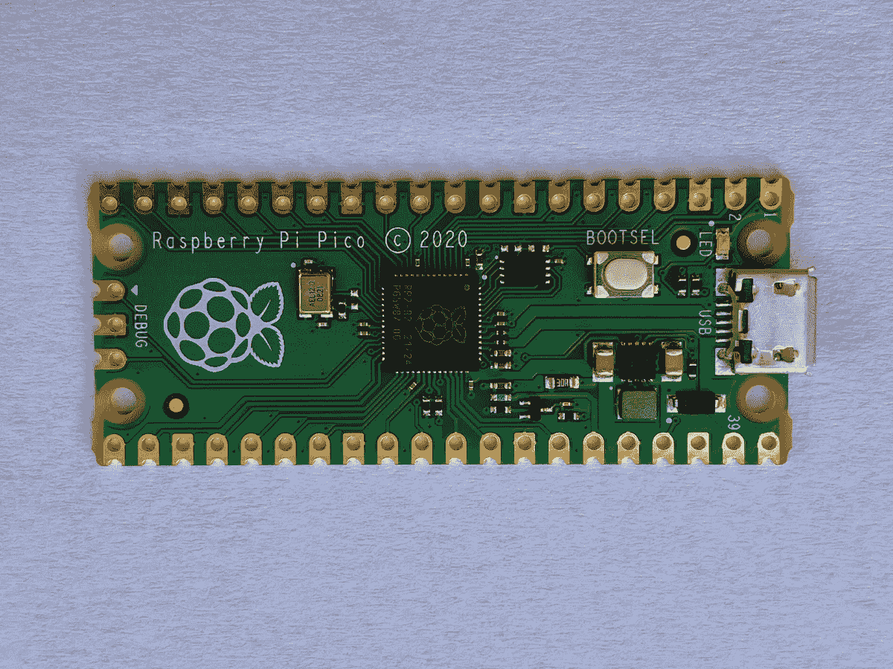
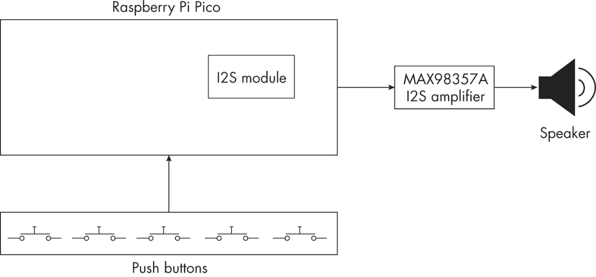
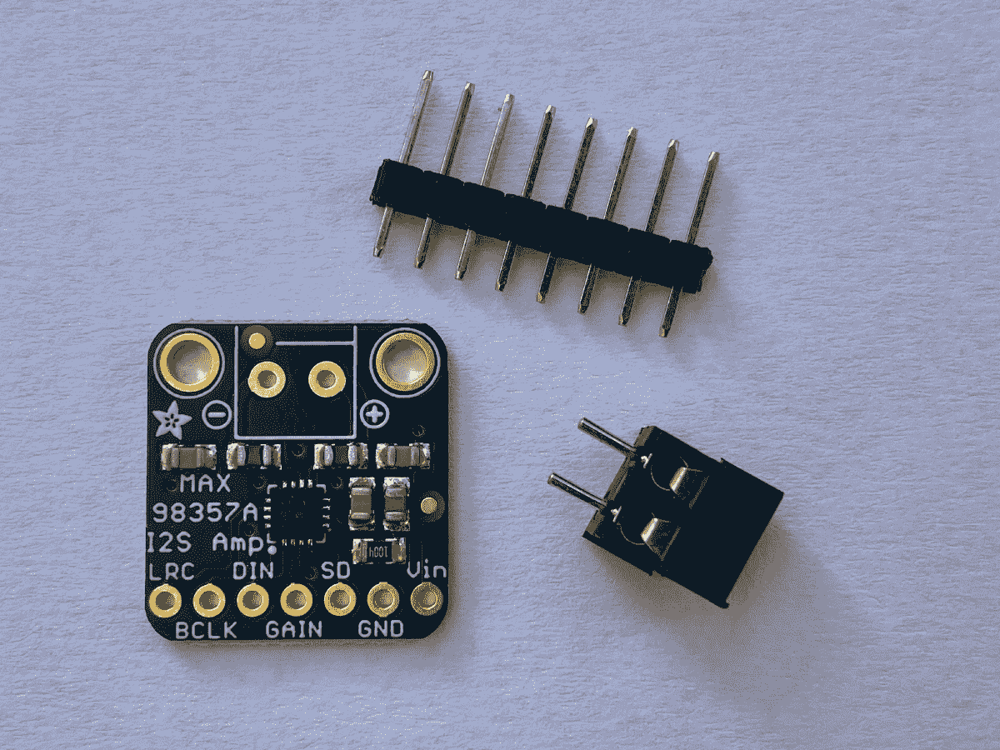
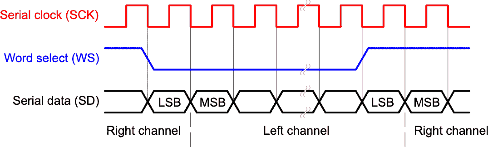
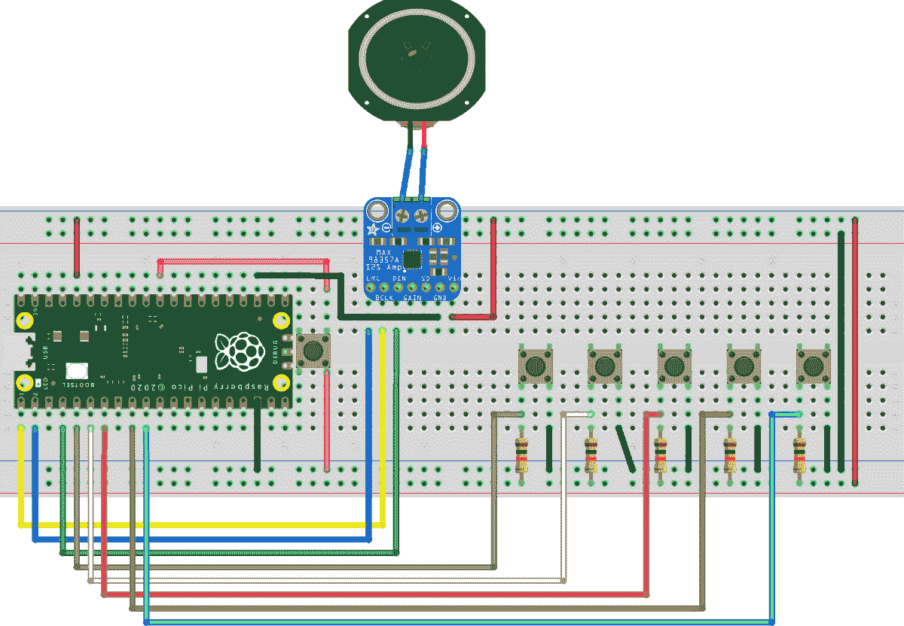
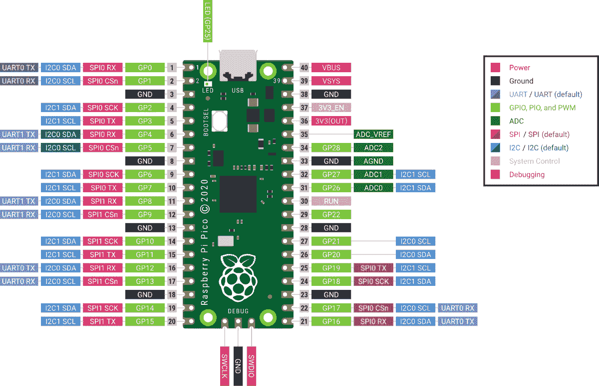
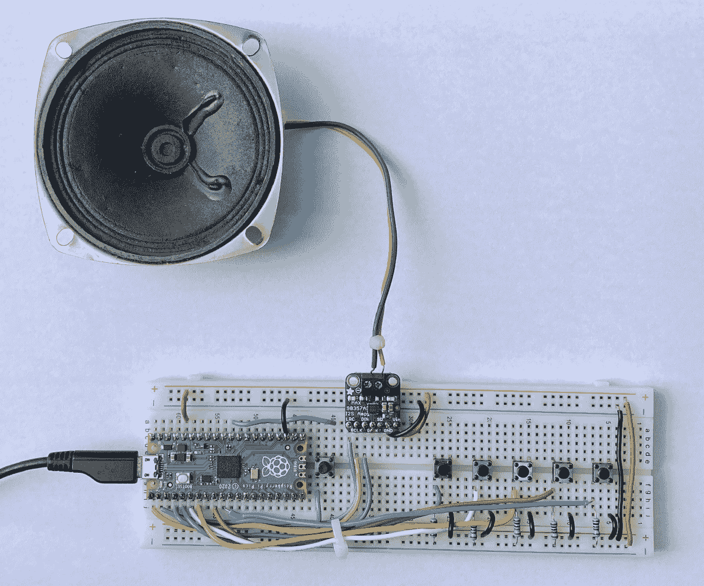
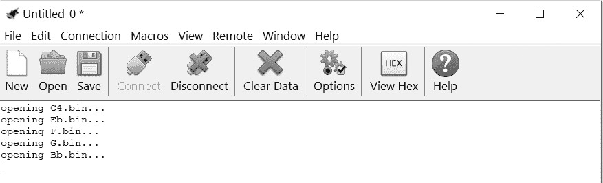

## 第十二章：# 在树莓派 Pico 上实现 Karplus-Strong 算法


在第四章中，你学会了如何使用 Karplus-Strong 算法制作拨弦音。你将生成的声音保存为 WAV 文件，并在电脑上播放五声音阶的音符。在这一章中，你将学习如何将该项目缩减以适应一块小型硬件：树莓派 Pico。

Pico（见图 12-1）使用 RP2040 微控制器芯片构建，该芯片仅具有 264KB 的随机存取内存（RAM）。与典型个人计算机的数十 GB 内存相比，这差距非常大！Pico 还具有 2MB 的闪存，位于一个独立的芯片上，而普通计算机的硬盘空间通常有数百 GB。尽管存在这些限制，Pico 仍然非常强大。它可以执行许多有用的任务，同时比普通计算机便宜且能耗低。你的手表、空调、衣物干燥机、汽车、手机——像 RP2040 这样的微控制器无处不在！



图 12-1：树莓派 Pico

这个项目的目标是使用树莓派 Pico 创建一个五个按钮的乐器。每按一个按钮，就会播放五声音阶中的一个音符，该音符由 Karplus-Strong 算法生成。通过这个项目，你将学习到以下一些概念：

+   • 使用 MicroPython 编程微控制器，MicroPython 是专为像 Pico 这样的设备优化的 Python 实现

+   • 使用 Pico 在面包板上构建简单的音频电路

+   • 使用 I2S 数字音频协议和 I2S 放大器将音频数据发送到扬声器

+   • 在资源受限的微控制器上实现第四章中的 Karplus-Strong 算法

## 它是如何工作的

我们在第四章中详细讨论了 Karplus-Strong 算法，因此在这里不再重复。相反，我们将重点关注此版本项目的不同之处。你在第四章中的程序是为了在笔记本电脑或台式机上运行而设计的。由于电脑拥有充足的内存和硬盘资源，因此它能够轻松使用 Karplus-Strong 算法生成 WAV 文件并通过扬声器播放音频，使用`pyaudio`库没有任何问题。现在的挑战是将项目代码适配到资源受限的树莓派 Pico 上。这将需要以下修改：

+   • 使用较小的音频采样率以减少内存需求

+   • 使用简单的二进制文件存储原始生成的样本，而不是 WAV 文件

+   • 使用 I2S 协议将音频数据发送到外部音频放大器

+   • 使用内存管理技术以避免重复复制相同的数据

我们将在修改过程中详细讨论这些细节。

### 输入与输出

为了使项目具有互动性，你需要让 Pico 根据用户输入生成声音。为此，你需要将五个按钮连接到 Pico，因为 Pico 没有键盘或鼠标。（你将使用第六个按钮来运行程序。）我们还需要弄清楚如何产生声音输出，因为与个人计算机不同，Pico 板没有内置扬声器。图 12-2 展示了项目的框图。



图 12-2：项目的框图

当你按下按钮时，运行在 Pico 上的 MicroPython 代码将使用 Karplus-Strong 算法生成一个拨弦音效。算法生成的数字音频样本将被发送到一个独立的 MAX98357A 放大器板，该板将数字数据解码为模拟音频信号。MAX98357A 还会放大模拟信号，使你能够将其输出连接到外部 8 欧姆扬声器，从而听到音频。图 12-3 展示了 Adafruit MAX98357A 板。



图 12-3：Adafruit MAX98357A I2S 放大器板

Pi Pico 需要以特定的格式将数据发送到放大器板，才能成功地将其解读为音频信号。这时就需要使用 I2S 协议。

### I2S 协议

*Inter-IC Sound (I2S)协议*是一个标准，用于在设备之间发送数字音频数据。这是一种简单且便捷的方式，可以从微控制器获取高质量的音频输出。该协议通过三种数字信号来传输音频，具体如图 12-4 所示。



图 12-4：I2S 协议

第一个信号，SCK，是*时钟*信号，它以固定的速度在高低电平之间交替。这设定了数据传输的速率。接下来，WS 是*字选择*信号。它稳步地在高低电平之间交替，指示当前传输的是左声道还是右声道。最后，SD 是*串行数据*信号，它携带实际的音频信息，以 N 位二进制值的形式表示声音的幅度。

为了理解这如何工作，我们来看一个例子。假设你想以 16,000 Hz 的采样率发送立体声音频，并且希望每个声音样本的幅度是 16 位值。WS 的频率应该与采样率相同，因为这是你发送每个幅度值的速率。这样，WS 信号每秒会在高低之间交替 16,000 次；当它为高时，SD 会发送一个音频通道的幅度值；当它为低时，SD 会发送另一个音频通道的幅度值。由于每个通道的幅度值由 16 位组成，SD 必须以比采样率快 16 × 2 = 32 倍的速率传输。时钟控制传输速率，因此 SCK 的频率必须是 16,000 Hz × 32 = 512,000 Hz。

在这个项目中，Pico 将充当 I2S 发射器，因此它将生成 SCK、WS 和 SD 信号。MicroPython 实际上为 Pico 提供了一个完全实现的`I2S`模块，因此大部分生成信号的工作将由你幕后完成。如你所见，Pico 将信号发送到 MAX98357A 板，该板专门设计用于通过 I2S 协议接收音频数据。然后该板将 I2S 数据转换为模拟音频信号，可以通过扬声器播放。

## 要求

你将使用 MicroPython 为 Raspberry Pi Pico 编写项目代码。你将需要以下硬件：

+   • 一块基于 RP2040 芯片的 Raspberry Pi Pico 开发板

+   • 一个 Adafruit MAX98357A I2S 扩展板

+   • 一个 8 欧姆扬声器

+   • 六个按键

+   • 五个 10 kΩ电阻

+   • 一块面包板

+   • 一组连接线

+   • 一根 Micro USB 线，用于上传代码到 Pico

### 硬件设置

你将在面包板上组装硬件。图 12-5 显示了连接方式。



图 12-5：硬件连接

图 12-6 显示了 Pico 的引脚图，来自官方数据手册，是一个方便的连接参考。



图 12-6：来自 Raspberry Pi Pico 数据手册的引脚图

表 12-1 总结了你需要在面包板上实现的电气连接。图 12-5 显示了这些连接。

表 12-1：电气连接

| Pico 引脚 | 连接 |
| --- | --- |
| GP3 | 按钮 1（另一引脚通过 10 kΩ电阻连接到 VDD） |
| GP4 | 按钮 2（另一引脚通过 10 kΩ电阻连接到 VDD） |
| GP5 | 按钮 3（另一引脚通过 10 kΩ电阻连接到 VDD） |
| GP6 | 按钮 4（另一引脚通过 10 kΩ电阻连接到 VDD） |
| GP7 | 按钮 5（另一引脚通过 10 kΩ电阻连接到 VDD） |
| RUN | 按钮 6（另一引脚连接到 GND） |
| GP0 | MAX98357A BCLK |
| GP1 | MAX98357A LRC |
| GP2 | MAX98357A DIN |
| GND | MAX98357A GND |
| 3V3(OUT) | MAX98357A Vin |

一旦你连接了硬件，你的项目应该会像 图 12-7 中那样。



图 12-7：完整搭建的硬件

然而，在开始使用 Pico 之前，你需要先设置 MicroPython。

### MicroPython 设置

设置你的 Raspberry Pi Pico 和 MicroPython 是相当简单的。请按照以下步骤操作：

1.  1\. 访问 [`micropython.org`](https://micropython.org)，进入下载页面，找到 Raspberry Pi Pico。

1.  2\. 下载包含 Pico 的 MicroPython 实现的 UF2 二进制文件（版本 1.18 或更高）。

1.  3\. 按下 Pico 上的白色 BOOTSEL 按钮，同时按住此按钮，用你的 Micro USB 电缆将 Pico 连接到电脑。然后松开按钮。

1.  4\. 你应该会看到一个名为 *RPI-RP2* 的文件夹出现在你的电脑上。将 UF2 文件拖放到这个文件夹中。

一旦复制完成并且 Pico 重启，你就可以开始使用 MicroPython 编程 Pico 了！

## 代码

代码包括一些初始设置，接着是用于生成和播放五个音符的函数。然后，所有内容都将在程序的 `main()` 函数中汇总。要查看完整的程序，请跳到 “完整代码” 第 275 页。代码也可以在 GitHub 上找到：[`github.com/mkvenkit/pp2e/blob/main/karplus_pico/karplus_pico.py`](https://github.com/mkvenkit/pp2e/blob/main/karplus_pico/karplus_pico.py)。

### 设置

代码以一些基本的设置开始。首先，导入所需的 MicroPython 模块：

```py
import time
import array
import random
import os
from machine import I2S
from machine import Pin

```

你导入了 `time` 模块来使用其“sleep”功能，以便在代码执行过程中创建定时暂停。`array` 模块让你可以创建数组，通过 I2S 发送声音数据。数组是 Python 列表的高效版本，因为它要求所有成员具有相同的数据类型。你将使用 `random` 模块填充初始缓冲区，使用随机值（这是 Karplus-Strong 算法的第一步），并且使用 `os` 模块检查某个音符是否已经在文件系统中保存。最后，`I2S` 模块将让你发送声音数据，`Pin` 模块则让你设置 Pico 的引脚输出。

你通过声明一些有用的信息来完成设置：

```py
# notes of a minor pentatonic scale
# piano C4-E(b)-F-G-B(b)-C5
❶ pmNotes = {'C4': 262, 'Eb': 311, 'F': 349, 'G':391, 'Bb':466}
# button to note mapping
❷ btnNotes = {0: ('C4', 262), 1: ('Eb', 311), 2: ('F', 349), 3: ('G', 391),
            4: ('Bb', 466)}
# sample rate
❸ SR = 16000

```

在这里，你定义了一个字典`pmNotes`，它将音符的名称映射到其整数频率值❶。你将使用音符的名称来保存包含声音数据的文件，使用频率值来通过 Karplus-Strong 算法生成声音。你还定义了一个字典`btnNotes`，它将每个按键的 ID（以整数 0 到 4 表示）映射到一个元组，元组包含对应的音符名称和频率值❷。这个字典控制了用户按下每个按钮时播放的音符。

最后，你将采样率定义为 16,000 Hz❸。这意味着每秒将有 16,000 个声音幅度值通过 I2S 输出。请注意，这比在第四章中使用的 44,100 Hz 采样率要低得多。这是因为与标准计算机相比，Pico 的内存有限。

### 生成音符

你通过两个函数：`generate_note()`和`create_notes()`来生成五个音阶音符。`generate_note()`函数使用 Karplus-Strong 算法来计算单个音符的幅度值，而`create_notes()`函数则协调生成所有五个音符并将它们的样本数据保存到 Pico 的文件系统中。我们先来看一下`generate_note()`函数。（你在第四章中实现了一个类似的函数，因此这可能是复习原始实现的好时机。）

```py
# generate note of given frequency
def generate_note(freq):
    nSamples = SR
    N = int(SR/freq)
    # initialize ring buffer
  ❶ buf = [2*random.random() - 1 for i in range(N)]
    # init sample buffer
  ❷ samples = array.array('h', [0]*nSamples)
    for i in range(nSamples):
      ❸ samples[i] = int(buf[0] * (2 ** 15 - 1))
      ❹ avg = 0.4975*(buf[0] + buf[1])
        buf.append(avg)
        buf.pop(0)
  ❺ return samples

```

该函数首先设置`nSamples`，即将保存最终音频数据的样本缓冲区的长度，等于`SR`，即采样率。由于`SR`是每秒的样本数，这意味着你将创建一个持续一秒钟的音频片段。然后，你通过将采样率除以正在生成的音符的频率，来计算 Karplus-Strong 环形缓冲区中的样本数`N`。

接下来，你初始化缓冲区。首先，你创建了一个带有随机初始值的环形缓冲区❶。`random.random()`方法返回[0.0, 1.0]范围内的值，因此`2*random.random() - 1`将这些值缩放到[−1.0, 1.0]范围内。记住，你需要正负幅度值来进行算法。注意，你将环形缓冲区实现为普通的 Python 列表，而不是像在第四章中使用的`deque`对象。MicroPython 的`deque`实现有一些限制，无法满足环形缓冲区的需求。因此，你将使用普通的`append()`和`pop()`列表方法来向缓冲区添加和移除元素。你还创建了一个样本缓冲区，作为一个长度为`nSamples`的`array`对象，初始值为零❷。`'h'`参数指定该数组中的每个元素是一个*带符号短整型*，即一个 16 位值，可以是正数或负数。由于每个样本将由 16 位值表示，因此这正是你需要的。

接下来，你遍历 `samples` 数组中的项目，并使用 Karplus-Strong 算法构建音频片段。你取环形缓冲区中的第一个样本值，并将其从范围 [−1.0, 1.0] 缩放到范围 [−32767, 32767] ❸。（16 位有符号短整型的范围是 [−32767, 32768]。你将幅度值缩放到尽可能高，这样可以获得最高的音量输出。）然后，你计算环形缓冲区中前两个样本的衰减平均值 ❹。（这里，`0.4975` 与原始实现中的 `0.995*0.5` 相同。）你使用 `append()` 将新的幅度值添加到环形缓冲区的末尾，同时使用 `pop()` 移除第一个元素，从而保持缓冲区的固定大小。循环结束时，样本缓冲区已满，因此你将其返回以便进一步处理 ❺。

注意 使用 `append()` 和 `pop()` 来更新环形缓冲区是有效的，但这并不是一种高效的计算方法。我们将在 “实验！” 中进一步探讨优化，在 第 273 页。

现在让我们来看一下 `create_notes()` 函数：

```py
def create_notes():
    "create pentatonic notes and save to files in flash"
  ❶ files = os.listdir()
  ❷ for (k, v) in pmNotes.items():
        # set note filename
      ❸ file_name = k + ".bin"
        # check if file already exists
      ❹ if file_name in files:
            print("Found " + file_name + ". Skipping...")
            continue
        # generate note
        print("Generating note " + k + "...")
      ❺ samples = generate_note(v)
        # write to file
        print("Writing " + file_name + "...")
      ❻ file_samples = open(file_name, "wb")
      ❼ file_samples.write(samples)
      ❽ file_samples.close()

```

你不想每次用户按下按钮播放音符时都运行 Karplus-Strong 算法，因为那样会太慢。相反，这个函数在第一次运行代码时创建音符，并将它们以 *.bin* 文件的形式存储在 Pico 的文件系统中。然后，一旦用户按下按钮，你就能读取相应的文件，并通过 I2S 输出声音数据。

你首先使用 `os` 模块列出 Pico 上的文件 ❶。（Pico 上没有“硬盘”，而是 Pico 板上的闪存芯片用于存储数据，MicroPython 提供了一种像普通文件系统一样访问这些数据的方法。）然后你遍历 `pmNotes` 字典中的项目，该字典将音符名称映射到频率 ❷。对于每个音符，你根据字典中的名称生成文件名（例如 *C4.bin*） ❸。如果该目录中已经存在该名称的文件 ❹，则说明你已经生成了该音符，可以跳到下一个音符。否则，你使用 `generate_note()` 函数生成该音符的声音样本 ❺。然后，你创建一个适当名称的二进制文件 ❻ 并将样本写入其中 ❼。最后，通过关闭文件来进行清理 ❽。

第一次运行代码时，`create_notes()` 会运行 `generate_note()` 函数，为每个音符创建一个文件，使用 Karplus-Strong 算法。这将会在 Pico 上创建 *C4.bin*、*Eb.bin*、*F.bin*、*G.bin* 和 *Bb.bin* 文件。在随后的运行中，函数会发现这些文件仍然存在，因此不需要重新创建它们。

### 播放音符

`play_note()` 函数通过使用 I2S 协议输出样本来播放五声音阶中的一个音符。以下是定义：

```py
def play_note(note, audio_out):
    "read note from file and send via I2S"
  ❶ fname = note[0] + ".bin"
    print("opening " + fname)
    # open file
    try:
        print("opening {}...".format(fname))
      ❷ file_samples = open(fname, "rb")
    except:
        print("Error opening file: {}!".format(fname))
        return
    # allocate sample array
  ❸ samples = bytearray(1000)
    # memoryview used to reduce heap allocation
  ❹ samples_mv = memoryview(samples)
    # read samples and send to I2S
    try:
      ❺ while True:
          ❻ num_read = file_samples.readinto(samples_mv)
            # end of file?
          ❼ if num_read == 0:
                break
            else:
                # send samples via I2S
              ❽ num_written = audio_out.write(samples_mv[:num_read])
  ❾ except (Exception) as e:
        print("Exception: {}".format(e))
    # close file
  ❿ file_samples.close()

```

函数有两个参数：`note`，一个元组，形式为`('C4', 262)`，表示音符名称和频率；`audio_out`，是一个`I2S`模块的实例，用于声音输出。你首先根据要播放的音符名称创建适当的*.bin*文件名 ❶。然后打开该文件 ❷。你期望此时文件已经存在，因此如果打开失败，直接从函数返回。

函数的其余部分通过 I2S 输出音频数据，按 1,000 个样本为一批进行工作。为了调解数据传输，你创建了一个 MicroPython 的`bytearray`，包含 1,000 个样本 ❸，并且创建了一个样本的`memoryview` ❹。这是一个 MicroPython 优化技术，可以避免在将数组切片传递给`file_samples.readinto()`和`audio_out.write()`等函数时，整个数组被复制。

注意：数组的*切片*表示数组中一段值的范围。例如，`a[100:200]`是一个切片，表示数组中`a[100]`到`a[199]`的值。

接下来，你开始一个`while`循环，从文件中读取样本 ❺。在循环中，你使用`readinto()`方法 ❻将一批样本读取到`memoryview`对象中，该方法返回读取的样本数量（`num_read`）。你通过 I2S 使用`audio_out.write()`方法 ❽将样本从`memoryview`对象输出。`[:num_read]`的切片表示法确保你输出与读取的样本数量相同。你在❾处处理任何异常。当`memoryview`对象中读取到零个样本时 ❼，即已完成数据输出，你可以跳出`while`循环并关闭*.bin*文件 ❿。

### 编写 main()函数

现在让我们来看一下`main()`函数，它将所有代码结合在一起：

```py
def main():
    # set up LED
  ❶ led = Pin(25, Pin.OUT)
    # turn on LED
    led.toggle()
    # create notes and save in flash
  ❷ create_notes()
    # create I2S object
  ❸ audio_out = I2S(
        0,                  # I2S ID
        sck=Pin(0),         # SCK Pin
        ws=Pin(1),          # WS Pin
        sd=Pin(2),          # SD Pin
        mode=I2S.TX,        # I2S transmitter
        bits=16,            # 16 bits per sample
        format=I2S.MONO,    # Mono - single channel
        rate=SR,            # sample rate
        ibuf=2000,          # I2S buffer length
    )
    # set up btns
  ❹ btns = [Pin(3, Pin.IN, Pin.PULL_UP),
            Pin(4, Pin.IN, Pin.PULL_UP),
            Pin(5, Pin.IN, Pin.PULL_UP),
            Pin(6, Pin.IN, Pin.PULL_UP),
            Pin(7, Pin.IN, Pin.PULL_UP)]
    # "ready" note
  ❺ play_note(('C4', 262), audio_out)
    print("Piano ready!")
    # turn off LED
  ❻ led.toggle()
    while True:
        for i in range(5):
            if btns[i].value() == 0:
              ❼ play_note(btnNotes[i], audio_out)
                break
      ❽ time.sleep(0.2)

```

函数开始时设置了 Pico 的板载 LED ❶。它在开始时被切换为开启状态，以指示 Pico 正在忙于初始化。接下来，调用`create_notes()`函数 ❷。正如我们所讨论的，这个函数只有在*.bin*文件在文件系统中不存在的情况下才会创建相应的音符文件。为了管理音频输出，你实例化了`I2S`模块为`audio_out` ❸。该模块需要一些输入参数。第一个参数是 I2S ID，对于 Raspberry Pi Pico 来说是`0`。接下来是与时钟（SCK）、字选择（WS）和数据（SD）信号对应的引脚编号。我们在“I2S 协议” 第 262 页中讨论了这些信号。然后你将 I2S 模式设置为`TX`，表示这是一个 I2S 发送器。接着，将`bits`设置为`16`，表示每个样本的位数，`format`设置为`MONO`，因为只有一个音频输出通道。将采样率设置为`SR`，最后，将内部 I2S 缓冲区`ibuf`的值设置为`2000`。

注意：流畅的音频体验需要一个不断输出数据的流。MicroPython 利用 Pico 中的一个特殊硬件模块，称为直接内存访问（DMA）来实现这一点。DMA 可以将数据从内存传输到 I2S 输出，而不直接涉及 CPU。CPU 只需要保持内部缓冲区（代码中的`ibuf`）充满数据，并且可以在 DMA 执行任务时自由地做其他事情。内部缓冲区的大小通常设置为至少是音频输出大小的两倍，以避免 DMA 没有足够的数据进行传输，从而导致音频失真。在本例中，你将一次传输 1,000 字节到 I2S，因此你将`ibuf`设置为它的两倍。

接下来，你需要设置按钮，以便在按钮按下时播放音符。为此，你创建一个`Pin`对象的列表，名为`btns`❹。对于列表中的每个按钮，你需要指定引脚号、引脚的数据方向（在此情况下为`Pin.IN`，即输入），以及引脚是否具有上拉电阻。在本例中，所有按钮的引脚上都有一个 10 kΩ的上拉电阻。这意味着默认情况下，引脚的电压会被“拉高”到 VDD，即 3.3 V，而当按钮被按下时，电压会下降到 GND，即 0 V。你将利用这一点来检测按钮按下。

一旦设置完成，你可以通过`play_note()`函数播放一个 C4 音符，表示 Pico 已准备好接受按钮按下的操作❺，同时你也将板载 LED 关闭❻。然后，你启动一个`while`循环来监测按钮的按下。在这个循环中，你使用`for`循环检查五个按钮中是否有任何一个按钮的值为`0`，表示该按钮被按下。如果是这样，你会在`btnNotes`字典中查找对应按钮的音符，并通过`play_note()`播放该音符❼。音符播放完成后，你会跳出`for`循环，等待 0.2 秒❽后继续执行外部的`while`循环。

## 运行 Pico 代码

现在，你准备好测试你的项目了！为了在 Pico 上运行代码，安装两个软件是很有帮助的。第一个是 Thonny，一个开源且易于使用的 Python 集成开发环境（IDE），你可以从[`thonny.org`](https://thonny.org)下载。Thonny 使得将你的项目代码复制到 Raspberry Pi Pico 并管理 Pico 上的文件变得非常容易。一个典型的开发周期如下：

1.  1. 通过 USB 将 Pico 连接到你的计算机。

1.  2. 打开 Thonny。点击窗口右下角的 Python 版本号，将解释器更改为**MicroPython (Raspberry Pi Pico)**。

1.  3. 将你的代码复制到 Thonny 中，点击红色的**停止/重启**按钮，停止代码在 Pico 上的运行。这将显示 IDE 底部的 Python 解释器。

1.  4. 在 Thonny 中编辑你的代码。

1.  5. 当你准备好保存文件时，选择**文件‣另存为**，系统会提示你将文件保存在树莓派 Pico 上。接下来的对话框也会列出 Pico 上的文件。将你的代码保存为*main.py*。你还可以使用此对话框右键点击并删除 Pico 上的现有文件。

1.  6. 在保存文件后，按下你连接到 Pico 上的 RUN 引脚的额外按键，你的代码就会开始运行。

1.  7. 每次你想编辑代码时，点击 IDE 中的**停止/重启**按钮，Thonny 会将你带到 Pico 上的 Python 解释器。

另一个对 Pico 工作非常有用的软件是 CoolTerm，你可以从[`freeware.the-meiers.org`](http://freeware.the-meiers.org)下载它。CoolTerm 可以让你监控 Pico 的串行输出。你程序中的所有打印语句都会出现在这里。使用 CoolTerm 时，请确保 Thonny 没有“停止”状态。Pico 的代码应该处于运行状态，因为 Pico 不能同时连接 Thonny 和 CoolTerm。

一旦代码开始运行，依次按下按钮，你将会听到从扬声器中传出的美妙五声音阶音符。图 12-8 展示了典型会话的串行输出。



图 12-8：CoolTerm 中树莓派 Pico 的输出示例

看看你能用数字乐器的五个按键来组成和演奏什么旋律！

## 总结

在这一章中，你将你的 Karplus-Strong 算法实现从第四章移植到一个微型控制器上，并使用树莓派 Pico 构建了一个数字乐器。你学习了如何在 Pico 上运行 Python（以 MicroPython 的形式），以及如何使用 I2S 协议传输音频数据。你还了解了将代码从个人电脑移植到像 Pico 这样资源有限的设备时的局限性。

## 实验！

1.  1. MAX98357A I2S 板可以让你增加输出音量（增益）。查看该板的 datasheet，并尝试提升从扬声器传出的声音。

1.  2. 当前的`generate_note()`实现速度并不是很快。对于这个项目来说，这个问题并不算太重要，因为你只需要生成一次音符。然而，你能让这个方法更快吗？这里有一些策略可以尝试：

    1.  a. 不要在`buf`列表上使用`append()`和`pop()`操作，而是通过跟踪当前列表的位置并使用模运算`%N`来使列表变成循环缓冲区。

    1.  b. 使用整数操作代替浮点数操作。你需要考虑如何生成和缩放初始随机值。

    MicroPython 文档中的语言参考页面（[`docs.micropython.org`](https://docs.micropython.org/)）有一篇关于如何最大化代码速度的文章。文档还建议了如何测试你的结果。首先，定义一个函数来测量时间：

    ```py
    def timed_function(f, *args, **kwargs):
        myname = str(f).split(' ')[1]
        def new_func(*args, **kwargs):
            t = time.monotonic()
            result = f(*args, **kwargs)
            delta = time.monotonic() - t
            print('Function {} Time = {:f} s'.format(myname, delta))
            return result
        return new_func

    ```

    然后将`timed_function()`作为*装饰器*应用于你想要计时的函数：

    ```py
    # generate note of given frequency
    @timed_function
    def generateNote(freq):
        nSamples = SR
        N = int(SR/freq)
        --`snip`--

    ```

    当你在主代码中调用`generateNote()`时，你会在串口输出中看到类似这样的内容：

    ```py
    Function generateNote Time = 1019.711ms

    ```

1.  3\. 当你按下硬件按钮时，它并不会直接从开到关，或反向切换。按钮内部的弹簧接触点会在开和关之间反复跳动，发生多次开关操作，在极短的时间内触发多个软件事件。想一想这会如何影响你的项目，然后了解一下*去抖动*，这是一类减少此问题的技术。你可以采取哪些步骤来去抖动你的按钮？

1.  4\. 当你按下按钮时，直到当前音符播放完毕，才会播放新的音符。如果在按下新按钮时你想立刻停止当前音符的播放并切换到新音符，应该怎么做？

## 完整代码

这是这个项目的完整代码列表。

```py
"""
karplus_pico.py
Uses the Karplus-Strong algorithm to generate musical notes in a
pentatonic scale. Runs on a Raspberry Pi Pico. (MicroPython)
Author: Mahesh Venkitachalam
"""
import time
import array
import random
import os
from machine import I2S
from machine import Pin
# notes of a minor pentatonic scale
# piano C4-E(b)-F-G-B(b)-C5
pmNotes = {'C4': 262, 'Eb': 311, 'F': 349, 'G':391, 'Bb':466}
# button to note mapping
btnNotes = {0: ('C4', 262), 1: ('Eb', 311), 2: ('F', 349), 3: ('G', 391),
            4: ('Bb', 466)}
# sample rate
SR = 16000
def timed_function(f, *args, **kwargs):
    myname = str(f).split(' ')[1]
    def new_func(*args, **kwargs):
        t = time.ticks_us()
        result = f(*args, **kwargs)
        delta = time.ticks_diff(time.ticks_us(), t)
        print('Function {} Time = {:6.3f}ms'.format(myname, delta/1000))
        return result
    return new_func
# generate note of given frequency
# (Uncomment line below when you need to time the function.)
# @timed_function
def generate_note(freq):
    nSamples = SR
    N = int(SR/freq)
    # initialize ring buffer
    buf = [2*random.random() - 1 for i in range(N)]
    # init sample buffer
    samples = array.array('h', [0]*nSamples)
    for i in range(nSamples):
        samples[i] = int(buf[0] * (2 ** 15 - 1))
        avg = 0.4975*(buf[0] + buf[1])
        buf.append(avg)
        buf.pop(0)
    return samples
# generate note of given frequency - improved method
def generate_note2(freq):
    nSamples = SR
    sampleRate = SR
    N = int(sampleRate/freq)
    # initialize ring buffer
    buf = [2*random.random() - 1 for i in range(N)]
    # init sample buffer
    samples = array.array('h', [0]*nSamples)
    start = 0
    for i in range(nSamples):
        samples[i] = int(buf[start] * (2**15 - 1))
        avg = 0.4975*(buf[start] + buf[(start + 1) % N])
        buf[(start + N) % N] = avg
        start = (start + 1) % N
    return samples
def play_note(note, audio_out):
    "read note from file and send via I2S"
    fname = note[0] + ".bin"
    # open file
    try:
        print("opening {}...".format(fname))
        file_samples = open(fname, "rb")
    except:
        print("Error opening file: {}!".format(fname))
        return
    # allocate sample array
    samples = bytearray(1000)
    # memoryview used to reduce heap allocation
    samples_mv = memoryview(samples)
    # read samples and send to I2S
    try:
        while True:
            num_read = file_samples.readinto(samples_mv)
            # end of file?
            if num_read == 0:
                break
            else:
                # send samples via I2S
                num_written = audio_out.write(samples_mv[:num_read])
    except (Exception) as e:
        print("Exception: {}".format(e))
    # close file
    file_samples.close()
def create_notes():
    "create pentatonic notes and save to files in flash"
    files = os.listdir()
    for (k, v) in pmNotes.items():
        # set note filename
        file_name = k + ".bin"
        # check if file already exists
        if file_name in files:
            print("Found " + file_name + ". Skipping...")
            continue
        # generate note
        print("Generating note " + k + "...")
        samples = generate_note(v)
        # write to file
        print("Writing " + file_name + "...")
        file_samples = open(file_name, "wb")
        file_samples.write(samples)
        file_samples.close()
def main():
    # set up LED
    led = Pin(25, Pin.OUT)
    # turn on LED
    led.toggle()
    # create notes and save in flash
    create_notes()
    # create I2S object
    audio_out = I2S(
        0,                  # I2S ID
        sck=Pin(0),         # SCK Pin
        ws=Pin(1),          # WS Pin
        sd=Pin(2),          # SD Pin
        mode=I2S.TX,        # I2S transmitter
        bits=16,            # 16 bits per sample
        format=I2S.MONO,    # Mono - single channel
        rate=SR,            # sample rate
        ibuf=2000,          # I2S buffer length
    )
    # set up btns
    btns = [Pin(3, Pin.IN, Pin.PULL_UP),
            Pin(4, Pin.IN, Pin.PULL_UP),
            Pin(5, Pin.IN, Pin.PULL_UP),
            Pin(6, Pin.IN, Pin.PULL_UP),
            Pin(7, Pin.IN, Pin.PULL_UP)]
    # "ready" note
    play_note(('C4', 262), audio_out)
    print("Piano ready!")
    # turn off LED
    led.toggle()
    while True:
        for i in range(5):
            if btns[i].value() == 0:
                play_note(btnNotes[i], audio_out)
                break
        time.sleep(0.2)
# call main
if __name__ == '__main__':
    main()

```
