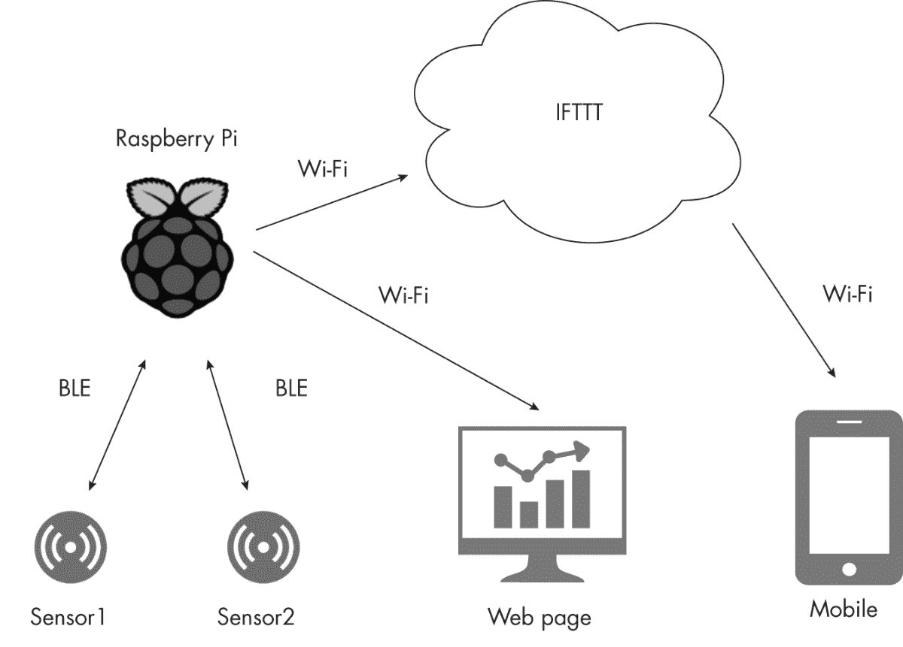
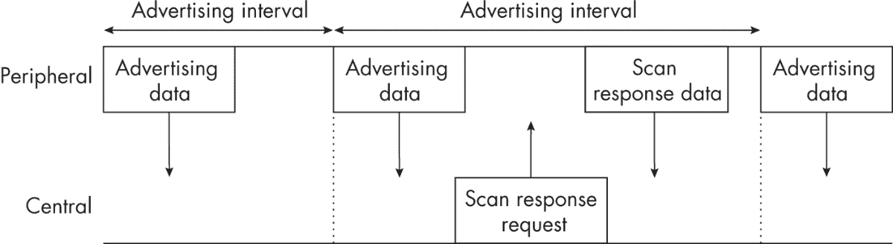
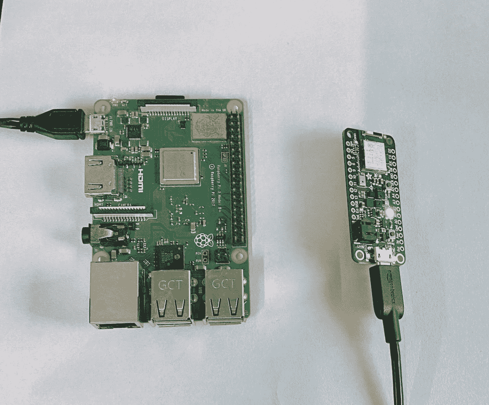

## # 物联网花园


我们生活在一个手机与灯泡对话、牙刷也想连接互联网的时代。这一切通过*物联网（**IoT**）*成为可能，物联网是由嵌入传感器的日常设备组成的网络，这些设备彼此和互联网进行通信，通常是无线方式。在本章中，你将构建自己的物联网传感器网络来监控花园中的温湿度状况。这个网络将由一个或多个低功耗设备组成，这些设备运行 Python 代码并将实时传感器数据通过无线方式传输到树莓派。树莓派将记录数据并通过本地 Web 服务器提供数据。你将能够通过 Web 浏览器查看传感器数据，并且在出现极端情况时，通过移动设备实时接收警报。

通过这个项目，你将学习到一些概念：

+   • 组建低功耗物联网传感器网络

+   • 理解低功耗蓝牙（BLE）协议的基础

+   • 在树莓派上构建 BLE 扫描器

+   • 使用 SQLite 数据库存储传感器数据

+   • 在树莓派上使用`Bottle`运行 Web 服务器

+   • 使用 IFTTT 向你的手机发送警报

## 工作原理

本项目中使用的物联网（IoT）设备是 Adafruit BLE Sense 开发板，它们内置了温度和湿度传感器。设备会定期进行测量，并通过低功耗蓝牙（BLE）无线传输传感器数据，我们将在接下来讨论。数据通过运行 BLE 扫描器的树莓派（Raspberry Pi）接收。树莓派使用数据库存储和检索数据，并且运行一个 Web 服务器，使其能够在网页上显示数据。此外，树莓派还具有检测温湿度数据异常的逻辑，并在发生异常时通过 IFTTT 服务向用户的移动设备发送警报。图 14-1 总结了项目的架构。



图 14-1：物联网花园系统架构

你可能会想，为什么一定需要树莓派呢？为什么传感器设备不能直接与互联网通信，而是通过树莓派进行中转？答案在于功耗。如果设备通过像 Wi-Fi 这样的协议直接与互联网连接，它们通常会消耗比使用 BLE 高出 10 倍以上的电量。这非常重要，因为物联网设备通常由电池供电，我们期望它们能够持续很长时间。图 14-1 中展示的这种架构，其中低功耗无线设备通过网关（在此为树莓派）进行通信，是物联网世界中常见的架构。

本项目架构的另一个特点是你的数据始终掌握在自己手中——准确地说，是存储在树莓派上的数据库中。你不会将数据上传到互联网，而是将其局限于本地网络。这对于基础的园艺数据来说可能不那么关键，但依然值得知道，物联网设备并不总是*需要*将所有数据通过互联网发送出去才能发挥作用。隐私和安全是两个重要原因，确保数据只有在真正必要时才暴露到互联网。在本项目中，你依然会稍微利用互联网，发送 IFTTT 警报。

### 蓝牙低功耗

BLE 是与蓝牙耳机和扬声器相同无线技术标准的子集，但它针对低功耗、使用电池的设备进行了优化。例如，BLE 就是你的智能手机与智能手表或健身追踪器之间通信的方式。通过 BLE 通信的设备可以分为*中央设备*和*外围设备*。通常，中央设备是功能更强的硬件，如笔记本电脑和手机，而外围设备则是功能较弱的硬件，如健身带和信标。在这个项目中，树莓派是中央设备，Adafruit BLE Sense 板是外围设备。

注意：中央设备和外围设备之间的区别并非总是那么明确。现代的 BLE 芯片允许同一硬件既能作为中央设备，也能作为外围设备，甚至两者兼有。

一个 BLE 外围设备通过*广告数据包*向外界表明其存在，如图 14-2 所示。这些数据包通常每隔几毫秒就会发送一次，包含的信息有外围设备的名称、传输功率、制造商数据、是否可以与中央设备连接等。中央设备持续扫描广告数据包，并可以利用包中的信息与外围设备建立通信。



图 14-2：BLE 广告方案

广告数据包的大小限制为仅 31 字节，以节省外围设备的电池，但外围设备可以选择通过单独的传输发送额外的信息包，这个过程被称为*扫描响应*。外围设备会在其正常广告数据包中指示是否有扫描响应可用。如果中央设备需要额外的数据，它会发送扫描响应请求，这会促使外围设备暂停发送广告数据包，改为发送扫描响应。不过，对于这个项目，你只需要传感器提供的非常少量的数据，因此你可以直接将温湿度数据放入广告数据包中。

在树莓派侧，你将使用 BlueZ（Linux 上的官方蓝牙协议栈）构建一个 BLE 扫描器。具体来说，你将使用以下三个命令行程序：

hciconfig 在程序初始化时重置树莓派上的 BLE

hcitool       扫描 BLE 外设

hcidump       读取来自 BLE 外设的广告数据

`hciconfig`和`hcitool`是树莓派操作系统安装的一部分，但你需要通过终端安装`hcidump`，如下所示：

```py
$ `sudo apt-get install bluez-hcidump`

```

以下是树莓派上使用这些工具的典型命令行会话。首先，在终端中运行`hcidump`，准备在扫描开始时输出数据包：

```py
pi@iotsensors:~ $ `sudo hcidump --raw`
HCI sniffer - Bluetooth packet analyzer ver 5.50
device: hci0 snap_len: 1500 filter: 0xffffffff

```

这告诉你`hcidump`正在等待 BLE 输入。接下来，在另一个终端中运行`hcitool`的`lescan`命令，开始扫描 BLE 设备：

```py
pi@iotsensors:~ $ `sudo hcitool lescan`
LE Scan...
DE:74:03:D9:3D:8B (unknown)
DE:74:03:D9:3D:8B IOTG1
36:D2:35:5A:BF:B0 (unknown)
8C:79:F5:8C:AE:DA (unknown)
5D:9F:EC:A0:09:51 (unknown)
5D:9F:EC:A0:09:51 (unknown)
60:80:0A:83:18:40 (unknown)
--`snip`--

```

这表示扫描器已经检测到大量 BLE 设备（现在它们无处不在！）。当你运行`lescan`命令时，`hcidump`开始输出广告包数据，因此你的`hcidump`终端现在应该充满了如下信息：

```py
< 01 0B 20 07 01 10 00 10 00 00 00
> 04 0E 04 01 0B 20 00
< 01 0C 20 02 01 01
> 04 0E 04 01 0C 20 00
> 04 3E 1B 02 01 02 01 8B 3D D9 03 74 DE 0F 0E FF 22 08 0A 31
  FE 49 4F 54 47 31 1B 36 30 CB
> 04 3E 16 02 01 04 01 8B 3D D9 03 74 DE 0A 02 0A 00 06 09 49
  4F 54 47 31 CB
> 04 3E 23 02 01 03 01 03 58 0A 00 6A 35 17 16 FF 06 00 01 09
  21 0A 13 71 DA 7D 1A 00 52 6F 63 69 6E 61 6E 74 65 C5
> 04 3E 1F 02 01 03 01 B9 D4 AE 7E 01 0E 13 12 FF 06 00 01 09
  21 0A 9E 54 20 C5 51 48 6D 61 6E 64 6F BE

```

由于你使用`--raw`选项启动了`hcidump`，所以消息作为十六进制字节输出（而不是人类可读的文本）。

这个示例展示了如何在命令行中手动使用 BlueZ 工具。对于这个项目，你将从树莓派上运行的 Python 代码中执行这些命令。Python 代码还会读取广告包并获取传感器数据。

### Bottle Web 框架

要通过网页接口监控传感器数据，你需要让树莓派运行一个 web 服务器。为此，你将使用`Bottle`，一个具有简单界面的 Python web 框架。（实际上，整个库由一个名为*bottle.py*的源文件组成。）以下是使用`Bottle`从树莓派提供一个简单网页所需的代码：

```py
from bottle import route, run
❶ @route('/hello')
def hello():
  ❷ return "Hello Bottle World!"
❸ run(host='`iotgarden.local`', port=`8080`, debug=True)

```

这段代码首先定义了一个 URL 或路径（在本例中是`/hello`），客户端可以在该路径上发送数据请求 ❶，并使用`Bottle`中的`route()`方法作为 Python 装饰器绑定到`hello()`函数，后者将作为该路径的处理函数。这样，当用户访问该路径时，`Bottle`将调用`hello()`函数，返回一个字符串 ❷。`run()`方法 ❸ 启动`Bottle`服务器，现在可以接受客户端的连接。这里我们假设服务器在名为`iotgarden`的树莓派的 8080 端口上运行。注意，`debug`标志已设置为`True`，以便更容易诊断问题。

在你的 Wi-Fi 连接的树莓派上运行这段代码，在任何连接到本地网络的计算机上打开浏览器，并访问*http://<iotgarden>.local:8080/hello/*，根据需要替换为你树莓派的名称。`Bottle`应该会为你提供一个显示“Hello Bottle World！”的网页。只需几行代码，你就创建了一个 web 服务器。

请注意，在你的项目中，你将稍微不同地使用`Bottle`路由函数，因为你将把路由绑定到类方法，而不是像之前的`hello()`那样绑定到自由函数。稍后会详细讲解这一点。

### SQLite 数据库

你需要一个地方来存储传感器数据，以便将来可以检索它。你可以将数据写入文本文件，但检索过程会很快变得繁琐。相反，你将使用 SQLite 来存储数据，SQLite 是一个轻量级、易于使用的数据库，非常适合像树莓派这样的嵌入式系统。为了在 Python 中访问 SQLite，你需要使用`sqlite3`库。

SQLite 数据库是通过 SQL 来操作的，SQL 是数据库系统的标准语言。这些 SQL 语句在你的 Python 代码中作为字符串编写。然而，对于这个项目，你不需要成为 SQL 专家。你只需要掌握几个基本命令，我们会在它们出现时逐一讲解。为了让你更好地了解它的工作方式，下面我们看一个简单的例子，展示如何在 Python 解释器会话中使用 SQLite。首先，下面是如何创建数据库并向其中添加一些条目的代码：

>>> `import sqlite3`

>>> `con = sqlite3.``connect('test.db')` ❶

>>> `cur = con.``cursor()` ❷

>>> `cur.``execute("``CREATE TABLE sensor_data (``TS datetime,` `ID text,` `VAL numeric)")` ❸

>>> `for i in range(10):`

...   `cur.execute("INSERT into sensor_data VALUES (datetime('now'),'ABC',  ?)", (i, ))` ❹

>>> `con.``commit()` ❺

>>> `con.``close()`

>>> `exit()`

在这里，你使用`sqlite3.connect()`方法并传入数据库的名称（在这个例子中是`test.db`）❶。该方法要么返回一个已存在数据库的连接，要么如果数据库不存在则创建一个新的数据库。然后，你使用连接对象创建一个*cursor*❷。这是一种构造，它允许你与数据库进行交互，创建表格、插入新条目和检索数据。你通过游标执行一个 SQL 语句，创建一个名为`sensor_data`的数据库表，其中包含以下列：`TS`（时间戳），类型为`datetime`；`ID`，类型为`text`；`VAL`，类型为`numeric`❸。接下来，你通过在`for`循环中执行 SQL `INSERT`语句，向这个数据库添加 10 个条目。每个语句都添加当前时间戳、字符串`'ABC'`和循环索引`i`❹。`?`是 SQLite 使用的格式占位符，实际值通过元组来指定。最后，你将更改提交到数据库，以使其永久生效❺，然后关闭数据库连接。

现在让我们从数据库中检索一些值：

```py
>>> `con = sqlite3.``connect('test.db')`
>>> `cur = con.``cursor()`
❶ >>> `cur.``execute("``SELECT * FROM sensor_data WHERE VAL > 5")`
>>> `print(cur.``fetchall())`
[('2021-10-16 13:01:22', 'ABC', 6), ('2021-10-16 13:01:22', 'ABC', 7),
 ('2021-10-16 13:01:22', 'ABC', 8), ('2021-10-16 13:01:22', 'ABC', 9)]

```

再次，你需要连接数据库并创建一个游标以与其交互。然后执行一个 `SELECT` SQL 查询来检索一些数据 ❶。在这个查询中，你请求从 `sensor_data` 表中选择所有行（`SELECT *`），并且 `VAL` 列中的值大于 `5`。你通过游标的 `fetchall()` 方法打印查询结果。

## 要求

在 Raspberry Pi 上，你需要使用 `bottle` 模块来创建一个 Web 服务器，使用 `sqlite3` 模块来操作 SQLite 数据库，并使用 `matplotlib` 来绘制传感器数据。由于 BLE Sense 开发板的计算能力不足以运行完整的 Python 版本，因此你将使用 CircuitPython 编程，这是一种由 Adafruit 维护的开源 MicroPython 衍生版本。我们在这个项目中使用 CircuitPython，而不是你在 第十二章 中看到的 MicroPython，因为前者对 Adafruit 制作的设备有更多的库支持。

你还需要以下硬件来完成此项目：

+   • 一个或多个 Adafruit Feather Bluefruit nRF52840 Sense 开发板，根据需求选择

+   • 一块 Raspberry Pi 3B+（或更新版）开发板，带有 SD 卡和电源适配器

+   • 每个 BLE Sense 开发板需要一个 3.7 V LiPo 电池或 USB 电源

图 14-3 显示了所需的硬件。



图 14-3：项目所需的硬件

你可以将 Raspberry Pi 安装在室内，靠近你的花园，并将你的 BLE Sense 开发板与适当的电源和保护外壳放置在花园中。

### Raspberry Pi 设置

要开始此项目，你需要设置你的 Raspberry Pi。请按照 附录 B 中的说明操作。接下来的项目代码假设你已将 Pi 命名为 `iotgarden`，这使得你可以通过网络访问它，地址为 `iotgarden.local`。

### CircuitPython 设置

要安装 CircuitPython，请按照以下步骤操作，为你的每个 Adafruit BLE Sense 开发板安装：

1.  1\. 访问 [`circuitpython.org/downloads`](https://circuitpython.org/downloads)，搜索你的 Bluefruit Sense 开发板，并下载该开发板的 CircuitPython 安装文件，该文件具有 *.uf2* 扩展名。请注意你正在下载的 CircuitPython 版本号。

1.  2\. 将 Adafruit 开发板连接到计算机的 USB 端口，并双击开发板上的重置按钮。开发板上的 LED 应该会变绿，并且你应该会看到一个新的驱动器出现在你的计算机上，名为 FTHRSNSBOOT。

1.  3\. 将 *.uf2* 文件拖动到 FTHRSNSBOOT 驱动器中。一旦文件复制完成，开发板上的 LED 会闪烁，计算机上将会出现一个名为 CIRCUITPY 的新驱动器。

接下来，你需要在开发板上安装所需的 Adafruit 库。操作步骤如下：

1.  1\. 访问[`circuitpython.org/libraries`](https://circuitpython.org/libraries)并下载与你的 CircuitPython 版本对应的*.zip*文件，其中包含库的捆绑包。

1.  2\. 解压下载的文件，并将以下文件/文件夹复制到 CIRCUITPY 驱动器中的一个名为*lib*的文件夹内。（如果*lib*文件夹不存在，请创建它。）

    +   ◦ *adafruit_apds9960*

    +   ◦ *adafruit_ble*

    +   ◦ *adafruit_bme280*

    +   ◦ *adafruit_bmp280.mpy*

    +   ◦ *adafruit_bus_device*

    +   ◦ *adafruit_lis3mdl.mpy*

    +   ◦ *adafruit_lsm6ds*

    +   ◦ *adafruit_register*

    +   ◦ *adafruit_sht31d.mpy*

    +   ◦ *neopixel.mpy*

1.  3\. 按下板上的重置按钮，项目就可以开始使用了。

默认情况下，CircuitPython 会运行 CIRCUITPY 驱动器中任何名为*code.py*的文件中的代码。你需要将以下章节中讨论的*ble_sensors.py*文件复制到驱动器，并将其重命名为*code.py*，才能运行该项目。

### If This Then That 设置

IFTTT 是一个 Web 服务，可以让你为特定的操作创建自动响应。你将使用 IFTTT 在传感器检测到温湿度异常时向你的手机发送警报。按照以下步骤设置以接收 IFTTT 警报：

1.  1\. 访问 IFTTT 网站([`ifttt.com`](https://ifttt.com))并注册一个账户。

1.  2\. 下载并设置 IFTTT 应用程序到你的智能手机。

1.  3\. 在浏览器中登录到你的 IFTTT 账户后，点击**创建**。然后点击“If This”框中的**添加**按钮。

1.  4\. 在弹出的“选择服务”页面上，搜索并选择**Webhooks**。然后选择**接收带 JSON 负载的 Web 请求**。

1.  5\. 在事件名称下，输入**TH_alert**（注意大小写），然后按**创建触发器**。

1.  6\. 现在你应该已经回到创建页面。点击“Then That”框中的**添加**按钮。

1.  7\. 搜索并选择**通知**。然后点击**从 IFTTT 应用发送通知**。

1.  8\. 在弹出的页面中，将文本“T/H Alert！”添加到消息框中。然后点击**添加成分**并选择**OccuredAt**。再点击**添加成分**并选择**JsonPayload**。

1.  9\. 点击**创建动作**按钮返回到创建页面。然后点击**继续**和**完成**以最终确认警报。

你需要 IFTTT 密钥才能通过 Python 代码触发警报。要查找它，请按照以下步骤操作：

1.  1\. 在 IFTTT 网站上，点击屏幕右上角的圆形账户图标并选择**我的服务**。

1.  2\. 点击**Webhooks**链接，然后点击**文档**按钮。

1.  3\. 页面加载时，顶部会显示你的密钥。记下这个密钥。你还会在此页面上找到如何将测试警报发送到你的智能手机的信息。如果进行测试，请确保填入**TH_alert**作为事件名称。

## 代码

该项目的代码分布在以下 Python 文件中：

ble_sensors.py 运行在 Adafruit BLE Sense 板上的 CircuitPython 代码。它从温湿度传感器读取数据，并将数据放入 BLE 广告数据包中。

BLEScanner.py 实现了在 Raspberry Pi 上运行的 BLE 扫描器，使用 BlueZ 工具读取广告数据。此代码还会发送 IFTTT 警报。

server.py 实现了在 Raspberry Pi 上运行的`Bottle` Web 服务器。

iotgarden.py 主程序文件。此代码设置 SQLite 数据库，并启动 BLE 扫描器和 Web 服务器。

除了 Python 文件，项目中还有一个名为*static*的子文件夹，里面包含一些由`Bottle` Web 服务器使用的额外文件：

static/style.css 服务器返回的 HTML 页面的样式表。

static/server.js 由服务器返回的 JavaScript 代码，用于获取传感器数据。

项目的完整代码可以在 [`github.com/mkvenkit/pp2e/tree/main/iotgarden`](https://github.com/mkvenkit/pp2e/tree/main/iotgarden) 上找到。

### CircuitPython 代码

运行在 BLE Sense 板上的 CircuitPython 代码有一个直接的目的：它从内置的温湿度传感器读取数据，并将这些数据放入板上的 BLE 广告数据包中。这个看似简单的任务需要导入意想不到数量的模块。要查看完整的代码列表，请跳到 “完整的 CircuitPython 代码”，该内容位于 第 343 页。代码也可以在 [`github.com/mkvenkit/pp2e/blob/main/iotgarden/ble_sensors/ble_sensors.py`](https://github.com/mkvenkit/pp2e/blob/main/iotgarden/ble_sensors/ble_sensors.py) 找到。

```py
import time, struct
import board
import adafruit_bmp280
import adafruit_sht31d
from adafruit_ble import BLERadio
❶ from adafruit_ble.advertising import Advertisement, LazyObjectField
❷ from adafruit_ble.advertising.standard import ManufacturerData,
                                              ManufacturerDataField
import _bleio
import neopixel

```

你导入了 Python 的内建模块`time`和`struct`，分别用于睡眠和打包数据。`board`模块让你能够访问`I2C`库，允许板上的 BLE 芯片通过 I²C 协议（读作“eye-squared-C”）与传感器进行通信。`adafruit_bmp280`和`adafruit_sht31d`模块用于与传感器通信，而`BLERadio`类用于启用 BLE 并发送广告数据包。在❶和❷位置的导入语句使你能够访问 Adafruit BLE 广告模块，这些模块对于创建你自己定制的、包含传感器数据的广告数据包是必要的。此外，你还将使用`_bleio`模块获取设备的 MAC 地址，并使用`neopixel`控制板上的 LED。

```py`#### Preparing BLE Packets    Next, define a class called `IOTGAdvertisement` to help create the BLE advertisement packets. The `adafruit_ble` library already has an `Advertisement` class that handles BLE advertisements. You create `IOTGAdvertisement` as a subclass of `Advertisement` to use the parent class’s features while adding your own customization:    ``` 类 IOTGAdvertisement(Advertisement):     flags = None   ❶ match_prefixes = (         struct.pack(             "<BHBH",  # 前缀格式             0xFF,     # 0xFF 是根据 BLE 规范定义的 "厂商特定数据"             0x0822,   # 2 字节公司 ID             struct.calcsize("<H9s"), # 数据格式             0xabcd # 我们的 ID         ), # 需要逗号 - 期望元组     )   ❷ manufacturer_data = LazyObjectField(         ManufacturerData,         "manufacturer_data",         advertising_data_type=0xFF, # 0xFF 是根据 BLE 规范定义的 "厂商特定数据"                                     # 根据 BLE 规范         company_id=0x0822,          # 2 字节公司 ID         key_encoding="<H",     )     # 设置厂商数据字段   ❸ md_field = ManufacturerDataField(0xabcd, "<9s")  ```py    The BLE standard is very particular, so this code may look intricate, but all it’s really doing is putting some custom data in the advertisement packet. First you fill a tuple called `match_prefixes` ❶, which the `adafruit_ble` library will use to manage various fields in the advertisement packet. The tuple has only one element, a packed structure of bytes that you create using the Python `struct` module. Next, you define the `manufacturer_data` field ❷, which will use the format described at ❶. The manufacturer data field is a standard part of a BLE advertisement packet that has some space for whatever custom data the manufacturer (or the user) wants to include. Finally, you create a custom `ManufacturerDataField` object ❸, which you’ll keep updating as sensor values change.    #### Reading and Sending Data    The `main()` function of the CircuitPython program reads and sends the sensor data. The function begins with some initializations:    ``` def main():     # 初始化 I2C   ❶ i2c = board.I2C()     # 初始化传感器   ❷ bmp280 = adafruit_bmp280.Adafruit_BMP280_I2C(i2c)   ❸ sht31d = adafruit_sht31d.SHT31D(i2c)     # 初始化 BLE   ❹ ble = BLERadio()     # 创建自定义广告对象   ❺ advertisement = IOTGAdvertisement()     # 将 MAC 地址的前 2 个十六进制字节（4 个字符）附加到名称中   ❻ addr_bytes = _bleio.adapter.address.address_bytes     name = "{0:02x}{1:02x}".format(addr_bytes[5], addr_bytes[4]).upper()     # 设置设备名称   ❼ ble.name = "IG" + name  ```py    First you initialize the `I2C` module ❶ so the BLE chip can communicate with the sensors. Then you initialize the modules for the temperature (`bmp280`) ❷ and humidity (`sht31d`) ❸ sensors. You also initialize the BLE radio ❹, which is required for transmitting the advertisement packets, and create an instance of your custom `IOTGAdvertisement` class ❺.    Next, you set the name of the BLE device to the string `IG` (for IoT Garden) followed by the first four hexadecimal digits (or two bytes) of the device’s MAC address ❼. For example, if the MAC address of the device is `de:74:03:d9:3d:8b`, the name of the device will be set to `IGDE74`. To do this, you first get the MAC address as bytes ❻. The bytes are in reverse order of the string representation, however—in our example MAC address, for instance, the first byte would be `0x8b`. What you’re looking for are the first two bytes, `0xde` and `0x74`, which are at indices `5` and `4` in `address_bytes`, respectively. You use string formatting to convert these bytes to string representation and convert them to uppercase using `upper()`.    Now let’s look at the rest of the initialization:    ```     # 设置初始值     # 仅使用名称的前 5 个字符   ❶ advertisement.md_field = ble.name[:5] + "0000"     # BLE 广播间隔，单位秒     BLE_ADV_INT = 0.2     # 启动 BLE 广播   ❷ ble.start_advertising(advertisement, interval=BLE_ADV_INT)     # 设置 NeoPixels 并关闭它们      pixels = neopixel.NeoPixel(board.NEOPIXEL, 1,                                 brightness=0.1, auto_write=False)  ```py    Here you set an initial value for your custom manufacturer data ❶. For this, you concatenate the first five characters of the device name followed by four bytes of zeros. You’ll update the first two bytes with the sensor data. As for the remaining two bytes, there’s an exercise waiting for you in “Experiments!” on page 343 where you can put them to use.    Next, you set the BLE advertisement interval (`BLE_ADV_INT`) to `0.2`, meaning the device will send out an advertisement packet every 0.2 seconds. Then you call the method to start sending advertisement packets ❷, passing your custom advertisement class and the time interval as arguments. You also initialize the `neopixel` library to control the LED on the board. The `board.NEOPIXEL` argument sets the pin number for the neopixel LED, and `1` represents the number of LEDs on the board. The brightness setting is `0.1` (the maximum being `1.0`), and setting the `auto_write` flag to `False` means you’ll need to call the `show()` method explicitly for the values to take. (You’ll see this in action soon.)    The `main()` function continues with a loop that reads the sensor data and updates the BLE packets:    ```     # 主循环     while True:         # 打印值 - 这将通过串行接口显示       ❶ print("Temperature: {:.1f} C".format(bmp280.temperature))         print("Humidity: {:.1f} %".format(sht31d.relative_humidity))         # 获取传感器数据       ❷ T = int(bmp280.temperature)+ 40         H = int(sht31d.relative_humidity)         # 停止广播       ❸ ble.stop_advertising()         # 更新广告数据       ❹ advertisement.md_field = ble.name[:5] + chr(T) + chr(H) + "00"         # 启动广播       ❺ ble.start_advertising(advertisement, interval=BLE_ADV_INT)         # 闪烁 NeoPixel LED         pixels.fill((255, 255, 0))         pixels.show()         time.sleep(0.1)         pixels.fill((0, 0, 0))         pixels.show()         # 睡眠 2 秒       ❻ time.sleep(2)  ```py    You begin the loop by printing out the values read by the sensors ❶. You can use this output to confirm that your sensors are putting out reasonable values. To see the values, connect the board via USB to your computer and use a serial terminal application such as CoolTerm, as explained in Chapter 12. The output should look something like this:    ``` 温度: 26.7 C 湿度: 55.6 %  ```py    Next, you read the temperature and humidity values from the sensors ❷, converting both to integers since you have only one byte to represent each value. You add 40 to the temperature to accommodate negative values. The BMP280 temperature sensor on the board has a range of −40°C to 85°C, so adding 40 converts this range to [0, 125]. You’ll be back to the correct range on the Raspberry Pi once the data is parsed from the BLE advertisement data.    You have to stop BLE advertising ❸ so you can change the data in the packets. Then you set the manufacturer data field with the first five characters of the device name, followed by one byte each of temperature and humidity values ❹. You’re using `chr()` here to encode each 1-byte value into a character. You also set the last two bytes in the data field to be zeros. Now that you’ve updated the sensor values in the packet, you restart advertising ❺. This way, the scanner on the Pi will pick up the new sensor values from the BLE board.    To provide a visual indicator that the device is alive, you blink its neopixel LED by turning it on for 0.1 second. The `fill()` method sets a color using an (R, G, B) tuple, and `show()` sets the value to the LED. Finally, you add a two-second delay before restarting the loop and checking the sensors again ❻. During that delay, the board will continue sending out the same advertisement packet every 0.2 seconds, as per its advertisement interval.    NOTE When you’ve tested the code and are ready to deploy your IoT device, I recommend commenting out the `print()` statements and the neopixel code to conserve power. Remember, BLE is all about low energy!````  ```py`### The BLE Scanner Code    The code to have your Raspberry Pi listen for and process sensor data over BLE is encapsulated in a class called `BLEScanner`. To see the complete code listing, skip ahead to “The Complete BLE Scanner Code” on page 345. You’ll also find this code in the book’s GitHub repository at [`github.com/mkvenkit/pp2e/blob/main/iotgarden/BLEScanner.py`](https://github.com/mkvenkit/pp2e/blob/main/iotgarden/BLEScanner.py).    Here’s the constructor for this class:    ``` 类 BLEScanner:     def __init__(self, dbname):         """BLEScanner 构造函数"""         self.T = 0         self.H = 0         # 最大值         self.TMAX = 30         self.HMIN = 20         # 上次警报的时间戳       ❶ self.last_alert = time.time()         # 警报间隔，单位秒       ❷ self.ALERT_INT = 60         # 扫描间隔，单位秒       ❸ self.SCAN_INT = 10         ❹ self._dbname = dbname         ❺ self.hcitool = None         self.hcidump = None         ❻ self.task = None         # -----------------------------------------------         # 外围设备允许列表 - 在此添加您的设备！         # -----------------------------------------------         ❼ self.allowlist = ["`DE:74:03:D9:3D:8B`"]  ```py    You start by defining instance variables `T` and `H` to keep track of the latest temperature and humidity values read from the sensors. Then you set threshold values for triggering the automated alerts. If the temperature goes above `TMAX` or the humidity goes below `HMIN`, the program will issue an alert using IFTTT. You create the `last_alert` variable at ❶ to store the time when the most recent alert was sent, and at ❷ you set the minimum interval between alerts. This is so you don’t keep sending yourself alerts continuously when an alert condition is met. At ❸, you set the scan interval in seconds to control how often the Pi will scan for BLE devices. Next, you save the name of the SQLite database that was passed into the constructor ❹. You need this to save values from the sensors.    At ❺ and the following line, you create a couple of instance variables to store process IDs for the `hcitool` and `hcidump` programs, which will run later. At ❻, you create a `task` instance variable. Later, you’ll be creating a separate thread to run this task, which will be doing the scanning, while the main thread of the program runs the web server. Finally, at ❼ you create a list of the BLE devices you want to listen to. When you run the BLE scanner, you’re likely to pick up many BLE peripherals, not just the Adafruit Sense boards. Keeping a list with your sensor device IDs makes the BLE data easier to parse. Later in the chapter, I’ll show you how to look up the device IDs so you can add them here to your allowlist.    #### Working with the BlueZ Tools    As we discussed in “Bluetooth Low Energy” on page 313, this project uses BlueZ, Linux’s official Bluetooth protocol stack, to scan for BLE data. The `BLEScanner` class needs methods for working with these tools. First we’ll examine the `start_scan()` method, which sets up the BlueZ tools for BLE scanning.    ``` def start_scan(self):     """启动扫描所需的 BlueZ 工具"""     print("BLE 扫描启动...")     # 重置设备   ❶ ret = subprocess.run(['sudo', '-n', 'hciconfig', 'hci0', 'reset'],                          stdout=subprocess.DEVNULL)     print(ret)     # 启动 hcitool 进程   ❷ self.hcitool = subprocess.Popen(['sudo', '-n', 'hcitool',                                      'lescan', '--duplicates'],                                     stdout=subprocess.DEVNULL)     # 启动 hcidump 进程   ❸ self.hcidump = subprocess.Popen(['sudo', '-n', 'hcidump', '--raw'],                                     stdout=subprocess.PIPE)  ```py    First you reset the BLE device of the Raspberry Pi using the `hciconfig` tool ❶. You use the Python `subprocess` module to run this process. The `subprocess.run()` method takes the process arguments as a list, so this call executes the command `sudo -n hciconfig hci0 reset`. The output of this process `stdout` is set to `DEVNULL`, which just means you don’t care about messages printed out by this command. (The `-n` flag in `sudo` makes it noninteractive.) You next use a different `subprocess` method called `Popen()` to run the command `sudo -n hcitool lescan --duplicates` ❷. This process scans for BLE peripheral devices. The `--duplicates` flag ensures that the same device can come up in the scan list repeatedly. You need this, since the sensor data in the advertisement packets keeps changing, and you need the latest values.    NOTE The difference between `subprocess.run()` and `subprocess.Popen()` is that the former waits for the process to complete, whereas the latter returns immediately while the process runs in the background.    Finally, you use `subprocess.Popen()` to run another command: `sudo -n hcidump --raw` ❸. As we discussed earlier in the chapter, this command intercepts and prints out the advertisement data as hexadecimal bytes. Notice that `stdout` is set to `subprocess.PIPE` in this case. This means you can read the output from this process similar to how you read the contents of a file. More on this in “Parsing the Data” below.    Now let’s look at the `stop_scan()` method, which kills the processes begun in the `start_scan()` method when you’re ready to stop scanning for BLE packets.    ``` def stop_scan(self):     """通过结束 BlueZ 工具进程来停止 BLE 扫描"""     subprocess.run(['sudo', 'kill', str(self.hcidump.pid), '-s', 'SIGINT'])     subprocess.run(['sudo', '-n', 'kill', str(self.hcitool.pid),                      '-s', "SIGINT"])     print("BLE 扫描停止.")  ```py    Here you kill off the `hcidump` and `hcitool` processes using `pid`, their process IDs. The command `sudo -n kill pid -s SIGINT` kills a process with the given `pid` by sending it the `SIGINT` interrupt signal.    #### Parsing the Data    The scanner needs methods for parsing the BLE data it receives. First we’ll consider the `parse_hcidump()` method, which parses the output from the `hcidump` process:    ``` def parse_hcidump(self):     data = ""     (macid, name, T, H) = (None, None, None, None)     while True:       ❶ line = self.hcidump.stdout.readline()       ❷ line = line.decode()         if line.startswith('> '):             data = line[2:]         elif line.startswith('< '):             data = ""         else:             if data:               ❸ data += line               ❹ data = " ".join(data.split())               ❺ fields = self.parse_data(data)                     success = False                   ❻ try:                         macid = fields["macid"]                         T = fields["T"]                         H = fields["H"]                         name = fields["name"]                         success = True                     except KeyError:                         # 跳过此错误，因为它表示                         # 数据无效                       ❼ pass                     if success:                       ❽ return (macid, name, T, H)  ```py    Within a `while` loop, you start reading one line at a time from `self.hcidump.stdout` using the `readline()` method ❶, much like you’d read lines from a file. To understand the code that follows, it helps to know a bit about the data being parsed. This is what a typical output from `hcidump` looks like:    ``` > 04 3E 1B 02 01 02 01 8B 3D D9 03 74 DE 0F 0E FF 22 08 0A 31   FE 49 4F 54 47 31 1B 36 30 CB  ```py    The output is split across two lines, and it starts with a *>* character. You want to take these two lines and combine them to get a single string such as `"04 3E 1B 02 01 02 01 8B 3D D9 03 74 DE 0F 0E FF 22 08 0A 31 FE 49 4F 54 47 31 1B 36 30 CB"`. To do this, you convert the bytes output from `readline()` to a string using the `decode()` method ❷. Then you use some logic to build up the final string that you want. If the line starts with `>`, you know it’s the first of the set of two lines making up an `hcidump` entry, so you store the line and go on to the next one. Lines that start with `<` are ignored. If a line starts with neither `>` nor `<`, then it’s the second line of the advertisement, and you join the lines together ❸.    The resulting data will have newline characters in the middle and the end. You get rid of those using a combination of the `split()` and `join()` string methods ❹. This example illustrates how the scheme works:    ``` >>> `x = "ab cd\n ef\tff\r\n"` >>> `x.split()` ['ab', 'cd', 'ef', 'ff'] >>> `" ".join(x.split())` 'ab cd ef ff'  ```py    Notice from the first line of output how the `split()` method automatically splits up the string at the whitespace characters, producing a list of substrings and removing the whitespace characters in the process. This gets rid of the unwanted newline characters, but it also gets rid of the spaces, which you want to keep. That’s where the `join()` method comes in. It merges the list items back into a single string, with a space between each substring, as you can see in the second output line.    Returning to the `parse_hcidump()` method, you now have a complete BLE advertisement packet stored as a string in variable `data`. You call the `parse_data()` method on this string to get the device details in the form of a `fields` dictionary ❺. We’ll look at this method soon. Then you retrieve the MAC ID, name, temperature, and humidity values from the dictionary. This code is enclosed in a `try` block ❻ in case the data isn’t what you expect. In that case, an exception will be thrown, and you skip that advertisement packet by calling `pass` ❼. If you successfully retrieve all the values, they’re returned as a tuple ❽.    Now let’s take a look at the `parse_data()` method you used in `parse_hcidump()` to build the `fields` dictionary:    ``` def parse_data(self, data):     fields = {}     # 解析 MACID   ❶ x = [int(val, 16) for val in data.split()]   ❷ macid = ":".join([format(val, '02x').upper() for val in x[7:13][::-1]])     # 检查 MACID 是否在允许列表中   ❸ if macid in self.allowlist:         # 查看第 6 字
