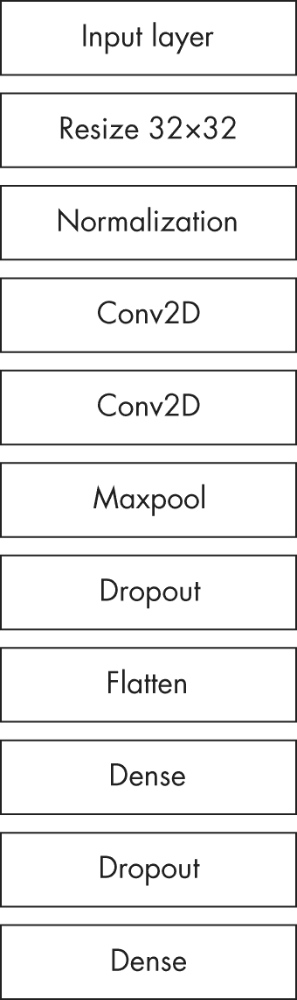
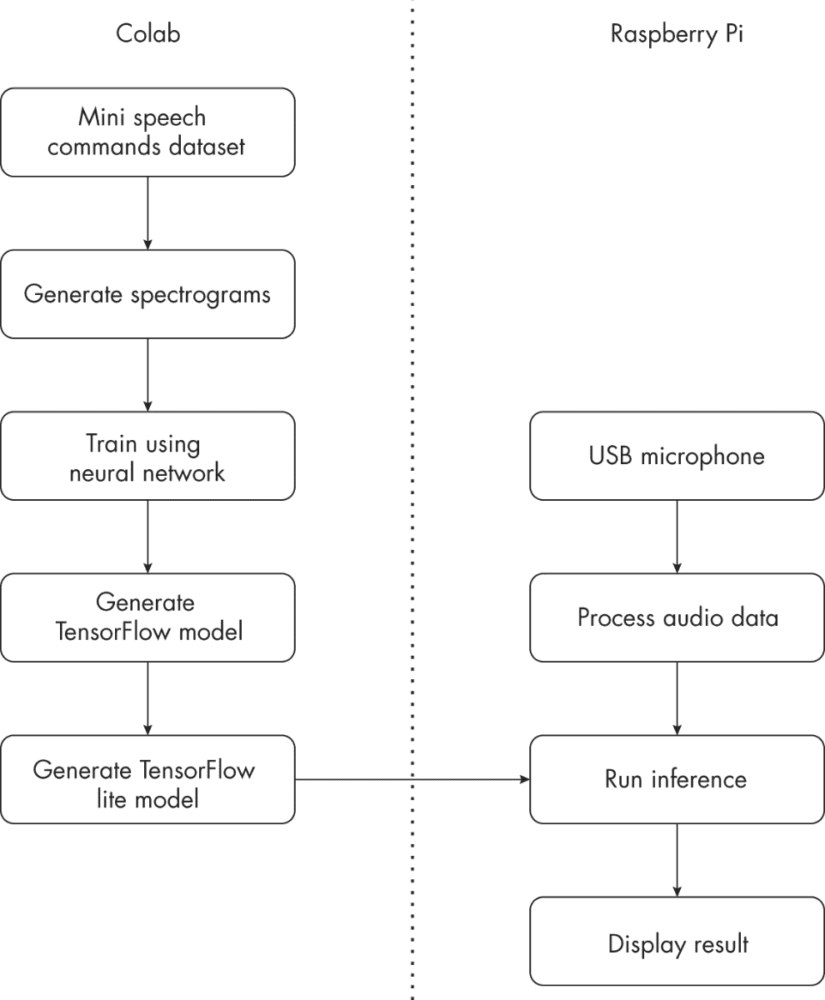
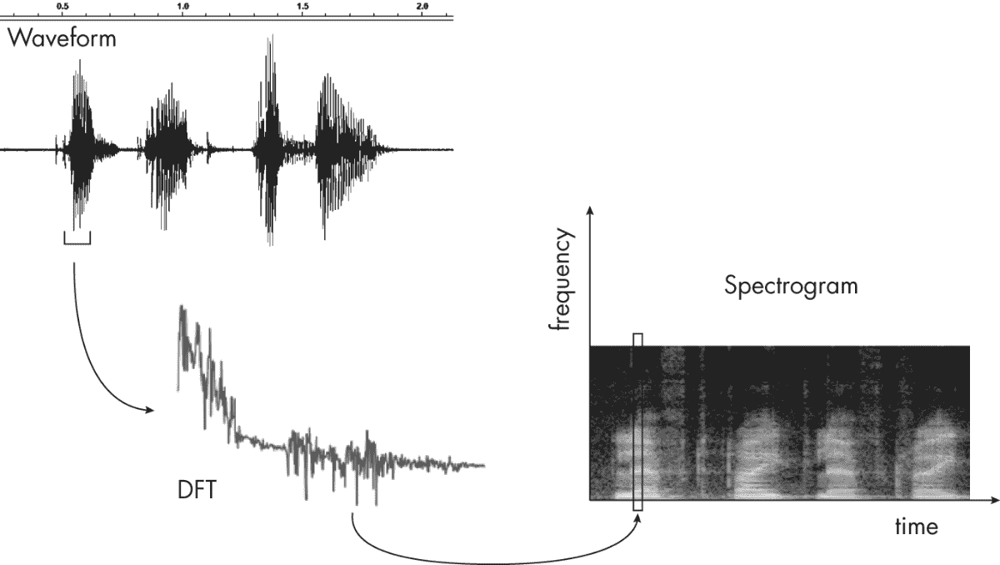
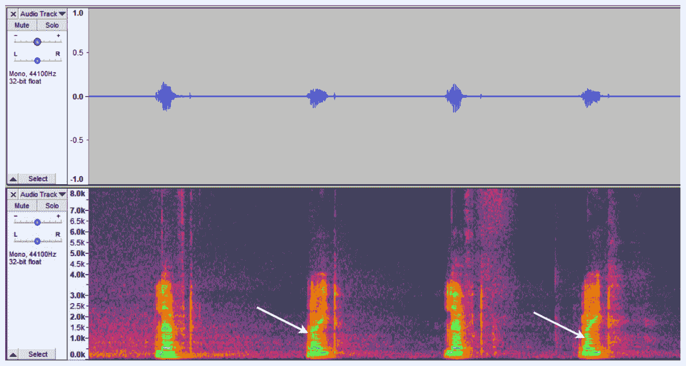
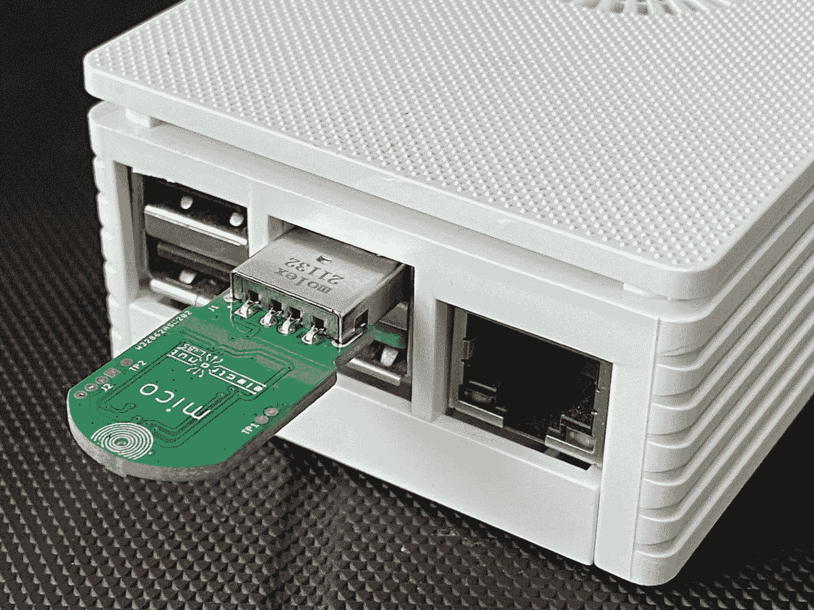
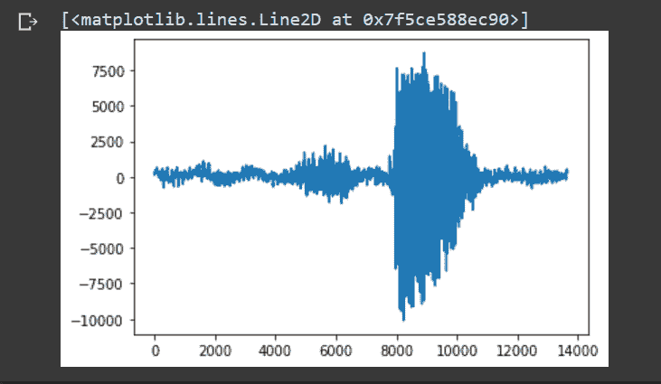
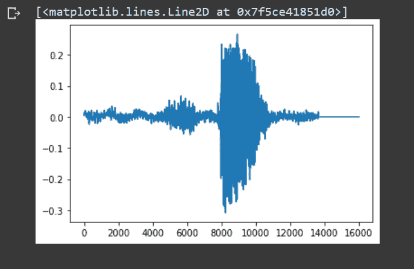
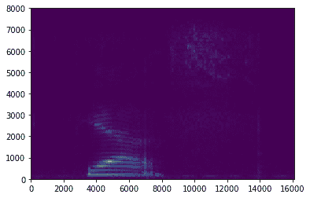
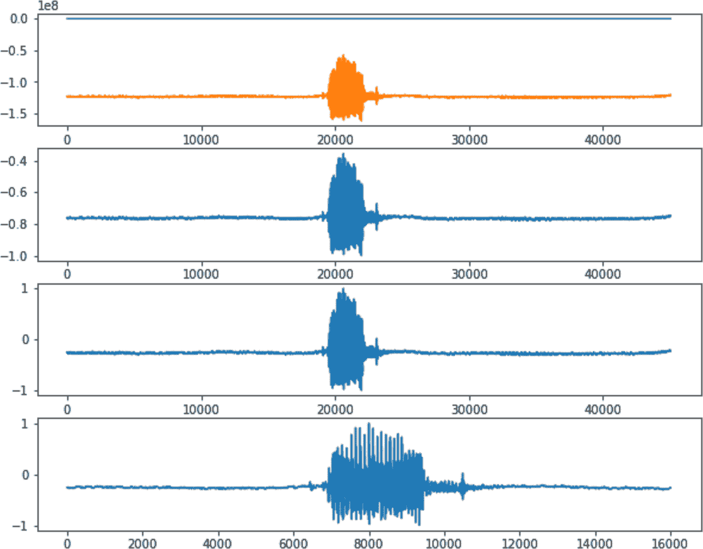

## 第十六章：# 树莓派上的音频机器学习


在过去的十年里，*机器学习（ML）*已经风靡全球。从面部识别到预测文本再到自动驾驶汽车，机器学习无处不在，而且我们似乎每天都在听到有关机器学习新应用的消息。在本章中，你将使用 Python 和 TensorFlow 开发一个基于机器学习的语音识别系统，该系统将运行在廉价的树莓派计算机上。

语音识别系统已经在大量设备和家电中得到应用，形式为语音助手，如 Alexa、Google 和 Siri。这些系统可以执行从设置提醒到在办公室控制家里灯光等任务。但所有这些平台都需要你的设备连接到互联网，并且你需要注册他们的服务。这就引出了隐私、安全性和电力消耗的问题。你的灯泡*真的*需要连接互联网才能响应语音命令吗？答案是*不*。通过这个项目，你将了解如何设计一个在低功耗设备上运行的语音识别系统，而不需要设备连接到互联网。

通过这个项目，你将学习到一些概念，包括：

+   • 使用机器学习工作流来解决问题

+   • 使用 TensorFlow 和 Google Colab 创建机器学习模型

+   • 精简一个机器学习模型以便在树莓派上使用

+   • 处理音频并使用短时傅里叶变换（STFT）生成谱图

+   • 利用多进程并行运行任务

## 机器学习概述

在一本书的单一章节中很难公正地讲解像机器学习这么广泛的话题。因此，我们的做法是将机器学习视为解决问题的另一个工具——在本例中，就是区分不同的语音单词。事实上，像 TensorFlow 这样的机器学习框架已经变得如此成熟和易于使用，以至于即使你不是这个领域的专家，也能够有效地将机器学习应用于实际问题。所以，在本节中，我们将简要介绍与本项目相关的机器学习术语。

机器学习（ML）是更大计算机科学领域——*人工智能（AI）*的一部分，尽管在大众媒体提到人工智能时，通常指的就是机器学习。机器学习本身由不同的方法和算法组成的多个子学科构成。在这个项目中，你将使用机器学习的一个子集——*深度学习*，它利用*深度神经网络（**DNNs**）*来识别大量数据中的特征和模式。深度神经网络源自于*人工神经网络（ANNs）*，后者大致模仿我们大脑中的神经元。人工神经网络由多个*节点*构成，每个节点有多个输入。每个节点还有一个与之相关的*权重*。人工神经网络的输出通常是输入和权重的非线性函数。这个输出可以连接到另一个人工神经网络的输入。当你有多个层的人工神经网络时，网络就变成了深度神经网络。通常，网络的层数越多——即网络越深——学习模型的准确性也就越高。

在这个项目中，你将使用*监督学习*过程，该过程可以分为两个阶段。第一个阶段是*训练阶段*，你需要向模型展示若干输入及其期望的输出。例如，如果你正在构建一个人类存在检测系统来识别视频帧中是否有人，你将在训练阶段展示这两种情况的示例（有人的情况与没有人的情况），每个示例都要正确标注。接下来是*推理阶段*，在这个阶段，你会展示新的输入，模型根据在训练过程中学到的内容对其进行预测。继续上述示例，你将向人类存在检测系统展示新的视频帧，模型会预测每一帧中是否有一个人。（还有*无监督学习*过程，在该过程中，机器学习系统通过未标记的数据尝试自行发现模式。）

一个机器学习模型有许多数值*参数*，这些参数帮助模型处理数据。在训练过程中，这些参数会自动调整，以最小化期望值和模型预测值之间的误差。通常，使用一种叫做*梯度下降*的算法来最小化误差。除了机器学习模型在训练过程中调整的参数外，还有一些*超参数*，这些变量会调整整个模型的设置，比如使用哪种神经网络架构或训练批次的大小。图 15-1 展示了我为这个项目选择的神经网络架构。



图 15-1：语音识别项目的神经网络架构

网络架构中的每一层代表对数据的一种处理形式，旨在帮助提高模型的准确性。网络设计并非简单任务，仅仅定义每一层并不能告诉我们它是如何工作的。一个更广泛的问题是，*为什么*我选择了这个特定的网络。答案是，通过实验需要确定适合当前项目的最佳网络架构。通常的做法是尝试不同的神经网络架构，并观察哪一种在训练后能产生最准确的结果。也有一些由机器学习研究者发布的架构，已知它们表现良好，这为实际应用提供了一个很好的起点。

注：有关机器学习的更多信息，我强烈推荐 Andrew Glassner（《深度学习：一种视觉方法》，No Starch Press，2021 年）所著的书籍。该书将帮助你对该主题有更好的直观理解，而不会过多涉及数学或代码。对于全面且实践性强的学习方式，我还推荐 Andrew Ng 教授在 Coursera 上的在线机器学习课程。

## 工作原理

在这个项目中，你将使用谷歌的 TensorFlow 机器学习框架，使用包含语音命令的音频文件集训练神经网络。然后，你将把训练好的模型的优化版本加载到配有麦克风的树莓派上，以便树莓派在你发出命令时能够识别它们。图 15-2 展示了该项目的框图。



图 15-2：语音识别项目的框图

在项目的训练部分，你将在 Google Colab（即 Colaboratory）中进行操作，这是一个免费的云端服务，允许你在网页浏览器中编写和运行 Python 程序。使用 Colab 有两个优点。首先，你不需要在本地计算机上安装 TensorFlow，也不用处理与不同版本 TensorFlow 相关的不兼容问题。其次，Colab 运行的机器通常比你的计算机更强大，因此训练过程将更快。作为训练数据，你将使用来自 Google 的 Mini Speech Commands 数据集，这是 2018 年发布的更大 Speech Commands 数据集的一个子集。它包含成千上万条样本录音，内容包括*yes*（是）、*no*（否）、*up*（向上）、*down*（向下）、*left*（向左）、*right*（向右）、*stop*（停止）和*go*（开始），所有录音均标准化为 16 位 WAV 文件，采样率为 16,000 Hz。你将生成每个录音的*声谱图*，这是一种图像，显示音频的频率内容如何随时间变化，并利用这些声谱图通过 TensorFlow 训练一个深度神经网络（DNN）。

注意：本项目的训练部分灵感来自谷歌官方的 TensorFlow 示例“简单音频识别”。你将使用与该示例相同的神经网络架构。然而，本项目的其余部分与谷歌的示例有很大不同，因为我们的目标是在树莓派上识别实时音频，而后者是在现有的 WAV 文件上进行推理。

一旦训练完成，你将把训练好的模型转换为一个简化格式，称为 TensorFlow Lite，该格式旨在运行在硬件性能较低的设备上，如嵌入式系统，并将该精简模型加载到树莓派上。在树莓派上，你将运行 Python 代码，持续监控 USB 麦克风的音频输入，获取音频的频谱图，并对这些数据进行推理，识别出训练集中的语音命令。你将把模型识别出的命令打印到串口监视器上。

### 频谱图

本项目中的一个关键步骤是生成音频数据的频谱图——包括用于训练模型的预先存在的数据和在推理过程中遇到的实时数据。在第四章中，你已经看到如何通过频谱图揭示音频样本在特定时刻的频率。接着，在第十三章中，你学习了如何使用一种数学工具，*离散傅里叶变换（DFT）*，来计算频谱图。频谱图本质上就是一系列通过傅里叶变换器生成的频谱图，这些频谱图共同展示了某些音频数据的频率内容如何随时间变化。

你需要每个音频样本的频谱图，而不是单一的频谱图，因为人类语音的声音非常复杂。即使是一个单词，其声音中的频率也会发生显著变化，而且这种变化具有独特的方式。当这个词被发音时，频率会随着时间的推移而变化。对于本项目，你将处理每个持续一秒钟的音频片段，每个片段由 16,000 个样本组成。如果你一次性计算整个片段的单一离散傅里叶变换（DFT），你无法准确显示频率如何随时间变化，因此也无法可靠地识别正在说的词。相反，你将把音频片段分成一段段重叠的时间窗口，并计算每个时间窗口的 DFT，从而得到频谱图所需的一系列频谱图。图 15-3 展示了这种计算方法，称为*短时傅里叶变换（**STFT**）*。



图 15-3：计算信号的频谱图

STFT 为你提供了音频的*M*个离散傅里叶变换（DFT），它们在均匀的时间间隔内取样。时间沿着频谱图的 x 轴显示。每个 DFT 给出了*N*个频率桶，以及每个桶内的声音强度。频率桶被映射到频谱图的 y 轴。因此，频谱图呈现出一个*M*×*N*的图像。图像中的每一列像素代表一个 DFT，颜色则用来表示给定频率带中的信号强度。

你可能会想，为什么这个项目需要使用傅里叶变换呢？为什么不直接使用音频片段的波形，而是从这些波形中提取频率信息呢？要回答这个问题，可以参考图 15-4。



图 15-4：语音样本的波形和频谱图

图的上半部分显示了一个录音的波形，该录音为“左、右、左、右”序列。图的下半部分显示了该录音的频谱图。仅从波形来看，可以看到两个*左*听起来大致相似，两个*右*也类似，但很难从每个词的波形中提取出明显的识别特征。相反，频谱图揭示了与每个词相关的更多视觉特征，比如每个*右*实例中的明亮 C 形曲线（由箭头所示）。我们可以用自己的眼睛更清楚地看到这些独特的特征，神经网络同样也能“看到”它们。

最终，由于频谱图本质上是图像，获取数据的频谱图将语音识别问题转化为图像分类问题，使我们能够利用已有的丰富的机器学习技术来进行图像分类。（当然，波形也可以作为图像处理，但正如你所看到的，频谱图在捕捉音频数据的“特征”方面更为出色，因此更适合用于机器学习应用。）

### 树莓派上的推理

树莓派上的代码必须完成几个任务：它需要读取来自附加麦克风的音频输入，计算该音频的频谱图，并使用训练好的 TensorFlow Lite 模型进行推理。以下是一个可能的操作顺序：

1.  1. 读取麦克风数据，持续一秒钟。

1.  2. 处理数据。

1.  3. 进行推理。

1.  4. 重复。

然而，这种方法有一个大问题。你在忙于执行步骤 2 和 3 时，可能会错过更多的语音数据。解决方法是使用 Python 的多进程功能并行执行不同任务。你的主进程只负责收集音频数据并将其放入队列。在另一个独立且同时进行的进程中，你会从队列中取出这些数据并对其进行推理。以下是新的方案：

主进程

1.  1. 读取麦克风数据，持续一秒钟。

1.  2. 将数据放入队列。

推理进程

1.  1\. 检查队列中是否有数据。

1.  2\. 对数据进行推理。

现在主进程不会错过任何音频输入，因为将数据放入队列是一个非常快速的操作。但另一个问题也随之而来。你正在从麦克风连续收集一秒钟的音频样本并进行处理，但你不能假设所有的语音命令都能完美地适应这些一秒钟的时间间隔。命令可能出现在边缘，并被分割到两个连续的样本中，在这种情况下，它可能在推理过程中无法识别。一个更好的方法是创建重叠样本，如下所示：

主进程

1.  1\. 对于第一个帧，收集一个两秒钟的样本。

1.  2\. 将两秒钟的样本放入队列。

1.  3\. 收集另一个一秒钟的样本。

1.  4\. 通过将步骤 2 中的样本后半部分移到前面，并用步骤 3 中的样本替换后半部分来创建一个两秒钟的样本。

1.  5\. 返回步骤 2。

推理过程

1.  1\. 检查队列中是否有数据。

1.  2\. 基于峰值幅度对两秒数据中的一秒部分进行推理。

1.  3\. 返回步骤 1。

在这个新方案中，每个放入队列的样本都是两秒钟长的，但连续样本之间有一秒钟的重叠，如图 15-5 所示。这样，即使一个词在一个样本中被部分截断，你也可以在下一个样本中获得完整的词。你仍然只会对一秒钟的片段进行推理，并且会以两秒钟样本中幅度最大的位置为中心来处理这些片段。这是最有可能包含语音单词的部分。你需要将片段长度保持为一秒钟，以保持与训练数据的一致性。


图 15-5：两帧重叠方案

通过这种多进程和重叠样本的结合，你将设计一个语音识别系统，最大限度地减少丢失的输入并提高推理结果。

## 要求

对于这个项目，你需要在 Google Colab 上注册，以便训练你的机器学习模型。在树莓派上，你需要以下 Python 模块：

+   • `tflite_runtime`用于运行 TensorFlow 推理

+   • `scipy`用于计算音频波形的 STFT

+   • `numpy`数组用于处理音频数据

+   • `pyaudio`用于从麦克风输入流式传输音频数据

这些模块的安装请参见附录 B。你还将使用 Python 内置的`multiprocessing`模块来在与音频处理线程分开的线程中运行机器学习推理。

在硬件方面，你将需要以下设备：

+   • 一台树莓派 3B+或更新版本

+   • 一个 5V 电源供应给树莓派

+   • 一张 16GB 的 SD 卡

+   • 一只与树莓派兼容的单通道 USB 麦克风

各种类型的 USB 麦克风都可以与 Raspberry Pi 兼容。图 15-6 展示了一个例子。



图 15-6：Raspberry Pi 的 USB 麦克风

要检查你的 Pi 是否能识别 USB 麦克风，可以通过 SSH 连接到 Pi 并运行以下命令：

```py
$ `dmesg -w`

```

现在，将你的麦克风插入 Pi 的 USB 端口。你应该会看到类似以下的输出：

[26965.023138] usb 1-1.3: 新的 USB 设备已找到，idVendor=cafe，idProduct=4010，bcdDevice= 1.00

[26965.023163] usb 1-1.3: 新的 USB 设备字符串：Mfr=1，Product=2，SerialNumber=3

[26965.023179] usb 1-1.3: 产品：Mico

[26965.023194] usb 1-1.3: 厂商：Electronut Labs

[26965.023209] usb 1-1.3: 序列号：123456

信息应该与麦克风的规格匹配，表明它已被正确识别。

## 代码

这个项目的代码分为两个部分：训练部分，你将在 Google Colab 中运行；推理部分，你将在 Raspberry Pi 上运行。我们将逐一检查这两个部分。

### 在 Google Colab 中训练模型

在本节中，我们将查看在 Google Colab 中训练语音识别模型所需的代码。我建议在 Chrome 浏览器中使用 Colab。你将从设置环境并下载训练数据集开始。然后，你将运行一些代码来了解数据。你会清理数据以准备训练，并探索如何从数据生成频谱图。最后，你将通过创建和训练模型将所学知识付诸实践。最终结果将是一个 *.tflite* 文件，这是训练模型的精简版 TensorFlow Lite，可以加载到你的 Raspberry Pi 上。你还可以从本书的 GitHub 仓库 [`github.com/mkvenkit/pp2e/tree/main/audioml`](https://github.com/mkvenkit/pp2e/tree/main/audioml) 下载该文件。

Google Colab 笔记本由一系列单元格组成，你可以在其中输入一行或多行 Python 代码。输入所需的代码后，可以通过点击单元格左上角的播放图标来运行它。与该单元格代码相关的任何输出将显示在单元格下方。在本节中，每个代码示例代表一个完整的 Google Colab 单元格。如果有输出，它将以灰色显示在示例的末尾，位于虚线下方。

#### 设置

你开始你的 Colab 笔记本时进行一些初始设置。首先导入所需的 Python 模块：

```py
import os
import pathlib
import matplotlib.pyplot as plt
import numpy as np
import scipy
import scipy.signal
from scipy.io import wavfile
import glob
import tensorflow as tf
from tensorflow.keras.layers.experimental import preprocessing
from tensorflow.keras import layers
from tensorflow.keras import models
from tensorflow.keras import applications

```

在下一个单元格中，你进行一些初始化操作：

```py
# set seed for random functions
seed = 42
tf.random.set_seed(seed)
np.random.seed(seed)

```

在这里，你初始化了将用于打乱输入文件名的随机函数。

接下来，下载训练数据：

data_dir = 'data/mini_speech_commands'

data_path = pathlib.Path(data_dir)

filename = 'mini_speech_commands.zip'

url = "http://storage.googleapis.com/download.tensorflow.org/data/mini_speech_commands.zip"

if not data_path.exists():

tf.keras.utils.get_file(filename, origin=url, extract=True, cache_dir='.',

cache_subdir='data')

这个单元格从 Google 下载 Mini Speech Commands 数据集，并将数据提取到一个名为*data*的目录中。由于你使用的是 Colab，数据将被下载到云端的文件系统中，而不是本地计算机，当你的会话结束时，这些文件将被删除。然而，在会话仍然有效的情况下，你不希望每次运行单元格时都要重新下载数据。`tf.keras.utils.get_file()`函数会缓存数据，这样你就不需要一直下载它了。

#### 了解数据

在开始训练模型之前，查看一下你刚刚下载的数据，熟悉数据内容会很有帮助。你可以使用 Python 的`glob`模块，它通过模式匹配帮助你查找文件和目录：

```py
glob.glob(data_dir + '/*')

['data/mini_speech_commands/up',

 'data/mini_speech_commands/no',

 'data/mini_speech_commands/README.md',

 'data/mini_speech_commands/stop',

 'data/mini_speech_commands/left',

 'data/mini_speech_commands/right',

 'data/mini_speech_commands/go',

 'data/mini_speech_commands/down',

 'data/mini_speech_commands/yes']

You pass `glob` the `'/*'` pattern to list all the first-level directories within the *data* directory (`*` is a wildcard character). The output shows you that the dataset comes with a *README.md* text file and eight subdirectories for the eight speech commands you’ll be training the model to identify. For convenience, you create a list of the commands:

```

commands = ['up', 'no', 'stop', 'left', 'right', 'go', 'down', 'yes']

```py

In your machine learning model, you’ll be matching audio samples to a `label_id` integer denoting one of the commands. These integers will correspond to the indices from the `commands` list. For example, a `label_id` of `0` indicates `'up'`, and a `label_id` of `6` indicates `'down'`.
Now take a look at what’s in those subdirectories:

```

❶ wav_file_names = glob.glob(data_dir + '/*/*')

❷ np.random.shuffle(wav_file_names)

print(len(wav_file_names))

for file_name in wav_file_names[:5]:

print(file_name)

8000

data/mini_speech_commands/down/27c30960_nohash_0.wav

data/mini_speech_commands/go/19785c4e_nohash_0.wav

data/mini_speech_commands/yes/d9b50b8b_nohash_0.wav

data/mini_speech_commands/no/f953e1af_nohash_3.wav

data/mini_speech_commands/stop/f632210f_nohash_0.wav

你再次使用`glob`，这次使用模式`'/*/*'`来列出子目录中的所有文件 ❶。然后你随机打乱返回的文件名列表，以减少训练数据中的任何偏差 ❷。你打印出找到的文件总数，以及前五个文件名。输出结果表明数据集中有 8000 个 WAV 文件，并且能让你大致了解文件的命名方式——例如，*f632210f_nohash_0.wav*。

接下来，查看数据集中的一些单独 WAV 文件：

filepath = 'data/mini_speech_commands/stop/f632210f_nohash_1.wav' ❶

rate, data = wavfile.read(filepath) ❷

print("rate = {}, data.shape = {}, data.dtype = {}".format(rate, data.shape, data.dtype))

filepath = 'data/mini_speech_commands/no/f953e1af_nohash_3.wav'

rate, data = wavfile.read(filepath)

print("rate = {}, data.shape = {}, data.dtype = {}".format(rate, data.shape, data.dtype))

rate = 16000, data.shape = (13654,), data.dtype = int16

rate = 16000, data.shape = (16000,), data.dtype = int16

你设置一个 WAV 文件的名称，想要查看该文件❶，然后使用`wavefile`模块从`scipy`读取文件中的数据❷。接着，你打印采样率、形状（样本数）和数据类型。你对第二个 WAV 文件做相同的操作。输出结果显示，两个 WAV 文件的采样率都为 16,000，符合预期，并且每个样本都是 16 位整数，这也是预期的。然而，形状表明第一个文件只有 13,654 个样本，这是一个问题。为了训练神经网络，每个 WAV 文件需要有相同的长度；在这种情况下，你希望每个录音文件的长度为一秒钟，即 16,000 个样本。不幸的是，数据集中的并非所有文件都符合这个标准。我们稍后会看看这个问题的解决方案，但首先，试着绘制其中一个 WAV 文件的数据：

```py
filepath = 'data/mini_speech_commands/stop/f632210f_nohash_1.wav'
rate, data = wavfile.read(filepath)
❶ plt.plot(data)

```



你使用`matplotlib`创建音频波形图❶。该数据集中的 WAV 文件包含 16 位有符号数据，范围从−32,768 到+32,767。图表的 y 轴显示，这个文件中的数据仅在大约−10,000 到+7,500 之间。图表的 x 轴也强调了数据不足 16,000 个样本——x 轴只显示到 14,000。

```py

```

#### 数据清理

你已经看到，数据集需要标准化，以便每个片段的长度为一秒钟。这类预处理工作称为*数据清理*，你可以通过用零填充音频数据，直到其长度达到 16,000 个样本来完成这项工作。你还应该进一步清理数据，进行*归一化*——将每个样本的值从范围[−32,768, +32,767]映射到[−1, 1]的范围。这种类型的归一化对机器学习至关重要，因为保持输入数据小且一致有助于训练。（对于那些对数学感兴趣的人来说，输入数据中较大的数值会导致梯度下降算法在训练数据时收敛出现问题。）

作为数据清理的一个例子，你将在上一段中查看的 WAV 文件上应用填充和归一化操作。然后，你绘制结果以确认清理工作已经完成。

```py
❶ padded_data = np.zeros((16000,), dtype=np.int16)
❷ padded_data[:data.shape[0]] = data
❸ norm_data = np.array(padded_data/32768.0, dtype=np.float32)
plt.plot(norm_data)

```



你创建一个长度为 16,000 的 16 位`numpy`数组，填充为零❶。然后你使用数组切片操作符`[:]`，将过短的 WAV 文件的内容复制到数组的开头❷。这里，`data.shape[0]`给出了原始 WAV 文件中的样本数，因为`data.shape`是一个形如`(13654,)`的元组。现在你得到了一个一秒钟的 WAV 数据，包含了原始的音频数据，后面跟着必要的零填充。接下来，你通过将数组中的值除以 32,768（16 位整数的最大值）来创建数据的归一化版本❸。然后，你绘制数据。

输出的 x 轴显示数据已经被填充，扩展到了 16,000 个样本，其中从 14,000 到 16,000 的值都为零。同时，y 轴显示所有的值都已被归一化，恰好落在（−1, 1）的范围内。

#### 查看频谱图

正如我们讨论过的，你不会在 WAV 文件的原始数据上训练模型。相反，你将生成文件的频谱图，并用它们来训练模型。下面是生成频谱图的一个示例：

```py
filepath = 'data/mini_speech_commands/yes/00f0204f_nohash_0.wav'
rate, data = wavfile.read(filepath)
❶ f, t, spec = scipy.signal.stft(data, fs=16000, nperseg=255,
                               noverlap = 124, nfft=256)
❷ spec = np.abs(spec)
print("spec: min = {}, max = {}, shape = {}, dtype = {}".format(np.min(spec),
                                       np.max(spec), spec.shape, spec.dtype))
❸ X = t * 129*124
❹ plt.pcolormesh(X, f, spec)

spec: min = 0.0, max = 2089.085693359375, shape = (129, 124), dtype = float32



You pick an arbitrary WAV file from the *yes* subdirectory and extract its data using the `wavfile` module from `scipy`, as before. Then you use the `scipy.signal.stft()` function to compute the spectrogram of the data ❶. In this function call, `fs` is the sampling rate, `nperseg` is the length of each segment, and `noverlap` is the number of overlapping samples between consecutive segments. The `stft()` function returns a tuple comprising three members: `f`, an array of frequencies; `t`, an array of the time intervals mapped to the range [0.0, 1.0]; and `spec`, the STFT itself, a grid of 129×124 complex numbers (these dimensions are given as `shape` in the output). You use `np.abs()` to convert the complex numbers in `spec` into real numbers ❷. Then you print some information about the computed spectrogram. Next, you create an array `X` to hold the sample numbers corresponding to the time intervals ❸. You get these by multiplying `t` by the dimensions of the grid. Finally, you use the `pcolormesh()` method to plot the grid in `spec`, using the values in `X` as the grid’s x-axis and the values in `f` as the y-axis ❹.
The output shows the spectrogram. This 129×124 grid of values (an image), and many more like it, will be the input for the neural network. The bright spots around 1,000 Hz and lower, starting around 4,000 samples in, are where the frequency content is most prominent, while darker areas represent less prominent frequencies.
NOTE Notice that the y-axis in the spectrogram images goes up to only about 8,000 Hz. This is a consequence of the *sampling theorem* in digital signal processing, which states that the maximum frequency that can be accurately measured in a digitally sampled signal is half the sampling rate. In this case, that maximum frequency works out to 16,000/2 = 8,000 Hz.

```

#### 训练模型

现在你已经准备好将注意力转向训练机器学习模型，这主要意味着要抛弃像 `numpy` 和 `scipy` 这样的 Python 库，转而使用像 `tf.Tensor` 和 `tf.data.Dataset` 这样的 TensorFlow 方法和数据结构。到目前为止，你一直在使用 `numpy` 和 `scipy`，因为它们提供了一个方便的方式来探索语音命令数据集，实际上你仍然可以继续使用它们，但那样你就错过了 TensorFlow 提供的优化机会，TensorFlow 是为大规模机器学习系统设计的。你会发现，TensorFlow 为大多数你到目前为止做的计算提供了几乎相同的函数，因此过渡会非常平滑。就我们的讨论而言，当我提到 *张量* 时，你可以理解为它类似于 `numpy` 数组。

为了训练机器学习模型，你需要能够从输入音频文件的文件路径中提取频谱图和标签 ID（即说出的命令）。为此，首先创建一个计算 STFT 的函数：

```py
def stft(x):
  ❶ f, t, spec = scipy.signal.stft(x.numpy(), fs=16000, nperseg=255,
                                   noverlap=124, nfft=256)
  ❷ return tf.convert_to_tensor(np.abs(spec))

```

这个函数接收 `x`，即从 WAV 文件中提取的数据，并像之前一样使用 `scipy` 计算其 STFT ❶。然后你将返回的 `numpy` 数组转换为 `tf.Tensor` 对象并返回结果 ❷。事实上，有一个类似于 `scipy.signal.stft()` 方法的 TensorFlow 方法叫做 `tf.signal.stft()`，那么为什么不使用它呢？答案是，TensorFlow 方法在树莓派上不可用，在那里你将使用精简版的 TensorFlow Lite 解释器。在训练阶段进行的任何预处理，应该与推理阶段的预处理相同，因此你需要确保在 Colab 中使用的函数与在树莓派上使用的函数相同。

现在，你可以在一个辅助函数中使用 `stft()` 函数，从文件路径中提取频谱图和标签 ID。

```py
def get_spec_label_pair(filepath):
    # read WAV file
    file_data = tf.io.read_file(filepath)
    data, rate = tf.audio.decode_wav(file_data)
    data = tf.squeeze(data, axis=-1)
    # add zero padding for N < 16000
  ❶ zero_padding = tf.zeros([16000] - tf.shape(data), dtype=tf.float32)
    # combine data with zero padding
  ❷ padded_data = tf.concat([data, zero_padding], 0)
    # compute spectrogram
  ❸ spec = tf.py_function(func=stft, inp=[padded_data], Tout=tf.float32)
    spec.set_shape((129, 124))
    spec = tf.expand_dims(spec, -1)
    # get label
  ❹ cmd = tf.strings.split(filepath, os.path.sep)[-2]
  ❺ label_id = tf.argmax(tf.cast(cmd == commands, "uint32"))
    # return tuple
    return (spec, label_id)

```

您首先使用 `tf.io.read_file()` 读取文件，然后使用 `tf.audio.decode_wav()` 函数解码 WAV 格式。（后者类似于您之前使用的 `scipy.io.wavfile.read()` 函数。）接下来，您使用 `tf.squeeze()` 将 `data` 张量的形状从 (*N*, 1) 改变为 (*N*, )，这是后续函数所需的形状。接着，您创建一个用于对数据进行零填充的张量 ❶。然而，张量是不可变对象，因此您不能像之前处理 `numpy` 数组那样直接将 WAV 数据复制到全零张量中。相反，您需要创建一个包含所需零数的张量，并将其与数据张量进行连接 ❷。

接下来，您使用 `tf.py_function()` 调用您之前定义的 `stft()` 函数 ❸。在此调用中，您还需要指定输入和输出的数据类型。这是从 TensorFlow 调用非 TensorFlow 函数的常见方法。然后，您对 `stft()` 返回的张量进行一些重塑操作。首先，您使用 `set_shape()` 将其重塑为 (129, 124)，这是因为您要从 TensorFlow 函数转到 Python 函数再返回。然后，您运行 `tf.expand_dims(spec, -1)` 来添加第三个维度，从 (129, 124) 变为 (129, 124, 1)。神经网络模型需要这额外的维度。最后，您提取与文件路径相关联的标签（例如，'no'）并将标签字符串转换为整数 `label_id` ❺，这是您 `commands` 列表中字符串的索引。

接下来，您需要准备用于训练的输入文件。回想一下，您有 8,000 个音频文件在子目录中，并且已经随机对它们的文件路径字符串进行了洗牌，并将它们放入名为 `wav_file_names` 的列表中。现在，您将数据分为三部分：80%（6,400 个文件）用于训练；10%（800 个文件）用于验证；另外 10% 用于测试。这种分割在机器学习中是常见的做法。一旦使用训练数据训练模型，您可以使用验证数据通过更改超参数来调整模型的准确性。测试数据仅用于检查（调整后的）模型的最终准确性。

```py
train_files = wav_file_names[:6400]
val_files = wav_file_names[6400:7200]
test_files = wav_file_names[7200:]

```

现在，您将文件路径字符串加载到 TensorFlow 的`Dataset`对象中。这些对象对于使用 TensorFlow 非常关键；它们保存您的输入数据并允许进行数据转换，所有这些操作都可以大规模进行：

```py
train_ds = tf.data.Dataset.from_tensor_slices(train_files)
val_ds = tf.data.Dataset.from_tensor_slices(val_files)
test_ds = tf.data.Dataset.from_tensor_slices(test_files)

```

看一下您刚刚创建的内容：

对于 `train_ds` 中的每个值，执行以下操作（取前 5 个）：

打印 `val`。

tf.Tensor(b'data/mini_speech_commands/stop/b4aa9fef_nohash_2.wav', shape=(), dtype=string)

tf.Tensor(b'data/mini_speech_commands/stop/962f27eb_nohash_0.wav', shape=(), dtype=string)

--snip--

tf.Tensor(b'data/mini_speech_commands/left/cf87b736_nohash_1.wav', shape=(), dtype=string)

每个 `Dataset` 对象包含一组 `string` 类型的张量，每个张量都保存一个文件路径。然而，你真正需要的是与这些文件路径对应的 `(spec, label_id)` 对。在这里你创建了这些对：

```py
train_ds = train_ds.map(get_spec_label_pair)
val_ds = val_ds.map(get_spec_label_pair)
test_ds = test_ds.map(get_spec_label_pair)

```

你使用 `map()` 函数将 `get_spec_label_pair()` 应用到每个 `Dataset` 对象。这种将函数映射到列表的技术在计算中很常见。实际上，你在遍历 `Dataset` 对象中的每个文件路径时，会调用 `get_spec_label_pair()`，并将生成的 `(spec, label_id)` 对保存在一个新的 `Dataset` 对象中。

现在，你需要通过将数据集拆分成更小的批次来进一步为训练做准备：

```py
batch_size = 64
train_ds = train_ds.batch(batch_size)
val_ds = val_ds.batch(batch_size)

```

在这里，你将训练集和验证集的批量大小设置为 64。这是加速训练过程的常见技术。如果你尝试一次性处理所有 6400 个训练样本和 800 个验证样本，将会占用大量内存并且导致训练变慢。

现在，你终于准备好创建你的神经网络模型了：

```py
❶ input_shape = (129, 124, 1)
❷ num_labels = 8
norm_layer = preprocessing.Normalization()
❸ norm_layer.adapt(train_ds.map(lambda x, _: x))
❹ model = `models`.Sequential([
    layers.Input(shape=input_shape),
    preprocessing.Resizing(32, 32),
    norm_layer,
    layers.Conv2D(32, 3, activation='relu'),
    layers.Conv2D(64, 3, activation='relu'),
    layers.MaxPooling2D(),
    layers.Dropout(0.25),
    layers.Flatten(),
    layers.Dense(128, activation='relu'),
    layers.Dropout(0.5),
    layers.Dense(num_labels),
])
❺ model.summary()

Model: "sequential_3"

_____________________________________________________________________

 Layer (type)                      Output Shape            Param #

=====================================================================

 resizing_3 (Resizing)            (None, 32, 32, 1)        0

 normalization_3 (Normalization)  (None, 32, 32, 1)        3

 conv2d_5 (Conv2D)                (None, 30, 30, 32)       320

 conv2d_6 (Conv2D)                (None, 28, 28, 64)       18496

 max_pooling2d_3 (MaxPooling2D)   (None, 14, 14, 64)       0

 dropout_6 (Dropout)              (None, 14, 14, 64)       0

 flatten_3 (Flatten)              (None, 12544)            0

 dense_6 (Dense)                  (None, 128)              1605760

 dropout_7 (Dropout)              (None, 128)              0

 dense_7 (Dense)                  (None, 8)                1032

=====================================================================

Total params: 1,625,611

Trainable params: 1,625,608

Non-trainable params: 3

You set the shape of the input into the first layer of the model ❶ and then set the number of labels ❷, which will be the number of units in the model’s output layer. Next, you set up a normalization layer for the spectrogram data. This will scale and shift the data to a distribution centered on 1 with a standard deviation of 1\. This is a common practice in ML that improves training. Don’t let the `lambda` scare you ❸. All it’s doing is defining an anonymous function that picks out just the spectrogram from each `(spec, label_id)` pair in the training dataset. The `x, _: x` is just saying to ignore the second element in the pair and return only the first element.
You next create the neural network model, one layer at a time ❹. The layers correspond to the architecture we viewed earlier in Figure 15-1. Finally, you print out a summary of the model ❺, which is shown in the output. The summary tells you all the layers in the model, the shape of the output tensor at each stage, and the number of trainable parameters in each layer.
Now you need to compile the model. The compilation step sets the optimizer, the loss function, and the data collection metrics for the model:

```

model.compile(

optimizer=tf.keras.optimizers.Adam(),

loss=`tf.keras.losses`.SparseCategoricalCrossentropy(from_logits=True),

metrics=['accuracy'],

)

```py

A *loss function* is a function used to measure how well a neural network is doing by comparing the output of the model to the known correct training data. An *optimizer* is a method used to adjust the trainable parameters in a model to reduce the losses. In this case, you’re using an optimizer of type `Adam` and a loss function of type `SparseCategoricalCrossentropy`. You also get set up to collect some accuracy metrics, which you’ll use to check how the training went.
Next, you train the model:

EPOCHS = 10

history = model.fit(

    train_ds,

    validation_data=val_ds,

    epochs=EPOCHS,

    callbacks=tf.keras.callbacks.EarlyStopping(verbose=1, patience=15), ❶

)

Epoch 1/10

100/100 [==============================] - 38s 371ms/step - loss: 1.7219 - accuracy: 0.3700

                                         - val_loss: 1.2672 - val_accuracy: 0.5763

Epoch 2/10

100/100 [==============================] - 37s 368ms/step - loss: 1.1791 - accuracy: 0.5756

                                         - val_loss: 0.9616 - val_accuracy: 0.6650

--snip--

Epoch 10/10

100/100 [==============================] - 39s 388ms/step - loss: 0.3897 - accuracy: 0.8639

                                         - val_loss: 0.4766 - val_accuracy: 0.8450

You train the model by passing the training dataset `train_ds` into `model.fit()`. You also specify the validation dataset `val_ds`, which is used to evaluate how accurate the model is. The training takes place over 10 *epochs*. During each epoch, the complete set of training data is shown to the neural network. The data is randomly shuffled each time, so training across multiple epochs allows the model to learn better. You use the `callback` option ❶ to set up a function to exit the training if it turns out that the training loss is no longer decreasing with each epoch.
Running this Colab cell will take some time. The progress will be shown on the screen as the training is in process. Looking at the output, the `val_accuracy` listed under Epoch 10 shows that the model was about 85 percent accurate at running inference on the validation data by the end of the training. (The `val_accuracy` metric corresponds to the validation data, while `accuracy` corresponds to the training data.)
Now you can try the model by running inference on the testing portion of the data:

```

test_audio = []

test_labels = []

❶ 对于音频和标签，在 test_ds 中进行迭代：

test_audio.append(audio.numpy())

test_labels.append(label.numpy())

❷ test_audio = np.array(test_audio)

test_labels = np.array(test_labels)

❸ y_pred = np.argmax(model.predict(test_audio), axis=1)

y_true = test_labels

❹ test_acc = sum(y_pred == y_true) / len(y_true)

print(f'测试集准确率: {test_acc:.0%}')

25/25 [==============================] - 1s 35ms/step

测试集准确率：84%

你首先通过遍历测试数据集 `test_ds` ❶ 填充两个列表，`test_audio` 和 `test_labels`。然后，你从这些列表中创建 `numpy` 数组 ❷，并对数据进行推断 ❸。你通过计算预测结果与真实值匹配的次数，并将其除以总项数，来计算测试精度 ❹。输出显示精度为 84%。虽然不是完美的，但对于这个项目来说已经足够好了。

```py

```

#### 导出模型到 Pi

恭喜！你已经拥有了一个完全训练好的机器学习模型。现在，你需要将它从 Colab 移到 Raspberry Pi。第一步是保存模型：

```py
model.save('audioml.sav')

```

这会将模型保存到云端的一个名为 *audioml.sav* 的文件中。接下来，将该文件转换为 TensorFlow Lite 格式，以便你可以在 Raspberry Pi 上使用它：

```py
❶ converter = tf.lite.TFLiteConverter.from_saved_model('audioml.sav')
❷ tflite_model = converter.convert()
❸ with open('audioml.tflite', 'wb') as f:
    f.write(tflite_model)

```

你创建一个 `TFLiteConverter` 对象，并传入保存的模型文件名 ❶。然后你进行转换 ❷ 并将简化后的 TensorFlow 模型写入名为 *audioml.tflite* 的文件中 ❸。现在，你需要将这个 *.tflite* 文件从 Colab 下载到你的计算机。运行以下代码片段会弹出一个浏览器提示框，要求你保存 *.tflite* 文件：

```py
from google.colab import files
files.download('audioml.tflite')

```

一旦你有了文件，就可以使用我们在其他章节中讨论过的 SSH 将其传输到你的 Raspberry Pi。

### 在 Raspberry Pi 上使用模型

现在我们将关注 Raspberry Pi 部分的代码。这段代码使用并行处理从麦克风获取音频数据，将数据准备好供你训练的 ML 模型使用，并将数据传给模型进行推理。像往常一样，你可以在本地计算机上编写代码，然后通过 SSH 将其传输到 Pi 上。要查看完整代码，请参见“完整代码”（第 389 页）。你也可以从[`github.com/mkvenkit/pp2e/tree/main/audioml`](https://github.com/mkvenkit/pp2e/tree/main/audioml)下载代码。

#### 设置

首先，导入所需的模块：

```py
from scipy.io import wavfile
from scipy import signal
import numpy as np
import argparse
import pyaudio
import wave
import time
from tflite_runtime.interpreter import Interpreter
from multiprocessing import Process, Queue

```

接下来，你初始化一些被定义为全局变量的参数：

```py
VERBOSE_DEBUG = False
CHUNK = 4000
FORMAT = pyaudio.paInt16
CHANNELS = 1
SAMPLE_RATE = 16000
RECORD_SECONDS = 1
NCHUNKS = int((SAMPLE_RATE * RECORD_SECONDS) / CHUNK)
ND = 2 * CHUNK * NCHUNKS
NDH = ND // 2
# device index of microphone
❶ dev_index = -1

```

`VERBOSE_DEBUG`是你将在代码中多个地方使用的一个标志。现在，你将其设置为`False`，但如果通过命令行选项将其设置为`True`，它将打印出大量的调试信息。

注意：我已经省略了后续代码清单中的`print()`调试语句。你可以在完整代码清单和本书的 GitHub 存储库中找到它们。

下一个全局变量用于处理音频输入。`CHUNK`设置了使用`PyAudio`一次读取的数据样本数，`FORMAT`指定音频数据将由 16 位整数构成。你将`CHANNELS`设置为`1`，因为你将使用单声道麦克风，并将`SAMPLE_RATE`设置为`16000`，以与 ML 训练数据保持一致。`RECORD_SECONDS`表示你将把音频分成一秒钟的片段（如前所述，稍后将拼接成重叠的两秒片段）。你计算每秒录音中的块数为`NCHUNKS`。你将使用`ND`和`NDH`来实现重叠技术——稍后会详细说明。

最后，你初始化麦克风的设备索引号为`-1` ❶。一旦你知道麦克风的索引，您需要在命令行中更新此值。以下是一个帮助你找出麦克风索引的函数。你可以将此函数作为命令行选项调用。

```py
def list_devices():
    """list pyaudio devices"""
    # initialize pyaudio
  ❶ p = pyaudio.PyAudio()
    # get device list
    index = None
  ❷ nDevices = p.get_device_count()
    print('\naudioml.py:\nFound the following input devices:')
  ❸ for i in range(nDevices):
        deviceInfo = p.get_device_info_by_index(i)
        if deviceInfo['maxInputChannels'] > 0:
            print(deviceInfo['index'], deviceInfo['name'],
                  deviceInfo['defaultSampleRate'])
    # clean up
  ❹ p.terminate()

```

你初始化`PyAudio` ❶并获取它检测到的音频设备数量❷。然后，你遍历这些设备❸。对于每个设备，你通过`get_device_info_by_index()`获取设备信息，并打印出具有一个或多个输入通道的设备——也就是麦克风。最后，你清理`PyAudio` ❹。

这是该函数的典型输出：

```py
audioml.py:
Found the following input devices:
1 Mico: USB Audio (hw:3,0) 16000.0

```

这表示有一个名为 Mico 的输入设备，其默认采样率为 16,000，索引为`1`。

#### 获取音频数据

Pi 的主要任务之一是不断从麦克风获取音频输入，并将其分割成可以进行推理的片段。为此，你创建了一个`get_live_input()`函数。该函数需要一个`interpreter`对象来与 TensorFlow Lite 模型一起工作。以下是函数的开始部分：

```py
def get_live_input(interpreter):
    # create a queue object
  ❶ dataq = Queue()
    # start inference process
  ❷ proc = Process(target = inference_process, args=(dataq, interpreter))
    proc.start()

```

正如我们在“它是如何工作的”中讨论的，你需要使用不同的进程来读取音频数据和执行推理，以避免丢失任何输入。你创建了一个`multiprocessing.` `Queue`对象，进程将通过它进行通信❶。然后，你使用`multiprocessing.` `Process()`创建推理进程❷。你指定了进程的处理函数名称为`inference_process`，该函数以`dataq`和`interpreter`对象作为参数（稍后我们将查看该函数）。接下来，你启动进程，使推理过程与数据捕获并行运行。

你继续`get_live_input()`函数，通过初始化`PyAudio`：

```py
    # initialize pyaudio
  ❶ p = pyaudio.PyAudio()
    print('opening stream...')
  ❷ stream = p.open(format = FORMAT,
                    channels = CHANNELS,
                    rate = SAMPLE_RATE,
                    input = True,
                    frames_per_buffer = CHUNK,
                    input_device_index = dev_index)
    # discard first 1 second
  ❸ for i in range(0, NCHUNKS):
        data = stream.read(CHUNK, exception_on_overflow = False)

```

你创建一个`PyAudio`对象`p`❶并打开一个音频输入流❷，使用一些全局变量作为参数。然后，你丢弃前一秒钟的数据❸。这是为了忽略在麦克风首次启用时进入的任何无效数据。

现在你准备开始读取数据了：

```py
    # count for gathering two frames at a time
  ❶ count = 0
  ❷ inference_data = np.zeros((ND,), dtype=np.int16)
    print("Listening...")
    try:
      ❸ while True:
            chunks = []
          ❹ for i in range(0, NCHUNKS):
                data = stream.read(CHUNK, exception_on_overflow = False)
                chunks.append(data)
            # process data
            buffer = b''.join(chunks)
          ❺ audio_data = np.frombuffer(buffer, dtype=np.int16)

```

你将`count`初始化为`0`❶。你将使用这个变量来跟踪读取的一秒钟音频数据帧的数量。然后你初始化一个 16 位数组`inference_data`，并用零填充❷。它有`ND`个元素，代表两秒钟的音频。接下来，你进入一个`while`循环来持续处理音频数据❸。在这个循环中，你使用`for`循环❹逐块读取每秒钟的音频数据，并将这些块附加到`chunks`列表中。一旦你获得了一秒钟的数据，就将其转换为`numpy`数组❺。

接下来，仍然在前一段代码中开始的`while`循环内，你实现了我们在“它是如何工作的”中讨论的技术，创建重叠的两秒钟音频片段。你将使用`NDH`全局变量提供帮助。

```py
            if count == 0:
                # set first half
              ❶ inference_data[:NDH] = audio_data
                count += 1
            elif count == 1:
                # set second half
              ❷ inference_data[NDH:] = audio_data
                # add data to queue
              ❸ dataq.put(inference_data)
                count += 1
            else:
                # move second half to first half
              ❹ inference_data[:NDH] = inference_data[NDH:]
                # set second half
              ❺ inference_data[NDH:] = audio_data
                # add data to queue
              ❻ dataq.put(inference_data)

```

第一次读取一秒钟的帧时，它会被存储在`inference_data`的前半部分❶。接下来的数据帧存储在`inference_data`的后半部分❷。现在你有了完整的两秒钟音频数据，所以你将`inference_data`放入队列中，等待推理过程来提取它❸。对于每个后续帧，数据的后半部分会被移到`inference_data`的前半部分❹，新数据会设置到后半部分❺，然后`inference_data`会添加到队列❻。这就创建了每个连续两秒钟音频片段之间所需的重叠一秒钟。

`while`循环发生在一个`try`块内部。要退出循环，你只需按下 CTRL-C 并触发以下`except`块：

```py
    except KeyboardInterrupt:
        print("exiting...")
    stream.stop_stream()
    stream.close()
    p.terminate()

```

这个`except`块进行了一些基本的清理工作，停止并关闭流，并终止`PyAudio`。

#### 准备音频数据

接下来，你将创建一些函数来准备音频数据进行推理。第一个是`process_audio_data()`，它接收一个从队列中提取的原始两秒音频片段，并基于峰值振幅提取最有趣的那一秒音频。我们将在几个代码片段中查看这个函数：

```py
def process_audio_data(waveform):
    # compute peak to peak based on scaling by max 16-bit value
  ❶ PTP = np.ptp(waveform / 32768.0)
    # return None if too silent
  ❷ if PTP < 0.3:
        return []

```

如果没有人说话，你希望跳过对麦克风音频输入的推理。然而，环境中总会有一些噪声，因此你不能简单地检查信号是否为 0。相反，当音频的峰峰振幅（即最高值与最低值之间的差）低于某个阈值时，你会跳过推理。为此，首先你将音频除以`32768`，将其标准化到（−1，1）范围内，然后将结果传递给`np.ptp()`来获取峰峰振幅❶。标准化使得阈值可以更方便地表达为一个分数。如果峰峰振幅低于`0.3`❷，你将返回一个空列表（这将跳过推理过程）。你可能需要根据环境噪声级别调整这个阈值值。

`process_audio_data()`函数继续使用另一种标准化音频数据的方法，适用于不会被跳过的音频：

```py
    # normalize audio
    wabs = np.abs(waveform)
    wmax = np.max(wabs)
  ❶ waveform = waveform / wmax
    # compute peak to peak based on normalized waveform
  ❷ PTP = np.ptp(waveform)
    # scale and center
  ❸ waveform = 2.0*(waveform - np.min(waveform))/PTP – 1

```

当你在跳过安静音频样本之前对数据进行标准化时，你将音频除以 32,768，这是 16 位有符号整数的最大可能值。然而，在大多数情况下，音频数据的峰值振幅远低于此值。现在你希望将音频标准化，使其最大振幅，无论是多少，都被缩放到 1。为此，你首先确定音频信号的峰值振幅，然后用该振幅值除以信号❶。接着你计算标准化音频的新的峰峰振幅❷，并使用这个值来缩放和居中数据❸。具体来说，表达式`(waveform – np.min(waveform))/PTP`会将波形值缩放到（0，1）的范围。将其乘以 2 并减去 1，将值放到（−1，1）的范围内，这正是你需要的。

函数的下一部分从数据中提取一秒钟的音频：

```py
    # extract 16000 len (1 second) of data
  ❶ max_index = np.argmax(waveform)
  ❷ start_index = max(0, max_index-8000)
  ❸ end_index = min(max_index+8000, waveform.shape[0])
  ❹ waveform = waveform[start_index:end_index]
    # padding for files with less than 16000 samples
    waveform_padded = np.zeros((16000,))
    waveform_padded[:waveform.shape[0]] = waveform
    return waveform_padded

```

你需要确保从数据中获取最有趣的那一秒，所以你找到音频振幅最大时的数组索引❶。然后你尝试抓取该索引前❷和后❸的 8,000 个值，以获取完整的一秒数据，使用`max()`和`min()`来确保起始和结束索引不会超出原始音频片段的范围。你使用切片提取相关的音频数据❹。由于`max()`和`min()`操作，你最终可能会得到少于 16,000 个样本，但神经网络严格要求每个输入为 16,000 个样本长度。为了解决这个问题，你用零填充数据，采用训练过程中使用的相同`numpy`技巧。然后你返回结果。

图 15-7 总结了`process_audio_data()`函数，显示了各处理阶段的示例波形。



图 15-7：各个阶段的音频准备过程

图 15-7 中的顶部波形显示了未经处理的音频。第二个波形显示了值归一化到范围（−1, 1）的音频。第三个波形显示了经过偏移和缩放的音频——请注意 y 轴上的波形如何现在填满了（−1, 1）范围。第四个波形由从第三个波形中提取的 16000 个样本组成，以峰值幅度为中心。

接下来，您需要一个`get_spectrogram()`函数来计算音频数据的频谱图：

```py
def get_spectrogram(waveform):
  ❶ waveform_padded = process_audio_data(waveform)
  ❷ if not len(waveform_padded):
        return []
    # compute spectrogram
  ❸ f, t, Zxx = signal.stft(waveform_padded, fs=16000, nperseg=255,
        noverlap = 124, nfft=256)
    # output is complex, so take abs value
  ❹ spectrogram = np.abs(Zxx)
    return spectrogram

```

调用`process_audio_data()`函数来准备音频 ❶。如果函数返回空列表（因为音频太安静），`get_spectrogram()`也会返回空列表 ❷。接下来，使用`scipy`中的`signal`.`stft()`计算频谱图，就像在训练模型时一样 ❸。然后，计算 STFT 的绝对值 ❹，以从复数转换，再次与训练时一样，并返回结果。

#### 运行推理

这个项目的核心是使用您训练过的模型对传入的音频数据进行推理，并识别任何口头命令。请注意，这与从麦克风获取音频数据的代码是分开的。以下是协调这个过程的处理函数：

```py
def inference_process(dataq, interpreter):
    success = False
    while True:
      ❶ if not dataq.empty():
            # get data from queue
          ❷ inference_data = dataq.get()
            # run inference only if previous one was not successful
          ❸ if not success:
                success = run_inference(inference_data, interpreter)
            else:
                # skipping, reset flag for next time
              ❹ success = False

```

推理过程在一个`while`内持续运行。在这个循环中，您检查队列中是否有数据 ❶，如果有，则检索它 ❷。然后，使用`run_inference()`函数对其进行推理，我们将在下面看到，但仅当`success`标志为`False`时 ❸。此标志防止重复响应相同的语音命令。请记住，由于重叠技术的影响，一个音频片段的后半部分将作为下一个片段的前半部分重复。这让您可以捕获可能跨两帧分割的任何音频命令，但这意味着一旦成功推理，您应该跳过队列中的下一个元素，因为它将具有来自上一个元素的部分音频。当您像这样跳过时，您将`success`重置为`False` ❹，以便在下一个进入的数据上重新开始运行推理。

现在让我们看一下`run_inference()`函数，这里实际上进行推理：

```py
def run_inference(waveform, interpreter):
    # get spectrogram data
  ❶ spectrogram = get_spectrogram(waveform)
    if not len(spectrogram):
        return False
    # get input and output tensors details
  ❷ input_details = interpreter.get_input_details()
  ❸ output_details = interpreter.get_output_details()

```

该函数接收原始音频数据（`waveform`）用于与 TensorFlow Lite 模型（`interpreter`）进行交互。你调用`get_spectrogram()`来处理音频并生成谱图❶，如果音频太安静，则返回`False`。然后，你从 TensorFlow Lite 解释器中获取输入❷和输出❸的详细信息。这些信息告诉你模型期望的输入是什么，以及你可以从中获得的输出。`input_details`看起来是这样的：

[{'name': 'serving_default_input_5:0', 'index': 0, 'shape': array([1, 129, 124,   1]),

'shape_signature': array([ -1, 129, 124,   1]), 'dtype': <class 'numpy.float32'>,

'quantization': (0.0, 0), 'quantization_parameters': {'scales': array([], dtype=float32),

'zero_points': array([], dtype=int32), 'quantized_dimension': 0}, 'sparsity_parameters': {}}]

请注意，`input_details`是一个包含字典的数组。特别关注`'shape'`条目：`array([1, 129, 124, 1])`。你已经确保了将要作为输入传递给解释器的谱图，其形状符合这个值。`'index'`条目仅表示该张量在解释器内部张量列表中的索引，`'dtype'`是期望的输入数据类型，在这种情况下是`float32`，即有符号的 32 位浮动数。你稍后需要在`run_inference()`函数中引用`'index'`和`'dtype'`。

这是`output_details`：

[{'name': 'StatefulPartitionedCall:0', 'index': 17, 'shape': array([1, 8]), 'shape_signature':

array([-1,  8]), 'dtype': <class 'numpy.float32'>, 'quantization': (0.0, 0),

'quantization_parameters': {'scales': array([], dtype=float32), 'zero_points':

array([], dtype=int32), 'quantized_dimension': 0}, 'sparsity_parameters': {}}]

请注意，这个字典中的`'shape'`条目。它显示输出将是形状为(1, 8)的数组。该形状对应于八个语音命令的标签 ID。

你继续实现`run_inference()`函数，实际在输入数据上运行推理：

```py
    # set input
  ❶ input_data = spectrogram.astype(np.float32)
  ❷ interpreter.set_tensor(input_details[0]['index'], input_data)
    # run interpreter
    print("running inference...")
  ❸ interpreter.invoke()
    # get output
  ❹ output_data = interpreter.get_tensor(output_details[0]['index'])
  ❺ yvals = output_data[0]
    print(yvals)

```

首先，你将谱图数据转换为 32 位浮动数值❶。回想一下，你的音频数据最初是 16 位整数。缩放和其他处理操作将数据转换为 64 位浮动数，但正如你在`input_details`中看到的，TensorFlow Lite 模型需要 32 位浮动数，因此需要进行此转换。接着，你将输入值设置为解释器中适当的张量❷。这里的`[0]`访问`input_details`中的第一个（也是唯一的）元素，它是一个字典，`['index']`检索该字典下对应键的值，用以指定你正在设置的张量。然后，你使用`invoke()`方法在输入上运行推理❸。接着，你使用类似的索引方法获取输出张量❹，并通过从`output_data`数组中提取第一个元素来获取输出本身❺。（因为你只提供了一个输入，所以你预期只有一个输出。）以下是`yvals`的示例：

[ 6.640185  -26.032831  -26.028618  8.746256  62.545185  -0.5698182  -15.045679  -29.140179 ]

这八个数字对应你用来训练模型的八个命令。它们的值表示输入数据是每个单词的可能性。在这个特定的数组中，索引`4`的值最大，因此神经网络预测这个值为最可能的答案。下面是如何解释这个结果：

```py
    # Important! This should exactly match training labels/ids.
    commands = ['up', 'no', 'stop', 'left', 'right', 'go', 'down', 'yes']
    print(">>> " + commands[np.argmax(output_data[0])].upper())

```

你按训练时使用的顺序定义`commands`列表。保持训练和推理过程中的顺序一致非常重要，否则你可能会误解结果！然后，你使用`np.``argmax()`来获取输出数据中最大值的索引，并利用该索引从`commands`中提取相应的字符串。

#### 编写`main()`函数

现在让我们看看`main()`函数，它将所有内容结合在一起：

```py
def main():
    # globals set in this function
    global VERBOSE_DEBUG
    # create parser
    descStr = "This program does ML inference on audio data."
    parser = argparse.ArgumentParser(description=descStr)
    # add a mutually exclusive group
  ❶ group = parser.add_mutually_exclusive_group(required=True)
    # add mutually exclusive arguments
  ❷ group.add_argument('--list', action='store_true', required=False)
  ❸ group.add_argument('--input', dest='wavfile_name', required=False)
  ❹ group.add_argument('--index', dest='index', required=False)
    # add other arguments
  ❺ parser.add_argument('--verbose', action='store_true', required=False)
    # parse args
    args = parser.parse_args()

```

你首先将`VERBOSE_DEBUG`设置为全局变量，因为你会在这个函数中设置它，并且不希望它被当作局部变量。接着，你创建一个熟悉的`argparse.ArgumentParser`对象，并向解析器添加一个互斥组❶，因为你的某些命令行选项相互不兼容。它们分别是：`--list`选项❷，该选项列出所有的`PyAudio`设备，帮助你获取麦克风的索引号；`--input`选项❸，允许你指定一个 WAV 文件作为输入，而不是从麦克风获取实时数据（对测试很有用）；以及`--index`选项❹，该选项会启动麦克风指定索引的音频捕获并进行推理。你还添加了非互斥的`--verbose`选项❺，以便在程序运行时打印出详细的调试信息。

接下来，你创建 TensorFlow Lite 解释器，以便使用 ML 模型：

```py
    # load TF Lite model
    interpreter = Interpreter('audioml.tflite')
    interpreter.allocate_tensors()

```

在这里，你创建一个`Interpreter`对象，传入你在训练过程中创建的*audioml.tflite*文件。然后你调用`allocate_tensors()`来准备运行推理所需的张量。

`main()`函数以不同命令行参数的分支结束：

```py
    # check verbose flag
    if args.verbose:
        VERBOSE_DEBUG = True
    # test WAV file
    if args.wavfile_name:
      ❶ wavfile_name = args.wavfile_name
        # get audio data
      ❷ rate, waveform = wavfile.read(wavfile_name)
        # run inference
      ❸ run_inference(waveform, interpreter)
    elif args.list:
        # list devices
      ❹ list_devices()
    else:
        # store device index
      ❺ dev_index = int(args.index)
        # get live audio
      ❻ get_live_input(interpreter)
    print("done.")

```

如果使用了`--input`命令行选项，你将获取 WAV 文件的名称❶，并读取其内容❷。结果数据将传递给推理❸。如果使用了`--list`选项，你会调用`list_devices()`函数❹。如果使用了`--index`选项，你会解析设备索引❺，并通过调用`get_live_input()`函数❻开始处理实时音频。

## 运行语音识别系统

要运行这个项目，把你的 Python 代码和*audioml.tflite*文件放在 Pi 上的一个文件夹里。为了测试，你还可以从书籍的 GitHub 仓库下载*right.wav*文件，并将其添加到该文件夹中。你可以通过 SSH 连接到你的 Pi，具体方法请参考附录 B。

首先，尝试使用`--input`命令行选项对 WAV 文件进行推理：

```py
$ `sudo python audioml.py --input right.wav`

```

这是输出：

```py
running inference...
[  6.640185  -26.032831  -26.028618    8.746256   62.545185   -0.5698182
 -15.045679  -29.140179 ]
❶ >>> RIGHT
run_inference: 0.029174549999879673s
done.

```

请注意，程序已经正确识别了 WAV 文件中录制的*right*命令❶。

现在将麦克风插入树莓派，并使用`--list`选项来确定它的索引号，如下所示：

```py
$ `sudo python audioml.py --list`

```

你的输出应该类似于以下内容：

```py
audioml.py:
Found the following input devices:
1 Mico: USB Audio (hw:3,0) 16000.0
done.

```

在这个例子中，麦克风的索引是`1`。使用这个数字运行`--index`命令进行实时语音检测！以下是一个运行示例：

```py
$ `sudo python audioml.py --index 1`
--`snip`--
opening stream...
Listening...
running inference...
[-2.647918    0.17592785 -3.3615346   6.6812882   4.472283   -3.7535028
  1.2349942   1.8546474 ]
❶ >>> LEFT
run_inference: 0.03520956500142347s
running inference...
[-2.7683923 -5.9614644 -8.532391   6.906795  19.197264  -4.0255833
  1.7236844 -4.374415 ]
❷ >>> RIGHT
run_inference: 0.03026762299850816s
--`snip`--
^C
KeyboardInterrupt
exiting...
done.

```

启动程序并得到“正在监听……”提示后，我说出了*left*和*right*这两个词。❶和❷的输出表明程序能够正确识别这些命令。

尝试使用`--verbose`选项运行程序，查看更多有关它如何工作的详细信息。此外，尝试快速连续地说出不同的命令，以验证多进程和重叠技术是否有效。

## 总结

本章介绍了机器学习的世界。你学习了如何使用 TensorFlow 框架训练一个深度神经网络来识别语音命令，并将生成的模型转换为 TensorFlow Lite 格式，以便在资源受限的树莓派上使用。你还了解了频谱图及在机器学习训练之前处理输入数据的重要性。你练习了使用 Python 多进程、通过`PyAudio`在树莓派上读取 USB 麦克风输入，并运行 TensorFlow Lite 推理器进行机器学习推理。

## 实验！

1.  1\. 现在你已经知道如何在树莓派上处理语音命令，你可以构建一个响应这些命令的辅助设备，不仅仅是打印出识别的词汇。例如，你可以使用命令*left*、*right*、*up*、*down*、*stop*和*go*来控制一个安装在云台上的相机（或激光器！）。提示：你需要用这六个命令重新训练机器学习模型。你还需要一个带有两个伺服电机的二维云台支架。伺服电机将连接到树莓派，并根据推理结果进行控制。

1.  2\. 了解*mel 频谱图*，这是你在本项目中使用的频谱图的一种变体，更适合人类语音数据。

1.  3\. 尝试通过添加或删除某些层来修改神经网络。例如，删除第二个 Conv2D 层。观察这些变化如何影响模型的训练精度和树莓派上的推理精度。

1.  4\. 本项目使用了一个专门的神经网络，但也有可用的预训练神经网络，你可以利用它们。例如，了解一下 MobileNet V2。要将你的项目改为使用这个网络，需要做什么更改？

## 完整代码

这是在树莓派上运行的完整代码列表，包括用于详细调试的`print()`语句。Google Colab 笔记本代码可以在[`github.com/mkvenkit/pp2e/blob/main/audioml/audioml.ipynb`](https://github.com/mkvenkit/pp2e/blob/main/audioml/audioml.ipynb)找到。

```py
"""
    simple_audio.py
    This programs collects audio data from an I2S mic on the Raspberry Pi
    and runs the TensorFlow Lite interpreter on a per-build model.
    Author: Mahesh Venkitachalam
"""
from scipy.io import wavfile
from scipy import signal
import numpy as np
import argparse
import pyaudio
import wave
import time
from tflite_runtime.interpreter import Interpreter
from multiprocessing import Process, Queue
VERBOSE_DEBUG = False
CHUNK = 4000                # choose a value divisible by SAMPLE_RATE
FORMAT = pyaudio.paInt16
CHANNELS = 1
SAMPLE_RATE = 16000
RECORD_SECONDS = 1
NCHUNKS = int((SAMPLE_RATE * RECORD_SECONDS) / CHUNK)
ND = 2 * SAMPLE_RATE * RECORD_SECONDS
NDH = ND // 2
# device index of microphone
dev_index = -1
def list_devices():
    """list pyaudio devices"""
    # initialize pyaudio
    p = pyaudio.PyAudio()
    # get device list
    index = None
    nDevices = p.get_device_count()
    print('\naudioml.py:\nFound the following input devices:')
    for i in range(nDevices):
        deviceInfo = p.get_device_info_by_index(i)
        if deviceInfo['maxInputChannels'] > 0:
            print(deviceInfo['index'], deviceInfo['name'], deviceInfo['defaultSampleRate'])
    # clean up
    p.terminate()
def inference_process(dataq, interpreter):
    """infererence process handler"""
    success = False
    while True:
        if not dataq.empty():
            # get data from queue
            inference_data = dataq.get()
            # run inference only if previous one was not success
            # otherwise we will get duplicate results because of
            # overlap in input data
            if not success:
                success = run_inference(inference_data, interpreter)
            else:
                # skipping, reset flag for next time
                success = False
def process_audio_data(waveform):
    """Process audio input.
    This function takes in raw audio data from a WAV file and does scaling
    and padding to 16000 length.
    """
    if VERBOSE_DEBUG:
        print("waveform:", waveform.shape, waveform.dtype, type(waveform))
        print(waveform[:5])
    # compute peak to peak based on scaling by max 16-bit value
    PTP = np.ptp(waveform / 32768.0)
    if VERBOSE_DEBUG:
        print("peak-to-peak (16 bit scaling): {}".format(PTP))
    # return None if too silent
    if PTP < 0.3:
        return []
    # normalize audio
    wabs = np.abs(waveform)
    wmax = np.max(wabs)
    waveform = waveform / wmax
    # compute peak to peak based on normalized waveform
    PTP = np.ptp(waveform)
    if VERBOSE_DEBUG:
        print("peak-to-peak (after normalize): {}".format(PTP))
        print("After normalization:")
        print("waveform:", waveform.shape, waveform.dtype, type(waveform))
        print(waveform[:5])
    # scale and center
    waveform = 2.0*(waveform - np.min(waveform))/PTP - 1
    # extract 16000 len (1 second) of data
    max_index = np.argmax(waveform)
    start_index = max(0, max_index-8000)
    end_index = min(max_index+8000, waveform.shape[0])
    waveform = waveform[start_index:end_index]
    # padding for files with less than 16000 samples
    if VERBOSE_DEBUG:
        print("After padding:")
    waveform_padded = np.zeros((16000,))
    waveform_padded[:waveform.shape[0]] = waveform
    if VERBOSE_DEBUG:
        print("waveform_padded:", waveform_padded.shape,
               waveform_padded.dtype, type(waveform_padded))
        print(waveform_padded[:5])
    return waveform_padded
def get_spectrogram(waveform):
    """computes spectrogram from audio data"""
    waveform_padded = process_audio_data(waveform)
    if not len(waveform_padded):
        return []
    # compute spectrogram
    f, t, Zxx = signal.stft(waveform_padded, fs=16000, nperseg=255,
        noverlap = 124, nfft=256)
    # output is complex, so take abs value
    spectrogram = np.abs(Zxx)
    if VERBOSE_DEBUG:
        print("spectrogram:", spectrogram.shape, type(spectrogram))
        print(spectrogram[0, 0])
    return spectrogram
def run_inference(waveform, interpreter):
    # start timing
    start = time.perf_counter()
    # get spectrogram data
    spectrogram = get_spectrogram(waveform)
    if not len(spectrogram):
        if VERBOSE_DEBUG:
            print("Too silent. Skipping...")
        return False
    if VERBOSE_DEBUG:
        print("spectrogram: %s, %s, %s" % (type(spectrogram),
               spectrogram.dtype, spectrogram.shape))
    # get input and output tensors details
    input_details = interpreter.get_input_details()
    output_details = interpreter.get_output_details()
    if VERBOSE_DEBUG:
        print("input_details: {}".format(input_details))
        print("output_details: {}".format(output_details))
    # reshape spectrogram to match interpreter requirement
    spectrogram = np.reshape(spectrogram, (-1, spectrogram.shape[0],
                                           spectrogram.shape[1], 1))
    # set input
    input_data = spectrogram.astype(np.float32)
    interpreter.set_tensor(input_details[0]['index'], input_data)
    # run interpreter
    print("running inference...")
    interpreter.invoke()
    # get output
    output_data = interpreter.get_tensor(output_details[0]['index'])
    yvals = output_data[0]
    if VERBOSE_DEBUG:
        print(output_data)
    print(yvals)
    # Important! This should exactly match training labels/ids.
    commands = ['up', 'no', 'stop', 'left', 'right', 'go', 'down', 'yes']
    print(">>> " + commands[np.argmax(output_data[0])].upper())
    # stop timing
    end = time.perf_counter()
    print("run_inference: {}s".format(end - start))
    # return success
    return True
def get_live_input(interpreter):
    """this function gets live input from the microphone
    and runs inference on it"""
    # create a queue object
    dataq = Queue()
    # start inference process
    proc = Process(target = inference_process, args=(dataq, interpreter))
    proc.start()
    # initialize pyaudio
    p = pyaudio.PyAudio()
    print('opening stream...')
    stream = p.open(format = FORMAT,
                    channels = CHANNELS,
                    rate = SAMPLE_RATE,
                    input = True,
                    frames_per_buffer = CHUNK,
                    input_device_index = dev_index)
    # discard first 1 second
    for i in range(0, NCHUNKS):
        data = stream.read(CHUNK, exception_on_overflow = False)
    # count for gathering two frames at a time
    count = 0
    inference_data = np.zeros((ND,), dtype=np.int16)
    print("Listening...")
    try:
        while True:
            # print("Listening...")
            chunks = []
            for i in range(0, NCHUNKS):
                data = stream.read(CHUNK, exception_on_overflow = False)
                chunks.append(data)
            # process data
            buffer = b''.join(chunks)
            audio_data = np.frombuffer(buffer, dtype=np.int16)
            if count == 0:
                # set first half
                inference_data[:NDH] = audio_data
                count += 1
            elif count == 1:
                # set second half
                inference_data[NDH:] = audio_data
                # add data to queue
                dataq.put(inference_data)
                count += 1
            else:
                # move second half to first half
                inference_data[:NDH] = inference_data[NDH:]
                # set second half
                inference_data[NDH:] = audio_data
                # add data to queue
                dataq.put(inference_data)
            # print("queue: {}".format(dataq.qsize()))
    except KeyboardInterrupt:
        print("exiting...")
    stream.stop_stream()
    stream.close()
    p.terminate()
def main():
    """main function for the program"""
    # globals set in this function
    global VERBOSE_DEBUG
    # create parser
    descStr = "This program does ML inference on audio data."
    parser = argparse.ArgumentParser(description=descStr)
    # add a mutually exclusive group
    group = parser.add_mutually_exclusive_group(required=True)
    # add mutually exclusive arguments
    group.add_argument('--list', action='store_true', required=False)
    group.add_argument('--input', dest='wavfile_name', required=False)
    group.add_argument('--index', dest='index', required=False)
    # add other arguments
    parser.add_argument('--verbose', action='store_true', required=False)
    # parse args
    args = parser.parse_args()
    # load TF Lite model
    interpreter = Interpreter('audioml.tflite')
    interpreter.allocate_tensors()
    # check verbose flag
    if args.verbose:
        VERBOSE_DEBUG = True
    # test WAV file
    if args.wavfile_name:
        wavfile_name = args.wavfile_name
        # get audio data
        rate, waveform = wavfile.read(wavfile_name)
        # run inference
        run_inference(waveform, interpreter)
    elif args.list:
        # list devices
        list_devices()
    else:
        # store device index
        dev_index = int(args.index)
        # get live audio
        get_live_input(interpreter)
    print("done.")
# main method
if __name__ == '__main__':
    main()

```
