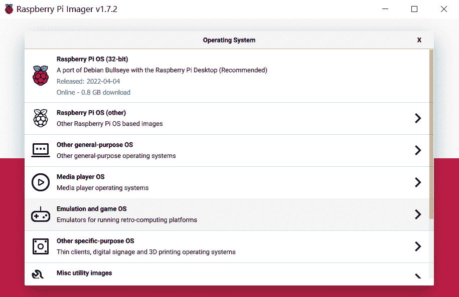
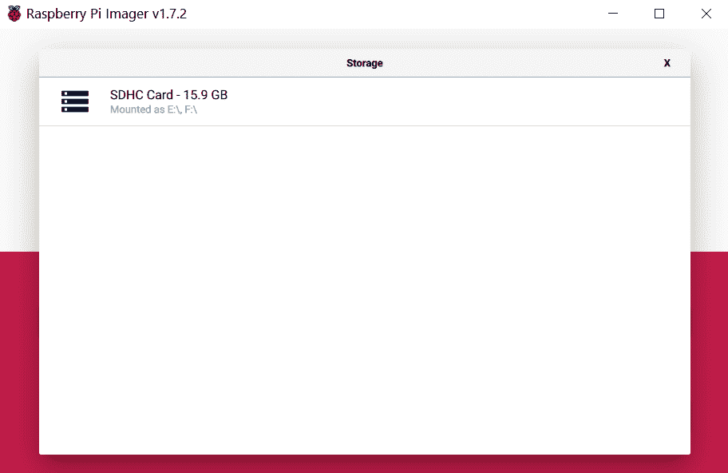
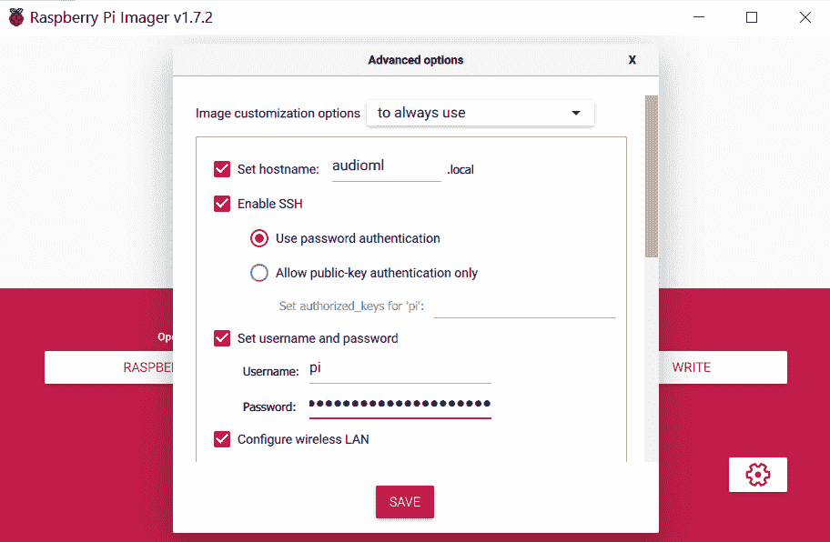
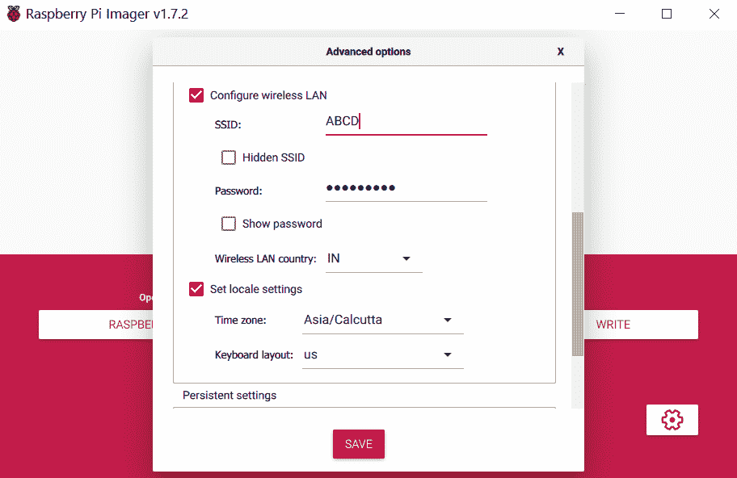

# 第十八章：B

# Raspberry Pi 设置


本附录介绍如何设置 Raspberry Pi，以便你可以使用它进行第十三章、第十四章和第十五章中的项目。这些项目适用于 Raspberry Pi 3 Model B+ 或 Raspberry Pi 4 Model B，两个型号的设置方法相同。除了主板，你还需要一个兼容的电源和一张容量为 16GB 或更大的 micro SD 卡。

## 设置软件

有几种方式可以设置你的 Pi。这些步骤概述了最简单的方法之一，使用 Raspberry Pi Imager：

1.  1\. 从 Raspberry Pi 网站下载 Raspberry Pi Imager：[`www.raspberrypi.com/software`](https://www.raspberrypi.com/software/)。

1.  2\. 将 SD 卡插入计算机。（根据你的系统，可能需要一个 micro SD 卡适配器。）

1.  3\. 打开 Pi Imager 并点击**选择操作系统**按钮。图 B-1 显示了相应的对话框。

    

    图 B-1：Raspberry Pi Imager 中的选择操作系统对话框

1.  4\. 点击**Raspberry Pi OS**选项。

1.  5\. 点击**选择存储**按钮。你应该会看到类似图 B-2 的屏幕。

    

    图 B-2：Raspberry Pi Imager 中的选择存储对话框

1.  6\. 屏幕应该列出你的 SD 卡。点击它。

1.  7\. 点击齿轮图标以打开高级选项对话框，如图 B-3 所示。

    

    图 B-3：Raspberry Pi Imager 中的高级选项对话框

1.  8\. 在设置主机名框中输入你的 Pi 的名称。我在图 B-3 中将名称设置为`audioml`。由于 Raspberry Pi OS 默认启用了名为 Avahi 的服务，你可以通过在设备名称后面添加 `.local` 来通过本地网络访问你的 Pi——例如，`audioml.local`。这比记住并使用 IP 地址方便得多。

1.  9\. 在同一个对话框中，设置你的用户名和密码，并启用 SSH。然后滚动下方，查看 Wi-Fi 连接选项，如图 B-4 所示。

    

    图 B-4：Raspberry Pi Imager 中的 Wi-Fi 详情

1.  10\. 输入你的 Wi-Fi 详情，类似于图 B-4 所示。完成后，点击**保存**，然后点击**写入**按钮将所有这些信息写入 SD 卡。

1.  11\. 当 SD 卡准备好后，将其插入 Pi 中。然后启动你的 Pi，它会自动连接到你的 Wi-Fi 网络。

现在你应该能够通过 SSH 安全外壳远程登录到你的 Pi，稍后我们将讨论这一点。

## 测试你的连接

要检查你的 Pi 是否已连接到本地网络，可以在计算机的命令行中输入 `ping`，后跟你 Pi 的设备名称。例如，以下是在 Windows 命令行中执行 `ping` 命令时的输出：

```py
$ `ping audioml.local`
Pinging audioml.local [fe80::e3e0:1223:9b20:2d6f%6] with 32 bytes of data:
Reply from fe80::e3e0:1223:9b20:2d6f%6: time=66ms
Reply from fe80::e3e0:1223:9b20:2d6f%6: time=3ms
Reply from fe80::e3e0:1223:9b20:2d6f%6: time=2ms
Reply from fe80::e3e0:1223:9b20:2d6f%6: time=3ms
Ping statistics for fe80::e3e0:1223:9b20:2d6f%6:
    Packets: Sent = 4, Received = 4, Lost = 0 (0% loss),
Approximate round trip times in milli-seconds:
    Minimum = 2ms, Maximum = 66ms, Average = 18ms

```

这个 `ping` 输出显示了发送的字节数以及接收回复所需的时间。如果你看到 `Request timeout...` 消息，那说明你的 Pi 没有连接到网络。在这种情况下，可以尝试在网上查找故障排除策略。例如，在 Windows 计算机上，你可以尝试以管理员身份打开命令提示符并输入 `arp -d` 命令。这会清除 ARP 缓存。（ARP 是一种用于检测网络上其他计算机的协议。）然后再试一次 `ping` 命令。如果仍然失败，最好连接一个显示器和键盘到你的 Pi，以检查它是否真的能连接到互联网。

## 通过 SSH 登录到你的 Pi

你可以将键盘、鼠标和显示器连接到 Pi 上直接使用，但为了本书的目的，最方便的方式是通过 SSH 从桌面或笔记本电脑远程登录到你的 Pi。如果你经常这么做，并且每次都从同一台计算机登录，你可能会觉得每次都输入密码非常麻烦。使用 SSH 自带的 `ssh-keygen` 工具，你可以设置一个公钥/私钥方案，这样就可以安全地登录到 Pi，而无需输入密码。对于 macOS 和 Linux 用户，按照以下步骤操作。（对于 Windows 用户，PuTTY 也能做类似的操作。搜索“使用 PuTTY 生成 SSH 密钥”了解更多信息。）

1.  1\. 在你的计算机的终端中，输入以下命令以生成密钥文件：

```py
$ `ssh-keygen`
Generating public/private rsa key pair.
Enter file in which to save the key (/Users/`xxx`/.ssh/id_rsa):
Enter passphrase (empty for no passphrase):
Enter same passphrase again:
Your identification has been saved in /Users/`xxx`/.ssh/id_rsa.
Your public key has been saved in /Users/`xxx`/.ssh/id_rsa.pub.
The key fingerprint is:
--`snip`--

```

1.  2\. 将密钥文件复制到 Pi 上。你可以使用 `scp` 命令，这是 SSH 的一部分。输入以下命令，并适当替换 Pi 的 IP 地址：

```py
$ `scp ~/.ssh/id_rsa.pub pi@``192.168.4.32``:.ssh/`
The authenticity of host '192.168.4.32 (192.168.4.32)' can't
be established.
RSA key fingerprint is f1:ab:07:e7:dc:2e:f1:37:1b:6f:9b:66:85:2a:33:a7.
Are you sure you want to continue connecting (yes/no)? `yes`
Warning: Permanently added '192.168.4.32' (RSA) to the list of
known hosts.
pi@192.168.4.32's password:
id_rsa.pub                                   100%  398     0.4KB/s   00:00

```

1.  3\. 登录到 Pi 并验证密钥文件是否已被复制，同样替换为你 Pi 的 IP 地址：

```py
$ `ssh pi@``192.168.4.32`
pi@192.168.4.32's password:
$ `cd .ssh`
$ `ls`
id_rsa.pub  known_hosts
$ `cat id_rsa.pub >> authorized_keys`
$ `ls`
authorized_keys  id_rsa.pub  known_hosts
$ `logout`

```

下次登录到 Pi 时，你将不再需要输入密码。另外，请注意，在这个例子中，我在 `ssh-keygen` 中使用了一个空的密码短语，这并不安全。这个设置对于那些不太关心安全的 Raspberry Pi 硬件项目来说可能是可以接受的，但你可能会考虑使用密码短语。

## 安装 Python 模块

在第十三章、第十四章和第十五章中的大部分 Python 模块已经包含在 Raspberry Pi 安装中。对于其余的模块，在通过 SSH 连接到你的 Pi 后，依次运行以下命令进行安装：

```py
$ `sudo pip3 install bottle`
$ `sudo apt install python3-matplotlib`
$ `sudo apt-get install python3-scipy`
$ `sudo apt-get install python3-pyaudio`
$ `sudo pip3 install tflite-runtime`

```

这应该能帮助你开始书中所有使用树莓派的项目。

## 使用 Visual Studio Code 远程工作

一旦你获得了对 Pi 的 SSH 访问权限，你可以在计算机上编辑源代码并通过 `scp` 命令将其传输到 Pi，但这很快会变得繁琐。其实有更好的方法。Visual Studio Code（VS Code）是微软出品的一个流行代码编辑器。这个软件支持大量的插件或扩展，以增强其功能。其中之一是 Visual Studio Code Remote - SSH 扩展，它可以让你连接到 Pi 并直接从计算机上编辑文件。你可以在 [`code.visualstudio.com/docs/remote/ssh`](https://code.visualstudio.com/docs/remote/ssh) 找到该扩展的安装详情。
