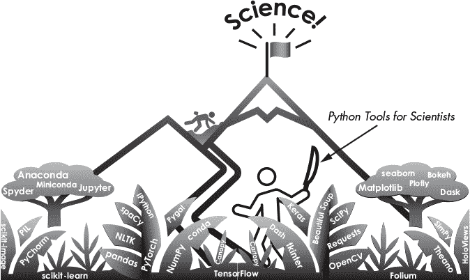
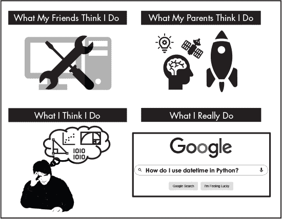
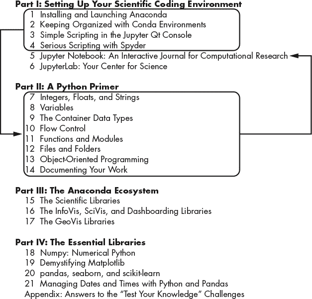

## 序言

本书面向那些希望在工作中使用 Python 编程语言的科学家和初学者。它讲解了 Python 的基础，并展示了访问 Python 科学库宇宙的最简单、最流行的方法，介绍了记录工作的首选方式，以及如何保持各种项目的独立性和安全性。

作为一种成熟、开源且易于学习的语言，Python 拥有庞大的用户基础和一个热情的社区，愿意帮助您发展技能。这个用户基础为科学事业（如数据科学、机器学习、语言处理、机器人技术、计算机视觉等）贡献了丰富的工具和支持库（预编译程序集合）。因此，Python 已成为学术界和工业界最重要的科学计算语言之一。

然而，流行度带来了代价。Python 生态系统正变成一片难以穿透的丛林。事实上，本书源自与企业界科学同事的对话。他们刚接触 Python，感到沮丧、压力山大，并且深受*分析瘫痪*的困扰。在每一个转折点，他们都觉得必须做出关键而困难的决策，比如选择哪个库来绘制图表，选择哪个文本编辑器来编写程序。他们没有时间或兴趣去学习多个工具，因此他们希望选择对未来影响最小的选项。

本书旨在解决这些问题。其目标是帮助您尽快且无痛地开始科学计算。可以把它看作是通过 Python 的发行版、工具和库的密林开路的砍刀（图 1）。

*图 1：在 Python 丛林中开路*

为了实现这一目标，我将帮助您做出一些决策。由于每个人的需求都是独特的，这些决策不一定是完美的，但它们应该代表明智的、不会后悔的选择，为您在积累更多经验后自定义设置打下基础。

首先，您将使用免费的*Anaconda 发行版*的 Python。作为最受欢迎的 Python 发行平台，它在全球拥有超过 3000 万用户。由 Anaconda 公司提供（*[`www.anaconda.com/`](https://www.anaconda.com/)*），它是 Python 数据科学的首选平台。Anaconda 将使安装 Python、设置计算环境，并保持其有序和及时更新变得简单。

请注意，本书是为那些编写个人使用或团队使用脚本的科学家而设计的。它不针对专业的软件开发人员或从事*企业*软件开发的工程师。此外，本书仅涉及免费和开源软件。您的工作场所可能使用的专有或商业库可能会取代这里列出的库。

最后，这本书不会教你如何*做*科学、如何进行数据分析，或者你的工作内容。它不会教你如何使用操作系统，也不会提供每个重要科学库的详细使用说明。每个领域都需要大量的专门书籍，你可以在书店或在线找到这些资源。相反，本书将介绍一些适用于广泛科学领域的基本工具和库，帮助你安装它们，并帮助你开始使用它们。希望它能减少你在为科学设置和使用 Python 时的压力。

### **为什么选择 Python？**

因为你正在阅读这本书，你可能已经决定使用 Python 了。然而，如果你还在考虑中，我们来看看一些选择 Python 进行科学编程的理由。否则，欢迎直接跳到下一节“阅读本书指南”，请参考第 xxvii 页。

Python 的设计理念强调简洁性、可读性和灵活性。这些优先事项使得它在研究和科学工作中的各个阶段都很有用，包括一般计算、实验设计、设备接口构建、连接和控制多个硬件/软件工具、重型数字运算以及数据分析和可视化。让我们来看看 Python 的一些关键特点，以及它们为何是科学领域的重要卖点：

**免费和开源：** Python 是*开源*的，这意味着原始源代码是自由提供的，任何人都可以重新分发和修改它。它由一支志愿者团队不断开发，并由非营利的 Python 软件基金会管理（*[www.python.org/](http://www.python.org/)*）。开源软件的一个强大优点是它被*强化*过；也就是说，它被大量活跃的用户群体修复了漏洞和其他问题。此外，这些用户通常会发布并分享他们的代码，以便整个社区可以获得最新的技术。不过，开源软件也有缺点，它可能更容易受到恶意用户的攻击，使用起来不如商业软件友好，而且文档和支持可能不如商业替代品完善。

**高级语言：** Python 是一种*高级*编程语言。这意味着计算系统中的重要部分，如内存管理，已经自动化并对用户隐藏。因此，Python 的语法非常易于人类阅读，使其容易学习和使用。

**解释型：** Python 是一种*解释型*语言，这意味着它会立即执行指令——类似于在电子表格中应用计算——无需编译代码。这为你提供即时反馈，使 Python 高度互动，并帮助你在错误发生时立即捕捉到。然而，与像 Java 和 C++这样的编译型语言相比，它确实会使语言的执行速度变慢。

**平台中立：** Python 可以在 Windows、macOS 和 Linux/Unix 上运行，并且有适用于 Android 和 iOS 的应用程序。

**广泛的支持和共享学习：** 数百万开发者为 Python 提供了强大的支持系统。得益于这个庞大的社区，所有主要的 Python 产品都包括在线文档，你可以通过免费和付费的在线支持网站和教程轻松找到帮助和指导。同样，近年来与 Python 相关的印刷和电子书数量激增，涵盖了从初学者到高级用户的广泛主题。

Python 的帮助性用户群体非常重要，因为编程的关键不在于记住所有命令，而在于 *理解你想做什么*。你会在在线搜索引擎上花费和在 Python 上花费同样多的时间，知道如何构造一个 *任务特定* 的问题（例如“如何在 OpenCV 中将文本添加到图像上？”）将成为一项必备技能（图 2）。

*图 2：程序员的秘密生活*

更受欢迎的支持网站之一是 Stack Overflow (*[`stackoverflow.com/`](https://stackoverflow.com/)*)。在许多情况下，你会发现你的问题已经得到了回答。如果没有，记得先参加导览 (*[`stackoverflow.com/tour/`](https://stackoverflow.com/tour/)*)，并访问 *提问* 部分 (*[`stackoverflow.com/help/asking/`](https://stackoverflow.com/help/asking/)*)，了解发布问题的正确方式。

你还可以找到专门为特定学科使用 Python 的网站。例如，*天文学家实用 Python* (*[`python4astronomers.github.io/`](https://python4astronomers.github.io/)*) 是一个对天文学家有用的网站，而 *Analytics Vidhya* (*[`www.analyticsvidhya.com/`](https://www.analyticsvidhya.com/)*) 则是为数据科学家设计的。

**附带电池：** Python 的座右铭是“附带电池”，意味着它提供了所有实现完全可用性所需的部分。除了一个包含有用工具的大型 *标准库*，Python 还可以轻松地从各种第三方库中进行升级。这些库是由某一领域的专家编写并测试的 Python 程序，你可以将它们应用到自己的工作中。一些例子包括用于处理图像和视频数据的 OpenCV，机器学习项目中的 TensorFlow，以及用于生成图表和图形的 Matplotlib。这些库将大大减少你编写代码的量，从而进行实验、分析和可视化数据、设计仿真，并完成项目。

**可扩展性：** Python 可以轻松处理科学和工程中常用的大型数据集。你主要的限制因素将是计算机的处理速度和内存。相比之下，Microsoft Excel 电子表格在处理仅数万条数据时就会出现速度和稳定性问题。随着电子表格数量的增加，复杂的 Excel 项目变得非常脆弱，导致错误难以识别、查找和修复。

Python 支持过程式编程和面向对象编程，可以帮助你编写清晰、逻辑的代码，适用于小型和大型项目。Python 还会在错误发生时立即捕捉到这些错误。

**灵活性：** Python 能够处理多种数据格式，并且能够运行科学实验和数据采集所需的仪器和传感器。作为一种“胶水”语言，它容易与 C、C++和 FORTRAN 等低级语言进行集成，并且对于连接多个脚本或系统（包括数据库和 Web 服务）也非常有用。大量的第三方库使得 Python 能够扩展到许多任务。

### **本书导航**

本书设计面向真正的初学者，也适合那些熟悉 Python，但对 Anaconda 或一些常用的科学库不熟悉的人。它的目标是提供“一站式购物”，帮助你掌握足够的知识，以便开始使用数据并编写自己的程序。

真正的初学者如果希望快速入门 Python，应该首先阅读图 3 框中所示的章节，然后返回第一部分，完成第五章和第六章。

*图 3：学习 Python 的快速通道*

更有经验的用户可能希望跳过某些部分（例如，省略 Python 入门）。考虑到这一点，这里有一本书内容的简短概述。

#### ***第一部分：设置你的科学编码环境***

第一部分提供了如何安装、启动和使用 Anaconda 的说明，并介绍了如何使用 conda 包管理器，这是一个在 Windows、macOS 和 Linux 上运行的开源包和环境管理系统。此外，你将了解 Shell、解释器、文本编辑器、笔记本和集成开发环境（IDE）的世界，包括何时以及为什么需要它们。第一部分包括以下章节：

**第一章，安装和启动 Anaconda:** 如何在 Windows、macOS 和 Linux 上安装 Anaconda，然后带你浏览 Anaconda Navigator 图形用户界面（GUI）和替代的基于终端的命令提示符。

**第二章，使用 Conda 环境保持组织性：** 介绍了虚拟环境的概念，它们让你能够隔离项目并使用不同版本的 Python 及其科学库。你将设置你的第一个*conda 环境*，这是一个包含特定版本 Python 的目录，你将安装一组特定的 conda 包。这将帮助你保持项目的有序，并防止不同版本的 Python 和/或各种库之间的冲突。

**第三章，在 Jupyter Qt 控制台中进行简单脚本编写：** 介绍了*Jupyter (IPython) Qt 控制台*，这是一个轻量级界面，适用于交互式编码、快速概念测试和数据探索。

**第四章，使用 Spyder 进行严肃的脚本编写：** 介绍了*Spyder*，Anaconda 中包含的*科学 Python 开发环境*。Spyder 是由科学家、工程师和数据分析师设计的，提供了一个全面开发工具的高级编辑、分析、调试和性能分析功能，以及一个科学应用程序的数据探索、交互式执行、深度检查和可视化能力。如果你是 Python 的完全新手，可以跳到第二部分，在这里你将使用该工具和 Qt 控制台学习 Python 基础知识。

**第五章，Jupyter Notebook：计算研究的交互式日志：** 介绍了*Jupyter (IPython) Notebook*，一个基于网络的交互式计算平台，结合了实时代码、方程式、描述性文本、交互式可视化和其他类型的媒体。在 Jupyter 中编写的程序可以在本地进行广泛的文档化，并转化为可发布的文章、交互式仪表板和演示质量的幻灯片。

**第六章，JupyterLab：你的科学中心：** 介绍了*JupyterLab*，一个基于 Web 的 Jupyter 笔记本、代码和数据的交互式开发环境。JupyterLab 灵活的界面可以配置以支持数据科学、科学计算和机器学习中的各种工作流。事实上，如果你是数据科学家，你可能会在这里度过你大部分的科学计算“时光”。

#### ***第二部分：Python 入门***

第二部分是对 Python 编程语言的简要介绍。如果你已经熟悉基础内容，可以跳过这一部分，仅在需要时作为参考。第二部分包括以下章节：

**第七章，整数、浮点数和字符串：** 介绍了 Python 的一些基本数据类型、运算符和错误信息。

**第八章，变量：** 介绍了变量和变量命名约定。

**第九章，容器数据类型：** 介绍了 Python 的元组、列表、集合和字典数据类型。

**第十章，流程控制:** 介绍了流程控制语句、行结构以及处理异常（错误）的方法。

**第十一章，函数与模块:** 介绍了重要的概念，如抽象和封装，用于使程序更易于阅读和维护。

**第十二章，文件与文件夹:** 介绍了用于处理文件、文件夹和目录路径的模块和函数。

**第十三章，面向对象编程:** 介绍了面向对象编程（OOP）的基础知识，OOP 有助于使程序更容易维护和更新。

**第十四章，文档化你的工作:** 介绍了代码文档化的最佳实践。

#### ***第三部分：Anaconda 生态系统***

第三部分介绍了 Anaconda Python 生态系统，并包括对许多重要科学和可视化库的高层次总结，如 NumPy、pandas 和 Matplotlib，以及如何在众多选项中进行选择。第三部分包括以下章节：

**第十五章，科学库:** 概述了按功能分组的核心科学库，如数据分析、机器学习、语言处理、计算机视觉、深度学习等。提供了在多个竞争库中进行选择的指南，并讨论了处理非常大数据集的方法和库。

**第十六章，信息可视化、科学可视化与仪表盘库:** 概述了用于绘制统计数据和三维数据以及生成仪表盘的最重要库。提供了在多个竞争库中进行选择的指南。

**第十七章，GeoVis 库:** 概述了用于绘制地理空间数据的最重要库。提供了在多个竞争库中进行选择的指南。

#### ***第四部分：基础库***

第四部分将介绍如何使用 NumPy、Matplotlib 和 pandas——Python 科学库的“三大主力”。这些库是非常重要且广泛使用的，许多其他库都是基于它们构建的。第四部分包括以下章节：

**第十八章，NumPy：数值 Python:** 介绍了*NumPy*，这是 Python 中用于数学计算的模块。许多有用的科学库，如 pandas 和 Matplotlib，都是基于 NumPy 构建的。本节将介绍一些关键概念和基础功能。

**第十九章，解密 Matplotlib:** 介绍了 Matplotlib 的基础知识，Matplotlib 是 Python 中绘图的祖宗，包括一些更为混乱的方面。

**第二十章，pandas，seaborn 和 scikit-learn：** 介绍了 *pandas*，这是一个为数据加载、处理和分析而设计的 Python 库。它提供了用于处理数值表格和时间序列的各种数据结构和操作，并包括数据可视化功能。本章围绕一个机器学习分类问题展开，问题中还涉及 seaborn（用于简化 Matplotlib 绘图）和 scikit-learn（用于构建预测模型）。

**第二十一章，使用 Python 和 Pandas 管理日期和时间：** 介绍了在原生 Python 和 pandas 中处理日期和时间的方法。

#### ***附录***

附录提供了全书“测试你的知识”挑战的答案。

### **更新与勘误**

本书可能会有多个印刷版本，您可以在 *[`www.nostarch.com/python-tools-scientists`](https://www.nostarch.com/python-tools-scientists)* 上查看任何更新或修正。如果您发现任何拼写错误或其他问题，请通过 *errata@nostarch.com* 报告给我们。请确保提供书名和受影响的页码（电子书读者应注明章节和小节）。

由于 Python、Anaconda 和科学库不断发展，我会在适当的地方提供它们的官方网站链接，以便您随时获得关于这些产品的最新信息。

### **留下评论**

如果您觉得本书有帮助，请花时间留下在线评论，即使只是简单的星级评分。您的公正意见将帮助其他用户在越来越拥挤的 Python 编程书籍市场中做出选择。
